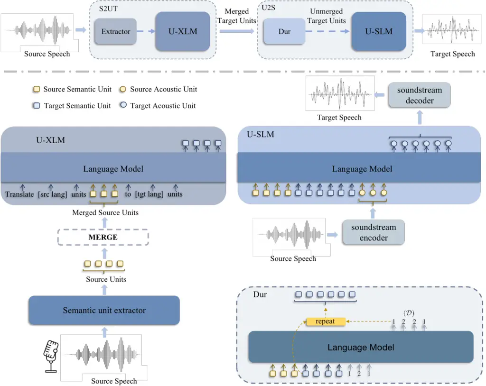

# PolyVoice: Language Models for Speech to Speech Translation

Qianqian Dong , Zhiying Huang^(∗), Qiao Tian, Chen Xu, Tom Ko, Yunlong
Zhao, Siyuan Feng, Tang Li, Kexin Wang ^(†)^(†)thanks: ˜˜Equal
contribution. Working in progress. Affiliation: Xuxin Cheng, Fengpeng
Yue, Ye Bai, Xi Chen, Lu Lu, Zejun Ma, Yuping Wang, Mingxuan Wang,
Yuxuan Wang Affiliation: ByteDance Affiliation: {dongqianqian,
huangzhiying.92}@bytedance.com

###### Abstract

We propose PolyVoice, a language model-based framework for
speech-to-speech translation (S2ST) system. Our framework consists of
two language models: a translation language model and a speech synthesis
language model. We use discretized speech units, which are generated in
a fully unsupervised way, and thus our framework can be used for
unwritten languages. For the speech synthesis part, we adopt the
existing VALL-E X approach and build a unit-based audio language model.
This grants our framework the ability to preserve the voice
characteristics and the speaking style of the original speech. We
examine our system on Chinese $`\rightarrow`$ English and English
$`\rightarrow`$ Spanish pairs. Experimental results show that our system
can generate speech with high translation quality and audio quality.
Speech samples are available at
[https://speechtranslation.github.io/polyvoice](https://speechtranslation.github.io/polyvoice).

## 1 Introduction

Speech-to-speech translation (S2ST) is a challenging task as it
encounters all the difficulties of automatic speech recognition (ASR),
machine translation (MT) and text-to-speech (TTS) synthesis. Different
from conventional cascade approach Lavie et al. (1997); Baldridge
(2004); Nakamura et al. (2006), the direct approach Jia et al. (2019);
Jia et al. (2022a) has the advantages of low latency and simplified
pipeline. Existing direct S2ST approaches can be further classified
according to whether the model predicts continuous mel-spectrogram
features Dong et al. (2022) or discrete units Lee et al. (2022).
Unit-based approach has become more popular due to several reasons: (1)
It allows researchers to take advantage of existing NLP modeling
techniques by treating acoustic unit as a new language. (2) It eases the
modeling difficulty of emitting spectrogram. (3) Units can be generated
in a fully unsupervised manner and can cover any unwritten languages.

There are two kinds of commonly used discretized speech unit: semantic
and acoustic units. Semantic units are usually derived from
representations produced by speech encoder models like HuBERT Hsu et al.
(2021), mHuBERT Lee et al. (2021) or w2v-BERT Chung et al. (2021). They
captures the phonetics and semantic content in speech. Although the
making of these units is originally developed to be used as target for
training the speech encoder, recently there are attempts to directly use
these units as input/output for semantic tasks Meng et al. (); Zhang
et al. (). Acoustic units can also be referred as codec units. They are
originally developed to transmit high-quality speech signal under
limited bandwidth. AudioLM Borsos et al. (2022) is a pioneer work in
using language models (LM) for audio generation. They make use of both
kinds of unit and build several LMs with different resolution. VALL-E
Wang et al. (2023) further extends the AudioLM framework and applies it
in TTS. They successfully demonstrate that the in-context learning
capabilities of LM can be similarly replicated in the context of phoneme
and codec units. In contrast to phoneme units which have to involve
supervised training process, both semantic and acoustic units can be
generated in a fully unsupervised manner.

Recently, language modeling has made a lot of breakthroughs in NLP. The
success of GPT models Brown et al. (2020); Ouyang et al. (2022) is
leading the community to a new era. Right now, encoder-decoder models
are still dominant in speech modeling, where LM-based methods have just
begun emerging. Thus, we are motivated to investigate the performance of
LM-based method in S2ST. In this paper, we propose a semantic unit-based
framework for S2ST system. Our framework consists of two LMs: a
translation LM and a speech synthesis LM. The translation LM processes
the semantic units of the source language and translates the sequence
into semantic units of the target language. For the speech synthesis
part, we adopt the VALL-E X approach Zhang et al. (2023) for the voice
clone ability. We concatenate the source and target semantic units, as
well as the source acoustic units, and feed the whole sequence to the
audio LM as a prompt. The audio LM then predicts the target acoustic
units which are converted to a waveform by a unit vocoder. Experimental
results show that our system can generate speech with high translation
quality and audio quality.

We summarise our contribution as follows:

- •
  We propose using a decoder-only model to do the direct translation,
  whereas encoder-decoder model is the dominant structure in previous
  works.
- •
  We build a unit-based audio LM for speech synthesis. Compared to
  VALL-E X, we use unsupervised discretized unit and can cover unwritten
  languages.

The rest of this paper is organized as follows. Section 2 introduces
related works in TTS and S2ST. Details of our method are described in
Section 3. Section 4 introduces our experimental setup. Section 5
presents our ablation study. Finally, we conclude our work in the last
section.

Figure 1: Overview of PolyVoice. The framework consists of two LM-based
components: a S2UT front-end for translation and a U2S back-end for
synthesis.

## 2 Related Work

### 2.1 TTS

In recent years, neural text-to-speech (TTS) synthesis has achieved
significant developments, and the progress of neural network structure
makes continuous improvements in the intelligence of synthetic speech
Wang et al. (2017); Ren et al. (2019); Kim et al. (2021); Popov et al.
(2021). Because of the requirements of real-world applications, the
researchers have attracted a lot of attention to zero-shot multi-speaker
TTS and cross-lingual TTS Jia et al. (2018); Cooper et al. (2020). The
multi-speaker TTS using speaker embedding training on the speaker
verification task can generate a similar timbre for a seen speaker.
However, zero-shot speaker cloning for unseen speakers is still an
unsolved problem. Trained on the large corpus of speech data, VALL-E
Wang et al. (2023) leverages the in-context capability of prefix
language modeling to achieve state-of-the-art $`(`$sota$`)`$ performance
for zero-shot speaker cloning.

Cross-lingual TTS aims to build a system that can synthesize speech in a
specific language not spoken by the target speaker. Different
embeddings, such as speaker embedding, language embedding, and stress
and tone embedding, are utilized in the cross-lingual TTS model to
generate high-quality natural and intelligible native speech for
native/foreign seen/unseen speakers Liu and Mak (2019). Compared with
the fixed speaker embedding extracted from the pretrained speaker
encoder, a multi-task learning framework has been proposed to enhance
cross-lingual speaker similarity by simultaneously training speaker
classification Yang and He (2022). Building upon the prefix language
modeling of VALL-E, VALL-E X Zhang et al. (2023) applies this method to
cross-lingual TTS training with bilingual Chinese-English data. When
presented with source speech, source and target language text prompts,
VALL-E X predicts the codec token of the speech in the target language.
Through the in-context capability, the model aims to retain acoustic
information from the source speech prompt, such as the acoustic
environment, the source language speaker, and their emotion.

### 2.2 S2ST

Speech-to-speech translation Lavie et al. (1997); Baldridge (2004);
Nakamura et al. (2006) aims to develop models capable of generating
target language speech from source language speech. A naïve system
traditionally employs a pipeline Nakamura et al. (2006) that
sequentially processes the input through automatic speech recognition
(ASR) models, machine translation (MT) models, and text-to-speech
synthesis (TTS) models. Recently, end-to-end paradigms Jia et al. (2019)
have gained popularity in the field of S2ST, as they allow for a single
model to perform one or more of the aforementioned tasks, which
consequently reduces error propagation and latency. Among the various
techniques, auxiliary supervision based on textual data has been
particularly effective during training Jia et al. (2019); Kano et al.
(2021). However, this approach is not feasible when dealing with
unwritten languages. To address this challenge, discrete units Hsu
et al. (2021) extracted from the speech are used to replace the target
text, and then can be synthesized into the speech Tjandra et al. (2019);
Zhang et al. (2021); Lee et al. (2022). Large scale studies have shown
the powerful performance in various speech processing tasks Nguyen
et al. (2022).

Current research in speech-to-speech translation primarily emphasizes
translation quality, with notable improvements observed in automatic
evaluation metrics (like BLEU) or human evaluation of naturalness.
However, there remain two persistent challenges in developing practical
systems. First, these systems are predominantly developed and evaluated
on small-scale benchmarks, while real-world scenarios often involve
large quantities of labeled data, including ASR, MT, and S2T data. Even
for low-resource or unwritten languages, leveraging unlabeled speech or
text can provide valuable information Lee et al. (2022). Therefore,
developing a unified model that jointly utilizes various data types is a
critical research goal yet to be achieved. Second, while not a strict
requirement, preserving the source speaker’s style during translation is
an important aspect of improving user experience Zhang et al. (2023).
However, capturing the unique characteristics of individual speakers is
a challenging task. Current approaches, such as speaker embeddings Jia
et al. (2019) and multi-speaker TTS systems Jia et al. (2018), have made
some progress in this direction, but they are still far from for
practical requirements.

For the above considerations, We present PolyVoice, a versatile
framework that can be applied to both written and unwritten language
setups. PolyVoice effectively harnesses diverse data sources within a
language model-based framework and preserves the source speaker’s style
during synthesizing, having the enormous potential in the practical
systems.

## 3 Method

|                                                             |
| ----------------------------------------------------------- |
| ASR: \[lang\]                                               |
|     |
|     |
| MT: \[src lang\] $`\rightarrow`$ \[tgt lang\]               |
|     |
|     |
| S2ST: \[src lang\] $`\rightarrow`$ \[tgt lang\]             |
|     |
|     |

Table 1: Data construction for U-XLM model by various prompts.

We introduce PolyVoice, a novel language model-based framework for
speech-to-speech translation capable of handling both written and
unwritten languages. The proposed framework utilizes discrete units,
obtained through self-supervised training methods like HuBERT Hsu et al.
(2021), as an intermediate representation between source speech and
target speech. It consists of two parts: a speech-to-unit translation
(S2UT) front-end converts the speech in source language into the unit in
target language, and a unit-to-speech (U2S) back-end synthesizes speech
of translation while preserving the source speaker’s style. Figure 1
provides an overview of our approach.

### 3.1 Speech-to-Unit Translation (S2UT)

By employing discrete units obtained through self-supervised training,
semantically irrelevant information from continuous speech
representations is removed, facilitates effective training in an NLP
paradigm. And S2UT utilizes language model to learn the unit-based
cross-lingual generation.

##### Semantic unit extractor

S2UT first process the raw speech by a semantic unit extractor. Here we
adopt HuBERT, which first encodes the speech by a stack of convolutions
and Transformer layers to continuous representations at every 20-ms
frame, and then utilizes k-means clustering to discretize the
representation to a set of cluster indices $`Z={z\_1,\cdots,z\_T}`$.
$`T`$ is the number of frames and $`z\_t\in[K]`$, where $`K`$ is the
number of cluster centroids. Then, we merge the consecutive sequence of
duplicate units to compress the sequence length, which reduces the
computational costs and help convergence.

##### Unit-based cross-lingual language model (U-XLM)

Over the past few years, the encoder-decoder architecture has emerged as
the most prominent paradigm for sequence-to-sequence modeling Sutskever
et al. (2014). However, recent advances in the GPT family Brown et al.
(2020); Ouyang et al. (2022) have demonstrated the powerful capability
of language modeling by the decoder-only architecture. This inspires us
to develop a unit-based cross-lingual model, that predict the semantic
units in target language from the units of source speech by generative
language modeling.

We denote the training sample consisting of units of speech in source
language and target language as \<src_unit, tgt_unit\>. In the
encoder-decoder architecture, the encoder takes the source unit as the
input, and the decoder predict the target units. To enable the
cross-lingual unit generation, one can use simple prompts to construct
the training samples of natural language from unit pairs, such as:
Translate \[src lang\] unit “ {src_unit} ” to \[tgt lang\] unit: “
{tgt_unit} ”.

##### Training

For training the above U-XLM model, the large scale of data is necessary
for competitive performance. The supervised data, cross-lingual unit
pairs, is scarce in real-world scenarios. Although the auxiliary models
can be used to generate the pseudo labels, such as using the TTS model
to synthesize the target speech, the direct training of supervised data
is expected.

To further address the challenge of data scarcity, previous studies
introduce additional loss function into the encoder-decoder architecture
through multitask learning Jia et al. (2022a); Lee et al. (2022). Thanks
to language modeling, we adopt a more simple manner to enable the use of
diverse data sources like ASR and MT data. As shown in Table 1, we
slightly modify the prompts to construct training samples for various
types of data sources, and then train the model by parameter sharing,
simplifying the design of auxiliary objectives. Unlabeled text and
speech can also be used directly in this approach. In this way, the
model implicitly improves the alignment of representation space across
speech unit and text.

U-XLM offers several advantages, including the ability to handle both
written and unwritten language setups, multilingual modeling
capabilities, and the potential for zero-shot prediction by leveraging
large amounts of unlabeled data. These features make U-XLM a promising
framework for advancing speech-to-speech translation research.

### 3.2 Unit-to-speech Synthesis (U2S)

##### Unit-to-speech language model (U-SLM)

As shown in Figure 1, the U-SLM processes the semantic units predicted
by U-XLM and generate the codec units which embed the speaking style of
source speaker. Like VALL-E X, U-SLM includes a autoregressive model and
a non-autoregressive model. Instead of phoneme, discretized semantic
units are used in our case. The unit extractor can be trained in a fully
unsupervised manner, which is suitable for unwritten languages.

##### SoundStream codec

We use SoundStream Zeghidour et al. (2021), a neural audio codec, to
compute the embedding of acoustic tokens. We retrain the SoundStream,
whose residual vector quantizer (RVQ) with a hierarchy of 6 vector
quantizers and a vocabulary of 1024 symbols. In our configure, the
acoustic tokens is produced at 80Hz for input waveforms at 24 kHz. This
is a 24000 / 80 = 300-fold reduction in the sampling rate. After the U2S
model predict the acoustic tokens represented by the SoundStream codec,
the decoder of SoundStream reconstruct them to the waveform.

##### Duration model

We empirically find that duration information of the discretized unit is
very important for the stability of synthesized speech. In our work, we
use a LM to predict the duration.

As shown in Figure 1, the merged source semantic unit sequence, merged
target semantic unit sequence and the source duration value
($`\mathcal{D}`$) sequence are concatenated and fed to the duration LM
as a prompt. Then the duration LM predicts the duration value sequence
and each target semantic unit will repeat itself accordingly.

## 4 Experiments

We evaluate our method on two speech-to-speech benchmark datasets,
EMIME Wester and Liang (2011) and CVSS Jia et al. (2022b). Then, we show
the separate results of two components.

### 4.1 Datasets and Preprocessing

|      |                 |           |
| ---- | --------------- | --------- |
| Type | Dataset         | Size      |
| ASR  | LibriLight (En) | 60K hours |
|      | In-house (Zh)   | 60K hours |
| MT   | In-house        | 44M sents |
| S2S  | GigaSpeech      | 10K hours |
|      | WenetSpeech     | 10K hours |

Table 2: Training data of U-XLM model.

|                                                                     |                  |             |             |                       |                          |
| ------------------------------------------------------------------- | ---------------- | ----------- | ----------- | --------------------- | ------------------------ |
|                                                                     | ASV $`\uparrow`$ |             |             | ASR-BLEU $`\uparrow`$ | Naturalness $`\uparrow`$ |
|                                                                     | tgt vs. src      | hyp vs. src | hyp vs. tgt |                       |                          |
| Cascade (VALL-E X paper)       + w/ oracle target text              | 0.58             | 0.28        | 0.27        | 27.49                 | 3.44                     |
|                                                                     |                  | 0.28        | 0.29        | 80.30                 | 3.43                     |
| VALL-E X (VALL-E X paper)       + w/ oracle target text             |                  | 0.37        | 0.37        | 30.66                 | 3.54                     |
|                                                                     |                  | 0.39        | 0.38        | 86.78                 | 3.54                     |
| S2UT PolyVoice (S2UT + U2S)        + w/ oracle target semantic unit | 0.59             | 0.06        | 0.08        | 29.30                 | 3.35                     |
|                                                                     |                  | 0.38        | 0.38        | 29.40                 | 4.10                     |
|                                                                     |                  | 0.42        | 0.48        | 76.10                 | 3.92                     |

Table 3: S2ST results on Chinese-English EMIME dataset.

#### 4.1.1 S2UT

##### Semantic token

U-XLM is trained by cross-lingual unit data, which is extracted from the
audio by HuBERT Hsu et al. (2021) models. For Chinese audio, we utilize
an open-source model based on WenetSpeech Chinese speech ¹¹ 1
[https://github.com/TencentGameMate/chinese_speech\_  
pretrain](https://github.com/TencentGameMate/chinese_speech_pretrain).
For English and Spanish audio, we use an open-source multilingual model
(English, Spanish and French) ²² 2
[https://github.com/facebookresearch/fairseq/blob/main/  
examples/speech_to_speech/docs/textless_s2st_real_data.md](https://github.com/facebookresearch/fairseq/blob/main/examples/speech_to_speech/docs/textless_s2st_real_data.md).
The cluster centroids of k-mean algorithm for two models are 500 and
1,000, respectively.

##### Vocabulary

To address the out-of-vocabulary problem and enable parameter sharing
across languages, we utilize byte-level subword units ³³ 3
[https://github.com/huggingface/tokenizers](https://github.com/huggingface/tokenizers)
that decompose each character into byte-sized pieces, achieves a
vocabulary size of 56,407 (including 1,500 cluster centroids).

##### Datasets

Considered that the paired speech-to-speech (S2S) data is scarcity, we
synthesize the pseudo data from the ASR data utilizing in-house MT and
TTS systems. In addition, various types of data resources provide better
learning of the U-XLM model, like large-scale ASR and MT data. The
detailed statistics are shown in Table 2.

The S2S data is sourced from WenetSpeech Zhang et al. (2022) and
GigaSpeech Chen et al. (2021). WenetSpeech is a Chinese ASR dataset with
over 10,000 hours of speech data collected from YouTube. And we utilize
a subset of 10,000 hours of GigaSpeech Chen et al. (2021), an English
ASR dataset collected from audiobooks, podcasts, and YouTube.

Then we scale up the training data using specific prompts for various
types of dataset. We utilize the LibriLight Kahn et al. (2020) and the
in-house ASR datasets. LibriLight is an unlabeled English speech dataset
containing about 60,000 hours of speech. Since LibriLight has many long
audios, we segment and recognize the audio based on the method of voice
active detection (VAD) and in-house ASR system, generating the audio
length ranging from 0.5 to 25s, and the average length is 7s. In-house
ASR dataset is a Chinese ASR dataset with 60,000 hours of speech. We
also use the in-house Chinese-English MT dataset consisting of 44M
sentence pairs.

#### 4.1.2 U2S

The U-SLM is trained on the large open-source bilingual speech data,
i.e., WenetSpeech Zhang et al. (2022) and LibriLight Kahn et al. (2020).
The Librilight is handled in the same way as U-XLM. WenetSpeech keeps
the original data length unchanged, the audio length ranges from 0.5 to
20s, and the average length is 2.5s. In addition, we used an additional
250h internal Chinese TTS data and 400h internal English TTS data.

### 4.2 Evaluation

To measure the performance of our system, we evaluate both the
translation quality and the speech quality.

##### Translation Quality

Following the previous setups, we recognize the speech output by an
in-house ASR system to compute BLEU scores (ASR-BLEU) for S2ST results.

##### Speech Quality

The speech quality is evaluated by multiple metrics. The capability of
voice clone is measured by the speaker similarity (ASV-Score), which is
calculated by an ASV model ⁴⁴ 4
[https://github.com/Sanyuan-Chen/UniSpeech/tree/t-sch  
en/asv_eval/downstreams/speaker_verification#example-2](https://github.com/Sanyuan-Chen/UniSpeech/tree/t-schen/asv_eval/downstreams/speaker_verification#example-2)
to determine whether the synthesized speech is from the same speaker as
the ground-truth speech. The naturalness of the speech output is
evaluated by the automatic metric using NISQA ⁵⁵ 5
[https://github.com/gabrielmittag/NISQA](https://github.com/gabrielmittag/NISQA).
And the pronunciation accuracy is evaluated using WER scores (ASR-WER)
with a ASR model based on hubert-large ⁶⁶ 6
[https://huggingface.co/facebook/hubert-large-ls960-ft](https://huggingface.co/facebook/hubert-large-ls960-ft).

### 4.3 Model Settings

[TABLE]

Table 4: Results on the English-Spanish CVSS dataset. We train the model
with paired speech-to-speech datasets expanded from GigaSpeech without
any text information. BLEU means ASR-BLEU, target unit means oracle
Spanish unit.

#### 4.3.1 S2UT

In the S2UT front-end, U-XLM’s model architecture is a unidirectional
Transformer decoder consisting of 48 layers with hidden size 1600,
feed-forward network (FFN) size 6400, and 25 attention heads. The total
parameters are 1.6 B. U-XLM is trained on 8/32 NVIDIA TESLA A100 80GB
GPUs with a batch size of 3072 tokens per GPU for 500k steps.

#### 4.3.2 U2S

In the U2S back-end, the U-SLM consists of 12 transformer layers. Each
of these layers comprises 16 attention heads, an attention dimension of
1024, and an FFN dimension of 4096 in both the autoregressive (AR) model
and non-autoregressive (NAR) model. We train the models using 8 NVIDIA
TESLA A100 80GB GPUs, with a batch size of 8 utterances per GPU for 800k
steps. Training for all steps takes about 5 days.

### 4.4 Results and Analysis

#### 4.4.1 S2ST Results

Table 3 summarizes the overall performance of our method for S2ST. We
conduct experiments on the EMIME dataset to enable direct comparisons
with the most similar work VALL-E X. The cascade system treats S2ST as a
pipeline of running an ASR model, an MT model, and a multi-speaker
YourTTS model sequentially. During the synthesis process, speaker
information is integrated using speaker embeddings.

We first evaluate the capability to preserve the voice of the source
speaker in the output speech, using the ASV score. We calculate speaker
similarity between the source speech, target speech, and synthesized
speech. We run the U-XLM alone, where speech is synthesized by a
Unit-based vocoder⁷⁷ 7
[https://github.com/facebookresearch/fairseq/blob/main/  
examples/speech_to_speech/docs/textless_s2st_real_data.md](https://github.com/facebookresearch/fairseq/blob/main/examples/speech_to_speech/docs/textless_s2st_real_data.md).
Due to the lack of explicit modeling of speaker characteristics, it
produces particularly low ASV scores. Both the VALL-E X and PolyVoice
systems, which adopt in-context learning, show superior performance over
the speaker embedding. Notably, our method demonstrates better voice
cloning capabilities when ground-truth target information was available.

PolyVoice achieves a slight degraded translation quality (ASR-BLEU) but
a remarkable improvement in speech quality (naturalness) compared with
VALL-E X. When taking the ground-truth target information as input,
PolyVoice is inferior to VALL-E X with a large gap of about 10 BLEU
points, while the naturalness improves significantly. The semantic units
are extracted from the speech by unsupervised learning, which inevitably
introduces errors. Although units are considered “semantic” tokens, they
still preserve some acoustic information. Therefore, unit-based modeling
leads to better speech quality but worse translation quality. In
contrast, phonemes obtained from the text ensure semantic correctness
but lost the acoustic information. Therefore, we believe that units have
more potential, even if the current performance is slightly degraded.
And future work can focus on enhancing the extraction of semantic
information to improve translation quality.

Interestingly, PolyVoice achieves better naturalness using the predicted
units. We speculate that this is due to the language model’s output
having better fluency. U-XLM learns the speech distribution over the
large scale of unit data, and tends to generate more natural sequences
of units. However, this may interfere with the accuracy of the
translation. We will explore this issue in the future.

#### 4.4.2 Unwritten Language Scenario

We examine our proposed framework in the case where the source is a
written language and the target is a unwritten language. In our setup,
we train and evaluate an English$`\rightarrow`$Spanish S2ST system
without the use of any Spanish text transcript. Table 4 summarizes the
results. The ASR-BLEU (18.3) indicates that the Spanish speech generated
by our system is semantically understandable. This demonstrates the
ability of our S2ST system for the unwritten languages.

## 5 Ablation Study

### 5.1 Decoder-only vs. Encoder-Decoder

|                 |          |
| --------------- | -------- |
| Arch            | ASR-BLEU |
| Encoder-Decoder | 16.8     |
|        + w/ U2S | 18.7     |
| Decoder-only    | 20.7     |
|        + w/ U2S | 22.0     |

Table 5: Performance with different architectures.

|             |                          |                          |                        |                        |                          |
| ----------- | ------------------------ | ------------------------ | ---------------------- | ---------------------- | ------------------------ |
| Task        | S2ST (BLEU $`\uparrow`$) | ASR (CER $`\downarrow`$) | ST (BLEU $`\uparrow`$) | MT (BLEU $`\uparrow`$) | TTS (WER $`\downarrow`$) |
| S2S         | 22.2                     | \-                       | \-                     | \-                     | \-                       |
|       + MTL | 29.4                     | 4.46                     | 30.8                   | 33.81                  | 6.99                     |

Table 6: The performance of multiple tasks on EMIME dataset. Here are
the explanations for each task. S2ST: Chinese speech to English speech;
ASR: Chinese speech to Chinese text; ST: Chinese speech to English text;
MT: Chinese text to English text; TTS: English text to English speech.

|                          |                    |                  |                          |
| ------------------------ | ------------------ | ---------------- | ------------------------ |
| Methods                  | WER $`\downarrow`$ | ASV $`\uparrow`$ | Naturalness $`\uparrow`$ |
| VALL-E X (paper)         | 4.07               | 0.36             | 3.54                     |
| U2S                      | 6.40               | 0.38             | 3.98                     |
|       + w/o semantic2dur | 31.93              | 0.37             | 3.81                     |
|       + w/ mHuBERT_zh_en | 4.76               | 0.37             | 3.81                     |

Table 7: Evaluation of the speech synthesizers.

Empirical studies in the field of natural language processing have
revealed that the full potential of the decoder-only approach can be
realized through the use of large model sizes and expansive datasets. As
pioneers in exploring the application of language models to S2ST, we
present a fair comparison of the two architectures in Table 5.

Two models are trained with same training data. Interestingly, the
decoder-only model yields a remarkable improvement of 3.9 BLEU points
over the encoder-decoder counterpart⁸⁸ 8 We train the encoder-decoder
architecture using the code:
[https://github.com/facebookresearch/fairseq/blob/main/examp  
les/speech_to_speech/docs/direct_s2st_discrete_units.md](https://github.com/facebookresearch/fairseq/blob/main/examples/speech_to_speech/docs/direct_s2st_discrete_units.md)..
When we synthesize the speech by U2S instead of vocoder, the performance
gap is reduced, highlighting the robustness of our U2S back-end.

### 5.2 Multi-task Training

As discussed in Section 3, the language modeling enables the direct
training over the diverse data sources utilizing specific prompts. In
this way, we combine additional large scale ASR and MT data to fully
explore the potential of our method.

As shown in Table 6, U-XLM achieves promising performance for multiple
tasks involved (including S2ST, ASR, ST, MT, and TTS) under the expanded
data setting, which verifies the capability of the general modeling in
the decoder-only architecture. In the traditional paradigm, we need to
design the complex manner to combine multi-task learning, but language
modeling only modify the prompt to construct the training data.

### 5.3 Semantic Unit and Duration Model

Table 7 shows the resynthesis performance of different speech
synthesizers. Our TTS obtains better performance in both ASV and
naturalness. We attribute the increase of WER to the difference in
amount of semantic information carried by phonemes and unsupervised
units. This is consistent with the observation reported in the work of
mHuBERT and AudioLM.

If we remove the duration model from the U2S, the WER increases
dramatically. Our guess is that the unit itself do not contain as many
duration information as the phonemes. Therefore the duration model is
essential when using unsupervised units.

We further train our own multilingual HuBERT model (mHuBERT_zh_en) with
a combination of Chinese and English data. The model size is the same as
the HuBERT-large model in Hsu et al. (2021). We find that the WER
improves when we use the semantic units generated from mHuBERT_zh_en.
Thus, we believe that a larger model may generate better semantic units.
We do not use mHuBERT_zh_en in our S2ST experiment because we need the
mHuBERT in Lee et al. (2021) to run the English-\>Spanish experiment.
The benefit of using mHuBERT_zh_en to the overall S2ST is left for
future work.

## 6 Conclusion and Future Work

In this paper, we propose a semantic unit-based framework for S2ST. Our
framework consists of two LMs: a translation LM (U-XLM) and a speech
synthesis LM (U-SLM). We show that our unit-based S2ST system performs
better than existing systems in terms of ASR-BLEU, ASV and naturalness.
Furthermore, we demonstrate the system ability in unwritten language
scenario without any use of the Spanish text transcript. As our system
performance is highly related to the quality of the semantic units,
future work will investigate the way to generate a better set of
discrete units. Also, we plan to investigate how the performance can be
further improved by using much larger model.

## References

- Baldridge (2004) Jason Baldridge. 2004. [_Verbmobil: Foundations of
  Speech-to-Speech Translation_, by wolfgang wahlster (editor).
  springer, 2000. ISBN 3-540-67783-6. price £44.50 (hardback). xii+679
  pages](https://doi.org/10.1017/S1351324904233435). _Nat. Lang. Eng._,
  10(2):200–204.
- Borsos et al. (2022) Zalán Borsos, Raphaël Marinier, Damien Vincent,
  Eugene Kharitonov, Olivier Pietquin, Matt Sharifi, Olivier Teboul,
  David Grangier, Marco Tagliasacchi, and Neil Zeghidour. 2022. Audiolm:
  a language modeling approach to audio generation. _arXiv preprint
  arXiv:2209.03143_.
- Brown et al. (2020) Tom Brown, Benjamin Mann, Nick Ryder, Melanie
  Subbiah, Jared D Kaplan, Prafulla Dhariwal, Arvind Neelakantan, Pranav
  Shyam, Girish Sastry, Amanda Askell, et al. 2020. Language models are
  few-shot learners. _Advances in neural information processing
  systems_, 33:1877–1901.
- Chen et al. (2021) Guoguo Chen, Shuzhou Chai, Guan-Bo Wang, Jiayu Du,
  Wei-Qiang Zhang, Chao Weng, Dan Su, Daniel Povey, Jan Trmal, Junbo
  Zhang, Mingjie Jin, Sanjeev Khudanpur, Shinji Watanabe, Shuaijiang
  Zhao, Wei Zou, Xiangang Li, Xuchen Yao, Yongqing Wang, Zhao You, and
  Zhiyong Yan. 2021. [Gigaspeech: An evolving, multi-domain ASR corpus
  with 10, 000 hours of transcribed
  audio](https://doi.org/10.21437/Interspeech.2021-1965). In
  _Interspeech 2021, 22nd Annual Conference of the International Speech
  Communication Association, Brno, Czechia, 30 August - 3 September
  2021_, pages 3670–3674. ISCA.
- Chung et al. (2021) Yu-An Chung, Yu Zhang, Wei Han, Chung-Cheng Chiu,
  James Qin, Ruoming Pang, and Yonghui Wu. 2021. W2v-bert: Combining
  contrastive learning and masked language modeling for self-supervised
  speech pre-training. In _2021 IEEE Automatic Speech Recognition and
  Understanding Workshop (ASRU)_, pages 244–250. IEEE.
- Cooper et al. (2020) Erica Cooper, Cheng-I Lai, Yusuke Yasuda, Fuming
  Fang, Xin Wang, Nanxin Chen, and Junichi Yamagishi. 2020. Zero-shot
  multi-speaker text-to-speech with state-of-the-art neural speaker
  embeddings. In _ICASSP 2020-2020 IEEE International Conference on
  Acoustics, Speech and Signal Processing (ICASSP)_, pages 6184–6188.
  IEEE.
- Dong et al. (2022) Qianqian Dong, Fengpeng Yue, Tom Ko, Mingxuan Wang,
  Qibing Bai, and Yu Zhang. 2022. Leveraging pseudo-labeled data to
  improve direct speech-to-speech translation.
- Hsu et al. (2021) Wei-Ning Hsu, Benjamin Bolte, Yao-Hung Hubert Tsai,
  Kushal Lakhotia, Ruslan Salakhutdinov, and Abdelrahman Mohamed. 2021.
  Hubert: Self-supervised speech representation learning by masked
  prediction of hidden units. _IEEE/ACM Transactions on Audio, Speech,
  and Language Processing_, 29:3451–3460.
- Jia et al. (2022a) Ye Jia, Michelle Tadmor Ramanovich, Tal Remez, and
  Roi Pomerantz. 2022a. Translatotron 2: High-quality direct
  speech-to-speech translation with voice preservation. In
  _International Conference on Machine Learning_, pages 10120–10134.
  PMLR.
- Jia et al. (2022b) Ye Jia, Michelle Tadmor Ramanovich, Quan Wang, and
  Heiga Zen. 2022b. Cvss corpus and massively multilingual
  speech-to-speech translation. _arXiv preprint arXiv:2201.03713_.
- Jia et al. (2019) Ye Jia, Ron J. Weiss, Fadi Biadsy, Wolfgang
  Macherey, Melvin Johnson, Zhifeng Chen, and Yonghui Wu. 2019. [Direct
  speech-to-speech translation with a sequence-to-sequence
  model](https://doi.org/10.21437/Interspeech.2019-1951). In
  _Interspeech 2019, 20th Annual Conference of the International Speech
  Communication Association, Graz, Austria, 15-19 September 2019_, pages
  1123–1127. ISCA.
- Jia et al. (2018) Ye Jia, Yu Zhang, Ron Weiss, Quan Wang, Jonathan
  Shen, Fei Ren, Patrick Nguyen, Ruoming Pang, Ignacio Lopez Moreno,
  Yonghui Wu, et al. 2018. Transfer learning from speaker verification
  to multispeaker text-to-speech synthesis. _Advances in neural
  information processing systems_, 31.
- Kahn et al. (2020) Jacob Kahn, Morgane Rivière, Weiyi Zheng, Evgeny
  Kharitonov, Qiantong Xu, Pierre-Emmanuel Mazaré, Julien Karadayi,
  Vitaliy Liptchinsky, Ronan Collobert, Christian Fuegen, Tatiana
  Likhomanenko, Gabriel Synnaeve, Armand Joulin, Abdelrahman Mohamed,
  and Emmanuel Dupoux. 2020. [Libri-light: A benchmark for ASR with
  limited or no
  supervision](https://doi.org/10.1109/ICASSP40776.2020.9052942). In
  _2020 IEEE International Conference on Acoustics, Speech and Signal
  Processing, ICASSP 2020, Barcelona, Spain, May 4-8, 2020_, pages
  7669–7673. IEEE.
- Kano et al. (2021) Takatomo Kano, Sakriani Sakti, and Satoshi
  Nakamura. 2021. [Transformer-based direct speech-to-speech translation
  with transcoder](https://doi.org/10.1109/SLT48900.2021.9383496). In
  _IEEE Spoken Language Technology Workshop, SLT 2021, Shenzhen, China,
  January 19-22, 2021_, pages 958–965. IEEE.
- Kim et al. (2021) Jaehyeon Kim, Jungil Kong, and Juhee Son. 2021.
  Conditional variational autoencoder with adversarial learning for
  end-to-end text-to-speech. In _International Conference on Machine
  Learning_, pages 5530–5540. PMLR.
- Lavie et al. (1997) Alon Lavie, Alex Waibel, Lori S. Levin, Michael
  Finke, Donna Gates, Marsal Gavaldà, Torsten Zeppenfeld, and Puming
  Zhan. 1997. [Janus-iii: speech-to-speech translation in multiple
  languages](https://doi.org/10.1109/ICASSP.1997.599557). In _1997 IEEE
  International Conference on Acoustics, Speech, and Signal Processing,
  ICASSP ’97, Munich, Germany, April 21-24, 1997_, pages 99–102. IEEE
  Computer Society.
- Lee et al. (2022) Ann Lee, Peng-Jen Chen, Changhan Wang, Jiatao Gu,
  Sravya Popuri, Xutai Ma, Adam Polyak, Yossi Adi, Qing He, Yun Tang,
  Juan Pino, and Wei-Ning Hsu. 2022. [Direct speech-to-speech
  translation with discrete
  units](https://doi.org/10.18653/v1/2022.acl-long.235). In _Proceedings
  of the 60th Annual Meeting of the Association for Computational
  Linguistics (Volume 1: Long Papers), ACL 2022, Dublin, Ireland, May
  22-27, 2022_, pages 3327–3339. Association for Computational
  Linguistics.
- Lee et al. (2021) Ann Lee, Hongyu Gong, Paul-Ambroise Duquenne, Holger
  Schwenk, Peng-Jen Chen, Changhan Wang, Sravya Popuri, Yossi Adi, Juan
  Pino, Jiatao Gu, et al. 2021. Textless speech-to-speech translation on
  real data. _arXiv preprint arXiv:2112.08352_.
- Liu and Mak (2019) Zhaoyu Liu and Brian Mak. 2019. Cross-lingual
  multi-speaker text-to-speech synthesis for voice cloning without using
  parallel corpus for unseen speakers. _arXiv preprint
  arXiv:1911.11601_.
- (20) Chutong Meng, Junyi Ao, Tom Ko, Mingxuan Wang, and Haizhou Li.
  Cobert: Self-supervised speech representation learning through code
  representation learning. In _Interspeech 2023_.
- Nakamura et al. (2006) Satoshi Nakamura, Konstantin Markov, Hiromi
  Nakaiwa, Gen-ichiro Kikui, Hisashi Kawai, Takatoshi Jitsuhiro, Jinsong
  Zhang, Hirofumi Yamamoto, Eiichiro Sumita, and Seiichi Yamamoto. 2006.
  [The ATR multilingual speech-to-speech translation
  system](https://doi.org/10.1109/TSA.2005.860774). _IEEE Trans. Speech
  Audio Process._, 14(2):365–376.
- Nguyen et al. (2022) Tu Anh Nguyen, Benoît Sagot, and Emmanuel
  Dupoux. 2022. [Are discrete units necessary for spoken language
  modeling?](https://doi.org/10.1109/JSTSP.2022.3200909) _IEEE J. Sel.
  Top. Signal Process._, 16(6):1415–1423.
- Ouyang et al. (2022) Long Ouyang, Jeffrey Wu, Xu Jiang, Diogo Almeida,
  Carroll Wainwright, Pamela Mishkin, Chong Zhang, Sandhini Agarwal,
  Katarina Slama, Alex Ray, et al. 2022. Training language models to
  follow instructions with human feedback. _Advances in Neural
  Information Processing Systems_, 35:27730–27744.
- Popov et al. (2021) Vadim Popov, Ivan Vovk, Vladimir Gogoryan, Tasnima
  Sadekova, and Mikhail Kudinov. 2021. Grad-tts: A diffusion
  probabilistic model for text-to-speech. In _International Conference
  on Machine Learning_, pages 8599–8608. PMLR.
- Ren et al. (2019) Yi Ren, Yangjun Ruan, Xu Tan, Tao Qin, Sheng Zhao,
  Zhou Zhao, and Tie-Yan Liu. 2019. Fastspeech: Fast, robust and
  controllable text to speech. _Advances in neural information
  processing systems_, 32.
- Sutskever et al. (2014) Ilya Sutskever, Oriol Vinyals, and Quoc V.
  Le. 2014. [Sequence to sequence learning with neural
  networks](https://proceedings.neurips.cc/paper/2014/hash/a14ac55a4f27472c5d894ec1c3c743d2-Abstract.html).
  In _Advances in Neural Information Processing Systems 27: Annual
  Conference on Neural Information Processing Systems 2014, December
  8-13 2014, Montreal, Quebec, Canada_, pages 3104–3112.
- Tjandra et al. (2019) Andros Tjandra, Sakriani Sakti, and Satoshi
  Nakamura. 2019. [Speech-to-speech translation between untranscribed
  unknown languages](https://doi.org/10.1109/ASRU46091.2019.9003853). In
  _IEEE Automatic Speech Recognition and Understanding Workshop, ASRU
  2019, Singapore, December 14-18, 2019_, pages 593–600. IEEE.
- Wang et al. (2023) Chengyi Wang, Sanyuan Chen, Yu Wu, Ziqiang Zhang,
  Long Zhou, Shujie Liu, Zhuo Chen, Yanqing Liu, Huaming Wang, Jinyu Li,
  et al. 2023. Neural codec language models are zero-shot text to speech
  synthesizers. _arXiv preprint arXiv:2301.02111_.
- Wang et al. (2017) Yuxuan Wang, R.J. Skerry-Ryan, Daisy Stanton,
  Yonghui Wu, Ron J. Weiss, Navdeep Jaitly, Zongheng Yang, Ying Xiao,
  Zhifeng Chen, Samy Bengio, Quoc Le, Yannis Agiomyrgiannakis, Rob
  Clark, and Rif A. Saurous. 2017. [Tacotron: Towards End-to-End Speech
  Synthesis](https://doi.org/10.21437/Interspeech.2017-1452). In _Proc.
  Interspeech 2017_, pages 4006–4010.
- Wester and Liang (2011) Mirjam Wester and Hui Liang. 2011. The emime
  mandarin bilingual database. Technical report, The University of
  Edinburgh.
- Yang and He (2022) Jingzhou Yang and Lei He. 2022. Cross-lingual
  text-to-speech using multi-task learning and speaker classifier joint
  training. _arXiv preprint arXiv:2201.08124_.
- Zeghidour et al. (2021) Neil Zeghidour, Alejandro Luebs, Ahmed Omran,
  Jan Skoglund, and Marco Tagliasacchi. 2021. Soundstream: An end-to-end
  neural audio codec. _IEEE/ACM Transactions on Audio, Speech, and
  Language Processing_, 30:495–507.
- Zhang et al. (2022) Binbin Zhang, Hang Lv, Pengcheng Guo, Qijie Shao,
  Chao Yang, Lei Xie, Xin Xu, Hui Bu, Xiaoyu Chen, Chenchen Zeng, Di Wu,
  and Zhendong Peng. 2022. [WENETSPEECH: A 10000+ hours multi-domain
  mandarin corpus for speech
  recognition](https://doi.org/10.1109/ICASSP43922.2022.9746682). In
  _IEEE International Conference on Acoustics, Speech and Signal
  Processing, ICASSP 2022, Virtual and Singapore, 23-27 May 2022_, pages
  6182–6186. IEEE.
- Zhang et al. (2021) Chen Zhang, Xu Tan, Yi Ren, Tao Qin, Kejun Zhang,
  and Tie-Yan Liu. 2021. [Uwspeech: Speech to speech translation for
  unwritten
  languages](https://ojs.aaai.org/index.php/AAAI/article/view/17684). In
  _Thirty-Fifth AAAI Conference on Artificial Intelligence, AAAI 2021,
  Thirty-Third Conference on Innovative Applications of Artificial
  Intelligence, IAAI 2021, The Eleventh Symposium on Educational
  Advances in Artificial Intelligence, EAAI 2021, Virtual Event,
  February 2-9, 2021_, pages 14319–14327. AAAI Press.
- (35) Dong Zhang, Rong Ye, Tom Ko, Wang Mingxuan, and Zhou Yaqian. Dub:
  Discrete unit back-translation for speech translation. In _Findings in
  ACL 2023_.
- Zhang et al. (2023) Ziqiang Zhang, Long Zhou, Chengyi Wang, Sanyuan
  Chen, Yu Wu, Shujie Liu, Zhuo Chen, Yanqing Liu, Huaming Wang, Jinyu
  Li, et al. 2023. Speak foreign languages with your own voice:
  Cross-lingual neural codec language modeling. _arXiv preprint
  arXiv:2303.03926_.
