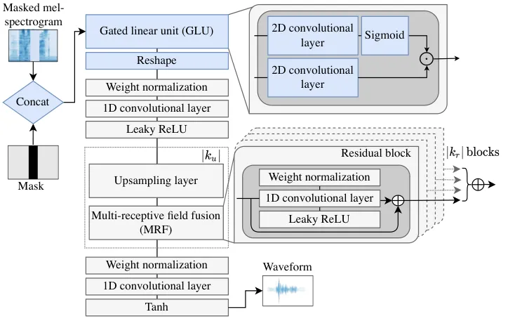
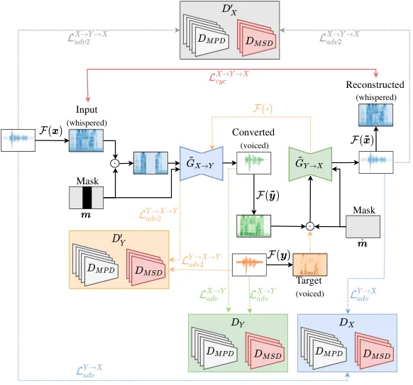

# Vocoder-Free Non-Parallel Conversion of Whispered Speech With Masked Cycle-Consistent Generative Adversarial Networks

Dominik Wagner     Ilja Baumann     Tobias Bocklet
Affiliation: Technische Hochschule Nürnberg Georg Simon Ohm, 90489
Nürnberg, Germany  
{dominik.wagner,ilja.baumann,tobias.bocklet}@th-nuernberg.de

###### Abstract

Cycle-consistent generative adversarial networks have been widely used
in non-parallel voice conversion (VC). Their ability to learn mappings
between source and target features without relying on parallel training
data eliminates the need for temporal alignments. However, most methods
decouple the conversion of acoustic features from synthesizing the audio
signal by using separate models for conversion and waveform synthesis.
This work unifies conversion and synthesis into a single model, thereby
eliminating the need for a separate vocoder. By leveraging
cycle-consistent training and a self-supervised auxiliary training task,
our model is able to efficiently generate converted high-quality raw
audio waveforms. Subjective listening tests showed that our unified
approach achieved improvements of up to 6.7% relative to the baseline in
whispered VC. Mean opinion score predictions also yielded stable results
in conventional VC (between 0.5% and 2.4% relative improvement).

###### Keywords: 

voice conversion, generative adversarial networks, cycle-consistency,
masking, whispered speech

## 1 Introduction

Voice conversion (VC) is the task of transforming an individual’s voice
into another, while preserving the linguistic and prosodic content
\[36\]. The conversion of whispered speech into voiced speech can be
interpreted as a special case of VC, where the task is the recovery of
the fundamental frequency ($`F0`$), without changing the linguistic
content of an utterance, i.e., the whispered input is mapped to a
corresponding normally phonated output produced by the same speaker.
Many VC models, rely on the availability of parallel speech data, i.e.,
utterances with the same linguistic content are required from both
source and target. However, the collection of such data is costly and
often impractical.

Furthermore, most approaches operating on parallel data require external
time alignment, which may be imperfect and can heavily influence the
conversion results \[9, 26\]. Consequently, much effort has been placed
on removing the parallel data requirement from VC systems. VC methods on
non-parallel training data include autoencoders (AEs) \[33, 2, 32, 20\],
generative adversarial networks (GANs) \[11, 12, 13, 14, 27\], and more
recently diffusion models \[31, 21\]. Most VC systems reduce the
resolution of the raw audio waveform to a lower-dimensional acoustic
feature representation. In such cases, an additional vocoder model is
necessary to reconstruct the waveform. These restrictions impede the
development of efficient and specialized systems for low-resource tasks
such as the conversion of voices from laryngeal cancer patients. To
overcome these restrictions, we focus on GANs for non-parallel VC, that
neither rely on parallel utterances and time alignment procedures nor on
a secondary model for waveform synthesis. The proposed method is
designed to produce high-quality waveforms from whispered speech
features but can also be applied to conventional VC.¹¹ 1 Audio samples
and source code are available at:  
https://audiodemo.github.io/voice-conversion

GAN-based non-parallel voice conversion shares similarities with
image-to-image translation \[10, 43, 1\], which is the task of finding
mappings between images in a source domain and images in a target domain
without the need for parallel training data \[36\]. A prominent example
for a successful attempt to solve the image-to-image translation task is
CycleGAN \[43\]. The success of cycle-consistent training on images has
led to several adaptations, which aim to find optimal mappings between
non-parallel speech data \[11, 4, 12, 13, 14\]. One of the first
adaptations was CycleGAN-VC \[11\], which employs three loss functions:
adversarial loss, cycle-consistency loss, and identity-mapping loss, to
learn forward and backward mappings between source and target speakers.
An improved version of CycleGAN-VC \[12\] incorporates a second
adversarial loss, a generator that uses both 1D and 2D convolutional
layers, and an improved discriminator based on PatchGAN \[18, 10\]. In
\[14\], an auxiliary task consisting of randomly masking frames of the
input mel-spectrogram is added to the training procedure, to further
improve the results. An adversarial network capable of directly
performing voice conversion on the raw audio waveform was recently
proposed in \[27\]. However, the speaker encoder component of their
NVC-Net still relies on mel-spectrograms as input features.

The advantages of cycle-consistent training have also been leveraged for
whispered speech conversion \[28, 30, 23\]. However, these approaches
model cepstral and $`F0`$ features with separate GANs and require
additional vocoders for speech synthesis. Other methods for whispered
speech conversion use the attention mechanism \[5\] to learn time
alignments between utterance pairs and train models on data that was
aligned via dynamic time warping (DTW) prior to training \[25, 40, 41\].
Some studies avoid time alignment by generating artificial whispers from
voiced input speech \[29\] or by representing the speech content in
latent space before decoding it back to a mel-spectrogram representation
\[34\].

## 2 Method

Our method is inspired by MaskCycleGAN-VC \[14\] and its predecessors
\[11, 12, 13\], as well as HiFi-GAN \[16\]. We first introduce those
systems before we describe our method in more detail.

### 2.1 HiFi-GAN

HiFi-GAN \[16\] is a waveform synthesis method consisting of a generator
and multiple discriminator blocks. Multi-period discriminators (MPDs)
are used to provide adversarial feedback based on disjoint audio
samples, and multi-scale discriminators (MSDs) provide feedback based on
the waveform at different resolutions. Apart from the standard
adversarial loss terms \[7\] for generator and discriminator, HiFi-GAN
employs an additional mel-spectrogram loss, as well as a feature
matching loss in the generator objective. The generator uses transposed
convolutions to upsample mel-spectrogram features until the length of
the output sequence matches the temporal resolution of the raw waveform.
A multi-receptive field fusion (MRF) component consisting of multiple
residual blocks \[8\], with varying kernel sizes and dilations is used
to generate features based on different receptive fields in parallel.
The output of the MRF module is the sum of the outputs of all residual
blocks.

### 2.2 MaskCycleGAN-VC

The architecture of MaskCycleGAN-VC \[14\] is based on CycleGAN-VC2
\[12\]. The generator combines 1D and 2D convolutional layers, as well
as instance normalization \[39\], residual blocks \[8\], and gated
linear units (GLUs) \[3\], to implement downsampling and upsampling of
the input features. Input features are downsampled and passed through 6
residual blocks, before they are upsampled again. Downsampling is
achieved via 2 blocks consisting of 2D convolutional layers, followed by
instance normalization, and GLU activation. Each residual block consists
of 1D convolutional layers, instance normalization and GLU activation.
The 2 upsampling blocks employ 2D convolutional layers, instance
normalization, GLU activation, and sub-pixel convolution layers \[35\].
The discriminator also consists of blocks of 2D convolutional layers
followed by instance normalization and GLU activation.  
MaskCycleGAN-VC introduces a self-supervised auxiliary training task
that aims to better capture the time-frequency structure during
mel-spectrogram conversion. The auxiliary task consists of randomly
masking frames of the input mel-spectrogram, which need to be filled by
the model during training. We also adopted the masking task in our
method.

### 2.3 Proposed method



Figure 1: Generator of the proposed model. Blue-filled components have
been added to the original HiFi-GAN generator. A GLU feature encoder
block consisting of 2D convolutional layers operates on the
concatenation of the masked mel-spectrogram and the mask itself. The
resulting feature maps are reshaped and passed to a 1D convolutional
layer before upsampling them in $`|k_{u}|`$ blocks.

The goal is to learn a mapping $`G_{X\rightarrow Y}`$ between source
waveforms $`\mathbf{x}\in X`$ and target waveforms $`\mathbf{y}\in Y`$
without parallel supervision. To achieve this goal, we train a CycleGAN
\[43\], with an architecture based on HiFi-GAN \[16\]. The generator
receives randomly masked mel-spectrograms, as well as the mask itself,
and uses a GLU block to encode the input features before upsampling them
to the raw waveform. The components of the generator are illustrated in
Figure 1. In addition to the standard adversarial loss \[7\] and the
cycle-consistency loss \[43\], we use an additional identity-mapping
loss \[37\], as well as a second adversarial loss \[12\]. The overall
training objective is similar to \[12, 13, 14\]. The main difference is
that the training objectives for the generator and the discriminator
follow \[43, 16\], which replace the binary cross-entropy terms of the
original GAN objectives \[7\] with least squares loss functions \[24\]
to stabilize the training procedure. The discriminators are trained
using information from feature maps of the $`k`$ components in the
multi-scale discriminator and the multi-period discriminator \[16\].
Furthermore, an additional transformation $`\mathcal{F}`$ is used to map
from the raw audio waveform to the corresponding mel-spectrogram
representation to allow loss computation in the frequency domain. The
process of waveform generation and flow of adversarial feedback are
illustrated in Figure 2. The adversarial losses for the discriminator
$`\mathcal{L}_{adv}^{X\rightarrow Y}(D_{Y};G_{X\rightarrow Y})`$ and the
generator
$`\mathcal{L}_{adv}^{X\rightarrow Y}(G_{X\rightarrow Y};D_{Y})`$ are
defined as:

```math
\displaystyle\mathcal{L}_{adv}^{X\rightarrow Y}(D_{Y};G_{X\rightarrow Y})= \tag{1}
```

```math
\displaystyle\mathbb{E}_{(\boldsymbol{s},\boldsymbol{y})}\left[(D_{Y}(\boldsymbol{y})-1)^{2}+(D_{Y}(G_{X\rightarrow Y}(\boldsymbol{s})))^{2}\right]
```

```math
\mathcal{L}_{adv}^{X\rightarrow Y}(G_{X\rightarrow Y};D_{Y})=\mathbb{E}_{\boldsymbol{s}}\left[(D_{Y}(G_{X\rightarrow Y}(\boldsymbol{s}))-1)^{2}\right], \tag{2}
```

where $`\boldsymbol{s}=\mathcal{F}(\boldsymbol{x})`$ denotes the
mel-spectrogram of the input audio in domain $`X`$ and
$`\boldsymbol{y}`$ denotes the target audio in domain $`Y`$. The
backward discriminator $`D_{X}`$ (cf. \[43\]) is trained with outputs
from the backward generator $`G_{Y\rightarrow X}`$ using
$`\mathcal{L}_{adv}^{Y\rightarrow X}(D_{X};G_{Y\rightarrow X})`$. The
backward generator $`G_{Y\rightarrow X}`$ is trained with outputs from
the discriminator $`D_{X}`$ using
$`\mathcal{L}_{adv}^{Y\rightarrow X}(G_{Y\rightarrow X};D_{X})`$.

The mappings between the source and target domains $`X`$ and $`Y`$
should be cycle-consistent, i.e., for each waveform $`\boldsymbol{x}`$
from domain $`X`$, the transformation cycle should be able to restore
$`\boldsymbol{x}`$ back to its original form (and vice versa for
$`\boldsymbol{y}\in Y`$):

```math
\boldsymbol{x}\longmapsto G_{X\rightarrow Y}(\mathcal{F}(\boldsymbol{x}))\longmapsto G_{Y\rightarrow X}(G_{X\rightarrow Y}(\mathcal{F}(\boldsymbol{x})))\approx\boldsymbol{x}. \tag{3}
```

The loss $`\mathcal{L}_{cyc}^{X\rightarrow Y\rightarrow X}`$ is used to
implement the forward cycle-consistency constraint:

```math
\mathcal{L}_{\text{cyc}}^{X\rightarrow Y\rightarrow X}=\mathbb{E}_{\boldsymbol{s}}\left[||\mathcal{F}\left(G_{Y\rightarrow X}\left(G_{X\rightarrow Y}(\boldsymbol{s})\right)\right)-\boldsymbol{s}||_{1}\right] \tag{4}
```

Similarly, $`\mathcal{L}_{cyc}^{Y\rightarrow X\rightarrow Y}`$ is used
for the backward mapping
$`G_{X\rightarrow Y}\left(G_{Y\rightarrow X}\left(\mathcal{F}(\boldsymbol{y})\right)\right)`$.  
The identity loss term $`\mathcal{L}_{id}^{X\rightarrow Y}`$ encourages
$`G_{X\rightarrow Y}`$ to be the identity mapping for all
$`\boldsymbol{y}\in Y`$:

```math
\mathcal{L}_{id}^{X\rightarrow Y}=\mathbb{E}_{\mathcal{F}(\boldsymbol{y})}\left[||\mathcal{F}\left(G_{X\rightarrow Y}(\mathcal{F}(\boldsymbol{y}))\right)-\mathcal{F}(\boldsymbol{y})||_{1}\right] \tag{5}
```

For the backward generator $`G_{Y\rightarrow X}`$, the identity loss
$`\mathcal{L}_{id}^{Y\rightarrow X}`$ is used in the same way.

A second adversarial loss
$`\mathcal{L}_{adv2}^{X\rightarrow Y\rightarrow X}`$ operating on the
features obtained after a full forward or backward cycle, and an
additional discriminator $`D^{\prime}_{X}`$ are introduced to mitigate
oversmoothing caused by the cycle-consistency constraints:

```math
\displaystyle\mathcal{L}_{adv2}^{X\rightarrow Y\rightarrow X}\left(D^{\prime}_{X};G_{X\rightarrow Y},G_{Y\rightarrow X}\right)= \tag{6}
```

```math
\displaystyle\mathbb{E}_{(\boldsymbol{s},\boldsymbol{x})}\left[(D^{\prime}_{X}(\boldsymbol{x})-1)^{2}+(D^{\prime}_{X}(G_{Y\rightarrow X}(G_{X\rightarrow Y}(\boldsymbol{s}))))^{2}\right]
```

```math
\displaystyle\mathcal{L}_{adv2}^{X\rightarrow Y\rightarrow X}(G_{Y\rightarrow X};G_{X\rightarrow Y},D^{\prime}_{X})= \tag{7}
```

```math
\displaystyle\mathbb{E}_{\boldsymbol{s}}\left[(D^{\prime}_{X}(G_{Y\rightarrow X}(G_{X\rightarrow Y}(\boldsymbol{s})))-1)^{2}\right],
```

where the discriminator $`D^{\prime}_{X}`$ distinguishes between the
reconstructed  
$`G_{Y\rightarrow X}(G_{X\rightarrow Y}(\mathcal{F}(\boldsymbol{x})))`$
and the real $`\boldsymbol{x}`$. Similarly,
$`\mathcal{L}_{adv2}^{Y\rightarrow X\rightarrow Y}(G_{X\rightarrow Y};G_{Y\rightarrow X};D^{\prime}_{Y})`$
is used for the backward mapping with the additional discriminator
$`D^{\prime}_{Y}`$.

The discriminators are trained on the sum of the adversarial losses for
each of the $`K`$ MPD/MSD discriminator blocks:

```math
\displaystyle\mathcal{L}_{D}=\sum_{k=1}^{K}\left(\mathcal{L}_{adv}^{X\rightarrow Y}(D_{Y}^{(k)};G_{X\rightarrow Y})\right) \tag{8}
```

```math
\displaystyle+\sum_{k=1}^{K}\left(\mathcal{L}_{adv2}^{X\rightarrow Y\rightarrow X}(D_{X}^{\prime(k)};G_{X\rightarrow Y},G_{Y\rightarrow X})\right).
```

The overall generator objective $`\mathcal{L}_{G}`$ is given by:

```math
\displaystyle\mathcal{L}_{G}=\sum_{k=1}^{K}\left(\mathcal{L}_{adv}^{X\rightarrow Y}(G_{X\rightarrow Y};D_{Y}^{(k)})+\mathcal{L}_{adv}^{Y\rightarrow X}(G_{Y\rightarrow X};D_{X}^{(k)})\right) \tag{9}
```

```math
\displaystyle+\lambda_{cyc}\left(\mathcal{L}_{cyc}^{X\rightarrow Y\rightarrow X}+\mathcal{L}_{cyc}^{Y\rightarrow X\rightarrow Y}\right)+\lambda_{id}\left(\mathcal{L}_{id}^{X\rightarrow Y}+\mathcal{L}_{id}^{Y\rightarrow X}\right)
```

```math
\displaystyle+\sum_{k=1}^{K}\left(\mathcal{L}_{adv2}^{X\rightarrow Y\rightarrow X}(G_{Y\rightarrow X};G_{X\rightarrow Y},D_{X}^{\prime(k)})\right)
```

```math
\displaystyle+\sum_{k=1}^{K}\left(\mathcal{L}_{adv2}^{Y\rightarrow X\rightarrow Y}(G_{X\rightarrow Y};G_{Y\rightarrow X},D_{Y}^{\prime(k)})\right),
```

where $`\lambda_{cyc}`$ and $`\lambda_{id}`$ are scalars for weighting.

#### Training with feature masking

Kaneko et al. \[14\] proposed an additional unsupervised training task
that helps to learn the harmonic structure of the mel-spectrogram
features. The source mel-spectrogram
$`\boldsymbol{s}=\mathcal{F}(\boldsymbol{x})`$, is augmented using a
binary temporal mask $`\boldsymbol{m}\in M`$ of same size as
$`\boldsymbol{s}`$. A randomly selected contiguous region consisting of
$`n`$ frames is mapped to 0, while the remaining frames are mapped to 1.
The mask is applied to each $`\boldsymbol{s}`$ using element-wise
multiplication:
$`\boldsymbol{\tilde{s}}=\boldsymbol{s}\cdot\boldsymbol{m}`$.  
This procedure effectively creates missing frames on the input features,
which need to be filled by the generator. The mask is also used as an
additional input to the generator to provide information about the
frames that need to be filled. It is passed to the forward generator and
subsequently concatenated with the mel-spectrogram on channel-level. The
forward cycle generates
$`\boldsymbol{\tilde{y}}=\tilde{G}_{X\rightarrow Y}(\boldsymbol{\tilde{s}},\boldsymbol{m})`$.
The backward transformation $`\tilde{G}_{Y\rightarrow X}`$ employs an
all-ones matrix $`\dot{\boldsymbol{m}}`$ to reconstruct
$`\boldsymbol{\tilde{x}}`$:

```math
\boldsymbol{\tilde{x}}=\tilde{G}_{Y\rightarrow X}\left(\mathcal{F}\left(\boldsymbol{\tilde{y}}\right),\dot{\boldsymbol{m}}\right) \tag{10}
```

To optimize the cycle-consistency loss, the generator
$`\tilde{G}_{X\rightarrow Y}`$ is encouraged to learn an estimate of the
missing frames by using information about the neighboring frames in a
self-supervised manner. We found that the frame-filling task can greatly
improve the time-frequency structure of the converted whispered inputs.
Recovering the correct harmonic structure from whispered speech is
especially important, since it is almost completely absent in most
samples.



Figure 2: Overall audio generation and feedback process of our method.
Solid black lines represent feature transformations and flow of features
through the two masked generators ($`\tilde{G}_{X\rightarrow Y}`$ and
$`\tilde{G}_{Y\rightarrow X}`$). Dashed lines represent the flow of
features to provide adversarial feedback. Each of the four
discriminators consists of two sub-discriminators ($`D_{MPD}`$ and
$`D_{MSD}`$) receiving raw waveform inputs from varying sources. The
solid red line indicates the features used to compute the forward
cycle-consistency loss
$`\mathcal{L}_{cyc}^{X\rightarrow Y\rightarrow X}`$. The losses
$`\mathcal{L}_{id}`$ and
$`\mathcal{L}_{cyc}^{Y\rightarrow X\rightarrow Y}`$ are excluded for
clarity.

## 3 Experiments

We conducted seven experiments on the whispered TIMIT (wTIMIT) corpus
\[19\]. The first three experiments were designed to allow a comparison
of our proposed method with the following systems: (1) MaskCycleGAN-VC
\[14\], (2) original HiFi-GAN \[16\] trained with DTW-aligned parallel
input features, (3) NVC-Net \[27\]. The experiments (4) to (7) are
different variants of the proposed model to gauge the importance of the
individual key components: (4) regular cycle-consistent training only
(i.e., no masking, no additional $`\mathcal{L}_{adv2}`$, and no GLU
feature encoder), (5) same as (4) but with masking added to the training
procedure, (6) masking and additional $`\mathcal{L}_{adv2}`$ used during
training, (7) full model with masking, additional $`\mathcal{L}_{adv2}`$
and GLU feature encoder.  
Experiment (2) was inspired by \[40\]. The HiFi-GAN was trained using
the hyperparameters and loss functions from \[16\] on parallel utterance
pairs, which were time-aligned in a preprocessing step. NVC-Net (exp.
(3)) was trained using the default hyperparameters from \[27\].  
Except for (2), all experiments were conducted in a non-parallel
setting, i.e., the source and target utterances were not required to
have the same linguistic content. The utterances and input frames from
these utterances were selected randomly in each training step.
Additionally, we used the experimental setups (1) and (7) to compare the
conversion quality of MaskCycleGAN-VC and our method on the VCTK dataset
\[42\].

### 3.1 Data

The wTIMIT corpus uses approximately 450 phonetically compact sentences
from the TIMIT \[6\] database. Each speaker utters the same sentences in
a regular (voiced) and in a whispered manner. The corpus consists of 24
female speakers and 25 male speakers from two main accent groups
(Singaporean-English and North-American English). We used 10 speakers (5
female and 5 male) from both accent groups for training, i.e., we
trained 10 individual speaker-dependent models in each experiment. We
excluded 20 randomly selected utterances from each speaker (200
utterances in total) as a test set. The test set is consistent across
all 10 speakers, i.e., the spoken content in those 20 utterances is the
same for each of the 10 selected speakers. The audio format is 16-bit
PCM with a sample rate of 44.1 kHz. We applied volume normalization and
trimming of leading and trailing silences to each audio sample to reduce
the impact of noise artifacts.  
The VCTK corpus \[42\] contains 16-bit FLAC recordings sampled at 48 kHz
from 109 English speakers, who read about 400 sentences each. We
randomly selected 6 speakers (3 male, 3 female) and also excluded 20
utterances from each speaker as a test set.  
We reduced the sample rate of both corpora to 22.05 kHz and extracted
80-dimensional mel-spectrograms with a window length of 1024 and hop
length of 256 samples.

### 3.2 Training setup

#### MaskCycleGAN-VC

We adopted most training hyperparameters from \[14\].  
Mel-spectrograms were normalized using the training set statistics. The
models were trained for 50k iterations (batch size 8) using the Adam
optimizer \[15\] with learning rates of $`2\times 10^{-4}`$ for the
generator and $`10^{-4}`$ for the discriminator. The momentum terms
$`\beta_{1}`$ and $`\beta_{2}`$ were set to $`0.5`$ and $`0.99`$,
respectively. The input length was set to 64 frames with a maximum of 25
consecutive frames being masked. We used $`\lambda_{cyc}=10`$ and
$`\lambda_{id}=5`$. The identity loss was only used for the first 1k
iterations. To ensure a fair comparison with our method, we synthesized
the mel-spectrograms converted with MaskCycleGAN-VC using a HiFi-GAN
vocoder pretrained on the VCTK dataset \[42\], instead of the MelGAN
\[17\] vocoder suggested in \[14\].

#### Our method

We employed 3 MSD and 5 MPD blocks in each discriminator. The GLU
feature encoder yielded 64 channels and used kernel sizes $`(5,15)`$.
Upsampling was achieved using 4 blocks of transposed 1D convolutional
layers followed by MRF modules. The upsampling rates, i.e, the stride
values were set to $`u\in\{8,8,2,2\}`$. The kernel sizes $`k_{u}`$ of
the transposed convolutions were set to $`k_{u}=2\times u`$. We used 3
residual blocks in each MRF module with kernel sizes
$`k_{r}\in\{2,7,11\}`$ and dilation rates $`d_{r}\in\{1,3,5\}`$.

The models were trained for 50k iterations (batch size 8) using the Adam
optimizer with $`\beta_{1}=0.5`$ and $`\beta_{2}=0.99`$. An exponential
learning rate scheduler with a rate decay factor of $`0.999`$ in every
epoch and an initial learning rate of $`2\times 10^{-4}`$ was used for
the generators and discriminators alike. We used $`\lambda_{cyc}=10`$
and $`\lambda_{id}=5`$ as weights for the cycle-consistency loss and the
identity loss, respectively. The input length was also 64 frames with a
maximum of 25 consecutive frames being masked.

### 3.3 Objective evaluation

We employed three commonly used measures to assess the conversion
results: mel-cepstral distortion (MCD), frequency-weighted segmental
signal-to-noise ratio (fwSNRseg), and root mean squared error (RMSE) of
$`log\,F0`$. To obtain MCD and RMSE, we extracted 34 Mel-cepstral
coefficients (MCEPs) at a frame period of 5 ms for each recording
sampled at 22.05 kHz using the WORLD analysis system \[22\]. Similar to
\[28, 40, 41\], we computed the RMSE of $`log\,F0`$ values between the
voiced and converted speech signals, after aligning all frames in the
utterance via DTW. Only the voiced regions of the target signal were
considered in the computation. The results are summarized in Table 1.
All experiments yielded improvements over the whispered input condition.
Using the original HiFi-GAN on parallel input data (exp. (2)) led to the
best results in terms of MCD and fwSNRseg, but the reconstruction
quality of $`log\,F0`$ was worse than most other experiments. The lowest
overall RMSE was achieved with our full model.

|     |                              |                          |                             |                               |
| --- | ---------------------------- | ------------------------ | --------------------------- | ----------------------------- |
| \#  | Experiment                   | MCD \[dB\]$`\downarrow`$ | fwSNRseg \[dB\]$`\uparrow`$ | RMSE \[log F0\]$`\downarrow`$ |
| 1   | MaskCycleGAN-VC              | 8.588                    | 0.956                       | 18.888                        |
| 2   | HiFi-GAN + DTW               | 7.891                    | 2.531                       | 19.927                        |
| 3   | NVC-Net                      | 8.683                    | 1.074                       | 19.577                        |
| 4   | Ours (cycle-consistent only) | 8.175                    | 1.602                       | 19.971                        |
| 5   |     + feature masking        | 8.067                    | 2.046                       | 20.342                        |
| 6   |     + $`\mathcal{L}_{adv2}`$ | 8.183                    | 1.619                       | 18.996                        |
| 7   |     + GLU feature encoder    | 8.028                    | 2.056                       | 18.257                        |
|     | Whispered                    | 9.523                    | -0.768                      | 27.991                        |

Table 1: Results for objective quality measures on the wTIMIT test set.
Arrows indicate whether lower ($`\downarrow`$) or higher ($`\uparrow`$)
values are better for each measure.

### 3.4 MOS prediction

We utilized a pre-trained model for automatic prediction of mean opinion
scores (MOS) \[38\]. The results on the wTIMIT corpus in Table 2 show
that our full model (exp. (7)) achieved a score closest to the voiced
target speech. Removing the GLU feature encoder (exp. (6)) still
achieves results comparable to to the baseline.

|          |                                  |                                     |                |
| -------- | -------------------------------- | ----------------------------------- | -------------- |
|    \#    |    Experiment                    |    MOS pred.                        |    95% CI      |
|    1     |    MaskCycleGAN-VC               |    $`3.07\pm 0.11`$                 |    $`0.08`$    |
|    2     |    HiFi-GAN + DTW                |    $`2.91\pm 0.12`$                 |    $`0.09`$    |
|    3     |    NVC-Net                       |    $`2.79\pm 0.08`$                 |    $`0.05`$    |
|    4     |    Ours (cycle-consistent only)  |    $`2.73\pm 0.08`$                 |    $`0.06`$    |
|    5     |      + feature masking           |    $`2.94\pm 0.11`$                 |    $`0.08`$    |
|    6     |      + $`\mathcal{L}_{adv2}`$    |    $`3.00\pm 0.09`$                 |    $`0.06`$    |
|    7     |      + GLU feature encoder       |    $`\boldsymbol{3.16}\pm 0.11`$    |    $`0.08`$    |
|          |    Voiced                        |    $`3.47\pm 0.09`$                 |    $`0.07`$    |
|          |    Whispered                     |    $`2.68\pm 0.10`$                 |    $`0.07`$    |

Table 2: Average MOS prediction, standard deviation, and 95% confidence
interval on the wTIMIT test set.

We performed conventional VC experiments on the VCTK dataset, to further
analyze the effectiveness of our method. Table 3 compares our full model
(exp. (7)) to MaskCycleGAN-VC. Our method achieved slightly better MOS
values than MaskCycleGAN-VC in all four experiments and yielded the
highest overall MOS of 3.40 in the female-to-male ($`F\mapsto M`$)
conversion experiment.

|                |                  |                  |                       |
| -------------- | ---------------- | ---------------- | --------------------- |
| Exp.           | MaskCycleGAN-VC  | Ours (#7)        | Ground truth (target) |
| $`F\mapsto F`$ | $`3.30\pm 0.07`$ | $`3.38\pm 0.10`$ | $`3.53\pm 0.06`$      |
| $`M\mapsto M`$ | $`3.23\pm 0.09`$ | $`3.30\pm 0.16`$ | $`3.45\pm 0.07`$      |
| $`F\mapsto M`$ | $`3.32\pm 0.09`$ | $`3.40\pm 0.12`$ | $`3.51\pm 0.06`$      |
| $`M\mapsto F`$ | $`3.36\pm 0.08`$ | $`3.38\pm 0.15`$ | $`3.52\pm 0.07`$      |

Table 3: MOS prediction results on VCTK test data.

### 3.5 Subjective evaluation

We conducted two separate listening tests on naturalness and
intelligibility, asking human listeners to choose on a 5-point scale
with choices from “excellent” to “bad”, to further assess the
performance of our method. We used 5 utterances from each of the 10
speakers in the wTIMIT test set (50 utterances in total). We also asked
the participants to rate the underlying whispered and voiced speech
samples. We ensured that at least 30 participants completed the
listening test. The results are illustrated in Figure 3. Similar to the
MOS prediction results in Section 3.4, our method outperformed
MaskCycleGAN-VC in terms of both naturalness ($`\mu=3.54`$ vs.
$`\mu=3.32`$) and intelligibility ($`\mu=3.66`$ vs. $`\mu=3.43`$). Both
systems yielded higher scores than the whispered speech ($`\mu=2.62`$
naturalness and $`\mu=2.69`$ intelligibility), but lower scores than the
voiced target speech ($`\mu=4.15`$ naturalness and $`\mu=4.09`$
intelligibility).

Figure 3: Subjective human evaluation results (MOS) for naturalness and
intelligibility.

## 4 Conclusions

We describe an efficient method to convert whispered speech features
directly into voiced audio waveforms. Our method utilizes components
from MaskCycleGAN-VC and HiFi-GAN to recover the harmonic structure and
to generate the waveform in a single model, while avoiding artifacts
caused by imperfect time alignments. Experimental results indicate that
our unified approach maintains competitive results in both whispered
speech conversion and conventional VC.

## References

- \[1\] Choi, Y., Choi, M., Kim, M., Ha, J., Kim, S., Choo, J.: StarGAN:
  Unified generative adversarial networks for multi-domain
  image-to-image translation. In: 2018 IEEE/CVF CVPR. pp.
  8789–8797 (2018)
- \[2\] Chou, J., Lee, H.: One-Shot Voice Conversion by Separating
  Speaker and Content Representations with Instance Normalization. In:
  Proc. Interspeech. pp. 664–668. ISCA (2019)
- \[3\] Dauphin, Y., Fan, A., Auli, M., Grangier, D.: Language modeling
  with gated convolutional networks. In: ICML 2017. p. 933–941 (2017)
- \[4\] Fang, F., Yamagishi, J., Echizen, I., Lorenzo-Trueba, J.:
  High-quality nonparallel voice conversion based on cycle-consistent
  adversarial network. In: 2018 IEEE ICASSP. p. 5279–5283 (2018)
- \[5\] Gao, T., Pan, Q., Zhou, J., Wang, H., Tao, L., Kwan, H.K.: A
  novel attention-guided generative adversarial network for
  whisper-to-normal speech conversion. Cognitive Computation (Jan 2023)
- \[6\] Garofolo, J., Lamel, L., Fisher, W., Fiscus, J., Pallett, D.,
  Dahlgren, N., Zue, V.: TIMIT acoustic-phonetic continuous speech
  corpus LDC93S1. Linguistic Data Consortium (1993)
- \[7\] Goodfellow, I., Pouget-Abadie, J., Mirza, M., Xu, B.,
  Warde-Farley, D., Ozair, S., Courville, A., Bengio, Y.: Generative
  adversarial nets. In: NeurIPS. vol. 27 (2014)
- \[8\] He, K., Zhang, X., Ren, S., Sun, J.: Deep residual learning for
  image recognition. In: 2016 IEEE CVPR. pp. 770–778 (2016)
- \[9\] Helander, E., Schwarz, J., Nurminen, J., Silen, H., Gabbouj, M.:
  On the impact of alignment on voice conversion performance. In: Proc.
  Interspeech. pp. 1453–1456. ISCA (2008)
- \[10\] Isola, P., Zhu, J., Zhou, T., Efros, A.: Image-to-image
  translation with conditional adversarial networks. 2017 IEEE CVPR pp.
  5967–5976 (2016)
- \[11\] Kaneko, T., Kameoka, H.: CycleGAN-VC: Non-parallel voice
  conversion using cycle-consistent adversarial networks. In: 26th
  EUSIPCO. pp. 2100–2104 (2018)
- \[12\] Kaneko, T., Kameoka, H., Tanaka, K., Hojo, N.: CycleGAN-VC2:
  Improved CycleGAN-based non-parallel voice conversion. In: 2019 IEEE
  Intl. Conference on Acoustics, Speech and Signal Processing
  (ICASSP) (2019)
- \[13\] Kaneko, T., Kameoka, H., Tanaka, K., Hojo, N.: CycleGAN-VC3:
  Examining and improving CycleGAN-VCs for mel-spectrogram conversion.
  In: Proc. Interspeech. pp. 2017–2021. ISCA (2020)
- \[14\] Kaneko, T., Kameoka, H., Tanaka, K., Hojo, N.: MaskCycleGAN-VC:
  Learning non-parallel voice conversion with filling in frames. In:
  2021 IEEE ICASSP. pp. 5919–5923 (2021)
- \[15\] Kingma, D.P., Ba, J.: Adam: A method for stochastic
  optimization. In: 3rd ICLR (2015)
- \[16\] Kong, J., Kim, J., Bae, J.: HiFi-GAN: Generative adversarial
  networks for efficient and high fidelity speech synthesis. In:
  NeurIPS. vol. 33, pp. 17022–17033 (2020)
- \[17\] Kumar, K., Kumar, R., de Boissiere, T., Gestin, L., Teoh, W.,
  Sotelo, J., de Brébisson, A., Bengio, Y., Courville, A.: MelGAN:
  Generative adversarial networks for conditional waveform synthesis.
  In: NeurIPS. vol. 32 (2019)
- \[18\] Li, C., Wand, M.: Precomputed real-time texture synthesis with
  markovian generative adversarial networks. In: ECCV. pp.
  702–716 (2016)
- \[19\] Lim, B.P.: Computational differences between whispered and
  non-whispered speech. Ph.D. thesis, University of Illinois (2010)
- \[20\] Lin, Y., Chien, C., Lin, J., Lee, H., Lee, L.: Fragmentvc:
  Any-to-any voice conversion by end-to-end extracting and fusing
  fine-grained voice fragments with attention. In: 2021 IEEE ICASSP. pp.
  5939–5943 (2021)
- \[21\] Liu, S., Cao, Y., Su, D., Meng, H.: DiffSVC: A diffusion
  probabilistic model for singing voice conversion. In: 2021 IEEE ASRU.
  pp. 741–748 (2021)
- \[22\] M., M., Y., F., O., K.: WORLD: A vocoder-based high-quality
  speech synthesis system for real-time applications. IEICE Transactions
  on Information and Systems pp. 1877–1884 (2016)
- \[23\] Malaviya, H., Shah, J., Patel, M., Munshi, J., Patil, H.:
  Mspec-Net: Multi-domain speech conversion network. In: 2020 IEEE
  ICASSP. pp. 7764–7768 (2020)
- \[24\] Mao, X., Li, Q., Xie, H., Lau, R., Wang, Z., Smolley, S.: Least
  squares generative adversarial networks. In: 2017 IEEE Intl.
  Conference on Computer Vision (ICCV). pp. 2813–2821 (2017).
  https://doi.org/10.1109/ICCV.2017.304
- \[25\] Meenakshi, G., Ghosh, P.: Whispered speech to neutral speech
  conversion using bidirectional lstms. In: Proc. Interspeech. pp.
  491–495. ISCA (2018)
- \[26\] Mohammadi, S.H., Kain, A.: An overview of voice conversion
  systems. Speech Communication 88, 65–82 (2017)
- \[27\] Nguyen, B., Cardinaux, F.: NVC-Net: End-to-end adversarial
  voice conversion. In: 2022 IEEE ICASSP. pp. 7012–7016 (2022)
- \[28\] Parmar, M., Doshi, S., Shah, N., Patel, M., Patil, H.:
  Effectiveness of cross-domain architectures for whisper-to-normal
  speech conversion. In: 27th EUSIPCO. pp. 1–5 (2019)
- \[29\] Pascual, S., Bonafonte, A., Serrà, J., González López, J.A.:
  Whispered-to-voiced Alaryngeal Speech Conversion with Generative
  Adversarial Networks. In: Proc. IberSPEECH 2018. pp. 117–121 (2018)
- \[30\] Patel, M., Purohit, M., Shah, J., Patil, H.: CinC-GAN for
  effective F0 prediction for whisper-to-normal speech conversion. In:
  28th EUSIPCO. pp. 411–415 (2021)
- \[31\] Popov, V., Vovk, I., Gogoryan, V., Sadekova, T., Kudinov, M.,
  Wei, J.: Diffusion-based voice conversion with fast maximum likelihood
  sampling scheme. In: ICLR (2022)
- \[32\] Qian, K., Jin, Z., Hasegawa-Johnson, M., Mysore, G.:
  F0-consistent many-to-many non-parallel voice conversion via
  conditional autoencoder. In: 2020 IEEE ICASSP. pp. 6284–6288 (2020)
- \[33\] Qian, K., Zhang, Y., Chang, S., Yang, X., Hasegawa-Johnson, M.:
  AutoVC: Zero-shot voice style transfer with only autoencoder loss. In:
  ICML. pp. 5210–5219 (2019)
- \[34\] Rekimoto, J.: Wesper: Zero-shot and realtime whisper to normal
  voice conversion for whisper-based speech interactions. In: CHI
  Conference on Human Factors in Computing Systems (2023)
- \[35\] Shi, W., Caballero, J., Huszar, F., Totz, J., Aitken, A.P.,
  Bishop, R., Rueckert, D., Wang, Z.: Real-time single image and video
  super-resolution using an efficient sub-pixel convolutional neural
  network. In: 2016 IEEE CVPR. pp. 1874–1883 (2016)
- \[36\] Sisman, B., Yamagishi, J., King, S., Li, H.: An overview of
  voice conversion and its challenges: From statistical modeling to deep
  learning. IEEE/ACM Transactions on Audio, Speech, and Language
  Processing 29, 132–157 (2021)
- \[37\] Taigman, Y., Polyak, A., Wolf, L.: Unsupervised cross-domain
  image generation. In: ICLR (2017)
- \[38\] Tseng, W., Huang, C., Kao, W., Lin, Y., Lee, H.: Utilizing
  Self-Supervised Representations for MOS Prediction. In: Proc.
  Interspeech. pp. 2781–2785. ISCA (2021)
- \[39\] Ulyanov, D., Vedaldi, A., Lempitsky, V.: Instance
  normalization: The missing ingredient for fast stylization.
  arXiv (2016)
- \[40\] Wagner, D., Bayerl, S., Maruri, H., Bocklet, T.: Generative
  models for improved naturalness, intelligibility, and voicing of
  whispered speech. In: 2022 IEEE SLT. pp. 943–948 (2023)
- \[41\] Wagner, D., Baumann, I., Bocklet, T.: Generative adversarial
  networks for whispered to voiced speech conversion: a comparative
  study. International Journal of Speech Technology 27, 1093–1110
  (Oct 2024)
- \[42\] Yamagishi, J., Veaux, C., MacDonald, K.: CSTR VCTK corpus:
  English multi-speaker corpus for CSTR voice cloning toolkit (2019)
- \[43\] Zhu, J., Park, T., Isola, P., Efros, A.: Unpaired
  image-to-image translation using cycle-consistent adversarial
  networks. In: ICCV (2017)
