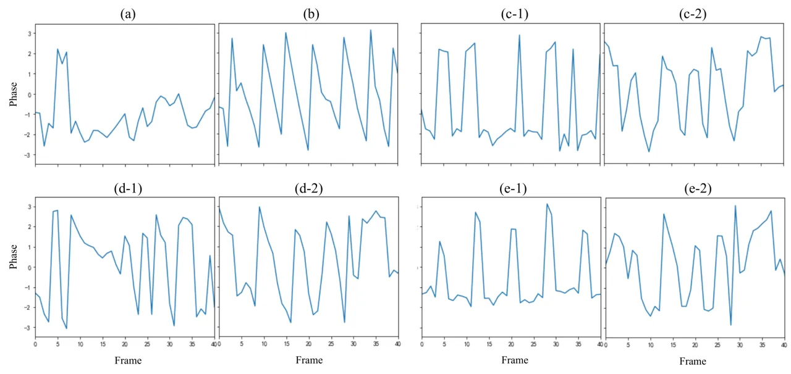
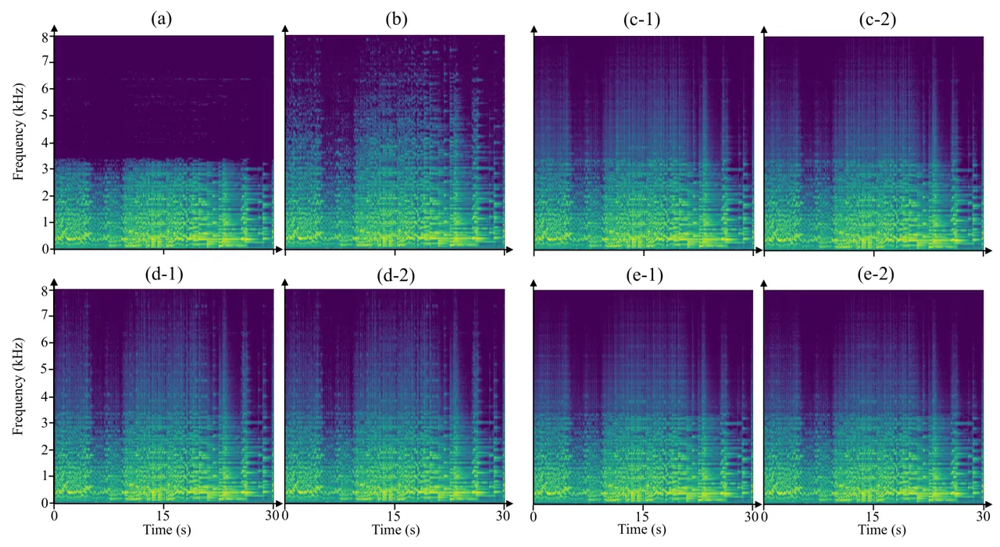

# Phase Repair for Time-Domain Convolutional Neural Networks in Music Super-Resolution

Yenan Zhang    Guilly Kolkman    Hiroshi Watanabe

###### Abstract

Audio Super-Resolution (SR) is an important topic as low-resolution
recordings are ubiquitous in daily life. In this paper, we focus on the
music SR task, which is challenging due to the wide frequency response
and dynamic range of music. Many models are designed in time domain to
jointly process magnitude and phase of audio signals. However, prior
works show that approaches using Time-Domain Convolutional Neural
Network (TD-CNN) tend to produce annoying artifacts in their waveform
outputs, and the cause of the artifacts is yet to be identified. To the
best of our knowledge, this work is the first to demonstrate the
artifacts in TD-CNNs are caused by the phase distortion via a subjective
experiment. We further propose Time-Domain Phase Repair (TD-PR), which
uses a neural vocoder pre-trained on the wide-band data to repair the
phase components in the waveform outputs of TD-CNNs. Although the
vocoder and TD-CNNs are independently trained, the proposed TD-PR
obtained better mean opinion score, significantly improving the
perceptual quality of TD-CNN baselines. Since the proposed TD-PR only
repairs the phase components of the waveforms, the improved perceptual
quality in turn indicates that phase distortion has been the cause of
the annoying artifacts of TD-CNNs. Moreover, a single pretrained vocoder
can be directly applied to arbitrary TD-CNNs without additional
adaptation. Therefore, we apply TD-PR to three TD-CNNs that have
different architecture and parameter amount. Consistent improvements are
observed when TD-PR is applied to all three TD-CNN baselines. Audio
samples are available on the demo page¹¹ 1
https://mannmaruko.github.io/demopage/tdpr.html.

^(†)^(†)address: ¹Graduate School of Fundamental Science and
Engineering, Waseda University, Tokyo, Japan  
²The Faculty of Science, University of Amsterdam, Amsterdam, Netherlands

## 1 Introduction

Audio Super-Resolution (SR), also known as bandwidth extension and
bandwidth expansion, aims to predict the High-Resolution (HR) components
from the Low-Resolution (LR) input audio. Audio SR is an important topic
as LR audio is common in daily life, e.g., historical recordings or
unprofessional-made modern recordings. The real-world LR recordings have
a variety of bandwidth or even ambiguous bandwidth. Therefore,
addressing audio SR in real world is challenging. Deep Neural Networks
(DNNs) have become the mainstream on audio SR tasks \[1, 2, 3, 4\], but
only a few works focus on the music \[2\]. To investigate the music SR
task, we focus on solo piano recordings, as piano is a representative
instrument with the most broad frequency range among other music
instruments.

Various works have delved into the DNN-based approaches for audio SR.
Frequency-Domain Convolutional Neural Networks (FD-CNNs) try to directly
recover the HR components in the magnitude spectrogram, and generally
require additional signal processing to estimate the corresponding phase
information, such as Griffin-Lim algorithms \[2\] or a neural vocoder
\[4\]. Compared with FD methods, Time-Domain Convolutional Neural
Networks (TD-CNNs) that directly learn a wave-to-wave mapping, are
considered being able to avoid the phase problem on audio SR tasks
\[2\]. However, TD-CNNs (e.g., AudioUNet \[1\]) tend to produce annoying
artifacts in their waveform output. To alleviate the artifacts, Lim
et al. proposed a time-frequency hybrid model \[5\] based on AudioUNet.
Wang et al. made efforts on objective function that employing the
frequency domain losses \[6\] during the TD-CNN’s training. The data
augmentation strategy was proposed in \[7\] to improve the robustness of
TD-CNNs.

Although the above efforts for TD-CNN improved audio SR quality measured
by objective scores, none of the above TD-CNN methods succeeds in
removing the artifacts according to their open-available audio samples.
We hypothesize that the inconsistency between objective and subjective
evaluation results could have been caused by some signal components that
cannot be measured by the objective metrics. We observed that phase
components are not explicitly measured by typical objective metrics such
as log-spectral distance. This observation encourages us to explore the
importance of phase in audio SR tasks. In terms of up-sampling ratio,
many works perform the SR on the fixed ratio (e.g., 2$`\times`$) \[1,
2\], which would be a limitation when apply these models to real world
scenarios.

We investigate the artifacts of TD-CNNs in the following ways. First, we
train three TD-CNNs with different architecture and parameter amount to
handle LR music with various bandwidth, which is applicable to real
world problems. We successfully reproduced the SR capability as well as
the artifacts for three TD-CNN baselines. Second, we conduct an AB
listening test which, to the best of our knowledge, is the first to
demonstrate the artifacts in TD-CNNs are caused by the phase distortion
via a subjective experiment. Last but not least, we propose the
Time-Domain Phase Repair (TD-PR) method, which utilizes a vocoder
pretrained on wide-band music signals to repair the distorted phase
components in the waveform output of TD-CNN baselines. Since the vocoder
and TD-CNNs are trained independently, a single pretrained vocoder can
be directly applied to arbitrary TD-CNNs without additional adaptation.
Therefore, we apply TD-PR to the aforementioned three TD-CNNs. The
proposed TD-PR consistently and significantly improved the perceptual
quality of all three TD-CNN baselines. Since TD-PR only repair the phase
components of the waveforms, the improved perceptual quality in turn
indicates that phase distortion has been the cause of the annoying
artifacts of TD-CNNs.

## 2 Related work

Various approaches for audio SR have been developed and some of them
work in Frequency Domain (FD). Li et al. proposed an FD approach for
speech SR, which consists of 2 steps \[8\]. The first step is mapping
the magnitude components from narrow-bandwidth to wide-bandwidth by DNN.
The second step is to estimate the corresponding phase by signal
processing. Following this work, Hu et al. introduced Generative
Adversarial Network (GAN) into both steps and got the better performance
\[2\]. However, training two GAN-based models is difficult due to the
instability of GAN training. Furthermore, this SR system works on a
fixed up-sampling ratio, which limits it’s application to real world
problems. Liu et al. used a GAN-based neural vocoder for the second step
without using GAN in the first step, which successfully performed speech
SR with the ability of handling various up-sampling ratios \[4\]. It’s
worth pointing out that the FD approaches mentioned above requires
strict matching of mel-spectrogram settings between the FD-CNN model and
the neural vocoder. Therefore, some FD-CNN models trained with an
unmatched mel-spectrogram settings cannot directly work with the
pretrained vocoder.

Contrary to FD approaches, TD-CNNs are considered being able to avoid
the phase problem in the audio SR tasks due to the direct waveform
processing \[2\]. AudioUNet is one of the pioneers of tackling audio SR
by the TD-CNN \[1\]. Tagliasacchi et al. proposed SEANet \[9\], a
GAN-based model for speech SR. The generator of SEANet is a light-weight
but effective TD-CNN. In this paper, We utilized the generator of SEANet
to music SR as one of our baselines. Defossez et al. proposed TD-CNN
model named Demucs, which is a large model with over 130M parameters and
is initially designed to address music source separation \[10\].
Considering the fact that Demucs has shown strong performance in tasks
besides source separation \[11\], we utilize the Demucs model in the SR
task in this paper. To the best of our knowledge, this is the first time
to apply Demucs to the music SR task.

The mel-to-wave transform is commonly addressed by the neural vocoder.
TFGAN is a light-weight vocoder \[12\] and has been applied to speech SR
task \[4\].

## 3 Proposed method

Figure 1: Overview of the proposed TD-PR: The TD-CNN is trained to
perform super-resolution for various narrow-band inputs. The neural
vocoder takes only the magnitude of the TD-CNN’s output as input, and
re-synthesizes another waveform that contains repaired phase components.
Then, the distorted phase components in TD-CNN’s output is replaced by
that from the vocoder.

### 3.1 Time-Domain Phase Repair

In order to alleviate the artifacts caused by distorted phase
components, we propose Time-Domain Phase Repair (TD-PR). The TD-PR
framework consists of two separately pretrained DNN modules and a phase
replacement operation.

The overview of the proposed method is shown in Fig. 1. Specifically,
the TD-PR pipeline involves the following steps. First, we train a
TD-CNN to perform music SR. To handle LR music with various bandwidths
which is common in real world, we apply a simulation pipeline to HR
music data to get the corresponding LR version. With the simulated
pseudo paired data, the training of TD-CNN for music SR is made
possible. Details of the simulation pipeline and training objectives are
explained in the succeeding section.

Second, we pretrain a neural vocoder on the unprocessed HR music data.
Since a neural vocoder can generate realistic waveform signals with only
the magnitude input, it can be inferred that a vocoder can generate
realistic phase components that are coherent with the input magnitude
components. This inspires us to utilize a neural vocoder to repair
distorted phase.

Last, we introduce TD-PR to repair the phase components of the SR output
from a TD-CNN. Assume that the TD-CNN is applied to an LR music source
and generated an intermediate waveform, which is then decomposed into
magnitude and phase comonents by Short-Time Fourier Transform (STFT). We
empirically decided to use an STFT of 1024-point hann window and 256 hop
length for a sampling rate of 16 kHz. The neural vocoder takes only the
magnitude of the TD-CNN’s output as input, and re-synthesizes another
waveform that contains repaired phase components. Then, the distorted
phase components in TD-CNN’s output is replaced by that from the
vocoder, and a phase-repaired waveform output is produced by inverse
STFT.

According to the above description, the vocoder and TD-CNNs are trained
independently, which means a single pretrained vocoder can be directly
applied to arbitrary TD-CNNs without additional adaptation, making the
method flexible. Last but not least, it is worth noting that since TD-PR
only repair the phase components of the waveforms, the improved
perceptual quality in turn indicates that phase distortion has been the
cause of the annoying artifacts of TD-CNNs.

### 3.2 Simulation Pipeline

The design of simulation pipeline has been shown important to the
performance and robustness of audio SR models \[6, 7\]. Therefore, we
decided to follow the principles in \[6, 7\]. Specifically, we simulate
each LR input by randomly choosing a low-pass filter from 7 low-pass
filters, including Butterworth, Chebyshev type 1, Chebyshev type 2,
Elliptic, Bessel, subsampling (i.e., resample_poly in scipy), STFT
filter (i.e., replacing the high frequency components with zero
elements) with the filter order randomly selected from 6 to 10. We used
the implementation of low-pass filters provided by Liu et  al.²² 2
https://github.com/haoheliu/ssr_eval \[4\].

Since 3 kHz is analyzed to be the typical bandwidth of real historical
recordings \[13\], we uniformly sample an LR bandwidth between 2.5 kHz
and 4 kHz. We don’t consider 2 kHz because we found this bandwidth will
filter out a part of melody, which is not common in real recordings. The
low-pass filtering is conducted on-the-fly during training.

### 3.3 Loss Function

Inspired by \[6\], we perform cross-domain loss to guide TD-CNNs to
capture features in both time and frequency domains. The loss function
(denoted as $`L`$) is comprised of two parts, multi-resolution STFT loss
($`L_{\textrm{MRSTFT}}`$) \[14\] and multi-resolution wave
loss($`L_{\textrm{MRwave}}`$) which is similar to
$`L_{\textrm{MRSTFT}}`$. The loss function is defined as below:

```math
L=L_{\textrm{MRSTFT}}+\lambda L_{\textrm{MRwave}}, \tag{1}
```

where $`\lambda`$ denotes the hyperparameter balancing the two loss
terms. In our case, we empirically set $`\lambda=1000`$ to balance the
weights between two losses.

The definition of $`L_{\textrm{MRSTFT}}`$ and $`L_{\textrm{MRwave}}`$
are shown as follows:

```math
L_{\textrm{MRSTFT}}=\frac{1}{M}\sum_{m=1}^{M}L^{(m)}_{\textrm{STFT}}(y,\hat{y}), \tag{2}
```

```math
L_{\textrm{MRwave}}=\frac{1}{N}\sum_{n=1}^{N}L^{(n)}_{\textrm{wave}}(y,\hat{y}), \tag{3}
```

where $`y`$ and $`\hat{y}`$ denote the ground truth and generated sample
respectively. $`M`$ denotes the number of STFT losses with different
analysis parameters (i.e., FFT size = \[512, 1024, 2048\]; hop size =
\[256, 512, 1024\]; window size = \[512, 1024, 2048\]). We used the
implementation of $`L_{\textrm{MRSTFT}}`$ from \[15\]. $`N`$ denotes the
number of wave losses with different sampling rate (i.e., original
sampling rate, $`2\times`$down sampling rate, $`4\times`$down sampling
rate).

$`L_{\textrm{wave}}`$ is defined as follows:

```math
L_{\textrm{wave}}(y,\hat{y})=\frac{1}{P}\|\,y-\hat{y}\,\|_{1}, \tag{4}
```

where $`P`$ denotes the number of wave samples and $`\|\,\cdot\,\|_{1}`$
denotes the L1 norms.

## 4 Experiments

### 4.1 Dataset And Implementation

We train and evaluate our model on the MAESTRO dataset \[16\]. It’s
composed of about 200 hours of high-quality classical piano recordings
in waveform. Although these recordings have the sampling rate of 44.1
kHz or 48 kHz, we empirically found that 16 kHz is high enough for the
piano solo. Hence, we decided to perform music SR on the target
bandwidth of 8 kHz, i.e., a target sampling rate 16 kHz. We used the
official split of MAESTRO for training, validation and testing. We cut
all of the waveform into 30-second short clips for efficient training.

To implement the proposed TD-PR framework, we trained a TFGAN \[12\]
from scratch on MAESTRO train set by using an unofficial
implementation³³ 3 https://github.com/rishikksh20/TFGAN. We follow the
original settings, except resetting the sampling rate to 16 kHz, and
trained it for 1M iterations.

Since TD-PR is feasible for arbitrary TD-CNNs with a single pretrained
neural vocoder as mentioned in Sec.3.1, we evaluate TD-PR with three
representative TD-CNN models as baselines: AudioUNet \[1\], Demucs
\[10\] and SEANet generator \[9\]. We trained them from scratch with the
loss function mentioned in Sec.3.3 by applying the simulation pipline in
Sec.3.2 to the dataset. We used the Pytorch implementation of
AudioUNet⁴⁴ 4 https://github.com/serkansulun/deep-music-enhancer and
Demucs⁵⁵ 5 https://github.com/facebookresearch/demucs/tree/v2. We
implemented the SEANet generator by ourselves. We used an Adam optimizer
and the initial learning rate 0.0001 to optimize each TD-CNN model for
200 epochs with the batch size of 12 and the input duration of 5s.

### 4.2 Investigation on The Effectiveness of Ground Truth Phase Components

Before delving into the evaluation of TD-PR, we present a preliminary
study to show the impact of phase on the artifacts issue of TD-CNN
models. In this study, we used SEANet as the TD-CNN baseline, and
replaced the phase of the TD-CNN output with the phase of the
corresponding HR music (ground truth that is not available in real world
applications), i.e., TD-CNN w/ GT-phase.

We then conducted an AB listening test, in which we asked participants
to choose the one containing fewer artifacts between the TD-CNN baseline
and TD-CNN w/ GT-phase. We selected eleven music pieces for the
listening test which cover different periods and styles of different
musicians from the MAESTRO test set. Eleven audio pairs are presented in
the AB test, in which one pair is for practice and the left ten pairs
are for evaluation. Each clip is cut into the duration of 5s. We also
regularized the volume of all the samples by Audacity⁶⁶ 6
https://www.audacityteam.org/. The input bandwidth for this listening
test is set to 3 kHz, as it is analyzed to be the typical bandwidth of
historical recordings \[13\].

### 4.3 Comparison between TD-PR And TD-CNN Baselines

TD-PR is proposed to improve the perceptual quality of TD-CNN baselines
via phase repair. We evaluate the proposed TD-PR from both objective and
subjective aspects. In terms of the objective evaluation, we use the
Log-Spectral Distance (LSD) as the metric, which has been widely used in
audio SR tasks \[1, 2, 4\]. LSD is designed as:

```math
LSD=\frac{1}{L}\sum_{l=1}^{L}\sqrt{\frac{1}{F}{\sum_{f=1}^{F}\left(\log\lvert{Y_{l,f}\rvert^{2}-\log\lvert\hat{Y}_{l,f}\rvert^{2}}\right)^{2}}}, \tag{5}
```

where $`Y_{l,f}`$ and $`\hat{Y}_{l,f}`$ are the ground truth and the
estimated magnitude via STFT at $`l`$-th time step $`(l=1,...,L)`$ and
$`f`$-th frequency bin $`(k=1,...,F)`$, respectively.

The subjective evaluation aims at collecting Mean Opinion Score (MOS)
from participants to compare the perceptual quality across the input LR
music, TD-CNN baseline, TD-CNN w/ TD-PR and ground truth HR music. MOS
is commonly used in audio SR tasks to represent the perceptual quality
\[4, 11\]. Participants are asked to rate audio samples according to the
similarity with the reference audio, i.e., the groud truth HR music. The
range of MOS in our work is set from 1 to 5, where 5 denotes excellent
quality (i.e., is closest to the reference) and 1 denotes bad quality.
To avoid auditory fatigue caused by giving too many samples to
participants, we evaluate the three TD-CNN models separately in three
independent listening tests, which means the MOS values across different
tests cannot be directly compared. The same eleven music pieces and
pre-processing as in the preliminary AB test are used.

## 5 Results and Discussion

### 5.1 Impact of Ground Truth Phase Components

The preference of the AB listening test between TD-CNN baseline and
TD-CNN w/ GT-phase described in Sec. 4.2 is shown in Fig. 2. TD-CNN w/
GT-phase is voted to have fewer artifacts with a large margin (95.38% vs
4.62%). Therefore, we concluded that the artifacts in TD-CNN approaches
for audio SR tasks is caused by the phase distortion, and the distortion
can be repaired by replacing the distorted phase with a more realistic
one.

Figure 2: Results of the preliminary AB listening test: 95.38% of the
TD-CNN w/ GT-phase is voted to have fewer artifacts.

### 5.2 Results on TD-PR

We conducted the MOS listening test described in Sec.4.3. The box plot
of the MOS test results and the corresponding average for each method
are shown in Fig. 3. First, the proposed TD-PR obtained better MOS
scores than all three TD-CNN baselines by a large margin, e.g., the
proposed TD-PR has higher boxes, and higher average MOS scores of 1.12
(SEANet), 1.34 (AudioUNet), 0.78 (Demucs), revealing that the TD-PR
improved the perceptual quality of TD-CNN baselines significantly.
Successfully improving three different baselines with a single
pretrained vocoder indicates the flexibility of the proposed TD-PR
method.

Figure 3: Results of MOS listening test: The box plot of the ratings
across input, TD-CNN, TD-PR and GT. TD-PR is applied to three different
TD-CNN baselines.

Looking at the average MOS scores between input LR music and TD-CNN
baselines, it is obversed that TD-CNN baselines obtained lower MOS than
the LR input by the deterioration of -0.61 (SEANet), -0.46 (AudioUNet),
-0.12 (Demucs). This indicates that the artifacts in TD-CNNs severely
harmed the perceptual quality. However, we will show later that TD-CNN
baselines obtained better LSD scores (objective metric) than the LR
input, showing that LSD is not a reliable metric to evaluate audio SR
and perceptual quality.

|                              |        |      |        |      |      |           |
| ---------------------------- | ------ | ---- | ------ | ---- | ---- | --------- |
|                              | 2.5kHz | 3kHz | 3.5kHz | 4kHz | AVG  | Parameter |
| Input                        | 2.43   | 2.19 | 1.97   | 1.78 | 2.09 | \-        |
| SEANet                       | 0.89   | 0.78 | 0.72   | 0.68 | 0.77 | 11M       |
| SEANet w/ TD-PR(proposed)    | 0.94   | 0.86 | 0.82   | 0.80 | 0.86 | 11+6M     |
| AudioUNet                    | 0.83   | 0.74 | 0.69   | 0.66 | 0.73 | 56M       |
| AudioUNet w/ TD-PR(proposed) | 0.89   | 0.82 | 0.79   | 0.77 | 0.82 | 56+6M     |
| Demucs                       | 0.82   | 0.74 | 0.68   | 0.64 | 0.72 | 134M      |
| Demucs w/ TD-PR(proposed)    | 0.89   | 0.83 | 0.79   | 0.77 | 0.82 | 134+6M    |
| Ground truth                 | 0      | 0    | 0      | 0    | 0    | \-        |

Table 1: LSD results with different input bandwidth and parameter amount
of different models.

In terms of the gap of the average MOS between input and TD-CNN
baselines, Demucs showed the smallest gap to the input, which implies
that Demucs is the strongest among the three baselines. This observation
is also in consistency with its largest parameter amount.

The LSD scores on 4 representative LR bandwidth (2.5 kHz, 3 kHz, 3.5
kHz, 4 kHz) is shown in Table 1. Note that the proposed method can deal
with any bandwidth between 2.5 kHz and 4 kHz. The results show that both
TD-PR and their TD-CNN baselines got much lower LSD than LR input,
meaning that music SR is successfully achieved. Although the proposed
method got sightly worse LSD scores than the baselines, we argue this is
trivial, because the aforementioned MOS listening test revealed a
significant gap in perceptual quality between TD-PR and baselines.
Although LSD can well reflect how well the high frequency magnitude is
recovered in each model, it can’t reflect the degree of the phase
artifact and has been observed not highly correlated with perceptual
audio quality in previous literature \[4\].

### 5.3 Qualitative Evaluation of TD-PR

We visualize a part of phase spectrograms in Fig. 4 and their
corresponding magnitude spectrograms in Fig. 5 to qualitatively evaluate
the proposed TD-PR method. The visualizations include the spectrograms
of LR input, ground truth, three TD-CNN baselines and their
corresponding TD-PR outputs. For a clear view in Fig. 4, we plot only
the phase of a single frequency bin for the first 40 time frames of an
audio sample, as the phase spectrogram across multiple frequency bins is
difficult to understand. The visualizations reveal that the proposed
TD-PR successfully produced a phase distribution that is closer to
ground truth’s compared to TD-CNN baselines. Meanwhile, as TD-PR only
repairs the phase components, we cannot observe significant differences
in magnitude spectrograms shown in Fig. 5. Nevertheless, perceptual
quality is improved significantly by TD-PR. The visualizations again
validate that phase distortion has been the cause of the annoying
artifacts in TD-CNNs.



Figure 4: Visualization of a set of phase spectrograms: (a)
low-resolution input; (b) ground truth; (c-1) SEANet; (c-2) SEANet w/
TD-PR (proposed); (d-1) AudioUNet; (d-2) AudioUNet w/ TD-PR (proposed);
(e-2) Demcus; (e-2) Demucs w/ TD-PR (proposed).



Figure 5: Visualization of a set of magnitude spectrograms: (a)
low-resolution input; (b) ground truth; (c-1) SEANet; (c-2) SEANet w/
TD-PR (proposed); (d-1) AudioUNet: (d-2) AudioUNet w/ TD-PR (proposed);
(e-2) Demcus; (e-2) Demucs w/ TD-PR (proposed).

## 6 Conclusion

In this research of music Super-Resolution (SR), we delved into
Time-Domain Convolutional Neural Networks (TD-CNNs), trying to identify
the cause of the annoying artifacts and improve TD-CNNs’ perceptual
quality by alleviating the artifacts. To the best of our knowledge, this
work is the first to demonstrate the artifacts in TD-CNNs is caused by
the phase distortion via a subjective experiment. We further propose
Time-Domain Phase Repair (TD-PR), which uses a neural vocoder pretrained
on the wide-band data to repair the phase components in the waveform
output of TD-CNNs. The proposed TD-PR achieved better mean opinion
score, significantly improving the perceptual quality of TD-CNN
baselines. Moreover, a single pretrained vocoder can be directly applied
to arbitrary TD-CNNs without additional adaptation. Since the proposed
TD-PR only repairs the phase components of waveform, the improved
perceptual quality in turn indicates that phase distortion has been the
cause of the annoying artifacts of TD-CNNs. The findings and
comprehensive evaluations presented in this work offer a new perspective
for the future improvement of audio super-resolution algorithms.

## References

- \[1\] V. Kuleshov, S. Enam, and S. Ermon, “Audio super-resolution
  using neural networks,” in ICLR (Workshop Track), 2017.
- \[2\] S. Hu, B. Zhang, B. Liang, E. Zhao, and S. Lui, “Phase-Aware
  Music Super-Resolution Using Generative Adversarial Networks,” in
  Proc. Interspeech 2020, 2020, pp. 4074–4078.
- \[3\] Y. Li, M. Tagliasacchi, O. Rybakov, V. Ungureanu, and D. Roblek,
  “Real-time speech frequency bandwidth extension,” in ICASSP 2021-2021
  IEEE International Conference on Acoustics, Speech and Signal
  Processing (ICASSP). IEEE, 2021, pp. 691–695.
- \[4\] H. Liu, W. Choi, X. Liu, Q. Kong, Q. Tian, and D. Wang, “Neural
  vocoder is all you need for speech super-resolution,” arXiv preprint
  arXiv:2203.14941, 2022.
- \[5\] Teck Yian Lim, Raymond A Yeh, Yijia Xu, Minh N Do, and Mark
  Hasegawa-Johnson, “Time-frequency networks for audio
  super-resolution,” in 2018 IEEE International Conference on Acoustics,
  Speech and Signal Processing (ICASSP). IEEE, 2018, pp. 646–650.
- \[6\] Heming Wang and DeLiang Wang, “Towards robust speech
  super-resolution,” IEEE/ACM transactions on audio, speech, and
  language processing, vol. 29, pp. 2058–2066, 2021.
- \[7\] S. Sulun and M. Davies, “On filter generalization for music
  bandwidth extension using deep neural networks,” IEEE Journal of
  Selected Topics in Signal Processing, vol. 15, no. 1, pp.
  132–142, 2021.
- \[8\] Kehuang Li and Chin-Hui Lee, “A deep neural network approach to
  speech bandwidth expansion,” in 2015 IEEE International Conference on
  Acoustics, Speech and Signal Processing (ICASSP). IEEE, 2015, pp.
  4395–4399.
- \[9\] M. Tagliasacchi, Y. Li, K. Misiunas, and D. Roblek, “Seanet: A
  multi-modal speech enhancement network,” arXiv preprint
  arXiv:2009.02095, 2020.
- \[10\] A. Défossez, N. Usunier, L. Bottou, and F. Bach, “Demucs: Deep
  extractor for music sources with extra unlabeled data remixed,” arXiv
  preprint arXiv:1909.01174, 2019.
- \[11\] J. Su, Y. Wang, A. Finkelstein, and Z. Jin, “Bandwidth
  extension is all you need,” in ICASSP 2021. IEEE, 2021, pp. 696–700.
- \[12\] Q. Tian, Y. Chen, Z. Zhang, H. Lu, L. Chen, L. Xie, and S. Liu,
  “Tfgan: Time and frequency domain based generative adversarial network
  for high-fidelity speech synthesis,” arXiv preprint
  arXiv:2011.12206, 2020.
- \[13\] Eloi Moliner and Vesa Välimäki, “Behm-gan: Bandwidth extension
  of historical music using generative adversarial networks,” IEEE/ACM
  Transactions on Audio, Speech, and Language Processing, vol. 31, pp.
  943–956, 2022.
- \[14\] Ryuichi Yamamoto, Eunwoo Song, and Jae-Min Kim, “Parallel
  wavegan: A fast waveform generation model based on generative
  adversarial networks with multi-resolution spectrogram,” in ICASSP 2020. IEEE, 2020, pp. 6199–6203.
- \[15\] Christian J. Steinmetz and Joshua D. Reiss, “auraloss: Audio
  focused loss functions in PyTorch,” in Digital Music Research Network
  One-day Workshop (DMRN+15), 2020.
- \[16\] C. Hawthorne, A. Stasyuk, A. Roberts, I. Simon, C. Huang,
  S. Dieleman, et al., “Enabling factorized piano music modeling and
  generation with the maestro dataset,” arXiv preprint
  arXiv:1810.12247, 2018.
