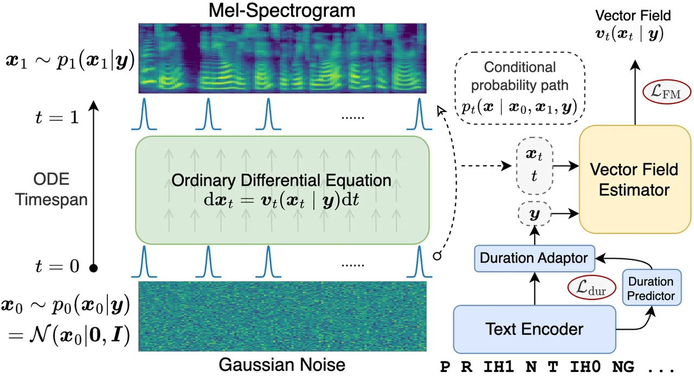
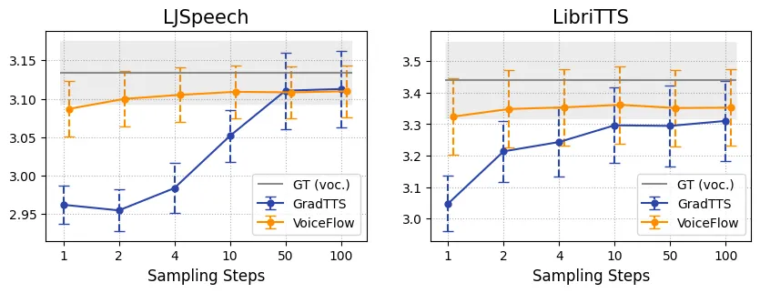
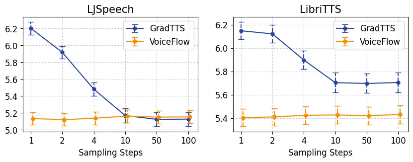
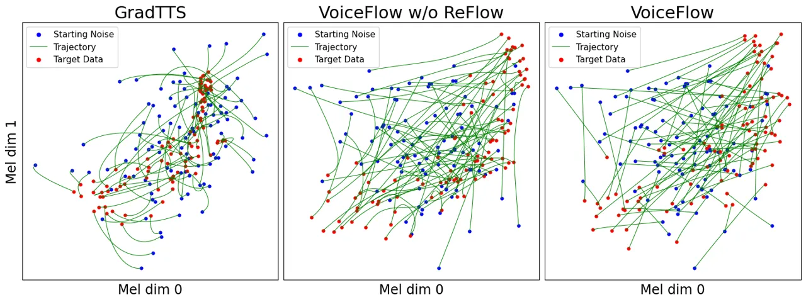

# VoiceFlow: Efficient Text-to-Speech with Rectified Flow Matching

Yiwei Guo    Chenpeng Du    Ziyang Ma    Xie Chen    Kai
Yu\sthanksCorresponding author

###### Abstract

Although diffusion models in text-to-speech have become a popular choice
due to their strong generative ability, the intrinsic complexity of
sampling from diffusion models harms their efficiency. Alternatively, we
propose VoiceFlow, an acoustic model that utilizes a rectified flow
matching algorithm to achieve high synthesis quality with a limited
number of sampling steps. VoiceFlow formulates the process of generating
mel-spectrograms into an ordinary differential equation conditional on
text inputs, whose vector field is then estimated. The rectified flow
technique then effectively straightens its sampling trajectory for
efficient synthesis. Subjective and objective evaluations on both single
and multi-speaker corpora showed the superior synthesis quality of
VoiceFlow compared to the diffusion counterpart. Ablation studies
further verified the validity of the rectified flow technique in
VoiceFlow.

###### Index Terms: 

Text-to-speech, flow matching, rectified flow, efficiency, speed-quality
tradeoff

^(†)^(†)address: X-LANCE Lab, Department of Computer Science and
Engineering  
Shanghai Jiao Tong University, Shanghai, China  
MoE Key Lab of Artificial Intelligence, AI Institute  
{yiwei.guo, duchenpeng, zym.22, chenxie95, kai.yu}@sjtu.edu.cn

## 1 Introduction

Modern text-to-speech (TTS) has witnessed tremendous progress by
adopting different types of advanced generative algorithms, such as TTS
models with GANs \[1, 2\], normalizing flows \[3, 4, 2\],
self-supervised features \[5, 6\] or denoising diffusion models \[7, 8,
9, 10\]. Among them, diffusion-based TTS models recently received
growing attention because of their high synthesis quality, such as
GradTTS \[7\] and DiffVoice \[9\]. They also show versatile
functionalities such as conditional generation \[11, 12\], speech
editing \[13, 9, 10\] and speaker adaptation \[9, 10\]. By estimating
the score function $`\nabla\log p_{t}(\bm{x})`$ of a stochastic
differential equation (SDE), diffusion models are stable to
train \[14\]. They generate realistic samples by numerically solving the
reverse-time SDE or the associated probability-flow ordinary
differential equation (ODE).

However, a major drawback of diffusion models lies in their efficiency.
Regardless of SDE or ODE sampling methods, diffusion models typically
require numerous steps to generate a satisfying sample, causing a large
latency in inference. Some efforts have been made to mitigate this issue
and improve the speed-quality tradeoff in diffusion-based TTS models,
usually by extra mathematical tools or knowledge distillation. Fast
GradTTS\[15\] adopts maximum likelihood SDE solver \[16\], progressive
distillation \[17\] and denoising diffusion GAN \[18\] to accelerate
diffusion sampling. FastDiff \[19\] optimizes diffusion noise schedules
inspired by BDDM \[20\]. ProDiff \[21\] also uses a progressive
distillation technique to halve the sampling steps from DDIM \[22\]
teacher iteratively. LightGrad \[23\] adopts DPM-Solver \[24\] to
explicitly derive a solution of probability-flow ODE. A concurrent work,
CoMoSpeech \[25\], integrates the consistency model \[26\] as a special
type of diffusion distillation. These models successfully decrease the
necessary number of sampling steps in diffusion models to some extent.
However, due to the intricate nature of the diffusion process, the
speed-quality tradeoff still exists and is hard to overcome.

Despite denoising diffusion, another branch in the family of
differential-equation-based generative models began to arise recently,
namely the flow matching generative models \[27, 28, 29\]. While
diffusion models learn the score function of a specific SDE, flow
matching aims to model the vector field implied by an arbitrary ODE
directly. A neural network is used for approximating the vector field,
and the ODE can also be numerically solved to obtain data samples. The
design of such ODE and vector field often considers linearizing the
sampling trajectory and minimizing the transport cost \[29\]. As a
result, flow matching models have simpler formulations and fewer
constraints but better quality. VoiceBox \[30\] shows the potential of
flow matching in fitting large-scale speech data, and LinDiff \[31\]
shares a similar concept in the study of vocoders. More importantly, the
rectified flow \[28\] technique in flow matching models further
straightens the ODE trajectory in a concise way. By training a flow
matching model again but with its own generated samples, the sampling
trajectory of rectified flow theoretically approaches a straightforward
line, which improves the efficiency of sampling. In essence, rectified
flow matching achieves good sample quality even with a very limited
number of sampling steps. As a side note, its ODE nature also makes flow
matching extensible for knowledge distillation similar in previous
diffusion-based works \[28\].

Inspired by these, we propose to utilize rectified flow matching in the
TTS acoustic model for the first time in literature. We construct an ODE
to flow between noise distribution and mel-spectrogram while
conditioning it with phones and duration. An estimator learns to model
the underlying vector field. Then, a flow rectification process is
applied, where we generate samples from the trained flow matching model
to train itself again. In this way, our model is able to generate decent
mel-spectrograms with much fewer steps. We name our model VoiceFlow. To
fully investigate its ability, we experiment both on the single-speaker
benchmark LJSpeech and the larger multi-speaker dataset LibriTTS. The
results show that VoiceFlow outperforms the diffusion baseline in a
sufficient number of sampling steps. In a highly limited budget such as
two steps, VoiceFlow still maintains a similar performance while the
diffusion model cannot generate reasonable speech. Therefore, VoiceFlow
achieves better efficiency and speed-quality tradeoff while sampling.
The code and audio samples are available online¹¹ 1
[https://cantabile-kwok.github.io/VoiceFlow](https://cantabile-kwok.github.io/VoiceFlow).

## 2 Flow Matching and Rectified Flow

### 2.1 Flow Matching Generative Models

Denote the data distribution as $`p_{1}(\bm{x}_{1})`$ and some tractable
prior distribution as $`p_{0}(\bm{x}_{0})`$. Most generative models work
by finding a way to map samples $`\bm{x}_{0}\sim p_{0}(\bm{x}_{0})`$ to
data $`\bm{x}_{1}`$. Particularly, diffusion models manually construct a
special SDE, and then estimate the score function of the probability
path $`p_{t}(\bm{x}_{t})`$ yielded by it. Sampling is tackled by solving
either the reverse-time SDE or probability-flow ODE alongside this
probability path. Flow matching generative models, on the other hand,
model the probability path $`p_{t}(\bm{x}_{t})`$ directly \[27\].
Consider an arbitrary ODE

```math
{{\mathrm{d}}\bm{x}_{t}}=\bm{v}_{t}(\bm{x}_{t}){{\mathrm{d}}t} \tag{1}
```

with $`\bm{v}_{t}(\cdot)`$ named the vector field and $`t\in[0,1]`$.
This ODE is associated with a probability path $`p_{t}(\bm{x}_{t})`$ by
the continuity equation
$`\frac{{\mathrm{d}}}{{\mathrm{d}}t}\log p_{t}(\bm{x})+\operatorname{div}(p_{t}(\bm{x})\bm{v}_{t}(\bm{x}))=0`$.
It is sufficient to generate realistic data if a neural network can
accurately estimate the vector field $`\bm{v}_{t}(\cdot)`$, since the
ODE in Eq.(1) can be solved numerically then.

However, the design of the vector field needs to be instantiated before
practically applied. \[27\] proposes the method of constructing a
conditional probability path with a data sample $`\bm{x}_{1}`$. Suppose
this probability path is $`p_{t}(\bm{x}\mid\bm{x}_{1})`$, with boundary
condition $`p_{t=0}(\bm{x}\mid\bm{x}_{1})=p_{0}(\bm{x})`$ and
$`p_{t=1}(\bm{x}\mid\bm{x}_{1})=\mathcal{N}(\bm{x}\mid\bm{x}_{1},\sigma^{2}\bm{I})`$
for sufficiently small $`\sigma`$. By the continuity equation, there is
an associated vector field $`\bm{v}_{t}(\bm{x}\mid\bm{x}_{1})`$. It is
proven that estimating the conditional vector field by neural network
$`\bm{u}_{\theta}`$ is equivalent, in the sense of expectation, to
estimating the unconditional vector field, i.e.

```math
\displaystyle\min_{\theta}\mathbb{E}_{t,p_{t}(\bm{x})}\|\bm{u}_{\theta}(\bm{x},t)-\bm{v}_{t}(\bm{x})\|^{2} \tag{2}
```

```math
\displaystyle\equiv \displaystyle\min_{\theta}\mathbb{E}_{t,p_{1}(\bm{x}_{1}),p_{t}(\bm{x}\mid\bm{x}_{1})}\|\bm{u}_{\theta}(\bm{x},t)-\bm{v}_{t}(\bm{x}\mid\bm{x}_{1})\|^{2}. \tag{3}
```

Then, by designing a simple conditional probability path
$`p_{t}(\bm{x}\mid\bm{x}_{1})`$ and the corresponding
$`\bm{v}_{t}(\bm{x}\mid\bm{x}_{1})`$, one can easily draw samples from
$`p_{t}(\bm{x}\mid\bm{x}_{1})`$ and minimize Eq.(3). For example, \[27\]
uses the Gaussian path
$`p_{t}(\bm{x}\mid\bm{x}_{1})=\mathcal{N}(\bm{x}\mid\bm{\mu}_{t}(\bm{x}_{1}),\sigma_{t}(\bm{x}_{1})^{2}\bm{I})`$
and linear vector field
$`\bm{v}_{t}(\bm{x}\mid\bm{x}_{1})=\frac{\sigma^{\prime}_{t}(\bm{x}_{1})}{\sigma_{t}(\bm{x}_{1})}(\bm{x}-\bm{\mu}_{t}(\bm{x}_{1}))+\bm{\mu}_{t}^{\prime}(\bm{x}_{1})`$.

Meanwhile, this conditioning technique can be further generalized, i.e.
any condition $`z`$ for $`p_{t}(\bm{x}\mid z)`$ can lead to the same
form of optimization target like Eq.(3). Thus, \[29\] proposes to
additionally condition on a noise sample $`\bm{x}_{0}`$ to form a
probability path
$`p_{t}(\bm{x}\mid\bm{x}_{0},\bm{x}_{1})=\mathcal{N}(\bm{x}\mid t\bm{x}_{1}+(1-t)\bm{x}_{0},\sigma^{2}\bm{I})`$.
The conditional vector field therefore becomes
$`\bm{v}_{t}(\bm{x}\mid\bm{x}_{0},\bm{x}_{1})=\bm{x}_{1}-\bm{x}_{0}`$,
which is a constant straight line towards $`\bm{x}_{1}`$. In this
formulation, training the generative model only requires the following
steps:

1.  1.  Sample $`\bm{x}_{1}`$ from data and $`\bm{x}_{0}`$ from any noise
        distribution $`p_{0}(\bm{x}_{0})`$;
2.  2.  Sample a time $`t\in[0,1]`$ and then
        $`\bm{x}_{t}\sim\mathcal{N}(t\bm{x}_{1}+(1-t)\bm{x}_{0},\sigma^{2}\bm{I})`$;
3.  3.  Apply gradient descent on loss
        $`\|\bm{u}_{\theta}(\bm{x},t)-(\bm{x}_{1}-\bm{x}_{0})\|^{2}`$.

This is often referred to as the “conditional flow matching” algorithm,
which is proven to outperform diffusion-based models with deep
correlation to the optimal transport theory \[29\].

### 2.2 Improved Sampling Efficiency with Rectified Flow

The notion of rectified flow is proposed in \[28\]. It is a simple but
mathematically solid approach to improve the sampling efficiency of flow
matching models. The flow matching model here has the same formulation
as that of \[29\], which is conditioned on both $`\bm{x}_{1}`$ and
$`\bm{x}_{0}`$. Suppose a flow matching model is trained to generate
data $`\bm{\hat{x}}_{1}`$ from noise $`\bm{x}_{0}`$ by the ODE in
Eq.(1). In other words, $`\bm{x}_{0}`$ and $`\bm{\hat{x}}_{1}`$ are a
pair of the starting and ending points of the ODE trajectory. Then, this
flow matching model is trained again, but conditions
$`\bm{v}_{t}(\bm{x}\mid\bm{x}_{0},\bm{x}_{1})`$ and
$`p_{t}(\bm{x}\mid\bm{x}_{0},\bm{x}_{1})`$ on the given pair
$`(\bm{x}_{0},\bm{\hat{x}}_{1})`$ instead of independently sampling
$`\bm{x}_{0},\bm{x}_{1}`$. This flow rectification step can be iterated
multiple times, denoted by the recursion
$`\left(\bm{z}_{0}^{k+1},\bm{z}_{1}^{k+1}\right)=\operatorname{FM}\left(\bm{z}_{0}^{k},\bm{z}_{1}^{k}\right)`$,
with $`\operatorname{FM}`$ the flow matching model and
$`(\bm{z}_{0}^{0},\bm{z}_{1}^{0})=(\bm{x}_{0},\bm{x}_{1})`$ the
independently drawn noise and data samples.

Intuitively, rectified flow “rewires” the sampling trajectory of flow
matching models to become more straight. Because the ODE trajectories
cannot intersect when being solved, most likely the trajectory cannot be
as straight as the conditional vector field in training. However, by
training the flow matching model again on the endpoints of the same
trajectory, the model learns to find a shorter path to connect these
noise and data. This straightening tendency is theoretically guaranteed
in \[28\]. By rectifying the trajectories, flow matching models will be
able to sample data more efficiently with fewer steps of ODE simulation.

## 3 VoiceFlow



Figure 1: Working diagram of the VoiceFlow model

### 3.1 Flow Matching-Based Acoustic Model

To utilize flow matching models in TTS, we cast it as a
non-autoregressive conditional generation problem with mel-spectrogram
$`\bm{x}_{1}\in\mathbb{R}^{d}`$ as the target data and noise
$`\bm{x}_{0}\in\mathbb{R}^{d}`$ from standard Gaussian distribution
$`\mathcal{N}(\bm{0},\bm{I})`$. We consider using an explicit duration
learning module from forced alignments like in \[8\]. Denote the
duplicated latent phone representation as $`\bm{y}`$, where each phone’s
latent embedding is repeated according to its duration. Then, $`\bm{y}`$
is regarded as the condition of the generation process. Specifically,
suppose $`\bm{v}_{t}(\bm{x}_{t}\mid\bm{y})\in\mathbb{R}^{d}`$ is the
underlying vector field for the ODE
$`{\mathrm{d}}\bm{x}_{t}=\bm{v}_{t}(\bm{x}_{t}\mid\bm{y}){\mathrm{d}}t`$.
Suppose this ODE connects the noise distribution
$`p_{0}(\bm{x}_{0}\mid\bm{y})=\mathcal{N}(\bm{0},\bm{I})`$ with mel
distribution given text
$`p_{1}(\bm{x}_{1}\mid\bm{y})=p_{\text{mel}}(\bm{x}_{1}\mid\bm{y})`$.
Our goal is to accurately estimate the vector field $`\bm{v}_{t}`$ given
condition $`\bm{y}`$, as we can then generate a mel-spectrogram by
solving this ODE from $`t=0`$ to $`t=1`$.

Inspired by \[28, 29\], we opt to use both a noise sample $`\bm{x}_{0}`$
and a data sample $`\bm{x}_{1}`$ to construct conditional probability
paths as

```math
p_{t}(\bm{x}\mid\bm{x}_{0},\bm{x}_{1},\bm{y})=\mathcal{N}(\bm{x}\mid t\bm{x}_{1}+(1-t)\bm{x}_{0},\sigma^{2}\bm{I}) \tag{4}
```

where $`\sigma`$ is a sufficiently small constant. In this formulation,
the endpoints of these paths are
$`\mathcal{N}(\bm{x}_{0},\sigma^{2}\bm{I})`$ for $`t=0`$ and
$`\mathcal{N}(\bm{x}_{1},\sigma^{2}\bm{I})`$ for $`t=1`$ respectively.
These paths also determine a probability path
$`p_{t}(\bm{x}\mid\bm{y})`$ marginal w.r.t $`\bm{x}_{0},\bm{x}_{1}`$,
whose boundaries approximate the noise distribution
$`p_{0}(\bm{x}_{0}\mid\bm{y})`$ and mel distribution
$`p_{1}(\bm{x}_{1}\mid\bm{y})`$. Intuitively, Eq.(4) specifies a family
of Gaussians moving in a linear path. The related vector field can be
simply
$`\bm{v}_{t}(\bm{x}\mid\bm{x}_{0},\bm{x}_{1},\bm{y})=\bm{x}_{1}-\bm{x}_{0}`$,
also a constant linear line.

Then, we use a neural network $`\bm{u}_{\theta}`$ to estimate the vector
field. Similar to Eq.(3), the objective here is

```math
\min_{\theta}\mathbb{E}_{t,p_{1}(\bm{x}_{1}\mid\bm{y}),p_{0}(\bm{x}_{0}\mid\bm{y}),p_{t}(\bm{x}_{t}\mid\bm{x}_{0},\bm{x}_{1},\bm{y})}\|\bm{u}_{\theta}(\bm{x}_{t},\bm{y},t)-(\bm{x}_{1}-\bm{x}_{0})\|^{2} \tag{5}
```

The corresponding flow matching loss is denoted by
$`\mathcal{L}_{\text{FM}}`$. The total loss function to train VoiceFlow
will be
$`\mathcal{L}=\mathcal{L}_{\text{FM}}+\mathcal{L}_{\text{dur}}`$, where
$`\mathcal{L}_{\text{dur}}`$ is the mean squared loss for duration
predictor. So, the whole acoustic model of VoiceFlow consists of the
text encoder, duration predictor, duration adaptor and vector field
estimator, as is shown in Fig. 1. The text encoder transforms the input
phones into a latent space, upon which the duration per phone is
predicted and fed to the duration adaptor. The repeated frame-level
sequence $`\bm{y}`$ is then fed to the vector field estimator as a
condition. The other two inputs to the vector field estimator are the
sampled time $`t`$ and the sampled $`\bm{x}_{t}`$ from the conditional
probability path in Eq.(4). We adopt the same U-Net architecture in the
vector field estimator as in GradTTS²² 2 Two down and up-samples with 2D
convolution as residual blocks. The condition $`\bm{y}`$ is concatenated
with $`\bm{x}_{t}`$ before entering the estimator, and the time $`t`$ is
passed through some fully connected layers before being added to the
hidden variable in residual blocks each time.

In multi-speaker scenarios, the condition will become both the text
$`\bm{y}`$ and some speaker representation $`\bm{s}`$. But for
simplicity, we will still use the notation of $`\bm{y}`$ as the
condition in the following sections.

### 3.2 Sampling and Flow Rectification Step

By Eq.(5), the vector field estimator $`\bm{u}_{\theta}`$ is able to
approximate $`\bm{v}_{t}`$ in the expectation sense. Then, the ODE
$`{\mathrm{d}}\bm{x}_{t}=\bm{u}_{\theta}(\bm{x}_{t},\bm{y},t){\mathrm{d}}t`$
can be discretized for sampling a synthetic mel-spectrogram
$`\bm{x}_{1}`$ given text $`\bm{y}`$. Off-the-shelf ODE solvers like
Euler, Runge-Kutta, Dormand-Prince method, etc. can be directly applied
for sampling. In the example of the Euler method with $`N`$ steps, each
sampling step is

```math
\bm{\hat{x}}_{\frac{k+1}{N}}=\bm{\hat{x}}_{\frac{k}{N}}+\frac{1}{N}{\bm{u}_{\theta}\left(\bm{\hat{x}}_{\frac{k}{N}},\bm{y},\frac{k}{N}\right)},k=0,1,...,N-1 \tag{6}
```

with $`\bm{\hat{x}}_{0}\sim p_{0}(\bm{x}_{0}\mid\bm{y})`$ being the
initial point and $`\bm{\hat{x}}_{1}`$ being the generated sample.
Regardless of the discretization method, the solvers will produce a
sequence of samples $`\{\bm{\hat{x}}_{k/N}\}`$ along the ODE trajectory,
which gradually approximates a realistic spectrogram.

Then we apply the rectified flow technique to further straighten the ODE
trajectory. For every utterance in the training set, we draw a noise
sample $`\bm{x}^{\prime}_{0}`$ and run the ODE solver to obtain
$`\bm{\hat{x}}_{1}`$ given text $`\bm{y}`$. The sample pair
$`(\bm{x}^{\prime}_{0},\bm{\hat{x}}_{1})`$ is then fed to the VoiceFlow
again for rectifying the vector field estimator. In this flow
rectification step, the new training criterion will be

```math
\min_{\theta}\mathbb{E}_{t,p(\bm{x}^{\prime}_{0},\bm{\hat{x}}_{1}\mid\bm{y}),p_{t}(\bm{x}_{t}\mid\bm{x}^{\prime}_{0},\bm{\hat{x}}_{1},\bm{y})}\|\bm{u}_{\theta}(\bm{x}_{t},\bm{y},t)-(\bm{\hat{x}}_{1}-\bm{x}^{\prime}_{0})\|^{2} \tag{7}
```

where the only difference with Eq.(5) is paired
$`(\bm{x}^{\prime}_{0},\bm{\hat{x}}_{1})`$ are used instead of
independently sampled. In Eq.(7), every spectrogram sample
$`\bm{\hat{x}}_{1}`$ is associated with a noise sample in the same
trajectory. In this way, the vector field estimator is asked to find a
more straightforward sampling trajectory connecting
$`(\bm{x}^{\prime}_{0},\bm{\hat{x}}_{1})`$, which improves the sampling
efficiency to a large extent. Note that we provide the model with the
ground truth duration sequence while generating data for rectified flow.
This ensures that the model is fed with more natural speech, reducing
the risk that inaccurate duration prediction degrades the model
performance.

Algorithm 1 summarizes the whole process of training VoiceFlow,
including flow rectification.

Input: Paired text, duration and mel-spectrogram $`\bm{x}_{1}`$ with
optional speaker information

Result: Trained VoiceFlow model, which contains vector field estimator
$`\bm{u}_{\theta}(\bm{x},\bm{y},t)`$

1 Function _TrainStep(_$`\bm{u}_{\theta},\bm{x}_{0},\bm{x}_{1}`$_)_:

   2 Compute $`\bm{y},\mathcal{L}_{\text{dur}}`$ using text and
duration;

   3 Sample $`t\sim\operatorname{Uniform}[0,1]`$;

   4 Sample
$`\bm{x}_{t}\sim\mathcal{N}(t\bm{x}_{1}+(1-t)\bm{x}_{0},\sigma^{2}\bm{I})`$;

   5
$`\mathcal{L}_{\text{FM}}\leftarrow\|\bm{u}_{\theta}(\bm{x}_{t},\bm{y},t)-(\bm{x}_{1}-\bm{x}_{0})\|^{2}`$;

   6 Gradient descent on
$`\mathcal{L}_{\text{FM}}+\mathcal{L}_{\text{dur}}`$;

7 while _perform flow matching_ do

   8 Take batch and sample $`\bm{x}_{0}`$ from
$`\mathcal{N}(\bm{0},\bm{I})`$;

   9 TrainStep(_$`\bm{u}_{\theta},\bm{x}_{0},\bm{x}_{1}`$_);

10 for _every utterance in training set_ do

   11 Sample a $`\bm{x}^{\prime}_{0}`$ and solve the ODE by Eq.(6) to
obtain $`\bm{\hat{x}}_{1}`$, using trained $`\bm{u}_{\theta}`$ and
ground truth duration;

12 while _perform flow rectification_ do

   13 Take batch with associated $`\bm{x}^{\prime}_{0}`$;

   14
TrainStep(_$`\bm{u}_{\theta},\bm{x}^{\prime}_{0},\bm{\hat{x}_{1}}`$_);

Algorithm 1 Training VoiceFlow with flow rectification

## 4 Experiments and Results

### 4.1 Experimental Setup

We evaluated VoiceFlow both on the single-speaker and multi-speaker
benchmarks, so as to obtain a comprehensive observation of the proposed
TTS system. For single-speaker evaluations, we used the LJSpeech \[32\]
dataset, which contains approximately 24 hours of high-quality female
voice recordings. For multi-speaker experiments, we included all the
training partitions of the LibriTTS \[33\] dataset, which amounted to
585 hours and over 2300 speakers. We downsampled all the training data
to 16kHz for simplicity. Mel-spectrogram and forced alignments were
extracted with 12.5ms frame shift and 50ms frame length on each corpus
by Kaldi \[34\].

We compared VoiceFlow with the diffusion-based acoustic model GradTTS.
To only focus on the algorithmic differences, we used the official
implementation of GradTTS³³ 3
[https://github.com/huawei-noah/Speech-Backbones/tree/main/Grad-TTS](https://github.com/huawei-noah/Speech-Backbones/tree/main/Grad-TTS)
and trained it with the same data configurations. We also used ground
truth duration instead of the monotonic alignment search algorithm in
GradTTS to mitigate the impact of different durations. Notably, we used
exactly the same model architecture to build VoiceFlow, so the two
compared models have nearly identical inference costs when the ODEs are
both solved using Euler method with the same number of steps.

As the acoustic models generate mel-spectrograms as targets,
HifiGAN \[35\] was adopted as the vocoder and trained separately on the
two datasets.

### 4.2 Subjective Evaluations

We first evaluated the system performance of VoiceFlow compared to
GradTTS using subjective listening tests. In this test, listeners were
asked to rate the mean opinion score (MOS) of the provided speech clips
based on the audio quality and naturalness. For both the acoustic
models, we used 2, 10 and 100 steps representing low, medium and large
number of sampling steps for synthesis. The results are presented in
Table 1, where “GT (voc.)” means the vocoded ground truth speech. It can
be seen that in both the two datasets and three sampling scenarios,
VoiceFlow achieves a consistently higher MOS score than GradTTS. Also,
when the sampling steps are decreased, the performance of GradTTS drops
significantly while VoiceFlow does not suffer from such huge
degeneration. Specifically, in 2-step sampling situations, samples from
GradTTS become heavily degraded, but that from VoiceFlow remains to be
satisfying. Note that the 10-step GradTTS was already reported to be
competitive against other baselines \[7\]. In LibriTTS, the corpus with
large speaker and environment variability, the difference of compared
systems becomes more obvious. This suggests the stronger potential of
flow-matching-based models in fitting complex speech data.

| Model     | Sampling Steps            | LJSpeech        | LibriTTS        |
| --------- | ------------------------- | --------------- | --------------- |
| GradTTS   | 2                         | 2.98$`\pm`$0.06 | 2.52$`\pm`$0.12 |
| VoiceFlow | ($`\approx`$3605frames/s) | 3.92$`\pm`$0.07 | 3.81$`\pm`$0.07 |
| GradTTS   | 10                        | 3.97$`\pm`$0.07 | 3.43$`\pm`$0.09 |
| VoiceFlow | ($`\approx`$985frames/s)  | 4.10$`\pm`$0.06 | 3.84$`\pm`$0.07 |
| GradTTS   | 100                       | 4.03$`\pm`$0.09 | 3.45$`\pm`$0.12 |
| VoiceFlow | ($`\approx`$102frames/s)  | 4.17$`\pm`$0.07 | 3.85$`\pm`$0.12 |
| GT (voc.) | \-                        | 4.52$`\pm`$0.07 | 4.42$`\pm`$0.06 |

Table 1: MOS evaluation in low, medium and large sampling steps

### 4.3 Objective Evaluations



Figure 2: MOSnet evaluations in multiple choices of sampling steps



Figure 3: MCD evaluations in multiple choices of sampling steps

We also objectively evaluated the performance of VoiceFlow. Two metrics
were included for comparison: MOSnet \[36\] and mel-cepstral distortion
(MCD). MOSnet is a neural network designed to fit human perception of
speech signals, and we found it correctly reflects speech quality to a
reasonable extent. We use the officially trained MOSnet model to
evaluate synthetic speech on more choices of sampling steps. The results
are plotted in Fig. 2, where the shadowed region stands for the mean and
95% confidence interval of MOSnet score on ground truth speech. It can
be seen to mainly conform with the MOS results, as the change of
VoiceFlow’s scores among different sampling steps is much lower than
that of GradTTS. MCD is another objective tool to measure the distortion
of the cepstrum against ground truth. The cepstrum order here is set to
be 13. Similarly, the MCD values on different numbers of sampling steps
are shown in Fig. 3, also verifying the better speed-quality tradeoff of
VoiceFlow compared to the diffusion counterpart.

### 4.4 Ablation Study

| Model     | LJSpeech         | LibriTTS         |
| --------- | ---------------- | ---------------- |
| VoiceFlow | \-               | \-               |
| -ReFlow   | -0.78$`\pm`$0.13 | -1.21$`\pm`$0.19 |

Table 2: CMOS evaluation in 2 sampling steps

We also conducted an ablation study to verify the effectiveness of the
rectified flow technique in VoiceFlow. A comparative MOS (CMOS) test was
performed where raters were asked to rate the score of a given sentence
compared to the reference, ranging from -3 to 3. Table 2 shows the
results with 2 sampling steps, where “-ReFlow” means VoiceFlow without
rectified flow. It is noticeable that rectified flow makes a remarkable
effect in such limited sampling steps, and LibriTTS exhibits an even
more significant difference than LJSpeech.

To provide an intuition on the impact of rectified flow, we visualized
some sampling trajectories of VoiceFlow both with and without rectified
flow on two out of the 80 mel dimensions in Figure 4. The trajectory of
GradTTS is also shown here. Then, the visual contrast between the
straight and curving trajectories leaves no doubt on the efficacy of
using rectified flow in TTS models.



Figure 4: Visualization of sampling trajectories

## 5 Conclusion

In this study, we proposed VoiceFlow, a TTS acoustic model based on
rectified flow matching, that achieves better efficiency and
speed-quality tradeoff than diffusion-based acoustic models. Although
belonging to the ODE generative model family, flow matching with the
rectified flow can automatically straighten its sampling trajectory,
thus greatly lowering the sampling cost for generating high-quality
speech. Experiments on single and multi-speaker benchmarks proved the
competence of VoiceFlow across different number of sampling steps, and
the effectiveness of flow rectification for efficient generation. We
believe that the potential of flow matching in TTS research has yet to
be discovered, including areas such as automatic alignment search and
voice conversion.

## 6 Acknowledgement

This work was supported by China NSFC Project (No. 92370206), Shanghai
Municipal Science and Technology Major Project  
(2021SHZDZX0102) and the Key Research and Development Program of Jiangsu
Province, China (No. BE2022059).

## REFERENCES

- \[1\] M. Bińkowski, J. Donahue, S. Dieleman, A. Clark, E. Elsen,
  N. Casagrande, L. C. Cobo, and K. Simonyan, “High fidelity speech
  synthesis with adversarial networks,” in _Proc. ICLR_, 2020.
- \[2\] J. Kim, J. Kong, and J. Son, “Conditional variational
  autoencoder with adversarial learning for end-to-end text-to-speech,”
  in _Proc. ICML_. PMLR, 2021, pp. 5530–5540.
- \[3\] J. Kim, S. Kim, J. Kong, and S. Yoon, “Glow-TTS: A generative
  flow for text-to-speech via monotonic alignment search,” _Proc.
  NeurIPS_, vol. 33, pp. 8067–8077, 2020.
- \[4\] R. Valle, K. J. Shih, R. Prenger, and B. Catanzaro, “Flowtron:
  an autoregressive flow-based generative network for text-to-speech
  synthesis,” in _Proc. ICLR_, 2021.
- \[5\] C. Du, Y. Guo, X. Chen, and K. Yu, “VQTTS: High-Fidelity
  Text-to-Speech Synthesis with Self-Supervised VQ Acoustic Feature,” in
  _Proc. Interspeech 2022_, pp. 1596–1600.
- \[6\] C. Du, Y. Guo, X. Chen, and K. Yu, “Speaker adaptive
  text-to-speech with timbre-normalized vector-quantized feature,”
  _IEEE/ACM Trans. ASLP._, 2023.
- \[7\] V. Popov, I. Vovk, V. Gogoryan, T. Sadekova, and M. Kudinov,
  “Grad-TTS: A diffusion probabilistic model for text-to-speech,” in
  _Proc. ICML_. PMLR, 2021, pp. 8599–8608.
- \[8\] J. Liu, C. Li, Y. Ren, F. Chen, and Z. Zhao, “DiffSinger:
  Singing voice synthesis via shallow diffusion mechanism,” in
  _Proceedings of the AAAI conference on artificial intelligence_,
  vol. 36, no. 10, 2022, pp. 11 020–11 028.
- \[9\] Z. Liu, Y. Guo, and K. Yu, “DiffVoice: Text-to-speech with
  latent diffusion,” in _Proc. IEEE ICASSP_, 2023.
- \[10\] C. Du, Y. Guo, F. Shen, Z. Liu, Z. Liang, X. Chen, S. Wang,
  H. Zhang, and K. Yu, “UniCATS: A unified context-aware text-to-speech
  framework with contextual vq-diffusion and vocoding,” _arXiv preprint
  arXiv:2306.07547_, 2023.
- \[11\] H. Kim, S. Kim, and S. Yoon, “Guided-TTS: A diffusion model for
  text-to-speech via classifier guidance,” in _Proc. ICML_. PMLR, 2022,
  pp. 11 119–11 133.
- \[12\] Y. Guo, C. Du, X. Chen, and K. Yu, “EmoDiff: Intensity
  controllable emotional text-to-speech with soft-label guidance,” in
  _Proc. IEEE ICASSP_, 2023.
- \[13\] J. Tae, H. Kim, and T. Kim, “EdiTTS: Score-based Editing for
  Controllable Text-to-Speech,” in _Proc. Interspeech 2022_, 2022, pp.
  421–425.
- \[14\] P. Dhariwal and A. Nichol, “Diffusion models beat gans on image
  synthesis,” _Proc. NeurIPS_, vol. 34, pp. 8780–8794, 2021.
- \[15\] I. Vovk, T. Sadekova, V. Gogoryan, V. Popov, M. Kudinov, and
  J. Wei, “Fast Grad-TTS: Towards efficient diffusion-based speech
  generation on cpu,” _Proc. Interspeech 2022_, pp. 838–842, 2022.
- \[16\] V. Popov, I. Vovk, V. Gogoryan, T. Sadekova, M. S. Kudinov, and
  J. Wei, “Diffusion-based voice conversion with fast maximum likelihood
  sampling scheme,” in _Proc. ICLR_, 2022.
- \[17\] T. Salimans and J. Ho, “Progressive distillation for fast
  sampling of diffusion models,” in _Proc. ICLR_, 2022.
- \[18\] Z. Xiao, K. Kreis, and A. Vahdat, “Tackling the generative
  learning trilemma with denoising diffusion GANs,” in _Proc.
  ICLR_, 2022.
- \[19\] R. Huang, M. W. Y. Lam, J. Wang, D. Su, D. Yu, Y. Ren, and
  Z. Zhao, “FastDiff: A fast conditional diffusion model for
  high-quality speech synthesis,” in _Proc. IJCAI_, 2022, pp. 4157–4163.
- \[20\] M. W. Y. Lam, J. Wang, D. Su, and D. Yu, “BDDM: Bilateral
  denoising diffusion models for fast and high-quality speech
  synthesis,” in _Proc. ICLR_, 2022.
- \[21\] R. Huang, Z. Zhao, H. Liu, J. Liu, C. Cui, and Y. Ren,
  “ProDiff: Progressive fast diffusion model for high-quality
  text-to-speech,” in _Proceedings of the 30th ACM International
  Conference on Multimedia_, 2022, pp. 2595–2605.
- \[22\] J. Song, C. Meng, and S. Ermon, “Denoising diffusion implicit
  models,” in _Proc. ICLR_, 2021.
- \[23\] J. Chen, X. Song, Z. Peng, B. Zhang, F. Pan, and Z. Wu,
  “LightGrad: Lightweight diffusion probabilistic model for
  text-to-speech,” in _Proc. IEEE ICASSP_, 2023.
- \[24\] C. Lu, Y. Zhou, F. Bao, J. Chen, C. Li, and J. Zhu,
  “DPM-solver: A fast ode solver for diffusion probabilistic model
  sampling in around 10 steps,” _Proc. NeurIPS_, vol. 35, pp.
  5775–5787, 2022.
- \[25\] Z. Ye, W. Xue, X. Tan, J. Chen, Q. Liu, and Y. Guo,
  “CoMoSpeech: One-step speech and singing voice synthesis via
  consistency model,” _arXiv preprint arXiv:2305.06908_, 2023.
- \[26\] Y. Song, P. Dhariwal, M. Chen, and I. Sutskever, “Consistency
  models,” in _Proc. ICML_. PMLR, 2023, pp. 32 211–32 252.
- \[27\] Y. Lipman, R. T. Q. Chen, H. Ben-Hamu, M. Nickel, and M. Le,
  “Flow matching for generative modeling,” in _Proc. ICLR_, 2023.
- \[28\] X. Liu, C. Gong, and Q. Liu, “Flow straight and fast: Learning
  to generate and transfer data with rectified flow,” in _NeurIPS 2022
  Workshop on Score-Based Methods_, 2022.
- \[29\] A. Tong, N. Malkin, G. Huguet, Y. Zhang, J. Rector-Brooks,
  K. FATRAS, G. Wolf, and Y. Bengio, “Improving and generalizing
  flow-based generative models with minibatch optimal transport,” in
  _ICML Workshop on New Frontiers in Learning, Control, and Dynamical
  Systems_, 2023.
- \[30\] M. Le, A. Vyas, B. Shi, B. Karrer, L. Sari, R. Moritz,
  M. Williamson, V. Manohar, Y. Adi, J. Mahadeokar _et al._, “Voicebox:
  Text-guided multilingual universal speech generation at scale,” _arXiv
  preprint arXiv:2306.15687_, 2023.
- \[31\] H. Liu, T. Wang, J. Cao, R. He, and J. Tao, “Boosting fast and
  high-quality speech synthesis with linear diffusion,” _arXiv preprint
  arXiv:2306.05708_, 2023.
- \[32\] K. Ito and L. Johnson, “The LJ speech dataset,” 2017.
- \[33\] H. Zen, R. Clark, R. J. Weiss, V. Dang, Y. Jia, Y. Wu,
  Y. Zhang, and Z. Chen, “LibriTTS: A corpus derived from librispeech
  for text-to-speech,” in _Interspeech_, 2019.
- \[34\] D. Povey, A. Ghoshal, G. Boulianne, L. Burget, O. Glembek,
  N. Goel, M. Hannemann, P. Motlicek, Y. Qian, P. Schwarz _et al._, “The
  Kaldi speech recognition toolkit,” in _Proc. IEEE ASRU_. IEEE Signal
  Processing Society, 2011.
- \[35\] J. Kong, J. Kim, and J. Bae, “Hifi-GAN: Generative adversarial
  networks for efficient and high fidelity speech synthesis,” _Proc.
  NeurIPS_, vol. 33, pp. 17 022–17 033, 2020.
- \[36\] C.-C. Lo, S.-W. Fu, W.-C. Huang, X. Wang, J. Yamagishi,
  Y. Tsao, and H.-M. Wang, “MOSNet: Deep learning based objective
  assessment for voice conversion,” in _Proc. Interspeech 2019_, 2019.
