# DiffAR: Denoising Diffusion Autoregressive Model for Raw Speech Waveform Generation

Roi Benita Michael Elad Joseph Keshet Affiliation: Department of
Electrical and Computer Engineering Affiliation: Department of Computer
ScienceTechnion – Israel Institute of Technology, Haifa, Israel
Email: [roibenita@campus.technion.ac.il](mailto:)

###### Abstract

Diffusion models have recently been shown to be relevant for
high-quality speech generation. Most work has been focused on generating
spectrograms, and as such, they further require a subsequent model to
convert the spectrogram to a waveform (i.e., a vocoder). This work
proposes a diffusion probabilistic end-to-end model for directly
generating the raw speech waveform. The proposed model is
autoregressive, generating overlapping frames sequentially, where each
frame is conditioned on a portion of the previously generated one.
Hence, our model can effectively synthesize an unlimited speech duration
while preserving high-fidelity synthesis and temporal coherence. We
implemented the proposed model for unconditional and conditional speech
generation, where the latter can be driven by an input sequence of
phonemes, amplitudes, and pitch values. Working directly on the waveform
has some empirical advantages. Specifically, it allows the creation of
local acoustic behaviors, like vocal fry, which makes the overall
waveform sounds more natural. Furthermore, the proposed diffusion model
is stochastic and not deterministic; therefore, each inference generates
a slightly different waveform variation, enabling abundance of valid
realizations. Experiments show that the proposed model generates speech
with superior quality compared with other state-of-the-art neural speech
generation systems. ¹¹ 1 Code is available at
[https://github.com/RBenita/DIFFAR](https://github.com/RBenita/DIFFAR)²²
2 Audio samples are available at
[https://rbenita.github.io/DIFFAR/](https://rbenita.github.io/DIFFAR/)

|     |
| --- |
|     |

## 1 Introduction

In the last two decades, impressive progress has been made in
speech-based research and technologies. With these advancements, speech
applications have become highly significant in communication and
human-machine interactions. One aspect of this is generating
high-quality, naturally-sounding synthetic speech, namely text-to-speech
(TTS). In recent years, substantial research has been made to design a
deep-learning-based generative audio model. Such an effective model can
be used for speech generation, enhancement, denoising, and manipulation
of audio signals.

Many neural-based generative models segment the synthesis process into
two distinct components: a _decoder_ and a _vocoder_ (Zhang et al.,
2023). The _decoder_ takes a reference signal, like the intended text
for synthetic production, and transforms it into acoustic features using
intermediate representations, such as mel-spectrograms. The specific
function of the decoder varies based on the application, which can be
text-to-speech, image-to-speech, or speech-to-speech. The _vocoder_, on
the other hand, receives these acoustic features and generates the
associated waveform (Kong et al., 2020a). Although this two-step
approach is widely adopted (Ren et al., 2020; Chen et al., 2020; Kim
et al., 2020; Shen et al., 2018), one potential drawback is that
focusing solely on the magnitude information (the spectrogram) might
neglect certain natural and human perceptual qualities that can be
derived from the phase (Oppenheim & Lim, 1981).

By contrast, _end-to-end_ frameworks generate the waveform using a
single model without explicitly producing acoustic features. The models
_EATS_ (Donahue et al., 2020), _Wave-Tacotron_ (Weiss et al., 2021), and
_FastSpeech 2s_ (Ren et al., 2020) pioneered efficient end-to-end
training methods, but their synthesis quality lags behind two-stage
systems. _VITS_ (Kim et al., 2021) combines normalizing flow Rezende &
Mohamed (2015) with VAE Kingma & Welling (2013) and adversarial
training, achieving high-quality speech. _YourTTS_ (Casanova et al., 2022) adopts an architecture similar to _VITS_ and addresses zero-shot
multi-speaker and multilingual tasks.

Recently, diffusion models have demonstrated impressive generative
capabilities in synthesizing images, videos, and speech. In the context
of speech synthesis, Numerous studies have suggested using diffusion
models as decoders to generate the Mel-Spectrogram representation from a
given text. _DiffTTS_ (Jeong et al., 2021) leveraged the stochastic
nature of diffusion models to capture a natural one-to-many
relationship, allowing a given text input to be spoken in diverse ways.
_Grad-TTS_ (Popov et al., 2021), _ProDiff_ (Huang et al., 2022b),
_PriorGrad_ (Lee et al., 2021), and _DiffGAN-TTS_ (Liu et al., 2022)
aimed to accelerate the synthesis process. However, it occasionally
comes at the cost of audio quality, synthesis stochasticity, or model
simplicity. _Guided-TTS_ (Kim et al., 2022), functioning as a decoder,
doesn’t require a transcript of the target speaker, utilizing classifier
guidance instead. In contrast, _DiffWave_ (Kong et al., 2020b),
_WaveGrad_ (Chen et al., 2020) and _FastDiff_ (Huang et al., 2022a) are
vocoders that generate waveforms by conditioning the diffusion process
on corresponding Mel-spectrograms. _DiffWave_ (Kong et al., 2020b) can
also learn the manifold of a limited, fixed-length vocabulary (the ten
digits), producing consistent word-level pronunciations. It operates on
the waveform directly but generates speech with a fixed duration of 1
second, meaning it cannot produce an entire sentence. Last, _WaveGrad 2_
(Chen et al., 2021) is an end-to-end model consisting of (i) _Tacotron
2_ (Elias et al., 2021) as an encoder for extracting an abstract hidden
representation from a given phoneme sequence; and (ii) a decoder, which
predicts the raw signal by refining the noisy waveform iteratively.

Large-scale generative models, such as _Voicebox_ (Le et al., 2023) and
_VALL-E_ (Wang et al., 2023), achieve state-of-the-art results by
leveraging extensive audio datasets. _Voicebox_, functioning as an
acoustic infilling model, and _VALL-E_ as an end-to-end model which
utilizing _Codec_ representation (Défossez et al., 2022), excel in
simulating natural phenomena and enabling in-context learning. These
models demonstrate robustness to noise and the ability to generalize
when trained on thousands hours of speech. However, replicating this
success on smaller datasets presents a significant challenge.

Parallel to that, the generation of long waveforms can be effectively
achieved using an autoregressive (AR) approach. This involves the
sequential generation of waveform samples during the inference phase
(Oord et al., 2016; Wang et al., 2023, e.g., ). While autoregressive
models work well for TTS, their inference is slow due to their
sequential nature. On the other hand, non-autoregressive models such as
(Ren et al., 2020; Chen et al., 2021) struggle to generate extremely
long audio clips that correspond to a long text sequence due to the
limited GPU memory.

This work proposes a novel autoregressive diffusion model for generating
raw audio waveforms by sequentially producing short overlapping frames.
Our model is called _DiffAR_ – Denoising Diffusion Autoregressive Model.
It can operate in an unconditional mode, where no text is provided, or
in a conditional mode, where text and other linguistic parameters are
used as input. Because our model is autoregressive, it can generate
signals of an arbitrary duration, unlike _DiffWave_. This allows the
model to preserve coherent temporal dependencies and maintain critical
characteristics. _DiffAR_ is an end-to-end model that directly works on
the raw waveform _without_ any intermediate representation such as the
Mel-spectrogram. By considering both the amplitude and phase components,
it can generate a reliable and human-like voice that contains everyday
speech phenomena including _vocal fry_, which refers to a voice quality
characterized by irregular glottal opening and low pitch, and often used
in American English to mark phrase finality, sociolinguistic factors and
affect.

We are not the first to introduce autoregressive diffusion models. Ho
et al. (2022) proposed a method for video synthesis, and Hoogeboom
et al. (2021) extended diffusion models to handle ordered structures
while aiming to enhance efficiency in the process. Our model focuses on
one-dimensional time-sequential data, particularly unlimited-duration
high-quality speech generation.

The contributions of the paper are as follows: (i) An autoregressive
denoising diffusion model for high-quality speech synthesis; (ii) This
model can generate unlimited waveform durations while preserving the
computational resources; and (iii) This model generates human-like
voice, including vocal fry, with a high speech quality and variability
compared to other state-of-the-art models.

This paper is organized as follows. In Section 2, we formulate the
problem and present our autoregressive approach to the diffusion process
for speech synthesis. Our model, _DiffAR_, can be conditioned on input
text, described in Section 3. In Section 4 we detail _DiffAR_’s
architecture. Next, in Section 5, we present the empirical results,
including a comparison to other methods and an ablation study. We
conclude the paper in Section 6.

## 2 Proposed model

Our goal is to generate a speech waveform that mimics the human voice
and sounds natural. We denote the waveform by
$`\mathbf{x}=(x_{1},\ldots,x_{T})`$ where each sample
$`x_{t}\in[-1,1]`$. The number of samples, $`T`$, is not fixed and
varies between waveforms. To do so, we consider the joint probability
distribution of the speech $`p(\mathbf{x})`$ from a training set of
speech examples, $`\{\mathbf{x}_{i}\}_{i=1}^{N}`$. Each sample from this
distribution would generate a new valid waveform. This is the
_unconditional_ case.

Our ultimate objective is to generate the speech from a specified text.
To convert text into speech, we specify the text using its linguistic
and phonetic representation $`\mathbf{y}=(y_{1},\ldots,y_{T})`$, where
we can consider $`y_{t}`$ to be the phoneme at time $`t`$, and may also
include the energy, pitch or other temporal linguistic data. In the
_conditional_ case we estimate the conditional distribution
$`p(\mathbf{x}|\mathbf{y})`$ from the transcribed training set
$`\{\mathbf{x}_{i},\mathbf{y}_{i}\}_{i=1}^{N}`$. Sampling from this
distribution generates a speech of the input text given by
$`\mathbf{y}`$.

To generate a waveform of an arbitrary length $`T`$, our model operates
in frames, each containing a fixed $`L`$ samples, where $`L\ll T`$. Let
$`\mathbf{x}^{l}`$ denote a vector of samples representing the $`l`$-th
frame. To ensure a seamless transition between consecutive frames, we
_overlap_ them by

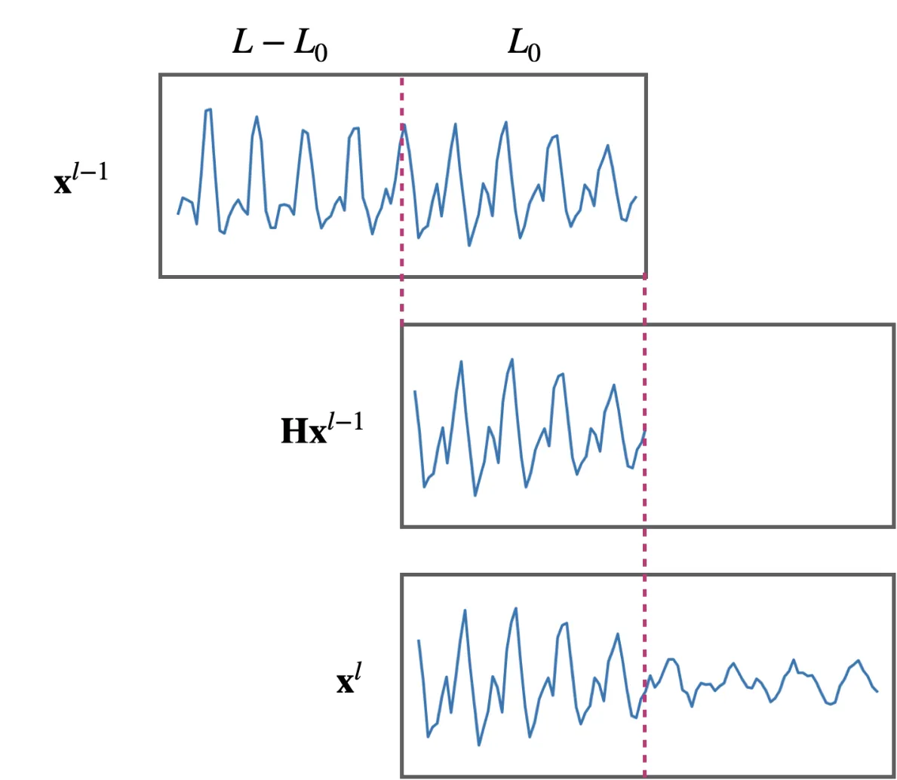

Figure 1: The autoregressive model uses part of the previous frame to
generate the current frame.

shifting the starting position by $`L_{o}`$ samples. We propose an
autoregressive model wherein the generation of the current frame $`l`$
is conditioned on the last $`L_{o}`$ samples of the previous frame
$`l\!-\!1`$. See Figure 1.

Following these definitions, we assume Markovian conditional
independence and denote the probability distribution of the $`l`$-th
speech frame by $`p(\mathbf{x}^{l}|\mathbf{x}^{l-1})`$, indicating that
it is dependent on the preceding frame, $`l\!-\!1`$, but not conditioned
on the frames before that or on any input text (unconditional case).
Similarly, let $`p(\mathbf{x}^{l}|\mathbf{x}^{l-1},\mathbf{y}^{l})`$ be
the probability distribution conditioned also on a specified input text.
The sequence $`\mathbf{y}^{l}`$ stands for the linguistic-phonetic
representation of the $`l`$-th frame, which will be discussed in the
following section.

Our approach is based on denoising diffusion probabilistic models (Ho
et al., 2020, DDPM; ). A diffusion model is a generative procedure
involving latent variables constructed from two stochastic processes:
the _forward_ and the _reverse_ processes. Each process is defined as a
fixed _Markovian_ chain composed of $`S`$ latent instances of the
$`l`$-th speech frame $`\mathbf{x}^{l}_{1},...,\mathbf{x}^{l}_{S}`$. We
denote the source speech frame as the $`0`$-th process element,
$`\mathbf{x}^{l}_{0}=\mathbf{x}^{l}`$.

During the _forward process_, a small Gaussian noise is gradually mixed
with the original speech frame $`\mathbf{x}^{l}_{0}`$ through $`S`$
diffusion steps. The step sizes are predefined by a variance schedule
$`\{\beta_{t}\in\left(0,1\right)\}_{s=1}^{S}`$, which gradually
transforms the original frame $`\mathbf{x}^{l}_{0}`$ into the last
latent variable $`\mathbf{x}^{l}_{S}`$ that follows an isotropic
Gaussian distribution
$`\mathbf{x}^{l}_{S}\sim\mathcal{N}(0,\mathbf{I}_{L})`$. Denote by $`q`$
the distribution of the forward process, and taking into account its
Markovian nature, we have:

```math
q\left(\mathbf{x}^{l}_{1:S}|\mathbf{x}^{l}_{0}\right)=\prod_{s=1}^{S}q(\mathbf{x}^{l}_{s}|\mathbf{x}^{l}_{s-1})~. \tag{1}
```

Following Ho et al. (2020), the conditional process distribution $`q`$
is parameterized as Gaussian distribution as follows:

```math
q(\mathbf{x}^{l}_{s}|\mathbf{x}^{l}_{s-1})=\mathcal{N}\left(\mathbf{x}^{l}_{s};\sqrt{1-\beta_{s}}\mathbf{x}^{l}_{s-1},\beta_{s}\mathbf{I}_{L}\right)~. \tag{2}
```

Note that the distribution $`q`$ is not directly influenced by the
previous frame $`\mathbf{x}^{l-1}`$, nor by the input text
$`\mathbf{y}^{l}`$ in the conditional case.

The _reverse process_ aims to recover the original speech frame
$`\mathbf{x}^{l}_{0}`$ from the corrupted frame $`\mathbf{x}^{l}_{S}`$
by progressively denoises it. The probability distribution of the
reverse process takes into account the autoregressive property of our
overall model, conditioned on the previous frame $`\mathbf{x}^{l-1}`$
and the input text if given. The reverse process, also under the
Markovian assumption, is defined as the conditional distribution:

```math
p_{\theta}\left(\mathbf{x}^{l}_{0:S}\mid\mathbf{x}^{l-1},\mathbf{y}^{l}\right)=p(\mathbf{x}^{l}_{S})\prod_{s=0}^{S-1}p_{\theta}(\mathbf{x}^{l}_{s}\mid\mathbf{x}^{l}_{s+1},\mathbf{x}^{l-1},\mathbf{y}^{l}), \tag{3}
```

where $`p_{\theta}`$ is a learned model with parameters $`\theta`$, and
$`\mathbf{y}^{l}`$ is either given in the conditional case or omitted in
the unconditional case. To be precise, the learned model uses the
overlap portion of the previous frame, namely $`L_{o}`$ samples. We use
the notation $`\mathbf{H}\mathbf{x}^{l-1}`$ to specify the overlapped
segment of the previous frame (Figure 1), where
$`\mathbf{H}\in\mathbb{R}^{L\times L}`$ is an _inpainting_ and
_reordering_ matrix, which is defined as follows:

```math
\mathbf{H}=\left[\begin{array}[]{ll}\mathbf{0}&\mathbf{I}_{L_{o}}\\
\mathbf{0}&\mathbf{0}\end{array}\right]. \tag{4}
```

Beyond the Markovain factorization, as shown above, we further assume
that each transition for a time step $`s`$ is represented as drawn from
a Gaussian distribution:

```math
p_{\theta}(\mathbf{x}^{l}_{s}\mid\mathbf{x}^{l}_{s+1},\mathbf{x}^{l-1},\mathbf{y}^{l})=\mathcal{N}\Big(\mathbf{x}^{l}_{s};~\mu_{\theta}\left(\mathbf{x}^{l}_{s+1},\mathbf{H}\mathbf{x}^{l-1},\mathbf{y}^{l},s\right),\Sigma_{\theta}\left(\mathbf{x}^{l}_{s+1},\mathbf{H}\mathbf{x}^{l-1},\mathbf{y}^{l},s\right)\Big)~. \tag{5}
```

Training is performed by minimizing the variational bound on the
negative log-likelihood while using the property that relates
$`\mathbf{x}^{l}_{s}`$ directly with $`\mathbf{x}^{l}_{0}`$ (Ho et al.,
2020):

```math
\mathbf{x}^{l}_{s}=\sqrt{\bar{\alpha}_{s}}\mathbf{x}^{l}_{0}+\sqrt{1-\bar{\alpha}_{s}}\bm{\epsilon}_{s}~~~~~\bm{\epsilon}_{s}\sim\mathcal{N}(\mathbf{0},\mathbf{I})~, \tag{6}
```

where $`{\alpha}_{s}=1-{\beta}_{s}`$,
$`\bar{\alpha}_{s}=\prod_{i=1}^{s}{\alpha}_{i}`$. The loss is reduced as
follows:

```math
\mathcal{L}_{s}=\mathbb{E}_{\mathbf{x}_{0}^{l},\bm{\epsilon}_{s}}\left[\Big\|\bm{\epsilon}_{\theta}\left(\sqrt{\bar{\alpha}_{s}}\mathbf{x}_{0}^{l}+\sqrt{1-\bar{\alpha}_{s}}\bm{\epsilon}_{s},\mathbf{H}\mathbf{x}^{l-1},\mathbf{y}^{l},s\right)-\bm{\epsilon}_{s}\Big\|^{2}\right]~, \tag{7}
```

where $`\bm{\epsilon}_{\theta}`$ is an approximation of
$`\bm{\epsilon}_{s}`$ from $`\mathbf{x}_{s}`$ with parameters $`\theta`$
and $`s`$ is uniformly taken from the entire set of diffusion
time-steps. In summary, our model aims to learn the function
$`\bm{\epsilon}_{\theta}`$, which acts as a conditional _denoiser_. This
function can be used along with a noisy speech frame to estimate a clean
version of it.

The _inference_ procedure is sequential and carried out autoregressively
for each frame. Assume we would like to generate the $`l`$-th frame,
given the already generated previous frame $`\hat{\mathbf{x}}^{l-1}`$.
For the new frame generation we apply the following equation iteratively
from $`s\!=\!S\!-\!1`$:

```math
\mathbf{x}^{l}_{s}=\frac{1}{\sqrt{\bar{\alpha}_{s}}}\left(\mathbf{x}^{l}_{s+1}-\frac{1-\alpha_{s}}{\sqrt{1-\bar{\alpha}_{s}}}\bm{\epsilon}_{\theta}\left(\mathbf{x}^{l}_{s+1},\mathbf{H}\hat{\mathbf{x}}^{l-1},\mathbf{y}^{l},s\right)\right)+\sigma_{s}\mathbf{z}_{s}~, \tag{8}
```

where $`\bm{\epsilon}_{\theta}`$ is the learned model,
$`\mathbf{z}_{s}\sim\mathcal{N}(\mathbf{0},\mathbf{I})`$ and
$`\sigma_{s}=\sqrt{\frac{1-\bar{\alpha}_{s-1}}{1-\bar{\alpha}_{s}}\beta_{s}}`$.
To initiate the generation, we designate the initial frame ($`l\!=\!0`$)
as a silence one. In the last iteration, when $`s\!=\!0`$, we use
$`\mathbf{z}_{0}=\bm{0}`$.

## 3 Text representation as linguistic and phonological units

Recall that our ultimate goal is to synthesize speech given an input
text. Following Ren et al. (2020); Kim et al. (2020); Chen et al.
(2021), we use the phonetic representation of the desirable text as a
conditioned embedding, as it accurately describes how the speech should
be produced. Let $`\mathcal{Y}`$ represent the set of phonemes,
$`|\mathcal{Y}|=72`$. Recall that in our setup, we are required to
supply the phonetic content for each frame, denoted as
$`\mathbf{y}^{l}`$. This entails a vector comprising $`L`$ values, where
each value represents a phoneme from the set $`\mathcal{Y}`$ for each
respective sample. Note that while the phoneme change rate is much
slower than the sampling frequency, we found this notation clearer for
our discussion.

Since the actual text is given as a sequence of words, during training,
we transform the text sequence into phonemes and their corresponding
timed phoneme sequence using a phoneme alignment procedure. This process
identifies the time span of each phoneme within the waveform (McAuliffe
et al., 2017). During inference, we do not have a waveform as our goal
is to generate one, and we use a _grapheme-to-phoneme_ (G2P) component
to convert the words into phonemes (Park & Kim, 2019) and a _duration
predictor_ to estimate the time of each phoneme.

Duration Predictor. The duration prediction is a small neural network
that gets as input a phoneme and outputs its typical duration. The
implementation details are given in Appendix (C.1). During inference,
the generated frame duration is allowed to deviate from the exact value
$`L`$, since we restrict the vector $`\mathbf{y}^{l}`$ to encompass
entire phoneme time-spans, which is easier to manage.

The speech corresponding to each text can be expressed in various ways,
particularly when the transition is executed directly on the waveform.
Utilizing a diffusion process to implement the model further amplifies
this variability, owing to the stochastic nature of the process. On the
one hand, we aim to retain the diversity generated by the model to
facilitate more reliable and nuanced speech. On the other hand, we
aspire to steer and regulate the process to achieve natural-sounding
speech. Consequently, following the approach outlined in Ren et al.
(2020), we allow the incorporation of elements such as energy and pitch
predictors into the process. Namely we enhance the vector
$`\mathbf{y}^{l}`$ to include other linguistic information rather than
just phonemes.

Energy Predictor. We gain significant flexibility and control over the
resulting waveform by directly conditioning our model on the energy
signal. Instead of relying on the estimated output of the energy
predictor, we have the autonomy to determine the perceived loudness of
each phoneme. Our approach offers guidance to the synthesis process
while still governed by the inherent stochasticity of the diffusion
model. Much like the duration predictor, our energy predictor was
trained to predict the relative energy associated with each phoneme.
Detailed information about the implementation of the energy predictor
can be found in Appendix C.2.

Pitch. Pitch, or fundamental frequency, is another critical element in
the structure of the waveform. To assess its impact on the synthesis
process while conditioned on a given pitch contour, we also decided to
incorporate it into our model. In this case, we did not build a pitch
predictor and used a given sequence of pitch values, estimated using
state-of-the-art method (Segal et al., 2021).

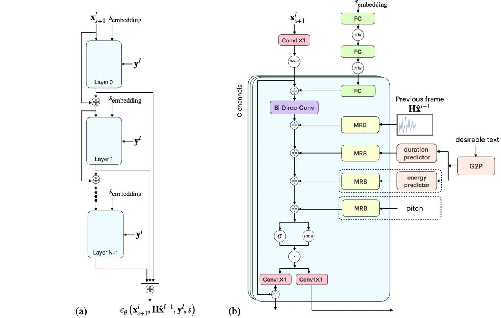

Figure 2: (a) A general overview of the structure of the residual layers
and their interconnections. (b) A detailed overview of a single residual
layer.

## 4 Model architecture

The architecture of _DiffAR_ is shown in the Figure 2. The model’s
backbone is based on the _DiffWave_ architecture (Kong et al., 2020b).
Figure 2(a) illustrates the general structure of the network. The
network consists of $`N=36`$ residual layers, each containing $`C=256`$
residual channels. The output from each layer is integrated with the
accumulated outputs from previous ones. These combined outputs are fed
into a network of two fully connected layers, which leverage ReLU
activation functions to generate the final output. The layer dimensions
are described in the Appendix C.

Figure 2(b) schematically depicts a single channel of the residual
layer. This layer employs the bidirectional dilated convolution
architecture (Oord et al., 2016), which facilitates parallel inference
for each frame through a dilation cycle of $`[1,2,\ldots,2048]`$. To
foster an autoregressive progression, the layer is conditioned on
$`\mathbf{H}\!\cdot\!\mathbf{x}^{l-1}`$, incorporating essential
information from the previous frame. The indication of the diffusion
step $`s`$ is accomplished by employing a 128-dimensional encoding
vector for each $`s`$ (Vaswani et al., 2017) as input to the model,
similar to the approach used in (Kong et al., 2020b). Additionally,
_DiffAR_ can be conditioned on optional data, including the targeted
phonemes, the desired energy, and the desired pitch.

Each conditioned signal passes through a Multi-scaled Residual Block
(MRB) and is then summed to the output of the bidirectional
convolutional component. The MRBs comprise three convolutional layers
with kernels $`[3,5,7]`$ and use the identical dilation pattern as the
residual layer. These MRBs are trained concurrently with the model.

## 5 Experiments

In this section, we comprehensively evaluate our model through empirical
analysis. Initially, we explore unconditional speech generation, wherein
a specific text does not constrain the synthesis. Subsequently, we
discuss our conditional model, employed when there is a designated text
to synthesize. We compare our model with two TTS models: _WaveGrad 2_
(Chen et al., 2021) and _FastSpeech 2_ (Ren et al., 2020). We then turn
to a short ablation study, comparing different parts of our model.
Furthermore, in Appendix A we present our model stochasticity and
controllability, while in Appendix B we present the synthesis of vocal
fry, which is unique to our model. Lastly, a comprehensive comparison
with various acoustic and end-to-end models is provided in Appendix D

All models were trained and evaluated on the LJ-Speech (Ito & Johnson, 2017) dataset, which consists of 13,100 short audio clips (about 24
hours) of a female speaker. The dataset was divided into three subsets:
12,838 samples for the training set, 131 samples for the test set, and
an additional 131 samples for the validation set. Throughout the
experiments, we maintained the original LJ-Speech data partitioning.

In all the experiments, we used relatively long frame durations (e.g.,
$`L`$ = 500 and $`L_{o}`$ = 250 milliseconds). We would like to point
out that a conventional frame length of 20-30 milliseconds and a shift
of 10 milliseconds, often used in speech processing, are established
based on the stationary properties of speech. However, this is not a
concern in diffusion models, thereby permitting us to employ
substantially larger frame sizes. This aids the diffusion process in
seamlessly modeling the waveform encompassing three-four consecutive
phonemes in the newly generated segment.

### 5.1 Unconditional speech generation

First, we created a model entirely unconditioned by external factors,
relying solely on information from the previous frame. The main goal is
to assess whether generating a sequence of frames, as outlined in the
autoregressive approach in Section 2, results in a continuous signal
with seamless transitions.

During the training phase, we fixed the frame length settings to
$`\left(L,L_{o}\right)={\left(1000,500\right)}`$, utilizing
$`S\!=\!200`$ diffusion steps. We utilize a noise schedule parameterized
by $`\beta_{t}\in\left[1\times 10^{-4},0.02\right]`$ to control the
diffusion process. However, in the synthesis phase, we assessed the
model’s ability to generalize across different frame lengths,
specifically considering
$`\left(L,L_{o}\right)\ =\{\left(1000,500\right),\left(500,250\right),\left(400,200\right)\}`$.
Examples can be found in our model’s GitHub repository.

The generated signals exhibit smooth transitions and connectivity,
indicating that the _DiffAR_ architecture has effectively learned local
dependencies. However, the model generated non-existent but human
language-like words (Oord et al., 2016; Weiss et al., 2021, similar to
). Additionally, we observed that global dependencies are improved as
the frame length increases, utilizing the entire learned receptive
field. This result is not unexpected, considering the model does not
condition on textual information. Modeling a manifold that generates a
large vocabulary and meaningful words without textual guidance is still
challenging. On the other hand, a simple manifold for only ten digits
can be successfully generated (Kong et al., 2020b).

### 5.2 Conditional Speech Generation

We conducted a comparative study of our conditional model against other
TTS models. Although there is a plethora of TTS systems available, our
objective was to benchmark against high-performing and relevant models
_WaveGrad 2_ and _FastSpeech 2_.³³ 3 A comprehensive comparison with
various publicly available acoustic and end-to-end models, is provided
in Appendix D

We evaluated the synthesized speech using two subjective and two
objective metrics. For subjective measurement, we used the mean opinion
scores (MOS), where 45 samples from the test set are evaluated for each
system, and 10 ratings are collected for each sample. Raters were
recruited using the Amazon Mechanical Turk platform, and they were asked
to evaluate the quality of the speech on a scale of 1 to 5. Despite
their advantages, MOS tests can be challenging to compare between
different papers (Kirkland et al., 2023), and they may even exhibit bias
within the same study, due to the influence of samples from other
systems in the same trial.

To mitigate these challenges and provide a more robust evaluation
framework, we used another subjective evaluation – the Multiple Stimuli
with Hidden Reference and Anchor (MUSHRA) test. We followed the MUSHRA
protocol (Series, 2014), using both a hidden reference and a low anchor.
For the overall quality test, raters were asked to rate the perceptual
quality of the provided samples from 1 to 100. We report average ratings
along with a $`95\%`$ confidence interval for both metrics.

We randomly selected 60 recordings from the test set for an objective
assessment and used their text to re-synthesize waveforms. We evaluated
the generated waveforms using state-of-the-art automatic speech
recognition (Radford et al., 2023, Whisper medium model; ) and reported
the character error rate (CER) and the word error rate (WER) relative to
the original text.

| Method              | $`\uparrow`$MOS  | $`\uparrow`$MOS scaled            | $`\uparrow`$MUSHRA               | $`\downarrow`$CER(%) | $`\downarrow`$WER(%) |
| ------------------- | ---------------- | --------------------------------- | -------------------------------- | -------------------- | -------------------- |
| Ground truth        | $`3.98\pm 0.08`$ | $`4.70\pm 0.09`$                  | $`71.2\pm 2.0`$                  | $`0.89`$             | $`2.13`$             |
| WaveGrad 2          | $`3.61\pm 0.09`$ | $`4.26\pm 0.10`$                  | $`63.8\pm 2.3`$                  | $`3.47`$             | $`5.75`$             |
| DiffAR (200 steps)  | $`3.75\pm 0.08`$ | $`4.43\pm 0.10`$                  | $`65.7\pm 2.2`$                  | $`2.67`$             | $`6.16`$             |
| DiffAR (1000 steps) | $`3.77\pm 0.08`$ | $`\textbf{4.45}\pm\textbf{0.09}`$ | $`\textbf{66.7}\pm\textbf{2.2}`$ | 1.95                 | 4.65                 |

Table 1: Comparison to WaveGrad 2 (Chen et al., 2021)

During the training phase, we fixed the frame length settings to
$`\left(L,L_{o}\right)={\left(500,250\right)}`$. We utilize a noise
schedule $`\beta_{t}\in\left[1\times 10^{-4},0.02\right]`$. We trained
two models – one with $`S\!=\!200`$ steps and one with 1000 steps.
During inference, the models were conditioned on phonemes (obtained from
G2P unit  (Park & Kim, 2019)), the predicted durations, and the
predicted energy.

WaveGrad 2. We start by describing a comparison of our model to
_WaveGrad 2_ (Chen et al., 2021), which is an encoder-decoder end-to-end
waveform generation system that is based on diffusion models. We used an
unofficial implementation⁴⁴ 4
[https://github.com/maum-ai/wavegrad2](https://github.com/maum-ai/wavegrad2)
of it as the original one is unavailable. Results for _WaveGrad 2_ are
presented in Table 1. Each row represents a different model, where the
first row, denoted _Ground truth_, represents the performance with the
original waveforms from the database, and it is given as a reference.
For each model we show the results of MOS, MUSHRA, CER and WER. The
column labeled MOS scaled indicates the adjusted MOS results, which have
been scaled proportionately to align with the MOS values of ground truth
and _WaveGrad 2_ (Chen et al., 2021).

The table illustrates that our model surpasses _WaveGrad 2_ across all
evaluated metrics. This can be attributable to the fact that _WaveGrad
2_ uses an architecture that generates the entire utterance in a single
instance instead of operating in an autoregressive manner like _DiffAR_.

| Method                | $`\uparrow`$MOS  | $`\uparrow`$MOS scaled            | $`\uparrow`$MUSHRA               | $`\downarrow`$CER(%) | $`\downarrow`$WER(%) |
| --------------------- | ---------------- | --------------------------------- | -------------------------------- | -------------------- | -------------------- |
| Ground truth          | $`3.98\pm 0.05`$ | $`4.22\pm 0.05`$                  | $`68.9\pm 1.4`$                  | $`0.89`$             | $`2.13`$             |
| FastSpeech 2          | $`3.54\pm 0.09`$ | $`3.75\pm 0.09`$                  | $`63.4\pm 2.2`$                  | $`2.15`$             | $`4.82`$             |
| FastSpeech 2 improved | $`3.75\pm 0.08`$ | $`3.98\pm 0.09`$                  | $`64.2\pm 2.5`$                  | 1.73                 | 4.31                 |
| DiffAR (200 steps)    | $`3.76\pm 0.05`$ | $`3.99\pm 0.06`$                  | $`66.0\pm 1.5`$                  | $`2.67`$             | $`6.16`$             |
| DiffAR (1000 steps)   | $`3.82\pm 0.05`$ | $`\textbf{4.05}\pm\textbf{0.06}`$ | $`\textbf{66.2}\pm\textbf{1.5}`$ | $`{1.95}`$           | $`{4.65}`$           |

Table 2: Comparison to FastSpeech 2 (Ren et al., 2020)

FastSpeech 2. We turn now to compare _DiffAR_ with _FastSpeech 2_ (Ren
et al., 2020), as non-diffusion acoustic model, implementing the
two-state decoder-vocoder approach. We used an unofficial
implementation⁵⁵ 5
[https://github.com/ming024/FastSpeech2](https://github.com/ming024/FastSpeech2).
as the original one associated with the paper was not made available. We
evaluated two versions of this model: the original _FastSpeech 2_, as
described in Ren et al. (2020), and an improved version, which uses
additional _Tacotron-2_ Shen et al. (2018) style post-net after the
decoder, gradient clipping during the training, phoneme-level pitch and
energy prediction instead of frame-level prediction, and normalizing the
pitch and energy features.⁶⁶ 6 Ideally, we should have also compared our
model to _FastSpeech 2s_ (Ren et al., 2020), which an is end-to-end
text-to-waveform system, and to _Wave-Tacotron_ (Weiss et al., 2021),
but no implementations have been found for these models. Both versions
were trained on the LJ-speech dataset, with a pre-trained HiFi-GAN (Chu
et al., 2017) as a vocoder. The results are given in Table 2. Like the
previous table, the rows represent different models, and the columns are
the evaluation metrics. It is important to note that the subjective
evaluation (MOS and MUSHRA tests) were carried out independently for
_WaveGrad 2_ and _FastSpeech 2_ to ensure the results were not
influenced by each other. Also note that the column MOS scaled in this
table was scaled proportionally to the ground-truth and _FastSpeech 2_
MOS values, as reported in Ren et al. (2020).

Based on the MOS and MUSHRA values, it is evident that our model
generates speech characterized by higher quality and a more natural
sound, compared to _FastSpeech 2_, and in the same ballpark compared to
_FastSpeech 2-improved_. By analyzing the CER and WER values, it is
evident that our model achieves slightly greater intelligibility than
_FastSpeech 2_, yet still falls short of the performance of _FastSpeech
2-improved_.

A comprehensive comparison with various acoustic and end-to-end models,
including both diffusion-based and non-diffusion-based approaches, is
provided in Appendix D. We provide a comparison of _DiffAR_ to these
models in terms of audio quality, the _one-to-many_ diverse speech
realizations for a given text, and the simplicity of its architecture.
Additionally, the synthesis time factor is addressed in Appendix E.

|                |          |           |        |       |                      |                      |
| -------------- | -------- | --------- | ------ | ----- | -------------------- | -------------------- |
| Method         | Phonemes | Durations | Energy | Pitch | $`\downarrow`$CER(%) | $`\downarrow`$WER(%) |
| Ground truth   | –        | –         | –      | –     | $`0.89`$             | $`2.13`$             |
| DiffAR-E (200) | true     | true      | –      | –     | $`2.90`$             | $`5.98`$             |
| DiffAR (200)   | true     | true      | true   | –     | $`1.18`$             | $`3.96`$             |
| DiffAR (1000)  | true     | true      | true   | –     | $`1.70`$             | $`4.25`$             |
| DiffAR+P (200) | true     | true      | true   | true  | $`1.12`$             | $`3.47`$             |
| DiffAR-E (200) | true     | pred      | –      | –     | $`2.68`$             | $`6.09`$             |
| DiffAR-E (200) | pred     | pred      | –      | –     | $`3.35`$             | $`7.41`$             |
| DiffAR (200)   | true     | pred      | pred   | –     | $`1.05`$             | $`3.09`$             |
| DiffAR (1000)  | true     | pred      | pred   | –     | $`2.03`$             | $`4.34`$             |
| DiffAR (200)   | pred     | pred      | pred   | –     | $`2.67`$             | $`6.16`$             |
| DiffAR (1000)  | pred     | pred      | pred   | –     | $`1.95`$             | $`4.65`$             |

Table 3: Intelligibility of different configurations of _DiffAR_, where
different phonetic and linguistic values are either true or predicted.

### 5.3 Ablation study

In this section, we introduce an ablation study designed to evaluate the
impact of integrating additional components into the model and assess
these components’ contribution to the observed error rates. We carried
out evaluations based on CER and WER metrics to accomplish this.

The results are presented in Table 3. The table is structured to present
the ablation results initially when the conditioning is based on the
ground truth values for linguistic and phonetic content. Subsequently,
we showcase the ablation results obtained with predicted values. The
_DiffAR-E_ model denotes a variant conditioned on phonemes and their
respective durations but not on the energy. In contrast, the _DiffAR_
model is conditioned on phonemes, their durations, and their energy
levels. Lastly, the _DiffAR+P_ model represents a version that
additionally incorporates pitch conditioning. The number in parentheses
indicates the number of diffusion steps each model was trained and
tested. The first set of columns indicates whether the model was
conditioned on true or predicted values. The final two columns provide
the CER and WER values.

It can be seen from the results that as we incorporate more
supplementary information into the process, the quality of the results
improves. In addition, as the task approaches a more realistic scenario,
where the only source of original information is the text itself, we
observe an increase in values, and inaccuracies appear to be linked to
the prediction components. Nevertheless, it is noteworthy that by
increasing the number of diffusion steps in the process, the model seems
capable of autonomously learning crucial relationships, resulting in
lower error values in the realistic scenario compared to a shorter
process. Another notable finding is that when we have access to the
original energy and pitch information, we achieve results that closely
approximate ground truth. This outcome is expected, as this information
plays a significant role in modeling the characteristics of a natural
waveform signal.

Another noteworthy aspect highlighted in these results is the balance
between the inherent stochasticity of the diffusion process and the
degree of controllability achieved through conditioning the model with
supplementary information. A more detailed demonstration is provided in
Appendix A.

## 6 Conclusion

In this work, we proposed _DiffAR_, an end-to-end denoising diffusion
autoregressive model designed to address audio synthesis tasks,
specifically focusing on TTS applications. Our model incorporates a
carefully selected set of characteristics, each contributing
significantly to its overall performance. The diffusive process enriches
synthesis quality and introduces stochasticity, while the autoregressive
nature enables the handling of temporal signals without temporal
constraints and facilitates effective integration with the diffusive
process. Synthesizing the waveform directly, without using any
intermediate representations enhanced the variability and simplified the
training procedure. By estimating both the phase and amplitude, _DiffAR_
enables the modeling of phenomena such as vocal fry phonation, resulting
in more natural-sounding signals. Furthermore, The architecture of
_DiffAR_ offers simplicity and versatility, providing explicit control
over the output signal. These characteristics are interconnected, and
their synergy contributes to the model’s ability to outperform leading
models in terms of both intelligibility and audio quality.

Like other autoregressive models, _DiffAR_ model faces the challenge of
long synthesis times. Future work can focus on reducing synthesis time
by using fewer diffusion steps (Song et al., 2020) or by exploring
methods to expedite the process (Hoogeboom et al., 2021). Another avenue
for improvement is conditioning the model with elements like speaker
identity and emotions and incorporating classifier-free guidance (Ho &
Salimans, 2021) to handle such various conditions effectively.⁷⁷ 7 A
more detailed discussion is provided in Appendix F. Lastly, ablation
studies suggest that enhancing the force aligner, grapheme-to-phoneme,
and prediction components could significantly improve the results.

## 7 Reproducibility

To ensure the work is as reproducible as possible and comparable with
future models, we have provided comprehensive descriptions of both the
training and the sampling procedures. The main ideas of the method are
presented in section 2. The model architecture is provided in Section 4
and is also presented in a more detailed format in Appendix C. In
addition, our complete code for training and inference, along with
hyperparameter settings to run experiments, can be found under the
project’s GitHub repository
[https://github.com/RBenita/DIFFAR](https://github.com/RBenita/DIFFAR).
Audio samples are available at
[https://rbenita.github.io/DIFFAR/](https://rbenita.github.io/DIFFAR/).

## References

- Casanova et al. (2022) Edresson Casanova, Julian Weber, Christopher D
  Shulby, Arnaldo Candido Junior, Eren Gölge, and Moacir A Ponti.
  Yourtts: Towards zero-shot multi-speaker tts and zero-shot voice
  conversion for everyone. In _International Conference on Machine
  Learning_, pp. 2709–2720. PMLR, 2022.
- Chen et al. (2020) Nanxin Chen, Yu Zhang, Heiga Zen, Ron J Weiss,
  Mohammad Norouzi, and William Chan. Wavegrad: Estimating gradients for
  waveform generation. _arXiv preprint arXiv:2009.00713_, 2020.
- Chen et al. (2021) Nanxin Chen, Yu Zhang, Heiga Zen, Ron J Weiss,
  Mohammad Norouzi, Najim Dehak, and William Chan. Wavegrad 2: Iterative
  refinement for text-to-speech synthesis. _arXiv preprint
  arXiv:2106.09660_, 2021.
- Chu et al. (2017) Xiao-Liu Chu, Stephan Götzinger, and Vahid
  Sandoghdar. A single molecule as a high-fidelity photon gun for
  producing intensity-squeezed light. _Nature Photonics_,
  11(1):58–62, 2017.
- Défossez et al. (2022) Alexandre Défossez, Jade Copet, Gabriel
  Synnaeve, and Yossi Adi. High fidelity neural audio compression.
  _arXiv preprint arXiv:2210.13438_, 2022.
- Dhariwal & Nichol (2021) Prafulla Dhariwal and Alexander Nichol.
  Diffusion models beat gans on image synthesis. _Advances in neural
  information processing systems_, 34:8780–8794, 2021.
- Donahue et al. (2020) Jeff Donahue, Sander Dieleman, Mikołaj
  Bińkowski, Erich Elsen, and Karen Simonyan. End-to-end adversarial
  text-to-speech. _arXiv preprint arXiv:2006.03575_, 2020.
- Elias et al. (2021) Isaac Elias, Heiga Zen, Jonathan Shen, Yu Zhang,
  Ye Jia, RJ Skerry-Ryan, and Yonghui Wu. Parallel Tacotron 2: A
  non-autoregressive neural TTS model with differentiable duration
  modeling. _arXiv preprint arXiv:2103.14574_, 2021.
- Ho & Salimans (2021) Jonathan Ho and Tim Salimans. Classifier-free
  diffusion guidance. In _NeurIPS 2021 Workshop on Deep Generative
  Models and Downstream Applications_, 2021.
- Ho & Salimans (2022) Jonathan Ho and Tim Salimans. Classifier-free
  diffusion guidance. _arXiv preprint arXiv:2207.12598_, 2022.
- Ho et al. (2020) Jonathan Ho, Ajay Jain, and Pieter Abbeel. Denoising
  diffusion probabilistic models. _Advances in Neural Information
  Processing Systems_, 33:6840–6851, 2020.
- Ho et al. (2022) Jonathan Ho, Tim Salimans, Alexey Gritsenko, William
  Chan, Mohammad Norouzi, and David J Fleet. Video diffusion models.
  _arXiv:2204.03458_, 2022.
- Hoogeboom et al. (2021) Emiel Hoogeboom, Alexey A Gritsenko, Jasmijn
  Bastings, Ben Poole, Rianne van den Berg, and Tim Salimans.
  Autoregressive diffusion models. _arXiv preprint
  arXiv:2110.02037_, 2021.
- Huang et al. (2022a) Rongjie Huang, Max WY Lam, Jun Wang, Dan Su, Dong
  Yu, Yi Ren, and Zhou Zhao. Fastdiff: A fast conditional diffusion
  model for high-quality speech synthesis. _arXiv preprint
  arXiv:2204.09934_, 2022a.
- Huang et al. (2022b) Rongjie Huang, Zhou Zhao, Huadai Liu, Jinglin
  Liu, Chenye Cui, and Yi Ren. Prodiff: Progressive fast diffusion model
  for high-quality text-to-speech. In _Proceedings of the 30th ACM
  International Conference on Multimedia_, pp. 2595–2605, 2022b.
- Ito & Johnson (2017) Keith Ito and Linda Johnson. The LJ speech
  dataset.
  [https://keithito.com/LJ-Speech-Dataset/](https://keithito.com/LJ-Speech-Dataset/), 2017.
- Jeong et al. (2021) Myeonghun Jeong, Hyeongju Kim, Sung Jun Cheon,
  Byoung Jin Choi, and Nam Soo Kim. Diff-TTS: A denoising diffusion
  model for text-to-speech. _arXiv preprint arXiv:2104.01409_, 2021.
- Keating et al. (2015) Patricia A Keating, Marc Garellek, and Jody
  Kreiman. Acoustic properties of different kinds of creaky voice. In
  _ICPhS_, volume 2015, pp. 2–7, 2015.
- Kim et al. (2022) Heeseung Kim, Sungwon Kim, and Sungroh Yoon.
  Guided-TTS: A diffusion model for text-to-speech via classifier
  guidance. In _International Conference on Machine Learning_, pp.
  11119–11133. PMLR, 2022.
- Kim et al. (2020) Jaehyeon Kim, Sungwon Kim, Jungil Kong, and Sungroh
  Yoon. Glow-TTS: A generative flow for text-to-speech via monotonic
  alignment search. _Advances in Neural Information Processing Systems_,
  33:8067–8077, 2020.
- Kim et al. (2021) Jaehyeon Kim, Jungil Kong, and Juhee Son.
  Conditional variational autoencoder with adversarial learning for
  end-to-end text-to-speech. In _International Conference on Machine
  Learning_, pp. 5530–5540. PMLR, 2021.
- Kingma & Welling (2013) Diederik P Kingma and Max Welling.
  Auto-encoding variational bayes. _arXiv preprint
  arXiv:1312.6114_, 2013.
- Kirkland et al. (2023) Ambika Kirkland, Shivam Mehta, Harm Lameris,
  Gustav Eje Henter, Eva Szekely, and Joakim Gustafson. Stuck in the MOS
  pit: A critical analysis of MOS test methodology in tts evaluation. In
  _12th Speech Synthesis Workshop (SSW) 2023_, 2023.
- Koluguri et al. (2022) Nithin Rao Koluguri, Taejin Park, and Boris
  Ginsburg. Titanet: Neural model for speaker representation with 1d
  depth-wise separable convolutions and global context. In _ICASSP
  2022-2022 IEEE International Conference on Acoustics, Speech and
  Signal Processing (ICASSP)_, pp. 8102–8106. IEEE, 2022.
- Kong et al. (2020a) Jungil Kong, Jaehyeon Kim, and Jaekyoung Bae.
  Hifi-GAN: Generative adversarial networks for efficient and high
  fidelity speech synthesis. _Advances in Neural Information Processing
  Systems_, 33:17022–17033, 2020a.
- Kong et al. (2020b) Zhifeng Kong, Wei Ping, Jiaji Huang, Kexin Zhao,
  and Bryan Catanzaro. Diffwave: A versatile diffusion model for audio
  synthesis. _arXiv preprint arXiv:2009.09761_, 2020b.
- Le et al. (2023) Matthew Le, Apoorv Vyas, Bowen Shi, Brian Karrer,
  Leda Sari, Rashel Moritz, Mary Williamson, Vimal Manohar, Yossi Adi,
  Jay Mahadeokar, et al. Voicebox: Text-guided multilingual universal
  speech generation at scale. _arXiv preprint arXiv:2306.15687_, 2023.
- Lee et al. (2021) Sang-gil Lee, Heeseung Kim, Chaehun Shin, Xu Tan,
  Chang Liu, Qi Meng, Tao Qin, Wei Chen, Sungroh Yoon, and Tie-Yan Liu.
  Priorgrad: Improving conditional denoising diffusion models with
  data-dependent adaptive prior. _arXiv preprint
  arXiv:2106.06406_, 2021.
- Liu et al. (2022) Songxiang Liu, Dan Su, and Dong Yu. Diffgan-tts:
  High-fidelity and efficient text-to-speech with denoising diffusion
  gans. _arXiv preprint arXiv:2201.11972_, 2022.
- McAuliffe et al. (2017) Michael McAuliffe, Michaela Socolof, Sarah
  Mihuc, Michael Wagner, and Morgan Sonderegger. Montreal forced
  aligner: Trainable text-speech alignment using kaldi. In
  _Interspeech_, volume 2017, pp. 498–502, 2017.
- Narendra & Rao (2017) NP Narendra and K Sreenivasa Rao. Generation of
  creaky voice for improving the quality of hmm-based speech synthesis.
  _Computer Speech & Language_, 42:38–58, 2017.
- Oord et al. (2018) Aaron Oord, Yazhe Li, Igor Babuschkin, Karen
  Simonyan, Oriol Vinyals, Koray Kavukcuoglu, George Driessche, Edward
  Lockhart, Luis Cobo, Florian Stimberg, et al. Parallel waventert: Fast
  high-fidelity speech synthesis. In _International conference on
  machine learning_, pp. 3918–3926, 2018.
- Oord et al. (2016) Aaron van den Oord, Sander Dieleman, Heiga Zen,
  Karen Simonyan, Oriol Vinyals, Alex Graves, Nal Kalchbrenner, Andrew
  Senior, and Koray Kavukcuoglu. Wavenet: A generative model for raw
  audio. _arXiv preprint arXiv:1609.03499_, 2016.
- Oppenheim & Lim (1981) Alan V Oppenheim and Jae S Lim. The importance
  of phase in signals. _Proceedings of the IEEE_, 69(5):529–541, 1981.
- Park & Kim (2019) Kyubyong Park and Jongseok Kim. g2pe.
  [https://github.com/Kyubyong/g2p](https://github.com/Kyubyong/g2p), 2019.
- Popov et al. (2021) Vadim Popov, Ivan Vovk, Vladimir Gogoryan, Tasnima
  Sadekova, and Mikhail Kudinov. Grad-TTS: A diffusion probabilistic
  model for text-to-speech. In _International Conference on Machine
  Learning_, pp. 8599–8608. PMLR, 2021.
- Radford et al. (2023) Alec Radford, Jong Wook Kim, Tao Xu, Greg
  Brockman, Christine McLeavey, and Ilya Sutskever. Robust speech
  recognition via large-scale weak supervision. In _International
  Conference on Machine Learning_, pp. 28492–28518. PMLR, 2023.
- Ren et al. (2020) Yi Ren, Chenxu Hu, Xu Tan, Tao Qin, Sheng Zhao, Zhou
  Zhao, and Tie-Yan Liu. Fastspeech 2: Fast and high-quality end-to-end
  text to speech. _arXiv preprint arXiv:2006.04558_, 2020.
- Rezende & Mohamed (2015) Danilo Rezende and Shakir Mohamed.
  Variational inference with normalizing flows. In _International
  conference on machine learning_, pp. 1530–1538. PMLR, 2015.
- Segal et al. (2021) Yael Segal, May Arama-Chayoth, and Joseph Keshet.
  Pitch estimation by multiple octave decoders. _IEEE Signal Processing
  Letters_, 28:1610–1614, 2021.
- Series (2014) B Series. Method for the subjective assessment of
  intermediate quality level of audio systems. _International
  Telecommunication Union Radiocommunication Assembly_, 2014.
- Shen et al. (2018) Jonathan Shen, Ruoming Pang, Ron J Weiss, Mike
  Schuster, Navdeep Jaitly, Zongheng Yang, Zhifeng Chen, Yu Zhang,
  Yuxuan Wang, Rj Skerrv-Ryan, et al. Natural TTS synthesis by
  conditioning wavenet on mel spectrogram predictions. In _2018 IEEE
  international conference on acoustics, speech and signal processing
  (ICASSP)_, pp. 4779–4783. IEEE, 2018.
- Song et al. (2020) Jiaming Song, Chenlin Meng, and Stefano Ermon.
  Denoising diffusion implicit models. _arXiv preprint
  arXiv:2010.02502_, 2020.
- Vaswani et al. (2017) Ashish Vaswani, Noam Shazeer, Niki Parmar, Jakob
  Uszkoreit, Llion Jones, Aidan N Gomez, Łukasz Kaiser, and Illia
  Polosukhin. Attention is all you need. _Advances in neural information
  processing systems_, 30, 2017.
- Veaux et al. (2017) Christophe Veaux, Junichi Yamagishi, Kirsten
  MacDonald, et al. Cstr vctk corpus: English multi-speaker corpus for
  cstr voice cloning toolkit. _University of Edinburgh. The Centre for
  Speech Technology Research (CSTR)_, 6:15, 2017.
- Wang et al. (2023) Chengyi Wang, Sanyuan Chen, Yu Wu, Ziqiang Zhang,
  Long Zhou, Shujie Liu, Zhuo Chen, Yanqing Liu, Huaming Wang, Jinyu Li,
  et al. Neural codec language models are zero-shot text to speech
  synthesizers. _arXiv preprint arXiv:2301.02111_, 2023.
- Weiss et al. (2021) Ron J Weiss, RJ Skerry-Ryan, Eric Battenberg,
  Soroosh Mariooryad, and Diederik P Kingma. Wave-tacotron:
  Spectrogram-free end-to-end text-to-speech synthesis. In _ICASSP
  2021-2021 IEEE International Conference on Acoustics, Speech and
  Signal Processing (ICASSP)_, pp. 5679–5683. IEEE, 2021.
- Zhang et al. (2023) Chenshuang Zhang, Chaoning Zhang, Sheng Zheng,
  Mengchun Zhang, Maryam Qamar, Sung-Ho Bae, and In So Kweon. Audio
  diffusion model for speech synthesis: A survey on text to speech and
  speech enhancement in generative ai. _arXiv preprint
  arXiv:2303.13336_, 2023.

## Appendix

## Appendix A Stochasticity and controllability through the generative process

The inherent stochasticity within the diffusion process, particularly
when it models the raw waveform itself, enables creative synthesis with
a substantial degree of freedom in terms of energy, pitch, and timing.
This variability is a crucial element within synthesis models as it
contributes uniqueness and distinctiveness to the generated signal. One
valuable application of such a model is its potential utility for
augmenting speech signals.

Conditioning the synthesis process with supplementary information, such
as pitch, energy, or phonemes, enables extensive control over the
generated output. Using that information steers the synthesis procedure
towards more precise regions within the manifold. This, in turn, leads
to the generation of signals that exhibit a higher degree of desired and
shared characteristics.

One notable advantage of the _DiffAR_ model is its capability to
effectively balance the trade-off between stochasticity and
controllability within the synthesis process. On one hand, it operates
as an end-to-end model based on diffusion principles, amplifying the
process’s inherent variability. On the other hand, it offers a versatile
architecture that enables explicit conditioning of desirable
information. By doing that, it provides the model with more context and
specific guidance.

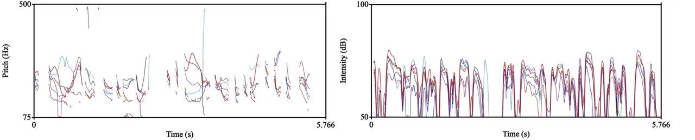

(a) DiffAR-E

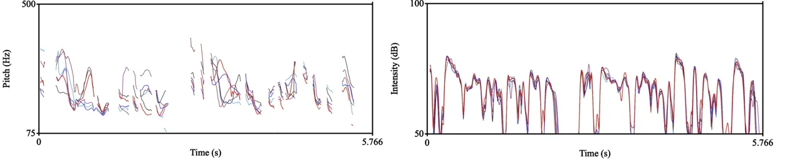

(b) DiffAR (200)

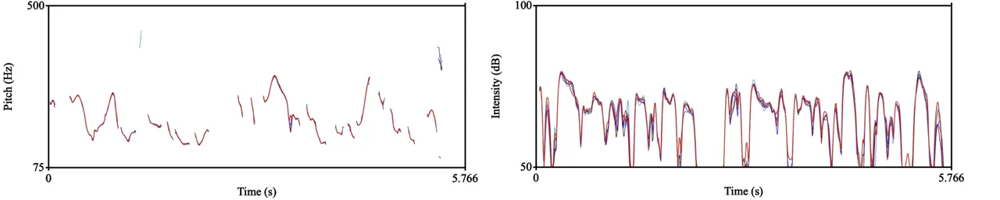

(c) DiffAR+P

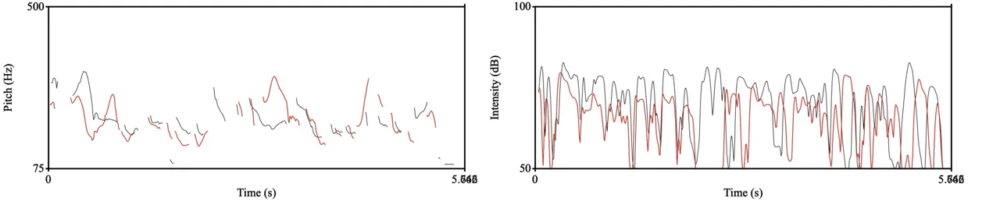

(d) FastSpeech 2

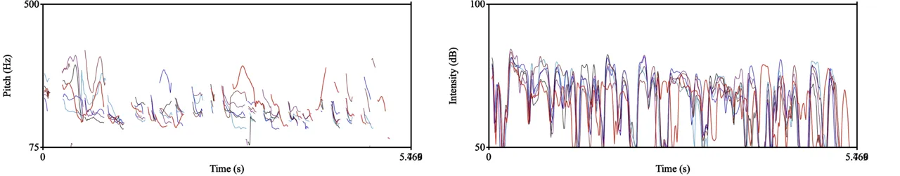

(e) WaveGrad 2

Figure 3: Comparing the energy and pitch of five samples that describe
the same text, with the desired energy and pitch values marked in red.

Figure 3 illustrates the trade-off between controllability and
stochasticity, as demonstrated in five different models. For each model,
we compared the energy and pitch among five syntheses of the same text.
Figure 3(a) illustrates the outcomes of _DiffAR-E_. As this model is
exclusively conditioned on the phonemes and their durations, its signals
demonstrate significant pitch and energy variation. Figure 3(b)
illustrates the conditioning of the process on a desired energy level.
When utilizing the _DiffAR (200)_ model, the generated signals tend to
have energy values that are quite similar, showing slight variation
around the desired values (indicated by the red line). However, there is
still a significant variability in the pitch values across the generated
signals. Figure 3(c) illustrates five signals generated by the
_DiffAR+P_ model, which also conditions the synthesis process on the
desired pitch values. In this case, this conditioning significantly
diminishes the variability among the generated signals. The pitch and
energy values of all signals become remarkably similar and closely
resemble the values of the conditioned inputs. It is important to note
that due to the use of diffusion and the high variability in the raw
waveform itself, the variation still exists, and the audio clips are not
completely identical.

In contrast to our model, which provides extensive control over the
signal properties and variability, Figure 3(d) illustrates that
_FastSpeech 2_ lacks any variability. When given a specific text input,
all corresponding syntheses exhibit uniform pitch and energy
characteristics, resulting in identical signals. On the other hand, the
_WaveGrad 2_ model does introduce variability, as depicted in
Figure 3(e), and this variability can be adjusted by reducing the number
of diffusion steps. However, it’s worth noting that both _WaveGrad 2_
and _FastSpeech 2_ lack the capability to explicitly manipulate the
signal towards predefined energy or pitch target values.

_Vocal fry_, also known as _creaky-voice_, is a vocal phenomenon
characterized by a low and scratchy sound that occupies the vocal range
below modal voice. Recently, vocal fry has gained popularity in various
areas, including the United States, and is observed in both women and
men. This type of production can signal the end of an utterance but even
as a sociolinguistic marker for distinguishing a speech group from
another within the same language.

The LJ-Speech dataset contains numerous segments featuring vocal fry.
These portions are typically distinguished by their low and irregular
fundamental frequency $`(F0)`$, reduced energy, and damped pulses
(Keating et al., 2015). An example can be found in Figure 4(a).

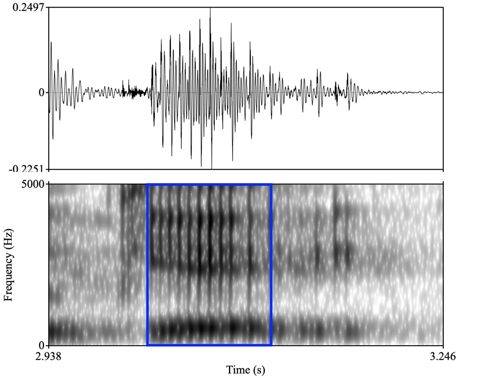

(a) Groundtruth

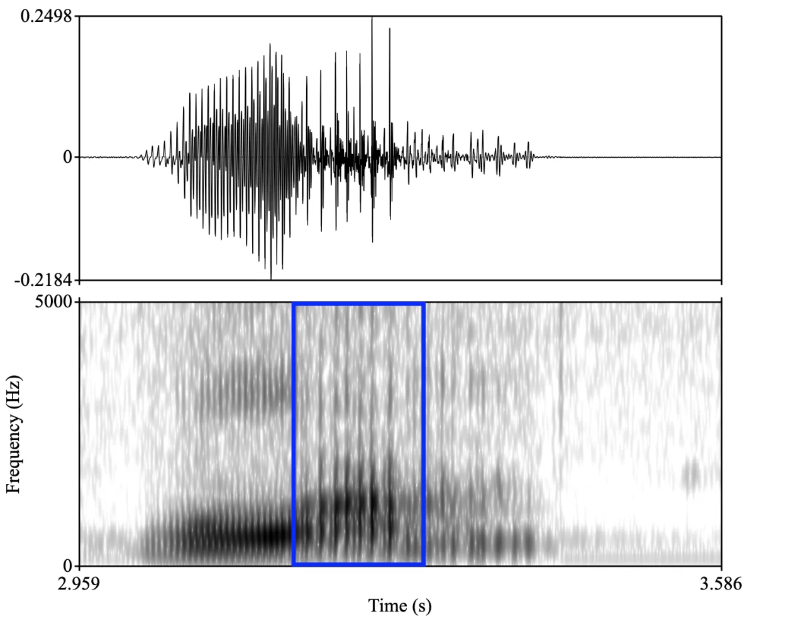

(b) DiffAR

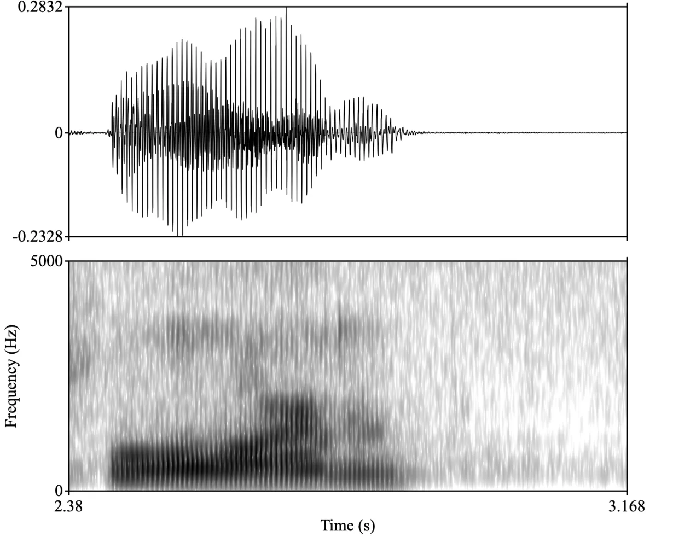

(c) WaveGrad 2

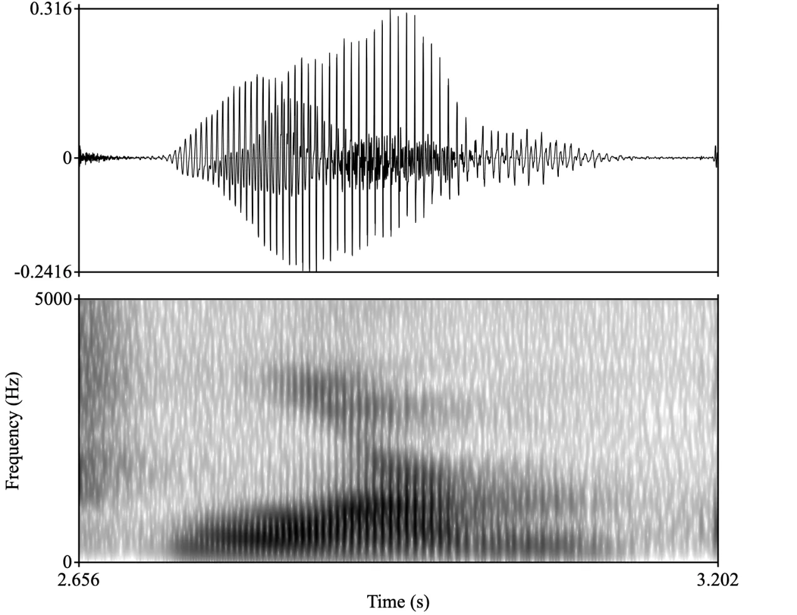

(d) FastSpeech 2

Figure 4: Displaying the vocal fry phenomenon across various models

## Appendix B Vocal Fry

Modeling vocal fry behavior in synthesis applications presents a
non-trivial challenge that researchers have previously attempted to
address (Narendra & Rao, 2017). The complexity arises because a
significant portion of the relevant information is embedded in the phase
component of the signal. Since many models focus on estimating the
signal’s amplitude, often by deriving its spectrogram, this complexity
poses an even greater obstacle, maybe preventing such models from
faithfully reproducing the vocal fry phenomenon.

Figure 4(d) and Figure 4(c) shows generation of the same utterance with
_FastSpeech 2_ (former) and _WaveGrad 2_ (latter). None of them generate
vocal fry.

_DiffAR_, as an end-to-end model that generates the raw waveform, could
capture the vocal fry phenomenon by integrating both the phase and
amplitude components throughout the synthesis process. The result is a
synthesis incorporating sound elements more closely resembling human
speech, which likely contributes to the positive subjective results
observed in our evaluations. An example can be found in Figure 4(b),
where the creaky area is highlighted in blue.

## Appendix C Detailed architecture

A detailed overview of a single residual layer is depicted in Figure 5,
where $`P`$ represents the number of phonemes in the current frame,
$`L`$ corresponds to the frame length, B indicates the batch size, which
is set to 1 during inference, and C represents the number of residual
channels, set to 256.

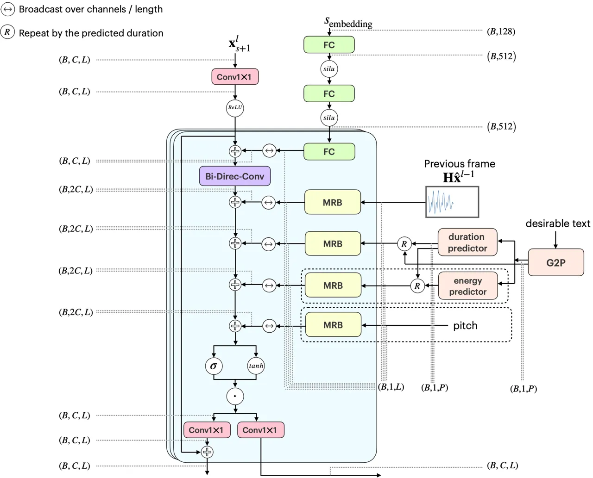

Figure 5: A detailed overview of a single residual layer

In our model, the duration and energy predictors are small neural
networks trained and validated using the original LJ-Speech data
partitioning. In both cases, the training objective was to minimize the
Mean Squared Error (MSE) loss.

### C.1 Duration predictor

The duration predictor takes a series of phonemes as input and predicts
their expected durations. The network architecture consists of a
phoneme-embedding layer $`(|\mathcal{Y}|=73,128)`$, followed by a 1-D
convolutional layer (128 input channels, 256 output channels, kernel
size 5, stride 1, padding 2), a ReLU activation function, a
normalization layer, a dropout layer with $`p=0.5`$ dropout rate, and
finally, a linear layer (256 input features, 1 output feature). During
training, the timing was obtained using a phoneme alignment procedure
(McAuliffe et al., 2017).

### C.2 Energy predictor

The energy predictor is a network that takes a series of phonemes as
input and predicts their energy levels. The network architecture
consists of a phoneme-embedding layer $`(|\mathcal{Y}|=73,128)`$,
followed by a sequence of two identical layers. Each of these layers
consists of a 1-D convolutional layer (128 input channels, 256 output
channels, kernel size 7, stride 1, padding 2), followed by another 1-D
convolutional layer (128 input channels, 256 output channels, kernel
size 5, stride 1, padding 2), a ReLU activation function, a
normalization layer, and a dropout layer with $`p=0.5`$ dropout rate.
Finally, the second layer is followed by a linear layer (256 input
features, 1 output feature). During training, the energy values for each
phoneme were calculated as the square root of the average energy within
each phoneme’s duration.

## Appendix D Comprehensive comparison to other methods

In addition to comparing _DiffAR_ to _WaveGrad 2_ and _FastSpeech 2_, we
conducted a comprehensive comparison that includes both acoustic models
(i.e., decoders) and _end-to-end_ models. The models considered are
_VITS_ (Kim et al., 2021) , _Grad-TTS_ (Popov et al., 2021), _Pro-DIFF_
(Huang et al., 2022b), and _DiffGAN-TTS_ (Liu et al., 2022). We
conducted a MUSHRA test to evaluate audio quality⁸⁸ 8 Due to limited
resources we chose MUSHRA over MOS as it is more robust and less
subjective. and examined factors such as the stochasticity of synthesis
as all are one-to-many models, the architectural complexity of the
models, and their ability to control stylistic features.

_VITS_ is an _end-to-end_ model that incorporates VAE (Kingma & Welling,
2013), Normalizing Flow (Rezende & Mohamed, 2015), MAS algorithm (Kim
et al., 2020), and adversarial training for the TTS task. During
training, it learns latent variables from linear spectrograms obtained
from STFT, indicating that the synthesis doesn’t directly operate on the
waveform. Moreover, it includes a reconstruction loss involving the
Mel-spectrogram representation and an adversarial loss on the output,
which may be unstable during training.

In terms of qualitative metrics, we performed a MUSHRA test following
the methodology described in Section 3. The results are presented in
Table 4.

To assess the level of stochasticity in the model, we utilized the
method outlined in Appendix A. The results in Figure 6(a) indicate a
degree of stochasticity in the model, albeit to a limited extent.
Notably, the pitch values in different draws exhibit a very similar
pattern with slight shifts in the timeline, a behavior also observed in
the energy values. A plausible explanation for this phenomenon is that
the stochasticity in _VITS_ primarily stems from the use of a stochastic
time predictor, synthesizing speech at varying rates. However, it
appears that it does not result in unique phenomena or prosody in the
speech.

Each table is based on a different set of listeners hence the groud
truth (GT) is not the same

Table 4: VITS (Kim et al., 2021)

| Method              | $`\uparrow`$MUSHRA               |
| ------------------- | -------------------------------- |
| Ground truth        | $`74.9\pm 2.2`$                  |
| DiffAR (200 steps)  | $`69.1\pm 2.2`$                  |
| DiffAR (1000 steps) | $`\textbf{71.5}\pm\textbf{2.2}`$ |
| VITS                | $`69.0\pm 2.3`$                  |

Table 5: Grad-TTS (Popov et al., 2021)

| Method              | $`\uparrow`$MUSHRA               |
| ------------------- | -------------------------------- |
| Ground truth        | $`73.7\pm 2.4`$                  |
| DiffAR (200 steps)  | $`\textbf{69.4}\pm\textbf{2.5}`$ |
| DiffAR (1000 steps) | $`67.7\pm 2.6`$                  |
| Grad-TTS            | $`68.5\pm 2.5`$                  |

Table 6: ProDiff (Huang et al., 2022b)

| Method              | $`\uparrow`$MUSHRA               |
| ------------------- | -------------------------------- |
| Ground truth        | $`70.0\pm 2.1`$                  |
| DiffAR (200 steps)  | $`66.6\pm 2.4`$                  |
| DiffAR (1000 steps) | $`\textbf{67.5}\pm\textbf{2.3}`$ |
| ProDiff             | $`64.6\pm 2.4`$                  |

Table 7: DiffGAN-TTS (Liu et al., 2022)

| Method              | $`\uparrow`$MUSHRA               |
| ------------------- | -------------------------------- |
| Ground truth        | $`71.2\pm 2.0`$                  |
| DiffAR (200 steps)  | $`\textbf{69.5}\pm\textbf{2.1}`$ |
| DiffAR (1000 steps) | $`68.4\pm 2.2`$                  |
| DiffGAN-TTS         | $`68.0\pm 2.2`$                  |

We turn now to the models _Grad-TTS_, _Pro-DIFF_, and _DiffGAN-TTS_, all
fall into the category of diffusion-based acoustic models. These models,
given text input, generate a spectrogram (and not work on the waveform
directly, as we do), and subsequently, a _vocoder_ is employed to
produce the waveform. A common characteristic among these models is the
desire to accelerate the diffusion process, often impacting audio
quality, the stochasticity of synthesis, or the model’s complexity.

_Grad-TTS_ explicitly manages the trade-off between sound quality and
inference speed. A significant modification involves initiating the
diffusion process from noised acoustic information
$`\mathcal{N}(\mu,\sigma)`$ rather than white noise
$`\mathcal{N}(0,I)`$. This modification enables synthesis with a very
limited number of steps. _ProDiff_ adopts the generator-based method and
also incorporates knowledge distillation and the DDIM method to enable
synthesis with only 2 diffusion steps. _DiffGAN-TTS_ achieves a
significant reduction in synthesis time by decreasing the number of
diffusion steps, sometimes even to a single step. This is achieved
through adversarial training of a GAN, which can occasionally introduce
instability in the training process.

We conducted a MUSHRA test to assess the quality of _Grad-TTS_ ,
_Pro-DIFF_, and _DiffGAN-TTS_ compared to _DiffAR_. The models evaluated
were _Grad-TTS_ with $`T=1000`$ diffusion steps, _Pro-DIFF_, and
_DiffGAN-TTS_ with $`T=4`$ steps. The results are presented in Tables 5,
6 and 7. Based on the MUSHRA values, it is evident that our model
produces speech characterized by higher quality compared to the
evaluated models.

We explored the stochasticity of the models using the methodology
outlined in Appendix A. Figures 6(b) 6(d) 6(c) depict the results. In
all cases, the energy and pitch values were either identical or very
similar across different samples. This suggests that, despite utilizing
diffusion models, these models exhibit reduced or negligible
stochasticity. While the smaller manifold of the spectrogram compared to
that of the waveform might contribute to the decreased stochasticity, it
may not be the sole factor influencing this phenomenon.

Regarding _DiffGAN-TTS_ and _ProDiff_, both models significantly
decrease the synthesis time by minimizing the number of diffusion steps,
leading to an outcome that closely resembles a deterministic model. For
_GradTTS_, initiating the diffusion process not with white noise and
shortening the diffusion process diminishes the model’s stochasticity.
Figure 6(b) illustrates that using $`T=1000`$ diffusion steps produces
almost identical draws. Hence, despite the presence of numerous
diffusion steps, the guidance is highly explicit, leaving minimal room
for stochasticity.

In Figure 7 we see no real generation of vocal fry by any of these
methods as seen by our model (cf. Figure B).

Despite the advantage of faster synthesis, changing and accelerating the
diffusion process in all models decreased their stochasticity and
creativity as one-to-many models. It appears that making the mapping
between input (text) and output (speech) more deterministic also aims to
reduce underfitting. _Grad-TTS_ mentioned the possibility of an
_end-to-end_ model, but the results are not of high quality for a
meaningful comparison.

Regarding _VALL-E_ (Wang et al., 2023) and _Voicebox_ (Le et al., 2023),
both represent state-of-the-art models trained on large-scale datasets
(more than ten thousand hours), hence will not be comapred here. While
Voicebox as a _decoder_ and VALL-E as an _end-to-end_ model excels on
large-scale datasets, replicating their success on LJspeech and VCTK
proved challenging.

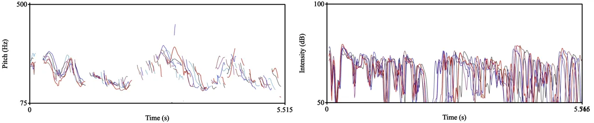

(a) VITS

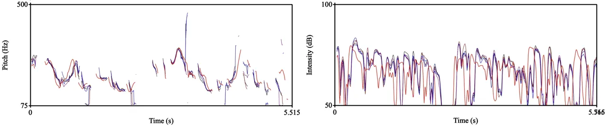

(b) Grad-TTS

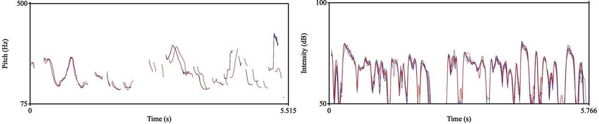

(c) ProDiff

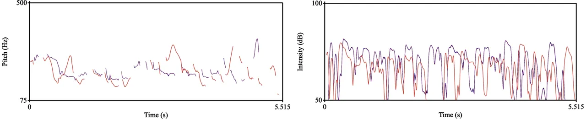

(d) DiffGAN-TTS

Figure 6: Comparing the energy and pitch of five samples that describe
the same text, with the original energy and pitch values marked in red.

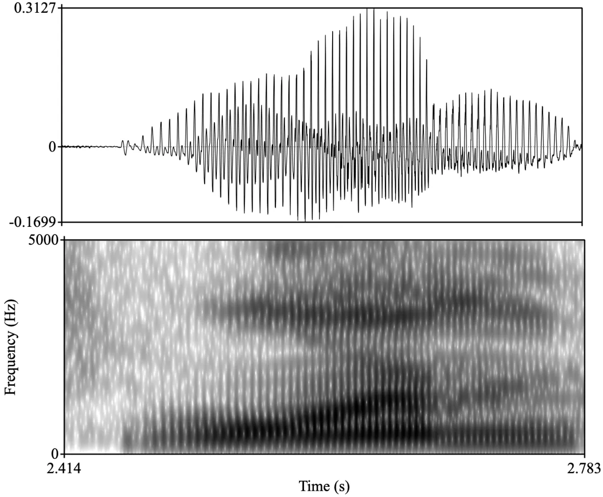

(a) VITS

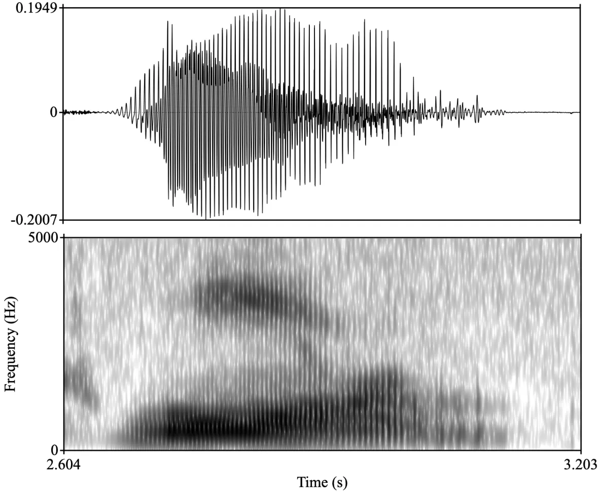

(b) ProDiff

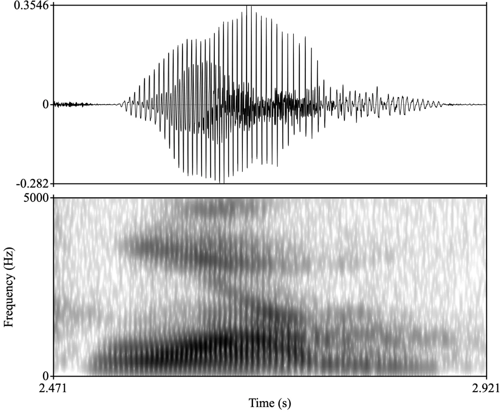

(c) Grad-TTS

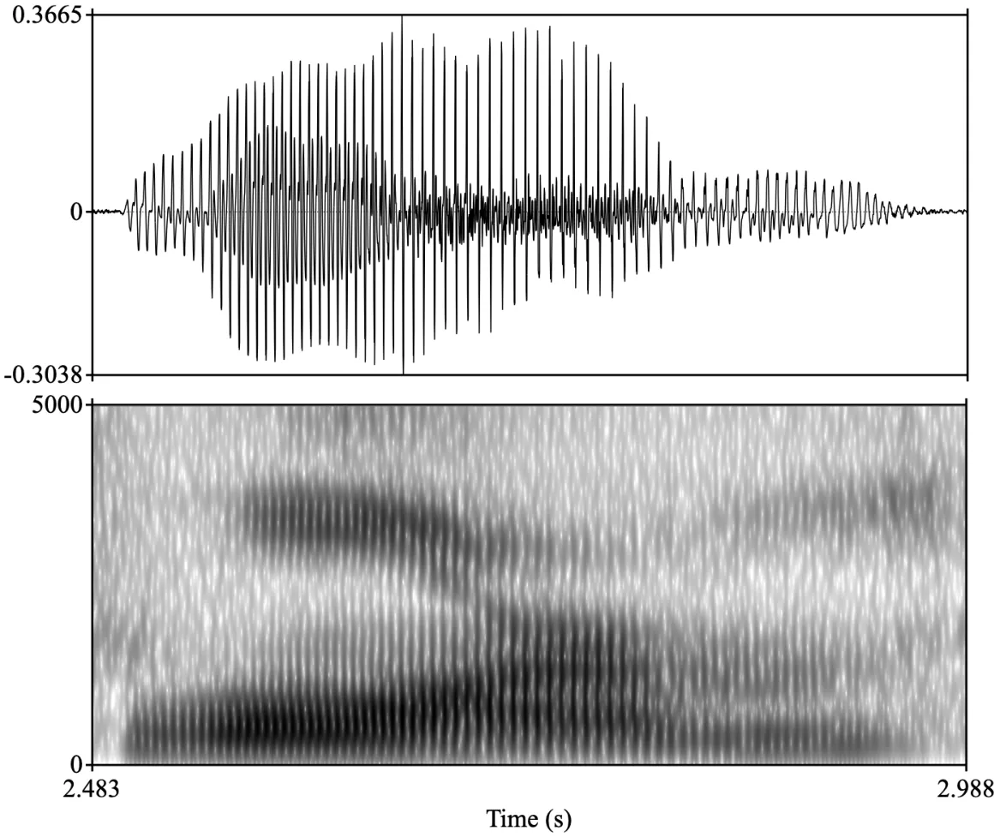

(d) DiffGAN-TTS

Figure 7: Displaying the vocal fry phenomenon across various models

## Appendix E Computational limitations and synthesis time

Existing models face a notable challenge in training and synthesizing
extremely long texts due to GPU computational constraints (Ren et al.,
2020). However, with its autoregressive architecture, our model might
handle this while preserving a consistent signal structure.

Figure 8 presents the analysis of the synthesis process of three models:
_DiffAR (200)_, _WaveGrad 2_,

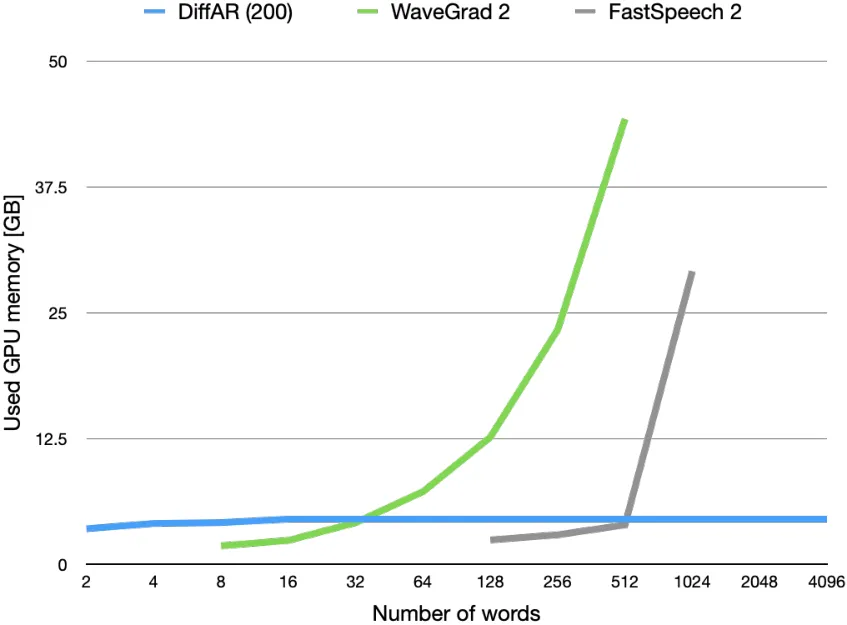

Figure 8: Used memory versus text length.

and _FastSpeech 2_, where each time we doubled the number of words in
the text and tested the maximum GPU consumption throughout the process.
Each point on this graph was created by executing the corresponding
model on GPU NVIDIA A40 with a memory of 48GB.

For the last two models, the GPU consumption escalates with an increase
in text length up to a certain threshold where it hits a limit and
triggers an out-of-memory error. For the _WaveGrad 2_ model, this occurs
post-processing 512 words; in the case of _FastSpeech 2_, it happens
after 1024 words. Contrarily, our model maintains a consistent memory
consumption level, an order of magnitude lower than the other models,
offering controlled efficiency.

A significant characteristic of the TTS task is the synthesis time.
Recent efforts have aimed at achieving low RTF values, enabling fast
synthesis for real-time and everyday applications. Huang et al. (2022b);
Liu et al. (2022) Numerous models, particularly diffusion models,
acknowledge the trade-off between audio quality and inference duration.
By controlling the synthesis duration, they imply a decline in
performance when the synthesis time is significantly reduced. (Popov
et al., 2021; Jeong et al., 2021)

While achieving high-quality synthesis, a notable limitation of _DiffAR_
is the extended synthesis time associated with the use of diffusion
models and the inherent limitation in the autoregressive approach, which
is sequential by definition. In Table 8, it is noticeable that DiffAR
reaches lower RTF performance compared to the other models, and is not
performed in real-time.

Another trade-off worth noting is between the RTF and the level of
stochasticity in the generated signal. It can be seen in Figures 6 that
all the models except _WaveGrad 2_ generate almost the very same signal
for every inference, while _DiffAR_ generates a slightly new version at
each inference call. Accelerating the diffusion process, providing an
explicit guidance (i.e., Initializing the signal not with white noise
(Popov et al., 2021)), and incorporating deterministic components - all
harm the model’s ability to generate a new version of the waveform and
be utilized as a one-to-many model. This, in turn, also influences the
generation of the prosodical features of the signal (such as vocal fry).

There are numerous strategies to expedite the synthesis process while
still maintaining the autoregressive nature: Reducing the number of
steps in the diffusion process (e.g., using DDIM Song et al. (2020),
which involves trade-offs as previously discussed) or even by developing
a parallelized algorithm (Oord et al., 2018). The focus of our work was
to generate a realistic signal with prosodical features and with natural
variability. Hence, addressing this issue will be deferred to future
work.

| Method      | $`\uparrow`$RTF |
| ----------- | --------------- |
| Fastspeech2 | $`2.79`$        |
| Wavegrad2   | $`5.14`$        |
| VITS        | $`0.09`$        |
| ProDiff     | $`0.25`$        |
| GradTTS     | $`3.24`$        |
| DiffGAN     | $`0.06`$        |
| DiffAR      | $`31.06`$       |

Table 8: Real-time Factor (RTF)

## Appendix F Extension to multiple speakers

While the traditional TTS task typically involves a single-speaker
dataset, other research directions include using multiple speakers or
languages and incorporating emotional characteristics or background
noises guided by text. Additionally, combining multiple speakers in a
single text is another potential avenue.

Various methods exist for performing these tasks, particularly in the
context of diffusion models. The main approaches include explicit
conditioning (Ho & Salimans, 2022) or utilizing external guidance during
the update of the diffusion procedure (Dhariwal & Nichol, 2021). For
DiffAR, we decided to investigate working in the multi-speaker scenario.
Our approach involves leveraging the model’s versatility by
incorporating the speaker’s embedding into the synthesis process. We
explored this option using _Titanet_ embedding (Koluguri et al., 2022)
and VCTK dataset (Veaux et al., 2017).

Figure 9 illustrates the architectural modification we implemented,
where $`v_{embedding}`$ represents the speaker embedding obtained from
the _Titanet_ network output.

Examples of multi-speaker generation can be found in our model’s GitHub
repository⁹⁹ 9
[https://github.com/RBenita/DIFFAR](https://github.com/RBenita/DIFFAR).

Another potential approach would involve utilizing the autoregressive
manner for in-context learning. Given an initial frame in a specific
voice and a desired text, the model would continue the speech in the
same given style without relying on additional information. However,
addressing this issue goes beyond the scope of this paper.

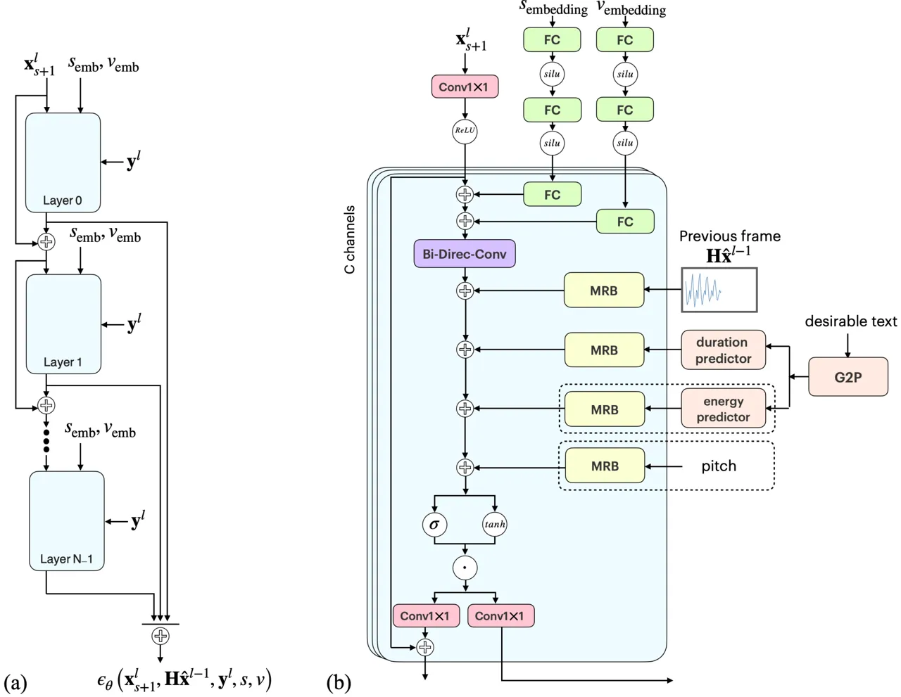

Figure 9: (a) A general overview of the structure of the residual layers
and their interconnections. (b) A detailed overview of a single residual
layer within the multi-speaker scenario.
