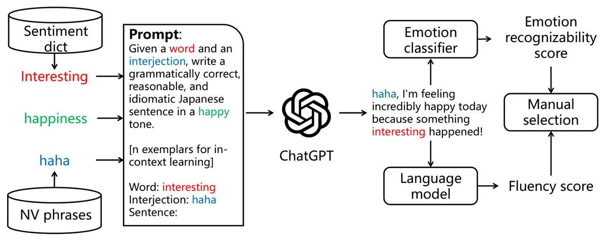
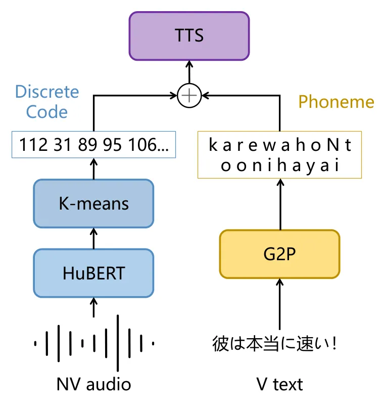

# JVNV: A Corpus of Japanese Emotional Speech with Verbal Content and Nonverbal Expressions

Detai Xin¹  , Junfeng Jiang¹¹¹footnotemark: 1   , Shinnosuke Takamichi¹
Yuki Saito¹, Akiko Aizawa^(1,2), Hiroshi Saruwatari¹  
¹Graduate School of Information Science and Technology, The University
of Tokyo, Japan  
²National Institute of Informatics, Japan  
{detai_xin, shinnosuke_takamichi}@ipc.i.u-tokyo.ac.jp  
jiangjf@is.s.u-tokyo.ac.jp   aizawa@nii.ac.jp ^(†)^(†)thanks: These
authors contributed equally to this work.

###### Abstract

We present the JVNV, a Japanese emotional speech corpus with verbal
content and nonverbal vocalizations whose scripts are generated by a
large-scale language model. Existing emotional speech corpora lack not
only proper emotional scripts but also nonverbal vocalizations (NVs)
that are essential expressions in spoken language to express emotions.
We propose an automatic script generation method to produce emotional
scripts by providing seed words with sentiment polarity and phrases of
nonverbal vocalizations to ChatGPT using prompt engineering. We select
$`514`$ scripts with balanced phoneme coverage from the generated
candidate scripts with the assistance of emotion confidence scores and
language fluency scores. We demonstrate the effectiveness of JVNV by
showing that JVNV has better phoneme coverage and emotion
recognizability than previous Japanese emotional speech corpora. We then
benchmark JVNV on emotional text-to-speech synthesis using discrete
codes to represent NVs. We show that there still exists a gap between
the performance of synthesizing read-aloud speech and emotional speech,
and adding NVs in the speech makes the task even harder, which brings
new challenges for this task and makes JVNV a valuable resource for
relevant works in the future. To our best knowledge, JVNV is the first
speech corpus that generates scripts automatically using large language
models.

   

|     |
| --- |
|     |

## 1 Introduction

Nonverbal expressions, such as vocal, facial, and gestural
expressions \[41\], play an important role in human communication \[38,
14\]. In human speech, nonverbal expressions are called nonverbal
vocalizations (NVs), which refer to vocalizations containing no
linguistic information like laughter, sobs, and screams \[30\]. These
expressions are relatively casual and usually used in spoken
language \[43\]. One of the most important functions of NVs is conveying
affects \[36, 3\]. Especially, emotional NVs, which are also called
affect bursts, widely exist in many cultures \[35\]. Though NVs were
ignored by most previous research on emotional speech \[26\], recent
works have shown the possibility of applying NVs in many conventional
speech-processing tasks including speech emotion recognition \[45\] and
expressive speech synthesis \[23, 48, 46\].

The number of open-sourced emotional speech corpora with NVs is quite
limited. Most existing work used in-house datasets to conduct
experiments \[44, 48\], or even purchased a commercial corpus with
limited size \[29\] for their experiments. As a result, further progress
on NVs is impeded by a serious low-resource problem. We attribute this
problem to two reasons. Firstly, it is difficult to obtain proper
scripts for emotional speech corpus. Adigwe et al. \[1\] reused neutral
scripts from an existing speech corpus \[21\] and asked the speakers to
utter them with different emotions. Such a method is efficient because
it can utilize existing annotations of the original scripts and skip to
consider some important factors for corpus design like phoneme balance.
However, the neutral scripts make it difficult for speakers to utter
them with designated emotions naturally when collecting speech data.
Takeishi et al. \[40\] collected emotional scripts from social media but
failed to guarantee the phoneme balance property of the proposed corpus.
Saito et al. \[33\] even employed workers to manually write emotional
scripts, which is costly and difficult to scale up. Secondly, things
become more troublesome when we need to make emotional scripts with NV
phrases. Adigwe et al. \[1\] tried to accomplish it by encouraging
speakers to add NVs when they uttered the scripts. But since this is not
compulsory, not all utterances of the proposed corpus contain NVs.
Arimoto et al. \[2\] collected a spontaneous speech corpus from online
game chats. Though it is possible to find nonverbal expressions in this
corpus, annotating the position and emotion labels for all NVs is
prohibitive.

In this paper, to solve the above problems, we propose a corpus
construction method assisted by large language models (LLMs) to generate
emotional scripts with nonverbal expressions. The proposed method first
samples candidate seed words from a Japanese sentiment polarity
dictionary \[15\] and NV phrases from a previous Japanese NVs
corpus \[47\] to form prompts to generate emotional scripts with an LLM.
To improve the quality of generation, we leverage the ability of
in-context learning of LLMs by adding handwritten exemplars in the
prompts. We then select high-quality scripts with the help of an emotion
classifier and a language model. Second, based on the proposed method,
we construct JVNV, an emotional Japanese speech corpus uttered by
professional speakers with Verbal content and Non-Verbal expressions.
JVNV consists of about four hours of emotional speech data covering six
basic emotions \[10\] from four native speakers. Every utterance has at
least one NV phrase. We also annotate the duration of the NV phrases in
each utterance. JVNV is large enough to support relevant tasks like
speech emotion recognition (SER) and expressive speech synthesis.
Besides, since the phrases and duration of NVs are provided explicitly,
JVNV is more suitable for further research on NVs compared to existing
corpora with NVs. In the experiments, we first technically validate the
effectiveness of the proposed corpus construction method from the
aspects of phoneme coverage and emotion recognizability. We then
benchmark JVNV on emotional text-to-speech (TTS) synthesis using
discrete codes obtained from a self-supervised learning (SSL) model to
represent NVs. We show there still exists a gap between the performance
of synthesizing read-aloud speech and emotional speech, and adding NVs
in the speech even makes the task harder, which brings new challenges
for this task and makes JVNV a valuable resource for relevant tasks in
the future.

The contributions of this work can be summarized as follows:

- •
  We propose a corpus construction method for emotional speech with NVs
  using LLMs for script generation, which is to our best knowledge the
  very first try of making scripts for a speech corpus with LLMs.
- •
  We construct JVNV, a phoneme-balanced Japanese emotional speech corpus
  with both verbal and nonverbal expressions. JVNV is expected to
  further advance relevant works with NVs in the future.
- •
  We conduct comprehensive objective and subjective experiments to
  technically validate the effectiveness of JVNV.
- •
  We benchmark JVNV on emotional TTS, and show the challenges of
  synthesizing emotional speech with both verbal and nonverbal
  expressions.

We release JVNV at
[https://sites.google.com/site/shinnosuketakamichi/research-topics/jvnv_corpus](https://sites.google.com/site/shinnosuketakamichi/research-topics/jvnv_corpus).

## 2 Related work

##### Script selection for speech synthesis

Early script selection methods, usually focused on phoneme coverage of
the scripts that intuitively relate to the generalization ability of a
TTS system. They either regarded the selection process as a set covering
problem to cover more phoneme combinations \[11, 4\] or tried to match
the phoneme distribution of the selected scripts with a desired
distribution \[24, 6\]. Recently, Nose et al. \[31\] proposed a
selection criterion called extended entropy to measure the phonetic and
prosodic coverage of the selected scripts.

To design an emotional speech corpus, one has to not only ensure the
selected scripts can express the target emotions, but also consider the
phonemic properties of the scripts like phoneme coverage. However, it is
difficult to balance these two factors. Takeishi et al. \[40\] collected
emotional scripts from Twitter, but had narrow phoneme coverage compared
to other read-aloud corpora. Adigwe et al. \[1\] utilized
phoneme-balanced scripts of an existing read-aloud corpus to construct
an emotional corpus, but the neutral scripts usually failed to express
the desired emotions. In this work, we try to balance these two factors
by using LLMs to generate proper emotional scripts based on seed words
to ensure sufficient phoneme coverage.

##### Emotional speech corpus with nonverbal expressions

Emotional speech corpora can be roughly categorized into two types:
acted and spontaneous \[7\]. In acted corpora, scripts and a recording
instruction are provided to the speakers before the recording, which
makes it easy to control label balance and almost does not need extra
manual annotation. Therefore, the difficulty of constructing an acted
corpus with NVs lies in making emotional scripts with nonverbal
expressions. Adigwe et al. \[1\] dealt with this difficulty by
encouraging speakers to utter NVs during recording, but their method
cannot ensure every utterance has NVs, let alone control the content of
NVs. On the other hand, spontaneous corpora have fewer constraints on
speakers. Usually, the speakers can speak any content in any style.
However, these corpora require more effort to do annotation and usually
have an imbalanced label distribution. Since NVs are casual expressions,
it is easy to incorporate NVs in a spontaneous corpus. Arimoto et al.
\[2\] collected an emotional corpus with many nonverbal expressions from
online game chats. However, only laughter was annotated in this corpus.

## 3 Proposed corpus construction method



Figure 1: Overview of the proposed emotional script generation method
with NV phrases. Here we use happiness as the emotion, interesting as
the seed word, and haha as the NV phrase. Note we use the word
“interjection” to replace NV so that ChatGPT can understand this
concept.

We aim to construct a Japanese emotional corpus with NVs covering six
basic emotions \[10\]: anger, disgust, fear, happiness, sadness, and
surprise. The core idea is to create proper prompts for controllable
script generation. The overview of the proposed script generation method
is illustrated in Figure 1. To generate scripts, we first sample seed
words from a Japanese sentiment polarity dictionary \[15\] and NV
phrases collected in the JNV corpus \[47\]. Then, we prompt an LLM to
generate emotional scripts using sampled \<word, phrase\> pairs.
Especially, we use ChatGPT here because of the high quality of its
generated texts and its moderate price. Finally, we select high-quality
scripts from the generated scripts with the assistance of an emotion
classifier and a language model. In the following sections, we introduce
the proposed corpus construction method step by step.

### 3.1 Sessions

Following Trouvain and Truong \[43\], we define NVs as vocalizations
uttered by humans that are difficult or even not able to be transcribed
into orthographical forms. Therefore, NVs include not only nonverbal
expressions like laughter but also common interjections like “Oh”.
Though there exists a common set of NV phrases in Japanese, people
usually have their own unique NV phrases to express certain
emotions \[47\]. Therefore, we design to create two kinds of scripts for
two different sessions in the corpus: regular session and phrase-free
session. In the regular session, we designate a certain NV to utter in
each script. In the phrase-free session, we do not include NV phrases in
the scripts but ask the speakers to utter NVs by themselves with no
restriction on the phonetic content. This approach can ensure the
generality of the phrases while maintaining the personality of each
speaker.

### 3.2 Phrases of NVs

For phrases used for the regular session, we adopt NV phrases collected
in JNV corpus \[47\], which is a corpus of Japanese NVs covering six
basic emotions. JNV collects NV phrases by large-scale crowd-sourcing
and thus can cover a wide range of phrases used in daily conversations.
We choose phrases that have high emotion recognizability in JNV, which
results in 11/7/8/16/7/19 phrases for
anger/disgust/fear/happiness/sadness/surprise, respectively. Readers are
recommended to refer to JNV¹¹ 1
[https://sites.google.com/site/shinnosuketakamichi/research-topics/jnv_corpus](https://sites.google.com/site/shinnosuketakamichi/research-topics/jnv_corpus)
to get detailed information of the phrases.

### 3.3 Seed words with sentiment polarity

With the impressive ability of text generation of ChatGPT, it is
possible to ask ChatGPT to generate scripts by simply prompting it with
a phrase and an emotion. However, in our preliminary experiments, the
generated scripts suffered from semantic overlapping. Their sentence
structures and vocabularies also lacked diversity, making this naive
method inappropriate for generating proper scripts for a speech corpus.
Moreover, we also tried to find proper scripts from existing sentiment
analysis corpora and insert NV phrases into the original emotional
sentences. But this method is also infeasible because the selected NV
phrase is not necessarily suitable for a certain sentence, producing
unnatural and incoherent scripts.

Therefore, we propose to generate scripts by adding a seed word together
with the (phrase, emotion) pair in the prompt. We use a Japanese
sentiment polarity dictionary that includes words with positive,
negative, and neutral polarities \[15\]. For each script, we sample a
word from the dictionary with a proper polarity and use ChatGPT to
generate an emotional script using the given NV phrase, emotion, and the
seed word. In this way, the proposed method can generate coherent and
diverse scripts with NV phrases. Furthermore, it is intuitively more
natural and easier to make scripts using words with a proper polarity
rather than random words. For example, we may randomly select a negative
word like “bad” to create a happy script, which is unsuitable.

In practice, we first filter inappropriate words (e.g. toxic words) from
the dictionary²² 2
[https://www.cl.ecei.tohoku.ac.jp/Open_Resources-Japanese_Sentiment_Polarity_Dictionary.html](https://www.cl.ecei.tohoku.ac.jp/Open_Resources-Japanese_Sentiment_Polarity_Dictionary.html)
using an existing word list³³ 3
[https://github.com/MosasoM/inappropriate-words-ja](https://github.com/MosasoM/inappropriate-words-ja).
We sample negative words for the script generation of anger, disgust,
fear, and sadness, while positive words are sampled for generating happy
scripts. For the emotion of surprise, although it is possible to sample
all kinds of words, we sample only neutral words to avoid the possible
confusing patterns between surprise and other emotions (e.g., happiness
or fear) \[3, 47\]. The detailed generation algorithm is described in
the next section.

### 3.4 Script generation with prompt engineering

With the emotions, the phrases, and the seed words prepared, we prompt
ChatGPT to generate scripts. The prompt template is shown in Figure 2.
It consists of three parts: a task instruction, $`n`$ exemplars for
few-shot in-context learning, and a placeholder for the script to be
generated. The first sentence of the instruction describes the basic
requirements including the information of the target emotion. The second
sentence stresses that the generated script should effectively express
the target emotion. We also use expressions like “vivid wording” and
“specific reasons” to serve as conditions for text generation to make
the scripts more diverse and reasonable. Note that, we use
“interjection” in the prompt since we found that ChatGPT could not
understand the meaning of NVs well in our preliminary experiments.

Figure 2: Prompt template for script generation. We use happiness as an
example. Texts embraced by \[\] are replaced by proper content during
script generation. Texts starting with \# are comments. We use $`n=3`$
demonstrations during the script generation. We provide one of them as
an example. The English translation is also attached.

We leverage the strong in-context learning ability of ChatGPT \[5\] by
providing $`n`$ exemplars. Each exemplar comprises a seed word, an NV
phrase, and a sentence that satisfies our requirements, which helps
ChatGPT to understand what we expect it to generate. In this work, we
manually create $`n=3`$ exemplars for each emotion with non-overlapped
seed words and phrases. Finally, we fill in the sampled seed word and
phrase to the same template as the exemplars and leave the script term
blank for script generation.

We use the gpt-3.5-turbo-0301 API from OpenAI⁴⁴ 4
[https://openai.com/blog/chatgpt](https://openai.com/blog/chatgpt).
Since ChatGPT performs better on English tasks than on Japanese tasks,
we use English to compose the prompt so that it can understand our
instructions better. For generating the scripts of the phrase-free
session, the phrase information is excluded from the prompt template. In
this stage, we finally generate $`13`$k candidate scripts.

### 3.5 Rating the scripts

Though the generated scripts already have a high quality, we further
rate them to filter out some bad cases to control their qualities. We
consider two criteria that are important for scripts of an emotional
speech corpus: emotion recognizability and fluency. Speakers will feel
easy to utter the script and express the emotion if the script is fluent
and reasonable to express the emotion. To this end, we propose to use an
emotion classification model and a language model to rate the scripts.

To obtain the emotion recognizability score, we train an emotion
classifier based on the Japanese RoBERTa⁵⁵ 5
[https://huggingface.co/rinna/japanese-roberta-base](https://huggingface.co/rinna/japanese-roberta-base) \[28\]
using the Japanese emotion analysis corpus, WRIME \[19\], which covers
the six emotions used in JVNV. Subsequently, the classification
probability of the emotion of each script is served as the emotion
recognizability score. To obtain the fluency score, we compute the
pseudo-log-likelihood scores (PLL) \[34\] based on the Japanese BERT
model⁶⁶ 6
[https://huggingface.co/cl-tohoku/bert-base-japanese-v2](https://huggingface.co/cl-tohoku/bert-base-japanese-v2) \[9\].
PLL can be regarded as an approximation of the perplexity of the
generated script. So, it is suitable to serve as the fluency score.

After rating all generated scripts, we convert the two scores to
$`[0,1]`$ so that they have the same scale. We then sort them
descendingly by the summation of these two scores, and select the
top-$`k`$ scripts for speech data collection. We balance the number of
scripts for different emotions and phrases. We first select a core
script set that contains $`356`$ scripts that are required to be uttered
by all speakers, where each emotion has $`10`$ scripts without NV
phrases for the phrase-free session. We also select an extra script set
with $`158`$ scripts with NV phrases for the regular session in case the
speakers have spare time to utter more samples. We show the detailed
information in Table 1.

|       |           |           |           |           |           |           |         |
| ----- | --------- | --------- | --------- | --------- | --------- | --------- | ------- |
| Set   | Anger     | Disgust   | Fear      | Happiness | Sadness   | Surprise  | Total   |
| Core  | $`44+10`$ | $`49+10`$ | $`49+10`$ | $`48+10`$ | $`49+10`$ | $`57+10`$ | $`356`$ |
| Extra | $`22`$    | $`15`$    | $`28`$    | $`41`$    | $`14`$    | $`38`$    | $`158`$ |

Table 1: Numbers of selected scripts (regular session + phrase-free
sessions) for each emotion. Noted that these two sets have no
overlapping.

### 3.6 Phoneme coverage

In our preliminary experiments, we found that it was hard to cover some
rare phonemes in Japanese like “

デュ” (pronounced as /dyu/) by randomly choosing seed words. Therefore,
we manually choose some words (less than $`5`$) containing rare phonemes
as the seed words for the phrase-free session. This process ensures the
full script set covers all Japanese phonemes. In Section 5.1, we show
that our proposed script set has better phoneme coverage than a previous
Japanese emotional corpus.

## 4 JVNV corpus

We used the selected scripts to construct the proposed JVNV corpus. We
employed four professional speakers (two males and two females) to utter
these scripts. They are all native speakers and experienced in
professional voice acting. Each speaker was required to utter the
scripts with the designated emotions as many as possible within four
hours. Right before the recording, we first described our goal of
collecting emotional speech with both verbal content and nonverbal
expressions. We then described some key points of the recording,
including the definition of NV, the definition of the two sessions, and
their differences. The speakers were instructed to express the emotions
as naturally as possible. Also, they were allowed to utter NVs with more
flexibility on duration and contents than the verbal parts. For example,
for an NV phrase “

はは(haha)”, they can utter as “

ははは(hahaha)”, as long as they think it was more natural for
expressing the given emotion. In the phrase-free session, we encouraged
them to utter their personal NV phrases that do not exist in the regular
session, even if the phrases are not commonly used by other people.
However, if the speakers felt difficult to find a personal phrase, they
were allowed to refer to the phrases in the regular session. We paid
$`800,000`$ JPY for the recording involving four speakers.

|                |          |          |          |          |                |
| -------------- | -------- | -------- | -------- | -------- | -------------- |
| Emotion        | F1       | F2       | M1       | M2       | $`\sum`$ (hrs) |
| Anger          | $`54`$   | $`76`$   | $`54`$   | $`65`$   | $`0.53`$       |
| Disgust        | $`59`$   | $`74`$   | $`59`$   | $`66`$   | $`0.59`$       |
| Fear           | $`59`$   | $`78`$   | $`59`$   | $`69`$   | $`0.65`$       |
| Happiness      | $`58`$   | $`90`$   | $`58`$   | $`74`$   | $`0.75`$       |
| Sadness        | $`59`$   | $`73`$   | $`59`$   | $`66`$   | $`0.82`$       |
| Surprise       | $`67`$   | $`86`$   | $`67`$   | $`86`$   | $`0.60`$       |
| $`\sum`$ (hrs) | $`0.94`$ | $`1.11`$ | $`0.92`$ | $`0.97`$ | $`3.94`$       |

Table 2: Number of utterances for each (emotion, speaker) pair in JVNV.
The total duration of each speaker/emotion is shown in the last
row/column.

All utterances were recorded in an anechoic chamber to reduce possible
noises, and were saved as $`48`$ kHz Wav files. All speakers uttered the
core set. Two of them uttered scripts in the extra set. We show the
number of utterances of each (emotion, speaker) pair in Table 2. The
final corpus contains about $`3.94`$ hours of emotional speech data.
Note that, due to our limited budgets, the size of the corpus is
limited, but it is enough for the experiments described in Section 6 and
is easy to scale up by employing more speakers.

In addition to the audio and scripts, we also provide the duration
information of the NV in each utterance. Such labels can be used to
study nonverbal expressions or verbal content separately, and can also
support other methods like data augmentation described in Section 6.

## 5 Technical validation

In this section, we validate the effectiveness of the proposed corpus
construction method and JVNV from the aspects of phoneme coverage and
emotion recognizability. We use the scripts or audio of the following
existing corpora for comparison:

- •
  ITA⁷⁷ 7
  [https://github.com/mmorise/ita-corpus](https://github.com/mmorise/ita-corpus):
  A phoneme-balanced script set designed for TTS. It comprises $`324`$
  neutral scripts and $`100`$ emotional scripts. The scripts are
  manually selected to ensure phoneme coverage.
- •
  JTES \[40\]: An emotional corpus with four emotions (anger, happiness,
  sadness, neutral) uttered by nonprofessional speakers, where the
  scripts are collected from Twitter and each emotion has $`50`$
  scripts.
- •
  OGVC \[2\]: A spontaneous speech corpus collected from online game
  chats with post-annotated emotion labels. OGVC includes ten different
  emotions, covering all emotions used in our JVNV.
- •
  STUDIES \[33\]: A manually designed Japanese dialogue speech corpus
  with four emotions (anger, happiness, sadness, neutral) uttered by
  professional speakers, where the scripts are collected by employing
  workers to write emotional dialogues.

### 5.1 Phoneme coverage

As for the phoneme coverage, we only compare JVNV with ITA and JTES,
since the number of scripts in OGVC ($`6579`$) and STUDIES ($`5311`$) is
much larger than others, which is unfair to perform a comparison. We
first compute extended entropy \[31\] of each script set, which is
defined as the summation of the entropy of $`m`$ consecutive phonemes:

```math
S=\sum_{m=1}^{M}w_{m}S_{m},\;\;\quad S_{m}=-\sum_{n=1}^{N_{m}}p_{mn}\log_{2}{p_{mn}}, \tag{1}
```

where $`M`$ is the maximal number of consecutive phonemes. $`S_{m}`$ and
$`w_{m}`$ are the entropy of $`m`$ phonemes approximated from the script
set and the weight of it, respectively. $`p_{mn}`$ is the probability of
the $`n`$-th combination of $`m`$ consecutive phonemes. $`N_{m}`$ is the
number of all possible arrangements of $`m`$ consecutive phonemes in the
scripts. In this work, we set $`M=4`$ and $`w_{m}=0.25(m=1,2,3,4)`$. The
result is shown in Table 3.

|           |             |             |           |
| --------- | ----------- | ----------- | --------- |
| ITA       | JVNV (full) | JVNV (core) | JTES      |
| $`34.64`$ | $`33.33`$   | $`33.20`$   | $`33.10`$ |

Table 3: Extended phoneme entropy of each corpus. Higher entropy means
better phonemic balance.

|                    |           |           |           |           |
| ------------------ | --------- | --------- | --------- | --------- |
| JVNV               | JVNV-V    | JTES      | STUDIES   | OGVC      |
| $`\mathbf{94.21}`$ | $`87.37`$ | $`80.85`$ | $`62.05`$ | $`54.69`$ |

Table 4: Subjective emotion recognition accuracy ($`\%`$) of each
corpus.

It shows that both the core and full sets of JVNV have better phoneme
coverage than JTES, which demonstrates that the generated emotional
scripts of the proposed method have better quality than the manually
collected emotional scripts of JTES. Besides, the ITA corpus has the
largest extended entropy, which is expected since it is designed for
good phoneme coverage without considering the emotions.

Figure 8 shows the number of arrangements of $`m`$ consecutive phonemes
of each corpus. It can be seen that JVNV has a similar performance to
ITA, but JTES fails to capture diverse phoneme arrangements when
$`m=4`$, which further shows that JVNV has better phoneme coverage than
JTES.

Figure 5: The number of unique arrangements of consecutive phoneme(s) of
each corpus. 
Figure 8: The proposed TTS method uses codes to represent NVs. Codes and
phonemes are concatenated together and fed to the TTS model.

### 5.2 Emotion recognizability

As for emotion recognizability, we compare JVNV with JTES, OGVC, and
STUDIES. We exclude ITA since it has no emotional utterances. For JTES
and STUDIES, we exclude the neutral scripts. For OGVC, we select the
utterances with the six emotions used in JVNV. Each utterance in OGVC is
annotated with three labels from three annotators, and we only use those
utterances whose three labels are the same, which only accounts for
$`3\%`$ of the whole corpus. To show the contributions of NVs on emotion
recognizability, we also evaluate the verbal parts of JVNV by removing
nonverbal parts from the utterances of JVNV, which is denoted as
“JVNV-V”.

We conducted a forced choice task on a Japanese crowdsourcing platform⁸⁸
8 [https://www.lancers.jp/](https://www.lancers.jp/). For each corpus,
we randomly picked up $`60`$ emotion-balanced samples. Thirty workers
participated in the evaluation. Each worker evaluated $`30`$ utterances
by listening to the corresponding audio and selecting the most possible
expressed emotion from seven choices (the six emotions used in JVNV and
an extra “None of the above” choice to avoid artificially high
accuracy \[37\]). The result is shown in Table 4.

Firstly, we find that JVNV has much higher accuracy than JTES, OGVC, and
STUDIES, which demonstrates the utterances of JVNV are expressive enough
for people to recognize the emotions. Secondly, the accuracy of JVNV
degrades after removing the NVs, which demonstrates the necessity of
considering NVs in emotional speech. Note that, even without NVs, JVNV-V
still performs better than JTES and STUDIES, whose scripts are written
or designed by human, showing the effectiveness of using prompt
engineering with ChatGPT to generate proper emotional scripts. Finally,
to our surprise, OGVC has the lowest emotion recognizability even if we
select those utterances with high agreement from the original
annotators. We assume that it is because collecting speech of uncommon
emotions in a specific situation (e.g., game chats in this case) is
difficult. We further inspect the results and find that the
recognizability of anger, fear, and disgust in OGVC is much lower than
that of happiness, sadness, and surprise. This observation supports our
assumption since happiness, sadness, and surprise are more common to
appear during game playing than the other three emotions, which
demonstrates the difficulty of controlling the balance of emotion labels
for a spontaneous emotional speech corpus. In summary, JVNV not only has
good phoneme coverage but also has high emotion recognizability with
nonverbal expressions, showing the effectiveness of the proposed corpus
construction method.

## 6 TTS benchmark

### 6.1 The TTS model with mixed representations

We benchmark JVNV on the task of emotional TTS. One of the key problems
for synthesizing speech with both nonverbal expressions and verbal
contents in the framework of TTS is how to represent NVs in a symbolic
form. This is because NVs used in daily life usually have various
phonetic contents and duration (the design choices like the phrase-free
session of the proposed method also aim to simulate this fact), which
makes it quite difficult to transcribe NVs like the verbal contents.

Fortunately, recent work implies that it is possible to use discrete
tokens extracted by a self-supervised model to represent NVs \[16, 23,
46, 48\]. Following this idea, we use a TTS model that is used to
synthesize laughter in a previous work \[46\] and adapt it to JVNV. The
general architecture is illustrated in Figure 8. Inspired by the
previous work \[46, 48\], we use discrete codes generated by a k-means
model trained on the features extracted by HuBERT \[17\] from the
waveforms of NVs to represent NVs, and use phonemes as the
representations for verbal text. The two representations are then
concatenated together and fed to the TTS model. For the TTS model, we
use the same architecture of Xin et al. \[46\] based on
FastSpeech2 \[32\] with an additional emotion embedding table. An
unsupervised alignment module is used to get the duration of
codes/phonemes automatically, which is trained with connectionist
temporal classification loss \[13\] adapted from GlowTTS \[20\]. Readers
are recommended to refer to the original paper \[46\] for more details.
Furthermore, we propose a data augmentation strategy, where we randomly
select a NV with the same emotion to replace the original one in the
utterance during training.

### 6.2 Experiments

#### 6.2.1 Setup

To show the difficulties of synthesizing emotional speech, we use JVNV
and a read-aloud Japanese speech corpus, JSUT \[39\], to train all
models. The emotion labels of all utterances of JSUT are treated as
neutral. In addition to the model trained by the proposed method
(denoted as “NV+V” hereafter), we also trained two variations of the
proposed method. The first variation, denoted as “V”, is trained on
JVNV-V with no NV in the training set. In the second variation denoted
as “Phoneme”, we use phonemes of the phrases to represent NVs. For each
emotion except for neutral, we left $`12`$ samples for testing, which
were equally selected from all speakers. Note that, during inference, we
directly use the codes of NVs extracted from ground truth (GT)
utterances for simplicity, but it is also possible to use another model
like a language model to sample codes \[46\]. For the utterances of
JSUT, we also excluded $`12`$ samples from the training set, which were
only used for the subjective evaluation test described in the next
section. We used HiFi-GAN \[22\] to convert mel-spectrograms output by
the TTS model into time-domain waveforms. For more details of the
experiments, please refer to the appendix.

#### 6.2.2 Results and discussions

We use both objective and subjective metrics to evaluate the
performance. For objective metrics, we use mel-cepstral distortion (MCD)
and F0 root mean square error (F0-RMSE) to evaluate the speech quality
and prosody. For subjective metrics, we conduct a standard five-scale
mean opinion scores (MOS) test to evaluate the naturalness of the
synthesized speech from $`1`$ (very unnatural) to $`5`$ (very natural).
For the NV+V model, we additionally removed the NV part of each
synthesized utterance to evaluate the performance of NV+V on
synthesizing verbal speech. In the MOS test, we also evaluate the $`12`$
JSUT samples. We denote the MOS scores of the synthesized emotional
speech and neutral speech as “MOS-Emo” and “MOS-JSUT”, respectively.

|          |         |                     |                         |                                   |                        |
| -------- | ------- | ------------------- | ----------------------- | --------------------------------- | ---------------------- |
| Model    | NV      | MCD($`\downarrow`$) | F0-RMSE($`\downarrow`$) | MOS-Emo($`\uparrow`$)             | MOS-JSUT($`\uparrow`$) |
| GT       | ✓       | \-                  | \-                      | $`4.7`$                           | $`4.3`$                |
| HiFi-GAN | ✓       | $`3.1`$             | $`26.4`$                | $`4.1`$                           | $`3.8`$                |
| V        | ✗       | $`5.9`$             | $`49.5`$                | $`2.9`$                           | $`3.4`$                |
| NV+V     | code    | $`\mathbf{6.2}`$    | $`\mathbf{50.9}`$       | $`\mathbf{2.4}`$ ($`3.0`$ w/o NV) | $`\mathbf{3.5}`$       |
| Phoneme  | phoneme | $`6.7`$             | $`53.1`$                | $`1.9`$                           | $`3.4`$                |

Table 5: Performance of the models trained with different
representations for NVs. For all models we use the same test set except
for the V model, where we exclude all NVs in the test set. Bold
indicates the best score with $`p<1e\mathchar 45\relax 5`$.

The results are shown in Table 5. First, we can see that NV+V
consistently outperforms Phoneme in all metrics, showing the
effectiveness and necessity of the proposed method using discrete codes
to represent NVs. During training, we also observed that the Phoneme
model even could not converge. We suppose it is because phoneme is not a
proper representation for NVs. Second, for all models, the MOS-Emo
scores are worse than the MOS-JSUT scores, which demonstrates the
difficulties of synthesizing emotional speech with various prosody
patterns. Third, although the MOS-JSUT scores of V and NV+V are quite
similar, the difference of MOS-Emo scores is too large to neglect, which
can be regarded as the extent of performance degradation by adding NVs.
This observation is further verified by evaluating the verbal part of
the synthesized samples of NV+V, which results in a MOS-Emo score of
$`3.0`$ that is even larger than the one of V, showing the difficulty of
synthesizing nonverbal expressions. By listening to the samples, we
found that some NVs were still not synthesized with correct phonetic
contents. We assume this is because the discrete code obtained from
HuBERT is still not a perfect representation for NVs, even if it is
better than the phoneme. This is quite intuitive since HuBERT is trained
on speech corpora with rare NVs \[17\].

To sum up, we show that there still exists a big gap between the
performance of normal TTS and emotional TTS, and adding NVs in emotional
speech makes the task even harder. Based on our observations, we realize
that the discrete code cannot fully represent NVs. Therefore, finding a
proper representation for NVs seems to be a core problem for this task
in the future, which further makes JVNV a valuable resource for future
work in this field.

## 7 Potential social impacts

JVNV should intuitively be a useful resource for all emotional speech
processing tasks with NVs, including but not limited to: speech emotion
recognition \[18, 45\], emotional speech synthesis \[23\], and NVs
detection \[12\]. As previous work showed that NVs can effectively
improve the emotion recognizability \[25\] and expressiveness \[8\] of
real/synthetic speech, we expect JVNV to be utilized to construct
expressive TTS systems or robust high-accuracy SER systems in the
future.

However, JVNV also brings several potential negative impacts. First, for
TTS systems that can synthesize speech with NVs, since NVs make
synthetic speech more realistic and difficult to distinguish from real
speech for listeners, they might be used in voice phishing. Such a
problem can be possibly solved by recent speech anti-spoofing
technologies \[27\]. Second, for powerful SER systems that can recognize
emotions from not only verbal speech but also nonverbal signals like
sighs and laughter, they might be maliciously used to analyze the mental
states of others, causing a severe privacy problem. Technologies for
solving such a problem are usually called SER evasion, in which the
original speech is perturbed to remove emotional information but
preserve content information \[42\].

## 8 Conclusions

This paper first presented JVNV, a Japanese emotional speech corpus with
verbal content and nonverbal expressions. The scripts of JVNV are
generated by providing seed words with sentiment polarity and phrases of
NVs to ChatGPT based on prompt engineering. To our best knowledge, JVNV
is the first speech corpus that uses LLMs to generate scripts. We
technically validated the effectiveness of the proposed corpus-design
method and demonstrated that JVNV has better phoneme coverage and
significantly higher emotion recognizability than previous Japanese
emotional corpora. Finally, we benchmark JVNV on the emotional TTS
synthesis task. We propose a method using mixed representations of
discrete codes and phonemes to represent NVs and verbal content,
respectively. Experimental results demonstrated that the proposed mixed
representation is consistently better than the phoneme for utterances
mixed with NVs and verbal content. Finally, we showed the challenges of
emotional TTS with NVs compared to normal TTS. We believe JVNV can serve
as a valuable resource for future work in all relevant tasks including
NVs.

## Acknowledgments and Disclosure of Funding

This work was supported by JST SPRING, Grant Number JPMJSP2108, JSPS
KAKENHI, Grant Number JP23KJ0828.

## References

- \[1\] A. Adigwe, N. Tits, K. E. Haddad, S. Ostadabbas, and T. Dutoit.
  The emotional voices database: Towards controlling the emotion
  dimension in voice generation systems. _arXiv preprint
  arXiv:1806.09514_, 2018.
- \[2\] Y. Arimoto, H. Kawatsu, S. Ohno, and H. Iida. Naturalistic
  emotional speech collection paradigm with online game and its
  psychological and acoustical assessment. _Acoustical science and
  technology_, 33(6):359–369, 2012.
- \[3\] P. Belin, S. Fillion-Bilodeau, and F. Gosselin. The montreal
  affective voices: a validated set of nonverbal affect bursts for
  research on auditory affective processing. _Behavior research
  methods_, 40(2):531–539, 2008.
- \[4\] B. Bozkurt, O. Ozturk, and T. Dutoit. Text design for tts speech
  corpus building using a modified greedy selection. In _Eighth european
  conference on speech communication and technology_, 2003.
- \[5\] T. Brown, B. Mann, N. Ryder, M. Subbiah, J. D. Kaplan,
  P. Dhariwal, A. Neelakantan, P. Shyam, G. Sastry, A. Askell, et al.
  Language models are few-shot learners. In _Proc. NeurIPS_, volume 33,
  pages 1877–1901, 2020.
- \[6\] D. Cadic, C. Boidin, and C. d’Alessandro. Towards optimal tts
  corpora. In _Proc. LREC_, 2010.
- \[7\] F. Chenchah and Z. Lachiri. Speech emotion recognition in acted
  and spontaneous context. _Procedia Computer Science_,
  39:139–145, 2014.
- \[8\] M. Cohn, C.-Y. Chen, and Z. Yu. A large-scale user study of an
  alexa prize chatbot: Effect of tts dynamism on perceived quality of
  social dialog. In _Proceedings of the 20th Annual SIGdial Meeting on
  Discourse and Dialogue_, pages 293–306, 2019.
- \[9\] J. Devlin, M.-W. Chang, K. Lee, and K. Toutanova. Bert:
  Pre-training of deep bidirectional transformers for language
  understanding. _arXiv preprint arXiv:1810.04805_, 2018.
- \[10\] P. Eckman. Universal and cultural differences in facial
  expression of emotion. In _Nebraska symposium on motivation_.
  University of Nebraska Press Lincoln, 1972.
- \[11\] H. François and O. Boëffard. Design of an optimal continuous
  speech database for text-to-speech synthesis considered as a set
  covering problem. In _Seventh European conference on speech
  communication and technology_, 2001.
- \[12\] J. Gillick, W. Deng, K. Ryokai, and D. Bamman. Robust laughter
  detection in noisy environments. In _Proc. Interspeech_, pages
  2481–2485, 2021. doi: 10.21437/Interspeech.2021-353.
- \[13\] A. Graves, S. Fernández, F. Gomez, and J. Schmidhuber.
  Connectionist temporal classification: labelling unsegmented sequence
  data with recurrent neural networks. In _Proc. ICML_, pages
  369–376, 2006.
- \[14\] J. A. Hall, S. A. Andrzejewski, and J. E. Yopchick.
  Psychosocial correlates of interpersonal sensitivity: A meta-analysis.
  _Journal of nonverbal behavior_, 33(3):149–180, 2009.
- \[15\] M. Higashiyama, K. Inui, and Y. Matsumoto. Learning sentiment
  of nouns from selectional preferences of verbs and adjectives. In
  _Proc. of the 14th Annual Meeting of the Association for Natural
  Language Processing_, pages 584–587, 2008.
- \[16\] C.-C. Hsu. Synthesizing personalized non-speech vocalization
  from discrete speech representations. _arXiv preprint
  arXiv:2206.12662_, 2022.
- \[17\] W.-N. Hsu, B. Bolte, Y.-H. H. Tsai, K. Lakhotia,
  R. Salakhutdinov, and A. Mohamed. Hubert: Self-supervised speech
  representation learning by masked prediction of hidden units.
  _IEEE/ACM Transactions on Audio, Speech, and Language Processing_,
  29:3451–3460, 2021.
- \[18\] K.-Y. Huang, C.-H. Wu, Q.-B. Hong, M.-H. Su, and Y.-H. Chen.
  Speech emotion recognition using deep neural network considering
  verbal and nonverbal speech sounds. In _Proc. ICASSP_, pages
  5866–5870. IEEE, 2019.
- \[19\] T. Kajiwara, C. Chu, N. Takemura, Y. Nakashima, and
  H. Nagahara. Wrime: A new dataset for emotional intensity estimation
  with subjective and objective annotations. In _Proc. NAACL_, pages
  2095–2104, 2021.
- \[20\] J. Kim, S. Kim, J. Kong, and S. Yoon. Glow-tts: A generative
  flow for text-to-speech via monotonic alignment search. In _Proc.
  NeurIPS_, volume 33, pages 8067–8077, 2020.
- \[21\] J. Kominek and A. W. Black. The cmu arctic speech databases. In
  _Fifth ISCA workshop on speech synthesis_, 2004.
- \[22\] J. Kong, J. Kim, and J. Bae. Hifi-gan: Generative adversarial
  networks for efficient and high fidelity speech synthesis. _Advances
  in Neural Information Processing Systems_, 33:17022–17033, 2020.
- \[23\] F. Kreuk, A. Polyak, J. Copet, E. Kharitonov, T.-A. Nguyen,
  M. Rivière, W.-N. Hsu, A. Mohamed, E. Dupoux, and Y. Adi. Textless
  speech emotion conversion using decomposed and discrete
  representations. In _Proc. EMNLP_, pages 11200–11214, 2022.
- \[24\] A. Krul, G. Damnati, F. Yvon, and T. Moudenc. Corpus design
  based on the kullback-leibler divergence for text-to-speech synthesis
  application. In _Ninth International Conference on Spoken Language
  Processing_, 2006.
- \[25\] A. Lausen and K. Hammerschmidt. Emotion recognition and
  confidence ratings predicted by vocal stimulus type and prosodic
  parameters. _Humanities and Social Sciences Communications_,
  7(1):1–17, 2020.
- \[26\] C. F. Lima, S. L. Castro, and S. K. Scott. When voices get
  emotional: A corpus of nonverbal vocalizations for research on emotion
  processing. _Behavior research methods_, 45(4):1234–1245, 2013.
- \[27\] X. Liu, X. Wang, M. Sahidullah, J. Patino, H. Delgado,
  T. Kinnunen, M. Todisco, J. Yamagishi, N. Evans, A. Nautsch, et al.
  Asvspoof 2021: Towards spoofed and deepfake speech detection in the
  wild. _IEEE/ACM Transactions on Audio, Speech, and Language
  Processing_, 2023.
- \[28\] Y. Liu, M. Ott, N. Goyal, J. Du, M. Joshi, D. Chen, O. Levy,
  M. Lewis, L. Zettlemoyer, and V. Stoyanov. Roberta: A robustly
  optimized bert pretraining approach. _arXiv preprint
  arXiv:1907.11692_, 2019.
- \[29\] H.-T. Luong and J. Yamagishi. Laughnet: synthesizing laughter
  utterances from waveform silhouettes and a single laughter example.
  _arXiv preprint arXiv:2110.04946_, 2021.
- \[30\] A. Mehrabian. _Nonverbal communication_. Routledge, 2017.
- \[31\] T. Nose, Y. Arao, T. Kobayashi, K. Sugiura, and Y. Shiga.
  Sentence selection based on extended entropy using phonetic and
  prosodic contexts for statistical parametric speech synthesis.
  _IEEE/ACM Transactions on Audio, Speech, and Language Processing_,
  25(5):1107–1116, 2017.
- \[32\] Y. Ren et al. Fastspeech 2: Fast and high-quality end-to-end
  text to speech. In _Proc. ICLR_, 2020.
- \[33\] Y. Saito, Y. Nishimura, S. Takamichi, K. Tachibana, and
  H. Saruwatari. Studies: Corpus of japanese empathetic dialogue speech
  towards friendly voice agent. _arXiv preprint arXiv:2203.14757_, 2022.
- \[34\] J. Salazar, D. Liang, T. Q. Nguyen, and K. Kirchhoff. Masked
  language model scoring. In _Proc. ACL_, pages 2699–2712, 2020.
- \[35\] D. A. Sauter, F. Eisner, P. Ekman, and S. K. Scott.
  Cross-cultural recognition of basic emotions through nonverbal
  emotional vocalizations. _Proceedings of the National Academy of
  Sciences_, 107(6):2408–2412, 2010.
- \[36\] K. R. Scherer. Affect bursts. _Emotions: Essays on emotion
  theory_, 161:196, 1994.
- \[37\] K. R. Scherer. Vocal communication of emotion: A review of
  research paradigms. _Speech communication_, 40(1-2):227–256, 2003.
- \[38\] K. R. Scherer and U. Scherer. Assessing the ability to
  recognize facial and vocal expressions of emotion: Construction and
  validation of the emotion recognition index. _Journal of Nonverbal
  Behavior_, 35(4):305–326, 2011.
- \[39\] R. Sonobe, S. Takamichi, and H. Saruwatari. Jsut corpus: free
  large-scale japanese speech corpus for end-to-end speech synthesis.
  _arXiv preprint arXiv:1711.00354_, 2017.
- \[40\] E. Takeishi, T. Nose, Y. Chiba, and A. Ito. Construction and
  analysis of phonetically and prosodically balanced emotional speech
  database. In _2016 Conference of The Oriental Chapter of International
  Committee for Coordination and Standardization of Speech Databases and
  Assessment Techniques (O-COCOSDA)_, pages 16–21. IEEE, 2016.
- \[41\] M. Tatham and K. Morton. _Expression in speech: analysis and
  synthesis_. Oxford University Press on Demand, 2004.
- \[42\] B. Testa, Y. Xiao, A. Gump, and A. Salekin. Privacy against
  real-time speech emotion detection via acoustic adversarial evasion of
  machine learning. _arXiv preprint arXiv:2211.09273_, 2022.
- \[43\] J. Trouvain and K. P. Truong. Comparing non-verbal
  vocalisations in conversational speech corpora. In _Proceedings of the
  LREC Workshop on Corpora for Research on Emotion Sentiment and Social
  Signals_, pages 36–39. Citeseer, 2012.
- \[44\] P. Tzirakis, A. Baird, J. Brooks, C. Gagne, L. Kim, M. Opara,
  C. Gregory, J. Metrick, G. Boseck, V. Tiruvadi, et al. Large-scale
  nonverbal vocalization detection using transformers. In _Proc.
  ICASSP_, pages 1–5. IEEE, 2023.
- \[45\] D. Xin, S. Takamichi, and H. Saruwatari. Exploring the
  effectiveness of self-supervised learning and classifier chains in
  emotion recognition of nonverbal vocalizations. In _ICML Expressive
  Vocalizations Workshop_, 2022.
- \[46\] D. Xin, S. Takamichi, A. Morimatsu, and H. Saruwatari. Laughter
  synthesis using pseudo phonetic tokens with a large-scale in-the-wild
  laughter corpus. _arXiv preprint arXiv:2305.12442_, 2023a.
- \[47\] D. Xin, S. Takamichi, and H. Saruwatari. JNV Corpus: A Corpus
  of Japanese Nonverbal Vocalizations with Diverse Phrases and Emotions.
  _arXiv preprint arXiv:2305.12445_, 2023b.
- \[48\] H. Zhang, X. Yu, and Y. Lin. NSV-TTS: Non-Speech Vocalization
  Modeling And Transfer In Emotional Text-To-Speech. In _Proc. ICASSP_,
  pages 1–5. IEEE, 2023.
