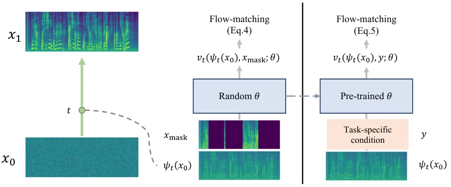
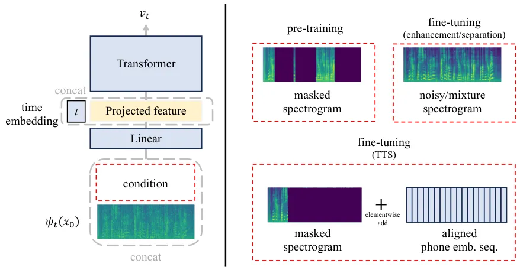

# Generative Pre-training for Speech with Flow Matching

Alexander H. Liu ^(†)^(†)thanks: Work done during an internship at Meta.
Affiliation: MIT CSAIL Affiliation: alexhliu@mit.edu    Matt Le
Affiliation: Meta AI    Apoorv Vyas Affiliation: Meta AI    Bowen Shi
Affiliation: Meta AI    Andros Tjandra Affiliation: Meta AI    Wei-Ning
Hsu Affiliation: Meta AI

###### Abstract

Generative models have gained more and more attention in recent years
for their remarkable success in tasks that required estimating and
sampling data distribution to generate high-fidelity synthetic data. In
speech, text-to-speech synthesis and neural vocoder are good examples
where generative models have shined. While generative models have been
applied to different applications in speech, there exists no
general-purpose generative model that models speech directly. In this
work, we take a step toward this direction by showing a single
pre-trained generative model can be adapted to different downstream
tasks with strong performance. Specifically, we pre-trained a generative
model, named SpeechFlow, on 60k hours of untranscribed speech with Flow
Matching and masked conditions. Experiment results show the pre-trained
generative model can be fine-tuned with task-specific data to match or
surpass existing expert models on speech enhancement, separation, and
synthesis. Our work suggested a foundational model for generation tasks
in speech can be built with generative pre-training. Audio samples can
be found at
[https://voicebox.metademolab.com/speechflow.html](https://voicebox.metademolab.com/speechflow.html).

|     |
| --- |
|     |

## 1 Introduction

Discriminative models have long been the mainstream in speech
applications since the deep learning era. These models are applied to
different types of tasks such as speech recognition (Graves et al.,
2006), enhancement, and separation (Luo & Mesgarani, 2019).
Interestingly, even for applications that can be naturally formulated as
generative modeling problems, such as text-to-speech (TTS), we see most
popular models remained discriminative (Shen et al., 2018; Ren et al.,
2021). Consequentially, pre-trained foundation models (Baevski et al.,
2020; Hsu et al., 2021) that served as the upstream of speech
applications focused more on learning useful representation for
discriminative tasks rather than modeling the data distribution
$`p(\text{speech})`$. In this paper, we seek to answer whether
generative models can serve as foundation models for speech applications
or not.

Unlike discriminative models, generative models enable sampling of the
data distribution. For example, generative TTS models (Habib et al., 2019) allow different emotions to be sampled given a fixed text as
discriminative models produce a fixed output. Up to the present,
generative models in speech are usually designed for a given purpose via
task-specific conditioning or distribution mapping. Perhaps the most
well-known examples of task-specific conditional generative models are
neural vocoders (Kong et al., 2020; Chen et al., 2020). These models
learn to map simple priors (e.g., normal distribution) to waveform
conditioning on acoustic features (e.g., spectrogram). On the other
hand, examples for distribution mapping include diffusion models that
transform noisy speech to clean speech for denoising (Lu et al., 2021;
Lu et al., 2022; Richter et al., 2023), or speech mixture to
non-overlapping speech for separation (Scheibler et al., 2023).

In this work, we explore a new direction to pre-train a general-purpose
generative model with unlabeled speech. We hypothesize that a good
generative model on speech without pre-defined application can be
applied to different end tasks that require speech generation. Our
model, named SpeechFlow, is a generative model that combines masked
audio modeling and Flow Matching (Lipman et al., 2023). SpeechFlow is
trained with unlabeled speech with the goal of estimating the underlying
distribution of speech conditioning on masked audio. We show that a
generative model trained with unlabeled speech data can be adapted to
different tasks that require speech generation by fine-tuning with
task-specific conditions using labeled data. More specifically, we
fine-tuned SpeechFlow and compared against expert models in speech
enhancement, separation, and synthesis. For each task, fine-tuned
SpeechFlow is able to match expert models. Experiment results suggested
that pre-trained generative models possess great potential to become
foundation models for different speech generation tasks.

## 2 Related work

##### Generative Speech Models

As mentioned earlier, generative models have been applied to different
tasks in speech. Research in neural vocoders found generative models to
be a good suit for spectrogram-to-waveform prediction. Prevailing
generative models are applied to the task with success, such as
generative adversarial model (Kong et al., 2020), flow-based invertible
model (Prenger et al., 2019), and diffusion network (Koizumi et al.,
2022). Besides neural vocoders, generative models are also applied to
other tasks such as TTS (Valle et al., 2020), speech enhancement (Lu
et al., 2021; Lu et al., 2022; Richter et al., 2023) and
separation Scheibler et al. (2023). A fundamental difference between
this work and the prior works is that SpeechFlow is not trained for a
specific application, but to estimate the underlying distribution of
speech itself.

Recent studies also explored speech generation from a language modeling
perspective. Taking advantage of audio tokenizing techniques (Hsu
et al., 2021; Défossez et al., 2022; Zeghidour et al., 2022), Spoken
Language Models (SLMs;Lakhotia et al., 2021; Kharitonov et al., 2021;
Borsos et al., 2022) have been developed to model language without text.
These token-based speech language models are closely related to the
proposed method in the sense of training generative models from
unlabeled speech. The key difference is the goal of SLMs is to discover
the underlying text for textless language processing (Nguyen et al.,
2022). In principle, SLMs can also be fine-tuned for different
downstream tasks but it was not the focus and they are not evaluated on
multiple tasks.

Targeting controllable audio generation, VALL-E (Wang et al., 2023)
extended SLMs by using text and audio prompts to control the audio
generated. Voicebox (Le et al., 2023) took a different approach to
tackle the problem by feeding aligned text and partially masked speech
to perform speech in-filling non-autoregressively. Despite the different
paths VALL-E and Voicebox took, both works discovered a strong zero-shot
adaptation ability that emerged when training generative models at
scale. While these models are designed for text-conditioned generation,
they provided a hint of the great potential of generative models with
the superior ability to generate diverse speech. It is worth pointing
out that Voicebox is the most related work to this work, sharing the
same objective function and model architecture. Voicebox can be viewed
as a fully supervised text-conditioned SpeechFlow that focused
exclusively on TTS task. Later in our experiment, we compare Voicebox to
fine-tuned SpeechFlow and reveal the benefit of generative pre-training
without text.

##### Pre-trained Speech Models

Conceptually, this work is also related to self-supervised
representation learning methods for speech in the sense of learning from
unlabeled data for better downstream task performance. One branch of
self-supervised learning takes the autoregressive approach to learn from
predicting the future, such as contrastive predictive coding (Oord
et al., 2018) and autoregresive predictive coding (Chung & Glass, 2020).
Another branch of works (Ling et al., 2020; Ling & Liu, 2020) studied
masked audio modeling (MAM) instead of future prediction. These models
predict masked Spectrogram based on the complementary part of the input
that is unmasked. Improving the MAM-based method, similar works replaced
the prediction target with latent features such as quantized
representation (Baevski et al., 2020) or acoustic units (Hsu et al.,
2021). Self-supervised representation learning methods are found to be
useful in many different applications such as speech recognition (Yang
et al., 2021). But the success is mostly on discriminative tasks,
applying self-supervised models for generation application tasks is
often less intuitive (Polyak et al., 2021) and under-performing (Tsai
et al., 2022). Taking cues from the success of masking-based methods, we
incorporate a similar idea into SpeechFlow  to make generation
conditioned on partially masked speech during pre-training.
Interestingly, we found MAM beneficial to generative pre-training as
shown later in Section A.4.5. Besides self-supervised learning,
pre-training have also been studied in the context of semi-supervised
TTS (Chung et al., 2019) or speech-text alignment (Ao et al., 2021), but
these works focused on non-generative models.

## 3 Method

### 3.1 Background: Flow Matching for generative modeling

Deep generative models aimed to estimate the unknown distribution
$`q(x)`$ of real world $`d`$-dimensional data $`x\in\mathbb{R}^{d}`$
with distribution $`p(x)`$ parameterized by neural networks. To make
sampling possible, simple prior distribution $`p_{0}(x)`$ (e.g., normal
distribution) is naturally a good starting point, and the modeling
problem therefore becomes finding a neural transport map
$`p_{1}=F_{\theta}(p_{0})`$ such that $`p_{1}(x)\approx q(x)`$. Early
works such as generative adversarial networks (Goodfellow et al., 2020)
and variational audio encoders (Kingma & Welling, 2013) showed directly
modeling $`x_{1}=f_{\theta}(x_{0})`$ where
$`x_{0}\sim p_{0}(x),x_{1}\sim q(x)`$, i.e., predicting data from noise
using network $`f_{\theta}`$, is feasible. Recent studies in diffusion
models (Ho et al., 2020; Song et al., 2020) suggested an iterative
denoising model $`x_{t+\Delta t}=f_{\theta,t,\Delta t}(x_{t})`$ that
traverses from noise $`x_{0}`$ to data $`x_{1}`$ with step size
$`\Delta t`$ provides better generation quality (Dhariwal & Nichol,
2021). In this work, we choose to construct the neural transport map
$`p_{1}=F_{\theta}(p_{0})`$ using Flow Matching (Lipman et al., 2023)
from the Continuous Normalizing Flows (CNFs; Chen et al., 2018)- family.

Formally, CNFs defined a path between simple prior $`p_{0}`$ and target
distribution $`p_{1}`$ via the time-dependent probability density
function $`p_{t}:[0,1]\times\mathbb{R}^{d}\rightarrow\mathbb{R}_{>0}`$.
The flow of $`x`$ along the path, denoted
$`\phi_{t}:[0,1]\times\mathbb{R}^{d}\rightarrow\mathbb{R}^{d}`$, is
defined using ordinary differential equation (ODE):

```math
\dfrac{d}{dt}\phi_{t}(x)=v_{t}(\phi_{t}(x));\quad\phi_{0}(x)=x; \tag{1}
```

with the time-dependent vector field
$`v_{t}:[0,1]\times\mathbb{R}^{d}\rightarrow\mathbb{R}^{d}`$, such that
the time-dependent probability density function $`p_{t}`$ can be derived
using the change of variables formula:
$`p_{t}=p_{0}(\phi_{t}^{-1}(x))\det\left[\dfrac{\partial\phi_{t}^{-1}}{\partial x}(x)\right]`$.
Under the formulation, a simple objective is to predict the vector field
$`v_{t}`$ using a neural network paramterized by $`\theta`$ given the
target vector field $`u_{t}(x)`$ that corresponds to $`p_{t}(x)`$ with
the Flow Matching objective

```math
\mathcal{L}_{FM}(\theta)=\mathbb{E}_{t\sim\mathcal{U}[0,1],x\sim p_{t}(x)}\Big\|v_{t}(x;\theta)-u_{t}(x)\Big\|^{2}. \tag{2}
```

However, $`\mathcal{L}_{FM}(\theta)`$ is intractable due to the lack of
knowledge of $`p_{t}`$ and $`u_{t}`$ in practice. Interestingly, Lipman
et al. (2023) showed that conditioning $`p_{t}`$ and $`u_{t}`$ on real
data $`x_{1}`$ results in the Conditional Flow Matching objective
$`\mathcal{L}_{CFM}(\theta)`$ which provided identical gradient w.r.t.
$`\theta`$ for training the generative model. Specifically, we adopt the
Optimal Transport conditional path proposed by Lipman et al. (2023) that
assumes the mean $`\mu_{t}(x)=tx_{1}`$ and standard deviation
$`\sigma_{t}(x)=1-(1-\sigma_{\text{min}})t`$ change linearly in time,
yielding tractable
$`p_{t}(x|x_{1})=\mathcal{N}(x\mid\mu_{t}(x_{1}),\sigma_{t}(x_{1})^{2}I)`$
and
$`u_{t}(x|x_{1})=\frac{\left(x_{1}-(1-\sigma_{\text{min}})x\right)}{\left(1-(1-\sigma_{\text{min}})t\right)}`$
with a sufficiently small $`\sigma_{\min}`$ (we use 1e-5) such that
$`p_{1}(x|x_{1})`$ is centered around $`x_{1}`$. In this case, with
reparameterization the Conditional Flow Matching objective has the form

```math
\mathcal{L}_{CFM}(\theta)=\mathbb{E}_{t,q(x_{1}),p_{0}(x_{0})}\Big\|v_{t}(\psi_{t}(x_{0});\theta)-\Big(x_{1}-(1-\sigma_{\min})x_{0}\Big)\Big\|^{2}, \tag{3}
```

where $`\psi_{t}(x_{0})=\sigma_{t}(x_{1})x_{0}+\mu_{t}(x_{1})`$ and
$`t`$ is sampled uniformly from $`[0,1]`$.

### 3.2 Generative Pre-training of SpeechFlow with unlabeled speech

Inspired by the recent success of flow matching model in speech
synthesis (Le et al., 2023), we propose to pre-train a generative model
with unlabeled speech using flow matching. We consider the problem of
modeling $`q(x)`$ where the acoustic features
$`x\in\mathbb{R}^{d\times L}`$ are $`d`$-dimensional Mel spectrogram
with $`L`$ frames. We assume the simple prior $`p_{0}`$ to be the normal
distribution. Since generative models are by nature
unsupervised/self-supervised (no human label required), a flow matching
model can be trained with pure speech.

##### Masked Audio Condition

In light of the success of masked prediction in self-supervised speech
representation learning (Baevski et al., 2020; Hsu et al., 2021), we
introduce similar concept to SpeechFlow by additionally conditioning
$`v_{t}`$ on partially masked target audio $`x_{\text{mask}}`$ with a
chance of $`p_{\text{cond}}`$ during training. This can also be
interpreted as the model have a chance of $`1-p_{\text{cond}}`$ to
receive fully masked $`x_{\text{mask}}`$. Masked condition
$`x_{\text{mask}}`$ is obtained by randomly selecting
$`n_{\text{mask}}`$ of frames to be masked with a minimum masking span
length of $`l_{\text{mask}}`$.

Note that while this modification results in a conditional generative
model, our model is still self-supervised since $`x_{\text{mask}}`$ is
directly derived from unlabeled speech $`x_{1}`$. Moreover, a vanilla
flow matching model without any condition is still available after
pre-training stage as long as $`p_{\text{cond}}<1`$. Study on the
importance of $`p_{\text{cond}}`$ is provided in Section A.4.5.

The rationale behind the auxiliary condition is to provide the model
more context for predicting $`v_{t}`$ regardless of the timestep $`t`$.
Moreover, introducing auxiliary condition at the pre-training stage
provided an intuitive way to fine-tune the model for different tasks as
shown later in this section.

##### Objective

With the predicted time-dependent vector field $`v_{t}`$ conditioning on
masked feature $`x_{\text{mask}}`$, the generative pre-training
objective of SpeechFlow can be derived by modifying Equation 3
accordingly to obtain

```math
\mathbb{E}_{t,q(x_{1}),p(x_{0})}\Big\|v_{t}(\psi_{t}(x_{0}),x_{\text{mask}};\theta)-\Big(x_{1}-(1-\sigma_{\min})x_{0}\Big)\Big\|^{2}. \tag{4}
```

In practice, we use Transformer encoder (Vaswani et al., 2017) with
learnable parameter $`\theta`$ to predict vector field $`v_{t}`$. Masked
inputs $`x_{\text{mask}}`$ are concatenated with $`\psi_{t}(x_{0})`$
along the frequency axis, then projected to match the model dimension
$`d_{\theta}`$, and we append the sinusoidal positional encoding of
timestep $`t`$ to the input, resulting the actual model input with shape
$`\mathbb{R}^{d_{\theta}\times(L+1)}`$. The output of the model is the
predicted vector field $`v_{t}\in\mathbb{R}^{d\times L}`$.



Figure 1: An overview of SpeechFlow. (Left) Pre-training with masked
audio. (Right) Fine-tuning with task-specific condition such as noisy
recording, overlapped speech, or phone sequence. More details of the
model and conditioning are available in Section A.3.

### 3.3 Supervised Fine-tuning SpeechFlow  on Different Tasks

##### Task-specific Condition

While the pre-trained SpeechFlow allow us to sample new data from
$`p_{1}(x)`$, most applications in speech require a certain degree of
control over the output. To this end, we introduce the fine-tuning stage
for controllable generation using task-specific condition
$`y\in\mathbb{R}^{d_{y}\times L_{y}}`$ of audio $`x_{1}`$, such as noisy
speech for speech enhancement and text transcript for text-to-speech
generation. We note that this work focused on tasks where $`y`$ and
$`x_{1}`$ are aligned, i.e., $`L_{y}=L`$, and leave the unaligned cases
for future work. Concrete examples can be found in Section A.3.

##### Objective

Following the pre-training stage, the fine-tuning objective can be
derived by swapping the masked condition $`x_{\text{mask}}`$ for
pre-training with task-specific condition $`y`$,

```math
\mathbb{E}_{t,q(x_{1}),p(x_{0})}\Big\|v_{t}(\psi_{t}(x_{0}),y;\theta)-\Big(x_{1}-(1-\sigma_{\min})x_{0}\Big)\Big\|^{2}. \tag{5}
```

Note that for fine-tuning, it is critical to reuse $`\theta`$ from the
pre-training stage.

##### Inference

After training, speech generation is done by the following steps: (1)
sample $`x_{0}`$ from the simple prior $`p_{0}(x)`$; (2) use an ODE
solver to solve $`\phi_{1}(x_{0})`$ given
$`d\phi_{t}(x_{0})/dt=v_{t}(\phi_{t}(x_{0}),y;\theta)`$ and
$`\phi_{0}(x_{0})=x_{0}`$; (3) generated audible speech in time domain
from Mel spectrogram $`x_{1}`$. More inference details are provided in
Section A.2 including conversion from Mel spectrogram to waveform.

## 4 Experiment

### 4.1 Pre-training Details

##### Model & Data

We focus on Transformer encoder  (Vaswani et al., 2017) with 24 layers,
16 attention heads, $`d_{\theta}=`$1024 dimensional embedding, and
feed-forward networks with 4096 dimensions. Convolutional positional
embedding (Baevski et al., 2020) and ALiBi self-attention bias (Press
et al., 2021) are used to encode relative positional information.
Following Le et al. (2023), skip connections between layers are
introduced to mimic U-Net (Ronneberger et al., 2015) architecture. The
model has around 330M parameters in total. The model is pre-trained on
60k hours of speech from English audiobook at 16kHz. We consider $`x`$
to be log-scaled Mel spectrogram extracted with a 40ms window at 100Hz
with $`d=80`$, resulting $`160/80`$ dimensional input/output for the
model.

##### Training

We pre-train SpeechFlow for 600k steps on 32 V100 GPUs with a batch size
of 75 seconds per GPU with FP16. We use Adam optimizer (Kingma & Ba, 2014) with the learning rate warming up linearly to 5e-5 for the first
5k steps and linearly decaying to 1e-5 for the rest of the training. For
masking, we set $`p_{\text{drop}}=10\%`$,
$`n_{\text{mask}}\sim{\mathcal{U}}[70\%,100\%]`$, and
$`l_{\text{mask}}=10`$. All masked position are filled with zero. In
practice, we compute loss at the masked position only.

### 4.2 Fine-tuning for Speech Enhancement

|                                                                             |                  |           |           |           |     |             |           |           |           |
| --------------------------------------------------------------------------- | ---------------- | --------- | --------- | --------- | --- | ----------- | --------- | --------- | --------- |
| Method                                                                      | Voicebank-Demand |           |           |           |     | WSJ0-CHiME3 |           |           |           |
|                                                                             | PESQ             | ESTOI     | CSIG      | COVL      |     | PESQ        | ESTOI     | CSIG      | COVL      |
| Baseline                                                                    |                  |           |           |           |     |             |           |           |           |
|       Mixture                                                               | 1.97             | 0.79      | 3.35      | 2.63      |     | 1.69        | 0.78      | 3.24      | 2.42      |
| Models trained on Voicebank-Demand                                          |                  |           |           |           |     |             |           |           |           |
|       Conv-TasNet^(†)(Luo & Mesgarani, 2019)                                | 2.63             | 0.85      | \-        | \-        |     | 2.40        | 0.88      | \-        | \-        |
|       MetricGAN+ (Fu et al., 2021)                                          | 3.13             | 0.83      | 4.10^(\*) | 3.61^(\*) |     | 2.13        | 0.76      | 3.02^(\*) | 2.52^(\*) |
|       SGMSE+ (Richter et al., 2023)                                         | 2.93             | 0.87      | 4.13^(\*) | 3.53^(\*) |     | 2.48        | 0.90      | 3.67^(\*) | 3.02^(\*) |
|       SpeechFlow                                                            | 3.13             | 0.87      | 4.43      | 3.80      |     | 2.70        | 0.90      | 4.05      | 3.36      |
|       SpeechFlow w/o pre-train                                              | 2.92             | 0.85      | 4.22      | 3.57      |     | 2.38        | 0.86      | 3.72      | 3.03      |
| Models trained on Deep Noise Supression Challange 2020 (Reddy et al., 2020) |                  |           |           |           |     |             |           |           |           |
|       DEMUCS                                                                | 2.55^(\*)        | 0.85^(\*) | 3.24^(\*) | 2.88^(\*) |     | 2.49^(\*)   | 0.92^(\*) | 3.93^(\*) | 3.20^(\*) |
|       SpeechFlow                                                            | 2.71             | 0.86      | 4.07      | 3.39      |     | 2.87        | 0.91      | 4.24      | 3.54      |
|       SpeechFlow w/o pre-train                                              | 2.53             | 0.84      | 3.89      | 3.20      |     | 2.56        | 0.89      | 3.91      | 3.22      |
| Topline                                                                     |                  |           |           |           |     |             |           |           |           |
|        Our upper-bound^(‡)                                                  | 3.77             | 0.95      | 4.97      | 4.54      |     | 3.68        | 0.96      | 4.97      | 4.46      |
|        Clean signal                                                         | 4.50             | 1.00      | 5.00      | 5.00      |     | 4.50        | 1.00      | 5.00      | 5.00      |

- •
  ^(\*) Results reproduced by us using the open sourced model released
  by the authors.
- •
  ^(†) Results reproduced by Richter et al. (2023).
- •
  ^(‡) Clean Mel spectrogram with error introduced by pseudo-inversing
  Mel filter bank and taking phase from the mixture.

Table 1: Speech enhancement test results on
Voicebank-Demand (Valentini-Botinhao et al., 2017) and
WSJ0-CHiME3 (Richter et al., 2023). Best result of each section is
bolded. Numbers are taken from prior works unless otherwise specified.
For full result that includes more metrics, please refer to Table 7.

##### Task & Metrics

Speech enhancement, also known as denoising, aimed to remove unwanted
noise from speech recording. We report Perceptual Evaluation of Speech
Quality (PESQ; Rix et al., 2001), Extended Short-Time Objective
Intelligibility (ESTOI; Jensen & Taal, 2016), and Composite Objective
Speech Quality and Overall Quality (CSIG/COVL;Hu & Loizou, 2007).

##### Prior Works

Early work Conv-TasNet (Luo & Mesgarani, 2019) has been widely used as
the baseline system. It is a convolutional encoder/decoder operating in
the time domain to maximize scale-invariant source-to-noise ratio.
DEMUCS (Défossez et al., 2020) adopted a similar structure with
skip-connections and minimized L1/multi-resolution STFT loss.
MetricGAN+ (Fu et al., 2021) proposed to optimize non-differentiable
metrics such as PESQ via adversarial training against their
approximation using discriminators. SGMSE+(Richter et al.,
2023) reformulated the problem as a diffusion process that can be solved
with the corresponding generative model (Ho et al., 2020).

##### Dataset

We fine-tuned and tested SpeechFlow on the benchmark dataset
VoiceBank-Demand (VB-DMD; Valentini-Botinhao et al., 2017) for fair
comparison against most of the prior works in the field. Since VB-DMD is
a relatively small dataset, we also consider testing on
WSJ0-CHiMe3 (Richter et al., 2023) to ensure the model is not
overfitting. In addition, we also trained our model using 100 hours of
noisy speech from Deep Noise Supression Challenge 2020 (DNS2020; Reddy
et al., 2020) for extra results to demonstrate the generalizability for
SpeechFlow. For training, paired data $`(x_{1},y)`$ is provided where
$`x_{1}`$ is the target clean signal and $`y`$ is the noisy speech. For
testing, only the noisy speech $`y`$ is provided and the goal is to
estimate the clean signal $`x_{1}`$. All datasets are resampled to 16kHz
to match pre-training and no data augmentation was applied.

##### Training

As mentioned in Section 3.3, fine-tuning is simply done by replacing the
auxiliary masked condition $`x_{m}`$ for pre-training with the acoustic
feature of the noisy speech $`y`$ and minimize Eq. 5. Note that, unlike
pre-training, $`y`$ has a $`p_{\text{drop}}=30\%`$ chance to be dropped
but never partially masked for fine-tuning. We fine-tuned SpeechFlow on
single V100 GPU for 160 / 75 epochs on VB-DMD / DNS2020 respectively
with a batch size of 50 seconds. The learning rate is set to peak at
2e-5 after 5k updates, then linearly decay to 0. For the control group
without pre-training, we searched learning rate between 1e-4 to 1e-3 and
found 2e-4 the best.

##### Results

Main results are provided in Table 1. Due to the choice of acoustic
feature, our method suffers from the imperfect pseudo-inverse of Mel
filters and the lack of phase modeling. In contrast to prior works
tailored for enhancement, these restrictions result in a worse
upper-bound as shown in the table. Nevertheless, our method still
provided comparable or better results against the prior works on both
benchmark datasets. Despite using a dataset with different topics and
speakers, generative pre-training still improved enhancement results
compared to the same model trained on VB-DMD from scratch. Especially on
the out-of-domain WSJ0-CHiME3 testing, SpeechFlow demonstrated strong
generalizability with a clear gap on PESQ, CSIG, and COVL against all
other methods. In the case where the larger dataset DNS2020 is used for
fine-tuning, a similar trend can be found compared to prior work DEMUCS
and the testing result on WSJ0-CHiME3 can be further improved. These
results pointed out the great potential of generative pre-training on
speech.

### 4.3 Fine-tuning for Speech Separation

|                                                                                |         |        |               |        |         |        |               |        |
| ------------------------------------------------------------------------------ | ------- | ------ | ------------- | ------ | ------- | ------ | ------------- | ------ |
| Method                                                                         | 2 Mix   |        | 2 Mix + Noise |        | 3 Mix   |        | 3 Mix + Noise |        |
|                                                                                | SI-SDRi | ESTOIi | SI-SDRi       | ESTOIi | SI-SDRi | ESTOIi | SI-SDRi       | ESTOIi |
| Conv-TasNet^(†)                                                                | 15.24   | 0.22   | 12.55         | 0.22   | 12.30   | 0.26   | 10.28         | 0.21   |
| SepFormer^(‡)                                                                  | 14.94   | 0.31   | 11.71         | 0.28   | \-      | \-     | \-            | \-     |
| Pseudo-inversed Mel and phase from mixture                                     |         |        |               |        |         |        |               |        |
|      Upper-bound w/ clean Spec.                                                | 12.43   | 0.35   | 11.99         | 0.46   | 12.91   | 0.44   | 12.62         | 0.48   |
|      SpeechFlow                                                                | 11.74   | 0.35   | 10.46         | 0.33   | 11.08   | 0.35   | 8.22          | 0.23   |
|      SpeechFlow w/o pre-train                                                  | 11.24   | 0.29   | 10.00         | 0.31   | 8.65    | 0.24   | 7.39          | 0.19   |
| Learnable inverse-Mel and phase estimation (See Section A.2 for more details.) |         |        |               |        |         |        |               |        |
|      SpeechFlow                                                                | 15.85   | 0.37   | 12.41         | 0.37   | \-      | \-     | \-            | \-     |

- •
  ^(†) Luo & Mesgarani (2019), reproduced by Cosentino et al. (2020).   
  ^(‡) Subakan et al. (2021); Subakan et al. (2023), reproduced at 16kHz
  with official code from SpeechBrain (Ravanelli et al., 2021), note
  that this method was originally designed for 8kHz audio with data
  augmentation.

Table 2: Speech separation test results on LibriMix (Cosentino et al.,
2020). All models are trained on 16kHz audio without data augmentation.
Best model output for each metric is bolded.

##### Task & Metrics

The goal of separation is to separate mixture (overlapped) speech into
multiple single-speaker speech. In our experiment, we focus on
separating 2 to 3 speakers for simplicity. We report the common metric
Scale-Invariant Signal-to-Distortion Ratio improvement (SI-SDRi; Le Roux
et al., 2019) that measures the improvement of separated speech over the
mixture when comparing against the clean reference in the time domain.
In addition, we also report the ESTOI improvement (ESTOIi) of the
separation result over the mixture to measure the intelligibility.

##### Dataset & Prior Work

For separation, SpeechFlow is fine-tuned using a synthetic mixture
created by randomly sampling and mixing 2 or 3 utterances from 360 hours
of speech from English audiobook. In addition, noise sampled from WHAM!
dataset (Wichern et al., 2019) can be added to the mixture to further
increase the difficulty of separation, combining 4 different setups in
total. We tested the fine-tuned model on LibriMix (Cosentino et al., 2020) 16khz min. For training, paired data $`(x^{1}_{1},x^{2}_{1},y)`$
is provided where $`x^{1}_{1},x^{2}_{1}`$ are the target clean signal
and $`y`$ is the mixture. Signals are randomly cropped into 8-second
chunks for training. To ensure the model outputs all speakers, we
concatenated the clean signals along the time axis (and repeated the
condition $`y`$ accordingly) for both training and testing. The baseline
system is Conv-TasNet (Luo & Mesgarani, 2019) from LibriMix¹¹ 1
[https://huggingface.co/JorisCos](https://huggingface.co/JorisCos). We
note that while there are many other prior works in the field, most of
them focused on WSJ2mix dataset (Hershey et al., 2016) with 8kHz audio,
which makes fair comparison difficult. To provide a more competitive
baseline, we reproduce a more powerful separation model
SepFormer (Subakan et al., 2021; Subakan et al., 2023) at 16kHz using
code provided by the authors ²² 2
[https://github.com/speechbrain/speechbrain/tree/v0.5.15/recipes/LibriMix](https://github.com/speechbrain/speechbrain/tree/v0.5.15/recipes/LibriMix).

##### Training

The fine-tuning setup follows enhancement with few changes: batch size
is reduced to 37.5 seconds; model is fine-tuned for 85 epochs; peak
learning rate is set to 3e-5. For SpeechFlow without pre-training, we
searched learning rate between 1e-5 to 1e-4 and found 5e-5 the best.

##### Results

Results are provided in Table 2. We found SI-SDRi more sensitive to the
process of Mel-spectrogram-to-waveform. This can be verified by
examining the upper-bound performance using a clean reference Mel
spectrogram, which is even worse than the baseline Conv-TasNet.
Similarly, we found the more recent transformer-based model
SepFormer (Subakan et al., 2023) struggled in SI-SDRi when training at
16kHz (i.e., 2x longer input). In contrast, we found ESTOIi that
reflected the intelligibility of separation result more robust to
waveform estimation. Nevertheless, fine-tuned SpeechFlow was able to
provide strong separation results. The gap between SpeechFlow and its
upper-bound is particularly small in the easy 2 Mix setup. To measure
the true quality of the Mel spectrogram generated by SpeechFlow, we also
experimented with learnable inverse-Mel and phase estimation (as
described in Section A.2) and found the separation result can be further
boosted in terms of SI-SDRi. Since optimizing the
Mel-spectrogram-to-waveform transform is beyond the scope of this paper,
we apply learnable estimation to the best result of 2 Mix and 2 Mix +
Noise only. The key idea is to show the separation result in the Mel
spectrogram is already at a high quality, and metrics that are limited
by the choice of input/output feature like SI-SDRi can be further
improved with extra effort. In conclusion, we found SpeechFlow providing
better intelligibility in all cases. It is worth noting that the
fine-tuning method presented here is a vanilla solution that might not
scale well as the number of speakers increases, a more dedicated
fine-tuning method is left as future work.

### 4.4 Fine-tuning for Zero-shot Speaker adaptation of Text-to-speech

|                                 |           |                          |       |       |     |              |       |       |            |
| ------------------------------- | --------- | ------------------------ | ----- | ----- | --- | ------------ | ----- | ----- | ---------- |
| Method                          | labeled   | cross-sentence reference |       |       |     | continuation |       |       | subjective |
|                                 | data (hr) | WER                      | SIM-o | SIM-r |     | WER          | SIM-o | SIM-r | MOS        |
| Ground truth                    |           | \-                       | \-    | \-    |     | 2.2          | 0.754 | \-    | 3.80       |
| YourTTS (Casanova et al., 2021) | 475       | 7.7                      | 0.337 | n/a   |     | \-           | \-    | \-    | 2.92       |
| VALL-E (Wang et al., 2023)      | 60k       | 5.9                      | \-    | 0.580 |     | 3.8          | 0.452 | 0.508 | \-         |
| Voicebox (Le et al., 2023)      | 60k       | 1.9                      | 0.662 | 0.681 |     | 2.0          | 0.593 | 0.616 | 3.54       |
| Single GPU training             |           |                          |       |       |     |              |       |       |            |
|      SpeechFlow w/o pre-train   | 960       | 2.3                      | 0.526 | 0.573 |     | 2.2          | 0.467 | 0.513 | \-         |
|      SpeechFlow FT              | 960       | 2.2                      | 0.678 | 0.694 |     | 2.2          | 0.613 | 0.630 | \-         |
|      SpeechFlow LoRA            | 960       | 2.6                      | 0.696 | 0.711 |     | 2.4          | 0.623 | 0.640 | \-         |
| 32 GPU training                 |           |                          |       |       |     |              |       |       |            |
|      SpeechFlow w/o pre-train   | 960       | 2.0                      | 0.569 | 0.598 |     | 2.1          | 0.530 | 0.557 | \-         |
|      SpeechFlow FT              | 960       | 2.2                      | 0.697 | 0.703 |     | 2.2          | 0.622 | 0.629 | \-         |
|      SpeechFlow LoRA            | 960       | 2.1                      | 0.700 | 0.715 |     | 2.1          | 0.630 | 0.644 | 3.43       |

Table 3: English zero-shot speaker adaptation TTS results on filtered
LS (Panayotov et al., 2015) test-clean. Best results are bolded. For
cross-sentence reference, the speaker information is provided by a
3-second prompt from a different utterance sampled randomly. For
continuation, the first 3 seconds of the target utterance is used. FT
stands for fine-tuning the full model; LoRA stands for fine-tuning with
Low-rank Adaptors (Hu et al., 2021) where pre-trained weights are
frozen.

##### Task & Metrics

We consider speech generation conditioning on text, i.e., text-to-speech
(TTS). In particular, we focus on the zero-shot speaker adaptation
problem (Jia et al., 2018; Casanova et al., 2021) where the voice of an
unseen speaker should be used for synthesis. The problem setup and the
evaluation metrics followed VALL-E (Wang et al., 2023) and Voicebox (Le
et al., 2023). Zero-shot adaptation is done by using a 3-second prompt
that carries speaker, paralinguistic, and environmental information. To
measure the correctness and the intelligibility of the synthetic speech,
we measure the recognition word error rate (WER) using HuBERT-L (Hsu
et al., 2021) pre-trained and fine-tuned on LibriLight (Kahn et al., 2019) and LibriSpeech (Panayotov et al., 2015) respectively. Using
WavLM-TDCNN speaker embedding model Chen et al. (2022), speaker
similarity is measured by the similarity between the embedding of
generated speech and that of the conditioning audio. Similarity to the
original conditioning audio (SIM-o) and to the vocoder-resynthesized
audio (SIM-r) are reported. In addition to the objective metrics,
subjective evaluation on cross-sentence reference results using mean
opinion score is also provided. See more detail regarding MOS test in
Section A.4.6.

##### Prior Works

YourTTS (Casanova et al., 2021) is a flow-based model (Kim et al., 2021)
trained on multi-lingual data, including VCTK (Yamagishi et al., 2019),
TTS-portugese (Casanova et al., 2022), M-AILABS French (Munich
Artificial Intelligence Laboratories GmbH, 2017), and LibriTTS (Zen
et al., 2019). VALL-E is a decoder-only auto-regressive model trained on
LibriLight for zero-shot speaker adaptation TTS. Lastly, the closely
related prior work Voicebox combined flow-matching and masked prediction
for supervised TTS training. Voicebox can be viewed as a strong baseline
using the same amount of data with fully supervised training.

##### Dataset

960 hours of transcribed speech from English audiobook is used for
fine-tuning. The testing protocol follows VALL-E and Voicebox. Montreal
Force Aligner (McAuliffe et al., 2017) is used for phone-speech
alignment. Position postfixes are added to each phone following
Voicebox. Additional results on fine-tuning with less (100/10 hours)
labeled data are provided in Section A.4.4.

##### Training

To enable zero-shot speaker adaptation , fine-tuning condition $`y`$
includes masked audio $`x_{m}`$ and the force-aligned phone sequence. We
followed the masking strategy of Voicebox during fine-tuning. We
additionally tested fine-tuning with more (32) GPUs and Low-rank
Adaptors (LoRA; Hu et al., 2021; we use rank $`r=64`$) to study the
impact of computational resource for fine-tuning. Section A.4.2 provided
a detailed performance analysis based on the number of GPUs used for
fine-tuning. The batch size is 75 seconds per GPU in all cases. For
standard fine-tuning, the learning rate is set to peak at 1e-5 after 5k
updates, then linearly decay to 0 for the rest 145k steps. For LoRA
fine-tuning, 9.5M new learnable parameters are introduced to the
pre-trained model, accounting for 2.8% of the full model. All
pre-trained weights are frozen. The learning rate is set to peak at
1e-3. Additional results on the impact of the amount of fine-tuning GPU
is provided in Section A.4.3 .

##### Results

Results are provided in Table 3. Comparing to fully supervised models
Voicebox or VALL-E, a clear advantage in speaker modeling can be found
with SpeechFlow despite using much less labeled data. In terms of WER
and MOS, SpeechFlow is slightly worse than Voicebox that uses more
labeled data. In addition, while single GPU fine-tuning already provided
better speaker adaptation than all baselines, we found fine-tuning with
more GPUs provided even stronger results. Interestingly, LoRA performed
the best in terms of both SIM and WER among all fine-tuning setups. This
suggested that fine-tuning method for generative model could be worth
exploring in the future. Finally, our baseline without pre-training
achieved similar WER to that of the pre-trained model but a
significantly worse SIM. These findings suggested the proposed
generative pre-training improves speaker modeling but not content
modeling for speech synthesis.

|                        |          |       |             |      |            |        |
| ---------------------- | -------- | ----- | ----------- | ---- | ---------- | ------ |
| Method                 | ZSSA TTS |       | Enhancement |      | Separation |        |
|                        | WER      | SIM-o | PESQ        | COVL | SI-SDRi    | ESTOIi |
| Single-task models     |          |       |             |      |            |        |
|      Expert prior work | 1.9      | 0.662 | 2.49        | 3.32 | 12.55      | 0.28   |
|      SpeechFlow        | 2.2      | 0.678 | 2.87        | 3.54 | 12.41      | 0.37   |
| Multi-task models      |          |       |             |      |            |        |
|      SpeechFlow        | 2.3      | 0.651 | 2.87        | 3.56 | 9.73       | 0.30   |

Table 4: Results for multi-task fine-tuning. Both single-task and
multi-task SpeechFlow are fine-tuned using single GPU. Expert models are
the best prior work for each metric of each task from Table 1,2,3. For
TTS /enhancement/separation, we consider the
cross-reference/WSJ0-CHiME3/2Mix+Noise scenario respectively. ZSSA is
short for zero-shot speaker adaptation.

### 4.5 Multi-task Fine-tuning of SpeechFlow

Preceding sections showed SpeechFlow can be fine-tuned for different
purpose using limited paired data and/or computation. In this section we
take one step further to investigate the possibility to build an
all-in-one controllable speech generation model via multi-task
fine-tuning. Results are carried out in Table 4. We simply combined the
labeled datasets for enhancement (DNS), separation (2Mix+Noise), and TTS
for fine-tuning. We upsampled these datasets with a factor of 10/4/1
respectively to balance the importance of each task. Pre-trained
SpeechFlow is fine-tuned on single GPU for 700k updates with the same
learning rate scheduler peaking at 2e-5.

For zero-shot speaker adaptation TTS, we observed a drop on both WER and
SIM-o, suggesting multi-task learning can lead to worse performance in
specific single task. However, multi-task results are found to be better
than single-task ones for enhancement. One possible explanation is the
separation task trained on mixture+noise can also be viewed as a hard
enhancement problem the model was additionally trained on. This
showcased the benefit of having a universal model - some tasks might
benefit from others. For separation, we found multi-task model
deteriorated significantly comparing to the single task model.
Preliminary results presented in this section suggested an all-in-one
speech generative model can be built from SpeechFlow, but further
research and development is required to improve the results and cover a
more diverse set of tasks.

## 5 Conclusion

In this paper, we studied the role of generative model as a foundation
model instead of a tool for a specific task. We show that training
SpeechFlow using flow matching with masked condition results in a strong
generative model. The model can be deployed to different downstream
tasks using simple fine-tuning strategy with a single GPU. In our
experiment, we adapted SpeechFlow to speech enhancement, separation, and
zero-shot speaker adaptation TTS with performance comparable to
task-specific models. More importantly, SpeechFlow demonstrated the
potential to unify generative tasks for speech.

##### Limitations and Future Works

This work focused on developing the pre-train-and-fine-tune framework
for generative speech model. For the selected downstream applications,
we assumed a frame-wise condition (e.g., noisy spectrogram;
force-aligned phone label) is available in the fine-tune dataset.
Fine-tuning with misaligned data (e.g., raw text, speaker ID) is left as
an important future work. In addition, SpeechFlow is trained and tested
on English-only data. However, since the generative model can be trained
without label data, we believe the method can be easily scaled to more
languages in the future. For future works, we would like to point out
that the choice of acoustic feature may limit the applications as we
discovered in enhancement and separation. Hence finding a more general
acoustic feature would be a key step to general purpose generative
speech model. Finally, we note that some of the expert models compared
in different downstream tasks have other focuses besides the reported
metrics (e.g., DEMUCS is built to run in real-time with fewer
parameters). Therefore, we would like to emphasize that this work is
mainly to show the potential of pre-trained generative models rather
than claiming state-of-the-art in different tasks.

#### Acknowledgments

The authors would like to thank Gene-Ping Yang for helpful discussions
on speech separation and Baishan Guo for setting up human evaluation.

## References

- Ao et al. (2021) Junyi Ao, Rui Wang, Long Zhou, Chengyi Wang, Shuo
  Ren, Yu Wu, Shujie Liu, Tom Ko, Qing Li, Yu Zhang, et al. Speecht5:
  Unified-modal encoder-decoder pre-training for spoken language
  processing. _arXiv preprint arXiv:2110.07205_, 2021.
- Baevski et al. (2020) Alexei Baevski, Yuhao Zhou, Abdelrahman Mohamed,
  and Michael Auli. wav2vec 2.0: A framework for self-supervised
  learning of speech representations. _Advances in neural information
  processing systems_, 2020.
- Bai et al. (2022) He Bai, Renjie Zheng, Junkun Chen, Xintong Li,
  Mingbo Ma, and Liang Huang. A3T: Alignment-aware acoustic and text
  pretraining for speech synthesis and editing. In _International
  Conference on Machine Learning_, 2022.
- Borsos et al. (2022) Zalán Borsos, Raphaël Marinier, Damien Vincent,
  Eugene Kharitonov, Olivier Pietquin, Matthew Sharifi, Olivier Teboul,
  David Grangier, Marco Tagliasacchi, and Neil Zeghidour. AudioLM: a
  language modeling approach to audio generation. _ArXiv_,
  abs/2209.03143, 2022.
- Casanova et al. (2021) Edresson Casanova, Julian Weber,
  Christopher Dane Shulby, Arnaldo Cândido Júnior, Eren Gölge, and
  Moacir Antonelli Ponti. YourTTS: Towards zero-shot multi-speaker tts
  and zero-shot voice conversion for everyone. In _International
  Conference on Machine Learning_, 2021.
- Casanova et al. (2022) Edresson Casanova, Arnaldo Candido Junior,
  Christopher Shulby, Frederico Santos de Oliveira, João Paulo Teixeira,
  Moacir Antonelli Ponti, and Sandra Aluísio. Tts-portuguese corpus: a
  corpus for speech synthesis in brazilian portuguese. _Language
  Resources and Evaluation_, 56(3):1043–1055, 2022.
- Chen et al. (2020) Nanxin Chen, Yu Zhang, Heiga Zen, Ron J Weiss,
  Mohammad Norouzi, and William Chan. Wavegrad: Estimating gradients for
  waveform generation. _arXiv preprint arXiv:2009.00713_, 2020.
- Chen (2018) Ricky T. Q. Chen. torchdiffeq, 2018. URL
  [https://github.com/rtqichen/torchdiffeq](https://github.com/rtqichen/torchdiffeq).
- Chen et al. (2018) Ricky T. Q. Chen, Yulia Rubanova, Jesse
  Bettencourt, and David Kristjanson Duvenaud. Neural ordinary
  differential equations. In _Neural Information Processing
  Systems_, 2018.
- Chen et al. (2022) Sanyuan Chen, Chengyi Wang, Zhengyang Chen, Yu Wu,
  Shujie Liu, Zhuo Chen, Jinyu Li, Naoyuki Kanda, Takuya Yoshioka, Xiong
  Xiao, et al. Wavlm: Large-scale self-supervised pre-training for full
  stack speech processing. _IEEE Journal of Selected Topics in Signal
  Processing_, 16(6):1505–1518, 2022.
- Chung & Glass (2020) Yu-An Chung and James Glass. Generative
  pre-training for speech with autoregressive predictive coding. In
  _ICASSP 2020-2020 IEEE International Conference on Acoustics, Speech
  and Signal Processing (ICASSP)_, pp. 3497–3501. IEEE, 2020.
- Chung et al. (2019) Yu-An Chung, Yuxuan Wang, Wei-Ning Hsu, Yu Zhang,
  and RJ Skerry-Ryan. Semi-supervised training for improving data
  efficiency in end-to-end speech synthesis. In _ICASSP 2019-2019 IEEE
  International Conference on Acoustics, Speech and Signal Processing
  (ICASSP)_, pp. 6940–6944. IEEE, 2019.
- Cosentino et al. (2020) Joris Cosentino, Manuel Pariente, Samuele
  Cornell, Antoine Deleforge, and Emmanuel Vincent. Librimix: An
  open-source dataset for generalizable speech separation. _arXiv
  preprint arXiv:2005.11262_, 2020.
- Défossez et al. (2020) Alexandre Défossez, Gabriel Synnaeve, and Yossi
  Adi. Real time speech enhancement in the waveform domain. _ArXiv_,
  abs/2006.12847, 2020.
- Défossez et al. (2022) Alexandre Défossez, Jade Copet, Gabriel
  Synnaeve, and Yossi Adi. High fidelity neural audio compression.
  _ArXiv_, abs/2210.13438, 2022.
- Dhariwal & Nichol (2021) Prafulla Dhariwal and Alexander Nichol.
  Diffusion models beat GANs on image synthesis. _Advances in Neural
  Information Processing Systems_, 2021.
- Fu et al. (2021) Szu-Wei Fu, Cheng Yu, Tsun-An Hsieh, Peter Plantinga,
  Mirco Ravanelli, Xugang Lu, and Yu Tsao. Metricgan+: An improved
  version of metricgan for speech enhancement. _arXiv preprint
  arXiv:2104.03538_, 2021.
- Goodfellow et al. (2020) Ian Goodfellow, Jean Pouget-Abadie, Mehdi
  Mirza, Bing Xu, David Warde-Farley, Sherjil Ozair, Aaron Courville,
  and Yoshua Bengio. Generative adversarial networks. _Communications of
  the ACM_, 63(11):139–144, 2020.
- Graves et al. (2006) Alex Graves, Santiago Fernández, Faustino Gomez,
  and Jürgen Schmidhuber. Connectionist temporal classification:
  labelling unsegmented sequence data with recurrent neural networks. In
  _Proceedings of the 23rd international conference on Machine
  learning_, pp. 369–376, 2006.
- Habib et al. (2019) Raza Habib, Soroosh Mariooryad, Matt Shannon, Eric
  Battenberg, RJ Skerry-Ryan, Daisy Stanton, David Kao, and Tom Bagby.
  Semi-supervised generative modeling for controllable speech synthesis.
  _arXiv preprint arXiv:1910.01709_, 2019.
- Hershey et al. (2016) John R Hershey, Zhuo Chen, Jonathan Le Roux, and
  Shinji Watanabe. Deep clustering: Discriminative embeddings for
  segmentation and separation. In _2016 IEEE international conference on
  acoustics, speech and signal processing (ICASSP)_, pp. 31–35.
  IEEE, 2016.
- Ho et al. (2020) Jonathan Ho, Ajay Jain, and Pieter Abbeel. Denoising
  diffusion probabilistic models. _Advances in Neural Information
  Processing Systems_, 2020.
- Hsu et al. (2021) Wei-Ning Hsu, Benjamin Bolte, Yao-Hung Hubert Tsai,
  Kushal Lakhotia, Ruslan Salakhutdinov, and Abdelrahman Mohamed.
  Hubert: Self-supervised speech representation learning by masked
  prediction of hidden units. _IEEE/ACM Transactions on Audio, Speech,
  and Language Processing_, 29:3451–3460, 2021.
- Hu et al. (2021) Edward J Hu, Yelong Shen, Phillip Wallis, Zeyuan
  Allen-Zhu, Yuanzhi Li, Shean Wang, Lu Wang, and Weizhu Chen. Lora:
  Low-rank adaptation of large language models. _arXiv preprint
  arXiv:2106.09685_, 2021.
- Hu & Loizou (2007) Yi Hu and Philipos C Loizou. Evaluation of
  objective quality measures for speech enhancement. _IEEE Transactions
  on audio, speech, and language processing_, 16(1):229–238, 2007.
- Jensen & Taal (2016) Jesper Jensen and Cees H Taal. An algorithm for
  predicting the intelligibility of speech masked by modulated noise
  maskers. _IEEE/ACM Transactions on Audio, Speech, and Language
  Processing_, 24(11):2009–2022, 2016.
- Jia et al. (2018) Ye Jia, Yu Zhang, Ron Weiss, Quan Wang, Jonathan
  Shen, Fei Ren, Patrick Nguyen, Ruoming Pang, Ignacio Lopez Moreno,
  Yonghui Wu, et al. Transfer learning from speaker verification to
  multispeaker text-to-speech synthesis. _Advances in neural information
  processing systems_, 31, 2018.
- Kahn et al. (2019) Jacob Kahn, Morgane Rivière, Weiyi Zheng, Evgeny
  Kharitonov, Qiantong Xu, Pierre-Emmanuel Mazar’e, Julien Karadayi,
  Vitaliy Liptchinsky, Ronan Collobert, Christian Fuegen, Tatiana
  Likhomanenko, Gabriel Synnaeve, Armand Joulin, Abdel rahman Mohamed,
  and Emmanuel Dupoux. Libri-Light: A benchmark for asr with limited or
  no supervision. _International Conference on Acoustics, Speech and
  Signal Processing_, 2019.
- Kharitonov et al. (2021) Eugene Kharitonov, Ann Lee, Adam Polyak,
  Yossi Adi, Jade Copet, Kushal Lakhotia, Tu Nguyen, Morgane Rivière,
  Abdel rahman Mohamed, Emmanuel Dupoux, and Wei-Ning Hsu. Text-free
  prosody-aware generative spoken language modeling. In _Annual Meeting
  of the Association for Computational Linguistics_, 2021.
- Kim et al. (2021) Jaehyeon Kim, Jungil Kong, and Juhee Son.
  Conditional variational autoencoder with adversarial learning for
  end-to-end text-to-speech. In _International Conference on Machine
  Learning_, 2021.
- Kingma & Ba (2014) Diederik P. Kingma and Jimmy Ba. Adam: A method for
  stochastic optimization. _CoRR_, abs/1412.6980, 2014.
- Kingma & Welling (2013) Diederik P Kingma and Max Welling.
  Auto-encoding variational bayes. _arXiv preprint
  arXiv:1312.6114_, 2013.
- Koizumi et al. (2022) Yuma Koizumi, Heiga Zen, Kohei Yatabe, Nanxin
  Chen, and Michiel Bacchiani. Specgrad: Diffusion probabilistic model
  based neural vocoder with adaptive noise spectral shaping. _arXiv
  preprint arXiv:2203.16749_, 2022.
- Kong et al. (2020) Jungil Kong, Jaehyeon Kim, and Jaekyoung Bae.
  Hifi-gan: Generative adversarial networks for efficient and high
  fidelity speech synthesis. _Advances in Neural Information Processing
  Systems_, 33:17022–17033, 2020.
- Lakhotia et al. (2021) Kushal Lakhotia, Evgeny Kharitonov, Wei-Ning
  Hsu, Yossi Adi, Adam Polyak, Benjamin Bolte, Tu Nguyen, Jade Copet,
  Alexei Baevski, Adel Ben Mohamed, and Emmanuel Dupoux. On generative
  spoken language modeling from raw audio. _Transactions of the
  Association for Computational Linguistics_, 9:1336–1354, 2021.
- Le et al. (2023) Matthew Le, Apoorv Vyas, Bowen Shi, Brian Karrer,
  Leda Sari, Rashel Moritz, Mary Williamson, Vimal Manohar, Yossi Adi,
  Jay Mahadeokar, et al. Voicebox: Text-guided multilingual universal
  speech generation at scale. _arXiv preprint arXiv:2306.15687_, 2023.
- Le Roux et al. (2019) Jonathan Le Roux, Scott Wisdom, Hakan Erdogan,
  and John R Hershey. Sdr–half-baked or well done? In _ICASSP 2019-2019
  IEEE International Conference on Acoustics, Speech and Signal
  Processing (ICASSP)_, pp. 626–630. IEEE, 2019.
- Ling & Liu (2020) Shaoshi Ling and Yuzong Liu. Decoar 2.0: Deep
  contextualized acoustic representations with vector quantization.
  _arXiv preprint arXiv:2012.06659_, 2020.
- Ling et al. (2020) Shaoshi Ling, Yuzong Liu, Julian Salazar, and
  Katrin Kirchhoff. Deep contextualized acoustic representations for
  semi-supervised speech recognition. In _ICASSP 2020-2020 IEEE
  International Conference on Acoustics, Speech and Signal Processing
  (ICASSP)_, pp. 6429–6433. IEEE, 2020.
- Lipman et al. (2023) Yaron Lipman, Ricky T. Q. Chen, Heli Ben-Hamu,
  Maximilian Nickel, and Matthew Le. Flow matching for generative
  modeling. In _International Conference on Learning
  Representations_, 2023.
- Lu et al. (2021) Yen-Ju Lu, Yu Tsao, and Shinji Watanabe. A study on
  speech enhancement based on diffusion probabilistic model. In _2021
  Asia-Pacific Signal and Information Processing Association Annual
  Summit and Conference (APSIPA ASC)_, pp. 659–666. IEEE, 2021.
- Lu et al. (2022) Yen-Ju Lu, Zhong-Qiu Wang, Shinji Watanabe, Alexander
  Richard, Cheng Yu, and Yu Tsao. Conditional diffusion probabilistic
  model for speech enhancement. In _ICASSP 2022-2022 IEEE International
  Conference on Acoustics, Speech and Signal Processing (ICASSP)_, pp.
  7402–7406. IEEE, 2022.
- Luo & Mesgarani (2019) Yi Luo and Nima Mesgarani. Conv-tasnet:
  Surpassing ideal time–frequency magnitude masking for speech
  separation. _IEEE/ACM transactions on audio, speech, and language
  processing_, 27(8):1256–1266, 2019.
- McAuliffe et al. (2017) Michael McAuliffe, Michaela Socolof, Sarah
  Mihuc, Michael Wagner, and Morgan Sonderegger. Montreal forced
  aligner: Trainable text-speech alignment using kaldi. In
  _Interspeech_, 2017.
- Munich Artificial Intelligence Laboratories GmbH (2017) Munich
  Artificial Intelligence Laboratories GmbH. The m-ailabs speech dataset
  – caito, 2017. URL
  [https://www.caito.de/2019/01/the-m-ailabs-speech-dataset/](https://www.caito.de/2019/01/the-m-ailabs-speech-dataset/).
- Nguyen et al. (2022) Tu Nguyen, Eugene Kharitonov, Jade Copet, Yossi
  Adi, Wei-Ning Hsu, Ali Mamdouh Elkahky, Paden Tomasello, Robin
  Algayres, Benoît Sagot, Abdelrahman Mohamed, and Emmanuel Dupoux.
  Generative spoken dialogue language modeling. _Transactions of the
  Association for Computational Linguistics_, 11:250–266, 2022.
- Oord et al. (2018) Aaron van den Oord, Yazhe Li, and Oriol Vinyals.
  Representation learning with contrastive predictive coding. _arXiv
  preprint arXiv:1807.03748_, 2018.
- Panayotov et al. (2015) Vassil Panayotov, Guoguo Chen, Daniel Povey,
  and Sanjeev Khudanpur. Librispeech: An asr corpus based on public
  domain audio books. _International Conference on Acoustics, Speech and
  Signal Processing_, 2015.
- Polyak et al. (2021) Adam Polyak, Yossi Adi, Jade Copet, Eugene
  Kharitonov, Kushal Lakhotia, Wei-Ning Hsu, Abdelrahman Mohamed, and
  Emmanuel Dupoux. Speech resynthesis from discrete disentangled
  self-supervised representations. In _Interspeech_, 2021.
- Prenger et al. (2019) Ryan Prenger, Rafael Valle, and Bryan Catanzaro.
  Waveglow: A flow-based generative network for speech synthesis. In
  _ICASSP 2019-2019 IEEE International Conference on Acoustics, Speech
  and Signal Processing (ICASSP)_, pp. 3617–3621. IEEE, 2019.
- Press et al. (2021) Ofir Press, Noah A. Smith, and Mike Lewis. Train
  short, test long: Attention with linear biases enables input length
  extrapolation. _ArXiv_, abs/2108.12409, 2021.
- Ravanelli et al. (2021) Mirco Ravanelli, Titouan Parcollet, Peter
  Plantinga, Aku Rouhe, Samuele Cornell, Loren Lugosch, Cem Subakan,
  Nauman Dawalatabad, Abdelwahab Heba, Jianyuan Zhong, Ju-Chieh Chou,
  Sung-Lin Yeh, Szu-Wei Fu, Chien-Feng Liao, Elena Rastorgueva, François
  Grondin, William Aris, Hwidong Na, Yan Gao, Renato De Mori, and Yoshua
  Bengio. SpeechBrain: A general-purpose speech toolkit, 2021.
  arXiv:2106.04624.
- Reddy et al. (2020) Chandan KA Reddy, Vishak Gopal, Ross Cutler,
  Ebrahim Beyrami, Roger Cheng, Harishchandra Dubey, Sergiy Matusevych,
  Robert Aichner, Ashkan Aazami, Sebastian Braun, et al. The interspeech
  2020 deep noise suppression challenge: Datasets, subjective testing
  framework, and challenge results. _arXiv preprint
  arXiv:2005.13981_, 2020.
- Ren et al. (2021) Yi Ren, Chenxu Hu, Xu Tan, Tao Qin, Sheng Zhao, Zhou
  Zhao, and Tie-Yan Liu. Fastspeech 2: Fast and high-quality end-to-end
  text to speech. In _International Conference on Learning
  Representations_, 2021.
- Ribeiro et al. (2011) Flávio Ribeiro, Dinei Florêncio, Cha Zhang, and
  Michael Seltzer. CrowdMOS: An approach for crowdsourcing mean opinion
  score studies. In _International Conference on Acoustics, Speech and
  Signal Processing_, 2011.
- Richter et al. (2023) Julius Richter, Simon Welker, Jean-Marie
  Lemercier, Bunlong Lay, and Timo Gerkmann. Speech enhancement and
  dereverberation with diffusion-based generative models. _IEEE/ACM
  Transactions on Audio, Speech, and Language Processing_, 2023.
- Rix et al. (2001) Antony W Rix, John G Beerends, Michael P Hollier,
  and Andries P Hekstra. Perceptual evaluation of speech quality
  (pesq)-a new method for speech quality assessment of telephone
  networks and codecs. In _2001 IEEE international conference on
  acoustics, speech, and signal processing. Proceedings (Cat. No.
  01CH37221)_, volume 2, pp. 749–752. IEEE, 2001.
- Ronneberger et al. (2015) Olaf Ronneberger, Philipp Fischer, and
  Thomas Brox. U-net: Convolutional networks for biomedical image
  segmentation. In _Medical Image Computing and Computer-Assisted
  Intervention–MICCAI 2015: 18th International Conference, Munich,
  Germany, October 5-9, 2015, Proceedings, Part III 18_, pp. 234–241.
  Springer, 2015.
- Scheibler et al. (2023) Robin Scheibler, Youna Ji, Soo-Whan Chung,
  Jaeuk Byun, Soyeon Choe, and Min-Seok Choi. Diffusion-based generative
  speech source separation. In _ICASSP 2023-2023 IEEE International
  Conference on Acoustics, Speech and Signal Processing (ICASSP)_, pp.
  1–5. IEEE, 2023.
- Shen et al. (2018) Jonathan Shen, Ruoming Pang, Ron J Weiss, Mike
  Schuster, Navdeep Jaitly, Zongheng Yang, Zhifeng Chen, Yu Zhang,
  Yuxuan Wang, Rj Skerrv-Ryan, et al. Natural tts synthesis by
  conditioning wavenet on mel spectrogram predictions. In _2018 IEEE
  international conference on acoustics, speech and signal processing
  (ICASSP)_, pp. 4779–4783. IEEE, 2018.
- Song et al. (2020) Yang Song, Jascha Sohl-Dickstein, Diederik P
  Kingma, Abhishek Kumar, Stefano Ermon, and Ben Poole. Score-based
  generative modeling through stochastic differential equations. _arXiv
  preprint arXiv:2011.13456_, 2020.
- Subakan et al. (2021) Cem Subakan, Mirco Ravanelli, Samuele Cornell,
  Mirko Bronzi, and Jianyuan Zhong. Attention is all you need in speech
  separation. In _ICASSP 2021-2021 IEEE International Conference on
  Acoustics, Speech and Signal Processing (ICASSP)_, pp. 21–25.
  IEEE, 2021.
- Subakan et al. (2023) Cem Subakan, Mirco Ravanelli, Samuele Cornell,
  François Grondin, and Mirko Bronzi. Exploring self-attention
  mechanisms for speech separation. _IEEE/ACM Transactions on Audio,
  Speech, and Language Processing_, 2023.
- Tsai et al. (2022) Hsiang-Sheng Tsai, Heng-Jui Chang, Wen-Chin Huang,
  Zili Huang, Kushal Lakhotia, Shu-wen Yang, Shuyan Dong, Andy T Liu,
  Cheng-I Jeff Lai, Jiatong Shi, et al. Superb-sg: Enhanced speech
  processing universal performance benchmark for semantic and generative
  capabilities. _arXiv preprint arXiv:2203.06849_, 2022.
- Valentini-Botinhao et al. (2017) Cassia Valentini-Botinhao et al.
  Noisy speech database for training speech enhancement algorithms and
  tts models. _University of Edinburgh. School of Informatics. Centre
  for Speech Technology Research (CSTR)_, 2017.
- Valle et al. (2020) Rafael Valle, Kevin Shih, Ryan Prenger, and Bryan
  Catanzaro. Flowtron: an autoregressive flow-based generative network
  for text-to-speech synthesis. _arXiv preprint arXiv:2005.05957_, 2020.
- Vaswani et al. (2017) Ashish Vaswani, Noam M. Shazeer, Niki Parmar,
  Jakob Uszkoreit, Llion Jones, Aidan N. Gomez, Lukasz Kaiser, and Illia
  Polosukhin. Attention is all you need. _ArXiv_, abs/1706.03762, 2017.
- Wang et al. (2023) Chengyi Wang, Sanyuan Chen, Yu Wu, Zi-Hua Zhang,
  Long Zhou, Shujie Liu, Zhuo Chen, Yanqing Liu, Huaming Wang, Jinyu Li,
  Lei He, Sheng Zhao, and Furu Wei. Neural codec language models are
  zero-shot text to speech synthesizers. _ArXiv_, abs/2301.02111, 2023.
- Wichern et al. (2019) Gordon Wichern, Joe Antognini, Michael Flynn,
  Licheng Richard Zhu, Emmett McQuinn, Dwight Crow, Ethan Manilow, and
  Jonathan Le Roux. Wham!: Extending speech separation to noisy
  environments. _arXiv preprint arXiv:1907.01160_, 2019.
- Yamagishi et al. (2019) Junichi Yamagishi, Christophe Veaux, and
  Kirsten MacDonald. CSTR VCTK Corpus: English multi-speaker corpus for
  cstr voice cloning toolkit (version 0.92). 2019.
- Yang et al. (2021) Shu-wen Yang, Po-Han Chi, Yung-Sung Chuang,
  Cheng-I Jeff Lai, Kushal Lakhotia, Yist Y Lin, Andy T Liu, Jiatong
  Shi, Xuankai Chang, Guan-Ting Lin, et al. Superb: Speech processing
  universal performance benchmark. _arXiv preprint
  arXiv:2105.01051_, 2021.
- Yu et al. (2017) Dong Yu, Morten Kolbæk, Zheng-Hua Tan, and Jesper
  Jensen. Permutation invariant training of deep models for
  speaker-independent multi-talker speech separation. In _2017 IEEE
  International Conference on Acoustics, Speech and Signal Processing
  (ICASSP)_, pp. 241–245. IEEE, 2017.
- Zeghidour et al. (2022) Neil Zeghidour, Alejandro Luebs, Ahmed Omran,
  Jan Skoglund, and Marco Tagliasacchi. Soundstream: An end-to-end
  neural audio codec. _IEEE/ACM Transactions on Audio, Speech, and
  Language Processing_, 30:495–507, 2022.
- Zen et al. (2019) Heiga Zen, Viet Dang, Rob Clark, Yu Zhang, Ron J
  Weiss, Ye Jia, Zhifeng Chen, and Yonghui Wu. Libritts: A corpus
  derived from librispeech for text-to-speech. _arXiv preprint
  arXiv:1904.02882_, 2019.

## Appendix A Appendix

### A.1 Audio Samples

Audio samples can be found at
[https://voicebox.metademolab.com/speechflow.html](https://voicebox.metademolab.com/speechflow.html).
For additional samples, please refer to the supplementary materials at
[https://openreview.net/forum?id=KpoQSgxbKH](https://openreview.net/forum?id=KpoQSgxbKH).

### A.2 Inference Details

##### Generating Mel Spectrogram

To generate Mel spectrogram $`x_{1}`$, we first sample $`x_{0}`$ from
the simple prior $`p_{0}(x)`$. The next step is to estimate
$`\phi_{1}(x_{0})`$ given $`\phi_{0}(x_{0})=x_{0}`$ by evaluating
$`v_{t}(\phi_{t}(x_{0}),y;\theta)`$ at multiple $`t`$. Each evaluation
required forwarding through the neural network, and a larger number of
function evaluations (NFEs) leads to a more accurate estimation of
$`\phi_{1}(x_{0})`$. In addition, we also applied classifier-free
guidance (CFG; Dhariwal & Nichol, 2021; Le et al., 2023) to prioritize
audio quality over diversity. CFG is done by additionally predicting the
unconditioned vector field $`v_{t}(\phi_{t}(x_{0});\theta)`$ (where the
task-specific condition is dropped) to obtain a modified prediction

```math
\tilde{v_{t}}=(1+\alpha)\cdot v_{t}(\phi_{t}(x_{0}),y;\theta)+\alpha\cdot v_{t}(\phi_{t}(x_{0});\theta). \tag{6}
```

CFG allows us to improve sample quality by focusing more on
task-specific conditioned generation with larger $`\alpha`$ at the cost
of doubling NFEs. We use $`\alpha=0.5`$ for enhancement and $`0.7`$ for
other tasks in practice. For the ODE solver, we use midpoint method
implemented in torchdiffeq (Chen, 2018) to derive $`\phi_{1}(x_{0})`$
from $`\phi_{0}(x_{0})`$ by approximating the integration from $`t=0`$
to $`t=1`$ with a step size of 0.0625, resulting 32 NFEs per sample.

##### Zero-shot Speaker Adaptation TTS

To generate audible speech from Mel spectrogram, HiFi-GAN vocoder (Kong
et al., 2020) from VoiceBox (Le et al., 2023) is adopted. In addition,
phone duration is also needed to determine the output spectrogram length
and the frame-wise condition given the input phone sequence. The
regression-based duration predictor from VoiceBox is adopted for all
TTS-related experiments.

##### Speech Enhancement

Different from TTS, enhancement metrics are more sensitive to the
sample-to-sample alignment of the waveform between the hypothesis and
reference. This makes Neural vocoder a bad option for the task³³ 3 See
the last section in demo page for examples.. Alternatively, we found
using pseudo-inverse of Mel filter bank to recover linear Spectrogram,
adding phase information taken directly from the noisy speech (input
condition), and apply inverse Short-Time Fourier Transform (iSTFT)
sufficient⁴⁴ 4 See the topline section in Table 7 for the error
introduced by the process.. As a reference, PESQ on WSJ0-CHiME3 dropped
from 2.70 to 2.29 when switching the signal processing method to
HiFi-GAN vocoder.

##### Speech Separation

For this task, we found both the signal processing method and HiFi-GAN
vocoder not enough for the most popular metric SI-SDRi (see discussion
in Section 4.3). To this end, we train a 3-layer ResNet for both
pseudo-inverse Mel transform and phase estimation using precomputed Mel
spectrogram prediction and target waveform on the training set. The
model takes the separation result (Mel spectrograms from SpeechFlow) and
the complex spectrogram of the mixture as input, predicting both the
linear spectrogram and the phase information to be combined and
transformed to the time domain with iSTFT. Since the whole process is
differentiable, the model is trained to maximize the
permutation-invariant (Yu et al., 2017) SI-SDR loss against the target
waveform.

### A.3 Model Architecture and Condition Details



Figure 2: Blue blocks are learnable weights. (Left) Model architecture.
Time (flow step) $`t`$ is encoded using sinusoidal position embedding
with learnable scale. (Right) Condition used for different tasks. For
TTS fine-tuning, learnable phone embedding sequence aligned to the
spectrogram is elementwise added to the masked spectrogram. Since phone
embeddings are randomly initialized and added to the masked spectrogram,
we found ramping up a zero-initialized gating value (single scalar to be
multiplied on phone embedding) yields slightly better results in
practice.

|                                         |                                   |                                          |              |                                   |
| --------------------------------------- | --------------------------------- | ---------------------------------------- | ------------ | --------------------------------- |
|                                         | Pre-training                      | Fine-tuning                              |              |                                   |
|                                         |                                   | Enhancement                              | Separation   | TTS                               |
|                                         | Model Parameters                  |                                          |              |                                   |
| Model Dimension                         | 1024                              |                                          |              |                                   |
| Number of Heads                         | 16                                |                                          |              |                                   |
| Number of Layers                        | 24                                |                                          |              |                                   |
| Feedforward Dimension                   | 4096                              |                                          |              |                                   |
| Attention Dropout                       | 0.0                               |                                          |              |                                   |
| Activation Dropout                      | 0.1                               |                                          |              |                                   |
| ConvPos Width                           | 31                                |                                          |              |                                   |
| ConvPos Groups                          | 16                                |                                          |              |                                   |
| ConvPos Depth                           | 2                                 |                                          |              |                                   |
| Skip Connections                        | true                              |                                          |              |                                   |
| Alibi Bias                              | true                              |                                          |              |                                   |
| Additional weights                      | \-                                | No                                       | No           | 80-dim. phn. emb.                 |
|                                         | Hyper-Parameters                  |                                          |              |                                   |
| Condition drop rate $`p_{\text{drop}}`$ | $`10\%`$                          | $`30\%`$                                 | $`30\%`$     | 20%                               |
| Masking probability $`n_{\text{mask}}`$ | $`\sim{\mathcal{U}}[70\%,100\%]`$ | 0%                                       | 0%           | $`\sim{\mathcal{U}}[70\%,100\%]`$ |
| Minimum mask span $`l_{\text{mask}}`$   | 10 frames                         | N/A                                      | N/A          | 10 frames                         |
|                                         | Training Parameters               |                                          |              |                                   |
| Number of Updates                       | 600k                              | (dataset-dependent, see Section 4.2,4.3) |              | 150k                              |
| Number of GPUs                          | 32                                | 1                                        | 1            | 1 to 32                           |
| Batchsize per GPU                       | 75 seconds                        | 50 seconds                               | 37.5 seconds | 75 seconds                        |
| Max length per audio                    | 16 seconds                        |                                          |              |                                   |
| Learning Rate                           | 5e-5                              | 2e-5                                     | 3e-5         | 1e-5                              |
| Gradient Clipping Value                 | 0.2                               |                                          |              |                                   |
| LR Scheduler Warmup Steps               | 5000                              |                                          |              |                                   |

Table 5: Detailed configurations for training. ConvPos stands for
Convolutional Positional Embedding (Baevski et al., 2020); Skip
Connections are introducted in  Le et al. (2023); Alibi Bias is
introducded in  Press et al. (2021).

### A.4 Additional Results

#### A.4.1 Speech Editing

Following the setup of A3T (Bai et al., 2022), here we additionally
consider the task where the center 50% of an recording is to be edited.
See Figure 3 and Section 4.4 in  Bai et al. 2022 for more details and
illustration of the task. Similar to A3T and Voicebox (Le et al., 2023)
that are trained with masked audio and text conditioning, speech editing
is another downstream that can be naturally solved with the
fine-tuned SpeechFlow. Results are presented in Table 6, evaluation
metrics and the dataset follows the zero-shot speaker adaptation TTS
experiment presented in Section 4.4. Similar to zero-shot speaker
adaptation TTS, we found SpeechFlow performing close to the
state-of-the-art model using much less labeled data thanks to
pre-training.

|                            |           |      |       |
| -------------------------- | --------- | ---- | ----- |
| Method                     | labeled   | WER  | SIM-o |
|                            | data (hr) |      |       |
| A3T (Bai et al., 2022)     | 44        | 11.5 | 0.148 |
| Voicebox (Le et al., 2023) | 60k       | 2.0  | 0.613 |
| SpeechFlow LoRA            | 960       | 2.2  | 0.647 |

Table 6: Speech editing results on filtered LS (Panayotov et al., 2015)
test-clean. Please refer to Section 4.4 for the metrics used here.

#### A.4.2 Full result for speech enhancement

|                                                                             |                  |           |           |           |           |           |     |             |           |           |           |           |           |
| --------------------------------------------------------------------------- | ---------------- | --------- | --------- | --------- | --------- | --------- | --- | ----------- | --------- | --------- | --------- | --------- | --------- |
| Method                                                                      | Voicebank-Demand |           |           |           |           |           |     | WSJ0-CHiME3 |           |           |           |           |           |
|                                                                             | PESQ             | PESQ-nb   | ESTOI     | CSIG      | CBAK      | COVL      |     | PESQ        | PESQ-nb   | ESTOI     | CSIG      | CBAK      | COVL      |
| Baseline                                                                    |                  |           |           |           |           |           |     |             |           |           |           |           |           |
|       Mixture                                                               | 1.97             | 2.88      | 0.79      | 3.35      | 2.44      | 2.63      |     | 1.69        | 2.29      | 0.78      | 3.24      | 2.26      | 2.42      |
| Models trained on Voicebank-Demand                                          |                  |           |           |           |           |           |     |             |           |           |           |           |           |
|       SGMSE+ (Richter et al., 2023)                                         | 2.93             | 3.66      | 0.87      | 4.13^(\*) | 3.39^(\*) | 3.53^(\*) |     | 2.48        | 3.12^(\*) | 0.90      | 3.67^(\*) | 2.95^(\*) | 3.02^(\*) |
|       Conv-TasNet^(†)(Luo & Mesgarani, 2019)                                | 2.63             | 3.42      | 0.85      | \-        | \-        | \-        |     | 2.40        | \-        | 0.88      | \-        | \-        | \-        |
|       MetricGAN+ (Fu et al., 2021)                                          | 3.13             | 3.63      | 0.83      | 4.10^(\*) | 2.90^(\*) | 3.61^(\*) |     | 2.13        | 2.67^(\*) | 0.76      | 3.02^(\*) | 1.88^(\*) | 2.52^(\*) |
|       DEMUCS (Défossez et al., 2020)                                        | 3.07             | \-        | \-        | 4.31      | 3.40      | 3.63      |     | \-          | \-        | \-        | \-        | \-        | \-        |
|       SpeechFlow                                                            | 3.13             | 3.74      | 0.87      | 4.43      | 3.41      | 3.80      |     | 2.70        | 3.36      | 0.90      | 4.05      | 2.97      | 3.36      |
|       SpeechFlow w/o pre-train                                              | 2.92             | 3.57      | 0.85      | 4.22      | 3.26      | 3.57      |     | 2.38        | 3.02      | 0.86      | 3.72      | 2.75      | 3.03      |
| Models trained on Deep Noise Supression Challange 2020 (Reddy et al., 2020) |                  |           |           |           |           |           |     |             |           |           |           |           |           |
|       DEMUCS (Défossez et al., 2020)                                        | 2.55^(\*)        | 3.40^(\*) | 0.85^(\*) | 3.24^(\*) | 3.26^(\*) | 2.88^(\*) |     | 2.49^(\*)   | 3.20^(\*) | 0.92^(\*) | 3.93^(\*) | 3.24^(\*) | 3.20^(\*) |
|       SpeechFlow                                                            | 2.71             | 3.65      | 0.86      | 4.07      | 2.93      | 3.39      |     | 2.87        | 3.45      | 0.91      | 4.24      | 3.14      | 3.54      |
| Topline                                                                     |                  |           |           |           |           |           |     |             |           |           |           |           |           |
|        Ours upper-bound^(‡)                                                 | 3.77             | 4.09      | 0.95      | 4.97      | 4.00      | 4.54      |     | 3.68        | 3.93      | 0.96      | 4.97      | 3.81      | 4.46      |
|        Clean signal                                                         | 4.50             | 4.55      | 1.00      | 5.00      | 5.00      | 5.00      |     | 4.50        | 4.55      | 1.00      | 5.00      | 5.00      | 5.00      |

- •
  ^(\*) Results reproduced by us using the open sourced model released
  by the authors.
- •
  ^(†) Results reproduced by Richter et al. (2023).
- •
  ^(‡) Obtained from Mel Spectrogram of the clean signal, error
  introduced by pseudo-inversing Mel filter bank and taking phase from
  the mixture.

Table 7: Speech enhancement results on the test set of
Voicebank-Demand (Valentini-Botinhao et al., 2017) and
WSJ0-CHiME3 (Richter et al., 2023). All metrics are the higher the
better, best result of each section is bolded. Numbers are taken from
prior works unless otherwise specified. PSEQ-nb is the narrow-band
version of PSEQ. CBAK refers to composite background intrusiveness (Hu &
Loizou, 2007).

#### A.4.3 Increasing the Number of GPUs for Fine-tuning

Unsurprisingly, more GPUs (larger batch size) results in better
performance in general. Given the fact that fine-tuning have smaller gap
between the result of using 1 and 32 GPUs, it is worth noting that
fine-tuning is more robust than training from scratch in terms of
speaker similarity.

|                                    |                          |       |       |     |              |       |       |
| ---------------------------------- | ------------------------ | ----- | ----- | --- | ------------ | ----- | ----- |
| \# GPUs                            | cross-sentence reference |       |       |     | continuation |       |       |
|                                    | WER                      | SIM-o | SIM-r |     | WER          | SIM-o | SIM-r |
| LoRA (Hu et al., 2021) fine-tuning |                          |       |       |     |              |       |       |
|      1 (default)                   | 2.6                      | 0.696 | 0.711 |     | 2.4          | 0.623 | 0.640 |
|      2                             | 2.5                      | 0.695 | 0.710 |     | 2.3          | 0.623 | 0.640 |
|      4                             | 2.4                      | 0.698 | 0.713 |     | 2.2          | 0.623 | 0.639 |
|      8                             | 2.3                      | 0.697 | 0.712 |     | 2.2          | 0.623 | 0.639 |
|      16                            | 2.2                      | 0.697 | 0.712 |     | 2.2          | 0.625 | 0.641 |
|      32                            | 2.1                      | 0.700 | 0.715 |     | 2.1          | 0.630 | 0.644 |
| Training from scratch              |                          |       |       |     |              |       |       |
|      1                             | 2.3                      | 0.526 | 0.573 |     | 2.2          | 0.467 | 0.513 |
|      32                            | 2.0                      | 0.569 | 0.598 |     | 2.1          | 0.530 | 0.557 |

Table 8: Additional results of English zero-shot speaker adaptation TTS
experiment with different number of GPUs. 960 hours of labeled data is
used.

#### A.4.4 Reducing Labeled Data for Fine-tuning

Interestingly, we found pre-trained model generalized better to unseen
speaker comparing against models trained from scratch. However, it is
also harder to overfit the pre-trainiend model on the limited amount of
text input, resulting a worse intelligibility in terms of WER.
Nevertheless, with 10 hours of fine-tuning data, SpeechFlow was able to
outperform VALL-E (Wang et al., 2023) that was trained on 60k hours
data.

|                                 |           |                          |       |       |     |              |       |       |
| ------------------------------- | --------- | ------------------------ | ----- | ----- | --- | ------------ | ----- | ----- |
| Method                          | labeled   | cross-sentence reference |       |       |     | continuation |       |       |
|                                 | data (hr) | WER                      | SIM-o | SIM-r |     | WER          | SIM-o | SIM-r |
| Ground truth                    |           | \-                       | \-    | \-    |     | 2.2          | 0.754 | \-    |
| YourTTS (Casanova et al., 2021) | 475       | 7.7                      | 0.337 | n/a   |     | \-           | \-    | \-    |
| VALL-E (Wang et al., 2023)      | 60k       | 5.9                      | \-    | 0.580 |     | 3.8          | 0.452 | 0.508 |
| Voicebox (Le et al., 2023)      | 60k       | 1.9                      | 0.662 | 0.681 |     | 2.0          | 0.593 | 0.616 |
| SpeechFlow w/o pre-train        | 960       | 2.3                      | 0.526 | 0.573 |     | 2.2          | 0.467 | 0.513 |
|                                 | 100       | 2.3                      | 0.412 | 0.463 |     | 2.2          | 0.370 | 0.417 |
|                                 | 10        | 2.4                      | 0.360 | 0.410 |     | 2.3          | 0.330 | 0.374 |
| SpeechFlow                      | 960       | 2.2                      | 0.678 | 0.694 |     | 2.2          | 0.613 | 0.630 |
|                                 | 100       | 2.8                      | 0.613 | 0.632 |     | 2.5          | 0.555 | 0.573 |
|                                 | 10        | 4.1                      | 0.578 | 0.600 |     | 3.1          | 0.520 | 0.541 |

Table 9: Additional results of English zero-shot speaker adaptation TTS
experiment using less labeled data. Single GPU is used for fine-tuning
the whole pre-trained model.

#### A.4.5 Impact of Pre-training Hyper-parameter

Figure 3: Impact of different pre-training hyper-parameters on zero-shot
speaker adaptation (ZSSA) TTS and enhancement. The dashed line stands
for the baseline performance without pre-training.

Since the the main focus of our method is on pre-training generative
speech model, we provide study on the corresponding hyper-parameters
here. To evaluate the pre-trained model in a less biased perspective, we
consider both speaker similarity of zero-shot speaker adaptation TTS and
PESQ of enhancement for multi-task fine-tuned model. Results are
provided in Figure 3.

Learning Rate & Number of Updates. First, we investigate the pre-trained
model quality as a function of the number pre-training steps or learning
rate. We set the total number of updates to 750k, which is about 7
epochs on training set. One caveat is that learning rate decay is
applied through out the training, which could also contribute to the
tapering result. We found most of the gain coming from the early stage
before 400 updates and setting the learning rate above 5e-5 is
sufficient for stable result.

Conditioning.  We also found the model to be stable when setting
$`p_{\text{cond}}`$ above $`80\%`$. Importantly, we also found
unconditioned pre-training, i.e., $`p_{\text{cond}}=0`$, yielded bad
performance on both tasks. The result showcased the helpfulness and the
necessity of masked prediction for pre-training. In summary,
SpeechFlow is stable as long as masked conditioning is prioritized (over
unconditioned pre-training) and the model is trained with sufficient
steps and step size.

Masking Hyper-parameter.  Table A.4.5 studied the impact of the
proportion for placing mask $`n_{\text{mask}}`$ and the masking span
size $`l_{\text{mask}}`$. In simple terms, we found masking a
significant proportion is important for SpeechFlow.

|                                                                               |                          |       |       |     |              |       |       |
| ----------------------------------------------------------------------------- | ------------------------ | ----- | ----- | --- | ------------ | ----- | ----- |
|                                                                               | cross-sentence reference |       |       |     | continuation |       |       |
|                                                                               | WER                      | SIM-o | SIM-r |     | WER          | SIM-o | SIM-r |
| $`n_{\text{mask}}\sim{\mathcal{U}}[70\%,100\%],l_{\text{mask}}=10`$ (default) | 2.2                      | 0.655 | 0.669 |     | 2.1          | 0.596 | 0.610 |
| $`n_{\text{mask}}\sim{\mathcal{U}}[80\%,100\%]`$                              | 2.2                      | 0.627 | 0.644 |     | 2.1          | 0.580 | 0.597 |
| $`n_{\text{mask}}\sim{\mathcal{U}}[60\%,100\%]`$                              | 2.3                      | 0.581 | 0.592 |     | 2.1          | 0.562 | 0.574 |
| $`n_{\text{mask}}\sim{\mathcal{U}}[60\%,90\%]`$                               | 2.2                      | 0.599 | 0.612 |     | 2.1          | 0.567 | 0.577 |
| $`n_{\text{mask}}\sim{\mathcal{U}}[70\%,90\%]`$                               | 2.1                      | 0.614 | 0.623 |     | 2.1          | 0.589 | 0.596 |
| $`l_{\text{mask}}=5`$                                                         | 2.0                      | 0.661 | 0.677 |     | 2.1          | 0.600 | 0.616 |
| $`l_{\text{mask}}=15`$                                                        | 2.2                      | 0.609 | 0.629 |     | 2.2          | 0.585 | 0.605 |

Table 10: Additional results of English zero-shot speaker adaptation TTS
experiment with different pre-training hyper-parameters. To reduce
computation, models in this table are only pre-trained for 300k steps.

#### A.4.6 Subjective Evaluation for Zero-shot Speaker adaptation TTS

|                                 |           |                   |       |       |     |                 |
| ------------------------------- | --------- | ----------------- | ----- | ----- | --- | --------------- |
| Method                          | labeled   | objective metrics |       |       |     | subjective      |
|                                 | data (hr) | WER               | SIM-o | SIM-r |     | MOS             |
| Ground truth                    | \-        | \-                | \-    | \-    |     | 3.80$`\pm`$0.09 |
| YourTTS (Casanova et al., 2021) | 475       | 7.7               | 0.337 | n/a   |     | 2.92$`\pm`$0.10 |
| Voicebox (Le et al., 2023)      | 60k       | 1.9               | 0.662 | 0.681 |     | 3.54$`\pm`$0.08 |
| SpeechFlow                      | 960       | 2.1               | 0.700 | 0.715 |     | 3.43$`\pm`$0.09 |

Table 11: Subjective test on English zero-shot speaker adaptation TTS on
filtered LS test-clean with cross-sentence reference. Averaged rating
along with 95% confidence interval are reported for Mean Opinion Score
(MOS).

In addition to objective metrics that covers intelligibility and
similarity measured by models, we conducted human evaluation to measure
the overall quality of audio samples using Mean Opinion Score (MOS)
following CrowdMOS (Ribeiro et al., 2011). We randomly selected 50
sentences from the LS test-clean for human evaluation. Each audio sample
received 10 ratings in total. Each participant was asked to rate 20
audio samples, including 5 different sentences with audio from 4
different sources - ground truth, YourTTS (Casanova et al., 2021),
Voicebox (Le et al., 2023), and SpeechFlow. Results are collected
through Amazon Mechanical Turk (AMT) with task description provided in
Table 12. Annotators are filtered with the following qualifications: (1)
They need to be wearing a headset; (2) They need to pass an onboarding
test (2 simple questions, where in each question people need to pick an
audio with higher quality); (3) Post-processing, correlation coef
between annotators’ answer and the majority answer greater than 0.2.

From the MOS results in Table 11, we confirmed that SpeechFlow is able
to generate high quality audio judging by human, falling only slightly
behind its fully supervised counterpart Voicebox while using over 62.5x
less labeled data.

|                                                                                                                                                                                                                                                                                                                                                                                                                                                              |
| ------------------------------------------------------------------------------------------------------------------------------------------------------------------------------------------------------------------------------------------------------------------------------------------------------------------------------------------------------------------------------------------------------------------------------------------------------------ |
| Introduction                                                                                                                                                                                                                                                                                                                                                                                                                                                 |
| Hello! We need your help to evaluate the subjective quality and intelligibility of speech. In each task, you will evaluate a 2-8s speech segment and rate its overall quality from 1 to 5. You will be given 20 questions, and it will take you 5-10 minutes to finish.                                                                                                                                                                                      |
| (1) Please use a headset for listening and adjust your volume level to your comfort during this training, and do not change later during the experiment. (2) Please consider the following aspects when evaluating the overall quality: (a) clarity of speech (b) sound quality (c) naturalness. For each of the speech audio below, rate the overall speech quality on a scale from 1-5. (You need to play the speech audios in order to make a selection!) |
|                                                                                                                                                                                                                                                                                                                                                                                                                                                              |
| Score (Quality and Intelligibility of the speech)                                                                                                                                                                                                                                                                                                                                                                                                            |
| 5 (Excellent)                                                                                                                                                                                                                                                                                                                                                                                                                                                |
| 4 (Good)                                                                                                                                                                                                                                                                                                                                                                                                                                                     |
| 3 (Fair)                                                                                                                                                                                                                                                                                                                                                                                                                                                     |
| 2 (Poor)                                                                                                                                                                                                                                                                                                                                                                                                                                                     |
| 1 (Bad)                                                                                                                                                                                                                                                                                                                                                                                                                                                      |

Table 12: Mean opinion score (MOS) instruction.
