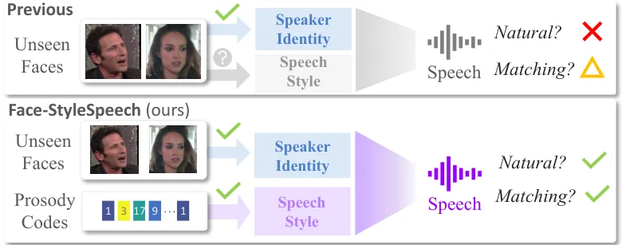
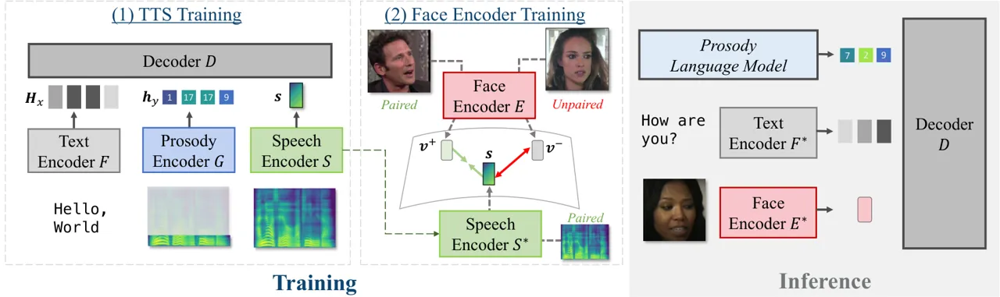
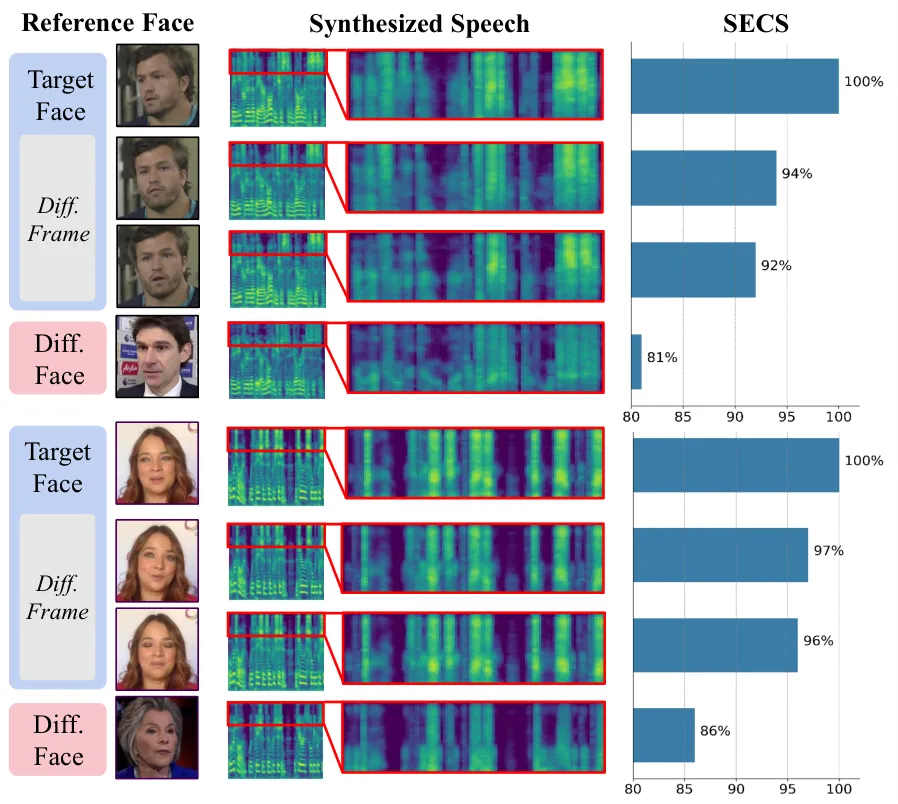

# Face-StyleSpeech: Enhancing Zero-shot Speech Synthesis from Face Images with Improved Face-to-Speech Mapping

Minki Kang^(∗) ^(†)^(†)thanks: \$ˆ\*\$: Equal Contribution Affiliation: 
KAIST  
zzxc1133@kaist.ac.kr    Wooseok Han^(∗) Affiliation:  AITRICS  
hwrg@aitrics.com    Eunho Yang Affiliation:  KAIST, AITRICS  
eunhoy@kaist.ac.kr

###### Abstract

Generating speech from a face image is crucial for developing virtual
humans capable of interacting using their unique voices, without relying
on pre-recorded human speech. In this paper, we propose
Face-StyleSpeech, a zero-shot Text-To-Speech (TTS) synthesis model that
generates natural speech conditioned on a face image rather than
reference speech. We hypothesize that learning entire prosodic features
from a face image poses a significant challenge. To address this, our
TTS model incorporates both face and prosody encoders. The prosody
encoder is specifically designed to model speech style characteristics
that are not fully captured by the face image, allowing the face encoder
to focus on extracting speaker-specific features such as timbre.
Experimental results demonstrate that Face-StyleSpeech effectively
generates more natural speech from a face image than baselines, even for
unseen faces. Samples are available on our demo page.¹¹ 1
[https://face-stylespeech.github.io](https://face-stylespeech.github.io)

###### Index Terms: 

Text-to-speech Synthesis, Face-based TTS, Face-to-Voice Mapping,
Zero-shot TTS

## I Introduction

The zero-shot TTS model \[1\] is designed to synthesize speech that
closely resembles the target speaker’s voice using reference speech,
without needing any fine-tuning. Recent works \[2, 3, 4, 5\] have
utilized a speech encoder to embed reference speech into a latent speech
vector, then reconstructed speech based on this vector and the
transcript during training. This speech vector captures both prosody and
timbre, essential for synthesizing natural-sounding speech from any
speaker.

While traditional TTS models rely on reference speech to replicate a
target speaker’s voice, generating speech from a face image provides a
promising direction for creating novel voices without needing reference
speech. Previous works \[6, 7, 8\] have validated this approach by
mapping or replacing the speech vector with a latent face vector derived
from a face image. However, creating natural-sounding speech from just a
face image remains a significant challenge, as the face alone cannot
fully capture all the complex characteristics of speech. While facial
features like gender, age, and race provide some clues to speaker
identity and broader elements like timbre and pitch range can be
inferred, they fail to capture the more intricate prosodic features such
as precise pitch, stress, and intonation. Therefore, modeling these
nuanced speech style is crucial for accurate speech synthesis from face
images.



Fig. 1: Concept. Previous methods model both speaker-identity and speech
style from the face image, which is highly challenging. Instead, we
model the speech style with the prosody codes to improve the stability
of face-to-voice mapping only on speaker-related features.

In this work, we introduce Face-StyleSpeech, a zero-shot TTS model that
generates natural speech from facial images. By focusing on distinct
speech style features, we enhance the mapping from face-to-speech,
enabling more accurate voice generation. This is accomplished by
incorporating a prosody encoder\[9\], which zero-shot TTS model \[5\]
speech style features into prosody codes, allowing the face encoder to
specialize in extracting speaker identity information. The face encoder
is trained to align the face vector with the speech vector, ensuring
that the voice generated from a face image accurately reflects the
speaker’s identity.

In experiments, we use the LibriTTS-R dataset \[10\] and the VoxCeleb
dataset \[11\] to train the TTS model and the face encoder,
respectively. Our evaluation, using unseen face images demonstrate that
Face-StyleSpeech consistently generates speech that is more natural
compared to baselines, significantly improving the alignment between
voice and facial cues.



Fig. 2: The overview of Face-StyleSpeech. (1) The TTS model generates
speech given the text embedding, prosody codes, and the speech vector.
(2) We train the face encoder to generate a face vector corresponding to
the paired speech vector. (3) In inference, we use the face vector and
prosody codes from the prosody language model.

Our contributions are as follows:

- •
  We present _Face-StyleSpeech_, a zero-shot TTS model that synthesizes
  natural speech from a face image.
- •
  We introduce the use of prosody codes to represent distinct speech
  style features, such as prosody and timbre, improving the mapping
  between face images and speech in the latent vector space.
- •
  In experiments, we empirically show that the proposed method
  significantly improves the naturalness of the speech generated from
  unseen face images.

## II Face-StyleSpeech

The primary focus of our method is to synthesize the speech from a face
image for the target speaker, instead of the reference speech. In this
section, we begin by outlining a zero-shot TTS model \[2, 5\]. We then
describe the face encoder, which is trained to generate a face latent
vector. To improve the face-to-speech mapping, we utilize the prosody
encoder \[9\] to disentangle the speech style feature from the speech
vector. This disentanglement ensures an improved face-to-speech latent
mapping by removing the need for encoding speaker-independent speech
style features in the speech vector. We illustrate our method in
Figure 2.

### II-A Preliminary: Zero-shot TTS Model

We are given the training set
$`\{({\bm{x}}_{i},{\bm{Y}}_{i})\}_{i=1}^{N}`$ including $`N`$ pairs of
the text (phoneme) sequence $`{\bm{x}}\in\mathbb{R}^{n}`$ and speech
(mel-spectrogram) $`{\bm{Y}}\in\mathbb{R}^{m\times b}`$ where $`b`$
denotes the number of mel-filter banks (e.g., $`b=80`$). In the training
phase, we train the TTS model to reconstruct the ground truth speech
$`{\bm{Y}}`$ given the text $`{\bm{x}}`$ and speech $`{\bm{Y}}`$ as
inputs. Here, the zero-shot TTS model majorly consists of three modules:
text encoder $`F`$, speech encoder $`S`$, and decoder $`D`$ \[2, 5,
12\]. The text encoder $`F`$ encodes the text sequence into
representations
$`{\bm{H}}_{x}=F({\bm{x}};\theta_{F})\in\mathbb{R}^{n\times d_{F}}`$.
The speech encoder $`S`$ encodes the speech $`{\bm{Y}}`$ into the speech
vector $`{\bm{s}}=S({\bm{Y}};\theta_{S})\in\mathbb{R}^{d_{S}}`$. We
utilize the Aligner \[5, 13\], which aligns the length of text and
speech \[14\]. The aligner outputs the duration of each phoneme:
$`{\bm{d}}=[d_{1},\ldots,d_{n}]`$. Then, we train the duration predictor
to predict the duration of each phoneme given $`{\bm{H}}_{x}`$ and
$`{\bm{s}}`$. Given durations, we expand each text representation:
$`\bar{{\bm{H}}}_{x}=\texttt{Expand}({\bm{H}}_{x},{\bm{d}})\in\mathbb{R}^{m\times d_{F}}`$.
The decoder $`D`$ reconstructs the target speech $`{\bm{Y}}`$ as
follows: $`\hat{{\bm{Y}}}=D(\bar{{\bm{H}}}_{x},{\bm{s}};\theta_{D})`$.

In the inference stage, the model serves the text $`{\bm{x}}`$ and the
reference speech $`{\bm{Y}}_{r}`$ having different content to
$`{\bm{x}}`$. The trained TTS model synthesizes the speech $`{\bm{Y}}`$
as follows:

```math
{\bm{Y}}=D\left(\texttt{Expand}\left(F\left({\bm{x}};\theta_{F}^{*}\right),\hat{{\bm{d}}}\right),S\left({\bm{Y}}_{r};\theta_{S}^{*}\right);\theta_{D}^{*}\right), \tag{1}
```

where $`\hat{{\bm{d}}}`$ is durations from the duration predictor, and
$`\theta^{*}`$ denotes the trained parameter with the training set.

### II-B Face Encoder Training for Face-to-Speech Mapping

We now have a trained zero-shot TTS model capable of cloning the voice
from a reference speech. Then, our focus becomes determining how to
generate the speech vector from a face image. To this end, we train the
face encoder $`E`$ by mapping the output from $`E`$ to the corresponding
speech vector \[6, 7\]. We suppose that there exists a dataset
$`\{({\bm{Y}}_{i},{\bm{I}}_{i})\}_{i=1}^{M}`$ having $`M`$ pairs of
speech $`{\bm{Y}}\in\mathbb{R}^{m\times b}`$ and the face image
$`{\bm{I}}\in\mathbb{R}^{3\times 224\times 224}`$. We embed the face
image into the face latent vector using the face encoder
$`{\bm{v}}=E({\bm{I}};\theta_{E})`$ and the speech into the speech
vector using the pre-trained speech encoder for the TTS model
$`{\bm{s}}=S({\bm{Y}};\theta_{S})`$. Then, we use the Mean Squared Error
(MSE) loss and the negative cosine similarity (cos) loss for the face
encoder training. Furthermore, we utilize the contrastive learning
objective inspired by CLIP \[15\]. The use of contrastive learning
prevents the face vectors from collapsing into the same vector given the
different faces, by forcing the face vector from different faces to have
a different direction. Combining all, we train the face encoder with the
objective as follows:

```math
\displaystyle{\mathcal{L}}_{map}=\frac{1}{M}\sum_{i=1}^{M}\biggl((1-\texttt{cos}({\bm{v}}_{i},{\bm{s}}_{i}))+\texttt{MSE}({\bm{v}}_{i},{\bm{s}}_{i}) \tag{2}
```

```math
\displaystyle-\log\frac{\exp(\texttt{cos}({\bm{v}}_{i},{\bm{s}}_{i})/\tau)}{\exp(\texttt{cos}({\bm{v}}_{i},{\bm{s}}_{i})/\tau)+\sum_{k=1}^{K}\exp(\texttt{cos}({\bm{v}}_{i},{\bm{s}}_{k})/\tau)}\biggr),
```

where $`K`$ is the number of negative samples and $`\tau=0.07`$.

Once trained, the face encoder $`E^{*}`$ with parameters
$`\theta_{E}^{*}=\argmin_{\theta_{E}}{\mathcal{L}}_{map}`$ can generate
the latent face vector $`{\bm{v}}`$, which could replace the speech
vector $`{\bm{s}}`$ used in the TTS model described in Section II-A.
However, if the TTS model solely relies on the speech vector
$`{\bm{s}}`$ to encode both speech style and speaker identity, employing
the face vector from $`E^{*}`$ could lead to unnatural speech synthesis
as there is no strong correlation between the face image and speech
style.

### II-C Incorporating Prosody Feature for Improved Mapping

We hypothesize that the issue mentioned in the previous section stems
from the challenge of matching facial features with speech style
features. As a result, when mapping the face to the speech vector that
has all prosodic features, the speech generated from an unseen face may
exhibit abnormal prosody, as neither face nor text can comprehensively
encode speech style. Otherwise, the face encoder may only capture
prominent facial attributes, such as gender and age, leading to the
synthesis of speech that has similar voices for most face images. As a
solution, we propose the prosody encoder which aids the TTS model in
encoding speech style independently of the speech vector derived from
the speech encoder.

#### II-C1 Encoding Prosody with Vector Quantization

During training, we can encode prosody related to speech style from the
target speech $`{\bm{Y}}`$. Following Mega-TTS \[9\], we use the prosody
encoder which extracts the prosodic features from the speech into
discrete codes. Specifically, the prosody encoder $`G`$ encodes the
speech $`{\bm{Y}}`$ into representations
$`{\bm{H}}_{y}=G({\bm{Y}},{\bm{d}};\theta_{G})\in\mathbb{R}^{n\times d_{G}}`$,
where we perform the phoneme-level pooling following the duration
$`{\bm{d}}`$. This approach has its limitations, as the prosody encoder
encodes both speaker-dependent and speaker-independent prosodic
features. To address this, we only use low-frequency features of
mel-spectrogram $`{\bm{Y}}`$ and utilize the vector quantization
VQ \[16\] as the information bottleneck for the prosody encoder as in
previous works \[17, 9\]. Through VQ, each prosody feature in
$`{\bm{H}}_{y}`$ is mapped to the code in the codebook
$`{\bm{C}}=\{{\bm{c}}_{1},{\bm{c}}_{2},\ldots,{\bm{c}}_{T}\}`$.
Therefore, we can encode $`{\bm{H}}_{y}`$ as the discrete codes
$`{\bm{h}}_{y}\in\mathbb{N}^{n}`$ where
$`h\in[1,T]\ \forall h\in{\bm{h}}_{y}`$ with indices of mapped features.
Then, we expand $`{\bm{H}}_{y}`$ to fit the length of $`{\bm{Y}}`$:
$`\bar{{\bm{H}}}_{y}=\texttt{Expand}({\bm{H}}_{y},{\bm{d}})`$. The
decoder $`D`$ reconstructs $`{\bm{Y}}`$ with both prosody
representations and the speech vector
$`\hat{{\bm{Y}}}=D(\bar{{\bm{H}}}_{x},\bar{{\bm{H}}}_{y},{\bm{s}};\theta_{D})`$.

The use of prosody encoder $`G`$ enables the speech encoder $`S`$ to be
able to encode only speaker-dependent features into speech vector
$`{\bm{s}}`$, by disentangling the speaker-independent prosodic feature
from the speech vector $`{\bm{s}}`$. As a result, during face encoder
training in Eq. 2, the face vector $`{\bm{v}}`$ can be better aligned
with its speech vector $`{\bm{s}}`$.

#### II-C2 Prosody Code Generation with Language Modeling

In the inference stage, the trained TTS model synthesizes the speech
from the target text $`{\bm{x}}`$ and the face vector $`{\bm{v}}`$ from
the trained face encoder. In this context, prosody codes for prosody
modeling must be predicted from the target text $`{\bm{x}}`$. This is
distinct from the training stage, where the prosody codes are extracted
directly from the speech. Therefore, we leverage the Prosody Language
Model (PLM) \[9\] which generates the prosody codes $`{\bm{h}}_{y}`$ for
$`{\bm{x}}`$ in an autoregressive manner as follows:

```math
\displaystyle{\bm{h}}_{y}=\texttt{PLM}({\bm{h}}^{p}_{y},{\bm{H}}^{p}_{x},{\bm{H}}_{x};\theta_{PLM}),\quad{\bm{H}}_{x}=F({\bm{x}},\theta_{F}^{*}),
```

```math
\displaystyle{\bm{h}}_{y}^{p}=\texttt{VQ}(G({\bm{Y}}^{p},\hat{{\bm{d}}};\theta_{G}^{*}),\quad{\bm{H}}_{x}^{p}=F({\bm{x}}^{p},\theta_{F}^{*}),
```

where $`\hat{{\bm{d}}}`$ is predicted durations of $`{\bm{x}}^{p}`$ from
the duration predictor, $`{\bm{Y}}^{p}`$ is the prompt speech and its
transcript $`{\bm{x}}^{p}`$. Notably, the prompt speech $`{\bm{Y}}^{p}`$
can be any speech since it is only used to generate prosody codes, not
the speaker-related features. Therefore, we can use randomly sampled
speech from the training dataset as a prompt speech. For PLM training,
we use the teacher forcing on the TTS training dataset \[9\]. After
generating the prosody codes using PLM, we decode $`{\bm{h}}_{y}^{p}`$
into representations $`{\bm{H}}_{y}`$ with the codebook used in VQ. We
then generate natural speech with a particular voice from an image:

```math
{\bm{Y}}=D\left(\bar{{\bm{H}}}_{x},\bar{{\bm{H}}}_{y},E\left({\bm{I}};\theta_{E}^{*}\right);\theta_{D}^{*}\right), \tag{3}
```

where $`\bar{{\bm{H}}}=\texttt{Expand}({\bm{H}},\hat{{\bm{d}}})`$ with
predicted durations $`\hat{{\bm{d}}}`$.

## III Experiment

### III-A Experimental Setup

Implementation Details. We use the Grad-StyleSpeech \[5\] for the TTS
model and follow the training setups in the original paper. For the face
encoder, we use the SyncNet \[18\] following the Face-TTS \[8\]. We
train the face encoder for 3k steps with batch size 256, Adam optimizer,
and a learning rate of $`10^{-4}`$. For the prosody encoder and language
model, we follow the implementation details in Mega-TTS \[9\]. We use
the same audio processing setup with a sampling rate of 16khz following
previous works \[2, 5\]. We use the HiFi-GAN \[19\] as a vocoder.

Dataset. We train the TTS model on the English speech dataset
LibriTTS-R \[10\], which contains 245 hours of audiobook recordings from
553 speakers. We use the clean-100 and clean-360 subsets for the
training. Then, we use the audio-visual dataset VoxCeleb \[11\] which
includes the interview clips of 1,251 celebrities for the training of
the face encoder. For evaluation, we use 20 sampled faces from the
VoxCeleb 2 \[20\] which are not used in the training.

Baselines. (1) Face-TTS \[8\]. Face-styled TTS model based on the
Grad-TTS \[21\] where the face encoder is jointly trained with the TTS
model on the LRS3 \[22\] dataset. (2) Grad-StyleSpeech. Vanilla
Grad-StyleSpeech \[5\] model without any additional module, but inputs
the face vector from the face encoder as a condition. (3)
Grad-StyleSpeech + CLAP. Same as (2), but we use the text encoder from
CLAP-Speech \[23\] in the TTS model to consider the prosody variants
from the text content. (4) Face-StyleSpeech. Our proposed model with the
prosody encoder and Prosody Language Model \[9\] in the Grad-StyleSpeech
to consider the prosody.

Evaluation Metric. We evaluate face-conditioned TTS models using the
following metrics. (1) Character Error Rate (CER): Measures
intelligibility using whisper \[24\] ASR model to transcribe synthesized
speech. (2) Mean Opinion Score (MOS): Assesses subjective naturalness
through human evaluation on a 5-point scale. (3) Speaker Embedding
Cosine Similarity (SECS): Evaluates voice similarity between synthesized
and reference speech by measuring cosine similarity of speaker
embeddings using Resemblyzer²² 2
[https://github.com/resemble-ai/Resemblyzer](https://github.com/resemble-ai/Resemblyzer).

Face-conditioned TTS models should not generate identical voices for
different faces, as each person has a unique voice identity. To assess
this, we use: (4) Speaker Embedding Diversity (SED): Measures pairwise
similarity of synthesized voices from different face images; lower SED
indicates greater voice diversity. Additionally, models should generate
speech that matches the face image. We test this with: (5) Matching
Preference Test: Evaluators choose between synthesized speech or face
images that best match each other, based on 5 samples with 10
evaluators. Evaluations are conducted on gender-matched face-voice pairs
to avoid trivial cases.

| Model                   | MOS ($`\uparrow`$) | CER ($`\downarrow`$) | SECS ($`\uparrow`$) | SED ($`\downarrow`$) |
| ----------------------- | ------------------ | -------------------- | ------------------- | -------------------- |
| Face-TTS^(†)            | 2.45 $`\pm`$ 0.17  | 4.47                 | 70.74               | 82.57                |
| Grad-StyleSpeech (GSS)  | 2.65 $`\pm`$ 0.18  | 7.59                 | 72.25               | 89.94                |
| GSS + CLAPSpeech        | 2.52 $`\pm`$ 0.16  | 5.70                 | 71.56               | 91.71                |
| Face-StyleSpeech (ours) | 3.72 $`\pm`$ 0.16  | 1.39                 | 74.14               | 80.45                |

TABLE I: Evaluation on Unseen Faces. Experimental results on unseen face
images from VoxCeleb 2 \[20\] where the models are not trained. Note
that Face-TTS^(†) is trained on the LRS3 \[22\] dataset.

Fig. 3: Preference Test. Results of (Left) Face-based Voice Preference
and (Right) Voice-based Face Preference Tests.

### III-B Experimental Results

Main Experiments Table I shows our experimental results for
text-to-speech synthesis conditioned on face images, particularly those
on which the models have not been trained. As shown in Table I, our
Face-StyleSpeech shows a higher MOS and a lower CER than baselines,
indicating that the speech synthesized by Face-StyleSpeech sounds more
natural and intelligible than baselines. Furthermore, Face-StyleSpeech
outperforms baselines in terms of speaker similarity, with higher SECS
indicating that the synthesized speech is more similar to the target
speaker’s real voice.

Matching Preference In Figure 3, we plot the results of matching
preference tests. In both Face-TTS and Face-StyleSpeech, evaluators
select the correct answer with 64% accuracy in the face-based voice
preference test, even if we only use pairs having the same gender for
more difficult cases. In the voice-based face preference test, however,
evaluators select 8% more correct answers when the speech is generated
by Face-StyleSpeech rather than Face-TTS, demonstrating that our
Face-StyleSpeech synthesizes the speech with a voice more matched to the
given face. Lastly, as shown in the SED metric of Table I, our
Face-StyleSpeech generates more diverse voices than baselines.
Experimental results support our hypothesis that disentangling prosody
from the speech vector improves face-to-voice mapping, resulting in the
TTS model that generates more natural, diverse, and matched speech from
a face image. Please refer to the demo page³³ 3
[https://face-stylespeech.github.io](https://face-stylespeech.github.io)
for samples.



Fig. 4: Analysis on Effects of Different Frames. We visualize the
mel-spectrograms of synthesized speech from the face images. On the
right, we plot the SECS between speech samples and the speech from the
target face.

Consistency Test In face-conditioned TTS models, the same voice must be
synthesized from images of the same person’s face as much as different
voices must come from images of different people’s faces. For instance,
video datasets like VoxCeleb \[11, 20\] contain multiple frames of the
same individual. It is essential that, regardless of the frame chosen as
input, a consistent voice is produced. We conducted experiments to
demonstrate that our model possesses this capability, as shown in
Figure 4. We sample three different frames each for males and females
and synthesize speech from them. The resulting mel-spectrograms show
similar trends, indicating that Face-StyleSpeech can maintain voice
consistency across different frames of the same person.

Ablation Study In Table II, we outline the results of an ablation study
for the loss functions in Equation 2, which is used in the face encoder
training. We utilize Face-StyleSpeech in this ablation study. In
addition to contrastive learning loss, we also experiment with triplet
loss \[7\]. Our findings indicate that contrastive learning is
important, especially when it comes to voice diversity.

| $`{\mathcal{L}}_{map}`$ | CER ($`\downarrow`$) | SECS ($`\uparrow`$) | SED ($`\downarrow`$) |
| ----------------------- | -------------------- | ------------------- | -------------------- |
| MSE + neg. Cosine       | 1.98                 | 72.11               | 90.64                |
|    + Triplet Loss       | 2.39                 | 72.04               | 87.49                |
|    + Contrastive Loss   | 1.39                 | 74.14               | 80.45                |

TABLE II: Ablation Study. Ablation study results on the loss functions
used in the face encoder training in Equation 2.

## IV Conclusion

In this work, we introduced Face-StyleSpeech, a zero-shot TTS model that
synthesizes natural speech from face images instead of reference speech.
The key challenge we addressed was the weak correlation between face
images and entire prosody features encapsulated within the speech
vector. To overcome this, we introduced a prosody encoder in the TTS
model to separate speech style features from the speech vector, thereby
enhancing the model’s ability to generate more natural speech by
improving the face-to-speech mapping. Our experimental results
demonstrate that Face-StyleSpeech is effective in generating
natural-sounding speech that captures the imagined voice of provided
faces well, even those not seen during training.

## References

- \[1\] S. Arik, J. Chen, K. Peng, W. Ping, and Y. Zhou, “Neural voice
  cloning with a few samples,” _NeurIPS_, 2018.
- \[2\] D. Min, D. B. Lee, E. Yang, and S. J. Hwang, “Meta-stylespeech :
  Multi-speaker adaptive text-to-speech generation,” in _ICML_, 2021.
- \[3\] E. Casanova, J. Weber, C. D. Shulby, A. C. Júnior, E. Gölge, and
  M. A. Ponti, “YourTTS: Towards Zero-Shot Multi-Speaker TTS and
  Zero-Shot Voice Conversion for Everyone,” in _ICML_, 2022.
- \[4\] S. Kim, H. Kim, and S. Yoon, “Guided-tts 2: A diffusion model
  for high-quality adaptive text-to-speech with untranscribed data,”
  _arXiv_, vol. abs/2205.15370.
- \[5\] M. Kang, D. Min, and S. J. Hwang, “Grad-stylespeech: Any-speaker
  adaptive text-to-speech synthesis with diffusion models,” in _ICASSP
  2023_, 2023.
- \[6\] S. Goto, K. Onishi, Y. Saito, K. Tachibana, and K. Mori,
  “Face2speech: Towards multi-speaker text-to-speech synthesis using an
  embedding vector predicted from a face image,” in _Interspeech_, 2020.
  \[Online\]. Available:
  [https://doi.org/10.21437/Interspeech.2020-2136](https://doi.org/10.21437/Interspeech.2020-2136)
- \[7\] J. Wang, Z. Wang, X. Hu, X. Li, Q. Fang, and L. Liu,
  “Residual-guided personalized speech synthesis based on face image,”
  in _ICASSP_, 2022.
- \[8\] J. Lee, J. Son Chung, and S.-W. Chung, “Imaginary voice:
  Face-styled diffusion model for text-to-speech,” in _ICASSP_, 2023.
- \[9\] Z. Jiang, Y. Ren, Z. Ye, J. Liu, C. Zhang, Q. Yang, S. Ji,
  R. Huang, C. Wang, X. Yin _et al._, “Mega-tts: Zero-shot
  text-to-speech at scale with intrinsic inductive bias,” _arXiv
  preprint arXiv:2306.03509_, 2023.
- \[10\] Y. Koizumi, H. Zen, S. Karita, Y. Ding, K. Yatabe, N. Morioka,
  M. Bacchiani, Y. Zhang, W. Han, and A. Bapna, “Libritts-r: A restored
  multi-speaker text-to-speech corpus,” in _Interspeech_, 2023.
- \[11\] A. Nagrani, J. S. Chung, and A. Zisserman, “Voxceleb: A
  large-scale speaker identification dataset,” in _Interspeech_, 2017.
- \[12\] Y. Wu, X. Tan, B. Li, L. He, S. Zhao, R. Song, T. Qin, and
  T. Liu, “Adaspeech 4: Adaptive text to speech in zero-shot scenarios,”
  in _Interspeech_, 2022. \[Online\]. Available:
  [https://doi.org/10.21437/Interspeech.2022-901](https://doi.org/10.21437/Interspeech.2022-901)
- \[13\] Y. Ren, C. Hu, X. Tan, T. Qin, S. Zhao, Z. Zhao, and T. Liu,
  “Fastspeech 2: Fast and high-quality end-to-end text to speech,” in
  _ICLR_, 2021.
- \[14\] R. Badlani, A. Lancucki, K. J. Shih, R. Valle, W. Ping, and
  B. Catanzaro, “One TTS alignment to rule them all,” in _ICASSP_, 2022.
- \[15\] A. Radford, J. W. Kim, C. Hallacy, A. Ramesh, G. Goh,
  S. Agarwal, G. Sastry, A. Askell, P. Mishkin, J. Clark, G. Krueger,
  and I. Sutskever, “Learning transferable visual models from natural
  language supervision,” in _ICML_, 2021.
- \[16\] A. van den Oord, O. Vinyals, and K. Kavukcuoglu, “Neural
  discrete representation learning,” in _NeurIPS_, 2017.
- \[17\] Y. Ren, M. Lei, Z. Huang, S. Zhang, Q. Chen, Z. Yan, and
  Z. Zhao, “Prosospeech: Enhancing prosody with quantized vector
  pre-training in text-to-speech,” in _ICASSP_, 2022.
- \[18\] J. S. Chung and A. Zisserman, “Out of time: Automated lip sync
  in the wild,” in _ACCV 2016 Workshops_, ser. Lecture Notes in Computer
  Science, 2016.
- \[19\] J. Kong, J. Kim, and J. Bae, “Hifi-gan: Generative adversarial
  networks for efficient and high fidelity speech synthesis,” in
  _NeurIPS_, 2020.
- \[20\] J. S. Chung, A. Nagrani, and A. Zisserman, “Voxceleb2: Deep
  speaker recognition,” in _Interspeech_, 2018.
- \[21\] V. Popov, I. Vovk, V. Gogoryan, T. Sadekova, and M. A. Kudinov,
  “Grad-tts: A diffusion probabilistic model for text-to-speech,” in
  _ICML_, 2021.
- \[22\] J. S. Chung, A. W. Senior, O. Vinyals, and A. Zisserman, “Lip
  reading sentences in the wild,” in _CVPR_, 2017.
- \[23\] Z. Ye, R. Huang, Y. Ren, Z. Jiang, J. Liu, J. He, X. Yin, and
  Z. Zhao, “Clapspeech: Learning prosody from text context with
  contrastive language-audio pre-training,” in _ACL_, 2023. \[Online\].
  Available:
  [https://doi.org/10.18653/v1/2023.acl-long.518](https://doi.org/10.18653/v1/2023.acl-long.518)
- \[24\] A. Radford, J. W. Kim, T. Xu, G. Brockman, C. McLeavey, and
  I. Sutskever, “Robust speech recognition via large-scale weak
  supervision,” in _ICML_, 2023.
