# Detecting Voice Cloning Attacks via Timbre Watermarking

PubID: pubid: Network and Distributed System Security (NDSS) Symposium
2024 26 February - 1 March 2024, San Diego, CA, USA ISBN 1-891562-93-2
https://dx.doi.org/10.14722/ndss.2024.24200 www.ndss-symposium.org

Chang Liu¹    Jie Zhang^(2†)    Tianwei Zhang²    Xi Yang¹    Weiming
Zhang^(1†)    and Nenghai Yu¹ Affiliation: ¹University of Science and
Technology of China Affiliation: ²Nanyang Technological University
Affiliation: ^(†)Corresponding Authors Affiliation:  {hichangliu@mail.,
yx9726@mail., zhangwm@, ynh@}ustc.edu.cn, {jie_zhang,
tianwei.zhang}@ntu.edu.sg

###### Abstract

Nowadays, it is common to release audio content to the public, for
social sharing or commercial purposes. However, with the rise of voice
cloning technology, attackers have the potential to easily impersonate a
specific person by utilizing his publicly released audio without any
permission. Therefore, it becomes significant to detect any potential
misuse of the released audio content and protect its timbre from being
impersonated.

To this end, we introduce a novel concept, “Timbre Watermarking”, which
embeds watermark information into the target individual’s speech,
eventually defeating the voice cloning attacks. However, there are two
challenges: 1) robustness: the attacker can remove the watermark with
common speech preprocessing before launching voice cloning attacks; 2)
generalization: there are a variety of voice cloning approaches for the
attacker to choose, making it hard to build a general defense against
all of them.

To address these challenges, we design an end-to-end voice
cloning-resistant detection framework. The core idea of our solution is
to embed the watermark into the frequency domain, which is inherently
robust against common data processing methods. A repeated embedding
strategy is adopted to further enhance the robustness. To acquire
generalization across different voice cloning attacks, we modulate their
shared process and integrate it into our framework as a distortion
layer. Experiments demonstrate that the proposed timbre watermarking can
defend against different voice cloning attacks, exhibit strong
resistance against various adaptive attacks (e.g., reconstruction-based
removal attacks, watermark overwriting attacks), and achieve
practicality in real-world services such as PaddleSpeech,
Voice-Cloning-App, and so-vits-svc. In addition, ablation studies are
also conducted to verify the effectiveness of our design. Some audio
samples are available at
[https://timbrewatermarking.github.io/samples](https://timbrewatermarking.github.io/samples).

## I Introduction

> “The voice is an instrument that you can learn to play and use in a
> way that is uniquely yours.”
>
> – Kristin Linklater

We are already in the era of the Ear Economy, where audio content has
become increasingly popular in today’s digital landscape. Many
individuals enjoy sharing their voice artworks (e.g., music recordings,
audio books, soundtracks) on public platforms, such as Spotify \[1\],
Audible \[2\], Himalaya \[3\], SoundCloud \[4\], etc. Those services
have significantly changed the way people consume content for
entertainment and gaining knowledge.

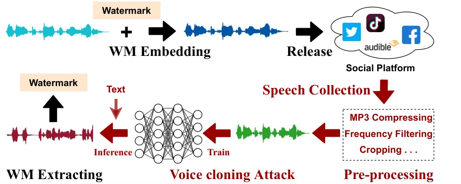

Fig. 1: The process of embedding and extracting “Timbre Watermarking”
for detecting voice cloning attacks.

Unfortunately, the rise of the voice cloning technology \[5, 6, 7, 8\]
exposes new security challenges to the audio content sharing services.
Recent advances in voice cloning leverage deep learning to accurately
synthesize human voices indistinguishable from the target ones \[9,
10\]. This technology has been widely applied in different scenarios: in
the entertainment industry, it can be used to create synthetic voices
for characters in movies and video games; in healthcare, it can generate
voices for patients who have lost their ability to speak due to illness
or injury. However, an adversary can also exploit this technology to
generate voices of other persons’ timbre (i.e., patterns, intonations,
and other characteristics of human speech) for illegal or unauthorized
purposes. This is dubbed voice cloning attack, which can cause various
severe consequences, such as financial losses, reputation damage, and
copyright infringement. For instance, a clip on YouTube shows that Biden
announced a plan of launching a unclear attack against Russia, which was
created by voice cloning and could cause public panic \[11\].

Therefore, unauthorized synthesis of valuable timbre shall be not
acceptable, and it is crucial to establish safeguards against the
potential misuse of voice cloning technology. Several attempts have been
made to tackle this issue. However, they all suffer from some
limitations. First, passive detection methods \[12, 13, 14, 15\] have
been developed to identify whether a voice is produced using voice
cloning. However, advanced voice cloning techniques make these methods
obsolete, and create a perpetual arms race between voice synthesis and
detection techniques \[16\]. Second, another line of defense strategies
are introduced to proactively prevent voice cloning. Specifically, Huang
et al. \[17\] proposed to add adversarial noise to the target voice,
causing the attacker to create synthetic voices with totally different
timbre from the target one. However, this solution has two practical
issues: (1) it needs to add significant amounts of noise to achieve the
protection, which can obscure the original voice and affect its
fidelity; (2) it needs domain knowledge about the specific voice cloning
approach adopted by the attacker, and cannot be generalized to other
attack approaches.

To address the limitations of existing solutions, motivated by the
recent deep model watermarking technology \[18, 19\], we introduce a
novel concept called “Timbre Watermarking” to protect the released
timbre against voice cloning. As shown in Fig. 1, we proactively embed
watermark information (e.g., ownership) into the target voice before
releasing it to the public. To ensure its normal usage, the watermarked
voice is indistinguishable from the original one and users will not
notice its existence. An attacker may collect such watermarked voice
without permission, and then apply a voice cloning method to generate
synthetic voice with the same timbre but different content or semantic
information. By extracting the watermark information from the synthetic
voice, we are able to detect the fake speech and track its original
timber reliably.

Current audio watermarking methods have demonstrated success in
preserving fidelity while guaranteeing normal robustness (e.g., against
desynchronization/recapturing attacks \[20, 21\]). However, they cannot
be applied for timbre watermarking, due to their incapability of
handling voice cloning attacks (explained in Sec. II-C). Here, we
conclude two challenges in realizing timbre watermarking: (1)
Generalization. We do not know how the attacker would launch the voice
cloning attacks, including data collection, generative model, cloning
strategies, etc. It is difficult to embed a timbre watermark that can
resist all types of possible voice cloning strategies. (2) Robustness.
The attacker may attempt to remove the potential watermarks by
preprocessing the voice. For instance, he can crop the voice to
randomize the speech length and complicate the resynchronization for
watermark extraction; he can also compress the audio signals to damage
the hidden watermark. Although a number of prior works have proposed
methods to watermark audio works \[22, 21, 23, 24, 25\], as they are not
targeting the voice cloning attacks, they are not robust and can be
easily removed by the attacker. In Sec. VI-A we experimentally validate
the limitations of these existing watermark solutions: the indeterminate
length and scale of the synthesized speech will totally fail their
resynchronization process before extracting, which usually depends on
the synchronization codes, shifting mechanisms, or time
scaling-invariant features.

In this paper, we propose a novel end-to-end timbre watermarking
framework to defeat voice cloning attacks. Fig. 4 shows the overview of
our methodology. Specifically, (1) to enhance the robustness, we propose
to embed the watermark information into the transform domain. We adopt
the Short-Time Fourier Transform (STFT) scheme to transfer the audio
wave and embed the watermark into its frequency domain (vertical
direction), which is inherently robust against voice processing
operations along the time domain (horizontal direction). To further
strengthen the watermark robustness, we repeat the embedding strategy
along the horizontal direction, eliminating the dependency on the time
domain again. Symmetrically, during the extraction stage, we average the
extracted watermark along the horizontal direction. (2) To enhance the
generalization, we investigate existing popular voice cloning strategies
and find some common-used processing operations, such as scale
modification, normalization, phase information discarding, and waveform
reconstruction. Then, we insert these processes as a distortion layer
between the watermark embedding and extraction modules and train them
together in an end-to-end way. This distortion layer provides other
modules the awareness of different processing operations when verifying
the watermarks. After training, we discard the distortion layer and
leverage the other modules for watermark embedding and extraction,
respectively.

Extensive experiments demonstrate that our proposed methodology does not
degrade the quality of the original timbre while guaranteeing the
generalization and robustness against different existing and adaptive
voice cloning attacks. Besides, we verify its effectiveness with some
real-world commercial services, including PaddleSpeech \[26\],
Voice-Cloning-App \[27\], and so-vits-svc \[28\]. We also conduct some
ablation studies to evaluate our design, and provide some discussions
and potential insights. We believe our proposed “Timbre Watermarking”
can shed light on the field of illegal voice cloning detection and
timbre protection.

In summary, the primary contributions of our work are concluded as
follows:

- •
  We point out that timbre rights are at significant risk of being
  compromised by voice cloning attacks and introduce a novel concept of
  “Timbre Watermarking” as a viable defense.
- •
  To achieve “Timbre Watermarking”, we propose an end-to-end voice
  cloning-resistant audio watermarking framework. Innovatively, we
  repeatedly embed watermark information in the frequency domain to
  resist common audio processing and modulate the shared process of
  different voice cloning attacks as a distortion layer to obtain
  generalization.
- •
  Extensive experiments demonstrate the generalization and robustness of
  our proposed method against different voice cloning attacks including
  the adaptive ones. In addition, our method is applicable in real-world
  services, e.g., PaddleSpeech, Voice-Cloning-App, and so-vits-svc.

## II Background and Related Works

In this section, we first describe the common methods for voice cloning,
followed by some countermeasures against voice cloning attacks. Finally,
we provide some traditional audio watermarking methods and point out
their limitations.

### II-A Voice Cloning

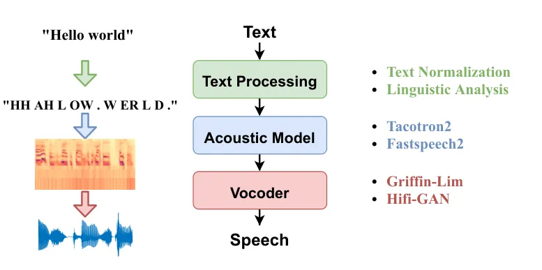

Fig. 2: The pipeline of the common TTS system.

Voice cloning refers to the process of creating a synthetic voice that
closely resembles the voice/timbre of a target person. This is mainly
achieved by two mainstream techniques, namely voice conversion \[5, 6\]
and text-to-speech (TTS) generation \[7, 8\]. Specifically, voice
conversion is a technique that modifies the speech signal of an
arbitrary speaker to make it sound like the target speaker’s voice while
preserving the linguistic content of the original message. Comparably,
TTS is a more flexible method to generate the desired speech of any
given text without the need of the original speech for transfer.
Therefore, this paper mainly focuses on the TTS-based voice cloning
attacks. Nevertheless, our proposed method is also applicable to voice
conversion techniques: in Sec. V-F we showcase the effectiveness of our
solution over real-world services, some of which are based on voice
conversion. Fig. 2 presents the pipeline of a common TTS system, which
can be divided into the following three components.

Text Processing.   In order to generate high-quality speech output, the
text needs to be preprocessed to extract linguistic and acoustic
features. Text processing for TTS mainly includes text normalization
\[29\] and linguistic analysis \[9\]. Text normalization aims to convert
the text into a standard form that can be processed by the TTS system.
This process consists of different operations, such as removing
punctuation and special characters, converting numbers to their spoken
form, and expanding abbreviations and acronyms. Linguistic analysis
segments the text into units such as sentences, phrases, and words. It
then processes the normalized text by converting it into a sequence of
phonemes, which are the basic units of sound in a language, and
tokenizes these phonemes using the model-specific tokenizer. The
resulting tokenized phonemes are then fed into the models to generate
synthesized speech. Additionally, advanced speech synthesis systems
often perform prosody prediction, encompassing rhythm, stress, and
intonation of speech. This prediction enables TTS models to produce
speech with natural pitch, duration, and energy patterns. Some TTS
models integrate syntactic and semantic analysis to comprehend the
text’s structure and meaning, facilitating more precise and contextually
relevant speech synthesis \[30\].

Acoustic Model.   An acoustic model is a key component of TTS systems,
responsible for converting linguistic information into acoustic features
(e.g., spectrograms), which determine the sound of the synthesized
speech. Compared with traditional simple statistical models \[31, 32,
33, 34\], DNN-based acoustic models \[35, 7, 36, 8\] give a superior
performance. Wang et al. \[7\] proposed the first DNN-based acoustic
model Tacotron, which uses a Recurrent Neural Network (RNN) to simulate
the dynamic nature of speech signals and employs an attention mechanism
to adjust the output based on different inputs. However, Tacotron has
some distortion and noise issues. Afterward, Shen et al. \[36\]
presented the enhanced Tacotron 2, which adopts a position-sensitive
attention module to improve the synthesis quality. Nevertheless, both
Tacotron and Tacotron 2 are computationally-intensive. To address the
efficiency issue, Ping et al. \[35\] introduced a fully-convolutional
sequence-to-sequence architecture rather than RNN. FastSpeech \[37\]
uses an encoder-decoder transformer structure to rapidly generate
mel-spectrogram in parallel for TTS and leverages an unsupervised
approach to greatly simplify the model training process and reduce the
demand for a large amount of audio data. FastSpeech 2 \[8\] further
expands on this unsupervised training method by incorporating an
acoustic prior to improve the output quality. In this paper, we adopt
Tacotron 2 \[36\] and FastSpeech 2 \[8\] as the default acoustic model
for voice cloning attacks, but our solution is general to other models
as well.

Vocoder.   With the above-obtained spectrograms, a vocoder is used to
synthesize speech signals based on an analysis of their constituent
frequency bands and pitch information. A well-known vocoder is
Griffin-Lim \[38\], which reconstructs the original signal from
Short-Time Fourier Transform (STFT). Although this algorithm is
computationally inexpensive and effective at reconstructing speech
signals, it will introduce perceptible background noise and distortions
in the synthetic speech. It is also sensitive to the choice of
parameters, which requires manual fine-tuning to achieve optimal
results. Besides this traditional algorithm, there are also some deep
learning algorithms used for generating high-quality audio signals, such
as WaveGAN \[39\] and HiFiGAN \[40\]. By using a combination of
convolutional and deconvolutional layers, WaveGAN is able to generate
realistic audio signals that mimic real recordings, but it may sometimes
produce distorted or unstable output when the generated signals are too
complex or too long. By comparison, HiFiGAN uses a more advanced
training process that includes the use of feature-matching loss
functions and a multi-scale discriminative model. This allows to
generate high-fidelity audio signals that sound more natural and
accurate than those generated using earlier GAN-based methods. In this
paper, we adopt Griffin-Lim \[38\] and HiFiGAN \[40\] as the default
vocoder. Besides, we also consider the widely-used VITS \[30\], which
directly transfers the text input to speech output in an end-to-end
manner.

### II-B Countermeasures against Voice Cloning Attacks

Existing strategies of resisting voice cloning attacks can be roughly
classified into two categories.

Passive Detection-based Strategy.   Passive detection seeks to identify
whether the suspect speech from authentic humans or artificially
generated. This is normally achieved via the analysis of specific
features. For example, Gao et al. \[13\] introduced an audio-based
CAPTCHA system to differentiate human voices from synthetic ones using
metrics such as short-term energy, average amplitude, and zero-crossing
rate. DeepSonar \[15\] leverages layer-wise neuron activation patterns
to effectively discern authentic voices from AI-synthesized ones.
However, both the above methods cannot generalize to unseen data
distributions. To remedy this issue, Ahmed et al. \[12\] proposed Void,
an efficient solution for voice spoofing detection based on liveness
detection, which analyzes the spectral power differences between
live-human voices and spoofing voices. In addition to feature-based
methods, there are also some approaches to achieve good detection
capability with the help of deep learning \[14, 41\]. To solve the
problem of diverse statistical distributions of different synthesizing
methods, Zhang et al. \[42\] proposed a one-class learning anti-spoofing
system (One-Class) to effectively detect unseen synthetic voice spoofing
attacks.

While these passive detection methods can identify synthetic speech in
specific scenarios (e.g.particular datasets and contexts), their
generalizability and credibility are limited \[16\]. Most importantly,
they can only detect synthetic speech, but not trace the original
timbre. We showcase the corresponding comparison in Appx. A-A1.

Proactive Prevention-based Strategy.   This line of solutions focus on
disrupting the voice cloning process rather than detecting the
synthesized speech post facto. Huang et al. \[17\] proposed to corrupt
speech samples by adding adversarial perturbations to prevent
unauthorized speech synthesis. However, it will degrade the quality of
the target speech. Besides, it can only be applicable for voice
conversion tasks at the inference stage, rather than the complex
training process of TTS tasks. Nevertheless, we compare our watermarked
speech with their perturbated one to demonstrate our superior
performance on speech quality in Sec. V-B.

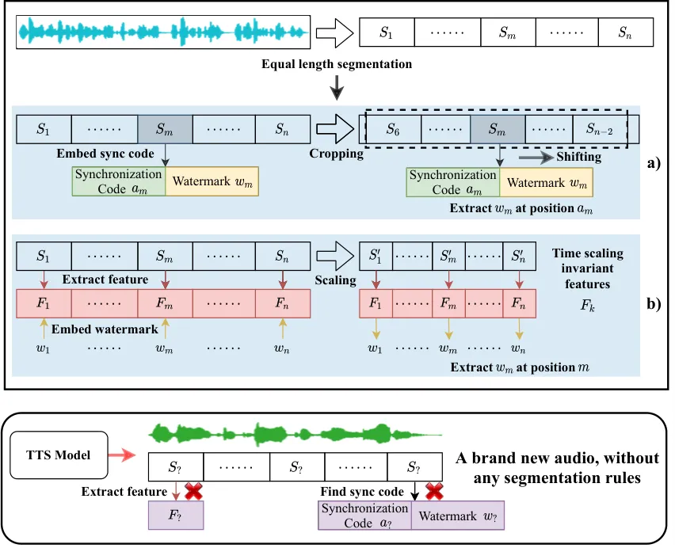

Fig. 3: Traditional audio watermarking schemes are unable to withstand
voice cloning attacks.

### II-C Audio Watermarking

Audio watermarking technologies strive to achieve a dual set of
performance criteria: fidelity and robustness. For fidelity, current
audio watermarking methods predominantly utilize frequency domain
analysis to extract salient features from the carrier audio. The
embedding of the watermark is subsequently executed by altering these
frequency domain features. It is generally accepted that modification of
the higher frequency components leads to enhanced fidelity in the
watermarking process \[43\]. Concurrently, making subtle adjustments to
less prominent audio features contributes to the watermark’s
imperceptibility \[22, 20\]. Besides, some schemes try to use
psychoacoustic modeling to set thresholds for watermark modifications to
avoid being perceived by human ears \[44, 45, 46\]. For robustness, some
research has demonstrated resilience against common and unavoidable
signal processing distortions \[47\]. More recently, the focus has
shifted toward exploring robustness under intricate conditions, such as
re-recording \[21, 24\], desynchronization distortion \[23, 20\],
cropping distortion \[48\], etc. In a nutshell, existing audio
watermarking can already well balance the trade-off between fidelity and
normal robustness.

As mentioned above, the collected speech may be modified before voice
cloning attacks via some preprocessing operations, such as cropping and
time scaling. This can cause desynchronization to fail the subsequent
watermark extraction. Fig. 3 illustrates some countermeasures based on
traditional audio watermarking schemes: a) leveraging synchronization
codes or shift mechanisms with sliding windows for resynchronization
\[21, 48\]; b) employing time scaling invariant features to withstand
scale transformations \[23, 20\]. Based on these two ideas, Zhao et al.
\[23\] designed FSVC, an audio feature that is insensitive to
time-domain scale transformation based on frequency-domain signal
processing. It is combined with audio averaging segmentation to achieve
resistance to desynchronization caused by global-scale transformation.
Liu et al. \[21\] designed RFDLM, a robust feature against scaling. It
is combined with synchronization codes to achieve robustness to
desynchronization attacks. However, none of these audio watermarking
methods exhibit satisfactory robustness against both cropping and time
scaling, let alone the more complex voice cloning process. In Sec. VI-A
we evaluate two audio watermarking methods (i.e., FSVC \[23\] and RFDLM
\[21\]), and show that they totally fail to detect voice cloning
attacks. Concurrently, deep learning-based end-to-end audio watermarking
has recently emerged \[24, 25, 49\], yet it encounters considerable
limitations. Existing methods prioritize robustness; however, in the
given scenario, the audio possesses a fixed length, rendering it
challenging to counteract distortions arising from desynchronization.

Different from the above methods, our solution integrates
time-independent features into the audio watermarking algorithm, making
it feasible to maintain the integrity of the watermark information even
in the face of cropping and time scaling. We provide a qualitative
analysis of the impact of distortion operations on the watermarked
speech and demonstrate that our method can effectively resist voice
cloning attacks. In a nutshell, our method pursues a novel robustness
property against voice cloning attacks, which is achieved by simulating
this attack and inserting it between the training of watermark embedding
and extraction. For enhanced fidelity, we also introduce an extra
discriminator for adversarial training.

## III Threat Model

We consider a scenario which involves three parties: 1) users shares
their audio data on a public platform; 2) the platform provider seeks to
protect the shared audio from potential misuse; 3) the attacker collects
the target audio from the platform and attempts to generate synthetic
audio with the same timbre using advanced voice cloning techniques.

### III-A Users’ Ability and Goal

In order to access the platform, users must first register the service
with their authorship information. They hope that their audio data will
not be used maliciously. They have the right to request the platform to
deploy protection over the uploaded audio, and perform synthetic audio
verification when suspiciously cloned audio is identified.

### III-B Platform Provider’s Ability and Goal

The platform provider applies a novel watermark embedding algorithm
$`\mathcal{EM}(\cdot)`$ to embed a watermark $`w`$ (e.g., authorship
information) into users’ speech samples $`s`$ before releasing them, to
safeguard their voice timbre, i.e., $`s^{\prime}=\mathcal{EM}(s,w)`$.
The platform provider needs to guarantee the speech fidelity, namely,
making $`s_{w}`$ similar to the pristine $`s`$ as much as possible. Let
$`S_{w}=\{s_{1_{w}},s_{2_{w}},\dots,s_{n_{w}}\}`$ represent a set of
watermarked speech samples from the target speaker $`T`$ with watermark
$`w`$. The platform provider also has a watermark extraction algorithm
$`\mathcal{EX}(\cdot)`$ to extract the pre-defined watermark $`w`$ from
$`s_{w}`$, i.e., $`w^{\prime}=\mathcal{EX}(s_{w})\rightarrow w`$. Given
a suspicious audio $`s*`$, the platform provider can apply
$`\mathcal{EX}(\cdot)`$ to check if any watermark can be extracted from
it, as evidence of voice cloning attacks.

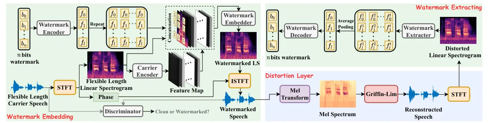

Fig. 4: Overview of our proposed timbre watermark framework.

### III-C Attacker’s Ability and Goal

Let $`S=\{s_{1},s_{2},...,s_{n}\}`$ be a set of speech samples from a
target speaker $`T`$. The attacker collects $`S`$ and pre-processes it
to construct a text-speech dataset
$`D=\{(x_{1},y_{1}),(x_{2},y_{2}),...,(x_{m},y_{m})\}`$, where $`x_{i}`$
is a text transcription and $`y_{i}`$ is the corresponding speech
sample. With $`D`$, the attacker can train his TTS model $`\mathbf{M}`$
in a supervised way. As mentioned in Sec. II-A, a TTS model
$`\mathbf{M}`$ usually consists of two components, namely, the Acoustic
model $`\mathbf{M_{A}}`$ and the Vocoder $`\mathbf{M_{V}}`$. After that,
for an arbitrary text transcription $`\hat{x}`$, $`\mathbf{M}`$ can
synthesize the corresponding speech $`\hat{y}`$ as:

```math
\hat{y}=\mathbf{M}(\hat{x})=\mathbf{M_{V}}(\mathbf{M_{A}}(\hat{x})).
```

With our proposed Timbre Watermark, the attacker can only obtain a
watermarked dataset from the platform, i.e.,
$`D_{w}=\{(x_{1},y_{1_{w}}),(x_{2},y_{2_{w}}),\dots,(x_{m},y_{m_{w}})\}`$,
where $`y_{i_{w}}`$ denotes a watermarked speech sample. Then he uses
$`D_{w}`$ to train his acoustic model $`\mathbf{M_{A_{w}}}`$. Based on
the attacker’s capability of training the subsequent vocoder
$`\mathbf{M_{V}}`$, we define the following three attack scenarios:

- •
  Professional Voice Cloning Attack. In this scenario, the attacker is
  an expert on TTS tasks, and has the capability of fine-tuning a
  general vocoder $`\mathbf{M_{V}}`$ on $`D_{w}`$ to acquire his
  superior vocoder $`\mathbf{M_{V_{w}}}`$. This vocoder
  $`\mathbf{M_{V_{w}}}`$ can convert the synthesized mel-spectrograms
  into counterfeit speech closely resembling the target speaker’s
  timbre. The attack scenario can be formulated as follows:

  ```math
  {\hat{y_{w}}}^{P}={\mathbf{M_{w}}}^{P}(\hat{x})=\mathbf{M_{V_{w}}}(\mathbf{M_{A_{w}}}(\hat{x})).
  ```

- •
  Regular Voice Cloning Attack. In this scenario, the attacker only
  trains his own acoustic model $`\mathbf{M_{A_{w}}}`$ and then appends
  an off-the-shelf pre-trained vocoder $`\mathbf{M_{V}}`$ to conduct
  voice cloning attacks, i.e.,

  ```math
  {\hat{y_{w}}}^{R}={\mathbf{M_{w}}}^{R}(\hat{x})=\mathbf{M_{V}}(\mathbf{M_{A_{w}}}(\hat{x})).
  ```

- •
  Low-quality Voice Cloning Attack. In certain instances, the attacker
  may lack the resources necessary to obtain and utilize high-quality
  pre-trained vocoders for speech synthesis, or the capability of
  fine-tuning vocoders to target their victims specifically.
  Consequently, he might resort to traditional, non-deep learning
  techniques for synthesizing speech waveforms, such as the Griffin-Lim
  algorithm $`\mathbf{GL(\cdot)}`$ \[38\]. The attack scenario can be
  described as follows:

  ```math
  {\hat{y_{w}}}^{L}=\mathbf{M_{w}}^{L}(x)=\mathbf{GL}(\mathbf{M_{A_{w}}}(x)).
  ```

### III-D Adaptive Attacks

Besides the above common voice cloning attacks, we also consider the
possible adaptive attacks, where the attacker has the knowledge of our
timbre watermarking strategy, and tries to remove the watermarks while
preserving the quality of the cloned audio. We implement and evaluate
the following adaptive attacks in Sec. V-E:

1. Attackers without access to the watermarking model. The attacker is
   not allowed to access the watermarking model and can only launch some
   data-level attacks as follows:

- •
  Before conducting the voice cloning attack, the attacker preprocesses
  the collected audio with some harmful operations, such as severe
  compression and low pass filter.
- •
  The attacker can launch the watermark evading attack with VAE
  reconstruction like \[50\] before the voice cloning attack.
- •
  The attacker can collect some pristine data of the target speaker, and
  synthesize the audio with the mixed dataset.

2. Attackers with access to the watermarking model. When an attacker can
   access the target model, he has more means to break the watermark as
   follows:

- •
  With access to the watermark encoder, the attacker can operate a
  watermark overwriting attack, i.e., further embedding another
  watermark on the collected watermarked data before the voice cloning
  attack.
- •
  The attacker can execute the watermark evading attack by deploying a
  watermark erasing VAE before voice cloning.
- •
  With access to the watermark extractor, the attacker attempts to
  explore the location of the embedded watermark, and then directly
  remove this region before applying voice cloning.
- •
  The attacker can also deploy a classifier to detect the presence of a
  watermark. This classifier is then used against a speech synthesis
  model during training (i.e., domain-adversarial training), which
  causes the synthesis model to synthesize audio without the watermark.

3. Combining multiple attack strategies. We consider integrating diverse
   attack schemes, encompassing regular preprocessing, harmful
   preprocessing, domain-specific advanced training, VAE reconstruction,
   and watermark overwriting.

## IV Methodology

Fig. 4 shows the overview of our new framework. It consists of three
components: a watermark embedding module, a watermark extraction module,
and an intervening distortion layer to bolster the robustness against
distortions. These components are jointly trained. Below we provide a
detailed description of each component.

### IV-A Watermark Embedding

As shown in the left part of Fig. 4, similar to many audio-based
information hiding methods \[51, 52, 53\], we adopt the widely-used
linear spectrogram \[54\] of speech audios as the carrier to embed
watermark information. Meanwhile, this step allows us to add the same
watermark in the frequency domain at different time periods for
time-independence, due to the short time window property brought about
by the time-frequency localization of STFT. Specifically, given a
single-channel raw speech audio $`a`$ of the flexible length $`N`$, we
first apply the Short-Time Fourier Transform operation
($`\mathbf{STFT}(\cdot)`$) on it to produce a spectrogram $`s`$ and the
corresponding phase information $`p`$:

```math
s,p=\mathbf{STFT}(a). \tag{1}
```

Since the magnitude spectrogram contains most of the information, we use
the magnitude spectrogram $`s`$ as the carrier for easy training, while
the phase spectrogram is only used for signal recovery \[51, 52\]. Then,
we feed $`s`$ into the Carrier Encoder $`\mathbf{EN_{c}}`$ to obtain the
encoded carrier features $`f_{c}`$:

```math
f_{c}=\mathbf{EN_{c}}(s). \tag{2}
```

Simultaneously, we feed the $`n`$-bit watermark information $`w`$ into
the Watermark Encoder $`\mathbf{EN_{w}}`$ to obtain the encoded
watermark features $`f_{w}`$:

```math
f_{w}=\mathbf{EN_{w}}(w). \tag{3}
```

Next, we concatenate $`f_{c}`$ and $`f_{w}`$ to obtain the final input
$`f_{+}`$ for the subsequent Watermark Embedder $`\mathbf{EM}`$.
Considering that the length of speech samples is flexible, we propose to
repeat $`f_{w}`$ along the time axis to achieve time-independence ,
i.e., $`\text{Repeat}(f_{w},t)`$, whose shape size is consistent to
$`f_{c}`$. We point out that such a repeated strategy can make the
watermark information inherently robust to distortions in the time
domain. Motivated by DenseNet \[55\], we also introduce a skip
concatenation to increase the nonlinearity and characterization ability
of the model and preserve the information of the original carrier $`s`$
to the maximum extent. All this preprocessing can be written as follows:

```math
f_{+}=\mathbf{Concatenate}(f_{c},s,\text{Repeat}(f_{w},T)), \tag{4}
```

where $`f_{w}\in\mathbb{R}^{C_{w}\times 1\times H}`$,
$`f_{c}\in\mathbb{R}^{C_{v}\times T\times H}`$, and
$`f_{+}\in\mathbb{R}^{(C_{w}+1+C_{v})\times T\times H}`$ . Afterward,
$`f_{+}`$ is fed into $`\mathbf{EM}`$ to obtain the watermark embedded
spectrogram $`s_{w}`$:

```math
s_{w}=\mathbf{EM}(f_{+}). \tag{5}
```

Finally, we reconstruct the watermarked audio $`a_{w}`$ by applying
Inverse Short-Time Fourier Transform ($`\mathbf{ISTFT}(\cdot)`$) to the
decoded spectrogram $`s_{w}`$ and original phase information $`p`$:

```math
a_{w}=\mathbf{ISTFT}(s_{w},p). \tag{6}
```

To ensure the audio quality fidelity, we introduce the watermark
embedding loss $`\mathcal{L}_{e}`$, i.e.,

```math
\mathcal{L}_{e}=\frac{1}{M}\sum_{i=1}^{M}((a_{w})_{i}-a_{i})^{2}, \tag{7}
```

where $`M`$ is the length of the audio in the time dimension. To further
improve the fidelity and minimize the domain gap between $`a`$ and
$`a_{w}`$, inspired by the training strategy in GAN \[56\] to ensure the
realism of the generated data, an adversarial loss $`\mathcal{L}_{adv}`$
is also added to make an extra discriminator $`\mathbf{D}`$ cannot
distinguish $`a_{w}`$ from the pristine $`a`$, as shown in Fig. 4, i.e.,

```math
\mathcal{L}_{adv}=-\log(\sigma(\mathbf{D}(a_{w}))). \tag{8}
```

Meanwhile, $`\mathbf{D}`$ is constrained by
$`\mathcal{L}_{d}=-\log(\sigma(\mathbf{D}(a)))-\log(1-\sigma(\mathbf{D}(a_{w})))`$,
where $`\sigma(\cdot)`$ denotes the sigmoid function.

### IV-B Watermark Extracting

Given a watermarked speech $`a_{w}`$, the decoder needs to recover
watermark $`w^{\prime}`$ as consistent as the original watermark $`w`$.
Specifically, we first follow Eq. (1) to conduct STFT on $`a_{w}`$ to
obtain the phase information $`p_{w}`$ and spectrogram $`s_{w}`$, which
are then fed into the Watermark Extractor $`\mathbf{EX}`$ to obtain the
extracted watermark features $`f_{w}^{\prime}`$:

```math
f_{w}^{\prime}=\mathbf{EX}(s_{w}). \tag{9}
```

Then, we use the Watermark Decoder $`\mathbf{DE}`$ to decode the
watermark information $`w^{\prime}`$ from the time domain (horizontal
direction) averaged watermark features $`f_{w}^{\prime}`$, i.e.,

```math
w^{\prime}=\mathbf{DE}(\mathbf{Average}(f_{w}^{\prime})). \tag{10}
```

This average operation corresponds to the previous repeat operation in
Eq. (4), and together they realize the time-independence of
watermarking. To ensure the accuracy of watermark extraction, we
introduce a watermark extraction loss $`\mathcal{L}_{w}`$, i.e.,

```math
\mathcal{L}_{w}=\frac{1}{N}\sum_{i=1}^{N}(w_{i}^{\prime}-w_{i})^{2}, \tag{11}
```

where $`N`$ is the length of the watermark sequence.

### IV-C Distortion Layer

To enhance the robustness against voice cloning attacks, we further
insert a distortion layer between the watermark embedding stage and
watermark extracting stage. Given a watermarked audio signal $`a_{w}`$,
we can obtain the distorted audio $`\hat{a_{w}}`$ after the distortion
layer $`\mathbf{DP}`$, i.e., $`\hat{a_{w}}=\mathbf{DP}(a_{w})`$, which
is then fed into the watermark extracting stage. Note that the
distortion layer is only appended in the training stage, and will be
discarded in the actual embedding and extraction stages. Below we detail
each component of the distortion layer.

ISTFT Distortion.   When performing ISTFT, if the amplitude spectrogram
is modified in some way to embed the watermark while the phase
spectrogram remains unchanged, then the final signal obtained will be a
complex matrix, and we will only keep the real part as the final signal,
which incurs some loss. This differential distortion is already included
in the embedding process as shown in Eq. (6).

Normalization Distortion.   During speech synthesis training, the timbre
information is unrelated to the overall energy, or amplitude, of the
audio signal. Consequently, the speech synthesis model often normalizes
the amplitude of the audio as part of the preprocessing, i.e.,

```math
a_{w}^{n}=\frac{a_{w}}{\max(|a_{w}|)}. \tag{12}
```

This normalization operation, however, may result in the potential
erasure of the watermark information embedded within the audio signal.
Thus, we append it into the distortion layer.

Transformation Distortion.   For speech synthesis, mel-spectrogram is
mainly used as supervisory signals. Specifically, during model training,
the audio needs to be mel-transformed to extract this feature from the
speech signal. Therefore, in the distortion layer, we perform the
mel-transform operation on the watermarked audio to derive a
mel-spectrogram, i.e.,

```math
\hat{{ms}}_{w}=\mathbf{Mel}(a_{w}^{n}).\\
 \tag{13}
```

Wave Reconstruction Distortion.   During the synthesis process, the
vocoder is employed to reconstruct a waveform from a mel-spectrogram
while omitting the phase information. This transformation is
irreversible and lossy, which can affect the intermediate audio
features, particularly the spectrogram, and potentially lead to the loss
of embedded watermark information. Consequently, the resulting
distribution deviates from its original one. To address this issue, we
employ the vocoder for waveform reconstruction.

Specifically, we adopt the conventional rule-based Griffin-Lim \[38\]
$`\mathbf{GL}(\cdot)`$ as the vocoder, i.e.,

```math
\hat{a_{w}}=\mathbf{GL}(\hat{{ms}}_{w}). \tag{14}
```

This operation introduces more severe distortions compared to learnable
vocoders, and we assume it can enhance the transferable robustness
(Table I supports our assumption).

Pipeline of the Distortion Layer.   The pipeline of the distortion layer
$`\mathbf{DP}`$ can be written as follows:

```math
\mathbf{DP}(a_{w})=\mathbf{GL}(\mathbf{Mel}(\frac{a_{w}}{\max(|a_{w}|)})). \tag{15}
```

Given the distorted watermarked speech $`\hat{a_{w}}`$, the decoder
needs to recover the watermark $`\hat{w^{\prime}}`$ as consistent as the
original watermark $`w`$. To recover the watermark information
$`\hat{w^{\prime}}`$ from $`\hat{a_{w}}`$, we first apply STFT on
$`\hat{a_{w}}`$ to obtain the phase information $`\hat{p_{w}}`$ and
spectrogram $`\hat{s_{w}}`$, which are then fed into the Watermark
Extractor $`\mathbf{EX}`$ to obtain the extracted watermark features
$`\hat{f_{w}^{\prime}}`$:

```math
\hat{f_{w}^{\prime}}=\mathbf{EX}(\hat{s_{w}}). \tag{16}
```

Similarly, we can get the recovered watermark $`\hat{w^{\prime}}`$ from
$`\hat{f_{w}^{\prime}}`$ using the Watermark Decoder $`\mathbf{DE}`$,
i.e.,

```math
\hat{w^{\prime}}=\mathbf{DE}(\mathbf{Average}(\hat{f_{w}^{\prime}})). \tag{17}
```

Here, we introduce $`\hat{\mathcal{L}_{w}}`$ to ensure the accuracy of
watermark extraction after the distortion layer, i.e.,

```math
\hat{\mathcal{L}_{w}}=\frac{1}{m}\sum_{i=1}^{m}(\hat{w^{\prime}}_{i}-w_{i})^{2}. \tag{18}
```

### IV-D End-to-end Protection

Model Training.   We jointly train the above three modules in our
framework. The whole loss function $`\mathcal{L}`$ is formulated as:

```math
\mathcal{L}=\lambda_{e}\cdot\mathcal{L}_{e}+\lambda_{adv}\cdot\mathcal{L}_{adv}+\lambda_{w}\cdot(\mathcal{L}_{w}+\hat{\mathcal{L}_{w}}), \tag{19}
```

where $`\lambda_{e}`$, $`\lambda_{d}`$, and $`\lambda_{w}`$ are
hyper-parameters to balance the three terms. It is worth mentioning that
we simultaneously optimize for watermark extraction accuracy from both
distorted watermarked audio and undistorted watermarked audio, ensuring
generalization. At the same time, we train $`\mathbf{D}`$ to minimize
the loss $`\mathcal{L}_{d}`$.

Watermark Embedding.   As shown in Fig. 1, before releasing the original
audio, the platform provider embeds the pre-defined watermark
information (e.g., a bit string) into it by the well-trained
$`\mathbf{EN_{c}}`$, $`\mathbf{EN_{w}}`$, and $`\mathbf{EM}`$.

Watermark Extraction and Attack Detection.   Given a suspicious audio,
we adopt the well-trained Extractor $`\mathbf{EX}`$ and $`\mathbf{DE}`$
to extract the watermark from it. Then, we use bit recovery accuracy to
evaluate the similarity between the extracted and ground-truth
watermark. If the accuracy is larger than the pre-defined threshold, we
can finally claim that this suspicious audio is synthesized from the
protected ones without permission, and the voice cloning attack is
detected.

## V Experiments

We present comprehensive evaluations to validate the effectiveness of
our framework. We first describe our experiment setup in Sec. V-A. Then
we demonstrate the proposed framework can satisfy different
requirements, including fidelity (Sec. V-B), generalization (Sec. V-C),
robustness against potential distortions (Sec. V-D) as well as adaptive
attacks (Sec. V-E). In Sec. V-F we conduct evaluations on three
real-world services to show the practicality of our solution. Sec. V-G
gives the ablation study to verify our design.

### V-A Experiment Setup

Implementation Details.   For all of $`\mathbf{EN_{c}}`$,
$`\mathbf{EM}`$, and $`\mathbf{EX}`$, we adopt simple fully 2D
convolutional networks. These networks maintain the dimensions of
feature maps at each layer and employ a skip gated block as their
fundamental unit, which integrates the Gated Convolutional Neural
Network \[57\] with a skip connection \[58\] for processing. For
Watermark Encoder $`\mathbf{EN_{w}}`$, we leverage a fully connected
layer that utilizes the LeakyReLU activation function \[59\] for
enhanced performance. Meanwhile, the Watermark Decoder, denoted as
$`\mathbf{DE}`$, operates as a pure linear layer within the network
architecture. The Discriminator $`\mathbf{D}`$ has a comprehensive
architecture consisting of STFT, three ReluBlocks, an average pooling
layer, and a linear layer. The ultimate output of this structure is the
prediction result for the input audio. The implementation of the models
is available through the source code in our website. Additionally, to
jointly train the three modules in our platform, we use the Adam
optimizer \[60\] with $`\beta_{1}=0.9`$, $`\beta_{2}=0.98`$,
$`\epsilon=10^{-9}`$, and a learning rate of $`2e^{-5}`$ for
optimization. We set $`\lambda_{e}=1`$ and
$`\lambda_{w}=\lambda_{d}=0.01`$ in Eq.(19). For STFT, we adopt a filter
length of $`1024`$, a hop length of $`256`$, and a window function
applied to each frame with a length of $`1024`$.

Datasets.   For the voice cloning model, we employ LJSpeech \[61\] (Clip
length varies from 1 to 10 seconds), a well-established benchmark
dataset for speech synthesis. It includes many well-aligned text-speech
pairs. For watermarking model training, we employ the standard training
set train_clean100 of LibriSpeech \[62\], where the length of audio
samples varies, typically around 10 seconds in duration. We also conduct
testing based on its standard testing set with 2620 audio samples. All
audio samples are resampled to the sampling rate of 22.05 kHz, for both
LJSpeech and LibriSpeech datasets. There is no overlap between the
training data of the watermarking model and voice cloning models.

Metrics.   For fidelity evaluation, i.e., the quality of watermarked
audio, we adopt three objective metrics: Signal-to-Noise Ratio (SNR),
Perceptual Evaluation of Speech Quality (PESQ) \[63\], and Speaker
Encoder Cosine Similarity (SECS) \[64\], and an additional subjective
metric: Mean Opinion Score (MOS). In detail, SNR is only used to measure
the magnitude of quality loss resulting from watermarking and audio
processing, while PESQ provides a better assessment of speech quality
(i.e., imperceptibility) than SNR by considering the specifics of the
human auditory system. SECS leverages the speaker similarity to evaluate
the fidelity, and a higher value indicates a stronger similarity. We
follow prior works \[64, 65\] to compute this metric using the speaker
encoder of the Resemblyzer \[66\] package. In practice, SECS is often
used for voice authentication, and the audio is determined to bypass
authentication when SECS $`>0.9`$ \[67\]. In MOS evaluations, we invite
10 participants to rate the naturalness and quality of the target speech
with five ratings (1: Bad, 2: Poor, 3. Fair, 4: Good, 5: Excellent).

For the effectiveness of watermark extraction, we use the bit recovery
accuracy (ACC), calculated from all audios in the standard test set of
LibriSpeech (each audio is embedded with a random watermark).
Furthermore, we evaluate the robustness against voice cloning attacks by
examining ACC derived from 500 synthesized speech samples (an identical
watermark), which correspond to 500 text segments from the LJSpeech test
set. The default watermark length is 10 bits.

### V-B Fidelity

We first compare the fidelity of the protected audio between our method
and the adversarial perturbation-based method \[17\]. It is worth noting
that this method \[17\] is not effective in defeating different voice
cloning attacks, so the comparison here is just for fidelity evaluation.
We directly use their released speech examples on the web page¹¹ 1
[https://yistlin.github.io/attack-vc-demo/](https://yistlin.github.io/attack-vc-demo/)
for comparison.

Fig. 5 shows the SNR, PESQ and SECS metrics of the two methods,
respectively. For all cases, our method has a superior fidelity to
Huang’s method \[17\]. Specifically for SECS, where a lower value
indicates better speaker similarity, our method outperforms \[17\] by a
large margin. We also conduct a subjective fidelity comparison: we
select 20 distinct segments of both watermarked and non-watermarked
audio samples, as well as the adversarial audio specimens delineated in
\[17\]. Fig. 6 shows the speech quality ratings from 10 participants.
The conclusion is consistent with the objective evaluation. The
corresponding audio samples for the above comparison are available on
our project website.

Fig. 5: Objective fidelity comparison with the baseline \[17\]. Green
triangles represent the mean values and red lines indicate the median
values.

Fig. 6: Subjective fidelity comparison (MOS) with the baseline \[17\].
Black dots are means and white dots are medians.

|                     |                    |                  |                  |                 |
| ------------------- | ------------------ | ---------------- | ---------------- | --------------- |
| Model               |                    | Quality          |                  |                 |
| Acoustic Model      | Vocoder            | PESQ$`\uparrow`$ | SECS$`\uparrow`$ | ACC$`\uparrow`$ |
|                     | Hifi-GAN\* \[40\]  | 1.0578           | 0.8957           | 1.0000          |
|                     | Hifi-GAN \[40\]    | 1.0712           | 0.8965           | 0.9933          |
| Fastspeech2\* \[8\] | Griffin-Lim \[38\] | 1.1129           | 0.7034           | 1.0000          |
|                     | Hifi-GAN\* \[40\]  | 1.1143           | 0.8598           | 1.0000          |
|                     | Hifi-GAN \[40\]    | 1.1136           | 0.8626           | 0.9988          |
| Tacotron2\* \[36\]  | Griffin-Lim \[38\] | 1.1971           | 0.7125           | 1.0000          |
| VITS\* \[30\]       |                    | 1.0342           | 0.9085           | 1.0000          |

TABLE I: Generalization across different voice cloning attacks. \*
denotes using a watermarked dataset to train the acoustic model or
fine-tune the vocoder, otherwise using a watermark-free dataset. Red,
blue, and gray areas represent professional, regular, and low-quality
attacks, respectively. The quality of the related synthesized speech is
also provided.

|                   |                    |                  |                  |                 |
| ----------------- | ------------------ | ---------------- | ---------------- | --------------- |
| Model             |                    | Quality          |                  |                 |
| Acoustic Model    | Vocoder            | PESQ$`\uparrow`$ | SECS$`\uparrow`$ | ACC$`\uparrow`$ |
|                   | Hifi-GAN \[40\]    | 1.0416           | 0.9031           | 0.5270          |
| Fastspeech2 \[8\] | Griffin-Lim \[38\] | 1.0756           | 0.7158           | 0.5208          |
|                   | Hifi-GAN \[40\]    | 1.1294           | 0.9028           | 0.5744          |
| Tacotron2 \[36\]  | Griffin-Lim \[38\] | 1.1916           | 0.7126           | 0.5559          |
| VITS \[30\]       |                    | 0.8788           | 0.9231           | 0.4773          |

TABLE II: Extraction results with all models trained on watermark-free
data.

### V-C Generalization

We showcase the general effectiveness of our method against different
voice cloning attacks described in Sec. III-C: professional, regular and
low-quality voice cloning attacks. All the speech data of the target
speaker are watermarked. To ensure the reliability of our experiments,
we randomly generate two different 10-bit watermarks for repeated
testing and report the average the results, as shown in Table I.

Professional Voice Cloning Attack.   The attacker trains the acoustic
model of voice cloning specifically for the targeted speaker and
fine-tunes the vocoder to convert the synthesized mel-spectrograms into
the speech that closely resembles the target speaker’s voice. To
simulate such an attack, we adopt Fastspeech2 \[8\] and Tacotron2 \[36\]
as the acoustic model, while using Hifi-GAN\* \[40\] fine-tuned on
watermarked data (1K segments of 1-10s speech are employed) as the
subsequent vocoder. For end-to-end single-stage models VITS \[30\], we
directly train the model using the watermarked dataset.

As shown in the red regions of Table I, our method achieves 100%
watermark extraction accuracy across different professional voice
cloning attacks. In contrast, Table II provides the watermark extraction
accuracy across the corresponding voice cloning attack on the
watermark-free dataset, which behaves like random guessing
($`\sim 50\%`$ ACC). Such comparison highlights the effectiveness of our
timbre watermarking solution. In the two tables we also show the quality
of synthesized speech, which is calculated between the synthesized
speech and the corresponding watermark-free speech of the target
speaker. We find that watermarking has negligible impact on the
synthesized speech.

Regular Voice Cloning Attack.   The attacker directly uses a pre-trained
vocoder to convert the synthesized mel-spectrogram into the synthesized
speech. Here, we take Hifi-GAN \[40\] as an example, which is
pre-trained on watermark-free speech. From the blue regions of Table I,
we observe that our method still achieves a high ACC (over 99%). In
other words, the unwatermarked vocoder Hifi-GAN has less influence on
the watermark information, which is still preserved in the subsequent
synthesized speech.

|                     |            |                 |                  |                  |                 |
| ------------------- | ---------- | --------------- | ---------------- | ---------------- | --------------- |
| Preprocessing       | Parameter  | Quality         |                  |                  | ACC$`\uparrow`$ |
|                     |            | SNR$`\uparrow`$ | PESQ$`\uparrow`$ | SECS$`\uparrow`$ |                 |
| Resampling          | 16 kHz     | 34.8115         | 4.4967           | 1.0000           | 1.0000          |
|                     | 8 kHz      | 17.1642         | 4.4961           | 0.9025           | 0.9940          |
| Amplitude Scaling   | 20%        | 1.9382          | 4.4918           | 0.9575           | 1.0000          |
|                     | 40%        | 4.4368          | 4.4973           | 0.9596           | 1.0000          |
|                     | 60%        | 7.9589          | 4.4986           | 0.9772           | 1.0000          |
|                     | 80%        | 13.9790         | 4.4991           | 0.9942           | 1.0000          |
| MP3 Compression     | 8 kbps     | 9.0414          | 2.2115           | 0.7565           | 0.9186          |
|                     | 16 kbps    | 13.1554         | 3.3484           | 0.9552           | 0.9992          |
|                     | 24 kbps    | 15.2631         | 3.9259           | 0.9888           | 0.9999          |
|                     | 32 kbps    | 17.2272         | 4.0695           | 0.9962           | 1.0000          |
|                     | 40 kbps    | 18.7795         | 4.1902           | 0.9975           | 1.0000          |
|                     | 48 kbps    | 20.8746         | 4.3122           | 0.9986           | 1.0000          |
|                     | 56 kbps    | 22.8885         | 4.3813           | 0.9991           | 1.0000          |
|                     | 64 kbps    | 23.9958         | 4.4136           | 0.9992           | 1.0000          |
| Recount             | 8 bps      | 22.9103         | 3.1708           | 0.9757           | 0.9995          |
| Median Filtering    | 5 Samples  | 14.8666         | 3.6664           | 0.9459           | 1.0000          |
|                     | 15 Samples | 8.9079          | 2.5726           | 0.7875           | 0.9933          |
|                     | 25 Samples | 5.3999          | 2.1427           | 0.7338           | 0.9806          |
|                     | 35 Samples | 3.2550          | 1.8721           | 0.6861           | 0.9402          |
| Low Pass Filtering  | 2000 Hz    | 12.8558         | 3.8824           | 0.7280           | 0.9030          |
| High Pass Filtering | 500 Hz     | 3.7635          | 3.7919           | 0.6551           | 1.0000          |
| Gaussian Noise      | 20 dB      | 20.0002         | 3.1287           | 0.9104           | 0.9962          |
|                     | 25 dB      | 24.9989         | 3.5182           | 0.9670           | 0.9995          |
|                     | 30 dB      | 29.9981         | 3.8662           | 0.9919           | 1.0000          |
|                     | 35 dB      | 34.9941         | 4.1277           | 0.9981           | 1.0000          |
|                     | 40 dB      | 39.9888         | 4.3038           | 0.9994           | 1.0000          |

TABLE III: The impact of different preprocessing operations on the
speech quality and robustness of our method.

Low-quality Voice Cloning Attack.   The attacker trains an acoustic
model on the target speaker’s speech data to synthesize
mel-spectrograms, which are then transferred into speech waveforms using
the Griffin-Lim vocoder. In this case, the mel-spectrograms synthesized
by the acoustic model contain the watermark information, and the
Griffin-Lim algorithm does not include any trainable parameters.
Therefore, it does not tend to transfer watermarked mel-spectrograms to
non-watermarked waveforms, as the watermark-free pre-trained vocoder
Hifi-GAN does. As shown in the grey regions of Table I, the watermark
extraction ACC can still reach 100%, which is even slightly better than
the regular voice cloning attack.

Fig. 7: Robustness against different cropping strategies.

### V-D Robustness

We evaluate the robustness of our approach against unseen distortions
including cropping and other preprocessing operations. Robustness
against cropping is particularly important because it is an unavoidable
and intensive preprocessing operation in data collection before voice
cloning attacks. Fig. 7 shows the ACC curve with different cropping
ratio, when the watermarked audio is cropped from the front, middle and
behind. Fig. 15 in the Appendix shows an example of cropping audio. We
observe that even when 90% of the audio is cropped, the watermark can
still be extracted with 100% accuracy. It is worth mentioning that
different from the synchronization-preserving cropping used in \[22\]
and \[24\], we directly crop off the audio to make it lose
synchronization in the time dimension. Thus, the above results also
indicate that our watermarking scheme can resist desynchronization
attacks as it is intrinsically robust to distortions in the time domain.
We further test whether our scheme can withstand other common audio
processing distortions. As shown in Table III, the audio watermarked by
our method can resist various preprocessing operations, and we obtain
above 90% ACC in all cases.

| Pre-processing |                            | PESQ$`\uparrow`$ | SECS$`\uparrow`$ | ACC$`\uparrow`$ |
| -------------- | -------------------------- | ---------------- | ---------------- | --------------- |
| Regular        | Resampling 16K             | 1.0775           | 0.9122           | 1.0000          |
|                | Mp3 Compression 64kbps     | 1.0347           | 0.9077           | 1.0000          |
|                | Combined                   | 1.0776           | 0.9064           | 1.0000          |
| Harmful        | Mp3 Compression 8kbps      | 0.8284           | 0.6675           | 0.8996          |
|                | Low Pass Filtering 2000 Hz | 1.0836           | 0.6481           | 0.9482          |
|                | Combined                   | 1.0324           | 0.6567           | 0.9144          |

TABLE IV: Robustness against voice cloning attacks with regular and
harmful preprocessing.

### V-E Resistance Against Adaptive Attacks

We consider different adaptive attacks in Sec. III-D, and validate the
corresponding resistance of our solution.

Preprocessing Before Voice Cloning Attack. In this scenario, the
attacker wants to apply some preprocessing operations on the training
audio before voice cloning attacks. According to the influence on the
audio quality, we further categorize the attacks into two parts: regular
preprocessing that does not lead to significant quality degradation, and
harmful preprocessing that has a severe impact on the audio quality. For
example, in Table III, Resampling 16K and MP3 compression 64k
(highlighted in gray) are regular processing operations, while MP3
compression 8k and Low-pass Filtering 2000 Hz (highlighted in red)
belong to harmful preprocessing operations.

We further consider two cases: a) the attacker adopts some common
regular preprocessing operations before voice cloning, trying to
occasionally bypass the watermark detection; b) the attacker leverages
harmful preprocessing to intentionally degrade watermarked data before
voice cloning. We present the corresponding results for the above cases
in Table IV (VITS \[30\] is utilized as the default voice cloning attack
model). It is noted that “Combined” signifies the application of a
randomly selected preprocessing approach to each individual audio data
sample. In particular, regular preprocessing does not influence the
quality of the synthesized speech (above 0.90 SECS), and our watermark
extraction accuracy reaches 100% for all. For harmful preprocessing, our
proposed method can still achieve nearly 90% ACC, even though the
quality of the synthesized speech is destroyed significantly (nearly
0.65 SECS). Some synthesized samples can be found on our project
website.

Fig. 8: The performance of our method against voice cloning attacks with
different watermark ratios. Black dots and white dots indicate mean
accuracy and median accuracy, respectively. Green triangles represent
the average SECS values of synthesized speech.

|                                                           |
| --------------------------------------------------------- |
| 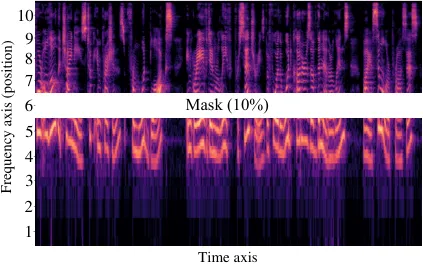 |
|   (a)                                                     |

|        |
| ------ |
|        |
|    (b) |

|       |
| ----- |
|       |
| \(c\) |

Fig. 9: (a) Visual example of the spectrogram with 10% masked. (b)
Watermark extraction accuracy when different frequency bands of the
spectrogram are masked. (c) Speech quality when different frequency
bands of the spectrogram are masked.

Fig. 10: The performance of our method against different frequency
masking ratios. Black dots and white dots indicate mean ACC and median
ACC, respectively. The green triangles represents the average SECS
values of synthesized speech, while the green line indicates the bypass
authentication line.

Voice Cloning Attack with Partial Unwatermarked Data. The attacker may
have access to some unwatermarked speech data of the target speaker. To
explore the effectiveness of our approach in such a scenario, we train
speech synthesis models on datasets with different watermark ratios. To
expedite the experimental process, we use the end-to-end speech
synthesis model, VITS \[30\], as the default attack model. Fig. 8 shows
the corresponding watermark extraction accuracy. We observe that with a
higher ratio of watermarked speech dataset, the synthesized speech
contains more complete watermark information. A 75% ratio of watermarked
speech data is sufficient to achieve an extraction accuracy of over 95%
(96.38%) in synthesized speech, while only a 25 % ratio of watermarked
speech data can still retain 66.36% of watermark information, which is
still effective in detecting such adaptive attack.

| Method         | PESQ$`\uparrow`$ | SECS$`\uparrow`$ | wm1-ACC$`\uparrow`$     | wm2-ACC$`\downarrow`$   | wm2-ACC#$`\downarrow`$  |
| -------------- | ---------------- | ---------------- | ----------------------- | ----------------------- | ----------------------- |
| FSVC \[23\]    | 1.0334           | 0.9115           | 1.0000 ($`\checkmark`$) | 0.4000 ($`\times`$)     | 0.5544 ($`\times`$)     |
| RFDLM \[21\]   | 1.0727           | 0.9102           | 1.0000 ($`\checkmark`$) | 0.4000 ($`\times`$)     | 0.4986 ($`\times`$)     |
| The Proposed   | 0.9891           | 0.8968           | 0.4000 ($`\times`$)     | 1.0000 ($`\checkmark`$) | 1.0000 ($`\checkmark`$) |
| The Proposed\* | 0.9951           | 0.8789           | 0.9346 ($`\checkmark`$) | 0.4646 ($`\times`$)     | 1.0000 ($`\checkmark`$) |

TABLE V: Robustness against watermark overwriting attacks. \# indicates
that the attacker extracts the watermark by his own extractor. \*
indicates that the attacker trains his own embedding and extraction
models guided by the proposed method.

Watermark Overwriting Attack. With the collected watermarked audio data,
the attacker can further embed his own watermark before conducting the
voice cloning attack. In our threat model, voice cloning attacks are
detected by the platform’s extractor. Nevertheless, we also show the
results based on the attacker’s extractor. Specifically, we embed the
original watermark (wm1) using our proposed method. To further embed the
attacker’s watermark (wm2), we first adopt existing audio watermarking
schemes FSVC \[23\] and RFDLM \[21\]. As shown in Table V, the original
watermark can still be extracted as the evidence of voice cloning
attacks, while the attacker fails to extract his watermark. This is
because FSVC \[23\] and RFDLM \[21\] are fragile to voice cloning
attacks, which do not interrupt our watermark signal during the attacks.

In addition, we further assume that the attacker can utilize our
proposed method for watermark overwriting. If the attacker is an insider
malicious user, he can directly utilize the well-trained embedding and
extraction models by our method. Otherwise, he can train his own model
with the proposed strategy, which is denoted as “the proposed \*” in
Table V. The results show that our method will fail to resist the
overwriting attack only when an inner attacker exists. To address this
issue, we further design a weighted embedding process, which is
controlled by the subsequent watermark decoder, and add the watermark
overwriting distortion in the original distortion layer to fine-tune the
model. As shown in Table X, the new strategy will not degrade the audio
quality and achieve a 100% ACC against overwriting attacks. More details
are in Appx. A-B3.

Audio Reconstruction-based Removal Attacks.   We try to compromise the
watermark by audio reconstruction, i.e., the adaptive attacker may try
to train a reconstruction model with many watermarked-unwatermarked data
pairs. For the audio reconstruction model, we adopt the state-of-the-art
popular MelVAE²² 2
[https://github.com/moiseshorta/MelSpecVAE](https://github.com/moiseshorta/MelSpecVAE).
For data pairs, we use 10, 000 audios from Librispeech \[62\] as
non-watermarked audio, and embed random watermarks into them by the
proposed method to obtain the corresponding watermarked audio. Then, we
train MelVAE with such data pairs in a supervised manner, aiming to
transform watermarked audio into non-watermarked one. We observe that
such an audio reconstruction model can only produce speech with poor
quality (some samples are shown on our web page). Nevertheless, the
accuracy of watermark extraction can still reach 74.90%.

Besides, we consider an existing audio watermark removal attack using a
Variational Autoencoder (VAE) pre-trained on a clean audio dataset
\[50\] and test our method under such an attack. Specifically, we use
the VAE of the audio generation model \[68\] for the reconstruction
operation. Note that, as described by the authors, this VAE was trained
on AudioSet (AS) \[69\], AudioCaps (AC) \[70\], Freesound (FS)³³ 3
[https://freesound.org/](https://freesound.org/), and BBC Sound Effect
library (SFX)⁴⁴ 4
[https://sound-effects.bbcrewind.co.uk/search](https://sound-effects.bbcrewind.co.uk/search),
and exhibits good audio generation quality. Based on the experimental
results in Fig. 17, we can see that while VAE reconstruction indeed has
some effect on the watermark, it is almost unable to erase it (Average
ACC:100% $`\rightarrow`$ 99.98%). Fig. 20 shows two examples of the
effect of VAE reconstruction on the audio signal. The reconstructed
speech samples and the samples cloned based on them are accessible on
our web page.

Identifying Watermark Location and then Removing It. As illustrated in
Fig. 9-a, we apply a 10% frequency band masking operation to different
frequency locations (from bottom to top) of the watermarked speech
spectrogram.

In Fig. 9-b, we present the watermark extraction accuracy obtained
directly from both the masked spectrogram (Spec-ACC) and after
re-extracting the spectrogram from the ISTFT-transformed audio signal
(Wave-ACC). Based on experimental results, we find that masking at the
medium-to-low frequency range (i.e., Position 2 and 3) has the most
significant impact on the watermark extraction ability, and conjecture
the watermark is primarily embedded in the medium-to-low frequency
range.

Therefore, we conduct an adaptive attack: masking such frequency range
as preprocessing before voice cloning, and then adopting VITS \[30\] to
launch the attack. The results prove that this adaptive attack still
cannot defeat our method: watermark extraction accuracy from synthesized
speeches is $`100\%`$ (masking position2) and $`92.14\%`$ (masking
position3). Fig. 9-c shows the impact of masking at different locations
on the audio quality (SNR, PESQ, SECS). We find that masking at lower
frequencies has a more severe effect on the audio quality, and masking
at Positions 2 and 3 has a particularly significant impact. As the
masked frequency range increases, the audio quality improves. To remove
watermarks strongly, we try masking more frequency bands of the
spectrogram (from high to low frequencies). We gradually increase the
percentage of the mask from the top of the spectrogram, since masking
low frequencies introduces a very serious quality loss. As shown in
Fig. 10, as the mask ratio increases from 10% to 90%, although the ACC
degrades from 100% to near 70%, the audio quality is also destroyed by a
large margin (SECS from 1.0 to 0.1). For a more comprehensive
evaluation, we further adopt 5% and 20% masking ratios. The
corresponding results are shown in Fig. 18 of Appx. A-C, which are
consistent with the results with a 10% masking ratio.

Voice Cloning Attack with Public Extractor. Because the extractor is
publicly released by the platform, the attacker can attempt to generate
audios to bypass it. In practice, the extractor may be packaged as an
API, and the attacker only knows whether the generated audio deceives
the extractor. To simulate this scenario, the attacker can first train a
binary classifier to distinguish the watermarked and unwatermarked data.
With the well-trained classifier, he is able to train his TTS model
constrained by a domain adversarial loss, which forces the model to
output unwatermarked data. We find such a strategy (i.e.,
domain-adversarial training) will degrade the performance of the TTS
model (SECS from 0.9014 to 0.8844), while our method can still achieve
100% extraction accuracy.

Combing Multiple Attack Strategies. We further consider combining
different attack strategies to destroy the proposed method. This entails
the integration of diverse attack schemes, encompassing regular
preprocessing, harmful preprocessing, domain-adversarial training, VAE
reconstruction and watermark overwriting. In a ntushell, more severe
attack strategies will further destroy the utility of voice cloning,
while the proposed method is still somewhat effective. For example,
taking resampling 16 kHz as pre-processing and MP3 compression 16 kbps
as post-processing, compared with only pre-processing, ACC suffers a
slight degradation (ACC:100% $`\rightarrow`$ 99.94%) but the quality
degrades by a large margin (SECS: 1.000 $`\rightarrow`$ 0.8575). The
specific experimental results can be found on the paper’s website.

|                          |          |                  |         |        |        |        |        |        |
| ------------------------ | -------- | ---------------- | ------- | ------ | ------ | ------ | ------ | ------ |
| Service                  | Language | Metric           | Speaker |        |        |        |        |        |
|                          |          |                  | P225    | P226   | P227   | P228   | P229   | P230   |
|                          |          | PESQ$`\uparrow`$ | 2.5958  | 2.7235 | 2.3573 | 2.3235 | 2.7419 | 1.7095 |
|                          |          | SECS$`\uparrow`$ | 0.8611  | 0.8701 | 0.8552 | 0.8537 | 0.8592 | 0.8519 |
|                          | English  | ACC$`\uparrow`$  | 1.0000  | 1.0000 | 1.0000 | 1.0000 | 1.0000 | 1.0000 |
|                          |          |                  | D4      | D6     | D7     | D8     | D11    | D12    |
|                          |          | PESQ$`\uparrow`$ | 1.7642  | 1.9851 | 2.6490 | 2.0223 | 2.3808 | 1.2313 |
|                          |          | SECS$`\uparrow`$ | 0.7836  | 0.8034 | 0.7622 | 0.8219 | 0.7304 | 0.7103 |
| PaddleSpeech \[71\]      | Chinese  | ACC$`\uparrow`$  | 1.0000  | 1.0000 | 1.0000 | 1.0000 | 1.0000 | 1.0000 |
|                          |          |                  | P225    | P226   | P227   | P228   | P229   | P230   |
|                          |          | PESQ$`\uparrow`$ | 0.7809  | 1.5610 | 1.1913 | 1.1684 | 1.2601 | 1.2694 |
|                          |          | SECS$`\uparrow`$ | 0.7576  | 0.8564 | 0.7324 | 0.8781 | 0.8495 | 0.8799 |
| Voice-Cloning-App \[27\] | English  | ACC$`\uparrow`$  | 0.9000  | 0.9100 | 0.9000 | 0.9000 | 0.9500 | 0.9200 |

TABLE VI: The performance of our proposed method against voice cloning
attacks on commercial platforms.

### V-F Practicality in Real-world Services

In practice, the attacker may directly leverage real-world services to
conduct voice cloning attacks in an efficient and convenient way.
Specifically, he can collect a small number of the target speaker’s
voice samples and upload them to real-world services to implement
customized voice cloning based on their instructions. When the collected
voice samples have been watermarked by our method, we are able to
extract the watermark information from the synthetic voice. We test both
real-world TTS service and voice conversion service.

|            |                  | Fastspeech2\* \[8\] |                    | Tacotron2\* \[36\] |                    |               |
| ---------- | ---------------- | ------------------- | ------------------ | ------------------ | ------------------ | ------------- |
| Model      | Metric           | Hifi-GAN \[40\]     | Griffin-Lim \[38\] | Hifi-GAN \[40\]    | Griffin-Lim \[38\] | VITS\* \[30\] |
|            | PESQ$`\uparrow`$ | 1.0238              | 1.0765             | 1.2018             | 1.3184             | 1.0299        |
|            | SECS$`\uparrow`$ | 0.8996              | 0.7152             | 0.8858             | 0.7025             | 0.9173        |
| DBWM       | ACC$`\uparrow`$  | 0.6508              | 0.6136             | 0.6854             | 0.6108             | 1.0000        |
|            | PESQ$`\uparrow`$ | 1.0770              | 1.1224             | 1.1350             | 1.2342             | 1.0561        |
|            | SECS$`\uparrow`$ | 0.8958              | 0.7075             | 0.8440             | 0.7083             | 0.9014        |
| Full Model | ACC$`\uparrow`$  | 0.9978              | 1.0000             | 0.9998             | 1.0000             | 1.0000        |

TABLE VII: Robustness comparison between Distortion-Blind Watermarking
Model (DBWM) and Full Model against different voice cloning attacks. The
red, blue, and gray areas represent professional, regular, and
low-quality voice cloning attacks, respectively. The quality of
synthesized speech is also provided.

Real-world TTS Service.   We employ two widely-used speech synthesis
tools, PaddleSpeech \[71\] and Voice-Cloning-App \[27\], to conduct
voice cloning attacks in a black-box way. For PaddleSpeech, we use the
tool through the Baidu Paddle AI Studio platform \[26\]. The attacker
can easily fine-tune the speech synthesis model and customize the cloned
voice of the target speaker with just a few clicks. For
Voice-Cloning-App \[27\], we use the released executable software
provided by the author, following the software’s documentation for voice
cloning. For both services, the attacker only needs 10 segments of the
target speaker’s speech within 10 seconds. Additionally, we follow the
work \[16\] by using 10 segments of texts as input for the synthesized
speech (listed in Table XII and Table XIII in the Appendix). We extract
watermarks from the synthesized speech and verify the extraction
accuracy as well as the quality of the synthesized speech. For
comprehensive evaluation, we test multiple speakers (p225 $`\sim`$ p230,
the first six speakers) from the VCTK dataset \[72\]. To explore the
efficacy of our approach in different languages, we also select the
first six speakers (D4, D6, D7, D8, D11, D12) from the THCHS30 \[73\]
test set and test the more challenging Chinese voice cloning scenario
using the PaddleSpeech tool, an open source tool that additionally
supports Chinese besides English.

Table VI presents the evaluation results. Specifically, for PaddleSpeech
\[71\], the quality of the synthesized voice is considerably superior.
We can achieve an exceptional watermark extraction accuracy
($`ACC=100\%`$). For Voice-Cloning-App \[27\], although the quality of
the synthesized voice is inferior, the watermark extraction accuracy is
still maintained at a satisfactory level ($`ACC>=90\%`$), which further
substantiates the outstanding effectiveness of the proposed watermarking
methodology. The synthesized speech samples from these services can be
found on our project website.

Real-world Voice Conversion Service.   Very recently, the voice
conversion service so-vits-svc \[28\] becomes increasingly popular for
singing song synthesis. Thus, we also try our method in such a scenario
and validate its effectiveness. Specifically, we use the first $`30`$
singing voices (around $`5s`$ per voice) from the Opencpop dataset
\[74\], embed watermarks in them, and then use these voices to train
so-vits-svc according to the instruction document. After that, we use
the trained model to perform voice conversion on a song. Here, we use
the original song “Right Here Waiting” from Richard Marx \[75\], and use
Ultimate Vocal Remover \[76\] to remove the background music. Then, we
divide it into $`24`$ segments ($`10s`$ per segment) and perform the
voice conversion for each segment. The vocal data are available on our
website. The final extraction accuracy of each segment of the
synthesized vocals is $`100\%`$, which further proves the effectiveness
of our method in real speech cloning scenarios.

Fig. 11: The fidelity of our method with different embedded watermark
bits. Green triangles represent the mean values and red lines indicate
the median values.

Fig. 12: Watermark extraction accuracy of our method with different
embedded watermark bits. Black dots and white dots indicate mean
accuracy and median accuracy, respectively, while green triangles
represent the average SECS values of synthesized speech.

### V-G Ablation Study

Influence of Watermark Bits.   To investigate the impact of the
watermark length, we attempt to embed bit strings of varying lengths (5
bits, 10 bits, 30 bits, 60 bits, 100 bits, 200 bits) in the carrier
audio and utilize VITS \[30\] as the default voice cloning attack model.
Fig. 11 shows the impact of different watermark bits on the quality of
the watermarked speech. As we can see, embedding more bits leads to a
decrease in fidelity, but this trend is not significant, especially for
the impact on timbre (SECS). This means that we can flexibly choose the
embedding capacity for different scenarios. Fig. 12 further shows the
watermark extraction accuracy ACC under the voice cloning attacks. As
the number of embedded bits increases, ACC still keeps near 100%, except
when the embedded watermark bits is extremely large, i.e., 200 bits,
where ACC is also higher than 95%.

Fig. 13: Fidelity comparison between Full Model and the Distortion-Blind
Watermarking Model (DBWM). Green triangles represent the mean values and
red lines indicate the median values.

Importance of Distortion Layer.   To investigate the effectiveness of
the modeled distortion layer, we remove it from our framework (as shown
in Fig. 4) and only jointly train watermark embedding and extraction to
obtain a Distortion-Blind Watermarking Model (DBWM). As illustrated in
Fig. 13, DBWM exhibits better fidelity compared to the complete
watermarking model (i.e., “Full Model”). Table VII also indicates that
the robustness of DBWM will significantly decrease in the scenarios of
regular and low-quality voice cloning attacks. This demonstrates that
our framework without the distortion layer can achieve certain
robustness against specific voice cloning attacks, and the appended
distortion layer during training can further enhance the generalized
robustness against more attacks. More results are displayed in
Appx. A-B2 with a consistent conclusion. In Appx. A-C, we also provide
ablation studies on the skip concatenation and the masking ratio.

## VI Discussion

### VI-A Comparison with Existing Audio Watermarking Methods

To comprehensively showcase the efficacy of the proposed scheme, we
conducted a comparative analysis with existing watermarking schemes. We
use RFDLM \[21\], FSVC \[23\], and the proposed method to embed
watermarks on the speech respectively, and then extract the watermarks
from the synthesized speech based on the TTS model trained on this
speech data respectively (VITS \[30\] is utilized as the default voice
cloning attack model). As shown in Table VIII, the existing audio
watermarking schemes cannot resist the TTS model learning process and
the watermarks cannot be retained in the synthesized speech, while the
proposed scheme is better at retaining the watermark information.

### VI-B Embedding Different Watermarks for Verison Information

In practice, the watermark may contain not only static information like
names but also dynamic information like versions. In such a scenario,
the collected audio by the attacker may have different watermarks, but
we still want to extract the ownership information from the synthesized
audio. To achieve it, we split the watermark bit string into two parts,
where the former part includes static information and the latter part
includes dynamic information. We watermark the original audio with two
watermarks, whose former parts are the same while the latter parts are
randomly different. Then, we adopt VITS for voice cloning attacks. As
expected, we can extract the former static information with a 100% ACC.
Similarly, we can easily replace version information with platform
information to address the issue of multiple platforms. In Appx. A-A, we
provide more discussion on comparison with passive detection and the
extension to the physical world.

| Method       | syn PESQ$`\uparrow`$ | syn SECS$`\uparrow`$ | wm SNR$`\uparrow`$ | wm ACC$`\uparrow`$      |
| ------------ | -------------------- | -------------------- | ------------------ | ----------------------- |
| FSVC \[23\]  | 0.9949               | 0.9139               | 21.1282            | 0.5554 ($`\times`$)     |
| RFDLM \[21\] | 1.0303               | 0.9179               | 19.4668            | 0.5096 ($`\times`$)     |
| The Proposed | 1.0342               | 0.9085               | 28.1650            | 1.0000 ($`\checkmark`$) |

TABLE VIII: Comparison with traditional audio watermarking methods
against voice cloning attacks. ‘syn’ indicates metrics related to
synthesized speech quality, while ‘wm’ represents metrics related to
watermark embedding and extraction.

## VII Conclusion

In the era of the Ear Economy, it is necessary to establish safeguards
against the potential misuse of voice cloning technology. To this end,
we propose a novel concept of “Timbre Watermarking”, based on which we
design an end-to-end voice cloning detection framework. In this
framework, we tailor the watermark encoding with a repeated embedding
strategy to obtain the inherent robustness against distortions in the
time domain. In addition, we investigate different voice cloning attacks
and find their shared process, i.e., normalization distortion,
transformation distortion, and wave reconstruction distortion. Then, we
incorporate them as a distortion layer into our framework to acquire
generalization across different voice cloning attacks. Extensive
experiments demonstrate that the proposed “Timbre Watermarking” can
achieve high robustness against common speech preprocessing distortions
such as cropping, while also withstanding various voice cloning attacks
and maintaining usability in real-world services such as PaddleSpeech,
Voice-Cloning-App, and so-vits-svc. Moreover, we conduct ablation
studies to explore the influence of watermark bits and the distortion
layer. We expect our framework can shed some light on the future
research of voice cloning detection and timbre protection.

## Acknowledgement

We thank anonymous reviewers for their constructive feedback. This work
was supported in part by the Natural Science Foundation of China under
Grant 62072421, 62002334, 62102386, 62121002, U20B2047 and Singapore
Ministry of Education (MOE) AcRF Tier 2 MOE-T2EP20121-0006.

## References

- \[1\] Spotify,
  [https://newsroom.spotify.com/](https://newsroom.spotify.com/).
- \[2\] Audible, [https://www.audible.com/](https://www.audible.com/).
- \[3\] Himalaya,
  [https://www.himalaya.com/](https://www.himalaya.com/).
- \[4\] SoundCloud, [https://soundcloud.com/](https://soundcloud.com/).
- \[5\] T. Kaneko, H. Kameoka, K. Tanaka, and N. Hojo, “Cyclegan-vc2:
  Improved cyclegan-based non-parallel voice conversion,” in _ICASSP
  2019-2019 IEEE International Conference on Acoustics, Speech and
  Signal Processing (ICASSP)_. IEEE, 2019, pp. 6820–6824.
- \[6\] K. Qian, Y. Zhang, S. Chang, X. Yang, and M. Hasegawa-Johnson,
  “Autovc: Zero-shot voice style transfer with only autoencoder loss,”
  in _International Conference on Machine Learning_. PMLR, 2019, pp.
  5210–5219.
- \[7\] Y. Wang, R. Skerry-Ryan, D. Stanton, Y. Wu, R. J. Weiss,
  N. Jaitly, Z. Yang, Y. Xiao, Z. Chen, S. Bengio _et al._, “Tacotron:
  Towards end-to-end speech synthesis,” _arXiv preprint
  arXiv:1703.10135_, 2017.
- \[8\] Y. Ren, C. Hu, X. Tan, T. Qin, S. Zhao, Z. Zhao, and T.-Y. Liu,
  “Fastspeech 2: Fast and high-quality end-to-end text to speech,”
  _arXiv preprint arXiv:2006.04558_, 2020.
- \[9\] S. Ö. Arık, M. Chrzanowski, A. Coates, G. Diamos, A. Gibiansky,
  Y. Kang, X. Li, J. Miller, A. Ng, J. Raiman _et al._, “Deep voice:
  Real-time neural text-to-speech,” in _International conference on
  machine learning_. PMLR, 2017, pp. 195–204.
- \[10\] A. v. d. Oord, S. Dieleman, H. Zen, K. Simonyan, O. Vinyals,
  A. Graves, N. Kalchbrenner, A. Senior, and K. Kavukcuoglu, “Wavenet: A
  generative model for raw audio,” _arXiv preprint
  arXiv:1609.03499_, 2016.
- \[11\] Fortune, “Artificial intelligence makes voice cloning easy and
  ‘the monster is already on the loose,”
  [https://fortune.com/2023/02/11/artificial-intelligence-makes-voice-cloning-easy-and-the-monster-is-already-on-the-loose/](https://fortune.com/2023/02/11/artificial-intelligence-makes-voice-cloning-easy-and-the-monster-is-already-on-the-loose/).
- \[12\] M. E. Ahmed, I.-Y. Kwak, J. H. Huh, I. Kim, T. Oh, and H. Kim,
  “Void: A fast and light voice liveness detection system,” in
  _Proceedings of the 29th USENIX Conference on Security Symposium_,
  2020, pp. 2685–2702.
- \[13\] H. Gao, H. Liu, D. Yao, X. Liu, and U. Aickelin, “An audio
  captcha to distinguish humans from computers,” in _2010 Third
  International Symposium on Electronic Commerce and Security_. IEEE,
  2010, pp. 265–269.
- \[14\] A. Lieto, D. Moro, F. Devoti, C. Parera, V. Lipari,
  P. Bestagini, and S. Tubaro, “” hello? who am i talking to?” a shallow
  cnn approach for human vs. bot speech classification,” in _ICASSP
  2019-2019 IEEE International Conference on Acoustics, Speech and
  Signal Processing (ICASSP)_. IEEE, 2019, pp. 2577–2581.
- \[15\] R. Wang, F. Juefei-Xu, Y. Huang, Q. Guo, X. Xie, L. Ma, and
  Y. Liu, “Deepsonar: Towards effective and robust detection of
  ai-synthesized fake voices,” in _Proceedings of the 28th ACM
  international conference on multimedia_, 2020, pp. 1207–1216.
- \[16\] E. Wenger, M. Bronckers, C. Cianfarani, J. Cryan, A. Sha,
  H. Zheng, and B. Y. Zhao, “” hello, it’s me”: Deep learning-based
  speech synthesis attacks in the real world,” in _Proceedings of the
  2021 ACM SIGSAC Conference on Computer and Communications Security_,
  2021, pp. 235–251.
- \[17\] C.-y. Huang, Y. Y. Lin, H.-y. Lee, and L.-s. Lee, “Defending
  your voice: Adversarial attack on voice conversion,” in _2021 IEEE
  Spoken Language Technology Workshop (SLT)_. IEEE, 2021, pp. 552–559.
- \[18\] J. Zhang, D. Chen, J. Liao, H. Fang, W. Zhang, W. Zhou, H. Cui,
  and N. Yu, “Model watermarking for image processing networks,” in
  _Proceedings of the AAAI conference on artificial intelligence_,
  vol. 34, no. 07, 2020, pp. 12 805–12 812.
- \[19\] J. Zhang, D. Chen, J. Liao, W. Zhang, H. Feng, G. Hua, and
  N. Yu, “Deep model intellectual property protection via deep
  watermarking,” _IEEE Transactions on Pattern Analysis and Machine
  Intelligence_, vol. 44, no. 8, pp. 4005–4020, 2021.
- \[20\] J. Zhao, T. Zong, Y. Xiang, L. Gao, G. Hua, K. Sood, and
  Y. Zhang, “Ssvs-ssvd based desynchronization attacks resilient
  watermarking method for stereo signals,” _IEEE/ACM Transactions on
  Audio, Speech, and Language Processing_, vol. 31, pp. 448–461, 2022.
- \[21\] Z. Liu, Y. Huang, and J. Huang, “Patchwork-based audio
  watermarking robust against de-synchronization and recapturing
  attacks,” _IEEE transactions on information forensics and security_,
  vol. 14, no. 5, pp. 1171–1180, 2018.
- \[22\] Z. Su, G. Zhang, F. Yue, L. Chang, J. Jiang, and X. Yao,
  “Snr-constrained heuristics for optimizing the scaling parameter of
  robust audio watermarking,” _IEEE Transactions on Multimedia_,
  vol. 20, no. 10, pp. 2631–2644, 2018.
- \[23\] J. Zhao, T. Zong, Y. Xiang, L. Gao, W. Zhou, and G. Beliakov,
  “Desynchronization attacks resilient watermarking method based on
  frequency singular value coefficient modification,” _IEEE/ACM
  Transactions on Audio, Speech, and Language Processing_, vol. 29, pp.
  2282–2295, 2021.
- \[24\] C. Liu, J. Zhang, H. Fang, Z. Ma, W. Zhang, and N. Yu, “Dear: A
  deep-learning-based audio re-recording resilient watermarking,” _arXiv
  preprint arXiv:2212.02339_, 2022.
- \[25\] K. Pavlović, S. Kovačević, I. Djurović, and A. Wojciechowski,
  “Robust speech watermarking by a jointly trained embedder and detector
  using a dnn,” _Digital Signal Processing_, vol. 122, p. 103381, 2022.
- \[26\] PaddleSpeech,
  [https://aistudio.baidu.com/aistudio](https://aistudio.baidu.com/aistudio).
- \[27\] Voice-Cloning-App,
  [https://github.com/BenAAndrew/Voice-Cloning-App](https://github.com/BenAAndrew/Voice-Cloning-App).
- \[28\] so-vits svc,
  [https://github.com/svc-develop-team/so-vits-svc](https://github.com/svc-develop-team/so-vits-svc).
- \[29\] C. Mansfield, M. Sun, Y. Liu, A. Gandhe, and B. Hoffmeister,
  “Neural text normalization with subword units,” in _Proceedings of the
  2019 Conference of the North American Chapter of the Association for
  Computational Linguistics: Human Language Technologies, Volume 2
  (Industry Papers)_, 2019, pp. 190–196.
- \[30\] J. Kim, J. Kong, and J. Son, “Conditional variational
  autoencoder with adversarial learning for end-to-end text-to-speech,”
  in _International Conference on Machine Learning_. PMLR, 2021, pp.
  5530–5540.
- \[31\] A. J. Hunt and A. W. Black, “Unit selection in a concatenative
  speech synthesis system using a large speech database,” in _1996 IEEE
  International Conference on Acoustics, Speech, and Signal Processing
  Conference Proceedings_, vol. 1. IEEE, 1996, pp. 373–376.
- \[32\] A. W. Black and P. A. Taylor, “Automatically clustering similar
  units for unit selection in speech synthesis.” 1997.
- \[33\] K. Tokuda, Y. Nankaku, T. Toda, H. Zen, J. Yamagishi, and
  K. Oura, “Speech synthesis based on hidden markov models,”
  _Proceedings of the IEEE_, vol. 101, no. 5, pp. 1234–1252, 2013.
- \[34\] T. Toda and K. Tokuda, “A speech parameter generation algorithm
  considering global variance for hmm-based speech synthesis,” _IEICE
  TRANSACTIONS on Information and Systems_, vol. 90, no. 5, pp.
  816–824, 2007.
- \[35\] W. Ping, K. Peng, A. Gibiansky, S. O. Arik, A. Kannan,
  S. Narang, J. Raiman, and J. Miller, “Deep voice 3: 2000-speaker
  neural text-to-speech,” _proc. ICLR_, pp. 214–217, 2018.
- \[36\] J. Shen, R. Pang, R. J. Weiss, M. Schuster, N. Jaitly, Z. Yang,
  Z. Chen, Y. Zhang, Y. Wang, R. Skerrv-Ryan _et al._, “Natural tts
  synthesis by conditioning wavenet on mel spectrogram predictions,” in
  _2018 IEEE international conference on acoustics, speech and signal
  processing (ICASSP)_. IEEE, 2018, pp. 4779–4783.
- \[37\] Y. Ren, Y. Ruan, X. Tan, T. Qin, S. Zhao, Z. Zhao, and T.-Y.
  Liu, “Fastspeech: Fast, robust and controllable text to speech,”
  _Advances in neural information processing systems_, vol. 32, 2019.
- \[38\] D. Griffin and J. Lim, “Signal estimation from modified
  short-time fourier transform,” _IEEE Transactions on acoustics,
  speech, and signal processing_, vol. 32, no. 2, pp. 236–243, 1984.
- \[39\] R. Yamamoto, E. Song, and J.-M. Kim, “Parallel wavegan: A fast
  waveform generation model based on generative adversarial networks
  with multi-resolution spectrogram,” in _ICASSP 2020-2020 IEEE
  International Conference on Acoustics, Speech and Signal Processing
  (ICASSP)_. IEEE, 2020, pp. 6199–6203.
- \[40\] J. Kong, J. Kim, and J. Bae, “Hifi-gan: Generative adversarial
  networks for efficient and high fidelity speech synthesis,” _Advances
  in Neural Information Processing Systems_, vol. 33, pp.
  17 022–17 033, 2020.
- \[41\] X. Li, N. Li, C. Weng, X. Liu, D. Su, D. Yu, and H. Meng,
  “Replay and synthetic speech detection with res2net architecture,” in
  _ICASSP 2021-2021 IEEE international conference on acoustics, speech
  and signal processing (ICASSP)_. IEEE, 2021, pp. 6354–6358.
- \[42\] Y. Zhang, F. Jiang, and Z. Duan, “One-class learning towards
  synthetic voice spoofing detection,” _IEEE Signal Processing Letters_,
  vol. 28, pp. 937–941, 2021.
- \[43\] Y. Lin, W. H. Abdulla, Y. Lin, and W. H. Abdulla, “Audio
  watermarking techniques,” _Audio Watermark: A Comprehensive Foundation
  Using MATLAB_, pp. 51–94, 2015.
- \[44\] W.-N. Lie and L.-C. Chang, “Robust and high-quality time-domain
  audio watermarking based on low-frequency amplitude modification,”
  _IEEE transactions on multimedia_, vol. 8, no. 1, pp. 46–59, 2006.
- \[45\] S.-K. Lee and Y.-S. Ho, “Digital audio watermarking in the
  cepstrum domain,” _IEEE Transactions on Consumer Electronics_,
  vol. 46, no. 3, pp. 744–750, 2000.
- \[46\] M. D. Swanson, B. Zhu, A. H. Tewfik, and L. Boney, “Robust
  audio watermarking using perceptual masking,” _Signal processing_,
  vol. 66, no. 3, pp. 337–355, 1998.
- \[47\] G. Hua, J. Huang, Y. Q. Shi, J. Goh, and V. L. Thing, “Twenty
  years of digital audio watermarking—a comprehensive review,” _Signal
  processing_, vol. 128, pp. 222–242, 2016.
- \[48\] G. Zhang, L. Zheng, Z. Su, Y. Zeng, and G. Wang, “M-sequences
  and sliding window based audio watermarking robust against large-scale
  cropping attacks,” _IEEE Transactions on Information Forensics and
  Security_, 2023.
- \[49\] Y. Wang, J. Ye, and H. Wu, “Generating watermarked speech
  adversarial examples,” in _ACM Turing Award Celebration
  Conference-China (ACM TURC 2021)_, 2021, pp. 254–260.
- \[50\] X. Zhao, K. Zhang, Y.-X. Wang, and L. Li, “Generative
  autoencoders as watermark attackers: Analyses of vulnerabilities and
  threats,” _arXiv preprint arXiv:2306.01953_, 2023.
- \[51\] H. Özer, B. Sankur, and N. Memon, “An svd-based audio
  watermarking technique,” in _Proceedings of the 7th Workshop on
  Multimedia and Security_, 2005, pp. 51–56.
- \[52\] F. Kreuk, Y. Adi, B. Raj, R. Singh, and J. Keshet, “Hide and
  speak: Deep neural networks for speech steganography,” _arXiv preprint
  arXiv:1902.03083_, 2019.
- \[53\] S. Jiang, D. Ye, J. Huang, Y. Shang, and Z. Zheng,
  “Smartsteganogaphy: Light-weight generative audio steganography model
  for smart embedding application,” _Journal of Network and Computer
  Applications_, vol. 165, p. 102689, 2020.
- \[54\] F. Itakura, “Line spectrum representation of linear predictor
  coefficients of speech signals,” _The Journal of the Acoustical
  Society of America_, vol. 57, no. S1, pp. S35–S35, 1975.
- \[55\] G. Huang, Z. Liu, L. Van Der Maaten, and K. Q. Weinberger,
  “Densely connected convolutional networks,” in _Proceedings of the
  IEEE conference on computer vision and pattern recognition_, 2017, pp.
  4700–4708.
- \[56\] I. Goodfellow, J. Pouget-Abadie, M. Mirza, B. Xu,
  D. Warde-Farley, S. Ozair, A. Courville, and Y. Bengio, “Generative
  adversarial networks,” _Communications of the ACM_, vol. 63, no. 11,
  pp. 139–144, 2020.
- \[57\] Y. N. Dauphin, A. Fan, M. Auli, and D. Grangier, “Language
  modeling with gated convolutional networks,” in _International
  conference on machine learning_. PMLR, 2017, pp. 933–941.
- \[58\] K. He, X. Zhang, S. Ren, and J. Sun, “Deep residual learning
  for image recognition,” in _Proceedings of the IEEE conference on
  computer vision and pattern recognition_, 2016, pp. 770–778.
- \[59\] B. Xu, N. Wang, T. Chen, and M. Li, “Empirical evaluation of
  rectified activations in convolutional network,” _arXiv preprint
  arXiv:1505.00853_, 2015.
- \[60\] D. P. Kingma and J. Ba, “Adam: A method for stochastic
  optimization,” _arXiv preprint arXiv:1412.6980_, 2014.
- \[61\] K. Ito and L. Johnson, “The lj speech dataset,”
  [https://keithito.com/LJ-Speech-Dataset/](https://keithito.com/LJ-Speech-Dataset/), 2017.
- \[62\] V. Panayotov, G. Chen, D. Povey, and S. Khudanpur,
  “Librispeech: an asr corpus based on public domain audio books,” in
  _2015 IEEE international conference on acoustics, speech and signal
  processing (ICASSP)_. IEEE, 2015, pp. 5206–5210.
- \[63\] A. W. Rix, J. G. Beerends, M. P. Hollier, and A. P. Hekstra,
  “Perceptual evaluation of speech quality (pesq)-a new method for
  speech quality assessment of telephone networks and codecs,” in _2001
  IEEE international conference on acoustics, speech, and signal
  processing. Proceedings (Cat. No. 01CH37221)_, vol. 2. IEEE, 2001, pp.
  749–752.
- \[64\] E. Casanova, C. Shulby, E. Gölge, N. M. Müller, F. S.
  de Oliveira, A. C. Junior, A. d. S. Soares, S. M. Aluisio, and M. A.
  Ponti, “Sc-glowtts: an efficient zero-shot multi-speaker
  text-to-speech model,” _arXiv preprint arXiv:2104.05557_, 2021.
- \[65\] S. Choi, S. Han, D. Kim, and S. Ha, “Attentron: Few-shot
  text-to-speech utilizing attention-based variable-length embedding,”
  _arXiv preprint arXiv:2005.08484_, 2020.
- \[66\] C. Jemine, “Real-time-voice-cloning,” _University of Liége,
  Liége, Belgium_, 2019.
- \[67\] E. Cooper, C.-I. Lai, Y. Yasuda, F. Fang, X. Wang, N. Chen, and
  J. Yamagishi, “Zero-shot multi-speaker text-to-speech with
  state-of-the-art neural speaker embeddings,” in _ICASSP 2020-2020 IEEE
  International Conference on Acoustics, Speech and Signal Processing
  (ICASSP)_. IEEE, 2020, pp. 6184–6188.
- \[68\] H. Liu, Z. Chen, Y. Yuan, X. Mei, X. Liu, D. Mandic, W. Wang,
  and M. D. Plumbley, “Audioldm: Text-to-audio generation with latent
  diffusion models,” _arXiv preprint arXiv:2301.12503_, 2023.
- \[69\] J. F. Gemmeke, D. P. Ellis, D. Freedman, A. Jansen,
  W. Lawrence, R. C. Moore, M. Plakal, and M. Ritter, “Audio set: An
  ontology and human-labeled dataset for audio events,” in _2017 IEEE
  international conference on acoustics, speech and signal processing
  (ICASSP)_. IEEE, 2017, pp. 776–780.
- \[70\] C. D. Kim, B. Kim, H. Lee, and G. Kim, “Audiocaps: Generating
  captions for audios in the wild,” in _Proceedings of the 2019
  Conference of the North American Chapter of the Association for
  Computational Linguistics: Human Language Technologies_, 2019, pp.
  119–132.
- \[71\] H. Zhang, T. Yuan, J. Chen, X. Li, R. Zheng, Y. Huang, X. Chen,
  E. Gong, Z. Chen, X. Hu _et al._, “Paddlespeech: An easy-to-use
  all-in-one speech toolkit,” in _Proceedings of the 2022 Conference of
  the North American Chapter of the Association for Computational
  Linguistics: Human Language Technologies: System Demonstrations_,
  2022, pp. 114–123.
- \[72\] C. Veaux, J. Yamagishi, K. MacDonald _et al._, “Cstr vctk
  corpus: English multi-speaker corpus for cstr voice cloning toolkit,”
  _University of Edinburgh. The Centre for Speech Technology Research
  (CSTR)_, 2017.
- \[73\] D. Wang and X. Zhang, “Thchs-30: A free chinese speech corpus,”
  _arXiv preprint arXiv:1512.01882_, 2015.
- \[74\] Y. Wang, X. Wang, P. Zhu, J. Wu, H. Li, H. Xue, Y. Zhang,
  L. Xie, and M. Bi, “Opencpop: A high-quality open source chinese
  popular song corpus for singing voice synthesis,” _arXiv preprint
  arXiv:2201.07429_, 2022.
- \[75\] R. Marx,
  [https://en.wikipedia.org/wiki/Richard_Marx](https://en.wikipedia.org/wiki/Richard_Marx).
- \[76\] U. V. Remover,
  [https://ultimatevocalremover.com/](https://ultimatevocalremover.com/).
- \[77\] X. Yuan, Y. Chen, Y. Zhao, Y. Long, X. Liu, K. Chen, S. Zhang,
  H. Huang, X. Wang, and C. A. Gunter, “Commandersong: A systematic
  approach for practical adversarial voice recognition,” in _27th
  $`\{`$USENIX$`\}`$ Security Symposium ($`\{`$USENIX$`\}`$ Security 18)_, 2018, pp. 49–64.
- \[78\] Y. Chen, X. Yuan, J. Zhang, Y. Zhao, S. Zhang, K. Chen, and
  X. Wang, “Devil’s whisper: A general approach for physical adversarial
  attacks against commercial black-box speech recognition devices.” in
  _USENIX Security Symposium_, 2020, pp. 2667–2684.

## Appendix A Appendix

### A-A More Discussion

#### A-A1 Comparison with Passive Detection

Fig. 14: Comparison with state-of-the-art passive detection methods
(Void \[12\] and One-Class \[42\]). ROC curve against different voice
cloning attacks are displayed.

Fig. 15: An example of a 50% cropping with three strategies.

Fig. 16: The watermark extraction accuracy of DBWM when different
frequency bands of the spectrogram were masked.

Fig. 17: The performance of our method against voice cloning attacks
with (a) / without (b) VAE reconstruction preprocessing. Black dots and
white dots indicate mean value and median value, respectively.

(a)

 

(b)

(c) Mask 5%

(d) Mask 20%

Fig. 18: Watermark extraction accuracy and speech quality under 5% and
20% masking ratios.

Fig. 19: Cropping robustness of the proposed method with different
watermarking bits.

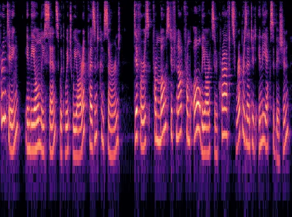

(a) Original

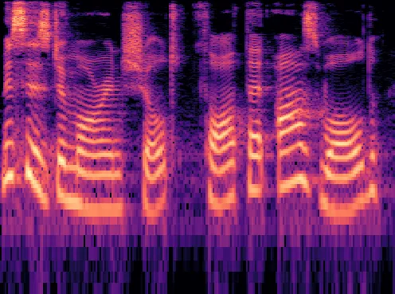

(b) Real

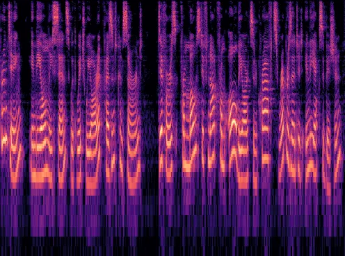

(c) Watermarked

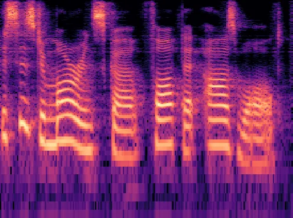

(d) Cloned after watermarking

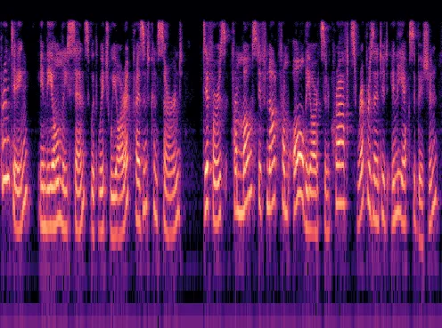

(e) VAE reconstructed

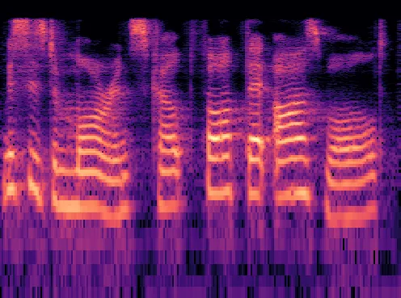

(f) Cloned after VAE reconstruction

Fig. 20: The influence of VAE reconstruction on watermarked speech and
cloned speech.

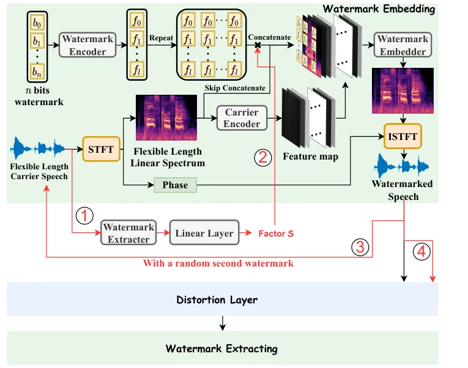

Fig. 21: Overview of overwriting-resilient timbre watermark framework.

As mentioned above, passive detection usually cannot generalize to
unseen synthesis methods. Two classic detection methods have been
proposed to address the generalization limitation of data distribution
and synthesis methods, namely, Void \[12\] and One-Class \[42\]. We
compare our method with these two detection approaches in terms of
generalization against different voice cloning attacks. We follow the
released unofficial code⁵⁵ 5
[https://github.com/chislab/void-voice-liveness-detection](https://github.com/chislab/void-voice-liveness-detection)
and official code⁶⁶ 6
[https://github.com/yzyouzhang/AIR-ASVspoof](https://github.com/yzyouzhang/AIR-ASVspoof)
to reproduce these passive detection solutions.

Specifically, we measure the detection performance of these methods
against different voice cloning attacks, where each attack generates 500
synthesized audios, respectively. For a fair comparison, we first divide
the suspicious audio into 5 segments and set the accuracy threshold to
90% for verification. We claim the detection is successful when all
segments pass the verification. As shown in Fig. 14, our method performs
well in all cases, while two passive detection methods have poor
performance ($`AUC<0.5`$) when facing synthesized audios generated by
VITS \[30\].

#### A-A2 Extension to the Physical World

In all the above experiments on voice cloning attacks, we consider that
we can obtain suspicious synthesized speech in the digital world, even
if the speech may be processed by some operations like MP3 compression.
However, in some scenarios, we cannot directly obtain the digital
version of the suspicious speech. Instead, we can only record the target
speech for subsequent verification, which can be further distorted after
the digital-physical-digital transformation. Fortunately, there are some
works on audio watermarking and adversarial examples \[77, 78, 24\],
which have demonstrated their effectiveness against such air-channel
transmission distortion. A feasible way is to integrate them into the
distortion layer to enhance robustness. We will explore this direction
in future work.

### A-B More Exploration on Robustness

#### A-B1 Robustness Against Cropping with Different Watermark Bits

We further investigate the robustness of cropping processing to various
watermark bit embedding quantities. As illustrated in Fig. 19, there
exists a trade-off between robustness and embedding capacity. Besides,
an example of a 50% cropping with different strategies are shown in
Fig. 15.

|                     |            |                 |                  |                  |                 |
| ------------------- | ---------- | --------------- | ---------------- | ---------------- | --------------- |
| Preprocessing       | Parameter  | Quality         |                  |                  | ACC$`\uparrow`$ |
|                     |            | SNR$`\uparrow`$ | PESQ$`\uparrow`$ | SECS$`\uparrow`$ |                 |
| Resampling          | 16 kHz     | 34.6674         | 4.4990           | 1.0000           | 0.9989          |
|                     | 8 kHz      | 16.6762         | 4.4986           | 0.9010           | 0.9169          |
| Amplitude Scaling   | 20%        | 1.9382          | 4.4905           | 0.9590           | 1.0000          |
|                     | 40%        | 4.4368          | 4.4968           | 0.9609           | 1.0000          |
|                     | 60%        | 7.9589          | 4.4983           | 0.9778           | 1.0000          |
|                     | 80%        | 13.9790         | 4.4989           | 0.9944           | 1.0000          |
| MP3 Compression     | 8 kbps     | 8.8171          | 2.1475           | 0.7591           | 0.6696          |
|                     | 16 kbps    | 12.8881         | 3.3003           | 0.9566           | 0.9337          |
|                     | 24 kbps    | 15.0170         | 3.8745           | 0.9890           | 0.9629          |
|                     | 32 kbps    | 17.0359         | 4.0114           | 0.9960           | 0.9967          |
|                     | 40 kbps    | 18.5867         | 4.1404           | 0.9975           | 0.9999          |
|                     | 48 kbps    | 20.6921         | 4.2821           | 0.9986           | 1.0000          |
|                     | 56 kbps    | 22.6389         | 4.3578           | 0.9990           | 1.0000          |
|                     | 64 kbps    | 23.7704         | 4.3913           | 0.9992           | 1.0000          |
| Recount             | 8 bps      | 22.8747         | 3.1435           | 0.9749           | 0.9041          |
| Median Filtering    | 5 Samples  | 14.3953         | 3.6013           | 0.9439           | 0.9714          |
|                     | 15 Samples | 8.6434          | 2.5087           | 0.7834           | 0.8750          |
|                     | 25 Samples | 5.2720          | 2.0886           | 0.7311           | 0.8183          |
|                     | 35 Samples | 3.1933          | 1.8187           | 0.6862           | 0.7701          |
| Low Pass Filtering  | 2000 Hz    | 12.4479         | 3.8828           | 0.7252           | 0.7924          |
| High Pass Filtering | 500 Hz     | 3.7917          | 3.8119           | 0.6578           | 1.0000          |
| Gaussian Noise      | 20 dB      | 20.0001         | 3.0382           | 0.9090           | 0.7937          |
|                     | 25 dB      | 24.9994         | 3.4303           | 0.9667           | 0.8965          |
|                     | 30 dB      | 29.9977         | 3.7862           | 0.9920           | 0.9577          |
|                     | 35 dB      | 34.9934         | 4.0553           | 0.9981           | 0.9874          |
|                     | 40 dB      | 39.9871         | 4.2515           | 0.9993           | 0.9966          |

TABLE IX: The impact of different preprocessing on speech quality and
the corresponding robustness of Distortion-Blind Watermarking Model
(DBWM).

#### A-B2 Robustness of DBWM

We further investigate the robustness of DBWM in relation to common
audio processing. As illustrated in Table IX, without the distortion
layer during training, the performance degrades in many cases. In
addition, we also investigate where watermarks are embedded by DBWM. We
conduct identical spectrogram masking experiments, as illustrated in
Fig. 16. The results reveal that DBWM predominantly embeds information
within higher frequencies.

#### A-B3 Countermeasurea Against Watermark Overwriting Attacks

As shown in Table V, an adaptive attacker with access to the watermark
encoder API can successfully conduct a self-overwriting attack using the
original model. To address it, we design a mechanism to resist watermark
overwriting of insider malicious users. We design a weighted embedding
process, which is controlled by the subsequent watermark decoder, and
add the watermark overwriting distortion in the original distortion
layer to fine-tune the model. The final enhanced model can resist the
re-watermark attack (ACC: 100%). The model structure is shown in
Fig. 21, which is composed of 4 steps: \raisebox{-0.9pt}{1}⃝ Extract the
weight factor $`S`$ from the audio to be watermarked;
\raisebox{-0.9pt}{2}⃝ Use factor $`S`$ to weight the watermark features
in the watermark embedding network; \raisebox{-0.9pt}{3}⃝ Input the
watermarked audio and a randomly generated second watermark into the
watermark embedding network; \raisebox{-0.9pt}{4}⃝ Input the watermark
overwritten audio into the distortion layer and proceed to subsequent
watermark extraction and network parameter optimization. We adopt VITS
as the Voice cloning model. The watermark extraction accuracy (ACC) and
the quality of all 500 synthesized speech are shown in Table X.
Experimental results show that the overwriting-resilient strategy can
resist watermark overwriting attacks even by internal attackers.

| Method                | PESQ$`\uparrow`$ | SECS$`\uparrow`$ | wm1-ACC$`\uparrow`$     | wm2-ACC$`\downarrow`$   |
| --------------------- | ---------------- | ---------------- | ----------------------- | ----------------------- |
| Default               | 0.9891           | 0.8968           | 0.4000 ($`\times`$)     | 1.0000 ($`\checkmark`$) |
| Overwriting-resilient | 1.0269           | 0.9145           | 1.0000 ($`\checkmark`$) | 0.4000 ($`\times`$)     |

TABLE X: The comparison of robustness against watermark overwriting
attacks between the default strategy and the overwriting-resilient
strategy.

### A-C More Ablation Studies

The Influence of Different Masking Ratios.    See Fig. 18.

### A-D Details of Network Architectures

Table XI shows the structure of the attacker’s watermark overwriting
model, where ReluBlock contains a convolutional layer, an InstanceNorm,
and the LeakyReLU activation function.

|                     |                    |                   |                    |
| ------------------- | ------------------ | ----------------- | ------------------ |
|                     | Groups             | Input channel/dim | Output channel/dim |
| Watermark Encoder   | Linear + LeakyReLU | wm_length         | 513                |
| Carrier Encoder     | ReluBlock          | 1                 | 64                 |
|                     | ReluBlock          | 64                | 64                 |
|                     | ReluBlock          | 64                | 64                 |
|                     | ReluBlock          | 64                | 64                 |
|                     | ReluBlock          | 64                | 64                 |
|                     | ReluBlock          | 64                | 64                 |
| Watermark Embedder  | ReluBlock          | 66                | 64                 |
|                     | ReluBlock          | 64                | 64                 |
|                     | ReluBlock          | 64                | 64                 |
|                     | ReluBlock          | 64                | 1                  |
| Watermark Extracter | ReluBlock          | 1                 | 64                 |
|                     | ReluBlock          | 64                | 64                 |
|                     | ReluBlock          | 64                | 64                 |
|                     | ReluBlock          | 64                | 64                 |
|                     | ReluBlock          | 64                | 64                 |
|                     | ReluBlock          | 64                | 1                  |
| Watermark Decoder   | Linear             | 513               | 1                  |
| Discriminator       | ReluBlock          | 1                 | 16                 |
|                     | ReluBlock          | 16                | 32                 |
|                     | ReluBlock          | 32                | 64                 |
|                     | Linear             | 64                | 1                  |

TABLE XI: The detailed structure of each sub-network of the attacker’s
model for watermark overwriting, where “wm_length” represents the length
of the watermark bits.

### A-E Phrases for Synthesis

Table XII and Table XIII list the English and Chinese phrases,
respectively, used for synthetic speech generation in real-life
scenarios using voice cloning tools.

| 1.  | There is, according to legend, a boiling pot of gold at one end.                                                                                                                   |
| --- | ---------------------------------------------------------------------------------------------------------------------------------------------------------------------------------- |
| 2.  | People look, but no one ever finds it.                                                                                                                                             |
| 3.  | Throughout the centuries people have explained the rainbow in various ways.                                                                                                        |
| 4.  | Some have accepted it as a miracle without physical explanation.                                                                                                                   |
| 5.  | To the Hebrews it was a token that there would be no more universal floods.                                                                                                        |
| 6.  | Since then physicists have found that it is not reflection, but refraction by the raindrops which causes the rainbows.                                                             |
| 7.  | Many complicated ideas about the rainbow have been formed.                                                                                                                         |
| 8.  | The difference in the rainbow depends considerably upon the size of the drops, and the width of the colored band increases as the size of the drops increases.                     |
| 9.  | If the red of the second bow falls upon the green of the first, the result is to give a bow with an abnormally wide yellow band, since red and green light when mixed form yellow. |
| 10. | This is a very common type of bow, one showing mainly red and yellow, with little or no green or blue.                                                                             |

TABLE XII: English phrases used for real-world services in Sec. V-F.

| 1.  | 正 因 为此 斯诺 曾 感触 颇 深 地说 鲁迅 虽 身材 瘦弱 矮小 但 和 鲁迅 在一起 你 必须 仰视 着 去 领会 那 崇高 的 思想     |
| --- | ----------------------------------------------------------------------------------------------------------------------- |
| 2.  | 韩 电 位于 西北 电网 末端 其 安全生产 对 该 电网 稳定 运行 有 重要意义                                                  |
| 3.  | 如果 下到 谷底 顿觉 寒气 袭人 抬头 四 顾 阴森森 的 土 壁 确有 群 魔 压 顶 的 惊心动魄 之 感                             |
| 4.  | 早稻 播种 和 育秧 的 天气 条件 有利 与否 与 这 一 期间 的 日 平均 温度 阴雨 日数 密切 相关                              |
| 5.  | 六年 来 神池 道情 剧团 台上 为 矿工 认真 演出 台下 义务 慰问 老 矿工                                                    |
| 6.  | 一群 如 火球 的 娃娃 便 滚动 进场 每人 持 两 朵 大 黄花 飞舞 似 风吹 花圃 静 立 若 菊园 吐 香                           |
| 7.  | 就 在 那 阴沟 旁边 却 高 高下 下放 着 几 盆花 也有 夹竹桃 也有 常青 的 盆栽                                             |
| 8.  | 昔日 的 高 母 村 七百 口 人 仅 光棍 汉 就 有 二百多 庄 户 人 穷 得 连 个 称 盐 打油 的 钱 也 没有                       |
| 9.  | 发射 约 二 十分钟 后 飞行 样机 打开 降落伞 溅 落在 北纬 二十 八度 五 十一分 东经 一百四十 三度 四十分 的 太平洋 海 面上 |
| 10. | 杭城 某 丝织 厂 一 位 沈 姓 姑娘 怀揣 一千 多元 钱 来到 濮 院 选购 羊毛衫                                               |

TABLE XIII: Chinese phrases used for PaddleSpeech \[26\] in Sec. V-F.
