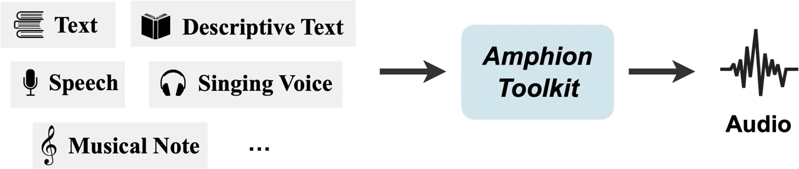
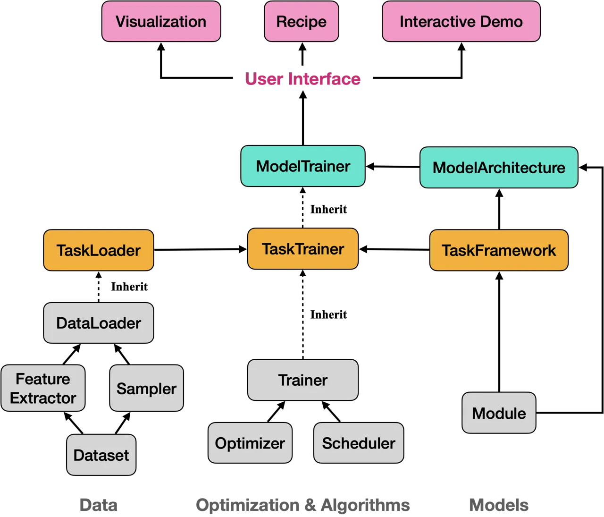

# Amphion: An Open-Source Audio, Music, and Speech Generation Toolkit

Xueyao Zhang^(1,⋆)   Liumeng Xue^(1,⋆)   Yicheng Gu^(1,⋆)   Yuancheng
Wang^(1,⋆)   Jiaqi Li^(1,⋆) Haorui He³   Chaoren Wang¹   Songting Liu³
  Xi Chen¹   Junan Zhang² Zihao Fang¹   Haopeng Chen¹   Tze Ying Tang¹
  Lexiao Zou³   Mingxuan Wang¹ Jun Han¹   Kai Chen²   Haizhou Li¹
  Zhizheng Wu^(1,2,3,‡) ^(†)^(†)thanks: ^(⋆) Equal
contribution.^(†)^(†)thanks: ^(‡) Correspondence to
wuzhizheng@cuhk.edu.cn.

###### Abstract

Amphion is an open-source toolkit for Audio, Music, and Speech
Generation, targeting to ease the way for junior researchers and
engineers into these fields. It presents a unified framework that
includes diverse generation tasks and models, with the added bonus of
being easily extendable for new incorporation. The toolkit is designed
with beginner-friendly workflows and pre-trained models, allowing both
beginners and seasoned researchers to kick-start their projects with
relative ease. The initial release of Amphion v0.1 supports a range of
tasks including Text to Speech (TTS), Text to Audio (TTA), and Singing
Voice Conversion (SVC), supplemented by essential components like data
preprocessing, state-of-the-art vocoders, and evaluation metrics. This
paper presents a high-level overview of Amphion. Amphion is open-sourced
at
[https://github.com/open-mmlab/Amphion](https://github.com/open-mmlab/Amphion).

###### Index Terms: 

Speech generation, audio generation, music generation, vocoder,
open-source software, audio toolkit

^(†)^(†)address: ¹ The Chinese University of Hong Kong, Shenzhen, China
² Shanghai AI Laboratory, Shanghai, China ³ Shenzhen Reseach Institute
of Big Data, Shenzhen, China

## 1 Introduction

The development of deep learning has greatly improved the performance of
generative models. Leveraging these models has enabled researchers and
practitioners to explore innovative possibilities, leading to notable
breakthroughs across various fields, including computer vision and
natural language processing. The potential in tasks related to audio,
music, and speech generation has spurred the scientific community to
actively publish new models and ideas \[1, 2\].

There is an increasing presence of both official and community-driven
open-source repositories that replicate these models. However, the
quality of repositories varies, and they are often scattered, focusing
on specific papers. These scattered repositories introduce several
obstacles to junior researchers or engineers who are new to the research
area. First, attempts to replicate an algorithm using different
implementations or configurations can result in inconsistent model
functionality or performance. Second, while many repositories focus on
the model architectures, they often neglect crucial steps such as
detailed data pre-processing, feature extraction, model training, and
systematic evaluation. This lack of systematic guidance poses
substantial challenges for beginners, who may have limited technical
expertise and experience in training large-scale models. In summary, the
scattered nature of these repositories hampers efforts towards
reproducible research and fair comparisons among models or algorithms.

Figure 1: The north-star goal of Amphion toolkit: “Any to Audio”.

Motivated by that, we introduce Amphion, an open-source platform
dedicated to the north-star objective of “Any to Audio” (Figure 1).
Amphion’s features are summarized as:

- •
  Unified Framework: Amphion provides a unified framework for audio,
  music, and speech generation and evaluation. It is designed to be
  adaptable, flexible, and scalable, supporting the integration of new
  models.
- •
  Beginner-Friendly Workflow: Amphion offers a beginner-friendly
  workflow with straightforward documentation and instructions. It
  establishes itself as an accessible one-stop research platform
  suitable for both novices and experienced researchers.
- •
  High-Quality Open Pre-trained Models: To promote reproducible
  research, Amphion commits to releasing high-quality pre-trained
  models. In partner with industry, we aim to make large-scale
  pre-trained models widely available for various applications.

The Amphion v0.1 toolkit¹¹ 1
[https://github.com/open-mmlab/Amphion](https://github.com/open-mmlab/Amphion),
now available under the MIT license, has supported a diverse array of
generation tasks. This paper presents a high-level overview of the
toolkit.

## 2 The Amphion Framework

The north-star goal of Amphion is to unify various audible waveform
generation tasks. From the perspective of input, we formulate audio
generation tasks into three categories,

1.  1.  Text to Waveform: The input consists of discrete textual tokens,
        which strictly constrain the content of the output waveform. The
        representative tasks include Text to Speech (TTS) and Singing Voice
        Synthesis (SVS)²² 2 The inputs to SVS can also be musical tokens
        such as MIDI notes. They are also discrete and function like textual
        inputs..
2.  2.  Descriptive Text to Waveform: The input consists of discrete textual
        tokens, which generally guide the content or style of the output
        waveform. The representative tasks include Text to Audio (TTA) and
        Text to Music (TTM).
3.  3.  Waveform to Waveform: Both the input and output are continuous
        waveform signals. The representative tasks include Voice Conversion
        (VC), Singing Voic Conversion (SVC), Emotion Conversion (EC), Accent
        Conversion (AC), and Speech Translation (ST).

### 2.1 System Architecture Design

Amphion is designed to be a single framework supporting audio, music,
and speech generation. Its system architecture design is presented in
Figure 2. From the bottom up,

1.  1.  The data processing (Dataset, Feature Extractor, Sampler, and
        DataLoader), optimization algorithms (Optimizer, Scheduler, and
        Trainer), and the common network modules (Module) are shared
        building blocks for all the audio generation tasks.
2.  2.  For each specific generation task, we unify its data/feature usage
        (TaskLoader), task framework (TaskFramework), and training pipeline
        (TaskTrainer).
3.  3.  Under each generation task, for every specific model, we specify its
        architecture (ModelArchitecture) and training pipeline
        (ModelTrainer).
4.  4.  Finally, we provide a recipe of each model for users. On top of
        pre-trained models, we also offer interactive demos for users to
        explore. Amphion also features educative visualizations of machine
        learning models. Interested readers could refer to \[3\] for a
        detailed description.

Figure 2: System architecture design of Amphion.

### 2.2 Audio Generation Tasks Support

Amphion v0.1 toolkit includes a representative from each of the three
generation task categories (namely TTS, TTA, and SVC) for integration.
This ensures that Amphion’s framework can be conveniently adaptable to
other audio generation tasks during future development.

Specifically, the pipelines of different audio tasks are designed as
follows:

- •
  Text to Speech: TTS aims to convert written text into spoken speech.
  Conventional multi-speaker TTS are only trained with
  carefully-curated, few-speaker datasets and only produces speech from
  the speaker pool \[1, 4\]. Recently, zero-shot TTS attracts more
  attentions from the research community. In addition to text, zero-shot
  TTS requires a reference audio as a prompt. By utilizing in-context
  learning techniques, it can imitate the timbre and speaking style of
  the reference audio \[2, 5\].
- •
  Text to Audio: TTA aims to generate sounds that are semantically in
  line with descriptions. It usually requires a pre-trained text encoder
  to capture the global information of the input descriptive text, and
  then utilizes an acoustic model, such as diffusion model \[6, 7\], to
  synthesize the acoustic features.
- •
  Singing Voice Conversion: SVC aims to transform the voice of a singing
  signal into the voice of a target singer while preserving the lyrics
  and melody. To empower the reference speaker to sing the source audio,
  the main idea is to extract the speaker-specific representations from
  the reference, extract the speaker-agnostic representations (including
  semantic and prosody features) from the source, and then synthesize
  the converted features using acoustic models \[8\].

|                                                                                                                                                                                                                                                                                                                                                                                                                 |                                                                                                                                                                                                                                                                                                                                                                                 |                                                                                                                                                                                                                                                                                                                                              |
| --------------------------------------------------------------------------------------------------------------------------------------------------------------------------------------------------------------------------------------------------------------------------------------------------------------------------------------------------------------------------------------------------------------- | ------------------------------------------------------------------------------------------------------------------------------------------------------------------------------------------------------------------------------------------------------------------------------------------------------------------------------------------------------------------------------- | -------------------------------------------------------------------------------------------------------------------------------------------------------------------------------------------------------------------------------------------------------------------------------------------------------------------------------------------- |
| Tasks, Open Pre-trained Models, and Algorithms                                                                                                                                                                                                                                                                                                                                                                  |                                                                                                                                                                                                                                                                                                                                                                                 | Evaluation Metrics                                                                                                                                                                                                                                                                                                                           |
| Text to Speech • Transformer-based: FastSpeech 2 \[1\] • Flow-based: VITS \[4\] • Diffusion-based: NaturalSpeech 2 \[2\] • Autoregressive-based: VALL-E \[5\] Singing Voice Conversion • Transformer-based: TransformerSVC • Flow-based: [VitsSVC](https://github.com/svc-develop-team/so-vits-svc) • Diffusion-based: DiffWaveNetSVC \[8\], DiffComoSVC \[9\] Text to Audio • AudioLDM \[6\], PicoAudio \[10\] | Vocoder • Autoregressive-based: WaveNet \[11\], WaveRNN \[12\] • Diffusion-based: DiffWave \[13\] • Flow-based: WaveGlow \[14\] • GAN-based: $`\circ`$ Generators: MelGAN \[15\], HiFi-GAN \[16\], NSF-HiFiGAN \[17\], BigVGAN \[18\], APNet \[19\] $`\circ`$ Discriminators: MSD \[15\], MPD \[16\], MRD \[20\], MS-STFTD \[21\], MS-SB-CQTD \[22, 23\] Codec • FACodec \[24\] | • F0 Modeling: F0 Pearson Coefficients (FPC), Voiced/Unvoiced F1 Score (V/UV F1), etc. • Spectrogram Distortion: PESQ, STOI, FAD, MCD, SI-SNR, SI-SDR • Intelligibility: Word Error Rate (WER) and Character Error Rate (CER) • Speaker Similarity: Cosine similarity, [Resemblyzer](https://github.com/resemble-ai/Resemblyzer), and WavLM. |

Table 1: Supported tasks, models, and metrics in Amphion v0.1.

Notably, most audio generation models usually adopt a two-stage
generation process, where they generate some intermediate acoustic
features (e.g. Mel Spectrogram) in the first stage, and then generate
the final audible waveform using a vocoder or audio codec in the second
stage. Motivated by that, Amphion v0.1 also integrates a variety of
vocoder and audio codec models. A summary of Amphion’s current supported
tasks, models and algorithms is presented in Table 1.

### 2.3 Open Pre-trained Models

Amphion has released a variety of models for TTS, TTA, SVC, and Vocoder.

|         |                      |               |                      |
| ------- | -------------------- | ------------- | -------------------- |
| Task    | Model Architecture   | \# Parameters | Training Set         |
| TTS     | VITS \[4\]           | 30M           | HiFi-TTS \[25\]      |
|         | VALL-E \[5\]         | 250M          | MLS \[26\]           |
|         | NaturalSpeech2 \[2\] | 201M          | Libri-light \[27\]   |
| TTA     | AudioLDM \[7\]       | 710M          | AudioCaps \[28\]     |
| SVC     | DiffWaveNetSVC \[8\] | 31M           | Mixed (see Sec. 3.3) |
| Codec   | FACodec \[24\]       | 140M          | Libri-light \[27\]   |
| Vocoder | HiFi-GAN \[16\]      | 24M           | LibriTTS \[29\]      |
|         | BigVGAN \[18\]       | 112M          | LibriTTS \[29\]      |

Table 2: Supported pre-trained models in Amphion v0.1.

### 2.4 Comparison to Other Audio Toolkist

We survey a list of representative open-source audio, music and speech
generation toolkits in Table 3. Comparing these systems, we find that
Amphion has a comprehensive audio generation task support, including
general audio synthesis, music/sing synthesis, zero-shot and
multi-speaker TTS. From informal comparisons, we also find Amphion to be
more beginner-friendly with more online demos accessible than many other
toolkits³³ 3 By September 2024, Amphion has released 10 interactive
demos on Hugging Face Spaces
([https://huggingface.co/amphion](https://huggingface.co/amphion)) and
OpenXLab
([https://openxlab.org.cn/usercenter/Amphion](https://openxlab.org.cn/usercenter/Amphion)).

|                                                                |       |               |               |                   |     |
| -------------------------------------------------------------- | ----- | ------------- | ------------- | ----------------- | --- |
| Toolkit                                                        | Audio | Music/Singing | Zero-Shot TTS | Multi-Speaker TTS |     |
| Amphion                                                        | ✓     | ✓             | ✓             | ✓                 |     |
| [AudioCraft](https://github.com/facebookresearch/audiocraft/)  | ✓     | ✓             |               |                   |     |
| [Bark](https://github.com/suno-ai/bark)                        | ✓     | ✓             |               | ✓                 |     |
| [Coqui TTS](https://github.com/coqui-ai/TTS)                   |       |               |               | ✓                 |     |
| [EmotiVoice](https://github.com/netease-youdao/EmotiVoice)     |       |               |               | ✓                 |     |
| [ESPnet](https://github.com/espnet/espnet)                     |       | ✓             |               | ✓                 |     |
| [Merlin](https://github.com/CSTR-Edinburgh/merlin)             |       |               |               | ✓                 |     |
| [Mocking Bird](https://github.com/babysor/MockingBird)         |       |               | ✓             |                   |     |
| [Muskits](https://github.com/SJTMusicTeam/Muskits)             |       | ✓             |               |                   |     |
| [Muzic](https://github.com/microsoft/muzic)                    |       | ✓             |               |                   |     |
| [OpenVoice](https://github.com/myshell-ai/OpenVoice)           |       |               | ✓             |                   |     |
| [PaddleSpeech](https://github.com/PaddlePaddle/PaddleSpeech)   |       | ✓             | ✓             | ✓                 |     |
| [SoftVC VITS](https://github.com/svc-develop-team/so-vits-svc) |       | ✓             |               |                   |     |
| [SpeechBrain](https://github.com/speechbrain/speechbrain)      |       |               |               | ✓                 |     |
| [TorToiSe](https://github.com/neonbjb/tortoise-tts/)           |       |               |               | ✓                 |     |
| [WeTTS](https://github.com/wenet-e2e/wetts)                    |       |               |               | ✓                 |     |

Table 3: Representative open-source toolkits related to audio, music and
speech generation (sorted alphabetically). Each repository name has a
hyperlink to its web source.

## 3 Experiments

In this section, we compare the performance of models trained with
Amphion v0.1 framework with public open repositories or results from
original academic papers. We also briefly mention the training
configurations of the pretrained models in Amphion v0.1. We recommend
interested readers to find more information in our repository.

We use both objective and subjective evaluations to evaluate. The
objective evaluation metrics will be specified in each task. For
subjective scores, including the naturalness Mean Opinion Score (MOS)
and the Similarity Mean Opinion Score (SMOS), 10 listeners experienced
in this field are requested to grade from 1 (“Bad”) to 5 (“Excellent”)
on 10 randomly selected sample audios on each condition, to assess each
audio’s overall quality and similarity to the reference speaker.

### 3.1 Text to Speech

|                            |                    |                    |                    |                  |
| -------------------------- | ------------------ | ------------------ | ------------------ | ---------------- |
| Systems                    | CER $`\downarrow`$ | WER $`\downarrow`$ | FAD $`\downarrow`$ | MOS $`\uparrow`$ |
| Coqui TTS (VITS)           | 0.06               | 0.12               | 0.54               | 3.69             |
| SpeechBrain (FastSpeech 2) | 0.06               | 0.11               | 1.71               | 3.54             |
| TorToiSe TTS               | 0.05               | 0.09               | 1.90               | 3.61             |
| ESPnet (VITS)              | 0.07               | 0.11               | 1.28               | 3.57             |
| Amphion v0.1 (VITS)        | 0.06               | 0.10               | 0.84               | 3.61             |

Table 4: Evaluation results of multi-speaker TTS in Amphion v0.1.

#### 3.1.1 Results of Multi-Speaker TTS

For multi-speaker TTS, we compare Amphion v0.1 with other four popular
open-source speech synthesis toolkits, including Coqui TTS⁴⁴ 4
[https://github.com/coqui-ai/TTS](https://github.com/coqui-ai/TTS) ,
SpeechBrain⁵⁵ 5
[https://github.com/speechbrain/speechbrain](https://github.com/speechbrain/speechbrain)
, TorToiSe⁶⁶ 6
[https://github.com/neonbjb/tortoise-tts](https://github.com/neonbjb/tortoise-tts)
, and ESPnet⁷⁷ 7
[https://github.com/espnet/espnet](https://github.com/espnet/espnet) .
For each open-source system, we select the best-performing multi-speaker
model for the comparison. VITS \[4\] is selected for Coqui TTS, ESPnet
and Amphion, and FastSpeech 2 \[1\] is selected in SpeechBrain, and the
TorToiSe TTS model from its repository. We evaluate on 100 text
transcriptions and then generate the corresponding speech using each
system. The results are shown in Table 4, which shows that the VITS
multi-speaker TTS model released in Amphion v0.1 is comparable to
existing open-source systems.

#### 3.1.2 Results of Zero-Shot TTS

|                      |                  |                     |                    |                    |
| -------------------- | ---------------- | ------------------- | ------------------ | ------------------ |
| Systems              | Training Dataset | Test Dataset        | SIM-O $`\uparrow`$ | WER $`\downarrow`$ |
| Proprietary (VALL-E) | Librilight       | Librispeech         | 0.51               | 0.038              |
|                      |                  | test-clean (4-10s)  |                    |                    |
| Amphion v0.1(VALL-E) | MLS (10-20s)     | Librispeech         | 0.51               | 0.034              |
|                      |                  | test-clean (10-20s) |                    |                    |

Table 5: Continuation evaluation results of VALL-E zero-shot TTS system
in Amphion v0.1.

For zero-shot TTS, we compare the VALL-E \[5\] model released in Amphion
v0.1 with the proprietary model results from the official paper. We test
the objective speaker similarity score SIM-O, and WER (Word Error Rate),
using the same evaluation tools as the official paper \[5\]. For SIM-O,
we use the WavLM-TDNN ⁸⁸ 8
[https://github.com/microsoft/UniSpeech/tree/main/downstreams/ speaker
verification](https://github.com/microsoft/UniSpeech/tree/main/downstreams/%0Aspeaker%20verification)
model to extract speaker verification features, and use the
Hubert-large \[30\] ASR system to trascribe the speech. Since our
training set only contains 10-20s speech, we test results on a matched
duration of LibriSpeech test-clean (10-20s). We test in a continuation
setting following the VALL-E paper \[5\], where the model is given a
3-second prefix from the ground-truth utterance and asked to continue
the speech. The results show that in a matched train-test duration
scenario, our model achieves a SIM-O and WER result comparable to the
official paper.

For model training, we use the MLS \[26\] dataset containing 45k hours
of speech, which is close to the 60k hours of Libri-Light data for the
official model. Notably, our released VALL-E model has utilized more
training data than existing open-source models⁹⁹ 9
[https://github.com/Plachtaa/VALL-E-X](https://github.com/Plachtaa/VALL-E-X)
, which are typically trained on hundreds of hours of data.

### 3.2 Text to Audio

|                                     |                   |                 |                   |
| ----------------------------------- | ----------------- | --------------- | ----------------- |
| Systems                             | FD $`\downarrow`$ | IS $`\uparrow`$ | KL $`\downarrow`$ |
| Text-to-sound-synthesis (Diffsound) | 47.68             | 4.01            | 2.52              |
| AudioLDM (AudioLDM)                 | 27.12             | 7.51            | 1.86              |
| Amphion v0.1 (AudioLDM)             | 20.47             | 8.78            | 1.44              |

Table 6: Evaluation results of Text to Audio in Amphion v0.1.

We compare the TTA models in different repositories: The
Text-to-sound-synthesis¹⁰¹⁰ 10
[https://github.com/yangdongchao/Text-to-sound-Synthesis](https://github.com/yangdongchao/Text-to-sound-Synthesis)
repository with the DiffSound \[31\] model, the official AudioLDM \[6\]
repository¹¹¹¹ 11
[https://github.com/haoheliu/AudioLDM](https://github.com/haoheliu/AudioLDM),
and the reproduced AudioLDM model using Amphion’s infrastructure.

To evaluate our text-to-audio model, we use inception score (IS),
Fréchet Distance (FD), and Kullback–Leibler Divergence (KL). FD, IS, and
KL are based on the state-of-the-art audio classification model
PANNs \[32\]. We use the test set of AudioCaps as our test set. The
evaluation results of Amphion v0.1 TTA are shown in Table 6. The results
demonstrate that the Amphion v0.1 TTA system achieves superior results
than existing open-source models.

### 3.3 Singing Voice Conversion

We compare the SVC system in Amphion v0.1 (\[8\]) with the SoftVC ¹²¹²
12
[https://github.com/bshall/soft-vc](https://github.com/bshall/soft-vc)
toolkit. To train our SVC model, we utilize a wide range of datasets:
Opencpop \[33\], SVCC¹³¹³ 13
[http://vc-challenge.org/](http://vc-challenge.org/) training data,
VCTK¹⁴¹⁴ 14
[https://huggingface.co/datasets/CSTR-Edinburgh/vctk](https://huggingface.co/datasets/CSTR-Edinburgh/vctk),
OpenSinger \[34\], and M4Singer \[35\]. There are 83.1 hours of speech
and 87.2 hours of singing data in total.

To evaluate the models, we adopt the in-domain evaluation task of the
Singing Voice Conversion Challenge (SVCC) 2023¹³ with 48 singing
utterances under test. The task is to convert each singing utterance
into two target singers (one male and one female). Results show that
Amphion v0.1 SVC model owns better performance in both naturalness and
speaker similarity than SoftVC, and narrowing the gap to ground truth
utterances.

|                               |                  |                   |
| ----------------------------- | ---------------- | ----------------- |
| Systems                       | MOS $`\uparrow`$ | SMOS $`\uparrow`$ |
| Ground truth                  | 4.67             | 3.96              |
| SoftVC (VITS)                 | 2.98             | 3.43              |
| Amphion v0.1 (DiffWaveNetSVC) | 3.52             | 3.69              |

Table 7: Evaluation results of Singing Voice Conversion in Amphion v0.1.

|                         |                   |                       |                       |                  |
| ----------------------- | ----------------- | --------------------- | --------------------- | ---------------- |
| Systems                 | PESQ $`\uparrow`$ | M-STFT $`\downarrow`$ | F0RMSE $`\downarrow`$ | FPC $`\uparrow`$ |
| Official (HiFi-GAN)     | 3.43              | 1.98                  | 177                   | 0.88             |
| ESPnet (HiFi-GAN)       | 3.55              | 1.12                  | 188                   | 0.86             |
| Amphion v0.1 (HiFi-GAN) | 3.55              | 1.09                  | 188                   | 0.88             |

Table 8: Evaluation results of Vocoder in Amphion v0.1.

### 3.4 Vocoder

We compare the Amphion v0.1 Vocoder with the two widely used open-source
HiFi-GAN checkpoints. One is the official HiFi-GAN repository¹⁵¹⁵ 15
[https://github.com/jik876/hifi-gan](https://github.com/jik876/hifi-gan)
; the other is from ESPnet¹⁶¹⁶ 16
[https://github.com/kan-bayashi/ParallelWaveGAN](https://github.com/kan-bayashi/ParallelWaveGAN)
. All of the checkpoints are trained on around 600 hours of speech data.
The whole evaluation set and the test set of LibriTTS are used for
evaluation, with a total of 20306 utterances. Objective evaluations are
conducted with M-STFT, PESQ, F0RMSE, and FPC metrics. The results are
illustrated in table 8. With the assistance of additional guidance from
Time-Frequency Representation-based Discriminators \[22, 23\], the
Amphion v0.1 HiFi-GAN achieves superior performance in spectrogram
reconstruction and F0 modeling.

## 4 Conclusion

This paper presented Amphion, an open-source toolkit dedicated to audio,
music, and speech generation. Amphion’s primary objective is to
facilitate reproducible research and serve as a stepping stone for
junior researchers and engineers entering the field of audio, music, and
speech generation. Since the release of Amphion in November 2023,
Amphion has received more than 4,300 stars on GitHub and received a
significant number of pull requests and feedback. For future plans,
Amphion is releasing a few large-scale datasets \[36\] in the area of
audio, music and speech generation. Also, we plan to partner with
industry for releasing large-scale and production-oriented pre-trained
models.

## References

- \[1\] Yi Ren, Chenxu Hu, Xu Tan, Tao Qin, Sheng Zhao, Zhou Zhao, and
  Tie-Yan Liu, “FastSpeech 2: Fast and high-quality end-to-end text to
  speech,” in ICLR, 2020.
- \[2\] Kai Shen, Zeqian Ju, Xu Tan, Yanqing Liu, Yichong Leng, Lei He,
  Tao Qin, Sheng Zhao, and Jiang Bian, “Naturalspeech 2: Latent
  diffusion models are natural and zero-shot speech and singing
  synthesizers,” in ICLR. 2024, OpenReview.net.
- \[3\] Liumeng Xue and Chaoren Wang and Mingxuan Wang and Xueyao Zhang
  and Jun Han and Zhizheng Wu, “SingVisio: Visual Analytics of Diffusion
  Model for Singing Voice Conversion,” in Computers & Graphics, 2024.
- \[4\] Jaehyeon Kim, Jungil Kong, and Juhee Son, “Conditional
  variational autoencoder with adversarial learning for end-to-end
  text-to-speech,” in ICML, 2021.
- \[5\] Chengyi Wang, Sanyuan Chen, Yu Wu, Ziqiang Zhang, Long Zhou,
  Shujie Liu, Zhuo Chen, Yanqing Liu, Huaming Wang, Jinyu Li, et al.,
  “Neural codec language models are zero-shot text to speech
  synthesizers,” arXiv preprint arXiv:2301.02111, 2023.
- \[6\] Haohe Liu, Zehua Chen, Yi Yuan, Xinhao Mei, Xubo Liu, Danilo P.
  Mandic, Wenwu Wang, and Mark D. Plumbley, “Audioldm: Text-to-audio
  generation with latent diffusion models,” in ICML. 2023, vol. 202, pp.
  21450–21474, PMLR.
- \[7\] Yuancheng Wang, Zeqian Ju, Xu Tan, Lei He, Zhizheng Wu, Jiang
  Bian, and Sheng Zhao, “AUDIT: Audio editing by following instructions
  with latent diffusion models,” in NIPS, 2023.
- \[8\] Xueyao Zhang, Zihao Fang, Yicheng Gu, Haopeng Chen, Lexiao Zou,
  Junan Zhang, Liumeng Xue, and Zhizheng Wu, “Leveraging diverse
  semantic-based audio pretrained models for singing voice conversion,”
  in SLT. 2024, IEEE.
- \[9\] Yiwen Lu, Zhen Ye, Wei Xue, Xu Tan, Qifeng Liu, and Yike Guo,
  “Comosvc: Consistency model-based singing voice conversion,” arXiv
  preprint arXiv:2401.01792, 2024.
- \[10\] Zeyu Xie and Xuenan Xu and Zhizheng Wu and Mengyue Wu,
  “PicoAudio: Enabling Precise Timestamp and Frequency Controllability
  of Audio Events in Text-to-audio Generation,” in arXiv preprint
  arxiv:2407.02869, 2024.
- \[11\] Aäron van den Oord, Sander Dieleman, Heiga Zen, Karen Simonyan,
  Oriol Vinyals, Alex Graves, Nal Kalchbrenner, Andrew W. Senior, and
  Koray Kavukcuoglu, “WaveNet: A generative model for raw audio,” in
  Speech Synthesis Workshop, 2016, p. 125.
- \[12\] Nal Kalchbrenner, Erich Elsen, Karen Simonyan, Seb Noury,
  Norman Casagrande, Edward Lockhart, Florian Stimberg, Aäron van den
  Oord, Sander Dieleman, and Koray Kavukcuoglu, “Efficient neural audio
  synthesis,” in ICML, 2018, vol. 80, pp. 2415–2424.
- \[13\] Zhifeng Kong, Wei Ping, Jiaji Huang, Kexin Zhao, and Bryan
  Catanzaro, “DiffWave: A versatile diffusion model for audio
  synthesis,” in ICLR, 2021.
- \[14\] Ryan Prenger, Rafael Valle, and Bryan Catanzaro, “Waveglow: A
  flow-based generative network for speech synthesis,” in ICASSP, 2019,
  pp. 3617–3621.
- \[15\] Kundan Kumar, Rithesh Kumar, Thibault de Boissiere, Lucas
  Gestin, Wei Zhen Teoh, Jose Sotelo, Alexandre de Brébisson, Yoshua
  Bengio, and Aaron C. Courville, “MelGAN: Generative adversarial
  networks for conditional waveform synthesis,” in NIPS, 2019.
- \[16\] Jiaqi Su, Zeyu Jin, and Adam Finkelstein, “Hifi-gan:
  High-fidelity denoising and dereverberation based on speech deep
  features in adversarial networks,” in INTERSPEECH, 2020, pp.
  4506–4510.
- \[17\] Reo Yoneyama, Yi-Chiao Wu, and Tomoki Toda, “Source-filter
  hifi-gan: Fast and pitch controllable high-fidelity neural vocoder,”
  in ICASSP, 2023, pp. 1–5.
- \[18\] Sang-gil Lee, Wei Ping, Boris Ginsburg, Bryan Catanzaro, and
  Sungroh Yoon, “Bigvgan: A universal neural vocoder with large-scale
  training,” in ICLR, 2023.
- \[19\] Yang Ai and Zhen-Hua Ling, “APNet: An all-frame-level neural
  vocoder incorporating direct prediction of amplitude and phase
  spectra,” IEEE/ACM TASLP, vol. 31, pp. 2145–2157, 2023.
- \[20\] Won Jang, Dan Lim, and Jaesam Yoon, “Universal MelGAN: A robust
  neural vocoder for high-fidelity waveform generation in multiple
  domains,” arXiv, vol. abs/2011.09631, 2020.
- \[21\] Alexandre Défossez, Jade Copet, Gabriel Synnaeve, and Yossi
  Adi, “High fidelity neural audio compression,” arXiv, vol.
  abs/2210.13438, 2022.
- \[22\] Yicheng Gu, Xueyao Zhang, Liumeng Xue, and Zhizheng Wu,
  “Multi-scale sub-band constant-q transform discriminator for
  high-fidelity vocoder,” in ICASSP, 2024.
- \[23\] Yicheng Gu and Xueyao Zhang and Liumeng Xue and Haizhou Li and
  Zhizheng Wu, “An Investigation of Time-Frequency Representation
  Discriminators for High-Fidelity Vocoder,” in arXiv preprint
  arxiv:2404.17161, 2024.
- \[24\] Zeqian Ju, Yuancheng Wang, Kai Shen, Xu Tan, Detai Xin,
  Dongchao Yang, Yanqing Liu, Yichong Leng, Kaitao Song, Siliang Tang,
  Zhizheng Wu, Tao Qin, Xiang-Yang Li, Wei Ye, Shikun Zhang, Jiang Bian,
  Lei He, Jinyu Li, and Sheng Zhao, “Naturalspeech 3: Zero-shot speech
  synthesis with factorized codec and diffusion models,” in ICML, 2024.
- \[25\] Evelina Bakhturina, Vitaly Lavrukhin, Boris Ginsburg, and Yang
  Zhang, “Hi-Fi Multi-Speaker English TTS Dataset,” INTERSPEECH, pp.
  2776–2780, 2021.
- \[26\] Vineel Pratap, Qiantong Xu, Anuroop Sriram, Gabriel Synnaeve,
  and Ronan Collobert, “MLS: A large-scale multilingual dataset for
  speech research,” in INTERSPEECH. 2020, pp. 2757–2761, ISCA.
- \[27\] Jacob Kahn, Morgane Rivière, Weiyi Zheng, Evgeny Kharitonov,
  Qiantong Xu, Pierre-Emmanuel Mazaré, Julien Karadayi, Vitaliy
  Liptchinsky, Ronan Collobert, Christian Fuegen, Tatiana Likhomanenko,
  Gabriel Synnaeve, Armand Joulin, Abdelrahman Mohamed, and Emmanuel
  Dupoux, “Libri-light: A benchmark for ASR with limited or no
  supervision,” in ICASSP. 2020, pp. 7669–7673, IEEE.
- \[28\] Chris Dongjoo Kim, Byeongchang Kim, Hyunmin Lee, and Gunhee
  Kim, “AudioCaps: Generating captions for audios in the wild,” in
  NAACL-HLT, 2019, pp. 119–132.
- \[29\] Heiga Zen, Viet Dang, Rob Clark, Yu Zhang, Ron J. Weiss,
  Ye Jia, Zhifeng Chen, and Yonghui Wu, “LibriTTS: A corpus derived from
  librispeech for text-to-speech,” in INTERSPEECH, 2019, pp. 1526–1530.
- \[30\] Wei-Ning Hsu, Benjamin Bolte, Yao-Hung Hubert Tsai, Kushal
  Lakhotia, Ruslan Salakhutdinov, and Abdelrahman Mohamed, “Hubert:
  Self-supervised speech representation learning by masked prediction of
  hidden units,” IEEE/ACM TASLP, vol. 29, pp. 3451–3460, 2021.
- \[31\] Dongchao Yang, Jianwei Yu, Helin Wang, Wen Wang, Chao Weng,
  Yuexian Zou, and Dong Yu, “Diffsound: Discrete diffusion model for
  text-to-sound generation,” IEEE/ACM TASLP, 2023.
- \[32\] Qiuqiang Kong, Yin Cao, Turab Iqbal, Yuxuan Wang, Wenwu Wang,
  and Mark D Plumbley, “PANNs: Large-scale pretrained audio neural
  networks for audio pattern recognition,” IEEE/ACM TASLP, vol. 28, pp.
  2880–2894, 2020.
- \[33\] Yu Wang, Xinsheng Wang, Pengcheng Zhu, Jie Wu, Hanzhao Li,
  Heyang Xue, Yongmao Zhang, Lei Xie, and Mengxiao Bi, “Opencpop: A
  high-quality open source chinese popular song corpus for singing voice
  synthesis,” in INTERSPEECH, 2022, pp. 4242–4246.
- \[34\] Rongjie Huang, Feiyang Chen, Yi Ren, Jinglin Liu, Chenye Cui,
  and Zhou Zhao, “Multi-singer: Fast multi-singer singing voice vocoder
  with A large-scale corpus,” in ACM Multimedia, 2021, pp. 3945–3954.
- \[35\] Lichao Zhang, Ruiqi Li, Shoutong Wang, Liqun Deng, Jinglin Liu,
  Yi Ren, Jinzheng He, Rongjie Huang, Jieming Zhu, Xiao Chen, and Zhou
  Zhao, “M4singer: A multi-style, multi-singer and musical score
  provided mandarin singing corpus,” in NIPS, 2022.
- \[36\] He, Haorui and Shang, Zengqiang and Wang, Chaoren and Li,
  Xuyuan and Gu, Yicheng and Hua, Hua and Liu, Liwei and Yang, Chen and
  Li, Jiaqi and Shi, Peiyang and Wang, Yuancheng and Chen, Kai and
  Zhang, Pengyuan and Wu, Zhizheng, “Emilia: An Extensive, Multilingual,
  and Diverse Speech Dataset for Large-Scale Speech Generation,” in SLT.
  2024, IEEE.
