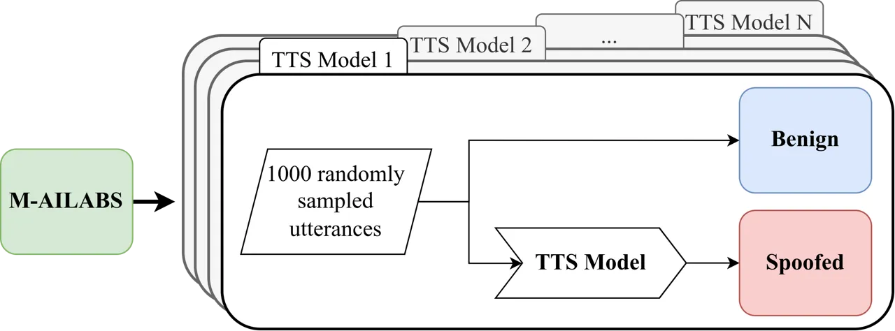

# MLAAD: The Multi-Language Audio Anti-Spoofing Dataset

Nicolas M. Müller, Piotr Kawa, Wei Herng Choong, Edresson Casanova,
Email: <%5B%5D%5Bc%5Dnicolas.mueller@aisec.fraunhofer.de>    Eren Gölge,
Thorsten Müller, Piotr Syga, Philip Sperl,    Konstantin Böttinger   
Fraunhofer AISEC, Germany Resemble AI, USA Wrocław University of Science
and Technology, Poland    Coqui.ai, Germany Thorsten-Voice

###### Abstract

This paper presents the Multi-Language Audio Anti-Spoofing Dataset
(MLAAD), version 11: a dataset of synthetic audio to train and evaluate
audio deepfake detection models. It features 205 Text-to-Speech (TTS)
models, comprising a total of 1153.6 hours of synthetic voice in 54
different languages.

To evaluate this dataset, we train three state-of-the-art deepfake
detection models with MLAAD and observe that it demonstrates superior
performance to comparable datasets like InTheWild and FakeOrReal when
used as a training resource. Moreover, compared to the renowned ASVspoof
2019 dataset, MLAAD proves to be a complementary resource. In tests
across eight datasets, MLAAD and ASVspoof 2019 alternately outperformed
each other, each excelling on four datasets.

By publishing the dataset¹¹ 1
[https://deepfake-total.com/mlaad](https://deepfake-total.com/mlaad) and
making a trained model accessible via an interactive webserver²² 2
[https://deepfake-total.com/](https://deepfake-total.com/) , we aim to
democratize anti-spoofing technology, making it accessible beyond the
realm of specialists, and contributing to global efforts against audio
spoofing and deepfakes.

## I Introduction

In recent years, text-to-speech (TTS) technology has significantly
advanced due to developments in machine learning (ML), leading to a wide
range of beneficial applications \[1, 2\]. This includes providing
speech assistance to individuals with disabilities or health-related
speech impairments. However, the evolution of TTS also brings notable
challenges, particularly in the form of deepfakes and audio spoofs. The
former are sophisticated fakes that pose risks by deceiving humans,
potentially leading to fraud, misinformation, and the spread of fake
news \[3\]. The latter can be used to compromise biometric
identification systems \[4\].

Addressing these concerns requires a multifaceted approach. First and
foremost, this includes public education on media literacy.
Additionally, the Content Authenticity Initiative \[5\], spearheaded by
Adobe, is focused on countering misinformation by employing
cryptographic methods to validate images and audio. A critical component
is the advancement of reliable detection techniques for audio spoofs and
deepfakes, which remains an active field of research.

Despite these efforts, detecting audio deepfakes and spoofs remains a
challenging task. This difficulty is partly due to a discrepancy between
laboratory conditions and real-world environments; models that perform
well in controlled settings often fail in practical applications \[6\].
Another significant challenge is the language bias in deepfake audio
data, which is predominantly in English, thus limiting its applicability
and potentially discriminating against non-English speakers. With the
increasing prevalence of suspected deepfakes in various non-English
media \[7, 8\], the need for a multilingual audio deepfake detection
system is imperative.

|     |              |        |        |           |                   |
| --- | ------------ | ------ | ------ | --------- | ----------------- |
|     | Release Date | Hours  | Models | Languages | Distributed via   |
| v1  | 17.01.2024   | 63.0   | 21     | 22        | zip               |
| v2  | 28.02.2024   | 63.0   | 21     | 22        | zip               |
| v3  | 16.04.2024   | 163.9  | 54     | 23        | zip               |
| v4  | 24.09.2024   | 175.0  | 59     | 23        | zip               |
| v5  | 02.11.2024   | 398.3  | 87     | 38        | zip + Huggingface |
| v6  | 26.04.2025   | 420.7  | 91     | 38        | Huggingface       |
| v7  | 11.07.2025   | 485.3  | 101    | 40        | Huggingface       |
| v8  | 01.10.2025   | 570.3  | 119    | 40        | Huggingface       |
| v9  | 17.01.2026   | 687.4  | 140    | 51        | Huggingface       |
| v10 | 18.05.2026   | 1002.9 | 175    | 54        | Huggingface       |
| v11 | 01.09.2026   | 1153.6 | 205    | 54        | Huggingface       |

TABLE I: Overview of MLAAD dataset versions, including release dates,
total duration of synthesized speech, number of TTS models, supported
languages, and distribution method.

To address these issues, we introduce and continuously expand our MLAAD
dataset (c.f. Table I), a large-scale corpus of state-of-the-art audio
fakes encompassing 54 languages. This dataset, based on the M-AILABS
Speech Dataset \[9\], includes 1153.6 hours of synthesized speech,
created by 205 state-of-the-art TTS models. By training state-of-the-art
deepfake detection models using MLAAD, we show that the resulting models
achieve high performance scores in cross-dataset evaluations, indicating
practicality in real-world conditions.

We open-source the MLAAD dataset and make our models interactively
accessible to a broader audience, including non-technical individuals,
through the platform
[https://deepfake-total.com](https://deepfake-total.com).

## II Related Work

| name                 | languages         | \# systems | \# utterances |
| -------------------- | ----------------- | ---------- | ------------- |
| ASVspoof15 \[10\]    | English           | 10         | 263,151       |
| ASVspoof19 LA \[4\]  | English           | 19         | 121,461       |
| ASVspoof21 LA \[11\] | English           | 13         | 164,612       |
| ASVspoof21 DF \[11\] | English           | 100+       | 593,253       |
| FakeAVCeleb \[12\]   | English           | 1          | 11,857        |
| FoR \[13\]           | English           | 7          | 195,541       |
| Voc.v \[14\]         | English           | 8          | 82,048        |
| In-The-Wild \[6\]    | English           | ?          | 31,779        |
| PartialSpoof \[15\]  | English           | 19         | 121,461       |
| WaveFake \[16\]      | English, Japanese | 9          | 136,085       |
| ADD 2022 \[17\]      | Chinese           | ?          | 493,123       |
| ADD 2023 \[18\]      | Chinese           | ?          | 517,068       |
| FMFCC-A \[19\]       | Chinese           | 13         | 50,000        |
| HAD \[20\]           | Chinese           | 2          | 160,836       |
| CFAD \[21\]          | Chinese           | 12         | 347,400       |
| MLAAD (ours)         | 54                | 205        | 534,000       |

TABLE II: Overview of Related Work on Datasets Used in Audio
Anti-spoofing Research.

### II-A Speech Synthesis

In the realm of speech synthesis, we primarily identify two main
approaches: Text-to-speech (TTS) and Voice Conversion (VC).
Text-to-speech encompasses algorithms that generate speech from text,
where the voice, accents, and pitch characteristics are derived from the
training dataset \[22, 23\]. Modern TTS methods have evolved to allow a
single model to produce multiple voices \[24, 25, 26, 27, 28, 29\] and
languages \[25, 28\]. In contrast, Voice Conversion involves creating
speech from two inputs – one for linguistic information (text) and
another for vocal characteristics (voice), resulting in an utterance
that combines the text of one input with the voice of another \[25, 26,
30, 31\]. The field is supported by numerous open-source toolkits \[32,
33, 34, 35\], which offer access to various speech synthesis methods.
Especially Coqui-TTS \[33\] and Hugging Face \[35\] encompass many
state-of-the-art approaches. Different datasets, varying in language,
number of speakers, and accents, are used to train these methods \[36,
37, 38, 39\].

### II-B Learning Models for Deepfake Detection

The increasing advancement and popularity of speech synthesis
techniques, however, have also enabled misuse, disinformation, and
fraud. This has prompted research in the domain of neural voice
anti-spoofing, which aims to classify a given audio file as authentic
(’bona-fide’) or fake (’spoof’). Most current methods rely on deep
neural networks, falling into two main categories based on the type of
information processed. First, raw audio signal-based models work
directly with the raw waveform, eliminating the need for transforming
the input, and include methods like \[40, 41, 42, 43\]. Second,
front-end-based models analyze transformed representations of audio
signals, such as (mel-)spectrograms or cepstral coefficients \[44, 45\],
and have recently been enhanced by Self-Supervised Learning or
embedding-based approaches due to their high performance and good
generalization capabilities \[45, 46, 47, 48, 49\]. Additionally, the
development of complex-valued networks for voice anti-spoofing \[50\] is
an emerging area of interest in this field.

### II-C Datasets for Deepfake Detection

Several voice anti-spoofing datasets have been released for training
these models, c.f. Table II. These datasets focus on enhancing weak
model generalization capability by including a wide array of generation
methods, codecs, noises, and data quality \[11, 16, 17, 18, 21\], as
well as dealing with partial spoofs \[15, 20, 17\], real-world deepfake
instances \[6\], and multimodal deepfakes combining fake audio and
video \[12, 51\]. However, a gap remains in addressing the diversity of
languages in spoofed utterances, with most datasets focusing
predominantly on English \[11, 15, 6, 16, 12\] and Chinese \[20, 21, 19,
17, 18\]. Although WaveFake \[16\] incorporates both English and
Japanese, datasets predominantly featuring English continue to dominate
the field of anti-spoofing. To the best of our knowledge, there is no
speech anti-spoofing dataset that comprehensively addresses multiple
languages.

## III MLAAD – Dataset Description

Fig. 1: Visualization of the data creation process for MLAAD.

### III-A Synthesis Procedure

We introduce the MLAAD dataset, an extension of the M-AILABS Speech
Dataset, which features audio clips in eight original languages:
English, French, German, Italian, Polish, Russian, Spanish, and
Ukrainian. All of these audio clips represent authentic human speech,
taken from audiobooks or speeches and interviews of public figures, such
as former German Chancellor Angela Merkel. We enrich this dataset with
computer-generated audio clips in 54 languages.

Our dataset construction involves the following steps, as illustrated in
Fig. 1: First, for each combination of language and TTS model, we select
a random subset of 1000 instances from the original dataset. If the
target language is present in M-AILABS, we use these samples as a
starting point. Otherwise, we use the texts of the English samples and
translate them to the target language using Neural Machine
Translation \[52\].

Second, for each of the baseline audio files, a corresponding synthetic
version is created. The text for this synthesis is sourced from the
original audio files or the translated version thereof. Additionally, we
use a speaker reference file for models supporting multi-speaker input,
such as VITS trained on multi-speaker datasets. This speaker reference
file is chosen randomly from the same set of baseline audio files. For
models trained on single-speaker datasets like LJSpeech \[36\], such a
speaker reference is not utilized.

Third, we aggregate the results: information on the synthesized audio
file, its language, and the transcript are stored in a meta.csv file
within the corresponding folder. These files constitute the “fake” audio
files when used for supervised learning, while the original baseline
audio files are used as “bona-fide” training samples. We use 22,050 Hz,
with a 16-bit depth, and store the audio in WAV format. The TTS models
are derived from Coqui.ai and Hugging Face and encompass nearly all
current state-of-the-art TTS models, c.f. Table IV. Additionally, for
each of the original languages present in M-AILABS, we use Griffin
Lim \[53\] as a model drop-in to re-synthesize 1000 randomly chosen
audio files.

### III-B Formatting

|                              |
| ---------------------------- |
| Descriptor                   |
| path                         |
| original_file                |
| language                     |
| is_original_language         |
| duration                     |
| training_data                |
| model_name                   |
| architecture                 |
| transcript                   |
| reference_speaker (since v8) |

TABLE III: Descriptors in the MLAAD dataset.

The outputs are organized into directories describing language and model
type. Each directory contains the synthesized audio files and an
accompanying “meta.csv” file, which encapsulates various data fields as
indicated in  Table III. The “path” field specifies the location of the
synthesized audio file, relative to the base path of MLAAD. The
“original_file” field denotes the filepath of the baseline audio,
relative to the base path of the M-AILABS dataset. The “language” field
identifies the language of the audio file, while “is_original_language”
indicates if the language was originally included in M-AILABS, or if the
transcript has been translated. The “duration” field shows the length of
the audio file in seconds, and “training_data” reveals the dataset used
to train the TTS model. The “model_name” field provides a unique
identifier for the model, such as “facebook/mms-tts-eng” for the
Facebook Massively Multilingual Speech (MMS) TTS model \[54\], while
“architecture” describes the TTS model architecture (such as VITS), and
“transcript” represents the textual transcript of the audio file.
Lastly, “reference_speaker” specifies the reference speaker used to
generate the audio file. Depending on the TTS model, this value is
either a file path pointing to an M-AILABS audio file or a speaker name
(for models that provide a fixed set of speakers). Note that this key
was introduced only in Version “v8”, and may therefore be missing from
previous “meta.csv” files.

### III-C Statistics

| Architecture          | Hours | Architecture                   | Hours | Architecture      | Hours |
| --------------------- | ----- | ------------------------------ | ----- | ----------------- | ----- |
| Azzurra-Voice         | 1.5   | Llasa                          | 30.9  | Sesame CSM-1B     | 1.7   |
| Bark                  | 123.3 | LongCat-AudioDiT               | 3.3   | Soprano11         | 1.6   |
| Capacitron            | 1.5   | LuxTTS                         | 1.8   | SopranoTTS        | 1.7   |
| CaroTTS               | 1.7   | MOSS-TTS                       | 41.0  | Sopro             | 2.0   |
| Cartesia.ai (Sonic-3) | 3.5   | Mars5                          | 1.8   | SoulX-Podcast     | 1.9   |
| ChatTTS               | 3.7   | MatchaTTS                      | 1.7   | Spark TTS         | 2.1   |
| Chatterbox            | 16.3  | Maya1 TTS                      | 2.1   | SpeechT5          | 2.0   |
| Coda                  | 7.3   | MegaTTS3                       | 4.1   | Speedy Speech     | 2.0   |
| DeepGram              | 3.8   | MeloTTS                        | 1.8   | Step-Audio-EditX  | 3.8   |
| DiT                   | 2.0   | Metavoice-1B                   | 1.9   | StyleTTS 2        | 4.1   |
| Dramabox              | 3.5   | Microsoft VibeVoice            | 8.3   | StyleTTS2         | 2.1   |
| Dual-AR               | 19.8  | Ming-omni-tts                  | 3.9   | Supertonic        | 17.7  |
| DualAR                | 3.6   | MiniCPM-o-2.6                  | 4.4   | SvaraTTS v1       | 5.2   |
| E2 TTS                | 1.8   | MiniMax-Speech                 | 2.0   | TADA              | 17.5  |
| Edge-TTS              | 39.9  | MiraTTS                        | 2.0   | Tacotron          | 2.5   |
| ElevenLabs            | 10.1  | MisoTTS                        | 2.3   | Tacotron 2        | 20.6  |
| F5 TTS                | 1.7   | NVidia Magpie-TTS              | 4.5   | Tortoise          | 2.1   |
| F5-TTS                | 18.5  | Nari Dia-1.6B                  | 1.9   | VITS              | 58.1  |
| FastPitch             | 2.1   | Nari Dia2                      | 2.1   | VITS Neon         | 4.3   |
| FireRedTTS            | 5.5   | NeuTTS                         | 2.0   | VITS-MMS          | 23.3  |
| FishTTS               | 7.4   | NeuTTS-Air                     | 2.0   | VITS2             | 1.7   |
| FreyaTTS              | 1.6   | NeuralHMM                      | 2.1   | Veena             | 3.5   |
| GLM-TTS               | 2.1   | OmniVoice                      | 53.6  | VibeVoice         | 2.0   |
| GPA                   | 3.5   | OpenAI TTS-1 HD                | 13.7  | VieNeu-TTS        | 2.3   |
| GPT-SoVITS            | 2.1   | OpenVoiceV2                    | 4.3   | VixTTS            | 3.6   |
| Gemini                | 2.5   | Openaudio-S1-Mini              | 4.8   | VoXtream          | 1.9   |
| GlowTTS               | 12.6  | Optispeech                     | 1.5   | VoiceCore         | 2.9   |
| Griffin Lim           | 16.6  | Orpheus TTS v0.1               | 2.0   | VoxCPM            | 35.6  |
| Higgs-Audio           | 15.5  | OuteTTS                        | 15.1  | VoxCPM-1.5        | 4.1   |
| Higgs-Audio-V2        | 8.8   | Overflow                       | 2.2   | Voxtral           | 19.1  |
| Index-TTS             | 7.6   | Parler TTS                     | 4.9   | Voxtream          | 2.2   |
| IndicF5               | 16.6  | Parler-TTS                     | 10.0  | WavTTS            | 1.7   |
| Indri-TTS-0.1         | 3.7   | PocketTTS                      | 1.9   | WhisperSpeech     | 3.9   |
| Inflect-Nano          | 1.5   | PrimeTTS                       | 2.1   | XTTS v1.1         | 36.9  |
| Inworld-TTS           | 3.9   | Qwen2.5-Omni                   | 2.3   | XTTS v2           | 38.9  |
| Jenny                 | 1.7   | Qwen3-Omni                     | 34.3  | YarnGPT           | 5.2   |
| Kani-TTS              | 3.8   | Qwen3-TTS                      | 2.3   | ZipVoice          | 3.4   |
| Kitten-TTS            | 4.1   | RVC                            | 17.6  | Zonos             | 8.8   |
| Kokoro                | 10.4  | Raon-OpenTTS                   | 1.8   | ZonosTTS v0.1     | 3.7   |
| KugelAudio            | 15.6  | Resemble.ai (April 12th, 2025) | 8.8   | dots.tts          | 45.5  |
| Kyutai-TTS            | 4.5   | Ringg Squirrel TTS             | 3.9   | minimax/speech-02 | 8.8   |
| LFM2.5-Audio          | 1.8   | Sarashina                      | 2.2   |                   |       |
| Lightning             | 3.5   | Sesame CSM 1B                  | 2.2   |                   |       |

TABLE IV: TTS model architectures utilized in MLAAD along with the
corresponding duration of the synthesized audio files (in hours).

| Language  | Hours | Language      | Hours | Language   | Hours |
| --------- | ----- | ------------- | ----- | ---------- | ----- |
| Amharic   | 3.6   | Hungarian     | 12.5  | Polish     | 44.5  |
| Arabic    | 19.4  | Igbo          | 1.8   | Portuguese | 39.2  |
| Bangla    | 14.1  | Indonesian    | 4.5   | Romanian   | 12.8  |
| Bulgarian | 6.1   | Irish         | 6.4   | Russian    | 50.2  |
| Chinese   | 54.6  | Italian       | 57.3  | Sinhala    | 2.1   |
| Croatian  | 1.8   | Japanese      | 29.9  | Slovak     | 6.3   |
| Czech     | 13.0  | Javanese      | 2.4   | Slovenian  | 1.8   |
| Danish    | 7.7   | Kannada       | 9.4   | Spanish    | 66.6  |
| Dutch     | 20.8  | Korean        | 30.2  | Swahili    | 3.4   |
| English   | 286.5 | Latvian       | 2.3   | Swedish    | 7.4   |
| Estonian  | 5.7   | Lithuanian    | 2.3   | Tamil      | 5.0   |
| Finnish   | 13.2  | Luxembourgish | 1.7   | Thai       | 7.8   |
| French    | 84.6  | Malay         | 2.5   | Turkish    | 15.6  |
| German    | 84.6  | Malayalam     | 1.8   | Turkmen    | 3.9   |
| Greek     | 8.8   | Maltese       | 8.1   | Ukrainian  | 35.7  |
| Hausa     | 1.5   | Marathi       | 3.0   | Urdu       | 2.1   |
| Hebrew    | 2.0   | Norwegian     | 2.0   | Vietnamese | 10.1  |
| Hindi     | 22.5  | Persian       | 8.8   | Yoruba     | 1.8   |

TABLE V: Languages utilized in MLAAD along with the corresponding
duration of the synthesized audio files (in hours).

The dataset encompasses 1153.6 hours of synthesized speech across 54
languages, generated using 205 state-of-the-art TTS models, comprising
127 different architectures. We distribute only these synthesized
samples, for the originals please refer to the M-AILABS dataset.

Table IV and Table V present the architecture and language distribution
within MLAAD, offering an overview of the TTS architectures and
languages that constitute the dataset.

## IV Evaluation

|            |                           | Test Data $`\rightarrow`$ |               |               |            |           |          |           |           |
| ---------- | ------------------------- | ------------------------- | ------------- | ------------- | ---------- | --------- | -------- | --------- | --------- |
| Model      | Train Data $`\downarrow`$ | ASVspoof19                | ASVspoof21-DF | ASVspoof21-LA | FakeOrReal | InTheWild | MLAAD v1 | Voc.v     | WaveFake  |
| RawGat-ST  | ASV19                     | \-                        | 67.1±10.4     | \-            | 68.8±11.2  | 50.0±2.5  | 56.9±5.7 | 37.6±23.7 | 15.0±16.0 |
|            | FOR                       | 49.1±18.1                 | 53.6±3.8      | 56.4±6.9      | \-         | 49.8±0.4  | 51.9±3.3 | 25.4±43.1 | 20.0±44.7 |
|            | ITW                       | 58.4±10.2                 | 58.5±4.2      | 55.1±2.9      | 54.5±3.9   | \-        | 57.4±7.0 | 38.9±27.9 | 65.3±30.3 |
|            | MLAAD v1                  | 60.9±17.8                 | 50.4±1.1      | 50.5±2.1      | 50.2±0.4   | 47.7±3.3  | \-       | 70.5±42.2 | 68.4±41.7 |
| SSL W2V2   | ASV19                     | \-                        | 91.6±3.8      | \-            | 81.1±7.7   | 79.7±6.8  | 71.8±5.1 | 71.6±12.1 | 51.3±28.5 |
|            | FOR                       | 65.4±10.3                 | 77.7±2.6      | 73.5±3.5      | \-         | 57.8±10.9 | 57.1±3.4 | 21.5±18.4 | 1.5±2.0   |
|            | ITW                       | 65.0±10.1                 | 68.1±4.9      | 60.2±4.7      | 55.3±5.7   | \-        | 59.1±4.3 | 19.2±17.1 | 70.4±35.4 |
|            | MLAAD v1                  | 78.0±15.3                 | 75.5±15.7     | 73.7±10.4     | 64.4±9.0   | 68.0±17.5 | \-       | 66.0±34.2 | 69.8±38.4 |
| Whisper DF | ASV19                     | \-                        | 82.3±3.8      | \-            | 80.6±4.4   | 76.5±4.0  | 44.9±3.3 | 18.1±14.2 | 2.2±3.5   |
|            | FOR                       | 45.9±0.8                  | 60.3±1.4      | 61.1±2.3      | \-         | 54.1±4.3  | 54.5±1.1 | 1.3±0.9   | 0.2±0.1   |
|            | ITW                       | 55.5±9.3                  | 63.8±3.6      | 61.7±4.4      | 67.2±5.6   | \-        | 54.2±3.5 | 18.4±19.2 | 26.3±40.0 |
|            | MLAAD v1                  | 70.8±0.9                  | 52.7±6.1      | 52.6±6.2      | 50.5±3.3   | 54.3±4.9  | \-       | 86.7±29.4 | 97.2±3.3  |

TABLE VI: Summary of training results across different datasets,
measured by test accuracy. Each row represents a model trained on one
dataset and evaluated on the remaining seven datasets, as described in
Section IV-B. Highlights indicate the highest value per test dataset
(i.e., per column). Averages are calculated from five separate trials,
presented as mean ± standard deviation.

### IV-A Training Setup

To evaluate our dataset, we selected three state-of-the-art voice
anti-spoofing models: RawGat-ST \[41\], SSL-W2V2 \[55\], and
WhisperDF \[49\].

The RawGat-ST and SSL-W2V2 models process 5-second clips of raw audio,
whereas WhisperDF handles 30-second audio segments, converting them into
a time-frequency representation through its frontend. We augment all
training data with random noise sourced from the RIRS Noises \[56\] and
Noise ESC-50 \[57\] datasets, along with music randomly selected from
the Free Music Archive (Instrumental Music) \[58\] and Musan \[59\],
overlaying randomly chosen noise or music with a 5% probability per
sample. Additionally, with a 20% probability, each sample is encoded
using one of several codecs: ulaw, alaw, mp3, aac, flac, opus, ac3.
These augmentations serve to diversify the dataset and exclude learning
shortcuts \[60\], such as the model learning to associate a certain
encoding with either fake or real data.

To ensure balanced training, the data is randomly undersampled for each
training epoch. This exposes the models to an equal number of fake and
authentic audio samples, preventing majority bias. All three models are
trained for 100 epochs, with the provision for early stopping based on
training accuracy.

Contrary to typical voice anti-spoofing evaluations \[55, 50, 4, 11\]
that use the equal error rate (EER), we opt for accuracy as our
evaluation metric. This decision is made because EER can only be
calculated when test data contains both authentic and spoof samples.
However, some of our test datasets, like Voc.v \[14\], consist only of
spoof samples. We believe that the accuracy metric better suits our
real-world focus since it measures actionable output, unlike EER, which
relies on an optimal threshold that is unknown to practitioners without
ground-truth data.

### IV-B Cross-Dataset Evaluation

These learning models are trained separately on four different datasets:
MLAAD v1, ASVspoof19 \[4\], FakeOrReal (FoR) \[13\], and In-The-Wild
(ITW) \[6\]. Evaluation is conducted on eight datasets, including the
four used for training, as well as ASVspoof21-DF and
ASVspoof21-LA \[11\], Voc.v \[14\], and WaveFake \[16\]. We do not use
the latter four datasets for training because ASVspoof21-LA and DF are
intended solely as test-sets \[11\]. Voc.v and WaveFake consist only of
fake samples, precluding supervised training. Finally, we refrain from
using ASVspoof21-LA to assess the cross-dataset performance of models
trained on ASVspoof19, given the substantial similarity between the two
datasets. Note that the results reported here use MLAAD v1; the
evaluation was not re-run for subsequent releases, but we expect later
versions to perform substantially better given the much larger volume
and diversity of training data.

For every configuration, we conduct the experiment five times, reporting
the mean accuracy along with the standard deviation in Table VI. The
results quantify a dataset’s ability to enable state-of-the-art models
to generalize voice anti-spoofing to cross-dataset data, a key
requirement for real-world applicability.

We observe the following: First, no single training dataset consistently
outperforms the others. Notably, ASVspoof19 and MLAAD each achieve the
highest accuracy in four out of eight cross-dataset test cases. In
contrast, datasets like FakeOrReal and InTheWild do not top any case.
Second, the shared success of ASVspoof19 and MLAAD suggests that they
complement each other in terms of their training effectiveness.

Third, we observe that the models sometimes seem to learn features that,
paradoxically, seem to transfer very well to some datasets, while being
completely useless for others. Take for example the SSL W2V2 model,
trained on ASVspoof19. It shows excellent performance on ASVspoof21-DF
and good performance on FakeOrReal and InTheWild, while at the same time
failing completely on WaveFake, where it achieves 51% accuracy, which is
as good as random guessing. For some test cases, the models’ accuracy
scores are even lower than 50%, indicating that the training data
comprises shortcuts that not only are not helpful but actually
detrimental to the performance. Notably, models trained on MLAAD are the
only ones that do not exhibit performance significantly below 50%,
hinting at possibly less detrimental shortcut features comprised in
MLAAD than in other datasets \[60\].

## V Conclusion

In this paper, we present a new audio dataset, which comprises voice
spoofs in 54 languages by 205 TTS models, composed of 127 architectures.
When evaluating MLAAD’s usefulness as a training resource, we observe
that MLAAD complements existing research. It consistently outperforms
related work such as InTheWild or FakeOrReal with respect to the trained
models’ cross-dataset generalization capability. Furthermore, in
comparison with the renowned ASVspoof 2019 dataset, MLAAD proves to be a
complementary resource. Across eight datasets, MLAAD and ASVspoof 2019
alternately outperformed each other, both excelling on four datasets:
Training the SSL W2V2 model on ASVspoof19 results in the highest
performance on ASVspoof21-DF, FakeOrReal, InTheWild, and MLAAD.
Similarly, training SSL W2V2 or WhisperDF on MLAAD leads to optimal
performance on ASVspoof19, ASVspoof21-LA, Voc.v, and WaveFake. We note
that an evaluation of the multi-lingual anti-spoofing capabilities has
to remain a topic for future work since there are no other comparable
multi-lingual datasets against which to evaluate MLAAD. However, the
strong results on WaveFake, which comprises both English and Japanese,
suggest that the learning models profit from the diversity of languages
in MLAAD.

## VI Acknowledgment

This work has been (partially) funded by the Bavarian Ministry of
Economic Affairs, Regional Development and Energy; and the Department of
Artificial Intelligence, Wrocław University of Science and Technology.

## References

- \[1\] F. Biadsy, R. J. Weiss, P. J. Moreno, D. Kanvesky, and Y.
  Jia (2019) Parrotron: An End-to-End Speech-to-Speech Conversion Model
  and its Applications to Hearing-Impaired Speech and Speech Separation.
  In Proc. Interspeech 2019, pp. 4115–4119. External Links:
  [Document](https://dx.doi.org/10.21437/Interspeech.2019-1789) Cited
  by: §I.
- \[2\] Apple (2023) Apple introduces new features for cognitive
  accessibility, along with live speech, personal voice, and point and
  speak in magnifier. Note:
  [https://www.apple.com/newsroom/2023/05/apple-previews-live-speech-personal](https://www.apple.com/newsroom/2023/05/apple-previews-live-speech-personal)Accessed
  on 01/02/2024 Cited by: §I.
- \[3\] Forbes (2023) Fraudsters cloned company director’s voice in \$35
  million bank heist, police find. Note:
  [https://www.forbes.com/sites/thomasbrewster/2021/10/14/huge-bank-fraud-uses-deep-fake-voice-tech-to-steal-millions](https://www.forbes.com/sites/thomasbrewster/2021/10/14/huge-bank-fraud-uses-deep-fake-voice-tech-to-steal-millions)Accessed
  on 01/02/2024 Cited by: §I.
- \[4\] X. Wang, J. Yamagishi, M. Todisco, H. Delgado, A. Nautsch, N.
  Evans, M. Sahidullah, V. Vestman, T. Kinnunen, K. A. Lee, et
  al. (2020) ASVspoof 2019: a large-scale public database of
  synthesized, converted and replayed speech. Computer Speech & Language
  64, pp. 101114. Cited by: §I, TABLE II, §IV-A, §IV-B.
- \[5\] (-) Content authenticity initiative. Note:
  [https://contentauthenticity.org/](https://contentauthenticity.org/)(Accessed
  on 01/02/2024) Cited by: §I.
- \[6\] N. Müller, P. Czempin, F. Diekmann, A. Froghyar, and K.
  Böttinger (2022) Does Audio Deepfake Detection Generalize?. In Proc.
  Interspeech 2022, pp. 2783–2787. External Links:
  [Document](https://dx.doi.org/10.21437/Interspeech.2022-108) Cited by:
  §I, §II-C, TABLE II, §IV-B.
- \[7\] T. Sun (-) ”AI putin” gave his chilling new year message,
  viewers convinced after ‘telltale sign’ spotted as death rumours swirl
  — the sun. Note:
  [https://www.thesun.co.uk/news/25220488/ai-putin-chilling-message-death-rumours/](https://www.thesun.co.uk/news/25220488/ai-putin-chilling-message-death-rumours/)(Accessed
  on 01/02/2024) Cited by: §I.
- \[8\] L. Croix (-) Intelligence artificielle: quand un deepfake
  d’emmanuel macron emballe la toile. Note:
  [https://www.la-croix.com/France/Intelligence-artificielle-quand-deepfake-dEmmanuel-Macron](https://www.la-croix.com/France/Intelligence-artificielle-quand-deepfake-dEmmanuel-Macron)(Accessed
  on 01/02/2024) Cited by: §I.
- \[9\] T. M. S. Dataset (2023) The m-ailabs speech dataset. Note:
  [https://www.caito.de/2019/01/03/the-m-ailabs-speech-dataset/](https://www.caito.de/2019/01/03/the-m-ailabs-speech-dataset/)Accessed
  on 01/02/2024 Cited by: §I.
- \[10\] Z. Wu, T. Kinnunen, N. Evans, J. Yamagishi, C. Hanilçi, M.
  Sahidullah, and A. Sizov (2015) ASVspoof 2015: the first automatic
  speaker verification spoofing and countermeasures challenge. In
  Sixteenth annual conference of the international speech communication
  association, Cited by: TABLE II.
- \[11\] J. Yamagishi, X. Wang, M. Todisco, M. Sahidullah, J. Patino, A.
  Nautsch, X. Liu, K. A. Lee, T. Kinnunen, N. Evans, et al. (2021)
  ASVspoof 2021: accelerating progress in spoofed and deepfake speech
  detection. arXiv preprint arXiv:2109.00537. Cited by: §II-C, TABLE II,
  TABLE II, §IV-A, §IV-B.
- \[12\] H. Khalid, S. Tariq, M. Kim, and S. S. Woo (2021) FakeAVCeleb:
  a novel audio-video multimodal deepfake dataset. In Thirty-fifth
  Conference on Neural Information Processing Systems Datasets and
  Benchmarks Track (Round 2), External Links:
  [Link](https://openreview.net/forum?id=TAXFsg6ZaOl) Cited by: §II-C,
  TABLE II.
- \[13\] R. Reimao and V. Tzerpos (2019) For: a dataset for synthetic
  speech detection. In 2019 International Conference on Speech
  Technology and Human-Computer Dialogue (SpeD), pp. 1–10. Cited by:
  TABLE II, §IV-B.
- \[14\] X. Wang and J. Yamagishi (2023) Spoofed training data for
  speech spoofing countermeasure can be efficiently created using neural
  vocoders. In ICASSP 2023-2023 IEEE International Conference on
  Acoustics, Speech and Signal Processing (ICASSP), pp. 1–5. Cited by:
  TABLE II, §IV-A, §IV-B.
- \[15\] L. Zhang, X. Wang, E. Cooper, N. Evans, and J. Yamagishi (2023)
  The partialspoof database and countermeasures for the detection of
  short fake speech segments embedded in an utterance. IEEE/ACM
  Transactions on Audio, Speech, and Language Processing 31 (),
  pp. 813–825. External Links:
  [Document](https://dx.doi.org/10.1109/TASLP.2022.3233236) Cited by:
  §II-C, TABLE II.
- \[16\] J. Frank and L. Schönherr (2021) WaveFake: A Data Set to
  Facilitate Audio Deepfake Detection. In Thirty-fifth Conference on
  Neural Information Processing Systems Datasets and Benchmarks Track,
  Cited by: §II-C, TABLE II, §IV-B.
- \[17\] J. Yi, R. Fu, J. Tao, S. Nie, H. Ma, C. Wang, T. Wang, Z.
  Tian, Y. Bai, C. Fan, et al. (2022) Add 2022: the first audio deep
  synthesis detection challenge. In ICASSP 2022-2022 IEEE International
  Conference on Acoustics, Speech and Signal Processing (ICASSP),
  pp. 9216–9220. Cited by: §II-C, TABLE II.
- \[18\] J. Yi, J. Tao, R. Fu, X. Yan, C. Wang, T. Wang, C. Y. Zhang, X.
  Zhang, Y. Zhao, Y. Ren, et al. (2023) ADD 2023: the second audio
  deepfake detection challenge. arXiv preprint arXiv:2305.13774. Cited
  by: §II-C, TABLE II.
- \[19\] Z. Zhang, Y. Gu, X. Yi, and X. Zhao (2021) FMFCC-a: a
  challenging mandarin dataset for synthetic speech detection. In
  International Workshop on Digital Watermarking, pp. 117–131. Cited by:
  §II-C, TABLE II.
- \[20\] J. Yi, Y. Bai, J. Tao, H. Ma, Z. Tian, C. Wang, T. Wang, and R.
  Fu (2021) Half-Truth: A Partially Fake Audio Detection Dataset. In
  Proc. Interspeech 2021, pp. 1654–1658. External Links:
  [Document](https://dx.doi.org/10.21437/Interspeech.2021-930) Cited by:
  §II-C, TABLE II.
- \[21\] H. Ma, J. Yi, C. Wang, X. Yan, J. Tao, T. Wang, S. Wang, L. Xu,
  and R. Fu (2022) FAD: a chinese dataset for fake audio detection.
  arXiv preprint arXiv:2207.12308. Cited by: §II-C, TABLE II.
- \[22\] J. Shen, R. Pang, R. J. Weiss, M. Schuster, N. Jaitly, Z.
  Yang, Z. Chen, Y. Zhang, Y. Wang, R. Skerrv-Ryan, et al. (2018)
  Natural tts synthesis by conditioning wavenet on mel spectrogram
  predictions. In 2018 IEEE international conference on acoustics,
  speech and signal processing (ICASSP), pp. 4779–4783. Cited by: §II-A.
- \[23\] J. Vainer and O. Dušek (2020) SpeedySpeech: Efficient Neural
  Speech Synthesis. In Proc. Interspeech 2020, pp. 3575–3579. External
  Links: [Document](https://dx.doi.org/10.21437/Interspeech.2020-2867)
  Cited by: §II-A.
- \[24\] J. Betker (2023) Better speech synthesis through scaling. arXiv
  preprint arXiv:2305.07243. Cited by: §II-A.
- \[25\] Coqui.ai (-) XTTS: open model release announcement. Note:
  [https://coqui.ai/blog/tts/open_xtts](https://coqui.ai/blog/tts/open_xtts)(Accessed
  on 01/02/2024) Cited by: §II-A.
- \[26\] J. Kim, J. Kong, and J. Son (2021) Conditional variational
  autoencoder with adversarial learning for end-to-end text-to-speech.
  In International Conference on Machine Learning, pp. 5530–5540. Cited
  by: §II-A.
- \[27\] E. Battenberg, S. Mariooryad, D. Stanton, R. Skerry-Ryan, M.
  Shannon, D. Kao, and T. Bagby (2019) Effective use of variational
  embedding capacity in expressive end-to-end speech synthesis. External
  Links: 1906.03402 Cited by: §II-A.
- \[28\] E. Casanova, J. Weber, C. Shulby, A. C. Junior, E. Gölge,
  and M. Antonelli Ponti (2021) YourTTS: Towards Zero-Shot Multi-Speaker
  TTS and Zero-Shot Voice Conversion for everyone. arXiv e-prints,
  pp. arXiv:2112.02418. External Links: 2112.02418 Cited by: §II-A.
- \[29\] J. Kim, S. Kim, J. Kong, and S. Yoon (2020) Glow-tts: a
  generative flow for text-to-speech via monotonic alignment search.
  Advances in Neural Information Processing Systems 33, pp. 8067–8077.
  Cited by: §II-A.
- \[30\] Y. A. Li, A. Zare, and N. Mesgarani (2021) StarGANv2-VC: A
  Diverse, Unsupervised, Non-Parallel Framework for Natural-Sounding
  Voice Conversion. In Proc. Interspeech 2021, pp. 1349–1353. External
  Links: [Document](https://dx.doi.org/10.21437/Interspeech.2021-319)
  Cited by: §II-A.
- \[31\] J. Li, W. Tu, and L. Xiao (2023) Freevc: towards high-quality
  text-free one-shot voice conversion. In ICASSP 2023-2023 IEEE
  International Conference on Acoustics, Speech and Signal Processing
  (ICASSP), pp. 1–5. Cited by: §II-A.
- \[32\] S. Watanabe, T. Hori, S. Karita, T. Hayashi, J. Nishitoba, Y.
  Unno, N. Enrique Yalta Soplin, J. Heymann, M. Wiesner, N. Chen, A.
  Renduchintala, and T. Ochiai (2018) ESPnet: end-to-end speech
  processing toolkit. In Proceedings of Interspeech, pp. 2207–2211.
  External Links:
  [Document](https://dx.doi.org/10.21437/Interspeech.2018-1456),
  [Link](http://dx.doi.org/10.21437/Interspeech.2018-1456) Cited by:
  §II-A.
- \[33\] Coqui TTS External Links:
  [Document](https://dx.doi.org/10.5281/zenodo.6334862),
  [Link](https://github.com/coqui-ai/TTS) Cited by: §II-A.
- \[34\] SpeechBrain External Links:
  [Link](https://github.com/speechbrain/speechbrain/) Cited by: §II-A.
- \[35\] T. Wolf, L. Debut, V. Sanh, J. Chaumond, C. Delangue, A.
  Moi, P. Cistac, C. Ma, Y. Jernite, J. Plu, C. Xu, T. Le Scao, S.
  Gugger, M. Drame, Q. Lhoest, and A. M. Rush (2020) Transformers:
  State-of-the-Art Natural Language Processing. pp. 38–45. External
  Links: [Link](https://www.aclweb.org/anthology/2020.emnlp-demos.6)
  Cited by: §II-A.
- \[36\] K. Ito and L. Johnson (2017) The lj speech dataset. Note:
  [https://keithito.com/LJ-Speech-Dataset/](https://keithito.com/LJ-Speech-Dataset/)
  Cited by: §II-A, §III-A.
- \[37\] S. King and V. Karaiskos (2014) The blizzard challenge 2013.
  External Links:
  [Link](https://api.semanticscholar.org/CorpusID:166265879) Cited by:
  §II-A.
- \[38\] K. Park and T. Mulc (2019) CSS10: A Collection of Single
  Speaker Speech Datasets for 10 Languages. In Proc. Interspeech 2019,
  pp. 1566–1570. External Links:
  [Document](https://dx.doi.org/10.21437/Interspeech.2019-1500) Cited
  by: §II-A.
- \[39\] R. Ardila, M. Branson, K. Davis, M. Kohler, J. Meyer, M.
  Henretty, R. Morais, L. Saunders, F. Tyers, and G. Weber (2020) Common
  voice: a massively-multilingual speech corpus. In Proceedings of The
  12th Language Resources and Evaluation Conference, Marseille, France,
  pp. 4218–4222. External Links:
  [Link](https://www.aclweb.org/anthology/2020.lrec-1.520) Cited by:
  §II-A.
- \[40\] H. Tak, J. Patino, M. Todisco, A. Nautsch, N. Evans, and A.
  Larcher (2021) End-to-end anti-spoofing with rawnet2. In ICASSP
  2021-2021 IEEE International Conference on Acoustics, Speech and
  Signal Processing (ICASSP), pp. 6369–6373. Cited by: §II-B.
- \[41\] H. Tak, J. Jung, J. Patino, M. Kamble, M. Todisco, and N.
  Evans (2021) End-to-end spectro-temporal graph attention networks for
  speaker verification anti-spoofing and speech deepfake detection.
  arXiv preprint arXiv:2107.12710. Cited by: §II-B, §IV-A.
- \[42\] J. Jung, H. Heo, H. Tak, H. Shim, J. S. Chung, B. Lee, H. Yu,
  and N. Evans (2022) Aasist: audio anti-spoofing using integrated
  spectro-temporal graph attention networks. In ICASSP 2022-2022 IEEE
  International Conference on Acoustics, Speech and Signal Processing
  (ICASSP), pp. 6367–6371. Cited by: §II-B.
- \[43\] W. Ge, J. Patino, M. Todisco, and N. Evans (2021) Raw
  differentiable architecture search for speech deepfake and spoofing
  detection. arXiv preprint arXiv:2107.12212. Cited by: §II-B.
- \[44\] Md. Sahidullah, T. Kinnunen, and C. Hanilçi (2015) A comparison
  of features for synthetic speech detection. In Proc. Interspeech 2015,
  pp. 2087–2091. External Links:
  [Document](https://dx.doi.org/10.21437/Interspeech.2015-472) Cited by:
  §II-B.
- \[45\] X. Wang and J. Yamagishi (2021) A Comparative Study on Recent
  Neural Spoofing Countermeasures for Synthetic Speech Detection. In
  Proc. Interspeech 2021, pp. 4259–4263. External Links:
  [Document](https://dx.doi.org/10.21437/Interspeech.2021-702) Cited by:
  §II-B.
- \[46\] D. Afchar, V. Nozick, J. Yamagishi, and I. Echizen (2018)
  MesoNet: a compact facial video forgery detection network. In 2018
  IEEE International Workshop on Information Forensics and Security
  (WIFS), Vol. , pp. 1–7. External Links:
  [Document](https://dx.doi.org/10.1109/WIFS.2018.8630761) Cited by:
  §II-B.
- \[47\] H. Tak, M. Todisco, X. Wang, J. Jung, J. Yamagishi, and N.
  Evans (2022) Automatic speaker verification spoofing and deepfake
  detection using wav2vec 2.0 and data augmentation. arXiv preprint
  arXiv:2202.12233. Cited by: §II-B.
- \[48\] J. M. Martín-Doñas and A. Álvarez (2022) The vicomtech audio
  deepfake detection system based on wav2vec2 for the 2022 add
  challenge. In ICASSP 2022-2022 IEEE International Conference on
  Acoustics, Speech and Signal Processing (ICASSP), pp. 9241–9245. Cited
  by: §II-B.
- \[49\] P. Kawa, M. Plata, M. Czuba, P. Szymański, and P. Syga (2023)
  Improved DeepFake Detection Using Whisper Features. In Proc.
  INTERSPEECH 2023, pp. 4009–4013. External Links:
  [Document](https://dx.doi.org/10.21437/Interspeech.2023-1537) Cited
  by: §II-B, §IV-A.
- \[50\] N. M. Müller, P. Sperl, and K. Böttinger (2023) Complex-valued
  neural networks for voice anti-spoofing. In Proc. INTERSPEECH 2023,
  pp. 3814–3818. External Links:
  [Document](https://dx.doi.org/10.21437/Interspeech.2023-901) Cited by:
  §II-B, §IV-A.
- \[51\] (2023) AV-deepfake1m: a large-scale llm-driven audio-visual
  deepfake dataset. arXiv preprint arXiv:2311.15308. Cited by: §II-C.
- \[52\] (-) Nmt · pypi. Note:
  [https://pypi.org/project/nmt/](https://pypi.org/project/nmt/)(Accessed
  on 01/15/2024) Cited by: §III-A.
- \[53\] D. Griffin and J. Lim (1984) Signal estimation from modified
  short-time fourier transform. IEEE Transactions on acoustics, speech,
  and signal processing 32 (2), pp. 236–243. Cited by: §III-A.
- \[54\] V. Pratap, A. Tjandra, B. Shi, P. Tomasello, A. Babu, S.
  Kundu, A. Elkahky, Z. Ni, A. Vyas, M. Fazel-Zarandi, et al. (2023)
  Scaling speech technology to 1,000+ languages. arXiv preprint
  arXiv:2305.13516. Cited by: §III-B.
- \[55\] H. Tak, M. Todisco, X. Wang, J. Jung, J. Yamagishi, and N.
  Evans (2022) Automatic speaker verification spoofing and deepfake
  detection using wav2vec 2.0 and data augmentation. In The Speaker and
  Language Recognition Workshop, Cited by: §IV-A, §IV-A.
- \[56\] T. Ko, V. Peddinti, D. Povey, M. L. Seltzer, and S.
  Khudanpur (2017) A study on data augmentation of reverberant speech
  for robust speech recognition. In 2017 IEEE International Conference
  on Acoustics, Speech and Signal Processing (ICASSP), Vol. ,
  pp. 5220–5224. External Links:
  [Document](https://dx.doi.org/10.1109/ICASSP.2017.7953152) Cited by:
  §IV-A.
- \[57\] K. J. Piczak (2015) ESC: Dataset for Environmental Sound
  Classification. In Proceedings of the 23rd Annual ACM Conference on
  Multimedia, pp. 1015–1018. External Links:
  [Link](http://dl.acm.org/citation.cfm?doid=2733373.2806390),
  [Document](https://dx.doi.org/10.1145/2733373.2806390), ISBN
  978-1-4503-3459-4 Cited by: §IV-A.
- \[58\] F. M. Archive (2023) Free music archive - instrumental. Note:
  [https://freemusicarchive.org/genre/Instrumental/](https://freemusicarchive.org/genre/Instrumental/)Accessed
  on 01/02/2024 Cited by: §IV-A.
- \[59\] D. Snyder, G. Chen, and D. Povey (2015) MUSAN: A Music, Speech,
  and Noise Corpus. Note: arXiv:1510.08484v1 External Links: 1510.08484
  Cited by: §IV-A.
- \[60\] N. M. Müller, F. Dieckmann, P. Czempin, R. Canals, K.
  Böttinger, and J. Williams (2021) Speech is silver, silence is golden:
  what do asvspoof-trained models really learn?. arXiv preprint
  arXiv:2106.12914. Cited by: §IV-A, §IV-B.
