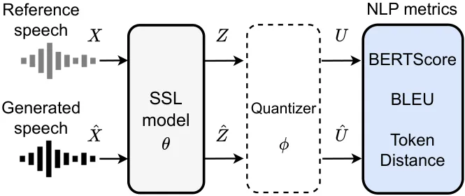
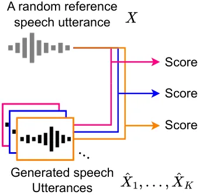

# SpeechBERTScore: Reference-Aware Automatic Evaluation of Speech Generation Leveraging NLP Evaluation Metrics

Takaaki Saeki¹, Soumi Maiti², Shinnosuke Takamichi^(1,3), Shinji
Watanabe², Hiroshi Saruwatari¹

###### Abstract

While subjective assessments have been the gold standard for evaluating
speech generation, there is a growing need for objective metrics that
are highly correlated with human subjective judgments due to their cost
efficiency. This paper proposes reference-aware automatic evaluation
methods for speech generation inspired by evaluation metrics in natural
language processing. The proposed SpeechBERTScore computes the BERTScore
for self-supervised dense speech features of the generated and reference
speech, which can have different sequential lengths. We also propose
SpeechBLEU and SpeechTokenDistance, which are computed on speech
discrete tokens. The evaluations on synthesized speech show that our
method correlates better with human subjective ratings than mel cepstral
distortion and a recent mean opinion score prediction model. Also, they
are effective in noisy speech evaluation and have cross-lingual
applicability.

###### keywords

Speech objective evaluation, speech generation, self-supervised speech
representation, text similarity metrics

^(†)^(†)address: ¹First Affiliation, CountryX  
²Second Affiliation, CountryY  
³Third Affiliation, CountryZ^(†)^(†)email: first@university.edu,
second@companyA.com, third@companyB.ai^(†)^(†)address: ¹The University
of Tokyo, Japan.  
²Carnegie Mellon University, USA. ³Keio University, Japan.^(†)^(†)email:
saefrospace@gmail.com, smaiti@andrew.cmu.edu,
shinnosuke_takamichi@ipc.i.u-tokyo.ac.jp, shinjiw@ieee.org,
hiroshi_saruwatari@ipc.i.u-tokyo.ac.jp

## 1 Introduction

Subjective listening tests have been the gold standard for evaluating
the quality of generated and degraded speech \[1, 2\]. However, various
objective evaluation metrics have also been employed to reduce time and
costs. For example, objective metrics \[3, 4\] such as mel cepstral
distortion (MCD) \[5\] are used to compare reference and generated
speech. However, these metrics, which are based on simple acoustic
features, can deviate from human subjective ratings, especially for
utterances with different acoustic and prosodic characteristics but high
naturalness. Consequently, recent studies have also focused on
frameworks that predict subjective ratings from input speech using
neural models \[6, 7, 8, 9, 10\]. However, the supervised learning based
methods degrade the performance in mismatched conditions, which limits
their practicality \[7\].

In natural language processing (NLP), automatic evaluation metrics that
highly correlate with human subjective judgement \[11, 12\] have been
proposed. BLEU \[13\] measures content agreement through $`n`$-gram
overlaps, while BERTScore \[14\] assesses contextual meaning via
language model semantics. Recent speech self-supervised learning (SSL)
models can generate semantic continuous vectors or discrete tokens from
speech \[15, 16, 17\]. Such speech representations can be treated
similarly to text representations, thus enabling applications of the
above NLP metrics to speech. Our goal is to develop evaluation metrics
that better match human subjective judgments using semantic speech
representations.

We propose new reference-aware evaluation metrics for speech generation,
which can be used when the generated and reference speech have different
sequence lengths. The proposed SpeechBERTScore calculates the BERTScore
for SSL features of the generated and reference speech, capturing their
semantic congruence. Our SpeechBLEU and SpeechTokenDistance calculate
BLEU and character-level distance, respectively, for discrete speech
tokens. Our automatic evaluation framework using NLP metrics has the
potential for future extension to include other metrics such as
ROUGE \[18\] and CIDEr \[19\]. Table 1 shows the difference between
previous evaluation frameworks and our framework. Unlike traditional
metrics based on signal processing \[5, 3\], our method uses SSL speech
features for a more semantically informed evaluation. Also, unlike
previous data-driven evaluation frameworks \[6, 10\], our
reference-aware approach eliminates the need for downstream training,
thus lowering costs and avoiding the problem of mismatched conditions.
The evaluations demonstrate that our method gives a higher correlation
with human ratings than previous automatic evaluation metrics. Our
metrics are available as a standalone toolkit¹¹ 1
[https://github.com/Takaaki-Saeki/DiscreteSpeechMetrics](https://github.com/Takaaki-Saeki/DiscreteSpeechMetrics)
and ESPnet \[20\]. The contributions are as follows:

- •
  We propose novel automatic evaluation methods for speech generation,
  inspired by text generation metrics.
- •
  The effectiveness of our method is confirmed through the quality
  evaluation of synthesized and noisy speech.
- •
  Experiments using English and Chinese datasets demonstrate high
  cross-lingual applicability.
- •
  Various ablation studies were conducted to investigate the effect of
  layer selection, token vocabulary size, etc.

[TABLE]

Table 1: Comparison of objective speech evaluation frameworks.

## 2 Method

In this section, we describe the proposed reference-aware objective
metrics. SpeechBERTScore (§ 2.1) is defined for SSL speech features,
while SpeechBLEU (§ 2.2) and SpeechTokenDistance (§ 2.3) are defined for
discrete tokens.



Figure 1: Proposed speech evaluation metrics. SpeechBERTScore is
computed with dense SSL speech features. Quantizer is used for
SpeechBLEU and SpeechTokenDistance. $`Z`$ and $`\hat{Z}`$ are SSL
features. $`U`$ and $`\hat{U}`$ are speech discrete tokens.

### 2.1 SpeechBERTScore

BERTScore \[14\] is a widely used automatic evaluation method for text
generation. In BERTScore, the similarity between the generated text and
the reference text is calculated based on the semantic BERT \[22\]
embeddings corresponding to each text token. In this study, we propose
SpeechBERTScore, which employs BERTScore as an evaluation metric for
speech generation. SpeechBERTScore calculates the BERTScore for SSL
feature sequences from both generated and reference speech, capturing
their semantic congruence.

Let $`\hat{X}=(\hat{x}_{t}\in\mathbb{R}|t=1,\cdots,T_{\mathrm{gen}})`$
and $`X=(x_{t}\in\mathbb{R}|t=1,\cdots,T_{\mathrm{ref}})`$ denote the
generated and reference speech waveforms, respectively. Here, the
waveform lengths $`T_{\mathrm{gen}}`$ and $`T_{\mathrm{ref}}`$ can be
different. Let
$`\hat{Z}=(\hat{\textrm{\boldmath$z$}}_{n}\in\mathbb{R}^{D}|n=1,\cdots,N_{\mathrm{gen}})`$
and
$`Z=(\textrm{\boldmath$z$}_{n}\in\mathbb{R}^{D}|n=1,\cdots,N_{\mathrm{ref}})`$
denote the speech SSL features obtained from $`\hat{X}`$ and $`X`$,
respectively, as follows.

```math
\begin{split}\hat{Z}=\operatorname{Encoder}(\hat{X};\theta),\qquad Z=\operatorname{Encoder}(X;\theta),\end{split} \tag{1}
```

where $`\theta`$ denotes model parameters of a pretrained encoder model.
$`N_{\mathrm{gen}}`$ and $`N_{\mathrm{ref}}`$ are uniquely determined by
$`T_{\mathrm{gen}}`$ and $`T_{\mathrm{ref}}`$ respectively, depending on
the subsampling rate of the encoder. As in § 3.1.3, we use encoder
models pretrained by SSL \[15, 16\].

While the original BERTScore defines precision, recall and F1-score, we
use the precision as we found that it performed the best in our
preliminary experiment (Appendix A). Then the SpeechBERTScore is defined
on the semantic features obtained by Eq. (1) as:

```math
\displaystyle=\frac{1}{N_{\mathrm{gen}}}\sum_{i=1}^{N_{\mathrm{gen}}}\max_{j}\cos(\hat{\textrm{\boldmath$z$}}_{i},\textrm{\boldmath$z$}_{j}) \tag{2}
```

where $`\cos(\cdot)`$ is the cosine similarity between two features.

### 2.2 SpeechBLEU

BLEU \[13\], which computes a score based on the precision of matching
$`n`$-grams, is a common metric for evaluating the quality of
machine-translated text against human translations. In the proposed
SpeechBLEU, BLEU is calculated for discrete speech tokens to evaluate
the quality of generated speech against reference speech.

Let $`\hat{U}=(\hat{u}_{n}\in\mathcal{V}|n=1,\cdots,N_{\mathrm{gen}})`$
and $`U=(u_{n}\in\mathcal{V}|n=1,\cdots,N_{\mathrm{ref}})`$ denote the
discrete unit sequences obtained from $`\hat{Z}`$ and $`Z`$ (Eq. (1)),
respectively. Here $`\mathcal{V}`$ denotes the vocabulary of discrete
tokens, with the vocabulary size $`K`$. Using an external quantizer, the
discrete units can be obtained as follows.

```math
\begin{split}\hat{U}=\operatorname{Quantizer}(\hat{Z};\phi),\qquad U=\operatorname{Quantizer}(Z;\phi),\end{split} \tag{3}
```

where $`\phi`$ is the parameters of the quantizer. We use a $`k`$-means
algorithm \[23\] for the quantizer. Then the SpeechBLEU is defined on
discrete tokens obtained by Eq. (3) as follows:

```math
\text{SpeechBLEU}=\operatorname{BLEU}(\hat{U},U). \tag{4}
```

We use the uniform weight to aggregate the BLEU scores for each
$`n`$-gram, where the maximum $`n`$ is denoted as $`G`$.

### 2.3 SpeechTokenDistance

In this study, we evaluate generated speech by calculating such
token-level distances on speech discrete token sequences (referred to as
SpeechTokenDistance). While the metrics described in § 2.1 and 2.2 could
capture long-contextual linguistic structure, SpeechTokenDistance
focuses on a token-level string matching. SpeechBERTScore and SpeechBLEU
are applicable even with different order relations between reference and
generated speech features, while SpeechTokenDistance assumes matching
order relations. While various token-level distance measures have been
proposed, we explore the representative Levenshtein distance \[24\] and
Jaro-Winkler distance \[25\].

The Levenshtein distance calculates the minimum number of single-token
edits required to change one text into another. In the Jaro-Winkler
distance, the Jaro distance \[26\] calculates similarity based on the
number and order of shared tokens, while the Winkler extension \[25\]
gives more weight to prefixes. The SpeechTokenDistance is computed on
discrete tokens, which are obtained by Eq. (3), as follows:

```math
\text{SpeechTokenDistance}=\operatorname{DistanceMeasure}(\hat{U},U). \tag{5}
```

## 3 Experimental evaluations

### 3.1 Experimental settings

#### 3.1.1 Evaluation criteria

We evaluated the correlation of each metric and the human subjective
ratings using both the linear correlation coefficient (LCC) and
Spearman’s rank correlation coefficient (SRCC). Reference-aware metrics
were computed by using both generated and reference speech, while
reference-free metrics were computed only using generated speech. Both
utterance-level and system-level metrics were used to evaluate
synthesized speech, while only uttreance-level metrics were evaluated
for noisy speech. Note that a lower MCD indicates better results, while
a higher SpeechBERTScore is preferable. Therefore, we used the absolute
LCC and SRCC values in our evaluation.

#### 3.1.2 Dataset

We used three types of evaluation datasets, where the sampling rate was
set to 16 kHz. We used the SOMOS dataset \[27\] for the evaluation of
English synthesized speech. It contains LJSpeech \[28\] voices
synthesized by 200 different text-to-speech (TTS) acoustic models and
the LPCNet \[29\] vocoder, along with the corresponding ratings. Since
our evaluation requires reference speech, we used only the LJSpeech
domain and employed the SOMOS-clean subset, which applies quality
filtering to the ratings. Consequently, the dataset included 1000
synthetic utterances, their corresponding ratings and natural speech
utterances.

To investigate the cross-lingual applicability of our method, we
evaluated Chinese synthesized speech. We used the Blizzard Challenge
2019 (BC2019) \[30\] subset of the BVCC dataset \[31\], which provides
1300 synthesised speech samples, along with their corresponding ratings
and natural speech utterances.

We also used the NISQA_VAL_SIM subset of the NISQA Corpus \[8\] for the
evaluation of noisy speech. It has 2500 noisy speech utterances
generated with various distortions, along with their corresponding
ratings and clean speech utterances.

#### 3.1.3 Self-supervised pretrained models

In the evaluation of SpeechBERTScore in § 2.1, we explored multiple SSL
models including Wav2vec 2.0 \[15\], HuBERT \[16\], WavLM \[17\], and
Encodec \[32\]. We used models available in fairseq \[33\]: Wav2vec 2.0
Base (wav2vec2-base), Wav2vec 2.0 Large (wav2vec2-large), HuBERT Base
(hubert-base) and HuBERT Large (hubert-large). We also used WavLM models
available in the official repository²² 2
[https://github.com/microsoft/unilm/tree/master/wavlm](https://github.com/microsoft/unilm/tree/master/wavlm):
WavLM Base (wavlm-base), WavLM Base+ (wavlm-base+) and WavLM Large
(wavlm-large). For Encodec (encodec)³³ 3
[https://github.com/facebookresearch/encodec](https://github.com/facebookresearch/encodec),
continuous features before the residual vector quantization layers were
employed. In the evaluations except for § 3.4, we report results with
the best-performing layer.

To evaluate Chinese synthetic speech described in § 3.1.2, we used
published models⁴⁴ 4
[https://github.com/TencentGameMate/chinese_speech_pretrain](https://github.com/TencentGameMate/chinese_speech_pretrain):
Wav2vec 2.0 Base (wav2vec2-base-cmn) and Wav2vec 2.0 Large
(wav2vec2-large-cmn), HuBERT Base (hubert-base-cmn) and HuBERT Large
(hubert-large-cmn), as well as multilingual XLSR models \[34\] trained
on 53 (xlsr-53) and 128 languages (xlsr-128) available in fairseq.

For the evaluation of SpeechBLEU and SpeechTokenDistance, we transformed
the hubert-base features into discrete tokens using a $`k`$-means model
trained on LibriSpeech 960h \[35\], comparing different vocabulary sizes
$`K`$. In the evaluations except for § 3.4, we report results with the
best-performing layer.

|                                                  |                 |       |              |       |
| ------------------------------------------------ | --------------- | ----- | ------------ | ----- |
|                                                  | Utterance-level |       | System-level |       |
|                                                  | LCC             | SRCC  | LCC          | SRCC  |
| Traditional reference-aware metrics              |                 |       |              |       |
| MCD \[5\]                                        | 0.356           | 0.330 | 0.541        | 0.518 |
| Log F0 RMSE                                      | 0.050           | 0.057 | 0.116        | 0.123 |
| Reference-free metrics, Unsupervised             |                 |       |              |       |
| SpeechLMScore \[21\]                             | 0.164           | 0.127 | 0.268        | 0.246 |
| Reference-free metrics, Supervised               |                 |       |              |       |
| UTMOS \[10\]                                     | 0.363           | 0.340 | 0.537        | 0.575 |
| Proposed (Reference-aware metrics, Unsupervised) |                 |       |              |       |
| SpeechBERTScore                                  | 0.581           | 0.563 | 0.781        | 0.760 |
| SpeechBLEU ($`G=2`$)                             | 0.427           | 0.423 | 0.680        | 0.659 |
| SpeechTokenDistance (Levenshtein)                | 0.247           | 0.210 | 0.414        | 0.362 |
| SpeechTokenDistance (Jaro-Winkler)               | 0.407           | 0.427 | 0.663        | 0.681 |

Table 2: Main results on synthetic speech (SOMOS).

#### 3.1.4 Baselines

To evaluate the synthesized speech, we used MCD \[5\] and log F0 root
mean squared error (RMSE), common reference-aware metrics in speech
synthesis, where we used evaluation scripts in ESPnet2-TTS \[20, 36\].
We used SpeechLMScore \[21\] as a reference-free unsupervised method,
using a published pre-trained model⁵⁵ 5
[https://github.com/soumimaiti/speechlmscore_tool](https://github.com/soumimaiti/speechlmscore_tool)
trained on LibriSpeech 960h \[35\]. We used the default model (50_3
setting in the paper) with a token vocabulary of 50 using the 3rd layer
features. As a reference-free supervised method, we used a UTMOS \[10\]
strong learner, trained on the BVCC dataset, which was one of the top
performing models in the VoiceMOS Challenge 2022 \[37\]. Note that this
is an out-of-domain prediction setting, which resulted in a lower
correlation than the in-domain prediction in the SOMOS paper \[27\].

For the evaluation of noisy speech, we used popular reference-aware
metrics such as Perceptual evaluation of speech quality (PESQ) \[3\], a
short-time objective intelligibility measure (STOI) \[4\], extended STOI
(ESTOI) \[38\] and signal-to-distortion ratio (SDR). We also used the
SpeechLMScore \[21\] model, which is used to evaluate synthesized
speech. We used a pretrained DNSMOS model \[9\] as a reference-free
supervised model, which includes three metrics: signal quality (SIG),
background quality (BAK) and overall quality (OVRL).

### 3.2 Main results

|                                                  |              |       |            |       |            |       |
| ------------------------------------------------ | ------------ | ----- | ---------- | ----- | ---------- | ----- |
|                                                  | Aligned ref. |       | 0.99x ref. |       | 1.01x ref. |       |
|                                                  | LCC          | SRCC  | LCC        | SRCC  | LCC        | SRCC  |
| Traditional reference-aware metrics              |              |       |            |       |            |       |
| PESQ                                             | 0.841        | 0.840 | 0.678      | 0.667 | 0.686      | 0.673 |
| STOI                                             | 0.741        | 0.825 | 0.268      | 0.251 | 0.348      | 0.337 |
| ESTOI                                            | 0.764        | 0.826 | 0.369      | 0.339 | 0.506      | 0.489 |
| SDR                                              | 0.346        | 0.741 | 0.126      | 0.112 | 0.289      | 0.264 |
| Reference-free metrics, Unsupervised             |              |       |            |       |            |       |
| SpeechLMScore                                    | 0.583        | 0.583 | 0.583      | 0.583 | 0.583      | 0.583 |
| Reference-free metrics, Supervised               |              |       |            |       |            |       |
| DNSMOS (BAK)                                     | 0.542        | 0.567 | 0.542      | 0.567 | 0.542      | 0.567 |
| DNSMOS (SIG)                                     | 0.595        | 0.642 | 0.595      | 0.642 | 0.595      | 0.642 |
| DNSMOS (OVRL)                                    | 0.674        | 0.697 | 0.674      | 0.697 | 0.674      | 0.697 |
| Proposed (Reference-aware metrics, Unsupervised) |              |       |            |       |            |       |
| SpeechBERTScore                                  | 0.824        | 0.868 | 0.738      | 0.793 | 0.747      | 0.801 |
| SpeechBLEU                                       | 0.821        | 0.827 | 0.747      | 0.738 | 0.754      | 0.744 |
| SpeechTokDis (Leven.)                            | 0.762        | 0.800 | 0.633      | 0.637 | 0.637      | 0.644 |
| SpeechTokDis (J.-W.)                             | 0.778        | 0.777 | 0.707      | 0.729 | 0.723      | 0.732 |

Table 3: Main results on noisy speech (NISQA Corpus). SpTokDis denotes
SpeechTokenDistance defined in § 2.3. Leven. and J.-W. denote
Levenshtein and Jaro-Winkler, respectively.

We first conducted evaluations on English synthetic speech as in
§ 3.1.2. For SpeechBERTScore, we used the wavlm-large model. We also
used SpeechBLEU with no token repetition, $`K=200`$ and the $`G=2`$
setting, while we used SpeechTokenDistance with token repetition and
$`K=200`$. Table 2 lists the results. Our metrics, SpeechBERTScore,
SpeechBLEU, and SpeechTokenDistance (Jaro-Winkler), outperformed
traditional reference-aware metrics in all criteria. They also showed
higher correlations than the unsupervised SpeechLMScore and the
supervised UTMOS. There was no overlap in the 95% confidence intervals
between the proposed SpeechBERTScore and previous metrics for both the
utterance-level and system-level scores. These results highlight the
effectiveness of our metrics in better aligning with human subjective
ratings, with SpeechBERTScore exhibiting the highest correlation.

For noisy speech evaluations described in § 3.1.2, we used the same
configurations in the proposed methods as for the synthetic speech
evaluations. Note that the original reference and noisy speech
utterances are time aligned. Results of Aligned ref. in Table 3 reveal
that while PESQ had the highest LCC, our SpeechBERTScore achieved the
highest SRCC. SpeechBERTScore and SpeechBLEU outperformed other
methods⁶⁶ 6 The low LCC of SDR is presumably due to its wider range of
values. in both LCC and SRCC, except for PESQ. While
signal-processing-based methods exhibited high performance in Aligned
ref., our method can also be used under conditions where the reference
and noisy speech utterances are not time-aligned. To simulate cases
where they are not time-aligned, we conducted evaluations using
reference speech utterance that was time-stretched to 0.99 times (0.99x
ref.) or 1.01 times (1.01x ref.). As a result in Table 3, our
SpeechBERTScore and SpeechBLEU were found to be more robust to unaligned
references than PESQ.

### 3.3 Ablation study of speech-token-based metrics

[TABLE]

Table 4: Investigation of token repetition and vocabulary for
speech-token-based metrics.

We conducted an ablation study on the proposed speech-token-based
metrics described in § 2.2 and 2.3. While previous studies \[39, 21\]
have removed the repetition of discrete tokens to reduce the redundancy
and overall sequence length, it can ignore the duration information of
speech tokens. We thus compared cases with (w/ rep) and without (w/o
rep) speech token repetition. Following previous work \[21\], we varied
the token vocabulary size $`K`$ to 50, 100, and 200. We used $`G=2`$
defined in § 2.2, as it gave the best results in § B.

Results in Table 4 indicate higher correlations for both metrics with
increased vocabulary size, highlighting the effectiveness of using
tokens with richer speech information. For SpeechBLEU, w/o rep showed
better performance, while for SpeechTokenDistance, w/ rep was more
effective. Token duration may be important for calculating
character-level similarity in SpeechTokenDistance, whereas for
SpeechBLEU, removing token repetition may better capture content
similarity.

### 3.4 Layer-wise analysis

Figure 2: Analysis of layers in SSL models.

We investigated the effect of Transformer layer features from SSL models
on SpeechBERTScore described in § 2.1. Fig. 2 plots the utterance-level
SRCCs using features from different Transformer layer indices, where a
lower index number corresponds to layers closer to the input. As a
result, using features from layers 1 or 2 resulted in lower
correlations. In contrast, layer indices of 3 or higher generally led to
larger utterance-level SRCCs for SpeechBERTScore compared to MCD,
suggesting that higher layers with more semantic information \[40\] are
beneficial for our metrics based on NLP evaluation metrics. Notably, the
SSL models except for hubert-base had the beneficial property of being
highly robust to layer selection, indicating that layers beyond the 7th
can be selected randomly.

### 3.5 Model-wise analysis

|                                                    |                 |       |              |       |
| -------------------------------------------------- | --------------- | ----- | ------------ | ----- |
|                                                    | SOMOS (English) |       |              |       |
|                                                    | Utterance-level |       | System-level |       |
|                                                    | LCC             | SRCC  | LCC          | SRCC  |
| Traditional reference-aware metrics                |                 |       |              |       |
| MCD \[5\]                                          | 0.356           | 0.330 | 0.541        | 0.518 |
| Proposed reference-aware metrics (SpeechBERTScore) |                 |       |              |       |
| encodec                                            | 0.087           | 0.074 | 0.158        | 0.144 |
| wav2vec2-base                                      | 0.560           | 0.539 | 0.776        | 0.745 |
| wav2vec2-large                                     | 0.566           | 0.547 | 0.770        | 0.744 |
| hubert-base                                        | 0.564           | 0.545 | 0.775        | 0.740 |
| hubert-large                                       | 0.563           | 0.548 | 0.766        | 0.730 |
| wavlm-base                                         | 0.559           | 0.545 | 0.769        | 0.739 |
| wavlm-base+                                        | 0.566           | 0.551 | 0.767        | 0.741 |
| wavlm-large                                        | 0.581           | 0.563 | 0.781        | 0.760 |

Table 5: Model-wise analysis for SOMOS (English).

In evaluating English synthetic speech, we compared different SSL models
mentioned in § 3.1.3, with results in Table 5. First, encodec
underperformed in all metrics, indicating the importance of semantic
over acoustic information for SpeechBERTScore. Among other models,
larger models generally outperformed the base models; in particular,
wavlm-large excelled in all metrics. WavLM’s improved learning for a
wider range of speech tasks due to its extended pretext task highlights
its effectiveness for SpeechBERTScore.

|                                                    |                  |       |              |       |
| -------------------------------------------------- | ---------------- | ----- | ------------ | ----- |
|                                                    | BC2019 (Chinese) |       |              |       |
|                                                    | Utterance-level  |       | System-level |       |
|                                                    | LCC              | SRCC  | LCC          | SRCC  |
| Traditional reference-aware metrics                |                  |       |              |       |
| MCD \[5\]                                          | 0.156            | 0.300 | 0.153        | 0.362 |
| Proposed reference-aware metrics (SpeechBERTScore) |                  |       |              |       |
| wav2vec2-large                                     | 0.746            | 0.644 | 0.834        | 0.725 |
| hubert-large                                       | 0.735            | 0.682 | 0.867        | 0.787 |
| wavlm-large                                        | 0.748            | 0.654 | 0.849        | 0.755 |
| wav2vec2-large-cmn                                 | 0.753            | 0.684 | 0.856        | 0.785 |
| hubert-large-cmn                                   | 0.781            | 0.701 | 0.879        | 0.819 |
| xlsr-53                                            | 0.750            | 0.706 | 0.904        | 0.874 |
| xlsr-128                                           | 0.742            | 0.679 | 0.884        | 0.889 |

Table 6: Model-wise analysis for BC2019 (Chinese).

We investigated the cross-lingual applicability of the proposed
SpeechBERTScore using the Chinese BC2019 dataset mentioned in § 3.1.2.
This evaluation assessed the robustness of our method using an
English-only SSL model for the evaluation of Chinese synthetic speech.
The results in Table 6 reveal that models trained on datasets including
Chinese showed better performance than those trained on English speech
corpora only. More importantly, even models trained only on English
corpora outperformed MCD in all metrics, confirming the cross-lingual
applicability. This highlights the utility of our metrics for
low-resource languages that lack their own SSL models.

## 4 Conclusions

In this paper, we proposed speech evaluation metrics based on objective
text generation metrics, including SpeechBERTScore, SpeechBLEU and
SpeechTokenDistance. Experimental evaluations showed that
SpeechBERTScore correlates better with human subjective ratings than
traditional reference-aware metrics and previous MOS prediction models.
Our evaluations also suggested the cross-lingual applicability,
indicating high practical potential. Future work includes exploring a
wider range of text generation metrics, such as MoverScore \[11\].

Acknowledgements: Part of this work was supported by JSPS KAKENHI Grant
Number 23H03418, 23K18474, 22H03639, 21H05054, and 22KJ0838, Moonshot
R&D Grant Number JPMJPS2011, and JST FOREST JPMJFR226V.

## References

- \[1\] A. W. Black and K. Tokuda, “The Blizzard Challenge-2005:
  Evaluating corpus-based speech synthesis on common datasets,” in
  _Proc. Interspeech_, 2005, pp. 77–80.
- \[2\] ITU-T Rec. P.800, “Methods for subjective determination of
  transmission quality,” International Telecommunication Union,
  Recommendation, 1996.
- \[3\] A. W. Rix, J. G. Beerends, M. P. Hollier, and A. P. Hekstra,
  “Perceptual evaluation of speech quality (PESQ)-a new method for
  speech quality assessment of telephone networks and codecs,” in _Proc.
  ICASSP_, vol. 2, 2001, pp. 749–752.
- \[4\] C. H. Taal, R. C. Hendriks, R. Heusdens, and J. Jensen, “An
  algorithm for intelligibility prediction of time–frequency weighted
  noisy speech,” _IEEE TASLP_, vol. 19, no. 7, pp. 2125–2136, 2011.
- \[5\] T. Fukada, K. Tokuda, T. Kobayashi, and S. Imai, “An adaptive
  algorithm for mel-cepstral analysis of speech,” in _Proc. ICASSP_,
  1992, pp. 137–140.
- \[6\] C.-C. Lo, S.-W. Fu, W.-C. Huang, X. Wang, J. Yamagishi, Y. Tsao,
  and H.-M. Wang, “MOSNet: Deep learning-based objective assessment for
  voice conversion,” _Proc. Interspeech_, pp. 1541–1545, 2019.
- \[7\] E. Cooper, W.-C. Huang, T. Toda, and J. Yamagishi,
  “Generalization ability of MOS prediction networks,” in _Proc.
  ICASSP_, 2022, pp. 8442–8446.
- \[8\] G. Mittag, B. Naderi, A. Chehadi, and S. Möller, “NISQA: A deep
  cnn-self-attention model for multidimensional speech quality
  prediction with crowdsourced datasets,” _arXiv preprint
  arXiv:2104.09494_, 2021.
- \[9\] C. K. A. Reddy, V. Gopal, and R. Cutler, “DNSMOS: A
  non-intrusive perceptual objective speech quality metric to evaluate
  noise suppressors,” in _Proc. ICASSP_, 2021, pp. 6493–6497.
- \[10\] T. Saeki, D. Xin, W. Nakata, T. Koriyama, S. Takamichi, and
  H. Saruwatari, “UTMOS: Utokyo-SaruLab system for VoiceMOS challenge
  2022,” in _Proc. Interspeech_, 2022, pp. 4521–4525.
- \[11\] W. Zhao, M. Peyrard, F. Liu, Y. Gao, C. M. Meyer, and S. Eger,
  “MoverScore: Text generation evaluating with contextualized embeddings
  and earth mover distance,” in _Proc. EMNLP-IJCNLP_, 2019, pp. 563–578.
- \[12\] W. Yuan, G. Neubig, and P. Liu, “BARTScore: Evaluating
  generated text as text generation,” _Proc NeurIPS_, vol. 34, pp.
  27 263–27 277, 2021.
- \[13\] K. Papineni, S. Roukos, T. Ward, and W.-J. Zhu, “BLEU: a method
  for automatic evaluation of machine translation,” in _Proc. ACL_,
  2002, pp. 311–318.
- \[14\] T. Zhang, V. Kishore, F. Wu, K. Q. Weinberger, and Y. Artzi,
  “BERTScore: Evaluating text generation with bert,” in _Proc.
  ICLR_, 2019.
- \[15\] A. Baevski, Y. Zhou, A. Mohamed, and M. Auli, “wav2vec 2.0: A
  framework for self-supervised learning of speech representations,”
  _Proc. NeurIPS_, vol. 33, pp. 12 449–12 460, 2020.
- \[16\] W.-N. Hsu, B. Bolte, Y.-H. H. Tsai, K. Lakhotia,
  R. Salakhutdinov, and A. Mohamed, “HuBERT: Self-supervised speech
  representation learning by masked prediction of hidden units,”
  _IEEE/ACM TASLP_, vol. 29, pp. 3451–3460, 2021.
- \[17\] S. Chen, C. Wang, Z. Chen, Y. Wu, S. Liu, Z. Chen, J. Li,
  N. Kanda, T. Yoshioka, X. Xiao _et al._, “WavLM: Large-scale
  self-supervised pre-training for full stack speech processing,” _IEEE
  JSTSP_, vol. 16, no. 6, pp. 1505–1518, 2022.
- \[18\] C.-Y. Lin, “ROUGE: A package for automatic evaluation of
  summaries,” in _Text summarization branches out_, 2004, pp. 74–81.
- \[19\] R. Vedantam, Z. C. Lawrence, and D. Parikh, “CIDEr:
  Consensus-based image description evaluation,” in _Proc. CVPR_, 2015,
  pp. 4566–4575.
- \[20\] S. Watanabe, T. Hori, S. Karita, T. Hayashi, J. Nishitoba,
  Y. Unno, N. Yalta, J. Heymann, M. Wiesner, N. Chen, A. Renduchintala,
  and T. Ochiai, “ESPnet: End-to-end speech processing toolkit,” _Proc.
  Interspeech_, pp. 2207–2211, 2018.
- \[21\] S. Maiti, Y. Peng, T. Saeki, and S. Watanabe, “SpeechLMScore:
  Evaluating speech generation using speech language model,” in _Proc.
  ICASSP_, 2023.
- \[22\] J. Devlin, M.-W. Chang, K. Lee, and K. Toutanova, “BERT:
  Pre-training of deep bidirectional transformers for language
  understanding,” in _Proc. NAACL_, 2019, pp. 4171–4186.
- \[23\] J. A. Hartigan and M. A. Wong, “Algorithm as 136: A k-means
  clustering algorithm,” _Journal of the royal statistical society.
  series c (applied statistics)_, vol. 28, no. 1, pp. 100–108, 1979.
- \[24\] V. I. Levenshtein _et al._, “Binary codes capable of correcting
  deletions, insertions, and reversals,” in _Soviet physics doklady_,
  vol. 10, no. 8, 1966, pp. 707–710.
- \[25\] W. Winkler, “String comparator metrics and enhanced decision
  rules in the fellegi-sunter model of record linkage,” _Proc. Section
  on Survey Research Methods_, 01 1990.
- \[26\] M. A. Jaro, “Advances in record-linkage methodology as applied
  to matching the 1985 census of tampa, florida,” _Journal of the
  American Statistical Association_, vol. 84, no. 406, pp.
  414–420, 1989.
- \[27\] G. Maniati, A. Vioni, N. Ellinas, K. Nikitaras, K. Klapsas,
  J. S. Sung, G. Jho, A. Chalamandaris, and P. Tsiakoulis, “SOMOS: The
  samsung open mos dataset for the evaluation of neural text-to-speech
  synthesis,” _arXiv preprint arXiv:2204.03040_, 2022.
- \[28\] K. Ito and L. Johnson, “The LJ Speech Dataset,”
  [https://keithito.com/LJ-Speech-Dataset/](https://keithito.com/LJ-Speech-Dataset/), 2017.
- \[29\] J.-M. Valin and J. Skoglund, “LPCNet: Improving neural speech
  synthesis through linear prediction,” in _Proc. ICASSP_, 2019, pp.
  5891–5895.
- \[30\] Z. Wu, Z. Xie, and S. King, “The blizzard challenge 2019,” in
  _Proc. Blizzard Challenge Workshop_, vol. 2019, 2019.
- \[31\] E. Cooper and J. Yamagishi, “How do voices from past speech
  synthesis challenges compare today?” in _Proc. ISCA SSW_, 2021, pp.
  183–188.
- \[32\] A. Défossez, J. Copet, G. Synnaeve, and Y. Adi, “High fidelity
  neural audio compression,” _arXiv preprint arXiv:2210.13438_, 2022.
- \[33\] M. Ott, S. Edunov, A. Baevski, A. Fan, S. Gross, N. Ng,
  D. Grangier, and M. Auli, “fairseq: A fast, extensible toolkit for
  sequence modeling,” in _Proc. NAACL (Demonstrations)_, 2019, pp.
  48–53.
- \[34\] A. Conneau, A. Baevski, R. Collobert, A. Mohamed, and M. Auli,
  “Unsupervised cross-lingual representation learning for speech
  recognition,” _arXiv preprint arXiv:2006.13979_, 2020.
- \[35\] V. Panayotov, G. Chen, D. Povey, and S. Khudanpur,
  “LibriSpeech: An ASR corpus based on public domain audio books,” in
  _Proc. ICASSP_, 2015, pp. 5206–5210.
- \[36\] T. Hayashi, R. Yamamoto, T. Yoshimura, P. Wu, J. Shi, T. Saeki,
  Y. Ju, Y. Yasuda, S. Takamichi, and S. Watanabe, “ESPnet2-TTS:
  Extending the edge of tts research,” _arXiv preprint
  arXiv:2110.07840_, 2021.
- \[37\] W.-C. Huang, E. Cooper, Y. Tsao, H.-M. Wang, T. Toda, and
  J. Yamagishi, “The VoiceMOS Challenge 2022,” in _Proc.
  Interspeech_, 2022.
- \[38\] J. Jensen and C. H. Taal, “An algorithm for predicting the
  intelligibility of speech masked by modulated noise maskers,”
  _IEEE/ACM TASLP_, vol. 24, no. 11, pp. 2009–2022, 2016.
- \[39\] K. Lakhotia, E. Kharitonov, W.-N. Hsu, Y. Adi, A. Polyak,
  B. Bolte, T.-A. Nguyen, J. Copet, A. Baevski, A. Mohamed _et al._, “On
  generative spoken language modeling from raw audio,” _TACL_, vol. 9,
  pp. 1336–1354, 2021.
- \[40\] A. Pasad, J.-C. Chou, and K. Livescu, “Layer-wise analysis of a
  self-supervised speech representation model,” in _Proc. ASRU_, 2021,
  pp. 914–921.
- \[41\] S. Banerjee and A. Lavie, “METEOR: An automatic metric for MT
  evaluation with improved correlation with human judgments,” in
  _IEEvaluation at ACL_, 2005, pp. 65–72.
- \[42\] F. Shen, Y. Guo, C. Du, X. Chen, and K. Yu, “Acoustic bpe for
  speech generation with discrete tokens,” _arXiv preprint
  arXiv:2310.14580_, 2023.
- \[43\] T. Kudo and J. Richardson, “SentencePiece: A simple and
  language independent subword tokenizer and detokenizer for neural text
  processing,” in _Proc. EMNLP: System Demonstrations_, 2018, pp. 66–71.
- \[44\] C. Wang, S. Chen, Y. Wu, Z. Zhang, L. Zhou, S. Liu, Z. Chen,
  Y. Liu, H. Wang, J. Li _et al._, “Neural codec language models are
  zero-shot text to speech synthesizers,” _arXiv preprint
  arXiv:2301.02111_, 2023.
- \[45\] Z. Borsos, R. Marinier, D. Vincent, E. Kharitonov, O. Pietquin,
  M. Sharifi, D. Roblek, O. Teboul, D. Grangier, M. Tagliasacchi
  _et al._, “AudioLM: a language modeling approach to audio generation,”
  _IEEE/ACM TASLP_, 2023.

## Appendix A Other analysis of SpeechBERTScore

In § 2.1, we present SpeechBERTScore, which calculates the precision of
BERTScore on SSL features of generated and reference speech. The
precision, recall and F1-score can be defined as follows.

```math
\displaystyle=\frac{1}{N_{\mathrm{gen}}}\sum_{i=1}^{N_{\mathrm{gen}}}\max_{j}\cos(\hat{\textrm{\boldmath$z$}}_{i},\textrm{\boldmath$z$}_{j}) \tag{6}
```

```math
\displaystyle=\frac{1}{N_{\mathrm{ref}}}\sum_{j=1}^{N_{\mathrm{ref}}}\max_{i}\cos(\hat{\textrm{\boldmath$z$}}_{i},\textrm{\boldmath$z$}_{j}) \tag{7}
```

```math
\displaystyle=2\cdot\frac{\text{Precision}\cdot\text{Recall}}{\text{Precision}+\text{Recall}}. \tag{8}
```

We investigate the performance of each of Eq. (6)–(8).

Since rare words have been shown to contribute more significantly to
sentence similarity than common words \[41\], the original BERTScore
employs importance weighting using inverse document frequency (idf). In
this section, we also investigate importance weighting focusing on
either common or rare discrete tokens. The document frequency (df) of a
unit is the count of sentences that contain the unit $`u`$, which is
given by $`\text{DF}(u)=|\{d\in D:u\in d\}|`$. Here, $`D`$ represents
the set of all utterances, which can be a large speech corpus. Then the
idf can be formulated as
$`\text{idf}(u)=\log\left(\frac{N}{\text{df}(u)+1}\right)`$, where $`1`$
is added to avoid the zero division. Let $`w_{\mathrm{gen},i}`$ denote
the df/idf of $`i`$-th generated discrete units, where
$`w_{\mathrm{gen},i}=\{df(\hat{u}_{i}),idf(\hat{u}_{i})\}`$ is
satisfied. Then the precision with the importance weighting can be
written as

```math
\displaystyle=\frac{\sum_{i=1}^{N_{\mathrm{gen}}}w_{\mathrm{gen},i}\cdot\max_{j}\cos(\hat{\textrm{\boldmath$z$}}_{i},\textrm{\boldmath$z$}_{j})}{\sum_{i=1}^{N_{\mathrm{gen}}}w_{\mathrm{gen},i}}. \tag{9}
```

We investigated the effect of different BERTScore calculation methods
(Eq. (6)–(8)) and the effect of importance weighting. Table 7 lists the
results. We found that performance did not improve with df/idf
weighting. Furthermore, when comparing precision, recall and F1-score,
precision showed the highest correlation across all metrics.

|                   |                 |       |              |       |
| ----------------- | --------------- | ----- | ------------ | ----- |
|                   | Utterance-level |       | System-level |       |
|                   | LCC             | SRCC  | LCC          | SRCC  |
| W/o df/idf weight |                 |       |              |       |
| Precision         | 0.564           | 0.545 | 0.775        | 0.740 |
| Recall            | 0.515           | 0.495 | 0.718        | 0.670 |
| F1-score          | 0.553           | 0.530 | 0.758        | 0.716 |
| df weight         |                 |       |              |       |
| Precision         | 0.562           | 0.544 | 0.772        | 0.737 |
| Recall            | 0.515           | 0.493 | 0.718        | 0.669 |
| F1-score          | 0.551           | 0.528 | 0.756        | 0.714 |
| idf weight        |                 |       |              |       |
| Precision         | 0.553           | 0.539 | 0.772        | 0.735 |
| Recall            | 0.501           | 0.485 | 0.702        | 0.670 |
| F1-score          | 0.548           | 0.527 | 0.758        | 0.723 |

Table 7: Analysis of different SpeechBERTScore calculations and
importance weighting.

## Appendix B N-gram analysis of SpeechBLEU

We analyzed the effect of $`n`$-gram configuration (i.e., $`G`$ for
Eq. (4)) on SpeechBLEU. The results, presented in Table 8, show that
$`G=2`$ performs best in terms of both LCC and SRCC. Performance
diminishes with higher $`G`$ values like 4 or 6. This decrease in
performance for larger $`n`$-grams is likely due to the rarity of
matches between generated and reference speech $`n`$-grams, which
reduces the reliability of the BLEU score.

| $`G`$ | Utterance-level |       | System-level |       |
| ----- | --------------- | ----- | ------------ | ----- |
|       | LCC             | SRCC  | LCC          | SRCC  |
| 1     | 0.404           | 0.406 | 0.649        | 0.638 |
| 2     | 0.427           | 0.423 | 0.680        | 0.659 |
| 4     | 0.407           | 0.403 | 0.674        | 0.657 |
| 6     | 0.361           | 0.360 | 0.623        | 0.610 |

Table 8: Investigation of $`n`$-grams for SpeechBLEU.

## Appendix C Subword tokenization for token-based metrics

[TABLE]

Table 9: Analysis of subword tokenization.

In natural language processing, subword tokenization, which treats
frequent combinations of symbols as a single token, has long been used.
A recent study \[42\] has applied byte pair encoding (BPE) tokenization
to speech tokens. While we do not use subword tokenization in the
evaluations described in § 3, in this section, we investigate subword
tokenization based on SentencePiece \[43\] for our objective measures
using speech discrete tokens. Let
$`\hat{S}=(\hat{s}_{n}\in\mathbb{R}|m=1,\cdots,M_{\mathrm{gen}})`$ and
$`S=(s_{n}\in\mathbb{R}|n=1,\cdots,M_{\mathrm{ref}})`$ denote the
subword sequences obtained from $`\hat{U}`$ and $`U`$.

```math
\begin{split}\hat{S}=\operatorname{Tokenizer}(\hat{U};\varphi),\qquad S=\operatorname{Tokenizer}(U;\varphi),\end{split} \tag{10}
```

where $`\varphi`$ are parameters of the subword tokenizer, which is
trained on a large speech corpus. Then the SpeechBLEU score is computed
on $`\hat{S}`$ and $`S`$.

We used SentencePiece for subword tokenization using BPE and unigram
language model tokenization. Table 9 lists the results. For SpeechBLEU,
we used cases with $`G=2`$, excluding token repetition. For
SpeechTokenDistance (Jaro-Winkler), token repetition was not excluded.
We also varied the vocabulary size of subword tokenization from 256 to 4096. The results indicate that subword tokenization does not improve
the correlation. Furthermore, the performance of both SpeechBLEU and
SpeechTokenDistance decreased as the vocabulary size increased. This
suggests that capturing the fine-grained structure of speech token
sequences is important for automatic evaluation tasks. In the case of
SpeechBLEU, the increased sparsity of subword tokens can make $`n`$-gram
matches rarer, reducing the reliability of BLEU scores.

## Appendix D Evaluations with unaligned reference speech



Figure 3: Illustration of evaluations with unaliend reference speech.

|                                                |                 |       |              |       |
| ---------------------------------------------- | --------------- | ----- | ------------ | ----- |
|                                                | Utterance-leven |       | System-level |       |
|                                                | LCC             | SRCC  | LCC          | SRCC  |
| Traditional metrics (Unaligned reference)      |                 |       |              |       |
| MCD                                            | 0.0066          | 0.026 | 0.082        | 0.122 |
| Unsupervised, without reference                |                 |       |              |       |
| SpeechLMScore \[21\]                           | 0.164           | 0.127 | 0.268        | 0.246 |
| Supervised, without reference                  |                 |       |              |       |
| UTMOS \[10\]                                   | 0.363           | 0.340 | 0.537        | 0.575 |
| Proposed SpeechBERTScore (Unaligned reference) |                 |       |              |       |
| wav2vec2-base                                  | 0.101           | 0.109 | 0.149        | 0.207 |
| hubert-base                                    | 0.075           | 0.083 | 0.074        | 0.078 |
| wavlm-base                                     | 0.075           | 0.087 | 0.074        | 0.105 |
| wavlm-base+                                    | 0.097           | 0.108 | 0.100        | 0.110 |
| wav2vec2-large                                 | 0.119           | 0.201 | 0.277        | 0.376 |
| hubert-large                                   | 0.215           | 0.306 | 0.473        | 0.535 |
| wavlm-large                                    | 0.268           | 0.360 | 0.543        | 0.606 |

Table 10: Results with unaligned references.

In § 3, we dealt with cases where reference speech $`X`$ and generated
speech $`\hat{X}`$ are aligned, meaning they have the same spoken
content. This section evaluates cases where $`X`$ and $`\hat{X}`$ are
unaligned, with different spoken content. This is an automatic
evaluation framework capable of assessing the naturalness of a group of
synthesized speech samples from a given speaker, using just one sample
of the speaker’s natural voice. Such automatic evaluation is crucial in
assessing zero-shot TTS \[44\] and speech continuation \[45\].

As shown in Fig. 3, we randomly selected a natural speech utterance as
the reference speech $`X`$. Let
$`\hat{X}_{1},\cdots\hat{X}_{k},\cdots\hat{X}_{K}`$ denote all the
synthetic speech samples, where $`K`$ is the number of synthetic speech
samples. As we used the SOMOS datasets described in § 3.1.2, $`K=1000`$
was satisfied. Table 10 lists the results. Note that the results from
SpeechLMScore and UTMOS are the same as those in § 3.2 as they do not
use reference speech. MCD showed a very low correlation in cases where
reference and generated speech are unaligned. For the proposed
SpeechBERTScore, smaller models like wav2vec2-base showed lower
correlation. Interestingly, larger models like wavlm-large significantly
improved correlation. In utterance-level LCC, UTMOS performed best, but
unaligned SpeechBERTScore with wavlm-large surpassed UTMOS in other
metrics, suggesting the feasibility of using SpeechBERTScore for
evaluations with unaligned reference speech. Further analysis of this
unaligned speech evaluation will be the future work.
