# PAM: Prompting Audio-Language Models for Audio Quality Assessment

Soham Deshmukh Affiliation: Carnegie Mellon University, Pittsburgh, USA
Affiliation: Microsoft, Redmond, USA Correspondence to:
<sdeshmukh@microsoft.com>    Dareen Alharthi Affiliation: Carnegie
Mellon University, Pittsburgh, USA    Benjamin Elizalde
Affiliation: Microsoft, Redmond, USA    Hannes Gamper
Affiliation: Microsoft, Redmond, USA    Mahmoud Al Ismail
Affiliation: Microsoft, Redmond, USA    Rita Singh Affiliation: Carnegie
Mellon University, Pittsburgh, USA    Bhiksha Raj Affiliation: Carnegie
Mellon University, Pittsburgh, USA    Huaming Wang
Affiliation: Microsoft, Redmond, USA

###### Abstract

While audio quality is a key performance metric for various audio
processing tasks, including generative modeling, its objective
measurement remains a challenge. Audio-Language Models (ALMs) are
pre-trained on audio-text pairs that may contain information about audio
quality, the presence of artifacts or noise. Given an audio input and a
text prompt related to quality, an ALM can be used to calculate a
similarity score between the two. Here, we exploit this capability and
introduce PAM, a no-reference metric for assessing audio quality for
different audio processing tasks. Contrary to other “reference-free”
metrics, PAM does not require computing embeddings on a reference
dataset nor training a task-specific model on a costly set of human
listening scores. We extensively evaluate the reliability of PAM against
established metrics and human listening scores on four tasks:
text-to-audio (TTA), text-to-music generation (TTM), text-to-speech
(TTS), and deep noise suppression (DNS). We perform multiple ablation
studies with controlled distortions, in-the-wild setups, and prompt
choices. Our evaluation shows that PAM correlates well with existing
metrics and human listening scores. These results demonstrate the
potential of ALMs for computing a general-purpose audio quality metric.

###### Keywords: 

audio quality metric, audio language models, audio-text

## 1 Introduction

Audio Quality Assessment (AQA) refers to the subjective assessment of
the perceived overall quality of a signal (Torcoli et al., 2021). The
gold standard of AQA consists of assessment by humans, which is a
challenging task that requires many listening tests in controlled
setups. Moreover, these experiments are time-intensive and costly, and
hence cannot be carried out multiple times for every setup or result.
Hence, measurements that can closely estimate human assessment of audio
quality are essential for the development and evaluation of models that
perform audio generation tasks.

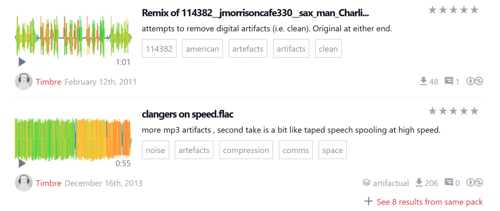

Figure 1: Search result of “Artifacts” on FreeSound.org. These
audio-text pairs are included in ALM training.

Audio generation tasks entail sounds, music, and speech. All tasks
employed different audio quality metrics, including some that aim to
resemble human assesments. TTA uses metrics like FD and Fréchet Audio
Distance (FAD) (Kilgour et al., 2018), IS, KL, and subjective metrics
like Overall Quality (OVL) and Relation of audio to text caption (REL)
(Kreuk et al., 2022). TTM uses FAD and subjective metrics like MCC
(Copet et al., 2023). TTS uses metrics like WER, SpeechLMScore (Maiti
et al., 2023), and perceptual metrics like MOSNet (Lo et al., 2019), FSD
(Le et al., 2023), and MCC. However, several aspects of audio quality
are shared across tasks, such as the presence of artifacts. Ideally, one
metric should measure quality regardless of the task hence, addressing
the challenges of task-specific metrics.

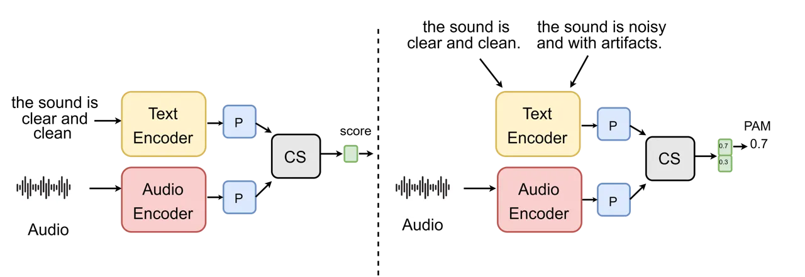

Figure 2: Two prompt strategies leveraging ALM to perform AQA. The
figure on the left shows a naive approach that takes as input one prompt
about quality and the audio intended for assessment. The output is the
cosine similarity between the audio and text embeddings, which
determines the correspondence between them. The figure on the right
shows PAM computation, which uses two “opposing” prompts to derive a
score.

Current metrics provide a reliable evaluation but pose different
challenges. Reference-based metrics require ground truth for
computation. To assess the quality of a recording, the generated audio
is compared against a desired recording to measure how much the quality
degraded. Reference-free metrics do not require a desired recording, but
usually require a pretrained model to compute embeddings on a reference
dataset. The selection of the model and the dataset would highly affect
the score (Gui et al., 2023). Other metrics like DPAM (Manocha et al.,
2020), MOSNet (Lo et al., 2019), and DNSMOS (Reddy et al., 2021a) train
a model using human evaluation and at inference use the model
predictions as a proxy for human evaluation. This requires the curation
of human evaluation and model training for each audio task.

Instead, we propose a no-reference metric that leverages learning
perceptual audio quality from human assessments in text descriptions.
ALM have learned from millions of audio-text pairs sourced from the
Internet. Some of the audio has a corresponding natural language
description of quality (See Fig. 1). For example, audio-text models
(Elizalde et al., 2023a; Elizalde et al., 2023b; Wu et al., 2022;
Deshmukh et al., 2023b) trained on FreeSound data, have seen text
descriptions like “Pad sound, with a lo-fi, high compression type feel
to it. The noise floor, with a low pass filter set around 50Hz and
several octaves of pitch bend”. Although the ALM is not explicitly
trained for audio quality assessment, it has ingested hundreds of human
annotations describing their perception of the audio. Because ALM can be
used out of the box in a Zero-Shot fashion, they can compare text
prompts about quality against audio without requiring a reference.

In this work, we introduce PAM, a novel, reference-free method for
assessing audio quality, which provides an advancement in audio quality
evaluation. Our contribution includes (1) The first Audio Language Model
(ALM) based metric for general-purpose audio-quality assessment which is
truly reference-free (2) A two-prompt antonym strategy that makes using
ALM feasible and improves correlation with human perception (3)
Extensively testing PAM on four audio tasks: Text-to-Audio Generation,
Text-to-Music Generation, Text-to-Speech, and Deep Noise Suppression.
(4) For each task, we collected human listening scores and will publicly
release the evaluation framework, generated audio and human listening
scores. We hope our work and data release push the development of
general-purpose audio quality assessment¹¹ 1 Repository:
[https://github.com/soham97/PAM](https://github.com/soham97/PAM).

## 2 PAM

Our proposed metric PAM can perform audio quality assessment by
exploiting the joint multimodal space learned by an ALM. The learned
space can be used to quantify the correspondence between quality-related
text prompts and audio recordings.

### 2.1 Audio Quality Assessment

Audio quality. The term implies a variety of properties in various
contexts. For this work, we consider audio to be high quality when the
presence of artifacts and noise is imperceptible. For example, white
noise, clipping, and other distortions. We did not consider non-speech
audio as noise, such as sound events, music, reverb, echo, and in
general all naturally occurring sounds.

Learning quality from audio-text pairs. ALM are pretrained with millions
of audio and their corresponding natural language descriptions. The text
is usually metadata created by the user who uploads the audio file to a
web archive and some pairs describe the quality and the presence of
artifacts and noise in a given audio. Therefore, as a first step, this
work focuses on specific prompting strategies to show the potential of
audio-text learning for audio quality assessment.

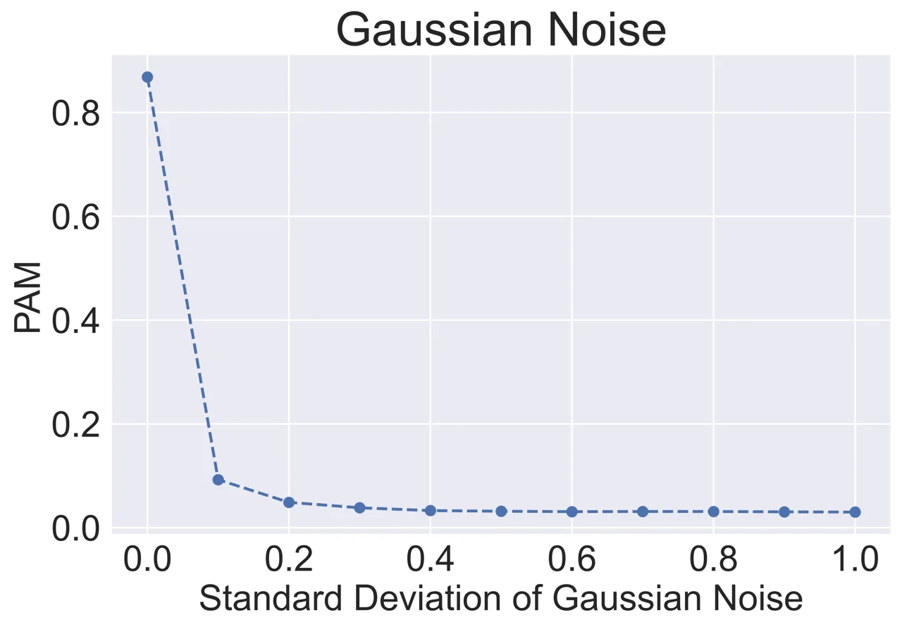

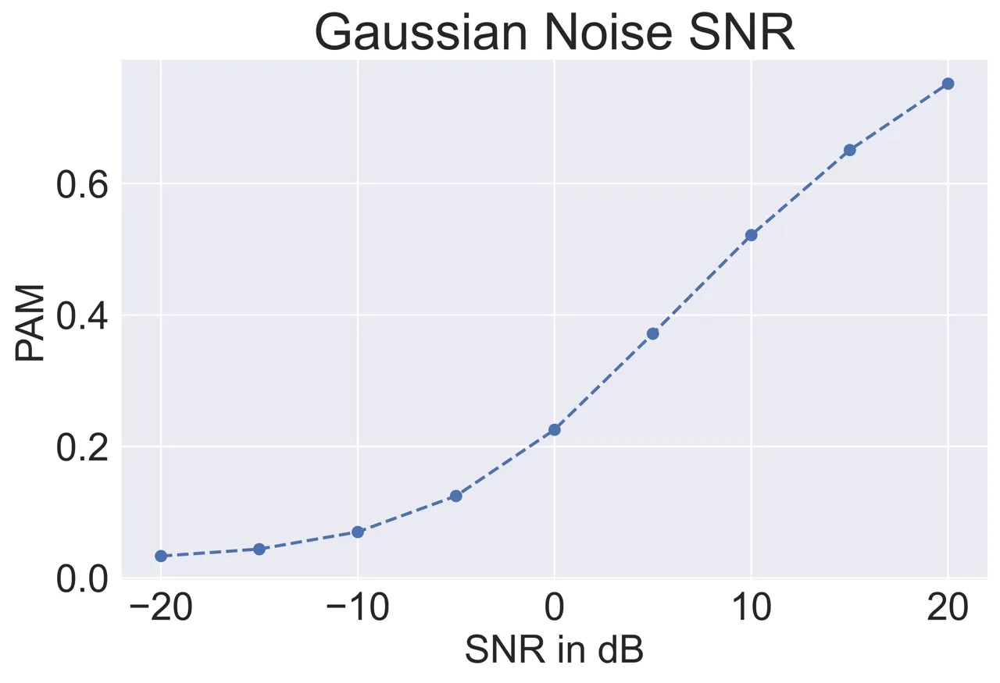

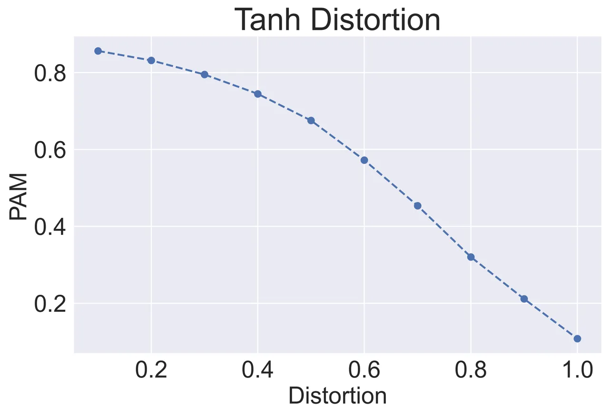

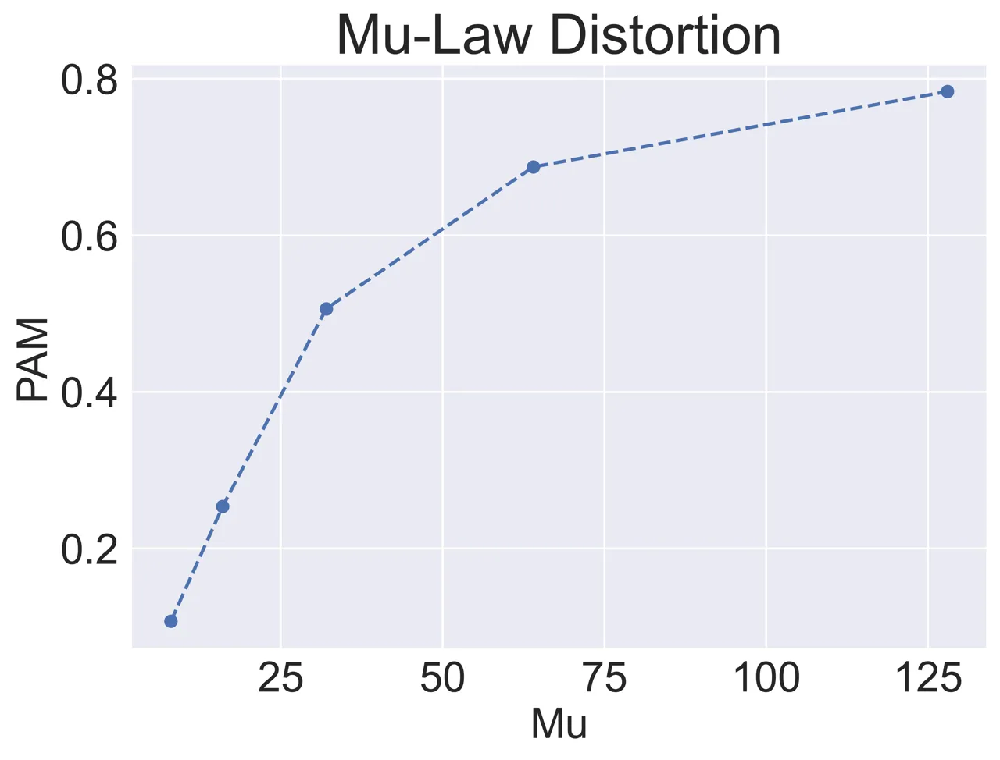

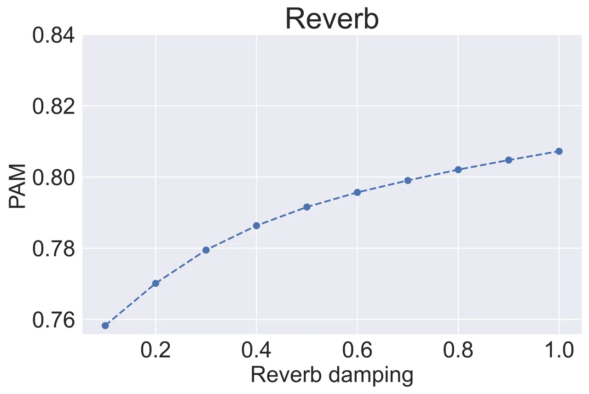

Figure 3: Effects of PAM when adding different distortions: (a) Gaussian
Noise (b) Gaussian Noise with SNR (c) Tanh distortion (d) Mu-Law
compression (e) Reverb. The dataset is a professionally recorded dataset
containing sounds. PAM decreases as the distortion of the signal
increases.

Audio-Language Model. In this work, we used the ALM called CLAP
(Elizalde et al., 2023b) trained on 4.6M pairs. The pairs are sourced
from different publicly available datasets including web archives, such
as FreeSound and FindSound which have descriptions about audio quality
(See Fig. 1). CLAP consists of audio and text encoders pretrained using
Contrastive Learning and it can be used for Zero-Shot inference. That
is, at inference time, the user provides an audio file for assessment
and text prompts about the quality (e.g. “the sound is clear and
clean”). The model embeds the audio and text in a multimodal space using
the respective encoders, computes the cosine similarity between the
embeddings and produces a correspondence score. Determining the
prompting strategy and setup to use CLAP for audio quality assessment is
still an open question.

### 2.2 Prompting setup

The user can provide an audio file and text class of “the sound is clear
and clean” and determine the audio-text similarly using the model. The
similarity can be squashed between 0 and 1 and used as a score. Though
this method is valid and used for multiple tasks (Liu et al., 2023a;
Kreuk et al., 2022; Ghosh et al., 2023), we see prompting with just one
class of “the sound is clear and clean” leads to a poor correlation with
human perception and distortions across various tasks and distributions.
One of the reasons this strategy does not work is due to linguistic
ambiguity. Particularly, if the prompt is “the sound is clear and
clean”, then depending on the context, the model can infer: (1) The
sound is easy to understand, see, or hear, without any distortion,
noise, or interference. (2) The sound is pure, crisp, and pleasant,
without any harshness, dullness, or muddiness. This meaning is based on
the definition of ‘clean’ as ‘having a pure, fresh, or smooth quality.’,
or (3) The sound is honest, accurate, and truthful, without any
deception, manipulation, or bias. This meaning is based on the
definition of ‘clean’ as ‘free from dishonesty or corruption’.

To address this problem, we prompting a strategy that will minimize
ambiguity in the latent space. This is achieved by using multiple
prompts that force the model to make similarity calculations along the
latent subspace of audio quality (e.g., “the sound is clear and clean”
and “the sound is noisy and with artifacts”). This not only reduces the
ambiguity but allows us to audio quality measurement as a binary
classification problem, where the final score is between 0 to 1 and
regarded as a relative similarity. The PAM computation is explained in
Section 2.4

### 2.3 Choice of quality prompts

The choice of text prompts has an impact on the similarity and if not
optimal leads to spurious correlates being measured rather than audio
quality. The PAM score uses ‘opposite” text prompts of “the sound is
clear and clean” and “the sound is noisy and with artifacts”. These
prompts are chosen based on analysis of CLAP’s (Elizalde et al., 2023b)
training data and tested across various setups, tasks, and
distributions. Specifically, the text descriptions in training data are
combined and a frequency count per word is obtained (unigram) after
removing stop-words. Then, we computed BERT embeddings for each word and
took cosine similarity between filtered words and the word “noise”. We
use the top 10 words from the list to form the two text prompts. In the
rest of the paper, PAM implies the usage of the above prompts.

However, to get more insight into the type of artifacts and noise, the
prompts can be changed. That is the prompts can be designed for specific
tasks and setups in mind. For example, in the definition of audio
quality 2.1, reverb and echo are not considered as noise and PAM score
does not degrade with Reverb addition 3. Therefore, our general PAM
score cannot be used as a metric for the specific task of Acoustic Echo
Cancellation (AEC) to measure echo suppression. Therefore, we can design
attribute-specific prompts for audio quality outside of our definition.

### 2.4 Computing PAM

The PAM computation is shown in Fig 2, right section. The user provides
an audio file which is converted into a mel-spectrogram
($`x\in\mathbb{R}^{T\times F}`$) and passed to CLAP’s audio encoder to
produce an audio embedding $`v\in\mathbb{R}^{1\times d}`$. In parallel,
the two “opposing” prompts about quality (“the sound is clear and clean”
and “the sound is noisy and with artifacts”) are tokenized and embedded
using the text encoder to produce text embeddings
$`u\in\mathbb{R}^{d\times N}`$. After projection into the multimodal
space, the dot product is computed between the two embeddings, followed
by softmax:
$`p_{\mathrm{h}}=\frac{e^{z_{\mathrm{h}}}}{\sum_{j=1}^{2}e^{z_{j}}}`$,
where $`\mathrm{h}`$ is the index of the prompt related to high quality,
$`z_{j}=u_{j}\cdot v`$, $`(\cdot)`$ denotes the dot product, and
$`p\in\mathbb{R}^{1\times 2}`$. The value of $`p_{\mathrm{h}}\in[0,1]`$
is the PAM score and informs about the quality of the audio.

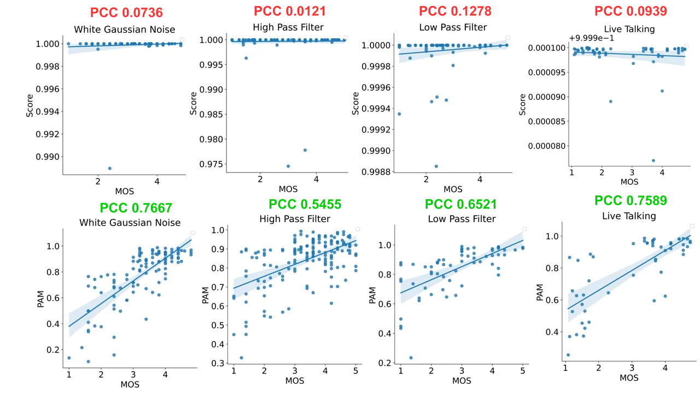

Figure 4: (PCC) Correlation plots between MOS (human subjective
evaluations) and two prompt strategies for four distortions applied to
the NISQA dataset. The top row refers to using the naive single-prompt
strategy and the second row shows PAM (two opposite prompt strategy).
Both described in Fig. 3. Using one prompt for AQA does not correlate
with MOS, but using two prompts (PAM) does.

## 3 Experiments

The experimental setup is designed to provide a comprehensive evaluation
of PAM across different distortions, prompting strategies, and datasets
from different audio generation tasks. All experiments are run using a
single 16GB V100 GPU.  
Distortions. We systematically add various types of distortions:
Gaussian Noise, Gaussian Noise with Signal-to-Noise Ratio (SNR), Tanh
distortion, Mu-Law compression, and Reverb across various source
distributions and check its effect on the PAM. The results are in
Section 4.1.  
Prompting strategy. PAM uses a two opposite prompt strategy with the
text of “the sound is clear and clean” and “the sound is noisy and with
artifacts”. In section 4.2, we compare it against the naive
single-prompt strategy. We also compare it against human evaluation.  
Audio tasks. In Section 5, we consider different generation tasks like
Text-to-Audio, Text-to-Music and Text-to-Speech Generation. For each
task, we use multiple models, perform human listening tests, and compare
PAM against established metrics.

## 4 Results

### 4.1 Effect of distortions

An audio quality metric should degrade with the presence of distortions
and artifacts in the audio. To verify this, we add common simulated
distortions to audio sourced from a professionally recorded sound effect
pack. The four types of distortions used are (1) Gaussian Noise with
increasing standard deviation (2) Gaussian Noise addition with
particular SNR (3) Tanh distortion (4) Mu Law compression. Lastly, we
add Reverb, which by the definition in Section 2.1 is not considered an
artifact or distortion. Figure 3 shows the effect of distortions on PAM
score when tested on a professionally recorded sound effect pack. The
PAM score degrades as the noise is added except for Reverb. For Reverb,
the PAM score is fairly constant, i.e., changes from 0.76 to 0.81. While
for others we see considerable degradation in PAM score. To check
robustness across source distribution, we change the dataset from
professionally recorded to AudioCaps (audio from YouTube videos
containing sound events), MusiCaps (music tracks from YouTube), and
LibriTTS (speech, audioboks). We see similar trends of PAM score
degrading with the addition of distortions and consistent scores across
Reverb. The details can be found in Appendix B.

|                                 |          |       |                   |                    |                 |                       |                        |                  |
| ------------------------------- | -------- | ----- | ----------------- | ------------------ | --------------- | --------------------- | ---------------------- | ---------------- |
| Model                           | Dur. (h) | Param | FD $`\downarrow`$ | FAD $`\downarrow`$ | IS $`\uparrow`$ | KL sig $`\downarrow`$ | KL soft $`\downarrow`$ | PAM $`\uparrow`$ |
| AudioLDM-l (Liu et al., 2023a)  | 9031     | 975M  | 43.83             | 6.229              | 5.067           | 7.422                 | 2.723                  | 0.2417           |
| AudioLDM2-l (Liu et al., 2023b) | 29510    | 1.5B  | 50.07             | 3.477              | 5.195           | 6.379                 | 2.200                  | 0.4267           |
| MelDiffusion (Appendix C.1)     | 145      | 383M  | 20.27             | 3.296              | 8.460           | 3.579                 | 1.390                  | 0.5412           |
| AudioGen-m (Kreuk et al., 2022) | 6824     | 1.5B  | 18.67             | 2.850              | 9.202           | 3.391                 | 1.797                  | 0.4683           |
| AudioCaps (Kim et al., 2019)    | -        | -     | 00.00             | 0.000              | 9.488           | 0.000                 | 0.000                  | 0.6772           |

Table 1: Evaluation of Text-to-Audio generation models from the
literature. Established metrics and PAM show similar trends.

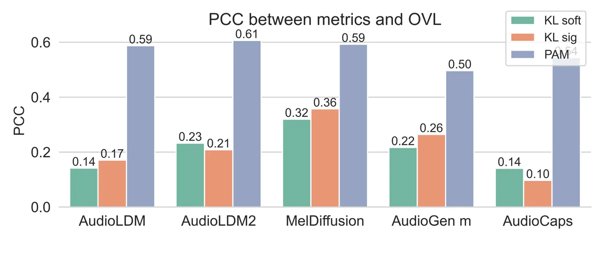

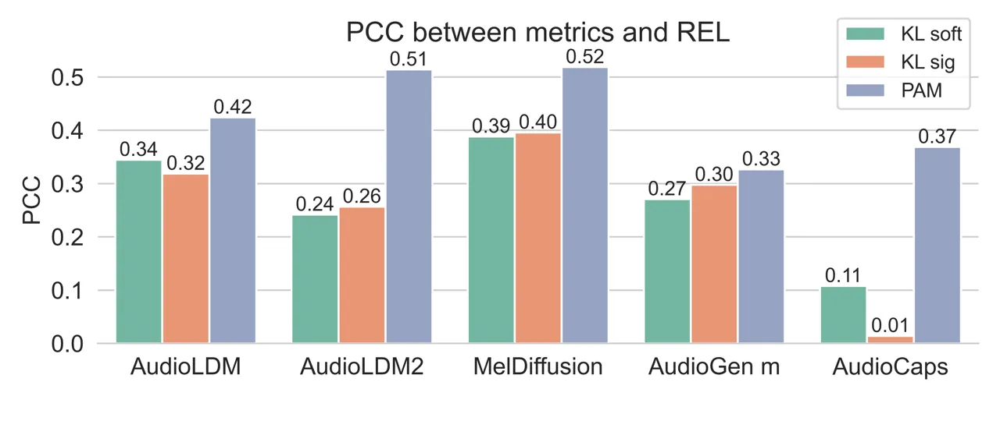

Figure 5: The absolute value of (PCC) correlation between OVL, REL and
different TTA generation models. The input text captions come from the
AudioCaps dataset. PAM, as a single-metric, is capable of correlating
well with both, overall quality (OVL) and relevance to the input caption
(REL).

### 4.2 Prompting strategy

Figure 2 shows two different prompting strategies that can be used to
get a quality-related score. The figure on the left shows naive
prompting and the figure on the right shows the opposite prompting
strategy of PAM. The advantages of the opposite prompting setup and the
limitations of the naive prompt are explained in Section 2.2. In this
section, we perform experiments to compare two setups with human
listening scores.

We use the NISQA (Non-Intrusive Speech Quality and TTS Naturalness
Assessment) (Mittag et al., 2021) dataset to check the correlation
between PAM, the single prompt strategy, and human perceptual
evaluation. The NISQA Corpus includes more than 14,000 speech samples
with simulated (e.g. codecs, packet-loss, background noise) and live
(e.g. mobile phone, Zoom, Skype, WhatsApp) conditions. Each file is
labeled with subjective ratings of the overall quality. We use simulated
and live talk corpus from NISQA. The simulated corpus contains simulated
distortions with speech samples from four different datasets and the
live talk corpus contains recordings of real phone and VoIP calls.
Unlike PAM, NISQA considers sounds events as noise, so human raters
labelled the recordings as low quality. Therefore, we created a filtered
NISQA set and applied four distortions: (1) white noise addition with a
particular SNR (2) live talk on a laptop or smartphone (3) low bandpass
filter (4) high bandpass filter. We check the correlation of the single
prompt strategy and the opposite prompt strategy against the Mean
Opinion Score (MOS) from human listeners. MOS is a numerical measure of
the human-judged overall quality and it is the arithmetic mean of the
ratings given by subjects on a predefined scale. We used the existing
MOS numbers from NISQA. The Pearson Correlation Coefficient (PCC)
measures linear correlation between two sets of data (Pearson, 1920) and
it is shown in Figure 4. PCC ranges from -1 to 1, where -1 indicates a
perfect negative correlation, 0 indicates no correlation, and 1
indicates a perfect positive correlation. We see that the single-prompt
strategy does not correlate with MOS, the human perceptual evaluation.
While PAM not only correlates, but achieves a PCC greater than 0.7 on
(1) white noise distortion and (2) real-world talk recorded from laptops
and smartphones.

### 4.3 Assessing quality across distributions

An audio quality metric should give high scores to audio that is free
from distortions. For example, professionally recorded and edited audio
should achieve a higher PAM score compared to audio sourced from
YouTube, which is generally recorded with handheld devices and may
contain noise or distortions. To confirm this hypothesis we carried on
the following setup. We compare PAM among three sets in Table 2. (1)
AudioCaps dataset sourced from YouTube containing sound events
(clapping, alarms, dog barking, etc). (2) MusicCaps data sourced from
YouTube with additional filtering to retain high-quality and remove
low-quality music recordings. (3) Professionally recorded audio
containing sound events.

|                         |                  |                  |
| ----------------------- | ---------------- | ---------------- |
| Dataset                 | Source           | PAM $`\uparrow`$ |
| AudioCaps (test set)    | YouTube          | 0.6772           |
| MusicCaps (test set)    | YouTube-filtered | 0.7718           |
| Professionally recorded | Studio           | 0.8684           |

Table 2: PAM score is higher for professionally recorded audio than for
audio from YouTube videos.

## 5 PAM for audio tasks

In this section, we use PAM to evaluate models for generation tasks. For
each task, we compare PAM against task-specific metrics and human
evaluation to show its reliability as an AQA metric.

|                                    |          |       |                   |                    |                 |                       |                        |                  |
| ---------------------------------- | -------- | ----- | ----------------- | ------------------ | --------------- | --------------------- | ---------------------- | ---------------- |
| Model                              | Dur. (h) | Param | FD $`\downarrow`$ | FAD $`\downarrow`$ | IS $`\uparrow`$ | KL sig $`\downarrow`$ | KL soft $`\downarrow`$ | PAM $`\uparrow`$ |
| AudioLDM2-m (Liu et al., 2023b)    | \-       | 1.1B  | 37.54             | 6.706              | 1.841           | 4.456                 | 1.611                  | 0.6157           |
| MusicLDM (Chen\* et al., 2023)     | 466      | \-    | 31.05             | 6.109              | 1.840           | 4.333                 | 1.428                  | 0.6887           |
| MusicGen-l (Copet et al., 2023)    | 20000    | 1.5B  | 25.91             | 4.878              | 2.101           | 4.389                 | 1.281                  | 0.8492           |
| MusicGen-mel. (Copet et al., 2023) | 20000    | 1.5B  | 24.65             | 3.955              | 2.242           | 4.197                 | 1.339                  | 0.7704           |
| MusicCaps                          | -        | -     | 00.00             | 0.000              | 4.547           | 0.000                 | 0.000                  | 0.7718           |

Table 3: Evaluation of Text-to-Music generation models from the
literature. Established metrics and PAM show similar trends.

### 5.1 Text-to-Audio generation

TTA generation models synthesize non-speech non-music audio (sounds)
from text descriptions. Although there are established metrics
available, evaluating the generation quality of these models is still an
open research question.

Table 1 shows the evaluation of TTA with objective metrics from in
literature (Liu et al., 2023a; Kreuk et al., 2022). These metrics do not
consider any type of perceptual aspect and consist of a distance between
the generated audio and a distribution from a reference set. The
objective metrics for all the systems are in Appendix C. We use publicly
available variants of AudioLDM (Liu et al., 2023a), AudioLDM2 (Liu
et al., 2023b), AudioGen (Kreuk et al., 2022) and MelDiffusion (See
Appendix for details C). We choose the variant of the model
corresponding to the largest parameter count, because it usually
correlates better with higher performance. The captions from the
AudioCaps test set (747 captions) are used to generate audio from the
above 4 models and their variants. Captions are textual descriptions of
the sounds, i.e. “A drone is whirring followed by a crashing sound”.

We carry out a human listening experiment to compute the correlation
between metrics and human perception. We randomly picked 100 captions
and their corresponding generated audio from the test set. During the
experiment, each participant was asked to rate each audio in terms of
Overall Quality - OVL and Relation of audio to text caption - REL on a
five-point Likert scale. The order of audios was fully randomized and
each audio was rated by 10 participants. Raters were recruited using the
Amazon Mechanical Turk platform. To ensure quality in the annotations,
participants who consistently provided identical scores in every HIIT
(e.g., all 1s) or who completed the task in less than 10 seconds were
excluded.

Figure 5 summarizes the PCC between per-model metrics and OVL and REL
respectively. PAM correlates correlates significantly better with human
perception of quality (OVL and REL) than the task-specific metrics of KL
softmax and KL sigmoid. The KL metric uses the CNN14 (Kong et al.,
2020b) model to extract audio embeddings for the generated and reference
set. The CNN14 model is trained to classify audio into different sound
events and hence does well at recognizing the presence of sound events
rather than overall quality. Also, a recent work (Liu et al., 2023b)
observed that reference-free metrics like KL provide high scores when
the generation model is trained on the same distribution data as the KL
reference set. PAM is a no-reference metric so it does not have these
drawbacks.

### 5.2 Text-to-Music generation

TTM generation models synthesize music based on text descriptions.
Although objective performance metrics exist, evaluating the subjective
quality of these models remains an open research question.

Subjective performance can be described in terms of Acoustic Quality
(AQ), which measures whether the generated sound is free of noise and
artifacts, and Musical Quality (MQ), which measures the quality of the
musical composition and performance.

A commonly used reference set for evaluating TTM models is
MusicCaps (Agostinelli et al., 2023), a music subset of
AudioSet (Gemmeke et al., 2017) that contains rich text captions
provided by musical experts. A recent work (Gui et al., 2023) used GPT-4
to derive AQ and MQ ratings for MusicCaps audio samples via
text-analysis of the corresponding captions. Each MusicCaps song was
assigned one AQ and one MQ label ”high”, ”medium”, or ”low”. If AQ or MQ
could not be inferred from the caption text, the label ”not mentioned”
was assigned. These text-derived labels were shown to correlate
reasonably well with human perception (Gui et al., 2023). We compare
these text-based AQ and MQ labels with an audio-only analysis via PAM.
The results shown in Table 4 indicate similar trends of audio-only PAM
and text-based analysis via GPT-4.

|           |                          |                  |
| --------- | ------------------------ | ---------------- |
| % of data | GPT-4 inference          | PAM $`\uparrow`$ |
| 39%       | Low acoustic quality     | 0.7294           |
| 2%        | Medium acoustic quality  | 0.8138           |
| 1%        | High acoustic quality    | 0.8333           |
| 58%       | Unknown acoustic quality | 0.7975           |
| 9%        | Low musical quality      | 0.7222           |
| 9%        | Medium musical quality   | 0.7770           |
| 42%       | High musical quality     | 0.7932           |
| 41%       | Unknown musical quality  | 0.7593           |

Table 4: Acoustic and musical quality of MusicCaps derived from
text-analysis based GPT-4 labels and audio-based PAM scores exhibit
similar trends.

For a direct comparison with human perception, we calculate PAM on a set
of real and generated music recordings. Subjective AQ and MQ labels were
collected by authors in (Gui et al., 2023) as MOS scores from several
human judges. The real samples were taken from the Free Music Archive
(FMA) and MusicCaps. For TTM generation, publicly available variants of
MusicLM (Agostinelli et al., 2023) and MusicGen (Copet et al., 2023), as
well as Mubert (Mubert-Inc, 2023) were used.

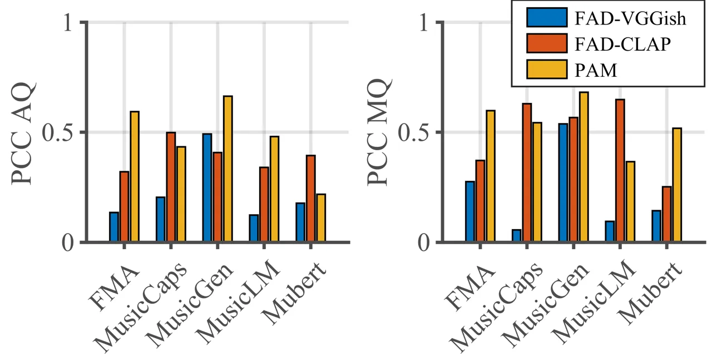

Figure 6: PCC between listening test MOS and Fréchet Audio Distance
(FAD) and PAM, for acoustic (AQ, left) and musical quality (MQ, right).

Figure 6 shows PCC between the MOS ratings and PAM. For comparison, the
(absolute) PCC of the Fréchet Audio Distance (FAD) is shown for two
pretrained models. Recall that FAD requires a pretrained model to
compute audio embeddings on a reference dataset. Here, we used MusCC, a
set of studio quality music (Gui et al., 2023), as a reference for FAD.
PAM performs competitively, outperforming the commonly used FAD-VGGish
metric in all comparisons.

Table 3 shows the evaluation of TTM with objective metrics and the
proposed PAM. The samples are generated using MusicCaps captions as
prompts. The row in grey shows results for the original MusicCaps audio
and constitutes an upper performance bound for objective metrics that
use MusicCaps audio as a reference, including FD, FAD, and KL. However,
as the quality of MusicCaps samples varies significantly (cf. Table 4)
TTM models may outperform MusicCaps in perceptual quality, as PAM
indicates for MusicGen-l. We observe similar trends for PCC results
(Table 5) corresponding to Table 3.

|              |       |                       |                       |                  |
| ------------ | ----- | --------------------- | --------------------- | ---------------- |
| Model        | Subj. | KL sof $`\downarrow`$ | KL sig $`\downarrow`$ | PAM $`\uparrow`$ |
| AudioLDM2    | OVL   | 0.1241                | 0.0929                | 0.3295           |
| MusicLDM     | OVL   | 0.1291                | 0.1617                | 0.4235           |
| MusicGen-l   | OVL   | 0.3353                | 0.3275                | 0.6018           |
| MusicGen-mel | OVL   | 0.0993                | 0.1423                | 0.6908           |
| MusicCaps    | OVL   | 0.2314                | 0.2319                | 0.5549           |
| AudioLDM2    | REL   | 0.005                 | 0.1416                | 0.1238           |
| MusicLDM     | REL   | 0.0662                | 0.0398                | 0.1399           |
| MusicGen-l   | REL   | 0.2237                | 0.2034                | 0.2309           |
| MusicGen-mel | REL   | 0.1831                | 0.2562                | 0.2622           |
| MusicCaps    | REL   | 0.1035                | 0.1566                | 0.3284           |

Table 5: PCC between human evaluation MOS and different metrics for the
models in Table. The subjective metric (Subj.) indicates the metric used
for PCC computation. 3

### 5.3 Speech Synthesis

Speech Synthesis involves creating artificial speech, either by
converting text to speech (TTS) or altering existing speech to sound
like a different speaker or style, known as voice conversion. In our
study, we examine the effectiveness of PAM in the above two tasks. For
TTS, A recent work (Alharthi et al., 2023) conducted human evaluation
studies for different TTS systems. The study used StyleTTS (Li et al.,
2022), MQTTS (Chen et al., 2023), and YourTTS (Casanova et al., 2022) to
generate speech for 100 sentences from the LibriTTS dataset (Zen et al.,
2019). Each generated sample was rated by 10 raters. We use this dataset
and compare PAM with existing metrics. The absolute results are shown in
Table 6 and the PCC correlation with human evaluation in Figure 7. On
average, PAM correlates better with human perception of speech quality
than existing metrics.

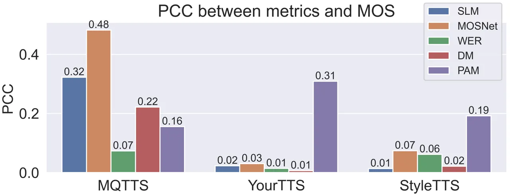

Figure 7: Absolute PCC between the human evaluation and metrics for TTS
models. The transcripts are sourced from the LibriTTS dataset. On
average, PAM correlates better with human perception of speech quality
than existing metrics.

|                       |          |       |         |
| --------------------- | -------- | ----- | ------- |
| Metric                | StyleTTS | MQTTS | YourTTS |
| WER $`\downarrow`$    | 18.7     | 29.35 | 22.1    |
| SLMScore $`\uparrow`$ | 3.62     | 4.13  | 3.96    |
| MOSNet $`\uparrow`$   | 4.49     | 3.57  | 4.01    |
| DM $`\downarrow`$     | 3.30     | 3.90  | 4.50    |
| PAM $`\uparrow`$      | 0.90     | 0.87  | 0.81    |
| MOS-N $`\uparrow`$    | 3.68     | 3.66  | 3.59    |

Table 6: Evaluating different TTS models using metrics from the
literature. MOS-N indicates MOS scores for the naturalness of generated
speech.

The second speech synthesis task we consider is Voice Conversion (VC),
where the aim is to convert audio containing the original speech to
audio containing the target speaker’s voice. For this, we use the
VoiceMOS 2022 challenge dataset (Huang et al., 2022b), specifically the
VCC subset. The VCC subset includes 3,002 utterances from 79 systems. We
test PAM on this dataset and compare it with existing metrics of MOSNet
(Lo et al., 2019), MOS-SSL (Cooper et al., 2022), and SpeechLMScore
(Maiti et al., 2023). PAM performs worse than other speech-based
finetuned metrics.

|        |         |                 |       |              |       |
| ------ | ------- | --------------- | ----- | ------------ | ----- |
| Source | Model   | Utterance-level |       | System-level |       |
|        |         | PCC             | SRCC  | PCC          | SRCC  |
| VCC    | MOSNet  | 0.654           | 0.639 | 0.817        | 0.796 |
| VCC    | MOS-SSL | 0.891           | 0.883 | 0.983        | 0.964 |
| VCC    | SLMS.   | 0.505           | 0.501 | 0.863        | 0.829 |
| VCC    | PAM     | 0.389           | 0.411 | 0.563        | 0.593 |
| OOD    | MOSNet  | 0.259           | 0.153 | 0.537        | 0.430 |
| OOD    | MOS-SSL | 0.467           | 0.459 | 0.357        | 0.437 |
| OOD    | SLMS.   | 0.138           | 0.224 | 0.049        | 0.199 |
| OOD    | PAM     | 0.582           | 0.585 | 0.634        | 0.703 |

Table 7: Utterance-level and system-level correlation of different
metrics with MOS scores. The dataset used is VCC subset and OOD subset
from VoiceMOS. PAM correlates better with MOS than other metrics in the
Out-of-Domain setup, suggesting better generalization.

On both the setup of TTS and Voice Conversion, the literature metrics
like MOSNet, and MOS-SSL were trained on the train split of data.
Therefore, all the evaluation setup is in-distribution for the existing
metrics. To check out-of-distribution performance, we consider an
out-of-domain (OOD) subset of the VoiceMOS challenge. the OOD subset is
sourced from the 2019 Blizzard Challenge (Wu et al., 2019), and contains
136 Chinese TTS samples. The PCC results of metrics are shown in Table 7. In the OOD setup, PAM correlates better than existing metrics that
are not trained on the OOD data. This showcases the ability of PAM to be
a zero-shot audio quality metric.

Overall, PAM can detect audio quality and distortions in generated
speech. For speech tasks, it falls short of task-specific metric, where
the generated speech is rated based on intelligibility or speaker
characteristics. This is explained in the Section 6.

### 5.4 Noise suppression

Noise and artifacts negatively impact perceived speech quality, e.g., in
voice communication systems (Reddy et al., 2021b). Deep Noise
Suppression (DNS) aims at enhancing speech quality by suppressing noise.
MOS derived from listeners judging the output of a DNS model provides a
subjective performance metric to develop or tune the model.
Machine-Learning based blind MOS estimators such as DNS-MOS have shown
to outperform existing objective metrics for estimating the speech
quality of DNS models (Avila et al., 2019; Reddy et al., 2021a). We
compute PAM on the output of models participating in the ICASSP 2021 DNS
challenge (Reddy et al., 2021b) and compare it against a
state-of-the-art DNS-MOS estimator (Reddy et al., 2021a). Unlike
generative models, DNS involves _removing_ unwanted signals, hence its
perceptual quality is impacted both by the quality of the (desired)
speech as well as the quality and suppression of noise. We hypothesise
that estimating such multifaceted quality may benefit from more
comprehensive prompts. As a proof of concept, we calculate PAM with two
prompt averaging strategies (see appendix for details). Table 8
summarizes the results in terms of Spearman’s Rank Correlation
Coefficient (SRCC) between the average human-labeled MOS of each tested
DNS model and the average DNS-MOS or PAM. The SRCC indicates how well
the ranking of the tested DNS models in terms of their subjective
quality is preserved (Reddy et al., 2021a). PAM performs competitively
compared to the state-of-the-art MOS estimator trained specifically for
this task.

|      |                      |                  |                            |                         |
| ---- | -------------------- | ---------------- | -------------------------- | ----------------------- |
|      | DNS-MOS $`\uparrow`$ | PAM $`\uparrow`$ | PAM\_(avgsim) $`\uparrow`$ | PAM\_(avg) $`\uparrow`$ |
| SRCC | 0.9753               | 0.8785           | 0.8962                     | 0.9289                  |

Table 8: SRCC of DNS models participating in the ICASSP 2021 DNS
challenge for state-of-the-art DNS MOS estimation model and PAM.
PAM*(avgsim) and PAM*(avg) use alternative prompting strategies (see
appendix).

## 6 Limitations

PAM show correlation with human perception of audio quality. For the
task of Text-to-Audio generation and Text-to-Music generation, PAM has
better PCC with human perception than existing metrics. However, PAM has
limitations.  
Speech generation. For speech generation tasks like Text-to-Speech and
Voice conversion, the PCC is lower than existing objective perceptual
metrics trained for the specific task. One reason for the low
correlation is that the base model CLAP (Elizalde et al., 2023b) is not
explicitly trained on speech-text pairs, let alone multilingual speech.
This limits the capability of PAM for speech generation tasks. But it
shows an opportunity area for further adding such training pairs to CLAP
or other ALM.  
Fine-grained qualities This work focuses on analyzing a specific prompt
(“the sound is clear and clean”, “the sound is noisy and contains
artifacts”) and contrastive prompting setup for audio quality score
across audio tasks. However, for specific audio tasks, changing the
prompt might lead to better performance. For example, in the TTM task,
specific prompts about melody, genre, and tune can provide information
about specific qualities other than artifacts.  
Finetuning ALMs. Existing literature trains a model to predict MOS
scores and then later uses the pretrained model as an objective
perceptual metric. In our work, we use the base in a zero-shot, and
exploring finetuning or few-shot learning has the potential to improve
PAM’s performance.

## 7 Conclusion

This paper proposes PAM, a reference-free metric for assessing audio
quality for any-to-{audio} generation. The metric is zero-shot and does
not require task reference embeddings or task-specific finetuning to
predict human scores. We extensively evaluate PAM across various
distortions and various tasks like text-to-audio, text-to-music, noise
suppression, text-to-speech, and voice-conversion. We conduct human
listening experiments for each task and check the correlation of PAM
with human perception of audio quality. Against existing metrics, PAM
correlates better with human perception for the audio and music tasks
and performs comparably for speech tasks. To further advance the
exploration of audio quality metrics, we will release audio and human
listening scores.

## References

- Agostinelli et al. (2023) Agostinelli, A., Denk, T. I., Borsos, Z.,
  Engel, J., Verzetti, M., Caillon, A., Huang, Q., Jansen, A., Roberts,
  A., Tagliasacchi, M., et al. Musiclm: Generating music from text.
  _arXiv preprint arXiv:2301.11325_, 2023.
- Alharthi et al. (2023) Alharthi, D., Sharma, R., Dhamyal, H., Maiti,
  S., Raj, B., and Singh, R. Evaluating speech synthesis by training
  recognizers on synthetic speech. _arXiv preprint
  arXiv:2310.00706_, 2023.
- Avila et al. (2019) Avila, A. R., Gamper, H., Reddy, C., Cutler, R.,
  Tashev, I., and Gehrke, J. Non-intrusive speech quality assessment
  using neural networks. In _ICASSP 2019 - 2019 IEEE International
  Conference on Acoustics, Speech and Signal Processing (ICASSP)_, pp.
  631–635, 2019. doi: 10.1109/ICASSP.2019.8683175.
- Beerends et al. (2013a) Beerends, J. G., Schmidmer, C., Berger, J.,
  Obermann, M., Ullmann, R., Pomy, J., and Keyhl, M. Perceptual
  objective listening quality assessment (polqa), the third generation
  itu-t standard for end-to-end speech quality measurement part
  i—temporal alignment. _journal of the audio engineering society_,
  61(6):366–384, 2013a.
- Beerends et al. (2013b) Beerends, J. G., Schmidmer, C., Berger, J.,
  Obermann, M., Ullmann, R., Pomy, J., and Keyhl, M. Perceptual
  objective listening quality assessment (polqa), the third generation
  itu-t standard for end-to-end speech quality measurement part
  i—temporal alignment. _journal of the audio engineering society_,
  61(6):366–384, 2013b.
- Casanova et al. (2022) Casanova, E., Weber, J., Shulby, C. D., Junior,
  A. C., Gölge, E., and Ponti, M. A. Yourtts: Towards zero-shot
  multi-speaker tts and zero-shot voice conversion for everyone. In
  _International Conference on Machine Learning_, pp. 2709–2720.
  PMLR, 2022.
- Chen\* et al. (2023) Chen\*, K., Wu\*, Y., Liu\*, H., Nezhurina, M.,
  Berg-Kirkpatrick, T., and Dubnov, S. Musicldm: Enhancing novelty in
  text-to-music generation using beat-synchronous mixup strategies.
  _CoRR_, abs/2308.01546, 2023.
- Chen et al. (2023) Chen, L.-W., Watanabe, S., and Rudnicky, A. A
  vector quantized approach for text to speech synthesis on real-world
  spontaneous speech. _arXiv preprint arXiv:2302.04215_, 2023.
- Cooper et al. (2022) Cooper, E., Huang, W.-C., Toda, T., and
  Yamagishi, J. Generalization ability of mos prediction networks. In
  _ICASSP 2022-2022 IEEE International Conference on Acoustics, Speech
  and Signal Processing (ICASSP)_, pp. 8442–8446. IEEE, 2022.
- Copet et al. (2023) Copet, J., Kreuk, F., Gat, I., Remez, T., Kant,
  D., Synnaeve, G., Adi, Y., and Défossez, A. Simple and controllable
  music generation. _arXiv preprint arXiv:2306.05284_, 2023.
- Défossez et al. (2022) Défossez, A., Copet, J., Synnaeve, G., and
  Adi, Y. High fidelity neural audio compression. _arXiv preprint
  arXiv:2210.13438_, 2022.
- Deshmukh & Rade (2018) Deshmukh, S. and Rade, R. Tackling toxic online
  communication with recurrent capsule networks. In _2018 Conference on
  Information and Communication Technology (CICT)_, pp. 1–7, 2018. doi:
  10.1109/INFOCOMTECH.2018.8722433.
- Deshmukh et al. (2023a) Deshmukh, S., Elizalde, B., Emmanouilidou, D.,
  Raj, B., Singh, R., and Wang, H. Training audio captioning models
  without audio. _arXiv preprint arXiv:2309.07372_, 2023a.
- Deshmukh et al. (2023b) Deshmukh, S., Elizalde, B., Singh, R., and
  Wang, H. Pengi: An audio language model for audio tasks. In
  _Thirty-seventh Conference on Neural Information Processing Systems_,
  2023b. URL
  [https://openreview.net/forum?id=gJLAfO4KUq](https://openreview.net/forum?id=gJLAfO4KUq).
- Dhamyal et al. (2022) Dhamyal, H., Elizalde, B., Deshmukh, S., Wang,
  H., Raj, B., and Singh, R. Describing emotions with acoustic property
  prompts for speech emotion recognition. _arXiv preprint
  arXiv:2211.07737_, 2022.
- Elizalde et al. (2023a) Elizalde, B., Deshmukh, S., Ismail, M. A., and
  Wang, H. Clap learning audio concepts from natural language
  supervision. In _ICASSP 2023 - 2023 IEEE International Conference on
  Acoustics, Speech and Signal Processing (ICASSP)_, pp. 1–5, 2023a.
  doi: 10.1109/ICASSP49357.2023.10095889.
- Elizalde et al. (2023b) Elizalde, B., Deshmukh, S., and Wang, H.
  Natural language supervision for general-purpose audio
  representations. _arXiv preprint arXiv:2309.05767_, 2023b.
- Fu et al. (2019) Fu, S.-W., Liao, C.-F., and Tsao, Y. Learning with
  learned loss function: Speech enhancement with quality-net to improve
  perceptual evaluation of speech quality. _IEEE Signal Processing
  Letters_, 27:26–30, 2019.
- Gemmeke et al. (2017) Gemmeke, J. F., Ellis, D. P. W., Freedman, D.,
  Jansen, A., Lawrence, W., Moore, R. C., Plakal, M., and Ritter, M.
  Audio set: An ontology and human-labeled dataset for audio events. In
  _2017 IEEE International Conference on Acoustics, Speech and Signal
  Processing (ICASSP)_, pp. 776–780, 2017. doi:
  10.1109/ICASSP.2017.7952261.
- Ghosh et al. (2023) Ghosh, S., Seth, A., Kumar, S., Tyagi, U., Evuru,
  C. K., Ramaneswaran, S., Sakshi, S., Nieto, O., Duraiswami, R., and
  Manocha, D. Compa: Addressing the gap in compositional reasoning in
  audio-language models. _arXiv preprint arXiv:2310.08753_, 2023.
- Gui et al. (2023) Gui, A., Gamper, H., Braun, S., and
  Emmanouilidou, D. Adapting frechet audio distance for generative music
  evaluation. _arXiv preprint arXiv:2311.01616_, 2023.
- Hershey et al. (2017) Hershey, S., Chaudhuri, S., Ellis, D. P. W.,
  Gemmeke, J. F., Jansen, A., Moore, C., Plakal, M., Platt, D., Saurous,
  R. A., Seybold, B., Slaney, M., Weiss, R., and Wilson, K. Cnn
  architectures for large-scale audio classification. In _International
  Conference on Acoustics, Speech and Signal Processing (ICASSP)_. 2017.
  URL
  [https://arxiv.org/abs/1609.09430](https://arxiv.org/abs/1609.09430).
- Hines et al. (2013) Hines, A., Skoglund, J., Kokaram, A., and
  Harte, N. Robustness of speech quality metrics to background noise and
  network degradations: Comparing visqol, pesq and polqa. In _2013 IEEE
  International Conference on Acoustics, Speech and Signal Processing_,
  pp. 3697–3701. IEEE, 2013.
- Hines et al. (2015) Hines, A., Skoglund, J., Kokaram, A. C., and
  Harte, N. Visqol: an objective speech quality model. _EURASIP Journal
  on Audio, Speech, and Music Processing_, 2015(1):1–18, 2015.
- Huang et al. (2022a) Huang, Q., Jansen, A., Lee, J., Ganti, R., Li,
  J. Y., and Ellis, D. P. W. Mulan: A joint embedding of music audio and
  natural language. In _International Society for Music Information
  Retrieval Conference_, 2022a.
- Huang et al. (2022b) Huang, W.-C., Cooper, E., Tsao, Y., Wang, H.-M.,
  Toda, T., and Yamagishi, J. The voicemos challenge 2022. _arXiv
  preprint arXiv:2203.11389_, 2022b.
- Kilgour et al. (2018) Kilgour, K., Zuluaga, M., Roblek, D., and
  Sharifi, M. Fr$`\backslash`$’echet audio distance: A metric for
  evaluating music enhancement algorithms. _arXiv preprint
  arXiv:1812.08466_, 2018.
- Kim et al. (2019) Kim, C. D., Kim, B., Lee, H., and Kim, G. AudioCaps:
  Generating Captions for Audios in The Wild. In _NAACL-HLT_, 2019.
- Kong et al. (2020a) Kong, J., Kim, J., and Bae, J. Hifi-gan:
  Generative adversarial networks for efficient and high fidelity speech
  synthesis. _Advances in Neural Information Processing Systems_,
  33:17022–17033, 2020a.
- Kong et al. (2020b) Kong, Q., Cao, Y., Iqbal, T., Wang, Y., et al.
  Panns: Large-scale pretrained audio neural networks for audio pattern
  recognition. _IEEE/ACM Trans. Audio, Speech and Lang. Proc._, 2020b.
  ISSN 2329-9290. doi: 10.1109/TASLP.2020.3030497. URL
  [https://doi.org/10.1109/TASLP.2020.3030497](https://doi.org/10.1109/TASLP.2020.3030497).
- Kreuk et al. (2022) Kreuk, F., Synnaeve, G., Polyak, A., Singer, U.,
  Défossez, A., Copet, J., Parikh, D., Taigman, Y., and Adi, Y.
  Audiogen: Textually guided audio generation. In _The Eleventh
  International Conference on Learning Representations_, 2022.
- Le et al. (2023) Le, M., Vyas, A., Shi, B., Karrer, B., Sari, L.,
  Moritz, R., Williamson, M., Manohar, V., Adi, Y., Mahadeokar, J.,
  et al. Voicebox: Text-guided multilingual universal speech generation
  at scale. In _Thirty-seventh Conference on Neural Information
  Processing Systems_, 2023.
- Li et al. (2022) Li, Y. A., Han, C., and Mesgarani, N. Styletts: A
  style-based generative model for natural and diverse text-to-speech
  synthesis. _arXiv preprint arXiv:2205.15439_, 2022.
- Liu et al. (2023a) Liu, H., Chen, Z., Yuan, Y., Mei, X., Liu, X.,
  Mandic, D., Wang, W., and Plumbley, M. D. Audioldm: Text-to-audio
  generation with latent diffusion models. _arXiv preprint
  arXiv:2301.12503_, 2023a.
- Liu et al. (2023b) Liu, H., Tian, Q., Yuan, Y., Liu, X., Mei, X.,
  Kong, Q., Wang, Y., Wang, W., Wang, Y., and Plumbley, M. D. Audioldm
  2: Learning holistic audio generation with self-supervised
  pretraining. _arXiv preprint arXiv:2308.05734_, 2023b.
- Lo et al. (2019) Lo, C.-C., Fu, S.-W., Huang, W.-C., Wang, X.,
  Yamagishi, J., Tsao, Y., and Wang, H.-M. Mosnet: Deep learning-based
  objective assessment for voice conversion. _Interspeech 2019_, 2019.
- Maiti et al. (2023) Maiti, S., Peng, Y., Saeki, T., and Watanabe, S.
  Speechlmscore: Evaluating speech generation using speech language
  model. In _ICASSP 2023-2023 IEEE International Conference on
  Acoustics, Speech and Signal Processing (ICASSP)_, pp. 1–5.
  IEEE, 2023.
- Manjunath (2009) Manjunath, T. Limitations of perceptual evaluation of
  speech quality on voip systems. In _2009 IEEE International Symposium
  on Broadband Multimedia Systems and Broadcasting_, pp. 1–6.
  IEEE, 2009.
- Manocha et al. (2020) Manocha, P., Finkelstein, A., Zhang, R., Bryan,
  N. J., Mysore, G. J., and Jin, Z. A differentiable perceptual audio
  metric learned from just noticeable differences. _arXiv preprint
  arXiv:2001.04460_, 2020.
- Manocha et al. (2021) Manocha, P., Jin, Z., Zhang, R., and
  Finkelstein, A. Cdpam: Contrastive learning for perceptual audio
  similarity. In _ICASSP 2021-2021 IEEE International Conference on
  Acoustics, Speech and Signal Processing (ICASSP)_, pp. 196–200.
  IEEE, 2021.
- Mittag et al. (2021) Mittag, G., Naderi, B., Chehadi, A., and
  Möller, S. NISQA: A Deep CNN-Self-Attention Model for Multidimensional
  Speech Quality Prediction with Crowdsourced Datasets. In _Proc.
  Interspeech 2021_, pp. 2127–2131, 2021. doi:
  10.21437/Interspeech.2021-299.
- Mubert-Inc (2023) Mubert-Inc. Mubert, 2023. URL
  [https://mubert.com/](https://mubert.com/). Available at:
  [https://mubert.com/](https://mubert.com/).
- Pearson (1920) Pearson, K. Notes on the history of correlation.
  _Biometrika_, 13(1):25–45, 1920.
- Raffel et al. (2020a) Raffel, C., Shazeer, N., Roberts, A., Lee, K.,
  Narang, S., Matena, M., Zhou, Y., Li, W., and Liu, P. J. Exploring the
  limits of transfer learning with a unified text-to-text transformer.
  _Journal of Machine Learning Research_, 21(140):1–67, 2020a. URL
  [http://jmlr.org/papers/v21/20-074.html](http://jmlr.org/papers/v21/20-074.html).
- Raffel et al. (2020b) Raffel, C., Shazeer, N., Roberts, A., Lee, K.,
  Narang, S., Matena, M., Zhou, Y., Li, W., and Liu, P. J. Exploring the
  limits of transfer learning with a unified text-to-text transformer.
  _The Journal of Machine Learning Research_, 21(1):5485–5551, 2020b.
- Reddy et al. (2021a) Reddy, C. K., Gopal, V., and Cutler, R. Dnsmos: A
  non-intrusive perceptual objective speech quality metric to evaluate
  noise suppressors. In _ICASSP 2021-2021 IEEE International Conference
  on Acoustics, Speech and Signal Processing (ICASSP)_, pp. 6493–6497.
  IEEE, 2021a.
- Reddy et al. (2021b) Reddy, C. K. A., Dubey, H., Gopal, V., Cutler,
  R., Braun, S., Gamper, H., Aichner, R., and Srinivasan, S. Icassp 2021
  deep noise suppression challenge. In _ICASSP 2021 - 2021 IEEE
  International Conference on Acoustics, Speech and Signal Processing
  (ICASSP)_, pp. 6623–6627, 2021b. doi:
  10.1109/ICASSP39728.2021.9415105.
- Rombach et al. (2022) Rombach, R., Blattmann, A., Lorenz, D., Esser,
  P., and Ommer, B. High-resolution image synthesis with latent
  diffusion models. In _Proceedings of the IEEE/CVF conference on
  computer vision and pattern recognition_, pp. 10684–10695, 2022.
- Salimans & Ho (2022) Salimans, T. and Ho, J. Progressive distillation
  for fast sampling of diffusion models. _arXiv preprint
  arXiv:2202.00512_, 2022.
- Serrà et al. (2021) Serrà, J., Pons, J., and Pascual, S. Sesqa:
  semi-supervised learning for speech quality assessment. In _ICASSP
  2021-2021 IEEE International Conference on Acoustics, Speech and
  Signal Processing (ICASSP)_, pp. 381–385. IEEE, 2021.
- Torcoli et al. (2021) Torcoli, M., Kastner, T., and Herre, J.
  Objective measures of perceptual audio quality reviewed: An evaluation
  of their application domain dependence. _IEEE/ACM Transactions on
  Audio, Speech, and Language Processing_, 29:1530–1541, 2021.
- Wu et al. (2022) Wu, Y., Chen, K., Zhang, T., Hui, Y.,
  Berg-Kirkpatrick, T., and Dubnov, S. Large-scale contrastive
  language-audio pretraining with feature fusion and keyword-to-caption
  augmentation. _arXiv preprint arXiv:2211.06687_, 2022.
- Wu et al. (2019) Wu, Z., Xie, Z., and King, S. The blizzard
  challenge 2019. In _Proc. Blizzard Challenge Workshop_, volume
  2019, 2019.
- Zen et al. (2019) Zen, H., Dang, V., Clark, R., Zhang, Y., Weiss,
  R. J., Jia, Y., Chen, Z., and Wu, Y. Libritts: A corpus derived from
  librispeech for text-to-speech. _arXiv preprint
  arXiv:1904.02882_, 2019.
- Zhang et al. (2018) Zhang, H., Zhang, X., and Gao, G. Training
  supervised speech separation system to improve stoi and pesq directly.
  In _2018 IEEE International Conference on Acoustics, Speech and Signal
  Processing (ICASSP)_, pp. 5374–5378. IEEE, 2018.
- Zhou et al. (2021) Zhou, R., Deshmukh, S., Greer, J., and Lee, C.
  Narle: Natural language models using reinforcement learning with
  emotion feedback. _arXiv preprint arXiv:2110.02148_, 2021.

The appendix is organized as follows: Section A covers related work and
Section B explores effect of distortions, Section C provides details of
TTA generation models and listening experiment for the task, Section D
covers TTM generation models and listening experiment for the task,
Section E explains noise suppression task and prompt averaging strategy.

## Appendix A Related work

Speech quality. The early attempts at speech quality metrics (eg. PESQ
(Beerends et al., 2013a), POLQA (Beerends et al., 2013b), ViSQOL (Hines
et al., 2015)) were developed based on human studies. However, the
methods were found to be sensitive to distortions (Hines et al., 2013;
Manjunath, 2009). Some of the later works tried to improve PESQ and STOI
using expensive gradient updates (Zhang et al., 2018; Fu et al., 2019).
DPAM (Manocha et al., 2020) learns a perceptual metric by learning a
model from crowdsourced human judgments asked to answer whether the two
recordings are identical. They show their metric better correlates with
MOS tests compared to PESQ (Beerends et al., 2013a). However, the metric
requires a large set of human judgments and can still generalize poorly
to new speakers and content. CDPAM (Manocha et al., 2021) aims to use a
combination of contrastive and multi-dimensional representation learning
to separately model two similarities- content and acoustic.
Concurrently, SESQA (Serrà et al., 2021) uses 5 complementary tasks to
improve performance.  
The above speech quality metrics can be used for both speech enhancement
and TTS. However, for TTS, metrics like WER, SpeechLMScore (Maiti
et al., 2023), MOSNet (Lo et al., 2019) are prominently used. Voicebox
(Le et al., 2023) introduces Fréchet Speech Distance (FSD) by adapting
Fréchet distance using self-supervised wav2vec 2.0 features. (Alharthi
et al., 2023) propose an evaluation technique involving the training of
an ASR model on synthetic speech and assessing its performance on real
speech. The gold standard evaluation is subjective metrics based on MOS
along the direction of naturalness and intelligibility.  
Sound quality. TTA generation focuses on synthesizing general audio
based on text descriptions. The metrics used for objective evaluation
include Frechet distance (FD), Frechet Audio Distance (FAD), Inception
Score (IS), and Kullback–Leibler (KL) divergence. All the above metrics
require the computation of audio embedding, specifically VGGish (Hershey
et al., 2017) for FAD and PANN (Kong et al., 2020b) for others. For
subjective evaluation, two aspects are evaluated. The users are asked to
rate the generated samples for their (a) Overall quality (OVL) and (b)
relevance to input (REL) on a scale of 1 to 100 or 1 to 5.  
Music quality. TTM generation focuses on synthesizing music based on
text descriptions. The objective and subjective metrics used are the
same as TTA generation. MusicLM (Agostinelli et al., 2023) also uses
MuLan (Huang et al., 2022a) to compute the file-wise similarity between
text and audio embeddings. For subjective evaluation, MusicLM uses an
A-vs-B human rating task, to check the adherence of generated samples to
the text descriptions. The users are required to choose between two
samples by selecting one of the five answers: strong or weak preference
for A or B, and no preference.  
Audio-Text metrics The existing audio-text metric in literature, CLAP
score (Liu et al., 2023a), measures the similarity between the caption
and the generated audio. The metric measures the relevance between audio
and text.

## Appendix B Effect of distortions

This section 4.1 shows results on a professionally recorded audio pack.
In this section, we vary the source data and check degradation in PAM
score. The source data considered is Professionally recorded audio,
AudioCaps (Sound events, YouTube sourced), MusiCaps (Music, YouTube
sourced), and LibriTTS (speech, audiobooks). The four types of
distortions used are (1) Gaussian noise with increasing standard
deviation (2) Gaussian Noise addition with particular SNR (3) Tanh
distortion (4) Mu Law compression (5) Reverb. Lastly, we also add
Reverb, which by the definition in Section 2.1 is not considered as an
artifact or distortion. Figure 8 shows the effect of distortions on PAM
score across different source distributions. We see the PAM score
degrading with the addition of noise except for Reverb where it remains
constant.

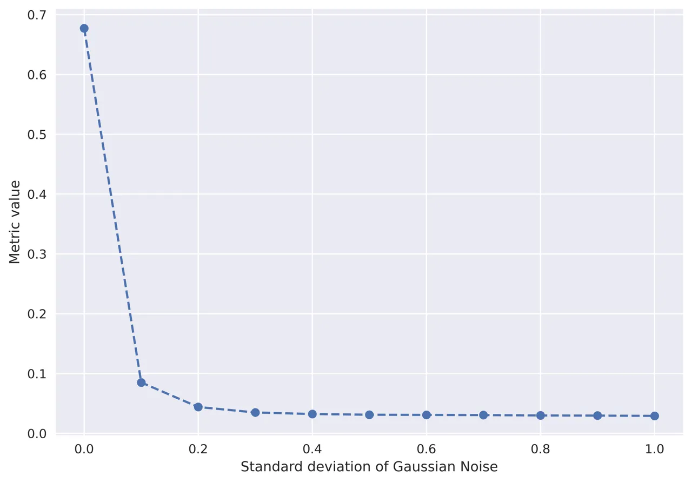

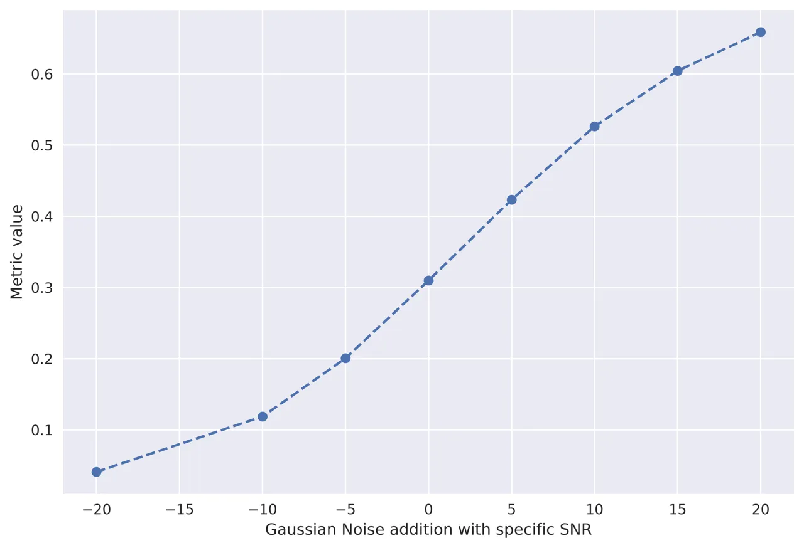

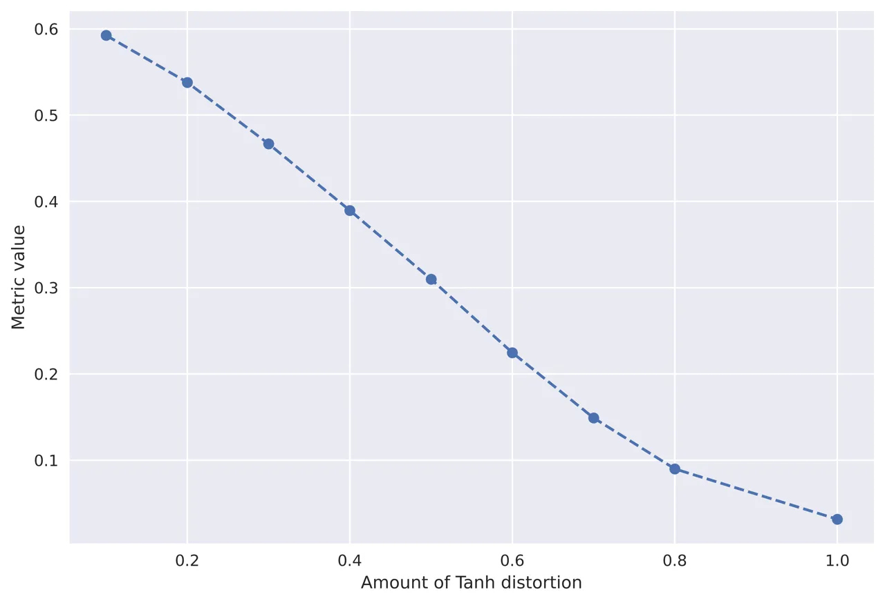

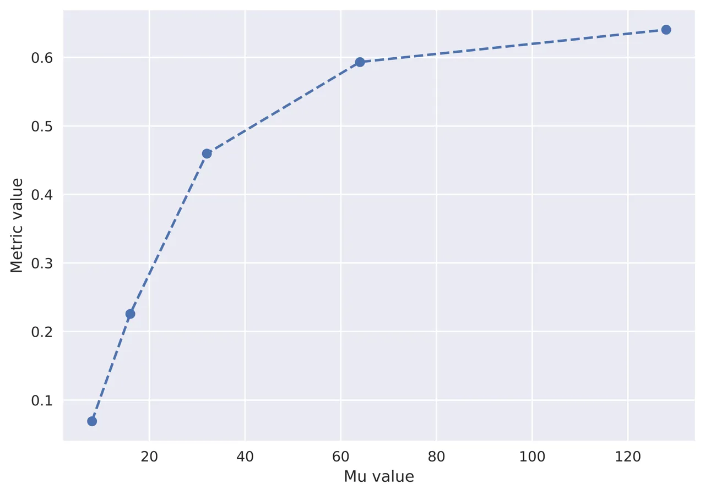

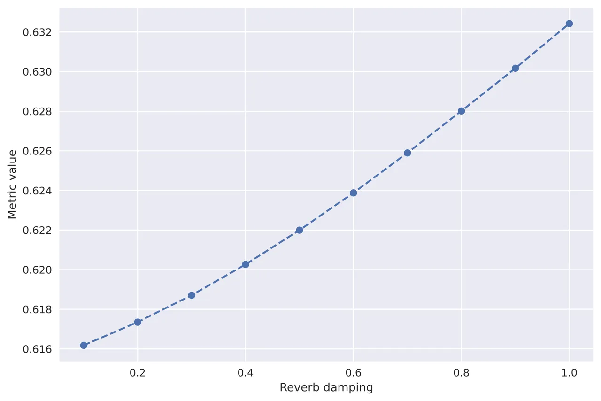

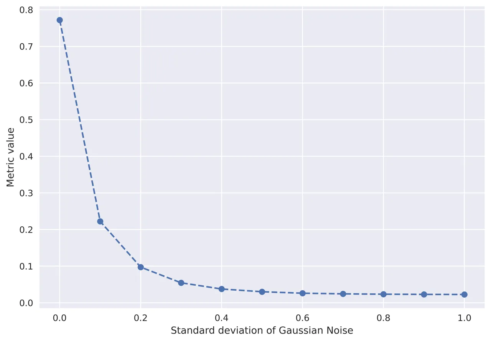

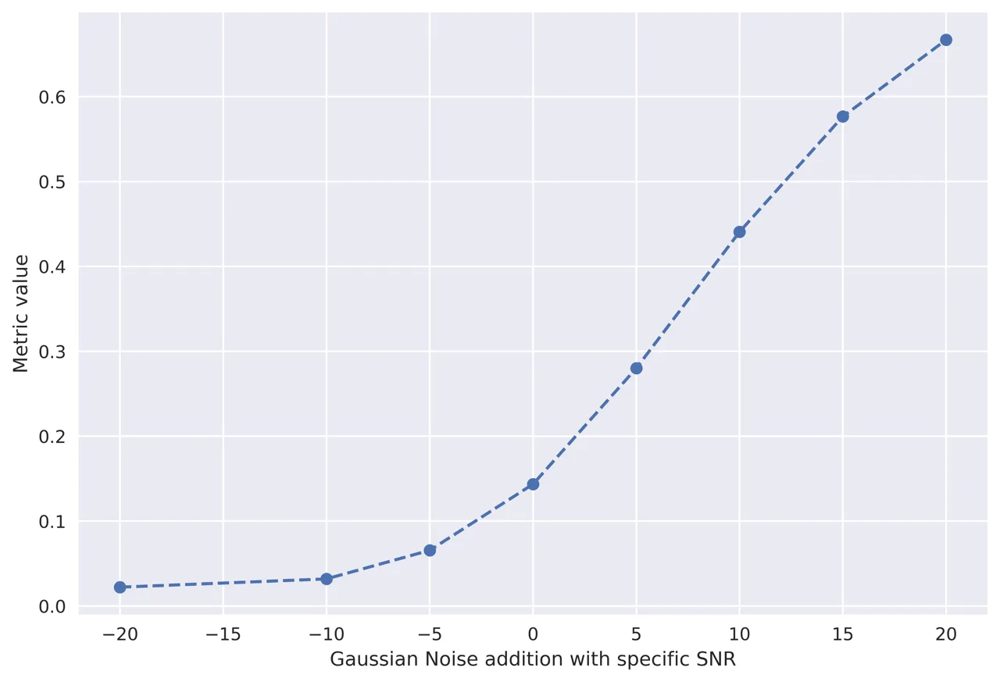

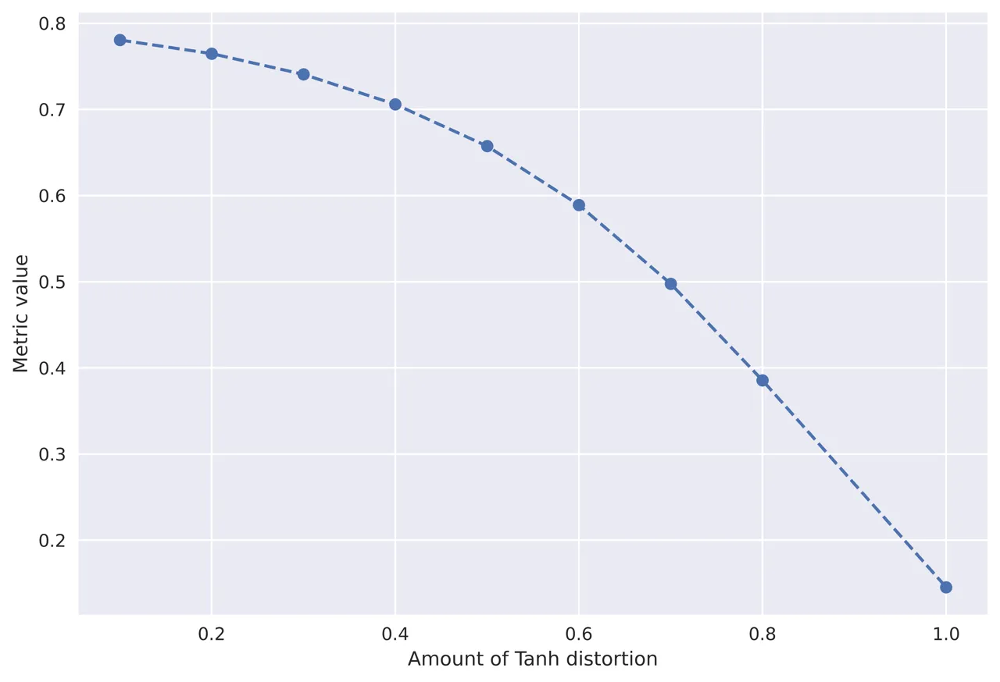

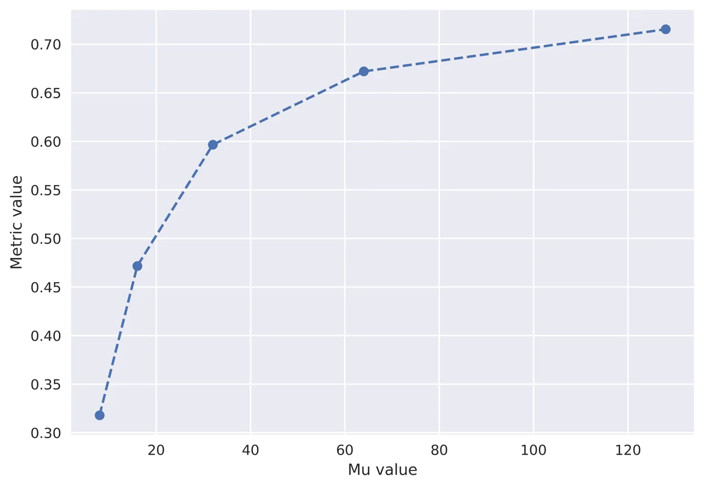

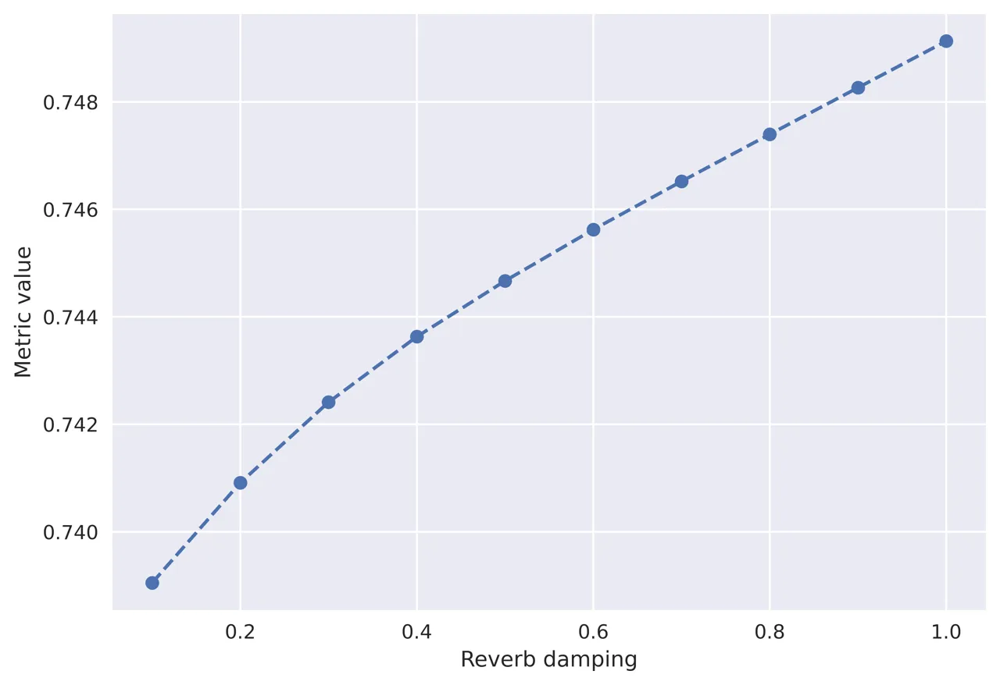

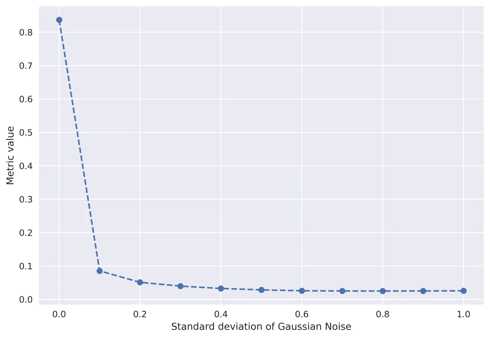

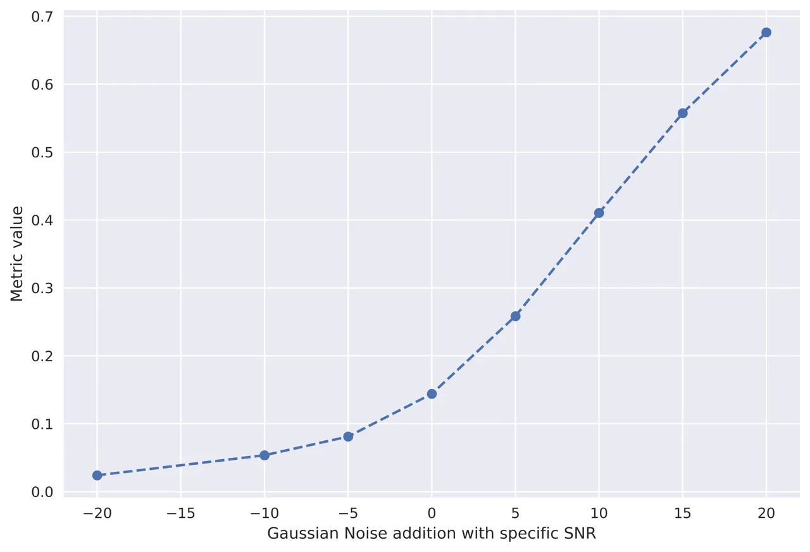

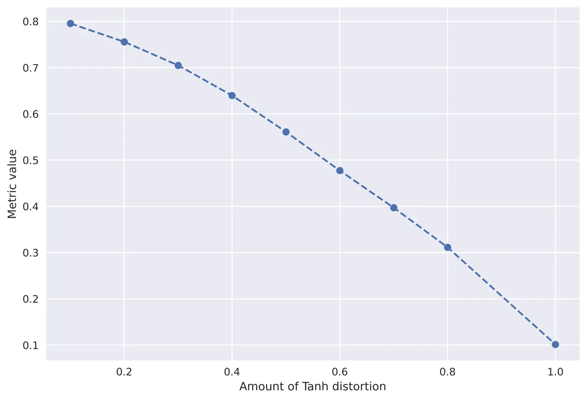

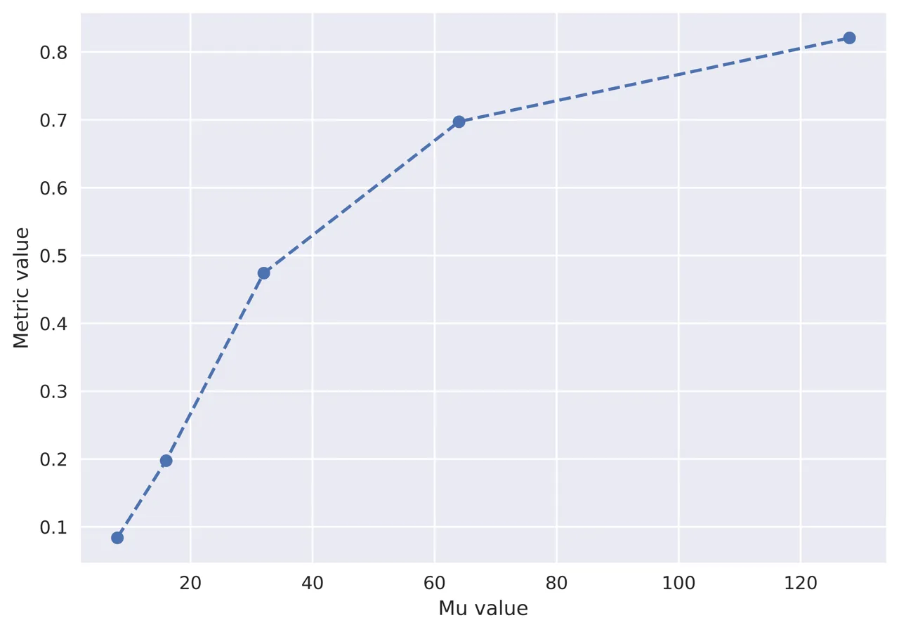

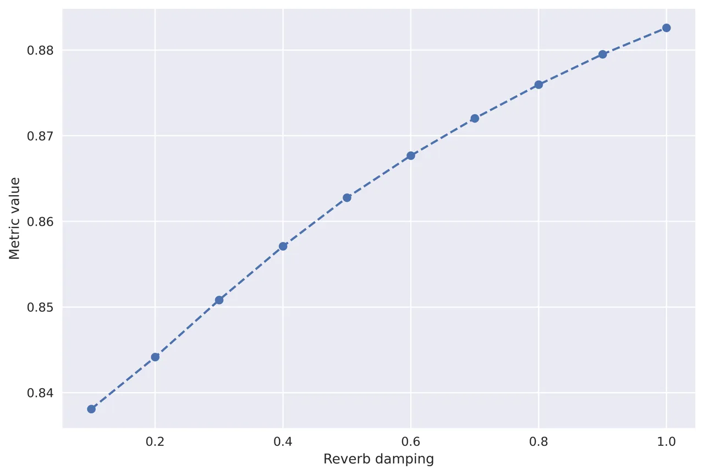

Figure 8: Effect of (a) Gaussian Noise (b) Gaussian Noise with SNR (c)
Tanh distortion (d) Mu-Law compression (e) Reverb. on PAM value. The
first row uses AudioCaps sourced from YouTube, the second row uses
MusicCaps sourced from YouTube, and the third row uses LibriTTS clean
set. The Figure 3 shows effect of distortion for professionally recorded
audio

## Appendix C Text-to-Audio generation

### C.1 Text-to-Audio models

For TTA generation, we use publicly available variants of AudioLDM (Liu
et al., 2023a), AudioLDM2 (Liu et al., 2023b), AudioGen (Kreuk et al., 2022) and MelDiffusion.  
AudioLDM. The model (Liu et al., 2023a) is based on latent diffusion
models (LDMs) (Rombach et al., 2022). The latent space is obtained by
applying a variational autoencoder (VAE) to the mel-spectrograms of
audio clips. The LDMs use UNet conditioned on CLAP text embeddings.
During training, the LDMs learn to reconstruct the audio embeddings from
Gaussian noise, while being guided by the text embeddings. During
sampling, the LDMs generate audio embeddings from the text embeddings
and then decode them into waveforms using the VAE followed by a HiFi-GAN
(Kong et al., 2020a) vocoder. Our experiments use the model versions
hosted on huggingface with 100 denoising steps to generate audio.  
AudioLDM2. The model consists of three main components: a text encoder,
a GPT-2 decoder, and a latent diffusion model. The text encoder uses two
pre-trained models, CLAP and Flan-T5, to obtain text embeddings that
capture both the alignment and the semantics of the text. Then GPT-2
generates a sequence of new embedding vectors, called the language of
audio (LOA), based on the text embeddings. The latent diffusion model
de-noises a random latent vector into an audio waveform, conditioned on
the LOA and the Flan-T5 text embeddings. The model is trained with
self-supervised pre-training and fine-tuning on different audio domains.
Our experiments use the model versions hosted on huggingface with 100
denoising steps to generate audio.  
AudioGen. The model is a Transformer decoder operating over a residual
vector quantized representation (RVQ) of the audio signal. The model
generates audio from text by using textual features as conditioning
signal. Our experiments use the model versions hosted on huggingface
(Kreuk et al., 2022). The model uses Encodec (Défossez et al., 2022) to
obtain the RVQ from audio, T5 (Raffel et al., 2020a) to obtain textual
features and is trained using the delay-pattern technique (Copet et al., 2023) to model the RVQ.  
MelDiffusion. The model is based on using the diffusion model on
spectrograms instead of latent space. The text encoder used is T5-large
(Raffel et al., 2020b) and the diffusion model is DDIM based on
progressive distillation (Salimans & Ho, 2022). The base UNet is
inserted with additional self-attention layers to produce coherent
30-second or more audio while training on only 5-second audio. For
inference, we use 100 denoising steps to generate audio.

### C.2 Human Listening experiment

We evaluated text-to-audio generation using Amazon Mechanical Turk
(MTurk). In this evaluation, participants were asked to rate the quality
of the audio and its relevance to the provided description. The ratings
were given on a Likert scale from 1 (poor quality or minimal relevance)
to 5 (excellent quality or perfect match with the description). Detailed
instructions given to participants are outlined in Table 9, and the
specific questions posed, along with their response options, are listed
in Table 10. For this test, we chose 100 random samples from the
AudioCaps dataset. We then generated audio for these samples using four
different models: MelDiffusion, AudioLDM2-l, AudioLDM-l, and AudioGen-m.
resulting in 500 samples. Each of these samples was rated by 10
different participants, all of whom were located in the United States,
resulting in a total of 8,000 scores evaluating both the quality and
relevance of the audio. To ensure the quality and reliability of the
data, we applied a rigorous filtering process to the responses. If a
participant’s scores showed a standard deviation of zero for more than
five samples, their responses were excluded from the analysis. Also, any
responses from participants who took less than 10 seconds to complete
their ratings were also excluded. Furthermore, we will release the
collected data, both raw and filtered.

|                                                                                                                                                                                                                                                                                                                                                                                                                                 |
| ------------------------------------------------------------------------------------------------------------------------------------------------------------------------------------------------------------------------------------------------------------------------------------------------------------------------------------------------------------------------------------------------------------------------------- |
|                                                                                                                                                                                                                                                                                                                                                                                                                                 |
| Task Instructions                                                                                                                                                                                                                                                                                                                                                                                                               |
| Your task is to evaluate the quality and text relevance of audio clips. These clips include various sounds and speech such as dog barking and rain. You will first rate the sound quality, and then assess its relevance to the text description.                                                                                                                                                                               |
|                                                                                                                                                                                                                                                                                                                                                                                                                                 |
| Definition of quality in this test:                                                                                                                                                                                                                                                                                                                                                                                             |
| In this evaluation, ’quality’ refers to the fidelity of the generated audio in replicating real-life sounds. Our focus is on assessing a text-to-audio generation system, which converts textual descriptions into corresponding audio outputs. The audio output may include real-world noises, such as ambulance sirens, dog barking, and screaming. The primary goal is to assess the realism of these sounds in the audio.   |
|                                                                                                                                                                                                                                                                                                                                                                                                                                 |
| Important Note:                                                                                                                                                                                                                                                                                                                                                                                                                 |
| Please be aware that during this audio quality test, you may encounter segments where speech is present. It’s normal and expected that the speech might not be intelligible. This is not a concern for this specific test. Your main focus should be on evaluating the overall audio quality, not the intelligibility of the words spoken.                                                                                      |
|                                                                                                                                                                                                                                                                                                                                                                                                                                 |
| Warning:                                                                                                                                                                                                                                                                                                                                                                                                                        |
| Please be advised that during this audio test, some segments may feature very loud sounds. We recommend adjusting your volume to a comfortable level before beginning the test and being prepared to adjust it as needed during the test. Your safety and comfort are important to us. If at any point you find the audio uncomfortably loud, please feel free to lower the volume or pause the test to readjust your settings. |
|                                                                                                                                                                                                                                                                                                                                                                                                                                 |

Table 9: Guidelines Given to Amazon Mechanical Turk Participants for TTA
task.

|                                                                                                   |
| ------------------------------------------------------------------------------------------------- |
|                                                                                                   |
| Please listen carefully to the following audio then answer the two questions below.               |
|                                                                                                   |
| How good does the audio sound to you in terms of quality and realism?                             |
|                                                                                                   |
| 1 (Poor) The audio quality is very low, making it hard to discern the intended sounds.            |
| 2 (Fair) Audio quality is below average, but the intended sounds are somewhat recognizable.       |
| 3 (Good) The audio has decent quality with clear and recognizable sounds.                         |
| 4 (Very Good) Audio quality is high, closely resembling real-world audio with minimal distortion. |
| 5 (Excellent) The audio quality is highly realistic with perfect fidelity.                        |
|                                                                                                   |
| How well does this audio match with the provided description?                                     |
| Description: audio description.                                                                   |
|                                                                                                   |
| 1 (Poor) Audio has minimal or no relevance to the text.                                           |
| 2 (Fair) Audio shows limited relevance to the text.                                               |
| 3 (Good) Audio is adequately relevant to the text.                                                |
| 4 (Very Good) Audio is highly relevant to the text.                                               |
| 5 (Excellent) Audio perfectly matches the text.                                                   |
|                                                                                                   |

Table 10: Questions and Response Options Presented to MTurk Participants
for TTA task.

## Appendix D Text-to-Music generation

### D.1 Text-to-Music models

For TTM generation, we use AudioLDM2-m (Liu et al., 2023b), MusicLDM
(Agostinelli et al., 2023), and MusicGen (Copet et al., 2023).  
AudioLDM2-m. The architecture is from AudioLDM2 (Section C.1) but
trained on music.  
MusicLDM. The model adapts Stable Diffusion and AudioLDM architectures
to the music domain. For this, the CLAP and vocoder components are
retrained along with the introduction of a beat-tracking model and
different mixup strategies. The mixup strategies encourage the model to
generate music that is diverse yet grounded in the requested style.  
MusicGen. The model is similar in architecture and training objective as
AudioGen, described in C.1, but trained on music rather than audio
events. Our experiments use the model versions hosted on huggingface
using the default provided configuration. Namely, each model generates
music with a 32kHz sampling rate, discretized using an Encodec tokenizer
with 4 codebooks where each token is sampled at 50 Hz. The token
generation uses top-k sampling where $`k=250`$.

### D.2 Human Listening experiment

To evaluate the effectiveness of PAM in TTM generation, we conducted a
human evaluation test using MTurk. In this test, participants were asked
to rate the quality of music generated and its relevance to a given
description. These ratings were based on a Likert scale ranging from 1
(poor quality or minimal relevance) to 5 (excellent quality or perfect
match with the description), as detailed in Table 12 and 11. For this
purpose, we selected 100 random samples from MusicCaps dataset. For each
sample, we generated music based on a text description using four
different models: AudioLDM2-m, MusicLDM, MusicGen-l, MusicGen-mel, and
the original MusicCaps model resulting in a total of 500 audio samples.
To ensure a comprehensive evaluation, each sample was rated by 10
different participants, all of whom were located in the United States,
culminating in 8,000 individual scores assessing both quality and
relevance. In order to maintain the integrity of our data, we applied a
filtering process similar to the one used in our TTA generation test. We
excluded any participant whose ratings showed no variation (a standard
deviation of zero) for more than five samples, or who completed the
rating in less than 10 seconds. We will release both the raw and
filtered datasets for human evaluation. This will allow for further
analysis and transparency in our findings.

|                                                                                                                                                                                                                                                                                                                                                                                                                                                                                             |
| ------------------------------------------------------------------------------------------------------------------------------------------------------------------------------------------------------------------------------------------------------------------------------------------------------------------------------------------------------------------------------------------------------------------------------------------------------------------------------------------- |
|                                                                                                                                                                                                                                                                                                                                                                                                                                                                                             |
| Task Instructions                                                                                                                                                                                                                                                                                                                                                                                                                                                                           |
| Your task is to rate the overall quality of the music and the relevance of the music with the text description. Listen to each clip and first evaluate its sound quality. Then, assess how well the music matches the provided description.                                                                                                                                                                                                                                                 |
| Important Note:                                                                                                                                                                                                                                                                                                                                                                                                                                                                             |
| During this music evaluation test, you might find descriptions mentioning a singer or vocals. However, please note that the actual audio may consist only of instrumental music without any singing. This discrepancy is normal and expected for this test. Even if the description refers to singing, your focus should be on assessing the music’s quality and how well the instrumental audio aligns with the overall theme of the description, irrespective of the presence of singing. |
|                                                                                                                                                                                                                                                                                                                                                                                                                                                                                             |

Table 11: Guidelines Given to MTurk Participants for TTM task.

|                                                                                                         |
| ------------------------------------------------------------------------------------------------------- |
|                                                                                                         |
| Please listen carefully to the following audio then answer the two questions below.                     |
|                                                                                                         |
| How good is the quality of the music?                                                                   |
|                                                                                                         |
| 1 (Poor) The music quality is very low, with poor clarity and composition.                              |
| 2 (Fair) Music quality is below average, with some elements of composition recognizable.                |
| 3 (Good) The music has decent quality with clear composition and a pleasant listening experience.       |
| 4 (Very Good) Music quality is high, offering a rich and engaging listening experience.                 |
| 5 (Excellent) The music quality is outstanding with excellent clarity, composition, and overall appeal. |
|                                                                                                         |
| How well does this music match with the provided description?                                           |
| Description: audio description.                                                                         |
|                                                                                                         |
| 1 (Poor) Music has minimal or no relevance to the description.                                          |
| 2 (Fair) Music shows limited relevance to the description.                                              |
| 3 (Good) Music is adequately relevant to the description.                                               |
| 4 (Very Good) Music is highly relevant to the description.                                              |
| 5 (Excellent) Music perfectly matches the description.                                                  |
|                                                                                                         |

Table 12: Questions and Response Options Presented to MTurk Participants
for TTM task.

## Appendix E Noise suppression

### E.1 Problem description

DNS aims at enhancing speech for voice communication by removing
unwanted noise from a recording. However, DNS typically introduces its
own processing artifacts and distortions that may degrade the desired
speech signal or cause unpleasant artifacts in the background noise that
is not suppressed. Therefore, the performance of a DNS model in terms of
perceptual quality depends on a variety of factors. To measure the
quality of DNS systems, a subjective listening test can be performed
where human judges assign ratings to the model output, typically from 1
(worst) to 5 (best). The Mean Opinion Score (MOS) for an output sample
is obtained by averaging the human ratings. As an alternative to costly
subjective testing, machine-learning models can be trained on DNS output
samples and their corresponding MOS labels to perform blind DNS MOS
estimation. Various DNS models or model variations can be compared in
terms of their average subjective or estimated MOS. In Section 5.4 the
performance of PAM for ranking various DNS models is compared to a
state-of-the-art DNS MOS estimation model. The comparison is performed
on the blind test set of the ICASSP 2021 DNS challenge processed by over
20 different DNS models. The state-of-the-art DNS-MOS estimator and PAM
are compared in terms of the Spearman’s Rank Correlation Coefficient
(SRCC) computed using the MOS averaged for each model. The authors of
DNS-MOS found this to be a robust metric for evaluating the performance
of a MOS estimator for comparing different DNS models.

### E.2 Prompt averaging

Given the complex and multifaceted nature of the perceptual quality of
DNS output samples, we experiment with two simple prompt averaging
schemes that aim at a broader and more robust quality estimation:
PAM*(avgsim) and PAM*(avg). The underlying hypothesis is that averaging
over multiple quality-related prompts may yield a less noisy and
perceptually broader similarity metric than the two primary prompts
($`\mathrm{h}1`$ and $`\mathrm{b}1`$ below) that focus specifically on
the presence or absence of noise and artifacts. To this end, we
introduce two additional prompts directly querying sound _quality_:

- •
  $`\mathrm{h}1`$: “the sound is clear and clean”
- •
  $`\mathrm{b}1`$: “the sound is noisy and with artifacts”
- •
  $`\mathrm{h}2`$: “the sound quality is good”
- •
  $`\mathrm{b}2`$: “the sound quality is bad”

To compute PAM\_(avgsim), we average the dot products before taking the
softmax:

```math
z_{\mathrm{h},\mathrm{avg}}=\frac{1}{K}\sum_{i=1}^{K}u_{\mathrm{h}i}\cdot v \tag{1}
```

for $`K`$ high quality prompts $`\mathrm{h}i`$.
$`z_{\mathrm{b},\mathrm{avg}}`$ is computed analogously using low
quality prompts $`\mathrm{b}i`$.

PAM\_(avgsim) is then given as

```math
p_{\mathrm{h}}=\frac{e^{z_{\mathrm{h},\mathrm{avg}}}}{\sum_{j=1}^{2}e^{z_{j,\mathrm{avg}}}}. \tag{2}
```

PAM\_(avg) is computed as PAM averaged over multiple prompt pairs:

```math
p_{\mathrm{h},\mathrm{avg}}=\frac{1}{K}\sum_{i=1}^{K}p_{\mathrm{h}i}, \tag{3}
```

where $`p_{\mathrm{h}i}`$ is computed via Eq. 2 using a prompt pair
$`\mathrm{h}i`$ and $`\mathrm{b}i`$. In our preliminary experiments we
found the most effective prompt pairs to be
$`[\mathrm{h}1,\mathrm{b}2]`$ and $`[\mathrm{h}2,\mathrm{b}1]`$, though
this finding may not generalize to other tasks or datasets. Note that
the proposed simple averaging schemes generalize to arbitrary numbers
and combinations of prompts. However, we leave a more thorough
investigation of prompting strategies for future work.

56, 12, 15, 13
