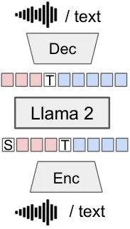
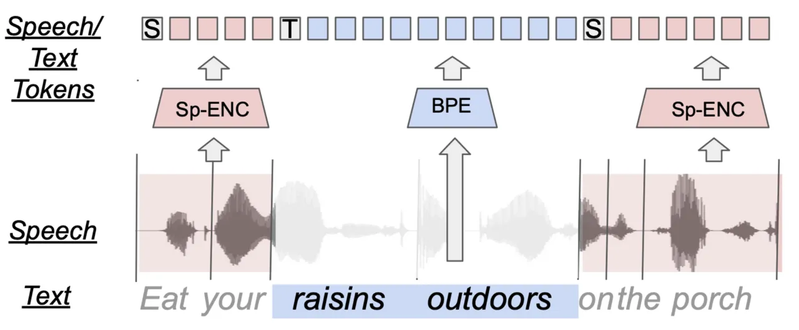
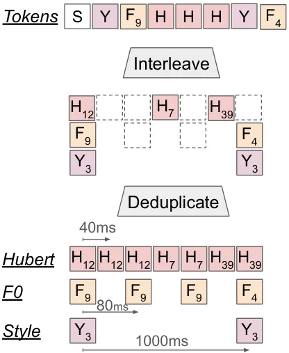
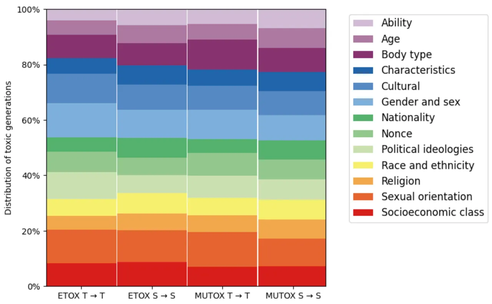
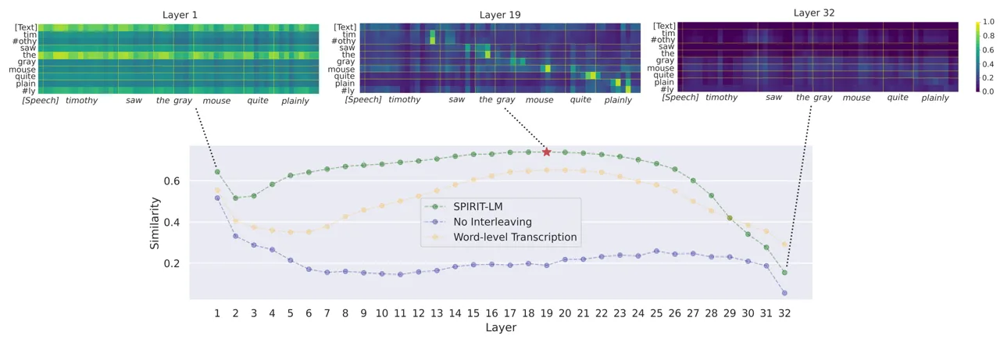

# Spirit LM: Interleaved Spoken and Written Language Model

Tu Anh Nguyen ^(†)^(†)thanks: \$ˆa,b,c\$ Equally contributed as
co-first, co-second and co-last authors, resp. Affiliation:  Meta AI,
^(†) Inria, Paris, ^(‡) EHESS, ENS-PSL, CNRS, Paris
Email: [ntuanh@meta.com](mailto:)    Benjamin Muller Affiliation:  Meta
AI, ^(†) Inria, Paris, ^(‡) EHESS, ENS-PSL, CNRS, Paris
Email: [benjaminmuller@meta.com](mailto:)    Bokai Yu Affiliation:  Meta
AI, ^(†) Inria, Paris, ^(‡) EHESS, ENS-PSL, CNRS, Paris
Email: [bokai@meta.com](mailto:)    Marta R. Costa-jussa Affiliation: 
Meta AI, ^(†) Inria, Paris, ^(‡) EHESS, ENS-PSL, CNRS, Paris
Email: [dpx@meta.com](mailto:)    Maha Elbayad Affiliation:  Meta AI,
^(†) Inria, Paris, ^(‡) EHESS, ENS-PSL, CNRS, Paris    Sravya Popuri
Affiliation:  Meta AI, ^(†) Inria, Paris, ^(‡) EHESS, ENS-PSL, CNRS,
Paris    Christophe Ropers Affiliation:  Meta AI, ^(†) Inria, Paris,
^(‡) EHESS, ENS-PSL, CNRS, Paris    Paul-Ambroise Duquenne Affiliation: 
Meta AI, ^(†) Inria, Paris, ^(‡) EHESS, ENS-PSL, CNRS, Paris    Robin
Algayres    Ruslan Mavlyutov Affiliation:  Meta AI, ^(†) Inria, Paris,
^(‡) EHESS, ENS-PSL, CNRS, Paris    Itai Gat Affiliation:  Meta AI, ^(†)
Inria, Paris, ^(‡) EHESS, ENS-PSL, CNRS, Paris    Mary Williamson
Affiliation:  Meta AI, ^(†) Inria, Paris, ^(‡) EHESS, ENS-PSL, CNRS,
Paris    Gabriel Synnaeve Affiliation:  Meta AI, ^(†) Inria, Paris, ^(‡)
EHESS, ENS-PSL, CNRS, Paris    Juan Pino Affiliation:  Meta AI, ^(†)
Inria, Paris, ^(‡) EHESS, ENS-PSL, CNRS, Paris    Benoît Sagot   
Emmanuel Dupoux Affiliation:  Meta AI, ^(†) Inria, Paris, ^(‡) EHESS,
ENS-PSL, CNRS, Paris

###### Abstract

We introduce Spirit LM, a foundation multimodal language model that
freely mixes text and speech. Our model is based on a 7B pretrained text
language model that we extend to the speech modality by continuously
training it on text and speech units. Speech and text sequences are
concatenated as a single stream of tokens, and trained with a word-level
interleaving method using a small automatically-curated speech-text
parallel corpus. Spirit LM comes in two versions: a Base version that
uses speech phonetic units (HuBERT) and an Expressive version that
models expressivity using pitch and style units in addition to the
phonetic units. For both versions, the text is encoded with subword BPE
tokens. The resulting model displays both the semantic abilities of text
models and the expressive abilities of speech models. Additionally, we
demonstrate that Spirit LM can learn new tasks in a few-shot fashion
across modalities (i.e. ASR, TTS, Speech Classification). We make
available model weights and inference code ¹¹ 1 Generation samples can
be found at:
[https://speechbot.github.io/spiritlm](https://speechbot.github.io/spiritlm)
²² 2 Inference code and models are available at:
[https://github.com/facebookresearch/spiritlm](https://github.com/facebookresearch/spiritlm)
.

## 1 Introduction

Prompting Large Language Models (LLMs) has become a standard in Natural
Language Processing (NLP) since the release of GPT-3 (Brown et al.,
2020). Scaling language models to billions of parameters with massive
datasets helps to achieve general-purpose language understanding and
generation. Additionally, large-scale language models can solve new
tasks by providing the model with a few examples through in-context
few-shot learning. Since then, a number of LLMs have been developed
Chowdhery et al. (2022); Hoffmann et al. (2022); Zhang et al. (2022);
Touvron et al. (2023a). Notably, LLaMA (Touvron et al., 2023a) showed
that smaller LLMs can achieve very good performance when training longer
on more data using optimal-compute scaling laws Kaplan et al. (2020),
making LLMs more accessible for NLP research.

Speech Language Models (SpeechLMs), i.e. language models trained
directly on speech, have been introduced (Lakhotia et al., 2021;
Algayres et al., 2023; Borsos et al., 2023) and have recently become an
active field of research (Wang et al., 2023a; Nguyen et al., 2023b;
Hassid et al., 2023; Rubenstein et al., 2023). These models are either
trained on speech-only datasets or datasets of specific tasks, e.g.
Text-To-Speech (TTS), Automatic Speech Recognition (ASR) or Translation,
making the LMs focus on certain modality or tasks and potentially loose
their generalization capabilities.

Given the increasing quality of text-only LLMs (Brown et al., 2020;
Touvron et al., 2023b), one successful approach to generate speech has
been to build pipelines that first transcribe input speech with ASR,
then generate text using a text-only LLM and finally synthesize the
generated text into speech with TTS. However, with such pipelines,
modeling and generating expressive speech is constrained out of the
language model, leading to poor generation from an expressive point of
view.

|                                                           |                                                           |                                                           |
| --------------------------------------------------------- | --------------------------------------------------------- | --------------------------------------------------------- |
| a\.                                                       | b\.                                                       | c\.                                                       |
|  |  |  |

Figure 1: a. The Spirit LM architecture. A language model trained with
next token prediction; tokens are derived from speech or text with an
encoder, and rendered back in their original modality with a decoder.
Spirit LM models are trained on a mix of text-only sequences,
speech-only sequences, and interleaved speech-text sequences.
b. Speech-text interleaving scheme. Speech is encoded into tokens (pink)
using clusterized speech units (Hubert, Pitch, or Style tokens), and
text (blue) using BPE. We use special tokens \[Text\] to prefix text and
\[Speech\] for speech tokens. During training, a change of modality is
randomly triggered at word boundaries in aligned speech-text corpora.
Speech tokens are deduplicated and interleaved with text tokens at the
modality change boundary. c. Expressive Speech tokens. For Spirit LM
Expressive, pitch tokens and style tokens are interleaved after
deduplication.

In this work, we aim to combine the generative abilities and pretrained
knowledge of text LLMs with the expressive capacities of speech-language
models. We show that LLMs trained on interleaved speech and text can
learn speech and text cross-modally and are able to generate language
content in either modality. We evaluate the models with comprehension
tasks in both speech and text, and extend few-shot prompting to
speech-text tasks such as ASR, TTS or Speech Classification. We further
extend the phonetic speech tokens with expressive tokens that capture
the pitch and style of the speech, and evaluate the models with newly
introduced sentiment modeling tasks. Our contributions are the
following: (i) We introduce Spirit LM, a single language model that can
generate both speech and text. Spirit LM is based on continuously
pretraining Llama 2 with interleaving speech and text data. (ii)
Similarly to text LLMs, we find that Spirit LM can learn new tasks in
the few-shot setting in text, speech and in the cross-modal setting
(i.e. speech to text and text to speech). (iii) To evaluate the
expressive abilities of generative models, we introduce the Speech-Text
Sentiment Preservation benchmark (noted STSP) that measures how well
generative models preserve the sentiment of the prompt within and across
modalities for both spoken and written utterances³³ 3 STSP evaluation
code is available at:
[https://github.com/facebookresearch/spiritlm/tree/main/spiritlm/eval](https://github.com/facebookresearch/spiritlm/tree/main/spiritlm/eval).
(iv) We propose an expressive version of Spirit LM (Spirit LM
Expressive). Using STSP, we show that Spirit LM is the first LM that can
preserve the sentiment of text and speech prompts both within and across
modalities. (v) Finally, we quantify the potential added toxic content
in the generation of our model for both speech and text. As all
pretrained base models (Bender et al., 2021; Solaiman et al., 2023),
Spirit LM can generate harmful content. For these reasons, all
user-facing applications using our work should integrate the necessary
red-teaming work and implement safety instruction-tuning to meet safety
standards (Touvron et al., 2023b).⁴⁴ 4 We point to the safety tuning
done in Llama 2-chat for best practice references.

|                      |                                                                                                                  |                                                                                                                        |
| -------------------- | ---------------------------------------------------------------------------------------------------------------- | ---------------------------------------------------------------------------------------------------------------------- |
| Inference            | Spirit LM generations                                                                                            |                                                                                                                        |
|                      | Prompt                                                                                                           | Generation                                                                                                             |
| Spirit LM Base       |                                                                                                                  |                                                                                                                        |
| S$`\rightarrow`$S    | \[Speech\]\[Hu34\]\[Hu301\]\[Hu280\]..\[Hu34\]                                                                   | \[Hu28\]\[Hu41\]\[Hu123\]..\[Hu254\]                                                                                   |
|                      | a b c d e                                                                                                        | f g h i j k l m n o p q r c s t u v                                                                                    |
| T$`\rightarrow`$S    | \[Text\]The largest country in the world is                                                                      | \[Speech\]\[Hu34\]\[Hu20\]\[Hu340\]..\[Hu489\]                                                                         |
|                      |                                                                                                                  | Russia. It has about 150 millions inhabitants..                                                                        |
| T$`\rightarrow`$S    | \[Text\]Here’s a story about a llama that                                                                        | \[Speech\]\[Hu12\]\[Hu41\]\[Hu123\]..\[Hu254\]                                                                         |
|                      | can speak:                                                                                                       | This little llama had a friend named dobby…                                                                            |
| S$`\rightarrow`$T    | \[Speech\]\[Hu34\]\[Hu71\]\[Hu405\]..\[Hu34\]  Yellowstone national park is an american national park located in | \[Text\] the northwest corner of Wyoming. It is located in the Greater Yellowstone area…                               |
| S$`\rightarrow`$T    | \[Speech\]\[Hu34\]\[Hu301\]\[Hu280\]..\[Hu34\]                                                                   | \[Text\] 6 7 8 9 10…                                                                                                   |
|                      | one two three four five                                                                                          |                                                                                                                        |
| Spirit LM Expressive |                                                                                                                  |                                                                                                                        |
| S $`\rightarrow`$T   | \[Speech\]\[St3\]\[Pi0\]\[Hu34\]\[Hu103\]..\[Hu22\]  Are you really going to do that \<Angry\>                   | \[Text\] he said in a voice that was almost a scream i’m afraid                                                        |
| S $`\rightarrow`$T   | \[Speech\]\[St5\]\[Pi5\]\[Hu34\]\[Hu409\]..\[Hu24\]  Are you really going to do that \<Disbelief\>               | \[Text\] she said turning her head quickly and putting out her hand for the glasses                                    |
| T$`\rightarrow`$S    | \[Text\]I am so deeply saddened                                                                                  | \[Speech\]\[Hu34\]\[St2\]\[Pi9\]\[Hu371\]\[Hu20\]..\[Hu89\]                                                            |
|                      |                                                                                                                  | …this moment is very very hard to me… \<Sad\>                                                                          |
| T$`\rightarrow`$S    | \[Text\]Your actions have made me incredibly angry                                                               | \[Speech\]\[Hu37\]\[St1\]\[Pi3\]\[Hu38\]\[Hu111\]..\[Hu98\]  So what you think you could talk about it to me \<Angry\> |

Table 1: Spirit LM generations with text (T) or speech (S) prompt and
elicited to generate text (marked with special token \[Text\]) or speech
(marked with special token \[Speech\]). We report the transcripted
speech examples under the speech sequence indicated with and \< \>
(e.g., \<Angry\>) is appended when the speech is presented with the
associated emotion. Spirit LM models are Llama-2 7B models (Touvron
et al., 2023a) fine-tuned with text (BPE) and speech tokens where Hubert
token (cf.§ 3.1) is denoted as \[Hu\], while \[Pi\] and \[St\], used
exclusively in Spirit LM Expressive (cf.§ 3.2), represent the Pitch
token and the Style token, respectively. Spirit LM models enable
semantically consistent multimodal generations, few-shot learning for
text and speech tasks, cross-modal inference (text to speech and speech
to text) and expressive generations. The samples can be found on the
demo website¹.

## 2 Related Work

##### Textless NLP

Recent progress in Self-Supervised Speech Representation Learning (SSL)
(Baevski et al., 2020; Hsu et al., 2021; Chen et al., 2022; Chung
et al., 2021) has made it possible to learn from raw audio speech
representations that are good for a variety of downstream tasks (wen
Yang et al., 2021). In addition, these methods can be used to derive
discrete tokens that operate as a kind of pseudo-text and can be used to
learn a language model from raw audio (Lakhotia et al., 2021) which is
able to capture both the linguistic content and the prosody Kharitonov
et al. (2022), giving rise to a host of applications: emotion conversion
(Kreuk et al., 2022), dialogue generation (Nguyen et al., 2023b), speech
classification (Chang et al., 2023). Even though these models are good
at capturing expressivity, they trail text models in capturing semantics
when trained with comparable amounts of data (see Nguyen et al., 2020;
Nguyen et al., 2023b). In this work, we use phonetic speech tokens
extracted from HuBERT (Hsu et al., 2021), possibly combined with pitch
and style tokens (as in Kharitonov et al., 2022), and supplement the
model with textual bpe-units.

##### Speech and Speech+Text LMs

There has been an increasing number of SpeechLMs since GSLM (Lakhotia
et al., 2021). AudioLM (Borsos et al., 2023) utilizes two types of
discrete speech tokens with phonetic tokens⁵⁵ 5 this is mentioned as
semantic tokens in their work, but we call phonetic tokens as they
capture phonetic rather than semantic information from the speech (Chung
et al., 2021), and acoustic tokens (Zeghidour et al., 2021) to capture
phonetic and acoustic information from speech respectively. Vall-E (Wang
et al., 2023a) models speech with acoustic tokens (Encodec, Défossez
et al., 2022) and perform TTS task by translating phonemes to tokens
using an autoregressive LM. Hassid et al. (2023) found that fine-tuning
pre-trained TextLMs helps boost the performance of SpeechLMs. SpeechGPT
(Zhang et al., 2023a) further fine-tune speechLMs on cross-modal tasks
(ASR, TTS) and chain-of-modality Question-Answering (QA) task. Similar
to SpeechGPT, Spectron (Nachmani et al., 2023) utilizes text as a proxy
for spoken QA and speech continuation tasks. Unlike previous work, they
represent speech using a spectrogram with pre-trained speech encoder
from Zhang et al., 2023b. In the same spirit, Fathullah et al. (2023)
adapted Llama 2 for speech generation tasks. AudioPALM Rubenstein et al.
(2023) and VioLA Wang et al. (2023b) both train autoregressive language
models on text and speech in a multi-task fashion. Most recently, VoxtLM
(Maiti et al., 2023) and SUTLM (Chou et al., 2023) jointly trained
speech and text LMs on ASR, TTS, and speech/text continuation tasks. Our
work is similar to Chou et al. (2023) in the training tasks but with the
capacity of performing cross-modal generation and expressive speech and
text generation. We also study larger models and evaluate their
zero-shot and in-context learning capabilities.

|             |     |       |          |      |         |        |
| ----------- | --- | ----- | -------- | ---- | ------- | ------ |
|             |     | Hours | N Tokens |      | P Samp. | Epochs |
|             |     |       | Speech   | Text |         |        |
| Speech-only |     | 458K  | 28.2B    |      | 33.3%   | 1.24   |
| Speech+Text |     | 111K  | 7.0B     | 1.4B | 33.3%   | 3.81   |
| Text-only   |     |       |          | 307B | 33.3%   | 0.11   |

Table 2: Statistics of training data. P Samp. is the Sampling Proportion
of each subset for a training batch. Epochs is the number of epochs seen
for each subset after 100K training steps or equivalently 100B tokens.

## 3 Spirit LM Training Recipe

Spirit LM models are based on continuously pretraining a text-pretrained
language model on a combination of text and speech (Figure 1.a).
Following Hassid et al., 2023, we continuously pretrain Llama 2 (Touvron
et al., 2023b) using a collection of text-only datasets, speech-only
datasets and aligned speech+text datasets fed to the model with
interleaving.

Spirit LM comes in two versions: Base and Expressive. Spirit LM Base
models speech using HuBERT tokens (Hsu et al., 2021) while Spirit LM
Expressive uses the concatenation of HuBERT, pitch and style tokens.

### 3.1 Spirit LM Base

The Spirit LM Base model is based on the 7B version of Llama 2 trained
on Text-only, Speech-only, and aligned Speech+Text datasets.

##### Speech Encoder

We use the same HuBERT model as in TWIST (Hassid et al., 2023), which is
trained on a mixture of datasets: Multilingual LibriSpeech (Pratap
et al., 2020), Vox Populi (Wang et al., 2021), Common Voice (Ardila
et al., 2020), Spotify (Clifton et al., 2020), and Fisher (Cieri et al.,
2004). and obtain a vocabulary of 501 phonetic speech tokens.

|                      |         |                       |                   |                   |                   |      |
| -------------------- | ------- | --------------------- | ----------------- | ----------------- | ----------------- | ---- |
| Model                | \#shots | Accuracy $`\uparrow`$ |                   |                   |                   |      |
|                      |         | T$`\rightarrow`$T     | T$`\rightarrow`$S | S$`\rightarrow`$S | S$`\rightarrow`$T | Avg  |
| Spirit LM Base       | 0       | 0.65                  | 0.33              | 0.33              | 0.34              | 0.41 |
| Spirit LM Expressive | 0       | 0.63                  | 0.38              | 0.54              | 0.36              | 0.48 |
| Few-Shot Prompting   |         |                       |                   |                   |                   |      |
| Spirit LM Expressive | 3       | 0.64                  | 0.37              | 0.50              | 0.34              | 0.42 |
|                      | 6       | 0.67                  | 0.39              | 0.51              | 0.35              | 0.48 |
|                      | 9       | 0.64                  | 0.38              | 0.40              | 0.37              | 0.45 |
| Random Predictor     |         | 0.33                  | 0.33              | 0.33              | 0.33              | 0.33 |
| Cascade Topline      |         |                       |                   |                   |                   |      |
| (ASR)+Llama 2 +(TTS) | 0       | 0.65                  | 0.36              | 0.33              | 0.33              | 0.42 |
| Prompt Performance   |         | 0.86                  |                   | 0.96              |                   |      |

Table 3: Zero-Shot and Few-Shot Performance on the Speech-Text Sentiment
Preservation benchmark. Spirit LM models are presented with prompts
expressing a positive, negative, or neutral sentiment. In the speech
modality, the sentiment comes from vocal characteristics (expressive
styles such as sad, laughing, etc.), and in the text, it comes from the
semantic content. The continuation is then elicited across modalities or
in the same modality, and tested with pretrained classifiers. The last
row (Prompt Performance) presents the performance when we apply the
classifier directly on the text or speech prompt.

##### Speech and Text Tokenization

We tokenize text with the default LLaMA’s tokenizer and speech with the
HuBERT tokenizer described above. Following previous work, HuBERT tokens
are deduplicated for betting modeling quality. For uni-modal datasets
(Text-only and Speech-only), we tokenize the data and prepend them with
the corresponding modality token, i.e. "\[Text\]this is a text sentence"
or "\[Speech\]\[Hu262\]\[Hu208\]\[Hu499\]\[Hu105\]".

##### Interleaving Speech and Text

For the aligned Speech+Text datasets, we mix text and speech by
interleaving speech and text at the word level (Figure 1.b), making the
input look like this "\[Text\]the cat
\[Speech\]\[Hu3\]\[Hu7\]..\[Hu200\]\[Text\]the mat"⁶⁶ 6 with
”\[Hu3\]\[Hu7\]..\[Hu200\]” being the tokenization of the spoken
utterance ”sat on”. Our hypothesis is that interleaving training will
help the model learn an alignment between speech and text, unlocking
better text to speech transfer. The speech and text spans within the
sentences are sampled randomly at each training step.

##### Speech Decoder

As for speech synthesis from speech tokens, we train a HifiGAN (Kong
et al., 2020; Polyak et al., 2021) vocoder on the Expresso dataset. The
HifiGAN model is conditioned on HuBERT speech tokens and 1-hot speaker
embedding from one of 4 Expresso’s voices. During training, the HifiGAN
model receives duplicated tokens but we also train it jointly with a
duration prediction module as used in Lee et al., 2022a; Lee et al.,
2022b⁷⁷ 7
https://github.com/facebookresearch/speech-resynthesis/tree/main/examples/speech_to_speech_translation,
which takes as input the deduplicated HuBERT tokens and predict their
lengths. During inference, the deduplicated tokens are repeated with the
corresponding predicted durations, and are feed into the HifiGAN model
to produce waveform.

### 3.2 Spirit LM Expressive

Previous work shows that HuBERT tokens can capture good phonetic
information from speech but perform badly at expressivity (Nguyen
et al., 2023a). Our goal is to have a model that can understand and
preserve the emotion in the input speech while being biometric-free. We
therefore supplement phonetic speech tokens from HuBERT with additional
pitch tokens and style tokens and include them in language model
training so that our trained Spirit LM Expressive model can capture and
generate more expressive speech.

##### Pitch Tokens

Following Polyak et al. (2021) and Kharitonov et al. (2022), we produce
pitch tokens using a VQ-VAE (van den Oord et al., 2017) model trained on
the F0 of the input speech. Following the implementation of Polyak
et al. (2021), we trained a VQ-VAE model on the Expresso (Nguyen et al.,
2023a) dataset with a codebook size of 64 and a downsampling rate of
128, resulting in 12.5 pitch tokens per second. For training the pitch
quantizer, the F0 is extracted using pyaapt⁸⁸ 8
https://github.com/bjbschmitt/AMFM_decompy. However, for the language
model training, we extract F0 using FCPE⁹⁹ 9
https://github.com/CNChTu/FCPE, a fast pitch estimator using
Transformer, for inference speed.

##### Style Tokens

We extract speechprop features from Duquenne et al. (2023), which
capture speech input’s expressive style. The features were pooled with
average pooling over input segments of 1 second, making one feature
every one second. We further remove speaker information from speechprop
features by fine-tuning the features to predict the expressive style on
the Expresso dataset which serves as a normalization step to obtain the
style features. We finally train a k-means clustering on the normalized
features of Expresso dataset with 100 units.

##### Expressive Speech Tokenization

We mix the 3 types of tokens (HuBERT tokens at 25hz, pitch tokens at
12.5hz, style tokens at 1hz) into a single sequence of tokens by sorting
the tokens with their corresponding timestamps (Figure 1.c). Similar to
Spirit LM Base, we deduplicate HuBERT tokens as well as pitch tokens,
making the input sequence look like this:
"\[Speech\]\[St10\]\[Pi0\]\[Hu28\]\[Hu22\]\[Pi14\]\[Hu15\]
\[Pi32\]\[Hu78\]\[Hu234\]\[Hu468\]"

Apart from the speech tokenization, the training details of Spirit LM
Expressive are the same as for Spirit LM Base.

##### Expressive Speech Decoder

We train a HifiGAN model conditioned on HuBERT tokens, pitch tokens,
style tokens and 1-hot speaker embedding from Expresso’s voices. The
duration predictor is also trained to predict the durations of the
HuBERT tokens. During inference, we align each HuBERT token with the
corresponding pitch and style tokens and repeat them accordingly.

### 3.3 Training Details

Our Spirit LM models are trained on a combination of speech, text and
aligned speech+text sequences. We report in Table 2 the amount and
sampling proportion of each type of data and list the datasets we use
here:

##### Text-only datasets

We include a subset of LLaMA (Touvron et al., 2023a) training datasets,
where we exclude datasets that are unrelated to speech, like code,
totaling 300B text tokens.

##### Speech-only datasets

We employ open-sourced large-scale speech datasets, totaling 460K hours
of speech or 30B speech tokens.

|                               |                   |      |     |                   |      |     |                              |       |                   |                   |     |                        |      |                   |                   |     |                  |     |     |
| ----------------------------- | ----------------- | ---- | --- | ----------------- | ---- | --- | ---------------------------- | ----- | ----------------- | ----------------- | --- | ---------------------- | ---- | ----------------- | ----------------- | --- | ---------------- | --- | --- |
| Model              Task       | WUGGY$`\uparrow`$ |      |     | BLIMP$`\uparrow`$ |      |     | Topic-StoryCloze$`\uparrow`$ |       |                   |                   |     | StoryCloze$`\uparrow`$ |      |                   |                   |     | MMLU$`\uparrow`$ |     |     |
|                               | T                 | S    |     | T                 | S    |     | T                            | S     | T$`\rightarrow`$S | S$`\rightarrow`$T |     | T                      | S    | T$`\rightarrow`$S | S$`\rightarrow`$T |     | T                |     |     |
| Previous Work                 |                   |      |     |                   |      |     |                              |       |                   |                   |     |                        |      |                   |                   |     |                  |     |     |
| GSLM (Lakhotia et al., 2021)  | $`\emptyset`$     | 64.8 |     | $`\emptyset`$     | 54.2 |     | $`\emptyset`$                | 66.6  | $`\emptyset`$     | $`\emptyset`$     |     | $`\emptyset`$          | 53.3 | $`\emptyset`$     | $`\emptyset`$     |     | $`\emptyset`$    |     |     |
| AudioLM (Borsos et al., 2023) | $`\emptyset`$     | 71.5 |     | $`\emptyset`$     | 64.7 |     | $`\emptyset`$                | –     | $`\emptyset`$     | $`\emptyset`$     |     | $`\emptyset`$          | –    | $`\emptyset`$     | $`\emptyset`$     |     | $`\emptyset`$    |     |     |
| Voxtlm (Maiti et al., 2023)   | 80.3              | 66.1 |     | 74.2              | 57.1 |     | –                            | –     | –                 | –                 |     | –                      | –    | –                 | –                 |     | –                |     |     |
| TWIST (Hassid et al., 2023)   | $`\emptyset`$     | 74.5 |     | $`\emptyset`$     | 59.2 |     | $`\emptyset`$                | 76.4  | $`\emptyset`$     | $`\emptyset`$     |     | $`\emptyset`$          | 55.4 | $`\emptyset`$     | $`\emptyset`$     |     | $`\emptyset`$    |     |     |
| Ours                          |                   |      |     |                   |      |     |                              |       |                   |                   |     |                        |      |                   |                   |     |                  |     |     |
| Spirit LM Base                | 80.3              | 69.0 |     | 73.3              | 58.3 |     | 98.0                         | 82.9  | 72.7              | 88.6              |     | 79.4                   | 61.0 | 59.5              | 64.6              |     | 36.9             |     |     |
| Spirit LM Expressive          | 75.8              | 65.0 |     | 73.6              | 54.2 |     | 97.9                         | 75.4  | 61.6              | 73.2              |     | 78.9                   | 56.9 | 54.6              | 58.8              |     | 33.3             |     |     |
| Cascade Topline               |                   |      |     |                   |      |     |                              |       |                   |                   |     |                        |      |                   |                   |     |                  |     |     |
| (ASR +) Llama 2               | 84.1              | 79.2 |     | 72.8              | 71.6 |     | 98.5                         | 94.76 | 94.76             | 94.76             |     | 81.9                   | 75.7 | 75.7              | 75.7              |     | 46.2             |     |     |

Table 4: Zero- and few-shot comprehension evaluation. Reporting accuracy
based on log-likelihood – normalized by the number of tokens –
minimization prediction. MMLU is evaluated in the 5-shots prompting
setting. The other tasks are evaluated in the zero-shot setting. T
refers to the text modality and S to the Speech modality. We fill with
$`\emptyset`$ the task and modality that are not supported by the
reported system, and with $`\_`$ the scores that are not publicly
available.

##### Aligned Speech+Text datasets

We use a small subset of speech datasets that came along with text
transcriptions. We then collect speech-text alignments at word-level
either through the provided dataset or by performing an alignment at the
word level using the aligner tool from Pratap et al. (2023). All the
alignments are automatically curated, and thus, possible errors in the
alignments are admitted. The speech+text datasets comprise of 110K hours
of speech or 7B speech tokens (HuBERT) and 1.5B text tokens. In total,
we have 570K hours of speech. As the number of tokens differs a lot in
different modalities, we tuned the sampling weights of the datasets so
that the model sees each modality (speech, text, speech+text) roughly
equal number of times during training.

##### Optimization

We point to the Appendix A for extensive optimization details.

## 4 Speech and Text Understanding

As illustrated in Table 1, Spirit LM can generate semantically and
expressively consistent content when prompted with speech tokens or text
tokens 1 . In this section, we assess notably the semantic ability of
Spirit LM in both single- and cross- modal scenarios by evaluating
quantitatively a collection of benchmarks that require generating text
or speech tokens, we’ll study the Spirit LM expressivity evaluation in
Section 5.

### 4.1 Evaluation Benchmarks

##### Speech- and Text- only Tasks

We use sWUGGY, sBLIMP, StoryCloze as speech tasks. All these tasks probe
model’s comprehension by providing different input sequences
(hypotheses), one of which is correct, and assessing if the model
assigns higher log-likelihood to the correct hypothesis among multiple
choices. We point to Nguyen et al. (2020) for detailed description of
sWUGGY and sBLIMP. Briefly, sWUGGY measures the lexical knowledge of the
model and BLIMP measures the grammatical knowledge of the model. For
WUGGY, we report the accuracy on the combination of in-vocab and OOV
subsets. Given the beginning of a short spoken story, StoryCloze
measures the high-level semantic understanding and common sense
(Mostafazadeh et al., 2017) of the model. We use the spoken version of
the original storycloze (S-StoryCloze) and the topic-Storycloze
(T-StoryCloze) assembled by Hassid et al. (2023) based on simpler
negative samples. All of these tasks have a random baseline performance
of 50% and are evaluated in the zero-shot setting. In addition to
speech, these benchmarks are also available in the text modality. We,
therefore, measure the text-modeling abilities of Spirit LM on these. In
addition, we evaluate Spirit LM on MMLU (Hendrycks et al., 2021), a
popular evaluation benchmark for text-based LLMs, using a 5-shot
setting. All the tasks are reported with the accuracy metrics.

##### Cross-modal Speech-to-Text and Text-to-Speech Tasks

Spirit LM is trained in both speech and text. For this reason, it has
the ability to model tasks that require both text and speech modeling.
Based on the text and speech versions of StoryCloze, we build speech to
text (S$`\rightarrow`$T) and text to speech (T$`\rightarrow`$S)
Storycloze for which the context is in one modality (e.g. speech) and
the hypothesis is in the other modality (e.g. text). They are evaluated
similarly to other comprehension tasks by comparing the log-likelihood
given by the model and are performed in the zero-shot setting. We also
evaluate Spirit LM in-context learning capability with few-shot
generation tasks: ASR, TTS, and Speech Intent Classification. For ASR,
we prompt the model with examples of speech-text transcription pairs
along with a new speech segment for the model to generate the text
transcriptions. We report the Word-Error-Rate (WER) between the
generated and the gold transcriptions. For TTS, we prompt the model with
examples of text-speech pairs and a new text to be synthesized. We
transcribe the generated audio with Whisper (Radford et al., 2023) and
compare it with the original text with Character-Error-Rate (CER). Both
these tasks are evaluated with Librispeech clean and other test sets. We
use the Intent Classification task from Chang et al. (2023). Similar to
the ASR task, we prompt the model with examples of speech-intent text
pairs and a new speech input. We evaluate model generation with the
exact match accuracy metrics. We report the detailed prompting used for
few-shot generation tasks in the Appendix B.

##### Baselines

We compare our results with previously published generative speech
systems. All these methods use one or several Transformer (Vaswani
et al., 2017) decoder-only models trained on speech units. They differ
in how they are trained (pretrained from scratch or fine-tuned), the
types of speech units they model, and their amount of training data. We
compare with GSLM Lakhotia et al. (2021), TWIST (Hassid et al., 2023)
based on Llama-13B and AudioLM (Borsos et al., 2023). In contrast with
Spirit LM, the approaches mentioned above only rely on speech units
during training, making them speech-only models (i.e. they do not
support text understanding nor generation). We also compare our models
to VoxtLM (Maiti et al., 2023), a concurrent work on speech and text
language modeling. We report the best scores from the original published
papers for all the mentioned methods. As a top-line comparison, we
compare our models with cascade models that use Llama 2 as a text
generative model. For text-to-text (T$`\rightarrow`$T), we only rely on
Llama 2-7B. For speech-to-speech (S$`\rightarrow`$S), we utilize the
cascade model, ASR from Whisper-Medium Radford et al. (2023), followed
by Llama 2, synthesized by MMS-TTS Pratap et al. (2023).

##### Ablation Experiments

Finally, we ablate the several components of the Spirit LM training
recipe. We compare Spirit LM Base to a Llama 2 model continuously
pretrained with two parallel data training settings. First, the
ASR+TTS-only model consists of training with pairs of semantically
equivalent sequences of speech and text (e.g. “\[Text\] the cat jumped
by the window \[TTS\]\[Hu12\]..\[Hu54\]” or
“\[Speech\]\[Hu12\]..\[Hu54\]\[ASR\] the cat jumped by the window’’¹⁰¹⁰
10 with “\[Hu12\]..\[Hu54\]” being the tokenization of the spoken
utterance “the cat jumped by the window”). Second, the Word-level
Transcription model consists of training on sequences of pairs of
textual and spoken words (e.g. “\[Text\] the
\[Speech\]\[Hu12\]..\[Hu34\] \[Text\] cat
\[Speech\]\[Hu454\]..\[Hu90\]…\[Text\] window
\[Speech\]\[Hu15\]..\[Hu54\]”). Additionally, we compare Spirit LM Base
to models trained on a single modality (speech or text) and with
speech+text but without any interleaving data (cf. noted “No
Interleaving”).

|                                |                     |                   |     |                     |                   |     |               |
| ------------------------------ | ------------------- | ----------------- | --- | ------------------- | ----------------- | --- | ------------- |
| Model Task                     | LS clean (10 shots) |                   |     | LS other (10 shots) |                   |     | IC (30 shots) |
|                                | ASR$`\downarrow`$   | TTS$`\downarrow`$ |     | ASR$`\downarrow`$   | TTS$`\downarrow`$ |     | $`\uparrow`$  |
| Spirit LM variants             |                     |                   |     |                     |                   |     |               |
| Spirit LM Base                 | 21.9                | 45.5              |     | 29.2                | 43.8              |     | 71.9          |
| +ASR+TTS                       | 6.0                 | 6.7               |     | 11.0                | 7.9               |     | 75.8          |
| Spirit LM Expressive           | 37.9                | 52.0              |     | 50.0                | 53.6              |     | 66.2          |
| Parallel Data Training         |                     |                   |     |                     |                   |     |               |
| Word-level transcription       | 113.2               | 85.2              |     | 111.6               | 75. 2             |     | 22.6          |
| ASR+TTS only                   | 7.7                 | 8.1               |     | 11.9                | 9.4               |     | 7.4           |
|        Cascade Topline         |                     |                   |     |                     |                   |     |               |
| (Whisper +) Llama 2 (+MMS TTS) | 3.7                 | 4.0               |     | 7.2                 | 4.9               |     | 89.6          |

Table 5: Few-shot tasks. We evaluate Spirit LM models for Automatic
Speech Recognition (ASR) and Text-to-Speech (TTS) Evaluation on
LibriSpeech (LS) and Intent Classification (IC). ASR scores correspond
to Word-Error-Rate (% WER) evaluated in the 10-shots setting with a max
context length of 1024. TTS scores correspond to the
Character-Error-Rate (% CER) in the 10-shots setting with a max context
length of 2048. IC scores correspond to accuracy in the 30 shots
setting.

### 4.2 Single-Modality Performance

We report in Table 4 results on comprehension evaluations. The reported
metrics are calculated with the normalization of the log-likelihood as
similar to previous work¹¹¹¹ 11 We observe that the normalization of the
log-likelihood has different impacts on various tasks, but we follow
previous work to normalize the log-likelihood in Table 4. Please refer
to Table 10 for a full comparison..

We find that Spirit LM Base competes with the baselines for WUGGY,
BLIMP, and Storycloze in the speech modality while preserving
competitive text performance. More specifically, Spirit LM Base
outperforms the baselines by a large margin on StoryCloze, which
requires the most advanced speech semantic abilities compared to the
other reported benchmarks.

##### Interleaving is critical

We run ablation experiments (cf. Table 6) to understand what leads to
this performance by controlling for the training budget and ablating a
large number of training parameters. We set the training budget at 100k
training steps or 100B tokens.

First, fine-tuning the model on speech-only tokens leads to a much lower
performance (e.g. more than 6 points difference with Spirit LM on spoken
Storycloze). This shows that interleaving training not only helps
preserve the text generation abilities of the model but also leads to
better speech understanding and generation performance. Second, we find
that fine-tuning Llama 2 on parallel data, —- both with ASR+TTS only
training or Word-level transcription training – leads to lower
performance on tasks such as StoryCloze and BLIMP. Notably, the
performance is more than 10 points lower on cross-modal Topic-StoryCloze
(T$`\rightarrow`$S and S$`\rightarrow`$T).

Finally, we measure the importance of the amount of aligned data used
for interleaving training in Figure 3. We find that the model’s
performance in speech (T-StoryCloze) steadily increases with the amount
of aligned data. Based on these experiments, we conclude that
interleaving training is the primary factor leading to good-quality
speech generation.

Our interpretation of the superiority of interleaving compared to other
mixed-modal training setting and speech-only training is the following:
Interleaving is the only training recipe that generalize what is learnt
during Llama 2 pretraining to speech and text tokens. Indeed,
interleaving preserves the right-to-left natural causality of the data
within each modality and also across modalities allowing the model to
learn aligned representation between speech and text units. We present
supporting evidence of this alignment in the next section (§ 4.3)

##### Expressivity comes with a moderate modeling cost

As shown in Table 4, Spirit LM Expressive performs lower than Spirit LM
Base on these tasks, indicating that the expressive speech units lead to
moderate lexical, grammatical, and semantic understanding degradation.
This suggests that modeling a given raw speech for Spirit LM Expressive
is more costly than for Spirit LM Base. Indeed, in contrast with Spirit
LM Base, Spirit LM Expressive is based on integrating expressive speech
units in the sequence during training, in addition to Hubert-tokens.
This leads to extending the token sequence length for a fixed raw input
speech. This added complexity leads to a degradation of speech modeling
performance.

In the text modality, despite being fine-tuned on billions of speech
tokens, Spirit LM still performs decently on MMLU (above 33%) and
degrades by less than 2 points on WUGGY, BLIMP, and StoryCloze compared
to Llama 2.

Finally, on these tasks, the cascade approach (ASR with Whsiper followed
by Llama 2) is above Spirit LM by a large margin. This may be attributed
to the high quality of Whisper ASR and the cleanliness of the
benchmarks, which makes the speech content more lossless compared to
speech tokenization.

### 4.3 Cross-Modal Performance

Spirit LM can also model sequences that are made of both speech and text
tokens.

##### Cross-Modal StoryCloze

As seen in Table 6, we find the performance on StoryCloze in the text to
speech direction (T$`\rightarrow`$S) on par with the speech only
performance (S). In contrast, the (S$`\rightarrow`$T) direction is about
5 points above the speech performance (S), suggesting that the model
performs better at text generation compared to speech generation even
when prompted on speech.

Figure 2: Spirit LM Base performance with regard to the number of shots
presented to the model context for Intent Classification, ASR and TTS.

##### ASR & TTS

Similarly to text language models, Spirit LM can be prompted with
few-shot examples to perform specific tasks. We illustrate this with ASR
and TTS. We show in Table 5 that Spirit LM models reach non-trivial
performance in ASR and TTS. We find that few-shot prompting leads to the
best performance with 10 shot prompting (cf. Figure 2).¹²¹² 12 We note
that above 20 shots, we reach the maximum number of tokens that fit in
the context for ASR and TTS. Our best Spirit LM Base model is at 21.9
WER in Librispeech clean and 45.5 CER in TTS. We observe that when we
add parallel ASR and TTS examples during training (cf. +ASR+TTS in
Table 5), we can improve the performance from a very large margin. We
note that adding ASR and TTS data has a very moderate impact on the rest
of the tasks.

##### Cross-Modal Alignment

To understand better the hidden mechanism that enables Spirit LM to
deliver good cross-modal performance while only being trained on
interleaved data and raw speech and text, we look at the token-level
similarity of the model’s features from input sequences of HuBERT tokens
and the corresponding BPE tokens. We illustrate this in Figure 6
(bottom), where we compute the maximum similarity over the same words of
speech and text features extracted from different layers of Spirit LM.
We find that the similarity between spoken and written sequences inside
the model increases from layer 2 and layer 20. In comparison, this
alignment is absent in the model trained without interleaving, and is
less effective in the model trained with Word-level transcription,
particularly in early to middle layers. This suggests that modality
mixing enables speech-text alignment, and interleaving further enables
the model to map speech sequences with corresponding text sequences.
Figure 6 (top) shows the alignments of BPE tokens and HuBERT tokens of a
same sentence. We see that the middle layers of Spirit LM capture the
same semantics information from both input modalities, with high
alignments towards the end of each word (last BPE tokens, late HuBERT
tokens).

##### Downstream Speech Classification

Finally, we report in Table 5 the abilities of Spirit LM to perform
Speech Intent Classification (IC) task. We find that the accuracy
improves with the number of shots (cf. Figure 2). Our best Spirit LM
model reaches up to 79% accuracy (compared to 89% of the topline
performance).

##### Pretrained Knowledge is Essential for Few-Shot Learning

Figure 4 in Appendix G reports the task-specific performance of Spirit
LM Base with regard to the number of training steps compared to a
randomly initialized model trained in the same setting. After only 25k
training steps, Spirit LM Base reaches more than 75% accuracy on Intent
Classification while the randomly initialized model is below 20%. This
means that starting from a pretrained Llama 2 model is essential for
few-shot in-context learning and that our method successfully transfers
the pretrained few-shot learning abilities of the model to the speech
modality.

|                            |                   |      |     |                   |      |     |                              |      |                   |                   |     |                        |      |                   |                   |     |                  |
| -------------------------- | ----------------- | ---- | --- | ----------------- | ---- | --- | ---------------------------- | ---- | ----------------- | ----------------- | --- | ---------------------- | ---- | ----------------- | ----------------- | --- | ---------------- |
| Model                 Task | WUGGY$`\uparrow`$ |      |     | BLIMP$`\uparrow`$ |      |     | Topic-StoryCloze$`\uparrow`$ |      |                   |                   |     | StoryCloze$`\uparrow`$ |      |                   |                   |     | MMLU$`\uparrow`$ |
|                            | T                 | S    |     | T                 | S    |     | T                            | S    | T$`\rightarrow`$S | S$`\rightarrow`$T |     | T                      | S    | T$`\rightarrow`$S | S$`\rightarrow`$T |     | T                |
| Spirit LM variants         |                   |      |     |                   |      |     |                              |      |                   |                   |     |                        |      |                   |                   |     |                  |
| Spirit LM Base             | 80.3              | 69.0 |     | 73.3              | 58.3 |     | 98.0                         | 82.9 | 72.7              | 88.6              |     | 79.4                   | 61.0 | 59.5              | 64.6              |     | 36.9             |
| -  No Interleaving         | 74.7              | 67.1 |     | 72.6              | 57.2 |     | 97.7                         | 74.0 | 57.5              | 71.9              |     | 78.2                   | 60.1 | 54.2              | 56.4              |     | 32.1             |
| -  Randomly-initialize     | 78.1              | 69.9 |     | 72.9              | 58.8 |     | 97.6                         | 81.8 | 70.2              | 88.1              |     | 73.7                   | 58.0 | 58.2              | 62.5              |     | 25.8             |
| -  Rope $`\theta`$ default | 78.2              | 69.5 |     | 73.3              | 57.7 |     | 98.2                         | 82.0 | 72.0              | 88.3              |     | 78.9                   | 60.9 | 59.8              | 65.5              |     | 34.3             |
| -  +ASR+TTS                | 76.8              | 68.7 |     | 71.7              | 57.2 |     | 97.7                         | 81.6 | 71.6              | 86.1              |     | 77.4                   | 59.9 | 58.8              | 63.5              |     | 31.4             |
| Parallel Data Training     |                   |      |     |                   |      |     |                              |      |                   |                   |     |                        |      |                   |                   |     |                  |
| Word-level transcription   | 74.7              | 67.1 |     | 72.6              | 57.2 |     | 98.0                         | 80.3 | 57.5              | 71.9              |     | 78.2                   | 60.1 | 54.2              | 56.4              |     | 32.1             |
| ASR+TTS-only               | 76.5              | 69.8 |     | 73.3              | 57.6 |     | 97.3                         | 74.9 | 63.5              | 71.8              |     | 76.3                   | 54.6 | 53.9              | 54.0              |     | 34.4             |
| Unimodal Models            |                   |      |     |                   |      |     |                              |      |                   |                   |     |                        |      |                   |                   |     |                  |
| Speech Only                | 67.1              | 69.5 |     | 53.7              | 58.0 |     | 54.8                         | 72.9 | 52.2              | 49.4              |     | 53.7                   | 54.8 | 52.6              | 49.3              |     | 27.2             |
| Text Only                  | 72.6              | 46.8 |     | 73.9              | 52.6 |     | 98.2                         | 51.7 | 47.5              | 51.7              |     | 79.0                   | 50.2 | 47.3              | 52.1              |     | 40.1             |

Table 6: Ablation experiments in Zero- and few-shot comprehension
evaluation. All the models reported are initialized from Llama 2 7B
(except Randomly-initialize one) and are trained for 100k steps.
Reporting accuracy based on negative-log-likelihood – normalized by the
number of tokens – minimization prediction. MMLU is evaluated in the
5-shots prompting setting. The other tasks are evaluated in the
zero-shot setting. T refers to the text modality and S to the Speech
modality. For a full comparison of unnormalized and normalized scoring
accuracy, refer to Table 10.

## 5 Expressivity Modeling

One of the core contributions of this work is the modeling of
expressivity. To measure the expressivity of our model we first evaluate
the quality of the introduced pitch and style tokens (§ 5.1). Second, we
evaluate our Spirit LM models on the newly introduced Speech-Text
Sentiment Preservation benchmark (§ 5.2).

### 5.1 Style and Pitch Tokens Evaluation

We model expressive speech by complementing phonetic speech tokens
(HuBERT) with Pitch and Style tokens. To evaluate the quality of our
tokenization, we use the speech resynthesis task from Nguyen et al.
(2023a). It measures how well the resynthesized speech is compared with
the original audio in terms of preserved content, expressive style, and
pitch. Table 9 shows the performance of Spirit LM Base and Spirit LM
Expressive tokenizers compared to Encodec and Hubert-only baselines. We
see the Spirit LM Expressive tokenizer can capture good expressive style
and pitch from the input speech. Additionally, we observe a very large
improvement in Style and Pitch resynthesis when we compare Spirit LM
Base tokenizer with Spirit LM Expressive.

### 5.2 The Speech-Text Sentiment Preservation benchmark (STSP)

To evaluate how well our Spirit LM models can understand and generate
expressive speech and text, we introduce the Speech-Text Sentiment
Preservation benchmark 3. It is made of a collection of speech and text
prompts in the positive, negative or neutral sentiment. Given a spoken
or written prompt , the task consists in generating a text or speech
sequence of tokens that preserves the sentiment of the prompt.

For instance, in the text-to-X direction (T$`\rightarrow`$T and
T$`\rightarrow`$S), given a written sentence bearing sadness, we check
if the spoken generated text/utterance is also sad. On the other hand,
the direction speech-to-X (S$`\rightarrow`$S and S$`\rightarrow`$T),
given a spoken happy-sounding utterance, we check whether the model
generates a positively written text or positive utterance.

#### 5.2.1 Sentiment-Rich Prompts

##### Speech Prompt

In order to have the read speech of different expressive styles (e.g.
he’s done it again in happy/sad style). We utilize two datasets: 1)
Expressive reading from Expresso Nguyen et al. (2023a) consisting of 47
hours of expressive North American English speech where 7 different
styles are applied on the same content that does not reflect the emotion
being conveyed. We use only the speech from 3 emotions: "happy", "sad"
and "default". (we will refer to this dataset as Expresso-read) 2) EmoV
Adigwe et al. (2018), composed of emotional speech from 5 different
speakers and 2 languages (North American English and Belgian French). We
select only the English speech from 3 speakers when the same content is
recorded in three different emotions: "Amused", "Angry" and "Neutral".

##### Text Prompt

In order to have expressive text (e.g. he’s such an amazing player for
positive) as prompt, we transcribe¹³¹³ 13 We use Whisper-Medium Radford
et al. (2023) improvised dialog from Expresso for 4 emotions: "happy",
"angry", "sad" and "default" to obtain an aligned Speech-Text dataset.
Then we filter the samples if the transcription has less than 10 words
or it has one word appearing more than 10 times. We refer to this
aligned dataset by Expresso-ASR.

##### Sentiment Mapping

To unify different sets of emotional classes, we associate the emotions
"happy"/"Amused", "sad"/"Angry" and "default"/"Neutral" to the
"positive", "negative" and "neutral" sentiments.

##### Data Splits

We split the datasets into train/dev/test subsets for later usage.
Table 8 presents a comprehensive statistical overview of the datasets
used. For Expresso-read, we use the original train/dev/test splits;
while for the EmoV, we split it randomly into train/dev/test subsets
with the ratios of 60/20/20. The Expresso-ASR dataset is also divided
into train/dev/set with the ratios of 60/20/20¹⁴¹⁴ 14 We don’t use the
original data splits because the amount of data in the dev and test
subsets is not enough.. We use the train and dev subsets to train the
sentiment classifiers and the test subset to prompt the Spirit LM
models.

#### 5.2.2 Evaluation Metrics

For both tasks, we check if the generated utterance has a sentiment that
is consistent with the sentiment of the prompt. We assess the sentiment
of the produced utterance using sentiment classifiers and report its
accuracy. We obtain text and speech sentiment classifiers by fine-tuning
pre-trained text and speech models respectively. For the speech
classifier, similar to Nguyen et al. (2023a), we fine-tune the
wav2vec2-base model (Baevski et al., 2020) on the training sets of
Expresso-read, Expresso-ASR ¹⁵¹⁵ 15 We use only the speech data and
EmoV. For the text classifier, we fine-tune the 3-classes sentiment
classifier from Hartmann et al. (2021) on the transcriptions of the
Expresso-ASR training set. The accuracy for speech-to-X directions is
averaged over Expresso-read and EmoV. We repeat the experiments three
times and report the averaged accuracy.

#### 5.2.3 Evaluation Settings

We tune the generation parameters on the dev sets, refer to Appendix D
for more details.

##### Zero-Shot

We prompt Spirit LM using positive, negative or neutral text/speech
input from the test sets of the datasets described in section 5.2.1.
Then 1) for S$`\rightarrow`$S and T$`\rightarrow`$S, we classify the
generated speech with the speech classifier. 2) for T$`\rightarrow`$T
and S$`\rightarrow`$T, we assess the text continuation with the text
classifier.

##### In-context Few-Shot Learning

We also evaluate Spirit LM in a few-shot setting by constructing a set
of few-shot examples (cf. Appendix C) and feed them as the in-context
prompt.

#### 5.2.4 Results

We report the results evaluated on the test sets in Table 3. For
zero-shot performance, Spirit LM Expressive surpasses Spirit LM Base in
all directions, with the exception of T$`\rightarrow`$T where they
perform comparably. Compared to the cascade baseline, Spirit LM
Expressive outperforms it over all the directions. In the case of
few-shot results, we observe that few-shot is beneficial for all
directions except S$`\rightarrow`$S. For both zero-shot and few-shot,
the sentiment continuation is better preserved within the same modality
than across different modalities. Among all directions,
S$`\rightarrow`$T scores the lowest. The final row of Table 3 also
includes an evaluation of performance directly on the input prompt. All
prompts receive high scores, suggesting a significant potential for
improvement in the preservation of expressivity.

## 6 Responsible AI in Speech and Text

This section discusses and evaluates responsibility aspects from Spirit
LM. SpeechLMs have the potential to bring the same benefits as
text-based LMs and potentially increase their reach to low-resource
languages that are mainly spoken.

Quantifying and working on user safety is a key aspect from generative
model development. These models can inadvertently generate content that
is harmful, offensive, or inappropriate is essential for generative
language models Deshpande et al. (2023); Touvron et al. (2023a). While
safety is a broad concept, we focus on the specific problem of added
toxicity in the generation of the Spirit LM. Inspired by previous
studies Seamless et al. (2023a), we define added toxicity as a toxicity
increase in the generation compared to the initial source utterance.

### 6.1 Evaluation

##### Data

We use the HolisticBias dataset Smith et al. (2022) and its synthesized
speech extension Seamless et al. (2023a). This dataset has been shown to
trigger toxicity for conditional language models Costa-jussà et al.
(2023). We utilize it as the prompt for generating text
(T$`\rightarrow`$T) and speech (S$`\rightarrow`$S), respectively. We
note that this dataset is designed to trigger verbal toxicity. We leave
to future work the evaluation of non-verbal toxic content generation
(e.g. toxic sarcasm).

##### Metrics

Similar to Seamless et al. (2023b), we use MuTox Costa-jussa et al.
(2023) and ETOX Costa-jussà et al. (2023) as our toxicity classifiers.
For speech, we simply run ASR and evaluate toxicity with ETOX (we refer
to this as ASR-ETOX). To compute the added toxicity, we evaluate
toxicity both in the input prompt and in the generated output. For ETOX
and ASR-ETOX, added toxicity is defined as "when there are more toxic
words found in the generated content than in the prompt". For MuTox,
added toxicity is identified when the MuTox scores of the generated
content exceed the scores of the prompt by more than 0.7.

|                      |                    |                     |                        |                     |
| -------------------- | ------------------ | ------------------- | ---------------------- | ------------------- |
| Task                 | T$`\rightarrow`$T  |                     | S$`\rightarrow`$S      |                     |
|                      | ETOX$`\downarrow`$ | MUTOX$`\downarrow`$ | ASR-ETOX$`\downarrow`$ | MUTOX$`\downarrow`$ |
| Spirit LM Base       | 1.19               | 2.69                | 1.06                   | 3.75                |
| (ASR)+Llama 2 +(TTS) | 1.22               | 2.63                | 1.17                   | 2.70                |

Table 7: Added Toxicity Detection. The proportion of samples with added
toxicity divided by the total number of samples. For the Llama 2
baseline, we use a cascaded pipeline made of Whisper for ASR and MMS for
TTS.

### 6.2 Results

We report results in Table 7. In terms of ETOX, both Spirit LM and
(ASR) + Llama 2 + (MMS-TTS) have comparable results. When evaluated with
MuTox, however, Spirit LM shows higher added toxicity especially in
S$`\rightarrow`$S. This might come from the fact that there exists more
toxic contents in our speech training dataset. We leave the mitigation
to future work.

Figure 5 shows the distribution of added toxicity in Spirit LM in terms
of the 13 demographic axes represented in HolisticBias and how they vary
in modality. We observe that Gender and sex and Sexual orientation tend
to generate more added toxicity than the rest of demographic axes, while
ability and nationality tend to be among the ones that generate the
least. There is no big difference in distribution across modalities or
metrics.

## 7 Limitations and Broader Impacts

##### Harmful applications

Spirit LM also shares the same risks as its generative model
predecessors Touvron et al. (2023a), such as intentionally harmful
applications like fake news and spamming as well as unintentionally
harmful ones like unfair or biased results, toxic or untrustworthy
generations. These risks can be assessed and mitigated using
watermarking e.g Kirchenbauer et al. (2023) or existing reinforcement
learning from human feedback (RLHF) e.g. Bai et al. (2022). In addition
to these traditional text risks, Spirit LM, being a speech model, also
extends risks associated with this modality with intentionally harmful
applications like impersonating a specific speaker by continuing short
speech segments while maintaining speaker identity and prosody.
Mitigation measures for this risk include similar ones as with text
(speech watermarking Seamless et al. (2023b) and RLHF). Similarly to
text models, unintentionally harm may arise such as the lack of speaker
robustness where the model can generate speech continuations
inconsistent with the prompt in terms of accent and dialect only for
underrepresented groups in the training data. Among the mitigation
strategies, we can include: increasing the variety of the dataset,
compensating for bias in representation of different demographics.

##### Future Work

In this paper, we showed how combining style and pitch tokens with
phonetic tokens and continuously pretraining a text language model
delivers very promising multimodal semantic abilities while enabling
expressive speech generations. However, several architectural and
training improvements could further progress in speech generation.

First, training multimodal models remains a challenge. In this work, we
observed that despite training on both speech and text, our Spirit LM
models do not perform as well as the initial Llama 2 model in text.
Refining the training could potentially reduce this gap. Second, we
restricted our evaluation to English. More investigation is needed to
assess the quality and safety of the model in non-English languages.
Third, we only experimented with 7B models. Scaling our experiments
beyond 7B could lead to much better performance. Finally, the introduced
Spirit LM models are foundational models. This means that more work is
needed to make them safe and aligned with user expectations.

## 8 Conclusion

We introduced Spirit LM, a language model based on Llama 2 that can
generate both speech and text in a cross-modal manner. We showed that by
alternating speech and text in the input sequence during training, the
model can generate the content fluidly by changing from one modality to
another. We evaluated our models on a collection of speech and text
metrics. We plan to make future improvements both in the area of model
capability and in transparency and safety.

## References

- Adigwe et al. (2018) Adaeze Adigwe, Noé Tits, Kevin El Haddad, Sarah
  Ostadabbas, and Thierry Dutoit. 2018. The emotional voices database:
  Towards controlling the emotion dimension in voice generation systems.
  _arXiv preprint arXiv:1806.09514_.
- Algayres et al. (2023) Robin Algayres, Yossi Adi, Tu Anh Nguyen, Jade
  Copet, Gabriel Synnaeve, Benoit Sagot, and Emmanuel Dupoux. 2023.
  [Generative spoken language model based on continuous word-sized audio
  tokens](http://arxiv.org/abs/2310.05224).
- Ardila et al. (2020) Rosana Ardila, Megan Branson, Kelly Davis,
  Michael Kohler, Josh Meyer, Michael Henretty, Reuben Morais, Lindsay
  Saunders, Francis Tyers, and Gregor Weber. 2020. [Common voice: A
  massively-multilingual speech
  corpus](https://aclanthology.org/2020.lrec-1.520). In _Proceedings of
  the Twelfth Language Resources and Evaluation Conference_, pages
  4218–4222, Marseille, France. European Language Resources Association.
- Baevski et al. (2020) Alexei Baevski, Yuhao Zhou, Abdelrahman Mohamed,
  and Michael Auli. 2020. wav2vec 2.0: A framework for self-supervised
  learning of speech representations. In _Proc. Adv. Neural Inf.
  Process. Syst. (NeurIPS)_, volume 33, pages 12449–12460, Online.
- Bai et al. (2022) Yuntao Bai, Andy Jones, Kamal Ndousse, Amanda
  Askell, Anna Chen, Nova DasSarma, Dawn Drain, Stanislav Fort, Deep
  Ganguli, Tom Henighan, Nicholas Joseph, Saurav Kadavath, Jackson
  Kernion, Tom Conerly, Sheer El-Showk, Nelson Elhage, Zac
  Hatfield-Dodds, Danny Hernandez, Tristan Hume, Scott Johnston, Shauna
  Kravec, Liane Lovitt, Neel Nanda, Catherine Olsson, Dario Amodei, Tom
  Brown, Jack Clark, Sam McCandlish, Chris Olah, Ben Mann, and Jared
  Kaplan. 2022. [Training a helpful and harmless assistant with
  reinforcement learning from human
  feedback](http://arxiv.org/abs/2204.05862).
- Bender et al. (2021) Emily M. Bender, Timnit Gebru, Angelina
  McMillan-Major, and Shmargaret Shmitchell. 2021. [On the dangers of
  stochastic parrots: Can language models be too
  big?](https://doi.org/10.1145/3442188.3445922) In _Proceedings of the
  2021 ACM Conference on Fairness, Accountability, and Transparency_,
  FAccT ’21, page 610–623, New York, NY, USA. Association for Computing
  Machinery.
- Borsos et al. (2023) Zalán Borsos, Raphaël Marinier, Damien Vincent,
  Eugene Kharitonov, Olivier Pietquin, Matt Sharifi, Dominik Roblek,
  Olivier Teboul, David Grangier, Marco Tagliasacchi, et al. 2023.
  Audiolm: a language modeling approach to audio generation. _IEEE/ACM
  Transactions on Audio, Speech, and Language Processing_.
- Brown et al. (2020) Tom Brown, Benjamin Mann, Nick Ryder, Melanie
  Subbiah, Jared D Kaplan, Prafulla Dhariwal, Arvind Neelakantan, Pranav
  Shyam, Girish Sastry, Amanda Askell, Sandhini Agarwal, Ariel
  Herbert-Voss, Gretchen Krueger, Tom Henighan, Rewon Child, Aditya
  Ramesh, Daniel Ziegler, Jeffrey Wu, Clemens Winter, Chris Hesse, Mark
  Chen, Eric Sigler, Mateusz Litwin, Scott Gray, Benjamin Chess, Jack
  Clark, Christopher Berner, Sam McCandlish, Alec Radford, Ilya
  Sutskever, and Dario Amodei. 2020. [Language models are few-shot
  learners](https://proceedings.neurips.cc/paper_files/paper/2020/file/1457c0d6bfcb4967418bfb8ac142f64a-Paper.pdf).
  In _Advances in Neural Information Processing Systems_, volume 33,
  pages 1877–1901. Curran Associates, Inc.
- Chang et al. (2023) Kai-Wei Chang, Yu-Kai Wang, Hua Shen, Iu thing
  Kang, Wei-Cheng Tseng, Shang-Wen Li, and Hung yi Lee. 2023.
  [Speechprompt v2: Prompt tuning for speech classification
  tasks](https://api.semanticscholar.org/CorpusID:257255241). _ArXiv_,
  abs/2303.00733.
- Chen et al. (2022) Sanyuan Chen, Chengyi Wang, Zhengyang Chen, Yu Wu,
  Shujie Liu, Zhuo Chen, Jinyu Li, Naoyuki Kanda, Takuya Yoshioka, Xiong
  Xiao, Jian Wu, Long Zhou, Shuo Ren, Yanmin Qian, Yao Qian, Jian Wu,
  Michael Zeng, Xiangzhan Yu, and Furu Wei. 2022. [Wavlm: Large-scale
  self-supervised pre-training for full stack speech
  processing](https://doi.org/10.1109/jstsp.2022.3188113). _IEEE Journal
  of Selected Topics in Signal Processing_, 16(6):1505–1518.
- Chou et al. (2023) Ju-Chieh Chou, Chung-Ming Chien, Wei-Ning Hsu,
  Karen Livescu, Arun Babu, Alexis Conneau, Alexei Baevski, and Michael
  Auli. 2023. Toward joint language modeling for speech units and text.
  _arXiv preprint arXiv:2310.08715_.
- Chowdhery et al. (2022) Aakanksha Chowdhery, Sharan Narang, Jacob
  Devlin, Maarten Bosma, Gaurav Mishra, Adam Roberts, Paul Barham,
  Hyung Won Chung, Charles Sutton, Sebastian Gehrmann, Parker Schuh,
  Kensen Shi, Sasha Tsvyashchenko, Joshua Maynez, Abhishek Rao, Parker
  Barnes, Yi Tay, Noam Shazeer, Vinodkumar Prabhakaran, Emily Reif, Nan
  Du, Ben Hutchinson, Reiner Pope, James Bradbury, Jacob Austin, Michael
  Isard, Guy Gur-Ari, Pengcheng Yin, Toju Duke, Anselm Levskaya, Sanjay
  Ghemawat, Sunipa Dev, Henryk Michalewski, Xavier Garcia, Vedant Misra,
  Kevin Robinson, Liam Fedus, Denny Zhou, Daphne Ippolito, David Luan,
  Hyeontaek Lim, Barret Zoph, Alexander Spiridonov, Ryan Sepassi, David
  Dohan, Shivani Agrawal, Mark Omernick, Andrew M. Dai,
  Thanumalayan Sankaranarayana Pillai, Marie Pellat, Aitor Lewkowycz,
  Erica Moreira, Rewon Child, Oleksandr Polozov, Katherine Lee, Zongwei
  Zhou, Xuezhi Wang, Brennan Saeta, Mark Diaz, Orhan Firat, Michele
  Catasta, Jason Wei, Kathy Meier-Hellstern, Douglas Eck, Jeff Dean,
  Slav Petrov, and Noah Fiedel. 2022. [Palm: Scaling language modeling
  with pathways](http://arxiv.org/abs/2204.02311).
- Chung et al. (2021) Yu-An Chung, Yu Zhang, Wei Han, Chung-Cheng Chiu,
  James Qin, Ruoming Pang, and Yonghui Wu. 2021. [w2v-bert: Combining
  contrastive learning and masked language modeling for self-supervised
  speech pre-training](https://doi.org/10.1109/ASRU51503.2021.9688253).
  In _2021 IEEE Automatic Speech Recognition and Understanding Workshop
  (ASRU)_, pages 244–250.
- Cieri et al. (2004) Christopher Cieri, David Miller, and Kevin
  Walker. 2004. The fisher corpus: a resource for the next generations
  of speech-to-text. In _LREC_.
- Clifton et al. (2020) Ann Clifton, Sravana Reddy, Yongze Yu, Aasish
  Pappu, Rezvaneh Rezapour, Hamed Bonab, Maria Eskevich, Gareth Jones,
  Jussi Karlgren, Ben Carterette, and Rosie Jones. 2020. [100,000
  podcasts: A spoken English document
  corpus](https://doi.org/10.18653/v1/2020.coling-main.519). In
  _Proceedings of the 28th International Conference on Computational
  Linguistics_, pages 5903–5917.
- Costa-jussa et al. (2023) Marta R. Costa-jussa, Mariano Coria
  Meglioli, Pierre Andrews, David Dale, Kae Hansanti, Elahe Kalbassi,
  Alex Mourachko, Christophe Ropers, and Carleigh Wood. 2023. Mutox:
  Universal multilingual audio-based toxicity dataset and zero-shot
  detector. _arxiv_.
- Costa-jussà et al. (2023) Marta R Costa-jussà, Eric Smith, Christophe
  Ropers, Daniel Licht, Jean Maillard, Javier Ferrando, and Carlos
  Escolano. 2023. Toxicity in multilingual machine translation at scale.
  In _EMNLP_.
- Deshpande et al. (2023) Ameet Deshpande, Vishvak Murahari, Tanmay
  Rajpurohit, Ashwin Kalyan, and Karthik Narasimhan. 2023. [Toxicity in
  chatgpt: Analyzing persona-assigned language
  models](http://arxiv.org/abs/2304.05335).
- Duquenne et al. (2023) Paul-Ambroise Duquenne, Kevin Heffernan,
  Alexandre Mourachko, Benoît Sagot, and Holger Schwenk. 2023. Sonar
  expressive: Zero-shot expressive speech-to-speech translation.
- Défossez et al. (2022) Alexandre Défossez, Jade Copet, Gabriel
  Synnaeve, and Yossi Adi. 2022. High fidelity neural audio compression.
  _arXiv preprint arXiv:2210.13438_.
- Fathullah et al. (2023) Yassir Fathullah, Chunyang Wu, Egor Lakomkin,
  Junteng Jia, Yuan Shangguan, Jay Mahadeokar, Ozlem Kalinli, Christian
  Fuegen, and Mike Seltzer. 2023. [Towards general-purpose speech
  abilities for large language models using unpaired
  data](http://arxiv.org/abs/2311.06753).
- Hartmann et al. (2021) Jochen Hartmann, Mark Heitmann, Christina
  Schamp, and Oded Netzer. 2021. The power of brand selfies. _Journal of
  Marketing Research_.
- Hassid et al. (2023) Michael Hassid, Tal Remez, Tu Anh Nguyen, Itai
  Gat, Alexis Conneau, Felix Kreuk, Jade Copet, Alexandre Defossez,
  Gabriel Synnaeve, Emmanuel Dupoux, et al. 2023. Textually pretrained
  speech language models. _arXiv preprint arXiv:2305.13009_.
- Hendrycks et al. (2021) Dan Hendrycks, Collin Burns, Steven Basart,
  Andy Zou, Mantas Mazeika, Dawn Song, and Jacob Steinhardt. 2021.
  [Measuring massive multitask language
  understanding](https://openreview.net/forum?id=d7KBjmI3GmQ). In
  _International Conference on Learning Representations_.
- Hoffmann et al. (2022) Jordan Hoffmann, Sebastian Borgeaud, Arthur
  Mensch, Elena Buchatskaya, Trevor Cai, Eliza Rutherford, Diego
  de Las Casas, Lisa Anne Hendricks, Johannes Welbl, Aidan Clark, Tom
  Hennigan, Eric Noland, Katie Millican, George van den Driessche,
  Bogdan Damoc, Aurelia Guy, Simon Osindero, Karen Simonyan, Erich
  Elsen, Jack W. Rae, Oriol Vinyals, and Laurent Sifre. 2022. [Training
  compute-optimal large language
  models](http://arxiv.org/abs/2203.15556).
- Holtzman et al. (2020) Ari Holtzman, Jan Buys, Li Du, Maxwell Forbes,
  and Yejin Choi. 2020. [The curious case of neural text
  degeneration](https://openreview.net/forum?id=rygGQyrFvH). In
  _International Conference on Learning Representations_.
- Hsu et al. (2021) Wei-Ning Hsu, Benjamin Bolte, Yao-Hung Hubert Tsai,
  Kushal Lakhotia, Ruslan Salakhutdinov, and Abdelrahman Mohamed. 2021.
  [Hubert: Self-supervised speech representation learning by masked
  prediction of hidden
  units](https://doi.org/10.1109/TASLP.2021.3122291). _IEEE/ACM Trans.
  Audio, Speech and Lang. Proc._, 29:3451–3460.
- Kaplan et al. (2020) Jared Kaplan, Sam McCandlish, Tom Henighan,
  Tom B. Brown, Benjamin Chess, Rewon Child, Scott Gray, Alec Radford,
  Jeffrey Wu, and Dario Amodei. 2020. [Scaling laws for neural language
  models](http://arxiv.org/abs/2001.08361).
- Kharitonov et al. (2022) Eugene Kharitonov, Ann Lee, Adam Polyak,
  Yossi Adi, Jade Copet, Kushal Lakhotia, Tu Anh Nguyen, Morgane
  Riviere, Abdelrahman Mohamed, Emmanuel Dupoux, and Wei-Ning Hsu. 2022.
  [Text-free prosody-aware generative spoken language
  modeling](https://doi.org/10.18653/v1/2022.acl-long.593). In
  _Proceedings of the 60th Annual Meeting of the Association for
  Computational Linguistics (Volume 1: Long Papers)_, pages 8666–8681,
  Dublin, Ireland. Association for Computational Linguistics.
- Kirchenbauer et al. (2023) John Kirchenbauer, Jonas Geiping, Yuxin
  Wen, Jonathan Katz, Ian Miers, and Tom Goldstein. 2023. [A watermark
  for large language models](http://arxiv.org/abs/2301.10226).
- Kong et al. (2020) Jungil Kong, Jaehyeon Kim, and Jaekyoung Bae. 2020.
  HiFi-GAN: Generative adversarial networks for efficient and high
  fidelity speech synthesis. In _Advances in Neural Information
  Processing Systems_, volume 33, pages 17022–17033.
- Kreuk et al. (2022) Felix Kreuk, Adam Polyak, Jade Copet, Eugene
  Kharitonov, Tu Anh Nguyen, Morgan Rivière, Wei-Ning Hsu, Abdelrahman
  Mohamed, Emmanuel Dupoux, and Yossi Adi. 2022. [Textless speech
  emotion conversion using discrete & decomposed
  representations](https://doi.org/10.18653/v1/2022.emnlp-main.769). In
  _Proceedings of the 2022 Conference on Empirical Methods in Natural
  Language Processing_, pages 11200–11214, Abu Dhabi, United Arab
  Emirates. Association for Computational Linguistics.
- Lakhotia et al. (2021) Kushal Lakhotia, Eugene Kharitonov, Wei-Ning
  Hsu, Yossi Adi, Adam Polyak, Benjamin Bolte, Tu-Anh Nguyen, Jade
  Copet, Alexei Baevski, Abdelrahman Mohamed, and Emmanuel Dupoux. 2021.
  [On Generative Spoken Language Modeling from Raw
  Audio](https://doi.org/10.1162/tacl_a_00430). _Transactions of the
  Association for Computational Linguistics_, 9:1336–1354.
- Lee et al. (2022a) Ann Lee, Peng-Jen Chen, Changhan Wang, Jiatao Gu,
  Sravya Popuri, Xutai Ma, Adam Polyak, Yossi Adi, Qing He, Yun Tang,
  Juan Pino, and Wei-Ning Hsu. 2022a. [Direct speech-to-speech
  translation with discrete
  units](https://doi.org/10.18653/v1/2022.acl-long.235). In _Proceedings
  of the 60th Annual Meeting of the Association for Computational
  Linguistics (Volume 1: Long Papers)_, pages 3327–3339, Dublin,
  Ireland. Association for Computational Linguistics.
- Lee et al. (2022b) Ann Lee, Hongyu Gong, Paul-Ambroise Duquenne,
  Holger Schwenk, Peng-Jen Chen, Changhan Wang, Sravya Popuri, Yossi
  Adi, Juan Pino, Jiatao Gu, and Wei-Ning Hsu. 2022b. [Textless
  speech-to-speech translation on real
  data](https://doi.org/10.18653/v1/2022.naacl-main.63). In _Proceedings
  of the 2022 Conference of the North American Chapter of the
  Association for Computational Linguistics: Human Language
  Technologies_, pages 860–872, Seattle, United States. Association for
  Computational Linguistics.
- Maiti et al. (2023) Soumi Maiti, Yifan Peng, Shukjae Choi, Jee-weon
  Jung, Xuankai Chang, and Shinji Watanabe. 2023. Voxtlm: unified
  decoder-only models for consolidating speech recognition/synthesis and
  speech/text continuation tasks. _arXiv preprint arXiv:2309.07937_.
- Mostafazadeh et al. (2017) Nasrin Mostafazadeh, Michael Roth, Annie
  Louis, Nathanael Chambers, and James Allen. 2017. [LSDSem 2017 shared
  task: The story cloze test](https://doi.org/10.18653/v1/W17-0906). In
  _Proceedings of the 2nd Workshop on Linking Models of Lexical,
  Sentential and Discourse-level Semantics_, pages 46–51, Valencia,
  Spain. Association for Computational Linguistics.
- Nachmani et al. (2023) Eliya Nachmani, Alon Levkovitch, Roy Hirsch,
  Julian Salazar, Chulayuth Asawaroengchai, Soroosh Mariooryad, Ehud
  Rivlin, RJ Skerry-Ryan, and Michelle Tadmor Ramanovich. 2023. [Spoken
  question answering and speech continuation using spectrogram-powered
  llm](http://arxiv.org/abs/2305.15255).
- Nguyen et al. (2023a) Tu Anh Nguyen, Wei-Ning Hsu, Antony d’Avirro,
  Bowen Shi, Itai Gat, Maryam Fazel-Zarani, Tal Remez, Jade Copet,
  Gabriel Synnaeve, Michael Hassid, et al. 2023a. Expresso: A benchmark
  and analysis of discrete expressive speech resynthesis. _arXiv
  preprint arXiv:2308.05725_.
- Nguyen et al. (2023b) Tu Anh Nguyen, Eugene Kharitonov, Jade Copet,
  Yossi Adi, Wei-Ning Hsu, Ali Elkahky, Paden Tomasello, Robin Algayres,
  Benoît Sagot, Abdelrahman Mohamed, and Emmanuel Dupoux. 2023b.
  [Generative Spoken Dialogue Language
  Modeling](https://doi.org/10.1162/tacl_a_00545). _Transactions of the
  Association for Computational Linguistics_, 11:250–266.
- Nguyen et al. (2020) Tu Anh Nguyen, Maureen de Seyssel, Patricia Rozé,
  Morgane Rivière, Evgeny Kharitonov, Alexei Baevski, Ewan Dunbar, and
  Emmanuel Dupoux. 2020. The zero resource speech benchmark 2021:
  Metrics and baselines for unsupervised spoken language modeling. In
  _NeurIPS Workshop Self-Superv. Learn. Speech Audio Process._, Online.
- van den Oord et al. (2017) Aaron van den Oord, Oriol Vinyals, and
  koray kavukcuoglu. 2017. [Neural discrete representation
  learning](https://proceedings.neurips.cc/paper_files/paper/2017/file/7a98af17e63a0ac09ce2e96d03992fbc-Paper.pdf).
  In _Advances in Neural Information Processing Systems_, volume 30.
  Curran Associates, Inc.
- Panayotov et al. (2015) Vassil Panayotov, Guoguo Chen, Daniel Povey,
  and Sanjeev Khudanpur. 2015. [Librispeech: An ASR corpus based on
  public domain audio
  books](https://doi.org/10.1109/ICASSP.2015.7178964). In _Proc. IEEE
  Int. Conf. Acoust., Speech, Signal Process. (ICASSP)_, pages
  5206–5210.
- Polyak et al. (2021) Adam Polyak, Yossi Adi, Jade Copet, Eugene
  Kharitonov, Kushal Lakhotia, Wei-Ning Hsu, Abdelrahman Mohamed, and
  Emmanuel Dupoux. 2021. [Speech resynthesis from discrete disentangled
  self-supervised representations](http://arxiv.org/abs/2104.00355). In
  _Proc. INTERSPEECH_.
- Pratap et al. (2023) Vineel Pratap, Andros Tjandra, Bowen Shi, Paden
  Tomasello, Arun Babu, Sayani Kundu, Ali Elkahky, Zhaoheng Ni, Apoorv
  Vyas, Maryam Fazel-Zarandi, Alexei Baevski, Yossi Adi, Xiaohui Zhang,
  Wei-Ning Hsu, Alexis Conneau, and Michael Auli. 2023. [Scaling speech
  technology to 1,000+ languages](http://arxiv.org/abs/2305.13516).
- Pratap et al. (2020) Vineel Pratap, Qiantong Xu, Anuroop Sriram,
  Gabriel Synnaeve, and Ronan Collobert. 2020. [MLS: A Large-Scale
  Multilingual Dataset for Speech
  Research](https://doi.org/10.21437/Interspeech.2020-2826). In _Proc.
  Interspeech 2020_, pages 2757–2761.
- Radford et al. (2023) Alec Radford, Jong Wook Kim, Tao Xu, Greg
  Brockman, Christine McLeavey, and Ilya Sutskever. 2023. Robust speech
  recognition via large-scale weak supervision. In _International
  Conference on Machine Learning_, pages 28492–28518. PMLR.
- Rozière et al. (2024) Baptiste Rozière, Jonas Gehring, Fabian
  Gloeckle, Sten Sootla, Itai Gat, Xiaoqing Ellen Tan, Yossi Adi, Jingyu
  Liu, Romain Sauvestre, Tal Remez, Jérémy Rapin, Artyom Kozhevnikov,
  Ivan Evtimov, Joanna Bitton, Manish Bhatt, Cristian Canton Ferrer,
  Aaron Grattafiori, Wenhan Xiong, Alexandre Défossez, Jade Copet,
  Faisal Azhar, Hugo Touvron, Louis Martin, Nicolas Usunier, Thomas
  Scialom, and Gabriel Synnaeve. 2024. [Code llama: Open foundation
  models for code](http://arxiv.org/abs/2308.12950).
- Rubenstein et al. (2023) Paul K. Rubenstein, Chulayuth Asawaroengchai,
  Duc Dung Nguyen, Ankur Bapna, Zalán Borsos, Félix de Chaumont Quitry,
  Peter Chen, Dalia El Badawy, Wei Han, Eugene Kharitonov, Hannah
  Muckenhirn, Dirk Padfield, James Qin, Danny Rozenberg, Tara Sainath,
  Johan Schalkwyk, Matt Sharifi, Michelle Tadmor Ramanovich, Marco
  Tagliasacchi, Alexandru Tudor, Mihajlo Velimirović, Damien Vincent,
  Jiahui Yu, Yongqiang Wang, Vicky Zayats, Neil Zeghidour, Yu Zhang,
  Zhishuai Zhang, Lukas Zilka, and Christian Frank. 2023. [Audiopalm: A
  large language model that can speak and
  listen](http://arxiv.org/abs/2306.12925).
- Seamless et al. (2023a) Seamless, Loïc Barrault, Yu-An Chung,
  Mariano Cora Meglioli, David Dale, Ning Dong, Paul-Ambroise Duquenne,
  Hady Elsahar, Hongyu Gong, Kevin Heffernan, John Hoffman, Christopher
  Klaiber, Pengwei Li, Daniel Licht, Jean Maillard, Alice Rakotoarison,
  Kaushik Ram Sadagopan, Guillaume Wenzek, Ethan Ye, Bapi Akula,
  Peng-Jen Chen, Naji El Hachem, Brian Ellis, Gabriel Mejia Gonzalez,
  Justin Haaheim, Prangthip Hansanti, Russ Howes, Bernie Huang, Min-Jae
  Hwang, Hirofumi Inaguma, Somya Jain, Elahe Kalbassi, Amanda Kallet,
  Ilia Kulikov, Janice Lam, Daniel Li, Xutai Ma, Ruslan Mavlyutov,
  Benjamin Peloquin, Mohamed Ramadan, Abinesh Ramakrishnan, Anna Sun,
  Kevin Tran, Tuan Tran, Igor Tufanov, Vish Vogeti, Carleigh Wood, Yilin
  Yang, Bokai Yu, Pierre Andrews, Can Balioglu, Marta R. Costa-jussà,
  Onur Celebi, Maha Elbayad, Cynthia Gao, Francisco Guzmán, Justine Kao,
  Ann Lee, Alexandre Mourachko, Juan Pino, Sravya Popuri, Christophe
  Ropers, Safiyyah Saleem, Holger Schwenk, Paden Tomasello, Changhan
  Wang, Jeff Wang, and Skyler Wang. 2023a. [Seamlessm4t: Massively
  multilingual & multimodal machine
  translation](http://arxiv.org/abs/2308.11596).
- Seamless et al. (2023b) Seamless, Loïc Barrault, Yu-An Chung,
  Mariano Cora Meglioli, David Dale, Ning Dong, Paul-Ambroise Duquenne,
  Hady Elsahar, Hongyu Gong, Kevin Heffernan, John Hoffman, Christopher
  Klaiber, Pengwei Li, Daniel Licht, Jean Maillard, Alice Rakotoarison,
  Kaushik Ram Sadagopan, Guillaume Wenzek, Ethan Ye, Bapi Akula,
  Peng-Jen Chen, Naji El Hachem, Brian Ellis, Gabriel Mejia Gonzalez,
  Justin Haaheim, Prangthip Hansanti, Russ Howes, Bernie Huang, Min-Jae
  Hwang, Hirofumi Inaguma, Somya Jain, Elahe Kalbassi, Amanda Kallet,
  Ilia Kulikov, Janice Lam, Daniel Li, Xutai Ma, Ruslan Mavlyutov,
  Benjamin Peloquin, Mohamed Ramadan, Abinesh Ramakrishnan, Anna Sun,
  Kevin Tran, Tuan Tran, Igor Tufanov, Vish Vogeti, Carleigh Wood, Yilin
  Yang, Bokai Yu, Pierre Andrews, Can Balioglu, Marta R. Costa-jussà,
  Onur Celebi, Maha Elbayad, Cynthia Gao, Francisco Guzmán, Justine Kao,
  Ann Lee, Alexandre Mourachko, Juan Pino, Sravya Popuri, Christophe
  Ropers, Safiyyah Saleem, Holger Schwenk, Paden Tomasello, Changhan
  Wang, Jeff Wang, and Skyler Wang. 2023b. Seamless: Multilingual
  expressive and streaming speech translation.
- Smith et al. (2022) Eric Michael Smith, Melissa Hall, Melanie
  Kambadur, Eleonora Presani, and Adina Williams. 2022. [“I’m sorry to
  hear that”: Finding new biases in language models with a holistic
  descriptor dataset](https://doi.org/10.18653/v1/2022.emnlp-main.625).
  In _Proceedings of the 2022 Conference on Empirical Methods in Natural
  Language Processing_, pages 9180–9211, Abu Dhabi, United Arab
  Emirates. Association for Computational Linguistics.
- Solaiman et al. (2023) Irene Solaiman, Zeerak Talat, William Agnew,
  Lama Ahmad, Dylan Baker, Su Blodgett, III Daumé, Jesse Dodge, Ellie
  Evans, Sara Hooker, Yacine Jernite, Alexandra Luccioni, Alberto
  Lusoli, Margaret Mitchell, Jessica Newman, Marie-Therese Png, Andrew
  Strait, and Apostol Vassilev. 2023. Evaluating the social impact of
  generative ai systems in systems and society.
- Touvron et al. (2023a) Hugo Touvron, Thibaut Lavril, Gautier Izacard,
  Xavier Martinet, Marie-Anne Lachaux, Timothée Lacroix, Baptiste
  Rozière, Naman Goyal, Eric Hambro, Faisal Azhar, et al. 2023a. Llama:
  Open and efficient foundation language models. _arXiv preprint
  arXiv:2302.13971_.
- Touvron et al. (2023b) Hugo Touvron, Louis Martin, Kevin Stone, Peter
  Albert, Amjad Almahairi, Yasmine Babaei, Nikolay Bashlykov, Soumya
  Batra, Prajjwal Bhargava, Shruti Bhosale, Dan Bikel, Lukas Blecher,
  Cristian Canton Ferrer, Moya Chen, Guillem Cucurull, David Esiobu,
  Jude Fernandes, Jeremy Fu, Wenyin Fu, Brian Fuller, Cynthia Gao,
  Vedanuj Goswami, Naman Goyal, Anthony Hartshorn, Saghar Hosseini, Rui
  Hou, Hakan Inan, Marcin Kardas, Viktor Kerkez, Madian Khabsa, Isabel
  Kloumann, Artem Korenev, Punit Singh Koura, Marie-Anne Lachaux,
  Thibaut Lavril, Jenya Lee, Diana Liskovich, Yinghai Lu, Yuning Mao,
  Xavier Martinet, Todor Mihaylov, Pushkar Mishra, Igor Molybog, Yixin
  Nie, Andrew Poulton, Jeremy Reizenstein, Rashi Rungta, Kalyan Saladi,
  Alan Schelten, Ruan Silva, Eric Michael Smith, Ranjan Subramanian,
  Xiaoqing Ellen Tan, Binh Tang, Ross Taylor, Adina Williams, Jian Xiang
  Kuan, Puxin Xu, Zheng Yan, Iliyan Zarov, Yuchen Zhang, Angela Fan,
  Melanie Kambadur, Sharan Narang, Aurelien Rodriguez, Robert Stojnic,
  Sergey Edunov, and Thomas Scialom. 2023b. [Llama 2: Open foundation
  and fine-tuned chat models](http://arxiv.org/abs/2307.09288).
- Vaswani et al. (2017) Ashish Vaswani, Noam Shazeer, Niki Parmar, Jakob
  Uszkoreit, Llion Jones, Aidan N Gomez, Łukasz Kaiser, and Illia
  Polosukhin. 2017. Attention is all you need. _Advances in neural
  information processing systems_, 30.
- Wang et al. (2021) Changhan Wang, Morgane Riviere, Ann Lee, Anne Wu,
  Chaitanya Talnikar, Daniel Haziza, Mary Williamson, Juan Pino, and
  Emmanuel Dupoux. 2021. [VoxPopuli: A large-scale multilingual speech
  corpus for representation learning, semi-supervised learning and
  interpretation](https://aclanthology.org/2021.acl-long.80). In
  _Proceedings of Association for Computational Linguistics_, pages
  993–1003.
- Wang et al. (2023a) Chengyi Wang, Sanyuan Chen, Yu Wu, Zi-Hua Zhang,
  Long Zhou, Shujie Liu, Zhuo Chen, Yanqing Liu, Huaming Wang, Jinyu Li,
  Lei He, Sheng Zhao, and Furu Wei. 2023a. [Neural codec language models
  are zero-shot text to speech
  synthesizers](https://api.semanticscholar.org/CorpusID:255440307).
  _ArXiv_, abs/2301.02111.
- Wang et al. (2023b) Tianrui Wang, Long Zhou, Ziqiang Zhang, Yu Wu,
  Shujie Liu, Yashesh Gaur, Zhuo Chen, Jinyu Li, and Furu Wei. 2023b.
  [Viola: Unified codec language models for speech recognition,
  synthesis, and translation](http://arxiv.org/abs/2305.16107).
- Xiong et al. (2023) Wenhan Xiong, Jingyu Liu, Igor Molybog, Hejia
  Zhang, Prajjwal Bhargava, Rui Hou, Louis Martin, Rashi Rungta,
  Karthik Abinav Sankararaman, Barlas Oguz, Madian Khabsa, Han Fang,
  Yashar Mehdad, Sharan Narang, Kshitiz Malik, Angela Fan, Shruti
  Bhosale, Sergey Edunov, Mike Lewis, Sinong Wang, and Hao Ma. 2023.
  [Effective long-context scaling of foundation
  models](http://arxiv.org/abs/2309.16039).
- wen Yang et al. (2021) Shu wen Yang, Po-Han Chi, Yung-Sung Chuang,
  Cheng-I Jeff Lai, Kushal Lakhotia, Yist Y. Lin, Andy T. Liu, Jiatong
  Shi, Xuankai Chang, Guan-Ting Lin, Tzu-Hsien Huang, Wei-Cheng Tseng,
  Ko tik Lee, Da-Rong Liu, Zili Huang, Shuyan Dong, Shang-Wen Li, Shinji
  Watanabe, Abdelrahman Mohamed, and Hung yi Lee. 2021. [Superb: Speech
  processing universal performance
  benchmark](http://arxiv.org/abs/2105.01051).
- Zeghidour et al. (2021) Neil Zeghidour, Alejandro Luebs, Ahmed Omran,
  Jan Skoglund, and Marco Tagliasacchi. 2021. Soundstream: An end-to-end
  neural audio codec. _IEEE/ACM Transactions on Audio, Speech, and
  Language Processing_, 30:495–507.
- Zhang et al. (2023a) Dong Zhang, Shimin Li, Xin Zhang, Jun Zhan,
  Pengyu Wang, Yaqian Zhou, and Xipeng Qiu. 2023a. [Speechgpt:
  Empowering large language models with intrinsic cross-modal
  conversational abilities](http://arxiv.org/abs/2305.11000).
- Zhang et al. (2022) Susan Zhang, Stephen Roller, Naman Goyal, Mikel
  Artetxe, Moya Chen, Shuohui Chen, Christopher Dewan, Mona Diab, Xian
  Li, Xi Victoria Lin, Todor Mihaylov, Myle Ott, Sam Shleifer, Kurt
  Shuster, Daniel Simig, Punit Singh Koura, Anjali Sridhar, Tianlu Wang,
  and Luke Zettlemoyer. 2022. [Opt: Open pre-trained transformer
  language models](http://arxiv.org/abs/2205.01068).
- Zhang et al. (2023b) Yu Zhang, Wei Han, James Qin, Yongqiang Wang,
  Ankur Bapna, Zhehuai Chen, Nanxin Chen, Bo Li, Vera Axelrod, Gary
  Wang, Zhong Meng, Ke Hu, Andrew Rosenberg, Rohit Prabhavalkar,
  Daniel S. Park, Parisa Haghani, Jason Riesa, Ginger Perng, Hagen
  Soltau, Trevor Strohman, Bhuvana Ramabhadran, Tara Sainath, Pedro
  Moreno, Chung-Cheng Chiu, Johan Schalkwyk, Françoise Beaufays, and
  Yonghui Wu. 2023b. [Google usm: Scaling automatic speech recognition
  beyond 100 languages](http://arxiv.org/abs/2303.01037).

## Appendices

## Appendix A LM Training Optimization

Following Rubenstein et al. (2023), we extend the embeddings of LLaMa
vocabulary with new speech tokens and modality tokens. The new tokens’
embeddings are initialized randomly. We then continue to pre-train the
7B Llama 2 model with the constant final learning rate of $`3.0e^{-5}`$,
a sequence length of 4k (equivalent to 200 seconds of speech only), and
a batch size of 4 per GPU. We trained the model on 64 A100 GPUs, making
an efficient batch size of 1M tokens, for 200K steps, which took
approximately 2 weeks. Following Xiong et al. (2023) and Rozière et al.
(2024), we make a small modification to the RoPE positional encoding by
increasing the “base frequency” $`\theta`$ of ROPE from 10,000 to
100,000, which has been shown to benefit long-context modeling. Finally,
for the speech-text interleaving sampling strategy, we randomly select
the word spans so that each text sequence contains 10-30 words and each
speech sequence contains 5-15 words, we do this in order to balance the
portion of speech tokens and text tokens in the input sequences¹⁶¹⁶ 16
In our initial experiments, we found that changing the length of word
spans has little impact on our evaluation metrics, but we do expect a
more detailed analysis of this on longer context metrics in further
work..

## Appendix B Few-Shot Prompts

##### Speech Recognition (ASR)

For ASR, we prompt the model and add special start and end flags.
Indeed, we find that without these flags the model tends to hallucinate
after transcripting the input sequence.

For Spirit LM, we use the following prompting. We find that 10 examples
leads to the best performance. We illustrate the prompting of Spirit LM
for ASR with a single few-shot example: \[Speech\] Speech token sequence
\[Text\] \<START Transcript\> Text transcript \<END\> \[Speech\] Speech
token sequence \[Text\] For the models trained with parrallel ASR data
(e.g. Spirit LM Base +ASR+TTS), \[Speech\] is replaced with the \[ASR\]
special token to trigger the transcription prediction as seen during
training.

##### Text-to-Speech (TTS)

We find that prompting Spirit LM with 10-shots leads to the best
performance in TTS. We illustrate the prompting with a single example
for few-shot learning: \[Text\] Input Text ’stop’ \[Speech\] Speech
token sequence \<speech:STOP\> \[Text\] Input Text ’stop’ \[Speech\]
With \<speech:STOP\>, the spoken utterance ‘‘stop’’ tokenized into
speech tokens¹⁷¹⁷ 17 For Spirit LM Base, the spoken word “stop” is
tokenized as \[Hu481\]\[Hu149\]\[Hu40\]\[Hu48\]\[Hu315\]\[Hu242\]
\[Hu428\]\[Hu494\]\[Hu75\]\[Hu497\]\[Hu188\]\[Hu388\]\[Hu109\]
\[Hu23\]\[Hu338\]\[Hu23\]\[Hu481\]. For models trained with parallel TTS
data (e.g. Spirit LM Base +ASR+TTS), the token \[Speech\] is replaced
with \[TTS\].

##### Intent Classification

For Intent Classification, we illustrate the prompting used in Spirit LM
Base with single example for few-shot:

For both ASR, TTS and Intent Classification, we postprocess the output
of the model using the special tokens and beginning/end of sequence
flags in order to extract the predicted text or speech sequence.

## Appendix C Construction of Few-Shot examples for Sentiment Continuation

We use S$`\rightarrow`$T as an illustration, the identical process is
applied to the remaining modality directions.

1.  1.  From the Expresso-ASR training set, we select only the speech
        samples where the waveform length exceeds 200,000, dividing each
        into two equal parts. The speech in the second segment is then
        transcribed.¹⁸¹⁸ 18 The transcription is done by Whisper-Medium
        Radford et al. (2023).
2.  2.  We apply the fine-tuned speech classifier and text classifier
        mentioned in 15 to the speech of the first segment and the
        transcription of the second segment, respectively. We retain only
        those pairs where the sentiment of the transcription in the second
        segment matches that of the speech in the first segment.
3.  3.  At the start of each run, we randomly select 3/6/9 samples from the
        above subset, ensuring a balanced distribution of samples for each
        sentiment. These samples are then simply concatenated to form the
        in-context prompt, which is reused for all subsequent iterations.

## Appendix D Generation Parameters

In terms of the maximal number of generated tokens, we use 50 for
T$`\rightarrow`$T and S$`\rightarrow`$T, 200 for T$`\rightarrow`$S, and
300 for S$`\rightarrow`$S. We use a temperature of 0.8 and nucleus
sampling (Holtzman et al., 2020) with a $`top\_p`$ of 0.95 for all the
directions. All the Spirit LM models reported have been trained for 100k
steps.

## Appendix E Statistics of the STSP benchmark

Table 8 represents the statistics of the STSP benchmark datasets.

|                                                  |                                              |              |              |
| ------------------------------------------------ | -------------------------------------------- | ------------ | ------------ |
| The Speech-Text Sentiment Preservation benchmark |                                              |              |              |
| Prompt origin                                    | Expresso-read                                | Expresso-ASR | EmoV         |
| Prompt Type                                      | Speech                                       | Text         | Speech       |
| \#Samples                                        | 1020/60/54                                   | 1373/479/462 | 1053/351/351 |
| \#Speakers                                       | 4                                            | \-           | 3            |
| Classes                                          | Positive(33%) / Negative(33%) / Neutral(33%) |              |              |

Table 8: Statistics of the Speech-Text Sentiment Preservation benchmark.
(#Samples indicates the number of samples in each train/dev/test split.)

## Appendix F Model Input/Output Samples

Table 1 shows the generation samples of Spirit LM.

## Appendix G Complementary Results

Figure 3: Performance of Spirit LM Base on Topic-StoryCloze in speech
and text with regard to the sampled amount of aligned speech+text data
from 0% to 100% out of the 8.4B aligned tokens (1.4B text and 7B
speech).

|                                        |                   |                   |                 |                   |
| -------------------------------------- | ----------------- | ----------------- | --------------- | ----------------- |
|                                        | Bitrate           | Content           | Style           | Pitch             |
| Model                       Metrics    | BPS$`\downarrow`$ | WER$`\downarrow`$ | EMO$`\uparrow`$ | FFE$`\downarrow`$ |
| Original Audio                         | -                 | 16.2              | 65.2            | -                 |
| Expresso models (Nguyen et al., 2023a) |                   |                   |                 |                   |
| Hubert + HifiGAN                       | 550               | 23.0              | 22.7            | 0.30              |
| Hubert + HifiGAN w/ GT Style           | 550               | 21.4              | 61.6            | 0.27              |
| Encodec (RVQ=1)                        | 500               | 38.0              | 41.5            | 0.09              |
| Encodec (RVQ=8)                        | 4000              | 19.0              | 56.7            | 0.04              |
| Spirit LM Tokenizers                   |                   |                   |                 |                   |
| Spirit LM Base                         | 225               | 23.4              | 20.4            | 0.40              |
| Spirit LM Expressive                   | 307               | 23.2              | 41.4            | 0.16              |

Table 9: Expressive Speech Resynthesis Evaluation. Performances of
Spirit LM Tokenizers on the Expresso Benchmark (Nguyen et al., 2023a)
compared with their systems. The scores are averaged across datasets.
For the detailed scores, refer to Table 11.

(a) Accuracy on Text T-StoryCloze (0-Shot)

(b) Accuracy on Speech T-StoryCloze (0-Shot)

(c) Accuracy on Intent Classification (30-Shot)

Figure 4: Comparing Spirit LM Base to a randomly initialized model
trained in the same way and to a model trained with no Interleaving
data. (i.e. the model is only trained on sequences of raw speech or raw
text data without any interleaved aligned data.)

Figure 5: Toxicity Distribution Relative Distribution of added toxicity
over the 13 demographic axes for T$`\rightarrow`$T and S$`\rightarrow`$S
generations. The number of added toxicities are normalized by the number
of occurrences in each demographic axis.

Figure 6: Alignments of features obtained from Text and Speech Inputs.
Bottom: Similarity of speech and text features extracted from different
layers of Spirit LM compared with the model training without speech-text
interleaving. The similarity is computed as the maximum similarity over
speech and text features of the same words and is averaged over a test
set. Top: Pairwise cosine similarity between text features and speech
features of the same sentence extracted from different layers of Spirit
LM.

|                                |                   |           |     |                   |           |     |                              |           |                   |                   |     |                        |           |                   |                   |
| ------------------------------ | ----------------- | --------- | --- | ----------------- | --------- | --- | ---------------------------- | --------- | ----------------- | ----------------- | --- | ---------------------- | --------- | ----------------- | ----------------- |
| Model                     Task | WUGGY$`\uparrow`$ |           |     | BLIMP$`\uparrow`$ |           |     | Topic-StoryCloze$`\uparrow`$ |           |                   |                   |     | StoryCloze$`\uparrow`$ |           |                   |                   |
|                                | T                 | S         |     | T                 | S         |     | T                            | S         | T$`\rightarrow`$S | S$`\rightarrow`$T |     | T                      | S         | T$`\rightarrow`$S | S$`\rightarrow`$T |
| Previous Work                  |                   |           |     |                   |           |     |                              |           |                   |                   |     |                        |           |                   |                   |
| GSLM (Lakhotia et al., 2021)   | $`\emptyset`$     | 65.4/64.8 |     | $`\emptyset`$     | 57.2/54.2 |     | $`\emptyset`$                | 56.3/66.6 | $`\emptyset`$     | $`\emptyset`$     |     | $`\emptyset`$          | 51.0/53.3 | $`\emptyset`$     | $`\emptyset`$     |
| AudioLM (Borsos et al., 2023)  | $`\emptyset`$     | – / 71.5  |     | $`\emptyset`$     | – / 64.7  |     | –                            | –         | $`\emptyset`$     | $`\emptyset`$     |     | $`\emptyset`$          | –         | $`\emptyset`$     | $`\emptyset`$     |
| Voxtlm (Maiti et al., 2023)    | – / 80.3          | – / 66.1  |     | – / 74.2          | – / 57.1  |     | –                            | –         | –                 | –                 |     | –                      | –         | $`\emptyset`$     | $`\emptyset`$     |
| TWIST (Hassid et al., 2023)    | $`\emptyset`$     | – / 74.5  |     | $`\emptyset`$     | – / 59.2  |     | –                            | – / 76.4  | $`\emptyset`$     | $`\emptyset`$     |     | $`\emptyset`$          | – / 55.4  | $`\emptyset`$     | $`\emptyset`$     |
| Spirit LM variants             |                   |           |     |                   |           |     |                              |           |                   |                   |     |                        |           |                   |                   |
| Spirit LM Base                 | 95.1/80.3         | 71.4/69.0 |     | 75.7/73.3         | 63.2/58.3 |     | 94.5/98.0                    | 69.2/82.9 | 66.6/72.7         | 83.8/88.6         |     | 76.6/79.4              | 56.2/61.0 | 56.2/59.5         | 64.3/64.6         |
| +ASR+TTS                       | 94.5/76.8         | 71.8/68.7 |     | 74.3/71.7         | 62.4/57.2 |     | 93.1/97.7                    | 69.1/81.6 | 66.0/71.6         | 81.6/86.1         |     | 75.3/77.4              | 55.5/59.9 | 55.5/58.8         | 63.5/63.5         |
| Rope $`\theta`$ default        | 95.2/78.2         | 71.7/69.5 |     | 75.8/73.3         | 62.9/57.7 |     | 94.5/98.2                    | 69.5/82.0 | 66.1/72.0         | 83.5/88.3         |     | 76.6/78.9              | 56.3/60.9 | 56.4/59.8         | 64.1/65.5         |
| Spirit LM Expressive           | 95.2/75.8         | 66.2/65.0 |     | 76.6/73.6         | 58.7/54.2 |     | 94.3/97.9                    | 58.2/75.4 | 57.7/61.6         | 81.3/73.2         |     | 75.7/78.9              | 51.8/56.9 | 52.5/54.6         | 61.4/58.8         |
| Parallel Data Training         |                   |           |     |                   |           |     |                              |           |                   |                   |     |                        |           |                   |                   |
| Word-level transcription       | 94.7/74.7         | 71.2/67.1 |     | 75.9/72.6         | 62.8/57.2 |     | 94.3/98.0                    | 68.1/80.3 | 53.9/57.5         | 67.0/71.9         |     | 75.8/78.2              | 55.0/60.1 | 51.0/54.2         | 55.1/56.4         |
| ASR+TTS                        | 94.0/76.5         | 72.6/69.8 |     | 75.7/73.3         | 62.2/57.6 |     | 92.7/97.3                    | 62.7/74.9 | 56.9/63.5         | 67.8/71.8         |     | 73.6/76.3              | 50.7/54.6 | 49.9/53.9         | 53.5/54.0         |
| Unimodal Ablations             |                   |           |     |                   |           |     |                              |           |                   |                   |     |                        |           |                   |                   |
| Speech Only                    | 67.4/67.1         | 71.8/69.5 |     | 54.1/53.7         | 63.0/58.0 |     | 49.7/54.8                    | 62.2/72.9 | 48.3/52.2         | 49.0/49.4         |     | 48.2/53.7              | 51.0/54.8 | 48.1/52.6         | 49.2/49.3         |
| Text Only                      | 94.5/72.6         | 53.1/46.8 |     | 77.3/73.9         | 54.6/52.6 |     | 94.5/98.2                    | 48.0/51.7 | 47.3/47.5         | 51.5/51.7         |     | 76.1/79.0              | 47.0/50.2 | 47.1/47.3         | 50.3/52.1         |
| Cascade Topline                |                   |           |     |                   |           |     |                              |           |                   |                   |     |                        |           |                   |                   |
| (Whisper) + Llama 2            | – / 84.1          | – / 79.2  |     | – / 72.8          | – / 71.6  |     | – / 98.5                     | – / 94.76 | – / 94.76         | – / 94.76         |     | – / 81.9               | – / 75.7  | – / 75.7          | – / 75.7          |

Table 10: Zero-shot Comprehension Evaluation in Speech (S) and Text (T).
We report Accuracy / Accuracy-token for all the Spirit LM models. Both
metrics are based on selecting the hypothesis (among two choices) with
the highest log-likelihood according to the model. The log-likelihood is
based on the sum of each token likelihood in the sequence. The Accuracy
is computed based on the prediction that maximizes the log-likelihood of
the hypothesis. Accuracy-token adds a normalizing step of the
log-likelihood by the number of tokens in the hypothesis. The related
work performance (except GSLM) comes from the original published papers
of each reported system. We recomputed the scores of GSLM on our
metrics.

|                                        |         |                                     |       |        |     |                                     |         |       |     |                                    |         |      |
| -------------------------------------- | ------- | ----------------------------------- | ----- | ------ | --- | ----------------------------------- | ------- | ----- | --- | ---------------------------------- | ------- | ---- |
|                                        | Bitrate | Content                             |       |        |     | Expressive Style                    |         |       |     | Pitch                              |         |      |
| Metrics                                | BPS     | Word Error Rate (WER)$`\downarrow`$ |       |        |     | Classification Accuracy$`\uparrow`$ |         |       |     | F0 Frame Error (FFE)$`\downarrow`$ |         |      |
| Model                                  |         | E. Read                             | LS    | Fisher |     | E. Read                             | E. Imp. | EmoV  |     | E. Read                            | E. Imp. | EmoV |
| Original Audio                         | -       | 14.76                               | 3.55  | 30.26  |     | 92.47                               | 75.69   | 27.46 |     | -                                  | -       | -    |
| Expresso models (Nguyen et al., 2023a) |         |                                     |       |        |     |                                     |         |       |     |                                    |         |      |
| Hubert + HifiGAN                       | 550     | 20.64                               | 8.46  | 39.84  |     | 37.02                               | 16.62   | 14.45 |     | 0.31                               | 0.32    | 0.26 |
| Hubert + HifiGAN cond. on GT Style     | 550     | 19.52                               | 8.00  | 36.67  |     | 72.81                               | 62.16   | 49.71 |     | 0.27                               | 0.30    | 0.25 |
| Encodec (RVQ=1)                        | 500     | 34.36                               | 18.88 | 60.68  |     | 57.76                               | 44.42   | 22.25 |     | 0.08                               | 0.11    | 0.09 |
| Encodec (RVQ=8)                        | 4000    | 16.85                               | 4.62  | 35.64  |     | 78.65                               | 64.53   | 26.88 |     | 0.04                               | 0.05    | 0.04 |
| Spirit LM Tokenizers                   |         |                                     |       |        |     |                                     |         |       |     |                                    |         |      |
| Spirit LM Base                         | 225     | 22.90                               | 11.66 | 35.64  |     | 28.25                               | 19.78   | 13.29 |     | 0.41                               | 0.43    | 0.36 |
| Spirit LM Expressive                   | 307     | 22.35                               | 10.60 | 36.58  |     | 56.02                               | 47.66   | 20.52 |     | 0.16                               | 0.17    | 0.16 |

Table 11: Expressive Speech Resynthesis Evaluation. Performances of
Spirit LM Tokenizers on the Expresso Benchmark (Nguyen et al., 2023a)
compared with their Hubert + HifiGAN (with and without conditioning on
the Ground Truth Style) and Encodec (with 1 and 8 codebooks) systems on
various datasets: Expresso Read section (E. Read), Expresso Improvised
section (E. Imp), LibriSpeech dev-other (LS, Panayotov et al., 2015),
Fisher (Cieri et al., 2004), EmoV (Adigwe et al., 2018). The resynthesis
is done with the same input speaker for Expresso subsets and with random
Expresso speaker for other datasets. The bitrate is bit-per-second (BPS)
computed as $`log_{2}`$(codebook size) $`\times`$ n tokens per second.
