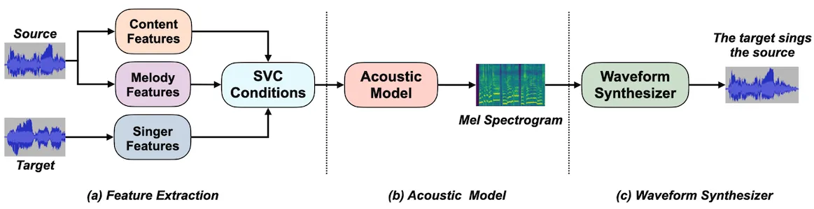
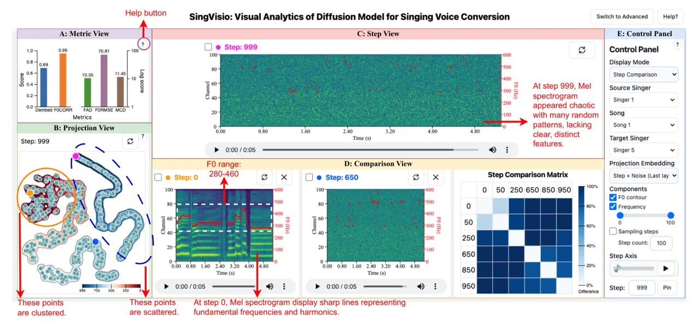
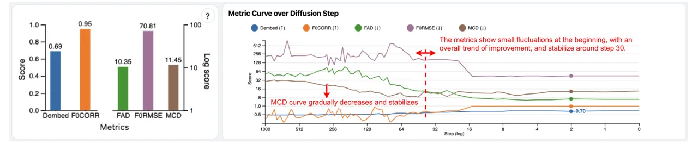
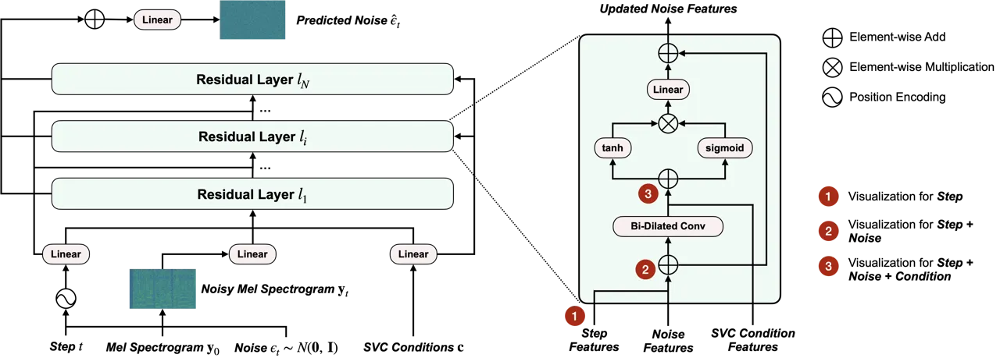

# SingVisio: Visual Analytics of Diffusion Model for Singing Voice Conversion

Liumeng Xue Email: <xueliumeng@cuhk.edu.cn> Note: Equal contribution.
This work is supported by NSFC (project no. 62376237 and 62302422),
Shenzhen Science and Technology Program ZDSYS20230626091302006.
Address: The Chinese University of Hong Kong, Shenzhen, China    Chaoren
Wang Email: <chaorenwang@link.cuhk.edu.cn> Note: Equal contribution.
This work is supported by NSFC (project no. 62376237 and 62302422),
Shenzhen Science and Technology Program ZDSYS20230626091302006.
Address: The Chinese University of Hong Kong, Shenzhen, China   
Mingxuan Wang Email: <mingxuanwang1@link.cuhk.edu.cn> Address: The
Chinese University of Hong Kong, Shenzhen, China    Xueyao Zhang
Email: <xueyaozhang@link.cuhk.edu.cn> Address: The Chinese University of
Hong Kong, Shenzhen, China    Jun Han Email: <hanjun@ust.hk>
Address: The Hong Kong University of Science and Technology, China   
Zhizheng Wu Email: <wuzhizheng@cuhk.edu.cn> Address: The Chinese
University of Hong Kong, Shenzhen, China Address: Shanghai AI
Laboratory, Shanghai, China

###### Abstract

In this study, we present SingVisio, an interactive visual analysis
system that aims to explain the diffusion model used in singing voice
conversion. SingVisio provides a visual display of the generation
process in diffusion models, showcasing the step-by-step denoising of
the noisy spectrum and its transformation into a clean spectrum that
captures the desired singer’s timbre. The system also facilitates
side-by-side comparisons of different conditions, such as source
content, melody, and target timbre, highlighting the impact of these
conditions on the diffusion generation process and resulting
conversions. Through comparative and comprehensive evaluations,
SingVisio demonstrates its effectiveness in terms of system design,
functionality, explainability, and user-friendliness. It offers users of
various backgrounds valuable learning experiences and insights into the
diffusion model for singing voice conversion.

###### Keywords: 

Machine Learning, Explainable AI, Visual Analytics, Audio Processing

## 1 Introduction

Deep generative models have become increasingly prevalent in a myriad of
data generation tasks, ranging from image generation to audio
generation. Among these, diffusion-based generative models have emerged
as a cutting-edge research focus and the go-to methodology for such
applications \[1\]. In the field of computer vision, diffusion models
have gained significant popularity \[2, 3\], particularly in
applications such as text-to-image synthesis \[4, 5, 5\], video
generation \[3\] and editing \[6\]. In the audio community, there have
been extensive studies of diffusion models in waveform synthesis \[7,
8\], sound effects generation \[9, 10\], speech generation \[11, 12\],
and music generation \[13, 14\]. Given their wide-ranging utility and
impressive performance, there is a burgeoning curiosity and necessity to
unravel the intricacies of the diffusion process underpinning these
generative tasks. However, the complexity of the involved Markov chains
and their complex mathematical formulations pose a significant hurdle to
novices in the field. In recent years, visual and interactive
methodologies have proven instrumental in deciphering the structures and
working mechanisms in various deep-learning models  \[15, 16, 17\]. This
insight has spurred us to develop interactive visual tools aimed at
broader audiences, facilitating a deeper comprehension of
diffusion-based generative models. The paper represents an attempt to
demystify the diffusion-based generative paradigm.

Owing to its notable capabilities, the diffusion-based generative model
has quickly risen as a formidable contender in singing voice conversion
(SVC). This advanced technique effectively alters one singer’s voice to
another’s, meticulously preserving the song’s original content and
melody, as investigated in the studies \[18, 19, 20\]. When juxtaposed
with other generative models, such as Generative Adversarial Networks
(GANs) \[21\] and Variational Auto-Encoders (VAEs) \[22\],
diffusion-based models resolve the issue of unsatisfactory audio quality
via incrementally introducing noise into the data and iteratively
learning to eliminate noise. Due to iterative noising and denoising
processes in synthesizing high-quality data, comparing the changes in
the diffusion process step-by-step is essential to learn about the
diffusion model. The current pedagogical approaches for beginners¹¹ 1 In
the context of this study, “beginners” are defined as individuals who
have less than one year of experience in both the field of machine
learning and the field of music and singing processing. This group
primarily consists of users who are new to both the technical aspects of
machine learning and the specific applications in music and singing
processing. We expect the beginners’ main focus to be on gaining
fundamental knowledge about the diffusion model applied in the SVC in
this study. learning about diffusion-based models is overly dependent on
textual explanations and mathematical descriptions²² 2
[https://theaisummer.com/diffusion-models/](https://theaisummer.com/diffusion-models/).
This traditional learning method is neither intuitive nor efficient,
often causing beginners to lose track among complex formulas without the
ability to directly view and compare results at each step. Moreover,
understanding the impact of various conditions—such as the source
voice’s content, melody, and the target singer’s unique timbre—on the
generation process is crucial for experts to identify challenging
samples for SVC and make informed decisions to enhance SVC performance.
Currently, comparing the effects of different conditions on SVC results
is both time-consuming and cumbersome. Researchers must generate and
save each feature, such as Mel spectrograms and audio files, and then
repeatedly open and compare these across various steps.

Methods involving visualization and exploratory interaction are less
common, as evidenced by examples such as  \[23\] and  \[24\], which do
not offer users an immersive understanding of the diffusion process.
This highlights an urgent demand for comprehensive, interactive, and
visually intuitive tools designed for diffusion-based generative models
to fill this gap. In this paper, we propose SingVisio, a visual
analytics system designed to interactively explain diffusion models in
SVC. To maintain anonymity during the review process, the code will be
made publicly available upon the paper’s acceptance. SingVisio offers
both a basic version to help beginners grasp the basic concepts of
diffusion models, and an advanced version for experts by providing an
efficient tool to further investigate diffusion-based SVC. For visual
representation, we extract Mel spectrograms and F0 contours from audio.
Additionally, we demystify the diffusion process by extracting and
rendering hidden features from different layers in the model over 1000
steps. Furthermore, we propose a novel interval clustering center
sampling method, enabling users to flexibly specify the number of sample
points and display the corresponding hidden features.

The contributions of this work can be summarized as follows:

- 1.  A visual analytics system for understanding SVC. To the best of our
      knowledge, this is the first system supporting the exploration,
      visualization, and comparison of the diffusion model within the
      context of SVC. It offers a versatile platform for comparing various
      aspects of the diffusion process, SVC modes, and evaluation metrics,
      allowing for a thorough exploration.
- 2.  Novel interactive exploration approach to understanding
      diffusion-based SVC. We have supported three core interactive
      exploration modes within our system: data-driven exploration, which is
      steered by varying melodies, condition-driven exploration that pivots
      on the specific inputs provided to the diffusion model, and
      evaluation-driven exploration, which is based on the assessment
      metric. Also, we propose a novel interval clustering center sampling
      method to efficiently sample and display hidden features at specified
      steps.
- 3.  A comparative and comprehensive evaluation of SingVisio. We conducted
      a comparative and comprehensive evaluation of our system with the
      basic version and advanced version, including a case study involving
      two beginners, an expert study with two experts, and a formal user
      study encompassing both subjective and objective assessments for
      general users. Such evaluation shows the effectiveness of our system.

## 2 Related Work

### 2.1 Singing Voice Conversion

The early singing voice conversion research aims to design parametric
statistical models such as HMM \[25\] or GMM \[26, 27\] to learn the
spectral features mapping of the parallel data. Since the parallel
singing voice corpus is challenging to collect on a large scale, the
non-parallel SVC \[28, 29\], or recognition-synthesis SVC \[30\], has
been popular in recent years, whose pipeline is displayed in Fig. 1. In
the non-parallel SVC pipeline, the acoustic model conducts the feature
conversion from source to target. It can be various types of generative
models, including autoregressive models \[29\], GAN-based models \[31,
32\], VAE-based models \[33, 34\], or Flow-based models \[34\]. Besides,
adopting a diffusion-based acoustic model is also promising for VC \[35,
36\] and SVC \[18, 19, 20\]. Recently, more and more research has
verified the strong performance of diffusion models in modeling audio
areas \[13, 8, 12, 37\].

Although the diffusion model has shown impressive quality and
performance when applied to SVC, our understanding of its internal
mechanisms is still limited. Firstly, the existing diffusion models are
still based on black-box neural networks. Visualizing how it achieves
singing voice conversion through step-by-step denoising would greatly
deepen researchers’ comprehension of the diffusion model’s operating
principles. Secondly, the SVC conditions, which serve as inputs to the
diffusion model, are crucial factors influencing the final conversion
results. However, we are still unclear about how different conditions
affect the performance of the diffusion model. Motivated by that, this
paper will conduct a systematic analysis of diffusion-based SVC under
different diffusion steps and diverse SVC conditions, like varied
sources and targets.

### 2.2 Visual Analysis for Explainable AI

EXplainable Artificial Intelligence (XAI) \[38\] has become increasingly
important as machine learning models, especially deep learning models,
grow in complexity and usage in critical applications \[39\]. Visual
analysis tools have been developed to make these models more
interpretable and trustworthy to users. CNN Explainer simplifies the
understanding of Convolutional Neural Networks (CNNs) by visualizing
their feature extraction process \[40\]. LSTMVis \[41\] and
DQNViz \[42\] offer insights into the decision-making processes of LSTM
networks and Deep Q-Networks, respectively. M2Lens \[43\] and
CNNVis \[44\] are designed to dissect the intricate layers of CNNs,
providing a detailed examination of filter activations and network
architectures. AttentionViz focuses on the attention mechanisms in
models, revealing how models prioritize different parts of the input
data for decision-making \[45\].

Additionally, the interpretation of generative models through
visualization addresses the challenge of understanding complex data
generation processes. Adversarial-Playground \[46\], GANLab \[15\] and
GANViz \[47\] are interactive tools for exploring and interpreting
Generative Adversarial Networks (GANs). Research on analyzing the
training processes of deep generative models uncovers the dynamics and
stability issues inherent in these models. Further, DrugExplorer \[48\]
exemplifies the application of visualization techniques in
domain-specific areas. Recently, diffusion models have shown significant
capabilities in generative tasks, and accordingly the visualization
tool, aiming at making the diffusion process comprehensible to humans,
is investigated \[17\]. Besides, Diffusion Explainer concentrates on
demystifying the stable diffusion process, offering an understanding of
the transformation from text prompts into images \[16\]. In our work, we
design an interactive visual analysis system for the diffusion model
applied in singing voice conversion. It illustrates how the noisy
spectrum is gradually denoised under the influence of conditions,
ultimately converting the spectrum to the target singer’s timbre.

## 3 Background: Diffusion-based Singing Voice Conversion



Fig. 1: The classic pipeline of SVC system, including three steps: (a)
feature extraction that extracts content and melody features from the
source and singer timbre from the target, (b) acoustic model mapping
extracted features to acoustic features (e.g. Mel spectrogram), (c)
waveform synthesizer reconstructing singing voice from the converted
acoustic feature. In this study, we use “diffusion-based singing voice
conversion" to refer that the acoustic model in the SVC is a diffusion
model.

SVC aims to transform the voice in a singing signal to match that of a
target singer while preserving the original lyrics and melody \[49\].
The classic pipeline of SVC typically involves three steps, as shown in
Fig. 1. (a) Feature extraction: extract content (i.e., lyrics) and
melody features from the source singing voice and the timbre feature
from the target singing voice. These features are then combined to form
the conditions for SVC, which are fed into the following acoustic
models. (b) Acoustic model: convert the source features to acoustic
features (such as the Mel spectrogram) that match the target singer’s
voice. (c) Waveform synthesizer: Reconstruct the singing voice waveform
from the transformed acoustic features to produce the target singer
timber while maintaining the source content. In this study, the term
‘diffusion-based singing voice conversion’ is used to denote that the
acoustic model in the SVC system is a diffusion model.

### 3.1 Architecture and Workflow

In this study, we select DiffWaveNetSVC \[50, 19\] as the SVC’s acoustic
model to visualize and analyze. The internal module of the
DiffWaveNetSVC is based on Bidirectional Non-Causal Dilated CNN \[18,
8\], which is similar to WaveNet \[51\].

The architecture of DiffWaveNetSVC is shown in Fig. 7 of C. It consists
of multiple residual layers, within which it adopts Bidirectional
Non-Causal Dilated CNN (“Bi-Dilated Conv" in Fig. 7) of C like \[51, 8,
18\]. During training (i.e., the forward process of diffusion model), we
extract the content, melody, and singer features from the same sample
(which means the source and target in Fig. 1 are the same) and add them
to obtain the SVC conditions $`\mathbf{c}`$. At the step
$`t\in[0,1,2,\cdots T]`$, we sample a Gaussian noise
$`\mathbf{\epsilon}_{t}\sim N(\mathbf{0},~\mathbf{I})`$ and obtain the
noisy Mel spectrogram:

```math
\mathbf{y}_{t}=\sqrt{\alpha_{t}}\mathbf{y}_{0}+\sqrt{1-\alpha_{t}}\mathbf{\epsilon}_{t}, \tag{1}
```

where $`\alpha_{t}`$ is the noise weight in diffusion model \[52\]. And
the training objective can be considered to predict the noise
$`\mathbf{\epsilon}_{t}`$ using the neural network:

```math
\begin{split}\hat{\mathbf{\epsilon}}_{t}&=\mathbf{DiffWaveNetSVC}(t,\mathbf{y}_{t},\mathbf{c}),\\
\mathcal{L}_{t}&=\mathbf{MSE}(\hat{\mathbf{\epsilon}}_{t},{\mathbf{\epsilon}}_{t}),\end{split} \tag{2}
```

where $`\mathbf{DiffWaveNetSVC}`$ represents the whole encoder based on
the residual layers and $`\mathbf{MSE}`$ means the mean squared error
loss function.

During inference/conversion (the reverse process of diffusion model),
given the source and target, we extract the content and melody features
from the source, extract the singer features from the target, and add
them as the SVC conditions $`\mathbf{c}`$. We feed a Gaussian noise
$`\hat{\mathbf{y}}_{T}\sim N(\mathbf{0},~\mathbf{I})`$ to DiffWaveNetSVC
and employ deep denoising implicit models \[52\] with $`T`$ denoising
steps to produce Mel spectrogram $`\hat{\mathbf{y}_{0}}`$.

### 3.2 Implementation Details and Evaluation Metrics

In this paper, we follow the Amphion’s implementation \[50\]³³ 3
[https://github.com/open-mmlab/Amphion/tree/main/egs/svc/MultipleContentsSVC](https://github.com/open-mmlab/Amphion/tree/main/egs/svc/MultipleContentsSVC)
for DiffWaveNetSVC. Specifically, the layer number $`N`$ is 20, and the
diffusion step number $`T`$ is 1000. Following Zhang et al. \[19\], we
adopt both Whisper \[53\] and ContentVec \[54\] as the content features,
we use Parselmouth⁴⁴ 4
[https://parselmouth.readthedocs.io/en/stable/index.html](https://parselmouth.readthedocs.io/en/stable/index.html) \[55\]
to extract F0 as the melody features, and we adopt look-up table to
obtain the one-hot singer ID as the singer features. We utilize the
DiffWaveNetSVC checkpoint of Zhang et al. \[19\] to conduct the
inference, conversion, and visualization analysis, which is pre-trained
on 83.1 hours of speech (111 singer) and 87.2 hours of singing data (96
singers). The detailed information about the dataset is described in B.
For waveform synthesizer, we use the pre-trained Amphion Singing
BigVGAN⁵⁵ 5
[https://huggingface.co/amphion/BigVGAN_singing_bigdata](https://huggingface.co/amphion/BigVGAN_singing_bigdata)
to produce waveform from Mel spectrogram.

Accurately and effectively assessing the results of SVC is significantly
important \[49\]. Objective evaluation involves measuring performance at
various aspects, such as spectrogram distortion, F0 modeling,
intelligibility, and singer similarity. To objectively evaluate
synthesized samples, we adopt the evaluation methodology from
Amphion \[50\]⁶⁶ 6
[https://github.com/open-mmlab/Amphion/tree/main/egs/metrics](https://github.com/open-mmlab/Amphion/tree/main/egs/metrics)
for our objective assessment. This includes metrics such as Singer
Similarity (Dembed) with Resemblyzer ⁷⁷ 7
[https://github.com/resemble-ai/Resemblyzer](https://github.com/resemble-ai/Resemblyzer),
F0 Pearson Correlation Coefficient (F0CORR), Fréchet Audio Distance
(FAD), F0 Root Mean Square Error (F0RMSE), and Mel-cepstral Distortion
(MCD). Detailed definitions of these metrics are provided in  A.

## 4 Design Requirements

### 4.1 Requirement analysis

Through a series of interviews with experts in audio signal processing
and machine learning, we identified three critical tasks that our system
needs to support for effective analysis and interpretation of the
diffusion model for SVC.

C1: In-Depth Temporal Dynamics Analysis of Diffusion Generation Process.
Experts highlighted the importance of visualizing the temporal dynamics
of the diffusion generation process in singing voice conversion. The
objective is to create detailed visual representations that effectively
trace the step-by-step evolution occurring in voice conversion at each
diffusion stage. This involves visualizing the progression of various
acoustic parameters, such as frequency components and harmonics that
evolve over time. The visualizations are expected to provide users with
an intuitive understanding of the voice transformation, highlighting the
nuanced evolution from a noisy beginning to a structured and coherent
output, thereby making the process more transparent and understandable
to users without deep technical expertise in machine learning or signal
processing.

C2: Comprehensive Performance Metrics Evaluation in Singing Voice
Synthesis. This task is centered on tracking evaluation metrics that
gauge the quality of the converted voice at each step of the diffusion
generation process. These metrics include pitch accuracy, timbre
consistency, naturalness, and speech quality. The system should enable a
detailed analysis of how each metric evolves with every diffusion step,
offering insights into the conversion quality at different phases of the
generation process. This comprehensive evaluation is pivotal in
identifying aspects where the conversion achieves optimal quality or,
conversely, where improvements are needed. This visual representation
enhances the interpretability of the evaluation results and fosters
insights into the underlying dynamics of the diffusion generation
process.

C3: Comparative Analysis of Different Source Singers, Songs, and Target
Singers. Through visualization, we aim to systematically compare how
different characteristics of source singers, such as vocal tone, pitch
range, and singing style, influence the conversion outcome. This will
help in identifying specific attributes of source singers that are more
amenable to conversion. Additionally, the complexity and structure of
the song itself are crucial variables. Songs with intricate melodic
lines or complex rhythms might pose more significant challenges in
conversion processes. Equally important is the analysis of the target
singers’ characteristics. The system should visualize how well the model
adapts the source singer’s voice to match the timbre of the target
singers. This could lead to valuable insights, such as identifying
particularly challenging source-target pairings or songs that
consistently yield high-quality conversions. Such analysis is not only
crucial for understanding the current model’s performance but also for
guiding future improvements and applications in singing voice conversion
technology.

C1 and C2 tasks are related to fundamental knowledge of the diffusion
model, which is crucial and beneficial for beginners to understand
diffusion models. In contrast, C3 task focuses on exploring the impacts
of different conditions on SVC, which is more suitable for experts or
researchers seeking an in-depth understanding and analysis of
diffusion-based SVC. Accordingly, we design SingVisio in two versions: a
basic version and an advanced version. Both versions include C1 and C2
tasks. Additionally, the advanced version encompasses C3 task, catering
to the needs of experts and researchers.



Fig. 2: Visual system for diffusion-based singing voice conversion. The
system consists of five views. (A) Metric View shows objective
evaluation results on the singing voice conversion model, allowing users
to interactively explore the performance trend along diffusion steps.
(B) Projection View aids users in tracking the data patterns of
diffusion steps in the embedding space under different input conditions.
(C) Step View provides users with the visualization of Mel spectrogram
and pitch contour at one diffusion step. (D) Comparison View facilitates
users to compare voice conversion results among different diffusion
steps or singers. (E) Control Panel enables users to select various
comparison modes and choose different source and target singers to
visually understand and analyze the model behavior. The red annotations
provide explanations for the patterns or components.

### 4.2 Analytical Tasks

Our system is a visualization system designed specifically for
diffusion-based SVC tasks. Diffusion-based SVC itself involves two
aspects: in the realm of machine learning, it involves the diffusion
generative model, and in the field of audio signal processing, it
pertains to SVC. Therefore, the analytical tasks supported by our system
can be divided into two major categories. In the aspect of machine
learning, particularly in the diffusion model, to investigate the
evolution and quality of the generated result from each step in the
diffusion generation process, our system should support the following
two tasks.

T1: Step-wise Diffusion Generation Comparison. Examining the generated
result of each step in the diffusion generation process helps in
understanding the model’s behavior. Analyzing these early outputs can
help us understand how the model initially handles noise. As each step
incrementally adds detail and structure to the output, by inspecting
intermediate steps, we can observe the step-by-step improvement in
content quality. (C1)

T2: Step-wise Metric Comparison. As the diffusion steps progress, the
generated content becomes clearer and more refined. Analyzing the
objective evaluation metrics and their corresponding curves along the
diffusion steps serves as a useful tool for assessing both the
quantitative and qualitative aspects of the generated content. By
tracking these metrics over the diffusion steps, we gain insights into
how the model refines its output over time. (C2)

Regarding SVC, as described in Section 3, there are three factors
(content, melody, singer timbre) that have a direct impact on the
results of SVC and, therefore, should be considered during the
conversion process. To explore the impact of different factors on the
converted results, the system needs to provide support for the following
three tasks.

T3: Pair-wise SVC Comparison with Different Target Singers. Pair-wisely
comparing SVC under two different conditions of the target singer at
different diffusion steps. This task helps us to understand the impact
of the timbre of the target singer that should be converted to the
converted results of SVC, particularly in terms of singer similarity.
(C1, C3)

T4: Pair-wise SVC Comparison with Different Source Singers. Pair-wisely
comparing SVC under two different conditions of source singer at
different diffusion steps. This task benefits us in exploring the impact
of the melody of the source that should be kept on the converted results
of SVC, particularly in terms of F0CORR, F0RMSE. (C1, C3)

T5: Pair-wise SVC Comparison with Different Songs. Pair-wisely comparing
SVC under two different conditions of the song at different diffusion
steps. This task facilitates us to explore the impact of the content
information conveyed in the song that should be maintained on the
converted results of SVC, particularly in terms of MCD. (C1, C3)

## 5 Explainer System

Fig. 2 shows the overview of the explainer system which consists of five
components: Control Panel allows users to modify mode and choose data
for visual analysis; Step View provides users with an overview of the
diffusion generation process; Comparison View makes it easy for users to
compare converted results between different conditions; Projection View
helps users observe the trajectory of diffusion steps with or without
conditions; Metric View displays objective metrics evaluated on the
diffusion-based SVC model, enabling users to interactively examine
metric trends across diffusion steps.

### 5.1 Control Panel

The control panel consists of six components, including two drop-down
boxes to enable users to select display mode and projection embedding,
three checkboxes to select source singer, source song, and target
singer, and a step controller to enable users to control the diffusion
step.

Display Mode We design five types of display modes, including Step
Comparison, Source Singer Comparison, Song Comparison, Target Singer
Comparison, and Metric Comparison. Users can click the drop-down box of
“Display Mode " to choose a specific model.

- 1.  Step Comparison This mode primarily focuses on step-wise comparing the
      diffusion steps in the generation process. It (1) provides an
      animation of random noise gradually refined for users to have an
      overview of the whole denoising process in Step View, (2) enables
      users to adaptively select and compare the generated results from
      different diffusion steps in Comparison View.
- 2.  Metric Comparison This mode presents five objective evaluation metric
      results of the diffusion-based SVC model represented by a bar chart.
      It (1) enables users to click on a specific metric bar and then the
      system filters out an example that gains the best on the corresponding
      metric and displays metric curves along diffusion steps in the
      Comparison View, (3) enables users to hover over and slide the mouse
      along the step axis of the metric curve, and then system will display
      the values of that metric at different steps in the Comparison View
      while synchronously showing the generated results at different steps
      in the Step View.
- 3.  Source Singer Comparison This mode focuses on the pair-wise comparison
      of converting two different source singers’ audio with the same song
      to the same target singer. It (1) allows users to select two different
      source singers, a source song and a target singer, (2) provides the
      details (including Mel spectrogram, pitch contour, and audible audio)
      of the two source audio and the target audio in the Comparison
      View, (3) presents two conversion animations wherein random noise
      undergoes gradual refinement to transform into the singing voice of
      the target singer in the Step View. This mode is only available in the
      advanced version.
- 4.  Song Comparison This mode focuses on the pair-wise comparison of
      converting two different source audios that are derived from the same
      singer but contain different songs to the same target singer. It (1)
      allows users to select a source singer, a target singer but two
      songs, (2) provides the details (including Mel spectrogram, pitch
      contour, and audible audio) of the two source singers’ audio and the
      target singer’s audio in the Comparison View, (3) supplies two
      conversion animations illustrating the progressive refinement of
      random noise into the singing voice of the target in the Step View.
      This mode is only available in the advanced version.
- 5.  Target Singer Comparison This mode focuses on the pair-wise comparison
      of converting the same source singing voice (also means the same song)
      to two different target singers. It (1) enables users to select a
      source singer and a source song, but two target singers, (2) provides
      the details (including Mel spectrogram, pitch contour, and audible
      audio) of the source singer’s audio, and two target singers’ audio in
      the Comparison View, (3) provides the two corresponding conversion
      animations of random noise gradually refined to the target singer
      singing voice in the Step View. This mode is only available in the
      advanced version.

Source Singer/Source Song/Target Singer Three drop-down boxes offer
users options for source singer, source song, and target singer.

Projection Embedding A drop-down box to enable users to choose different
projection embeddings from different layers. Then, the system displays
2D t-SNE visualization results of the high-dimensional diffusion steps
in the Projection View. Specifically, the projection embedding can be
the diffusion steps, the combined embeddings of the step and noise, or
step, noise and conditions. These embeddings can come from the first,
middle, or final residual layer in the diffusion model, as illustrated
in Fig. 7 of C.

Components Two checkboxes, labeled ’F0 contour’ and ’Frequency,’ allow
users to control the display of these components in the Mel spectrogram.
Additionally, the frequency bar lets users adjust the frequency range
for display.

Step Controller The Step Controller includes (1) a step slider to
smoothly control the diffusion step, (2) a tool-tip to display or input
a specific step number, and (3) a button named ‘Pin’ that enables users
to add a specific step’s generated result in the Comparison View.

### 5.2 Step View

This view enables users to visualize the whole generation process of
diffusion in the context of SVC tasks, which means users can observe how
the spectral characteristics change over time as noise is subsequently
removed, leading to the desired SVC. Specifically, it can be observed
that the Mel spectrogram transitions from being completely noisy to
gradually becoming clearer, and the fundamental frequency curve also
transforms from scattered points into a smooth curve. The audio also
undergoes a process of gradual optimization from being pure noise to
having improved sound quality and intelligibility.

The control panel, mentioned earlier, allows users to interact with the
diffusion process by smoothly sliding the step slider. Users can adjust
the diffusion time step to observe the intermediate results of the
generation process, enlarge the Mel spectrogram to observe detailed
information through a brush operation, and restore it back to the
original Mel spectrogram using the refresh button in the top right
corner in the Step View.

In the Step Comparison and Condition Comparison modes, the content
presented in the Step View is slightly different. In the Step Comparison
mode, we focus on comparing and analyzing the converted results from
different steps, so only one diffusion process animation is displayed in
the view. While, in the Condition Comparison mode, the main objective is
to compare the conversion results under different conditions, e.g.,
source singer, song, and target singer. At this time, the Step View
shows pair-wise diffusion process animations for two different
conditions.



Fig. 3: The left part is the Metric View with MCD metric selected. The
right part is the corresponding “Metric Curve over Diffusion Step" for
the best-performing sample on the MCD metric. The red annotation in the
right part explains the tendencies of metric curves.

### 5.3 Comparison View

To facilitate a more convenient and detailed observation of the
intermediate results generated by the diffusion model, we introduce a
Comparison View. Moreover, the comparison view differs between the basic
and advanced versions. In the basic version, the comparison view
initially displays a step comparison matrix, highlighting differences in
Mel spectrograms between pairs of steps in the diffusion model, as shown
in Fig. 2. Darker colors in the step comparison matrix indicate larger
differences, while lighter colors represent smaller ones. Users can add
specific steps to the matrix using the pin feature in the control panel
or by clicking data points in the projection view. By clicking on the
comparison matrix, Mel spectrograms and audio of the corresponding two
steps can be displayed in the comparison view for detailed comparison.
In the advanced version, we directly display three Mel spectrograms from
three steps by default. Besides, users can select any step to replace
the displayed three steps. It enables users to compare differences among
three steps, broadening the scope of comparison.

It is noted that along with the Mel spectrogram, the corresponding
audible audio, and fundamental frequency (F0) contour are also displayed
in the Comparison View. All the information related to a clip of audio
forms a basic block referred to as the “basic display unit”, as shown in
the below two Mel spectrograms in the comparison view in Fig. 2 On this
basic display unit, we can observe the range of the F0 and the pattern
of the F0 contour. Through the brush operation, we can synchronously
magnify all Mel spectrograms illustrated in this view, thus enabling a
more detailed comparison and examination of the spectral differences.
When there is more than one basic display unit, users can select the
checkboxes in the top left corner of any two basic display units. The
page will then pop up the visualization of the difference in the Mel
spectrogram between these two basic display units, allowing for a
clearer and more convenient comparison. Specifically, the differences
are represented by colors. Warmer colors like reds and oranges signify
larger differences, while cooler colors like blues and greens represent
smaller differences between the two selected Mel spectrograms. This
visualization aids in identifying which parts of the Mel spectrogram are
significantly refined during the step-by-step generation process,
highlighting areas that may require further investigation by algorithm
researchers.

Furthermore, the components displayed in the Comparison View differ
between the Step Comparison Mode and the Condition Comparison Mode. The
Step Comparison Mode is primarily used to compare the results of
different diffusion steps. In this mode, the Comparison View will
display basic display units from three different steps, based on the
steps selected by the user. The relative position of different basic
display units (corresponding to different steps) can be directly
adjusted by dragging. On the other hand, the Condition Comparison Mode
sports a similar layout but mainly compares the results of SVC under
different conditions. In this mode, the Comparison View primarily
displays the basic display units corresponding to different audios of
the source and target singers selected by users. Additionally, in Metric
Comparison Mode, the Comparison View illustrates the metric curve over
the diffusion step, which is described in Section 5.5.

### 5.4 Projection View

High-dimensional hidden features can be challenging to interpret
directly. t-SNE reduces the dimensionality by projecting the hidden
feature embedding into a lower-dimensional space, allowing researchers
to gain insights into the intricate structure and relationships within
the high-dimensional space. By projecting high-dimensional step
embeddings in the diffusion model into a lower-dimensional space, t-SNE
reveals patterns and trajectories of the diffusion steps, enabling a
visual exploration of the dynamic evolution of the diffusion process.
Consequently, we design Projection View to present the two-dimensional
space obtained by projecting high-dimensional diffusion step embeddings
(i.e., the step features in Fig. 7 of C), as shown in Fig. 2. Each point
represents a diffusion step, and all 1000 diffusion steps together form
a trajectory in space. The boundary of this trajectory is highlighted
with a gradient color scheme ranging from blue to red, reflecting the
progression of the generation process. Users can hover their mouse over
the points and slide to inspect the step trajectory. While sliding the
mouse, users can simultaneously observe the SVC results transition from
a coarse state to a fine state in Step View. By scrolling the mouse
wheel, they can zoom in or out on the points in the space to explore the
distribution of the data points. By clicking on a specific step point, a
basic display unit corresponding to the step will be added into the
Comparison View.

As described in Section 5.1, the drop-down menu of projection embedding
in the control panel provides multiple projection embedding sources,
including not only the vanilla diffusion step but also the combination
of the diffusion step with noise and condition, as indicated by the red
solid dots in Fig. 7 of C. By examining the projection embedding results
of combining diffusion step with noise and condition, users can compare
the differences in diffusion step trajectories under different condition
scenarios. Additionally, we propose a novel sampling strategy called
interval clustering center sampling. The specific steps are as follows:
(a) Set the number of steps to be sampled, denoted as $`S`$. (b) Divide
the total interval into T/S sub-intervals, each sampling one sample. (c)
Perform k-means clustering on all samples within each sub-interval to
find the central point, and then calculate the distance from all samples
to this center, and finally select the sample closest to the center as
the representative sample. The clustering approach ensures that each
sub-interval selection considers global temporal embedding information.
Furthermore, by clustering and selecting the step closest to the center,
the chosen steps are highly representative.

### 5.5 Metric View

Metric View is designed to show the overall objective metrics evaluated
on the model. The five metrics, including Dembed, F0CORR, FAD, F0RMSE,
and MCD, are divided into two groups based on whether the values of the
metrics are positively or negatively correlated with model performance
and drawn in histograms. Here, the labels of the x-axis denote different
metrics, and the labels of the y-axis are scores (the higher the better)
and log scores (the lower the better). Each bar in the histogram is
labeled with the calculated result corresponding to the metric. In the
top right corner of this view, there is a button represented by a
question mark. When users click this button, a tip box will appear
providing descriptions of the definitions of each metric.

The Metric View represents an average of all samples within the testing
data pool, providing a comprehensive overview of the model performance
with five objective metrics. Upon hovering over a particular metric, the
system automatically identifies and selects the best-performing sample.
This selection triggers a detailed visualization of the diffusion step
for that sample within the Projection View. Additionally, for the chosen
sample, the system dynamically computes and displays evaluation metrics,
which are then used to plot the “Metric Curve over Diffusion Step" in
Comparison View, as shown in Fig. 3.

At the top of the curve, five legends denoted as five different metrics
are present with distinct colors. The x-axis shows different steps
ranging from 999 to 0 as diffusion generates data, and the y-axis
displays scores for evaluation metrics. The user can check the specific
metric value for each step by hovering on the curve. Also, the step
preview will update as the cursor moves on the curve. The interactive
feature of Metric View allows users to not only see aggregate metric
performance but also delve into the variation trend of metrics with
diffusion step during the diffusion generation process.

### 5.6 Implementation Details

The web application is designed to provide an interactive and
user-friendly interface for visualizing spectrogram differences. It uses
D3.js and TailwindCSS for the front-end, ensuring a clean and dynamic
user interface. Specifically, D3.js handles the visualization, allowing
for detailed and interactive spectrogram comparisons. TailwindCSS
ensures a responsive and aesthetic design, enhancing user experience.
The back-end is powered by Flask and Gunicorn, enabling efficient
dynamic step sampling and efficient data retrieval with multiple
workers. Specifically, Flask serves as the core framework, managing API
requests and data processing. Gunicorn operates as the WSGI HTTP server,
providing concurrency through multiple workers for fast data retrieval
and processing. This architecture ensures that the application is both
robust and scalable, capable of handling real-time spectrogram analysis
and visualization efficiently.

Mel spectrogram and Fundamental Frequency Contour (F0 contour) are
extracted from the audio using a signal processing algorithm. Mel
spectrogram is a 2D representation with the dimensions of Time\*Channel,
where the time axis captures the progression of the audio signal over
time, and the channel axis represents the frequency components or Mel
bins, providing a comprehensive view of the signal’s spectral content.
The Mel spectrogram is color-coded to indicate the intensity or
magnitude of different frequencies over time. Bright colors, such as
yellow and red, represent high energy or the presence of specific
frequencies, while darker colors represent lower energy or the absence
of those frequencies. F0 contour is a key concept in the fields of
speech processing and music analysis, especially in the study of
prosody, intonation, and melody. It refers to the variation in the pitch
of a voice over time. The fundamental frequency, or F0, is the lowest
frequency of a periodic waveform and determines the pitch of the sound,
which is one of the primary auditory attributes used to distinguish
different sounds in speech and music. This contour line may be drawn as
a continuous curve that rises and falls to depict changes in F0. The F0
contour line is colored red in this work, to distinguish it from the Mel
spectrogram.

## 6 Case Study

We invited two beginners in machine learning and signal processing, E1
and E2, to participate in a case study to verify whether the system
could make the model interpretable and help beginner users understand
the working mechanism of the diffusion model applied in SVC tasks.

E1 focused on the step view, observing the transition of the Mel
spectrogram from noisy to clean. Initially, the Mel spectrogram appeared
chaotic with many random patterns, lacking clear, distinct features. As
the process continued from step 999 to step 0, the spectrogram gradually
became clearer, displaying sharp lines representing fundamental
frequencies and harmonics. Correspondingly, the initial audio sounded
indistinct and lacked clarity, presenting hissing and other unwanted
sounds. Eventually, the vocals became well-defined and easy to discern,
with almost no unwanted sounds or interference. E1 commented that this
dynamic display intuitively demonstrated the entire process of SVC,
making the generation process more interpretable and comprehensible.
Moreover, E1 mentioned that listening to the voice transition from one
blurred timbre to another clear timbre was quite fascinating.

E2 mainly interacted with the system by dragging the step axis to
control the diffusion reverse step, observing the differences in the
generated results at various steps. E2 also focused on the metric view.
E2 clicked on the help button shaped like a question mark in the top
right corner of the metric view (as shown in Fig. 2) to learn about the
definitions of metrics and their correlation with model performance. E2
then clicked on the MCD metric bar, prompting the system to show five
Metric Curves over Diffusion Steps in the Comparison View. E2 moved the
mouse over the MCD metric curve and the system displayed the
corresponding MCD value, Mel spectrogram and audio of the corresponding
step. Additionally, E2 listened to the corresponding audio at different
steps, providing an audible perception of the changes. E2 observed that
all metric values changed from the starting point to a gradually
stabilizing endpoint throughout the diffusion process. E2 mentioned that
this was the first time they directly observed the fluctuations of
metrics throughout the diffusion process. E2 described the system as a
comprehensive and user-friendly visualization tool for diffusion models
in SVC tasks that allows for both an overview and a detailed study.

## 7 Expert Study

We invite two domain experts (E3 and E4) to participate in an expert
study to evaluate the system based on its usability and effectiveness.
They were not involved in the system design process, nor did they
participate in the user study and case study. E3 is a researcher who has
been engaged in machine learning and voice conversion research for more
than 3 years. E4 is also a researcher primarily focusing on SVC and is
strongly interested in XAI.

System Usefulness Both experts acknowledged SingVisio as a valuable tool
for validating domain knowledge. They observed that the system clearly
demonstrates each step’s results during the data generation process in
the diffusion model. Specifically, in a Mel spectrogram, noise appears
as random speckles or fuzzy areas. Early in the reverse diffusion
process (step 999), the spectrogram has high noise levels because the
model is just starting to refine the audio. By step 50, the noise
decreases, resulting in a cleaner spectrogram. This indicates successful
noise reduction and improved audio quality. Harmonic structures, seen as
horizontal lines and spectral patterns show the distribution of energy
across frequencies.

Visual Designs and Interactions From the t-SNE visualization of
projection embedding (such as step embedding) in the projection view,
experts observe a distinct pattern transitioning from a decentralized to
a more centralized structure (as illustrated in Fig 2). In the reverse
process of a diffusion model, each step builds on the output of the
previous step to remove noise. Viewed as an optimization problem, each
step minimizes the difference between the original data and the current
estimate. As this process progresses, the latent representations
increasingly resemble the original data points, causing them to appear
more clustered in the t-SNE plot.

Insight and Inspiration Both domain experts believe the system provides
valuable insights. They observed the transformation of the Mel
spectrogram from noise to a clear signal during the diffusion generation
process in SVC. It was found that when the target singer’s F0 is low and
dense, more steps are required for the signal to become clear,
indicating greater difficulty in converting to such target singers.
Frequent and dense F0 changes increase modeling complexity,
necessitating more steps to accurately generate these variations while
avoiding distortion and maintaining harmonic structure consistency.
Fine-tuning model parameters for low and dense F0 cases can yield better
results. Additionally, increasing the quantity and diversity of such
data can enhance model robustness and generalization capability.

Additionally, E4 noted that the metric comparison perspective reveals
the limitations of existing objective metrics used in SVC. For example,
in a 1000-step diffusion model, almost all metric curves approach
convergence within about the last 30 steps, showing no significant
improvement beyond that point. However, from the step comparison
perspective, we can see (and hear) a substantial difference in sound
quality between the generated results at step 30 and step 0, indicating
areas for further enhancement. This observation suggests that while
numerical metrics may indicate stabilization, the perceptual quality of
audio continues to improve significantly in the final stages of the
diffusion process. E4 emphasized that this discrepancy highlights a
critical gap in current evaluation methods, as metrics like MCD, FAD,
and F0RMSE may not fully capture the nuanced improvements audible to
human listeners. To address this, E4 suggested developing new,
perceptually aligned metrics that better reflect auditory differences
observed during the final diffusion steps.

## 8 Evaluation

This section details the evaluation approach and the results of
SingVisio in both basic and advanced versions. The evaluation is carried
out through structured user studies, designed to assess both objective
understanding and subjective experiences of the users.

### 8.1 User Study Set-up

Participants We recruited 23 participants (P1-P23) from audio, music,
and speech processing laboratories. They included beginners new to the
field, doctoral students with 1-2 years of experience, and postdoctoral
researchers with 4-6 years of experience. This mix of participants
ensured a broad perspective on the system’s performance across different
user groups. Additionally, their research interests centered on audio,
music, and speech processing. While they had limited knowledge of visual
analysis, they showed great interest in the SingVisio system as it
allowed them to interactively visualize their research content, e.g.,
audio, Mel spectrograms, generative models.

Questionnaire The questionnaire was designed to capture both objective
and subjective aspects of the SingVisio. The questions are designed
following ContextWing \[56\] and also considering the specific features
of our own system.

- 1.  Objective Questions In the part of objective questions, to evaluate
      the effectiveness of both the basic and advanced versions, two sets of
      questionnaires were designed. These questions are directly related to
      the five analytical tasks (T1-T5) previously detailed in Section 4.2.
  - 1..1
    Objective Questions (Basic Version) (OB1-OB8) For participants in
    the basic version, the study was conducted as a comparative
    analysis, where users were divided into two subgroups. One group
    engaged with SingVisio, while the other group utilized the
    traditional tutorial method to learn about diffusion-based SVC
    models, with the same dataset (audio files, Mel spectrograms with F0
    visualized, metric data spreadsheet) of every step provided, to
    answer the same set of questions. This comparative approach allowed
    us to directly assess the efficiency of SingVisio in helping
    beginners grasp concepts compared with conventional learning
    methods.
  - 1..2
    Objective Questions (Advanced Version) (OA1-OA15) The questionnaire
    for the advanced version is designed with users with more experience
    or specialized in audio, music or speech processing, aiming to
    evaluate the effectiveness of the system in aiding field experts in
    facilitating a more sophisticated analysis and understanding.

- 2.  Common Subjective Questions (S1-S16) Both versions of the
      questionnaire included a shared set of subjective questions, which are
      intended to capture the users’ perceptions, satisfaction, and any
      qualitative feedback regarding their experience. The questions are
      designed following ContextWing \[56\] in evaluating the system around
      four key aspects, including explainability, analysis functionality,
      design effectiveness, and usability. These aspects were selected based
      on the recommendations by Rossi et al. \[57\], ensuring a
      comprehensive evaluation framework that aligns with established user
      experience principles. The questions are rated using a 5-point Likert
      scale, ranging from 1 (strongly disagree) to 5 (strongly agree).

By employing this dual-version structure, our questionnaire not only
provides insights into the specific utilities of each version of
SingVisio but also allows for a nuanced analysis of its educational
impact compared to traditional methods. This methodology supports a
robust evaluation of the system’s effectiveness across a spectrum of
users, from novices to advanced practitioners.

Procedure We first divided the participants by their experience in the
field of audio, music, or speech processing in terms of years ($`<`$1yr,
basic group, $`>=`$1yr, advanced SingVisio group), the basic group is
further split evenly and randomly into two sub-groups, basic SingVisio
group and tutorial group. Out of the 23 participants, the advanced group
consisted of 10 individuals. The basic group included 13 individuals,
with 7 in the basic SingVisio group and 6 in the tutorial group. Both
advanced and basic SingVisio groups were first oriented with a
comprehensive introduction to the SingVisio system, familiarizing the
participants with the functions and capabilities of SingVisio. The
tutorial group was oriented with a tutorial session to learn about
necessary knowledge about diffusion-based SVC models and basic concepts
like F0, Mel spectrograms and metric definitions. Following the initial
setup, participants proceeded to complete the online questionnaire.
Those in the SingVisio groups answered the questions while actively
using the SingVisio system, configured as specified in the
questionnaire. Conversely, participants in the tutorial group answered
the questions using a tutorial handout, whilst having access to the same
dataset as the SingVisio groups. This dataset included audio files, Mel
spectrograms with visualized F0, and a spreadsheet detailing metric data
for each step of the process. After both objective and subjective
queries were completed, an optional feedback section was provided for
any additional comments or suggestions.

### 8.2 Results and Analysis

The completion time for the basic tutorial group and basic SingVisio
group on the basic version was approximately 94.31 ($`\sigma=78.23`$)
minutes and 48.65 ($`\sigma=21.93`$) minutes, respectively.
Additionally, the completion time for the advanced SingVisio group was
about 40.54 ($`\sigma=26.62`$) minutes. It is noted that the completion
time for the user study includes not only the time taken to answer the
questionnaire but also the time spent familiarizing with the SingVisio
system or tutorial. Additionally, the study was conducted in an
uncontrolled environment, where participants used their own computers,
resulting in potential distractions that could have affected the
completion times. Even though removing the extreme outlier, the
completion time of the tutorial group ($`\mu=68.13`$, $`\sigma=50.13`$)
is greater than that of the other two groups. It indicates that the
visual and interactive approach in the SingVisio system is more
conducive to completing the questionnaire, thereby resulting in shorter
completion times.

The average accuracies for the tutorial group and basic SingVisio group
were 71.73% and 82.14%, respectively, and the average accuracy for this
group was approximately 91.77%. The results indicate that using the
SingVisio system requires significantly less time to complete the user
study compared to the traditional tutorial method. Meanwhile, SingVisio
effectively aids beginners in understanding diffusion-based SVC more
efficiently. In contrast, the traditional tutorial method involves
manually finding and comparing audio or Mel spectrograms from thousands
of files. SingVisio simplifies this by allowing the dynamic display of
audio and Mel spectrograms at specified steps, thereby improving
efficiency. Furthermore, the higher accuracy and reduced completion time
observed among users of the advanced SingVisio group can be attributed
to their professional background in signal processing. With at least two
years of experience, these users are better equipped to efficiently
navigate the system and effectively extract relevant information,
contributing to their overall performance.

Fig. 4: Accuracy of objective questionnaires on the basic version,
including tutorial group and basic SingVisio group. The questions
designed for the basic version are related to analysis tasks T1 and T2
as described in Section 4.2.

#### 8.2.1 Objective Evaluation for basic version

The accuracy of the objective questions (OB1-OB8) for the basic version
is shown in Figure 4, including the tutorial group and SingVisio group.
Overall, all questions from the SingVisio group obtained higher accuracy
than those from the tutorial group except for a question (OB4). The
detailed questions and results are described as follows.

Step-wise Diffusion Generation Comparison (T1). We designed four
questions (OB1-OB4) related to the diffusion generation process in SVC
for the basic version. The objective results shown in Fig. 4 show that
the accuracy of OB1 from both groups were 100%, indicating that the
system’s capability for users to learn about the diffusion generation
process is on par with the tutorial. The accuracies of OB2 and OB3 from
the SingVisio group were higher than those from the Tutorial group,
indicating that the SingVisio system allows users to clearly observe the
F0 range of the audio (as shown in the annotation in Fig. 2). While the
tutorial group achieved slightly higher accuracy than the basic
SingVisio group on OB4, further analysis provided insight into this
discrepancy. The tutorial group benefited from a t-SNE visualization
example with handwritten digit recognition, which clearly demonstrated
clustering. In contrast, SingVisio’s t-SNE pattern (as shown in the
right bottom part of Fig. 2 ) in the diffusion generation process, while
forming clusters, was less apparent. This greater clarity in the
tutorial’s visual representation likely led to higher accuracy for this
question in the tutorial group.

Step-wise Metric Comparison (T2). For task T2, we designed four
questions (OB5-OB8). Comparing the accuracy rates for OB5-OB8, we found
that the SingVisio group consistently outperformed the Tutorial group,
with the most significant gains in OB6, followed by OB7, OB5, and OB8.
OB6 and OB7, which focus on the overall trend of the metric curve (as
annotated in Fig 3), showed that SingVisio’s interactive and intuitive
display of the complete curve is more effective than the tutorial’s
method of using Excel sheets to deduce trends. OB5 and OB8 involve
understanding the relationship between metrics and model performance.
SingVisio’s helpful tool-tips explaining terms or concepts aid in better
understanding, resulting in higher accuracy rates for SingVisio.

Fig. 5: Accuracy of objective questionnaires on advanced version. The
questions designed for the advanced version are related to all analysis
tasks T1-T5, as described in Section 4.2.

#### 8.2.2 Objective Evaluation for advanced version

The result of the objective evaluation for the advanced version is
presented in Fig. 5. The data reveal that the majority of questions were
answered with accuracies between 90% and 100%, with only three questions
falling below this threshold. This suggests that SingVisio effectively
supports researchers in answering queries pertinent to diffusion models
and SVC. Considering the proficiency of advanced users in these
subjects, the questions designed for this version (T1 and T2) were
intentionally made more complex than those in the basic version. These
15 objective questions, designated OA1 to OA15, are described as
follows.

Step-wise Diffusion Generation Comparison (T1). Questions OA1-OA3
related to T1 are designed for the advanced version. From the result
shown in Fig. 5 of the three questions relating to T1, OA1 achieved 90%
accuracy, while both OA2 and OA3 achieved 100% accuracy. This indicates
the effectiveness of SingVisio in helping users acquire knowledge about
diffusion generation and understand the corresponding influence of the
Mel spectrogram and F0 contour.

Fig. 6: Rating scores of subjective questionnaires. A1-A4 represents the
four aspects, including explainability, functionality, effectiveness,
and usability. S1-S15 denotes 15 subjective questions. The rightmost
value shows the mean ± standard deviation for each question.

Step-wise Metric Comparison (T2). Three questions related to T2 are
designed for the advanced version (OA4-OA6). The ranking in the accuracy
of the three questions related to T2, OA6, OA5 and OA4, were 100%, 90%
and 60%, respectively. The score for OA4 was relatively low. After
consulting several users, we found that the descriptions "metrics show
improvement" and "metrics show degradation" referred to whether the
metric itself improves or degrades during the diffusion generation
process, not whether its value increases or decreases. This
misunderstanding led to a lower accuracy rate for OA4. In contrast, OA6
received a 100% accuracy rate, indicating that the provided projection
embedding is interpretable and allows users to recognize patterns.

Pair-wise SVC Comparison with Different Target Singers (T3). Regarding
T3, there are questions (OA7-OA9). Among these questions, OA7 and OA9
both achieved 90% accuracy, while OA8 achieved 80% accuracy. OA7
pertains to the timbre of the singing voice. SingVisio provides both a
visual Mel spectrogram and audible audio. In SingVisio, users can select
the specified singer via the control panel and listen to the
corresponding audio, allowing flexible and efficient analysis while
comparing it with the Mel spectrogram. OA9 involves analyzing the
difficulty of converting the same source to different target singers.
The 90% accuracy indicates that SingVisio effectively helps users
determine which conditions in SVC are easy and which are challenging.

Pair-wise SVC Comparison with Different Source Singers (T4). T4 aims to
analyze and understand SVC under different source conditions. For T4,
three questions (OA10-OA12) were designed. From the results, we can find
that all questions have high accuracy. Specifically, OA11 gets 100%
accuracy, and OA10 and OA12 obtain 90% accuracy. OA11 involves analyzing
whether two singers have different singing styles. This can be observed
from the Mel spectrogram, where the harmonic patterns in density and
position are noticeably different, and from the audio, where the
differences in singing styles can be heard. OA10 pertains to analyzing
the F0 (fundamental frequency) of two singers. This can be determined by
observing the red-marked F0 contour in the Mel spectrogram. OA12
involves analyzing the duration and fundamental frequency of the
conversion results. This information can also be obtained from both the
Mel spectrogram and the audio. These results demonstrate that SingVisio
provides an effective and flexible tool that offers both audible and
visual insights, enabling users to gain comprehensive information from
various perspectives.

Pair-wise SVC Comparison with Different Source Songs (T5). For T5, three
questions were designed(OA13-OA15). The accuracy rankings for these
questions are OA15, OA13, and OA14, with scores of 100%, 90%, and 70%
respectively. OA15 involves comparing the projection embedding patterns
of two conversion processes. The projection view shows similar
trajectories for the hidden features in both conversions, indicating
that SingVisio’s projection view is highly effective for analyzing
hidden features in diffusion generation.

OA13 and OA14 pertain to the timbre and singing content of two
conversion results. Although these questions should ideally have no
errors, user inquiries revealed that users often assume the source in
SVC includes both content and melody information. Our data includes the
same singer performing different songs, which is why our control panel
has separate settings for source singer and song. Users mistakenly
assumed the source singer included the target content. For future
studies, we will avoid ambiguous terms and clearly explain the
conditions and questions.

#### 8.2.3 Subjective Evaluation

We conducted subjective evaluations of four aspects (A1-A4), including
explainability, functionality, effectiveness, and usability. Overall,
the subjection evaluation comprises 15 subjective questions (S1-S15),
each scored on a scale ranging from 1 to 5, i.e., strongly disagree (1),
disagree (2), neutral (3), agree (4), and strongly agree (5). The
assessment results yield an average score of 4.67 ($`\sigma=0.02`$).
Notably, it achieved the highest score in analysis functionality
($`\mu=4.76`$, $`\sigma=0.13`$) and also performed well in effectiveness
($`\mu=4.74`$, $`\sigma=0.0`$). Detailed results for each dimension and
question are presented in Fig. 6.

Explainablility (A1) As shown in Fig. 6, the subjective assessment
results across four dimensions indicate that explainability obtains the
high score ($`\mu=4.70`$, $`\sigma=0.06`$), demonstrating the
effectiveness of SingVisio in interpreting diffusion models and SVC.
Among the four questions designed to validate the explainability of
SingVisio, S1-S4, S2 scored the highest ($`\mu=4.78`$, $`\sigma=0.52`$),
indicating the system’s effectiveness in aiding users to understand and
explain metrics changing over the diffusion generation process. S1, S3,
and S4 all received more than 4.45 scores, further confirming that our
system provides a comprehensive understanding and explanation for the
diffusion model in the context of the SVC task.

Analysis Functionality (A2) The test results revealed that in the
subjective assessment across four dimensions, the score in the analysis
functionality dimension is the highest ($`\mu=4.76`$, $`\sigma=0.13`$).
This dimension’s subjective evaluation is designed to verify the
system’s support for analysis across tasks T1-T5 and includes four
specific questions, S5-S8. Among these questions, S6, S7, and S8 scored
the same highest score ($`\mu=4.83`$), with all users agreeing or
strongly agreeing that SingVisio supports analysis and comparison of
generated results at different diffusion steps (T1) and the analysis of
evaluation metrics (T2). S8, designed for the analysis tasks T3-T5,
received agree and strongly agree from all but one neutral user,
indicating that SingVisio effectively supports analysis for T3-T5.

Visual Design Effectiveness (A3) To validate the effectiveness of our
system design, we formulate four questions (S9-S12). All four questions
scored about 4.74 points, indicating that all users agree or strongly
agree that our views’ design and the system’s interactive design are
effective. S10 and S11 received about 82.61% strongly agree,
demonstrating that Step View and Comparison View, designed specifically
for T1-T5, are effective.

Usability (A4) To evaluate the usability of SingVisio, we design three
related questions (S13-S15). Participants in the user study included
those with over three years of experience in machine learning and signal
processing, some new to these fields, and others with a purely musical
background. Over half of the users strongly believed in the
user-friendly interface and ease of learning of SingVisio (S13 and S15).
However, the presence of strong disagreement in S13 and S15 indicates
that our system still requires improvements to enhance its
user-friendliness and ease of use. More than 78% users strongly
recommended SingVisio to others who could benefit from its use (S14).
This demonstrates that our system is user-friendly for diverse users,
regardless of their background.

## 9 Conclusion

In this work, we introduce SingVisio, a visual analysis system designed
to interactively explain the diffusion model for singing voice
conversion. Specifically, SingVisio visually exhibits the step-wise
generation process of diffusion models, illustrating the gradual
denoising of the noisy spectrum, ultimately resulting in a clean
spectrum that captures the target singer’s timbre. The system also
supports pairwise comparisons between different conditions, such as
content and melody in source audio, and timbre from the target audio,
revealing the impact of these conditions on the diffusion generation
process and converted results. Comparative and comprehensive evaluations
demonstrate that SingVisio is effective in terms of system design,
functionalities, explainability, and usability. It provides diverse
users with fresh learning experiences and valuable insights into the
diffusion model for singing voice conversion.

## References

- \[1\] Yang, L, Zhang, Z, Song, Y, Hong, S, Xu, R, Zhao, Y, et al.
  Diffusion models: A comprehensive survey of methods and applications.
  ACM Computing Surveys 2023;56(4):1–39.
- \[2\] Zhang, C, Zhang, C, Zhang, M, Kweon, IS. Text-to-image diffusion
  model in generative AI: A survey. arXiv preprint arXiv:230307909
  2023a;.
- \[3\] Xing, Z, Feng, Q, Chen, H, Dai, Q, Hu, H, Xu, H, et al. A survey
  on video diffusion models. arXiv preprint arXiv:231010647 2023;.
- \[4\] Xu, X, Wang, Z, Zhang, G, Wang, K, Shi, H. Versatile diffusion:
  Text, images and variations all in one diffusion model. In: IEEE/CVF
  International Conference on Computer Vision. 2023, p. 7754–7765.
- \[5\] Rombach, R, Blattmann, A, Lorenz, D, Esser, P, Ommer, B.
  High-resolution image synthesis with latent diffusion models. In:
  Proceedings of the IEEE/CVF conference on computer vision and pattern
  recognition. 2022, p. 10684–10695.
- \[6\] Ceylan, D, Huang, CHP, Mitra, NJ. Pix2video: Video editing using
  image diffusion. In: IEEE/CVF International Conference on Computer
  Vision. 2023, p. 23206–23217.
- \[7\] Chen, B, Sainath, TN, Pang, RJ, Vaswani, A, Shazeer, N,
  Parmar, N. WaveGrad: Estimating gradients for generative audio
  modeling. In: International Conference on Learning Representations.
  2021,.
- \[8\] Kong, Z, Ping, W, Huang, J, Zhao, K, Catanzaro, B. DiffWave: A
  versatile diffusion model for audio synthesis. In: International
  Conference on Learning Representations. 2020,.
- \[9\] Liu, H, Chen, Z, Yuan, Y, Mei, X, Liu, X, Mandic, D, et al.
  AudioLDM: Text-to-audio generation with latent diffusion models. arXiv
  preprint arXiv:230112503 2023;.
- \[10\] Huang, J, Ren, Y, Huang, R, Yang, D, Ye, Z, Zhang, C, et al.
  Make-An-Audio 2: Temporal-enhanced text-to-audio generation. arXiv
  preprint arXiv:230518474 2023a;.
- \[11\] Popov, V, Vovk, I, Gogoryan, V, Sadekova, T, Kudinov, M.
  Grad-TTS: A diffusion probabilistic model for text-to-speech. In:
  International Conference on Machine Learning. 2021, p. 8599–8608.
- \[12\] Shen, K, Ju, Z, Tan, X, Liu, Y, Leng, Y, He, L, et al.
  NaturalSpeech 2: Latent diffusion models are natural and zero-shot
  speech and singing synthesizers. In: International Conference on
  Learning Representations. 2024,.
- \[13\] Liu, J, Li, C, Ren, Y, Chen, F, Zhao, Z. DiffSinger: Singing
  voice synthesis via shallow diffusion mechanism. In: AAAI Conference
  on Artificial Intelligence. 2022, p. 11020–11028.
- \[14\] Schneider, F, Kamal, O, Jin, Z, Schölkopf, B. Moûsai:
  Text-to-music generation with long-context latent diffusion. arXiv
  preprint arXiv:230111757 2023;.
- \[15\] Kahng, M, Thorat, N, Chau, DH, Viégas, FB, Wattenberg, M. GAN
  Lab: Understanding complex deep generative models using interactive
  visual experimentation. IEEE Transactions on Visualization and
  Computer Graphics 2018;25(1):310–320.
- \[16\] Lee, S, Hoover, B, Strobelt, H, Wang, ZJ, Peng, S, Wright, A,
  et al. Diffusion explainer: Visual explanation for text-to-image
  stable diffusion. arXiv preprint arXiv:230503509 2023;.
- \[17\] Park, JH, Ju, YJ, Lee, SW. Explaining generative diffusion
  models via visual analysis for interpretable decision-making process.
  Expert Systems with Applications 2024;:123231.
- \[18\] Liu, S, Cao, Y, Su, D, Meng, H. DiffSVC: A diffusion
  probabilistic model for singing voice conversion. In: Automatic Speech
  Recognition and Understanding Workshop. IEEE; 2021a, p. 741–748.
- \[19\] Zhang, X, Gu, Y, Chen, H, Fang, Z, Zou, L, Xue, L, et al.
  Leveraging content-based features from multiple acoustic models for
  singing voice conversion. Machine Learning for Audio Workshop, Neural
  Information Processing Systems 2023b;.
- \[20\] Lu, Y, Ye, Z, Xue, W, Tan, X, Liu, Q, Guo, Y. Comosvc:
  Consistency model-based singing voice conversion. arXiv preprint
  arXiv:240101792 2024;.
- \[21\] Goodfellow, I, Pouget-Abadie, J, Mirza, M, Xu, B, Warde-Farley,
  D, Ozair, S, et al. Generative adversarial networks. Communications of
  the ACM 2020;63(11):139–144.
- \[22\] Kingma, DP, Welling, M. Auto-encoding variational bayes. In:
  Bengio, Y, LeCun, Y, editors. International Conference on Learning
  Representations. 2014,.
- \[23\] Sergios Karagiannakos, NA. Diffusion models: toward
  state-of-the-art image generation.
  [https://theaisummer.com/diffusion-models/](https://theaisummer.com/diffusion-models/); 2022.
- \[24\] O’Connor, R. Diffusion models for machine learning:
  Introduction.
  [https://www.assemblyai.com/blog/diffusion-models-for-machine-learning-introduction/](https://www.assemblyai.com/blog/diffusion-models-for-machine-learning-introduction/); 2024.
- \[25\] Türk, O, Büyük, O, Haznedaroglu, A, Arslan, LM. Application of
  voice conversion for cross-language rap singing transformation. In:
  International Conference on Acoustics, Speech and Signal Processing.
  2009, p. 3597–3600.
- \[26\] Kobayashi, K, Toda, T, Neubig, G, Sakti, S, Nakamura, S.
  Statistical singing voice conversion with direct waveform modification
  based on the spectrum differential. In: International Speech
  Communication Association. 2014, p. 2514–2518.
- \[27\] Kobayashi, K, Toda, T, Neubig, G, Sakti, S, Nakamura, S.
  Statistical singing voice conversion based on direct waveform
  modification with global variance. In: International Speech
  Communication Association. 2015, p. 2754–2758.
- \[28\] Nachmani, E, Wolf, L. Unsupervised singing voice conversion.
  In: International Speech Communication Association. 2019, p.
  2583–2587.
- \[29\] Chen, X, Chu, W, Guo, J, Xu, N. Singing voice conversion with
  non-parallel data. In: Multimedia Information Processing and
  Retrieval. 2019, p. 292–296.
- \[30\] Huang, WC, Yang, SW, Hayashi, T, Toda, T. A comparative study
  of self-supervised speech representation based voice conversion. IEEE
  Journal of Selected Topics in Signal Processing 2022;16(6):1308–1318.
- \[31\] Liu, S, Cao, Y, Hu, N, Su, D, Meng, H. FastSVC: Fast
  cross-domain singing voice conversion with feature-wise linear
  modulation. In: International Conference on Multimedia and Expo.
  2021b, p. 1–6.
- \[32\] Takahashi, N, Singh, MK, Mitsufuji, Y. Robust one-shot singing
  voice conversion. arXiv 2022;abs/2210.11096.
- \[33\] Luo, Y, Hsu, C, Agres, K, Herremans, D. Singing voice
  conversion with disentangled representations of singer and vocal
  technique using variational autoencoders. In: International Conference
  on Acoustics, Speech and Signal Processing. 2020, p. 3277–3281.
- \[34\] SVC-Develop-Team, . SoftSVC VITS Singing Voice Conversion.
  [https://github.com/svc-develop-team/so-vits-svc](https://github.com/svc-develop-team/so-vits-svc); 2023.
- \[35\] Popov, V, Vovk, I, Gogoryan, V, Sadekova, T, Kudinov, MS,
  Wei, J. Diffusion-based voice conversion with fast maximum likelihood
  sampling scheme. In: International Conference on Learning
  Representations. 2022,.
- \[36\] Choi, H, Lee, S, Lee, S. Diff-HierVC: Diffusion-based
  hierarchical voice conversion with robust pitch generation and masked
  prior for zero-shot speaker adaptation. In: International Speech
  Communication Association. 2023, p. 2283–2287.
- \[37\] Wang, Y, Ju, Z, Tan, X, He, L, Wu, Z, Bian, J, et al. AUDIT:
  audio editing by following instructions with latent diffusion models.
  In: Neural Information Processing Systems. 2022a,.
- \[38\] Arrieta, AB, Díaz-Rodríguez, N, Del Ser, J, Bennetot, A, Tabik,
  S, Barbado, A, et al. Explainable artificial intelligence (XAI):
  Concepts, taxonomies, opportunities and challenges toward responsible
  AI. Information Fusion 2020;58:82–115.
- \[39\] Hohman, F, Kahng, M, Pienta, R, Chau, DH. Visual analytics in
  deep learning: An interrogative survey for the next frontiers. IEEE
  Transactions on Visualization and Computer Graphics
  2018;25(8):2674–2693.
- \[40\] Wang, ZJ, Turko, R, Shaikh, O, Park, H, Das, N, Hohman, F,
  et al. CNN Explainer: learning convolutional neural networks with
  interactive visualization. IEEE Transactions on Visualization and
  Computer Graphics 2020;27(2):1396–1406.
- \[41\] Strobelt, H, Gehrmann, S, Pfister, H, Rush, AM. LSTMVis: A tool
  for visual analysis of hidden state dynamics in recurrent neural
  networks. IEEE Transactions on Visualization and Computer Graphics
  2017;24(1):667–676.
- \[42\] Wang, J, Gou, L, Shen, HW, Yang, H. DQNViz: A visual analytics
  approach to understand deep q-networks. IEEE Transactions on
  Visualization and Computer Graphics 2018a;25(1):288–298.
- \[43\] Wang, X, He, J, Jin, Z, Yang, M, Wang, Y, Qu, H. M2Lens:
  Visualizing and explaining multimodal models for sentiment analysis.
  IEEE Transactions on Visualization and Computer Graphics
  2021;28(1):802–812.
- \[44\] Liu, M, Shi, J, Li, Z, Li, C, Zhu, J, Liu, S. Towards better
  analysis of deep convolutional neural networks. IEEE Transactions on
  Visualization and Computer Graphics 2016;23(1):91–100.
- \[45\] Yeh, C, Chen, Y, Wu, A, Chen, C, Viégas, F, Wattenberg, M.
  AttentionViz: A global view of transformer attention. arXiv preprint
  arXiv:230503210 2023;.
- \[46\] Norton, AP, Qi, Y. Adversarial-playground: A visualization
  suite showing how adversarial examples fool deep learning. In: IEEE
  Symposium on Visualization for Cyber Security. 2017, p. 1–4.
- \[47\] Wang, J, Gou, L, Yang, H, Shen, HW. GANViz: A visual analytics
  approach to understand the adversarial game. IEEE Transactions on
  Visualization and Computer Graphics 2018b;24(6):1905–1917.
- \[48\] Wang, Q, Huang, K, Chandak, P, Zitnik, M, Gehlenborg, N.
  Extending the nested model for user-centric xai: A design study on
  gnn-based drug repurposing. IEEE Transactions on Visualization and
  Computer Graphics 2022b;29(1):1266–1276.
- \[49\] Huang, WC, Violeta, LP, Liu, S, Shi, J, Yasuda, Y, Toda, T. The
  singing voice conversion challenge 2023. In: Automatic Speech
  Recognition and Understanding Workshop. 2023b, p. 1–8.
- \[50\] Zhang, X, Xue, L, Wang, Y, Gu, Y, Chen, X, Fang, Z, et al.
  Amphion: An open-source audio, music and speech generation toolkit.
  arXiv 2023c;abs/2312.09911.
- \[51\] van den Oord, A, Dieleman, S, Zen, H, Simonyan, K, Vinyals, O,
  Graves, A, et al. WaveNet: A generative model for raw audio. In:
  Speech Synthesis Workshop. ISCA; 2016, p. 125.
- \[52\] Ho, J, Jain, A, Abbeel, P. Denoising diffusion probabilistic
  models. Neural Information Processing Systems 2020;33:6840–6851.
- \[53\] Radford, A, Kim, JW, Xu, T, Brockman, G, McLeavey, C,
  Sutskever, I. Robust speech recognition via large-scale weak
  supervision. In: International Conference on Machine Learning. PMLR;
  2023, p. 28492–28518.
- \[54\] Qian, K, Zhang, Y, Gao, H, Ni, J, Lai, CI, Cox, D, et al.
  ContentVec: An improved self-supervised speech representation by
  disentangling speakers. In: International Conference on Machine
  Learning. PMLR; 2022, p. 18003–18017.
- \[55\] Jadoul, Y, Thompson, B, de Boer, B. Introducing Parselmouth: A
  Python interface to Praat. Journal of Phonetics 2018;71:1–15.
- \[56\] Zhao, Y, Wang, X, Guo, C, Lu, M, Chen, S. Contextwing:
  Pair-wise visual comparison for evolving sequential patterns of
  contexts in social media data streams. Proceedings of the ACM on
  Human-Computer Interaction 2023;7(CSCW1):1–31.
- \[57\] Rossi, PH, Lipsey, MW, Freeman, HE. Evaluation: A systematic
  approach. Canadian Journal of University Continuing Education
  2010;36(2).
- \[58\] Wang, Y, Wang, X, Zhu, P, Wu, J, Li, H, Xue, H, et al.
  Opencpop: A high-quality open source chinese popular song corpus for
  singing voice synthesis. In: International Speech Communication
  Association. ISCA; 2022c, p. 4242–4246.
- \[59\] Yamagishi, J, Veaux, C, MacDonald, K, et al. CSTR VCTK Corpus:
  English multi-speaker corpus for cstr voice cloning toolkit (version
  0.92). University of Edinburgh The Centre for Speech Technology
  Research 2019;.
- \[60\] Huang, R, Chen, F, Ren, Y, Liu, J, Cui, C, Zhao, Z.
  Multi-Singer: Fast multi-singer singing voice vocoder with A
  large-scale corpus. In: ACM International Conference on Multimedia.
  ACM; 2021, p. 3945–3954.
- \[61\] Zhang, L, Li, R, Wang, S, Deng, L, Liu, J, Ren, Y, et al.
  M4singer: A multi-style, multi-singer and musical score provided
  mandarin singing corpus. In: Neural Information Processing Systems.
  2022,.

## Appendix A Metrics Definition

- 1.  Singer Similarity (Dembed) quantitatively assesses the similarity
      between the timbre of the original singer’s voice and the converted
      voice. It’s calculated using the cosine similarity between feature
      vectors representing the timbre characteristics of the two voices. A
      higher similarity score indicates more timbre similarity.
- 2.  F0 Pearson Correlation Coefficient (F0CORR) measures the Pearson
      Correlation Coefficient between the F0 values of the converted singing
      voice and the target voice. It assesses the linear relationship
      between the F0 contours of the two voices. A higher F0CORR indicates a
      stronger correlation and better F0 similarity.
- 3.  Fréchet Audio Distance (FAD) is a reference-free evaluation metric to
      evaluate the quality of audio samples. FAD correlates more closely
      with human perception. A lower FAD score indicates a higher quality of
      the audio.
- 4.  F0 Root Mean Square Error (F0RMSE) measures the Root Mean Square Error
      of the Fundamental Frequency (F0) values between the converted singing
      voice and the target voice. It quantifies how accurately the F0 of the
      converted voice matches that of the target voice. A lower F0RMSE
      indicates better F0 accuracy.
- 5.  Mel-cepstral Distortion (MCD) assesses the quality of the generated
      speech by comparing the discrepancy between generated and ground-truth
      singing voice. It measures how different the two sequences of Mel
      cepstra are. A lower MCD indicates better quality.

## Appendix B Dataset

We use five datasets for our diffusion-based SVC model training:
Opencpop \[58\], SVCC training data \[49\], VCTK \[59\], OpenSinger
\[60\], and M4Singer \[61\]. In total, these datasets contain 83.1 hours
of speech and 87.2 hours of singing data. The mapping between the singer
name defined in the dataset and the singer ID displayed in the SingVisio
system is listed in Table 1. The mapping between the song name defined
in the dataset and song ID in the SingVisio system is listed in Table 2.

|          |             |        |           |
| -------- | ----------- | ------ | --------- |
| Dataset  | Singer Name | Gender | Singer ID |
| SVCC     | SF1         | Female | Singer 1  |
|          | SM1         | Male   | Singer 2  |
|          | CDF1        | Female | Singer 3  |
|          | CDM1        | Male   | Singer 4  |
|          | IDF1        | Female | Singer 5  |
|          | IDM1        | Male   | Singer 6  |
| M4Singer | Alto-1      | Female | Singer 7  |
|          | Alto-7      | Female | Singer 8  |
|          | Bass-1      | Male   | Singer 9  |
|          | Soprano-2   | Female | Singer 10 |
|          | Tenor-5     | Male   | Singer 11 |
|          | Tenor-6     | Male   | Singer 12 |
|          | Tenor-7     | Male   | Singer 13 |
| Opencpop | Opencpop    | Female | Singer 14 |

Table 1: Mapping of singer name and singer ID

|          |                             |         |                                                            |
| -------- | --------------------------- | ------- | ---------------------------------------------------------- |
| Dataset  | Utterance ID                | Song ID | Lyrics                                                     |
| SVCC     | 30001                       | Song 1  | Hey Jude, don’t make it bad.                               |
|          | 30002                       | Song 2  | Take a sad song and make it better.                        |
|          | 30003                       | Song 3  | Remember to let her into your heart.                       |
|          | 10001                       | Song 4  | Everything is fine.                                        |
|          | 10030                       | Song 5  | Were you lying all the time?                               |
|          | 10120                       | Song 6  | Now, I need                                                |
|          | 10140                       | Song 7  | Hey, I love you.                                           |
|          | 30005                       | Song 15 | You know that its fool who plays it cool.                  |
|          | 30006                       | Song 16 | Na, na, na, na, na, na, na, na, na, na, na, na, hey, Jude. |
|          | 30009                       | Song 17 | When they all should let us be.                            |
|          | 30016                       | Song 18 | Let it be. Let it be. Let it be.                           |
|          | 30022                       | Song 19 | Take my breath away                                        |
|          | 30019                       | Song 20 | Watching every motion In my foolish lover’s game           |
| M4Singer | Alto-1\_ 美错 \_0014        | Song 8  | 美丽的错误往往最接近真实                                   |
|          | Bass-1\_ 十年 \_0008        | Song 9  | 陪在一个陌生人左右                                         |
|          | Soprano-2\_ 同桌的你 \_0018 | Song 10 | 谁遇见多愁善感的你                                         |
|          | Tenor-5\_ 爱笑的眼睛 \_0010 | Song 11 | 这爱的城市虽然拥挤                                         |
|          | Alto-7\_ 寂寞沙洲冷 \_0000  | Song 12 | 河畔的风放肆拼命的吹, 无端拨弄离人的眼泪                   |
|          | Tenor-6\_ 寂寞沙洲冷 \_0002 | Song 12 |                                                            |
|          | Alto-7\_ 寂寞沙洲冷 \_0011  | Song 13 | 当记忆的线缠绕过往支离 破碎, 是慌乱占据了心扉              |
|          | Tenor-7\_ 寂寞沙洲冷 \_0013 | Song 13 |                                                            |
|          | Tenor-6\_ 寂寞沙洲冷 \_0020 | Song 13 |                                                            |
|          | Bass-1\_ 寂寞沙洲冷 \_0021  | Song 14 |                                                            |

Table 2: Mapping of song name and song ID.



Fig. 7: The architecture of DiffWaveNetSVC \[50, 19\]. We select the
Step, Step+Noise, and Step+Noise+Condition to project and visualize in
SingVisio’s Project View (Section 5.4)

## Appendix C Architecture of Diffusion-based SVC

The architecture of DiffWaveNetSVC is shown in Fig. 7.

Fig. 8: SingVisio User Study 1/7

Fig. 9: SingVisio User Study 2/7

Fig. 10: SingVisio User Study 3/7

Fig. 11: SingVisio User Study 4/7

Fig. 12: SingVisio User Study 5/7

Fig. 13: SingVisio User Study 6/7

Fig. 14: SingVisio User Study 7/7
