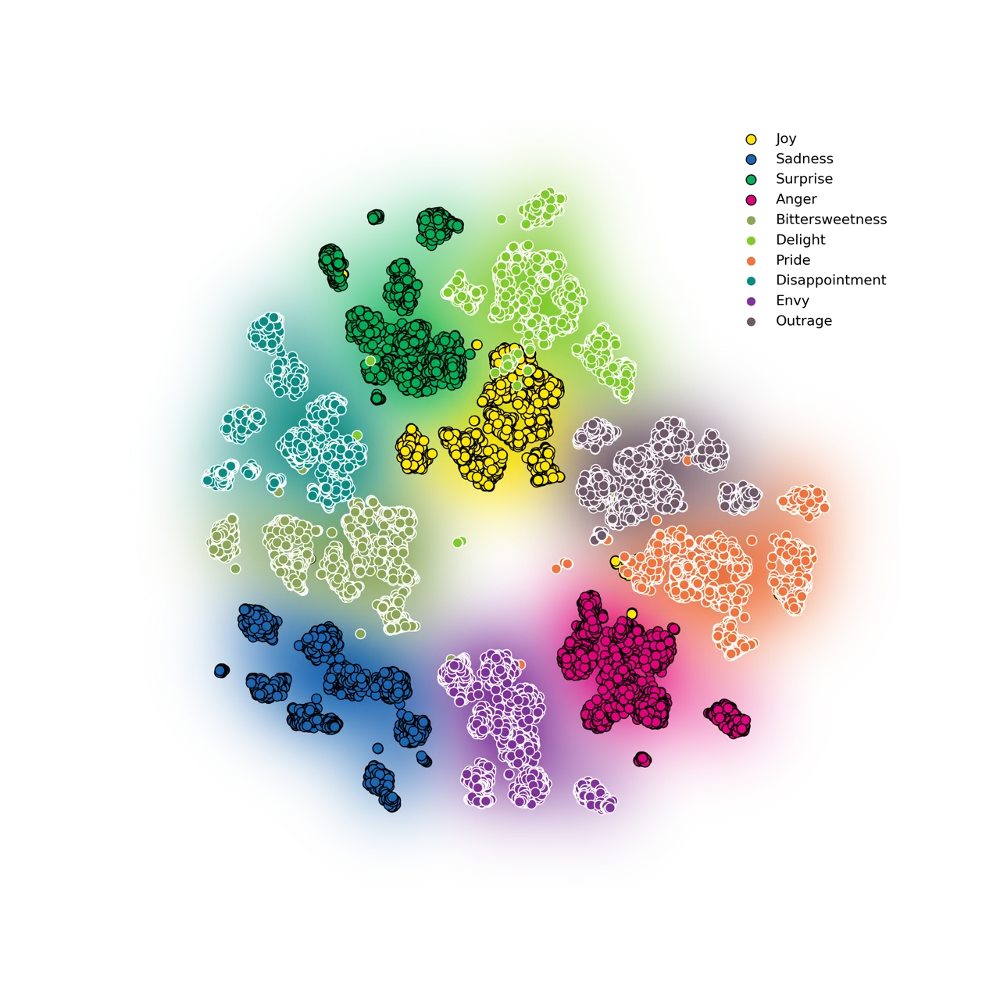
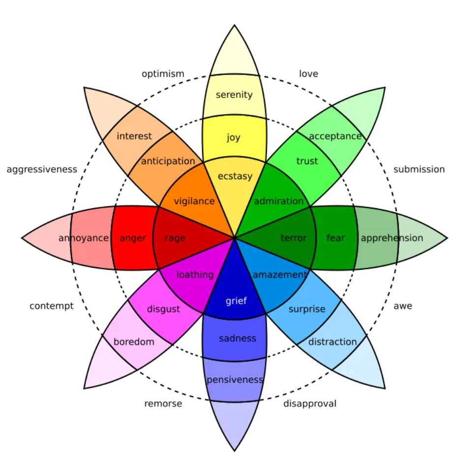
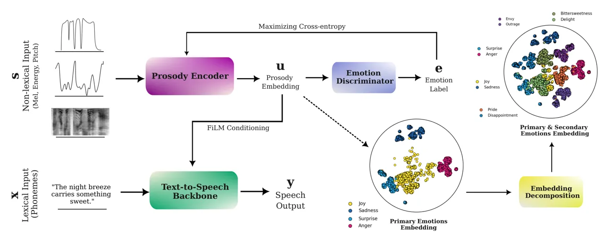
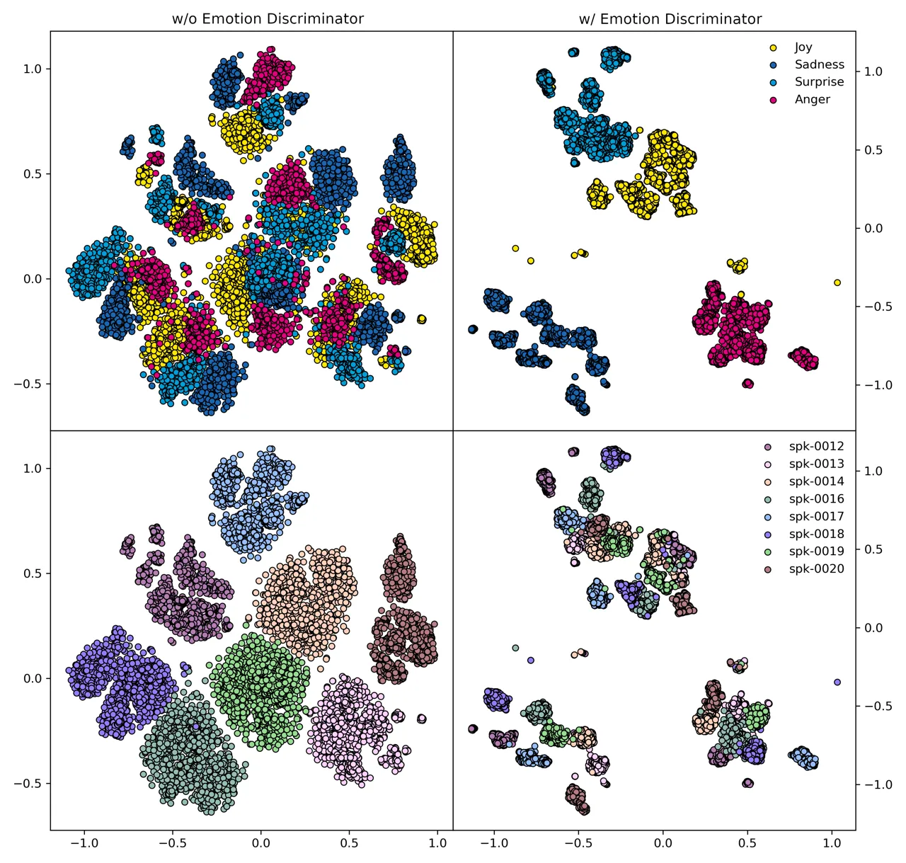
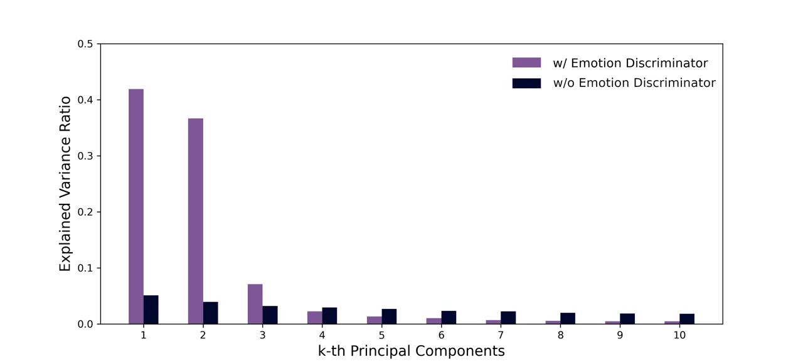
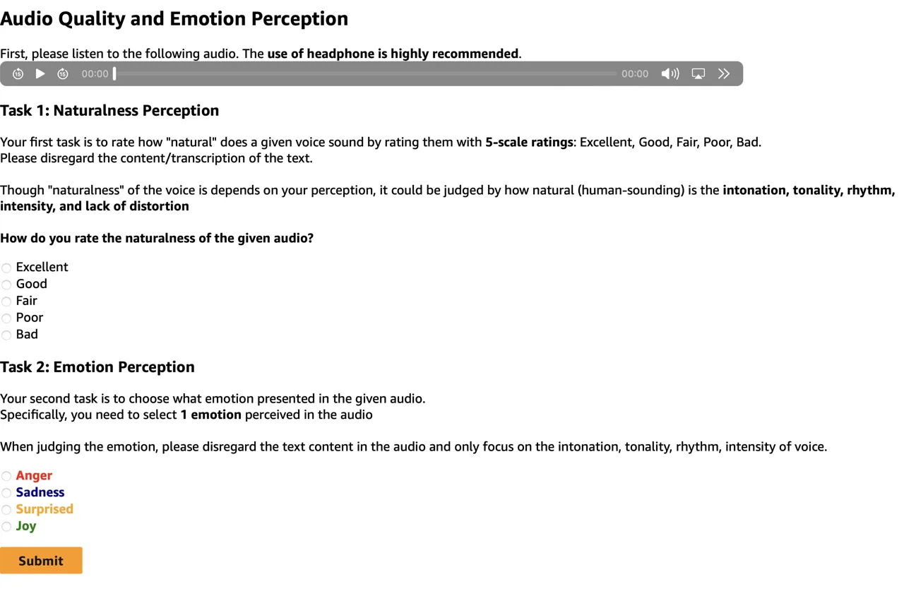

# Daisy-TTS: Simulating Wider Spectrum of Emotions via Prosody Embedding Decomposition

Rendi Chevi Affiliation: MBZUAI
Email: [rendi.chevi@mbzuai.ac.ae](mailto:)    Alham Fikri Aji
Affiliation: MBZUAI Email: [alham.fikri@mbzuai.ac.ae](mailto:)

###### Abstract

We often verbally express emotions in a multifaceted manner, they may
vary in their intensities and may be expressed not just as a single but
as a mixture of emotions. This wide spectrum of emotions is well-studied
in the structural model of emotions, which represents variety of
emotions as derivative products of primary emotions with varying degrees
of intensity. In this paper, we propose an emotional text-to-speech
design to simulate a wider spectrum of emotions grounded on the
structural model. Our proposed design, Daisy-TTS ²² 2 We named the model
‘Daisy’ as a reference to the flower-like arrangement of the structural
model of emotions. Interactive Demo:
[https://rendchevi.github.io/daisy-tts/](https://rendchevi.github.io/daisy-tts/),
incorporates a prosody encoder to learn emotionally-separable prosody
embedding as a proxy for emotion. This emotion representation allows the
model to simulate: (1) Primary emotions, as learned from the training
samples, (2) Secondary emotions, as a mixture of primary emotions, (3)
Intensity-level, by scaling the emotion embedding, and (4) Emotions
polarity, by negating the emotion embedding. Through a series of
perceptual evaluations, Daisy-TTS demonstrated overall higher emotional
speech naturalness and emotion perceiveability compared to the baseline.

## 1 Introduction

Subtle variations in speaking patterns that make up our prosody, allow
us to express a wide spectrum of emotions (Cowen et al., 2019). In most
cases, emotions may not always be expressed in their "pure"
states (Scherer and Ekman, 2014). Emotions we express may vary in their
intensity-level, for instance, a higher intensity of sadness might be
distinctly expressed as grief. It may even get more intricate as
sometimes we express not just a single but a mixture of different
emotions (Plutchik, 1982).



Figure 1: Emotionally-separable prosody embeddings learned from our
proposed model, Daisy-TTS. Emotions bordered in black denote primary
emotions, while ones bordered in white denote secondary emotions derived
from the mixture of primary ones.

This intricate spectrum of emotions posits an interesting challenge in
designing emotional text-to-speech systems. Most works have adapted
psychological theories in their design to properly represent and
simulate emotional speech, notably with the discrete (Ekman, 1992) and
dimensional (Russell, 1980) theories of emotion. The former allows for a
direct representation of emotions as discrete labels (e.g. anger, joy),
but likely incapable of simulating other variety of emotions. The latter
does open continuous emotional intensity simulation, but it reduces the
emotion representations down into higher-level affect variables of
valence, arousal, and dominance.

Another theory, the structural model of emotion (Plutchik, 1984),
represents a more structural view of emotions variety as derivative
products of primary emotions. This would allow a wider representation of
emotions, yet still underexplored in the emotional TTS design. To the
best of our knowledge, it has only been adapted in a few neural
emotional TTS, most notably (Zhou et al., 2022b; Tang et al., 2023),
where they managed to simulate intensity-level and mixture of emotions
through rank-based method and emotion embedding conditioning,
respectively.

Expanding upon prior works, we propose an emotional text-to-speech
design–grounded on the structural model of emotion–from the perspective
of prosody modelling. Our proposed design learns latent prosody
embedding as a proxy for emotion, which not only improves the emotion
simulation quality and perceivability of prior works, but also extends
the ability to simulate a wider spectrum of emotion as theorized in the
structural model. Our main contributions are summarized as follows:

- $`\circ`$
  We introduce an emotional text-to-speech design, Daisy-TTS, to
  simulate wide spectrum of emotion through learning
  emotionally-separable prosody embeddings (Figure 1).
- $`\circ`$
  Through decomposing and manipulating the learned embeddings, we are
  capable of simulating:
  - $`\bullet`$
    Primary Emotions, as learned from the training samples, e.g. joy,
    sadness, anger.
  - $`\bullet`$
    Secondary Emotions, as a mixture of primary emotions, e.g. envy =
    sadness + anger.
  - $`\bullet`$
    Intensity-level, by scaling the emotion embedding, e.g. rage = 2 \*
    anger.
  - $`\bullet`$
    Emotions Polarity, by negating the emotion embedding, e.g. sadness
    = - joy.

- $`\circ`$
  Our evaluation shows that our proposed design improves the quality of
  prior work (Zhou et al., 2022b) in terms of speech naturalness,
  emotion perceivability, and simulation capabilities.

## 2 Related Work

### 2.1 Structural Model of Emotion

In the structural model of emotion (Plutchik, 1982), the sheer variety
of emotional expressions is characterized as a derivative product of
primary emotions. Figure 2 shows a concise visualization of the model in
a flower-like arrangement.

Each petal represents the primary emotions. The length of the petal
represent the emotion’s intensity. The proximity of each petal
represents the similarity and polarity of emotions to one another. And
emotions in-between the petals represent the secondary emotions, derived
from the mixture of primary emotions.



Figure 2: Visual Representation of the Structural Model of Emotions.

We found it quite appealing the way emotions are characterized in the
structural model. It defined a discrete set of primary emotions, yet the
characteristics of intensity, polarity, and mixing of emotions expand
their representation beyond discrete labels.

Given this, we decided to adapt the structural model as the basis for
modeling emotion. Specifically, we design our proposed emotion modelling
framework with a focus on simulating emotions characterized by the
structural model.

### 2.2 Emotion Manifestation in Speech

It is intuitive to assume that speech conveys identifiable emotions, but
what part of it plays a role? Speech is roughly composed of lexical
(what we say) and non-lexical (how we say) components. Though both
components do convey emotions (Schuller and Schuller, 2020), substantial
works have shown that prosody, a non-lexical pattern of tune, rhythm,
and timbre, plays a main role in conveying emotion in
speech (Mozziconacci, 2002; Cowen et al., 2019).

Based on this, we decided to incorporate prosody in our proposed emotion
modelling framework, as a proxy representation of emotion in speech.

### 2.3 Emotion Modelling in Text-to-Speech

Modelling emotion in a text-to-speech task usually involves designing a
conditional model that simulates emotional speech given text and emotion
representation. How emotions are represented will affect the
characteristics of emotions that can be simulated by the model. In (Lee
et al., 2017), emotion is represented as discrete labels (e.g. joy,
sadness), though this allows the model to simulate primary emotions by
explicitly specifying the input emotion label, it hinders the simulation
of more complex characteristics such as emotion intensity and a mixture
of emotions. To alleviate this, a few recent works adapt the mentioned
structural model of emotions in their design. (Zhou et al., 2022b) is
one of the firsts that introduce the ability to simulate emotion
intensity and secondary emotion through a rank-based emotion attribute
vector. (Tang et al., 2023) represents emotion as a vector embedding
extracted from a pretrained speech emotion recognizer, which also allows
the simulation of both characteristics by combining the hidden state of
embedding.

The aforementioned models provide a solid framework for simulating a
variety of emotion characteristics, but most of them haven’t explicitly
incorporated prosody modelling in their design, which as stated in
Section 2.2, prosody should have played a main role in conveying emotion
in speech. One notable method to model prosody follows (Skerry-Ryan
et al., 2018; Wang et al., 2018), from which style embeddings are
directly learned from speech.  (Zaïdi et al., 2022) adopt this method to
specifically learn cross-speaker prosody embedding. Though these methods
were not explicitly designed to simulate characteristics of
emotions, (Rijn et al., 2021) shows that the embedding latent space of
this family of models is reliably associated with primary emotions.

Based on this, we hypothesize that explicitly incorporating prosody
modelling to model emotions–or framing the latter as the former–would
allow us to simulate a wider range of emotional characteristics.



Figure 3: Systemic Overview of Daisy-TTS. Emotionally-separable prosody
embeddings were learned from a set of speech features and used to
condition a TTS backbone model. To simulate a wider range of emotion
characteristics, such as intensity, polarity, and mixture of emotions,
an embedding decomposition was applied to the learned embeddings.

## 3 Learning Emotionally-separable Prosody Embedding

In this section, we discuss our approach to learning
emotionally-separable prosody embeddings through our proposed framework,
Daisy-TTS. As in Figure 3, the embeddings were learned by encoding
non-lexical speech features through a prosody encoder equipped with an
emotion discriminator and conditioned them to a text-to-speech backbone.

### 3.1 Text-to-Speech Backbone

Let $`\mathcal{F}(x|u)`$ be the backbone TTS model to synthesize
prosody-controlled speech, $`y`$, given lexical and prosodic features,
$`\{x,u\}`$. We represent $`x`$ and $`y`$ as phonemes and
mel-spectrogram. While for $`u`$, we assume a vector embedding
representing prosody, $`u\in\mathbb{R}^{d}`$, with $`d`$ as the size of
the embedding.

We chose Grad-TTS (Popov et al., 2021) as our backbone. Grad-TTS is a
non-autoregressive TTS model based on diffusion probabilistic modelling.
We chose this model as it is one the most high-quality open-source TTS
at the time of this research, which allow us to focus more on the
emotion modelling aspect.

In our implementation, we follow the original architecture of Grad-TTS,
which is composed of encoder and decoder modules. We apply a slight
modification to the encoder for prosody conditioning. The encoder
follows the same structure as (Kim et al., 2020), consisting of a 1D
convolutional prenet, 6 Transformer blocks, and a linear projection
layer. The encoder takes in $`x`$ as direct input, $`u`$ is conditioned
into the module on feature-level with FiLM conditioning (Perez et al.,
2017), the module outputs $`\mu_{\{x,u\}}`$, hidden feature of
$`\{x,u\}`$ assumed to be aligned with corresponding speech, $`y`$. The
decoder follows the same U-Net architecture as in (Ronneberger et al.,
2015; Ho et al., 2020). It synthesizes $`y`$ by iteratively decoding a
Gaussian noise, $`z\sim\mathcal{N}(\mu_{\{x,u\}},I)`$, parametrized by
the encoder’s output.

### 3.2 Emotionally-separable Prosody Encoder

To obtain a vector embedding representation of prosody, $`u`$, we follow
the methods from prosody transfer modelling (Skerry-Ryan et al., 2018;
Wang et al., 2018; Zaïdi et al., 2022). We define $`\mathcal{G}(s)`$, a
prosody encoder model independent of the backbone model. The main
objective of $`\mathcal{G}(s)`$ is to learn an emotionally-separable
prosody embedding, $`u`$, from some non-lexical features, $`s`$.

We choose multiple non-lexical features, which are mel-spectrogram,
pitch contour, and energy contour, to provide rich bases to encode
prosodic information. $`\mathcal{G}(s)`$ takes in $`s`$, and gradually
collapse the temporal dimension of the features. By collapsing the
temporal dimension, we assume it will also collapse the heavily
temporal-dependent information in the feature as well, such as the
lexical features, which are still present in the mel-spectrogram.

To impose emotion separability in the prosody embedding space, we
introduce an auxiliary emotion discriminator at the end of
$`\mathcal{G}(s)`$. Our empirical findings, as illustrated in
Section 6.2, shows that by maximizing the cross entropy between prosody
embeddings and their respective emotion labels can effectively impose
emotion separability of the prosody embeddings.

### 3.3 Model Training

Training Objective. Both the backbone and the prosody encoder are
trained jointly. There are 2 main training objectives, each
corresponding to both models’ respective tasks in synthesizing
prosody-controlled speech and imposing emotion separability. For the
former, we follow the same training objectives in (Popov et al., 2021),
and for the latter, we maximize the cross-entropy loss between the
prosody embeddings and their respective emotion labels.

Training Dataset. We found ESD (Emotional Speech Dataset) (Zhou et al.,
2021; Zhou et al., 2022a) is suitable for our problem. We select the
subset containing 10 English speakers (5 male, 5 female), each with 350
parallel utterances voice acted in neutral and 4 primary emotions: joy,
sadness, anger, and surprise. We follow the original training samples
split. With data processing protocol follows (Popov et al., 2021), where
the texts are converted to phonemes and the speech samples are
represented as mel-spectrograms with a sample rate set to 22,050 Hz, and
mel bands, filter size, window size, and hop length set to 80, 1024,
1024, 256, respectively.

Training Setting. Our model parameters count is 1̃4,800,000. We trained
the model in a single GPU (NVIDIA A100). AdamW (Loshchilov and Hutter, 2019) is used as the optimizer, with $`\beta_{1}=0.9`$,
$`\beta_{2}=0.99`$, and constant learning rate of $`1e^{-4}`$. The model
was trained for 310,000 steps with a batch size of 32.

Vocoder Setting. As most neural TTS that use mel-spectrogram as the
output, we need a vocoder to decode the synthesized speech. We use the
pretrained HifiGAN (Kong et al., 2020) vocoder available in the official
repository of Grad-TTS ¹¹ 1
[https://github.com/huawei-noah/Speech-Backbones/tree/main/Grad-TTS](https://github.com/huawei-noah/Speech-Backbones/tree/main/Grad-TTS),
and finetuned it with ESD dataset.

## 4 Simulating Emotion through Prosody Embedding

After Daisy-TTS is trained, we infer a set of prosody embeddings from
training speech samples. We denote
$`\textbf{u}=\{\mathcal{G}(s_{i})\}_{i=1}^{m}\in\mathbb{R}^{m\times d}`$,
as the inferred embeddings, where $`m`$ is the total number of samples.
As each $`s_{i}`$ is labeled with primary emotions $`\varepsilon`$ =
{joy, sadness, anger, surprise}, we have
$`\textbf{u}^{\varepsilon}\subset\textbf{u}`$.

### 4.1 Emotion Separability

We examine the emotion separability of u by applying the dimensionality
reduction method, t-SNE (Van der Maaten and Hinton, 2008). Figure 1
shows how each $`\textbf{u}^{\varepsilon}`$ is well separated from each
other. This implies that the encoded information describing primary
emotion in u are distinguishable from one another, which conforms to the
first emotion characteristics described in Section 2.1.

This separability is essential to simulate secondary and polar emotions,
as both are assumed to be derived from independent primary emotions.

### 4.2 Emotion from Prosody Decomposition

As we want to simulate a range of emotions through $`u`$, it is
important to have controllability over $`u`$ beyond providing an
exemplar speech to the model. Our approach is inspired by (Blanz and
Vetter, 2023). We decompose $`u`$ as a linear combination of its
"prototypes" weighted by parameter vector w:

```math
u(\textbf{w})=\overline{u}+\sum_{i=1}^{n}w_{i}v_{i} \tag{1}
```

the above decomposition can be obtained by performing PCA (Wold et al., 1987) to the embeddings, with $`\overline{u}`$ as the mean of
embeddings, $`n`$ as the chosen number of principal components,
$`v_{i}\in\mathbb{R}^{n\times d}`$ as the embedding prototypes in the
form of its top-$`n`$ eigenvectors, and w as the parameter vector
associated with $`u`$.

This type of decomposition assumed that w follow a multivariate Gaussian
distribution (Egger et al., 2020), with probability density function
described as:

```math
p(\textbf{w})\sim e^{-\frac{1}{2}\sum_{i=1}^{n}{(w_{i}/\sigma_{i})^{2}}},\,\textbf{w}\sim\mathcal{N}(0,\Sigma) \tag{2}
```

where $`\sigma_{i}^{2}`$ being the eigenvalues correspond to $`v_{i}`$,
and $`\Sigma`$ is the covariance matrix with diagonals of
$`\sigma_{i}`$. With this, we can synthesize plausible prosody embedding
conveying certain emotions by sampling w from the distribution.

### 4.3 Simulating Primary Emotions

We can simulate primary emotions by constraining the synthesis of
$`u(\textbf{w})`$ into a certain class of $`\varepsilon`$. To do this,
we sample w that is centered around $`\textbf{u}^{\varepsilon}`$,
denoted as $`\textbf{w}^{\varepsilon}`$. The mean of the distribution,
$`\mu^{\varepsilon}_{i}`$, can be interpreted as the principal
components of $`\overline{\textbf{u}}_{\varepsilon}`$. The density
function of $`\textbf{w}^{\varepsilon}`$ is defined as:

```math
p(\textbf{w}^{\varepsilon})\sim e^{-\frac{1}{2}\sum_{i=1}^{n}{(w^{\varepsilon}_{i}-\mu^{\varepsilon}_{i}})^{2}/\sigma_{i}^{2}},\,\textbf{w}^{\varepsilon}\sim\mathcal{N}(\mu^{\varepsilon}_{i},\Sigma) \tag{3}
```

We can then sample a plausible $`\textbf{w}^{\varepsilon}`$ to
synthesize prosody embedding that simulates the desired primary emotion,
$`\varepsilon`$.

### 4.4 Simulating Secondary Emotions

A secondary emotion is defined as a mixture between 2 primary
emotions (Plutchik, 1982). With our prosody decomposition, we can
interpret a secondary emotion as a mixture between two different
$`\textbf{w}^{\varepsilon}`$, denoted as
$`\textbf{w}^{\varepsilon_{s}}`$. As w follow multivariate Gaussian
distribution, we can define the mean and covariance for
$`\textbf{w}^{\varepsilon_{s}}`$ as:

```math
\Sigma^{\varepsilon_{s}}=(2\Sigma^{-1})^{-1} \tag{4}
```

```math
\mu^{\varepsilon_{s}}=\Sigma^{\varepsilon_{s}}\Sigma^{-1}\mu^{{\varepsilon_{1}}}+\Sigma^{\varepsilon_{s}}\Sigma^{-1}\mu^{{\varepsilon_{2}}} \tag{5}
```

From this, we can sample $`\textbf{w}^{\varepsilon_{s}}`$ to synthesize
prosody embedding conveying a variety of secondary emotions:

```math
\textbf{w}^{\varepsilon_{s}}\sim\mathcal{N}(\mu^{\varepsilon_{s}},\Sigma^{\varepsilon_{s}}) \tag{6}
```

Figure 1 shows the projected embeddings of secondary emotions. We could
see that each secondary emotion lies between the approximate area of its
primary emotion pairs. For instance, bittersweetness lies between the
area of joy and sadness, envy lies between the area of sadness and
anger, and so on.

### 4.5 Simulating Intensity-level

We found that performing a scaling operation on the basis with scalar,
$`\alpha\sum_{i=1}^{n}w_{i}v_{i}`$, equates to simulating the
intensity-level of emotion expressed by $`u(\textbf{w})`$. With
$`\alpha<1.0`$ equates to lowering the intensity of the emotion, while
$`\alpha>1.0`$ intensifies it.

### 4.6 Emotions Polarity

Polarity in emotion is defined as the maximum dissimilarity of
emotion (Plutchik, 1982). We found that by negating
$`\textbf{w}^{\varepsilon}`$, we can simulate an emotion that is
perceivably the opposite of that emotion. For example, sampling
$`-\textbf{w}^{\varepsilon_{joy}}`$ gives embedding that is similar to
sampling from $`\textbf{w}^{\varepsilon_{sadness}}`$ and vice versa.

## 5 Evaluation

In this section, we report the evaluation we conducted on the model’s
capability to simulate emotions and how humans subjectively perceived
them.

### 5.1 Evaluation Metrics

|              |                                               |                 |                 |                 |                 |                 |                 |
| ------------ | --------------------------------------------- | --------------- | --------------- | --------------- | --------------- | --------------- | --------------- |
|              | Speech Naturalness (MOS; 95% CI) $`\uparrow`$ |                 |                 |                 |                 |                 |                 |
|              | Anger                                         | Joy             | Sadness         | Surprise        | Delight         | Pride           | Envy            |
| Ground Truth | 3.844\_(±0.129)                               | 3.867\_(±0.123) | 3.567\_(±0.133) | 3.789\_(±0.133) | \-              | \-              | \-              |
| Baseline     | 3.356\_(±0.189)                               | 3.167\_(±0.201) | 3.200\_(±0.186) | 2.822\_(±0.246) | 3.178\_(±0.209) | 3.356\_(±0.204) | 3.478\_(±0.186) |
| Daisy-TTS    | 3.689\_(±0.192)                               | 3.844\_(±0.180) | 3.456\_(±0.196) | 3.511\_(±0.186) | 3.811\_(±0.182) | 3.656\_(±0.166) | 3.900\_(±0.172) |
|              | Emotion Perceivability (Acc.) $`\uparrow`$    |                 |                 |                 |                 |                 |                 |
|              | Anger                                         | Joy             | Sadness         | Surprise        | Delight         | Pride           | Envy            |
| Ground Truth | 0.656                                         | 0.478           | 0.556           | 0.489           | \-              | \-              | \-              |
| Baseline     | 0.300                                         | 0.233           | 0.533           | 0.144           | 0.311           | 0.133           | 0.255           |
| Daisy-TTS    | 0.533                                         | 0.333           | 0.478           | 0.300           | 0.355           | 0.166           | 0.277           |

Table 1: Results of MOS and emotion perception tests on primary and
secondary emotions (continued in Appendix A.1). Daisy-TTS overall
achieves higher speech naturalness and emotion perceivability compared
to the baseline.

Figure 4: Result of emotion perception test for different
intensity-level of primary emotions.

We adopt the tests for emotional speech evaluation conducted in (Zhou
et al., 2022b; Cowen et al., 2019). Emotional speech samples will be
evaluated in terms of its speech naturalness and emotion perceivability.
Speech naturalness is evaluated through the MOS (Mean Opinion Score)
test, where human annotators were asked to rate the naturalness of the
given speech samples on a 5-point Likert scale: Excellent, Good, Fair,
Poor, and Bad. Whereas emotion perceivability is evaluated through an
emotion perception test, where the annotators were asked to select one
or two emotions they perceived.

To accommodate the test, we crowd-sourced our evaluation to human
annotators. The details of the crowd-sourcing setup can be found in A.3

### 5.2 Baseline Setup

As discussed in Section 2.3, there are mainly 2 candidates for our
baselines,  (Zhou et al., 2022b) and (Tang et al., 2023). We can only
utilize (Zhou et al., 2022b) as our baseline as the latter is not
open-sourced.

Through their rank-based method, the baseline model can simulate
primary, secondary, and intensity-level of emotions. The model is a
sequence-to-sequence TTS akin to the recognition-synthesis model (Zhang
et al., 2020). We use the official pretrained model shared by the
authors ²² 2
[https://github.com/KunZhou9646/Mixed_Emotions](https://github.com/KunZhou9646/Mixed_Emotions).

It is important to note that the shared model was only trained on a
single English speaker subset of ESD (speaker "0019"), the audio
configuration is not the same as described in Section 3.3, and there was
no pretrained vocoder to decode the mel-spectrogram. Thus, to make the
evaluation fairer, we only compare the samples spoken by speaker "0019"
and we also finetune the same vocoder we described in Section 3.3 with
ESD dataset but follow the audio configuration of the baseline.

### 5.3 Evaluation Results

#### 5.3.1 Primary Emotions Evaluation

Results are shown in Table 1. In MOS test, Daisy-TTS outperformed the
baseline across all 4 primary emotions. In the emotion perception test,
Daisy-TTS achieves higher overall emotion perceiveability compared to
the baseline, with an exception only in expressing sadness.

Interestingly, if we observe the ground truth’s emotion perceivability,
it shows that the ground-truth emotions are not easily distinguishable
by humans either. This actually conforms with recent insights
in (Troiano et al., 2021) on the frequent inconfidence of humans in
rating emotional tasks. We will further discuss this in Section 6.1.

#### 5.3.2 Secondary Emotion Evaluation

As we don’t have ground truth samples for secondary emotions, we
conducted the tests only with Daisy-TTS and the baseline. Results are
shown in Table 1. Similar to the previous results, Daisy-TTS overall
outperforms the baseline, with the exception of expressing
disappointment, a mixture of surprise and sadness, which can be
explained by the baseline’s stronger ability to express sadness.

#### 5.3.3 Intensity-level Evaluation

We simulate 3 different intensity levels: low, medium, and high
intensity, respectively represented by $`\alpha=\{{0.25,1.0,1.75\}}`$.
Figure 4 shows how different intensity levels affect the naturalness and
perceivability of primary emotions. MOS varies when adjusting the
intensity and we see occasional drop. However, our method is
consistently outperforms the baseline. The baseline suffered from the
highest drop of 0.689, while Daisy-TTS highest drop is only 0.255. This
implies that Daisy-TTS is more robust in expressing intensity-varying
emotions compared to the baseline.

In emotion perception test, we observe that by increasing the
intensity-level, the emotion perceivability is improved as well, with
Daisy-TTS achieves higher improvement across emotions except for
sadness, which conforms to previous tests. This behavior can be
explained intuitively from the assumption of emotions would be perceived
more confidently if expressed with stronger intensity (Troiano et al.,
2021).

#### 5.3.4 Emotions Polarity Evaluation

As Daisy-TTS is the only model in the evaluation capable of simulating
emotions polarity, we only conducted the evaluation with the model.
Results are shown in Table 2. Simulated polar version of joy seems to be
as perceivable as its sadness counterpart, while the perceiveability of
the polar version of sadness has a 17.8% drop from joy.

| Speech Naturalness (MOS) $`\uparrow`$      |                |         |                |
| ------------------------------------------ | -------------- | ------- | -------------- |
| Joy                                        | Polar Sadness  | Sadness | Polar Joy      |
| 3.844                                      | 3.666\_(-.177) | 3.456   | 3.788\_(+.331) |
| Emotion Perceivability (Acc.) $`\uparrow`$ |                |         |                |
| Joy                                        | Polar Sadness  | Sadness | Polar Joy      |
| 0.333                                      | 0.344\_(+.011) | 0.478   | 0.300\_(-.178) |

Table 2: Results of MOS and emotion perception tests of Daisy-TTS from
simulating emotions polarity.

## 6 Discussion

### 6.1 Human Confusion across Primary Emotions

As reported in Section 5.3.1, we found it intriguing that even the
emotions in ground truth samples are not easily distinguishable by
humans either. But, we could actually explain this from two
perspectives. First, as described in Section 2.1, emotions may vary in
their degree of similarity to one another, thus some emotions may be
perceived similarly and confused with the others. Second, based on the
findings in Section 5.3.3 and (Troiano et al., 2021), it might also be
due to the intensity-level of the evaluated samples.

We can further examine this by looking at the cosine similarity for each
primary emotion embedding. Table 6 shows that most emotions are not
fully dissimilar to one another, there is still some degree of
similarity across emotions, even for polar opposites like joy and
sadness.

|          |         |       |       |          |
| -------- | ------- | ----- | ----- | -------- |
|          | Sadness | Joy   | Anger | Surprise |
| Sadness  | +1.0    | -0.46 | -0.43 | -0.40    |
| Joy      | -0.46   | +1.0  | -0.15 | +0.20    |
| Anger    | -0.43   | -0.15 | +1.0  | -0.56    |
| Surprise | -0.40   | +0.20 | -0.56 | +1.0     |

|            |          |                 |      |       |          |
| ---------- | -------- | --------------- | ---- | ----- | -------- |
|            |          | Predicted Label |      |       |          |
|            |          | Sadness         | Joy  | Anger | Surprise |
| True Label | Sadness  | 0.56            | 0.21 | 0.04  | 0.19     |
|            | Joy      | 0.04            | 0.48 | 0.28  | 0.2      |
|            | Anger    | 0.05            | 0.2  | 0.66  | 0.08     |
|            | Surprise | 0.03            | 0.32 | 0.16  | 0.49     |

|            |          |                 |      |       |          |
| ---------- | -------- | --------------- | ---- | ----- | -------- |
|            |          | Predicted Label |      |       |          |
|            |          | Sadness         | Joy  | Anger | Surprise |
| True Label | Sadness  | 0.53            | 0.27 | 0.06  | 0.13     |
|            | Joy      | 0.42            | 0.23 | 0.21  | 0.13     |
|            | Anger    | 0.32            | 0.34 | 0.30  | 0.03     |
|            | Surprise | 0.33            | 0.30 | 0.22  | 0.14     |

|            |          |                 |      |       |          |
| ---------- | -------- | --------------- | ---- | ----- | -------- |
|            |          | Predicted Label |      |       |          |
|            |          | Sadness         | Joy  | Anger | Surprise |
| True Label | Sadness  | 0.48            | 0.32 | 0.08  | 0.11     |
|            | Joy      | 0.16            | 0.33 | 0.30  | 0.21     |
|            | Anger    | 0.11            | 0.30 | 0.53  | 0.05     |
|            | Surprise | 0.06            | 0.36 | 0.28  | 0.30     |

Table 3: Cosine Similarity between Primary Emotion Embeddings.

Table 4: Confusion matrix of ground truth.

Table 5: Confusion Matrix of Baseline.

Table 6: Confusion Matrix of Daisy-TTS.

This similarity is reflected by the confusion human annotators made as
well. In Table 6, we can see that the low perceivability for
ground-truth samples might be attributed to the misperception of other
emotions. For example, some expression of sadness is mistaken for joy
even though they are polar opposites, joy was often mistaken for anger
or surprise, and vice versa. Table 6 and 6 shows the confusion in the
models samples, the baseline seems to indicate higher misperception of
primary emotions compared to the ground-truth. While Daisy-TTS seems to
produce emotional speech that is perceived more similarly to the ground
truth samples.

### 6.2 Role of Emotion Discriminator

As our method to simulate emotions relies on the emotion separability of
the prosody embeddings, we examine whether training with emotion
discriminator actually affects the embeddings.



Figure 5: (Left Column) Prosody embeddings from training Daisy-TTS
without emotion discriminator; (Right Column) with emotion
discriminator. Training without emotion discriminator discouraged
emotion separability.

Figure 5 shows the comparison between the embeddings with and without
the emotion discriminator. Absence of emotion discriminator does make
the embedding space not emotionally-separable. However, it turns out
that the embeddings would be separated by the speaker’s identity. But,
this speaker separability is retained in model with emotion
discriminator, albeit locally in each emotion cluster.



Figure 6: Explained variance ratio of the prosody embeddings from the
ablation. Uniform variance in the absence of an emotion discriminator
might disallows meaningful decomposition for emotion simulation.

Furthermore, if we examine the explained variance ratio across prosody
prototypes (eigenvectors), as shown in Figure 6, it seems like each
eigenvector in model not trained with emotion discriminator does not
describe as meaningful features as the ones trained with emotion
discriminator. Thus, disallowing emotion simulation through prosody
embedding decomposition described in Section 4.

### 6.3 Unseen Emotion Transfer

As we represented emotion with prosody embedding, we found that we can
actually simulate unseen emotions to some extent, given arbitrary speech
samples. Let $`s^{t}`$ be the unseen speech sample conveying emotion
$`\varepsilon_{t}`$, we can sample $`\textbf{w}^{\varepsilon_{t}}`$ by
computing the principal components of $`s^{t}`$, and synthesize the
corresponding $`u(\textbf{w}^{\varepsilon_{t}})`$. This way, not only
the synthesized mimic the emotion and prosody, we could also sample a
variety of emotion similar to the given sample. We will leave this
exploration for future work, but readers can listen to our experimental
samples on this idea in our project page.

## 7 Conclusion

In this paper, we introduce Daisy-TTS, an emotional text-to-speech
design to model wider spectrum of emotions. Our core method lies in
learning and decomposing emotionally-separable prosody embeddings as
proxy for emotions. We show that by decomposing and manipulating the
learned embeddings, Daisy-TTS capable to simulate emotional speech that
conveys: (1) primary emotions, (2) secondary emotions, (3)
intensity-level, and (4) polarity of emotions. Through a series of
perceptual evaluation, our proposed design demonstrated higher emotional
speech naturalness and emotion perceivability compared to the baseline.

## 8 Ethics Statement

The design of Daisy-TTS could be used as a framework to build a highly
realistic emotional text-to-speech and voice cloning systems, given
sufficient training dataset and appropriate modifications. There are
risks for misusing the proposed design for non-consensual and malicious
deepfake media generation, specifically ones with the intention of
mimicking natural human emotional expression and response.

## 9 Limitation

Though Daisy-TTS has shown promising results simulating wider spectrum
of emotions, there are still notable limitations in this research. Due
to the scarcity of emotional TTS dataset, we haven’t yet tested whether
the proposed framework would perform similarly to other languages. As
our emotion representation heavily conforms to the structural model of
emotions that requires speech samples expressing a set primary emotions,
our method might not be suitable for speech samples that assumes other
types of emotion model.

## References

- Blanz and Vetter (2023) Volker Blanz and Thomas Vetter. 2023. A
  morphable model for the synthesis of 3d faces. In _Seminal Graphics
  Papers: Pushing the Boundaries, Volume 2_, pages 157–164.
- Cowen et al. (2019) Alan S Cowen, Petri Laukka, Hillary Anger
  Elfenbein, Runjing Liu, and Dacher Keltner. 2019. The primacy of
  categories in the recognition of 12 emotions in speech prosody across
  two cultures. _Nature human behaviour_, 3(4):369–382.
- Egger et al. (2020) Bernhard Egger, William A. P. Smith, Ayush Tewari,
  Stefanie Wuhrer, Michael Zollhoefer, Thabo Beeler, Florian Bernard,
  Timo Bolkart, Adam Kortylewski, Sami Romdhani, Christian Theobalt,
  Volker Blanz, and Thomas Vetter. 2020. [3d morphable face models –
  past, present and future](http://arxiv.org/abs/1909.01815).
- Ekman (1992) Paul Ekman. 1992. An argument for basic emotions.
  _Cognition & emotion_, 6(3-4):169–200.
- Ho et al. (2020) Jonathan Ho, Ajay Jain, and Pieter Abbeel. 2020.
  [Denoising diffusion probabilistic
  models](http://arxiv.org/abs/2006.11239).
- Kim et al. (2020) Jaehyeon Kim, Sungwon Kim, Jungil Kong, and Sungroh
  Yoon. 2020. [Glow-tts: A generative flow for text-to-speech via
  monotonic alignment search](http://arxiv.org/abs/2005.11129).
- Kong et al. (2020) Jungil Kong, Jaehyeon Kim, and Jaekyoung Bae. 2020.
  [Hifi-gan: Generative adversarial networks for efficient and high
  fidelity speech synthesis](http://arxiv.org/abs/2010.05646).
- Lee et al. (2017) Younggun Lee, Azam Rabiee, and Soo-Young Lee. 2017.
  [Emotional end-to-end neural speech
  synthesizer](http://arxiv.org/abs/1711.05447).
- Loshchilov and Hutter (2019) Ilya Loshchilov and Frank Hutter. 2019.
  [Decoupled weight decay
  regularization](http://arxiv.org/abs/1711.05101).
- Mozziconacci (2002) Sylvie Mozziconacci. 2002. Prosody and emotions.
  In _Proc. Speech Prosody 2002_, pages 1–9.
- Perez et al. (2017) Ethan Perez, Florian Strub, Harm de Vries, Vincent
  Dumoulin, and Aaron Courville. 2017. [Film: Visual reasoning with a
  general conditioning layer](http://arxiv.org/abs/1709.07871).
- Plutchik (1982) Robert Plutchik. 1982. A psychoevolutionary theory of
  emotions.
- Plutchik (1984) Robert Plutchik. 1984. Emotions: A general
  psychoevolutionary theory. _Approaches to emotion_, 1984(197-219):2–4.
- Popov et al. (2021) Vadim Popov, Ivan Vovk, Vladimir Gogoryan, Tasnima
  Sadekova, and Mikhail Kudinov. 2021. [Grad-tts: A diffusion
  probabilistic model for
  text-to-speech](http://arxiv.org/abs/2105.06337).
- Rijn et al. (2021) Pol van Rijn, Silvan Mertes, Dominik Schiller,
  Peter M.C. Harrison, Pauline Larrouy-Maestri, Elisabeth André, and
  Nori Jacoby. 2021. [Exploring emotional prototypes in a high
  dimensional tts latent
  space](https://doi.org/10.21437/interspeech.2021-1538). In
  _Interspeech 2021_, interspeech 2021. ISCA.
- Ronneberger et al. (2015) Olaf Ronneberger, Philipp Fischer, and
  Thomas Brox. 2015. [U-net: Convolutional networks for biomedical image
  segmentation](http://arxiv.org/abs/1505.04597).
- Russell (1980) James A Russell. 1980. A circumplex model of affect.
  _Journal of personality and social psychology_, 39(6):1161.
- Scherer and Ekman (2014) Klaus R Scherer and Paul Ekman. 2014.
  _Approaches to emotion_. Psychology Press.
- Schuller and Schuller (2020) Dagmar Schuller and Björn Schuller. 2020.
  [A review on five recent and near-future developments in computational
  processing of emotion in the human
  voice](https://doi.org/10.1177/1754073919898526). _Emotion Review_,
  13:175407391989852.
- Skerry-Ryan et al. (2018) RJ Skerry-Ryan, Eric Battenberg, Ying Xiao,
  Yuxuan Wang, Daisy Stanton, Joel Shor, Ron J. Weiss, Rob Clark, and
  Rif A. Saurous. 2018. [Towards end-to-end prosody transfer for
  expressive speech synthesis with
  tacotron](http://arxiv.org/abs/1803.09047).
- Tang et al. (2023) Haobin Tang, Xulong Zhang, Jianzong Wang, Ning
  Cheng, and Jing Xiao. 2023. [Emomix: Emotion mixing via diffusion
  models for emotional speech
  synthesis](http://arxiv.org/abs/2306.00648).
- Troiano et al. (2021) Enrica Troiano, Sebastian Padó, and Roman
  Klinger. 2021. [Emotion ratings: How intensity, annotation confidence
  and agreements are entangled](http://arxiv.org/abs/2103.01667).
- Van der Maaten and Hinton (2008) Laurens Van der Maaten and Geoffrey
  Hinton. 2008. Visualizing data using t-sne. _Journal of machine
  learning research_, 9(11).
- Wang et al. (2018) Yuxuan Wang, Daisy Stanton, Yu Zhang,
  RJ Skerry-Ryan, Eric Battenberg, Joel Shor, Ying Xiao, Fei Ren,
  Ye Jia, and Rif A. Saurous. 2018. [Style tokens: Unsupervised style
  modeling, control and transfer in end-to-end speech
  synthesis](http://arxiv.org/abs/1803.09017).
- Wold et al. (1987) Svante Wold, Kim Esbensen, and Paul Geladi. 1987.
  Principal component analysis. _Chemometrics and intelligent laboratory
  systems_, 2(1-3):37–52.
- Zaïdi et al. (2022) Julian Zaïdi, Hugo Seuté, Benjamin van Niekerk,
  and Marc-André Carbonneau. 2022. [Daft-exprt: Cross-speaker prosody
  transfer on any text for expressive speech
  synthesis](https://doi.org/10.21437/interspeech.2022-10761). In
  _Interspeech 2022_, interspeech 2022. ISCA.
- Zhang et al. (2020) Jing-Xuan Zhang, Zhen-Hua Ling, and Li-Rong
  Dai. 2020. [Non-parallel sequence-to-sequence voice conversion with
  disentangled linguistic and speaker
  representations](https://doi.org/10.1109/taslp.2019.2960721).
  _IEEE/ACM Transactions on Audio, Speech, and Language Processing_,
  28:540–552.
- Zhou et al. (2021) Kun Zhou, Berrak Sisman, Rui Liu, and Haizhou
  Li. 2021. Seen and unseen emotional style transfer for voice
  conversion with a new emotional speech dataset. In _ICASSP 2021-2021
  IEEE International Conference on Acoustics, Speech and Signal
  Processing (ICASSP)_, pages 920–924. IEEE.
- Zhou et al. (2022a) Kun Zhou, Berrak Sisman, Rui Liu, and Haizhou Li.
  2022a. [Emotional voice conversion: Theory, databases and
  esd](http://arxiv.org/abs/2105.14762).
- Zhou et al. (2022b) Kun Zhou, Berrak Sisman, Rajib Rana, B. W.
  Schuller, and Haizhou Li. 2022b. [Speech synthesis with mixed
  emotions](http://arxiv.org/abs/2208.05890).

## Appendix A Appendix

### A.1 Evaluation Results (Cont’d)

|              |                                               |                 |                 |
| ------------ | --------------------------------------------- | --------------- | --------------- |
|              | Speech Naturalness (MOS; 95% CI) $`\uparrow`$ |                 |                 |
|              | Bittersweet                                   | Disappointment  | Outrage         |
| Ground Truth | \-                                            | \-              | \-              |
| Baseline     | 3.433\_(±0.177)                               | 3.256\_(±0.221) | 3.189\_(±0.234) |
| Daisy-TTS    | 3.667\_(±0.183)                               | 3.911\_(±0.168) | 3.844\_(±0.185) |
|              | Emotion Perceivability (Acc.) $`\uparrow`$    |                 |                 |
|              | Bittersweet                                   | Disappointment  | Outrage         |
| Ground Truth | \-                                            | \-              | \-              |
| Baseline     | 0.211                                         | 0.177           | 0.188           |
| Daisy-TTS    | 0.288                                         | 0.100           | 0.233           |

Table 7: Results of MOS and emotion perception tests on primary and
secondary emotions, continued from Table 1.

### A.2 Secondary Emotions in Structural Model of Emotions

Through a series of psychological experiments described in (Plutchik,
1982), the structural model of emotions derived a list of secondary
emotions as mixture of primary emotions. Table 8 shows the secondary
emotions and their corresponding primary emotion pairs. We incorporate
this secondary emotions formulation into our proposed model, Daisy-TTS,
and experiments.

| Primary Emotions   | Secondary Emotion |
| ------------------ | ----------------- |
| Joy + Sadness      | Bittersweetness   |
| Joy + Surprise     | Delight           |
| Joy + Anger        | Pride             |
| Sadness + Surprise | Disappointment    |
| Anger + Sadness    | Envy              |
| Anger + Surprise   | Outrage           |

Table 8: Secondary emotions derived from the mixture of primary
emotions, as defined in the structural model of emotions.

### A.3 Crowdsourcing Evaluation Setup

We employ human annotators for our evaluations from Amazon Mechanical
Turk. We specify to employ an annotator with HIT of 99% or above to
decrease the chances of unreliable results. The annotators were paid
0.15\$ per instance. The MTurk annotation interface is shown in
Figure 7.



Figure 7: MTurk interface we used for our evaluation.
