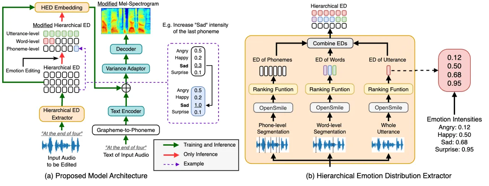
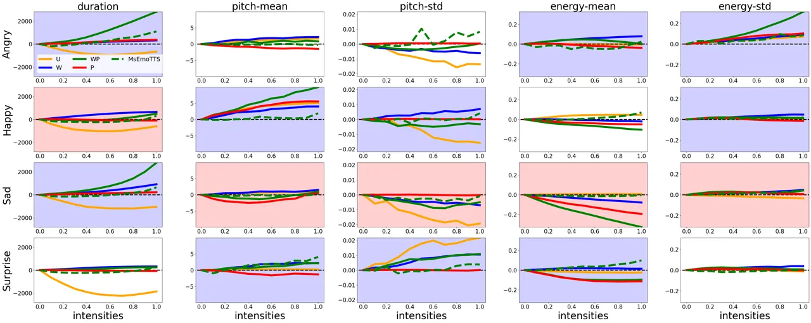

# Fine-Grained Quantitative Emotion Editing for Speech Generation

\authorblockN Sho Inoue\authorrefmark1\authorrefmark2, Kun
Zhou\authorrefmark3, Shuai Wang\authorrefmark2\authorrefmark4, and
Haizhou Li\authorrefmark1\authorrefmark2, \authorblockA
\authorrefmark1School of Data Science \authorrefmark2Shenzhen Research
Institute of Big Data  
The Chinese University of Hong Kong, Shenzhen (CUHK-Shenzhen), China  
\authorblockA \authorrefmark3Alibaba Group, Singapore  
\authorblockA E-mail: shoinoue@link.cuhk.edu.cn, kun.z@alibaba-inc.com,
wangshuai@cuhk.edu.cn, and haizhouli@cuhk.edu.cn

###### Abstract

It remains a significant challenge how to quantitatively control the
expressiveness of speech emotion in speech generation. In this work, we
propose an approach for quantitative manipulation of the emotion
rendering for emotion editing in speech generation. We apply a
hierarchical emotion distribution extractor, i.e. Hierarchical ED, that
quantifies the intensity of emotions at different levels of granularity.
Hierarchical ED is subsequently integrated into the FastSpeech2
framework, guiding the model to learn emotion intensity at phoneme,
word, and utterance levels. During synthesis, users can manually edit
the emotional intensity of the generated voices. Both objective and
subjective evaluations demonstrate the effectiveness of the proposed
network in terms of fine-grained quantitative emotion editing.

^(†)^(†) \authorrefmark4Corresponding Author  
The research is supported by National Natural Science Foundation of
China (Grant No. 62271432); Internal Project of Shenzhen Research
Institute of Big Data (Grant No. T00120220002); Shenzhen Science and
Technology Program ZDSYS20230626091302006; Shenzhen Science and
Technology Research Fund (Fundamental Research Key Project Grant No.
JCYJ20220818103001002); and CCF-NetEase ThunderFire Innovation Research
Funding (No. CCF-Netease 202302).

Figure 1: (a) Model architecture with hierarchical emotion distribution
(HED) mechanism in TTS. During inference, the framework extracts
hierarchical ED from input audio (“emotion editing”). Users can manually
modify hierarchical ED to control emotion intensities at phoneme, word,
and utterance levels; (b) Hierarchical ED extraction workflow for
emotion distributions at phoneme, word, and utterance levels.

## 1 Introduction

\IEEEPARstart

Speech emotion, characterized by prosodic patterns at phoneme, word, and
utterance level \[1, 2, 3\], is effectively represented through a
hierarchical structure \[4, 5\]. These patterns, including pitch, tempo,
rhythm, stress, lexical emphasis, and speaker individuality, are crucial
for accurate emotion rendering \[6, 7, 8, 9\]. Existing methods, like
style tokens, represent prosody patterns but often lack
interpretability, quantitativeness, and fine-grained
controllability \[10, 11\], highlighting the need for more effective
models. In neural text-to-speech, speech editing techniques empower
models to alter audio segments based on user instructions, enabling
fine-grained prosody prediction in synthesized speech \[12, 13\].
However, this approach is deficient in quantitative control.

The complexity of speech emotions, as evidenced by various studies \[14,
15, 16, 17\], indicates that merely adjusting prosodic features is
inadequate. Additionally, the hierarchical nature of speech
emotion \[6\], with unique characteristics at utterance \[18\],
word \[19\], and phoneme \[6\] levels, calls for a multi-level approach
for accurate and human-like emotional expression in speech synthesis.
Previous studies on text-to-speech and emotional voice conversion \[20,
17, 21\] also highlight the importance of multi-level modeling for
speech emotions. Thus, a quantifiable method capable of modeling the
hierarchical structure of emotions is imperative for effective and
nuanced emotion rendering in speech synthesis.

In our previous study \[22\], we investigated a fine-grained emotion
control approach for text-to-speech (TTS) systems. In this paper, we
further extend the approach to enable quantitative emotion editing. This
provides an intuitive and quantitative method for manipulating emotion
rendering at the phoneme, word, and utterance levels. Compared to our
previous work \[22\], which integrated fine-grained embedding solely
into the variance adaptor of FastSpeech2, our proposed emotion editing
approach allows for fine-grained and flexible human editing across any
TTS model.

Our contributions are summarized as follows:

- •
  We propose a novel fine-grained emotion editing framework that
  facilitates the emotion rendering in previously unseen audios and
  allows for the adjustment of emotion intensity for a speech generation
  framework;
- •
  We thoroughly compare our approach with the baseline method of
  phoneme-level emotion intensity control, demonstrating our model’s
  superior emotion expressiveness and controllability.
- •
  At run-time, users have the flexibility to analyze and manipulate the
  emotion distribution from the audio sample (“emotion editing”). This
  approach empowers users with a quantitative method to modify emotion
  rendering of a spoken utterance.

The rest of this paper is organized as follows: In Section 2, we discuss
the related works. Section 3 describes our proposed methodology. In
Section 4, we report our experiments and results. Section 5 concludes
our study.

## 2 Related Works

### 2.1 Control of Speech Emotion

There has been a growing interest in enabling the control of synthesized
emotions \[23, 24, 25\]. Emotion-enhanced GST \[23\] incorporated an
emotion recognition task to facilitate the modeling of emotion-related
prosody. Some studies explored quantitative methods for controlling
emotions through relative attributes \[26, 27, 28, 29\]. Another
study \[30\] delved into inter- and intra-class distances to achieve
fine-grained control over recognizable intensity differences. EmoQ-TTS
\[31\] adopted a distance-based intensity quantization approach to
capture emotion intensity.

Unlike MsEmoTTS \[32\], which covers only utterance-level emotional
change with fine-grained intensity changes, this work aims to offer
quantitative and hierarchical control over emotions at various levels of
speech units, e.g. phoneme, word, and utterance. It provides a versatile
tool for editing emotion rendering in any speech segment.

### 2.2 Speech Editing

Speech editing, particularly semantic editing, focuses on altering the
textual information of speech while preserving the naturalness of the
synthesized output \[12, 13, 33\]. EditSpeech \[33\] employed partial
inference and bidirectional fusion techniques to effectively modify
speech semantics. Another research, EdiTTS \[12\], utilized
perturbations in the Gaussian space to allow for detailed audio edits,
adjusting context and pitch, and enabling user-guided prosody editing.
Yet another study \[13\] presented a method for phoneme-level pitch
adjustment and time-stretching, providing users with greater control
over prosody.

This work is motivated to provide a systematic approach for precisely
controlling high-level prosodic patterns, which differs from the prior
studies which primarily focused on modifying the physical speech
attributes, e.g. pitch and duration.

In this section, we delve into the details of the proposed fine-grained
emotion editing mechanism. We begin by formulating the problems and
introducing a quantitative and hierarchical emotion control mechanism.
We then detail the design of the hierarchical emotion distribution (ED)
extractor, along with its associated training scheme. Lastly, we explain
how to render the desired emotions by editing.

## 3 Fine-Grained Quantitative Control

### 3.1 Problem Formulation

Given an audio input and its text transcript, we would like to develop a
model to control the emotion intensity of the speech segments, as
illustrated in Fig.1(a). This approach is expected to work for the
rendering of a single emotion or a mixture of emotions and to work
seamlessly with various text-to-speech frameworks. Typically, we label
emotions at the utterance level in most speech databases without paying
attention to the nuanced variations in emotion intensity. It remains a
significant challenge as to how to achieve effective and quantifiable
control over speech emotion. To address this, we aim to automatically
generate fine-grained and quantitative intensity labels that act as
‘soft labels’ for speech generation models. In this way, we eliminate
the need for manual labeling of emotional intensity. Our approach is
effective in emotion intensity control and mixed-emotion rendering,
which can be easily adapted to any speech generation frameworks
including text-to-speech and voice conversion.

### 3.2 Hierarchical Emotion Distribution Extractor

Following \[22\], we apply a hierarchical emotion distribution
extraction module consisting of an OpenSmile feature extractor and a
pre-trained ranking function for each segmental level, which
automatically quantifies the intensities of each emotion type in an
utterance. This approach, grounded in the concept of relative attributes
\[34\], allows us to measure the prominence of specific emotions in
speech. By treating emotion style as a speech attribute, we model and
rank the presence of various emotions relative to the other emotions.

In particular, we define the ranking function as
$`f(\mathbf{x}_{i})=\mathbf{w}^{T}\mathbf{x}_{i}+b`$, where
$`\mathbf{x}_{i}`$, $`\mathbf{w}`$, and $`b`$ denote the acoustic
features of the $`i`$-th training sample, the weight vector, and bias,
respectively. The parameters ($`\mathbf{w}`$ and $`b`$) are optimized
using the support vector machine’s objective function for binary
classification (e.g. Angry and Non-angry classification) \[35\]. To
provide a quantifiable measure, we further normalize the values obtained
from the ranking function to a range of $`[0,1]`$, where a larger value
represents a stronger emotion intensity. Our methodology facilitates the
labeling of training data with continuous emotion intensities across
various emotions. Additionally, it allows for the quantification and
regulation of emotion intensity in unseen utterances during run-time.

The hierarchical ED extractor consists of pre-trained ranking functions
as illustrated in Fig.1(b). The extractor first segments the input audio
signal into phoneme, word, and utterance levels via Montreal Forced
Aligner \[36\]. Then, it extracts an 88-dimensional audio feature set
for each temporal segment with OpenSMILE  \[37\]. The pre-trained
ranking function automatically estimates an ED vector for each audio
segment. Each value in this vector represents the intensity of a
specific emotion encoded in the audio segment. In practice, the
utterance-level emotion distribution is duplicated across all phonemes,
and the word-level emotion distribution is replicated across the
corresponding phonemes. Once formulated, the hierarchical ED vectors are
integrated with linguistic embeddings in the variance adaptor during
training.

### 3.3 Hierarchical Emotion Intensity Modeling

We integrate the aforementioned hierarchical ED extractor into the
FastSpeech2 framework, which comprises a text encoder, variance adaptor,
and decoder, as depicted in Fig.1(a). During training, given an input
pair $`<`$audio, text$`>`$, this extractor predicts the emotion
intensity at phoneme, word, and utterance levels from the audio. These
predictions form a hierarchical ED as illustrated in Fig.1 (b). The text
encoder converts the phoneme sequence into text embeddings. The variance
adaptor, utilizing both text and ED embeddings, predicts pitch,
duration, and energy. Subsequently, the decoder reconstructs the
Mel-spectrogram, guided by an L1 loss function. This process enables the
framework to learn the hierarchical nature of emotion intensity and to
establish a link between linguistic and hierarchical ED information.

### 3.4 Emotion Editing

During run-time, as depicted in Fig. 1(a), our framework enables emotion
editing. For unseen $`<`$audio, text$`>`$ inputs, it derives the
hierarchical Emotion Distribution (ED) from the audio signal. Users can
then edit the emotion rendering by adjusting emotion distributions at
three different levels (Hierarchical ED).

## 4 Experiments and Results

### 4.1 Experimental Setup

We conduct our experiments on two datasets: Blizzard Challenge 2013
dataset, i.e. Blizzard \[38\], and Emotion Speech Dataset, i.e.
ESD \[39, 40\]. Blizzard, audiobooks read by a single female speaker,
offers approximately 42 hours of expressive speech with varied prosody
but lacks emotion labels. We randomly select 200 samples from four
audiobooks for testing. On the other hand, ESD comprises over 29 hours
of emotional speech in five categories—Neutral, Angry, Happy, Sad, and
Surprise—from 20 speakers, including 10 native English and 10 Mandarin
speakers. Our study exclusively employs English recordings. For training
the hierarchical ED extractor’s ranking functions, we select 20 random
samples per speaker and emotion from ESD.

### 4.2 Model Architecture

We use FastSpeech2 as the backbone framework \[41\], which consists of a
text encoder, variance adaptor, and decoder. A transformer \[42\] based
text encoder converts an input phoneme sequence into a linguistic
embedding. Variance adaptors use feed-forward networks for the duration,
pitch, and energy prediction. A transformer-based decoder synthesizes a
mel-spectrogram from the variance-adapted features. The loss function
combines the L1 loss between the predicted and target mel-spectrogram
and the mean squared error loss from predicted prosodic features. We opt
for the Adam optimizer \[43\], setting a batch size of 32 and conducting
800,000 iterations of training over 48 hours on a single GPU. The ED
embedding layers comprise fully connected layers with a Tanh activation
function. We adopt the text-based emotion intensity predictor from
MsEmoTTS \[32\], which uses two 1D convolution layers, layer
normalization, and dropout. HiFiGAN \[44\] serves as the vocoder,
pre-trained on the Blizzard dataset.

Figure 2: The illustration of prosodic variants with intensity changes.
The red background represents the expected negative trend, the blue
indicates the expected positive trend, both summarized from the ESD
dataset. ‘U’, ‘W’, ‘P’, and ‘WP’ indicate the controlling segments in
Hierarchical ED (our model): Utterance, Word, Phoneme, and
Word-and-Phoneme, respectively.

### 4.3 Results and Analysis

We conduct both objective and subjective evaluations, focusing on speech
quality, emotional expressiveness, and emotion controllability. We
integrate MsEmoTTS \[32\] into the FastSpeech2 framework as the
baseline. Our subjective evaluation involves listening experiments with
18 participants, each listening to 120 synthesized samples under
specific guidelines. We suggest readers to refer to our demo page¹¹ 1
Speech Demos:
[https://shinshoji01.github.io/Hierarchical-ED-Demo/](https://shinshoji01.github.io/Hierarchical-ED-Demo/)
.

#### 4.3.1 Speech Quality

We conduct a Mean Opinion Score (MOS) test to evaluate the overall
speech quality, where a higher MOS represents better speech quality. As
shown in Table 1, our model demonstrates superior performance over the
baseline, as indicated by its consistently higher MOS scores.

| Ground Truth      | MsEmoTTS          | Hierarchical ED (ours) |
| ----------------- | ----------------- | ---------------------- |
| 4.211$`\pm`$0.142 | 3.544$`\pm`$0.138 | 3.596$`\pm`$0.141      |

Table 1: MOS with 95% confidence interval

#### 4.3.2 Emotion Expressiveness

We conduct A/B preference tests where participants select the audio that
more closely matches the reference in terms of emotional expressiveness.
Both our model’s hierarchical ED and the baseline’s emotion intensity
are derived from the same reference audio. As indicated in Table 2, our
model outperforms the baseline with a preference rate of 43.51%.

| MsEmoTTS          | Neutral           | Hierarchical ED (ours) |
| ----------------- | ----------------- | ---------------------- |
| 28.77$`\pm`$5.256 | 27.72$`\pm`$5.197 | 43.51$`\pm`$5.756      |

Table 2: A/B preference test for emotion expressiveness with 95 %
confidence interval.

To further objectively evaluate emotion expressiveness, we calculate
various metrics: (1) Mel-Cepstral Distortion (MCD)\[45\] to measure
spectral similarity, (2) Pitch/Energy Distortion for assessing prosody
alignment, and (3) Frame Disturbance (FD)\[46\] to evaluate duration
deviation. The results summarized in Table 3 confirms our framework’s
superiority over the baseline MsEmoTTS in replicating target emotions,
thereby validating its effectiveness in emotion modeling.

|            | MCD               | Pitch ($`10^{1}`$) | Energy ($`10^{-2}`$) | FD ($`10^{1}`$)   |
| ---------- | ----------------- | ------------------ | -------------------- | ----------------- |
| MsEmoTTS   | 4.783$`\pm`$0.135 | 1.215$`\pm`$0.064  | 4.884$`\pm`$0.225    | 7.841$`\pm`$0.842 |
| HED (ours) | 4.348$`\pm`$0.109 | 1.151$`\pm`$0.052  | 4.018$`\pm`$0.162    | 6.881$`\pm`$0.710 |

Table 3: Objective evaluation for emotion expressiveness

#### 4.3.3 Emotion Controllability

We conducted best-worst scaling (BWS) tests \[47\] to compare word-level
emotion controllability between our model and the baseline. In these
tests, we modified the emotion intensity of three words in each
utterance to 0.0, 0.5, and 1.0. Evaluators listened to the audio samples
and selected the least and most expressive ones. As shown in Table 4,
our model demonstrated a distinct preference for the least expressive
sample at the lowest intensity and the most expressive sample at the
highest intensity, particularly for Sad and Surprise emotions. This
result highlights our model’s capability to effectively differentiate
intensity variations.

|       |     |                        |     |     |     |          |     |     |     |
| ----- | --- | ---------------------- | --- | --- | --- | -------- | --- | --- | --- |
|       |     | Hierarchical ED (ours) |     |     |     | MsEmoTTS |     |     |     |
|       |     | Ang                    | Hap | Sad | Sur | Ang      | Hap | Sad | Sur |
|       | 0.0 | 79                     | 63  | 67  | 81  | 42       | 32  | 21  | 33  |
| Least | 0.5 | 0                      | 28  | 14  | 14  | 47       | 47  | 54  | 42  |
|       | 1.0 | 21                     | 9   | 19  | 5   | 11       | 21  | 25  | 25  |
|       | 0.0 | 11                     | 18  | 16  | 7   | 11       | 12  | 30  | 18  |
| Most  | 0.5 | 16                     | 7   | 9   | 7   | 26       | 16  | 23  | 30  |
|       | 1.0 | 74                     | 75  | 75  | 86  | 63       | 72  | 47  | 53  |

Table 4: BWS Test Result: The value represents evaluator preferences
(%), with red and blue indicating the heatmap for the least expressive
and most expressive audio, respectively.

We further validated the controllability of our model across
fine-grained emotional variances, examining them at utterance, word,
phoneme, and word-and-phoneme combination levels. We increased the
emotion intensity values from 0.0 to 1.0 and subsequently computed
various prosody features, such as duration, mean/standard deviation of
pitch, and mean/standard deviation of energy, shown in Fig.2. These
prosodic characteristics are known to correlate significantly with
emotion intensity, as indicated in the literature \[5\] For example,
sadness often manifests in a slower speaking rate and lower values for
pitch and energy mean/standard deviation. We performed an analysis of
ESD to explore the relationship between acoustic features and various
emotions, using different colors in Figure 2 to indicate positive and
negative correlations. A red background represents an expected negative
trend, while a blue background signifies a positive trend as intensity
increases. We have observed that our proposed model closely aligns with
the expected trends. For example, ESD reveals a positive correlation
between happiness and mean pitch, as well as a negative correlation
between sadness and mean energy. Our models can effectively adjust these
features as emotion intensity varies.

Furthermore, we observe significant prosodic changes when editing both
word and phoneme-level emotions and the changes in the standard
deviation of pitch at the utterance level align with our expectations.
The figure also illustrates that Hierarchical ED outperforms the
baseline model, especially when controlling word and phoneme levels
simultaneously. Our model exhibits a significantly closer alignment with
the expected trend.

## 5 Conclusion

We introduce a fine-grained emotion editing approach for speech
generation tasks. At run-time, users can quantitatively control emotion
rendering at phoneme, word, and utterance levels. Both objective and
subjective evaluations validate the effectiveness of our proposed idea.
As a future work, we aim to enhance paragraph-level information
processing and develop emotional text-to-speech models featuring robust
emotion consistency. Additionally, the Hierarchical ED framework holds
potential for application in diverse speech generation frameworks and
contexts, including voice conversion tasks.

## References

- \[1\] Andreas Triantafyllopoulos et al. “An overview of affective
  speech synthesis and conversion in the deep learning era” In
  _Proceedings of the IEEE_ IEEE, 2023
- \[2\] ZHOU KUN “Emotion modelling for speech generation”, 2022
- \[3\] Julia Hirschberg “Pragmatics and intonation” In _The handbook of
  pragmatics_ Wiley Online Library, 2006, pp. 515–537
- \[4\] Moataz El, Mohamed Kamel and Fakhri Karray “Survey on speech
  emotion recognition: Features, classification schemes, and databases”
  In _Pattern recognition_ 44.3 Elsevier, 2011, pp. 572–587
- \[5\] Björn Schuller “Speech emotion recognition: Two decades in a
  nutshell, benchmarks, and ongoing trends” In _Communications of the
  ACM_ 61.5 ACM New York, NY, USA, 2018, pp. 90–99
- \[6\] Sreenivasa Krothapalli and Shashidhar. Koolagudi “Emotion
  Recognition Using Prosodic Information” In _Emotion Recognition using
  Speech Features_ New York, NY: Springer New York, 2013, pp. 79–91 DOI:
  [10.1007/978-1-4614-5143-3˙5](https://dx.doi.org/10.1007/978-1-4614-5143-3_5)
- \[7\] Kun Zhou, Berrak Sisman, Mingyang Zhang and Haizhou Li
  “Converting Anyone’s Emotion: Towards Speaker-Independent Emotional
  Voice Conversion” In _Proc. Interspeech 2020_, 2020, pp. 3416–3420
- \[8\] Kun Zhou, Berrak Sisman and Haizhou Li “Vaw-gan for
  disentanglement and recomposition of emotional elements in speech” In
  _2021 IEEE Spoken Language Technology Workshop (SLT)_, 2021, pp.
  415–422 IEEE
- \[9\] Zongyang Du, Berrak Sisman, Kun Zhou and Haizhou Li
  “Disentanglement of emotional style and speaker identity for
  expressive voice conversion” In _arXiv preprint arXiv:2110.10326_,
  2021
- \[10\] Chenpeng Du and Kai Yu “Rich Prosody Diversity Modelling with
  Phone-level Mixture Density Network”, 2021 arXiv:[2102.00851
  \[cs.SD\]](https://arxiv.org/abs/2102.00851)
- \[11\] Noé Tits “Controlling the emotional expressiveness of synthetic
  speech: a deep learning approach” Springer, 2022
- \[12\] Jaesung Tae, Hyeongju Kim and Taesu Kim “EdiTTS: Score-based
  Editing for Controllable Text-to-Speech”, 2022 arXiv:[2110.02584
  \[cs.SD\]](https://arxiv.org/abs/2110.02584)
- \[13\] Max Morrison et al. “Context-Aware Prosody Correction for
  Text-Based Speech Editing”, 2021 arXiv:[2102.08328
  \[eess.AS\]](https://arxiv.org/abs/2102.08328)
- \[14\] Kun Zhou et al. “Mixed-EVC: Mixed Emotion Synthesis and Control
  in Voice Conversion”, 2023 arXiv:[2210.13756
  \[eess.AS\]](https://arxiv.org/abs/2210.13756)
- \[15\] Yi Xu “Speech prosody: A methodological review” In _Journal of
  Speech Sciences_ 1.1, 2011, pp. 85–115
- \[16\] Javier Latorre and Masami Akamine “Multilevel parametric-base
  F0 model for speech synthesis” In _Ninth Annual Conference of the
  International Speech Communication Association_, 2008
- \[17\] Kun Zhou, Berrak Sisman and Haizhou Li “Transforming Spectrum
  and Prosody for Emotional Voice Conversion with Non-Parallel Training
  Data” In _Proc. Odyssey 2020 The Speaker and Language Recognition
  Workshop_, 2020, pp. 230–237
- \[18\] Emma Rodero “Intonation and Emotion: Influence of Pitch Levels
  and Contour Type on Creating Emotions” In _Journal of Voice_ 25.1,
  2011, pp. e25–e34 DOI:
  [https://doi.org/10.1016/j.jvoice.2010.02.002](https://dx.doi.org/https://doi.org/10.1016/j.jvoice.2010.02.002)
- \[19\] Julia Hirschberg and Gregory Ward “The influence of pitch
  range, duration, amplitude and spectral features on the interpretation
  of the rise-fall-rise intonation contour in English” In _Journal of
  Phonetics_ 20.2, 1992, pp. 241–251 DOI:
  [https://doi.org/10.1016/S0095-4470(19)30625-4](<https://dx.doi.org/https://doi.org/10.1016/S0095-4470(19)30625-4>)
- \[20\] Huaiping Ming et al. “Deep Bidirectional LSTM Modeling of
  Timbre and Prosody for Emotional Voice Conversion.” In _Interspeech_,
  2016, pp. 2453–2457
- \[21\] Shun Lei et al. “Towards Multi-Scale Speaking Style Modelling
  with Hierarchical Context Information for Mandarin Speech Synthesis”,
  2022 arXiv:[2204.02743 \[cs.SD\]](https://arxiv.org/abs/2204.02743)
- \[22\] Sho Inoue, Kun Zhou, Shuai Wang and Haizhou Li “Hierarchical
  Emotion Prediction and Control in Text-to-Speech Synthesis” In _ICASSP
  2024 - 2024 IEEE International Conference on Acoustics, Speech and
  Signal Processing (ICASSP)_, 2024, pp. 10601–10605 DOI:
  [10.1109/ICASSP48485.2024.10445996](https://dx.doi.org/10.1109/ICASSP48485.2024.10445996)
- \[23\] Xiong Cai et al. “Emotion controllable speech synthesis using
  emotion-unlabeled dataset with the assistance of cross-domain speech
  emotion recognition”, 2021 arXiv:[2010.13350
  \[eess.AS\]](https://arxiv.org/abs/2010.13350)
- \[24\] Tao Li, Shan Yang, Liumeng Xue and Lei Xie “Controllable
  Emotion Transfer For End-to-End Speech Synthesis”, 2020
  arXiv:[2011.08679 \[cs.SD\]](https://arxiv.org/abs/2011.08679)
- \[25\] Azam Rabiee, Tae-Ho Kim and Soo-Young Lee “Adjusting
  Pleasure-Arousal-Dominance for Continuous Emotional Text-to-speech
  Synthesizer” In _Interspeech_, 2019 URL:
  [https://api.semanticscholar.org/CorpusID:189762268](https://api.semanticscholar.org/CorpusID:189762268)
- \[26\] Xiaolian Zhu, Shan Yang, Geng Yang and Lei Xie “Controlling
  Emotion Strength with Relative Attribute for End-to-End Speech
  Synthesis” In _2019 IEEE Automatic Speech Recognition and
  Understanding Workshop (ASRU)_, 2019, pp. 192–199 DOI:
  [10.1109/ASRU46091.2019.9003829](https://dx.doi.org/10.1109/ASRU46091.2019.9003829)
- \[27\] Kun Zhou et al. “Emotion Intensity and its Control for
  Emotional Voice Conversion” In _IEEE Transactions on Affective
  Computing_ 14.1, 2023, pp. 31–48 DOI:
  [10.1109/TAFFC.2022.3175578](https://dx.doi.org/10.1109/TAFFC.2022.3175578)
- \[28\] Kun Zhou et al. “Speech Synthesis With Mixed Emotions” In _IEEE
  Transactions on Affective Computing_ 14.4, 2023, pp. 3120–3134 DOI:
  [10.1109/TAFFC.2022.3233324](https://dx.doi.org/10.1109/TAFFC.2022.3233324)
- \[29\] Yi Lei, Shan Yang and Lei Xie “Fine-grained Emotion Strength
  Transfer, Control and Prediction for Emotional Speech Synthesis”, 2020
  arXiv:[2011.08477 \[cs.SD\]](https://arxiv.org/abs/2011.08477)
- \[30\] Shijun Wang, Jon Guonason and Damian Borth “Fine-Grained
  Emotional Control of Text-to-Speech: Learning to Rank Inter- and
  Intra-Class Emotion Intensities” In _ICASSP 2023 - 2023 IEEE
  International Conference on Acoustics, Speech and Signal Processing
  (ICASSP)_, 2023, pp. 1–5 DOI:
  [10.1109/ICASSP49357.2023.10097118](https://dx.doi.org/10.1109/ICASSP49357.2023.10097118)
- \[31\] Chae-Bin Im, Sang-Hoon Lee, Seung-Bin Kim and Seong-Whan Lee
  “EMOQ-TTS: Emotion Intensity Quantization for Fine-Grained
  Controllable Emotional Text-to-Speech” In _ICASSP 2022 - 2022 IEEE
  International Conference on Acoustics, Speech and Signal Processing
  (ICASSP)_, 2022, pp. 6317–6321 DOI:
  [10.1109/ICASSP43922.2022.9747098](https://dx.doi.org/10.1109/ICASSP43922.2022.9747098)
- \[32\] Yi Lei, Shan Yang, Xinsheng Wang and Lei Xie “MsEmoTTS:
  Multi-scale emotion transfer, prediction, and control for emotional
  speech synthesis”, 2022 arXiv:[2201.06460
  \[cs.SD\]](https://arxiv.org/abs/2201.06460)
- \[33\] Daxin Tan et al. “EditSpeech: A Text Based Speech Editing
  System Using Partial Inference and Bidirectional Fusion”, 2021
  arXiv:[2107.01554 \[eess.AS\]](https://arxiv.org/abs/2107.01554)
- \[34\] Devi Parikh and Kristen Grauman “Relative attributes” In _2011
  International Conference on Computer Vision_, 2011, pp. 503–510 IEEE
- \[35\] Corinna Cortes and Vladimir Vapnik “Support-vector networks” In
  _Machine learning_ 20.3 Springer, 1995, pp. 273–297
- \[36\] Michael McAuliffe et al. “Montreal Forced Aligner: Trainable
  Text-Speech Alignment Using Kaldi” In _Proc. Interspeech 2017_, 2017,
  pp. 498–502 DOI:
  [10.21437/Interspeech.2017-1386](https://dx.doi.org/10.21437/Interspeech.2017-1386)
- \[37\] Florian Eyben, Martin Wöllmer and Björn Schuller “openSMILE –
  The Munich Versatile and Fast Open-Source Audio Feature Extractor” In
  _MM’10 - Proceedings of the ACM Multimedia 2010 International
  Conference_, 2010, pp. 1459–1462 DOI:
  [10.1145/1873951.1874246](https://dx.doi.org/10.1145/1873951.1874246)
- \[38\] Simon King and Vasilis Karaiskos “The Blizzard Challenge 2013”,
  2014
- \[39\] Kun Zhou, Berrak Sisman, Rui Liu and Haizhou Li “Emotional
  voice conversion: Theory, databases and ESD” In _Speech Communication_
  137 Elsevier, 2022, pp. 1–18
- \[40\] Kun Zhou, Berrak Sisman, Rui Liu and Haizhou Li “Seen and
  unseen emotional style transfer for voice conversion with a new
  emotional speech dataset” In _ICASSP 2021-2021 IEEE International
  Conference on Acoustics, Speech and Signal Processing (ICASSP)_, 2021,
  pp. 920–924 IEEE
- \[41\] Yi Ren et al. “FastSpeech 2: Fast and High-Quality End-to-End
  Text to Speech”, 2022 arXiv:[2006.04558
  \[eess.AS\]](https://arxiv.org/abs/2006.04558)
- \[42\] Ashish Vaswani et al. “Attention Is All You Need”, 2017
  arXiv:[1706.03762 \[cs.CL\]](https://arxiv.org/abs/1706.03762)
- \[43\] Diederik. Kingma and Jimmy Ba “Adam: A Method for Stochastic
  Optimization”, 2017 arXiv:[1412.6980
  \[cs.LG\]](https://arxiv.org/abs/1412.6980)
- \[44\] Jungil Kong, Jaehyeon Kim and Jaekyoung Bae “HiFi-GAN:
  Generative Adversarial Networks for Efficient and High Fidelity Speech
  Synthesis”, 2020 arXiv:[2010.05646
  \[cs.SD\]](https://arxiv.org/abs/2010.05646)
- \[45\] R. Kubichek “Mel-cepstral distance measure for objective speech
  quality assessment” In _Proceedings of IEEE Pacific Rim Conference on
  Communications Computers and Signal Processing_ 1, 1993, pp. 125–128
  vol.1 DOI:
  [10.1109/PACRIM.1993.407206](https://dx.doi.org/10.1109/PACRIM.1993.407206)
- \[46\] Berrak Sisman, Grandee Lee, Haizhou Li and Kay Tan “On the
  analysis and evaluation of prosody conversion techniques” In _2017
  International Conference on Asian Language Processing (IALP)_, 2017,
  pp. 44–47 DOI:
  [10.1109/IALP.2017.8300542](https://dx.doi.org/10.1109/IALP.2017.8300542)
- \[47\] Svetlana Kiritchenko and Saif Mohammad “Best-Worst Scaling More
  Reliable than Rating Scales: A Case Study on Sentiment Intensity
  Annotation” In _Proceedings of the 55th Annual Meeting of the
  Association for Computational Linguistics (Volume 2: Short Papers)_
  Vancouver, Canada: Association for Computational Linguistics, 2017,
  pp. 465–470 DOI:
  [10.18653/v1/P17-2074](https://dx.doi.org/10.18653/v1/P17-2074)
