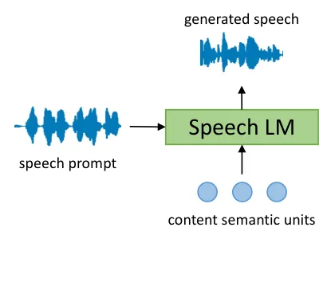

# An Empirical Study of Speech Language Models for Prompt-Conditioned Speech Synthesis

Yifan Peng ^(†)^(†)thanks:  Work done during an internship at Meta AI.
Affiliation:  Carnegie Mellon University    Ilia Kulikov Affiliation: 
Meta AI    Yilin Yang Affiliation:  Meta AI    Sravya Popuri
Affiliation:  Meta AI    Hui Lu    Changhan Wang, Hongyu Gong
Affiliation:  Meta AI Affiliation:  The Chinese University of Hong Kong

###### Abstract

Speech language models (LMs) are promising for high-quality speech
synthesis through in-context learning. A typical speech LM takes
discrete semantic units as content and a short utterance as prompt, and
synthesizes speech which preserves the content’s semantics but mimics
the prompt’s style. However, there is no systematic understanding on how
the synthesized audio is controlled by the prompt and content. In this
work, we conduct an empirical study of the widely used autoregressive
(AR) and non-autoregressive (NAR) speech LMs and provide insights into
the prompt design and content semantic units. Our analysis reveals that
heterogeneous and nonstationary prompts hurt the audio quality in
contrast to the previous finding that longer prompts always lead to
better synthesis. Moreover, we find that the speaker style of the
synthesized audio is also affected by the content in addition to the
prompt. We further show that semantic units carry rich acoustic
information such as pitch, tempo, volume and speech emphasis, which
might be leaked from the content to the synthesized audio.

## 1 Introduction

Language models (LMs) have showcased strong in-context learning
capabilities in natural language processing (Brown et al., 2020a;
Chowdhery et al., 2022; Touvron et al., 2023a). Recent advances in audio
quantization (Zeghidour et al., 2022; Défossez et al., 2022) have opened
an opportunity to utilize autoregressive (AR) LMs to generate
high-quality natural speech by modeling the distribution over discrete
speech units (Borsos et al., 2023a; Wang et al., 2023a; Zhang et al.,
2023b). Another line of work directly models the distribution over
continuous features such as Mel spectrograms or quantized features with
non-autoregressive (NAR) models (Le et al., 2023; Shen et al., 2023).
These speech LMs, trained on large amounts of speech data, demonstrate
state-of-the-art (SOTA) performance in zero-shot conditional speech
synthesis tasks, where the desired content is represented as a sequence
of discrete units and the desired style is provided by a speech prompt
of a few seconds.

Despite numerous studies on model architectures, training methods and
downstream applications, there is no systematic understanding of how the
prompt and content affect the synthesized speech in vocal style, emotion
and prosody. It is unclear which attributes can be manipulated through
prompts. For example, can we adapt the speech rate of the content to
match that of the prompt by using a speech LM? Does it work for both AR
and NAR LMs? Should we deduplicate content units to remove the original
duration? Addressing these questions provides insights into the true
capabilities of speech LMs, consequently offering valuable guidance for
enhancing their performance.

This work aims to address the following questions for both AR and NAR
speech LMs through quantitative analysis. We will publicly release the
code for empirical evaluation.

Prior studies show that longer prompts yield better speech style
transfer results (Wang et al., 2023a; Shen et al., 2023; Le et al.,
2023). However, this implicitly assumes that the prompt always has
consistent vocal style and speaker emotion regardless of its length. In
practice, longer prompts can become heterogeneous or nonstationary,
which might adversely affect the synthesized speech. We address the
following two questions in Section 3.2:

Q1.1: How does a heterogeneous prompt containing multiple vocal styles
from different speakers affect the generated speech?

Q1.2: How does a nonstationary prompt containing mixed emotions affect
the generated speech?

Recent studies (Borsos et al., 2023a; Borsos et al., 2023b; Huang
et al., 2023; Dong et al., 2023) represent the content of an utterance
with semantic units from HuBERT (Hsu et al., 2021) or w2v-BERT (Chung
et al., 2021), assuming these units mostly contain semantic information
only. But HuBERT units do contain other information (Lin et al., 2022).

Q2.1: Will other information in the content units be leaked to the
synthesized speech? See Section 3.3.

Q2.2: How do prompt and content control acoustic features of synthesized
speech, like pitch, speech rate, volume and emphasis? See Section 3.4.

## 2 Related Work

[TABLE]

Table 1: Summary of recent studies about speech LMs. More discussions
are presented in Appendix A.

Table 1compares recent speech LMs from various aspects. In this section,
we provide a brief summary of the key aspects. More details are in
Appendix A.

Speech units. There has been a lot of progress on discrete speech
representations including semantic units which mainly capture semantic
information (Hsu et al., 2021) and acoustic units which contain rich
acoustic features (Défossez et al., 2022).

Initialization. Speech LMs can be initialized with pre-trained text LMs
to improve performance (Hassid et al., 2023; Rubenstein et al., 2023).

AR vs NAR LMs. 1(b) shows the inference of AR LMs. We study the VALL-E
style model (Wang et al., 2023a) and consider two variants of AR LMs:
one with duplicate semantic units and the other with deduplicated
semantic units. 1(c) illustrates NAR LMs. We analyze Voicebox (Le
et al., 2023) as it achieves SOTA performance in various conditional
speech synthesis tasks.

(a) Conditional speech synthesis

(b) Inference of AR LM

(c) Inference of NAR LM

Figure 1: Overview of the primary task of speech LMs and inference
procedures of AR and NAR LMs.

## 3 Experiments

We analyze both AR and NAR LMs on conditional speech synthesis (see
1(a)), which is one of the primary tasks of speech LMs. Specifically, a
speech LM takes as input a pair of prompt and content utterances, and
synthesizes a new utterance that mimics the style of the prompt but
preserves the semantic meaning of the content. This task is also
referred to as voice conversion or style transfer. Following recent
studies (Borsos et al., 2023a; Borsos et al., 2023b; Dong et al., 2023),
we represent content with HuBERT units (Hsu et al., 2021).

### 3.1 Experimental setups

Training data. We use 60k-hour English speech as training data of Speech
LMs.

Evaluation data. We create various analysis data using emotional English
speech with transcriptions. The speech is collected from multiple
emotions including neutral, amused, sleepy, angry and disgust. We also
prepare some samples for emphasis analysis. We will discuss more about
data preparation in corresponding sections.

Evaluation of speaker style similarity. We employ a WavLM (Chen et al., 2022) based speaker style encoder to generate the speaker style
embedding for a given utterance. We then calculate the cosine similarity
between a pair of speaker style embeddings as the speaker style
similarity. This is a standard evaluation metric used in prior
work (Wang et al., 2023a; Le et al., 2023).

Speech tokenizers. Semantic units are derived from HuBERT (Hsu et al., 2021) and acoustic units are extracted from EnCodec (Défossez et al., 2022) with 8 codebooks. Both are trained on VoxPopuli (Wang et al., 2021) with 50Hz unit rate.

Speech LMs. We use fairseq (Ott et al., 2019) for implementation. The
training details are provided in Appendix B.1.

\(1\) AR LM with duplicate semantic units. We follow VALL-E (Wang
et al., 2023a) but replace its text condition with semantic units. The
AR LM is a 24-layer Transformer decoder with embedding dimension 1024
and feed-forward dimension 4096.¹¹ 1 The AR LM predicts 1st EnCodec
stream conditioned on semantic units. Similar to VALL-E, a secondary NAR
LM of the same size is trained to predict the remaining streams.

\(2\) AR LM with deduplicated semantic units. The model is the same as
(1), but semantic units are deduplicated to remove some duration
information.

\(3\) NAR LM. We follow Voicebox (Le et al., 2023) but replace the text
condition with semantic units. It has 24 Transformer layers with
embedding dimension $`1024`$ and feed-forward dimension $`4096`$.

| Prompt used for synthesis | P1    |       | P1+P2 |       |
| ------------------------- | ----- | ----- | ----- | ----- |
| Reference audio           | P1    | P2    | P1    | P2    |
| AR w/ dup units           | 0.332 | 0.036 | 0.080 | 0.135 |
| AR w/ dedup units         | 0.345 | 0.054 | 0.098 | 0.163 |
| NAR                       | 0.455 | 0.062 | 0.105 | 0.285 |

Table 2: Speaker style similarity ($`\uparrow`$) between the synthesized
audio and each prompt audio for heterogeneous prompts. P1 and P2 are
prompts from different speaker styles. P1+P2 is the concatenation of P1
and P2. Results are averaged over 400 evaluation samples.

### 3.2 Effect of heterogeneous and nonstationary prompts

Previous studies (Wang et al., 2023a; Shen et al., 2023; Le et al., 2023) show that a longer prompt consistently improves synthesis. In
practice, a longer prompt is more likely to become inconsistent in vocal
style and emotion. Hence, we consider two properties of the prompt and
examine their impacts on conditional speech synthesis: (1)
heterogeneity, where a prompt contains multiple styles of different
speakers, and (2) nonstationarity, where a prompt is from the same
speaker style but mixed by different emotions.

Heterogeneity. We concatenate audios of two speaker styles in the
emotional data to form heterogeneous prompts. As a controlled study, the
semantic contents (transcriptions) of both prompt and content audios are
identical, and their emotions are also the same (i.e., neutral). The
evaluation set has $`400`$ samples. To evaluate synthesized audios, we
report their speaker similarity w.r.t. the two prompt audios
respectively. For comparison, we also synthesize audios with a single
prompt and the same content audio used in the multi-prompt experiments.
This can reflect the difference between single-speaker-style and
multi-speaker-style prompts. As shown in Table 2, multi-speaker-style
prompt hurts the speaker style similarity. More discussions are in
Appendix B.2.

| Prompt used for synthesis | P1    |       | P1+P2 |       |
| ------------------------- | ----- | ----- | ----- | ----- |
| Reference audio           | P1    | P2    | P1    | P2    |
| AR w/ dup units           | 0.257 | 0.073 | 0.133 | 0.156 |
| AR w/ dedup units         | 0.256 | 0.073 | 0.140 | 0.165 |
| NAR                       | 0.392 | 0.160 | 0.222 | 0.336 |

Table 3: Speaker style similarity ($`\uparrow`$) between the synthesized
audio and prompt audio for nonstationary prompts. P1 and P2 are in the
same style but different emotions. P1+P2 is the concatenation of P1 and
P2. Results are averaged over 400 samples.

Nonstationarity. We concatenate audios from the same speaker style
(i.e., vocal style) but with different emotions (e.g., amused and
sleepy) to form nonstationary prompts, resulting in totally $`400`$
evaluation samples. Table 3 shows that mixed-emotion prompt also hurts
the speaker style similarity. More discussions are in Appendix B.3.

| Style of content audio | F2     |         | M1     |         | M2     |         |
| ---------------------- | ------ | ------- | ------ | ------- | ------ | ------- |
| Reference audio        | Prompt | Content | Prompt | Content | Prompt | Content |
| AR w/ dup units        | 0.535  | 0.179   | 0.488  | 0.125   | 0.489  | 0.046   |
| AR w/ dedup units      | 0.536  | 0.151   | 0.474  | 0.118   | 0.489  | 0.038   |
| NAR                    | 0.584  | 0.222   | 0.534  | 0.148   | 0.529  | 0.106   |

Table 4: Speaker style similarity ($`\uparrow`$) between the synthesized
audio and the prompt or content audio. The prompt is fixed as the female
speaker style F1, while the content style is changed among F2 (female),
M1 (male), and M2 (male). We can observe that the content speaker style
also affects the synthesized style.

### 3.3 Effect of content audio’s speaker styles

Although existing studies use prompt audio to control synthesized vocal
style (Borsos et al., 2023b; Huang et al., 2023), it remains unexplored
how much content audio affects the vocal style in speech synthesis. To
investigate this, we prepare an evaluation set of $`200`$ samples using
emotional speech data, where we fix the speaker style of prompt audios
as a female speaker, F1, but change the speaker style of content audios
among another female F2 and two male speaker styles M1 and M2. The
synthesized audios are compared with the prompt and content audios
respectively in terms of speaker style similarity. In Table 4, it is
found that the change of content speaker style results in different
voices, indicating that semantic units like HuBERT carry more acoustic
information than expected. Appendix B.4 includes more discussions.

| Changed prosody feature | Pitch  |         | Tempo  |         | Volume |         |
| ----------------------- | ------ | ------- | ------ | ------- | ------ | ------- |
| Changed audio           | Prompt | Content | Prompt | Content | Prompt | Content |
| AR w/ dup units         | 0.293  | -0.037  | 0.054  | 0.822   | 0.987  | 0.025   |
| AR w/ dedup units       | 0.136  | 0.001   | -0.023 | 0.388   | 0.982  | 0.053   |
| NAR                     | 0.476  | 0.135   | 0.000  | 0.999   | 0.997  | 0.217   |

Table 5: Pearson correlation of prosody changes between the synthesized
audio and either the prompt or content audio. Each experiment only
changes one feature of either prompt or content.

### 3.4 Analysis of prosody information

Our analyses so far focus on voice and style transfer based on a
coarse-grained metric, speaker style similarity. Now we look deeper into
fine-grained acoustic features including pitch, speech rate (tempo),
loudness (volume) and emphasis. A set of $`200`$ audio samples is
selected from the emotional data for such prosody analysis. We first use
the same audio as prompt and content to synthesize a set of audios with
speech LMs, which serves as the reference set since no manipulation is
performed. Then, we manually manipulate the acoustic characteristics of
either prompt or content audios. The Pearson correlation of acoustic
changes between prompt/content and generated audios is reported in
Table 5. Please refer to Appendix B.5 for more discussions.

Pitch. We use torchaudio pitch extractor²² 2
[https://pytorch.org/audio/2.0.1/tutorials/audio_feature_extractions_tutorial.html#pitch](https://pytorch.org/audio/2.0.1/tutorials/audio_feature_extractions_tutorial.html#pitch)
to extract pitch. We observe that AR LMs capture pitch information
mostly from its prompt. NAR LMs are affected by the pitch of both prompt
and content, which also indicates that content semantic units carry some
pitch information.

Speech rate. We measure the number of syllables³³ 3 Python syllable
estimator:
[https://pypi.org/project/syllables/](https://pypi.org/project/syllables/).
spoken per second. We find that the speech rate (tempo) is mainly
determined by content units for both AR and NAR LMs. The AR LM with
deduplicated units has a lower correlation, suggesting that it can
generate more flexible or diverse speech rates. However, the speech rate
cannot be controlled by prompts in current speech LMs.

Loudness. We use pyloudnorm (Steinmetz and Reiss, 2021) to measure
loudness. We observe that the volume of synthesized audio is mainly
determined by prompt, while the NAR LM also transfers loudness of the
content to its synthesized audio.

Finally, we analyze how speech emphasis is affected by the prompt or
content audio. To examine word emphasis, we take $`50`$ audio sample
pairs. Each pair of prompt and content audios has the same semantic
meaning and is spoken in the same speaker style. The difference is that
some words are emphasized in the content audio while the prompt does not
have any speech emphasis. We aim to study whether the emphasis is
embedded in the content semantic units and further transferred to
synthesized audio.

Two annotators are asked to check whether the synthesized speech has the
same emphasis as the content audio and go through annotations together
to resolve disagreements. The percentages of synthesize audios
preserving content emphasis are $`96\%`$, $`80\%`$ and $`98\%`$ for AR
LM w/ dup units, AR w/ dedup units and NAR LM, respectively. It
indicates that content semantic units do carry emphasis information
which is further leaked to synthesized audios. Current speech LMs cannot
directly control speech emphasis through prompts.

## 4 Conclusion

We conduct an empirical study of AR and NAR speech LMs for speech
synthesis conditioned on prompt and semantic units. We reveal that
heterogeneous and nonstationary prompts can hurt vocal style transfer.
We also find that content audio style affects the synthesized vocal
style through semantic units. In particular, we show that semantic units
of content audio carry rich information like pitch, tempo, volume and
speech emphasis, which might be leaked to the synthesized audio. These
findings indicate that contemporary speech LMs using semantic units
cannot achieve zero-shot style transfer or controllable speech synthesis
solely through prompts. Future research can explore more disentangled
discrete speech representations and better modeling algorithms.

## 5 Limitations

Limitations. In this work, we designed a set of tasks to benchmark
speech LMs in the task of conditional speech synthesis. The evaluation
may not be comprehensive, and other metrics such as speech naturalness
could be incorporated into future study.

Ethical considerations. While we have documented various evaluation
deployed in our work, here are some additional points to highlight.
While high-quality speech synthesis could improve real-world
applications and facilitate communication, such access could also make
groups with lower levels of digital literacy more vulnerable to
misinformation. An example of unintended use is that bad actors
misappropriate our work for online scams.

## References

- Borsos et al. (2023a) Zalán Borsos, Raphaël Marinier, Damien Vincent,
  Eugene Kharitonov, Olivier Pietquin, Matthew Sharifi, Dominik Roblek,
  Olivier Teboul, David Grangier, Marco Tagliasacchi, and Neil
  Zeghidour. 2023a. [Audiolm: A language modeling approach to audio
  generation](https://doi.org/10.1109/TASLP.2023.3288409). _IEEE ACM
  Trans. Audio Speech Lang. Process._, 31:2523–2533.
- Borsos et al. (2023b) Zalán Borsos, Matthew Sharifi, Damien Vincent,
  Eugene Kharitonov, Neil Zeghidour, and Marco Tagliasacchi. 2023b.
  [Soundstorm: Efficient parallel audio
  generation](https://doi.org/10.48550/arXiv.2305.09636). _CoRR_,
  abs/2305.09636.
- Brown et al. (2020a) Tom Brown, Benjamin Mann, Nick Ryder, Melanie
  Subbiah, Jared D Kaplan, Prafulla Dhariwal, Arvind Neelakantan, Pranav
  Shyam, Girish Sastry, Amanda Askell, Sandhini Agarwal, Ariel
  Herbert-Voss, Gretchen Krueger, Tom Henighan, Rewon Child, Aditya
  Ramesh, Daniel Ziegler, Jeffrey Wu, Clemens Winter, Chris Hesse, Mark
  Chen, Eric Sigler, Mateusz Litwin, Scott Gray, Benjamin Chess, Jack
  Clark, Christopher Berner, Sam McCandlish, Alec Radford, Ilya
  Sutskever, and Dario Amodei. 2020a. [Language models are few-shot
  learners](https://proceedings.neurips.cc/paper_files/paper/2020/file/1457c0d6bfcb4967418bfb8ac142f64a-Paper.pdf).
  In _Advances in Neural Information Processing Systems_, volume 33,
  pages 1877–1901. Curran Associates, Inc.
- Brown et al. (2020b) Tom B. Brown, Benjamin Mann, Nick Ryder, Melanie
  Subbiah, Jared Kaplan, Prafulla Dhariwal, Arvind Neelakantan, Pranav
  Shyam, Girish Sastry, Amanda Askell, Sandhini Agarwal, Ariel
  Herbert-Voss, Gretchen Krueger, Tom Henighan, Rewon Child, Aditya
  Ramesh, Daniel M. Ziegler, Jeffrey Wu, Clemens Winter, Christopher
  Hesse, Mark Chen, Eric Sigler, Mateusz Litwin, Scott Gray, Benjamin
  Chess, Jack Clark, Christopher Berner, Sam McCandlish, Alec Radford,
  Ilya Sutskever, and Dario Amodei. 2020b. [Language models are few-shot
  learners](https://proceedings.neurips.cc/paper/2020/hash/1457c0d6bfcb4967418bfb8ac142f64a-Abstract.html).
  In _Advances in Neural Information Processing Systems 33: Annual
  Conference on Neural Information Processing Systems 2020, NeurIPS
  2020, December 6-12, 2020, virtual_.
- Chen et al. (2022) Sanyuan Chen, Chengyi Wang, Zhengyang Chen, Yu Wu,
  Shujie Liu, Zhuo Chen, Jinyu Li, Naoyuki Kanda, Takuya Yoshioka, Xiong
  Xiao, Jian Wu, Long Zhou, Shuo Ren, Yanmin Qian, Yao Qian, Jian Wu,
  Michael Zeng, Xiangzhan Yu, and Furu Wei. 2022. [Wavlm: Large-scale
  self-supervised pre-training for full stack speech
  processing](https://doi.org/10.1109/JSTSP.2022.3188113). _IEEE J. Sel.
  Top. Signal Process._, 16(6):1505–1518.
- Chowdhery et al. (2022) Aakanksha Chowdhery, Sharan Narang, Jacob
  Devlin, Maarten Bosma, Gaurav Mishra, Adam Roberts, Paul Barham,
  Hyung Won Chung, Charles Sutton, Sebastian Gehrmann, Parker Schuh,
  Kensen Shi, Sasha Tsvyashchenko, Joshua Maynez, Abhishek Rao, Parker
  Barnes, Yi Tay, Noam Shazeer, Vinodkumar Prabhakaran, Emily Reif, Nan
  Du, Ben Hutchinson, Reiner Pope, James Bradbury, Jacob Austin, Michael
  Isard, Guy Gur-Ari, Pengcheng Yin, Toju Duke, Anselm Levskaya, Sanjay
  Ghemawat, Sunipa Dev, Henryk Michalewski, Xavier Garcia, Vedant Misra,
  Kevin Robinson, Liam Fedus, Denny Zhou, Daphne Ippolito, David Luan,
  Hyeontaek Lim, Barret Zoph, Alexander Spiridonov, Ryan Sepassi, David
  Dohan, Shivani Agrawal, Mark Omernick, Andrew M. Dai,
  Thanumalayan Sankaranarayana Pillai, Marie Pellat, Aitor Lewkowycz,
  Erica Moreira, Rewon Child, Oleksandr Polozov, Katherine Lee, Zongwei
  Zhou, Xuezhi Wang, Brennan Saeta, Mark Diaz, Orhan Firat, Michele
  Catasta, Jason Wei, Kathy Meier-Hellstern, Douglas Eck, Jeff Dean,
  Slav Petrov, and Noah Fiedel. 2022. [Palm: Scaling language modeling
  with pathways](https://doi.org/10.48550/arXiv.2204.02311). _CoRR_,
  abs/2204.02311.
- Chung et al. (2021) Yu-An Chung, Yu Zhang, Wei Han, Chung-Cheng Chiu,
  James Qin, Ruoming Pang, and Yonghui Wu. 2021. [w2v-bert: Combining
  contrastive learning and masked language modeling for self-supervised
  speech pre-training](https://doi.org/10.1109/ASRU51503.2021.9688253).
  In _IEEE Automatic Speech Recognition and Understanding Workshop, ASRU
  2021, Cartagena, Colombia, December 13-17, 2021_, pages 244–250. IEEE.
- Communication et al. (2023) Seamless Communication, Loïc Barrault,
  Yu-An Chung, Mariano Cora Meglioli, David Dale, Ning Dong,
  Paul-Ambroise Duquenne, Hady Elsahar, Hongyu Gong, Kevin Heffernan,
  John Hoffman, Christopher Klaiber, Pengwei Li, Daniel Licht, Jean
  Maillard, Alice Rakotoarison, Kaushik Ram Sadagopan, Guillaume Wenzek,
  Ethan Ye, Bapi Akula, Peng-Jen Chen, Naji El Hachem, Brian Ellis,
  Gabriel Mejia Gonzalez, Justin Haaheim, Prangthip Hansanti, Russ
  Howes, Bernie Huang, Min-Jae Hwang, Hirofumi Inaguma, Somya Jain,
  Elahe Kalbassi, Amanda Kallet, Ilia Kulikov, Janice Lam, Daniel Li,
  Xutai Ma, Ruslan Mavlyutov, Benjamin Peloquin, Mohamed Ramadan,
  Abinesh Ramakrishnan, Anna Y. Sun, Kevin Tran, Tuan Tran, Igor
  Tufanov, Vish Vogeti, Carleigh Wood, Yilin Yang, Bokai Yu, Pierre
  Andrews, Can Balioglu, Marta R. Costa-jussà, Onur Celebi, Maha
  Elbayad, Cynthia Gao, Francisco Guzmán, Justine Kao, Ann Lee,
  Alexandre Mourachko, Juan Pino, Sravya Popuri, Christophe Ropers,
  Safiyyah Saleem, Holger Schwenk, Paden Tomasello, Changhan Wang, Jeff
  Wang, and Skyler Wang. 2023. [Seamlessm4t-massively multilingual &
  multimodal machine
  translation](https://doi.org/10.48550/ARXIV.2308.11596). _CoRR_,
  abs/2308.11596.
- Copet et al. (2023) Jade Copet, Felix Kreuk, Itai Gat, Tal Remez,
  David Kant, Gabriel Synnaeve, Yossi Adi, and Alexandre Défossez. 2023.
  [Simple and controllable music
  generation](https://doi.org/10.48550/arXiv.2306.05284). _CoRR_,
  abs/2306.05284.
- Défossez et al. (2022) Alexandre Défossez, Jade Copet, Gabriel
  Synnaeve, and Yossi Adi. 2022. [High fidelity neural audio
  compression](https://doi.org/10.48550/arXiv.2210.13438). _CoRR_,
  abs/2210.13438.
- Dong et al. (2023) Qianqian Dong, Zhiying Huang, Qiao Tian, Chen Xu,
  Yunlong Zhao, Kexin Wang, Xuxin Cheng, Tom Ko, Qiao Tian, Tang Li,
  Fengpeng Yue, Ye Bai, Xi Chen, Lu Lu, Zejun Ma, Yuping Wang, Mingxuan
  Wang, and Yuxuan Wang. 2023. [Polyvoice: Language models for speech to
  speech translation](https://doi.org/10.48550/arXiv.2306.02982).
  _CoRR_, abs/2306.02982.
- Hassid et al. (2023) Michael Hassid, Tal Remez, Tu Anh Nguyen, Itai
  Gat, Alexis Conneau, Felix Kreuk, Jade Copet, Alexandre Défossez,
  Gabriel Synnaeve, Emmanuel Dupoux, Roy Schwartz, and Yossi Adi. 2023.
  [Textually pretrained speech language
  models](https://doi.org/10.48550/arXiv.2305.13009). _CoRR_,
  abs/2305.13009.
- Hsu et al. (2021) Wei-Ning Hsu, Benjamin Bolte, Yao-Hung Hubert Tsai,
  Kushal Lakhotia, Ruslan Salakhutdinov, and Abdelrahman Mohamed. 2021.
  [Hubert: Self-supervised speech representation learning by masked
  prediction of hidden
  units](https://doi.org/10.1109/TASLP.2021.3122291). _IEEE ACM Trans.
  Audio Speech Lang. Process._, 29:3451–3460.
- Huang et al. (2023) Rongjie Huang, Chunlei Zhang, Yongqi Wang,
  Dongchao Yang, Luping Liu, Zhenhui Ye, Ziyue Jiang, Chao Weng, Zhou
  Zhao, and Dong Yu. 2023. [Make-a-voice: Unified voice synthesis with
  discrete representation](https://doi.org/10.48550/arXiv.2305.19269).
  _CoRR_, abs/2305.19269.
- Kharitonov et al. (2022) Eugene Kharitonov, Ann Lee, Adam Polyak,
  Yossi Adi, Jade Copet, Kushal Lakhotia, Tu Anh Nguyen, Morgane
  Riviere, Abdelrahman Mohamed, Emmanuel Dupoux, and Wei-Ning Hsu. 2022.
  [Text-free prosody-aware generative spoken language
  modeling](https://doi.org/10.18653/v1/2022.acl-long.593). In
  _Proceedings of the 60th Annual Meeting of the Association for
  Computational Linguistics (Volume 1: Long Papers)_, pages 8666–8681,
  Dublin, Ireland. Association for Computational Linguistics.
- Kingma and Ba (2015) Diederik P. Kingma and Jimmy Ba. 2015. [Adam: A
  method for stochastic optimization](http://arxiv.org/abs/1412.6980).
  In _3rd International Conference on Learning Representations, ICLR
  2015, San Diego, CA, USA, May 7-9, 2015, Conference Track
  Proceedings_.
- Kong et al. (2020) Jungil Kong, Jaehyeon Kim, and Jaekyoung Bae. 2020.
  [Hifi-gan: Generative adversarial networks for efficient and high
  fidelity speech
  synthesis](https://proceedings.neurips.cc/paper/2020/hash/c5d736809766d46260d816d8dbc9eb44-Abstract.html).
  In _Advances in Neural Information Processing Systems 33: Annual
  Conference on Neural Information Processing Systems 2020, NeurIPS
  2020, December 6-12, 2020, virtual_.
- Lakhotia et al. (2021) Kushal Lakhotia, Eugene Kharitonov, Wei-Ning
  Hsu, Yossi Adi, Adam Polyak, Benjamin Bolte, Tu-Anh Nguyen, Jade
  Copet, Alexei Baevski, Abdelrahman Mohamed, and Emmanuel Dupoux. 2021.
  [On generative spoken language modeling from raw
  audio](https://doi.org/10.1162/tacl_a_00430). _Transactions of the
  Association for Computational Linguistics_, 9:1336–1354.
- Le et al. (2023) Matthew Le, Apoorv Vyas, Bowen Shi, Brian Karrer,
  Leda Sari, Rashel Moritz, Mary Williamson, Vimal Manohar, Yossi Adi,
  Jay Mahadeokar, and Wei-Ning Hsu. 2023. [Voicebox: Text-guided
  multilingual universal speech generation at
  scale](https://doi.org/10.48550/arXiv.2306.15687). _CoRR_,
  abs/2306.15687.
- Lin et al. (2022) Guan-Ting Lin, Chi-Luen Feng, Wei-Ping Huang, Yuan
  Tseng, Tzu-Han Lin, Chen-An Li, Hung-yi Lee, and Nigel G. Ward. 2022.
  [On the utility of self-supervised models for prosody-related
  tasks](https://doi.org/10.1109/SLT54892.2023.10023234). In _IEEE
  Spoken Language Technology Workshop, SLT 2022, Doha, Qatar, January
  9-12, 2023_, pages 1104–1111. IEEE.
- Maiti et al. (2023a) Soumi Maiti, Yifan Peng, Shukjae Choi, Jee-weon
  Jung, Xuankai Chang, and Shinji Watanabe. 2023a. [Voxtlm: unified
  decoder-only models for consolidating speech recognition/synthesis and
  speech/text continuation
  tasks](https://doi.org/10.48550/arXiv.2309.07937). _CoRR_,
  abs/2309.07937.
- Maiti et al. (2023b) Soumi Maiti, Yifan Peng, Takaaki Saeki, and
  Shinji Watanabe. 2023b. [Speechlmscore: Evaluating speech generation
  using speech language
  model](https://doi.org/10.1109/ICASSP49357.2023.10095710). In _ICASSP
  2023 - 2023 IEEE International Conference on Acoustics, Speech and
  Signal Processing (ICASSP)_, pages 1–5.
- OpenAI (2023) OpenAI. 2023. [GPT-4 technical
  report](https://doi.org/10.48550/ARXIV.2303.08774). _CoRR_,
  abs/2303.08774.
- Ott et al. (2019) Myle Ott, Sergey Edunov, Alexei Baevski, Angela Fan,
  Sam Gross, Nathan Ng, David Grangier, and Michael Auli. 2019.
  [fairseq: A fast, extensible toolkit for sequence
  modeling](https://doi.org/10.18653/v1/N19-4009). In _Proceedings of
  the 2019 Conference of the North American Chapter of the Association
  for Computational Linguistics (Demonstrations)_, pages 48–53,
  Minneapolis, Minnesota. Association for Computational Linguistics.
- Peng et al. (2023) Yifan Peng, Jinchuan Tian, Brian Yan, Dan Berrebbi,
  Xuankai Chang, Xinjian Li, Jiatong Shi, Siddhant Arora, William Chen,
  Roshan S. Sharma, Wangyou Zhang, Yui Sudo, Muhammad Shakeel, Jee-weon
  Jung, Soumi Maiti, and Shinji Watanabe. 2023. [Reproducing
  whisper-style training using an open-source toolkit and publicly
  available data](https://doi.org/10.48550/ARXIV.2309.13876). _CoRR_,
  abs/2309.13876.
- Pratap et al. (2023) Vineel Pratap, Andros Tjandra, Bowen Shi, Paden
  Tomasello, Arun Babu, Sayani Kundu, Ali Elkahky, Zhaoheng Ni, Apoorv
  Vyas, Maryam Fazel-Zarandi, Alexei Baevski, Yossi Adi, Xiaohui Zhang,
  Wei-Ning Hsu, Alexis Conneau, and Michael Auli. 2023. [Scaling speech
  technology to 1, 000+
  languages](https://doi.org/10.48550/ARXIV.2305.13516). _CoRR_,
  abs/2305.13516.
- Radford et al. (2023) Alec Radford, Jong Wook Kim, Tao Xu, Greg
  Brockman, Christine McLeavey, and Ilya Sutskever. 2023. [Robust speech
  recognition via large-scale weak
  supervision](https://proceedings.mlr.press/v202/radford23a.html). In
  _International Conference on Machine Learning, ICML 2023, 23-29 July
  2023, Honolulu, Hawaii, USA_, volume 202 of _Proceedings of Machine
  Learning Research_, pages 28492–28518. PMLR.
- Rubenstein et al. (2023) Paul K. Rubenstein, Chulayuth Asawaroengchai,
  Duc Dung Nguyen, Ankur Bapna, Zalán Borsos, Félix de Chaumont Quitry,
  Peter Chen, Dalia El Badawy, Wei Han, Eugene Kharitonov, Hannah
  Muckenhirn, Dirk Padfield, James Qin, Danny Rozenberg, Tara N.
  Sainath, Johan Schalkwyk, Matthew Sharifi, Michelle Tadmor Ramanovich,
  Marco Tagliasacchi, Alexandru Tudor, Mihajlo Velimirovic, Damien
  Vincent, Jiahui Yu, Yongqiang Wang, Vicky Zayats, Neil Zeghidour,
  Yu Zhang, Zhishuai Zhang, Lukas Zilka, and Christian Havnø
  Frank. 2023. [Audiopalm: A large language model that can speak and
  listen](https://doi.org/10.48550/arXiv.2306.12925). _CoRR_,
  abs/2306.12925.
- Shen et al. (2023) Kai Shen, Zeqian Ju, Xu Tan, Yanqing Liu, Yichong
  Leng, Lei He, Tao Qin, Sheng Zhao, and Jiang Bian. 2023.
  [Naturalspeech 2: Latent diffusion models are natural and zero-shot
  speech and singing
  synthesizers](https://doi.org/10.48550/arXiv.2304.09116). _CoRR_,
  abs/2304.09116.
- Steinmetz and Reiss (2021) Christian J. Steinmetz and Joshua D.
  Reiss. 2021. pyloudnorm: A simple yet flexible loudness meter in
  python. In _150th AES Convention_.
- Touvron et al. (2023a) Hugo Touvron, Thibaut Lavril, Gautier Izacard,
  Xavier Martinet, Marie-Anne Lachaux, Timothée Lacroix, Baptiste
  Rozière, Naman Goyal, Eric Hambro, Faisal Azhar, Aurélien Rodriguez,
  Armand Joulin, Edouard Grave, and Guillaume Lample. 2023a. [Llama:
  Open and efficient foundation language
  models](https://doi.org/10.48550/arXiv.2302.13971). _CoRR_,
  abs/2302.13971.
- Touvron et al. (2023b) Hugo Touvron, Louis Martin, Kevin Stone, Peter
  Albert, Amjad Almahairi, Yasmine Babaei, Nikolay Bashlykov, Soumya
  Batra, Prajjwal Bhargava, Shruti Bhosale, Dan Bikel, Lukas Blecher,
  Cristian Canton-Ferrer, Moya Chen, Guillem Cucurull, David Esiobu,
  Jude Fernandes, Jeremy Fu, Wenyin Fu, Brian Fuller, Cynthia Gao,
  Vedanuj Goswami, Naman Goyal, Anthony Hartshorn, Saghar Hosseini, Rui
  Hou, Hakan Inan, Marcin Kardas, Viktor Kerkez, Madian Khabsa, Isabel
  Kloumann, Artem Korenev, Punit Singh Koura, Marie-Anne Lachaux,
  Thibaut Lavril, Jenya Lee, Diana Liskovich, Yinghai Lu, Yuning Mao,
  Xavier Martinet, Todor Mihaylov, Pushkar Mishra, Igor Molybog, Yixin
  Nie, Andrew Poulton, Jeremy Reizenstein, Rashi Rungta, Kalyan Saladi,
  Alan Schelten, Ruan Silva, Eric Michael Smith, Ranjan Subramanian,
  Xiaoqing Ellen Tan, Binh Tang, Ross Taylor, Adina Williams, Jian Xiang
  Kuan, Puxin Xu, Zheng Yan, Iliyan Zarov, Yuchen Zhang, Angela Fan,
  Melanie Kambadur, Sharan Narang, Aurélien Rodriguez, Robert Stojnic,
  Sergey Edunov, and Thomas Scialom. 2023b. [Llama 2: Open foundation
  and fine-tuned chat
  models](https://doi.org/10.48550/ARXIV.2307.09288). _CoRR_,
  abs/2307.09288.
- Wang et al. (2021) Changhan Wang, Morgane Riviere, Ann Lee, Anne Wu,
  Chaitanya Talnikar, Daniel Haziza, Mary Williamson, Juan Pino, and
  Emmanuel Dupoux. 2021. [VoxPopuli: A large-scale multilingual speech
  corpus for representation learning, semi-supervised learning and
  interpretation](https://doi.org/10.18653/v1/2021.acl-long.80). In
  _Proceedings of the 59th Annual Meeting of the Association for
  Computational Linguistics and the 11th International Joint Conference
  on Natural Language Processing (Volume 1: Long Papers)_, pages
  993–1003, Online. Association for Computational Linguistics.
- Wang et al. (2023a) Chengyi Wang, Sanyuan Chen, Yu Wu, Ziqiang Zhang,
  Long Zhou, Shujie Liu, Zhuo Chen, Yanqing Liu, Huaming Wang, Jinyu Li,
  Lei He, Sheng Zhao, and Furu Wei. 2023a. [Neural codec language models
  are zero-shot text to speech
  synthesizers](https://doi.org/10.48550/arXiv.2301.02111). _CoRR_,
  abs/2301.02111.
- Wang et al. (2023b) Tianrui Wang, Long Zhou, Ziqiang Zhang, Yu Wu,
  Shujie Liu, Yashesh Gaur, Zhuo Chen, Jinyu Li, and Furu Wei. 2023b.
  [Viola: Unified codec language models for speech recognition,
  synthesis, and
  translation](https://doi.org/10.48550/arXiv.2305.16107). _CoRR_,
  abs/2305.16107.
- Wang et al. (2023c) Xiaofei Wang, Manthan Thakker, Zhuo Chen, Naoyuki
  Kanda, Sefik Emre Eskimez, Sanyuan Chen, Min Tang, Shujie Liu, Jinyu
  Li, and Takuya Yoshioka. 2023c. [Speechx: Neural codec language model
  as a versatile speech
  transformer](https://doi.org/10.48550/arXiv.2308.06873). _CoRR_,
  abs/2308.06873.
- Zeghidour et al. (2022) Neil Zeghidour, Alejandro Luebs, Ahmed Omran,
  Jan Skoglund, and Marco Tagliasacchi. 2022. [Soundstream: An
  end-to-end neural audio
  codec](https://doi.org/10.1109/TASLP.2021.3129994). _IEEE ACM Trans.
  Audio Speech Lang. Process._, 30:495–507.
- Zhang et al. (2022) Susan Zhang, Stephen Roller, Naman Goyal, Mikel
  Artetxe, Moya Chen, Shuohui Chen, Christopher Dewan, Mona T. Diab,
  Xian Li, Xi Victoria Lin, Todor Mihaylov, Myle Ott, Sam Shleifer, Kurt
  Shuster, Daniel Simig, Punit Singh Koura, Anjali Sridhar, Tianlu Wang,
  and Luke Zettlemoyer. 2022. [OPT: open pre-trained transformer
  language models](https://doi.org/10.48550/arXiv.2205.01068). _CoRR_,
  abs/2205.01068.
- Zhang et al. (2023a) Yu Zhang, Wei Han, James Qin, Yongqiang Wang,
  Ankur Bapna, Zhehuai Chen, Nanxin Chen, Bo Li, Vera Axelrod, Gary
  Wang, Zhong Meng, Ke Hu, Andrew Rosenberg, Rohit Prabhavalkar,
  Daniel S. Park, Parisa Haghani, Jason Riesa, Ginger Perng, Hagen
  Soltau, Trevor Strohman, Bhuvana Ramabhadran, Tara N. Sainath,
  Pedro J. Moreno, Chung-Cheng Chiu, Johan Schalkwyk, Françoise
  Beaufays, and Yonghui Wu. 2023a. [Google USM: scaling automatic speech
  recognition beyond 100
  languages](https://doi.org/10.48550/ARXIV.2303.01037). _CoRR_,
  abs/2303.01037.
- Zhang et al. (2023b) Ziqiang Zhang, Long Zhou, Chengyi Wang, Sanyuan
  Chen, Yu Wu, Shujie Liu, Zhuo Chen, Yanqing Liu, Huaming Wang, Jinyu
  Li, Lei He, Sheng Zhao, and Furu Wei. 2023b. [Speak foreign languages
  with your own voice: Cross-lingual neural codec language
  modeling](https://doi.org/10.48550/arXiv.2303.03926). _CoRR_,
  abs/2303.03926.

## Appendix A Literature Review of Speech LMs

The remarkable achievements of large language models (LLMs) in natural
language processing (NLP) (Brown et al., 2020b; Chowdhery et al., 2022;
Zhang et al., 2022; Touvron et al., 2023a; Touvron et al., 2023b;
OpenAI, 2023) have served as a powerful impetus for the advancement of
foundational models in the realm of speech (Radford et al., 2023; Zhang
et al., 2023a; Pratap et al., 2023; Communication et al., 2023; Peng
et al., 2023), including the emergence and evolution of speech language
models (Lakhotia et al., 2021; Kharitonov et al., 2022; Borsos et al.,
2023a; Maiti et al., 2023b; Wang et al., 2023a; Zhang et al., 2023b;
Rubenstein et al., 2023; Wang et al., 2023c; Le et al., 2023; Maiti
et al., 2023a).

Table 1compares recent studies about speech LMs from four aspects:
speech representation, model architecture, initialization method, and
supported tasks. We provide more details in the following sections.

### A.1 Speech representation

Speech signals can be represented as continuous features or discrete
units. Continuous features include spectrograms and neural codec hidden
vectors. Discrete units can be further categorized into two types:
semantic units and acoustic units. Semantic units are derived from
self-supervised learning (SSL) or automatic speech recognition (ASR)
models through clustering. They are found to mainly capture the
linguistic content (Borsos et al., 2023a), and can thus be used
interchangeably with normal text tokens. Acoustic units are produced by
audio codec models through residual vector quantization (RVQ). They
capture rich acoustic information like speaker style, emotion, and
acoustic environment, making them especially suitable for high-quality
speech synthesis. But they are more difficult to model due to the
multiple streams from RVQ.

### A.2 Supported tasks

Conditional speech synthesis is the primary task of speech LMs. As
illustrated in 1(a), given semantic units extracted from a content
audio, it aims to generate high-quality speech that mimics the style of
a short prompt. Our study focuses on this primary task, since other
speech generation tasks can be incorporated into this framework.

### A.3 AR vs NAR LMs

Autoregressive (AR) speech LMs are conditional LMs which predict a
sequence of acoustic units given a sequence of semantic units. 1(b)
illustrates this inference procedure. Both semantic and acoustic units
are derived in an unsupervised manner. Hence, these LMs can be trained
on audio-only data without human annotation. Since acoustic units
consist of multiple streams, we follow VALL-E (Wang et al., 2023a) to
predict only the first stream in the AR LM and employ an additional NAR
LM to predict the remaining streams. This formulation has been widely
used in recent studies (Wang et al., 2023a; Zhang et al., 2023b; Wang
et al., 2023b; Dong et al., 2023; Wang et al., 2023c). We also consider
two variants of AR LMs: one with duplicate semantic units and the other
with deduplicated semantic units. The former uses the raw semantic units
without extra preprocessing, which leads to a fixed alignment between
semantic and acoustic units and thus reduces the length diversity of the
synthesized speech. The latter removes consecutive repetitions in
semantic units, allowing the AR LM to learn duration information.

Non-autoregressive (NAR) speech LMs predict an entire sequence of
continuous features or acoustic units given the corresponding semantic
units. 1(c) illustrates the inference procedure. Similar to AR LMs, this
formulation does not need human annotation and these models can be
trained on audio-only data. NaturalSpeech 2 (Shen et al., 2023) and
Voicebox (Le et al., 2023) are two representative NAR LMs. NaturalSpeech
2 learns latent features of a neural codec using a diffusion model,
which are converted to waveform with a codec decoder. Voicebox predicts
Mel spectrograms using flow matching with the optimal transport path and
further synthesizes audios with a HiFi-GAN vocoder (Kong et al., 2020).
We analyze Voicebox as it shows SOTA performance in a variety of
conditional speech synthesis tasks.

### A.4 Analysis of speech LMs

AudioLM (Borsos et al., 2023a) conducts preliminary experiments on its
AR LM and finds that semantic content and prosodic features are mostly
captured by semantic units, while speaker style and recording conditions
are from acoustic units.⁴⁴ 4 It performs quantitative analysis of
semantics and speaker style and qualitative analysis of prosody
features. More recent studies (Borsos et al., 2023b; Huang et al., 2023;
Dong et al., 2023) propose various speech LMs in order to achieve
zero-shot transfer of vocal styles or speaker emotions. In this work, we
present a systematic investigation of prompt conditioned synthesis based
on speech LMs via quantitative analysis, revealing insights into prompt
design and unit information which are generalizable to different LM
architectures.

## Appendix B Experiments

### B.1 Speech LM training

We follow TWIST (Hassid et al., 2023) to initialize the AR LM with OPT
350M (Zhang et al., 2022). Our NAR LM is trained from scratch, which is
consistent with Voicebox (Le et al., 2023). AR LMs are trained using the
Adam optimizer (Kingma and Ba, 2015) with a peak learning rate of
$`0.0002`$. They are updated for 200k steps with 20k warmup steps. The
NAR LM, Voicebox, is trained for $`500`$k steps with a learning rate of
$`0.0001`$ and $`5`$k warmup steps.

### B.2 Effect of heterogeneous prompts

Table 2shows the speaker style similarity between the synthesized audio
and each prompt audio. When a single prompt P1 is used, the synthesized
audio has a high similarity w.r.t. P1, meaning that the speaker style is
well preserved. When a multi-speaker-style prompt (P1+P2) is used, the
speaker style similarity decreases drastically, indicating that a
heterogeneous prompt hurts speech synthesis. It is interesting to see
that the synthesized audio has a higher speaker style similarity w.r.t.
the second prompt segment P2 than the first segment P1, likely because
P2 is spatially closer to the generated audio during inference as
illustrated in 1(b) and 1(c). This reveals that speech LMs tend to
generate locally coherent audio.

### B.3 Effect of nonstationary prompts

Table 3shows the speaker style similarity results. When a single prompt
P1 is used, the synthesized audio has a high speaker style similarity
w.r.t. the prompt, indicating that the speaker style is well preserved.
When a multi-style prompt (P1+P2) is used, the speaker style similarity
decreases clearly, showing that despite from the same speaker style,
multi-emotion prompts adversely affect the preservation of speaker style
similarity. This indicates that speaker styles and emotions are
entangled to some extent. The nonstationary nature in prompts distracts
speech LMs from capturing speaker style information. We also observe
that synthesized audios are more similar to the second prompt segment in
terms of speaking style, which is consistent with the previous
multi-speaker-style case. This reveals that speech LMs are better at
capturing local context than long-range dependencies.

### B.4 Effect of content audio’s speaker styles

When content audios are from F2 who is also female, synthesized audios
have the highest similarity w.r.t. the prompt female speaker style F1.
When the content speaker style is changed to male speaker styles M1 and
M2, synthesized audios demonstrate lower speaker style similarity w.r.t.
the same prompt. This reflects that the content audio, represented by
semantic units, is also a non-negligible source of speaker style
information when speech LMs synthesize audios. This further suggests
that semantic units such as HuBERT units carry more acoustic information
than expected, which might interfere with style transfer.

### B.5 Analysis of prosody information

We manipulate the acoustic charateristics of prompt or content audios.
For example, to study how the prompt’s pitch affects speech synthesis,
we increase or decrease the pitch of prompt audios, and synthesize a new
set of audios with the new prompts. Then, we compute the pitch changes
in prompt and generated audios compared to the reference set, and
calculate the Pearson correlation between their changes. If the
correlation is high, we can infer that the prompt audio is an important
source of pitch information. Similarly, we manipulate the speech rate by
speeding up or slowing down the prompt/content audios, and manipulate
loudness by changing the audio volume with torchaudio⁵⁵ 5
[https://pytorch.org/audio/stable/sox_effects.html](https://pytorch.org/audio/stable/sox_effects.html).

More discussions on speech rate. We find that the unit duration has a
strong control over the speech rate. For AR LM with duplicate units and
NAR LM, the duration information has been pre-determined and embedded in
the sequence of content semantic units. The AR LM with deduplicated
units has some flexibility to change the duration, thus mitigating its
correlation with the content tempo. However, the correlation w.r.t. the
prompt tempo is close to zero for all speech LMs, meaning that the
speech rate cannot be controlled through prompts in current speech LMs.
We note that none of these models is equipped with explicit duration
prediction based on prompt, which is a likely reason of their
incapability of capturing prompt’s tempo in speech synthesis.
