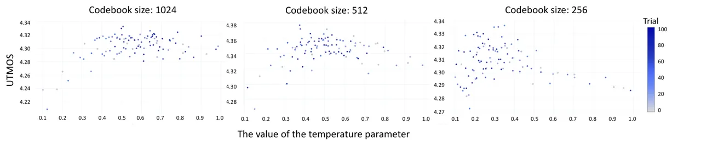

# UTDUSS: UTokyo-SaruLab System for Interspeech2024 Speech Processing Using Discrete Speech Unit Challenge

^(∗)Wataru Nakata    ^(∗)Kazuki Yamauchi    Dong Yang    Hiroaki Hyodo
   Yuki Saito

###### Abstract

We present UTDUSS, the UTokyo-SaruLab system submitted to
Interspeech2024 Speech Processing Using Discrete Speech Unit Challenge.
The challenge focuses on using discrete speech unit learned from large
speech corpora for some tasks. We submitted our UTDUSS system to two
text-to-speech tracks: Vocoder and Acoustic+Vocoder. Our system
incorporates neural audio codec (NAC) pre-trained on only speech
corpora, which makes the learned codec represent rich acoustic features
that are necessary for high-fidelity speech reconstruction. For the
acoustic+vocoder track, we trained an acoustic model based on
Transformer encoder-decoder that predicted the pre-trained NAC tokens
from text input. We describe our strategies to build these models, such
as data selection, downsampling, and hyper-parameter tuning. Our system
ranked in second and first for the Vocoder and Acoustic+Vocoder tracks,
respectively.

###### keywords

discrete speech unit, neural vocoder, text-to-speech, neural audio
codec, Transformer

^(†)^(†)address: The University of Tokyo, Hongo 7–3–1, Bunkyo-ku, Tokyo,
113–8656 Japan  
^(∗) Equal contribution ^(†)^(†)email:
nakata-wataru855@g.ecc.u-tokyo.ac.jp,
yamauchi-kazuki042@g.ecc.u-tokyo.ac.jp

## 1 Introduction

As the field of neural audio codec (NAC) continues to evolve \[1, 2\],
its applications have expanded beyond audio encoding/decoding to include
audio processing \[3\] and generation \[4, 5\]. NAC discretizes input a
speech/audio signal that can be utilized for various downstream tasks.
The use of discrete speech units allows for speech processing akin to
discrete token processing, leveraging the rich resources developed in
the natural language processing field \[5, 6\]. However, speech
processing using discrete speech units is a relatively new field, and
its full capabilities are yet to be explored.

In light of this, the Interspeech2024 Speech Processing using Discrete
Speech Unit Challenge was initiated to encourage research in this area.
The challenge consists of three main tracks: automatic speech
recognition (ASR), text-to-speech (TTS), and singing voice synthesis
(SVS). Our team, UTokyo-SaruLab, participated in the TTS track,
specifically focusing on two tracks: Vocoder and Acoustic+Vocoder.

This paper presents our system developed for this challenge. Our
approach utilizes a descript audio codec (DAC)-based model for discrete
speech unit extraction and vocoding. Subsequently, a Transformer-based
model is employed to construct an acoustic model capable of solving the
TTS (Acoustic+Vocoder) task. Our system, referred to as UTDUSS (The
University of Tokyo Discrete Unit Speech Synthesizer), achieved the
second place in the Vocoder track and the first place in the
Acoustic+Vocoder track. The trained model for the vocoder used in the
challenge is available online¹¹ 1
[https://huggingface.co/sarulab-speech/UTDUSS-Vocoder](https://huggingface.co/sarulab-speech/UTDUSS-Vocoder).

## 2 The Interspeech2024 Speech Processing Using Discrete Speech Unit Challenge

The challenge comprises three main tracks: ASR, TTS, and SVS. Our team
participated in the TTS track, which is subdivided into two tracks:
Vocoder and Acoustic+Vocoder.

Vocoder: In this track, participants are provided with a
training/development/test split for the Expresso \[7\] dataset. The task
is to construct a vocoder model which converts discrete speech units to
the corresponding waveform.

Acoustic+Vocoder: In this track, participants are provided with a
training/development/test split for the LJSpeech \[8\] dataset. Two
types of training sets are prepared: full training set and 1-hour
training set. The task is to construct an acoustic model which predicts
the discrete speech units from an input text and a vocoder model which
converts the generated discrete speech units to waveform. Therefore,
concatenating the vocoder and acoustic model enables end-to-end TTS.

For both tracks, the primary metrics are UTMOS \[9\] and bitrate. The
final ranking is determined by the average rank on these two metrics.
Hence, participants aim to achieve higher UTMOS while reducing bitrate.
For the further details of the challenge, please refer to the [challenge
page](https://www.wavlab.org/activities/2024/Interspeech2024-Discrete-Speech-Unit-Challenge/).

## 3 Methods

In this section, we introduce our methods used for the TTS task.

### 3.1 Vocoder track

In this track, we used DAC \[2\] with the number of quantizers set to 2
as the model architecture. The DAC works as both discrete speech
representation extraction and vocoder. According to the challenge rule,
we only used training set of Expresso \[7\] for training. In addition,
we applied a few techniques to improve the UTMOS metric. We denoted the
DAC model with all of the following techniques as (pronounced
‘‘smiley’’)²² 2 Although we submitted four different systems to the
Vocoder track using different settings for codebook size and dataset ( ,
, , and ), we focus on the best-performing system “ ” in this paper..

Hyper-parameter tuning: We noticed that when trained with fewer
codebooks, the codebook loss and commitment loss tended to explode. To
overcome this overfitting tendency, we performed manual hyper-parameter
tuning on the loss weighting parameters of the DAC training based on the
loss values of the training set and development set.

Matching the model sampling rate to UTMOS: The original DAC model
configuration assumes 24 kHz and 44.1 kHz sampling rates. However, the
primary metric used for this challenge is UTMOS, which only accepts
16 kHz-sampled speech for the MOS prediction. Considering that we want
to maximize UTMOS with a lower bitrate, modeling with a higher sampling
rate seemed to be meaningless in this challenge. Therefore, we trained
our model with a sampling rate of 16 kHz.

Excluding atypical speaking styles from training data: Figure 1 shows
the violin plots of UTMOS distribution of natural speech samples from
the development set used in this challenge. From this figure, we observe
that speech samples with atypical styles covered by EXPRESSO, such as
whisper and laughing, tend to have low UTMOS. One reason is that the
UTMOS model was mainly trained on read speech and did not accurately
predict naturalness MOS on some expressive speech contained in EXPRESSO.
If these speaking styles are reproduced by the trained DAC model, the
UTMOS of synthetic speech can significantly decrease. Therefore, we
tried to make the DAC model generate reading-style speech from discrete
speech unit derived from whisper or laughing speech. To achieve this, we
simply excluded these subsets from the training data.

Figure 1: Distribution of UTMOS of the speech in the development subset
of EXPRESSO \[7\]. We categorize the violin plots by speech types.

### 3.2 Acoustic+Vocoder track

In this track, we used DAC \[2\] with the number of quantizers set to 1
for the discrete speech unit extraction. As for an acoustic model, we
trained a Transformer encoder-decoder model \[10\] that autoregressively
predicted DAC tokens from input text, inspired by Transformer
TTS \[11\]. As for a vocoder to convert DAC tokens into a waveform, we
simply used the decoder in the DAC model used for discrete unit
extraction. We trained the DAC model on the full or 1-hour training set
of LJSpeech \[8\] without any additional datasets.

Acoustic model based on Transformer encoder-decoder: The original
Transformer TTS model \[11\] takes phoneme sequences as the encoder
input and autoregressively generates mel-spectrograms by the decoder
through the cross-attention mechanism. However, autoregressively
predicting continuous mel-spectrograms often suffers from the issue of
error accumulation during inference. In contrast, our acoustic model
predicts discrete speech units (i.e., DAC tokens) in a finite set from a
phoneme sequence, which can be expected to mitigate the error
accumulation issue better than the original Transformer TTS.

Sampling strategy: Our acoustic model adopts a novel sampling strategy
that combines top-$`k`$ \[12\] and top-$`p`$ \[13\] samplings during
inference, which can be expected to diversify the output tokens and
mitigate the problem of repetition of the same sequence of tokens.
Specifically, to narrow down the candidate tokens, we create a set of
the top-$`k`$ tokens based on the logits (i.e., output distribution of
Transformer decoder). Additionally, we create the smallest set such that
the sum of probabilities does not exceed $`p`$ and low-probability
tokens are ignored. Finally, tokens are sampled from this narrowed-down
set according to the probabilities computed from the logits, thereby
preserving text diversity while preventing the generation of
inappropriate tokens. This is repeated until the stop token is sampled.
Note that the sampling probability of each token is calculated as a
softmax with a temperature parameter applied to the logits.

Hyper-parameter tuning: We noticed that the values of the
hyper-parameters regarding sampling, i.e., the values of $`k`$, $`p`$,
and temperature parameter, significantly affected the quality of
synthetic speech. Therefore, we searched for the best values of $`k`$,
$`p`$, and temperature parameter that maximize UTMOS of synthetic
speech. Specifically, our trained model was input with the
transcriptions included in the development set, and the mean of the
UTMOS of the generated speech through top-$`k`$ and top-$`p`$ sampling
was used as the objective for hyper-parameter tuning. Note that this
procedure tunes the hyper-parameters that affect the inference of a
pre-trained TTS model, unlike the hyper-parameter tuning in the vocoder
track, which tries several training loops with different
hyper-parameters.

## 4 Experiment

We conducted experimental evaluations for the techniques applied to our
model for each track.

|                            |                          |                      |                              |                      |      |
| -------------------------- | ------------------------ | -------------------- | ---------------------------- | -------------------- | ---- |
| Model                      | Bitrate ($`\downarrow`$) | MCD ($`\downarrow`$) | Log F0 RMSE ($`\downarrow`$) | UTMOS ($`\uparrow`$) | Rank |
| baseline                   | 448.3                    | 7.19                 | 0.42                         | 2.3101               | 12   |
| DAC (official)             | 24046                    | 2.01                 | 0.12                         | 3.5596               | \-   |
|                            | 670                      | 4.59                 | 0.21                         | 3.5815               | 2    |
| w/o hyper-parameter tuning | 670                      | 4.58                 | 0.20                         | 3.5775               | \-   |
| w/o data exclusion         | 670                      | 4.16                 | 0.21                         | 3.5679               | \-   |
| w/o matching sampling rate | 1003                     | 4.49                 | 0.21                         | 3.6216               | \-   |
| Ground truth               | \-                       | \-                   | \-                           | 3.5791               | \-   |

Table 1: Evaluation results for the TTS (Vocoder) track. Bold scores are
the best scores among the compared models. Rank shows the rank shown on
the leaderboard for the TTS (Vocoder-LowSR) track. Ground truth
represents natural speech contained in the test set of Expresso. The
baseline was submitted by the challenge organizer (“discrete_hifigan”).

|                  |               |                          |                      |                              |                      |                      |      |
| ---------------- | ------------- | ------------------------ | -------------------- | ---------------------------- | -------------------- | -------------------- | ---- |
| Model            | Codebook size | Bitrate ($`\downarrow`$) | MCD ($`\downarrow`$) | Log F0 RMSE ($`\downarrow`$) | WER ($`\downarrow`$) | UTMOS ($`\uparrow`$) | Rank |
| baseline         | \-            | 448.3                    | 7.19                 | 0.26                         | 8.1                  | 3.73                 | 9    |
| DiscreteTTS-v1.2 | 1024          | 351.1                    | 7.15                 | 0.29                         | 7.5                  | 4.2947               | 8    |
| DiscreteTTS-v2.2 | 512           | 313.8                    | 4.36                 | 0.29                         | 7.2                  | 4.3597               | 1    |
| DiscreteTTS-v3   | 256           | 277.6                    | 6.96                 | 0.29                         | 7.7                  | 4.3344               | 2    |
| Ground truth     | \-            | \-                       | \-                   | \-                           | \-                   | 4.4345               | \-   |

(a) Train on the full training set of LJSpeech

|                  |               |                          |                      |                              |                      |                      |      |
| ---------------- | ------------- | ------------------------ | -------------------- | ---------------------------- | -------------------- | -------------------- | ---- |
| Model            | Codebook size | Bitrate ($`\downarrow`$) | MCD ($`\downarrow`$) | Log F0 RMSE ($`\downarrow`$) | WER ($`\downarrow`$) | UTMOS ($`\uparrow`$) | Rank |
| baseline         | \-            | 448.3                    | 7.55                 | 0.33                         | 7.3                  | 2.4757               | 4    |
| DiscreteTTS-v1.2 | 1024          | 331.6                    | 11.31                | 0.35                         | 110.4                | 2.2613               | 6    |
| DiscreteTTS-v2.2 | 512           | 313.8                    | 11.32                | 0.35                         | 111.8                | 2.3607               | 1    |
| DiscreteTTS-v3   | 256           | 267.6                    | 11.33                | 0.36                         | 112.9                | 2.2896               | 2    |
| Ground truth     | \-            | \-                       | \-                   | \-                           | \-                   | 4.4345               | \-   |

(b) Train on the 1-hour training set of LJSpeech

Table 2: Evaluation results for the TTS (Acoustic+Vocoder) track. Bold
scores are the best scores among the compared models. Rank shows the
ranks shown on the leaderboard for the TTS (Acoustic+Vocoder) track.
Ground truth represents natural speech contained in the test set of
LJSpeech. The baseline was submitted by the challenge organizer
(“fastspeech2”).

| codebook size | $`k`$ | $`p`$ | temperature |
| ------------- | ----- | ----- | ----------- |
| 1024          | 11    | 0.186 | 0.507       |
| 512           | 176   | 0.521 | 0.375       |
| 256           | 181   | 0.779 | 0.351       |

Table 3: Best parameters obtained by hyper-parameter tuning in TTS
track.

Figure 2: The feature importance value of the values of $`k`$, $`p`$,
and temperature (temp. in the figure) parameter evaluated by Optuna.

Figure 3: Distribution of UTMOS with respect to the value of the
temperature parameter in hyper-parameter tuning.

### 4.1 Vocoder track

We compared the following models.

- •
  DAC (official): DAC with the official implementation and model
  parameters distributed on Github. The DAC model was trained on
  24 kHz-sampled speech.
- •
  : DAC with the all proposed techniques described in Section 3.1.
- •
  w/o hyper-parameter tuning: This proposed model was trained with the
  default loss weighting parameters (i.e., 0.25 for the commitment loss
  of RVQ and 1.0 for the codebook loss).
- •
  w/o data exclusion: This proposed model was trained on the full
  training set of the Expresso dataset (i.e., including whisper and
  laughing subsets).
- •
  w/o matching sampling rate: This proposed model was trained on
  24 kHz-sampled speech.

Dataset: We used the Expresso dataset following the
training/development/test split provided by the challenge organizers.
When training “ w/o data exclusion,” we used full training set. Other
models were trained without the laughing and whisper speech types. All
audio were resampled from 48 kHz to 16 kHz except for the “ w/o matching
sampling rate.”

Experimental setup: For model configuration, we set the DAC encoder
downsampling rates to $`2,3,4,4,5`$ and $`5,4,4,3,2`$ achieving
downsampling rate of 480. When trained on 16 kHz-sampled and
24 kHz-sampled speech, the model achieved discrete speech unit output
frequency of 100/3 Hz and 50 Hz, respectively. For the multi-period
discriminator, we set the periods to $`2,3,5,7,11,13,17`$ and FFT window
sizes to $`2048,1024,512,256`$. The codebook size (i.e., the number of
code vectors in the codebook) was 1024 and the number of codebook in
residual vector quantization (RVQ) \[14\] was set to 2. For loss
weighting, we set the weight on commitment loss of RVQ to 2.0 and
codebook loss to 8.0, which were tuned on the basis of hyper-parameter
search and close to the weight for the mel-spectrogram prediction loss
(15.0). For optimization, we set the batch size to 128 distributed
across eight NVIDIA A100 GPUs with automatic mixed precision. The
duration of each training was 1 second for “ w/o matching sampling rate”
and 1.5 seconds for other models. The training was performed for 230k
steps in approximately 30 hours. For other hyper-parameters, we followed
the configuration of the [official
model](https://github.com/descriptinc/descript-audio-codec/blob/main/conf/final/24khz.yml).

Objective evaluation: We performed objective evaluations using UTMOS,
bitrate, mel-cepstral distortion (MCD), and Log F0 root-mean-square
error (RMSE), following the metrics used for the discrete speech unit
challenge. For calculation of each metric, please refer to the
[challenge
page](https://www.wavlab.org/activities/2024/Interspeech2024-Discrete-Speech-Unit-Challenge/).

### 4.2 Acoustic+Vocoder track

We prepared a DAC model with the number of codebook in RVQ set to 1 and
codebook size of 1024, 512, and 256. The other settings were the same as
those of the DAC model for the vocoder track. We denoted the TTS
(Acoustic+Vocoder) model with the DAC codebook size of 1024, 512, and
256 as DiscreteTTS-v1.2, DiscreteTTS-v2.2, and DiscreteTTS-v3,
respectively and submitted them.

Dataset: We used the LJSpeech dataset for training the TTS model,
following the training/development/test split provided by the challenge
organizers. We prepared models trained on the full or 1-hour training
set of LJSpeech. All audio were resampled to 16 kHz.

Experimental setup: We mainly followed the official implementation of
[Transformer TTS](https://github.com/soobinseo/Transformer-TTS) for the
network architecture and training settings. The acoustic model was
trained on the full training set with a batch size of 32, learning rate
of 0.001, and 200k iterations in approximately 3 hours, while on the
1-hour training set with a batch size of 32, learning rate of 0.0001,
and 100k iterations in approximately 2 hours. We used a single NVIDIA
A100 GPU and the Adam optimizer \[15\]. Also, we searched for the best
hyper-parameters for each model using
[Optuna](https://github.com/optuna/optuna) \[16\]. The values of $`p`$
and the temperature parameter were searched within the range of 0.1 to
1.0. The value of $`k`$ was searched within the range of 5 to 300 for
codebook sizes of 1024 and 512, and within the range of 5 to 200 for
codebook size of 256. Hyper-parameter tuning was performed on only
models trained with the full training set.

Objective evaluation: We performed objective evaluations using the
UTMOS, bitrate, MCD, LogF0 RMSE, and word error rate (WER) as the
evaluation criteria, following the discrete speech unit challenge. For
calculation of each metric, please refer to the [challenge
page](https://www.wavlab.org/activities/2024/Interspeech2024-Discrete-Speech-Unit-Challenge/).

## 5 Results and Discussion

### 5.1 Vocoder track

Table 1 shows the evaluation results for the techniques used in the
challenge. From this result, we observe that our proposed models
significantly outperform the baseline in terms of UTMOS, demonstrating
the effectiveness of the use of DAC as the discrete token extractor and
vocoder. Especially, the data exclusion and the hyper-parameter tuning
strategies are effective on this track to improve the UTMOS metric.
However, from the results of “ w/o matching sampling rate,” the
downsampling to 16 kHz worsens the UTMOS metric. One reason is that “
w/o matching sampling rate” has the same output frequency as
wav2vec 2.0 \[17\], i.e., the backbone self-supervised learning model
used for the UTMOS prediction. However, “ w/o matching sampling rate” is
the worst among the proposed models in terms of bitrate. For the
submitted model, we selected “ ” because it has a good balance of the
UTMOS and bitrate metrics. When compared against “DAC (official),” all
of our models are better in both bitrate and UTMOS metrics. This is
because while official DAC model is trained on various audio data, our
models are specialized in the Expresso dataset. Hence, when evaluated on
speech from Expresso, our model performs better.

### 5.2 Acoustic+Vocoder track

Table 2 shows the evaluation results for our TTS models. For both the
full training and the 1-hour training, our models with codebook size of
512 ranked in first regarding the trade-off between UTMOS and bitrate.
For the full training, our models outperformed the baseline both in
terms of UTMOS and bitrate, and the synthetic speech achieved UTMOS
close to that of natural speech. In contrast, for the 1-hour training,
UTMOS of the synthetic speech significantly degraded and WER became very
high, underperforming the baseline in terms of quality of synthetic
speech. This is mainly due to overfitting to the training data. While
the output speech sounded like the target speaker’s voice, the spoken
content was inconsistent with the given transcription.

Table 3 shows the results of hyper-parameter tuning. From these results,
we observe that for a codebook size of 1024, smaller values of $`k`$ and
$`p`$, i.e., reducing the number of candidate DAC tokens during
sampling, lead to higher UTMOS on the development set. Additionally, as
the codebook size decreases, the best values of $`k`$ and $`p`$ tend to
increase, while the temperature parameter tends to decrease. Fig. 2
shows the importance of each hyper-parameter evaluated based on
completed trials during hyper-parameter tuning by Optuna. From this
figure, we confirm that the temperature parameter is very important
compared to the values of $`k`$ and $`p`$. Also, Fig. 3 shows the
distribution of UTMOS with respect to the temperature parameter values
in hyper-parameter tuning. This figure illustrates that the UTMOS
distributions are indeed affected by the settings of the temperature
parameter and codebook size. Specifically, there is a tendency for the
range of temperature parameter values with high UTMOS to become lower as
the codebook size decreases. There results suggest that tuning the
sampling strategy is crucial for discrete speech unit-based TTS
achieving higher UTMOS while reducing bitrate.

## 6 Conclusion

In this paper, we introduced UTDUSS, our system for Interspeech2024
speech processing using discrete speech unit challenge. UTDUSS ranked
first on the Acoustic+Vocoder track for both the full and 1-hour
training and second in the Vocoder track. The evaluation results were
performed to see the effectiveness of the techniques used in our
systems. Future work includes the better discrete modeling for speech
synthesis, including TTS as well as voice conversion.

## 7 Acknowledgement

This work was supported by JST, Moonshot R&D Grant Number JPMJPS2011.

## References

- \[1\] N. Zeghidour, A. Luebs, A. Omran, J. Skoglund, and
  M. Tagliasacchi, “SoundStream: An end-to-end neural audio codec,”
  _IEEE/ACM Transactions on Audio, Speech, and Language Processing_,
  vol. 30, pp. 495–507, 2021.
- \[2\] R. Kumar, P. Seetharaman, A. Luebs, I. Kumar, and K. Kumar,
  “High-fidelity audio compression with improved RVQGAN,” in _Proc.
  NIPS_, 2023.
- \[3\] X. Chang, B. Yan, K. Choi, J. weon Jung, Y. Lu, S. Maiti,
  R. Sharma, J. Shi, J. Tian, S. Watanabe, Y. Fujita, T. Maekaku,
  P. Guo, Y.-F. Cheng, P. Denisov, K. Saijo, and H.-H. Wang, “Exploring
  speech recognition, translation, and understanding with discrete
  speech units: A comparative study,” _arXiv_, vol.
  abs/2309.15800, 2023.
- \[4\] Z. Borsos, M. Sharifi, D. Vincent, E. Kharitonov, N. Zeghidour,
  and M. Tagliasacchi, “Soundstorm: Efficient parallel audio
  generation,” _arXiv_, vol. abs/2305.09636, 2023.
- \[5\] Z. Borsos, R. Marinier, D. Vincent, E. Kharitonov, O. Pietquin,
  M. Sharifi, D. Roblek, O. Teboul, D. Grangier, M. Tagliasacchi, and
  N. Zeghidour, “AudioLM: A language modeling approach to audio
  generation,” _IEEE/ACM Transactions on Audio, Speech, and Language
  Processing_, vol. 31, pp. 2523–2533, 2022.
- \[6\] C. Wang, S. Chen, Y. Wu, Z.-H. Zhang, L. Zhou, S. Liu, Z. Chen,
  Y. Liu, H. Wang, J. Li, L. He, S. Zhao, and F. Wei, “Neural codec
  language models are zero-shot text to speech synthesizers,” _arXiv_,
  vol. abs/2301.02111, 2023.
- \[7\] T. A. Nguyen, W.-N. Hsu, A. D’Avirro, B. Shi, I. Gat,
  M. Fazel-Zarani, T. Remez, J. Copet, G. Synnaeve, M. Hassid, F. Kreuk,
  Y. Adi, and E. Dupoux, “Expresso: A benchmark and analysis of discrete
  expressive speech resynthesis,” in _Proc. INTERSPEECH_, 2023, pp.
  4823–4827.
- \[8\] K. Ito and L. Johnson, “The lj speech dataset,”
  [https://keithito.com/LJ-Speech-Dataset/](https://keithito.com/LJ-Speech-Dataset/), 2017.
- \[9\] T. Saeki, D. Xin, W. Nakata, T. Koriyama, S. Takamichi, and
  H. Saruwatari, “UTMOS: UTokyo-SaruLab System for VoiceMOS Challenge
  2022,” in _Proc. INTERSPEECH_, 2022, pp. 4521–4525.
- \[10\] A. Vaswani, N. Shazeer, N. Parmar, J. Uszkoreit, L. Jones,
  A. N. Gomez, Ł. Kaiser, and I. Polosukhin, “Attention is all you
  need,” in _Proc. NIPS_, 2017.
- \[11\] N. Li, S. Liu, Y. Liu, S. Zhao, and M. Liu, “Neural speech
  synthesis with transformer network,” in _Proc. AAAI_, Hawaii, U.S.A.,
  Jul. 2019, pp. 6706–6713.
- \[12\] A. Fan, M. Lewis, and Y. Dauphin, “Hierarchical neural story
  generation,” in _Proc. ACL_, Melbourne, Australia, Jul. 2018, pp.
  889–898.
- \[13\] A. Holtzman, J. Buys, L. Du, M. Forbes, and Y. Choi, “The
  curious case of neural text degeneration,” in _Proc. ICLR_, Virtual
  Conference, Apr. 2020.
- \[14\] A. Vasuki and P. Vanathi, “A review of vector quantization
  techniques,” _IEEE Potentials_, vol. 25, no. 4, pp. 39–47, Jul. 2006.
- \[15\] D. P. Kingma and J. Ba, “Adam: A method for stochastic
  optimization,” in _Proc. ICLR_, San Diego, California, U.S.A.,
  May 2015.
- \[16\] T. Akiba, S. Sano, T. Yanase, T. Ohta, and M. Koyama, “Optuna:
  A next-generation hyperparameter optimization framework,” in _Proc.
  KDD_, Anchorage, U.S.A., Aug. 2019, pp. 2623–2631.
- \[17\] A. Baevski, Y. Zhou, A. Mohamed, and M. Auli, “wav2vec 2.0: A
  framework for self-supervised learning of speech representations,” in
  _Proc. NIPS_, vol. 33, Virtual Conference, Dec. 2020.
