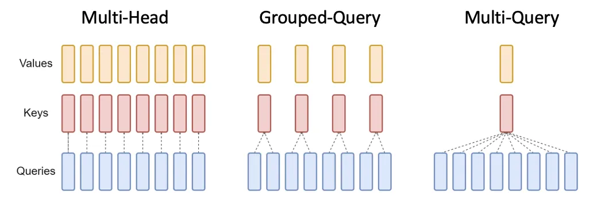
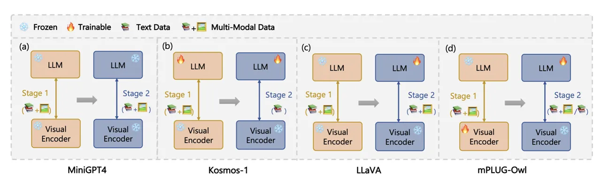

# A Review of Multi-Modal Large Language and Vision Models¹¹ 1 Acknowledgement: This work was part-funded by Science Foundation Ireland through the Insight the SFI Research Centre for Data Analytics (SFI/12/RC/2289_P2).

Kilian Carolan⁽¹⁾, Laura Fennelly⁽¹⁾  
and Alan F. Smeaton^((1,2))

\[1\] School of Computing, Dublin City University, Glasnevin, Dublin 9,
Ireland.  
\[2\] Insight SFI Centre for Data Analytics, Dublin City University,
Glasnevin, Dublin 9, Ireland.

Keywords: Multi-modal large language models (MM-LLMs), natural language
processing (NLP), artificial intelligence, transformer architecture,
foundational models.

###### Abstract

Large Language Models (LLMs) have recently emerged as a focal point of
research and application, driven by their unprecedented ability to
understand and generate text with human-like quality. Even more
recently, LLMs have been extended into multi-modal large language models
(MM-LLMs) which extends their capabilities to deal with image, video and
audio information, in addition to text. This opens up applications like
text-to-video generation, image captioning, text-to-speech, and more and
is achieved either by retro-fitting an LLM with multi-modal
capabilities, or building a MM-LLM from scratch. This paper provides an
extensive review of the current state of those LLMs with multi-modal
capabilities as well as the very recent MM-LLMs. It covers the
historical development of LLMs especially the advances enabled by
transformer-based architectures like OpenAI’s GPT series and Google’s
BERT, as well as the role of attention mechanisms in enhancing model
performance. The paper includes coverage of the major and most important
of the LLMs and MM-LLMs and also covers the techniques of model tuning,
including fine-tuning and prompt engineering, which tailor pre-trained
models to specific tasks or domains. Ethical considerations and
challenges, such as data bias and model misuse, are also analysed to
underscore the importance of responsible AI development and deployment.
Finally, we discuss the implications of open-source versus proprietary
models in AI research. Through this review, we provide insights into the
transformative potential of MM-LLMs in various applications.

## 1 Introduction

Large Language Models (LLMs) are one of the hottest topics in artificial
intelligence (AI) research and interest in them and how they can be used
in generative AI applications has spilled into the mainstream media.
Their popularity in the public sphere has been triggered by the arrival
of ChatGPT, first released to the public in 2022 \[1\]. By LLMs we refer
to language models based on the Transformer architecture, with the
notable example of ‘Generative Pre-trained Transformers (GPT)’ from
OpenAI first introduced as GPT-1 in 2018 \[2\]. The sudden popularity of
LLMs arises because of their demonstrated usefulness in supporting a
wide range of applications and tasks including text summarisation \[3\],
text-to-image \[4\] and text-to-video \[5\] generation, conversational
search \[6\], machine translation \[7\] as well as their role in many
Generative AI (GenAI) applications. That role in GenAI is included in a
comprehensive review of the literature consisting of over 1,300 articles
in \[8\].

Apart from the GPT-n family of LLMs from OpenAI, other notable examples
of proprietary LLM’s which are in the public eye include Google’s
Gemini/BARD \[9\] and Anthropic’s CLAUDE \[10\] while the most
well-known open source LLMs are Meta’s LLaMA \[11\], Google’s PaLM and
Falcon from the UAE’s Technology Innovation Institute. The release of a
new LLM or the announcement about an update to an existing one can not
only pique the interests of the research community but often also
attracts media attention. This makes keeping abreast of all the LLMs
that are available, how they compare against each other and what they
are being used for, a challenging task.

In this review, we assess the current state of LLM’s but with a specific
focus on visual/multi-modal LLM’s and on their technical aspects, how
they can be optimised for a specific task. In \[12\] the authors
presented a short, thorough review of LLMs covering their history,
architectures, training methods, applications, impacts, challenges and
significance but their scope did not cover models that have been trained
on, and can generate output which crosses the boundaries of different
modalities namely text, images, videos, and audio. Our review is
complementary to that in \[12\] and guided by the evaluation of LLMs and
MM-LLMs, considers factors such as open-source versus proprietary owned
models, the benefits of choosing open-source and the computational costs
and resources required to pursue open-source. We also address issues
such as whether the fine-tuning methods or architectural components in
each model that should be considered in order to minimise cost and what
evaluation methods are used to assess the quality of these models.

Many ethical concerns have been raised in the literature concerning the
use of LLMs, the data used to train them \[13, 14\], the energy costs
associated with their creation \[15, 16\] and the fact that the largest
and most useful of these models are owned by a small number of big tech
companies. This review looks to address if and how a Multi-Modal LLM, in
particular an open source MM-LLM can be used in practical multimedia
applications. We examine how they are trained to become MM-LLMs and how
the visual components which defines them as Multi-Modal were
incorporated to their base LLM. Additionally, we highlight the
comparison between closed source vs. open source from an ethical
standpoint, data control issue and application use case.

Other aspects of such models, of which there are several, fall outside
the scope of this review.

The rest of this paper is organised as follows. In the next section we
briefly re-cap on large language models to explain what they are, the
history of their development and the importance of the attention
mechanism. We then examine look at the pros and cons for using
proprietary vs. open source LLMs. This is followed by a review of the
largest and most popular of the mostly text-based LLMs, covering the
LLaMA family, Mistral-7B, Falcon and its variants Following that we
review the major vision models and the Multi-Modal Large Language Models
(MM-LLMs) BLIP-2, CLIP, LLaVA, Kosmos-1, MiniGPT4, and MPLUG-Owl. This
is followed by a review of ways to modify a foundational model for
specific applications including model fine-tuning, both full tine-tuning
and parameter efficient fine-tuning covering Low Rank Adaption (LoRA),
Quantised Low-Rank Adaption (QLoRA) and Supervised Fine-Tuning (SFT),
prompt engineering and Reinforced Learning Human Feedback (RLHF).
Hallucinations, which refer to outputs from a LLM or a MM-LLM which are
obviously wrong, factually incorrect, or unrelated to the input prompt,
are then presented along with approaches to mitigate their impact,
especially for MM-LLMs. Finally, model evaluation and benchmarking to
assess the performance of both pre-trained and fine-tuned LLMs and
MM-LLMs is an important consideration in any use of such models and a
number of commonly used benchmarks for assessing the performance of an
LLM in common-sense reasoning tasks, are presented.

## 2 What is a Language Model?

### 2.1 The History of Language Models

Language Models (LMs) are an important technology in Natural Language
Processing (NLP). Using statistical methods, LMs were machine-learning
based, trained to predict the next word in a sequence by analysing a
large amount of text corpora to understand and replicate the patterns of
language use, styles, and the nuances of human language \[17, 18\].

The development of LMs into LLMs can be traced through the historical
advances in NLP. The first approaches to NLP for applications like
machine translation and speech recognition were characterised by
rule-based approaches, which evolved into the uses of statistical
approaches such as Hidden Markov and N-gram models \[19\]. These
statistical approaches analysed the sequences, order, and frequency of
words in text corpora, but were limited in their ability to capture
context or semantics of the data efficiently. While Neural Networks
(NNs) were initially discovered in the 1950s, their use in NLP tasks
came about much later due to their computational requirements \[20\].
However, in the 2010s, a new breakthrough was marked in LMs and NLP
tasks with the introduction of Word Embedding models such as Word2Vec
and GloVe \[21\]. Word embedding is a technique in which text data can
be represented as continuous vectors by creating a virtual embedded
space where semantic relationships between words can be captured and
understood. The innovation of word embedding laid down the initial works
for the resurgence in deep learning.

LM’s next advancement was seen with the utilisation of Recurrent Neural
Networks (RNNs) and Long Short-Term Memory (LSTM). The incorporation of
these deep learning methods into LMs marked a significant leap forward
in enhancing contextual awareness in language processing \[22, 18, 23\].
Models like RNNs enabled the processing of a whole input sequence, one
word after the other, which could then be used to predict the next word
in the sequence. This is unlike N-gram models which could only capture
the context of words that were close by and failed at capturing the
context of words that were far from each other. There were still
limitations and challenges with RNN and LSTM models, specifically with
capturing long-range dependencies in text data. As input sequences grew
longer, it created a bottleneck for all the relevant information to pass
through and for context to be captured as sequences could not be trained
in parallel \[24\].

In 2017 a pivotal paper was published \[25\] which led to what have
become known as LLMs. This paper introduced the Transformer architecture
and one of its innovations was that it used attention mechanisms to
enable parallel processing of text sequences. This removed the
limitation found in RNN and LSTM models associated with long-range
dependencies in text. It also allowed for LMs to pay attention to, and
to analyse different parts of the input, so that the whole input is
understood as is its relationships and the importance of each part \[25,
26, 22\].

In 2018 researchers in Google and in OpenAI each introduced a language
model based on the Transformer architecture. Google announced the
Bidirectional Encoder Representations from Transformers (BERT) \[27\]
and OpenAI released their first Generative Pre-trained Transformers
(GPT). These Transformer-based language models along with the vast
amounts of text corpus and increased computational power available to
train them, has led to development of LMs into LLMs \[23, 2, 27\].

However, the surge in popularity for the use of, and research into LLMs
was not until the arrival of OpenAI’s ChatGPT which was first released
to the public in November 2022. This demonstrated the ability of LLMs to
“understand” and generate human-like language in conversational search,
document summarisation and other generative AI applications \[28\].

### 2.2 Attention Mechanisms

The Transformer architecture has been a paradigm shift in the field of
NLP. First introduced in \[25\], it is an architecture that uses only
attention mechanisms, specifically Self-Attention and Multi-Headed
attention. Recently, methods utilising the attention mechanism have
dominated this area.

Attention mechanisms allow a model to focus on important parts of an
input sequence without being affected or reliant on dependencies of
distance in the sequence. The self-attention mechanism relates to
different positions of a single sequence in order to compute a
representation of the sequence. Each input sequence is broken down into
smaller, unique, linear query, key and value vectors for better context
understanding.

The Multi-Head attention (MHA) mechanisms repeats the self-attention
computation multiple times in parallel. MHA uses multiple heads to
attend to all the different aspects of an input sequence simultaneously.
This allows it to provide high-quality results. However, this can be
computationally expensive due to the parallel processing and can
potentially lead to performance deterioration.

Multi Query Attention (MQA) shares one key head and a single value head
across all unique query heads. As the number of heads for key and value
are reduced, the GPU memory required for storage is also reduced and
allows for faster processing. GPU memory saving can then be utilised to
increase batch size, and therefore increase overall efficiency. The
disadvantage to using MQA over MHA is that the former only uses one head
for a key-value pair therefore it is prone to missing potentially
important aspects of the input sequence compared to the more in-depth
analysis of MHA.

The compromise between MHA and MQA is called Grouped-Query attention
(GQA) and 3 variations are shown in Figure 1. GQA allows for faster
processing than MHA while retaining more detail than MQA through
attention within groups. This allows the model to effectively comprehend
longer input sequences. GQA addresses this issue found in MHA by
assigning each key-value head a corresponding query group, rather than a
unique linear query. This optimises performance while mitigating risk of
performance degradation \[29, 30, 31\].

Figure 1: A summary of how an input sequence is decomposed into query,
key, and value vectors across the various attention mechanisms, taken
from \[31\].

## 3 Proprietary vs. Open Source LLMs

Throughout 2023, the ongoing surge in research and development of LLMs
continued at pace. Prominent companies such as OpenAI and Google
competed to develop an LLM that would dominate the market. It was
previously considered that the larger the LLM, the greater the
competitive advantage that would be obtained. The cost for researchers
to build an open sourced LLM had required substantially large funding,
as the creation of LLMs demanded extensive data and GPU resources, which
could cost anywhere from €1 to €100 million. This was until Meta
released their open sourced LLM called LLaMA, their belief being that to
foster innovation, enhance security, and improve safety in LLMs, it was
important to release an open sourced LLM \[32\]. Some open source models
like Meta’s LLaMA-2 and Google’s PaLM 2, are now available to use free
of charge as opposed to proprietary LLMs such as OpenAI‘s GPT or
Google’s BARD which charge enterprises based on their usage of the
model \[33, 34\].

It should be noted that Google has acknowledge the limitations of
proprietary LLMs and that there would only be limited time before their
own model would be replicated or surpassed by open source LLMs. This is
because the innovations that were driving the successes in the open
source community had addressed challenges that Google had already been
grappling with \[35, 36\].

Open source LLMs offer several advantages for researchers and for
entrepreneurs, primarily due to their long-term cost-effectiveness but
also because they provide transparency and flexibility in terms of their
methodologies, architecture, and training data. The visibility in open
source models aids with audits while facilitating adherence to both
ethical and legal standards. This will be especially important when the
European Union AI act comes into force in 2025 where such openness and
transparency about training data will be a requirement if companies are
to deploy use of their LLMs within the European Union \[37\]. Another
benefit is that open source grants researchers and developers’ complete
control over their own data which they may wish to combine with, or to
fine-tune, an LLM. Any sensitive data that might be used will remain
within their system which aids in reducing the risk of data leaks or
unauthorised access. Furthermore, efficient optimisation of open source
LLMs can result in reduced latency and improved performance.

Open source LLMs have been utilised across a diverse range of
industries, including healthcare, law, and finance among others.
However, there are noteworthy concerns associated with the use of open
source LLMs that should be considered. Firstly, there is a lack of
formal service agreements between the provider of an open source LLM and
the entities utilising it for development. Additionally, there is no
guarantee that a company or developer will continue to offer support or
continued development for an open source LLM in the future. Furthermore,
as open source communities drive technological advancements,
proprietary-owned LLMs may progress to become a more practical and
reliable option in the future. Lastly, it is important to consider that
not all open source LLM adhere strictly to the open source philosophy.
For instance, Meta’s LLaMA-2 has imposed certain usage conditions
through its acceptable use policy \[33, 34, 38\].

## 4 Specific Large Language Models

In this section we provide a summary review of the most popular and
important of the LLMs which originate in the text domain, some of which
are mentioned in \[12\]. While primarily aimed at generating text as
output, some of these have a multi-modal component which has been
retrofitted afterwards,

### 4.1 GPT

GPT-n, first introduced as the GPT model refers to a family of LLMs
developed by OpenAI, which at the time of writing now includes a MM-LLM
named GPT-4. The first model in this family was GPT-1, where GPT means
Generative Pre-Training, and was trained on a large, diverse corpus of
text using a 12-layer decoder-only transformer with masked
self-attention heads. It was shown to improve performance of the
state-of-the-art NLP tasks on 8 of 12 datasets studied \[2\].

GPT-3 was introduced in 2020 and shares a relatively similar
architecture to GPT-1 and GPT-2 but was scaled up in terms of model
size, training time, and training data. GPT-2 first showed that language
models can demonstrate impressive NLP performance in areas like text
comprehension and summarisation, unsupervised when trained on larger and
larger datasets. GPT-2 was a 1.5 billion parameter model and GPT-3 was a
175 billion parameter model \[39\],\[40\].

GPT-3.5 and 4 are of particular importance in the development of LLMs
with GPT-3.5 being the backbone of ChatGPT, released to the public in
November 2022 and now synonymous with generative AI. GPT-4 is the first
of the OpenAI GPT models to have multi-modal capabilities. This model is
able to accept images and text and to produce text and image outputs.
While the ability to take images as prompts is an important development,
GPT-4 also shows a significant improvement on NLP tasks when compared to
its predecessors, scoring in the 90% percentile in the bar exam when
compared to humans while its immediate predecessor, GPT-3.5, scored in
the bottom 10%. However, the model suffers from the same issues as its
predecessors with hallucinations, limited context window size, and an
inability to learn incrementally including from from experience. However
what is known about GPT-4 is that it is a transformer-based model
trained on a combination of public data from the internet and licensed
content from third parties. The model is then fine-tuned using
Reinforcement Learning from Human Feedback (RLHF) \[41\].

### 4.2 Claude

The Claude family of large language models developed by Antrhophic and
first introduced as Claude 1 in March 2024, is a LLM designed to help
with NLP tasks such as summarization and question-answering as well as
with coding. It was introduced with claims that Claude was less likely
to produce harmful outputs, and could take better direction and tone and
behaviour than other models \[42\].

Claude 3 was introduced in 2023 and is a suite of models ranging in size
and complexity, coming in three flavours: Opus, Sonnet, and Haiku. While
specific details of the model architecture are not available, Claude 3
has multi-modal capabilities allowing for the processing of visual data,
it claims excellence on visual queries based on images given as prompts.
It also has what is possibly the largest context window of 200,000
tokens, which is the size of the input that an LLM can consider in one
go when making predictions or generating text. Claude 3 is trained with
a mixture of public and private data as well as with synthetic data With
the public data crawled with a knowledge endpoint of August 2023. The
claimed benchmark performance reported by Antropic the developers of
Claude, makes it on par with or better than the other large LLMs but
there is still a lack of clarity on specific architecture details.

### 4.3 Gemini

Gemini introduced by Google in 2023, is another “family” of, rather than
a single MM-LLM which includes capabilities for text, audio, images and
video. It boasts state-of-art results on multiple benchmarks at time of
release. Of particular interest is the Gemini Ultras achievement on
image and text benchmarks where for example it scored 64% in the MMMU
benchmark \[43\] containing images on multi-discipline tasks requiring
college-level subject knowledge, outperforming the previous best model
by more than 5 percentage points.

Gemini 1 is available in three different flavours, Ultra, Pro and Nano
referring to the size of the models. Each model is trained using the
Transformer architecture utilising the MQA mechanism and can accept a
context length of 32k tokens. As with GPT, the Gemini family would
appear to follow the reasoning of “bigger is better”, and have addressed
shortcomings of Google’s previous flagship models by adding more
hardware. A key difference between GPT-4 and Gemini is the fact that the
model can also output images.

### 4.4 LLaMA

LLaMA is a series of open source LLMs developed by Meta AI. The goal for
Meta was to provide an accessible and open sourced LLM to help make
advancements in research and application development in the sub field of
NLP, thus enabling others in the research community to access the vast
infrastructure resources to study and explore the area of LLMs’ rapidly
evolving fields of use. LLaMA comprises a collection of foundation
language models with parameter sizes ranging from 7B to 65B. Unlike
other models that prioritise training speed, LLaMA was designed to run
on a single GPU, with the objective being to focus on the inference
speed rather than the speed of the fastest model to train \[11, 44\].

LLMs were based on the common belief that more parameters will lead to
better performance and so the bigger the model, the better the
performance. A recent study by Hoffman et al. \[45\] suggested that
smaller models trained on more data can yield better performance and
results for a given computational budget. Meta AI trained the LLaMA
language models using publicly available datasets exclusively, avoiding
the use of proprietary or inaccessible data. The main objective of LLaMA
was to achieve the best possible performance at different computational
budgets for inference. Despite its smaller size, LLaMA-13B outperforms
GPT-3 on most benchmarks, while LLaMA-65B is competitive with other LLMs
like Chinchilla or PaLM-540B \[11, 46, 47\].

LLaMA model architecture is based on the original Transformer
architecture as described in \[25\]. Additional improvements were made
to the model by incorporating methods proposed by other LLMs. To make
the training stable, LLaMA uses a technique called pre-normalisation, as
demonstrated in the GPT-3 model. This method normalises the input of the
transformer, rather than normalising the output, using the RMSNorm
function. This helps to reduce computational time and complexity. LLaMA
improves performance through utilising an activation function called
SwiGLU. LLaMA uses Rotary positional embedding (RoPE) a technique that
rotates the token embedding in a high-dimensional space. RoPE preserves
the original information, while adding positional understanding. This
can save memory and computational resources, making it a more efficient
choice for large-scale models \[11, 48, 46\].

LLaMA was compared with non open source models such as PaLM, GPT-3 and
Chinchilla using a total of 20 benchmarks to evaluate Zero-shot and
Few-shot learning. Despite LLaMA being a smaller model, it outperformed
or stayed competitive with PaLM, GPT-3 and Chinchilla in areas such as
Common Sense Reasoning, Closed-book Question Answering, Reading
Comprehension, and Code Generation. LLaMA did not perform as well as
PaLM and Chinchilla in Massive Multi-task Language Understanding (MMLU).
However, it was found that small amounts of instruction fine-tuning
applied to the model improved the performance for MMLU. LLaMA-65B
efficiency was measured against areas such as truthfulness, bias, and
toxic language. The following benchmarks were used: RealToxicityPrompts,
CrowS-Pairs, WinoGender, and TruthfulQA. These are covered in more
detail in Section 7 and in \[11, 48, 46\].

### 4.5 LLaMA-2 and LLaMA-2 Chat

In July 2023, Meta AI released LLaMA-2 and LLaMA-2 Chat, an updated
version of LLaMA. LLaMA-2 and LLaMA-2 Chat are a collection of models
ranging from 7B to 70B parameters in size. They key enhancements in
LLaMA-2 included a 40% increase in the size of the pre-training corpus
and doubling the context length from 2048 to 4096 tokens. One notable
difference in LLaMA-2 and LLaMA-2 Chat from their predecessor LLaMA, is
the adoption of the fine-tuning method Reinforcement Learning from Human
Feedback (RLHF) in both LLaMA-2 and LLaMA-2 Chat. This fine-tuning
technique is discussed in more detail in Section 6.1. Although Meta AI
have continued to use publicly available data for training, LLaMA-2
incorporates a new mix of data and have implemented increased safety
measures to ensure the model utilised safety-specific data. While LLaMA
was released as an open-sourced model with non-commercial license,
LLaMA-2 introduces a commercial license to encourage collaborations and
facilitate the exploration of new applications. Additionally, Meta AI
provided the weights and initial code used to help simplify the process
for developers and researchers to build upon existing work. LLaMA-2
adopts a similar architecture to LLaMA, with an important enhancement,
the integration GQA mechanism within its transformer-based
framework \[49, 50, 51\].

In terms of performance tasks and benchmarks utilised for LLaMA-2 and
LLaMA-2 Chat, similar ones were used as in the case of LLaMA. LLaMA-2
generally out-performed most other open sourced LLMs across various
performance tasks, with the exception of coding-based tasks. However,
when compared to proprietary LLMs such as GPT-4 and PaLM-2, LLaMA-2
presented lower performance. It closely aligned with results of GPT-3.5
and PaLM in terms of performance outcomes \[49, 52, 29\].

### 4.6 MedAlpaca

In October 2023 MedAlpaca, a collection of LLaMA models fine-tuned for
biomedical tasks using open-sourced biomedical datasets was released.
The objective of MedAlpaca was to address the need for open-source LLMs
that could be deployed on-premises to uphold privacy for personal data,
specifically in the medical domain where the safeguard of patient
privacy is of important concern. MedAlpaca utilised Low-Rank Adaption
(LoRA) and Supervised Fine-Tuning (SFT), these fine-tuning methods are
covered in more detail in Section 6.1 and in \[53, 54\].

The model was evaluated by its performance on the United States Medical
Licensing Examination (USMLE), a standardised assessment taken by
medical students to qualify as physicians. Performance was evaluated on
zero-shot prompts and interestingly, MedAlpaca 13B achieved better
accuracies compared to LLaMA 13B, with 47.3%, 47.7%, and 60.2%, in steps
1,2 and 3 of the USMLE assessment. However, when employing LoRA
fine-tuning for MedAlpaca 13B LoRA, the performance decreased to 25.0%,
25.5%, and 25.5%. These results indicate that the implementation of
LoRA, while computationally efficient, was less optimal compared to
using just SFT \[55\].

### 4.7 Mistral 7B

Mistral 7B is a 7-billion parameter language model, claiming superior
performance and efficiency when compared to larger models such as LLaMA
(Version 1 and 2, 34B and 13B parameters respectively). The developers
of Mistral 7B highlight how in particular, a chat model built on Mistral
7B outperforms the LLaMA-2 13B Chat model. Mistral 7B attributes GQA
mechanisms, similar to LLaMA-2, and Sliding Window Attention (SWA) as
reasons for its performance and efficiency. SQA, introduced as part of
Long-former architecture \[56\], allows for more efficient processing of
longer text sequences. A key component of this is having multiple
stacked transformers, comparable to CNN convolutional layers.

### 4.8 Falcon-7B, 40B

In May 2023, Abu Dhabi’s Technology Innovation Institute (TII) announced
Falcon, a series of open sourced LLMs comprised of Falcon-7B,
Falcon-40B, Falcon-7B-Instruct and Falcon-40B-Instruct. All models were
released under the Apache 2.0 license. Falcon-7B-Instruct and
Falcon-40B-Instruct are specialised versions of Falcon-7B and Falcon-40B
models, which have been fine-tuned on instruction and conversational
data so that they can be leveraged for chatbot style tasks. Falcon
enables the use of their LLMs for unrestricted commercial purposes
without any usage costs or royalties, facilitating widespread adoption.
This means the LLMs can be fine-tuned with various datasets for
different application purposes.

The Falcon LLM team at TII also developed a high-quality pre-training
dataset called “The RefinedWeb Dataset”, which they released as an
extract of 600 billion tokens for the open-source community to use in
their own LLM endeavours \[57, 58, 59\].

The architecture of the Falcon models is transformer-based,
incorporating the use of the MQA mechanism for efficient handling of
large-scale tasks, allowing for enhanced scalability of inference by
reducing memory consumption and enabling faster processing. Similar to
LLaMA, Falcon utilises RoPE to maintain positional understanding and
minimise computational resources. Another notable feature in Falcon
models is Flash Attention, an algorithm that optimises for speed and
memory-efficiency in transformers which is achieved through tiling and
re-computation to minimise the number of memory read/writes between
levels of GPU high bandwidth memory (HBM) and GPU. This results in
faster training of transformers and enables longer context, leading to
higher quality models and improved performance across various tasks.
Unlike LLaMA, Falcon did not employ the SwiGLU activation function to
enhance performance due to its additional memory cost. After reviewing
the use of GLU activations for scaling, it was decided that the extra
memory cost of GLU was not worth it for cost-efficient training \[60,
58, 59\].

The Falcon models have been trained on 1.5 trillion tokens, and their
performance is believed to be heavily influenced by the carefully
curated nature of the pre-training data used. LLMs are affected by the
data they are trained on, and their sensitivity varies with changing
data. What distinguishes Falcon from other LLMs is the pre-training data
which is predominantly based on the RefinedWed dataset. The Falcon LLM
team created the RefinedWed dataset, which is a massive web dataset
based on CommonCrawl. TII focused on scaling and improving the quality
of web data by employing large-scale de-duplication and strict
filtering, resulting in high quality pre-training data. The creation of
the RefinedWeb dataset for the Falcon LLM demonstrated that the use of
high quality pre-training data can lead to powerful results \[60, 59,
61\].

### 4.9 Falcon-180B

In September 2023 TII introduced Falcon-180B, a big advancement in the
Falcon series and trained on 3.5 trillion tokens from the RefinedWeb
dataset, over double what was used for previous models. Additionally,
TII, released Falcon-180B-chat, a variant fine-tuned specifically on
instruction and conversational data. With its 180 billion parameters,
the model proved promising performances with comparable results to
leading models such as PaLM 2-Large, GPT-3.5, and GPT-4. In term of
scale, Falcon-180B is 2.5 times larger than LLaMA-2. However, a notable
drawback of this large open-sourced model is its substantial memory
requirement. It is reported that a minimum of 320GB of memory is
required for optimal operation of Falcon-180B, whereas Falcon-40B
requires 40GB of memory, and Falcon-7B requires 15GB making it
accessible to the open source community for inference and fine-tuning on
modest hardware. The imposed significant burden of Falcon-180B on
resources contradicts one of the major advantages of open-source models,
having the ability to run open-sourced models on consumer level hardware
which allows for accessibility  \[60, 62\].

The performance tasks and benchmarks utilised for evaluating the Falcon
Series of models included common sense reasoning benchmarks such as
HellaSwag, Winogrande, AI2 Reasoning Challenge (ARC), MMLU and
OpenBookQA. Other additional benchmarks used included PIQA (Physical
Interaction: Question Answering) and BoolQ. These performance tasks and
benchmarks are discussed in more detail in Section 7 Model Evaluation
and Benchmarking and in \[60, 62\].

### 4.10 Grok-1

The final LLM to be included in this review is Grok-1, developed by xAI
and released by OpenAI in March 2024. Grok-1 is xAI’s frontier LLM with
a claimed size of 314B parameters. Its architecture is like most of the
other LLMs and is an autoregressive Transformer-based model but with a
mixture of 8 experts. It achieves 63.2% on the HumanEval coding task, a
Python coding completion task, and 73% on MMLU. On these and other
benchmarks it does not achieve the performance of models with larger
amounts of training data such as GPT-4 or Claude 2 but it does
out-perform models trained on similar sized datasets.

A summary of some of the features of the LLMs covered here is presented
in Table 1.

|               |               |            |                    |                    |               |              |        |          |
| ------------- | ------------- | ---------- | ------------------ | ------------------ | ------------- | ------------ | ------ | -------- |
| Model         | No.           | Commercial | License            | Attention          | Pre-training  | VRAM or      | Open   | Fine     |
|               | Parameters    | Use        |                    | Mechanism          | Token Length  | RAM Required | Source | Tuneable |
| LLaMA         | 7 Billion     | No         | LLaMA License      | MHA                | 1 Trillion    | 6GB VRAM     | Yes    | Yes      |
| LLaMA         | 13 Billion    | No         | LLaMA License      | MHA                | 1.5 Trillion  | 10GB VRAM    | Yes    | Yes      |
| LLaMA         | 65 Billion    | No         | LLaMA License      | MHA                | 1.5 Trillion  | 40GB VRAM    | Yes    | Yes      |
| LLaMA-2       | 7 Billion     | Yes        | LLaMA-2 License    | GQA                | 2 Trillion    | 6GB VRAM     | Yes    | Yes      |
| LLaMA-2       | 13 Billion    | Yes        | LLaMA-2 License    | GQA                | 2 Trillion    | 10GB VRAM    | Yes    | Yes      |
| LLaMA-2       | 70 Billion    | Yes        | LLaMA-2 License    | GQA                | 2 Trillion    | 40GB VRAM    | Yes    | Yes      |
| Mistral       | 7 Billion     | Yes        | Apache 2.0         | GQA                | \-            | 6GB VRAM     | Yes    | Yes      |
| Falcon        | 7 Billion     | Yes        | Apache 2.0         | MQA                | 1.5 Trillion  | 15GB RAM     | Yes    | Yes      |
| Falcon        | 40 Billion    | Yes        | Apache 2.0         | MQA                | 1 Trillion    | 40GB RAM     | Yes    | Yes      |
| Falcon        | 180 Billion   | Yes        | Apache 2.0         | MQA                | 3.5 Trillion  | 320GB RAM    | Yes    | Yes      |
| GPT-3         | 175 Billion   | Yes        | OpenAI License     | MHA                | 300 Billion   | Via API      | No     | Limited  |
| GPT-3.5 turbo | 175 Billion   | Yes        | OpenAI License     | Not disclosed      | Not disclosed | Via API      | No     | Yes      |
| GPT-4         | Not disclosed | Yes        | OpenAI License     | Not disclosed      | Not disclosed | Via API      | No     | No       |
| Gemini        | 137 Billion   | Yes        | Gemini Pro License | MQA                | Not disclosed | Via API      | No     | No       |
| Claude        | 93 Billion    | Yes        | Claude Pro License | Unknown            | Unknown       | Via API      | No     | No       |
| Claude 2      | 137 Billion   | Yes        | Claude Pro License | Unknown            | Unknown       | Via API      | No     | No       |
| Claude 3      | Unknown       | Yes        | Claude Pro License | Unknown            | Via API       | No           | No     |          |
|               |               |            | Apache 2.0 for     | 48 attention heads |               |              |        |          |
| Grok-1        | 314 Billion   | Yes        | code and Grok-1    | for queries,       | Unspecified   | Unspecified  | yes    | No       |
|               |               |            | weights            | 8 for keys/values  |               |              |        |          |

Table 1: A comparative summary of the reviewed LLMs

## 5 Vision Models and Multi-Modal Large Language Models

In the previous section we introduced the major and most popular of the
LLMs originating in the text domain, though some of them have a
multi-modal component, we now introduce a specialisation of language
models, namely vision models. These are specifically designed to combine
text and image data and to create an integrated embedding space unlike
those mentioned earlier which have a multi-modal component almost as a
retrofit. Vision models allow for seemless integration of text and
imagery in a range of applications including automatic text-to-image
generation and image captioning.

### 5.1 Vision Models

#### 5.1.1 BLIP-2

In June 2023, Salesforce introduced BLIP-2, a pre-training strategy that
improves vision-language understanding by utilising pre-trained image
encoders and language models. BLIP-2 comprises of two pre-training
stages. The first stage uses frozen image encoders to learn visual-text
representations while the second stage uses a frozen language model to
generate vision-to-language understanding. BLIP-2 introduces a crucial
component, the Querying Transformer (Q-Former), which acts as a bridge
between image and text encoders. By employing learnable querying
vectors, the Q-Former extracts relevant visual features necessary for
accurate interpretation of visual data. Comprising both image and text
transformers, the Q-Former facilitates interactions between visual
features and text. In the first stage of pre-training, the Q-Former
learns visual representations most relevant to the text. In the second
stage, during the vision-language generative learning, the Q-Former
connects to a frozen language model, enabling the model full use of its
generative capabilities. The output query embedding from the image
transformer is aligned to match with the text embeddings, serving as
soft visual prompts that guide the language model’s focus on visual
features. This innovative approach enhances vision-language
understanding by effectively leveraging pre-trained foundational models
while efficiently bridging the modalities \[63, 64\].

#### 5.1.2 Vision Transformer (ViT)

The Transformer architecture has been shown to be effective in computer
vision tasks. In a 2020 paper by Dosovitskiy et al. \[65\], the authors
proposed the Vision Transformer (ViT). They argued that with
substantially fewer computational resources, a ViT could be trained with
comparable performance to state-of the-art convolutional neural
networks, specifically when pre-training on the same computational
budget where ViT outperformed classic ResNet architectures \[66\]. Here
they reshaped and flattened 2D images into a sequence of patches which
can then be utilised by the transformer. In contrast to the transformer
for NLP tasks, the Vision Transformer does not have an attention based
decoder, and instead passes the output to a multi-layer perceptron
head \[65\].

#### 5.1.3 Contrastive Language–Image Pre-training (CLIP)

Contrastive Language–Image Pre-training (CLIP) has quickly become the
basis for many Multi-Modal Large Language Models (MM-LLMs) \[67\].
Heavily inspired by the Visual N-Gram approach used by Li et al. \[68\],
it is a multi-modal approach trained on 400,000,000 image-to-text pairs
capable of classification without being specifically instructed on the
task, i.e. exhibiting zero-shot capabilities. This works by “jointly
training an image encoder and a text encoder” to predict the correct
image-text pairings and is capable of matching the performance of
ResNet-50 without using its 1.38 million crowd-labelled examples. The
potential for encoding bias are addressed here with models like CLIP
identified as having particular risk for a developer programming a class
into the model. CLIP was assessed for potential degrading and
discriminatory classifications by checking the Fairface dataset for
non-human classes like ‘Animal’ and ‘Gorilla’ and it was found that CLIP
incorrectly classified people of colour for one of these non-human
classifications at a disproportionate rate (14% vs. 8%). Through further
experiments they showed that effective class design could mitigate these
problematic classifications.

An improvement to CLIP was recently proposed named Retrieval Augmented
Contrastive Language-Image Pre-Training (RA-CLIP) \[69\] aimed at
addressing the data volume requirement of CLIP. Here, the image-text
data is sampled as a “hold-out set” and the gap is then met by online
retrieval, with the aim of training the model to recognise visual
concepts, and then “look them up”, compared to an open book exam.
RA-CLIP claims an improvement on baseline zero-shot image classification
of +12.7%. It is reasonable to assume this method could be used to
improve on general purpose vision-language understanding such as LLaVA,
as discussed below.

### 5.2 Early Approaches to Multi-Modal Information Processing

Early work on bridging the gap between computer vision and NLP were
inspired by machine translation and are known as encoder-decoder
methods \[70\]. These converted an image into an intermediate
representation before converting to a caption. This typically involved
using two neural networks, a Convolutional Neural Network (CNN) for the
encoder, followed by using the last layer as the input, the feature
space, to a Recurrent Neural Network acting as the decoder. These types
of approaches are computationally expensive and produce vague results.
Li et al. \[68\], showed that images could be annotated in a zero-shot
manner by learning from web data, using a similar approach to n-gram
language models.

### 5.3 Multi-Modal Large Language Models

Image-grounded MM-LLM’s referred to as Large Vision Language Models
“generally consist of vision encoder, a language encoder and a
cross-modal alignment network” \[68\]. They thus offer a more
well-founded pathway to true multi-modal generative AI than the
text-based LLMs covered earlier in Section 4, some of which have
multi-modality added in afterwards. We now explore some of these models.

#### 5.3.1 Large Language and Vision Assistant (LLaVA)

Large Language and Vision Assistant (LLaVA) \[71\] introduced a method
for connecting a vision encoder and an LLM to produce a MM-LLM for
general purpose vision to language understanding. Using CLIP as a visual
encoder and Vicuna \[72\] as the language decoder, the decoder was
fine-tuned on 158k language-vision instructions taken from the MS-COCO
data set \[73\] with the encoder remaining frozen. The fine-tuning
trained on this dataset over 3 epochs with a learning rate of 2e-5 and a
batch size of 32. Full Shard Data Parallel and gradient check pointing
was utilised in an effort to save GPU memory.

This work was expanded by LLaVA 1.5 by adding CLIP-ViT-L-336px with a
multi-layer perceptron (MLP) projection. This uses largely the same
hyper-parameters as the original LLaVA, excluding the learning rate
which has been halved during pre-training. This is due to the fact the
model now uses a MLP projection layer rather than a linear projection
layer as in the original model. Another important consideration is that
the model can only handle one image at a time \[74\].

#### 5.3.2 Kosmos-1 and Kosmos-2

Kosmos-1 is a MM-LLM claiming to posses general purpose image processing
capabilities \[26\]. Kosmos-1 a Transformer-based causal language model.
It allows for text as well as other modalities like images to be
embedded directly as input to the language model. It converts the
different modalities into vectors which can then be passed to the
decoder. Kosmos is trained on a combined text corpora of “The
Pile” \[75\] and the “Common Crawl” \[76\], a repository of
image-caption pairs, as well as multi-modal data from the Common Crawl
defined as “Interleaved Image-Text Data”. As a common and recurring
theme with MM-LLMs in this review, the image representations are given
from CLIP.

Kosmos-2 \[77\] is built on Kosmos-1 and has the same Transformer-based
language model architecture and training objective as KOSMOS-1. The
training data used as input into the model consists of grounded
image-text pairs thus endowing the model with grounding and referring
capabilities at source. This is an alternative to the approaches taken
by the other MM-LLMs described in this paper which train and then
combine separate language (text) and vision models in a multi-stage
process.

#### 5.3.3 MiniGPT4

In April 2023, researchers from King Abdullah University of Science and
Technology (KAUST) unveiled their findings and access to their
open-source MM-LLM, MiniGPT4. MiniGPT4 was designed to rival the
performance of OpenAI’s MM-LLM GPT-4, but as an open-source alternative.
Given the lack of transparency regarding the technical design and
details behind OpenAI’s GPT-4, researchers at KAUST looked to develop a
comparable MM-LLM using only open-sourced models and data. The
researchers at KAUST hypothesised that the capabilities demonstrated by
GPT-4 were attributed to its utilisation of advanced LLMs. To test this
hypothesis, MiniGPT4 was developed to examine the use of an open-sourced
frozen visual encoder with an advanced open-sourced frozen LLM. The
abilities showcased by MiniGPT4 include the identification of facts and
objections from an image, recipe generation from an image,
identification of issues with corresponding solutions, and even
providing context as to why an image of a meme is considered
funny \[78\].

The model architecture of MiniGPT4 utilises an advanced pre-trained LLM
as the language decoder called Vicuna. Vicuna was also used in LLaVA as
mentioned earlier, and is based on the LLaMA model and fine-tuned using
user conversations sourced from ShareGPT.com \[79\]. In addition to
Vicuna, MiniGPT4 incorporates pre-trained open-sourced vision components
similar to those used in BLIP-2. These components include a Q-Former and
ViT which serve as the vision encoders within the model architecture. To
effectively integrate the pre-trained visual encoder with the LLM, a
single projection layer is introduced. This projection layer acts as a
bridge, aligning the visual features extracted by the pre-trained visual
encoder with the LLM.

Throughout the pre-training process of MiniGPT4, both the visual encoder
and LLM remain frozen, meaning the parameters of these models are not
updated. Only the projection layer is trained to align the visual
features with the LLM, ensuring effective coordination between the two
modalities without altering their individual pre-trained states  \[64,
78\].

Two stages of fine-tuning were conducted with MiniGPT4 to enhance its
performance. Initially, the model was fine-tuned using a dataset
comprising approximately 5 million image-text pairs from combined image
captioning datasets. This stage of training lasted around 10 hours and
utilised 80 GB of A100 GPU. However, the results revealed that training
on short image caption pairs led to irregular linguistic and irrelevant
content output. It was found that simply aligning visual features with
the LLM proved inadequate in producing chatbot quality visual
conversation capabilities. Additionally, it was believed that the
presence of underlying noise in raw image-text pairs may have
contributed to the sub-optimal language outputs. For this reason, and to
address this issue, a second fine-tuning stage was implemented. A more
detailed image description dataset was created consisting of 3,500
high-quality image-text pairs. The model was further trained using this
refined dataset, resulting in MiniGPT4 generating more reliable and
natural language outputs. The training time for the refined dataset was
reduced to approximately 7 minutes on an A100 GPU. It was found that the
additional fine-tuning with more detailed image captions improved the
model’s generation reliability and usability.

MiniGPT4’s performance was evaluated in comparison to BLIP-2 across four
vision-language tasks, each involving presenting the model with an image
accompanied by a prompt question. These tasks included meme
interpretation, recipe generation, poem composition, and advertisement
generation. An example of the prompt question used in the case of meme
interpretation task was “Explain why this meme is funny?”. MiniGPT4
demonstrated successful responses to 65% of requests, compared to BLIP-2
with less than 10% success. Additionally, both models were evaluated on
image captioning using the MS-COCO caption benchmark \[73\], with BLIP-2
achieving under 30% success and MiniGPT4 achieving over 65%.

Despite MiniGPT4’s notable performance, it was found that the model is
subject to the limitations inherent with LLMs, such as hallucinations.
The research team at KAUST gauged the hallucination rate of the model’s
output using the CHAIR metric. They found that longer captions tend to
have higher hallucination rates than those of shorter captions and
suggested that using reinforcement learning with AI feedback with
hallucination detection modules could be a potential solution to the
issue.

The research team additionally explored other versions of MiniGPT4, all
trained using the same methodology. MiniGPT4 without a Q-Former
demonstrated a similar performance to MiniGPT4, although the original
version was slightly better. MiniGPT4 with a fine-tuned Q-Former
exhibited an even lower performance. Lastly, MiniGPT4 with the
incorporated three projection layers performed poorest, suggesting that
the use of a single projection layer is sufficient to align the visual
encoder and language decoder \[78\].

#### 5.3.4 mPLUG-OWL

In April 2023, researchers from the Alibaba DAMO academy introduced
mPLUG-OWL, an open-sourced MM-LLM. Other existing MM-LLMs have employed
various methods of pre-training and instruction tuning in a two-stage
fashion.

Identifying limitations in these approaches, the DAMO academy
researchers focused on addressing constraints associated with relying on
frozen visual models throughout both training stages, which could lead
to inadequate alignment due to limited parameter flexibility. In
response, mPLUG-OWL adopts a novel approach to align image and text,
freezing the visual model only in the second stage of training.
Additionally, the model leverages a base pre-trained LLM LLaMA as
opposed to conversational fine-tuned LLMs such as Vicuna and Alpaca
 \[80, 79\].

The model’s architecture utilises advanced pre-trained LLM LLaMA-7B as
the language decoder, while ViT-L/14 serves as the visual foundation
model for the visual encoder to extract visual features from the input
images, thereby encoding visual knowledge. Recognising the computational
complexity associated with integrating visual knowledge into the LLM due
to the lengthy sequences, a visual abstractor module is employed to
address this issue, by compressing the extracted visual features \[80,
44\].

The ViT is initialised from the CLIP ViT-L/14 model, which is
pre-trained to ensure faster convergence. The initialisation allows for
the compression of visual information into a few learnable tokens. These
compressed visual tokens are then combined with word embeddings from the
input sequence, facilitating their integration into the LLM for further
processing and analysis. This allows the model to effectively integrate
visual information alongside text input, while managing computational
resources \[80, 81\].

The first stage involves pre-training the visual model. This is done by
freezing the LLM and training the visual knowledge and abstractor
modules on several image-caption pair datasets. In the second stage of
training, the LORA fine-tuning technique is implemented on the frozen
pre-trained LLM to improve the LLM’s ability to efficiently process text
instruction data from various sources, while the visual knowledge and
abstractor modules are frozen. LoRA is covered in more detail later in
Section 6.1, on fine-tuning \[54\]. DAMO academy researchers believed
that this training approach would enhance multi-modal abilities and
improve the generation capabilities of LLMs through modality
collaboration by enabling effective integration of textual and visual
information.

The mPLUG-OWL model’s effectiveness was evaluated on OwlEva, a visually
related instruction dataset that was created by the DAMO academy
researchers that consisted of 82 questions based on 50 images. The model
demonstrated promising performance in instruction and visual
understanding and knowledge transfer. The model was compared with other
MM-LLMs such as LLaVA, BLIP-2 and MiniGPT4, with both MiniGPT4 and
mPLUG-OWL showing the most promising results. There were noted incidents
of hallucinations in mPLUG-OWL where the model failed to relate some
images and produced some text hallucinations \[80, 81, 78, 71\].

#### 5.3.5 Re-Cap on Specific MM-LLMs

In comparing the MM-LLMs we have selected for inclusion in this review,
we find they are very different in how they have each been constructed
in terms of their interplay between visual and text models. MiniGPT4
utilised both frozen LLM and frozen visual models in each of two stages,
aligning images and text through a projection layer \[78\] while LLaVA
used a frozen LLM and visual model in the first stage and a trainable
LLM with a frozen visual model during the second phase \[71, 26\].
mPLUG-OWL also had a 2-stage approach during which the LLM was frozen
and the visual model was trained in the first stage, then the LLM was
fine-tuned and the visual model was frozen in the second stage of
training \[80\]. Kosmos-1 and Kosmos-2 took a different approach and
incorporated a trainable LLM alongside frozen visual models in a single
combined stage and thus integrated the text and visual training data at
input time.

At this time there is clearly no universally agreed way for a
foundational text model and a model or training data for other
modalities to be co-trained and this question remains an open research
issue. Figure 2 presents an overview and comparison of the different
training methods for MM-LLMs while Table 2 presents a summary of their
characteristics.

Figure 2: A comparative summary of different training methods used for
the reviewed MM-LLMs, all which follow a two-stage training process
(taken from \[80\]).

| Model           | Open   | Fine-    | LLM Used                                               | Vision Model Used          |
| --------------- | ------ | -------- | ------------------------------------------------------ | -------------------------- |
|                 | Source | Tuneable |                                                        |                            |
| LLaVA           | Yes    | Yes      | Vicuna                                                 | CLIP ViT-L/14              |
| Kosmos-1 and -2 | Yes    | Yes      | Grounded image-text pairs to train an integrated model |                            |
| MiniGPT4        | Yes    | Yes      | Vicuna                                                 | Q-Former and CLIP ViT-G/14 |
| mPLUG-OWL       | Yes    | Yes      | LLaMA-7B                                               | CLIP ViT-L/14              |

Table 2: A comparative summary of some MM-LLMs

## 6 Model Tuning

There is much potential offered by pre-trained LLMs and MM-LLMs.
However, these foundational models may not always align perfectly with
the specific requirements of every use case they may be used for. Some
scenarios may demand more tailored outputs, while others may lack
crucial context or domain-specific knowledge covered in the initial
pre-training phase. To fully harness the potential of pre-trained
foundational models for specific uses cases, model tuning can be used.
There are four primary areas of model tuning that can be utilised to
adapt pre-trained foundational models namely full fine-tuning,
parameter-efficient fine-tuning (PEFT), prompt engineering, and
reinforced learning human feedback (RLHF) and these are now described in
turn.

### 6.1 Full Fine-Tuning

Fine-tuning is a process of modifying some of the parameters of a
pre-trained foundational model by further training it on a smaller,
task-specific dataset in order to optimise the model’s performance for a
target use case. Full fine-tuning involves adjusting all parameters of a
pre-trained model using a task-specific dataset to better align with the
specific requirements of the target use case. While this allows for
comprehensive customisation, it requires a significant amount of
training data. The advantage of full fine-tuning lies in the model’s
ability to grasp the nuances of a particular domain. However, this
process can be computationally expensive \[82, 83\].

### 6.2 Parameter Efficient Fine-Tuning

Unlike full fine-tuning, Parameter Efficient Fine-Tuning (PEFT) aims to
reduce computational requirements and training time by selectively
updating or modifying only specific parts of a pre-trained foundational
model while achieving comparable performance to full fine-tuning. PEFT
employs techniques to refine a pre-trained model by updating only a
small number of its parameters. LLMs and MM-LLMs are pre-trained on
extensive datasets that tend to have a wide variety of knowledge, often
possessing much of the information required for a range of downstream
tasks. Consequently, for many specific targeted use cases, adjusting the
entire model may be unnecessary and inefficient. PEFT addresses this by
conducting the fine-tuning process on a small subset of parameters,
focusing only in those relevant to the specific targeted use case.

There are different PEFT methods employed for fine-tuning to accommodate
for different requirements. While certain methods focus on training
specific segments of the original model’s parameters, others aim to
incorporate and train additional components, such as adapter layers,
without altering the original architecture \[82, 83\]. Below we review
some of these techniques.

#### 6.2.1 Low Rank Adaption

Low Rank Adaption (LoRA) trains LLMs or MM-LLMs on domain-specific data
and involves freezing the weights of a pre-trained model and injecting
trainable rank decomposition matrices into each layer of the Transformer
architecture. By utilising this method, it can reduce the number of
trainable parameters and GPU memory required for subsequent tasks. LoRA
focuses on fine-tuning the smaller trainable matrices that create the
LoRA adapter. The LoRA adapter, once fine-tuned, is integrated into the
original pre-trained model for inference. The advantage of LoRA is its
ability to reduce memory requirements by allowing multiple LoRA adapters
to reuse the same original LLM. This makes it useful for handling
multiple tasks and uses cases efficiently \[54\].

#### 6.2.2 Quantised Low-Rank Adaption) Quantised Low-Rank Adaption (QLoRA

is an extension of the LoRA fine-tuning technique, focusing on memory
efficiency. It incorporates quantisation, which involves reducing the
precision of numerical values, during the adaption process. Instead of
fine-tuning all the weights of a pre-trained LLM, the LoRA technique is
used to form LoRA adapters which are smaller matrices that can be
fine-tuned to approximate the larger weight matrices. However, instead
of low-rank approximation, QLoRA also applies quantisation to the
weights of the LoRA adapters to further compress the model which reduces
the memory and storage requirements even further. Quantisation reduces
the precision of numerical data by converting high-precision numerical
values to lower precision, resulting in smaller model sizes to preserve
performance. In the paper introducing QLoRA, it was found that this
fine-tuning approach reduced the memory usage enough to fine-tune a 65B
parameter model on a single 48GB GPU \[84\].

#### 6.2.3 Supervised Fine-Tuning

Supervised Fine-Tuning (SFT) involves fine-tuning a domain-specific
dataset using labelled training data, on a pre-trained foundational
model. LLMs and MM-LLMs are usually trained on extensive unsupervised
data, but SFT aims to adapt pre-trained models to learn a
domain-specific task from labelled data. By adjusting a model’s weights
and parameters to optimise the domain-specific data during fine-tuning,
the model becomes specialised in excelling at domain-specific tasks.

SFT offers a simpler approach for aligning LLMs and MM-LLMs with
domain-specific tasks compared to training a model from scratch. The use
of SFT can allow developers to gain significant results using less
training data and computational resources. However, the resulting models
should also be tested for hidden bias in the initial training data used
in the pre-trained model. This is to help prevent and avoid hidden
biases being magnified when SFT is applied with a domain-specific
dataset \[85, 86\].

### 6.3 Prompt Engineering

Prompts are natural language texts which instruct a LLM or a MM-LLM on
the task it should perform. This involves learning a language model that
calculates the probability of a given text and uses this probability to
predict an output \[87\]. Given such prompts, LLMs are able to perform
“in-context learning” meaning they have the potential for adaption to a
wide variety of tasks without needing new training data \[88\]. This
mitigates one of the key problems with fine-tuning a LLM, the need for a
large set of training data for each new task \[39\].

A distinction can be made between few-shot, one-shot, and zero-shot
prompt engineering. Few-shot refers to when multiple examples are given
to a model but no weight adjustments are allowed i.e no adjustment to
the parameter weights. One-shot as the name suggests is similar to
few-shot except that only one example is provided. Zero-shot prompting
is different again in that only the task instruction is given and there
is no example provided.

Arguments have been made that in such cases, LLMs and MM-LLMs are not
learning tasks from few-shot examples but instead performing “task
location in the model’s existing space of learned tasks” \[89\].
Furthermore, zero-shot performance can equal and even surpass the
performance of few-shot prompting. Reynolds et al. in \[89\] use the
translation task to show that a small number of samples is insufficient
to learn anything about the translation task. They investigate whether
any examples are even necessary, to show that the few-shot method is
really directing the model to pre-learned information. Sun et al. argue
that while zero-shot performs well, there is a gap when using the model
on domain-specific tasks \[90\]. To address this, they designed
domain-specific prompts from the knowledge base of the LLM and
fine-tuned this using a ranking constraint.

### 6.4 Reinforced Learning Human Feedback

Reinforced Learning Human Feedback (RLHF) is a fine-tuning method used
to further align the behaviour of foundational models with human
preferences. It involves collecting data where human annotators select
preferred model outputs, which is then used to train a reward model. The
reward model learns patterns in human preferences and guides the LLM or
MM-LLM during output generation to produce outputs that align better
with human preferences.

RLHF benefits models by enhancing their usability in real world
applications. The main disadvantage to using RLHF is that it requires a
substantial amount of human feedback, training data, computational
resources, and there are scalability issues \[49, 91\].

## 7 Model Evaluation and Benchmarking

A range of benchmarks and evaluation techniques are available for
assessing the performance of both pre-trained and fine-tuned LLMs and
MM-LLMs. Prior to fine-tuning a pre-trained model, it is important to
establish a benchmark performance which then serves as a baseline to
measure improvement achieved through fine-tuning. Following the
establishment of a baseline, a model’s performance post fine-tuning can
be evaluated to assess the effectiveness of the fine-tuning process. For
evaluating domain-specific fine-tuned models, specialised exams in the
respective domain have been used or created. For example, in the case of
MedAlpaca, a medically fine-tuned LLM, the domain-specific fine-tuned
model was assessed using a specialised medical exam, the USMLE, a
standardised assessment taken by medical students to qualify as
physicians \[55\]. The model’s performance was evaluated based on the
answers produced with zero-shot prompts and performance was compared
with other models for benchmarking purposes.

In addition to accuracy, it is important to assess a pre-trained
foundational model prior to fine-tuning for issues in areas such as
hidden biases, common sense reasoning, discrimination, and contextual
understanding. To evaluate LMMs for toxic language like hate speech or
threats, the RealToxicityPrompts benchmark \[92\] has been utilised. A
model completes 100k prompts in which a toxicity score is evaluated
through a request to the Perspective API \[93\]. For reviewing LMMs for
biases across various areas such as gender, religion, race, to physical
appearance and socioeconomic status, the CrowS-Pairs benchmark can be
employed. This benchmark assesses a model’s response and perplexity to
examples created using both a stereotype and an anti-stereotype, prior
to any fine-tuning or training on those examples \[11, 46\].

Another benchmark used to assess bias in gender is the WinoGender social
bias benchmark. It evaluates a model’s capability to resolve
co-references influenced by the gender of the pronouns, gauging its
ability to accurately link pronouns to previously mentioned nouns.
Consistent misinterpretations of gender pronouns may indicate biases or
limitations in the model, thus allowing for the evaluation of bias
levels. The Winogrande benchmark evaluates a models’ contextual
understanding by presenting two similar sentences with a trigger word,
where the correct answer depends on comprehending the context \[94, 11,
46\].

For evaluating a models’ ability to handle common-sense reasoning,
several popular benchmarks exist, including the following:

1.  1.  AI2 Reasoning Challenge (ARC): This test assesses knowledge and
        common-sense reasoning through grade-school level multiple choice
        questions \[95\].
2.  2.  HellaSwag: This task evaluates common-sense reasoning by requiring
        models to complete sentences based on everyday events, evaluating
        natural language inference \[96\].
3.  3.  BoolQ: This benchmark consists of real yes/no questions from Google
        searches paired with Wikipedia passages. It challenges models to
        infer answers from context that may be implied but not
        stated \[97\].
4.  4.  OpenBookQA: This question-answering dataset modelled after open book
        exams used for assessing human understanding of various
        subjects \[98\].
5.  5.  PIQA (Physical Interaction Question Answering): This benchmark
        evaluates a models’ knowledge and understanding of the physical
        world by presenting hypothetical scenarios with specific goals and
        multiple choice solutions \[99\].
6.  6.  Multitask Language Understanding (MMLU): This benchmark measures LLM
        knowledge across multiple different subject areas using multiple
        choice questions \[100\].

In order to gauge the accuracy of a foundational model’s outputs
concerning misinformation or hallucinations, various other benchmarks
have been utilised. One such benchmark is TruthfulQA \[101\], which is
designed to assess the truthfulness of a model’s responses. It achieves
this by querying a model’s responses on 817 questions of various styles
across a range of 38 diverse categories, intentionally constructed to
challenge the model’s comprehension and accuracy. The output generated
by the model is then scrutinised for any signs of misinformation.
Another benchmark, M-HALDetect \[102\], serves as a dataset specifically
tailored for evaluating a model’s tendency for object hallucinations.
This benchmark is important for identifying instances where the model
may generate outputs containing false or misleading information \[103,
94, 11, 46\].

While these evaluations and benchmarks are important, they can only be
used as an indicator of potential risks or issues within LLMs or
MM-LLMs. However, they are not adequate enough to ensure that there is
absolutely no risks or issues remaining within the model.

## 8 Conclusions

Over the past few years there has been a sea-change in how NLP is used
to address challenges and provide real world services. With the
Transformer architecture and by extension LLMs, we now see sophisticated
conversational AI tools which show impressive reasoning and
problem-solving skills. This has led to a crossover into the field of
computer vision to a point where we are now seeing so-called MM-LLMs and
LVLMs emerge such as LLaVA and mPLUG-OWL where vision models are
combined with a language-based LLM. By fine-tuning a model or performing
prompt-engineering such models have been shown to be adaptable to new
tasks in domain-specific areas. However, these models are not without
their problems, including the tendency to hallucinate. It is not yet
possible to completely eliminate hallucinations, through techniques like
Visual Contrastive Decoding they can be reduced.

There are benefits to utilising open-sourced LLMs and MM-LLMs, with
researchers and developers having complete control over their training
data, which is an important consideration when handling sensitive
information. Additionally, from assessing the technical aspects of
open-source MM-LLMs, they do not always use the largest LLM available.
For instance, models such as MiniGPT4 and mPLUG-OWL use LLaMA-7B and
Vicuna-13B respectively instead of newer models like LLaMA-2,
potentially due to the computational expense of employing techniques
such as RLHF. Moreover, LLMs like Falcon demonstrated that the use of
high-quality data during pre-training can significantly enhance the
downstream performance of LLMs, highlighting the importance of
considering the quality of data being used when fine-tuning a MM-LLM.

It can be seen that a range of factors influence the performance and
usability of MM-LLMs. Architectural components affect computational
resourcing. Attention mechanisms can improve performance but may reduce
the detail retained compared to other mechanisms. Additionally
implementing fine-tuning methods does not always guarantee better
results, as demonstrated with MedAlpaca-13B LoRA versus MedAlpaca-13B,
while some fine-tuning methods may be too computationally expensive to
employ.

Although there are benchmarks that can be harnessed to gauge if there
are issues or risks within a model, there is no guarantee that the model
is completely free of inheriting certain risks or issues. Finally, in
order to evaluate the quality of a fine-tuned domain-specific MM-LLM,
there is a need to consider how it will be assessed and evaluated. As
demonstrated with MedAlpaca, that model utilised the USMLE assessment to
test domain relevance overall, and navigating these factors is crucial
for developing and evaluating a high-quality MM-LLM for domain-specific
applications.

## References

- \[1\] Partha Ray “ChatGPT: A comprehensive review on background,
  applications, key challenges, bias, ethics, limitations and future
  scope” In _Internet of Things and Cyber-Physical Systems_ Elsevier,
  2023
- \[2\] Alec Radford, Karthik Narasimhan, Tim Salimans and Ilya
  Sutskever “Improving language understanding with unsupervised
  learning”, Technical report, OpenAI, 2018
- \[3\] Jingfeng Yang et al. “Harnessing the Power of LLMs in Practice:
  A Survey on ChatGPT and Beyond” In _ACM Trans. Knowl. Discov. Data_
  New York, NY, USA: Association for Computing Machinery, 2024 DOI:
  [10.1145/3649506](https://dx.doi.org/10.1145/3649506)
- \[4\] Leigang Qu et al. “LayoutLLM-T2I: Eliciting Layout Guidance from
  LLM for Text-to-Image Generation” In _Proceedings of the 31st ACM
  International Conference on Multimedia_, MM ’23 Ottawa, Canada:
  Association for Computing Machinery, 2023, pp. 643–654 DOI:
  [10.1145/3581783.3612012](https://dx.doi.org/10.1145/3581783.3612012)
- \[5\] Long Lian et al. “LLM-grounded Video Diffusion Models” In _The
  Twelfth International Conference on Learning Representations_, 2024
  URL:
  [https://openreview.net/forum?id=exKHibougU](https://openreview.net/forum?id=exKHibougU)
- \[6\] Qingyao Ai et al. “Information Retrieval meets Large Language
  Models: A strategic report from Chinese IR community” In _AI Open_ 4,
  2023, pp. 80–90 DOI:
  [10.1016/j.aiopen.2023.08.001](https://dx.doi.org/10.1016/j.aiopen.2023.08.001)
- \[7\] Yasmin Moslem, Rejwanul Haque, John. Kelleher and Andy Way
  “Adaptive Machine Translation with Large Language Models” In
  _Proceedings of the 24th Annual Conference of the European Association
  for Machine Translation_ Tampere, Finland: European Association for
  Machine Translation, 2023, pp. 227–237 URL:
  [https://aclanthology.org/2023.eamt-1.22](https://aclanthology.org/2023.eamt-1.22)
- \[8\] Priyanka Gupta, Bosheng Ding, Chong Guan and Ding Ding
  “Generative AI: A systematic review using topic modelling techniques”
  In _Data and Information Management_, 2024, pp. 100066 DOI:
  [10.1016/j.dim.2024.100066](https://dx.doi.org/10.1016/j.dim.2024.100066)
- \[9\] Rohan Anil et al. “Gemini: a family of highly capable multimodal
  models” In _arXiv preprint arXiv:2312.11805_, 2023
- \[10\] “Claude 2: a guide to Anthropic’s AI model and Chatbot”
  Accessed: 22-Feb-2024,
  [https://www.zapier.com/blog/claude-ai/](https://www.zapier.com/blog/claude-ai/)
- \[11\] Hugo Touvron et al. “LLaMA: Open and efficient foundation
  language models” In _arXiv preprint arXiv:2302.13971_, 2023
- \[12\] Mohaimenul Raiaan et al. “A Review on Large Language Models:
  Architectures, Applications, Taxonomies, Open Issues and Challenges”
  In _IEEE Access_ 12, 2024, pp. 26839–26874 DOI:
  [10.1109/ACCESS.2024.3365742](https://dx.doi.org/10.1109/ACCESS.2024.3365742)
- \[13\] Cari Head et al. “Large language model applications for
  evaluation: Opportunities and ethical implications” In _New Directions
  for Evaluation_ 2023.178-179 Wiley Online Library, 2023, pp. 33–46
  DOI: [10.1002/ev.20556](https://dx.doi.org/10.1002/ev.20556)
- \[14\] Kassym-Jomart Tokayev “Ethical implications of large language
  models a multidimensional exploration of societal, economic, and
  technical concerns” In _International Journal of Social Analytics_
  8.9, 2023, pp. 17–33
- \[15\] Siddharth Samsi et al. “From words to watts: Benchmarking the
  energy costs of large language model inference” In _2023 IEEE High
  Performance Extreme Computing Conference (HPEC)_, 2023, pp. 1–9 IEEE
- \[16\] Matthias Rillig et al. “Risks and benefits of large language
  models for the environment” In _Environmental Science & Technology_
  57.9 ACS Publications, 2023, pp. 3464–3466
- \[17\] Nick Barney “What Is Language Modeling? — Definition from
  TechTarget — techtarget.com” \[Accessed 22-Feb-2024\],
  [https://www.techtarget.com/searchenterpriseai/definition/language-modeling](https://www.techtarget.com/searchenterpriseai/definition/language-modeling)
- \[18\] Dorian Drost “A brief history of language models —
  towardsdatascience.com” \[Accessed 22-Feb-2024\],
  [https://towardsdatascience.com/a-brief-history-of-language-models-d9e4620e025b](https://towardsdatascience.com/a-brief-history-of-language-models-d9e4620e025b),
  2023
- \[19\] Amrita Anandika, Smita Mishra and Madhusmita Das “Review on
  Usage of Hidden Markov Model in Natural Language Processing” In
  _Intelligent and Cloud Computing: Proceedings of ICICC 2019, Volume
  1_, 2021, pp. 415–423 Springer
- \[20\] Sheila Castilho et al. “Is neural machine translation the new
  state of the art?” In _The Prague Bulletin of Mathematical
  Linguistics_ PBML, 2017
- \[21\] Rajvardhan Patil, Sorio Boit, Venkat Gudivada and Jagadeesh
  Nandigam “A Survey of Text Representation and Embedding Techniques in
  NLP” In _IEEE Access_ IEEE, 2023
- \[22\] Can Cui et al. “A Survey on Multimodal Large Language Models
  for Autonomous Driving”, 2023 arXiv:[2311.12320
  \[cs.AI\]](https://arxiv.org/abs/2311.12320)
- \[23\] Ambika “Large language models (LLMs): A brief History,
  applications & challenges — blog.gopenai.com” \[Accessed
  22-Feb-2024\],
  [https://blog.gopenai.com/large-language-models-llms-a-brief-history-applications-challenges-c2fab10fa2e7](https://blog.gopenai.com/large-language-models-llms-a-brief-history-applications-challenges-c2fab10fa2e7),
  2023
- \[24\] Benjamin McCloskey “Choosing Neural Networks over N-Gram Models
  for Natural Language Processing — towardsdatascience.com” \[Accessed
  22-Feb-2024\],
  [https://towardsdatascience.com/choosing-neural-networks-over-n-gram-models-for-natural-language-processing-156ea3a57fc](https://towardsdatascience.com/choosing-neural-networks-over-n-gram-models-for-natural-language-processing-156ea3a57fc),
  2022
- \[25\] Ashish Vaswani et al. “Attention Is All You Need”, 2023
  arXiv:[1706.03762](https://arxiv.org/abs/1706.03762)
- \[26\] Shaohan Huang et al. “Language is not all you need: Aligning
  perception with language models” In _arXiv preprint arXiv:2302.14045_,
  2023
- \[27\] Jacob Devlin, Ming-Wei Chang, Kenton Lee and Kristina Toutanova
  “BERT: Pre-training of deep bidirectional transformers for language
  understanding” In _arXiv preprint arXiv:1810.04805_, 2018
- \[28\] Bernard Marr “A Short History Of ChatGPT: How We Got To Where
  We Are Today — forbes.com” \[Accessed 22-Feb-2024\],
  [https://www.forbes.com/sites/bernardmarr/2023/05/19/a-short-history-of-chatgpt-how-we-got-to-where-we-are-today/](https://www.forbes.com/sites/bernardmarr/2023/05/19/a-short-history-of-chatgpt-how-we-got-to-where-we-are-today/),
  2023
- \[29\] Gaudenz Boesch “Llama 2: The Next Revolution in AI Language
  Models - Complete 2024 Guide - viso.ai — viso.ai” \[Accessed
  07-Mar-2024\],
  [https://viso.ai/deep-learning/llama-2/](https://viso.ai/deep-learning/llama-2/)
- \[30\] Shobhit Agarwal “Navigating the Attention Landscape: MHA, MQA,
  and GQA Decoded — iamshobhitagarwal.medium.com” \[Accessed
  23-Feb-2024\],
  [https://iamshobhitagarwal.medium.com/navigating-the-attention-landscape-mha-mqa-and-gqa-decoded-288217d0a7d1](https://iamshobhitagarwal.medium.com/navigating-the-attention-landscape-mha-mqa-and-gqa-decoded-288217d0a7d1),
  2024
- \[31\] Joshua Ainslie et al. “GQA: Training Generalized Multi-Query
  Transformer Models from Multi-Head Checkpoints” In _arXiv preprint
  arXiv:2305.13245_, 2023
- \[32\] Ari Chanen “What I learned from Bloomberg’s experience of
  building their own LLM — linkedin.com” \[Accessed 21-Feb-2024\],
  [https://www.linkedin.com/pulse/what-i-learned-from-bloombergs-experience-building-own-chanen-phd/](https://www.linkedin.com/pulse/what-i-learned-from-bloombergs-experience-building-own-chanen-phd/),
  2023
- \[33\] Sara Guaglione “The case for and against open-source large
  language models for use in newsrooms — digiday.com” \[Accessed
  22-Feb-2024\],
  [https://digiday.com/media/the-case-for-and-against-open-source-large-language-models-for-use-in-newsrooms/](https://digiday.com/media/the-case-for-and-against-open-source-large-language-models-for-use-in-newsrooms/),
  2023
- \[34\] IBM Data and AI Team “Open source large language models:
  Benefits, risks and types - IBM Blog — ibm.com” \[Accessed
  22-Feb-2024\],
  [https://www.ibm.com/blog/open-source-large-language-models-benefits-risks-and-types/](https://www.ibm.com/blog/open-source-large-language-models-benefits-risks-and-types/)
- \[35\] Nikita Khudov “The Future of LLMs: Proprietary versus
  Open-Source — linkedin.com” \[Accessed 22-Feb-2024\],
  [https://www.linkedin.com/pulse/future-llms-proprietary-versus-open-source-nikita-khudov/](https://www.linkedin.com/pulse/future-llms-proprietary-versus-open-source-nikita-khudov/),
  2023
- \[36\] Dylan Patel “Google ”We Have No Moat, And Neither Does OpenAI”
  — semianalysis.com” \[Accessed 22-Feb-2024\],
  [https://www.semianalysis.com/p/google-we-have-no-moat-and-neither](https://www.semianalysis.com/p/google-we-have-no-moat-and-neither),
  2023
- \[37\] “EU AI Act: first regulation on artificial intelligence”
  Accessed 15-Mar-2024,
  [https://www.europarl.europa.eu/topics/en/article/20230601STO93804/eu-ai-act-first-regulation-on-artificial-intelligence](https://www.europarl.europa.eu/topics/en/article/20230601STO93804/eu-ai-act-first-regulation-on-artificial-intelligence)
- \[38\] Indumathi Pandiyan “Open Source or Proprietary LLMs —
  indukishen” \[Accessed 21-Feb-2024\],
  [https://medium.com/@indukishen/open-source-or-proprietary-llms-fbaa8dae2b6d](https://medium.com/@indukishen/open-source-or-proprietary-llms-fbaa8dae2b6d),
  2023
- \[39\] Tom Brown et al. “Language models are few-shot learners” In
  _Advances in Neural Information Processing Systems_ 33, 2020, pp.
  1877–1901
- \[40\] Alec Radford et al. “Language models are unsupervised multitask
  learners” In _OpenAI blog_ 1.8, 2019, pp. 9
- \[41\] Josh Achiam et al. “Gpt-4 technical report” In _arXiv preprint
  arXiv:2303.08774_, 2023
- \[42\] Anthropic “Introducing Claude” Accessed 26-Mar-2024,
  [https://www.anthropic.com/news/introducing-claude](https://www.anthropic.com/news/introducing-claude)
- \[43\] Xiang Yue et al. “Mmmu: A massive multi-discipline multimodal
  understanding and reasoning benchmark for expert agi” In _arXiv
  preprint arXiv:2311.16502_, 2023
- \[44\] Hugo Touvron et al. “LLaMA: Open and Efficient Foundation
  Language Models”, 2023 arXiv:[2302.13971
  \[cs.CL\]](https://arxiv.org/abs/2302.13971)
- \[45\] Jack. Rae et al. “Scaling Language Models: Methods, Analysis &
  Insights from Training Gopher”, 2022 arXiv:[2112.11446
  \[cs.CL\]](https://arxiv.org/abs/2112.11446)
- \[46\] Sik-Ho Tsang “Review: LLaMA: Open and Efficient Foundation
  Language Models — sh-tsang.medium.com” \[Accessed 05-Mar-2024\],
  [https://sh-tsang.medium.com/review-llama-open-and-efficient-foundation-language-models-671d9284d523](https://sh-tsang.medium.com/review-llama-open-and-efficient-foundation-language-models-671d9284d523)
- \[47\] Jordan Hoffmann et al. “Training Compute-Optimal Large Language
  Models”, 2022 arXiv:[2203.15556
  \[cs.CL\]](https://arxiv.org/abs/2203.15556)
- \[48\] Andrew Johnson “Understanding Rotary Position Embedding: A Key
  Concept in Transformer Models” \[Accessed 05-Mar-2024\],
  [https://https://medium.com/@andrew_johnson_4/understanding-rotary-position-embedding-a-key-concept-in-transformer-models-5275c6bda6d0](https://https://medium.com/@andrew_johnson_4/understanding-rotary-position-embedding-a-key-concept-in-transformer-models-5275c6bda6d0),
  2023
- \[49\] Hugo Touvron et al. “LLaMA 2: Open Foundation and Fine-Tuned
  Chat Models”, 2023 arXiv:[2307.09288
  \[cs.CL\]](https://arxiv.org/abs/2307.09288)
- \[50\] Ankur. Patel “LLaMA 1 vs LLaMA 2: A Deep Dive into Meta’s LLMs
  — ankursnewsletter.com” \[Accessed 07-Mar-2024\],
  [https://www.ankursnewsletter.com/p/llama-1-vs-llama-2-a-deep-dive-into](https://www.ankursnewsletter.com/p/llama-1-vs-llama-2-a-deep-dive-into),
  2023
- \[51\] Sebastian Streng “Game-Changer 2024: Meta’s LLAMA 2.0 —
  sebastianstreng96” \[Accessed 07-Mar-2024\],
  [https://medium.com/@sebastianstreng96/game-changer-2024-metas-llama-2-0-4ab1316b6aa4](https://medium.com/@sebastianstreng96/game-changer-2024-metas-llama-2-0-4ab1316b6aa4),
  2023
- \[52\] Stephen. Walker “What is Grouped Query Attention (GQA)?”
  \[Accessed 07-Mar-2024\],
  [https://klu.ai/glossary/grouped-query-attention](https://klu.ai/glossary/grouped-query-attention)
- \[53\] Rafael Pierre “Parameter-Efficient Fine-Tuning (PEFT):
  Enhancing Large Language Models with Minimal Costs — mlopshowto.com”
  \[Accessed 08-Mar-2024\],
  [https://mlopshowto.com/parameter-efficient-fine\\tuning-peft-enhancing-large-language-models\\with-minimal-costs-cf26484ef661](https://mlopshowto.com/parameter-efficient-fine%5C-tuning-peft-enhancing-large-language-models%5C-with-minimal-costs-cf26484ef661),
  2023
- \[54\] Edward. Hu et al. “LoRA: Low-Rank Adaptation of Large Language
  Models”, 2021 arXiv:[2106.09685
  \[cs.CL\]](https://arxiv.org/abs/2106.09685)
- \[55\] Tianyu Han et al. “MedAlpaca – An Open-Source Collection of
  Medical Conversational AI Models and Training Data”, 2023
  arXiv:[2304.08247 \[cs.CL\]](https://arxiv.org/abs/2304.08247)
- \[56\] Rewon Child, Scott Gray, Alec Radford and Ilya Sutskever
  “Generating long sequences with sparse transformers” In _arXiv
  preprint arXiv:1904.10509_, 2019
- \[57\] Technology (TII) “UAE’s Technology Innovation Institute
  Launches Open-Source ”Falcon 40B” Large Language Model for Research &
  Commercial Utilization — tii.ae” \[Accessed 23-Feb-2024\],
  [https://www.tii.ae/news/uaes-technology-innovation-institute-launches-open-source-falcon-40b-large-language-model](https://www.tii.ae/news/uaes-technology-innovation-institute-launches-open-source-falcon-40b-large-language-model),
  2023
- \[58\] Minhajul Hoque “Exploring the Falcon LLM: The New King of The
  Jungle — minh.hoque” \[Accessed 23-Feb-2024\],
  [https://medium.com/@minh.hoque/exploring-the-falcon-llm-the-new-king-of-the-jungle-5c6a15b91159](https://medium.com/@minh.hoque/exploring-the-falcon-llm-the-new-king-of-the-jungle-5c6a15b91159),
  2023
- \[59\] Leandro von Werra et al. “The Falcon has landed in the Hugging
  Face ecosystem — huggingface.co” \[Accessed 23-Feb-2024\],
  [https://huggingface.co/blog/falcon](https://huggingface.co/blog/falcon),
  2023
- \[60\] Ebtesam Almazrouei et al. “The Falcon Series of Open Language
  Models”, 2023 arXiv:[2311.16867
  \[cs.CL\]](https://arxiv.org/abs/2311.16867)
- \[61\] Guilherme Penedo et al. “The RefinedWeb Dataset for Falcon LLM:
  Outperforming Curated Corpora with Web Data, and Web Data Only”, 2023
  arXiv:[2306.01116 \[cs.CL\]](https://arxiv.org/abs/2306.01116)
- \[62\] Shaoni Mukherjee “Introducing Falcon 180b: A Comprehensive
  Guide with a Hands-On Demo of the Falcon 40B — blog.paperspace.com”
  \[Accessed 23-Feb-2024\],
  [https://blog.paperspace.com/introducing-falcon/](https://blog.paperspace.com/introducing-falcon/),
  2023
- \[63\] Femiloye Oyerinde “BLIP-2: A Breakthrough Approach in
  Vision-Language Pre-training — femiloyeseun” \[Accessed 20-Feb-2024\],
  [https://medium.com/@femiloyeseun/blip-2-a-breakthrough-approach-in-vision-language-pre-training-1de47b54f13a](https://medium.com/@femiloyeseun/blip-2-a-breakthrough-approach-in-vision-language-pre-training-1de47b54f13a),
  2023
- \[64\] Junnan Li, Dongxu Li, Silvio Savarese and Steven Hoi “BLIP-2:
  Bootstrapping Language-Image Pre-training with Frozen Image Encoders
  and Large Language Models”, 2023 arXiv:[2301.12597
  \[cs.CV\]](https://arxiv.org/abs/2301.12597)
- \[65\] Alexey Dosovitskiy et al. “An image is worth 16x16 words:
  Transformers for image recognition at scale” In _arXiv preprint
  arXiv:2010.11929_, 2020
- \[66\] Kaiming He, Xiangyu Zhang, Shaoqing Ren and Jian Sun “Deep
  residual learning for image recognition” In _Proceedings of the IEEE
  Conference on Computer Vision and Pattern Recognition (CVPR)_, 2016,
  pp. 770–778
- \[67\] Alec Radford et al. “Learning transferable visual models from
  natural language supervision” In _International Conference on Machine
  Learning_, 2021, pp. 8748–8763 PMLR
- \[68\] Yifan Li et al. “Evaluating object hallucination in large
  vision-language models” In _arXiv preprint arXiv:2305.10355_, 2023
- \[69\] Chen-Wei Xie et al. “RA-CLIP: Retrieval Augmented Contrastive
  Language-Image Pre-Training” In _2023 IEEE/CVF Conference on Computer
  Vision and Pattern Recognition (CVPR)_, 2023, pp. 19265–19274 DOI:
  [10.1109/CVPR52729.2023.01846](https://dx.doi.org/10.1109/CVPR52729.2023.01846)
- \[70\] Taraneh Ghandi, Hamidreza Pourreza and Hamidreza Mahyar “Deep
  learning approaches on image captioning: A review” In _ACM Computing
  Surveys_ 56.3 ACM New York, NY, 2023, pp. 1–39
- \[71\] Haotian Liu, Chunyuan Li, Qingyang Wu and Yong Lee “Visual
  instruction tuning” In _arXiv preprint arXiv:2304.08485_, 2023
- \[72\] Wei-Lin Chiang et al. “Vicuna: An Open-Source Chatbot
  Impressing GPT-4 with 90%\* ChatGPT Quality”, 2023 URL:
  [https://lmsys.org/blog/2023-03-30-vicuna/](https://lmsys.org/blog/2023-03-30-vicuna/)
- \[73\] Tsung-Yi Lin et al. “Microsoft COCO: Common objects in context”
  In _ECCV 2014: 13th European Conference, Zurich, Switzerland,
  September 6-12, 2014, Proceedings, Part V 13_, 2014, pp. 740–755
  Springer
- \[74\] Haotian Liu, Chunyuan Li, Yuheng Li and Yong Lee “Improved
  baselines with visual instruction tuning” In _arXiv preprint
  arXiv:2310.03744_, 2023
- \[75\] Leo Gao et al. “The pile: An 800GB dataset of diverse text for
  language modeling” In _arXiv preprint arXiv:2101.00027_, 2020
- \[76\] “Common Crawl” Accessed: 22-Feb-2024,
  [https://commoncrawl.org/](https://commoncrawl.org/)
- \[77\] Zhiliang Peng et al. “Kosmos-2: Grounding Multimodal Large
  Language Models to the World” In _ArXiv_ abs/2306.14824, 2023 URL:
  [https://api.semanticscholar.org/CorpusID:259262263](https://api.semanticscholar.org/CorpusID:259262263)
- \[78\] Deyao Zhu et al. “MiniGPT-4: Enhancing Vision-Language
  Understanding with Advanced Large Language Models”, 2023
  arXiv:[2304.10592 \[cs.CV\]](https://arxiv.org/abs/2304.10592)
- \[79\] Wei-Lin Chiang et al. “Vicuna: An Open-Source Chatbot
  Impressing GPT-4 with 90% ChatGPT Quality” \[Accessed 15-Feb-2024\],
  [https://lmsys.org/blog/2023-03-30-vicuna/](https://lmsys.org/blog/2023-03-30-vicuna/),
  2023
- \[80\] Qinghao Ye et al. “mPLUG-Owl: Modularization Empowers Large
  Language Models with Multimodality”, 2023 arXiv:[2304.14178
  \[cs.CL\]](https://arxiv.org/abs/2304.14178)
- \[81\] Alexey Dosovitskiy et al. “An Image is Worth 16x16 Words:
  Transformers for Image Recognition at Scale”, 2021 arXiv:[2010.11929
  \[cs.CV\]](https://arxiv.org/abs/2010.11929)
- \[82\] Najeeb Nabwani “Full Fine-Tuning, PEFT, Prompt Engineering, or
  RAG? — deci.ai” \[Accessed 17-Feb-2024\],
  [https://deci.ai/blog/fine-tuning-peft-prompt-engineering-and-rag-which-one-is-right-for-you](https://deci.ai/blog/fine-tuning-peft-prompt-engineering-and-rag-which-one-is-right-for-you),
  2023
- \[83\] Lingling Xu et al. “Parameter-Efficient Fine-Tuning Methods for
  Pretrained Language Models: A Critical Review and Assessment”, 2023
  arXiv:[2312.12148 \[cs.CL\]](https://arxiv.org/abs/2312.12148)
- \[84\] Tim Dettmers, Artidoro Pagnoni, Ari Holtzman and Luke
  Zettlemoyer “QLoRA: Efficient Finetuning of Quantized LLMs”, 2023
  arXiv:[2305.14314 \[cs.LG\]](https://arxiv.org/abs/2305.14314)
- \[85\] Jose. Martinez “Supervised Fine-tuning: customizing LLMs —
  medium.com” \[Accessed 02-Mar-2024\],
  [https://medium.com/mantisnlp/supervised-fine-tuning-customizing-llms-a2c1edbf22c3](https://medium.com/mantisnlp/supervised-fine-tuning-customizing-llms-a2c1edbf22c3),
  2023
- \[86\] Armin Norouzi “The Ultimate Guide to LLM Fine Tuning: Best
  Practices & Tools — Lakera – Protecting AI teams that disrupt the
  world. — lakera.ai” \[Accessed 02-Mar-2024\],
  [https://www.lakera.ai/blog/llm-fine-tuning-guide](https://www.lakera.ai/blog/llm-fine-tuning-guide),
  2023
- \[87\] Pengfei Liu et al. “Pre-Train, Prompt, and Predict: A
  Systematic Survey of Prompting Methods in Natural Language Processing”
  In _ACM Comput. Surv._ 55.9 New York, NY, USA: Association for
  Computing Machinery, 2023 DOI:
  [10.1145/3560815](https://dx.doi.org/10.1145/3560815)
- \[88\] Shivam Garg, Dimitris Tsipras, Percy Liang and Gregory Valiant
  “What can transformers learn in-context? a case study of simple
  function classes” In _Advances in Neural Information Processing
  Systems_ 35, 2022, pp. 30583–30598
- \[89\] Laria Reynolds and Kyle McDonell “Prompt programming for large
  language models: Beyond the few-shot paradigm” In _Extended Abstracts
  of the 2021 CHI Conference on Human Factors in Computing Systems_,
  2021, pp. 1–7
- \[90\] Li Sun, Liuan Wang, Jun Sun and Takayuki Okatani “Prompt
  Prototype Learning Based on Ranking Instruction For Few-Shot Visual
  Tasks” In _2023 IEEE International Conference on Image Processing
  (ICIP)_, 2023, pp. 3235–3239 DOI:
  [10.1109/ICIP49359.2023.10222039](https://dx.doi.org/10.1109/ICIP49359.2023.10222039)
- \[91\] Now AI “What is RLHF: Reinforcement Learning from Human
  Feedback — medium.com” \[Accessed 02-Mar-2024\],
  [https://medium.com/generative-ai-insights-for-business-leaders-and/what-is-rlhf-reinforcement-learning-from-human-feedback-876da930bf16](https://medium.com/generative-ai-insights-for-business-leaders-and/what-is-rlhf-reinforcement-learning-from-human-feedback-876da930bf16),
  2023
- \[92\] Samuel Gehman et al. “RealToxicityPrompts: Evaluating Neural
  Toxic Degeneration in Language Models” In _Findings of the Association
  for Computational Linguistics: EMNLP 2020_, 2020, pp. 3356–3369
- \[93\] Alyssa Lees et al. “A New Generation of Perspective API:
  Efficient Multilingual Character-level Transformers” In _Proceedings
  of the 28th ACM SIGKDD Conference on Knowledge Discovery and Data
  Mining_, KDD ’22 Washington DC, USA: Association for Computing
  Machinery, 2022, pp. 3197–3207 DOI:
  [10.1145/3534678.3539147](https://dx.doi.org/10.1145/3534678.3539147)
- \[94\] Daniel Nest “LLM Benchmarks: What Do They All Mean? —
  whytryai.com” \[Accessed 02-Mar-2024\],
  [https://www.whytryai.com/p/llm-benchmarks](https://www.whytryai.com/p/llm-benchmarks),
  2023
- \[95\] Peter Clark et al. “Think you have solved question answering?
  try arc, the AI2 reasoning challenge” In _arXiv preprint
  arXiv:1803.05457_, 2018
- \[96\] Rowan Zellers et al. “Hellaswag: Can a machine really finish
  your sentence?” In _arXiv preprint arXiv:1905.07830_, 2019
- \[97\] Christopher Clark et al. “BoolQ: Exploring the surprising
  difficulty of natural yes/no questions” In _arXiv preprint
  arXiv:1905.10044_, 2019
- \[98\] Todor Mihaylov, Peter Clark, Tushar Khot and Ashish Sabharwal
  “Can a Suit of Armor Conduct Electricity? A New Dataset for Open Book
  Question Answering” In _Proceedings of the 2018 Conference on
  Empirical Methods in Natural Language Processing_, 2018, pp. 2381–2391
- \[99\] Yonatan Bisk, Rowan Zellers, Jianfeng Gao and Yejin Choi “PIQA:
  Reasoning about physical commonsense in natural language” In
  _Proceedings of the AAAI conference on artificial intelligence_ 34.05,
  2020, pp. 7432–7439
- \[100\] Dan Hendrycks et al. “Measuring massive multitask language
  understanding” In _arXiv preprint arXiv:2009.03300_, 2020
- \[101\] Stephanie Lin, Jacob Hilton and Owain Evans “TruthfulQA:
  Measuring How Models Mimic Human Falsehoods” In _Proceedings of the
  60th Annual Meeting of the Association for Computational Linguistics
  (Volume 1: Long Papers)_, 2022, pp. 3214–3252
- \[102\] Anisha Gunjal, Jihan Yin and Erhan Bas “Detecting and
  preventing hallucinations in large vision language models” In _arXiv
  preprint arXiv:2308.06394_, 2023
- \[103\] Nagesh Mashette “LLM Benchmarks (Introduction to Benchmarks
  Techniques). — nageshmashette32” \[Accessed 02-Mar-2024\],
  [https://medium.com/@nageshmashette32/llm-benchmarks-introduction-to-benchmarks-techniques-6518527620eb](https://medium.com/@nageshmashette32/llm-benchmarks-introduction-to-benchmarks-techniques-6518527620eb),
  2023
