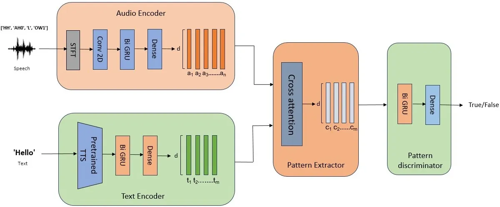
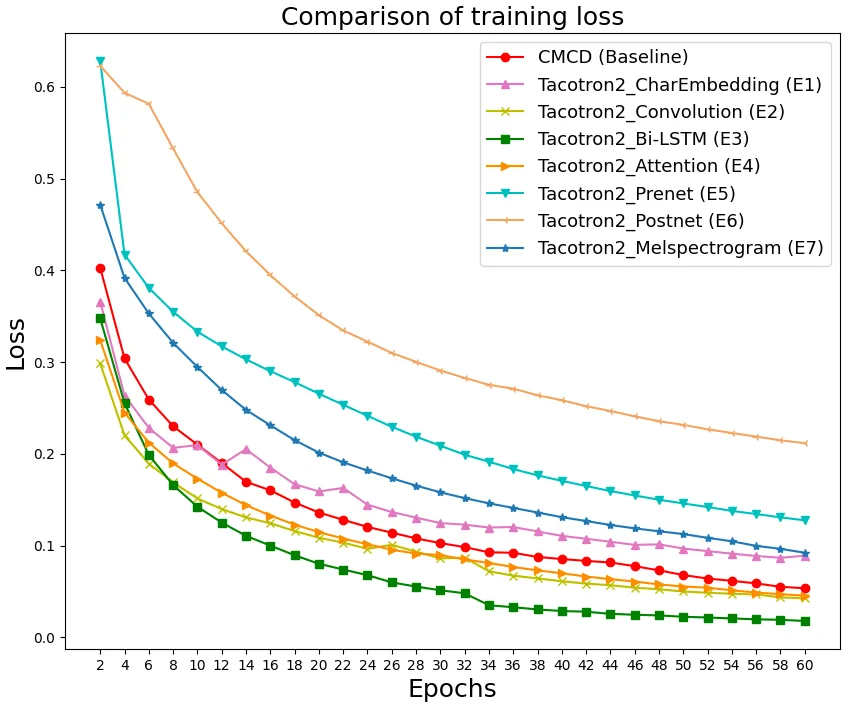

# Open Vocabulary Keyword Spotting through Transfer Learning from Speech Synthesis

Kesavaraj V    Anil Kumar Vuppala Affiliation: Speech Processing
Laboratory, LTRC, Affiliation: International Institute of Information
Technology Hyderabad, India
Affiliation: kesavaraj.v@research.iiit.ac.in, anil.vuppala@iiit.ac.in

###### Abstract

Identifying keywords in an open-vocabulary context is crucial for
personalizing interactions with smart devices. Previous approaches to
open vocabulary keyword spotting depend on a shared embedding space
created by audio and text encoders. However, these approaches suffer
from heterogeneous modality representations (i.e., audio-text mismatch).
To address this issue, our proposed framework leverages knowledge
acquired from a pre-trained text-to-speech (TTS) system. This knowledge
transfer allows for the incorporation of awareness of audio projections
into the text representations derived from the text encoder. The
performance of the proposed approach is compared with various baseline
methods across four different datasets. The robustness of our proposed
model is evaluated by assessing its performance across different word
lengths and in an Out-of-Vocabulary (OOV) scenario. Additionally, the
effectiveness of transfer learning from the TTS system is investigated
by analyzing its different intermediate representations. The
experimental results indicate that, in the challenging LibriPhrase Hard
dataset, the proposed approach outperformed the cross-modality
correspondence detector (CMCD) method by a significant improvement of
8.22% in area under the curve (AUC) and 12.56% in equal error rate
(EER).

Index Terms—Transfer learning, Text-to-Speech, Keyword spotting,
Tacotron 2

## I Introduction

Keyword spotting (KWS) is a process of detecting specific keywords
within a continuous audio stream, which is crucial for enabling
voice-driven interactions on edge devices \[1, 2\]. Increasing demand
for personalized voice assistants highlights the significance of
user-defined keyword spotting, which is known as custom keyword
detection or open vocabulary keyword spotting \[3, 4\]. In contrast to
closed vocabulary keyword spotting \[5\], where only predetermined
keywords are recognized, custom keyword spotting, deals with the
difficulty of identifying random keywords that the model might not have
been exposed to during training, introducing an additional level of
complexity to the task.

In the literature, there exist different methods for custom keyword
spotting. One such method is the query-by-example (QbyE) \[6, 7\]
approach, which involves matching input queries with pre-enrolled
examples. However, the effectiveness of the QbyE method relies heavily
on the similarity between the recorded speech during enrollment and the
subsequent evaluated speech recordings. Factors like diverse vocal
characteristics among users and environments with background noise pose
significant challenges that can impact the consistency of performance of
the QbyE method. In addressing this concern, researchers have delved
into text enrollment-based methods \[3, 8\]. One such method is the
automatic speech recognition-based approach \[9\], which detects
phonetic patterns in input streams and then compares them with enrolled
keyword representation. However, the effectiveness of this method
heavily depends on the accuracy of the acoustic model. In \[8\], an
attention-based cross-modal matching approach is proposed that is
trained in an end-to-end manner with monotonic matching loss and keyword
classification loss. In \[10\], a zero-shot KWS is proposed, coupled
with phoneme-level detection loss. Also, \[11\] introduced Dynamic
Sequence Partitioning to optimally partition the audio sequence to match
the length of the word-based text sequence. These recent end-to-end
techniques \[10, 11, 8\], primarily depend on evaluating speech and text
representations in a common latent space, demonstrated promising results
in the custom keyword spotting task. Therefore, we considered the
end-to-end approach for our investigation.

Fig. 1: Proposed architecture for open vocabulary keyword spotting

The effectiveness of the end-to-end approaches relies on the accuracy of
projecting audio and text representations into a shared embedding space.
While these methods \[8, 10\] project speech and text representations
into a shared latent space, they encounter difficulties in
distinguishing between pairs of closely related pronunciations. This
challenge can be addressed by generating text representations that have
some acoustic knowledge. On the other hand, a TTS model converts text to
audio, and the intermediate representations derived from this process
possess an understanding of audio projections. Consequently, insights
acquired from a pre-trained TTS model can serve as meaningful
representations of text. In \[12\], a similar approach is used to
transfer knowledge from a pre-trained TTS model for voice conversion
task. Hence, in this paper, a novel framework is introduced to distill
knowledge from a pre-trained TTS model for open-vocabulary keyword
spotting task. The contributions of this study can be summarized as
follows:

- •
  A novel strategy is proposed that leverages intermediate
  representations extracted from a pre-trained TTS model as valuable
  text representations for custom KWS tasks.
- •
  Extensive investigation is conducted on various outputs of
  intermediate layers of the pre-trained TTS model to assess the
  efficacy of transfer learning.
- •
  An ablation study is conducted to examine the system’s performance for
  keywords of different word lengths.
- •
  Additionally, the robustness of the proposed framework is analyzed in
  an OOV scenario.

The following sections of the paper are organized as follows: Section II
introduces the proposed method in this study. Section III provides
details about the experimental setup, Section IV presents the results
and discussion, and Section V concludes the study.

## II Proposed Method

This study introduces a novel methodology for open vocabulary keyword
spotting by leveraging knowledge from a pre-trained TTS model. In this
section, we describe the proposed architecture, as shown in Fig. 1. The
architecture consists of four submodules: text encoder, audio encoder,
pattern extractor, and pattern discriminator. The following sections
contain detailed information about individual modules.

### II-A Text Encoder

It consists of a pre-trained Tacotron 2 \[13\] model, a recurrent
sequence-to-sequence TTS system, which takes character sequence as input
for the corresponding keyword. The resulting intermediate
representations from the TTS model are then directed to a bidirectional
gated recurrent unit (Bi-GRU) layer with a dimension of 64. The
dimensions of the intermediate representations from the TTS model depend
on the specific layer from which they are extracted. Further details of
the intermediate representations are discussed in subsection III-B. The
output from the Bi-GRU layer is then fed to a dense layer of size 128
units. The output from the text encoder is denoted as
$`T_{E}\in\mathbb{R}^{d\times m}`$, where d and m denote the embedding
dimension and length of the text (i.e. number of characters),
respectively. The primary motivation for incorporating the pre-trained
TTS system into the text encoder is to generate text representations
that are aware of acoustic projections. This integration simplifies the
task of projecting audio and text embeddings in shared latent space.
Although this strategy does not explicitly involve generating audio from
text, but exploits knowledge transfer from intermediate representations
of TTS.

### II-B Audio Encoder

The input to the audio encoder is 80-dimensional mel-filterbank
coefficients, extracted for every 10ms with a 25ms window length. To
process this audio feature, the encoder consists of two 2-D convolution
layers (Conv 2D) with a kernel size of 3. The first convolution layer
consists of 32 filters, and the second convolution layer consists of 64
filters. Batch normalization is applied after each convolution layer to
ensure stable training. To improve computational efficiency, the initial
convolutional layer employs a stride of 2 to effectively reduce the
number of processed frames by skipping consecutive frames. Following the
convolution layers, two Bi-GRU layers each having a dimension of 64 are
employed. Subsequently, the output from the last Bi-GRU layer is passed
into a dense layer which generates a 128-dimensional audio embedding.
The output from the audio encoder is denoted as
$`A_{E}\in\mathbb{R}^{d\times n}`$, where d and n denote the embedding
dimension and length of the audio (i.e. number of frames), respectively.

|                 |         |       |         |         |         |       |         |         |
| --------------- | ------- | ----- | ------- | ------- | ------- | ----- | ------- | ------- |
| Method          | EER (%) |       |         |         | AUC (%) |       |         |         |
|                 | G       | Q     | LP\_(E) | LP\_(H) | G       | Q     | LP\_(E) | LP\_(H) |
| CTC \[7\]       | 31.65   | 18.23 | 14.67   | 35.22   | 66.36   | 89.69 | 92.29   | 69.58   |
| Attention \[6\] | 14.75   | 49.13 | 28.74   | 41.95   | 92.09   | 50.13 | 78.74   | 62.65   |
| Triplet \[3\]   | 35.6    | 38.72 | 32.75   | 44.36   | 71.48   | 66.44 | 63.53   | 54.88   |
| CMCD \[8\]      | 27.25   | 12.15 | 8.42    | 32.9    | 81.06   | 94.51 | 96.7    | 73.58   |
| Proposed        | 22.3    | 10.82 | 5.61    | 24.68   | 85.16   | 95.65 | 98.49   | 86.14   |

TABLE I: Performance comparison of the proposed method with various KWS
techniques across different datasets: Google Commands V1 (G), Qualcomm
Keyword Speech dataset (Q), LibriPhrase-Easy (LP*(E)), and
LibriPhrase-Hard (LP*(H)).

### II-C Pattern Extractor

It is based on the cross-attention mechanism \[14\] which captures the
temporal correlations between the audio and text embeddings. In this
setup, the audio embedding $`A_{E}`$ functions as both the key and
value, while the text embedding $`T_{E}`$ acts as the query. The output
of the pattern extractor is the context vector which contains
information about audio and text agreement.

### II-D Pattern Discriminator

It consists of a single Bi-GRU layer with a dimension of 128 that takes
the context vector from the cross-attention layer as input. Output from
the last frame of the Bi-GRU layer is fed into a dense layer with a
sigmoid as an activation function. The pattern discriminator determines
whether audio and text inputs share the same keyword or not.

## III Experimental Setup

This section describes the database, Tacotron 2 embeddings, and
implementation details for training.

### III-A Database

For training and evaluation, we used the Libriphrase \[8\] dataset,
which comprises short phrases with varying word lengths (1 to 4). The
dataset was generated from the Librispeech corpus \[15\]. The training
set of Libriphrase is generated using train-clean-100 and
train-clean-360 subsets, and the evaluation set is using
train-others-500 subset. The evaluation set consists of 4391, 2605, 467,
and 56 episodes of each word length respectively. Each episode has three
positive and three negative pairs. The negative samples are further
categorized into easy and hard based on Levenshtein distance \[16\],
leading to the creation of the Libriphrase Easy (LP*(E)) and Libriphrase
Hard (LP*(H)) datasets. Each sample in the dataset is represented by
using three entities: audio, text, and a binary target value indicating
1 for a positive pair and 0 for a negative pair.

To comprehensively evaluate model performance, we extended our
assessment beyond the Libriphrase dataset by incorporating the Google
Speech Commands V1 dataset (G) \[17\] and the Qualcomm Keyword Speech
dataset (Q) \[18\]. The Google Speech Commands V1 dataset (G)
encompasses speech recordings from 1,881 speakers, focusing on 30 small
keywords. On the other hand, the Qualcomm Keyword Speech dataset (Q)
comprises 4,270 utterances of four keywords spoken by 50 speakers.

### III-B Tacotron 2 Embeddings

In this study, the utilization of intermediate representation from
Tacotron 2 is proposed to enhance performance, particularly in scenarios
involving speech-keyword pairs with similar pronunciations. The
intermediate representations are obtained using NVIDIA Tacotron 2 model
\[19\] which is pre-trained on the LJSpeech dataset \[20\]. The details
of different intermediate representations that are used in this study
are outlined in Table II. Additional insights into the Tacotron 2
architecture can be found in \[13\]

| Embedding | Dimension           | Description                |
| --------- | ------------------- | -------------------------- |
| E1        | $`T_{a}\times 512`$ | CharEmbedding block output |
| E2        | $`T_{a}\times 512`$ | Convolution block output   |
| E3        | $`T_{a}\times 512`$ | Bi-LSTM block output       |
| E4        | $`T_{b}\times 512`$ | Attention block output     |
| E5        | $`T_{b}\times 512`$ | Prenet block output        |
| E6        | $`T_{b}\times 512`$ | Postnet block output       |
| E7        | $`T_{b}\times 80`$  | Target Melspectrogram      |

TABLE II: Description of intermediate representations of Tacotron 2
model. $`T_{a}-\text{number of characters}`$,
$`T_{b}-\text{number of frames derived from the Tacotron 2}`$.

|        |         |       |         |         |         |       |         |         |              |       |         |         |
| ------ | ------- | ----- | ------- | ------- | ------- | ----- | ------- | ------- | ------------ | ----- | ------- | ------- |
| Method | EER (%) |       |         |         | AUC (%) |       |         |         | F1 score (%) |       |         |         |
|        | G       | Q     | LP\_(E) | LP\_(H) | G       | Q     | LP\_(E) | LP\_(H) | G            | Q     | LP\_(E) | LP\_(H) |
| E1     | 31.44   | 19.32 | 9.26    | 32.13   | 74.84   | 88.77 | 96.29   | 74.67   | 69.23        | 81.45 | 91.2    | 64.86   |
| E2     | 26.43   | 14.52 | 7.11    | 28.47   | 80.66   | 93.02 | 97.67   | 79.6    | 74.2         | 79.83 | 93.26   | 67.78   |
| E3     | 22.3    | 10.82 | 5.61    | 24.68   | 85.16   | 95.65 | 98.49   | 86.14   | 78.56        | 87.74 | 94.5    | 72.2    |
| E4     | 24.6    | 15.27 | 8.43    | 31.2    | 81.83   | 90.63 | 96.61   | 76.25   | 74.77        | 68.23 | 91.7    | 67.54   |
| E5     | 27.51   | 19.98 | 12.02   | 34.35   | 79.71   | 87.55 | 94.5    | 71.77   | 66.42        | 72.58 | 86.94   | 71.41   |
| E6     | 34.61   | 33.14 | 20.9    | 39.19   | 69.95   | 72.81 | 87.06   | 65.29   | 66.32        | 66.85 | 78.51   | 61.47   |
| E7     | 25.42   | 23.79 | 11.68   | 34.7    | 81.14   | 84.5  | 94.57   | 70.97   | 73.14        | 71.2  | 87.5    | 66.78   |

TABLE III: Evaluation of different intermediate representations of
Tacotron 2 model for custom KWS task across different datasets: Google
Commands V1 dataset (G), Qualcomm Keyword Speech dataset (Q),
LibriPhrase-Easy dataset (LP*(E)), and LibriPhrase-Hard dataset (LP*(H))

### III-C Implementation Details

The training pipeline is structured as a binary classification task,
wherein the model is tasked with classifying the similarity of input
pairs {text, audio}. In audio and text encoders, weights are initialized
through Xavier initialization, and Leaky ReLU is utilized as the
activation function. A dropout of 0.2 is added after each layer in the
encoders to prevent overfitting. The training process uses binary
cross-entropy loss as the training criterion and employs the Adam
optimizer \[21\] with default parameters for optimization. A fixed
learning rate of $`10^{-4}`$ and a batch size of 128 is employed in the
training process. The best-performing model was chosen based on its
performance on the validation set. For training, we used four NVIDIA
GeForce RTX 2080 Ti GPUs.

## IV Results and Discussion

The proposed method explores intermediate representations from a
pre-trained TTS model to boost the initialization of the text encoder.
By tapping into the audio projections within the pre-trained TTS model,
we aim to enrich text representations for custom keyword spotting task.
We conducted extensive experiments across diverse datasets to evaluate
this approach, with results presented in Tables - I, III, IV, V.

Table I presents the comparative analysis of baselines and proposed
approach across G, Q, LP*(E), and LP*(H) datasets. Evaluation results
show that among all the baselines CMCD demonstrates strong performance
and Triplet shows weak performance across the Q, LP*(E), and LP*(H)
datasets, in terms of AUC and EER. On the other hand, the
attention-based QbyE method shows powerful performance on the G dataset,
which consists of frequently used words (e.g., ”on”, ”off”) as keywords.
This method benefits when the keyword is part of the training set due to
its similarity scoring mechanism, but it shows degraded performance when
the keyword is unfamiliar, as observed in Q and LibriPhrase. However,
our proposed approach outperforms all the baselines on all datasets
except G. It is also evident, in comparison with the CMCD baseline, the
proposed method showcases a significant improvement of 8.22 % in AUC and
12.56% in EER on the challenging LP\_(H) dataset which consists of
similar audio-text pairs (e.g., ”madame” and ”modem”). This substantial
improvement highlights the effectiveness of our method in better
discrimination of closely related pronunciations. Moreover, we measure
the generalization of the model on G and Q datasets, without any
finetuning. We find a consistent improvement of around 3% on the AUC
metric and 2.62% on the EER metric across G and Q datasets when compared
with the CMCD baseline.

Further, to assess the efficacy of transfer learning from pre-trained
TTS for custom KWS task, an ablation study is conducted. This study
compares embeddings obtained from various intermediate layers of the
Tacotron-2 model, and results of this comparison are reported in
Table III. Analyzing the results, E3 consistently outperforms others in
terms of lower Equal Error Rate (EER) and higher AUC and F1-score across
all datasets. This suggests it captures both acoustic and linguistic
information of the enrolled keyword more effectively. Moreover, E4 and
E2 exhibit competitive performance with consistently good AUC scores,
signifying them as better alternatives to E3. Conversely, E6 shows poor
performance compared to other layer embeddings, indicating its
limitations for this task. Additionally, it can be inferred that
intermediate representations (E2, E3) from the Tacotron 2 encoder seem
to be significantly more suitable for the custom KWS task in comparison
to representations (E5, E6, E7) from the Tacontron 2 decoder. This
implies that capturing information before mel-spectrogram generation in
the encoder stage is crucial for accurate keyword detection.

| Word length | EER (%) | AUC (%) | F1 score (%) |
| ----------- | ------- | ------- | ------------ |
| 1           | 5.41    | 98.07   | 94.46        |
| 2           | 5.9     | 97.83   | 94.24        |
| 3           | 7.59    | 97.04   | 92.28        |
| 4           | 8.5     | 97.12   | 90.85        |

TABLE IV: Performance of the proposed approach across different word
lengths

Table IV presents the performance analysis of the proposed system across
various word lengths. The evaluation of a system across different word
lengths (1 to 4) reveals that shorter words (1 or 2) result in better
performance, with lower EER and higher F1-score suggesting higher
accuracy in keyword identification. As word length increases, EER values
rise, indicating increased difficulty in recognition. However, our
method exhibits consistent performance across all word lengths.
Additionally, to assess the robustness of the proposed system, we
compared its performance in the OOV scenario. From Table V, it is
evident that, in comparison to the CMCD baseline method, the proposed
method shows an absolute improvement of 7.25%, 6.36%, and 5.53% in terms
of F1 score, AUC and EER, respectively. This signifies the effectiveness
of the proposed system in handling user-defined keywords that are not
seen during training.

| Method   | EER (%) | AUC (%) | F1 score (%) |
| -------- | ------- | ------- | ------------ |
| CMCD     | 23.48   | 84.08   | 76.2         |
| Proposed | 18.14   | 90.44   | 83.45        |

TABLE V: Comparison of CMCD and proposed approach in Out-of-Vocabulary
scenario.

Fig. 2: Comparison of training loss - CMCD vs Tacotron 2 representations

Additionally, an interesting observation was made that the proposed
network, utilizing intermediate representations extracted from E3,
exhibits faster convergence, as illustrated in Fig. 2.

## V Conclusion

This study presented an end-to-end architecture for open vocabulary
keyword spotting that leverages insights from a pre-trained TTS system.
The proposed approach exhibited competitive performance compared to
baseline methods across four different datasets. Notably, it showcases
its potential in distinguishing similar pronunciations of audio-text
pairs in the Libriphrase hard dataset. The ablation study on
intermediate layers of the Tacotron 2 model revealed that E3 (Bi-LSTM
block output) exhibited the best performance and faster convergence
during training. Moreover, the proposed approach showed consistent
performance in keyword identification regardless of the word lengths
considered and demonstrated its robustness in the OOV condition. In
future work, the focus will be on optimizing the knowledge transfer
effectively by exploring effective strategies to utilize all
intermediate layers of the TTS model rather than relying on a single
layer.

## References

- \[1\] Iván López-Espejo, Zheng-Hua Tan, John Hansen and Jesper Jensen
  “Deep spoken keyword spotting: An overview” In _IEEE Access_ 10 IEEE,
  2021, pp. 4169–4199
- \[2\] Raphael Tang and Jimmy Lin “Deep residual learning for
  small-footprint keyword spotting” In _Proc. ICASSP_, 2018, pp.
  5484–5488 IEEE
- \[3\] Niccolo Sacchi, Alexandre Nanchen, Martin Jaggi and Milos Cernak
  “Open-vocabulary keyword spotting with audio and text embeddings” In
  _INTERSPEECH 2019-IEEE International Conference on Acoustics, Speech,
  and Signal Processing_, 2019
- \[4\] Krishna Gurugubelli, Sahil Mohamed and Rajesh KS “Comparative
  Study of Tokenization Algorithms for End-to-End Open Vocabulary
  Keyword Detection” In _Proc. ICASSP_, 2024, pp. 12431–12435 IEEE
- \[5\] Tara. Sainath and Carolina Parada “Convolutional neural networks
  for small-footprint keyword spotting” In _Proc. Interspeech_, 2015,
  pp. 1478–1482
- \[6\] Jinmiao Huang, Waseem Gharbieh, Han Shim and Eugene Kim
  “Query-by-example keyword spotting system using multi-head attention
  and soft-triple loss” In _Proc. ICASSP_, 2021, pp. 6858–6862 IEEE
- \[7\] L. Lugosch, S. Myer and V.. Tomar “DONUT: CTC-based
  Query-by-Example Keyword Spotting” In _NeurIPS Workshop on
  Interpretability and Robustness in Audio, Speech, and Language_, 2018
- \[8\] Hyeon-Kyeong Shin et al. “Learning Audio-Text Agreement for
  Open-vocabulary Keyword Spotting” In _Proc. INTERSPEECH_, 2022, pp.
  1871–1875
- \[9\] Zuozhen Liu, Ta Li and Pengyuan Zhang “Neural keyword confidence
  estimation for open-vocabulary keyword spotting” In _Electronics
  Letters_ 58.3 IET, 2021, pp. 133–135
- \[10\] Yong-Hyeok Lee and Namhyun Cho “PhonMatchNet: Phoneme-Guided
  Zero-Shot Keyword Spotting for User-Defined Keywords” In _Proc.
  INTERSPEECH_, 2023, pp. 3964–3968
- \[11\] Kumari Nishu, Minsik Cho and Devang Naik “Matching Latent
  Encoding for Audio-Text based Keyword Spotting” In _Proc.
  INTERSPEECH_, 2023, pp. 1613–1617
- \[12\] Wen-Chin Huang et al. “Voice Transformer Network:
  Sequence-to-Sequence Voice Conversion Using Transformer with
  Text-to-Speech Pretraining” In _Proc. Interspeech_, 2020, pp.
  4676–4680
- \[13\] Jonathan Shen et al. “Natural tts synthesis by conditioning
  wavenet on mel spectrogram predictions” In _Proc. ICASSP_, 2018, pp.
  4779–4783 IEEE
- \[14\] Ashish Vaswani et al. “Attention is all you need” In _Advances
  in neural information processing systems_ 30, 2017
- \[15\] Vassil Panayotov, Guoguo Chen, Daniel Povey and Sanjeev
  Khudanpur “Librispeech: an asr corpus based on public domain audio
  books” In _Proc. ICASSP_, 2015, pp. 5206–5210 IEEE
- \[16\] Vladimir Levenshtein “Binary codes capable of correcting
  deletions, insertions, and reversals” In _Soviet physics doklady_
  10.8, 1966, pp. 707–710 Soviet Union
- \[17\] Pete Warden “Speech commands: A dataset for limited-vocabulary
  speech recognition” In _arXiv preprint arXiv:1804.03209_, 2018
- \[18\] Byeonggeun Kim et al. “Query-by-example on-device keyword
  spotting” In _Proc. ASRU_, 2019, pp. 532–538 IEEE
- \[19\] NVIDIA Corporation “Pretrained Tacotron2 model”,
  [https://github.com/NVIDIA/tacotron2](https://github.com/NVIDIA/tacotron2)
- \[20\] Keith Ito “The LJ Speech Dataset”,
  [https://keithito.com/LJ-Speech-Dataset/](https://keithito.com/LJ-Speech-Dataset/),
  2017
- \[21\] Diederik Kingma and Jimmy Ba “Adam: A method for stochastic
  optimization” In _arXiv preprint arXiv:1412.6980_, 2014
