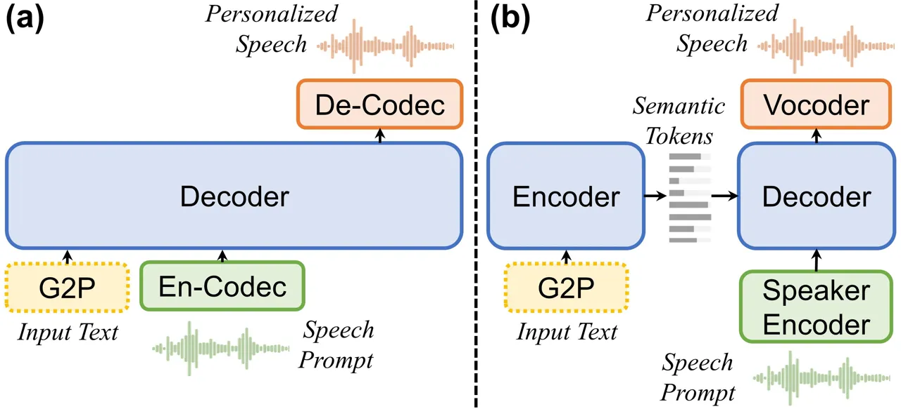
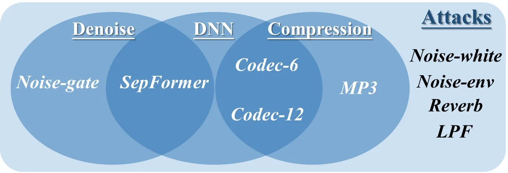
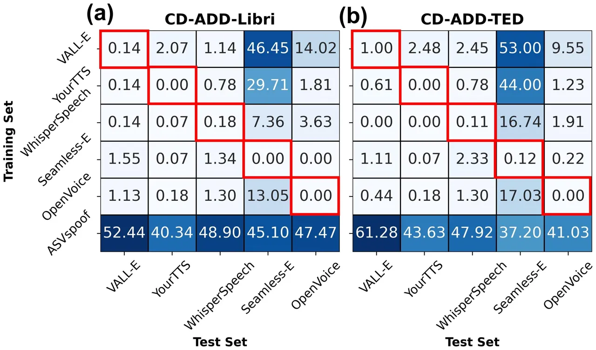
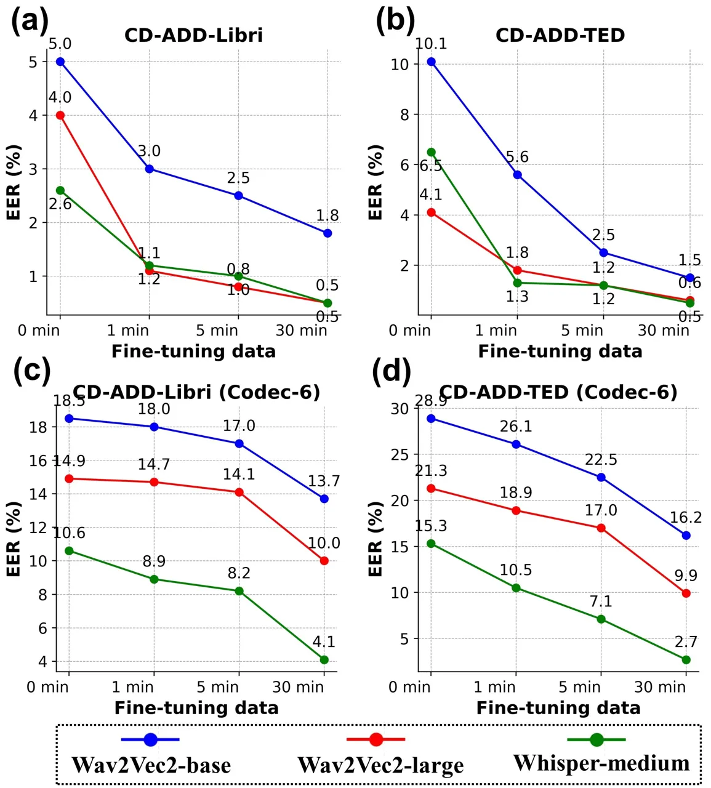

# Cross-Domain Audio Deepfake Detection: Dataset and Analysis

Yuang Li    Min Zhang    Mengxin Ren    Miaomiao Ma    Daimeng Wei   
Hao Yang Affiliation: Huawei Translation Services Center, China
Affiliation: {liyuang3, zhangmin186, renmengxin2, mamiaomiao,
Affiliation: weidaimeng, yanghao30}@huawei.com

###### Abstract

Audio deepfake detection (ADD) is essential for preventing the misuse of
synthetic voices that may infringe on personal rights and privacy.
Recent zero-shot text-to-speech (TTS) models pose higher risks as they
can clone voices with a single utterance. However, the existing ADD
datasets are outdated, leading to suboptimal generalization of detection
models. In this paper, we construct a new cross-domain ADD dataset
comprising over 300 hours of speech data that is generated by five
advanced zero-shot TTS models. To simulate real-world scenarios, we
employ diverse attack methods and audio prompts from different datasets.
Experiments show that, through novel attack-augmented training, the
Wav2Vec2-large and Whisper-medium models achieve equal error rates of
4.1% and 6.5% respectively. Additionally, we demonstrate our models’
outstanding few-shot ADD ability by fine-tuning with just one minute of
target-domain data. Nonetheless, neural codec compressors greatly affect
the detection accuracy, necessitating further research. Our dataset is
publicly available ¹¹ 1
[https://github.com/leolya/CD-ADD](https://github.com/leolya/CD-ADD).

## 1 Introduction

Audio deepfakes, created by text-to-speech (TTS) and voice conversion
(VC) models, pose severe risks to social stability by spreading
misinformation, violating privacy, and undermining trust. For advanced
TTS models, the subjective score of the synthetic speech can surpass
that of the authentic speech Ju et al. (2024) and humans are often
unable to recognize deepfake audio Müller et al. (2022); Cooke et al.
(2024). Consequently, it is imperative to develop robust audio deepfake
detection (ADD) models capable of identifying imperceptible anomalies.

Several datasets built upon various TTS and VC models have been released
to benchmark the ADD task Yi et al. (2022); Yamagishi et al. (2021);
Frank and Schönherr (2021); Wang et al. (2020); Yi et al. (2023).
However, these datasets mainly include the traditional TTS models rather
than the emerging zero-shot TTS models. Moreover, there is a lack of
transparency regarding the specific types of models used within these
datasets, hindering comprehensive analysis of cross-model performance.
Additionally, the range of attacks these datasets consider is confined
to conventional methods, excluding attacks associated with deep neural
networks (DNNs), such as noise reduction and neural codec models. Based
on the aforementioned datasets, a multitude of detection models have
been proposed. These models incorporate diverse features, such as the
traditional linear frequency cepstral coefficient Yan et al. (2022) and
features derived from self-supervised learning Zeng et al. (2023);
Martín-Doñas and Álvarez (2022), emotion recognition Conti et al.
(2022), and speaker identification models Pan et al. (2022). These
studies mainly concentrate on a single benchmark dataset. To demonstrate
generalization capabilities, several studies have implemented
cross-dataset evaluation Müller et al. (2022); Ba et al. (2023).
Furthermore, to enhance the models’ generalizability, researchers have
explored the combination of data from various sources Kawa et al. (2022)
and the integration of multiple features Yang et al. (2024).

In this paper, we present a novel cross-domain ADD (CD-ADD) dataset,
which encompasses more than 300 hours of speech data generated by five
cutting-edge, zero-shot TTS models. We test nine different attacks,
including those involving DNN-based codecs and noise reduction models.
For cross-domain evaluation, rather than adopting the naive
cross-dataset scenario, we formulate a unique task for zero-shot TTS
models by analyzing pairwise cross-model performance and utilizing audio
prompts from different domains. Experiments reveal: 1) The cross-domain
task is challenging. 2) Training with attacks improves adaptability. 3)
The ADD model is superior in the few-shot scenario. 4) The neural codec
poses a major threat.

Figure 1: Zero-shot TTS architectures. a) Decoder-only. b)
Encoder-decoder.

## 2 Methods

### 2.1 Dataset Construction

As shown in Figure 1, we can categorize the zero-shot TTS models into
two types: 1) Decoder-only (VALL-E Wang et al. (2023)): It accepts
phoneme representations and the speech prompt’s discrete codes as input,
and generates output speech codes autoregressively. These codes are
transformed into personalized speech signals. 2) Encoder-decoder
(YourTTS Casanova et al. (2022), WhisperSpeech Kharitonov et al. (2023),
Seamless Expressive Barrault et al. (2023), and OpenVoice Qin et al.
(2023)): An encoder extracts semantic information, while a decoder
incorporates speaker embeddings from the speech prompt. Together with
the vocoder, the autoregressive (AR) or non-autoregressive (NAR) decoder
generates personalized speeches. When the encoder is trained to remove
speaker-specific information from the input speech, it transforms into a
VC model.

For zero-shot TTS, AR decoding may introduce instability, leading to
errors such as missing words. Poor-quality speech prompts, characterized
by high noise levels, can result in unintelligible output. To address
this, we enforce quality control during dataset construction
(Algorithm 1). Specifically, we utilize an automatic speech recognition
(ASR) model to predict the transcription of the generated speech. If the
character error rate (CER) exceeds the threshold, we regenerate the
speech using alternative prompts. Utterances are discarded if the CER
remains above the threshold after a predefined number of retries.
Prompts from different domains are used to evaluate the generalizability
of ADD models. Our dataset introduces two tasks: 1) In-model ADD
considers all models during both training and testing. 2) Cross-model
ADD excludes data from one TTS model during training and uses data from
this TTS model only during testing.

ADD models should generalize to in-the-wild synthetic data, which
requires a well-designed cross-model evaluation that can represent the
real-world scenario. To select the appropriate TTS model for testing, we
conduct a pairwise cross-model evaluation, where the Wav2Vec2-base model
is trained exclusively on the data produced by a single TTS model and
subsequently evaluated on the datasets generated by alternative TTS
models. We identify the TTS model that poses the greatest challenge, as
evidenced by the high equal error rate (EER), and use it as the test
set.

0:  $`prompts,text,retry,threshold`$

1:  $`i\leftarrow 0`$

2:  $`success\leftarrow False`$

3:  while $`i<retry`$ do

4:   $`p\leftarrow random\_select(prompts)`$

5:   $`audio\leftarrow TTS(text,p)`$

6:   $`\hat{text}\leftarrow ASR(audio)`$

7:   if $`CER(text,\hat{text})<threshold`$ then

8:    $`success\leftarrow True`$

9:    break

10:   end if

11:   $`i\leftarrow i+1`$

12:  end while

13:  return $`audio,success`$

Algorithm 1 Dataset construction

### 2.2 Attacks

Figure 2: Categories of tested attacks.

Figure 2 presents the nine attacks we test. For traditional attacks, we
add white Gaussian noise (Noise-white) and environmental noise
(Noise-env) Maciejewski et al. (2020) with a signal-to-noise ratio
ranging from 15dB to 20dB, use artificial reverberation (Reverb) with a
duration of 0.2 to 0.4 seconds, and apply a low-pass filter (LPF) within
the 4kHz to 8kHz range. Furthermore, we employ lossy compression methods
such as MP3 and a DNN-based Encodec model Défossez et al. (2022)
operating at bit rates of 6kbps (Codec-6) and 12kbps (Codec-12). In
terms of noise reduction, we utilize the conventional noise gate
approach to eliminate stationary noise and the time-domain SepFormer
model Subakan et al. (2021).

### 2.3 ADD Methods

We fine-tune pre-trained speech encoders for the ADD task, namely,
Wav2Vec2 Baevski et al. (2020) and the Whisper encoder Radford et al.
(2022). We merge multi-layer features by using learnable weights, and
employ a classifier head with two projection layers and one global
pooling layer to obtain the final logits. To adapt the model to attacks,
we consider all attacks with the same probability on-the-fly during
training. We also consider a few-shot scenario, where we extend the
cross-model evaluation by fine-tuning the ADD model with just one minute
of target-domain speech data. This experiment simulates a situation
where only the limited synthetic speech from a TTS model is available,
such as the speech from a demo website or a single video.

## 3 Experimental Setups

The training set for the CD-ADD dataset was generated using the
train-clean-100 subset of LibriTTS Zen et al. (2019), and the dev-clean
and test-clean subsets of LibriTTS, along with the test set of
TEDLium3 Hernandez et al. (2018), were utilized for the evaluation
datasets. The transcriptions were used as the input text, and the real
speech signals were used as the real samples and the speech prompts. For
dataset construction, we used the five zero-shot TTS models mentioned in
Section 2.1, a CER threshold of 10%, and a maximum retry limit of five.
For cross-model evaluation, the speech from Seamless Expressive served
as the test set. Appendix A provides comprehensive details on the TTS
model checkpoints and the models used for attacks, and Appendix B
presents the specific statistics of the CD-ADD dataset that is comprised
of over 300 hours of training data and 50 hours of test data.

For the ADD task, we combined our CD-ADD dataset with the
ASVSpoof2019 Wang et al. (2020) training set and fine-tuned the base
model, which includes Wav2Vec2 Baevski et al. (2020) and the Whisper
encoder Radford et al. (2022), for four epochs with a learning rate of
$`3e-5`$ and a batch size of 128. For attack-augmented training, we
increased the number of epochs to eight, as the model converges more
slowly due to attacks. The probability of each attack was 10% and only
one attack type was used for each utterance. For the evaluation metric,
we adopted the widely used equal error rate (EER).

## 4 Experimental Results

### 4.1 Pairwise Cross-Model Evaluation

Figure 3: Cross-model EER matrix, where the Wav2Vec2-base model was
trained using data generated from a single TTS model and subsequently
evaluated on data originating from other TTS models.

|             | Training data     | Libri | TED   |
| ----------- | ----------------- | ----- | ----- |
| In-model    | CD-ADD            | 0.11  | 0.35  |
|             | CD-ADD + ASVspoof | 0.07  | 0.12  |
| Cross-model | CD-ADD            | 12.14 | 20.34 |
|             | CD-ADD + ASVspoof | 7.85  | 21.40 |

Table 1: Performance of Wav2Vec2-base measured by EER (%).

As illustrated in Figure 3, the pairwise evaluation indicates that the
ADD system exhibits optimal performance when both the training and
testing sets are derived from the same TTS model. This trend holds true
irrespective of the speech prompts’ domain (whether they originate from
the in-domain LibriTTS dataset or the cross-domain TEDLium dataset),
with the EERs consistently remaining below 1%. However, in the
cross-model evaluation, the EERs vary significantly among different TTS
model combinations. For example, the Wav2Vec2-base model fine-tuned with
YourTTS-synthesized data can generalize to VALL-E-synthesized data,
achieving EERs of 0.14% and 0.61% for the Libri and TED subsets of the
CD-ADD test sets, respectively. However, it struggles to generalize to
the Seamless Expressive model, resulting in much higher EERs of 29.71%
and 44.00%. This indicates that randomly choosing a test set whose
speech data is generated by a TTS model could result in overestimated
generalizability of the ADD model, due to shared artifacts between TTS
models and potential overfitting. Therefore, we selected Seamless
Expressive as the test set as it has notably high EERs. It is worth
noting that the model trained on the prevalent ASVSpoof dataset fails to
generalize to the zero-shot TTS models. However, combining ASVspoof with
the CD-ADD dataset can slightly improve the performance (Table 1), so
these two datasets are combined by default.

### 4.2 Comparisons Between Attacks

|             |             |           |             |             |
| ----------- | ----------- | --------- | ----------- | ----------- |
| Attack      | In-model    |           | Cross-model |             |
|             |             | \+ Aug.   |             | \+ Aug.     |
| Baseline    | 0.1 / 0.1   | 0.0 / 0.1 | 7.9 / 21.4  | 5.0 / 10.1  |
| Noise-white | 9.4 / 9.1   | 0.8 / 0.7 | 34.7 / 45.0 | 9.9 / 10.3  |
| Noise-env   | 9.0 / 4.7   | 0.5 / 0.3 | 29.2 / 31.1 | 9.4 / 9.3   |
| Reverb      | 13.0 / 17.1 | 1.1 / 1.2 | 29.6 / 33.1 | 18.1 / 23.7 |
| LPF         | 1.3 / 1.2   | 0.1 / 0.3 | 14.3 / 23.4 | 6.6 / 8.9   |
| MP3         | 0.3 / 0.2   | 0.0 / 0.1 | 13.2 / 22.1 | 5.4 / 8.3   |
| Codec-12    | 2.9 / 1.4   | 0.3 / 0.3 | 21.4 / 31.0 | 11.4 / 18.3 |
| Codec-6     | 7.4 / 5.2   | 0.9 / 1.2 | 30.5 / 35.2 | 18.5 / 28.9 |
| Noise-gate  | 11.8 / 6.5  | 0.9 / 1.1 | 33.7 / 27.7 | 12.3 / 14.5 |
| SepFormer   | 1.0 / 2.8   | 0.1 / 0.4 | 9.2 / 12.6  | 3.3 / 5.5   |

Table 2: Performance of Wav2Vec2-base under various attacks measured by
EER (%) on Libri and TED test sets respectively. "+Aug." indicates all
attacks are included during training.

Figure 4: Few-shot performance of three base models measured by EER (%).

As shown in Table 2, without augmentation, all attacks negatively impact
the model, with more noticeable effects in cross-model configurations.
With attack-augmented training, the Wav2Vec2-base model demonstrates
resilience against most attacks. In the in-model setup, the EERs of the
attacked models are only slightly higher than the baseline. In the
cross-model setup, a significant decrease in EERs is observed for the
augmented model compared to the non-augmented model. Notably, certain
attacks improve the ADD model’s generalizability, as indicated by the
reduced EERs in the TED subset. For example, compared with the EER of
10.1% for the baseline, the LPF reduces the EER to 8.9%, the MP3
compression reduces the EER to 8.3%, and the SepFormer reduces the EER
to 5.5%. All these attacks remove spectral information and force the ADD
model to rely more on features from the low-frequency band, thus
mitigating overfitting. However, certain attacks, such as reverberation
and the Encodec, lead to relatively high EERs. The encoder-decoder
architecture and the vector quantization of the Encodec, especially at
lower bit rates, have the potential to obliterate essential features for
detecting synthetic speeches.

### 4.3 Results of Few-Shot Fine-Tuning

Figure 4 compares the cross-model ADD performance of three base models:
Wav2Vec2-base, Wav2Vec2-large, and Whisper-medium. The Wav2Vec2-large
and the Whisper-medium models have similar performance, notably superior
to the Wav2Vec2-base model (Figure 4 (a, b)). With the most challenging
Encodec attack, the Whisper model performs significantly better than the
Wav2Vec2 models (Figure 4 (c, d)). We can also observe that with only
one minute of in-domain data from Seamless Expressive, the EER can be
reduced significantly. This suggests that our models are capable of fast
adaptation to in-the-wild TTS systems with just a few samples from a
demo website or a video, which is crucial for real-world deployment.
However, we find that in-domain fine-tuning is less effective when the
audio is compressed with the Encodec, as the reduction in EER is less
significant.

## 5 Conclusion

In conclusion, our study presents a CD-ADD dataset, addressing the
urgent need for up-to-date resources to combat the evolving risks of
zero-shot TTS technologies. Our dataset, comprising over 300 hours of
data from advanced TTS models, enhances model generalization and
reflects real-world conditions. This paper highlights the risks of
attacks and the potential of few-shot learning in ADD, facilitating
future research.

## 6 Limitation

The current CD-ADD dataset is limited to five zero-shot TTS models.
Future expansions are planned to include a broader range of zero-shot
TTS models, as well as conventional TTS and VC models, to improve the
dataset diversity. Additionally, the attack-augmented training is
constrained to a single attack per sample, with separate analysis
conducted for each attack. Subsequent research will focus on
investigating the effects of combined attacks. Furthermore, the
performance in ADD tasks with audio compressed by neural codecs is
suboptimal, requiring the development of optimization strategies and the
exploration of more neural codec models.

## References

- Ba et al. (2023) Zhongjie Ba, Qing Wen, Peng Cheng, Yuwei Wang, Feng
  Lin, Li Lu, and Zhenguang Liu. 2023. Transferring audio deepfake
  detection capability across languages. In _Proc. ACM Web_, pages
  2033–2044.
- Baevski et al. (2020) A. Baevski, Y. Zhou, A. Mohamed, and
  M. Auli. 2020. Wav2Vec 2.0: A framework for self-supervised learning
  of speech representations. _Proc. NeurIPS_.
- Barrault et al. (2023) Loïc Barrault, Yu-An Chung, Mariano Coria
  Meglioli, David Dale, Ning Dong, Mark Duppenthaler, Paul-Ambroise
  Duquenne, Brian Ellis, Hady Elsahar, Justin Haaheim, et al. 2023.
  Seamless: Multilingual expressive and streaming speech translation.
  _arXiv preprint arXiv:2312.05187_.
- Casanova et al. (2022) Edresson Casanova, Julian Weber, Christopher D
  Shulby, Arnaldo Candido Junior, Eren Gölge, and Moacir A Ponti. 2022.
  Yourtts: Towards zero-shot multi-speaker tts and zero-shot voice
  conversion for everyone. In _Proc. ICML_, pages 2709–2720. PMLR.
- Conti et al. (2022) Emanuele Conti, Davide Salvi, Clara Borrelli,
  Brian Hosler, Paolo Bestagini, Fabio Antonacci, Augusto Sarti,
  Matthew C Stamm, and Stefano Tubaro. 2022. Deepfake speech detection
  through emotion recognition: a semantic approach. In _Proc. ICASSP_,
  pages 8962–8966. IEEE.
- Cooke et al. (2024) Di Cooke, Abigail Edwards, Sophia Barkoff, and
  Kathryn Kelly. 2024. As good as a coin toss human detection of
  ai-generated images, videos, audio, and audiovisual stimuli. _arXiv
  preprint arXiv:2403.16760_.
- Défossez et al. (2022) Alexandre Défossez, Jade Copet, Gabriel
  Synnaeve, and Yossi Adi. 2022. High fidelity neural audio compression.
  _arXiv preprint arXiv:2210.13438_.
- Frank and Schönherr (2021) Joel Frank and Lea Schönherr. 2021.
  Wavefake: A data set to facilitate audio deepfake detection. In _Proc.
  NeurIPS_.
- Hernandez et al. (2018) François Hernandez, Vincent Nguyen, Sahar
  Ghannay, Natalia Tomashenko, and Yannick Esteve. 2018. Ted-lium 3:
  Twice as much data and corpus repartition for experiments on speaker
  adaptation. In _Proc. SPECOM_, pages 198–208. Springer.
- Ju et al. (2024) Zeqian Ju, Yuancheng Wang, Kai Shen, Xu Tan, Detai
  Xin, Dongchao Yang, Yanqing Liu, Yichong Leng, Kaitao Song, Siliang
  Tang, et al. 2024. Naturalspeech 3: Zero-shot speech synthesis with
  factorized codec and diffusion models. _arXiv preprint
  arXiv:2403.03100_.
- Kawa et al. (2022) Piotr Kawa, Marcin Plata, and Piotr Syga. 2022.
  Attack agnostic dataset: Towards generalization and stabilization of
  audio deepfake detection.
- Kharitonov et al. (2023) Eugene Kharitonov, Damien Vincent, Zalán
  Borsos, Raphaël Marinier, Sertan Girgin, Olivier Pietquin, Matt
  Sharifi, Marco Tagliasacchi, and Neil Zeghidour. 2023. Speak, read and
  prompt: High-fidelity text-to-speech with minimal supervision.
  _Transactions of the Association for Computational Linguistics_,
  11:1703–1718.
- Maciejewski et al. (2020) Matthew Maciejewski, Gordon Wichern, Emmett
  McQuinn, and Jonathan Le Roux. 2020. Whamr!: Noisy and reverberant
  single-channel speech separation. In _Proc. ICASSP_, pages 696–700.
  IEEE.
- Martín-Doñas and Álvarez (2022) Juan M Martín-Doñas and Aitor
  Álvarez. 2022. The vicomtech audio deepfake detection system based on
  wav2vec2 for the 2022 add challenge. In _Proc. ICASSP_, pages
  9241–9245. IEEE.
- Müller et al. (2022) Nicolas Müller, Pavel Czempin, Franziska
  Diekmann, Adam Froghyar, and Konstantin Böttinger. 2022. Does audio
  deepfake detection generalize? _Interspeech 2022_.
- Pan et al. (2022) Jiahui Pan, Shuai Nie, Hui Zhang, Shulin He, Kanghao
  Zhang, Shan Liang, Xueliang Zhang, and Jianhua Tao. 2022. Speaker
  recognition-assisted robust audio deepfake detection. In _Proc.
  Interspeech_, pages 4202–4206.
- Qin et al. (2023) Zengyi Qin, Wenliang Zhao, Xumin Yu, and Xin
  Sun. 2023. Openvoice: Versatile instant voice cloning. _arXiv preprint
  arXiv:2312.01479_.
- Radford et al. (2022) Alec Radford, Jong Wook Kim, Tao Xu, Greg
  Brockman, Christine McLeavey, and Ilya Sutskever. 2022. Robust speech
  recognition via large-scale weak supervision. _arXiv preprint
  arXiv:2212.04356_.
- Subakan et al. (2021) Cem Subakan, Mirco Ravanelli, Samuele Cornell,
  Mirko Bronzi, and Jianyuan Zhong. 2021. Attention is all you need in
  speech separation. In _Proc. ICASSP_, pages 21–25. IEEE.
- Wang et al. (2023) Chengyi Wang, Sanyuan Chen, Yu Wu, Ziqiang Zhang,
  Long Zhou, Shujie Liu, Zhuo Chen, Yanqing Liu, Huaming Wang, Jinyu Li,
  et al. 2023. Neural codec language models are zero-shot text to speech
  synthesizers. _arXiv preprint arXiv:2301.02111_.
- Wang et al. (2020) Xin Wang, Junichi Yamagishi, Massimiliano Todisco,
  Héctor Delgado, Andreas Nautsch, Nicholas Evans, Md Sahidullah, Ville
  Vestman, Tomi Kinnunen, Kong Aik Lee, et al. 2020. Asvspoof 2019: A
  large-scale public database of synthesized, converted and replayed
  speech. _Computer Speech & Language_, 64:101114.
- Yamagishi et al. (2021) Junichi Yamagishi, Xin Wang, Massimiliano
  Todisco, Md Sahidullah, Jose Patino, Andreas Nautsch, Xuechen Liu,
  Kong Aik Lee, Tomi Kinnunen, Nicholas Evans, et al. 2021. Asvspoof
  2021: accelerating progress in spoofed and deepfake speech detection.
  In _ASVspoof 2021 Workshop-Automatic Speaker Verification and Spoofing
  Coutermeasures Challenge_.
- Yan et al. (2022) Rui Yan, Cheng Wen, Shuran Zhou, Tingwei Guo, Wei
  Zou, and Xiangang Li. 2022. Audio deepfake detection system with
  neural stitching for add 2022. In _ICASSP 2022-2022 IEEE International
  Conference on Acoustics, Speech and Signal Processing (ICASSP)_, pages
  9226–9230. IEEE.
- Yang et al. (2024) Yujie Yang, Haochen Qin, Hang Zhou, Chengcheng
  Wang, Tianyu Guo, Kai Han, and Yunhe Wang. 2024. A robust audio
  deepfake detection system via multi-view feature. In _Proc. ICASSP_,
  pages 13131–13135. IEEE.
- Yi et al. (2022) Jiangyan Yi, Ruibo Fu, Jianhua Tao, Shuai Nie, Haoxin
  Ma, Chenglong Wang, Tao Wang, Zhengkun Tian, Ye Bai, Cunhang Fan,
  et al. 2022. Add 2022: the first audio deep synthesis detection
  challenge. In _Proc. ICASSP_, pages 9216–9220. IEEE.
- Yi et al. (2023) Jiangyan Yi, Jianhua Tao, Ruibo Fu, Xinrui Yan,
  Chenglong Wang, Tao Wang, Chu Yuan Zhang, Xiaohui Zhang, Yan Zhao,
  Yong Ren, et al. 2023. Add 2023: the second audio deepfake detection
  challenge. _arXiv preprint arXiv:2305.13774_.
- Zen et al. (2019) Heiga Zen, Viet Dang, Rob Clark, Yu Zhang, Ron J
  Weiss, Ye Jia, Zhifeng Chen, and Yonghui Wu. 2019. Libritts: A corpus
  derived from librispeech for text-to-speech. _Proc. Interspeech_.
- Zeng et al. (2023) Xiao-Min Zeng, Jiang-Tao Zhang, Kang Li, Zhuo-Li
  Liu, Wei-Lin Xie, and Yan Song. 2023. Deepfake algorithm recognition
  system with augmented data for add 2023 challenge. In _Proc. IJCAI
  Workshop on Deepfake Audio Detection and Analysis_.

## Appendix A Appendix: Open Source Tools

Zero-shot TTS models:

- •
  VALL-E:
  [https://github.com/Plachtaa/VALL-E-X](https://github.com/Plachtaa/VALL-E-X)
- •
  YourTTS:
  [https://github.com/coqui-ai/TTS](https://github.com/coqui-ai/TTS)
- •
  Seamless Expressive:
  [https://github.com/facebookresearch/seamless_communication](https://github.com/facebookresearch/seamless_communication)
- •
  WhisperSpeech:
  [https://github.com/collabora/WhisperSpeech?tab=readme-ov-file](https://github.com/collabora/WhisperSpeech?tab=readme-ov-file)
- •
  OpenVoice:
  [https://github.com/myshell-ai/OpenVoice](https://github.com/myshell-ai/OpenVoice)

Base models:

- •
  Wav2Vec2-base:
  [https://huggingface.co/facebook/wav2vec2-base](https://huggingface.co/facebook/wav2vec2-base)
- •
  Wav2Vec2-large:
  [https://huggingface.co/facebook/wav2vec2-large](https://huggingface.co/facebook/wav2vec2-large)
- •
  Whisper-medium:
  [https://huggingface.co/openai/whisper-medium](https://huggingface.co/openai/whisper-medium)

ASR model:

- •
  HuBERT-large-CTC:
  [https://huggingface.co/facebook/hubert-large-ls960-ft](https://huggingface.co/facebook/hubert-large-ls960-ft)

Attacks:

- •
  Noise-gate:
  [https://github.com/timsainb/noisereduce](https://github.com/timsainb/noisereduce)
- •
  SepFormer:
  [https://huggingface.co/speechbrain/sepformer-whamr](https://huggingface.co/speechbrain/sepformer-whamr)
- •
  Codec-6/12:
  [https://github.com/facebookresearch/encodec](https://github.com/facebookresearch/encodec)

## Appendix B Appendix: CD-ADD Dataset

Table 3 presents the statistics of the CD-ADD dataset. The average
utterance length exceeds eight seconds, which is longer than that of
traditional ASR datasets. The number of utterances for TTS models is
less than that of real utterances because some synthetic utterances fail
to meet the CER requirements. Among them, VALL-E has the fewest
utterances due to the decoder-only model’s relative instability. Table 4
compares five zero-shot TTS models in terms of the word-error-rate (WER)
and speaker similarity. Speaker similarity is based on the LibriTTS
test-clean subset, where ECAPA-TDNN is used to extract speaker
embeddings. VALL-E and WhisperSpeech have the highest speaker similarity
scores, while OpenVoice ranks lowest. Conversely, VALL-E achieves the
highest WER, and OpenVoice has the lowest.

|                     | train-clean |       |      | dev-clean |       |      | test-clean |       |      | test-TED |       |       |
| ------------------- | ----------- | ----- | ---- | --------- | ----- | ---- | ---------- | ----- | ---- | -------- | ----- | ----- |
|                     | Num.        | Total | Avg. | Num.      | Total | Avg. | Num.       | Total | Avg. | Num.     | Total | Avg.  |
| Real                | 18339       | 49.6  | 9.7  | 3111      | 8.2   | 9.5  | 2762       | 8.0   | 10.5 | 899      | 2.62  | 10.49 |
| VALL-E              | 15869       | 41.0  | 9.3  | 2770      | 7.1   | 9.2  | 2275       | 6.1   | 9.6  | 452      | 1.13  | 9.01  |
| Seamless Expressive | 17829       | 42.6  | 8.6  | 3042      | 7.7   | 9.1  | 2717       | 8.0   | 10.6 | 816      | 2.11  | 9.32  |
| YourTTS             | 18202       | 49.3  | 9.8  | 3093      | 8.2   | 9.5  | 2739       | 7.9   | 10.4 | 868      | 2.14  | 8.86  |
| WhisperSpeech       | 18300       | 54.8  | 10.8 | 3106      | 9.3   | 10.8 | 2760       | 8.9   | 11.6 | 862      | 2.71  | 11.33 |
| OpenVoice           | 18024       | 40.9  | 8.2  | 3099      | 7.0   | 8.18 | 2753       | 6.7   | 8.8  | 883      | 1.99  | 8.13  |

Table 3: The numbers of utterances (Num.), the total duration (Total),
and the average duration of each utterance (Avg.) of the CD-ADD dataset.

|                     | WER $`\downarrow`$ | Spk. $`\uparrow`$ |
| ------------------- | ------------------ | ----------------- |
| Real                | 2.4                | 1.00              |
| VALL-E              | 10.1               | 0.56              |
| Seamless Expressive | 5.3                | 0.52              |
| YourTTS             | 5.4                | 0.53              |
| WhisperSpeech       | 3.2                | 0.56              |
| OpenVoice           | 2.6                | 0.36              |

Table 4: Zero-shot TTS performance measured by WER (%) and speaker
similarity (Spk.).
