# CoVoMix: Advancing Zero-Shot Speech Generation for Human-like Multi-talker Conversations

Leying Zhang ^(†)^(†)thanks: Work done during an internship at Microsoft
Azure AI. zhangleying@sjtu.edu.cn Affiliation: Shanghai Jiao Tong
University, China Affiliation: Microsoft, USA    Yao Qian
^(†)^(†)thanks: Correspondence: yaoqian@microsoft.com
Affiliation: Microsoft, USA    Long Zhou Affiliation: Microsoft, USA   
Shujie Liu Affiliation: Microsoft, USA    Dongmei Wang
Affiliation: Microsoft, USA    Xiaofei Wang Affiliation: Microsoft, USA
   Midia Yousefi Affiliation: Microsoft, USA    Yanmin Qian
Affiliation: Shanghai Jiao Tong University, China    Jinyu Li
Affiliation: Microsoft, USA    Lei He Affiliation: Microsoft, USA   
Sheng Zhao Affiliation: Microsoft, USA    Michael Zeng
Affiliation: Microsoft, USA

###### Abstract

Recent advancements in zero-shot text-to-speech (TTS) modeling have led
to significant strides in generating high-fidelity and diverse speech.
However, dialogue generation, along with achieving human-like
naturalness in speech, continues to be a challenge. In this paper, we
introduce CoVoMix: Conversational Voice Mixture Generation, a novel
model for zero-shot, human-like, multi-speaker, multi-round dialogue
speech generation. CoVoMix first converts dialogue text into multiple
streams of discrete tokens, with each token stream representing semantic
information for individual talkers. These token streams are then fed
into a flow-matching based acoustic model to generate mixed
mel-spectrograms. Finally, the speech waveforms are produced using a
HiFi-GAN model. Furthermore, we devise a comprehensive set of metrics
for measuring the effectiveness of dialogue modeling and generation. Our
experimental results show that CoVoMix can generate dialogues that are
not only human-like in their naturalness and coherence but also involve
multiple talkers engaging in multiple rounds of conversation. This is
exemplified by instances generated in a single channel where one
speaker’s utterance is seamlessly mixed with another’s interjections or
laughter, indicating the latter’s role as an attentive listener. Audio
samples are available at https://aka.ms/covomix.

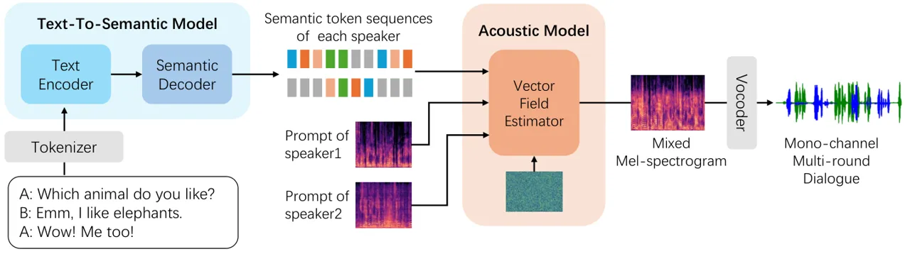

Figure 1: The overview of CoVoMix framework, which consists of a
multi-stream text-to-semantic model, a conditional flow-matching based
acoustic model for mixed mel-spectrogram generation, and a HiFi-GAN
based vocoder for waveform production.

## 1 Introduction

Zero-shot Text-to-speech (TTS) technology aims to create human-like
natural speech with voice characteristics prompted by the context.
Recent deep learning advancements have significantly improved
synthesized speech quality, especially in formal reading scenarios \[1,
2, 3\]. However, TTS systems still struggle with rendering
spontaneous-style speech and managing seamless transitions during
conversations—common occurrences in everyday human communication \[4,
5\]. On the one hand, spontaneous-style speech encompasses phenomena
like filled pauses, interjections, repairs, repetitions, and laughter,
which lend human-realistic naturalness to spoken language \[6\]. On the
other hand, in natural conversations, speakers intuitively time their
speech, determining when to speak and when to yield, resulting in
seamless transitions with appropriate overlaps or moments of
silence \[7, 8\]. Overlapping speech, defined as more than one person is
speaking, can easily exceed 20%, in informal gathering conversational
speech \[9\]. Considering these conversational features, we summarize
three main challenges in generating spontaneous dialogues.

First, the scarcity of high-quality, spontaneous conversational
datasets, along with the difficulty in segmenting paralinguistic
behaviors, continues to be a significant obstacle in the field.
Spontaneous behavior and non-verbal expressions such as laughter,
receive insufficient attention in speech synthesis. Existing
high-quality datasets for spontaneous and conversational speech are
relatively small and involve a limited number of speakers \[10\].
Identifying and segmenting these paralinguistic features, as highlighted
by studies \[11, 12\], poses difficulties. Models that require
pre-alignment necessitate sophisticated manual annotation. Otherwise,
the low-quality data can adversely impact performance, particularly in
TTS tasks \[13\].

Second, research on turn-taking mechanisms in multi-speaker dialogues is
less explored. In such dialogues, the forthcoming speaker anticipates
the end of the current speaker’s turn by analyzing structural and
contextual cues, and then begins their speech seamlessly at the
anticipated transition point \[14\]. Speakers tend to adapt the pause
length to match other participants \[15\]. Overlapping speech occurs
when one speaker starts talking before another finishes, which can be a
sign of enthusiasm or an attempt to take turns \[16, 17, 18\].

Third, the consistency in multi-round dialogues is not guaranteed in
conventional methods. Simply concatenating each utterance to form a
dialogue may result in inconsistent speaker characteristics,
particularly when the same speaker engages in multi-round dialogue. In
addition, the context of the preceding utterance plays an important role
in the control of pauses and prosody, and thus influences the
naturalness of generated dialogues \[19\].

To effectively generate human-like dialogue, we propose CoVoMix, named
Conversational Voice Mixture Generation, for multi-talker dialogue
generation, shown in Figure 1. The main contributions of the paper can
be summarized as follows:

1.  1.  To the best of our knowledge, it is the first attempt at zero-shot,
        human-like, multi-talker conversational mixed speech generation. We
        propose 1) a simultaneous multi-stream semantic token prediction,
        with each stream representing an individual talker, from dialogue
        text; and 2) a multi-talker flow-matching based acoustic model for
        generating a mixed mono mel-spectrogram given multiple contexts. It
        is capable of generating single-channel multi-round dialogue
        containing multiple speakers concurrently, enabling simultaneous
        timbre cloning of multiple speakers in zero-shot scenarios.
2.  2.  We design a variety of evaluation metrics for dialogue generation,
        and demonstrate that the CoVoMix model is proficient at generating
        both human-like dialogues and monologues, exhibiting natural speaker
        turn-taking, realistic vocal burst-like laughter, consistent speech
        in terms of speaker similarity throughout multiple rounds of
        dialogue.
3.  3.  We employ the Fisher dataset \[20\] for this study, which was
        curated for robust speech recognition. Our approach includes a
        comprehensive strategy for processing this dataset, including both
        training and evaluation for monologue and dialogue speech. The data
        processing script, along with the model training and inference codes
        are publicly available ¹¹ 1
        https://github.com/vivian556123/NeurIPS2024-CoVoMix.git.

## 2 Related Work

### 2.1 Zero-shot Text-to-Speech

The goal of Zero-shot TTS is to synthesize speech in a target voice
which was unseen during training, given only the target transcript and a
short reference of the target voice  \[1, 21, 22, 23, 24\] . Zero-shot
TTS systems are generally divided into two categories: _(i)_
Diffusion-based Zero-Shot TTS \[3, 25, 26, 27, 28, 29, 30, 31, 32, 33,
34, 35\] and _(ii)_ Neural Codec-based Zero-shot TTS \[2, 36, 37, 38,
39\].

Diffusion-based Zero-shot TTS models handle the problem in a non-auto
regressive manner and have shown excellent performance in audio
generation tasks \[28, 40, 41\]. Many previous works, such as \[25, 32,
42\], use log Mel spectrograms as intermediate features and generate
speech waveforms using high-quality vocoders. For instance,
DiffVoice \[43\] employs a VAE-GAN autoencoder \[44\] to encode the
Mel-Spectrogram into a latent space, jointly modeling phoneme duration
and Mel-spectrogram. FastSpeech \[45\] generates mel-spectrograms in
parallel for faster inference, managing alignment between phoneme
sequence and generated spectrogram with an explicit length regulator and
duration predictor model. Flow matching training is a method that is
closely related to Diffusion models offering simpler trajectories and
requiring fewer function evaluations during inference \[46, 47, 34\].
Flow Matching (FM) \[46\] is a simulation-free approach for training
continuous normalizing flows (CNFs) at scale based on regressing vector
fields of fixed conditional probability paths. The relationship between
the vector field and the flow $`\phi`$ is defined via an ordinary
differential equation (ODE)
$`d\phi_{t}(y)=v_{t}(\phi_{t}(y))dt,\phi_{0}(y)=y`$ \[46\]. Benefiting
from flow matching models, text-to-speech models, such as
VoiceFlow \[48\], MatchaTTS \[41\] and Voicebox  \[49\], can generate
high-quality speech efficiently.

On the other side, Neural Codec-based methods formulate the TTS problem
as a token-based language modeling task \[2, 50\]. VALL-E \[2\], a
zero-shot text-to-speech model, is a text conditioned language model
trained on EnCodec tokens \[50\]. SPEAR-TTS \[51\] is similar to
AudioLM \[52\] which carries out the speech generation process in two
steps: first, it maps the text into discrete semantic tokens, then, in
the second step, it converts the semantic tokens into acoustic tokens.
In the recently proposed BASE-TTS \[53\], the authors propose to model
the joint distribution of text tokens and discrete speech
representations referred to as speechcodecs followed by a
convolution-based decoder which converts these speechcodes into
waveforms in an incremental, streamable manner. NaturalSpeech3 \[54\]
combines codecs and diffusion modeling, achieving significant
improvements in speech quality, prosody, intelligibility, and
scalability with a 1B-parameter model trained on 200K hours of data. It
decomposes speech waveforms into content, prosody, timbre, and acoustic
details, reconstructing speech from these disentangled representations
using a factorized diffusion model.

### 2.2 Dialogue Generation

dGSLM \[8\] represents the pioneering textless model for generating
naturalistic spoken dialogues. It utilizes a dual-tower transformer with
cross-attention as its architectural backbone and leverages HuBERT
 \[55\] semantic token sequence as its input for the speech continuation
task. This model generates two-channel spoken dialogue
auto-regressively, without reliance on text or labels. However, its
textless nature constrains its ability to direct the content of the
speech it produces, occasionally leading to less intelligible outputs.

CHATS \[56\], while based on the same architectural principles as dGSLM,
is designed to convert written dialogues into spoken conversations. It
is capable of generating speech for both speaker and listener sides,
conditioning on speaker ID, phoneme sequence, and context from the
speaker’s side, without requiring transcriptions for spontaneous
behaviors or laughter. However, it does not support the capabilities of
zero-shot voice cloning, relying solely on speaker ID for retaining
speaker characteristics.

SoundStorm \[36\], on the other side, is an iterative generative method
that converts semantic tokens into acoustic audio tokens. It can perform
zero-shot monologue and dialogue synthesis. Yet, the synthesized
dialogue is generated in a sequential manner and thus sounds less
realistic, lacking any spontaneous behaviors or instances of overlapping
speech.

## 3 CoVoMix

Zero-shot speech generation is a task where a model synthesizes speech
in a target voice that was not present in its training data. This task
requires only a transcript of what is to be spoken and a speech prompt—a
brief sample recording of the target voice. It is generally achieved by
in-context learning with a dataset of transcribed speech $`\{x,y\}`$
where $`{y}`$ and $`{x}`$ denote speech utterances and their
transcriptions, respectively. Zero-shot multi-talker conversational
speech synthesis is designed to generate the voices of multiple speakers
simultaneously, based on their transcriptions and prompts. Our approach
differs from the traditional method in which each voice is synthesized
individually, and then concatenated to form a dialogue. Our goal in this
work is to capture the dynamic nature of real conversations, where
participants may speak over each other or respond spontaneously with
interjections such as laughter.

Our proposed CoVoMix, shown in Figure 1, consists of a multi-stream
text-to-semantic model, an acoustic model and a vocoder. The
text-to-semantic model first generates multi-stream semantic token
sequences for each speaker, given the dialogue transcription. Then the
acoustic model transforms these semantic sequences into a mixed
mel-spectrogram. A vanilla HiFi-GAN vocoder \[57\] finally synthesizes
mono-channel multi-round dialogue from the mel-spectrogram. We utilize a
conversational dataset $`D=\{x,y\}`$ for training, where
$`y=[y^{1},y^{2}]`$ represents a stereo dialogue featuring two speakers,
and $`x`$ corresponds to the text transcription annotated with speaker
tags.

### 3.1 Multi-stream Text-to-Semantic Model

The multi-stream text-to-semantic model is a sequence-to-sequence model
based on encoder-decoder architecture. It takes in a text token sequence
generated by a BERT text tokenizer  \[58\], augmented with special
tokens denoting speaker transitions and interjections. The output
comprises a multi-stream semantic token sequence. For this study, we
focus on a dual-stream setup for a dialogue between two speakers. We
employ a pre-trained HuBERT model ²² 2
https://github.com/facebookresearch/fairseq/tree/main/examples/textless_nlp/dgslm/hubert_fisher
(MIT License) \[8\] as a speech tokenizer to extract the clustered
discrete HuBERT hidden units as semantic token sequences and process two
channels of waveform, separately. If the dialogues are captured in a
single-channel recording, it is necessary to perform speaker separation
to produce a dual-channel waveform in our approach. The process of
semantic token extraction operates at the frame level, with a time shift
of 20 milliseconds, resulting in the presence of duplicated tokens
within the sequence. We train this model on a paired speech-text dataset
with cross-entropy loss, as

```math
\mathcal{L}_{t2s}=\sum_{c=1}^{C}\sum_{i}\log p(s_{i}^{(c)}|s_{1:i-1}^{(c)};\theta,x) \tag{1}
```

where $`s_{i}`$ is the $`i`$th semantic token and $`c`$ denotes the
$`c`$th speaker. In order to predict two-stream semantic token
sequences, we adopt a strategy wherein we divide the semantic embedding
into two distinct segments (splitting it into two halves along the
feature dimension) in the final linear layer of the decoder. Each
segment corresponds to a different speaker participating in the
conversation. This approach enables the model to capture contextual
information not only from each individual speaker but also from their
interaction. The dynamic exchange between speakers significantly shapes
the semantic content, especially in scenarios involving multi-round
conversations.

### 3.2 Acoustic Model

The acoustic model is a flow-matching based transformer encoder, which
generates a mixed mel-spectrogram, given multi-stream semantic token
sequences and multi-speaker prompts.

At each timestamp $`t\in[0,1]`$, a lookup table first embeds the
semantic token sequence $`s=[s^{1},s^{2}]`$ into
$`s_{emb}=[s_{emb}^{1},s_{emb}^{2}]`$ for two speakers. We extract the
corresponding mixed mel-spectrogram $`m`$ and individual mel-spectrogram
$`[m^{1},m^{2}]`$ for each speaker of dialogue $`y`$. We randomly choose
a mask. The masked part $`\tilde{m}=m\odot mask`$ is to be predicted,
while the seen part $`m_{ctx}=[m^{1}\odot(1-mask),m^{2}\odot(1-mask)]`$
is considered as prompt.

At each flow step $`t`$, we sample
$`w=(1-(1-\sigma_{min})t)\tilde{m_{0}}+tm`$, where $`\sigma_{min}`$ is a
hyper-parameter to control deviation and $`\tilde{m_{0}}`$ is sampled
from $`\mathcal{N}(m|0,\mathbf{I})`$. Then, the sample $`w`$ at flow
step $`t`$, the acoustic prompt $`m_{ctx}`$, and semantic embedding
sequences $`s_{emb}`$ are concatenated frame-by-frame to obtain an input
matrix $`W_{input}`$. Conditional Flow Matching (CFM) \[46\] is a
per-example training objective, which provides equivalent gradients and
does not require explicit knowledge of the intractable target vector
field. Therefore, we train the acoustic model to learn the mixed
mel-spectrogram with objective as in Eq.2, where
$`v_{t}(w,m_{ctx},s_{emb};\theta)`$ is the transformer output with flow
$`w`$ at step $`t`$.

```math
\mathcal{L}_{CFM}=\mathbb{E}_{t,q(m,s),p_{0}(m_{0})}\|mask\odot((m-(1-\sigma_{min})\tilde{m_{0}})-v_{t}(w,m_{ctx},s_{emb};\theta))\|^{2} \tag{2}
```

During inference, to sample mixed mel-spectrogram $`m`$ from learned
distribution $`p_{1}(m|s,m_{ctx})`$, we sample a gaussian noise
$`m_{0}`$ from $`p_{0}=\mathcal{N}(m|0,\mathbf{I})`$ use an ODE solver
to evaluate the flow $`\phi_{1}(m_{0})`$ given
$`d\phi_{t}(m_{0})/dt=v_{t}(w,m_{ctx},s_{emb};\theta)`$ and
$`\phi_{0}(m_{0})=m_{0}`$.

We also use classifier-free guidance, a method to trade off mode
coverage and sample fidelity \[49, 59\], in the training for
flow-matching model. During training, the acoustic prompt $`m_{ctx}`$
and semantic sequences $`s_{emb}`$ are dropped with $`p_{uncond}`$.
During inference, we use the modified vector field
$`\tilde{v}_{t}(w,m_{ctx},s_{emb};\theta)`$ shown in Equation 3 to
replace $`v_{t}(w,m_{ctx},s_{emb};\theta)`$, where $`\alpha`$ is a
hyperparameter controlling the strength of guidance.

```math
\tilde{v}_{t}(w,m_{ctx},s_{emb};\theta)=(1+\alpha)v_{t}(w,m_{ctx},s_{emb};\theta)-\alpha\tilde{v}_{t}(w;\theta) \tag{3}
```

## 4 Experimental Setup

### 4.1 Data Preparation

The dataset used in this work is Fisher dataset \[20\], which is a
telephone conversation dataset with 2,000h English conversations about
various topics. Each dialogue was recorded in two channels with an 8kHz
sample rate and an average duration of 10 minutes. We randomly divide
the Fisher dataset into train/valid/test sets with 97/1/2 split. Each
set has different speakers.

The data preparation is different for monologue and dialogue. For
monologue, following Nemo \[60\] script,³³ 3
https://gitlab.nrp-nautilus.io/ar-noc/nemo/-/blob/master/scripts/process_fisher_data.py
(Apache License 2.0) we slice long dialogues into smaller mono-channel
samples and concatenate them to meet the minimum duration requirement,
which is set to 10 seconds by default. We prepare the corresponding
transcripts, extract the mel-spectrogram and semantic token sequence for
each sample. Spontaneous behavior such as laughter is labeled by
\[laughter\] token in the transcription. For dialogue, we slice long
dialogues into shorter, stereo-channel dialogues containing at least two
utterances from distinct speakers. We ensure that the first and last
sentences of each processed dialogue do not overlap with other
dialogues, thus avoiding any extraneous content in the transcriptions.
Motivated by serialized output training in speech recognition task \[61,
62\], we organize the multi-round dialogue transcript chronologically by
the start time of each utterance. Two neighboring same-speaker
utterances are concatenated directly, while different speakers’
utterances are separated by \[spkchange\] token, without explicit
processing for overlap labelling. A dialogue transcription preparation
example is shown in Figure 2. The HuBERT speech tokenizer is employed to
extract the semantic tokens for each channel. Additionally, we mix audio
with two channels and extract the mel-spectrogram from the mixed
waveform. The detailed algorithm for dialogue data preparation is
described in Appendix E.

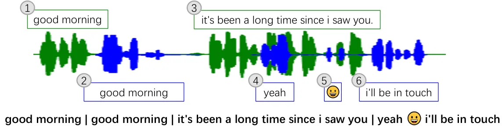

Figure 2: Dialogue transcription preparation. To better demonstrate our
method, we use \| and emoji to represent \[spkchange\] and \[laughter\]
tokens.

### 4.2 Model Configurations

We develop two text-to-semantic models, named CoSingle and CoMix, and
two acoustic models, named VoSingle and VoMix. CoSingle and VoSingle are
trained exclusively on monologue data, VoMix is trained on dialogue
data, and CoMix is trained on a combination of monologue and dialogue
data. In addition, the vanilla HiFi-GAN vocoder is trained on monologue
data.

The text-to-semantic model is a transformer-based model with rotary
embedding \[63\]. The encoder has 4 layers and the decoder has 4 layers.
We set the dimension of text encoder and CoSingle decoder to 512, and
set CoMix decoder to 1024. In order to process multi-stream for multiple
talkers, CoMix applies multiple heads for generating semantic token
sequences. The acoustic model is based on transformer encoder with
rotary embeddings \[63\] and adaptive RMSNorm \[64\] for time
conditioning, which has 8 layers and hidden dimension of 1024. VoMix and
VoSingle have the same architecture except for the first input linear
layer. More details of model architecture is demonstrated in Appendix A.

To demonstrate the performance of our methods, the baseline that we
compare with is a flow-matching speech synthesis model with phoneme
representation, similar to VoiceBox \[49\]⁴⁴ 4
https://github.com/lucidrains/voicebox-pytorch (MIT License). The
baseline contains two models: the acoustic model and the duration model.
The acoustic model of the baseline is the same as VoSingle model, but
generates mel-spectrogram from the phoneme sequence. The duration model
of baseline is to predict the duration of each phoneme, which is also
trained with flow matching objective and has the same architecture with
2 layers and hidden size of 1024.

We train all models from scratch and perform inference on the best
performed model on validation set. We use 8 NVIDIA TESLA V100 32GB GPUs
for training. The text-to-semantic model is trained for 10 epochs with
batch size 48. The acoustic model and duration model are trained for 100
epochs with batch size 64. We adopt Adam optimizer with 1e-4 learning
rate. The probability of dropping condition during training is
$`p_{uncond}=0.3`$, and the strength of guidance is $`\alpha=0.7`$
during inference.

### 4.3 System Configuration and Evaluation Setting

We built two systems: CoVoSingle and CoVoMix, and evaluated them on both
monologue and dialogue testing sets. CoVoSingle contains CoSingle and
VoSingle models. CoVoMix system contains CoMix and VoMix. For monologue
generation, CoVoSingle and CoVoMix systems directly feed the output of
text-to-semantic model into the acoustic model. The acoustic prompt is
extracted from another utterance of the target speaker. For dialogue
generation, CoVoSingle generate each utterance of the dialogue and
concatenate these waveforms according to the order of transcript.
CoVoMix receives dialogue transcription as input and synthesizes
mono-channel dialogue directly. The acoustic prompts are extracted from
another dialogue of target speakers.

### 4.4 Evaluation Metrics

Objective Metrics: We use cosine speaker similarity (SIM), word error
rate (WER), Mel cepstral distortion (MCD),⁵⁵ 5
https://github.com/chenqi008/pymcd (MIT License) and NISQA⁶⁶ 6
https://github.com/gabrielmittag/NISQA (MIT License) to evaluate
generation results \[65\]. SIM measures the cosine similarity between
speaker embeddings of generated utterance and the acoustic prompt,
extracted from WavLM-TDNN \[66\]. We use a market-leading Speech
Recognition API for WER calculation, which measures the correctness and
intelligibility. We use an improved MCD metric that adopts the Dynamic
Time Warping (DTW) algorithm to find the minimum MCD between two
speeches \[67\]. NISQA \[65\] measures the speech quality and
naturalness of the synthesized speech.

Subjective Metrics: We perform a human evaluation on the generated
monologue and dialogue examples. For monologue, we measure naturalness
using comparative mean option score (CMOS). For dialogue, we use CMOS to
measure naturalness and how seamlessly the conversation flows. We use
the similarity mean option score (SMOS) between the synthesized and
prompt speech to measure the speaker similarity for both monologue and
dialogue. 14 professional linguistic experts provide judges for all
subjective evaluations. They provide a rating to the second audio, which
is randomly selected from a pair of audios, in the (-3 to +3) range. The
instructions of subjective evaluations are provided in Appendix F.

Dialogue Metrics: We assess the naturalness of the generated dialogue
speech through three metrics: 1) Turn-taking Statistics: By employing a
pre-trained speaker diarization model  \[68, 69\],⁷⁷ 7
https://github.com/pyannote/pyannote-audio (MIT License) we measure the
duration of inter- and intra-speaker silences, overlapped speech, and
active speech. 2) Para-linguistic Behaviors: Our evaluation focuses on
laughter in this study. Employing a laughter detection tool \[70\],⁸⁸ 8
https://github.com/jrgillick/laughter-detection (MIT License) we
identify instances of laughter and calculate both the total count and
average duration of these events. and 3) Speech Consistency: To evaluate
consistency, we generate ten dialogues, each containing more than five
utterances from the target speaker. We then select five three-second
segments at random from the target speaker and compare the cosine
similarity of speaker embeddings among these segments.

## 5 Result and Analysis

### 5.1 Objective and Subjective Metrics

Table 1 shows objective and subjective evaluation results for monologue
and dialogue generation across various systems.

We observe that the systems leveraging our proposed methods, i.e.,
CoVoSingle and CoVoMix, achieve higher speaker similarity, lower WER and
MCD than baseline on monologue evaluation set. The phoneme-based
baseline model requires accurate phoneme-level alignment, however, it is
challenging to perform accurate forced-alignment using conventional
alignment tool \[71\],⁹⁹ 9
https://github.com/MontrealCorpusTools/Montreal-Forced-Aligner (MIT
License) especially for speech with spontaneous behavior and noisy
background. These inaccuracies in alignment can lead to significant
performance degradation. By substituting phoneme representation with
semantic token sequences, our approach eliminates the dependency on
phoneme-level alignment, thereby enhancing model performance.

The dialogue results show that, unlike monologue, the ground truth and
CoVoMix exhibit high WER due to overlapping speech segments. The
transcriptions are chronologically sorted, leading to mismatches between
transcription and speech in overlapped parts. Furthermore, automatic
recognizing overlapped speech while maintaining a low WER remains a
challenging task to date. CoVoSingle, which generates utterances
separately and combines them, avoids this issue, resulting in lower WER.

In terms of speech quality, we observe that the proposed systems can
surpass the ground truth on both monologue and dialogue sets. The
flow-matching based acoustic model is able to eliminate background
noise, and therefore produces cleaner audio than real data. CoVoMix can
generate overlapped speech, which may result in a slightly lower NISQA,
comparing with CoVoSingle.

|           |             |                  |                    |                    |                    |                   |                   |
| --------- | ----------- | ---------------- | ------------------ | ------------------ | ------------------ | ----------------- | ----------------- |
| Eval Set  | System      | SIM $`\uparrow`$ | WER $`\downarrow`$ | MCD $`\downarrow`$ | NISQA $`\uparrow`$ | CMOS $`\uparrow`$ | SMOS $`\uparrow`$ |
| Monologue | GroundTruth | 0.59             | 6.10               | /                  | 3.03               | /                 | /                 |
|           | Baseline    | 0.42             | 15.85              | 9.45               | 2.93               | -1.60$`\dagger`$  | -1.18$`\dagger`$  |
|           | CoVoSingle  | 0.49             | 9.99               | 6.15               | 3.04               | 0.00              | 0.00              |
|           | CoVoMix     | 0.49             | 8.95               | 6.04               | 3.01               | 0.83$`\dagger`$   | 0.11              |
| Dialogue  | GroundTruth | /                | 14.91              | /                  | 2.73               | /                 | /                 |
|           | CoVoSingle  | /                | 11.77              | 6.91               | 2.90               | 0.00              | 0.00              |
|           | CoVoMix     | /                | 19.84              | 6.82               | 2.87               | 0.81$`\dagger`$   | 0.60$`\dagger`$   |

Table 1: Objective and subjective evaluation results for monologue and
dialogue generation across various systems.The symbol "$`\dagger`$" is
used to indicate that the system performance is significantly different
(p\<0.01) from CoVoSingle system in terms of CMOS and SMOS scores.

The subjective evaluations consistently support the findings of the
objective metrics. As shown in Table 1, CoVoSingle significantly
outperforms baseline in terms of both CMOS and SMOS scores for monologue
testing set. Furthermore, across both monologue and dialogue testing
sets, CoVoMix demonstrates significantly better performance over
CoVoSingle.

We have not found a good way to measure the objective similarity metric
for the dialogue testing set due to the necessity of speaker
diarization, since the potential errors in speaker diarization could
impact the fairness of the comparison. Therefore, for the dialogue SMOS
evaluation, testing dialogues were manually segmented into multiple
single-speaker utterances to avoid speaker diarization errors.

### 5.2 Dialogue Metrics

#### 5.2.1 Turn-taking Statistics

We define four turn-taking activities in a dialogue: 1) intra speaker
pause (silence between active speech of the same speaker), 2) inter
speaker silence (silence between active speech of different speaker), 3)
overlapped segments, and 4) active speech of each speaker \[15, 8\].

Figure 3 shows the distribution of various turn-taking activities. The
degree of similarity to the ground truth reflects the model’s ability to
simulate turn-taking in a dialogue. While CoVoSingle can synthesize
high-quality monologue, it exhibits subpar performance in dialogue turn
taking events, particularly in managing intra-speaker pause,
inter-speaker silence, and overlap control. Simply concatenating
monologue at utterance level results in low variance in inter- and
intra- speaker silence distribution, leading in a dialogue which sounds
robotic and lacks the natural flow of conversation \[8\]. In contrast,
CoVoMix demonstrates a high similarity to the ground truth in these
turn-taking events, yielding more human-realistic dialogues.

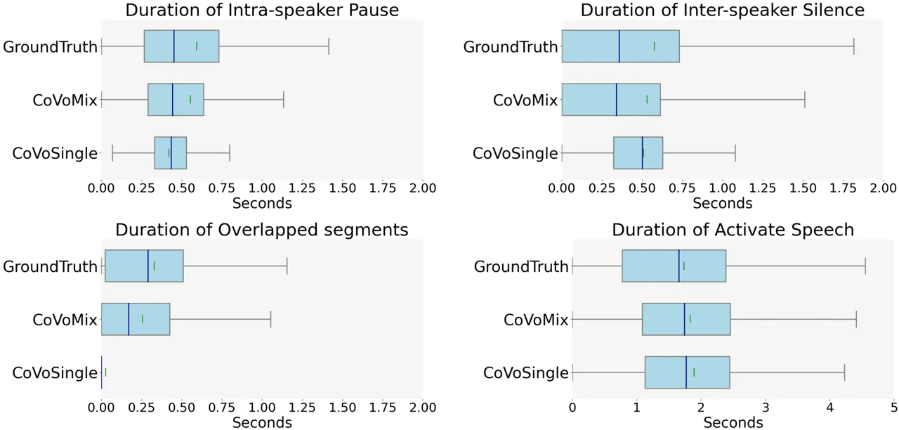

Figure 3: Distribution of durations of turn-taking events across models.
The blue line and the green line represent the median and mean of each
event. The more similar to groundtruth, the better.

#### 5.2.2 Para-linguistic Behaviors

We computed the frequency and duration of spontaneous laughter behaviors
across the conversation test set and compared these metrics across
models to check their closeness to the ground truth. As illustrated in
Figure 4, it shows that all proposed models can generate laughter with a
frequency close to the ground truth, demonstrating precise control over
these human-like behaviors. Moreover, CoVoMix can produce dialogues with
an average laughter duration that is closer to the ground truth, whereas
CoVoSingle tends to synthesize shorter instances of laughter.

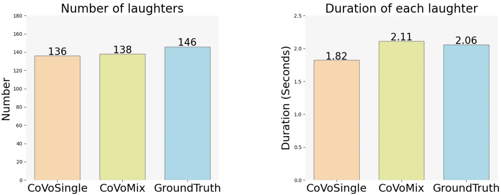

Figure 4: Comparison of number and duration of laughter among models

#### 5.2.3 Speech Consistency

We calculate the speaker similarity between any two pairs of different
utterances in a long conversation. Figure 5 presents a heatmap of the
cosine similarity between different segments, contrasting
utterance-level concatenation methods like CoVoSingle with
non-concatenation approaches like CoVoMix. A lighter shade indicates
lower speaker similarity. The figure’s color inconsistencies reveal that
utterance-level concatenation can indeed lead to dissimilar speaker
characteristics, particularly for non-adjacent utterances. Generating
the entire dialogue without concatenation results in significantly
improved consistency of speaker similarity across various utterances.

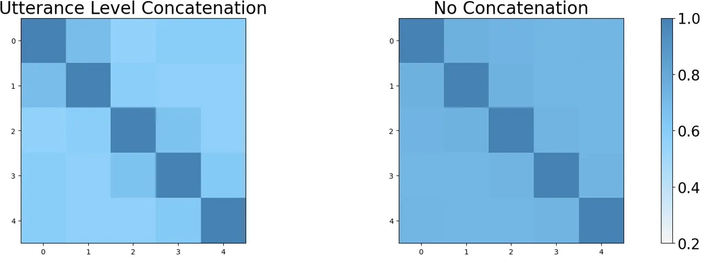

Figure 5: Speech consistency of CoVoSingle and CoVoMix for dialogue
generation

## 6 Ablation Studies and Extension

To enhance the effectiveness of text-to-semantic modeling, we conducted
ablation studies focusing on data augmentation and model size. In
addition to real dialogue data, we incorporated simulated dialogues and
monologue sentences into training data. Results show the benefits of
such augmentation, as evidenced by improved model prediction accuracy,
i.e., reduced WER, in both monologue and dialogue generation tasks.
Furthermore, we explored the impact of output channel configurations for
the acoustic model by comparing single-channel mixed speech output with
dual-channel outputs, where each channel contained speech from an
individual speaker. Experimental results show that dual-channel outputs
underperformed in WER, and outperformed in NISQA compared with
single-channel outputs. Please refer to Appendix B for the detailed
results of all ablation studies.

Our acoustic model can generate specific speakers’ voices, given
semantic token sequences and target speakers’ prompts. So it is
straightforward to be extended to a voice conversion task, which
modifies the speech of a source speaker and makes their speech sound
like that of another target speaker without changing the content
information. Instead of predicting semantic tokens from given text, we
extract the semantic tokens from the speech of the source speaker.
VoSingle performs voice conversion of dialogue by processing each
channel individually and then mix them up, while VoMix model achieves
voice conversion simultaneously. We notice that in addition to achieving
high speaker similarity, these systems can also achieve high spectral
similarity, indicating the strong zero-shot voice conversion capability.
Moreover, VoMix performs better than VoSingle in both monologue and
dialogue sets. The detailed results are shown in Appendix C and the
corresponding demo is provided in https://aka.ms/covomix.

## 7 Conclusion, Limitation, Future Work and Broader Impacts

We introduce the CoVoMix system for human-like monologue and dialogue
generation. The system is composed of an auto-regressive
text-to-semantic model and a flow-matching based acoustic model, with
semantic token sequence as an intermediate representation. A 2k-hour
conversational telephone speech dataset is leveraged in training these
two models of CoVoMix. Through both objective and subjective
evaluations, CoVoMix not only achieves high naturalness and zero-shot
speaker similarity in both monologue and dialogue generations but also
demonstrates its proficiency in the fluency of dialogue turn-taking and
spontaneous behavior generation.

Limitation and Future work We have observed instances of words being
omitted or duplicated occasionally in synthesized speech. This is
primarily attributed to the text-to-semantic model being an
auto-regressive model without forced duration. Additionally, the dataset
utilized for this study is sampled at 8 kHz with background noise,
factors that contribute to the degradation of speech quality. In future
work, we aim to enhance the text-to-semantic model by scaling it up or
initializing it with a pre-trained model, and employing super-resolution
methods to improve the training data fidelity.

Broader Impacts A high-quality and human-like speech generation model
like CoVoMix can enable many applications that improve the quality of
our life. However, since CoVoMix could synthesize speech that maintains
speaker identity, it may carry potential risks in misuse of the model,
such as spoofing voice identification or impersonating a specific
speaker. To mitigate such risks, it is possible to build a detection
model to discriminate whether an audio clip was synthesized by CoVoMix.

## References

- \[1\] X. Tan, T. Qin, F. Soong, and T.-Y. Liu, “A survey on neural
  speech synthesis,” _arXiv preprint arXiv:2106.15561_, 2021.
- \[2\] C. Wang, S. Chen, Y. Wu, Z. Zhang, L. Zhou, S. Liu, Z. Chen,
  Y. Liu, H. Wang, J. Li _et al._, “Neural codec language models are
  zero-shot text to speech synthesizers,” _arXiv preprint
  arXiv:2301.02111_, 2023.
- \[3\] K. Shen, Z. Ju, X. Tan, Y. Liu, Y. Leng, L. He, T. Qin, S. Zhao,
  and J. Bian, “NaturalSpeech 2: Latent diffusion models are natural and
  zero-shot speech and singing synthesizers,” _arXiv preprint
  arXiv:2304.09116_, 2023.
- \[4\] W. Li, S. Lei, Q. Huang, Y. Zhou, Z. Wu, S. Kang, and H. Meng,
  “Towards Spontaneous Style Modeling with Semi-supervised Pre-training
  for Conversational Text-to-Speech Synthesis,” in _Proc. INTERSPEECH_,
  2023, pp. 3377–3381.
- \[5\] S. C. Levinson, “On the human" interaction engine",” in _Roots
  of human sociality_. Routledge, 2020, pp. 39–69.
- \[6\] W. Ward, “Understanding spontaneous speech,” in _Speech and
  Natural Language: Proceedings of a Workshop Held at Philadelphia,
  Pennsylvania, February 21-23, 1989_, 1989.
- \[7\] E. A. SCHEGLOFF, “Overlapping talk and the organization of
  turn-taking for conversation,” _Language in Society_, vol. 29,
  no. 1, p. 1–63, 2000.
- \[8\] T. A. Nguyen, E. Kharitonov, J. Copet, Y. Adi, W.-N. Hsu,
  A. Elkahky, P. Tomasello, R. Algayres, B. Sagot, A. Mohamed _et al._,
  “Generative spoken dialogue language modeling,” _Transactions of the
  Association for Computational Linguistics_, vol. 11, pp.
  250–266, 2023.
- \[9\] T. v. Neumann, K. Kinoshita, M. Delcroix, S. Araki, T. Nakatani,
  and R. Haeb-Umbach, “All-neural online source separation, counting,
  and diarization for meeting analysis,” in _Proc. ICASSP_, 2019, pp.
  91–95.
- \[10\] K. Lee, K. Park, and D. Kim, “Dailytalk: Spoken dialogue
  dataset for conversational text-to-speech,” in _Proc. ICASSP_. IEEE,
  2023, pp. 1–5.
- \[11\] T. Nagata and H. Mori, “Defining laughter context for laughter
  synthesis with spontaneous speech corpus,” _IEEE Transactions on
  Affective Computing_, vol. 11, no. 3, pp. 553–559, 2018.
- \[12\] N. Tits, K. E. Haddad, and T. Dutoit, “Laughter Synthesis:
  Combining Seq2seq Modeling with Transfer Learning,” in _Proc.
  INTERSPEECH_, 2020, pp. 3401–3405.
- \[13\] J. Yu, H. Chen, Y. Bian, X. Li, Y. Luo, J. Tian, M. Liu,
  J. Jiang, and S. Wang, “Autoprep: An automatic preprocessing framework
  for in-the-wild speech data,” _arXiv preprint arXiv:2309.13905_, 2023.
- \[14\] H. Sacks, E. A. Schegloff, and G. Jefferson, “A simplest
  systematics for the organization of turn taking for conversation,” in
  _Studies in the organization of conversational interaction_. Elsevier,
  1978, pp. 7–55.
- \[15\] M. Heldner and J. Edlund, “Pauses, gaps and overlaps in
  conversations,” _Journal of Phonetics_, vol. 38, no. 4, pp.
  555–568, 2010.
- \[16\] N. Dethlefs, H. Hastie, H. Cuayáhuitl, Y. Yu, V. Rieser, and
  O. Lemon, “Information density and overlap in spoken dialogue,”
  _Computer speech & language_, vol. 37, pp. 82–97, 2016.
- \[17\] L. Zhang, Z. Chen, and Y. Qian, “Enroll-aware attentive
  statistics pooling for target speaker verification,” _Proc.
  INTERSPEECH_, pp. 311–315, 2022.
- \[18\] L. Zhang, Y. Qian, L. Yu, H. Wang, H. Yang, S. Liu, L. Zhou,
  and Y. Qian, “DDTSE: Discriminative diffusion model for target speech
  extraction,” _IEEE Spoken Language Technology Workshop_, 2024.
- \[19\] M. Heldner, J. Edlund, and J. B. Hirschberg, “Pitch similarity
  in the vicinity of backchannels,” 2010.
- \[20\] C. Cieri, D. Miller, and K. Walker, “The fisher corpus: A
  resource for the next generations of speech-to-text.” in _LREC_,
  vol. 4, 2004, pp. 69–71.
- \[21\] P. Taylor, _Text-to-speech synthesis_. Cambridge university
  press, 2009.
- \[22\] Z. Mu, X. Yang, and Y. Dong, “Review of end-to-end speech
  synthesis technology based on deep learning,” _arXiv preprint
  arXiv:2104.09995_, 2021.
- \[23\] E. Casanova, J. Weber, C. D. Shulby, A. C. Junior, E. Gölge,
  and M. A. Ponti, “Yourtts: Towards zero-shot multi-speaker tts and
  zero-shot voice conversion for everyone,” in _International Conference
  on Machine Learning_. PMLR, 2022, pp. 2709–2720.
- \[24\] Y. Leng, Z. Guo, K. Shen, Z. Ju, X. Tan, E. Liu, Y. Liu,
  D. Yang, K. Song, L. He _et al._, “PromptTTS 2: Describing and
  generating voices with text prompt,” in _The Twelfth International
  Conference on Learning Representations_.
- \[25\] M. Le, A. Vyas, B. Shi, B. Karrer, L. Sari, R. Moritz,
  M. Williamson, V. Manohar, Y. Adi, J. Mahadeokar _et al._, “Voicebox:
  Text-guided multilingual universal speech generation at scale,”
  _Advances in neural information processing systems_, vol. 36, 2024.
- \[26\] R. Huang, M. W. Lam, J. Wang, D. Su, D. Yu, Y. Ren, and
  Z. Zhao, “Fastdiff: A fast conditional diffusion model for
  high-quality speech synthesis,” _arXiv preprint
  arXiv:2204.09934_, 2022.
- \[27\] R. Huang, Z. Zhao, H. Liu, J. Liu, C. Cui, and Y. Ren,
  “Prodiff: Progressive fast diffusion model for high-quality
  text-to-speech,” in _Proceedings of the 30th ACM International
  Conference on Multimedia_, 2022, pp. 2595–2605.
- \[28\] M. Jeong, H. Kim, S. J. Cheon, B. J. Choi, and N. S. Kim,
  “Diff-tts: A denoising diffusion model for text-to-speech,” _arXiv
  preprint arXiv:2104.01409_, 2021.
- \[29\] M. Kang, D. Min, and S. J. Hwang, “Any-speaker adaptive
  text-to-speech synthesis with diffusion models,” _arXiv preprint
  arXiv:2211.09383_, vol. 2, 2022.
- \[30\] H. Kim, S. Kim, and S. Yoon, “Guided-tts: A diffusion model for
  text-to-speech via classifier guidance,” in _International Conference
  on Machine Learning_. PMLR, 2022, pp. 11 119–11 133.
- \[31\] Z. Kong, W. Ping, J. Huang, K. Zhao, and B. Catanzaro,
  “Diffwave: A versatile diffusion model for audio synthesis,” _arXiv
  preprint arXiv:2009.09761_, 2020.
- \[32\] V. Popov, I. Vovk, V. Gogoryan, T. Sadekova, and M. Kudinov,
  “Grad-tts: A diffusion probabilistic model for text-to-speech,” in
  _International Conference on Machine Learning_. PMLR, 2021, pp.
  8599–8608.
- \[33\] C. Miao, S. Liang, M. Chen, J. Ma, S. Wang, and J. Xiao,
  “Flow-tts: A non-autoregressive network for text to speech based on
  flow,” in _Proc. ICASSP_. IEEE, 2020, pp. 7209–7213.
- \[34\] J. Kim, S. Kim, J. Kong, and S. Yoon, “Glow-tts: A generative
  flow for text-to-speech via monotonic alignment search,” _Advances in
  Neural Information Processing Systems_, vol. 33, pp. 8067–8077, 2020.
- \[35\] S. Kim, K. Shih, J. F. Santos, E. Bakhturina, M. Desta,
  R. Valle, S. Yoon, B. Catanzaro _et al._, “P-flow: A fast and
  data-efficient zero-shot tts through speech prompting,” _Advances in
  Neural Information Processing Systems_, vol. 36, 2024.
- \[36\] Z. Borsos, M. Sharifi, D. Vincent, E. Kharitonov, N. Zeghidour,
  and M. Tagliasacchi, “Soundstorm: Efficient parallel audio
  generation,” _arXiv preprint arXiv:2305.09636_, 2023.
- \[37\] Z. Zhang, L. Zhou, C. Wang, S. Chen, Y. Wu, S. Liu, Z. Chen,
  Y. Liu, H. Wang, J. Li _et al._, “Speak foreign languages with your
  own voice: Cross-lingual neural codec language modeling,” _arXiv
  preprint arXiv:2303.03926_, 2023.
- \[38\] T. Wang, L. Zhou, Z. Zhang, Y. Wu, S. Liu, Y. Gaur, Z. Chen,
  J. Li, and F. Wei, “Viola: Unified codec language models for speech
  recognition, synthesis, and translation,” _arXiv preprint
  arXiv:2305.16107_, 2023.
- \[39\] N. Zeghidour, A. Luebs, A. Omran, J. Skoglund, and
  M. Tagliasacchi, “Soundstream: An end-to-end neural audio codec,”
  _IEEE/ACM Transactions on Audio, Speech, and Language Processing_,
  vol. 30, pp. 495–507, 2021.
- \[40\] A. Kulkarni, V. Colotte, and D. Jouvet, “Analysis of
  expressivity transfer in non-autoregressive end-to-end multispeaker
  tts systems,” in _Proc. INTERSPEECH_, 2022.
- \[41\] S. Mehta, R. Tu, J. Beskow, É. Székely, and G. E. Henter,
  “Matcha-tts: A fast tts architecture with conditional flow matching,”
  _arXiv preprint arXiv:2309.03199_, 2023.
- \[42\] S. Liu, D. Su, and D. Yu, “Diffgan-tts: High-fidelity and
  efficient text-to-speech with denoising diffusion gans,” _arXiv
  preprint arXiv:2201.11972_, 2022.
- \[43\] Z. Liu, Y. Guo, and K. Yu, “Diffvoice: Text-to-speech with
  latent diffusion,” in _Proc. ICASSP_. IEEE, 2023, pp. 1–5.
- \[44\] A. Larsen, S. Sønderby, H. Larochelle, and O. Winther,
  “Autoencoding beyond pixels using a learned similarity metric.
  december 31, 2015,” 2023.
- \[45\] Y. Ren, Y. Ruan, X. Tan, T. Qin, S. Zhao, Z. Zhao, and T.-Y.
  Liu, “Fastspeech: Fast, robust and controllable text to speech,” 2019.
- \[46\] Y. Lipman, R. T. Chen, H. Ben-Hamu, M. Nickel, and M. Le, “Flow
  matching for generative modeling,” _arXiv preprint
  arXiv:2210.02747_, 2022.
- \[47\] S. Mehta, R. Tu, J. Beskow, É. Székely, and G. E. Henter,
  “Matcha-tts: A fast tts architecture with conditional flow matching,”
  in _Proc. ICASSP_. IEEE, 2024, pp. 11 341–11 345.
- \[48\] Y. Guo, C. Du, Z. Ma, X. Chen, and K. Yu, “Voiceflow: Efficient
  text-to-speech with rectified flow matching,” _arXiv preprint
  arXiv:2309.05027_, 2023.
- \[49\] M. Le, A. Vyas, B. Shi, B. Karrer, L. Sari, R. Moritz,
  M. Williamson, V. Manohar, Y. Adi, J. Mahadeokar _et al._, “Voicebox:
  Text-guided multilingual universal speech generation at scale,” _arXiv
  preprint arXiv:2306.15687_, 2023.
- \[50\] A. Défossez, J. Copet, G. Synnaeve, and Y. Adi, “High fidelity
  neural audio compression,” _arXiv preprint arXiv:2210.13438_, 2022.
- \[51\] E. Kharitonov, D. Vincent, Z. Borsos, R. Marinier, S. Girgin,
  O. Pietquin, M. Sharifi, M. Tagliasacchi, and N. Zeghidour, “Speak,
  read and prompt: High-fidelity text-to-speech with minimal
  supervision,” _arXiv preprint arXiv:2302.03540_, 2023.
- \[52\] Z. Borsos, R. Marinier, D. Vincent, E. Kharitonov, O. Pietquin,
  M. Sharifi, D. Roblek, O. Teboul, D. Grangier, M. Tagliasacchi
  _et al._, “AudioLM: a language modeling approach to audio generation,”
  _IEEE/ACM Transactions on Audio, Speech, and Language
  Processing_, 2023.
- \[53\] M. Łajszczak, G. Cámbara, Y. Li, F. Beyhan, A. van Korlaar,
  F. Yang, A. Joly, Á. Martín-Cortinas, A. Abbas, A. Michalski _et al._,
  “Base tts: Lessons from building a billion-parameter text-to-speech
  model on 100k hours of data,” _arXiv preprint arXiv:2402.08093_, 2024.
- \[54\] Z. Ju, Y. Wang, K. Shen, X. Tan, D. Xin, D. Yang, Y. Liu,
  Y. Leng, K. Song, S. Tang _et al._, “NaturalSpeech 3: Zero-shot speech
  synthesis with factorized codec and diffusion models,” _arXiv preprint
  arXiv:2403.03100_, 2024.
- \[55\] W.-N. Hsu, B. Bolte, Y.-H. H. Tsai, K. Lakhotia,
  R. Salakhutdinov, and A. Mohamed, “HuBERT: Self-supervised speech
  representation learning by masked prediction of hidden units,”
  _IEEE/ACM Transactions on Audio, Speech, and Language Processing_,
  vol. 29, pp. 3451–3460, 2021.
- \[56\] K. Mitsui, Y. Hono, and K. Sawada, “Towards human-like spoken
  dialogue generation between ai agents from written dialogue,” _arXiv
  preprint arXiv:2310.01088_, 2023.
- \[57\] J. Kong, J. Kim, and J. Bae, “Hifi-gan: Generative adversarial
  networks for efficient and high fidelity speech synthesis,” _Advances
  in Neural Information Processing Systems_, vol. 33, pp.
  17 022–17 033, 2020.
- \[58\] J. Devlin, M.-W. Chang, K. Lee, and K. Toutanova, “BERT:
  Pre-training of deep bidirectional transformers for language
  understanding,” _arXiv preprint arXiv:1810.04805_, 2018.
- \[59\] J. Ho and T. Salimans, “Classifier-free diffusion guidance,”
  _arXiv preprint arXiv:2207.12598_, 2022.
- \[60\] O. Kuchaiev, J. Li, H. Nguyen, O. Hrinchuk, R. Leary,
  B. Ginsburg, S. Kriman, S. Beliaev, V. Lavrukhin, J. Cook _et al._,
  “Nemo: a toolkit for building ai applications using neural modules,”
  _arXiv preprint arXiv:1909.09577_, 2019.
- \[61\] N. Kanda, Y. Gaur, X. Wang, Z. Meng, and T. Yoshioka,
  “Serialized output training for end-to-end overlapped speech
  recognition,” _arXiv preprint arXiv:2003.12687_, 2020.
- \[62\] C. Li, Y. Qian, Z. Chen, N. Kanda, D. Wang, T. Yoshioka,
  Y. Qian, and M. Zeng, “Adapting Multi-Lingual ASR Models for Handling
  Multiple Talkers,” in _Proc. INTERSPEECH_, 2023, pp. 1314–1318.
- \[63\] J. Su, M. Ahmed, Y. Lu, S. Pan, W. Bo, and Y. Liu, “Roformer:
  Enhanced transformer with rotary position embedding,”
  _Neurocomputing_, vol. 568, p. 127063, 2024.
- \[64\] B. Zhang and R. Sennrich, “Root mean square layer
  normalization,” _Advances in Neural Information Processing Systems_,
  vol. 32, 2019.
- \[65\] G. Mittag and S. Möller, “Deep learning based assessment of
  synthetic speech naturalness,” _arXiv preprint
  arXiv:2104.11673_, 2021.
- \[66\] S. Chen, C. Wang, Z. Chen, Y. Wu, S. Liu, Z. Chen, J. Li,
  N. Kanda, T. Yoshioka, X. Xiao _et al._, “Wavlm: Large-scale
  self-supervised pre-training for full stack speech processing,” _IEEE
  Journal of Selected Topics in Signal Processing_, vol. 16, no. 6, pp.
  1505–1518, 2022.
- \[67\] E. Battenberg, R. Skerry-Ryan, S. Mariooryad, D. Stanton,
  D. Kao, M. Shannon, and T. Bagby, “Location-relative attention
  mechanisms for robust long-form speech synthesis,” in _Proc.
  ICASSP_. IEEE, 2020, pp. 6194–6198.
- \[68\] A. Plaquet and H. Bredin, “Powerset multi-class cross entropy
  loss for neural speaker diarization,” _arXiv preprint
  arXiv:2310.13025_, 2023.
- \[69\] H. Bredin, “pyannote. audio 2.1 speaker diarization pipeline:
  principle, benchmark, and recipe,” in _Proc. INTERSPEECH_. ISCA, 2023,
  pp. 1983–1987.
- \[70\] J. Gillick, W. Deng, K. Ryokai, and D. Bamman, “Robust laughter
  detection in noisy environments.” in _Proc. INTERSPEECH_, 2021, pp.
  2481–2485.
- \[71\] M. McAuliffe, M. Socolof, S. Mihuc, M. Wagner, and
  M. Sonderegger, “Montreal forced aligner: Trainable text-speech
  alignment using kaldi.” in _Proc. INTERSPEECH_, 2017, pp. 498–502.

## Appendix A Model Architecture

Figure 6 compares the generation pipeline among conventional method and
our proposed CoVoSingle and CoVoMix methods. Figure 6(a) shows the
conventional monologue generation process with phoneme representation.
(b) shows our proposed CoVoSingle approach for monologue generation. (c)
demonstrates the concatenation method for conventional and CoVoSingle
models to generate dialogue. (d) shows the architecture of our proposed
CoVoMix model for monologue and dialogue generation.

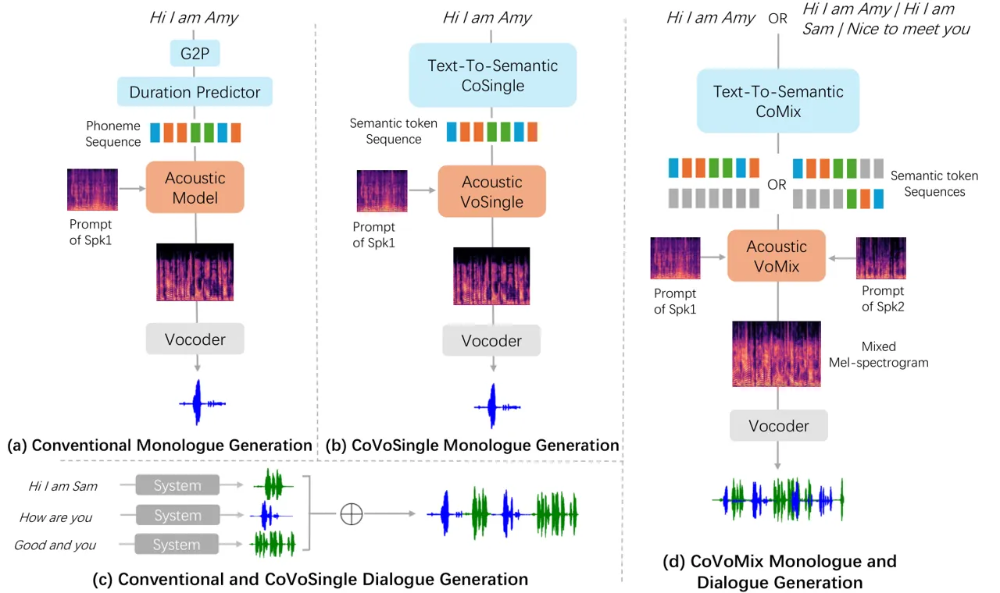

Figure 6: Comparison of generation pipeline among conventional method
and our proposed CoVoSingle and CoVoMix methods.

Figure 7 shows the architecture of text-to-semantic model. We propose
two types of text-to-semantic model: CoSingle and CoMix. CoSingle model
has single-stream decoder, while CoMix applies multi-stream decoder to
generate multiple semantic token sequences for different speakers, as
introduced in Section3.1.

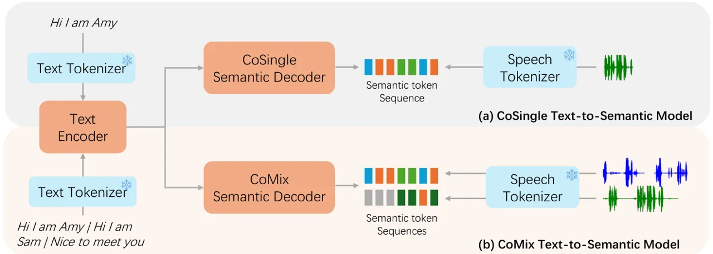

Figure 7: Text-to-semantic model

Figure 8 shows the architecture of acoustic model, a flow-matching based
transformer encoder. We propose three types of acoustic model: VoSingle,
VoMix and VoMix-stereo. VoSingle is a single stream transformer encoder
to generate single talker mel-spectrogram. VoMix and VoMix-stereo have
the same architecture except for the last linear layers, which generate
mono channel mixed mel-spectrogram and multiple single talker
mel-spectrograms respectively.

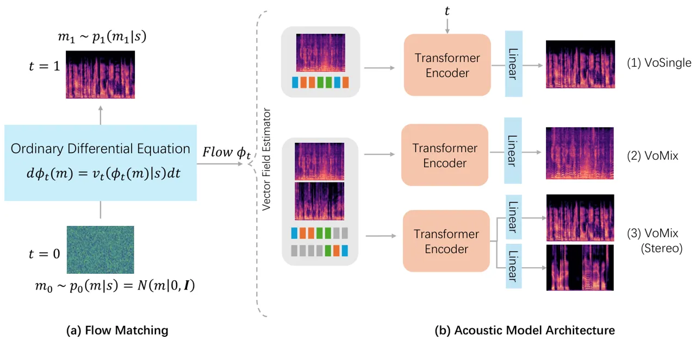

Figure 8: The acoustic model

## Appendix B Additional Experiments

We perform detailed ablation experiments for model combination, model
size and training data.

### B.1 Ablation Study on Model Combination

Table 2 illustrates our proposed systems in monologue and dialogue
evaluation set, which are a combination of text-to-semantic model and
acoustic model. We abbreviate text-to-semantic as T2S and stereo as S.

For monologue generation, CoVoSingle and CoVoMix systems directly feed
the output of text-to-semantic model into the acoustic model. However,
CoVoSinx model set the second semantic sequence as all silence tokens.
The acoustic prompt is extracted from another utterance of the target
speaker.

We first observe that when using the same text-to-semantic model,
different acoustic models influence WER, indicating that the
pronunciation and rhyme also affect the intelligibility of speech. For
example, CoVoSinx achieves better speech intelligibility than CoVoSingle
due to the use of VoMix. The speaker similarity performance for
monologue generation is the similar across models.

For dialogue generation, we notice that stereo systems show comparable
WER than mono systems. Moreover, we observe that stereo systems show
higher NISQA speech quality, indicating that predicting each channel
separately causes less distortion in speech quality than predicting
mixed mel-spectrogram.

|             |          |          |                  |                    |                    |                    |                    |
| ----------- | -------- | -------- | ---------------- | ------------------ | ------------------ | ------------------ | ------------------ |
| System      | T2S      | Acousic  | Monologue        |                    |                    | Dialogue           |                    |
|             |          |          | SIM $`\uparrow`$ | WER $`\downarrow`$ | NISQA $`\uparrow`$ | WER $`\downarrow`$ | NISQA $`\uparrow`$ |
| GroundTruth | /        | /        | 0.59             | 6.10               | 3.03               | 14.91              | 2.73               |
| CoVoSingle  | CoSingle | VoSingle | 0.49             | 9.99               | 3.01               | 11.76              | 2.90               |
| CoVoSinx    |          | VoMix    | 0.49             | 8.78               | 3.12               | 12.27              | 2.97               |
| CoVoSinx-S  |          | VoMix-S  | /                | /                  | /                  | 12.95              | 3.19               |
| CoVoMix     | CoMix    | VoMix    | 0.49             | 8.95               | 3.01               | 19.84              | 2.87               |
| CoVoMix-S   |          | VoMix-S  | /                | /                  | /                  | 20.35              | 3.00               |

Table 2: Objective evaluation on monologue and dialogue for mono and
stereo acoustic model

### B.2 Ablation Study on Discrete Semantic Representation and Model Size

Figure 9 compares the speaker similarity of oracle phoneme, predicted
phoneme using duration predictor, oracle semantic token, and predicted
semantic token using text-to-semantic model under the same architecture
of acoustic model.

First, we observe that larger acoustic model improves the speaker
similarity of the generated speech as the model layer deepens. Second,
the similarity using semantic token sequences is higher than using
phoneme and even exceeds oracle phoneme representations. This
demonstrates the advantages of using semantic token sequences, which not
only avoids forced-alignment and improves the word error rate, but also
improves the model’s speaker modeling capabilities. Third, for both
phoneme and semantic token, the predicted representations are not as
good as oracle representations. The duplicated semantic token sequence
is more difficult to predict, leading to a bigger gap between oracle and
prediction, indicating further improvement space for the performance and
accuracy of text-to-semantic model in the future.

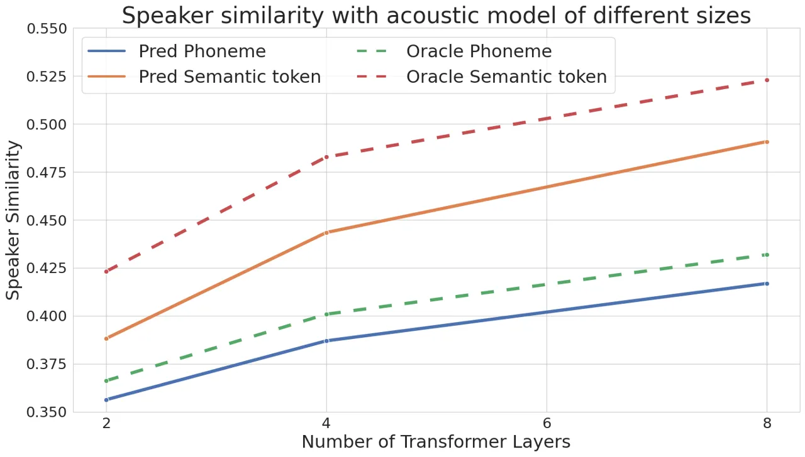

Figure 9: Speaker similarity across acoustic model of different size

### B.3 Ablation Study on Data Augmentation for Text-To-Semantic Model

When the total amount of data is deterministic, the diversity of data,
such as data duration and the dialogue content, becomes important. Table
3 shows the performance of text-to-semantic model with different data
augmentation method on monologue and dialogue generation in terms of
correctness. In this study, the acoustic model used only contains 2
transformer layers instead of 8 layers mentioned in 4.2 for faster
inference. We incorporate a diverse training dataset including both
short and long sentences for the text-to-semantic model to accurately
generate dialogues of varying lengths. The long monologue has a minimum
duration of 10 seconds, whereas the short monologue has minimum duration
of 1 second. Additionally, we enhance data variety by simulating
dialogues from monologues through concatenation, which also improved the
prediction accuracy of semantic token sequences. As a result of
utilizing monologue data of different lengths and synthetic dialogue
data, the text-to-semantic model demonstrated the best performance.

|               |               |                 |                |                    |          |
| ------------- | ------------- | --------------- | -------------- | ------------------ | -------- |
| Training Data |               |                 |                | WER $`\downarrow`$ |          |
| Real Dialogue | Simu Dialogue | Short Monologue | Long Monologue | Monologue          | Dialogue |
| ✓             | $`\times`$    | $`\times`$      | $`\times`$     | 28.50              | 22.30    |
| ✓             | $`\times`$    | ✓               | $`\times`$     | 11.99              | 21.82    |
| ✓             | ✓             | ✓               | $`\times`$     | 11.22              | 20.79    |
| ✓             | ✓             | ✓               | ✓              | 10.54              | 20.87    |

Table 3: Ablation study of data augmentation methods

## Appendix C Extension to Voice Conversion

In addition to zero shot speech synthesis, our methods can also achieve
voice conversion for single person monologues and multi talker
conversations. VoSingle performs voice conversion of dialogue by
processing each channel individually and then mix them up, while VoMix
model achieves voice conversion simultaneously.

Table 4 demonstrates the objective results in monologue and dialogue
scenario. We notice that in addition to achieving high speaker
similarity, these systems can also achieve high spectral similarity,
indicating the strong zero-shot voice conversion capability of our
proposed system. Moreover, VoMix performs better than VoSingle in both
monologue and dialogue sets.

| Type      | System   | SIM $`\uparrow`$ | MCD $`\downarrow`$ |
| --------- | -------- | ---------------- | ------------------ |
| Monologue | VoSingle | 0.47             | 6.47               |
|           | VoMix    | 0.49$`\dagger`$  | 6.46               |
| Dialogue  | VoSingle | /                | 6.70               |
|           | VoMix    | /                | 6.59$`\dagger`$    |

Table 4: Objective evaluation on voice conversion for monologue and
dialogue generation. The symbol "$`\dagger`$" is used to indicate that
the system performance is significantly different (p\<0.01) from
VoSingle system

## Appendix D Experiment Statistical Significance

In order to determine statistical significance of the main experiment in
Table 1, we first use numpy.mean and numpy.std in python to calculate
the mean and the standard deviation of objective metrics across the test
set in Table 5. Moreover, we use z-test to determine if the differences
are statistically significant. We notice that results are statistically
significant for WER, MCD and NISQA in both monologue and dialogue
evaluation sets. Similar to subjective evaluation result, the speaker
similarity performance of the CoVoSingle and CoVoMix systems are
relatively close and do not show significant differences. Besides, the
WER has a large deviation because the text-to-semantic model might
synthesize speech with omitted or duplicated words, as mentioned in the
limitation part in Section 7.

| Eval Set  | System     | SIM $`\uparrow`$ | WER $`\downarrow`$     | MCD $`\downarrow`$   | NISQA $`\uparrow`$   |
| --------- | ---------- | ---------------- | ---------------------- | -------------------- | -------------------- |
| Monologue | CoVoSingle | 0.49±0.17        | 9.99±9.02              | 6.15±1.85            | 3.04±0.39            |
|           | CoVoMix    | 0.49±0.18        | 8.95±8.68$`\dagger`$   | 6.04±2.03$`\dagger`$ | 3.01±0.44$`\dagger`$ |
| Dialogue  | CoVoSingle | /                | 11.77±9.00             | 6.91±1.87            | 2.90±0.28            |
|           | CoVoMix    | /                | 19.84±19.83$`\dagger`$ | 6.82±2.12$`\dagger`$ | 2.87±0.37$`\dagger`$ |

Table 5: Objective evaluation results for monologue and dialogue
generation across various systems. The symbol "$`\dagger`$" is used to
indicate that the system performance is significantly different
(p\<0.01) from CoVoSingle system

To investigate the effect of randomness, we assess the same model using
three different random seeds. For each seed, we evaluate the model
performance and compute the mean and standard deviation across different
seeds. The results are shown in Table 6. Our findings indicate that the
standard deviation among the different random seeds is relatively small,
suggesting that the system exhibits stability in the presence of
randomness.

| Eval Set  | System     | SIM $`\uparrow`$ | WER $`\downarrow`$ | MCD $`\downarrow`$ | NISQA $`\uparrow`$ |
| --------- | ---------- | ---------------- | ------------------ | ------------------ | ------------------ |
| Monologue | CoVoSingle | 0.484±0.005      | 10.206±0.166       | 6.147±0.017        | 3.035±0.014        |
|           | CoVoMix    | 0.488±0.005      | 9.378±0.349        | 6.058±0.015        | 3.008±0.002        |
| Dialogue  | CoVoSingle | /                | 11.903±0.262       | 6.916±0.031        | 2.902±0.002        |
|           | CoVoMix    | /                | 19.542±0.587       | 6.829±0.006        | 2.870±0.008        |

Table 6: Objective evaluation results for monologue and dialogue
generation across various systems with different random seeds

## Appendix E Data Preparation

Algorithm 1 illustrates the dialogue data preparation pipeline,
introduced in Section4.1. The hyper-parameter maxDuration is set to 40
seconds by default.

0:  Dialogue recordings $`y`$, corresponding transcriptions $`x`$,
maxDuration.

1:  Segment dialogues into utterances per speaker: $`y^{A}`$, $`y^{B}`$
with transcripts $`x^{A}`$, $`x^{B}`$ and identity $`z`$.

2:  Sort $`x^{A},x^{B},y^{A},y^{B}`$ by start times into sequences
$`\mathbf{X},\mathbf{Y},\mathbf{Z}`$.

3:  Initialize $`cache=[]`$, $`spkcache=[]`$, $`OutputDialogue=[]`$,
$`OutputTranscript=[]`$.

4:  for each $`(x_{new},y_{new},z_{new})`$ in
zip($`\mathbf{X},\mathbf{Y},\mathbf{Z}`$) do

5:   if $`cache`$ is empty then

6:    Add $`(x_{new},y_{new},z_{new})`$ to $`cache`$; add $`z_{new}`$ to
$`spkcache`$.

7:   else if StartTime$`(y_{new})>`$ EndTime$`(cache[-1])`$ AND
$`|set(spkcache)|>1`$ then

8:    Compile dialogue from $`cache`$.

9:    Compile transcription from $`cache`$ by start time with speaker
change symbol.

10:    Reset $`cache`$ and $`spkcache`$.

11:    Add compiled dialogue to $`OutputDialogue`$, transcription to
$`OutputTranscript`$.

12:   else if EndTime$`(cache[-1])-`$ StartTime$`(cache[0])>`$
maxDuration then

13:    Reset $`cache`$ and $`spkcache`$.

14:   else

15:    Continue populating $`cache`$ and $`spkcache`$.

16:   end if

17:  end for

18:  return $`OutputDialogue`$, $`OutputTranscript`$.

Algorithm 1 Dialogue Data Preparation

## Appendix F Subjective Evaluation Instruction

Figure 10 and Figure 11 shows the CMOS subjective evaluation template
for monologue and dialogue generation respectively. Figure 12 show the
SMOS subjective evaluation template.

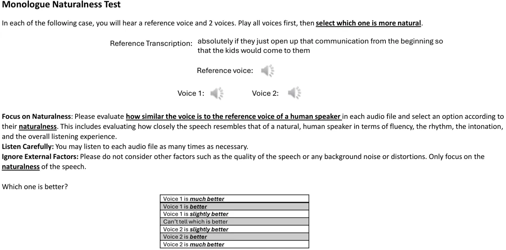

Figure 10: CMOS evaluation template for monologue generation

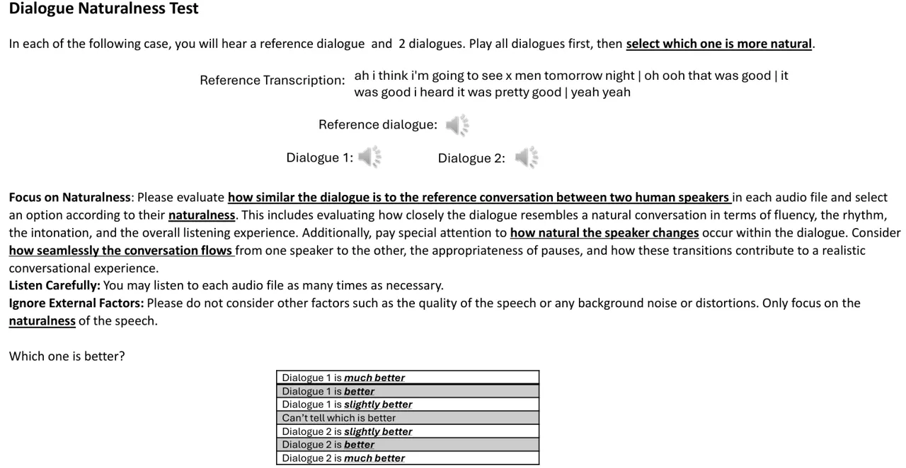

Figure 11: CMOS evaluation template for dialogue generation

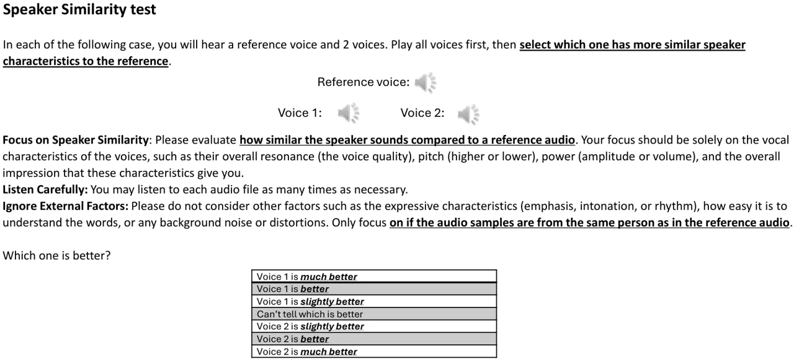

Figure 12: SMOS evaluation template

## NeurIPS Paper Checklist

1.  1.  Claims
2.  Question: Do the main claims made in the abstract and introduction
    accurately reflect the paper’s contributions and scope?
3.  Answer: \[Yes\]
4.  Justification: We introduce CoVoMix, a novel model for zero-shot,
    human-like, multi-speaker, multi-round dialogue speech generation.
    Our experimental results show that CoVoMix can generate dialogues
    that are not only human-like in their naturalness and coherence but
    also involve multiple talkers engaging in multiple rounds of
    conversation.
5.  Guidelines:
    - •
      The answer NA means that the abstract and introduction do not
      include the claims made in the paper.
    - •
      The abstract and/or introduction should clearly state the claims
      made, including the contributions made in the paper and important
      assumptions and limitations. A No or NA answer to this question
      will not be perceived well by the reviewers.
    - •
      The claims made should match theoretical and experimental results,
      and reflect how much the results can be expected to generalize to
      other settings.
    - •
      It is fine to include aspirational goals as motivation as long as
      it is clear that these goals are not attained by the paper.

6.  2.  Limitations
7.  Question: Does the paper discuss the limitations of the work
    performed by the authors?
8.  Answer: \[Yes\]
9.  Justification: In the last section, we mentioned our limitation. We
    have observed instances of words being omitted or duplicated
    occasionally in synthesized speech and the use of low-quality
    dataset may degrade the quality of generated speech.
10. Guidelines:
    - •
      The answer NA means that the paper has no limitation while the
      answer No means that the paper has limitations, but those are not
      discussed in the paper.
    - •
      The authors are encouraged to create a separate "Limitations"
      section in their paper.
    - •
      The paper should point out any strong assumptions and how robust
      the results are to violations of these assumptions (e.g.,
      independence assumptions, noiseless settings, model
      well-specification, asymptotic approximations only holding
      locally). The authors should reflect on how these assumptions
      might be violated in practice and what the implications would be.
    - •
      The authors should reflect on the scope of the claims made, e.g.,
      if the approach was only tested on a few datasets or with a few
      runs. In general, empirical results often depend on implicit
      assumptions, which should be articulated.
    - •
      The authors should reflect on the factors that influence the
      performance of the approach. For example, a facial recognition
      algorithm may perform poorly when image resolution is low or
      images are taken in low lighting. Or a speech-to-text system might
      not be used reliably to provide closed captions for online
      lectures because it fails to handle technical jargon.
    - •
      The authors should discuss the computational efficiency of the
      proposed algorithms and how they scale with dataset size.
    - •
      If applicable, the authors should discuss possible limitations of
      their approach to address problems of privacy and fairness.
    - •
      While the authors might fear that complete honesty about
      limitations might be used by reviewers as grounds for rejection, a
      worse outcome might be that reviewers discover limitations that
      aren’t acknowledged in the paper. The authors should use their
      best judgment and recognize that individual actions in favor of
      transparency play an important role in developing norms that
      preserve the integrity of the community. Reviewers will be
      specifically instructed to not penalize honesty concerning
      limitations.

11. 3.  Theory Assumptions and Proofs
12. Question: For each theoretical result, does the paper provide the
    full set of assumptions and a complete (and correct) proof?
13. Answer: \[N/A\]
14. Justification: This paper mainly focused on the design of generation
    pipeline, model architecture, data preparation, and system
    implementation. We did not propose new theoretical algorithms or
    results.
15. Guidelines:
    - •
      The answer NA means that the paper does not include theoretical
      results.
    - •
      All the theorems, formulas, and proofs in the paper should be
      numbered and cross-referenced.
    - •
      All assumptions should be clearly stated or referenced in the
      statement of any theorems.
    - •
      The proofs can either appear in the main paper or the supplemental
      material, but if they appear in the supplemental material, the
      authors are encouraged to provide a short proof sketch to provide
      intuition.
    - •
      Inversely, any informal proof provided in the core of the paper
      should be complemented by formal proofs provided in appendix or
      supplemental material.
    - •
      Theorems and Lemmas that the proof relies upon should be properly
      referenced.

16. 4.  Experimental Result Reproducibility
17. Question: Does the paper fully disclose all the information needed
    to reproduce the main experimental results of the paper to the
    extent that it affects the main claims and/or conclusions of the
    paper (regardless of whether the code and data are provided or not)?
18. Answer: \[Yes\]
19. Justification: We provide detailed introduction of system design,
    data preparation and training configuration. We use public available
    dataset, provide all codes in the Supplementary and will make them
    publicly available.
20. Guidelines:
    - •
      The answer NA means that the paper does not include experiments.
    - •
      If the paper includes experiments, a No answer to this question
      will not be perceived well by the reviewers: Making the paper
      reproducible is important, regardless of whether the code and data
      are provided or not.
    - •
      If the contribution is a dataset and/or model, the authors should
      describe the steps taken to make their results reproducible or
      verifiable.
    - •
      Depending on the contribution, reproducibility can be accomplished
      in various ways. For example, if the contribution is a novel
      architecture, describing the architecture fully might suffice, or
      if the contribution is a specific model and empirical evaluation,
      it may be necessary to either make it possible for others to
      replicate the model with the same dataset, or provide access to
      the model. In general. releasing code and data is often one good
      way to accomplish this, but reproducibility can also be provided
      via detailed instructions for how to replicate the results, access
      to a hosted model (e.g., in the case of a large language model),
      releasing of a model checkpoint, or other means that are
      appropriate to the research performed.
    - •
      While NeurIPS does not require releasing code, the conference does
      require all submissions to provide some reasonable avenue for
      reproducibility, which may depend on the nature of the
      contribution. For example
      1.  (a)
          If the contribution is primarily a new algorithm, the paper
          should make it clear how to reproduce that algorithm.
      2.  (b)
          If the contribution is primarily a new model architecture, the
          paper should describe the architecture clearly and fully.
      3.  (c)
          If the contribution is a new model (e.g., a large language
          model), then there should either be a way to access this model
          for reproducing the results or a way to reproduce the model
          (e.g., with an open-source dataset or instructions for how to
          construct the dataset).
      4.  (d)
          We recognize that reproducibility may be tricky in some cases,
          in which case authors are welcome to describe the particular
          way they provide for reproducibility. In the case of
          closed-source models, it may be that access to the model is
          limited in some way (e.g., to registered users), but it should
          be possible for other researchers to have some path to
          reproducing or verifying the results.

21. 5.  Open access to data and code
22. Question: Does the paper provide open access to the data and code,
    with sufficient instructions to faithfully reproduce the main
    experimental results, as described in supplemental material?
23. Answer: \[Yes\]
24. Justification: We use public available dataset. We provide detailed
    codes of training, inference and data preparation in the
    Supplementary. These codes will be publicly available.
25. Guidelines:
    - •
      The answer NA means that paper does not include experiments
      requiring code.
    - •
      Please see the NeurIPS code and data submission guidelines
      ([https://nips.cc/public/guides/CodeSubmissionPolicy](https://nips.cc/public/guides/CodeSubmissionPolicy))
      for more details.
    - •
      While we encourage the release of code and data, we understand
      that this might not be possible, so “No” is an acceptable answer.
      Papers cannot be rejected simply for not including code, unless
      this is central to the contribution (e.g., for a new open-source
      benchmark).
    - •
      The instructions should contain the exact command and environment
      needed to run to reproduce the results. See the NeurIPS code and
      data submission guidelines
      ([https://nips.cc/public/guides/CodeSubmissionPolicy](https://nips.cc/public/guides/CodeSubmissionPolicy))
      for more details.
    - •
      The authors should provide instructions on data access and
      preparation, including how to access the raw data, preprocessed
      data, intermediate data, and generated data, etc.
    - •
      The authors should provide scripts to reproduce all experimental
      results for the new proposed method and baselines. If only a
      subset of experiments are reproducible, they should state which
      ones are omitted from the script and why.
    - •
      At submission time, to preserve anonymity, the authors should
      release anonymized versions (if applicable).
    - •
      Providing as much information as possible in supplemental material
      (appended to the paper) is recommended, but including URLs to data
      and code is permitted.

26. 6.  Experimental Setting/Details
27. Question: Does the paper specify all the training and test details
    (e.g., data splits, hyperparameters, how they were chosen, type of
    optimizer, etc.) necessary to understand the results?
28. Answer: \[Yes\]
29. Justification: We introduce in detail the training and test
    configuration, including model architecture, optimizer and
    hyperparameters, etc. We also provide ablation studies for these
    configurations. Corresponding codes are in Supplementary and will be
    publicly available.
30. Guidelines:
    - •
      The answer NA means that the paper does not include experiments.
    - •
      The experimental setting should be presented in the core of the
      paper to a level of detail that is necessary to appreciate the
      results and make sense of them.
    - •
      The full details can be provided either with the code, in
      appendix, or as supplemental material.

31. 7.  Experiment Statistical Significance
32. Question: Does the paper report error bars suitably and correctly
    defined or other appropriate information about the statistical
    significance of the experiments?
33. Answer: \[Yes\]
34. Justification: We demonstrate the experiment statistical
    significance in Appendix. We calculate the mean and standard
    deviation of each system with different random seeds.
35. Guidelines:
    - •
      The answer NA means that the paper does not include experiments.
    - •
      The authors should answer "Yes" if the results are accompanied by
      error bars, confidence intervals, or statistical significance
      tests, at least for the experiments that support the main claims
      of the paper.
    - •
      The factors of variability that the error bars are capturing
      should be clearly stated (for example, train/test split,
      initialization, random drawing of some parameter, or overall run
      with given experimental conditions).
    - •
      The method for calculating the error bars should be explained
      (closed form formula, call to a library function, bootstrap, etc.)
    - •
      The assumptions made should be given (e.g., Normally distributed
      errors).
    - •
      It should be clear whether the error bar is the standard deviation
      or the standard error of the mean.
    - •
      It is OK to report 1-sigma error bars, but one should state it.
      The authors should preferably report a 2-sigma error bar than
      state that they have a 96% CI, if the hypothesis of Normality of
      errors is not verified.
    - •
      For asymmetric distributions, the authors should be careful not to
      show in tables or figures symmetric error bars that would yield
      results that are out of range (e.g. negative error rates).
    - •
      If error bars are reported in tables or plots, The authors should
      explain in the text how they were calculated and reference the
      corresponding figures or tables in the text.

36. 8.  Experiments Compute Resources
37. Question: For each experiment, does the paper provide sufficient
    information on the computer resources (type of compute workers,
    memory, time of execution) needed to reproduce the experiments?
38. Answer: \[Yes\]
39. Justification: We provide detailed configuration of training and
    test, including the GPU, memory, training epochs, evaluation tools,
    etc.
40. Guidelines:
    - •
      The answer NA means that the paper does not include experiments.
    - •
      The paper should indicate the type of compute workers CPU or GPU,
      internal cluster, or cloud provider, including relevant memory and
      storage.
    - •
      The paper should provide the amount of compute required for each
      of the individual experimental runs as well as estimate the total
      compute.
    - •
      The paper should disclose whether the full research project
      required more compute than the experiments reported in the paper
      (e.g., preliminary or failed experiments that didn’t make it into
      the paper).

41. 9.  Code Of Ethics
42. Question: Does the research conducted in the paper conform, in every
    respect, with the NeurIPS Code of Ethics
    [https://neurips.cc/public/EthicsGuidelines](https://neurips.cc/public/EthicsGuidelines)?
43. Answer: \[Yes\]
44. Justification: This research conducted in the paper conforms with
    the NeurIPS Code of Ethics.
45. Guidelines:
    - •
      The answer NA means that the authors have not reviewed the NeurIPS
      Code of Ethics.
    - •
      If the authors answer No, they should explain the special
      circumstances that require a deviation from the Code of Ethics.
    - •
      The authors should make sure to preserve anonymity (e.g., if there
      is a special consideration due to laws or regulations in their
      jurisdiction).

46. 10. Broader Impacts
47. Question: Does the paper discuss both potential positive societal
    impacts and negative societal impacts of the work performed?
48. Answer: \[Yes\]
49. Justification: We discussed broader impacts and potential risks in
    the last paragraph of Section 7.
50. Guidelines:
    - •
      The answer NA means that there is no societal impact of the work
      performed.
    - •
      If the authors answer NA or No, they should explain why their work
      has no societal impact or why the paper does not address societal
      impact.
    - •
      Examples of negative societal impacts include potential malicious
      or unintended uses (e.g., disinformation, generating fake
      profiles, surveillance), fairness considerations (e.g., deployment
      of technologies that could make decisions that unfairly impact
      specific groups), privacy considerations, and security
      considerations.
    - •
      The conference expects that many papers will be foundational
      research and not tied to particular applications, let alone
      deployments. However, if there is a direct path to any negative
      applications, the authors should point it out. For example, it is
      legitimate to point out that an improvement in the quality of
      generative models could be used to generate deepfakes for
      disinformation. On the other hand, it is not needed to point out
      that a generic algorithm for optimizing neural networks could
      enable people to train models that generate Deepfakes faster.
    - •
      The authors should consider possible harms that could arise when
      the technology is being used as intended and functioning
      correctly, harms that could arise when the technology is being
      used as intended but gives incorrect results, and harms following
      from (intentional or unintentional) misuse of the technology.
    - •
      If there are negative societal impacts, the authors could also
      discuss possible mitigation strategies (e.g., gated release of
      models, providing defenses in addition to attacks, mechanisms for
      monitoring misuse, mechanisms to monitor how a system learns from
      feedback over time, improving the efficiency and accessibility of
      ML).

51. 11. Safeguards
52. Question: Does the paper describe safeguards that have been put in
    place for responsible release of data or models that have a high
    risk for misuse (e.g., pretrained language models, image generators,
    or scraped datasets)?
53. Answer: \[N/A\]
54. Justification: Currently we do not have plans for releasing the
    model or dataset. If we are going to release, we will make sure to
    release a safeguard with it.
55. Guidelines:
    - •
      The answer NA means that the paper poses no such risks.
    - •
      Released models that have a high risk for misuse or dual-use
      should be released with necessary safeguards to allow for
      controlled use of the model, for example by requiring that users
      adhere to usage guidelines or restrictions to access the model or
      implementing safety filters.
    - •
      Datasets that have been scraped from the Internet could pose
      safety risks. The authors should describe how they avoided
      releasing unsafe images.
    - •
      We recognize that providing effective safeguards is challenging,
      and many papers do not require this, but we encourage authors to
      take this into account and make a best faith effort.

56. 12. Licenses for existing assets
57. Question: Are the creators or original owners of assets (e.g., code,
    data, models), used in the paper, properly credited and are the
    license and terms of use explicitly mentioned and properly
    respected?
58. Answer: \[Yes\]
59. Justification: All the open-source code and evaluation tools that we
    use are credited in this paper, and the license and terms are
    properly respected.
60. Guidelines:
    - •
      The answer NA means that the paper does not use existing assets.
    - •
      The authors should cite the original paper that produced the code
      package or dataset.
    - •
      The authors should state which version of the asset is used and,
      if possible, include a URL.
    - •
      The name of the license (e.g., CC-BY 4.0) should be included for
      each asset.
    - •
      For scraped data from a particular source (e.g., website), the
      copyright and terms of service of that source should be provided.
    - •
      If assets are released, the license, copyright information, and
      terms of use in the package should be provided. For popular
      datasets,
      [paperswithcode.com/datasets](https://paperswithcode.com/datasets)
      has curated licenses for some datasets. Their licensing guide can
      help determine the license of a dataset.
    - •
      For existing datasets that are re-packaged, both the original
      license and the license of the derived asset (if it has changed)
      should be provided.
    - •
      If this information is not available online, the authors are
      encouraged to reach out to the asset’s creators.

61. 13. New Assets
62. Question: Are new assets introduced in the paper well documented and
    is the documentation provided alongside the assets?
63. Answer: \[Yes\]
64. Justification: We introduce the implementation code as a new asset.
    This asset is well documented with training, license, limitations,
    etc.
65. Guidelines:
    - •
      The answer NA means that the paper does not release new assets.
    - •
      Researchers should communicate the details of the
      dataset/code/model as part of their submissions via structured
      templates. This includes details about training, license,
      limitations, etc.
    - •
      The paper should discuss whether and how consent was obtained from
      people whose asset is used.
    - •
      At submission time, remember to anonymize your assets (if
      applicable). You can either create an anonymized URL or include an
      anonymized zip file.

66. 14. Crowdsourcing and Research with Human Subjects
67. Question: For crowdsourcing experiments and research with human
    subjects, does the paper include the full text of instructions given
    to participants and screenshots, if applicable, as well as details
    about compensation (if any)?
68. Answer: \[N/A\]
69. Justification: Our paper neither involves crowdsourcing nor research
    with human subjects.
70. Guidelines:
    - •
      The answer NA means that the paper does not involve crowdsourcing
      nor research with human subjects.
    - •
      Including this information in the supplemental material is fine,
      but if the main contribution of the paper involves human subjects,
      then as much detail as possible should be included in the main
      paper.
    - •
      According to the NeurIPS Code of Ethics, workers involved in data
      collection, curation, or other labor should be paid at least the
      minimum wage in the country of the data collector.

71. 15. Institutional Review Board (IRB) Approvals or Equivalent for
        Research with Human Subjects
72. Question: Does the paper describe potential risks incurred by study
    participants, whether such risks were disclosed to the subjects, and
    whether Institutional Review Board (IRB) approvals (or an equivalent
    approval/review based on the requirements of your country or
    institution) were obtained?
73. Answer: \[N/A\]
74. Justification: Our paper neither involves crowdsourcing nor research
    with human subjects.
75. Guidelines:
    - •
      The answer NA means that the paper does not involve crowdsourcing
      nor research with human subjects.
    - •
      Depending on the country in which research is conducted, IRB
      approval (or equivalent) may be required for any human subjects
      research. If you obtained IRB approval, you should clearly state
      this in the paper.
    - •
      We recognize that the procedures for this may vary significantly
      between institutions and locations, and we expect authors to
      adhere to the NeurIPS Code of Ethics and the guidelines for their
      institution.
    - •
      For initial submissions, do not include any information that would
      break anonymity (if applicable), such as the institution
      conducting the review.
