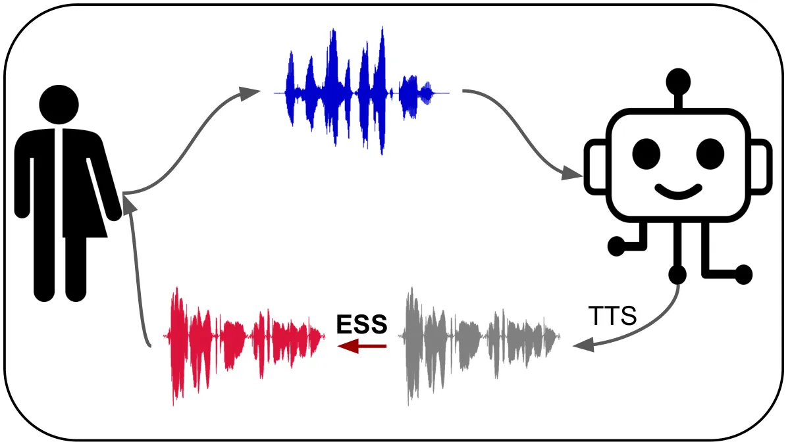
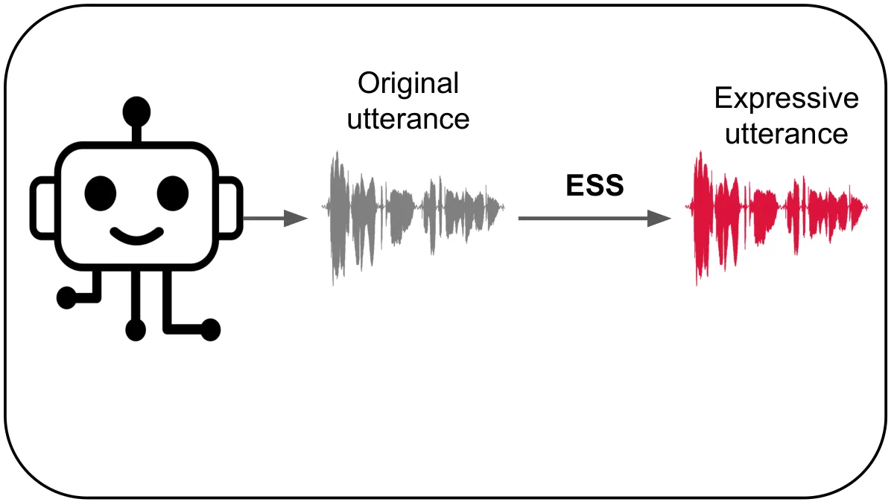
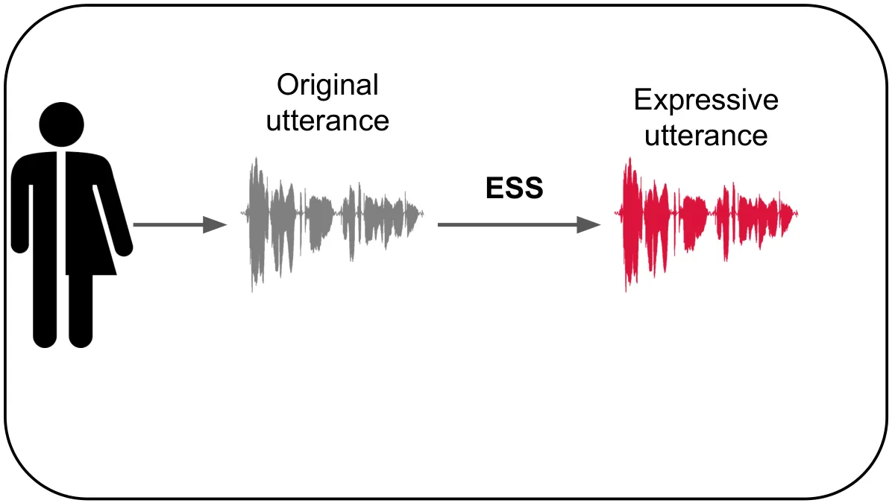
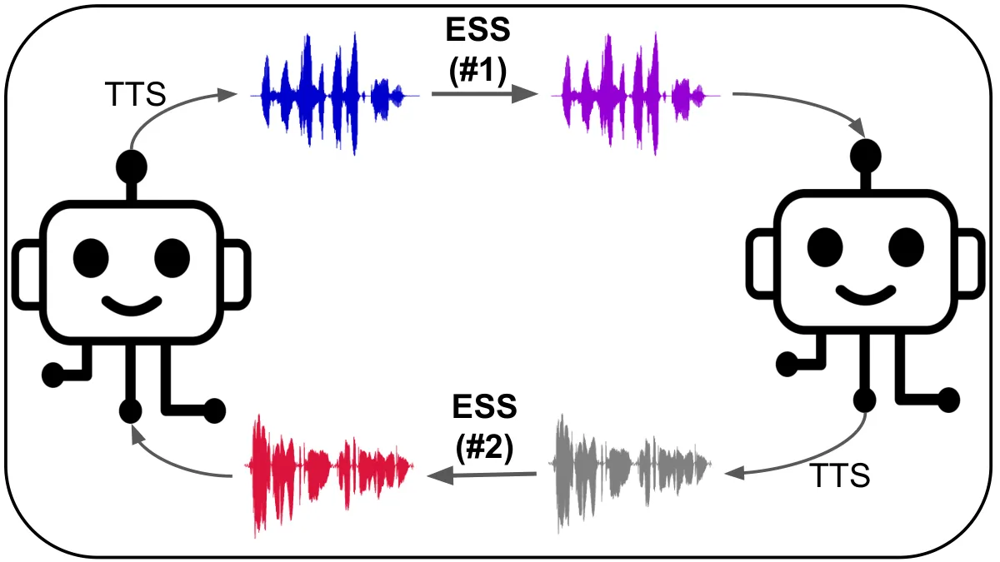
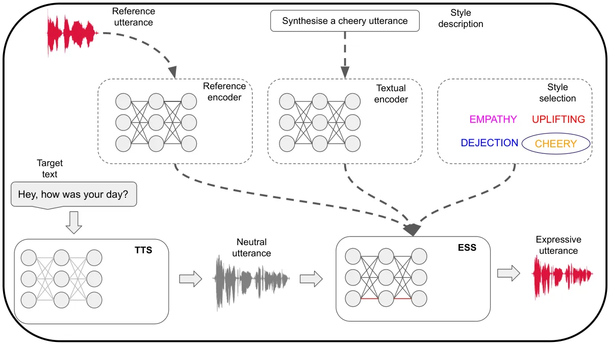
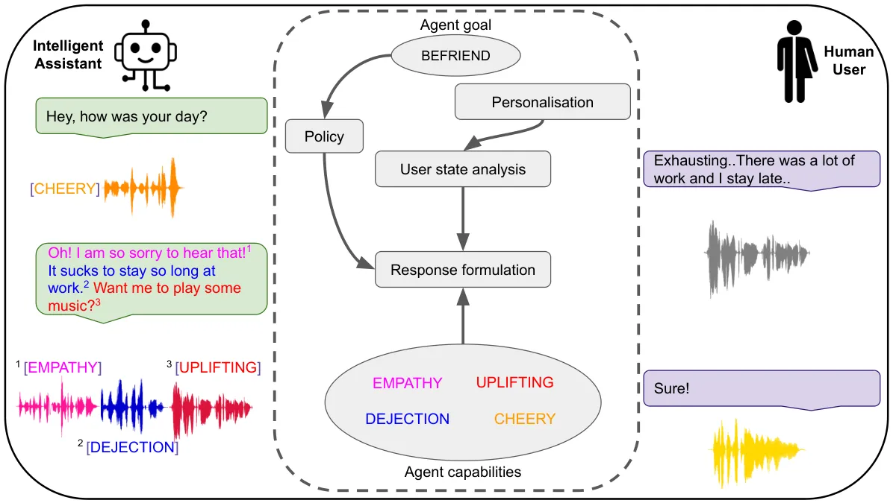
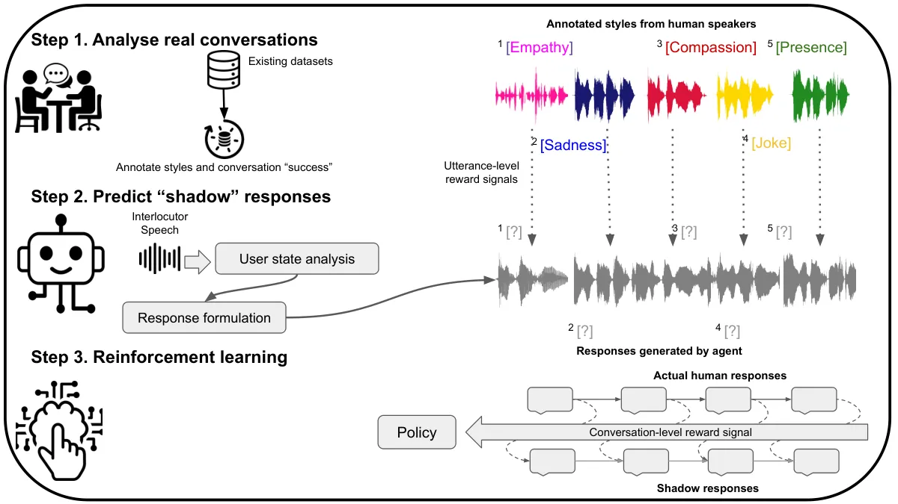

# Expressivity and Speech Synthesis

Andreas Triantafyllopoulos    Björn Schuller

## 1 Introduction

Talking machines have long captured human imagination. Already in
Homer’s Iliad (8th century BC) we read of Hephaestus’ “golden maids”
\[9, Hom. Il. 18.388\] (emphasis ours):

> Waiting-women hurried along to help their master \[Hephaestus\]. They
> were made of gold, but looked like real girls and _could not only
> speak_ and use their limbs but were also endowed with intelligence and
> had learned their skills from the immortal gods.

That they could speak was seen as a prerequisite of intelligence (and
being worthy of serving in a god’s retinue). The first documented
efforts to endow machines with the capacity to speak date back to late
17th century AC, with C. G. Kratzenstein’s vowel resonators \[69\].
Arguably though, the quest for human-like speech synthesis began in
earnest with the advent of computers in the 1950-1960s, with 1961 seeing
the first digital vocoder implemented on an IBM 7090 \[49\]. Ever since,
speech synthesis research has predominantly focused on producing
utterances that accurately convey the target text; in a nutshell, its
end-goal is a system that accepts as input a text sequence and produces
an audio signal such that, when humans are exposed to it, they will
decode it into the identical text sequence.

Despite the fact that even early systems were able to produce speech
that was, to a certain extent, understandable, they were severely
lacking in _naturalness_. This led to a call for improving the
_expressivity_ of synthesised speech; in this context, expressivity was
defined as the mimicking of prosodic, rhythmic, and other paralinguistic
patterns exhibited by humans. In a sense, this imitation was initially
_directionless_, i. e., researchers aimed to copy or approximate human
prosody and rhythm without any direct communicative intent. This
approach has left its mark even on contemporary research and how it
approaches expressivity, as we discuss in Section 3.4.

However, there has been a long, related tradition of research on the
additional communicative and informative functions of speech beyond its
linguistic aspects \[76, 79\]. These additional phenomena can be
collectively referred to as the _paralinguistic_ component of speech. As
discussed in \[79\], paralinguistics can be defined to subsume
_extralinguistics_ to cover a wide gamut of phenomena, from informative
functions regarding nearly immutable speaker characteristics, like age
or gender, to communicative functions regarding short-term states such
as (political) stances and emotions. From this perspective, _expressive
speech synthesis_ (ESS) can then be seen as the _purposeful_ attempt to
imitate specific _states_ and _traits_ through the manipulation of
acoustic and prosodic variables in the synthesised utterance. This is
the main topic of this chapter.

In terms of technical advances, the field has come a long way since the
primitive vocoders of the early computer era. Starting with model- and
‘rule’-based approaches \[49, 24\], quickly moving to data-driven
concatenative synthesis \[2, 52, 65, 50\], and then later to statistical
models \[93, 105\], text-to-speech synthesis (TTS) has progressed in
leaps-and-bounds in recent years with the advent of deep learning (DL)
\[90\]. ESS followed a parallel developmental path to standard speech
synthesis, with Cahn’s Affect Editor \[16, 15\] and Murray’s HAMLET
\[67, 66\] representing the earliest methods relying on rules, while
later approaches transitioned to concatenative \[78, 46\], parametric
\[89, 91\], and, finally, DL-based \[95\] ESS. With each change in
technology came associated gains in fidelity and naturalness \[95\].

This trend is exemplified by the recent wave of advances in the broader
generative artificial intelligence (GenAI) field \[32\]. Progress in
probabilistic generation, currently spearheaded by “diffusion models”
\[103\], have brought GenAI in the epicentre of attention for various
stakeholders – societal, commercial, and, increasingly, regulatory (see
e. g., the recent EU AI Act \[92\]). Text generation has been the most
prominent example of that new era, with large language models (LLMs)
like ChatGPT \[1\], Llama \[94\], or Claude spearheading recent
innovations. Mirroring that success, the quest for ESS breakthroughs is
being taken on by an increasing number of research groups and companies,
and has become a staple of speech technology conferences (INTERSPEECH,
ICASSP, SLT, etc.).

Expectedly, synthesis quality and controllability are improving at an
accelerating rate \[95\]. Moreover, as a result of increased commercial
interest, ESS systems of unprecedented capabilities are being constantly
released to the public, in off-the-shelf, easy-to-use toolkits that can
be co-opted by a wider and wider cohort of lay users for their own
purposes. On top of that, _foundation models_ have recently surfaced as
a key differentiator in GenAI and beyond \[12\] and are beginning to
impact ESS as well \[102\]. This means that we will soon be living in a
“metaverse” \[68\] populated with expressive artificial intelligence
(AI) agents whose voices are indistinguishable to humans, and whose
capabilities may vastly exceed (or enhance) the voices of average
people. Accordingly, this increases the probability that bad actors, or
even well-intentioned users, misuse the technology – a problem
encompassed in the broader AI “alignment” conversation \[33\].

Beyond that, the present situation begs the question: _What else remains
to be done?_ As we argue, contemporary research is largely geared
towards “expressive primitives” – states and traits which are
straightforward to depict and can be simulated within a singular
utterance – and which we call _Stage I_ ESS research. Typical examples
include the synthesis of “emotional voices”: this results in speech
which will be perceived as conveying a particular emotion (e. g.,
happiness). However, a major promise of ESS systems lies in facilitating
a conversational interface between humans and AI agents. In fact, given
the rise of modern text-based conversational agents (i. e., ‘chatbots’)
like ChatGPT \[1\], we expect ESS systems to become embedded in
voice-driven conversation applications, where emulating an emotional
state goes beyond portraying that emotion within a particular utterance.
In other words, _appropriateness_ becomes an essential aspect – what to
say, when, and how. What is more, there are expressive states which
cannot be distilled to a single component, such as political stances,
moods, or dispositions \[79\]. Given the anticipated mastering of
synthesising unitary utterances, we expect an increased focus on
synthesising more nuanced, longer-term states and traits of expressive
agents, as well as adapting to the context of (real-time) conversations
with different individuals. This we call _Stage II_ research, and it is
still in its nascent stages.

This chapter aims to chart this emerging landscape of expressivity in
the era of GenAI. With that in mind, our goal is _not_ to give a
technical survey of state-of-the-art systems, as there exist a plethora
of older and more recent surveys that sketch out the inner workings of
TTS and ESS approaches over the years; we recommend \[78, 105, 50, 90,
95, 103, 8\] as good starting points. Therefore, we intentionally place
limited emphasis on the technical implementations of existing ESS
systems.Instead, we explore deeper questions that are highly pertinent
for the present and future of the field. Among others, we discuss:

- •
  What are the states and traits that we can expect ESS systems to cover
  (cf. Section 2.1)?
- •
  How can we move from classic, simple expressive ‘primitives’ (cf.
  Section 3) to more complex behaviours? How can we jointly synthesise
  multiple – perhaps contradictory – states (cf. Section 4)?
- •
  How can we move away from a ‘one-size-fits-all’ approach and towards a
  more personalised approach to synthesis (cf. Section 4.3)?
- •
  What role do foundation models play (cf. Section 5)?
- •
  Crucially, what happens to the world once we achieve our wildest
  dreams regarding the capabilities of ESS models?

We hope that our discussion of these questions will help shape future
research and provide a template and roadmap for the next generation of
ESS systems. Importantly, our discussion is grounded in the applications
that ESS enables, as these dictate its _ecology_ and thus the
_affordances_ that it may develop, and so set, in turn, the framework
for current and future research efforts.

The remainder of our chapter is organised as follows. We first introduce
a taxonomy of states and traits which can be expressed in speech and
which, accordingly, ESS aims to simulate, followed by a discussion of
the applications which it facilitates. Next, we describe the technical
underpinnings of traditional and contemporary systems. Following that,
we discuss our notion of a _Stage II_ system and review how foundation
models are utilised in this field. Our final section outlines the
ethical considerations entailed by a rapidly advancing technology.

## 2 Expressivity in speech synthesis

In this section, we first present the states and traits which can be
synthesised with ESS, and then the application domains in which ESS has
found, or can be expected to find, widespread adoption.

### 2.1 A taxonomy of expressive states and traits

Figure 1: A non-exhaustive taxonomy of states and traits that humans
express through their speech largely informed by previous work on
recognising them (e. g., see
[http://www.compare.openaudio.eu/tasks/](http://www.compare.openaudio.eu/tasks/)
as well as \[79\]). While these states might not all be relevant for ESS
systems, they illustrate the plethora of styles that can be synthesised.
Further, they help us distinguish between two crucial components – how
long each style lasts, and how persistent its appearance is.

We begin with a basic assumption: that the things which can be
recognised are those that will also be (eventually) synthesised. If
humans, and by extension AI algorithms, can recognise particular
affective states in speech, then there is nothing, in principle,
preventing GenAI algorithms from simulating those states. This
definition allows us to sidestep what _has_ been done by the community
(due to various restrictions including the lack of available data) vs
what _can_ be done (based on evidence that humans can portray particular
states).

Fig. 1 presents a non-exhaustive portrayal of expressive styles that can
be recognised in humans – this serves as inspiration for all that can be
potentially synthesised for computers. It is motivated by similar
taxonomies outlined in \[77\] and \[79\]. Importantly, we distinguish
between two particular axes¹¹ 1 Note that there are other axes in which
these styles differentiate themselves, such as whether they are
event-focused or elicit an appraisal response \[77\].: how long the
underlying affective state lasts and how persistent it is in its
appearance.

The first axis allows us to decompose affective behaviour into _states_
and _traits_ \[79\]. At the extreme, states are short-lived, transient
conditions; these include concepts like emotion or interest. Traits, on
the other hand, are more long-term, less mutable attributes, such as
gender or personality. Naturally, this taxonomy is not a black-and-white
dichotomy, but a colourful spectrum: in-between the two extremes exists
a variety of conditions that vary with respect to their duration,
intensity, and (expected) rate of change.

The second axis instead differentiates how prevalent a state or a trait
is in a person’s speech. Some behaviours are _persistent_; at the
extreme, they are ever-present, and ubiquitously colour almost every
single utterance. On the other end are _episodic_ behaviours; those are
fleeting, appearing only momentarily and within the confines of a single
expression. Crucially, this second distinction is independent of whether
the behaviour is a state or a trait. Some traits, like gender or age,
are both long-term and persistent (they are almost always to be detected
in a speaker’s voice); others, like political orientation or depression
are *episodic*²² 2 A depressed individual will not be sad all the time
and even the most ardent political activist will occasionally take a
break from street protests.. Likewise, even though states themselves are
fleeting, some, like politeness or sincerity, are to be found in a small
set of utterances, while others, like emotion or respiratory diseases
are constantly present -- so long as they continue to be true for a
speaker³³ 3 The interaction of the two axes where a short-lived state
appears intermittently results in _transient_ behaviours, or,
equivalently, limits the amount of episodes to 1.. This temporality is
important for understanding affective behaviour in humans, as, like
\[26\] argues:

> A real possibility is that there may be multiple scales at work even
> in the short term, with some signs building up over a period of
> seconds or minutes and others erupting briefly but tellingly.

This important aspect of timing also calls for different ESS
capabilities. The first, simpler one, requires a mapping from one state
to another; this is applied consistently to all utterances. We call this
_Stage I_ ESS, and it is primarily suitable for synthesising persistent
behaviours. The second, more sophisticated one requires knowing which
utterance to transform into a particular expression; often, the desired
effect is achieved by combining multiple simple expressions from _Stage
I_. We call this _Stage II_ ESS, and it is geared towards long-term,
episodic behaviours.

_Stage II_ is much more challenging than _Stage I_. Specifically, while
the generation of a persistent expression _in situ_ is possible using a
direct portrayal of it, utilising such a portrayal _in context_ to
reflect an episodic expression is substantially more challenging \[22\].
Seen in this light, contemporary ESS systems have mastered the synthesis
of behavioural ‘primitives’ – affective states that can be portrayed
fleetingly, oftentimes within a single utterance or even within a single
word. However, these primitives form the basic building blocks for an
array of more complex states and traits that have thus far remained
elusive, like personality, ideology, stance, friendship, or compassion.

### 2.2 Application domains for ESS



(a) Human-computer interaction



(b) Content creation



(c) Voice enhancement



(d) Computer-computer interaction

Figure 2: Overview of different application domains that can benefit
from expressive speech synthesis: Human-computer interactions entails
the real-time communication between a human and an expressive chatbot;
Content creation encompasses all possible forms of _de novo_ artificial
content creation (e. g., video narration); Voice enhancement is targeted
to the manipulation of a real human’s voice; Finally, computer-computer
interaction sketches a scenario where expressive chatbots communicate
with one another in-the-wild.

Having reviewed the states and traits that ESS can be expected to
simulate, we now turn to its potential real-world applications. We
consider application domains where use of ESS is already widespread,
others, where text-based communication is a given reality, with speech
being the natural extension, and, finally, ones which have not yet seen
much use of ESS, but are ripe for disruption. Some of the fields we
discuss below saw the widespread use of text-based technologies even
before the introduction of LLMs. The unprecedented capabilities offered
by those have naturally disrupted previous standard processes and made
their integration a very active area of ongoing research. It is in this
landscape that we discuss ESS applications.

An overview of the four types of application domains that are highly
relevant for ESS research is given in Fig. 2. ESS systems are, so far,
primarily used to facilitate human-computer interaction. In that
scenario, it is typical to combine ESS with TTS, and create entirely
artificial voices. However, ESS can also be used to transform existing
human voices \[87\] – an application which is similar from a technical
perspective but has different societal implications – or even generate
entirely artificial content, but outside the context of a conversation
(e. g., for marketing). We discuss these three scenarios below.
Moreover, we briefly mention the exotic case of computer-computer
interaction as an emerging new frontier for ESS research.

#### 2.2.1 Human-computer interaction

First and foremost on the list of current and future applications are
conversational agents. Several companies employ text chatbots to offload
some of their workload for customer support, service, or even sales
\[61\], and this field is rapidly growing with the rise of LLMs.
Moreover, different institutions see the promise of conversational
agents in improving their services, like seen in the healthcare domain
\[56\]. Finally, intelligent assistants (e. g., Siri, Alexa, or Google
Assistant), by now pervasive in various consumer gadgets (like
smartphones or even smartwatches), are essentially more advanced
chatbots, with most of those including TTS in their workflow.

Further integrating ESS capabilities to all these conversational agents
is a straightforward extension of their present state \[5, 42\]. We thus
expect this application domain to be both a key driver and an early
adopter for future advances. In terms of expressivity, conversational
agents may place an emphasis on interpersonal adaptation to the user,
appearing helpful, empathetic, or show any other personality trait that
is desirable to their creators.

#### 2.2.2 Content creation

Besides interacting with humans, ESS can be used to facilitate the _de
novo_ creation of new content, especially when combined with the
impressive capabilities of broader GenAI models. Marketing is a domain
seeing increased use of GenAI technologies \[54\], where employing ESS
to accompany automatically generated illustrations or videos is
attracting community attention. In the extreme, this can go as far as
creating entirely virtual personas, or artificial _influencers_, which
populate digital spaces and promote marketing material in a more
naturalistic way than a simple commercial can ever do \[75\].

On the darker side of speech science, ESS can vastly expand the capacity
of bad actors to spread misinformation. This can be done as a
straightforward case of “marketing”, albeit for an evil cause, with ESS
being used for promotional material around fake news in the same way as
a company may use it to promote its product. For example, _vishing_ –
the use of voice calls for phishing – is one area ripe for disruption
from ESS software \[53\]. In its present form, performed by humans, it
is already a major societal and legal problem⁴⁴ 4 See a recent report by
the United States’ Federal Bureaue of Investigation:
[www.ic3.gov/Media/PDF/AnnualReport/2021_IC3Report.pdf](https://www.ic3.gov/Media/PDF/AnnualReport/2021_IC3Report.pdf).,
and is bound to get worse as ESS facilitates a scaling up of resources
available to bad actors that engage in this practice.

#### 2.2.3 Voice enhancement

ESS can also be used to augment or enhance one’s own voice to attain
specific expressive attributes that it is lacking. This can be done both
short-term, e. g, when one sends a short voice message to their partner
and wants to convey some additional affect they are not able to express
at the moment, such as excitement for an upcoming dinner that they are
not presently feeling due to fatigue, but also long-term, e. g., to
manipulate one’s entire persona for a social media profile. For example,
female politicians have sometimes undergone intentional training to
change their manner of speaking, with Hilary Clinton and Margaret
Thatcher purportedly switching to a more masculine voice \[17, 48\]. In
the future, this may be achieved by a simple application of voice
conversion.

Beyond one’s self, however, ESS can be used to transform the voice of
others – usually for malicious purposes. This is essentially a more
subtle form of _deep faking_ \[19\], where instead of using GenAI to
fabricate a non-existent statement from an individual, one may use voice
transformation to distort the original message. As a recent example,
much debate revolved around the age of the United States president at
the time of writing, Joe Biden. A similar use of voice technology could
make him appear older than he actually is, thus intensifying his
opponents’ accusations regarding his suitability as a candidate. This
more subtle form of manipulation is perhaps more subversive than
outright fakes; while those can be vetted and refuted based on evidence
and facts, minute changes to the voice of a speaker that cast them in a
negative light will be much harder to identify. Broadly, this subtle
transformation of one’s voice can be used to harm political or
commercial opponents, or even entire social groups, and we expect it to
become a major societal issue in the future.

#### 2.2.4 Computer-computer communication

Finally, we want to highlight that in a world were conversational agents
and intelligent assistants are increasingly deployed to perform more
complex tasks autonomously, such as booking appointments or handling
business transactions, we can expect that these systems will also
encounter artificial interlocutors throughout their lifecycles. For
example, one person’s intelligent assistant might attempt to book an
appointment over the phone with a company’s artificial customer service
agent. In that case, both systems might presumably use ESS to achieve
the desirable outcome while remaining oblivious to the fact that they
are communicating with another machine. This raises interesting
implications both on how these systems will react and the types of
affordances they will need to develop for success (assuming they are to
some extent learning autonomously).

## 3 Stage I: Synthesising expressive primitives

In this section, we discuss the technical aspects behind generating
_short_ utterances that convey one particular expressive state,
beginning with a historical overview and continuing with a discussion of
how the basic principles of generative models can be applied to the
generation of speech and vocal bursts. We provide more background on
stochastic generative models in Appendix A and extend this discussion
with more technical details in Appendix A. We additionally provide an
overview of how speech utterances and vocal bursts are synthesised. The
section finishes with a discussion of the controllability of ESS models.

### 3.1 A blitz history lesson

Expressivity was embedded in TTS systems from their first incarnation.
The first vocoder by \[49\] allowed for the manipulation of prosodic and
timbre attributes that are related to affect \[77, 79\]. However, the
first documented attempts to use this functionality came much later,
with rule-based systems like HAMLET \[67, 66\] and Affect Editor \[16,
15\]. These manipulated attributes which are known to correlate with
affect, such as pitch or timing. These parameters were later
investigated in a data-driven fashion \[14\], but, by and large, this
first era of ESS largely depended on rules and expert knowledge.

The next generation featured concatenative synthesis \[96, 78, 11, 46\],
which relied on selecting speech units uttered with the appropriate
expressions from an existing corpus. We note that at this point, the
‘sister’ field of TTS had already progressed to statistical parametric
speech synthesis (SPSS), where trainable modules are learnt from data,
and this was readily co-opted for ESS too \[89, 91\]. Typically, these
models were implemented with hidden Markov models (HMMs) and were
trained to map prosodic and spectral features from a ‘neutral’ to an
expressive state. Most often, this necessitated a cascade pipeline, with
the initial synthesis made with a standard TTS tool and an extra
conversion ESS module applied on top. Learning this transformation
usually required _parallel_ data – corpora containing audio pairs which
only differed in the expressed state but everything else (speaker, text)
remained the same.

With the advent of deep learning, HMMs were substituted with deep neural
networks (DNNs) \[95\], but the key principles remained the same. A
mapping from some neutral state to an expressive one was learnt from
data. However, the capabilities of DNNs further allowed for a
disentanglement between the different components of speech, thus no
longer demanding parallel data. This enabled a radical scaling-up of the
available speech that could be used for training, an increase which went
hand-in-hand with the accompanying increase in model size and
complexity.

The most recent “GenAI era” brought further advances, primarily with the
introduction of denoising diffusion probabilistic models (DDPMs) and
other generative methods \[41\]. Moreover, the rapid explosion in LLMs
and, increasingly, multimodal foundation models (MFMs) (i. e., models
which can jointly handle multiple modalities, usually including
language) opened up new avenues in the _controllability_ of ESS \[95\].
This is the state-of-play at the moment of writing.

The core idea behind modern-day, statistical generative model is to
_approximate_ the generative distribution of the data they have been
trained on; in the case of speech, this is the generative distribution
that corresponds to natural speech. Once this is done, these
approximation models can be _sampled_ to synthesise realistic samples.
Nowadays, research primarily employs DNNs to learn this mapping from
target text to waveform. Much of the recent research on statistical
generative models (SGMs) has been focused on improving the effectiveness
of the models in order to more closely approximate the underlying
distribution, as well as improve their controllability in order to make
the generation process more malleable to the requirements of the user.
In the next subsections, we discuss how these models can be used to
generate speech and vocal bursts, as well as how they can be explicitly
controlled to procure the desired outcome. We give a more detailed
description of their mathematical underpinnings in Appendix A.

### 3.2 Expressions in speech



Figure 3: Overview of a typical ESS pipeline. An input text is first
synthesised in a neutral style (gray) and then transformed to expressive
speech (red) – although these steps can also be integrated in an
end-to-end model. The style is controlled either by a) a reference
encoder which accepts as input a speech sample having the required
style; b) a textual description in free text; c) a ‘tag’ which allows
the user to select from a fixed set of predefined styles.

Synthesising expressive styles in speech entails the manipulation of
those voice parameters which convey affective information: pitch, voice
quality, rhythm, and pronunciation. As we saw in Section 3.1, in the
early days of ESS, these parameters were explicitly manipulated by
rule-based systems. With the recent rise of SGMs, the community has
primarily focused on learning mappings from one expressive style
(usually neutral) to another, with the models implicitly transforming
those parameters as needed.

Fig. 3 shows how this mapping can be achieved in practice: Typically,
the text that needs to be produced is transformed to a neutral utterance
using TTS; this text is determined based on a linguistic module, such as
an LLM; then, the appropriate style is applied to this utterance using a
cascade voice conversion model. In recent years, end-to-end models that
start from text and directly output an expressive utterance are
increasingly becoming the norm. In either case, the expressive style is
controlled as discussed in Section 3.4 – with a reference utterance, a
linguistic prompt, a tag, or some combination of the above. The list of
ESS models is very long and beyond our scope here – we refer to \[95\]
for a recent survey, although more and more models come out each year.

### 3.3 Vocal bursts

Non-verbal vocalisations, or “vocal bursts”, also play an eminent role
in expressing affect \[83\]. A timely exclamation can convey agreement,
compassion, understanding, or support more easily than a verbal message,
especially in the form of backchanelling during a real-time conversation
\[44, 21\]. When the demo for Google Assistant was unveiled, the crowd
first erupted in cheers at the assistant’s “mm-hmm” near the end of the
video – a startling depiction of the importance we place on vocal bursts
\[95\]. Until recently, however, their synthesis has received far less
attention than their verbal counterparts. This is quickly changing.
Notably, the Expressive Vocalisations (ExVo) series of workshops has
called attention to their generation and provided the first challenge on
synthesising vocal bursts, drawing increasing interest to this task
\[7\].

In principle, the process for generating a vocal burst is similar to
that of an expressive speech utterance and can be handled by a
specialist SGM trained explicitly for this task. Perhaps even more so
than verbal expressivity, the key challenge lies with knowing when to
output such a vocalisation. Timing is essential to transmit the
appropriate message – and this is where _Stage II_ ESS becomes even more
important. We discuss this further in Section 4.

### 3.4 Controllability

The main hurdle to a successful, SGM-based _Stage I_ ESS system is
achieving a satisfactory degree of _controllability_ \[95\].
Controllability corresponds to conditioning the generation model (see
Appendix A) with additional information that _guides_ the generation
process towards an output that matches certain requirements.

One-hot encoding: The standard form of conditioning relies on a
constrained label space. These labels encode the different states and
traits that can be synthesised by the ESS system. The typical
representation of those labels is a ‘one-hot’ encoding, i. e., a 1D
vector with dimensionality equal to the number of labels, populated with
zeros everywhere except a single 1 in the element corresponding to the
target class (some more advanced forms of encoding allow mixed classes;
cf. Section 4.2). In the simplest case, a different one-to-one model is
trained and sampled for each state/trait combination; then, the label is
simply used to select the appropriate model. However, most recent works
prefer to inject the label as additional information to the generating
module (e. g., the decoder in an encoder-decoder architecture; see \[73,
95\]).

The major downside of one-hot encoding is that it only covers a
restricted amount of expressive attributes that can be synthesised.
Moreover, given that it represents categories, it is only suitable for
concepts that are categorical in nature. For example, in the case of
synthesising emotions, it is mostly used to synthesise categorical
emotions, e. g., relying on Ekman’s ‘big-6’ \[31\]. This is severely
restricting the choices of ESS creators, which is why the community is
transitioning to the following two forms of conditioning.

Audio prompts: A more natural form of conditioning relies on (short)
speech snippets that are uttered in the desired style \[99, 80, 84\].
These short snippets are given as inputs along with an input text
sequence or audio sample (synthesised in neutral voice) – or both. ESS
models that are controlled via audio prompts feature an additional
prompt encoder, which maps the input audio to a set of embeddings that
only encode the required style⁵⁵ 5 Usually, this is ensured by
supplementary training losses \[107\].. The ESS model then learns to map
the input utterance to the target style specified by the additional
prompt. In the literature, this process is also known as _reference
encoding_ \[99, 95\] or _style transfer_ \[47\].

During training, these audio prompts are drawn from a pool of available
data (oftentimes the same data the input and target utterances are drawn
from). During inference, they are instead given by the downstream user
(though sometimes the user may select a style from some pool of
references).

The main downside of auditory prompting is that the reference samples
encompass a lot more information than the targeted expressive state
\[95\]. For example, they additionally include information about the
prompt speaker’s sex, age, ethnicity, or any other attribute that is
encoded in the speech signal. Moreover, as mentioned in the introduction
of this chapter, this form of conditioning primarily follows the
paradigm of a _directionless_ mimicking of a particular expressive
state, without linking the expression that is generated to an underlying
state. It is thus particularly challenging to _disentangle_ all the
different components such that only the required style is propagated to
the main synthesis network \[100\]. Recent works have taken aim at this
challenge by introducing complementary losses to emphasise this aspect
during training \[107\], but despite their success, disentanglement
remains an open problem.

Linguistic prompts: Lately, and especially with the recent rise of LLMs,
it has become possible to condition ESS models using linguistic prompts
\[38, 60, 81\]. This is arguably the most natural form of controlling
the models, as it makes it more intuitive – and reproducible – for
downstream users. The general layout is the same: the user gives an
input prompt (“Generate a pleasing voice”), which is passed to a text
encoder to generate embeddings that are then propagated to the synthesis
module and the whole system is trained end-to-end (though some
components might be frozen).

The intuition behind this form of conditioning is that the text encoder
encapsulates knowledge about how a particular expression sounds. In the
case of LLMs, this knowledge is incorporated through its pretraining on
very large corpora and uncovered via prompting or finetuning. The
downside is that the model may inherit the biases which accompany the
text encoder(as is always the case using transfer learning; see also
\[12\]).

## 4 Stage II: Synthesising complex behaviours

We noted in Section 2.1 how _temporality_ is a vital aspect of ESS.
Section 3 discussed how GenAI models can be used to synthesise a set of
behavioural primitives – simple affective states that can be understood
within a singular utterance (or vocal burst). The particular primitives
that can be synthesised constitute the set of _affordances_ made
available by a _Stage I_ ESS system. We now turn to how an AI
conversational agent can utilise these affordances to advance its _Stage
II_ capabilities.



Figure 4: Overview of an _Stage II_ ESS workflow, where an intelligent
assistant pursues its overall goal of befriending a user, a goal which
in turn guides each conversation. The middle panel shows the inner
workings of the agent, while the side panels show the outcome of the
conversation. The agent monitors the user’s affective state and adjusts
its responses accordingly, picking from an array of available expressive
styles. We note that the styles available to the agent are not
necessarily as interpretable as the ones we outline here; rather, we
actually expect self-learning agents to develop their own internalised
concepts which perhaps remain opaque to humans (see text for a more
detailed discussion).



Figure 5: Blueprint for training a _Stage II_ ESS pipeline. Training is
first bootstrapped using available human-to-human conversations, with
the agent rewarded for matching the next response by one of the two
interlocutors. This initial training can be succeeded by a second
reinforcement learning stage where the agent is fine-tuned on
human-to-machine conversations, generated either _on-policy_ (i. e., by
the agent being currently trained, perhaps in online fashion) or
_off-policy_ (i. e., relying on prerecorded conversations).

### 4.1 Learnt expressive policies

A conceptual example for how a _Stage II_ ESS agent operates is shown in
Fig. 4. It illustrates how an intelligent assistant with the overall
goal to ‘befriend’ an individual may utilise different expressive styles
to achieve its goal depending on the context of an interaction. It may
begin with a \[CHEERY\] message, then understand that the user is in a
rather dejected mood, and choose to respond with \[EMPATHY\] and its own
\[DEJECTION\], before proceeding with another attempt for an
\[UPLIFTING\] utterance. The choice of styles and their ordering is set
by the agent’s _policy_, which takes into account the present
interaction and the user’s overall preferences.

The expressive primitives available by _Stage I_ ESS can thus be
considered as a set of available *actions*⁶⁶ 6 These actions are
intentionally reminiscent of acts in speech act theory \[6\]. However,
they are not entirely the same concept. While their aim is to help
‘achieve’ the agent’s goal(s), they do not have a direct mapping to the
performative context of some speech acts. that an agent can choose from
at each conversational turn (or even in-between, in the case of
backchanneling). These actions must be combined over several turns to
achieve a particular *goal*⁷⁷ 7 In general, they might also have to be
combined over several interactions with the same users, for example in
order to communicate some long-term state like political stance or
ideology.. This high-level goal can be achieved by utilising an
appropriate chain of actions.

Importantly, the _policy_ for selecting the appropriate set of actions
can be either hardcoded or learnt. In the latter case, our
conceptualisation is amenable to a standard reinforcement learning (RL)
framing \[88\]. Fig. 5 shows a blueprint for how a policy can be learnt
from conversational interactions: An initial bootstrapping phase allows
learning to generate appropriate responses from observing human-human
conversations; in that phase, the agent is tasked with generating
“shadow” responses for one or both of the interlocutors, and attempts to
match the actual response of a human. The underlying assumption here is
that humans more often than not pick the most suitable response in a
conversation. This assumption can be relaxed by annotating some
conversations with respect to how ‘successful’ they were (although we
still expect a large benefit from pre-training on unlabelled large data
before using annotations). On a second step, the agent is used for
actual human-machine conversations, where it receives a positive reward
when it achieves its goals. There, the agent actually partakes in a
conversation, selects the most suitable action combination using its
present policy, receives its reward in the form of feedback, and updates
its policy accordingly.

Similar to contemporary RL systems, the process can involve human
interlocutors (i. e., a reinforcement learning from human feedback
(RLHF) setup as proposed in \[36\]) or be bootstrapped with self-play
using artificial agents \[82\] – both strategies which have proven
successful in other RL problems. Moreover, the hierarchy of system goals
can be extended to more levels than two. In our example, \[EMPATHY\] may
be a sub-goal of \[BEFRIEND\], which in turn might be a sub-goal of
\[SUPPORT\], or even, on a potentially more sinister turn, of
\[INFLUENCE\] and \[DECEIVE\]. This framework thus allows for an
extension of the affordances that an agent can employ – or even
autonomously acquire throughout its life-cycle. We note that we have
selected these styles for illustration purposes only; in fact, we expect
ESS models to rely on internalised constructs that remain, to a smaller
or greater extent, uninterpretable to humans (especially when
incorporated in the inner space of foundation models; cf. Section 5).

Intriguingly, RL training may further lead ESS models to uncover
entirely novel forms of expression that are not (presently) used by
humans. We note that the emergence of new expressive styles is common
for humans – and is further impacted by modern media \[4\]. In
principle, there is nothing preventing artificial ESS models to
introduce such styles, which humans may then choose to mimic, either
explicitly or implicitly (i. e., simply owning to the popularity of
those styles in social media and beyond).

### 4.2 Mixed-state synthesis

Oftentimes, the state that an agent needs to express is _mixed_ and
comprises multiple simpler states that need to be synthesised jointly.
Stress is a good example. \[58, p. 35\] argued that: “When there is
stress there are emotions… when there are emotions, even positively
toned ones, there is often stress too…” Another one, perhaps more
pertinent to affective agents, is _compassion_ \[35\].

Some research efforts have targeted the synthesis of mixed states
\[108\]. Typically, these try to _interpolate_ between two or more
‘clear-cut’ elements, thus resulting in a new construct that lands
somewhere in between. For instance, happiness and sadness can be
interpolated to obtain a _bittersweet_ state.

Technically, this effect can be achieved by actually interpolating
between the embedding spaces characterising the two initial states;
assuming that this space is sufficiently well-behaved, a mathematical
interpolation (e. g., averaging or taking the geodesic mean) will result
in a point in that space that maps to an ‘in-between’ state. This is
congruent with the _semantic space theory_ recently proposed by \[25\],
which postulates that emotions exist on a well-behaved manifold, whose
traversal yields smooth transitions between the different emotions.

However, there exists another side to synthesising mixed-states.
Previous work has focused on expressing a single new state which
characterises an entire utterance – this is equivalent to our _Stage I_
ESS capabilities discussed previously. The corresponding _Stage II_
implementation would require the interlacing of multiple states in a
longer segment comprising multiple utterances, some of one state, some
of the other – and some in-between. Crucially, planning the trajectory
between successive states to achieve the required effect, as well as
managing the corresponding transitions, requires the higher-level
capabilities of a more advanced policy of the kind envisioned above.
This still remains open-ground for ESS systems.

### 4.3 Personalised expressive speech synthesis

Expressivity exists in the ears of the beholder. How a speaker is
perceived depends on the background and current affective state of the
listener. Previous research suggests that personal effects mediate both
the perception of expressive primitives and more complex behaviour. For
example, different age, gender, and culture groups have been found to
perceive emotions differently \[27, 10, 106\], while the relatively low
to moderate inter-annotator agreements found in several contemporary
speech emotion recognition (SER) datasets demonstrates how
individualised the perception of affect may be (e. g., see \[63\]).
Consequently, this means that AI conversational agents must learn to
adapt in-context to their interlocutor, a feat that is being pursued for
LLMs \[51\].

To achieve this, it is necessary for AI agents to actively monitor their
interlocutors during a conversation. On a first level, they may try to
identify their demographics; this helps frame their interlocutor as
belonging to particular groups with known preferences. On a deeper
layer, the agents must identify how their interlocutors perceive
expressivity. This can be a achieved by a trial-and-error process, where
the agent makes attempts to express particular states and gauges the
response they elicit. Essentially, this fits into the RL framework
outlined in Section 4, where the agent first selects an appropriate
_action_ given its current _policy_ and overarching _goal_, and
subsequently updates that policy given the _reward_ received by the
‘environment’ (i. e, the difference between the user state that the
agent aimed for and the one it actually elicited).

Finally, we note that this interpersonal adaptation additionally
subsumes _entrainment_ \[13, 3\]. Entrainment is the process of
convergence that happens between two conversational partners, a
prerequisite for a successful and enjoyable conversation. It manifests
as a gradual adaptation to the linguistic structure and the
paralinguistic expressions of the other – and generally happens from
both partners. Conversational agents must therefore include entrainment
in their affordances. This requires an analysis (implicit or explicit)
of their interlocutor’s manner of speaking. This analysis can be coupled
with the state and trait analysis mentioned above, and can broadly cover
more granular paralinguistic markers such as pitch, tempo, and even
timbre, or linguistic behaviour ranging from word-use to deeper
grammatical structure.

Overall, we consider personalisation to be an exciting new frontier for
ESS (and LLMs, see \[51\]), given that most existing systems lack a
‘feedback mechanism’ that allows them to adapt to each new user. Prior
research has been largely focused on obtaining good, ‘universal’
expressivity, but with that goal now closer to sight, it might be time
to switch to a more modular, malleable, and adaptive approach.

## 5 Foundation models and emergence

The introduction of foundation models (FMs), and especially generative
large audio models (LAMs), has paved the way for a novel paradigm of
synthesis, especially as it pertains to controllability. Specifically,
while LAMs (so far) follow the same basic operating principles as
traditional SGMs, their scale and amount of data they have consumed in
training gives rise to _emergent_ properties – properties that have not
been explicitly trained for but are uncovered using appropriate
prompting \[101\].

This phenomenon was first observed for LLMs, which were shown capable of
performing tasks that were not part of their training simply by
providing them with appropriate prompts \[101\]. In similar fashion,
LAMs can be prompted to synthesise styles that were not part of their
training. In practice, ‘all’ a LAM does is encapsulate all the
individual steps shown in Fig. 3 in one singular architecture. Such
models accept multimodal inputs in a more modular way; parts of them
correspond to the output text that must be generated, and parts pertain
to the style that needs to be synthesised. Crucially, inputs can also
incorporate _Stage II_ capabilities; for instance, the overall goal of
the system or information about the user may be given as part of the
prompt \[51\].

For example, an input prompt might be: “You are an intelligent assistant
aiming to befriend the user. The user is a male computer science student
that just returned home from the lab. Generate an uplifting message to
start a conversation.” This modularity enables LAMs to benefit from the
compositionality of language – rather than trained to synthesise
specific styles explicitly, they learn to map longer text inputs which
consolidate information about style, intent, and context into an output
utterance. This allows a more flexible interface that can scale to novel
situations by tapping into the world knowledge of the model. Namely,
while a traditional generative model would need to be trained to
generate happy, cheerful, or compassionate speech explicitly, a LAM only
needs to exploit its understanding of each term (as well as its
understanding of how to synthesise expressive speech) and achieve the
task without having been trained for every style explicitly (though it
will, of course, need to be trained for some of them). This feat alone
unlocks a tremendous potential for scalability.

Naturally, given the success of LLMs in chatting but also longer-term
planning, it will also be straightforward to include ESS along with the
text-generating and dialogue management capabilities of existing models,
and even let the model pick the suitable style on its own, thus
resulting in a truly end-to-end artificial conversational agent. This
means that the paradigm of foundation models has the potential to
resolve a lot of the issues that are still open for ESS. Even though we
are still in the early days of their development, the recent experience
with LLMs and vision FMs points to a (near) future where LAMs become the
norm \[12\].

Consequently, this state of affairs raises the same considerations as
for FMs \[12\], namely, regarding _fairness_ and the _representation_ of
different socio-demographic groups in the data; the _alignment_ of those
models with established ethical values; the models’ _computational
cost_, both in terms of harm done to the environment and with respect to
the limited access to that technology that the increase in computational
complexity entails; the lack of _interpretability_; the appearance of
_hallucinations_, with models failing to follow instructions but
nevertheless producing outputs which sound plausible; and, finally, the
potential that any advances introduced by FMs can be subverted by bad
actors for nefarious purposes⁸⁸ 8 Though this is true for any
technology, we decided to mention it explicitly given phrased concerns
by regulators around the world, as seen, for example, with the EU AI Act
which directly mentions foundation models \[92\].. This is the topic of
our last section.

## 6 Societal implications of advancing ESS systems

In this section, we discuss the societal implications that accompany the
advancement of ESS research. This pertains both to its current state,
but also to the expected advances we outlined in previous sections.

### 6.1 Persuasion and manipulation

One of the most obvious downsides to ESS is its potential for misuse.
Crafting more expressive artificial voices unlocks the possibility to
scale up misinformation, unwarranted persuasion, manipulation, or
outright fraud. The use of voice cloning – a sister field of ESS where
the goal is to simulate the identity of a particular human speaker – is
raising increasing concerns. This technology can be misused to
impersonate family members or persons of authority in order to
manipulate the victim, a process that is already causing pressing
societal problems. However, ESS will allow fraudsters to progress even
beyond that by leveraging more advanced intelligent agents to persuade
their subjects.

In the last few years, claims have emerged that text generated using
commercial LLMs can be more persuasive than human-generated text \[39,
30, 74\]. While these findings are still preliminary, they nevertheless
showcase the feasibility of using computer-generated speech for
persuasion. We expect ESS to further advance this potential, as
integrating paralinguistic cues can increase the effectiveness of the
message \[97\]. Notably, personalisation (in the sense of adapting to
user demographics or prior opinions) led to performance improvements, a
theme we also highlighted in Section 4.3.

### 6.2 A metaverse of superhuman influencers

Beyond fraudulent or criminal behaviour, ESS may have negative effects
even under lawful usage. Specifically, we expect that as the more
advanced models we described in previous sections become increasingly
available, they will be used by a number of actors to generate or
manipulate digital content in order to make it more _appealing_. This
means that the voices we encounter in digital spheres will come to be
increasingly enhanced, or even fully generated, by AI. As such, society
might soon find itself in a _metaverse_ populated with superhuman
‘influencers’ – agents, human or artificial, who possess above-average
charisma and expressivity. This calls into question the changes this
might impart on expressivity and language itself. This much broader
field of study falls under the premises of _sociolinguistics_, which
studies the interaction between social and linguistic change, oftentimes
in the landscape formed by modern media \[4\] (Expressivity and the
Media, this volume). In the following paragraphs, we highlight some
particular repercussions of ESS being deployed in the real-world.

The first frontier is attention. Commercials are already mired in what
has been labelled a “loudness war” \[64\]. Yet the impact of such
simplistic forms of manipulation that rely on a single cue (loudness) to
draw our attention pales in comparison to the potential wave of
information streams augmented with the use of advanced ESS systems.
Given that attention has become a commodity in today’s “attention
economy” \[28\], this could inspire renewed competition between
commercials, news sites, and anyone else vying for our focused
engagement in the digital sphere.

Especially for digital media, there are not many studies on the
interplay between voice expressivity and social media dynamics (like
engagement or outreach). We can, however, draw some insights from
similar studies on visual aesthetics. For example, fashion brands that
opt for a more expressive style in their posts (vibrant colours, modern
design, energetic) have a bigger outreach than others who prefer more
classic aesthetics (orderly and clear design; \[57, 55\]). Similarly,
specific speech attributes can lead to improved visibility in social
media, which in turn creates incentives that ‘select’ for these
attributes to be more widely used.

This becomes even more pertinent when considering overall social media
use. Overexposure to social networking sites, especially when
consumption is focused on perusing profiles heavy on visual content, has
been linked to reduced self-esteem and negative self-evaluation \[59,
98, 23\]. While previous studies have focused on the visual component of
social media, they have largely ignored the fact that they are also rife
with spoken content. Assuming the ubiquitous presence of ESS in the near
future, and especially models optimised for human voice enhancement, we
can expect that these models will be used to improve the outreach and
appeal of social media content, similar to how facial ‘filters’ are used
today. This raises the question of how social media users will react to
a virtual world filled with oversaturated and overexpressive voices.
Authentically charismatic speakers can use their voice to stand out of
the crowd, but this ability may soon become available for everyone by
simply using an off-the-shelf ESS model. On the one hand, this will
level the playing field for people competing for our attention. On the
other hand, it will lead to an overexposure to charismatic speakers,
which will inadvertently feed into changes of our aesthetics. Whether
this will lead to a desensitisation effect, where people learn to ignore
paralinguistic styles previously associated with charisma, or open up
our senses to previously unappreciated modes of expression remains to be
seen. In any case, we expect ESS to become a staple in the toolkit of
professional influencers⁹⁹ 9 TikTok, for example, features “voice
effects” \[20\]..

### 6.3 Aligned artificial expressivity

Given some of the negative social implications that ESS might cause, it
is important to ensure that all ESS systems remain _aligned_ with
societal values – i. e., making ESS “friendly” \[104\]. Naturally, we
expect this process to involve stringent regulatory guidelines, such as
banning the use of unsolicited deepfakes, and the accompanying effort to
enforce them, which are beyond our scope here. Instead, we consider how
model development can prevent even lawful uses of the technology from
going awry.

We expect that ethical and regulatory guidelines will have to be ‘baked
into’ a model’s behaviour during training, especially with regards to
its _Stage II_ capabilities. Inspiration for this can be drawn from the
recent advances in _physics-informed neural networks_ \[72\], which
solve physics-related problems (e. g., material design) using DNNs but
explicitly guide these DNNs to generate outputs that conform to physical
laws. Similarly, we can envision ESS systems whose outputs conform to
judicial laws and social ethics. For example, an ESS system that is
deployed for online marketing could refrain from using persuasion
techniques on particularly vulnerable users, such as children. Training
ESS models – and especially the most recent foundation models – to
conform to those norms is an area of active research. In terms of
training, it boils down to additional constraints that need to be
satisfied. These could be implemented by extending the loss function of
a model or optimising its parameters in a constrained optimisation
paradigm – similar to disentanglement (Appendix A).

On top of that, auditing whether ESS systems adhere to all guidelines in
practice is a much more challenging endeavour. Even assuming that models
are publicly accessible (e. g., through APIs available for research
purposes), testing them rigorously, and periodically, to cover new
releases, remains an open issue. In the most straightforward case, this
would involve the use of human auditors – test users who interact with
ESS systems and rate their abilities. However, this process does not
scale well in practice due to the sheer number of vendors and
open-source models that are even now available. Moreover, humans will
inevitably bump into the measurement issues outlined in \[95\]; lay
users, in particular, might struggle with advanced ESS models that use
nuanced strategies for manipulation. In the most extreme case, we can
envision self-learning ESS systems developing capabilities that enable
them to circumvent testing, a case of a so-called “Runaway AI” \[37\].

For all those reasons, we expect machine-based auditing to become
increasingly more relevant as it offers better scalability and
reproducibility. Such models are being developed to identify spoofing
attempts \[62\] – AI-generated speech that is intended for malicious
purposes such as identity theft. While these models are failing to
capture all speech samples generated by contemporary TTS systems, they
do work to some extent and are a useful tool in mitigating threats
resulting from unlawful use of the technology (e. g., identity theft). A
similar effort is required to monitor lawful but ethically dubious use
of ESS technology. While challenging, we expect this pursuit to be
fruitful and a critical step in ensuring the fair and ethical
development of artificial expressivity.

## 7 Summary & Conclusion

We have presented an overview of the fundamental blocks required to
build **expressive speech synthesis** systems, starting from nowadays
standard statistical generative models and reaching to
recently-introduced foundation models. We have also discussed open risks
and highlighted areas which we expect are ripe for innovation. In
summary, we see a consolidation of ESS into the broader move towards
foundation models which encapsulate multiple, often wildly disparate,
capabilities, as well as the emergence of longer-term planning and
in-context synthesis (what we termed _Stage II_ capabilities). This is
an exciting time for ESS research, as the last handful of years have
seen tremendous progress in fidelity and controllability for
synthesising expressive primitives – elementary styles that can form the
basic building blocks for more complex behaviour. We anticipate that the
landscape of ESS over the next decade will be largely defined by the
pursuit of methods that can combine these primitives and translate them
into more nuanced states, as well as a drive to ensure that models
remain tethered to social and ethical norms.

## Appendix A Statistical generative models

In this appendix section, we discuss how ESS can be used to synthesise
what we term expressive _primitives_ – transient behaviours which are
completely encompassed within a single episode. These primitives include
very short states which dominate behaviour for a fixed period of time,
like emotions, and immutable traits which are omnipresent, such as
gender or age \[79\]. As such, they can be portrayed within the confines
of a single utterance. This can be done by manipulating the
paralinguistic structure of the utterance, as well as by introducing
vocal bursts as short interjections that convey a particular affect.
Both tasks are achieved by following the principles outlined below – one
needs to train a model on data that encompass the targeted expressive
behaviours.

As discussed in Section 3.1, contemporary ESS is statistical in nature,
falling under the auspices of machine learning (ML), and specifically
SGMs. SGMs constitute a model of the underlying data generation process;
as such, they allow sampling from that process to generate new content.
Traditionally, the generation process to be modelled was that of
generating speech from text (i. e., TTS) and converting it to some
expressive state. Early SGMs were _specialists_, focused exclusively on
particular mappings, namely, the ones defined by the data and tasks they
were trained on. We describe their inner workings in the following
subsections.

In the present subsection, we begin with a quick overview of the
mathematical underpinnings of SGMs followed by a discussion of the most
crucial components that are needed to build ESS systems.

### A.1 Preliminaries

Broadly, SGMs can be seen as a category of models
$`f_{\boldsymbol{\theta}}`$ that aim to capture the data generating
distribution:

```math
f_{\boldsymbol{\theta}}:\mathbb{R}^{N}\rightarrow[0,1], \tag{1}
```

with $`N`$ being the dimensionality of the output signal¹⁰¹⁰ 10 In
theory, this can reach up to $`\infty`$ for speech signals. In practice,
though, it is often bounded to a few seconds. . This $`f`$ is usually
trained to approximate the _true_ data distribution process:

```math
p(x_{1},...,x_{N}). \tag{2}
```

Usually, the latter is expected to be _conditioned_ by some additional
information $`y`$, in which case it takes the form:

```math
p(x_{1},...,x_{N}|y), \tag{3}
```

with $`y`$ now taking arbitrary values (e. g., a class label denoted as
integer or even text; see below).

In order to ensure that $`f(\cdot)`$ is a proper probability
distribution, it is often thought of as the _normalised_ form of an
_unnormalised_ energy distribution $`E`$¹¹¹¹ 11 The term “energy” is
used because this particular model describes the distribution of
particles according to the Boltzmann-Gibbs distribution in statistical
mechanics.:

```math
f_{\boldsymbol{\theta}}(\boldsymbol{x})=\frac{e^{-\beta E(\boldsymbol{x})}}{\int_{\boldsymbol{c}\in\mathcal{D}}e^{-\beta E(\boldsymbol{c})}}, \tag{4}
```

with $`\boldsymbol{x}=(x_{1},...,x_{N})`$,
$`\boldsymbol{c}=(c_{1},...,c_{N})`$, $`\mathcal{D}`$ being the _set of
all possible data points_, and $`\beta`$ a normalisation (temperature)
parameter which we will henceforth ignore. We note that the major
bottleneck in computing $`f`$ is the presence of the integral of
$`\mathcal{D}`$ in the denominator; in the general case, this must be
evaluated over all data points (i. e., the space of all possible speech
utterances in our case). This denominator is often referred to as the
_partition function_ $`Z_{\boldsymbol{\theta}}`$ and is considered
intractable for most practical applications. We return to this point
when we discuss how these models are actually trained in Section A.2.

Broadly, we distinguish between two main forms of ESS systems, depending
on their input-output schemas:

1.  1.  _Expressive TTS:_ these “end-to-end” models generate expressive
        speech directly from text; thus, they directly create an utterance
        in expressive style.
2.  2.  _Expressive voice conversion:_ these “cascade” models manipulate an
        input speech signal to change its expressive style; usually, they
        are combined with a ‘simple’ TTS frontend that creates a speech
        utterance in neutral style, which is then transformed by the ESS
        model.

An overview of both and their differences can be found in \[95\].

There are three main challenges associated with
$`f_{\boldsymbol{\theta}}`$:

1.  1.  _Training_ it to become a good approximation of $`p(\cdot)`$;
2.  2.  Being able to _sample_ efficiently from it;
3.  3.  Achieving good levels of _control_ for the different values of
        $`y`$.

We discuss each of them in the subsections that follow.

### A.2 Training

SGMs are trained on (large) corpora of speech; in the case of expressive
TTS they are trained to output speech from text (either graphemes or
phonemes); in the case of expressive voice conversion, they are instead
trained to map speech to speech. We note that our goal during training
is to estimate the normalised energy function
$`f_{\boldsymbol{\theta}}(\cdot)`$ from Eq. 4. This is achieved by using
a training set $`\mathcal{S}`$ and computing the function
$`f_{\boldsymbol{\theta}}(\cdot)`$ that maximises the _likelihood_ over
$`\mathcal{S}`$; in layman’s term, this optimal
$`f^{*}_{\boldsymbol{\theta}}(\cdot)`$ is the model which best captures
the variability over the observed data – the most “likely” model given
the evidence. As the standard algorithm used for training (especially
for neural networks) is (stochastic) gradient descent, in practice, we
_minimise_ the negative likelihood – and a logarithm is often taken to
remove the exponent. Thus, we end up with the following negative
loss-likelihood loss function $`\mathcal{L}_{NLL}`$:

```math
\displaystyle\mathcal{L}_{\text{NLL}} \displaystyle=-\mathbb{E}_{\mathcal{S}}[L(\boldsymbol{x})]
```

```math
\displaystyle=-\mathbb{E}_{\mathcal{S}}[log(f_{\boldsymbol{\theta}}(\boldsymbol{x}))]
```

```math
\displaystyle=-\mathbb{E}_{\mathcal{S}}[log(\frac{1}{Z_{\boldsymbol{\theta}}}e^{-E_{\boldsymbol{\theta}}(\boldsymbol{x})})]
```

```math
\displaystyle=\mathbb{E}_{\mathcal{S}}[E_{\boldsymbol{\theta}}(\boldsymbol{x})]+\mathbb{E}_{\mathcal{S}}[log({Z_{\boldsymbol{\theta}}})]
```

```math
\displaystyle=\mathbb{E}_{\mathcal{S}}[E_{\boldsymbol{\theta}}(\boldsymbol{x})]+log({Z_{\boldsymbol{\theta}}})
```

```math
\displaystyle=\mathbb{E}_{\mathcal{S}}[E_{\boldsymbol{\theta}}(\boldsymbol{x})]+log(\int_{\boldsymbol{c}\in\mathcal{D}}e^{-E_{\boldsymbol{\theta}}(\boldsymbol{c})})
```

```math
\displaystyle=\int_{\boldsymbol{x}\in\mathcal{S}}E_{\boldsymbol{\theta}}(\boldsymbol{x})]-\int_{\boldsymbol{c}\in\mathcal{D}}E_{\boldsymbol{\theta}}(\boldsymbol{c}).
```

Note that the first term above (often referred to as the “positive
phase”) is computed over the training set $`\mathcal{S}`$; the latter
(the “negative phase”), is instead computed over the entire true
distribution of data $`\mathcal{D}`$. The positive phase increases the
likelihood of the observed data; the negative phase in turn grounds that
likelihood by keeping it limited over the entire space of possible data.
Importantly, during training with gradient descent, both integrals are
approximated using a sum (over the finite set of observed data); this is
also the process used by the popular stochastic gradient descent
algorithm and its variants. However, in each iteration, one must also
evaluate the negative phase over $`\mathcal{D}`$. There are two issues
with this:

1.  1.  The computational overhead of always evaluating the value of the
        energy function over $`\mathcal{D}`$ is intractable.
2.  2.  More importantly, it is almost impossible to observe this
        $`\mathcal{D}`$ in practice; not only does it include all possible
        observable data points (e. g., all possible speech utterances that
        will ever be uttered in the entire history of humanity in our case),
        but in the strict sense, it also includes all ‘garbage’ sounds that
        fit into the embedding space defined by $`\boldsymbol{x}`$;
        technically, even though these sounds will have a very low
        probability, they still need to be evaluated.

The above two bottlenecks make it very hard to identify a suitable
$`\mathcal{D}`$ to integrate over. All modern variants of SGMs are
explicitly aimed at overcoming this hurdle: variational autoencoders
(VAEs) circumvent the need to approximate the partition function by
optimising instead a lower bound, the so-called evidence lower bound
(ELBO) \[29\]. Contrastive methods increase the likelihood on observed
data and decrease it on fake data \[40\]; the difference between those
two likelihoods eliminates the necessity to compute the partition
function. DDPMs rely on score matching \[41, 45\], whereby the
dependence on $`Z_{\boldsymbol{\theta}}`$ is lifted by substituting the
estimated likelihood with its derivative. Our focus here, however, is
not on thoroughly reviewing these (and other) methods, so, we instead
refer the reader to relevant surveys \[90, 18\]. For our purposes, it is
important to note that DDPMs \[41\] have emerged as the most recent
class of methods with impressive generative results, and are nowadays
the go-to method for most GenAI applications, including ESS \[70, 43,
71\], at least in terms of offline generation.

### A.3 Sampling

After successfully training an approximation of $`p(\cdot)`$, it becomes
necessary to sample from it during inference. This is also not a trivial
problem, especially because the typical forms of
$`f_{\boldsymbol{\theta}}`$ are complex and make sampling complicated. A
key challenge arises from the fact that $`N`$ is high-dimensional –
particularly for ESS. For example, assuming we aim to generate a
1-second sample at 16 kHz, then a model needs to procure 16,000 samples.
Algorithm 1 shows how this sampling can be achieved with a
simplified¹²¹² 12 In practice, the initial step is not Gaussian but is
usually derived from the training data. version of a traditional
algorithm, namely, Gibbs sampling, an instance of a Monte Carlo Markov
Chain (MCMC) method \[34\]. Gibbs sampling relies on the iterative
sampling of all variables by using the conditional distribution of that
variable over all others. The iteration stops once all variables have
converged. It is evident that performing this procedure for 16,000
samples – let alone for longer sequences – easily becomes
computationally prohibitive depending on the structure of
$`f_{\boldsymbol{\theta}}`$.

$`x^{0}_{i}\leftarrow x\sim\mathcal{N}(0,1),\forall i\in{0,...,N}`$

while $`x^{t}_{i}-x^{t-1}_{i}>\epsilon\forall i\in{0,...,N}`$ do

  for all $`i\in{0,...,N}`$ do

   $`x^{t}_{i}\leftarrow x\sim f_{\boldsymbol{\theta}}(x^{t-1}_{i}|x^{t-1}_{1},...,x^{t-1}_{i-1},x^{t-1}_{i+1},...,x^{t-1}_{N})f_{\boldsymbol{\theta}}(x^{t-1}_{1},...,x^{t-1}_{i-1},x^{t-1}_{i+1},...,x^{t-1}_{N})`$

  end for

end while

Algorithm 1 Example of a typical sampling algorithm: Gibbs sampling with
Gaussian initialisation.

To overcome this crucial challenge, the community has focused on SGMs
that can be efficiently sampled. Here, DDPMs suffer from an additional
overhead imposed by iterating over the denoising distribution \[41, 85\]
and are thus not suited for the real-time requirements of some ESS
applications (cf. Section 2.2). While recent efforts have been targeted
towards addressing this bottleneck \[86\], the current state-of-the-art
relies on slightly older methods, primarily autoregressive models
\[90\].

## References

- \[1\] Josh Achiam et al. “Gpt-4 technical report” In _arXiv preprint
  arXiv:2303.08774_, 2023
- \[2\] Jonathan Allen, Sharon Hunnicutt, Rolf Carlson and Bjorn
  Granstrom “MITalk-79: The 1979 MIT text-to-speech system” In _The
  Journal of the Acoustical Society of America_ 65.S1 Acoustical Society
  of America, 1979, pp. S130–S130
- \[3\] Shahin Amiriparian et al. “Synchronization in interpersonal
  speech” In _Frontiers in Robotics and AI_ 6, 2019, pp. 116
- \[4\] Jannis Androutsopoulos “Mediatization and sociolinguistic
  change. Key concepts, research traditions, open issues” In
  _Mediatization and sociolinguistic change_ 36 Berlin/Boston: Walter De
  Gruyter, 2014, pp. 3–48
- \[5\] Nabiha Asghar et al. “Affective neural response generation” In
  _Advances in Information Retrieval: European Conference on IR Research
  (ECIR)_, 2018, pp. 154–166 Springer
- \[6\] John Austin “How to do things with words” Harvard University
  Press, 1975
- \[7\] Alice Baird et al. “The ICML 2022 expressive vocalizations
  workshop and competition: Recognizing, generating, and personalizing
  vocal bursts” In _arXiv preprint arXiv:2205.01780_, 2022
- \[8\] Huda Barakat, Oytun Turk and Cenk Demiroglu “Deep learning-based
  expressive speech synthesis: a systematic review of approaches,
  challenges, and resources” In _EURASIP Journal on Audio, Speech, and
  Music Processing_ 2024.1 Springer, 2024, pp. 11
- \[9\] Samuel Bassett “Homer. The Iliad. With an English translation by
  AT Murray. Vol. I. Loeb Classical Library. London: William Heinemann.
  New York: GP Putman’s Sons, 1924. Pp. Xviii+ 579” University of
  Chicago Press, 1925
- \[10\] Boaz Ben-David, Sarah Gal-Rosenblum, Pascal van Lieshout and
  Vered Shakuf “Age-related differences in the perception of emotion in
  spoken language: The relative roles of prosody and semantics” In
  _Journal of Speech, Language, and Hearing Research_ 62.4S ASHA, 2019,
  pp. 1188–1202
- \[11\] Alan Black “Unit selection and emotional speech” In
  _Proceedings of the European Conference on Speech Communication and
  Technology (EUROSPEECH)_, 2003, pp. 1649–1652
- \[12\] Rishi Bommasani et al. “On the opportunities and risks of
  foundation models” In _arXiv preprint arXiv:2108.07258_, 2021
- \[13\] Susan Brennan and Herbert Clark “Conceptual pacts and lexical
  choice in conversation.” In _Journal of experimental psychology:
  Learning, memory, and cognition_ 22.6 American Psychological
  Association, 1996, pp. 1482
- \[14\] Felix Burkhardt and Walter Sendlmeier “Verification of
  acoustical correlates of emotional speech using formant synthesis” In
  _ISCA Tutorial and Research Workshop (ITRW) on speech and emotion_
  Beijing, China: ISCA, 2000
- \[15\] Janet Cahn “The generation of affect in synthesized speech” In
  _Journal of the American Voice I/O Society_ 8.1, 1990, pp. 1–1
- \[16\] Janet Cahn “Generating expression in synthesized speech”, 1989
- \[17\] Deborah Cameron “Language, gender, and sexuality: Current
  issues and new directions” In _Applied Linguistics_ 26.4 Oxford
  University Press, 2005, pp. 482–502
- \[18\] Hanqun Cao et al. “A survey on generative diffusion models” In
  _IEEE Transactions on Knowledge and Data Engineering_ IEEE, 2024
- \[19\] Bobby Chesney and Danielle Citron “Deep fakes: A looming
  challenge for privacy, democracy, and national security” In
  _California Law Review_ 107 HeinOnline, 2019, pp. 1753
- \[20\] Alec Chillingworth “TikTok Voice Effects” Accessed: 22/04/2024,
  2023 URL:
  [https://www.epidemicsound.com/blog/tiktok-voice-effects/](https://www.epidemicsound.com/blog/tiktok-voice-effects/)
- \[21\] Eugene Cho, Nasim Motalebi, S Sundar and Saeed Abdullah “Alexa
  as an active listener: how backchanneling can elicit self-disclosure
  and promote user experience” In _Proceedings of the ACM on
  Human-Computer Interaction_ 6.CSCW2 ACM New York, NY, USA, 2022, pp.
  1–23
- \[22\] Leigh Clark et al. “What makes a good conversation? Challenges
  in designing truly conversational agents” In _Proceedings of the CHI
  Conference on Human Factors in Computing Systems_, 2019, pp. 1–12
- \[23\] Rachel Cohen, Toby Newton-John and Amy Slater “The relationship
  between Facebook and Instagram appearance-focused activities and body
  image concerns in young women” In _Body Image_ 23 Elsevier, 2017, pp.
  183–187
- \[24\] Cecil Coker “A model of articulatory dynamics and control” In
  _Proceedings of the IEEE_ 64.4 IEEE, 1976, pp. 452–460
- \[25\] Alan Cowen and Dacher Keltner “Semantic space theory: A
  computational approach to emotion” In _Trends in Cognitive Sciences_
  25.2 Elsevier, 2021, pp. 124–136
- \[26\] Roddy Cowie and Randolph Cornelius “Describing the emotional
  states that are expressed in speech” In _Speech Communication_ 40.1-2
  Elsevier, 2003, pp. 5–32
- \[27\] Jianwu Dang et al. “Comparison of emotion perception among
  different cultures” In _Acoustical science and technology_ 31.6
  Acoustical Society of Japan, 2010, pp. 394–402
- \[28\] Thomas Davenport and John Beck “The attention economy” In
  _Ubiquity_ 2001.May ACM New York, NY, USA, 2001, pp. 1–es
- \[29\] Carl Doersch “Tutorial on variational autoencoders” In _arXiv
  preprint arXiv:1606.05908_, 2016
- \[30\] Esin Durmus et al. “Measuring the Persuasiveness of Language
  Models”, 2024 URL:
  [https://www.anthropic.com/news/measuring-model-persuasiveness](https://www.anthropic.com/news/measuring-model-persuasiveness)
- \[31\] Paul Ekman “An argument for basic emotions” In _Cognition &
  Emotion_ 6.3-4 Taylor & Francis, 1992, pp. 169–200
- \[32\] Fiona Fui-Hoon et al. “Generative AI and ChatGPT: Applications,
  challenges, and AI-human collaboration” In _Journal of Information
  Technology Case and Application Research_ 25.3 Taylor & Francis, 2023,
  pp. 277–304
- \[33\] Iason Gabriel “Artificial intelligence, values, and alignment”
  In _Minds and machines_ 30.3 Springer, 2020, pp. 411–437
- \[34\] Alan Gelfand “Gibbs sampling” In _Journal of the American
  statistical Association_ 95.452 Taylor & Francis, 2000, pp. 1300–1304
- \[35\] Jennifer Goetz, Dacher Keltner and Emiliana Simon-Thomas
  “Compassion: an evolutionary analysis and empirical review.” In
  _Psychological bulletin_ 136.3 American Psychological Association,
  2010, pp. 351
- \[36\] Shane Griffith et al. “Policy shaping: Integrating human
  feedback with reinforcement learning” In _Advances in neural
  information processing systems_ 26, 2013
- \[37\] Michael Guihot, Anne Matthew and Nicolas Suzor “Nudging robots:
  Innovative solutions to regulate artificial intelligence” In
  _Vanderbilt Journal of Entertainment and Technology Law_ 20
  HeinOnline, 2017, pp. 385
- \[38\] Zhifang Guo et al. “PromptTTS: Controllable text-to-speech with
  text descriptions” In _Proceedings of the IEEE International
  Conference on Acoustics, Speech and Signal Processing (ICASSP)_, 2023,
  pp. 1–5 IEEE
- \[39\] Kobi Hackenburg and Helen Margetts “Evaluating the persuasive
  influence of political microtargeting with large language models” OSF
  Preprints, 2023
- \[40\] Geoffrey Hinton “Training products of experts by minimizing
  contrastive divergence” In _Neural Computation_ 14.8 MIT Press, 2002,
  pp. 1771–1800
- \[41\] Jonathan Ho, Ajay Jain and Pieter Abbeel “Denoising diffusion
  probabilistic models” In _Advances in neural information processing
  systems_ 33, 2020, pp. 6840–6851
- \[42\] Jiaxiong Hu, Yun Huang, Xiaozhu Hu and Yingqing Xu “The
  acoustically emotion-aware conversational agent with speech emotion
  recognition and empathetic responses” In _IEEE Transactions on
  Affective Computing_ 14.1 IEEE, 2022, pp. 17–30
- \[43\] Rongjie Huang et al. “Prodiff: Progressive fast diffusion model
  for high-quality text-to-speech” In _Proceedings of the ACM
  International Conference on Multimedia_, 2022, pp. 2595–2605
- \[44\] Nusrah Hussain, Engin Erzin, T Sezgin and Yucel Yemez “Training
  Socially Engaging Robots: Modeling Backchannel Behaviors with Batch
  Reinforcement Learning” In _IEEE Transactions on Affective Computing_
  IEEE Computer Society, 2022, pp. 1–14
- \[45\] Aapo Hyv“”arinen and Peter Dayan “Estimation of non-normalized
  statistical models by score matching.” In _Journal of Machine Learning
  Research_ 6.4, 2005
- \[46\] Akemi Iida, Nick Campbell, Fumito Higuchi and Michiaki Yasumura
  “A corpus-based speech synthesis system with emotion” In _Speech
  Communication_ 40.1, 2003, pp. 161–187
- \[47\] Yongcheng Jing et al. “Neural style transfer: A review” In
  _IEEE Transactions on Visualization and Computer Graphics_ 26.11 IEEE,
  2019, pp. 3365–3385
- \[48\] Jennifer Jones “Talk “like a man”: The linguistic styles of
  Hillary Clinton, 1992–2013” In _Perspectives on Politics_ 14.3
  Cambridge University Press, 2016, pp. 625–642
- \[49\] John Kelly and Louis Gerstman “An artificial talker driven from
  a phonetic input” In _The Journal of the Acoustical Society of
  America_ 33.6 AIP Publishing, 1961, pp. 835–835
- \[50\] Rubeena Khan and Janardan Chitode “Concatenative speech
  synthesis: A Review” In _International Journal of Computer
  Applications_ 136.3 Citeseer, 2016, pp. 1–6
- \[51\] Hannah Kirk, Kertie Vidgen, Paul Röttger and Scott. Hale “The
  benefits, risks and bounds of personalizing the alignment of large
  language models to individuals” In _Nature Machine Intelligence_, 2024
- \[52\] Dennis Klatt “Review of text-to-speech conversion for English”
  In _The Journal of the Acoustical Society of America_ 82.3 Acoustical
  Society of America, 1987, pp. 737–793
- \[53\] Katharina Krombholz, Heidelinde Hobel, Markus Huber and Edgar
  Weippl “Advanced social engineering attacks” In _Journal of
  Information Security and Applications_ 22, 2015, pp. 113–122
- \[54\] Nir Kshetri, Yogesh Dwivedi, Thomas Davenport and Niki Panteli
  “Generative artificial intelligence in marketing: Applications,
  opportunities, challenges, and research agenda” In _International
  Journal of Information Management_ Elsevier, 2023, pp. 102716
- \[55\] Sony Kusumasondjaja “Exploring the role of visual aesthetics
  and presentation modality in luxury fashion brand communication on
  Instagram” In _Journal of Fashion Marketing and Management: An
  International Journal_ 24.1 Emerald Publishing Limited, 2020, pp.
  15–31
- \[56\] Liliana Laranjo et al. “Conversational agents in healthcare: a
  systematic review” In _Journal of the American Medical Informatics
  Association_ 25.9 Oxford University Press, 2018, pp. 1248–1258
- \[57\] Talia Lavie and Noam Tractinsky “Assessing dimensions of
  perceived visual aesthetics of web sites” In _International Journal of
  Human-Computer Studies_ 60.3 Elsevier, 2004, pp. 269–298
- \[58\] Richard Lazarus “Stress and emotion: A new synthesis” Springer
  publishing company, 1999
- \[59\] Sang Lee “How do people compare themselves with others on
  social network sites? The case of Facebook” In _Computers in Human
  Behavior_ 32 Elsevier, 2014, pp. 253–260
- \[60\] Yichong Leng et al. “PromptTTS 2: Describing and generating
  voices with text prompt” In _Proceedings of the International
  Conferences on Learning Representations (ICLR)_, 2024
- \[61\] James Lester, Karl Branting and Bradford Mott “Conversational
  agents” In _The Practical Handbook of Internet Computing_ Chapman &
  Hall/CRC Boca Raton, 2004, pp. 220–240
- \[62\] Xuechen Liu et al. “ASVSpoof 2021: Towards spoofed and deepfake
  speech detection in the wild” In _IEEE/ACM Transactions on Audio,
  Speech, and Language Processing_ 31 IEEE, 2023, pp. 2507–2522
- \[63\] Reza Lotfian and Carlos Busso “Building naturalistic
  emotionally balanced speech corpus by retrieving emotional speech from
  existing podcast recordings” In _IEEE Transactions on Affective
  Computing_ 10.4 IEEE, 2017, pp. 471–483
- \[64\] Brian Moore, Brian Glasberg and Michael Stone “Why Are
  Commercials so Loud? Perception and Modeling of the Loudness of
  Amplitude-Compressed Speech” In _Journal of the Audio Engineering
  Society_ 51.12 Audio Engineering Society, 2003, pp. 1123–1132
- \[65\] Eric Moulines and Francis Charpentier “Pitch-synchronous
  waveform processing techniques for text-to-speech synthesis using
  diphones” In _Speech Communication_ 9.5-6 Elsevier, 1990, pp. 453–467
- \[66\] Iain Murray and John Arnott “Toward the simulation of emotion
  in synthetic speech: A review of the literature on human vocal
  emotion” In _The Journal of the Acoustical Society of America_ 93.2
  Acoustical Society of America, 1993, pp. 1097–1108
- \[67\] Iain Murray “Simulating emotion in synthetic speech”, 1989
- \[68\] Stylianos Mystakidis “Metaverse” In _Encyclopedia_ 2.1 MDPI,
  2022, pp. 486–497
- \[69\] John Ohala “Christian Gottlieb Kratzenstein: Pioneer in Speech
  Synthesis” In _ICPhS_, 2011, pp. 156–159
- \[70\] Vadim Popov et al. “Grad-TTS: A diffusion probabilistic model
  for text-to-speech” In _Proceedings of the International Conference on
  Machine Learning (ICML)_, 2021, pp. 8599–8608 PMLR
- \[71\] Navin Prabhu et al. “EMOCONV-Diff: Diffusion-Based Speech
  Emotion Conversion for Non-Parallel and in-the-Wild Data” In
  _Proceedings of the IEEE International Conference on Acoustics, Speech
  and Signal Processing (ICASSP)_, 2024, pp. 11651–11655 IEEE
- \[72\] Maziar Raissi, Paris Perdikaris and George Karniadakis
  “Physics-informed neural networks: A deep learning framework for
  solving forward and inverse problems involving nonlinear partial
  differential equations” In _Journal of Computational Physics_ 378
  Elsevier, 2019, pp. 686–707
- \[73\] Georgios Rizos, Alice Baird, Max Elliott and Bj“”orn. Schuller
  “StarGAN for Emotional Speech Conversion: Validated by Data
  Augmentation of End-To-End Emotion Recognition” In _Proceedings of the
  IEEE International Conference on Acoustics, Speech and Signal
  Processing (ICASSP)_ Barcelona, Spain: IEEE, 2020, pp. 3502–3506
- \[74\] Francesco Salvi, Manoel Ribeiro, Riccardo Gallotti and Robert
  West “On the Conversational Persuasiveness of Large Language Models: A
  Randomized Controlled Trial” In _arXiv preprint arXiv:2403.14380_,
  2024
- \[75\] Sean Sands, Carla Ferraro, Vlad Demsar and Garreth Chandler
  “False idols: Unpacking the opportunities and challenges of falsity in
  the context of virtual influencers” In _Business Horizons_ 65.6
  Elsevier, 2022, pp. 777–788
- \[76\] Klaus Scherer “Vocal affect expression: a review and a model
  for future research.” In _Psychological bulletin_ 99.2 American
  Psychological Association, 1986, pp. 143
- \[77\] Klaus Scherer “Vocal communication of emotion: A review of
  research paradigms” In _Speech Communication_ 40.1-2 Elsevier, 2003,
  pp. 227–256
- \[78\] M. Schr“”oder “Emotional speech synthesis: A review” In
  _Proceedings of the European Conference on Speech Communication and
  Technology (EUROSPEECH)_ Aalborg, Denmark: ISCA, 2001, pp. 561–564
- \[79\] Bj“”orn Schuller and Anton Batliner “Computational
  Paralinguistics: Emotion, Affect and Personality in Speech and
  Language Processing” Wiley, 2014
- \[80\] Jonathan Shen et al. “Natural TTS Synthesis by Conditioning
  Wavenet on Mel Spectrogram Predictions” In _Proceedings of the IEEE
  International Conference on Acoustics, Speech and Signal Processing
  (ICASSP)_ Calgary, AB, Canada: IEEE, 2018, pp. 4779–4783
- \[81\] Reo Shimizu et al. “PromptTTS++: Controlling Speaker Identity
  in Prompt-Based Text-to-Speech Using Natural Language Descriptions” In
  _Proceedings of the IEEE International Conference on Acoustics, Speech
  and Signal Processing (ICASSP)_, 2024, pp. 12672–12676 IEEE
- \[82\] David Silver et al. “A general reinforcement learning algorithm
  that masters chess, shogi, and Go through self-play” In _Science_
  362.6419 American Association for the Advancement of Science, 2018,
  pp. 1140–1144
- \[83\] Emiliana Simon-Thomas et al. “The voice conveys specific
  emotions: evidence from vocal burst displays.” In _Emotion_ 9.6
  American Psychological Association, 2009, pp. 838
- \[84\] RJ Skerry-Ryan et al. “Towards End-to-End Prosody Transfer for
  Expressive Speech Synthesis with Tacotron” In _Proceedings of the
  International Conference on Machine Learning (ICML)_ Stockholm,
  Sweden: PMLR, 2018, pp. 4693–4702
- \[85\] Yang Song and Stefano Ermon “Improved techniques for training
  score-based generative models” In _Advances in neural information
  processing systems_ 33, 2020, pp. 12438–12448
- \[86\] Yang Song, Prafulla Dhariwal, Mark Chen and Ilya Sutskever
  “Consistency models” In _Proceedings of the International Conference
  on Machine Learning_, 2023, pp. 32211–32252
- \[87\] Yannis Stylianou “Voice transformation: a survey” In
  _Proceedings of the IEEE International Conference on Acoustics, Speech
  and Signal Processing (ICASSP)_, 2009, pp. 3585–3588 IEEE
- \[88\] Richard Sutton and Andrew Barto “Reinforcement learning: An
  introduction” MIT press, 2018
- \[89\] Makoto Tachibana et al. “HMM-based speech synthesis with
  various speaking styles using model interpolation” In _Proceedings of
  the International Conference on Speech Prosody_ Nara, Japan: ISCA,
  2004, pp. 413–416
- \[90\] Xu Tan, Tao Qin, Frank Soong and Tie-Yan Liu “A survey on
  neural speech synthesis” In _arXiv preprint arXiv:2106.15561_, 2021
- \[91\] Jianhua Tao, Yongguo Kang and Aijun Li “Prosody conversion from
  neutral speech to emotional speech” In _IEEE Transactions on Audio,
  Speech, and Language Processing_ 14.4 IEEE, 2006, pp. 1145–1154
- \[92\] The European Parliament “Amendments adopted by the European
  Parliament on 14 June 2023 on the proposal for a regulation of the
  European Parliament and of the Council on laying down harmonised rules
  on artificial intelligence (Artificial Intelligence Act) and amending
  certain Union legislative acts (COM(2021)0206 – C9-0146/2021 –
  2021/0106(COD))”
  [https://www.europarl.europa.eu/doceo/document/TA-9-2023-0236_EN.html](https://www.europarl.europa.eu/doceo/document/TA-9-2023-0236_EN.html),
  2023
- \[93\] Keiichi Tokuda et al. “Speech parameter generation algorithms
  for HMM-based speech synthesis” In _Proceedings of the IEEE
  International Conference on Acoustics, Speech and Signal Processing
  (ICASSP)_ 3, 2000, pp. 1315–1318 IEEE
- \[94\] Hugo Touvron et al. “Llama 2: Open foundation and fine-tuned
  chat models” In _arXiv preprint arXiv:2307.09288_, 2023
- \[95\] Andreas Triantafyllopoulos et al. “An Overview of Affective
  Speech Synthesis and Conversion in the Deep Learning Era” In
  _Proceedings of the IEEE_ 111.10, 2023, pp. 1355–1381
- \[96\] Jan Van, Richard Sproat, Joseph Olive and Julia Hirschberg
  “Progress in speech synthesis” Springer Science & Business Media, 1997
- \[97\] Alex Van and Jonah Berger “How the voice persuades” In _Journal
  of Personality and Social Psychology_ 118.4 American Psychological
  Association, 2020, pp. 661
- \[98\] Erin Vogel, Jason Rose, Lindsay Roberts and Katheryn Eckles
  “Social comparison, social media, and self-esteem.” In _Psychology of
  Popular Media Culture_ 3.4 Educational Publishing Foundation, 2014,
  pp. 206
- \[99\] Yuxuan Wang et al. “Tacotron: Towards End-to-End Speech
  Synthesis” In _Proceedings of the Annual Conference of the
  International Speech Communication Association (INTERSPEECH)_
  Stockholm, Sweden: ISCA, 2017, pp. 4006–4010
- \[100\] Yuxuan Wang et al. “Style Tokens: Unsupervised Style Modeling,
  Control and Transfer in End-to-End Speech Synthesis” In _Proceedings
  of the International Conference on Machine Learning (ICML)_ Stockholm,
  Sweden: PMLR, 2018, pp. 5180–5189
- \[101\] Jason Wei et al. “Emergent Abilities of Large Language Models”
  In _Transactions on Machine Learning Research_, 2022
- \[102\] Dongchao Yang et al. “Uniaudio: An audio foundation model
  toward universal audio generation” In _arXiv preprint
  arXiv:2310.00704_, 2023
- \[103\] Ling Yang et al. “Diffusion models: A comprehensive survey of
  methods and applications” In _ACM Computing Surveys_ 56.4 ACM New
  York, NY, USA, 2023, pp. 1–39
- \[104\] Eliezer Yudkowsky “Creating friendly AI 1.0: The analysis and
  design of benevolent goal architectures” In _The Singularity
  Institute, San Francisco, USA_, 2001
- \[105\] Heiga Zen, Keiichi Tokuda and Alan Black “Statistical
  parametric speech synthesis” In _Speech Communication_ 51.11 Elsevier,
  2009, pp. 1039–1064
- \[106\] Yi Zhao et al. “Does the Lombard Effect Improve Emotional
  Communication in Noise? — Analysis of Emotional Speech Acted in Noise”
  In _Proceedings of the Annual Conference of the International Speech
  Communication Association (INTERSPEECH)_, 2019, pp. 3292–3296
- \[107\] Kun Zhou et al. “Emotion Intensity and its Control for
  Emotional Voice Conversion” In _IEEE Transactions on Affective
  Computing_ IEEE, 2022, pp. 1–18 DOI:
  [10.1109/TAFFC.2022.3175578](https://dx.doi.org/10.1109/TAFFC.2022.3175578)
- \[108\] Kun Zhou et al. “Speech synthesis with mixed emotions” In
  _IEEE Transactions on Affective Computing_ 14 IEEE, 2022, pp.
  3120–3134
