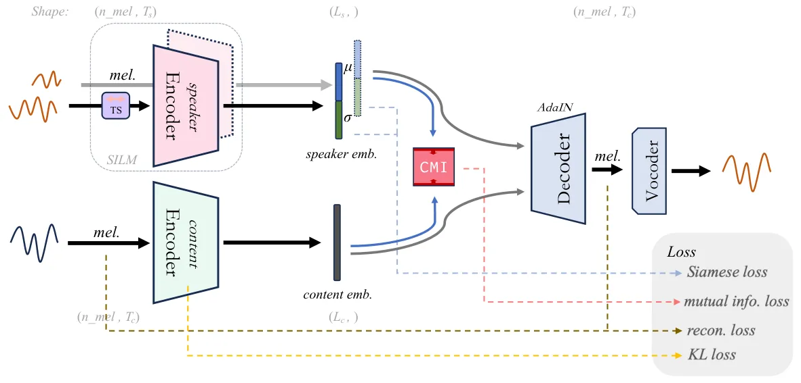
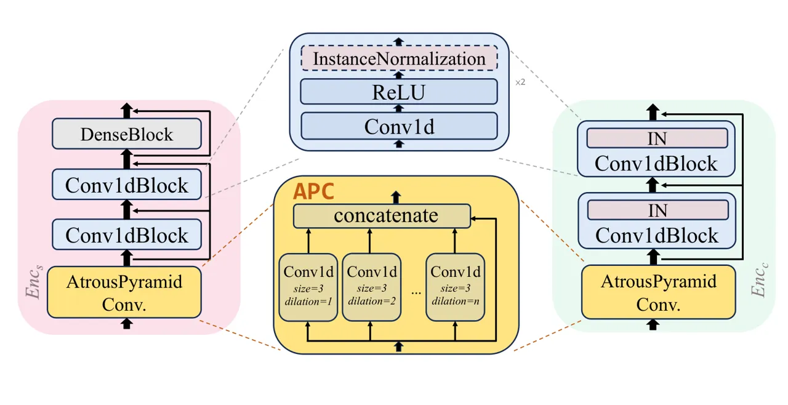
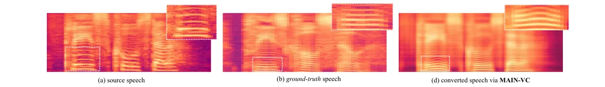
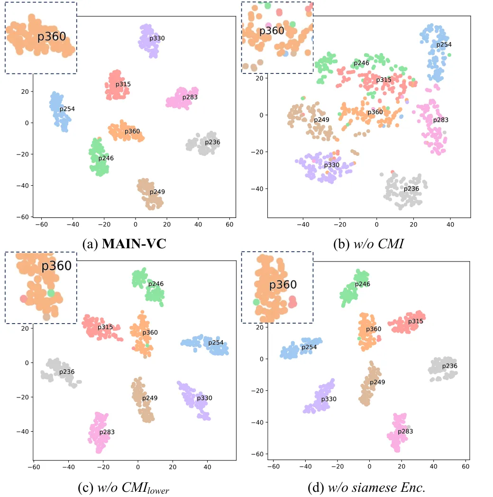

# MAIN-VC: Lightweight Speech Representation Disentanglement for One-shot Voice Conversion

Pengcheng Li^(1,2‡), Jianzong Wang^(1‡) , Xulong
Zhang$`{}^{1\textsuperscript{\Letter}}`$ , Yong Zhang¹, Jing Xiao¹, Ning
Cheng¹ ^(†)^(†)thanks: \$‡\$ Equal contribution. ^(†)^(†)thanks:
\$^(🖂)\$ Corresponding author. Affiliation: ¹Ping An Technology
(Shenzhen) Co., Ltd.  
²University of Science and Technology of China
Affiliation: lipengcheng@ustc.edu, jzwang@188.com, zhangxulong@ieee.org,

yzhang3272-c@my.cityu.edu.hk, {xiaojing661, chengning211}@pingan.com.cn

###### Abstract

One-shot voice conversion aims to change the timbre of any source speech
to match that of the unseen target speaker with only one speech sample.
Existing methods face difficulties in satisfactory speech representation
disentanglement and suffer from sizable networks as some of them
leverage numerous complex modules for disentanglement. In this paper, we
propose a model named MAIN-VC to effectively disentangle via a concise
neural network. The proposed model utilizes Siamese encoders to learn
clean representations, further enhanced by the designed mutual
information estimator. The Siamese structure and the newly designed
convolution module contribute to the lightweight of our model while
ensuring performance in diverse voice conversion tasks. The experimental
results show that the proposed model achieves comparable subjective
scores and exhibits improvements in objective metrics compared to
existing methods in a one-shot voice conversion scenario. The code is
available at
[https://github.com/PecholaL/MAIN-VC](https://github.com/PecholaL/MAIN-VC).

###### Index Terms: 

voice conversion, speech representation learning

## I Introduction

Voice conversion (VC) is the style transfer task in the field of speech.
It modifies the source speech’s style to the target speaker’s speaking
style. Voice conversion can be applied in smart devices, entertainment
industry, and even privacy security area \[1, 2\].

Early voice conversion relies heavily on parallel training data \[3\],
while parallel data collecting and frame-level alignment procedures
consume much time. So researchers have turned attention to non-parallel
voice conversion, enabling the possibility of many-to-many and
any-to-any conversion tasks. Inspired by image style transfer in
computer vision, a series of methods based on generative adversarial
network (GAN) have been applied to voice conversion \[4, 5, 6, 7\].
These GAN-based VC methods treat each speaker as a different domain and
consider voice conversion as migration across speaker domains. But GAN
training is unstable and poses difficulties in convergence.

Recently, disentanglement-based VC \[8, 9, 10\] has been an area of
active research for its flexibility in any-to-any voice conversion. The
disentanglement-based VC method is built on the assumption that speech
composition contains both speaker-dependent information (e.g. timbre and
speaking style) and speaker-independent information (e.g. content).
Generally, speaker-dependent information is time-invariant, remaining
constant in one utterance, whereas speaker-independent information is
time-variant. This allows neural networks to separately learn
representations of content and speaker information from the speech. The
disentanglement-based VC models typically adopt an autoencoder
structure, integrating approaches like bottleneck features \[11\],
instance normalization \[12\], vector quantization \[13\], etc. into
encoders to extract desired speech representations. The training usually
involves reconstruction of Mel-spectrogram. During training, the same
Mel-spectrogram segments are fed into the decoupling encoders to obtain
various speech representations, then the decoder integrates the
extracted speech representations and reconstruct the Mel-spectrogram.
After the training is completed, the content information from the source
speech and the speaker information from the target speech is decoupled
respectively and then fused for synthesizing the converted voice,
achieving the transferring of speaker style.

However, the disentanglement of speech representation is complicated
\[14\], how to effectively eliminate unnecessary information while
preventing damage to the wanted information that needs to be
disentangled, and how to extract clean representations without including
other information, are challenging aspects to master. Most of the
previous voice conversion models suffer unsatisfactory disentangling
performance. Besides the dependence of some models on the fine-tuned
bottleneck \[11, 15\], the reasons for deficient disentanglement include
that different encoders disentangle independently during the
representation learning process, lacking communication with the others,
resulting in the existence of redundant information in disentangled
representations. Moreover, most of these VC models are sizable, as some
of them improve disentangling capability through stacking various
network modules, making it difficult to deploy the models on
low-computing mobile devices.

In this paper, we propose a model based on speech representation
disentanglement, named Mutual information enhanced Adaptive Instance
Normalization VC (MAIN-VC). To enhance the disentangling ability of the
encoders, we integrate the Siamese structure as well as data
augmentation into the speaker representation learning module. An
easy-to-train constrained mutual information estimator is introduced to
build the communication between the learning processes of content and
speaker information, which reduces the overlap between unrelated
representations. With the assistance of these modules, the disentangling
ability of the encoders no longer rely on complicated networks. This
makes it possible for model lightweight and deployment on low-computing
devices. The contributions of this paper can be summarized as follows:

- •
  We introduce the speaker information learning module which reduces the
  interference of time-varying information to extract clean speaker
  embeddings.
- •
  We propose the constrained mutual information estimator restricted by
  upper and lower bounds and leverage it to enhance disentangling
  capability, contributing to improve the quality of one-shot VC.
- •
  We design the proposed model to be lightweight while ensuring the
  quality of voice conversion. A convolution block called APC with a low
  parameter count and large receptive field is also introduced to commit
  to lightweight.

## II Related Works

### II-A Speech Representation Disentanglement

Speech representation disentanglement (SRD) decomposes speech components
into diverse representations. It has been used in speaker recognition
\[16\], speaker diarization \[17\], speech emotion recognition \[18\],
speech enhancement \[19\], automatic speech synthesis \[20\], etc.

SRD also conveniently provides an opportunity for the purpose of voice
conversion, altering the speaker identity information in speech to
achieve conversion. The voice conversion methods based on SRD have
gained widespread attention in recent years. AutoVC \[11\] leverages an
autoencoder with a carefully tuned bottleneck to remove speaker
information. A pre-trained speaker encoder is utilized to provide
speaker identity information. SpeechSplit \[15\] and SpeechSplit2.0
\[21\] design multiple encoders with signal processing to decouple
finer-grained speech components such as rhythm, content and pitch.
Another series of works \[12, 22\] removes time-invariant speaker
information through instance normalization to get content
representation, then extracted speaker representation is fused into the
content representation in an adaptive manner. Vector quantization (VQ)
is also leveraged to complete speech representation disentanglement. In
vector quantization-based methods \[23, 24, 25, 26\], latent
representation is quantized into discrete codes, which are highly
related to phonemes, and the differences between the discrete codes and
the vectors before quantization are considered as the speaker
information.

SRD-base VC method shows its flexibility in a one-shot voice conversion
scenario but places high demands on the model’s disentangling ability.

### II-B Neural Mutual Information Estimation

Mutual information (MI) measures the degree of correlation or inclusion
between two variables. The calculation of MI generally requires
calculating the joint distribution and marginal distribution of the
variables. However, high-dimensional random variables from neural
networks often own high complexity and complicated distribution. Only
samples can be obtained while distribution is difficult to derive. It is
difficult to accurately obtain the mutual information between them.
Therefore, neural MI estimation is proposed to address this issue.

MINE \[27\] treats MI as the Kullback-Leibler divergence (KL divergence)
between the joint and marginal distributions, and sets a function to fit
this KL divergence. The fitting process is completed via a trainable
neural network. InfoNCE \[28\] maximizes the MI between a learned
representation and the data and estimates the lower bound of MI based on
noise contrastive estimation \[29\]. Representative works on mutual
information upper bound estimation include L1Out \[30\] and CLUB \[31\].
The former leverages the Monte Carlo approximation to approximate the
marginal distribution and then derives the upper bound of MI. CLUB
\[31\] fits the conditional probability between two variables. It
designs positive sample pairs and negative sample pairs to construct a
contrastive probability log ratio between two conditional distributions.
When the approximate condition probability is close enough to the truth
(i.e. the KL divergence is small enough), the fitted mutual information
gradually approaches the true MI from above, thus obtaining the upper
bound of MI.

In practical applications, the estimation of the lower bound of the MI
is maximized when it is necessary to strengthen the correlation between
two types of variables, while the upper bound of the MI is minimized
when reducing the correlation between variables.



Fig. 1: Architecture of MAIN-VC and the training objectives.

## III Methodology

### III-A Overall Architecure of MAIN-VC

The architecture of MAIN-VC is depicted in Fig. 1. MAIN-VC adopts an
instance normalization- (IN-)based method for speech style transferring.
A speaker information learning module consists of Siamese encoders with
a data augmentation module built to obtain clean speaker representation,
while the constrained mutual information estimator between speaker
representation and content representation is leveraged to enhance the
disentanglement. The pre-trained vocoder only appears during the
inference stage. The constrained mutual information estimator and the
Siamese encoder both take part in the training stage to assist in the
training of the content encoder and the speaker information learning
module. They are not involved in the conversion process during the
inference stage after the training is completed.

### III-B IN-based Speech Style Transfer

When given frame-level linguistic feature $`Z`$, the content encoder and
speaker representation learning module extract content representation
$`z_{C}`$ and speaker representation $`z_{S}`$ respectively. To mitigate
the impact of time-invariant information like timbre on the extraction
of content representation, the content encoder removes speaker
information from the mid feature map $`M`$ (processed from linguistic
feature $`Z`$) through instance normalization without affine
transformation (denoted as $`\textrm{IN}_{woAT}`$) as Eq. 1 shows,

```math
\begin{split}&\mu(M_{[c]})=\frac{1}{W}\sum_{w=1}^{W}M_{[c]}^{[w]}\\
&\sigma(M_{[c]})=\sqrt{\frac{1}{W}\sum_{w=1}^{W}(M_{[c]}^{[w]}-\mu(M_{[c]}))^{2}}\\
&\textrm{IN}_{woAT}(M_{[c]}^{[w]})=\frac{M_{[c]}^{[w]}-\mu(M_{[c]})}{\sigma(M_{[c]})}\end{split} \tag{1}
```

where $`M_{[c]}^{[w]}`$ represents the $`w`$-th element of the $`c`$-th
channel of feature map $`M`$. Content representation $`z_{C}`$ can be
extracted from $`IN_{woAT}(M_{src})`$ where $`M_{src}`$ is the feature
map obtained from the linguistic feature $`Z_{src}`$ of the source
speech, while the global speaker representation $`z_{S}`$ is the tuple
$`(\alpha,\beta)`$ obtained from the linguistic feature of the target
speech $`Z_{tgt}`$ via speaker encoder. Once we collect the content
representation $`z_{C}`$ and speaker representation $`z_{S}`$, the
decoder integrates speaker information via its internal adaptive
instance normalization (AdaIN) \[32\] layers:

```math
\textrm{AdaIN}({M_{C}}_{[c]}^{[w]},{z_{S}}_{[c]})=\beta_{[c]}\cdot\frac{{M_{C}}_{[c]}^{[w]}-\mu({M_{C}}_{[c]})}{\sigma({M_{C}}_{[c]})}+\alpha_{[c]} \tag{2}
```

where $`M_{C}`$ is the feature map obtained from content representation
$`z_{C}`$ via the internal blocks of the decoder, and $`{z_{S}}_{[c]}`$
(composed of $`\alpha_{[c]}`$ and $`\beta_{[c]}`$) denotes the $`c`$-th
channel of the speaker representation. Essentially, AdaIN layers
adaptively adjust the affine parameters of IN according to speaker
information to align the channel-wise statistics of content with those
of speaker style to achieve style transferring. Extracting continuous
speaker representations from arbitrary target utterances enables the
model applicability in any-to-any VC scenarios.

### III-C Speaker Information Learning Module

Although SRD-based VC models do not require parallel corpus for
training, typically using multi-speaker datasets where the same speaker
has multiple utterances, to fully utilize this characteristic of
multi-speaker datasets, we generalize the time-invariance within
utterance to the utterance-invariance across utterance from the same
speaker.

In our proposed method, the speaker information learning module (SILM)
based on utterance-invariance consists of Siamese encoders (denoted as
$`Enc_{S}`$ and $`Enc_{S}^{\prime}`$) and a time shuffle unit (TS). TS
processes the input data (i.e. target speech) before it enters
$`Enc_{S}`$, it rearranges the order of frame-level segments along time
dimension to disrupt time-variant information (i.e. content information)
while preserving time-invariant information (i.e. speaker information).
During the training stage, the same linguistic feature $`Z`$ is fed into
both $`Enc_{S}`$ of SILM and content encoder $`Enc_{C}`$, then the
decoder $`Dec`$ performs reconstruction with the outputs of the encoders
as shown in Eq. 3. Different from the previous works, the parallel
time-variant content information is completely disrupted in the proposed
method.

```math
\hat{Z}=\mathbf{Dec}(\mathbf{Enc_{C}}(Z),\mathbf{Enc_{S}}(\mathbf{TS}(Z))) \tag{3}
```

Linguistic feature $`Z^{\prime}`$ of another utterance from the same
speaker is fed into $`Enc_{S}^{\prime}`$ of SILM after reconstruction.
Based on the utterance-invariance of speaker information, we use
different utterances from the same speaker for the consideration that
speech inflection and recording conditions affect the extraction of
speaker representation. The Siamese loss shown in Eq. 4 helps to improve
the cosine similarity between these two speaker representations:

```math
\mathcal{L}_{Siamese}=1-\mathit{cos}(\mathbf{Enc_{S}}(\mathbf{TS}(Z)),\mathbf{Enc_{S}^{\prime}}(Z^{\prime})) \tag{4}
```

In the inference stage, the Siamese structure is disregarded, since only
one utterance from the target speaker is required.

### III-D Mutual Information Enhanced Disentanglement

We design the constrained mutual information (CMI) estimator with upper
and lower bounds to estimate mutual information. Estimating MI between
complex random variables is challenging and always unstable to train in
practice, simultaneously estimating both upper and lower bound of it and
constraining them mutually help to enhance the MI estimator’s robustness
and prediction accuracy. The estimation of the lower bound can serve as
guidance and a baseline for the upper bound estimation, resulting in a
more trainable mutual information estimator, CMI. In MAIN-VC, the upper
bound of MI between content representation $`z_{C}`$ and speaker
representation $`z_{S}`$ is derived from the variational contrastive
log-ratio upper bound (vCLUB) \[31\] as:

```math
\begin{split}\textrm{I}_{\mathit{upper}}(z_{C};z_{S})=&\mathbb{E}_{\mathrm{\mathit{P}(z_{C},z_{S})}}[\log(\mathit{Q_{\theta}}(z_{C}|z_{S}))]\\
&-\mathbb{E}_{\mathit{P}(z_{C})}\mathbb{E}_{\mathit{P}(z_{S})}[\log(\mathit{Q_{\theta}}(z_{C}|z_{S}))]\end{split} \tag{5}
```

where $`\mathit{P}(z_{C}|z_{S})`$ is the actual conditional
distribution, while $`\mathit{Q_{\theta}}(z_{C}|z_{S})`$ represents its
variational estimation obtained via a trainable network. The lower bound
of MI can be estimated through MINE \[27\], which employs a function
$`\textrm{T}_{\theta}`$ with trainable parameters $`\theta`$ to
approximate the KL divergence between two distributions, i.e. the joint
distribution $`\mathit{P}(z_{C},z_{S})`$ and the product of the two
marginal distributions $`\mathit{P}(z_{C})\otimes\mathit{P}(z_{S})`$, in
order to predict the lower bound of $`I(z_{C};z_{S})`$, as:

```math
\begin{split}\textrm{I}_{\mathit{lower}}(z_{C};z_{S})=&\mathbb{E}_{\mathrm{\mathit{P}(z_{C},z_{S})}}[\textrm{T}_{\theta}(z_{C},z_{S})]\\
&-\log(\mathbb{E}_{\mathit{P}(z_{C})\otimes\mathit{P}(z_{S})}[\mathit{e}^{\textrm{T}_{\theta}(z_{C},z_{S})}])\end{split} \tag{6}
```

CMI is trained using the learning losses of the upper and lower bound
estimation networks, as well as the gap between their estimated MI
values. We minimize the estimated upper bound for further
disentanglement of the speech representations. When $`N`$ utterances are
given, and the length of content representation extracted from each
cropped utterance is $`L`$, then CMI estimates MI loss as:

```math
\mathcal{L}_{MI}=\frac{1}{N^{2}L}{\sum\limits_{m=1}^{N}{\sum\limits_{n=1}^{N}{\sum\limits_{l=1}^{L}{\log\frac{{Q_{\theta}}\left({{{\mathit{z_{C}}}}_{m,l}}|{{\mathit{z_{S}}}_{n}}\right)}{{Q_{\theta}}\left({{{\mathit{z_{C}}}}_{n,l}}|{{\mathit{z_{S}}}_{n}}\right)}}}}} \tag{7}
```

It’s worth noting that SILM’s enhancement of speaker representation
disentangling can also facilitate CMI’s effect on content disentangling
implicitly, as the cleaner speaker representation obtained from SILM,
the more accurate content-irrelevant information that CMI needs to
eliminate during content disentangling.

### III-E Model Lightweighting

Inspired by atrous spatial pyramid pooling (ASPP) \[33\], we design a
convolution block named atrous pyramid convolution (APC) as shown in
Fig. 2. APC contains a series of small kernels ($`kernel\_size=3`$ in
MAIN-VC) with different dilation factors \[34\] and a residual-connect
concatenating the convolution results, replacing the sizable convolution
block in previous works. The previous convolution block consists of a
set of kernels of different sizes (size from $`1`$ to $`8`$ in the
baseline method \[12\]) which contain large kernels. APC not only
reduces the parameter count significantly but also expands the receptive
field.

What’s more, parameter sharing in the Siamese structure of SILM also
prevents the network from growing. CMI only appears during training and
makes no time consumption during inference. We adjust the layers and
channels of the encoders to strike a balance between performance and
model lightweight.

### III-F Loss Function

The loss function of MAIN-VC contains reconstruction loss, KL divergence
loss, MI loss and Siamese loss. Reconstruction loss is the L1 loss
between the source log-Mel-spectrogram $`Z\in\mathbb{R}^{M\times T}`$
and the output of decoder $`\hat{Z}\in\mathbb{R}^{M\times T}`$(as shown
in Eq. 3 and Eq. 8). The KL divergence between the posterior
distribution $`\mathit{P}(z_{C}|Z)`$ and the predefined prior
distribution $`\mathcal{N}(0,I)`$ serves as the KL loss, shown in Eq. 9.

```math
\mathcal{L}_{\textit{recon}}=\|Z-\hat{Z}\|^{1}_{1} \tag{8}
```

```math
\mathcal{L}_{KL}=\mathbb{E}_{P(Z)}[\|{\mathbf{Enc_{C}}(Z)}^{2}\|^{2}_{2}] \tag{9}
```

Siamese loss and MI loss are already defined in Eq. 4 and Eq. 7
respectively. Finally, the total loss combines the aforementioned losses
with weights $`\lambda_{1}`$, $`\lambda_{2}`$ and $`\lambda_{3}`$, as:

```math
\mathcal{L}=\mathcal{L}_{\textit{recon}}+\lambda_{1}\mathcal{L}_{KL}+\lambda_{2}\mathcal{L}_{\textit{Siamese}}+\lambda_{3}\mathcal{L}_{MI} \tag{10}
```



Fig. 2: The structure of the encoders and the details of APC.

## IV Experiments and Results

### IV-A Experimental Setup

To evaluate MAIN-VC, a comparative experiment and an ablation study are
conducted on VCTK \[35\] corpus. 19 speakers are randomly selected as
unseen speakers for one-shot conversion tasks, and their speech is
excluded during training. All the utterances are resampled to 16,000 Hz
during the experiment, and the Mel-spectrograms are computed through
short-time Fourier transform for training. During the training set
sampling, each utterance is randomly cropped into several 128-frame
segments. Two segments from different utterances spoken by the same
speaker are then paired to form a training data sample, where one is
used for reconstruction, and the other is fed into the Siamese encoder
of SILM.

It’s worth noting that MAIN-VC requires at least two forward and
backward passes in each training iteration, as the CMI module needs
extra training. In other words, the training process involves the
following two steps in each iteration:

- 1.  Training the integrated CMI network, the gap between upper and down
      bounds is combined with the learning losses. This step can be repeated
      several times in one iteration (five times in our experiment).
- 2.  Computing the four loss components to obtain the total for the
      training of the entire model (one forward and backward propagation,
      excluding the pre-trained vocoder).

MAIN-VC is trained with the Adam optimizer \[36\] with
$`\beta_{1}=0.9`$, $`\beta_{2}=0.99`$, $`\epsilon=10^{-6}`$,
$`\textit{lr}=1\times 10^{-4}`$. Another Adam optimizer with
$`\textit{lr}=2\times 10^{-4}`$ is built to train the CMI network.
During the inference stage, a pre-trained WaveRNN \[37\] is used as the
vocoder to generate waveform from Mel-spectrogram. We design the weights
in the total loss function Eq. 10 based on the numerical characteristics
of each component, $`\lambda_{1}`$ and $`\lambda_{3}`$ gradually
increase to 1 as the number of iterations progresses, while
$`\lambda_{2}`$ is set to 1. We compare our proposed models with
AdaIN-VC \[12\], AutoVC \[11\], VQMIVC \[24\] and LIMI-VC \[38\].

|                  |                   |                   |                   |                   |                   |                   |
| ---------------- | ----------------- | ----------------- | ----------------- | ----------------- | ----------------- | ----------------- |
| VC Method        | Many-to-Many      |                   |                   | One-Shot          |                   |                   |
|                  | MCD$`\downarrow`$ | MOS$`\uparrow`$   | VSS$`\uparrow`$   | MCD$`\downarrow`$ | MOS$`\uparrow`$   | VSS$`\uparrow`$   |
| AdaIN-VC \[12\]  | 7.64 $`\pm`$ 0.24 | 3.11 $`\pm`$ 0.13 | 2.82 $`\pm`$ 0.19 | 7.38 $`\pm`$ 0.14 | 3.04 $`\pm`$ 0.21 | 2.45 $`\pm`$ 0.16 |
| AutoVC \[11\]    | 6.68 $`\pm`$ 0.21 | 2.76 $`\pm`$ 0.16 | 2.45 $`\pm`$ 0.23 | 8.08 $`\pm`$ 0.15 | 2.68 $`\pm`$ 0.17 | 2.39 $`\pm`$ 0.14 |
| VQMIVC \[24\]    | 6.24 $`\pm`$ 0.13 | 3.20 $`\pm`$ 0.14 | 3.32 $`\pm`$ 0.12 | 5.59 $`\pm`$ 0.10 | 3.16 $`\pm`$ 0.18 | 3.02 $`\pm`$ 0.18 |
| LIMI-VC \[38\]   | 7.27 $`\pm`$ 0.17 | 3.12 $`\pm`$ 0.13 | 3.01 $`\pm`$ 0.26 | 7.88 $`\pm`$ 0.18 | 2.97 $`\pm`$ 0.22 | 2.74 $`\pm`$ 0.24 |
| MAIN-VC\_(large) | 5.17 $`\pm`$ 0.14 | 3.41 $`\pm`$ 0.21 | 3.35 $`\pm`$ 0.12 | 5.31 $`\pm`$ 0.09 | 3.33 $`\pm`$ 0.17 | 3.23 $`\pm`$ 0.17 |
| MAIN-VC          | 5.28 $`\pm`$ 0.11 | 3.44 $`\pm`$ 0.12 | 3.25 $`\pm`$ 0.16 | 5.42 $`\pm`$ 0.13 | 3.24 $`\pm`$ 0.18 | 3.29 $`\pm`$ 0.11 |

TABLE I: Comparison of different methods for many-to-many and one-shot
VC (with 95% confidence interval).

### IV-B Metrics and Measurement

The following subjective and objective metrics are used to evaluate the
performance of different voice conversion models.  
Mean opinion score (MOS) is a common subjective metric which assesses
the naturalness of speech, with scores ranging from 1 to 5, where higher
scores indicate higher speech quality.  
Voice similarity score (VSS), a subjective metric, evaluates the
similarity between the converted speech and the ground-truth speech from
the target speaker. Higher scores indicate higher similarity,
representing better VC performance.  
Mel-cepstral distortion (MCD) is an objective metric to measure the
difference between the converted speech and the target ground-truth
speech in the aspect of Mel-cepstral.

Both many-to-many and one-shot (any-to-any) VC are conducted while
refraining from using parallel data during the inference stage. 4 pairs
of source/target speech are input into each VC model for evaluation in
two scenarios respectively. Then 8 participants are invited to score the
speech samples.

For the measurement of lightweight, we choose parameter count and
inference time cost as the metrics. The measurements for both do not
include the vocoders, as the vocoder in each model can be freely
replaced with an appropriate one. The inference time is measured and
averaged using the same utterance pairs with each model on the same
device ($`1\times`$ Tesla V100).



Fig. 3: The Mel-spectrogram samples of the one-shot VC task "Please call
Stella".

### IV-C Experimental Results

Table I showcases the comparison of MAIN-VC and baseline methods in
different voice conversion scenarios. The proposed non-lightweight model
(denoted as MAIN-VC\_(large)) is also taken into consideration. For
many-to-many VC, MAIN-VC achieves comparable performance with baseline
methods. MAIN-VC outperforms other methods in one-shot VC, especially on
the objective metric. As for the lightweight of each model, the
comparison of the parameter count and inference time cost (exclude
vocoder) is presented in Table II. MAIN-VC reaches $`59\%`$ of reduction
in the parameter count and $`33\%`$ of reduction in the inference cost,
compared to the lightest baseline methods respectively. The proposed
model has an obvious advantage in parameter count thanks to the proposed
APC module and the parameter-sharing strategy, also inferences less
costly due to its lightweight network. Overall, MAIN-VC strikes a
balance between lightweight design and performance, obtaining a light
network structure while ensuring the quality of voice conversion.

Fig. 3 showcases Mel-spectrograms of utterances in a one-shot VC task,
including the source speech, ground-truth speech (i.e. the same content
to source speech spoken by the target speaker, not the target speech in
the inference), converted speeches via MAIN-VC. The details of the
spectrograms show that the source speaker and target speaker own
different acoustic characteristics (as in Fig. 3(a) and Fig. 3(b), the
distributions and shapes of the harmonic from different speakers are
quite different). MAIN-VC can extract the feature of the target speaker
and construct the converted Mel-spectrogram that is close to the
ground-truth. MAIN-VC is also capable of performing cross-lingual voice
conversion (XVC), another one-shot VC scenario, where the source and
target utterances are in different languages. We conduct XVC on AISHELL
\[39\] (Mandarin speech corpus) and VCTK \[35\] (English speech corpus).
More audio samples are available at
[https://largeaudiomodel.com/main-vc/](https://largeaudiomodel.com/main-vc/).

| VC Method       | Param. Count$`\downarrow`$ | Infer. Cost$`\downarrow`$ |
| --------------- | -------------------------- | ------------------------- |
| AdaIN-VC \[12\] | 9.04M                      | 100%                      |
| AutoVC \[11\]   | 28.27M                     | 50.94%                    |
| VQMIVC \[24\]   | 29.20M                     | 145.28%                   |
| LIMI-VC \[38\]  | 3.19M                      | 49.06%                    |
| MAIN-VC         | 1.31M                      | 22.64%                    |

TABLE II: Comparison of parameter count and inference time cost  
(w/o vocoder).

### IV-D Ablation Study

To validate the effects of SILM and CMI on disentanglement, we conduct
ablation experiments. We set up the following models:

- a)
  MAIN-VC: the proposed model.
- b)
  M1 (w/o CMI): remove the constrained mutual information estimator from
  the proposed method.
- c)
  M2 (w/o CMI\_(lower)): only use the estimator provided by CLUB \[31\]
  to assess the upper of mutual information.
- d)
  M3 (w/o Siamese encoder): remove the Siamese structure and time
  shuffle unit in SILM.

Resemblyzer is employed for fake speech detection to assess the
conversion quality. Resemblyzer simultaneously scores the fake (i.e. the
outputs of VC model in the experiment) and real utterances of the target
speaker after learning the characteristics of the target speaker from
another 6 bonafide utterances. A higher score indicates more similar
timbre and better speech quality. The results are presented in Table
III. CMI and SILM contribute to MAIN-VC’s synthesis of converted speech
that is more confusing for fake detection, and the lower bound of CMI
also shows its beneficial effect on the converted speech.

| Method                | Detection Score$`\uparrow`$ |
| --------------------- | --------------------------- |
| MAIN-VC               | 0.74 $`\pm`$ 0.01           |
| M1 (w/o CMI)          | 0.62 $`\pm`$ 0.04           |
| M2 (w/o CMI\_(lower)) | 0.69 $`\pm`$ 0.03           |
| M3 (w/o Siamese Enc.) | 0.70 $`\pm`$ 0.03           |

TABLE III: Comparison for ablation study.

To visually assess the disentanglement capability of each model, the
scatter diagrams of speaker representations via t-SNE \[40\] are shown
in Fig. 4. The inclusion of CMI and the Siamese structure in SILM
results in more clustered representations of the same speaker, while the
removal of the lower bound in CMI leads to looser clustering and
inaccurate speaker representation (erroneous clustering in the detail
plots), indicating a deterioration in disentangling performance. So SILM
and CMI facilitate MAIN-VC to achieve better disentanglement capability
and conversion performance.



Fig. 4: The visualization of speaker representations extracted from 8
unseen speakers’ utterances (4 males and 4 females, 100 utterances from
each speaker).

## V Conclusion

In this paper, we propose a lightweight voice conversion model to
address the challenges of VC. The designed speaker information learning
module and constrained mutual information estimator effectively enhance
the disentanglement capability and improve the conversion quality. From
another aspect, with the facilitation of the introduced modules, the
disentangling capability of the encoders no longer relies on heavy
network structure, so we implement model lightweighting while ensuring
the model’s performance. The experimental results show that MAIN-VC can
complete one-shot voice conversion task and achieves comparable or even
better results in various VC scenarios compared to existing methods,
while maintaining a lightweight structure.

## VI Acknowledgement

Supported by the Key Research and Development Program of Guangdong
Province (grant No. 2021B0101400003) and the corresponding author is
Xulong Zhang (zhangxulong@ieee.org).

## References

- \[1\] R. Yuan, Y. Wu, J. Li, and J. Kim, “Deid-vc: Speaker
  de-identification via zero-shot pseudo voice conversion,” in _the 23rd
  Annual Conference of the International Speech Communication
  Association_, 2022, pp. 2593–2597.
- \[2\] B. M. L. Srivastava, N. Vauquier, M. Sahidullah, A. Bellet,
  M. Tommasi, and E. Vincent, “Evaluating voice conversion-based privacy
  protection against informed attackers,” in _IEEE International
  Conference on Acoustics, Speech and Signal Processing_, 2020, pp.
  2802–2806.
- \[3\] B. Sisman, J. Yamagishi, S. King, and H. Li, “An overview of
  voice conversion and its challenges: From statistical modeling to deep
  learning,” _IEEE/ACM Transactions on Audio, Speech, and Language
  Processing_, vol. 29, pp. 132–157, 2021.
- \[4\] T. Kaneko and H. Kameoka, “Cyclegan-vc: Non-parallel voice
  conversion using cycle-consistent adversarial networks,” in _the 26th
  European Signal Processing Conference_, 2018, pp. 2100–2104.
- \[5\] T. Kaneko, H. Kameoka, K. Tanaka, and N. Hojo, “Stargan-vc2:
  Rethinking conditional methods for stargan-based voice conversion,” in
  _the 20th Annual Conference of the International Speech Communication
  Association_, 2019, pp. 679–683.
- \[6\] Y. A. Li, A. Zare, and N. Mesgarani, “Starganv2-vc: A diverse,
  unsupervised, non-parallel framework for natural-sounding voice
  conversion,” in _the 22nd Annual Conference of the International
  Speech Communication Association_, 2021, pp. 1349–1353.
- \[7\] M. Chen, Y. Zhou, H. Huang, and T. Hain, “Efficient
  non-autoregressive gan voice conversion using vqwav2vec features and
  dynamic convolution,” _arXiv preprints arXiv:2203.17172_, 2022.
- \[8\] M. Luong and V. Tran, “Many-to-many voice conversion based
  feature disentanglement using variational autoencoder,” in _the 22nd
  Annual Conference of the International Speech Communication
  Association_, 2021, pp. 851–855.
- \[9\] R. Xiao, H. Zhang, and Y. Lin, “Dgc-vector: A new speaker
  embedding for zero-shot voice conversion,” in _IEEE International
  Conference on Acoustics, Speech and Signal Processing_, 2022, pp.
  6547–6551.
- \[10\] Z. Liu, S. Wang, and N. Chen, “Automatic speech disentanglement
  for voice conversion using rank module and speech augmentation,” in
  _the 24th Annual Conference of the International Speech Communication
  Association_, 2023, pp. 2298–2302.
- \[11\] K. Qian, Y. Zhang, S. Chang, X. Yang, and M. Hasegawa-Johnson,
  “Autovc: Zero-shot voice style transfer with only autoencoder loss,”
  in _the 36th International Conference on Machine Learning_, vol. 97,
  2019, pp. 5210–5219.
- \[12\] J. Chou and H. Lee, “One-shot voice conversion by separating
  speaker and content representations with instance normalization,” in
  _the 20th Annual Conference of the International Speech Communication
  Association_, 2019, pp. 664–668.
- \[13\] D. Wu and H. Lee, “One-shot voice conversion by vector
  quantization,” in _IEEE International Conference on Acoustics, Speech
  and Signal Processing_, 2020, pp. 7734–7738.
- \[14\] S. Yuan, P. Cheng, R. Zhang, W. Hao, Z. Gan, and L. Carin,
  “Improving zero-shot voice style transfer via disentangled
  representation learning,” in _the 9th International Conference on
  Learning Representations_, 2021.
- \[15\] K. Qian, Y. Zhang, S. Chang, M. Hasegawa-Johnson, and D. D.
  Cox, “Unsupervised speech decomposition via triple information
  bottleneck,” in _the 37th International Conference on Machine
  Learning_, vol. 119, 2020, pp. 7836–7846.
- \[16\] T. Liu, K. A. Lee, Q. Wang, and H. Li, “Disentangling voice and
  content with self-supervision for speaker recognition,” in _the 37th
  Conference on Neural Information Processing Systems_, 2023.
- \[17\] S. H. Mun, M. H. Han, C. Moon, and N. S. Kim, “Eend-demux:
  End-to-end neural speaker diarization via demultiplexed speaker
  embeddings,” _arXiv preprint arXiv:2312.06065_, 2023.
- \[18\] S. Latif, R. Rana, S. Khalifa, R. Jurdak, J. Qadir, and
  B. Schuller, “Survey of deep representation learning for speech
  emotion recognition,” _IEEE Transactions on Affective Computing_,
  vol. 14, no. 2, pp. 1634–1654, 2021.
- \[19\] N. Hou, C. Xu, E. S. Chng, and H. Li, “Learning disentangled
  feature representations for speech enhancement via adversarial
  training,” in _IEEE International Conference on Acoustics, Speech and
  Signal Processing_, 2021, pp. 666–670.
- \[20\] W. Wang, Y. Song, and S. Jha, “Generalizable zero-shot speaker
  adaptive speech synthesis with disentangled representations,” in _the
  24th Annual Conference of the International Speech Communication
  Association_, 2023.
- \[21\] C. H. Chan, K. Qian, Y. Zhang, and M. Hasegawa-Johnson,
  “Speechsplit2.0: Unsupervised speech disentanglement for voice
  conversion without tuning autoencoder bottlenecks,” in _IEEE
  International Conference on Acoustics, Speech and Signal Processing_,
  2022, pp. 6332–6336.
- \[22\] Y. Chen, D. Wu, T. Wu, and H. Lee, “Again-vc: A one-shot voice
  conversion using activation guidance and adaptive instance
  normalization,” in _IEEE International Conference on Acoustics, Speech
  and Signal Processing_, 2021, pp. 5954–5958.
- \[23\] D. Wu, Y. Chen, and H. Lee, “Vqvc+: One-shot voice conversion
  by vector quantization and u-net architecture,” in _the 21st Annual
  Conference of the International Speech Communication Association_,
  2020, pp. 4691–4695.
- \[24\] D. Wang, L. Deng, Y. T. Yeung, X. Chen, X. Liu, and H. Meng,
  “Vqmivc: Vector quantization and mutual information-based unsupervised
  speech representation disentanglement for one-shot voice conversion,”
  in _the 22nd Annual Conference of the International Speech
  Communication Association_, 2021, pp. 1344–1348.
- \[25\] H. Yang, L. Deng, Y. T. Yeung, N. Zheng, and Y. Xu, “Streamable
  speech representation disentanglement and multi-level prosody modeling
  for live one-shot voice conversion,” in _the 23rd Annual Conference of
  the International Speech Communication Association_, 2022, pp.
  2578–2582.
- \[26\] H. Tang, X. Zhang, J. Wang, N. Cheng, and J. Xiao, “Avqvc:
  One-shot voice conversion by vector quantization with applying
  contrastive learning,” in _IEEE International Conference on Acoustics,
  Speech and Signal Processing_, 2022, pp. 4613–4617.
- \[27\] M. I. Belghazi, A. Baratin, S. Rajeshwar, S. Ozair, Y. Bengio,
  A. Courville, and D. Hjelm, “Mutual information neural estimation,” in
  _the 35th International Conference on Machine Learning_, ser.
  Proceedings of Machine Learning Research, vol. 80, 2018, pp. 531–540.
- \[28\] A. v. d. Oord, Y. Li, and O. Vinyals, “Representation learning
  with contrastive predictive coding,” _arXiv preprint
  arXiv:1807.03748_, 2018.
- \[29\] M. Gutmann and A. Hyvärinen, “Noise-contrastive estimation: A
  new estimation principle for unnormalized statistical models,” in _the
  13th International Conference on Artificial Intelligence and
  Statistics_, 2010, pp. 297–304.
- \[30\] B. Poole, S. Ozair, A. van den Oord, A. A. Alemi, and
  G. Tucker, “On variational bounds of mutual information,” in _the 36th
  International Conference on Machine Learning_, ser. Proceedings of
  Machine Learning Research, vol. 97, 2019, pp. 5171–5180.
- \[31\] P. Cheng, W. Hao, S. Dai, J. Liu, Z. Gan, and L. Carin, “Club:
  A contrastive log-ratio upper bound of mutual information,” in _the
  37th International Conference on Machine Learning_, ser. Proceedings
  of Machine Learning Research, vol. 119, 2020, pp. 1779–1788.
- \[32\] X. Huang and S. J. Belongie, “Arbitrary style transfer in
  real-time with adaptive instance normalization,” in _IEEE
  International Conference on Computer Vision_, 2017, pp. 1510–1519.
- \[33\] L. Chen, G. Papandreou, I. Kokkinos, K. Murphy, and A. L.
  Yuille, “Deeplab: Semantic image segmentation with deep convolutional
  nets, atrous convolution, and fully connected crfs,” _IEEE
  Transactions on Pattern Analysis and Machine Intelligence_, vol. 40,
  no. 4, pp. 834–848, 2018.
- \[34\] F. Yu, V. Koltun, and T. A. Funkhouser, “Dilated residual
  networks,” in _IEEE Conference on Computer Vision and Pattern
  Recognition_, 2017, pp. 636–644.
- \[35\] J. Yamagishi, C. Veaux, and K. MacDonald, “Cstr vctk corpus:
  English multi-speaker corpus for cstr voice cloning toolkit,” 2016.
- \[36\] D. P. Kingma and J. Ba, “Adam: A method for stochastic
  optimization,” in _the 3rd International Conference on Learning
  Representations_, 2015.
- \[37\] N. Kalchbrenner, E. Elsen, K. Simonyan, S. Noury,
  N. Casagrande, E. Lockhart, F. Stimberg, A. van den Oord, S. Dieleman,
  and K. Kavukcuoglu, “Efficient neural audio synthesis,” in _the 35th
  International Conference on Machine Learning_, ser. Proceedings of
  Machine Learning Research, vol. 80, 2018, pp. 2415–2424.
- \[38\] L. Huang, T. Yuan, Y. Liang, Z. Chen, C. Wen, Y. Xie, J. Zhang,
  and D. Ke, “Limi-vc: A light weight voice conversion model with mutual
  information disentanglement,” in _IEEE International Conference on
  Acoustics, Speech and Signal Processing_, 2023, pp. 1–5.
- \[39\] J. Du, X. Na, X. Liu, and H. Bu, “Aishell-2: Transforming
  mandarin asr research into industrial scale,” _CoRR_, vol.
  abs/1808.10583, 2018.
- \[40\] L. van der Maaten and G. Hinton, “Viualizing data using t-sne,”
  _Journal of Machine Learning Research_, vol. 9, pp. 2579–2605,
  11 2008.
