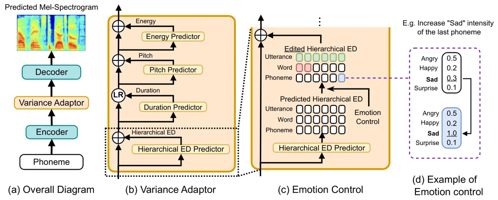

# Hierarchical Emotion Prediction and Control in Text-to-Speech Synthesis

Sho Inoue    Kun Zhou    Shuai Wang    Haizhou Li ^(†)^(†)thanks: \$†\$:
Corresponding author^(†)^(†)thanks: This research is supported by China
NSFC project under Grant No.62271432, Shenzhen Science and Technology
Research Fund, Fundamental Research Key Project under Grant
No.JCYJ20220818103001002, and Internal Project of Shenzhen Research
Institute of Big Data under grant No.T00120220002

###### Abstract

It remains a challenge to effectively control the emotion rendering in
text-to-speech (TTS) synthesis. Prior studies have primarily focused on
learning a global prosodic representation at the utterance level, which
strongly correlates with linguistic prosody. Our goal is to construct a
hierarchical emotion distribution (ED) that effectively encapsulates
intensity variations of emotions at various levels of granularity,
encompassing phonemes, words, and utterances. During TTS training, the
hierarchical ED is extracted from the ground-truth audio and guides the
predictor to establish a connection between emotional and linguistic
prosody. At run-time inference, the TTS model generates emotional speech
and, at the same time, provides quantitative control of emotion over the
speech constituents. Both objective and subjective evaluations validate
the effectiveness of the proposed framework in terms of emotion
prediction and control.

###### Index Terms: 

Emotional text-to-speech, emotion prediction, emotion control

^(†)^(†)address: ¹ School of Data Science, The Chinese University of
Hong Kong, Shenzhen (CUHK-Shenzhen), China  
²Shenzhen Research Institute of Big Data, Shenzhen, China  
³Speech Lab of DAMO Academy, Alibaba Group, Singapore

## 1 Introduction

Emotional text-to-speech (TTS) aims to synthesize realistic emotional
speech from the text \[1\]. Neural TTS systems have achieved significant
improvement in generating natural-sounding voices. However, they usually
struggle to express the exact emotions \[2, 3\]. Emotional TTS seeks to
address this problem for natural human-computer interaction \[4, 5\].

TTS models not only the human vocal system but also the prosodic
variations presented in human speech \[6\]. Speech prosody affects both
the syntactic and semantic interpretation of an utterance (“linguistic
prosody”) and also embodies the speaker’s emotional state (“emotional
prosody”) \[7\]. Although these two types of prosody are functionally
independent, they share common acoustic characteristics \[8\]. Emotional
TTS considers a modulation of both linguistic and emotional prosody,
which further raises two questions: 1) how to model emotional prosody
with lexical content; 2) how to control emotion rendering over
linguistic units. In this paper, we aim to address these two challenges.

Previous emotional TTS studies characterize emotions as a global feature
of the utterance \[9, 10\]. TTS models learn to associate emotional
styles with explicit labels during training. For instance, some studies
utilize a reference encoder to encode the emotional styles into a global
vector such as global style tokens \[11\]. To enhance user control,
researchers employ relative attributes \[12\] to control the intensity
level of the output emotion \[13, 10\]. We observe a lack of focus from
previous methods on modeling the relationships between emotional prosody
and the semantic representation of the utterance, as well as providing
quantitative emotion control of different linguistic units within a
sentence.

In this paper, we propose a novel approach to predict and control
emotion rendering over texts. The proposed framework automatically
predicts emotional content from text and allows users to control the
emotion rendering over different segments. Our contributions are
highlighted as follows:

- •
  We introduce hierarchical emotion distribution (ED) predictor¹¹ 1
  Implementation: https://github.com/shinshoji01/Text-Hierarchical-ED, a
  quantifiable emotion predictor that deduces the hierarchical emotion
  distribution at different granularity, solely from the text.
- •
  During training, the hierarchical ED predictor is guided to predict
  hierarchical ED from the semantic representations produced by a BERT
  \[14\]-based linguistic encoder. Hierarchical ED can be automatically
  predicted from a given text input and manually modified during
  inference;
- •
  Our method demonstrates enhanced emotion expressiveness in emotional
  speech synthesis and offers efficient and flexible emotion control
  across various segmental levels.

The rest of this paper is organized as follows: In Section 2, we
introduce related works. Section 3 describes our proposed methodology.
In Section 4, we introduce our experiments and analyze the results.
Section 5 concludes our study.



Figure 1: System diagrams of (a) Model architecture; (b) Variance
adaptor integrating a Hierarchical Emotion Distribution (ED) predictor;
(c) Emotion control diagram; (d) An example of emotion control.

## 2 Text-based Prosody Prediction for TTS

A spoken utterance carries both linguistic prosody and emotional
prosody. One technical challenge in TTS is to predict the exact prosody
for an input text. FastSpeech2 \[15\] explicitly utilizes ground-truth
pitch, energy, and duration for training, and predicts these features
solely from text during inference. \[16\] leverages BERT \[14\] to
enhance FastSpeech2. Other studies predict implicit prosody labels
exclusively from text \[17, 18, 19\]. \[18\] employs a GMM-based mixture
density network to predict phoneme-level prosodic embeddings, while
\[20, 21\] utilizes BERT \[14\] to extract emotion embeddings from the
transcript. Despite much progress, the prosody prediction techniques
lack the necessary fine-grain control over the speech constituents.
Therefore, it is difficult to control the emotion rendering.

We observe that the prior studies lack focus on emotional prosody
modeling over linguistic units. In this paper, we focus on predicting
and controlling emotional prosody in different segmental levels
(phoneme, word, and utterance). For example, we want the model to know
where to put emotional emphasis when producing an utterance (‘emotion
prediction’), or to manipulate the emotion of an utterance to begin with
joy but end with sorrow (‘emotion control’). Such a technique is
required in conversational speech synthesis.

## 3 Proposed Methods

The overall diagram of our proposed framework is shown in Fig.1(a),
which is based on the FastSpeech2 \[15\] structure. Given a phoneme
sequence, our proposed framework predicts the hierarchical ED and
prosodic variants (duration, pitch, and energy) and synthesizes the
Mel-Spectrogram. We first replace the linguistic encoder with a
BERT-based encoder \[14\] to enhance its knowledge of semantic
information in the sentences. We further introduce a novel hierarchical
ED predictor that quantifies emotion intensity in a hierarchical manner
and allows users to assign and adjust the intensity of emotions over
different linguistic units. The proposed framework is expected to: 1)
produce a more natural emotional outcome by modeling both emotional and
linguistic prosody, and 2) enhance the linguistic-wise emotion control
of the emotional TTS system.

### 3.1 Hierarchical Emotion Distribution Extractor

We first present the concept of hierarchical emotion distribution (ED),
a novel emotion representation that incorporates continuous emotion
intensity labels across different granularity levels including phonemes,
words, and utterances. Specifically, we design an extractor to generate
hierarchical ED from any datasets containing emotional speech and
emotion labels, making it a versatile tool for this purpose. Our
implementation is inspired by the study of relative attributes,
initially proposed in computer vision \[12\] and later extended to
speech processing \[9, 10, 22\]. We first frame emotion style in speech
as an attribute, then construct a ranking function to quantify the
relative presence of an emotion. We obtain the relative attributes from
the ranking functions and normalize them to the range $`[0,1]`$, where a
larger value indicates a higher intensity of emotion.

We initially apply the Montreal Forced Alignment (MFA) \[23\] for the
alignment of words and phonemes. We then use OpenSMILE \[24\] to extract
an 88-dimensional feature set for each segment level of an audio
(phoneme, word, and utterance). Then, we use pre-trained ranking
functions to obtain emotion intensity labels for speech segments.

We define the ranking function as $`f(x_{i})=w\cdot x_{i}+b`$, where
$`w`$ and $`b`$ denote the weight vector and bias, respectively. The
parameters are optimized using the support vector machine’s objective
function for binary classification \[25\]:

```math
\displaystyle\min_{w,b}\frac{1}{2}\|w\|^{2}+C\sum_{i=1}^{n}\max(0,1-y_{i}(w\cdot x_{i}+b))
```

Here, $`x_{i}`$ represents the acoustic features of the $`i`$-th
training sample, $`C`$ the regularization parameter, $`y_{i}`$ is the
training label, for example, to train the ranking function for “Happy”:
$`y_{i}=\begin{cases}+1&(i\in H)\\
-1&\text{otherwise}\end{cases}`$ where $`H`$ denotes the set of “Happy”
samples. We utilize different segments (phonemes, words, utterances) of
each audio as training samples. The extractor with pre-trained relative
functions could obtain the emotion intensity labels for a speech
segment, which serve as the training labels for the text-based emotion
prediction training described in Section 3.2.

### 3.2 Predicting Hierarchical Emotion Distribution from Text

Most datasets group utterances into several emotion categories \[26\].
However, the intra or inter-sentence emotion intensity variations are
often overlooked. We note that intra-sentence emotion intensity
variations are associated with different segmental levels of an
utterance, which calls for the design of a text-based hierarchical
emotion prediction model.

We construct a linguistic encoder equipped with a broad understanding of
semantic information. We replace FastSpeech2’s encoder with a BERT-based
encoder, renowned for its proficiency in natural language
processing \[14\]. We aim to predict hierarchical emotion distribution
solely from text. We design a hierarchical ED predictor and incorporate
it into the variance adaptor, as shown in Fig.1(b). The ground-truth
hierarchical ED is obtained by the extractor from the speech signal at
the phoneme, word, and utterance level, as described in Section 3.1.
During TTS training, the variance adaptor learns the hierarchical
emotion distribution, duration, pitch, and energy from the linguistic
embedding sequentially. In this way, the TTS framework associates the
hierarchical emotional prosody and prosodic variants over linguistic
representations.

### 3.3 Quantifiable Emotion Control

Our proposed framework facilitates quantifiable emotion control during
inference, as shown in Fig.1(c). The BERT-based encoder first encodes a
phoneme sequence into a linguistic embedding. The variance adaptor then
predicts hierarchical ED at three different granularity levels (phoneme,
word, and utterance) from the linguistic embedding. The emotion
distribution is illustrated in Fig.1(d), where each value represents a
predicted intensity of an emotion type. The users can change or assign
those values to create a desired emotion rendering at three granularity
levels.

### 3.4 Comparison with Related Work

In this work, we introduce a TTS framework with quantifiable emotion
prediction and control. Our proposal is similar to \[22\] but differs in
many ways. First, \[22\] only considers utterance-level emotion and its
phoneme-level intensities. During inference, \[22\] keeps a consistent
emotion type within the entire utterance, only allowing for alterations
in intensity. Our model considers the hierarchical nature of emotions,
and model emotion distribution at three granularity levels (phoneme,
word, utterance), allowing for manipulating the intensity of each
emotion in any granularity level.

## 4 Experiments and Results

### 4.1 Model Architecture

We utilize FastSpeech2 \[15\] as our backbone framework, comprising a
text encoder, variance adaptor, and decoder. The text encoder is based
on a transformer network \[27\], which transforms a phoneme sequence
into a linguistic embedding. The variance adaptor is composed of
Hierarchical ED, duration, pitch, and energy predictors. For
hierarchical ED prediction, we reuse the pitch predictor’s structure,
which quantizes the pitch of each phoneme to 256 values through
feed-forward networks. A transformer-based decoder then synthesizes a
mel-spectrogram from the output of the variance adaptor. We substitute
FastSpeech2’s linguistic encoder with a BERT-based\[14\] encoder that
accepts phoneme inputs. Both the transformer encoder’s hidden layers and
attention heads are set to 8. We follow the same optimizer \[28\] and
the learning rate scheduler in FastSpeech2. The batch sizes for TTS
training and BERT pretraining are 128 and 64, respectively.

### 4.2 Experimental Setup

We conduct experiments using three datasets: Blizzard Challenge 2013
dataset \[29\], Emotion Speech Dataset (ESD) \[30\], and
BookCorpus \[31\]. We train our TTS model on the Blizzard dataset, which
is derived from audiobooks and contains expressive speech data with
abundant prosody variance without any emotion labels. ESD \[30\]
contains emotional speech data grouped into 5 categories: Neutral, Sad,
Angry, Happy, and Surprise. We use English recordings from 10 speakers.
We randomly select 20 samples per speaker and emotion to train the
ranking functions for the Hierarchical ED extractor. The BookCorpus
dataset \[31\] is sourced from over 11k books from a variety of genres,
which is utilized to pre-train the linguistic encoder. We extracted
about 1/10 of the entire dataset, equivalent to approximately 7M
sentences.

We pre-train the BERT-based linguistic encoder over 3 epochs in Masked
Language Modeling tasks. Once integrated into the TTS framework, we
fine-tune it for 100k iterations, while keeping the encoder’s parameters
fixed. Then, we update the entire architecture for an additional 400k
iterations. The losses for TTS tasks include (1) L1 loss from
mel-spectrograms and (2) MSE loss from prosodic predictions. The vocoder
is HiFiGAN \[32\] pre-trained on the Blizzard dataset.

As a fair comparison, we implemented the following systems:

- •
  FastSpeech: We implemented FastSpeech2 \[15\], where the variance
  adaptor predicts duration, pitch, and energy from the text;
- •
  Proposed Method: Our proposed framework described in Section 3,
  leverages a BERT-based linguistic encoder and is equipped with a
  hierarchical emotion distribution predictor;
- •
  Proposed Method w/o ED Predictor: Our proposed framework that only
  leverages a BERT-based linguistic encoder;
- •
  Proposed Method w/o BERT: Our proposed framework is only equipped with
  a hierarchical ED predictor.

Note that the linguistic encoder in FastSpeech comprises 11.9M trainable
parameters, contrasting with the BERT-based encoder’s larger size of
34.2M parameters. Next, we present the experimental results on the
effectiveness of our proposed framework in terms of speech quality,
speech expressiveness, and emotion controllability, by comparing with
the baselines.

| Frameworks         | MOS $`\uparrow`$  | MCD $`\downarrow`$ |
| ------------------ | ----------------- | ------------------ |
| Ground Truth       | 4.183$`\pm`$0.268 | —                  |
| FastSpeech2        | 3.946$`\pm`$0.282 | 4.945$`\pm`$0.155  |
| Proposed           | 3.933$`\pm`$0.213 | 4.866$`\pm`$0.143  |
|     - ED Predictor | 3.895$`\pm`$0.229 | 4.892$`\pm`$0.148  |
|     - BERT         | 3.607$`\pm`$0.272 | 4.974$`\pm`$0.137  |

Table 1: Speech quality evaluation results of 1) mean opinion score
(MOS) and 2) Mel-cepstral distortion (MCD).

| FastSpeech2 |          | Proposed w/o ED Predictor |          | Proposed w/o BERT |          | Proposed |          |
| ----------- | -------- | ------------------------- | -------- | ----------------- | -------- | -------- | -------- |
| Worst       | Best     | Worst                     | Best     | Worst             | Best     | Worst    | Best     |
| 43$`\%`$    | 12$`\%`$ | 18$`\%`$                  | 26$`\%`$ | 23$`\%`$          | 27$`\%`$ | 16$`\%`$ | 35$`\%`$ |

Table 2: Best-worst scaling (BWS) test result, where the value
represents the ratio of preferences from the evaluators ($`\%`$). Red
and green colors represent the selection ratio of the least similar
audio and the most similar audio, respectively.

|                  |          |          |        |              |        |             |        |               |        |              |        |
| ---------------- | -------- | -------- | ------ | ------------ | ------ | ----------- | ------ | ------------- | ------ | ------------ | ------ |
|                  |          | Duration |        | Pitch (mean) |        | Pitch (std) |        | Energy (mean) |        | Energy (std) |        |
|                  |          | Blizzard | ESD    | Blizzard     | ESD    | Blizzard    | ESD    | Blizzard      | ESD    | Blizzard     | ESD    |
| Utterance        | Angry    | 0.012    | -0.018 | 0.015        | 0.019  | -0.036      | -0.049 | 0.017         | 0.007  | 0.055        | 0.032  |
|                  | Happy    | -0.010   | -0.013 | 0.060        | 0.042  | -0.146      | -0.085 | 0.055         | -0.033 | 0.033        | 0.017  |
|                  | Sad      | -0.001   | 0.004  | 0.028        | 0.017  | -0.156      | -0.036 | 0.017         | 0.022  | -0.017       | -0.006 |
|                  | Surprise | 0.004    | 0.005  | -0.029       | 0.023  | 0.195       | 0.056  | -0.065        | 0.017  | 0.006        | -0.005 |
| Word and Phoneme | Angry    | 0.449    | 0.447  | 0.035        | 0.054  | 0.297       | 0.674  | -0.030        | 0.001  | 0.373        | 0.524  |
|                  | Happy    | 0.098    | 0.160  | 0.276        | 0.213  | -0.001      | 0.093  | -0.159        | -0.385 | -0.015       | -0.031 |
|                  | Sad      | 0.648    | 1.259  | 0.010        | 0.012  | 0.038       | 1.346  | -0.443        | -0.518 | -0.106       | 0.347  |
|                  | Surprise | -0.013   | -0.014 | 0.083        | 0.192  | 1.023       | 0.765  | -0.174        | 0.287  | -0.067       | 0.137  |
| Word             | Angry    | 0.039    | 0.089  | 0.084        | 0.108  | -0.108      | 0.064  | 0.143         | 0.234  | 0.133        | 0.184  |
|                  | Happy    | 0.103    | 0.173  | 0.107        | 0.089  | 0.174       | 0.210  | -0.042        | -0.088 | 0.056        | 0.076  |
|                  | Sad      | 0.145    | 0.278  | 0.076        | 0.090  | -0.093      | 0.134  | -0.084        | -0.100 | 0.021        | 0.164  |
|                  | Surprise | 0.043    | 0.060  | 0.069        | 0.107  | 0.301       | 0.336  | 0.039         | 0.249  | 0.051        | 0.104  |
| Phoneme          | Angry    | 0.127    | 0.177  | -0.064       | -0.050 | 0.117       | 0.262  | -0.096        | -0.136 | 0.309        | 0.316  |
|                  | Happy    | -0.034   | 0.009  | 0.050        | 0.027  | 0.941       | 0.267  | -0.077        | -0.207 | 0.022        | -0.064 |
|                  | Sad      | 0.216    | 0.519  | -0.115       | -0.071 | -0.458      | 0.036  | -0.279        | -0.384 | 0.028        | 0.210  |
|                  | Surprise | -0.052   | -0.060 | -0.011       | -0.086 | 0.678       | 0.600  | -0.170        | 0.048  | -0.010       | 0.085  |

Table 3: The average prosody change ratio in response to increasing
intensity from low (0.0) to high (1.0) evaluated on Blizzard and ESD
datasets. The cell hue denotes the heat-mapped values, consistent across
the dataset and the prosody. (“Word and Phoneme” is a combination of
word-level and phoneme-level control.)

### 4.3 Results and Discussion

We conduct both objective and subjective evaluations in terms of speech
quality, emotion expressiveness, and emotion controllability. As for
subjective evaluation, 15 subjects participated in our listening
experiments, where each of them listened to a total number of 80 samples
guided by detailed instructions. We present speech samples on our demo
page²² 2 Speech Demo:
https://shinshoji01.github.io/Text-Sequential-ED-Demo/.

#### 4.3.1 Speech Quality

We first evaluate our proposed framework with the baseline models in
terms of the overall speech quality through mean opinion score (MOS).
MOS is a subjective test to evaluate the audio quality, where listeners
are asked to rate the audio on a scale from 1 to 5 with a 0.5 increment.
A higher MOS score represents better speech quality. As illustrated in
Table 1, our model’s quality is comparable to the baseline models
without ED predictor. The integration of both ED predictor and BERT
contributes to the overall speech quality.

We also calculate Mel-cepstral distortion (MCD) to objectively evaluate
speech distortion between synthesized and ground-truth speech signals,
where a smaller value of MCD represents a smaller distortion and
indicates a better speech quality. As shown in Table 1, our proposed
method outperforms all the other models, which shows a promising
performance of overall speech quality.

#### 4.3.2 Speech Expressiveness

We further conduct experiments to evaluate the speech expressiveness of
the synthesized audio. We conduct the best-worst scaling (BWS) test,
where the subjects listen to four speech samples alongside the reference
audio and choose the speech sample that has the most and the least
similarity with the reference in terms of speech expressiveness. As
presented in Table 2, most of the evaluators choose our proposed
framework (35%) as the ‘best’, and only 16% choose it as the worst,
which consistently outperforms all the other models. The BWS results
show the effectiveness of our proposed framework to predict speech
expressiveness from the text.

#### 4.3.3 Emotion Controllability

We examine prosody alteration by studying how the model responds when
users manually control the emotion intensity. We define controllability
as the consistency between the prosody change in synthesized audio and
the expected prosodic behaviors derived from prior speech analysis
studies \[30, 33\]. We employ a metric that quantifies the ratio of
prosodic changes between the lowest and the highest emotion intensities.
This metric is calculated using the formula $`(p_{h}-p_{l})/p_{l}`$,
where $`p_{h}`$ and $`p_{l}`$ represent the prosodic feature values for
the highest (1.0) and the lowest (0.0) intensities, respectively.
Essentially, this score reflects the alteration in emotion prosody of
the synthesized audio in terms of the increase in emotion intensity.

For each utterance, we randomly select either 5 words or 20 phonemes to
adjust their intensities. The duration data is sourced from the
predictions made by FastSpeech2, while pitch and energy values are
derived from OpenSMILE \[24\]. Additionally, we conduct experiments
involving fine-tuning a text-to-speech (TTS) model with ESD
dataset \[30\] to assess its capability of controlling emotions.

Table 3 shows the average prosody change ratio for each emotion and
segment. A higher value suggests a more pronounced prosody change. We
observed that we achieve the highest controllability at word and
phoneme-level, but notably lower controllability at the utterance level.
Moreover, we discovered that combining word and phoneme-level controls
yields an average effect similar to conducting word-level and
phoneme-level emotion controls independently. On Blizzard and ESD
datasets, we note certain consistent correlations between emotions and
acoustic features. Specifically, we observe a positive correlation
between “Angry” and “Duration/Energy (std)”, “Happy” and “Pitch (mean)”,
“Sad” and “Duration”, and “Surprise” and “Pitch”. In contrast, there is
a negative correlation between “Sad” and “Energy (mean)”. To clarify, a
positive correlation between “Happy” and “Pitch (mean)” represents an
increased intensity of “Happy” emotion indicating an elevated speech
pitch. In summary, the results in Table 3 are consistent with prior
studies in speech emotion analysis \[30, 33\], underscoring the efficacy
of our model in emotion control. It is worth mentioning that the ESD
dataset exhibits more alignments with the literature than the Blizzard
dataset, such as the presence of a positive correlation between
“Surprise” and “Energy (mean)”, and “Sad” and “Energy (std)”. These
differences may stem from the emotional prosody that is explicitly
exhibited in ESD.

## 5 Conclusion

We introduce an emotional TTS framework with hierarchical emotion
prediction and control. Our proposed framework leverages a pre-trained
BERT-based encoder to produce meaningful linguistic representations from
the text inputs. We design a novel emotion distribution extractor that
learns hierarchical emotion information from the speech signal. We train
a variance adaptor to predict hierarchical emotion distribution,
duration, pitch, and energy from the linguistic representation in a
sequential manner. Our model allows users to control the emotion
rendering at different granularity levels at run-time. Both subjective
and objective evaluations demonstrate our model’s proficiency in emotion
prediction and control.

## References

- \[1\] Marc Schröder, “Emotional speech synthesis: A review,” in
  Seventh European Conference on Speech Communication and
  Technology, 2001.
- \[2\] Andreas Triantafyllopoulos, Björn W Schuller, Gökçe İymen, Metin
  Sezgin, Xiangheng He, Zijiang Yang, Panagiotis Tzirakis, Shuo Liu,
  Silvan Mertes, Elisabeth André, et al., “An overview of affective
  speech synthesis and conversion in the deep learning era,” Proceedings
  of the IEEE, 2023.
- \[3\] Dagmar Schuller and Björn W Schuller, “The age of artificial
  emotional intelligence,” Computer, vol. 51, no. 9, pp. 38–46, 2018.
- \[4\] Johannes Pittermann, Angela Pittermann, and Wolfgang Minker,
  Handling emotions in human-computer dialogues, Springer, 2010.
- \[5\] ZHOU KUN, “Emotion modelling for speech generation,” 2022.
- \[6\] Xu Tan, Tao Qin, Frank Soong, and Tie-Yan Liu, “A survey on
  neural speech synthesis,” arXiv preprint arXiv:2106.15561, 2021.
- \[7\] Julia Hirschberg, “Pragmatics and intonation,” The handbook of
  pragmatics, pp. 515–537, 2004.
- \[8\] Michel Belyk and Steven Brown, “Perception of affective and
  linguistic prosody: an ale meta-analysis of neuroimaging studies,”
  Social cognitive and affective neuroscience, vol. 9, no. 9, pp.
  1395–1403, 2014.
- \[9\] Kun Zhou, Berrak Sisman, Rajib Rana, Björn W. Schuller, and
  Haizhou Li, “Emotion intensity and its control for emotional voice
  conversion,” IEEE Transactions on Affective Computing, vol. 14, no. 1,
  pp. 31–48, 2023.
- \[10\] Kun Zhou, Berrak Sisman, Rajib Rana, Björn W. Schuller, and
  Haizhou Li, “Speech synthesis with mixed emotions,” IEEE Transactions
  on Affective Computing, pp. 1–16, 2022.
- \[11\] Yuxuan Wang, Daisy Stanton, Yu Zhang, RJ Skerry-Ryan, Eric
  Battenberg, Joel Shor, Ying Xiao, Fei Ren, Ye Jia, and Rif A. Saurous,
  “Style tokens: Unsupervised style modeling, control and transfer in
  end-to-end speech synthesis,” 2018.
- \[12\] Devi Parikh and Kristen Grauman, “Relative attributes,” in 2011
  International Conference on Computer Vision. IEEE, 2011, pp. 503–510.
- \[13\] Xiaolian Zhu, Shan Yang, Geng Yang, and Lei Xie, “Controlling
  emotion strength with relative attribute for end-to-end speech
  synthesis,” in 2019 IEEE Automatic Speech Recognition and
  Understanding Workshop (ASRU). IEEE, 2019, pp. 192–199.
- \[14\] Jacob Devlin, Ming-Wei Chang, Kenton Lee, and Kristina
  Toutanova, “Bert: Pre-training of deep bidirectional transformers for
  language understanding,” 2019.
- \[15\] Yi Ren, Chenxu Hu, Xu Tan, Tao Qin, Sheng Zhao, Zhou Zhao, and
  Tie-Yan Liu, “Fastspeech 2: Fast and high-quality end-to-end text to
  speech,” 2022.
- \[16\] Guangyan Zhang, Kaitao Song, Xu Tan, Daxin Tan, Yuzi Yan,
  Yanqing Liu, Gang Wang, Wei Zhou, Tao Qin, Tan Lee, and Sheng Zhao,
  “Mixed-phoneme bert: Improving bert with mixed phoneme and sup-phoneme
  representations for text to speech,” 2022.
- \[17\] Daisy Stanton, Yuxuan Wang, and R. J. Skerry-Ryan, “Predicting
  expressive speaking style from text in end-to-end speech synthesis,”
  CoRR, vol. abs/1808.01410, 2018.
- \[18\] Chenpeng Du and Kai Yu, “Mixture density network for
  phone-level prosody modelling in speech synthesis,” CoRR, vol.
  abs/2102.00851, 2021.
- \[19\] Shun Lei, Yixuan Zhou, Liyang Chen, Jiankun Hu, Zhiyong Wu,
  Shiyin Kang, and Helen Meng, “Towards multi-scale speaking style
  modelling with hierarchical context information for mandarin speech
  synthesis,” 2022.
- \[20\] Yookyung Shin, Younggun Lee, Suhee Jo, Yeongtae Hwang, and
  Taesu Kim, “Text-driven emotional style control and cross-speaker
  style transfer in neural tts,” 2022.
- \[21\] Arijit Mukherjee, Shubham Bansal, Sandeepkumar Satpal, and
  Rupesh Mehta, “Text aware emotional text-to-speech with bert,” 09
  2022, pp. 4601–4605.
- \[22\] Yi Lei, Shan Yang, Xinsheng Wang, and Lei Xie, “Msemotts:
  Multi-scale emotion transfer, prediction, and control for emotional
  speech synthesis,” 2022.
- \[23\] Michael McAuliffe, Michaela Socolof, Sarah Mihuc, Michael
  Wagner, and Morgan Sonderegger, “Montreal Forced Aligner: Trainable
  Text-Speech Alignment Using Kaldi,” in Proc. Interspeech 2017, 2017,
  pp. 498–502.
- \[24\] Florian Eyben, Martin Wöllmer, and Björn Schuller, “opensmile –
  the munich versatile and fast open-source audio feature extractor,” 01
  2010, pp. 1459–1462.
- \[25\] Corinna Cortes and Vladimir Vapnik, “Support-vector networks,”
  Machine learning, vol. 20, no. 3, pp. 273–297, 1995.
- \[26\] Kun Zhou, Berrak Sisman, Rui Liu, and Haizhou Li, “Seen and
  unseen emotional style transfer for voice conversion with a new
  emotional speech dataset,” in ICASSP 2021-2021 IEEE International
  Conference on Acoustics, Speech and Signal Processing (ICASSP). IEEE,
  2021, pp. 920–924.
- \[27\] Ashish Vaswani, Noam Shazeer, Niki Parmar, Jakob Uszkoreit,
  Llion Jones, Aidan N. Gomez, Lukasz Kaiser, and Illia Polosukhin,
  “Attention is all you need,” 2017.
- \[28\] Diederik P. Kingma and Jimmy Ba, “Adam: A method for stochastic
  optimization,” 2017.
- \[29\] Simon King and Vasilis Karaiskos, “The blizzard challenge
  2013,” 2014.
- \[30\] Kun Zhou, Berrak Sisman, Rui Liu, and Haizhou Li, “Emotional
  voice conversion: Theory, databases and esd,” Speech Communication,
  vol. 137, pp. 1–18, 2022.
- \[31\] Yukun Zhu, Ryan Kiros, Rich Zemel, Ruslan Salakhutdinov, Raquel
  Urtasun, Antonio Torralba, and Sanja Fidler, “Aligning books and
  movies: Towards story-like visual explanations by watching movies and
  reading books,” in The IEEE International Conference on Computer
  Vision (ICCV), December 2015.
- \[32\] Jungil Kong, Jaehyeon Kim, and Jaekyoung Bae, “Hifi-gan:
  Generative adversarial networks for efficient and high fidelity speech
  synthesis,” 2020.
- \[33\] Christina Sobin and Murray Alpert, “Emotion in speech: The
  acoustic attributes of fear, anger, sadness, and joy,” Journal of
  psycholinguistic research, vol. 28, pp. 347–65, 08 1999.
