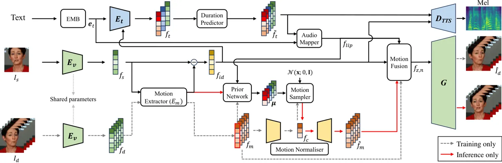
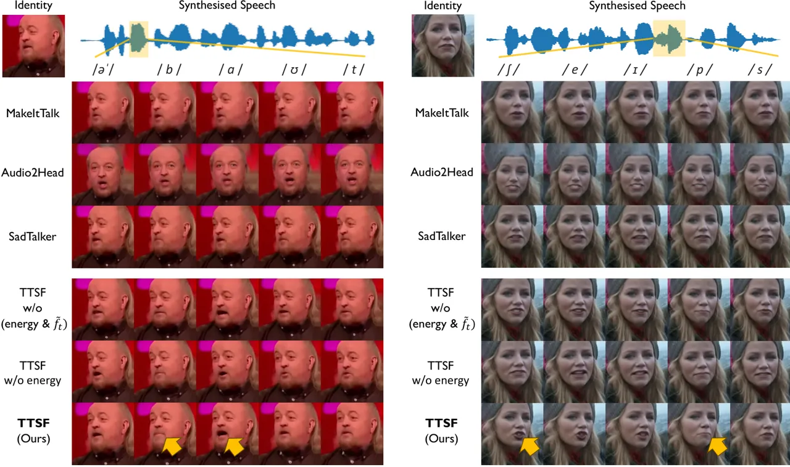
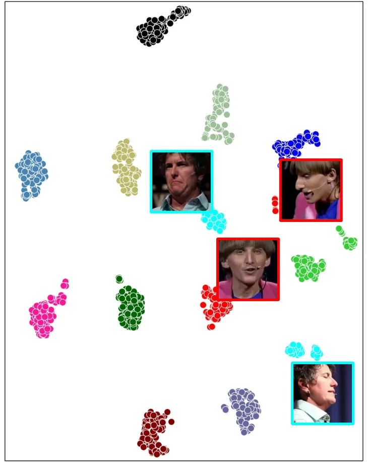
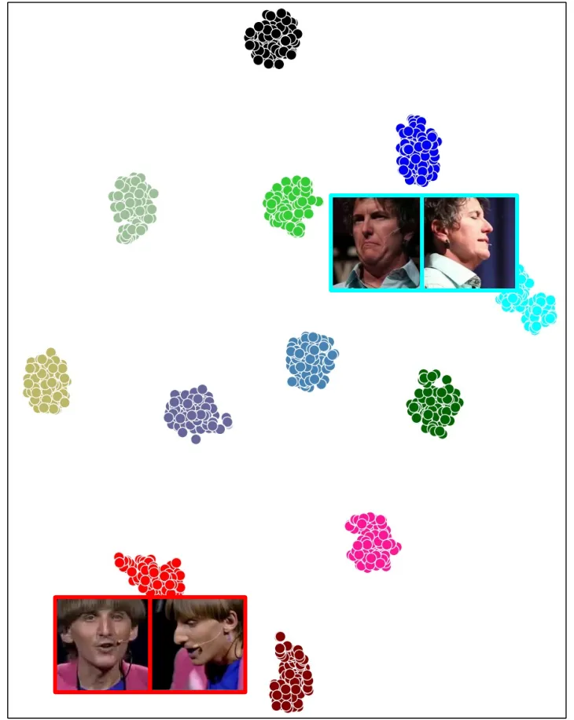

# Faces that Speak: Jointly Synthesising Talking Face and Speech from Text

Youngjoon Jang    Ji-Hoon Kim    Junseok Ahn Affiliation: Korea Advanced
Institute of Science and Technology    Doyeop Kwak Affiliation: Korea
Advanced Institute of Science and Technology    Hong-Sun Yang
Affiliation: 42dot Inc., Republic of Korea    Yoon-Cheol Ju
Affiliation: 42dot Inc., Republic of Korea    Il-Hwan Kim
Affiliation: 42dot Inc., Republic of Korea    Byeong-Yeol Kim
Affiliation: 42dot Inc., Republic of Korea    Joon Son Chung
Affiliation: Korea Advanced Institute of Science and Technology

###### Abstract

The goal of this work is to simultaneously generate natural talking
faces and speech outputs from text. We achieve this by integrating
Talking Face Generation (TFG) and Text-to-Speech (TTS) systems into a
unified framework. We address the main challenges of each task: (1)
generating a range of head poses representative of real-world scenarios,
and (2) ensuring voice consistency despite variations in facial motion
for the same identity. To tackle these issues, we introduce a motion
sampler based on conditional flow matching, which is capable of
high-quality motion code generation in an efficient way. Moreover, we
introduce a novel conditioning method for the TTS system, which utilises
motion-removed features from the TFG model to yield uniform speech
outputs. Our extensive experiments demonstrate that our method
effectively creates natural-looking talking faces and speech that
accurately match the input text. To our knowledge, this is the first
effort to build a multimodal synthesis system that can generalise to
unseen identities.

![[Uncaptioned
image]](arxiv-2405-10272--716620b9c925.figures/figure-1.webp)

Figure 1: Our framework integrates Talking Face Generation (TFG) and
Text-to-Speech (TTS) systems, generating synchronised natural speech and
a talking face video from a single portrait and text input. Our model is
capable of variational motion generation by conditioning the TFG model
with the intermediate representations of the TTS model. The speech is
conditioned using the identity features extracted in the TFG model to
align with the input identity.

^(†)^(†)footnotetext: ^(∗)Equal contribution.

## 1 Introduction

In recent years, the field of talking face synthesis has attracted
growing interest, driven by the advancements in deep learning techniques
and the development of services within the metaverse. This versatile
technology has diverse applications in movie and TV production, virtual
assistants, video conferencing, and dubbing, with the goal of creating
animated faces that are synchronised with audio to enable natural and
immersive human-machine interactions.

Previous studies in deep learning-based talking face synthesis have
focused on enhancing the controllability of facial movements and
achieving precise lip synchronisation. Some notable works \[14, 57, 60,
70, 15, 27, 5, 39\] incorporate 2D or 3D structural information to
improve motion representations. From this, recent research has naturally
diverged into two primary strands along the target applications of TFG:
one strand \[76, 42, 73, 65\] concentrates on generating expressive
facial movements only from audio conditions. Meanwhile, the other
strand \[75, 36, 6, 62, 24, 25\] aims to enhance the controllability of
talking faces by introducing a target video as an additional condition.
Despite these advancements, the audio-driven TFG methods exhibit
limitations, especially in scenarios like video production and AI
chatbots, where video and speech must be generated simultaneously.

An emerging area of research is text-driven TFG, which is relatively
under-explored compared to audio-driven TFG. Several studies \[72, 68,
69\] have attempted to merge TTS systems with TFG using a cascade
approach, but suffered from issues like error accumulation or
computational bottleneck. A very recent work \[43\] uses latent features
from TTS systems for face keypoint generation, yet still requires an
additional stage for RGB video production. It highlights the challenges
and complexities in integrating TFG and TTS systems into a cohesive and
unified framework.

In this paper, we propose a unified framework, named
Text-to-Speaking Face (TTSF), which integrates text-driven TFG and
face-stylised TTS. The key to our method lies in analysing mutually
complementary elements across distinct tasks and leveraging this
analysis to construct an improved framework. As illustrated in Fig. 1,
our framework is capable of simultaneously generating talking face
videos and natural speeches given text and a face portrait. To combine
the different tasks in a single model, we tackle the primary challenges
inherent in each task, TFG and TTS.

Firstly, our approach enables the generation of a range of head poses
that reflect real-world scenarios. To encompass dynamic and authentic
facial movements, we propose a motion sampler based on Optimal-Transport
Conditional Flow Matching (OT-CFM). This approach learns Ordinary
Differential Equations (ODEs) to extract precise motion codes from a
sophisticated distribution. Nonetheless, considerations need to be taken
into account to apply OT-CFM to the motion sampling process. Direct
prediction of target motion by OT-CFM results in the generation of
unsteady facial motions. To address this issue, we employ an
auto-encoder-based noise reducer to mitigate feature noise through
compression and reconstruction of latent features. The compressed
features serve as the target motions for our motion sampler. This
demonstrates an enhanced quality of the generated motion, particularly
in terms of temporal consistency.

Secondly, we focus on the challenge of producing consistent voices,
specifically when the input identity remains the same but facial motions
differ. This problem arises from a fundamental inquiry in face-stylised
TTS: How can we extract more refined speaker representations,
influencing prosody, timbre, and accent, from a portrait image? We
observe that facial motion in the source image affects the ability to
identify the characteristics of the target voice. Nevertheless, this
issue has been overlooked in all previous works \[20, 63, 33\], as they
commonly omit a facial motion disentanglement module, a crucial
component in the TFG system. With the benefit of integrating the TFG and
TTS models into a system, we present a straightforward yet effective
approach to condition the face-stylised TTS model. By eliminating motion
features from the input portrait, our framework can generate speeches
with the consistency of speaker identity.

In addition to the previously mentioned advantages of our framework,
there are further benefits compared to cascade text-driven TFG systems:
(1) our framework does not require an additional audio encoder, as it
can be substituted with the text encoder in our system, and (2) the
joint training eliminates the need for the fine-tuning process and
yields better-synchronised lip motions in the generated outcomes.

Our contributions can be summarised as follows:

- •
  To our best knowledge, we are the first to propose a unified
  text-driven multimodal synthesis system with robust generalisation to
  unseen identities.
- •
  We design the motion sampler based on OT-CFM that is combined with the
  auto-encoder-based noise reducer, by considering the characteristics
  of motion features.
- •
  Our method preserves crucial speaker characteristics such as prosody,
  timbre, and accent by removing the motion factors in the source image,
- •
  With the comprehensive experiments, we demonstrate the proposed method
  surpasses the cascade-based talking face generation methods while
  producing speeches from the given text.



Figure 2: Overall architecture of our framework. The TTS model receives
identity representations from the TFG model, while the TFG model takes
conditions for natural motion generation from the TTS model. These
complementary elements enhance our model’s capabilities in generating
both speech and talking faces. The EMB block denotes an embedding
operation. The grey dashed arrow represents a path used only during the
training process, and the red arrows represent paths used only during
the inference process.

## 2 Related Works

Audio-driven Talking Face Generation. Audio-driven Talking Face
Generation (TFG) technology has captured considerable attention in the
fields of computer vision and graphics due to its broad range of
applications \[8, 77\]. In the early works \[16, 17\], the focus is on
situations with individual speakers, where a single model generates
various talking faces based on a single identity. Recently, advancements
in deep learning have facilitated the creation of more versatile TFG
models \[12, 7, 58, 31, 74, 47, 44\]. These models can generate talking
faces by incorporating identity conditions as input. However, these
studies overlook head movements, grappling with the difficulty of
disentangling head poses from facial characteristics linked to identity.
To enhance natural facial movements, some studies integrate landmarks
and mesh \[14, 57, 60, 70\] or leverage 3D information \[15, 27, 5,
39\]. Despite these efforts, performance degradation occurs, especially
in wild scenarios with low landmark accuracy. Recent research
branches \[76, 42, 73, 65\] focus on generating vivid facial movements
only from audio conditions. Another branch \[75, 36, 6, 62, 24, 25\]
demonstrates improved controllability by introducing a target video as
an additional condition. These studies showcase the creation of
realistic talking faces with various facial movements, encompassing
head, eyes, and lip movements. However, these approaches rely on audio
sources for TFG, limiting their applicability in multimedia scenarios
lacking an audio source.

Text-driven Talking Face Generation. Text-driven TFG is relatively less
explored compared to the field of audio-driven TFG. Most previous
works \[31, 32, 38, 18, 59\] primarily focus on generating lip regions
for text-based redubbing or video-based translation tasks. Recent
works \[72, 68, 69\] have tried to incorporate Text-to-Speech (TTS)
technology into the process of TFG through a cascade method. However,
it’s worth noting that the cascade method encounters bottlenecks in
terms of both performance and inference time \[10\]. To tackle this
issue, the latest study \[43\] has delved into the latent features of
TTS to generate keypoints for talking faces. This exploration provides
evidence that leveraging the latent features of a TTS model is
advantageous in substituting the latent of an audio encoder for TFG.

In this paper, we unify TTS and TFG tasks to generate speech and talking
face videos concurrently. Furthermore, we extend the application of TTS
in TFG by conditioning the target voice with the input identity image.
As a result, our model can generate a diverse range of talking face
videos using only a static face image and text as input.

Text-to-Speech. Text-to-Speech (TTS) systems aim to generate natural
speech from text inputs, evolving from early approaches to recent
end-to-end methods \[35, 4, 52, 49, 28, 46, 40\]. Despite their success,
unseen-speaker TTS systems face a challenge in requiring substantial
enrollment data for accurate voice reproduction. While prior works \[26,
41, 9, 34, 22\] extract speaker representations from speech data,
obtaining sufficient high-quality utterances is challenging. Recent
studies have incorporated face images for speaker representation \[20,
63, 33\], aiming to capture correlations between visual and audio
features. However, these models often neglect motion-related factors in
face images, leading to challenges in generating consistent desired
voices when the input identity remains constant but the motion varies.

In this paper, to tackle this issue, we leverage the motion extractor of
TFG to eliminate the motion features from the source image. The
motion-normalised feature is then fed into the TTS system as a
conditioning factor, aiding the TTS model in producing consistent
voices.

## 3 Method

In Fig. 2, we propose a unified architecture, named TTSF, which
integrates TFG and TTS pipelines. In the TTS model, the text input is
embedded as $`\boldsymbol{e}_{t}`$ by an embedding layer. The text
encoder $`E_{t}`$ maps this embedding to the text feature
$`f_{t}\in\mathbb{R}^{l_{t}\times d}`$, where $`l_{t}`$ and $`d`$ denote
the token length and hidden dimension, respectively. The duration
predictor then upsamples $`f_{t}`$ to
$`\tilde{f}_{t}\in\mathbb{R}^{l_{m}\times d}`$ to align with the target
mel-spectrogram’s length $`l_{m}`$. The $`\tilde{f}_{t}`$ is
subsequently passed into the TTS decoder $`D_{TTS}`$ to predict the
target mel-spectrogram. Both $`E_{t}`$ and $`D_{TTS}`$ are conditioned
with the identity feature $`{f}_{id}`$ from the TFG model to incorporate
the characteristics of the target speaker. In the TFG model, the source
image $`I_{s}`$ and driving frames
$`I_{d}\in\mathbb{R}^{t\times c\times h\times w}`$ pass through the
shared visual encoder $`E_{v}`$, yielding visual features $`{f}_{s}`$
and $`{f}_{d}`$ for the source and target, respectively. The motion
extractor encodes motion features from the input, obtaining the identity
feature $`{f}_{id}`$ by subtracting the motion feature from $`{f}_{s}`$.
The target motion feature is denoted as $`f_{m}`$. With the motion
fusion module, $`f_{id}`$, $`f_{m}`$, and the audio mapper output
$`f_{lip}`$ are aggregated and then, input into the TFG generator $`G`$
to generate videos $`\hat{I}_{d}`$ with desired motions. To produce
variational facial movements during inference, we propose a conditional
flow matching-based motion sampler. Additionally, we introduce an
auto-encoder-based motion normaliser aimed at reducing the noise in the
sampled motions. The feature $`f_{c}`$, compressed by the normaliser,
serves as the motion sampler’s target during training. Consequently, our
framework synthesises natural talking faces and speeches from a single
portrait image and text condition.

### 3.1 Baseline for Talking Face Generation

Motion Extractor. Previous research in the fields of motion
transfer \[53, 54, 67\] and TFG \[66, 25\] has identified the presence
of a reference space that only contains individual identities. Formally,
we can express this as $`E_{v}(I)=f_{id}+f_{m}`$, where $`I`$ is the
input image, $`E_{v}`$ is the visual encoder, $`f_{id}`$ is an identity
feature, and $`f_{m}`$ is a motion feature. In our framework, the motion
extractor $`E_{m}`$ learns the subtraction of identity feature
$`f_{id}`$ from the visual feature: $`E_{m}(E_{v}(I))=f_{m}=f-f_{id}.`$
Our motion extractor follows the architecture of LIA \[67\], featuring a
5-layer MLP and trainable motion codes under an orthogonality
constraint. This constraint facilitates the representation of diverse
motions with compact channel sizes. Unlike LIA, which computes relative
motion between source and target images, our motion extractor
independently extracts identity and motion features. This distinction is
crucial for integrating TFG and TTS models, where the identity feature
conditions TTS to generate consistent voice styles robust to facial
motions.

Motion Fusion and Generator. To establish a baseline for generating both
talking faces and speeches, we consider two key aspects in designing the
TFG generator $`G`$: (1) memory efficiency and (2) resilience to unseen
identity generation. To reflect these, we avoid using an inversion
network, known for its computational heaviness, and opt for a flow-based
generator that focuses on learning coordinate mapping. For our
generator, we choose LIA’s one, which employs a StyleGAN \[1\]-styled
generator as a baseline.

However, LIA is explicitly tailored for face-to-face motion transfer and
does not account for generating lip movements synchronised with an audio
source. To apply LIA to TFG, specific considerations are needed. In the
training process, the lack of augmentation for target frames leads to
the model replicating lip motions from the target frames rather than
from audio sources. In response to this, inspired by FC-TFG \[25\], we
regulate lip motions by incorporating audio features into specific
$`n`$-th layers of the decoder. The fusion process involves a
straightforward linear operation:

```math
f_{z,n}=\left\{\begin{matrix}f_{id}+f_{m}&i\in\{\text{non-lip motion layers}\}\\
f_{id}+f_{lip}&i\in\{\text{lip motion layers}\},\end{matrix}\right. \tag{1}
```

where, $`f_{m}`$ denotes the target motions extracted from target frames
and $`f_{lip}`$ denotes the output of the audio mapper, representing lip
motion features. In the end, we generate the final videos
$`\hat{I}_{d}`$ by inputting the style feature $`f_{z,n}`$ into the TFG
generator $`G`$.

Audio Mapper.

Figure 3: The architecture of the audio mapper. The _condition_ denotes
the concatenated feature of text embedding $`\boldsymbol{e}_{t}`$,
upsampled text feature $`\tilde{f}_{t}`$, and energy, which is a norm of
$`\tilde{f}_{t}`$.

Unlike the cascade text-driven TFG, our framework does not require
extracting acoustic features using an audio encoder. Instead, we utilise
the intermediate representations of the TTS system, serving a definite
purpose: Generating natural lip motion with the TFG generator. This
feature is crafted by aggregating the concatenated features of text
embedding $`\boldsymbol{e}_{t}`$, the upsampled text feature
$`\tilde{f}_{t}`$, and energy which is an average from $`\tilde{f}_{t}`$
along the channel axis. The text embedding enables the TFG model to
grasp phoneme-level lip representation, while the upsampled text feature
and energy contribute to capturing intricate lip shapes aligned with the
generated speech sound. To aggregate these different types of features,
we use Multi-Receptive field Fusion (MRF) module \[30\]. As illustrated
in Fig. 3, the MRF module comprises multiple residual blocks, each
characterised by 1D convolutions with distinct kernel sizes and
dilations. This diverse configuration enables the module to observe both
fine and coarse details in the input along the time axis. To avoid
potential artifacts at the boundaries of motion features caused by
temporal padding operations, we intentionally remove the padding
operation and introduce temporal interpolation. Consequently, our
framework achieves well-synchronised lip movements while effectively
capturing the characteristics of the generated speech.

Training Objectives. We use a non-saturating loss \[19\] in adversarial
training:

```math
\begin{split}\mathcal{L}_{GAN}=\min_{G}\max_{D}\Bigl(&\mathbb{E}_{I_{d}}[\log(D(I_{d}))]\\
&+\mathbb{E}_{f_{z,n}}[\log(1-D(G({f_{z,n}}))]\Bigr).\end{split} \tag{2}
```

For pixel-level supervision, we use $`L1`$ reconstruction loss and
Learned Perceptual Image Patch Similarity (LPIPS) loss \[71\]. The
reconstruction loss $`\mathcal{L}_{rec}`$ is formulated as:

```math
\mathcal{L}_{rec}=\parallel\hat{I}_{d}-I_{d}\parallel_{1}+\frac{1}{N_{f}}\sum_{i=1}^{N_{f}}\parallel\phi(\hat{I}_{d})_{i}-\phi(I_{d})_{i}\parallel_{2}, \tag{3}
```

where $`\phi`$ is a pretrained VGG19 \[55\] network, and $`N_{f}`$ is
the number of feature maps. To preserve facial identity after motion
transformation, we apply an identity-based similarity loss \[50\] using
a pretrained face recognition network
$`\mathcal{L}_{id}=1-\cos\left(E_{id}\left(\hat{I}_{d}\right),E_{id}\left(I_{d}\right)\right).`$
Finally, To generate well-synchronised videos according to the input
audio conditions, We use the modified SyncNet introduced in \[25\] to
enhance our model’s lip representations. We minimise the following sync
loss:
$`\mathcal{L}_{sync}=1-\cos\left(S_{v}\left(\hat{I}_{d}\right),S_{a}\left(A_{s}\right)\right),`$
where $`S_{a}`$, $`S_{v}`$, and $`A_{s}`$ denote the audio encoder,
video encoder of SyncNet, and input audio source.

### 3.2 Variational Motion Sampling

Preliminary: Conditional Flow Matching. In this subsection, we present
an outline of Optimal-Transport Conditional Flow Matching (OT-CFM). Our
exposition primary adheres to the notation and definitions in \[37,
40\].

Let $`\boldsymbol{x}\in\real^{d}`$ be the data sample from the target
distribution $`q(\boldsymbol{x})`$, and $`p_{0}(\boldsymbol{x})`$ be
tractable prior distribution. Flow matching generative models aim to map
$`\boldsymbol{x}_{0}\sim p_{0}(\boldsymbol{x})`$ to
$`\boldsymbol{x}_{1}`$ by constructing a probability density path
$`p_{t}:[0,1]\times\real^{d}\rightarrow\real_{>0}`$, such that
$`p_{1}(\boldsymbol{x})`$ approximates $`q(\boldsymbol{x})`$. Consider
an arbitrary Ordinary Differential Equation (ODE):

```math
\displaystyle\frac{d}{dt}\phi_{t}(\boldsymbol{x}) \displaystyle=\boldsymbol{v}_{t}(\phi_{t}(\boldsymbol{x}))\text{,}\qquad\phi_{0}(\boldsymbol{x})=\boldsymbol{x}\text{,} \tag{4}
```

where the vector field
$`\boldsymbol{v}_{t}:[0,1]\times\real^{d}\rightarrow\real^{d}`$
generates the flow
$`\phi_{t}:[0,1]\times\real^{d}\rightarrow\real^{d}`$. This ODE is
associated with $`p_{t}`$, and it is sufficient to produce realistic
data if a neural network can predict an accurate vector field
$`\boldsymbol{v}_{t}`$.

Suppose there exists the optimal vector field $`\boldsymbol{u}_{t}`$
that can generate accurate $`{p}_{t}`$, then the neural network
$`\boldsymbol{v}_{t}(\boldsymbol{x};\theta)`$ can be trained to estimate
the vector field $`\boldsymbol{u}_{t}`$. However, in practice, it is
non-trivial to find the optimal vector field $`\boldsymbol{u}_{t}`$ and
the target probability $`{p}_{t}`$. To address this, \[37\] leverages
the fact that estimation of conditional vector field is equivalent to
estimation of the unconditional one, i.e.,

```math
\begin{split}&\min_{\theta}\mathbb{E}_{t,p_{t}(\boldsymbol{x})}\|\boldsymbol{u}_{t}(\boldsymbol{x})-\boldsymbol{v}_{t}(\boldsymbol{x};\theta)\|^{2}\\
&\equiv\min_{\theta}\mathbb{E}_{t,q(\boldsymbol{x}_{1}),p_{t}(\boldsymbol{x}|\boldsymbol{x}_{1})}\|\boldsymbol{u}_{t}(\boldsymbol{x}|\boldsymbol{x}_{1})-\boldsymbol{v}_{t}(\boldsymbol{x};\theta)\|^{2}\end{split} \tag{5}
```

with boundary condition
$`p_{0}(\boldsymbol{x}|\boldsymbol{x}_{1})=p_{0}(\boldsymbol{x})`$ and
$`p_{1}(\boldsymbol{x}|\boldsymbol{x}_{1})=\mathcal{N}(\boldsymbol{x}|\boldsymbol{x}_{1},\sigma^{2}\boldsymbol{I})`$
for sufficiently small $`\sigma`$.

Meanwhile, \[37\] further generalise this technique with noise condition
$`\boldsymbol{x}_{0}\sim\mathcal{N}(0,1)`$, and define OT-CFM loss as:

```math
\begin{split}\mathcal{L}_{\mathrm{OT-CFM}}(\theta)=\mathbb{E}&{}_{t,q(\boldsymbol{x}_{1}),p_{0}(\boldsymbol{x}_{0})}\|\boldsymbol{u}^{\mathrm{OT}}_{t}(\phi^{\mathrm{OT}}_{t}(\boldsymbol{x}_{0})|\boldsymbol{x}_{1})\\
&-\boldsymbol{v}_{t}(\phi^{\mathrm{OT}}_{t}(\boldsymbol{x}_{0})|\boldsymbol{\mu};\theta)\|^{2},\end{split} \tag{6}
```

where $`\boldsymbol{\mu}`$ is the predicted frame-wise mean of
$`\boldsymbol{x}_{1}`$ and
$`\phi^{\mathrm{OT}}_{t}(\boldsymbol{x}_{0})=(1-(1-\sigma_{\mathrm{min}})t)\boldsymbol{x}_{0}+t\boldsymbol{x}_{1}`$
is the flow from $`\boldsymbol{x}_{0}`$ to $`\boldsymbol{x}_{1}`$. The
target conditional vector field become
$`\boldsymbol{u}^{\mathrm{OT}}_{t}(\phi^{\mathrm{OT}}_{t}(\boldsymbol{x}_{0})|\boldsymbol{x}_{1})=\boldsymbol{x}_{1}-(1-\sigma_{\mathrm{min}})\boldsymbol{x}_{0}`$,
which enables the improved performance with its inherent linearity. In
our work, we use fixed value of $`\sigma_{min}=10^{-4}`$.

Prior Network. The prior serves as the initial condition for OT-CFM,
facilitating the identification of the optimal path to $`x_{1}`$. During
training, our prior network takes the first motion $`f_{m,0}`$ of target
motion sequence $`f_{m}`$ and the acoustic feature $`f_{lip}`$ as
inputs. We structure the prior network with a 4-layer conformer \[21\],
where the input is formed by the summation of $`f_{m,0}`$ and
$`f_{lip}`$. Note that the first motion is replaced as the source
image’s motion in inference.

OT-CFM Motion Sampler. The objective of our motion sampler is to sample
a sequence of natural motion codes from the prior $`\boldsymbol{\mu}`$.
During training, this module aims to predict target motions $`f_{m}`$.
However, in our experiments, we observed that directly regressing
$`f_{m}`$ (equivalent to setting $`\boldsymbol{x}_{1}`$ as $`f_{m}`$)
leads to producing shaky motions during inference. We expect that this
is due to the characteristics of the StyleGAN-styled decoder. Each
channel of the decoder plays a semantically meaningful role in
generating detailed facial attributes. Therefore, when the motion
sampler fails to successfully estimate the vector field, it directly
impacts the final outcomes. To address this issue, we introduce an
auto-encoder-based motion normaliser that compresses feature and
reconstructs them into the target motion $`f_{m}`$. The compressed
motion features $`f_{c}`$ serve as $`\boldsymbol{x}_{1}`$ in OT-CFM.

Training Objectives. The reconstruction loss for training our motion
normaliser is defined as Mean Square Error (MSE) loss between the target
motion $`f_{m}`$ and the reconstructed motion $`\hat{f}_{m}`$ as
follows: $`\mathcal{L}_{AE}=\parallel\hat{f}_{m}-f_{m}\parallel_{2}.`$
Moreover, as motion decoding commences from random noise
$`\mathcal{N}(\boldsymbol{\mu},I)`$ at inference, our objective is to
minimise the distance between the prior $`\boldsymbol{\mu}`$ and
compressed target motion $`f_{c}`$. Considering the output of prior
network $`\boldsymbol{\mu}`$ as parameterising the input noise for the
decoder, it is natural to view the encoder output $`{\boldsymbol{\mu}}`$
as a normal distribution $`\mathcal{N}({\boldsymbol{\mu}},I)`$.
Following \[46\], we compute a negative log-likelihood prior loss:

```math
\mathcal{L}_{prior}=-\sum_{j=1}^{T}{\log{\varphi(f_{c,j};{\mu}_{j},I)}}, \tag{7}
```

where $`\varphi(\cdot;{\mu}_{i},I)`$ represents the probability density
function of $`\mathcal{N}({\mu}_{i},I)`$, and $`T`$ denotes the temporal
length of motions.



Figure 4: Qualitative Results. We compare our method with several
baselines listed in Table 1. Our approach outperforms all the baselines
in terms of generating natural facial motions, encompassing lip shape
and head pose. MakeItTalk and SadTalker exhibit smaller variance in head
poses, while Audio2Head fails to preserve the source identity. We
emphasis that our TTSF system can generate sophisticated lip shapes,
reflecting both linguistic and acoustic information from our TTS model.

### 3.3 Text-to-Speech Synthesis

Our TTS system aims to produce well-stylised speech from a single
portrait, acquired in in-the-wild setting. In this context, we define
the in-the-wild environment as follows: (1) The model is exposed to
previously unseen facial data, and (2) the facial images exhibit various
facial poses. First, since we cannot access to the identity labels to
unseen speakers, we condition our model with image embedding. Second,
our emphasis is on the advantages of our framework. By integrating TFG
and TTS systems, we can utilise the identity feature $`f_{id}`$, a
motion-removed feature, obtained from the TFG model. Consequently, our
TTS model is capable of generating speeches robust to various facial
motions in image, maintaining consistency in the style of voice.

Our system is based on Matcha-TTS \[40\], an OT-CFM-based TTS model
known for synthesising high-quality speeches in a few synthesis steps.
We input the identity feature $`f_{id}`$ to both encoder and decoder.
With this minimal variation, our model is trained with prior, duration,
and OT-CFM losses, as outlined in \[40\]. These losses are collectively
denoted as $`L_{TTS}`$. Finally, we convert the generated
mel-spectrogram by using a pretrained vocoder \[30\].

Final Loss. The final loss is calculated as the sum of the
aforementioned losses, represented as follows:

```math
\begin{split}\mathcal{L}_{total}=\lambda_{1}\mathcal{L}_{GAN}+\lambda_{2}\mathcal{L}_{rec}+\lambda_{3}\mathcal{L}_{id}+\lambda_{4}\mathcal{L}_{sync}\\
+\lambda_{5}\mathcal{L}_{OT-CFM}+\lambda_{6}\mathcal{L}_{ae}+\lambda_{7}\mathcal{L}_{prior}+\lambda_{8}\mathcal{L}_{tts},\end{split} \tag{8}
```

where hyperparameters $`\lambda`$ are introduced to balance the scale of
each loss. Each $`\lambda`$ controls the relative importance of its
corresponding loss term. Empirically, the values of $`\lambda_{1}`$,
$`\lambda_{2}`$, $`\lambda_{3}`$, $`\lambda_{4}`$, $`\lambda_{5}`$,
$`\lambda_{6}`$, $`\lambda_{7}`$, and $`\lambda_{8}`$ are set to 0.1, 1,
0.3, 0.1, 0.1, 1, 0.1, and 1.

## 4 Experiments

### 4.1 Experimental Setup

Dataset. Our framework is trained on the LRS3 \[3\] dataset, which
consists of both talking face videos and transcription labels. LRS3
consists of videos captured during indoor shows of TED or TEDx. We
evaluate our model on VoxCeleb2 \[13\] and LRS2 \[2\] datasets, which
contain more challenging examples than LRS3 since many videos are shot
outdoors. We randomly select a subset of videos from each dataset to
evaluate the performance of our framework.

Implementation Details. First of all, we pretrain a Matcha-TTS \[40\]
model on the LRS3 dataset for 2,000 epochs and then jointly train with
the talking face generation model for 40 epochs. Our focus is on the
manipulation of seven specific layers within the generator, namely
layers 1 to 7. Furthermore, we exclusively input the audio feature into
two specific layers, namely layers 6 and 7. Our motion sampler is
trained with 32-frame videos and then inferences with all frames of each
video. Audio data is sampled to 16kHz, and converted to mel-spectrogram
with a window size of 640, a hop length of 160, and 80 mel bins. To
update our model, we employ the Adam optimiser \[29\] with a learning
rate set at $`{1e{-4}}`$. The entire framework is implemented using
PyTorch \[45\] and is trained across eight 48GB A6000 GPUs.

|                   |       |                   |                    |                   |                 |
| ----------------- | ----- | ----------------- | ------------------ | ----------------- | --------------- |
| Models            | Audio | Video Quality     |                    | Synchronisation   | Diversity       |
|                   |       | FID$`\downarrow`$ | ID-SIM$`\uparrow`$ | LSE-C$`\uparrow`$ | DIV$`\uparrow`$ |
| Ground Truth      | \-    | 0.00              | 1.00               | 5.360             | 0.168           |
| MakeItTalk \[76\] | GT    | 24.213            | 0.845              | 2.674             | 0.102           |
| MakeItTalk        | TTS   | 25.168            | 0.850              | 3.487             | 0.095           |
| Audio2Head \[64\] | GT    | 41.721            | 0.217              | 4.607             | 0.149           |
| Audio2Head        | TTS   | 42.262            | 0.225              | 5.478             | 0.145           |
| SadTalker \[73\]  | GT    | 20.771            | 0.854              | 4.978             | 0.109           |
| SadTalker         | TTS   | 20.729            | 0.859              | 6.256             | 0.111           |
| TTSF (Ours)       | \-    | 18.348            | 0.864              | 5.686             | 0.143           |

Table 1: Comparison with the state-of-the-art methods on LRS2 in the
one-shot setting. The Audio column refers to the speech source for
generation (GT: ground truth, TTS: synthesised audio.)

Evaluation Metrics. In our quantitative assessments for TFG, we employ a
range of evaluation metrics introduced in previous works. To assess the
visual quality of the generated videos, we employ the Fréchet Inception
Distance (FID) score and ID Similarity (ID-SIM) score using a pretrained
face recognition model \[23\]. To measure the accuracy of mouth shapes
and lip sync, we utilise the Lip Sync Error Confidence (LSE-C), a metric
introduced in \[11\]. For the diversity of the generated head motions,
we calculate the standard deviation of the head motion feature
embeddings extracted from the generated frames using Hopenet \[51\],
following the approach introduced in \[73\].

For the evaluation of TTS performance, we compute Word Error Rate (WER),
Mel Cepstral Distortion (MCD), the cosine similarity (C-SIM) between
x-vectors \[56\] of the target and synthesised speech, as well as the
Root Mean Square Error (RMSE) for F0. WER and MCD represent the
intelligibility and naturalness of speech, respectively. C-SIM and RMSE
measure the voice similarity to the target speaker. For WER, we use a
publicly available speech recognition model of \[48\].

| Models            | Video Quality      | Synchronisation   | Diversity       |
| ----------------- | ------------------ | ----------------- | --------------- |
|                   | ID-SIM$`\uparrow`$ | LSE-C$`\uparrow`$ | DIV$`\uparrow`$ |
| MakeItTalk \[76\] | 0.841              | 3.529             | 0.094           |
| Audio2Head \[64\] | 0.151              | 5.738             | 0.146           |
| SadTalker \[73\]  | 0.855              | 6.310             | 0.111           |
| TTSF (Ours)       | 0.876              | 5.721             | 0.143           |

Table 2: Comparison with the state-of-the-art methods on VoxCeleb2 in
the one-shot setting. The previous audio-driven TFG models are cascaded
with our TTS model to generate talking faces from text.

### 4.2 Comparison with State-of-the-art Methods

Text-driven Talking Face Generation. We compare several state-of-the-art
methods (MakeitTalk \[76\], Audio2Head \[64\], and SadTalker \[73\]) for
the text-driven talking head video generations by attaching our TTS
model to the previous audio-driven TFG models in the cascade method. To
simulate a one-shot talking face generation scenario, we evaluate the
baselines on the in-the-wild datasets, LRS2 and VoxCeleb2. As shown
in Table 1, the proposed model outperforms every audio- and cascade
text-driven method in terms of video quality (FID, ID-SIM) on LRS2.
Additionally, we present experimental results on the VoxCeleb2 dataset
in Table 2. Since this dataset does not contain text transcription
according to the speech in the video, our framework generates both
speech and a talking face by inputting a single frame from a VoxCeleb2
video and a randomly selected transcription from LRS3. Similar to the
experimental results on LRS2, our framework exhibits superior
performance in ID-SIM score. On the other hand, the proposed model
records a lower synchronisation score compared to SadTalker using the
LSE-C metric. However, given that the LSE-C metric relies significantly
on a pretrained model, a more useful evaluation of lip synchronisation
can be achieved through perceptual judgement by humans, as assessed in
user studies. The qualitative assessment in Section 4.3 shows that our
method produces perceptually better synchronised output compared to the
baseline. Although Audio2Head shows the best diversity score, it records
the lowest scores in video quality metrics. We also observe that
Audio2Head completely fails to generate a natural video when the input
source image is not located in the centre of the screen. On the other
hand, our proposed method achieves high scores in both video quality and
diversity metrics. Considering the aforementioned issues, our framework
demonstrates robust generalisation to unseen data when conducting
multimodal synthesis encompassing both video and speech.

Face-stylised Text-to-Speech. To evaluate the generalisability of our
TTS system, we compare our model to Face-TTS \[33\], which is a
state-of-the-art method of face-stylised TTS. For the evaluation, we
simulate two scenarios on LRS2 dataset: (1) w/ motion, where the TTS
model is conditioned with source image embedding, i.e.,
$`f_{id}+f_{m}`$; (2) w/o motion, where the model is conditioned with
only identity feature $`f_{id}`$. The results are shown in Table 1.
While the proposed model shows slight deviance in MCD, it clearly
outperforms the baseline in WER, C-SIM, and RMSE, demonstrating its
superiority in intelligibility and voice similarity. More importantly,
when we consider motion features together as our speaker condition, the
generation performance is significantly degraded, especially in voice
similarity. It indicates the benefits of unifying TFG and TTS systems,
highlighting the advantages of their integration.

|                   |                   |                   |                   |                    |
| ----------------- | ----------------- | ----------------- | ----------------- | ------------------ |
| Models            | Intel.            | Nat.              | Voice similarity  |                    |
|                   | WER$`\downarrow`$ | MCD$`\downarrow`$ | C-SIM$`\uparrow`$ | RMSE$`\downarrow`$ |
| Ground Truth      | 6.35              | –                 | –                 | –                  |
| Face-TTS \[33\]   | 18.02             | 6.85              | 0.272             | 52.33              |
| Ours (w/ motion)  | 15.68             | 7.43              | 0.451             | 50.67              |
| Ours (w/o motion) | 14.56             | 7.23              | 0.593             | 48.52              |

Table 3: Quantitative results of synthesised speech. Intel. and Nat.
denote intelligibility and naturalness of audio, respectively.

|                   |                   |                   |                   |
| ----------------- | ----------------- | ----------------- | ----------------- |
| Models            | Lip Sync          | Motion            | Video             |
|                   | Accuracy          | Naturalness       | Realness          |
| MakeItTalk \[76\] | 2.44 $`\pm`$ 0.07 | 2.79 $`\pm`$ 0.09 | 2.79 $`\pm`$ 0.08 |
| Audio2Head \[64\] | 2.73 $`\pm`$ 0.08 | 2.92 $`\pm`$ 0.09 | 2.48 $`\pm`$ 0.09 |
| SadTalker \[73\]  | 2.78 $`\pm`$ 0.08 | 2.80 $`\pm`$ 0.09 | 2.90 $`\pm`$ 0.09 |
| TTSF(Ours)        | 4.09 $`\pm`$ 0.07 | 3.85 $`\pm`$ 0.07 | 3.87 $`\pm`$ 0.07 |

Table 4: MOS evaluation results. MOS is presented with 95% confidence
intervals. Note that the previous audio-driven TFG models are cascaded
with our TTS model.

### 4.3 Qualitative Evaluation

User Study. We evaluate the synthesised videos through a user study
involving 40 participants, each providing opinions on 20 videos.
Reference images and texts were randomly selected from the LRS2 test
split to create videos using MakeItTalk \[76\], Audio2Head \[64\],
SadTalker \[73\], and our proposed method. Mean Opinion Scores (MOS) are
used for evaluation, following the approach in \[36, 75, 25\].
Participants rate each video on a scale from 1 to 5, considering lip
sync quality, video realness, and head movement naturalness. The order
of methods within each video clip is randomly shuffled. The results
in Table 4 indicate that our method outperforms existing methods in
generating talking face videos with higher lip synchronisation and
natural head movement.

Analysis on Qualitative Results. We visually present our qualitative
results in  Fig. 4. MakeItTalk fails to produce precise lip motions
aligned with the synthesised speech, and Audio2Head struggles to
preserve identity information. SadTalker can generate well-synchronised
lip motions but is limited in facial movements. In contrast, our
approach exhibits more dynamic facial movements and can generate vivid
lip motions that reflect both linguistic and acoustic information. For
instance, it can be seen that our model’s lip motions are precisely
aligned to the pronunciation of the speeches (refer to the yellow
arrows). The accuracy and the details demonstrate that our method can
generate realistic and expressive talking faces.

The Effectiveness of Identity Features. To verify the effectiveness of
identity feature-based conditioning, we visualise the feature space of
synthesised audio. Fig. 5 shows t-SNE \[61\] plots of x-vectors from
Face-TTS and our method. As shown in Fig. 5(a), Face-TTS fails to
cluster features derived from the same speaker. This implies the
potential failure to generate the target voice with different styles. In
contrast, as depicted in Fig. 5(b), the proposed TTS system effectively
clusters features derived from the same speaker despite the variety in
head motions. This demonstrates that our method is capable of
synthesising consistent voices, even in the presence of varying motions.

### 4.4 Ablation Studies

Analysis on Feature Aggregation in Audio Mapper. We perform an ablation
study on the feature aggregation in our audio mapper. w/o (energy &
$`\tilde{f}_{t}`$) indicates the TFG model conditioned with text
embedding $`\boldsymbol{e}_{t}`$ from the audio mapper. In this case,
the TFG model can incorporate only linguistic information and it leads
to our model failing to generate precise lip motions. When we
additionally input the upsampled text feature $`\tilde{f}_{t}`$ to our
TFG model, the synchronisation score improves significantly. This is
because our TTS model is optimised by reducing the prior loss between
$`\tilde{f}_{t}`$ and the target mel-spectrogram. This indicates that
the $`\tilde{f}_{t}`$ feature contains acoustic information. Finally,
when we add the energy feature to the previous condition, our model
exhibits the best performance across all metrics. This indicates that
the energy of speech significantly impacts generation of detailed lip
movements.

|                                  |                    |                   |                 |
| -------------------------------- | ------------------ | ----------------- | --------------- |
| Models                           | Video Quality      | Synchronisation   | Diversity       |
|                                  | ID-SIM$`\uparrow`$ | LSE-C$`\uparrow`$ | DIV$`\uparrow`$ |
| TTSF (Ours)                      | 0.876              | 5.721             | 0.143           |
| w/o energy                       | 0.874              | 5.555             | 0.143           |
| w/o (energy & $`\tilde{f}_{t}`$) | 0.872              | 3.935             | 0.139           |

Table 5: Ablation study on feature aggregation in audio mapper.



(a) Face-TTS \[33\]



(b) Ours

Figure 5: Speaker representation space of (a) Face-TTS and (b) Ours.
Each colour represents a different speaker.

## 5 Conclusion

Our work introduces a unified text-driven multimodal synthesis system
that exhibits robust generalisation to unseen identities. The proposed
OT-CFM-based motion sampler, coupled with an auto-encoder-based noise
reducer, produces realistic facial poses. Notably, our method excels in
preserving essential speaker characteristics such as prosody, timbre,
and accent by effectively removing motion factors from the source image.
Our experiments demonstrate the superiority of our proposed method over
cascade-based talking face generation approaches, underscoring the
effectiveness of our unified framework in multimodal speech synthesis.

## References

- \[1\] Rameen Abdal, Yipeng Qin, and Peter Wonka. Image2styleGAN++: How
  to edit the embedded images? In _Proc. CVPR_, 2020.
- \[2\] Triantafyllos Afouras, Joon Son Chung, Andrew Senior, Oriol
  Vinyals, and Andrew Zisserman. Deep audio-visual speech recognition.
  _IEEE Trans. on Pattern Analysis and Machine Intelligence_, 2018a.
- \[3\] Triantafyllos Afouras, Joon Son Chung, and Andrew Zisserman.
  LRS3-TED: A large-scale dataset for visual speech recognition. _arXiv
  preprint arXiv:1809.00496_, 2018b.
- \[4\] Alan W Black, Heiga Zen, and Keiichi Tokuda. Statistical
  parametric speech synthesis. In _Proc. ICASSP_, 2007.
- \[5\] Adrian Bulat and Georgios Tzimiropoulos. How far are we from
  solving the 2d & 3d face alignment problem? (and a dataset of 230,000
  3d facial landmarks). In _Proc. ICCV_, 2017.
- \[6\] Egor Burkov, Igor Pasechnik, Artur Grigorev, and Victor
  Lempitsky. Neural head reenactment with latent pose descriptors. In
  _Proc. CVPR_, 2020.
- \[7\] Lele Chen, Ross K Maddox, Zhiyao Duan, and Chenliang Xu.
  Hierarchical cross-modal talking face generation with dynamic
  pixel-wise loss. In _Proc. CVPR_, 2019.
- \[8\] Lele Chen, Guofeng Cui, Ziyi Kou, Haitian Zheng, and Chenliang
  Xu. What comprises a good talking-head video generation?: A survey and
  benchmark. _arXiv preprint arXiv:2005.03201_, 2020.
- \[9\] Mingjian Chen, Xu Tan, Bohan Li, Yanqing Liu, Tao Qin, Sheng
  Zhao, and Tie-Yan Liu. Adaspeech: Adaptive text to speech for custom
  voice. In _Proc. ICLR_, 2021.
- \[10\] Jeongsoo Choi, Minsu Kim, Se Jin Park, and Yong Man Ro.
  Reprogramming audio-driven talking face synthesis into text-driven. In
  _Proc. ICASSP_, 2024.
- \[11\] Joon Son Chung and Andrew Zisserman. Out of time: automated lip
  sync in the wild. In _Proc. ACCV_, 2017.
- \[12\] Joon Son Chung, Amir Jamaludin, and Andrew Zisserman. You said
  that? In _Proc. BMVC._, 2017.
- \[13\] Joon Son Chung, Arsha Nagrani, and Andrew Zisserman. Voxceleb2:
  Deep speaker recognition. In _Proc. Interspeech_, 2018.
- \[14\] Dipanjan Das, Sandika Biswas, Sanjana Sinha, and Brojeshwar
  Bhowmick. Speech-driven facial animation using cascaded GANs for
  learning of motion and texture. In _Proc. ECCV_, 2020.
- \[15\] Yu Deng, Jiaolong Yang, Sicheng Xu, Dong Chen, Yunde Jia, and
  Xin Tong. Accurate 3d face reconstruction with weakly-supervised
  learning: From single image to image set. In _Proc. CVPR_, 2019.
- \[16\] Bo Fan, Lijuan Wang, Frank K Soong, and Lei Xie. Photo-real
  talking head with deep bidirectional LSTM. In _Proc. ICASSP_, 2015.
- \[17\] Bo Fan, Lei Xie, Shan Yang, Lijuan Wang, and Frank K Soong. A
  deep bidirectional LSTM approach for video-realistic talking head.
  _Multimedia Tools and Applications_, 2016.
- \[18\] Ohad Fried, Ayush Tewari, Michael Zollhöfer, Adam Finkelstein,
  Eli Shechtman, Dan B Goldman, Kyle Genova, Zeyu Jin, Christian
  Theobalt, and Maneesh Agrawala. Text-based editing of talking-head
  video. _ACM Transactions on Graphics_, 2019.
- \[19\] Ian Goodfellow, Jean Pouget-Abadie, Mehdi Mirza, Bing Xu, David
  Warde-Farley, Sherjil Ozair, Aaron Courville, and Yoshua Bengio.
  Generative adversarial networks. _Communications of the ACM_, 2020.
- \[20\] Shunsuke Goto, Kotaro Onishi, Yuki Saito, Kentaro Tachibana,
  and Koichiro Mori. Face2speech: Towards multi-speaker text-to-speech
  synthesis using an embedding vector predicted from a face image. In
  _Proc. Interspeech_, 2020.
- \[21\] Anmol Gulati, James Qin, Chung-Cheng Chiu, Niki Parmar, Yu
  Zhang, Jiahui Yu, Wei Han, Shibo Wang, Zhengdong Zhang, Yonghui Wu,
  et al. Conformer: Convolution-augmented transformer for speech
  recognition. In _Proc. Interspeech_, 2020.
- \[22\] Rongjie Huang, Yi Ren, Jinglin Liu, Chenye Cui, and Zhou Zhao.
  Generspeech: Towards style transfer for generalizable out-of-domain
  text-to-speech synthesis. In _Proc. NeurIPS_, 2022.
- \[23\] Yuge Huang, Yuhan Wang, Ying Tai, Xiaoming Liu, Pengcheng Shen,
  Shaoxin Li, Jilin Li, and Feiyue Huang. Curricularface: Adaptive
  curriculum learning loss for deep face recognition. In _Proc.
  CVPR_, 2020.
- \[24\] Geumbyeol Hwang, Sunwon Hong, Seunghyun Lee, Sungwoo Park, and
  Gyeongsu Chae. Discohead: Audio-and-video-driven talking head
  generation by disentangled control of head pose and facial
  expressions. In _Proc. ICASSP_, 2023.
- \[25\] Youngjoon Jang, Kyeongha Rho, Jongbin Woo, Hyeongkeun Lee,
  Jihwan Park, Youshin Lim, Byeong-Yeol Kim, and Joon Son Chung. That’s
  what i said: Fully-controllable talking face generation. In _Proc. ACM
  MM_, 2023.
- \[26\] Ye Jia, Yu Zhang, Ron Weiss, Quan Wang, Jonathan Shen, Fei Ren,
  Patrick Nguyen, Ruoming Pang, Ignacio Lopez Moreno, Yonghui Wu, et al.
  Transfer learning from speaker verification to multispeaker
  text-to-speech synthesis. In _Proc. NeurIPS_, 2018.
- \[27\] Zi-Hang Jiang, Qianyi Wu, Keyu Chen, and Juyong Zhang.
  Disentangled representation learning for 3D face shape. In _Proc.
  CVPR_, 2019.
- \[28\] Jaehyeon Kim, Sungwon Kim, Jungil Kong, and Sungroh Yoon.
  Glow-TTS: A generative flow for text-to-speech via monotonic alignment
  search. In _Proc. NeurIPS_, 2020.
- \[29\] Diederik P Kingma and Jimmy Ba. Adam: A method for stochastic
  optimization. _Proc. ICLR_, 2014.
- \[30\] Jungil Kong, Jaehyeon Kim, and Jaekyoung Bae. Hifi-GAN:
  Generative adversarial networks for efficient and high fidelity speech
  synthesis. In _Proc. NeurIPS_, 2020.
- \[31\] Prajwal KR, Rudrabha Mukhopadhyay, Jerin Philip, Abhishek Jha,
  Vinay Namboodiri, and CV Jawahar. Towards automatic face-to-face
  translation. In _Proc. ACM MM_, 2019.
- \[32\] Rithesh Kumar, Jose Sotelo, Kundan Kumar, Alexandre
  De Brebisson, and Yoshua Bengio. Obamanet: Photo-realistic lip-sync
  from text. _arXiv preprint arXiv:1801.01442_, 2017.
- \[33\] Jiyoung Lee, Joon Son Chung, and Soo-Whan Chung. Imaginary
  voice: Face-styled diffusion model for text-to-speech. In _Proc.
  ICASSP_, 2023.
- \[34\] Ji-Hyun Lee, Sang-Hoon Lee, Ji-Hoon Kim, and Seong-Whan Lee.
  PVAE-TTS: Adaptive text-to-speech via progressive style adaptation. In
  _Proc. ICASSP_, 2022.
- \[35\] Sang-Hoon Lee, Hyun-Wook Yoon, Hyeong-Rae Noh, Ji-Hoon Kim, and
  Seong-Whan Lee. Multi-spectroGAN: High-diversity and high-fidelity
  spectrogram generation with adversarial style combination for speech
  synthesis. In _Proc. AAAI_, 2021.
- \[36\] Borong Liang, Yan Pan, Zhizhi Guo, Hang Zhou, Zhibin Hong,
  Xiaoguang Han, Junyu Han, Jingtuo Liu, Errui Ding, and Jingdong Wang.
  Expressive talking head generation with granular audio-visual control.
  In _Proc. CVPR_, 2022.
- \[37\] Yaron Lipman, Ricky TQ Chen, Heli Ben-Hamu, Maximilian Nickel,
  and Matt Le. Flow matching for generative modeling. In _Proc.
  ICLR_, 2023.
- \[38\] Jinglin Liu, Zhiying Zhu, Yi Ren, Wencan Huang, Baoxing Huai,
  Nicholas Yuan, and Zhou Zhao. Parallel and high-fidelity text-to-lip
  generation. In _Proc. AAAI_, 2022.
- \[39\] Yifeng Ma, Suzhen Wang, Zhipeng Hu, Changjie Fan, Tangjie Lv,
  Yu Ding, Zhidong Deng, and Xin Yu. Styletalk: One-shot talking head
  generation with controllable speaking styles. In _Proc. AAAI_, 2023.
- \[40\] Shivam Mehta, Ruibo Tu, Jonas Beskow, Éva Székely, and
  Gustav Eje Henter. Matcha-TTS: A fast TTS architecture with
  conditional flow matching. In _Proc. ICASSP_, 2024.
- \[41\] Dongchan Min, Dong Bok Lee, Eunho Yang, and Sung Ju Hwang.
  Meta-stylespeech: Multi-speaker adaptive text-to-speech generation. In
  _Proc. ICML_, 2021.
- \[42\] Dongchan Min, Minyoung Song, and Sung Ju Hwang. Styletalker:
  One-shot style-based audio-driven talking head video generation.
  _arXiv preprint arXiv:2208.10922_, 2022.
- \[43\] Kentaro Mitsui, Yukiya Hono, and Kei Sawada. Uniflg: Unified
  facial landmark generator from text or speech. In _Proc.
  Interspeech_, 2023.
- \[44\] Se Jin Park, Minsu Kim, Joanna Hong, Jeongsoo Choi, and
  Yong Man Ro. Synctalkface: Talking face generation with precise
  lip-syncing via audio-lip memory. In _Proc. AAAI_, 2022.
- \[45\] Adam Paszke, Sam Gross, Francisco Massa, Adam Lerer, James
  Bradbury, Gregory Chanan, Trevor Killeen, Zeming Lin, Natalia
  Gimelshein, Luca Antiga, et al. Pytorch: An imperative style,
  high-performance deep learning library. In _Proc. NeurIPS_, 2019.
- \[46\] Vadim Popov, Ivan Vovk, Vladimir Gogoryan, Tasnima Sadekova,
  and Mikhail Kudinov. Grad-TTS: A diffusion probabilistic model for
  text-to-speech. In _Proc. ICML_, 2021.
- \[47\] KR Prajwal, Rudrabha Mukhopadhyay, Vinay P Namboodiri, and CV
  Jawahar. A lip sync expert is all you need for speech to lip
  generation in the wild. In _Proc. ACM MM_, 2020.
- \[48\] Alec Radford, Jong Wook Kim, Tao Xu, Greg Brockman, Christine
  McLeavey, and Ilya Sutskever. Robust speech recognition via
  large-scale weak supervision. In _Proc. ICML_, 2023.
- \[49\] Yi Ren, Yangjun Ruan, Xu Tan, Tao Qin, Sheng Zhao, Zhou Zhao,
  and Tie-Yan Liu. Fastspeech: Fast, robust and controllable text to
  speech. In _Proc. NeurIPS_, 2019.
- \[50\] Elad Richardson, Yuval Alaluf, Or Patashnik, Yotam Nitzan,
  Yaniv Azar, Stav Shapiro, and Daniel Cohen-Or. Encoding in style: A
  stylegan encoder for image-to-image translation. In _Proc.
  CVPR_, 2021.
- \[51\] Nataniel Ruiz, Eunji Chong, and James M. Rehg. Fine-grained
  head pose estimation without keypoints. In _Proc. CVPR_, 2018.
- \[52\] Jonathan Shen, Ruoming Pang, Ron J Weiss, Mike Schuster,
  Navdeep Jaitly, Zongheng Yang, Zhifeng Chen, Yu Zhang, Yuxuan Wang, Rj
  Skerrv-Ryan, et al. Natural TTS synthesis by conditioning wavenet on
  mel spectrogram predictions. In _Proc. ICASSP_, 2018.
- \[53\] Aliaksandr Siarohin, Stéphane Lathuilière, Sergey Tulyakov,
  Elisa Ricci, and Nicu Sebe. First order motion model for image
  animation. In _Proc. NeurIPS_, 2019.
- \[54\] Aliaksandr Siarohin, Oliver J Woodford, Jian Ren, Menglei Chai,
  and Sergey Tulyakov. Motion representations for articulated animation.
  In _Proc. CVPR_, 2021.
- \[55\] Karen Simonyan and Andrew Zisserman. Very deep convolutional
  networks for large-scale image recognition. In _Proc. ICLR_, 2015.
- \[56\] David Snyder, Daniel Garcia-Romero, Gregory Sell, Daniel Povey,
  and Sanjeev Khudanpur. X-vectors: Robust dnn embeddings for speaker
  recognition. In _Proc. ICASSP_, 2018.
- \[57\] Linsen Song, Wayne Wu, Chen Qian, Ran He, and Chen Change Loy.
  Everybody’s talkin’: Let me talk as you want. _IEEE Transactions on
  Information Forensics and Security_, 2022.
- \[58\] Yang Song, Jingwen Zhu, Dawei Li, Xiaolong Wang, and Hairong
  Qi. Talking face generation by conditional recurrent adversarial
  network. _Proc. IJCAI_, 2019.
- \[59\] Sarah L Taylor, Moshe Mahler, Barry-John Theobald, and Iain
  Matthews. Dynamic units of visual speech. In _Proc. ACM
  SIGGRAPH_, 2012.
- \[60\] Justus Thies, Mohamed Elgharib, Ayush Tewari, Christian
  Theobalt, and Matthias Nießner. Neural voice puppetry: Audio-driven
  facial reenactment. In _Proc. ECCV_, 2020.
- \[61\] Laurens Van der Maaten and Geoffrey Hinton. Visualizing data
  using t-SNE. _Journal of machine learning research_, 2008.
- \[62\] Duomin Wang, Yu Deng, Zixin Yin, Heung-Yeung Shum, and Baoyuan
  Wang. Progressive disentangled representation learning for
  fine-grained controllable talking head synthesis. In _Proc. CVPR_,
  2022a.
- \[63\] Jianrong Wang, Zixuan Wang, Xiaosheng Hu, Xuewei Li, Qiang
  Fang, and Li Liu. Residual-guided personalized speech synthesis based
  on face image. In _Proc. ICASSP_, 2022b.
- \[64\] Suzhen Wang, Lincheng Li, Yu Ding, Changjie Fan, and Xin Yu.
  Audio2head: Audio-driven one-shot talking-head generation with natural
  head motion. In _Proc. IJCAI_, 2021a.
- \[65\] Suzhen Wang, Lincheng Li, Yu Ding, and Xin Yu. One-shot talking
  face generation from single-speaker audio-visual correlation learning.
  In _Proc. AAAI_, 2022c.
- \[66\] Ting-Chun Wang, Arun Mallya, and Ming-Yu Liu. One-shot
  free-view neural talking-head synthesis for video conferencing. In
  _Proc. CVPR_, 2021b.
- \[67\] Yaohui Wang, Di Yang, Francois Bremond, and Antitza Dantcheva.
  Latent image animator: Learning to animate images via latent space
  navigation. In _Proc. ICLR_, 2022d.
- \[68\] Zhichao Wang, Mengyu Dai, and Keld Lundgaard. Text-to-video: A
  two-stage framework for zero-shot identity-agnostic talking-head
  generation. In _Proc. KDD_, 2023.
- \[69\] Zhenhui Ye, Ziyue Jiang, Yi Ren, Jinglin Liu, Chen Zhang, Xiang
  Yin, Zejun Ma, and Zhou Zhao. Ada-TTA: Towards adaptive high-quality
  text-to-talking avatar synthesis. In _Proc. ICMLW_, 2023.
- \[70\] Ran Yi, Zipeng Ye, Juyong Zhang, Hujun Bao, and Yong-Jin Liu.
  Audio-driven talking face video generation with learning-based
  personalized head pose. _IEEE Trans. on Multimedia_, 2020.
- \[71\] Richard Zhang, Phillip Isola, Alexei A Efros, Eli Shechtman,
  and Oliver Wang. The unreasonable effectiveness of deep features as a
  perceptual metric. In _Proc. CVPR_, 2018.
- \[72\] Sibo Zhang, Jiahong Yuan, Miao Liao, and Liangjun Zhang.
  Text2video: Text-driven talking-head video synthesis with personalized
  phoneme-pose dictionary. In _Proc. ICASSP_, 2022.
- \[73\] Wenxuan Zhang, Xiaodong Cun, Xuan Wang, Yong Zhang, Xi Shen, Yu
  Guo, Ying Shan, and Fei Wang. Sadtalker: Learning realistic 3D motion
  coefficients for stylized audio-driven single image talking face
  animation. In _Proc. CVPR_, 2023.
- \[74\] Hang Zhou, Yu Liu, Ziwei Liu, Ping Luo, and Xiaogang Wang.
  Talking face generation by adversarially disentangled audio-visual
  representation. In _Proc. AAAI_, 2019.
- \[75\] Hang Zhou, Yasheng Sun, Wayne Wu, Chen Change Loy, Xiaogang
  Wang, and Ziwei Liu. Pose-controllable talking face generation by
  implicitly modularized audio-visual representation. In _Proc.
  CVPR_, 2021.
- \[76\] Yang Zhou, Xintong Han, Eli Shechtman, Jose Echevarria,
  Evangelos Kalogerakis, and Dingzeyu Li. Makeittalk: speaker-aware
  talking-head animation. _ACM Transactions on Graphics_, 2020.
- \[77\] Hao Zhu, Man-Di Luo, Rui Wang, Ai-Hua Zheng, and Ran He. Deep
  audio-visual learning: A survey. _International Journal of Automation
  and Computing_, 2021.
