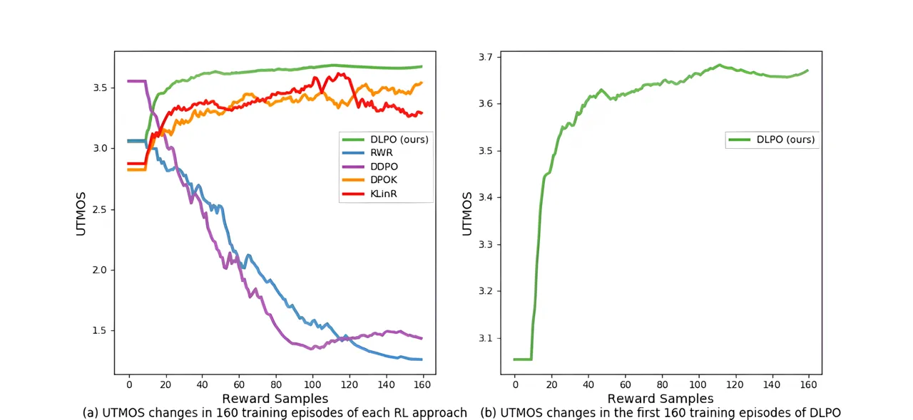
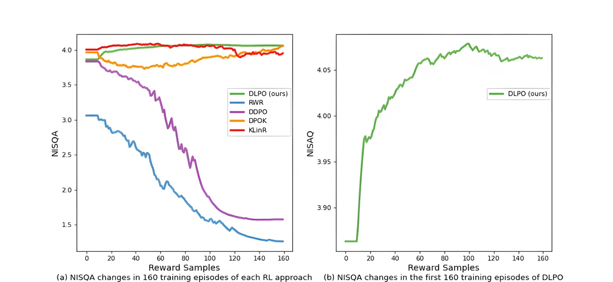
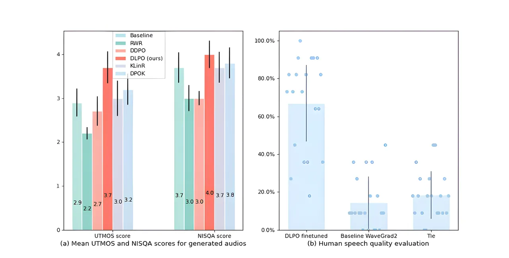
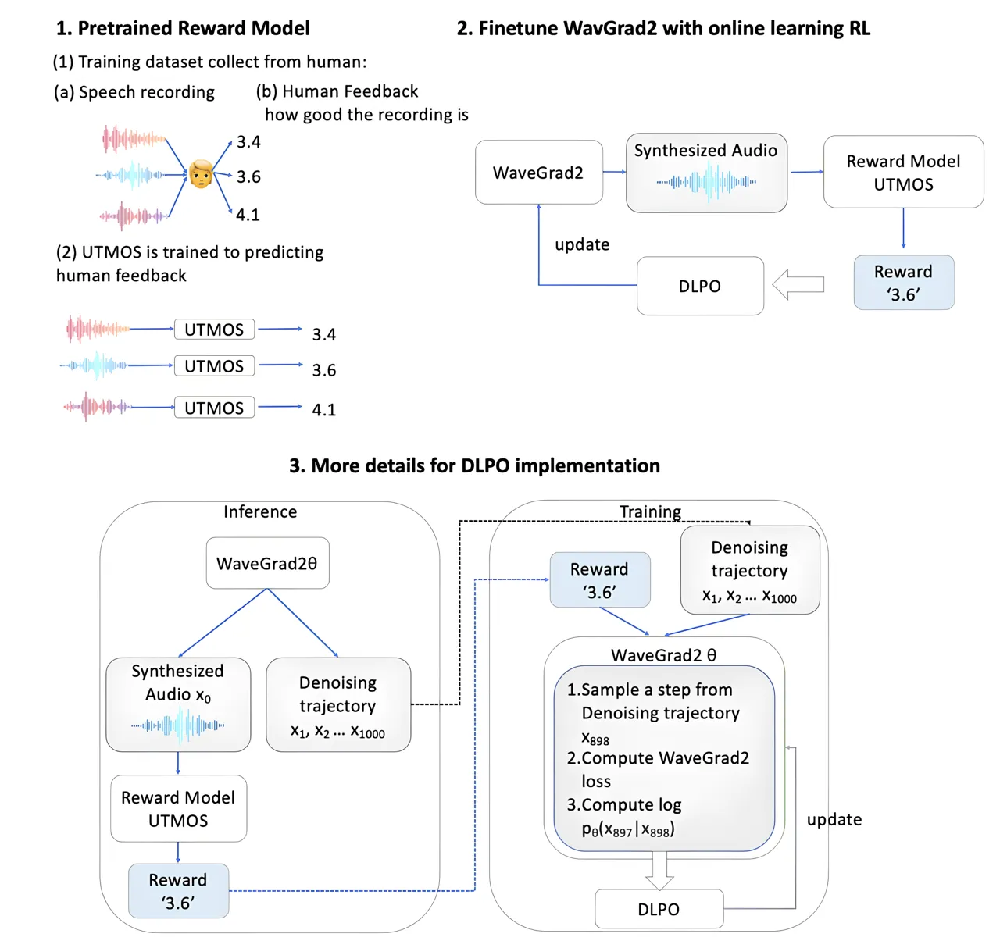
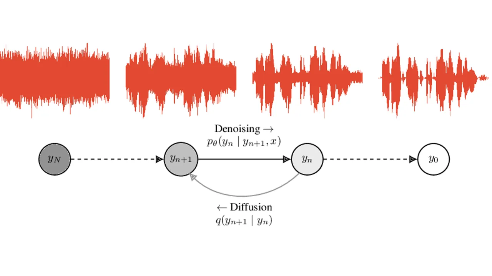

# DLPO: Diffusion Model Loss-Guided Reinforcement Learning for Fine-Tuning Text-to-Speech Diffusion Models

Jingyi Chen ^(†)^(†)thanks: Correspondence to Jingyi Chen
\<chen.9220@osu.edu\> Affiliation: Department of Computer Science and
Engineering, The Ohio State University Affiliation: Department of
Linguistics, The Ohio State University    Ju-Seung Byun
Affiliation: Department of Computer Science and Engineering, The Ohio
State University    Micha Elsner Affiliation: Department of Linguistics,
The Ohio State University    Andrew Perrault Affiliation: Department of
Computer Science and Engineering, The Ohio State University

###### Abstract

Recent advancements in generative models have sparked significant
interest within the machine learning community. Particularly, diffusion
models have demonstrated remarkable capabilities in synthesizing images
and speech. Studies such as those by Lee et al. \[20\], Black et al.
\[3\], Wang et al. \[47\], and Fan et al. \[7\] illustrate that
Reinforcement Learning with Human Feedback (RLHF) can enhance diffusion
models for image synthesis. However, due to architectural differences
between these models and those employed in speech synthesis, it remains
uncertain whether RLHF could similarly benefit speech synthesis models.
In this paper, we explore the practical application of RLHF to
diffusion-based text-to-speech with long-chain diffusion directly on
waveform data, leveraging the mean opinion score (MOS) as predicted by
UTokyo-SaruLab MOS prediction system \[36\] as a proxy loss. We
introduce diffusion model loss-guided RL policy optimization (DLPO) and
compare it against other RLHF approaches, employing the NISQA speech
quality and naturalness assessment model \[24\] and human preference
experiments for further evaluation. Our results show that RLHF can
enhance diffusion-based text-to-speech synthesis models, and, moreover,
DLPO can better improve diffusion models in generating natural and
high-quality speech audio.

## 1 Introduction

Diffusion probabilistic models, initially introduced by Sohl-Dickstein
et al. \[41\], have rapidly become the predominant method for generative
modeling in continuous domains. Valued for their capability to model
complex, high-dimensional distributions, these models are widely used in
fields like image and video synthesis. Notable applications include
Stable Diffusion \[35\] and DALL-E 3 \[40\], known for generating
high-quality images from text descriptions. Despite these advancements,
significant challenges persist where large-scale text-to-image models
struggle to produce images that accurately correspond to text prompts.
As highlighted by Lee et al. \[20\] and Fan et al. \[7\], current
text-to-image models face challenges in composing multiple objects \[8,
9, 30\] and in generating objects with specific colors and quantities
\[13, 20\]. Black et al. \[3\], Fan et al. \[7\], Lee et al. \[19\]
propose reinforcement learning (RL) approaches for fine-tuning diffusion
models which can enhance their ability to align generated images with
input texts.

In contrast, text-to-speech (TTS) models face different limitations. TTS
models must handle a sequence of sounds over time, which introduces
complexity in terms of processing time-domain data. Additionally, the
size of audio files varies based on text length, quality, and
compression—for instance, an audio file encoding a few seconds of speech
could range from a few hundred kilobytes to several megabytes. These
models must also capture subtle aspects of speech such as intonation,
pace, emotion, and consistency to produce natural and intelligible audio
outputs \[46, 27, 38\]. These challenges are distinct from those faced
by text-to-image models. It thus remains uncertain whether similar
techniques can deliver improvements comparable to those seen in
text-to-image models. We are keen to explore the potential of using RL
approaches to fine-tune TTS diffusion models.

In this study, we explore the application of online RL to fine-tune TTS
diffusion models (Appendix A), especially whether RL techniques can
similarly improve the naturalness and sound quality of diffusion TTS
models that are directly trained on waveforms and assess the impact of
RL on waveform generation in diffusion models. While basic policy
gradient methods simply optimize the reward function, these can severely
disrupt the initial model due to over-optimization. Therefore, commonly
used RL methods control deviation from the original policy, often using
estimates of the KL divergence between the learned policy and the
original. In particular, we compare the performance of TTS model
fine-tuning using reward-weighted regression (RWR) \[20\], denoising
diffusion policy optimization (DDPO) \[3\], diffusion policy
optimization with KL regularization (DPOK) \[7\] and diffusion policy
optimization with a KL-shaped reward \[1\], which we refer to as KLinR
in this paper. Both DPOK and KLinR use a diffusion gradient regularized
KL. We also introduce and assess diffusion loss-guided policy
optimization (DLPO) where the reward is shaped by the diffusion model’s
loss. In our experiments, we fine-tune WaveGrad 2, a non-autoregressive
generative model for TTS synthesis \[5\], using reward predictions from
the UTokyo-SaruLab mean opinion score (MOS) prediction system \[36\]. We
find that RWR and DDPO do not improve TTS models as they do for
text-to-image models, because they cannot successfully control the
magnitude of deviations from the original model. However, DPOK, KLinR,
and DLPO do, improving the sound quality and naturalness of the
generated speech, and DLPO outperforms DPOK and KLinR. Demo audios are
presented in this website
[https://demopagea.github.io/DLPO_demo/](https://demopagea.github.io/DLPO_demo/)

We can summarize our main contributions as follows:

- $`\bullet`$
  We are the first to apply reinforcement learning (RL) to improve the
  speech quality of TTS diffusion models.
- $`\bullet`$
  We evaluate current RL methods for fine-tuning diffusion models in the
  TTS setting: RWR, DDPO, DPOK, and KLinR.
- $`\bullet`$
  We introduce diffusion loss-guided policy optimization (DLPO). Unlike
  other RL methods, DLPO aligns with the training procedure of TTS
  diffusion models by incorporating the original diffusion model loss as
  a penalty in the reward function to effectively prevent model
  deviation and fine-tune TTS models.
- $`\bullet`$
  We further investigate the impact of diffusion gradients on
  fine-tuning TTS diffusion models and the effect of different denoising
  steps. We conduct a human experiment to evaluate the speech quality of
  DLPO-generated audio.

## 2 Related Works

#### Text-to-speech diffusion model.

Diffusion models \[11, 41, 42\] have shown impressive capabilities in
generative tasks like image \[37, 33, 12\] and audio production \[4, 5,
17\]. TTS systems using diffusion models generate high-fidelity speech
comparable to state-of-the-art systems \[4, 5, 17, 22\]. These models
use a Markov chain to transform noise into structured speech waveforms
through a series of probabilistic steps, which can be optimized with RL
techniques.

However, unlike text-to-image diffusion models, TTS diffusion models
face the challenge of high temporal resolution. Audio input for TTS is a
one-dimensional signal with a high sample rate; for example, one second
of audio at 24,600 Hz consists of 24,600 samples. This high
dimensionality requires managing thousands of data points, necessary to
capture the nuances of human speech for natural-sounding audio. In
contrast, a typical 256x256 image has 65,536 pixels, fewer than the
samples in one second of high-fidelity audio. Handling and processing
the large volume of audio samples while maintaining both speed and high
speech quality typically necessitates diffusion and denoising steps in
TTS models that are larger than those required for text-to-image
diffusion models. This demands effective memory optimization strategies
during training. Most prior works in this area try to address the
problem of processing large volume of audio samples by preprocessing the
high-dimensional waveform into Mel-spectrograms—two-dimensional images
of time and frequency which simplify the problem to image synthesis,
such as Grad-TTS \[31, 34, 21, 6, 16, 44, 10\]. Other models like
NaturalSpeech 2 \[39\], SimpleTTS \[23\], DiTTo-TTS \[18\] and VALL-E
\[45\] employ neural audio codecs to convert high-dimensional raw
waveforms into quantized latent vectors. Then a vocoder is introduced to
predict the audio from these intermediate features. Appendix G shows the
state of the art for recent TTS models. WaveGrad2 performs comparably to
GradTTS, which uses a vocoder, and outperforms E3 TTS and SimpleTTS.
Other recent models are trained on massive proprietary datasets, which
makes it difficult to compare their performance with earlier work or to
use them as a starting point for basic research. While vocoder models
are inherently more efficient and easier to tune than models based on
the raw waveform due to using lower-dimensional inputs, Gao (2023)
argues that they can be less domain-general due to the possibility of
cascading errors from the preprocessor. Rather than trying to reduce TTS
to vision by changing the inputs, we therefore select WaveGrad2 as our
baseline model and try to modify RL techniques to optimize it.

#### RL fine-tuning of diffusion models.

Recent studies have focused on fine-tuning diffusion text-to-image
models using alternative reward-weighted regression methods and
reinforcement learning (RL) to enhance their performance. Lee et al.
\[20\] demonstrate that developing a reward function based on human
feedback and using supervised learning techniques can improve specific
attributes like color, count, and background alignment in text-to-image
models. While simple supervised fine-tuning (SFT) based on
reward-weighted regression loss improves reward scores and image-text
alignment, it often results in decreased image quality (e.g.,
over-saturation or non-photorealistic images).

Fan et al. \[7\] suggest this issue likely arises from fine-tuning on a
fixed dataset generated by a pre-trained model. Black et al. \[3\] argue
that the reward-weighted regression lacks theoretical grounding and only
roughly approximates optimizing denoising diffusion with RL and they
propose denoising diffusion policy optimization (DDPO), a policy
gradient algorithm that outperforms reward-weighted regression methods.
DDPO improves text-to-image diffusion models by targeting objectives
like image compressibility and aesthetic appeal, and it enhances
prompt-image alignment using feedback from a vision-language model,
eliminating the need for additional data or human annotations. Fan
et al. \[7\] also show that RL fine-tuning can surpass reward-weighted
regression in optimizing rewards for text-to-image diffusion models.
Additionally, they demonstrate that using a diffusion gradient
regularized KL in RL methods helps address issues like image quality
deterioration in fine-tuned models.

For fine-tuning TTS diffusion model, \[26\] explores various RL
techniques to improve emotional expression in Grad-TTS \[31\], including
Reward Weighted Regression (RWR) and Proximal Policy Optimization (PPO).
They demonstrate that Grad-TTS can convey emotions more effectively by
utilizing feedback from an emotion predictor model. However, the speech
quality and naturalness of their demo audio remain insufficient. We
propose a diffusion policy optimization method guided by the diffusion
model objective, which surpasses RWR, DDPO, DPOK, and KLinR. While RWR
and DDPO have been shown to enhance text-to-image diffusion models, we
find they do not improve speech quality in TTS models. Both DPOK and
KLinR utilize diffusion gradient regularized KL, which has shown some
improvements in speech quality, but our approach DLPO, which directly
use diffusion loss as reward, achieves the best results.

## 3 Models

### 3.1 Text-to-Speech Diffusion Model

In this study, we use the PyTorch implementation of WaveGrad2 provided
by MINDs Lab
([https://github.com/maum-ai/wavegrad2](https://github.com/maum-ai/wavegrad2))
as the pretrained TTS diffusion model. WaveGrad2 is a non-autoregressive
TTS model adapting the diffusion denoising probabilistic model (DDPM)
from Ho et al. \[11\]. WaveGrad2 models the conditional distribution
$`p_{\theta}(y_{0}|x)`$ where $`y_{0}`$ represents the waveform and
$`x`$ the associated context. The distribution follows the reverse of a
Markovian forward process $`q(y_{t}|y_{t-1})`$, which iteratively
introduces noise to the data.

Reversing the forward process can be accomplished by training a neural
network $`\mu_{\theta}(x_{t},c,t)`$ with the following objective:

```math
\mathcal{L}_{DDPM}(\theta)=\mathbb{E}_{c\sim p(c)}\mathbb{E}_{t\sim\mathcal{U}\{0,T\}}\mathbb{E}_{p_{\theta}(x_{0:T}|c)}\left[\|\tilde{\mu}(x_{t},t)-\mu_{\theta}(x_{t},c,t)\|_{2}\right] \tag{1}
```

where $`\tilde{\mu}`$ is the posterior mean of the forward process and
$`x_{t}`$ is the prediction at timestep $`t`$ in the denoising process.
This objective is justified as maximizing a variational lower bound on
the log-likelihood of the data \[11\], which is trained to predict the
scaled derivative by minimizing the distance between ground truth added
noise $`\epsilon`$ and the model prediction:

```math
\mathbb{E}_{c\sim p(c)}\mathbb{E}_{t\sim\mathcal{U}\{0,T\}}\mathbb{E}_{p_{\theta}(x_{0:T}|c)}\left[\|\tilde{\epsilon}(x_{t},t)-\epsilon_{\theta}(x_{t},c,t)\|_{2}\right] \tag{2}
```

where $`\tilde{\epsilon}(x_{t},t)`$ is the ground truth added noise for
step $`x_{t}`$ and $`\epsilon_{\theta}(x_{t},c,t)`$ is the predicted
noise for step $`x_{t}`$. More details are provided in Appendix B.

Sampling from a diffusion model begins with drawing a random
$`x_{T}\sim\mathcal{N}(0,I)`$ and following the reverse process
$`p_{\theta}(x_{t-1}|x_{t},c)`$ to produce a trajectory
{$`x_{T},x_{T-1},...,x_{0}`$} ending with a sample $`x_{0}`$. As
discussed in Chen et al. \[4\], Chen et al. \[5\], the linear variance
schedule used in Ho et al. \[11\] is adapted in the sampling process of
WaveGrad2, where the variance of the noise added at each step increases
linearly over a fixed number of timesteps. The linear variance schedule
is a predefined function that dictates the variance of the noise added
at each step of the forward diffusion process. This schedule is crucial
because it determines how much noise is added to the data at each
timestep, which in turn affects the quality of the generated samples
during the reverse denoising process.

### 3.2 Reward Model

We use the UTokyo-SaruLab mean opinion score (UTMOS) prediction system
\[36\] to predict the speech quality of generated audios from Wavegrad2.
Mean opinion score (MOS) is a subjective scoring system that allows
human evaluators to rate the perceived quality of synthesized speech on
a scale from 1 to 5, which is one of the most commonly employed
evaluation methods for TTS system \[43\]. UTMOS is trained to capture
nuanced audio features that are indicative of human judgments of speech
quality, providing an accurate MOS prediction without the need for
extensive labeled data. Thus, we use UTMOS as the reward model for
fine-tuning Wavegrad2. UTMOS is trained on datasets from the VoiceMOS
Challenge 2022 \[14\], including 14 hours audio from male and female
speakers with MOS ratings.

## 4 RL for Fine-tuning TTS Diffusion Models

In this section, we present a Markov decision process (MDP) formulation
for WaveGrad2’s denoising phase, evaluate four RL algorithms for
training diffusion models, and introduce a modified fine-tuning method
incorporating diffusion model loss, comparing it with other RL
approaches.

### 4.1 Denoising as a multi-step MDP

We model denoising as a $`T`$-step finite horizon Markov decision
process (MDP). Defined by the tuple $`(S,A,\rho_{0},P,R)`$, an MDP
consists of a state space $`S`$, an action space $`A`$, an initial state
distribution $`\rho_{0}`$, a transition kernel $`P`$, and a reward
function $`R`$. At each timestep $`t`$, an agent observes a state
$`s_{t}`$ from $`S`$, selects an action $`a_{t}`$ from $`A`$, receives a
reward $`R(s_{t},a_{t})`$, and transitions to a new state
$`s_{t+1}\sim P(s_{t+1}|s_{t},a_{t})`$. The agent follows a policy
$`\pi_{\theta}(a|s)`$, parameterized by $`\theta`$, to make decisions.
As the agent operates within the MDP, it generates trajectories,
sequences of states and actions
$`(s_{0},a_{0},s_{1},a_{1},...,s_{T},a_{T})`$. The goal of reinforcement
learning (RL) is to maximize $`\mathcal{J}_{RL}(\theta)`$, which is the
expected total reward across trajectories produced under its policy:

```math
\mathcal{J}_{\mathrm{RL}}(\theta)=\mathbb{E}_{\pi_{\theta}}\left[\sum_{t=0}^{T}R(\mathrm{s_{t}},\mathrm{a_{t}})\right] \tag{3}
```

Therefore, we can define a Markov decision process (MDP) formulation for
the denoising phase of WaveGrad2 as follows:

```math
\begin{split}s_{t}\triangleq(c,x_{T-t})\quad P(s_{t+1}|s_{t},a_{t})\triangleq(\delta_{c},\delta_{a_{t}})\quad a_{t}\triangleq x_{T-t-1}\\
\quad\rho(s_{0})\triangleq(p(c),\mathcal{N}(0,I))\quad R(s_{t},a_{t})\triangleq\left\{\begin{array}[]{lr}r(s_{t+1})=r(x_{0},c)&\textrm{if}\quad t=T-1\\
0&\textrm{otherwise,}\\
\end{array}\right.\end{split} \tag{4}
```

where $`\delta`$ is the Dirac delta distribution, $`c`$ is the text
prompt sampled from $`p(c)`$, and $`r(x_{0},c)`$ is the reward model
UTMOS introduced in subsection 3.2. $`s_{t}`$ and $`a_{t}`$ are the
state and action at timestep $`t`$, $`\rho(s_{0})`$ and $`P`$ are the
initial state distribution and the dynamics, and $`R`$ is the reward
function. We let
$`\pi_{\theta}(a_{t}|s_{t})\triangleq p_{\theta}(x_{T-t-1}|x_{T-t},c)`$
be the initial parameterized policy, where
$`p_{\theta}(x_{T-t-1}|x_{T-t},c)`$ is the WaveGrad2 model discussed in
subsection 3.1. Trajectories consist of $`T`$ timesteps, after which
$`P`$ leads to a terminating state. The cumulative reward of each
trajectory is equal to $`r(x_{0},c)`$. Maximizing $`r(x_{0},c)`$ to
optimize policy $`\pi_{\theta}`$ in Equation 4 is equivalent to
fine-tuning WaveGrad2 ($`\mathcal{L}_{DDPM}`$ Equation 1), the denoising
diffusion RL objective is presented as follows:

```math
\mathcal{J}_{\mathrm{DDRL}}(\theta)=\mathbb{E}_{c\sim p(c)}\mathbb{E}_{x_{0}\sim p_{\theta}(x_{0}|c)}\left[r(\mathrm{{x_{0}},\mathrm{c}})\right] \tag{5}
```

### 4.2 Reward-Weighted Regression

As discussed by Black et al. \[3\], using the denoising loss
$`\mathcal{L}_{DDPM}`$ Equation 1 with training data
$`x_{0}\sim p_{\theta}(x_{0}|c)`$ and an added weighting of reward
$`r(x_{0},c)`$, we can optimize $`\mathcal{J}_{DDRL}`$ with minimal
changes to standard diffusion model training. This approach can be
referred as reward-weighted regression (RWR) \[29\]. Lee et al. \[20\]
use this approach to update the diffusion models, their objective is
presented as follow:

```math
\mathcal{J}_{\mathrm{DDRL}}(\theta)=\mathbb{E}_{c\sim p(c)}\mathbb{E}_{p_{\mathrm{pre}}(x_{0}|c)}\left[-r(x_{0},c)\log p_{\theta}(\mathrm{x_{0}}|\mathrm{c})\right] \tag{6}
```

However, Lee et al. \[20\] note that fine-tuning the text-to-image
diffusion model with reward-weighted regression can lead to reduced
image quality, such as over-saturation or non-photorealistic images. Fan
et al. \[7\] suggest that this deterioration might be due to the model
being fine-tuned on a static dataset produced by a pre-trained model,
meanwhile, Black et al. \[3\] argue that reward-weighted regression aims
to approximately maximize $`\mathcal{J}_{RL}(\pi)`$ subject to a KL
divergence constraint on $`\pi`$ \[2\]. Yet, the denoising loss
$`\mathcal{L}_{DDPM}`$ Equation 1 does not compute an exact
log-likelihood; it is instead a variational bound on log
$`p_{\theta}(x_{0}|c)`$. As such, the RWR procedure approach to training
diffusion models lacks theoretical justification and only approximates
optimization of $`\mathcal{J}_{DDRL}`$ (Equation 5).

### 4.3 Denoising Diffusion Policy Optimization

RWR relies on an approximate log-likelihood by disregarding the
sequential aspect of the denoising process and only using the final
samples $`x_{0}`$. Black et al. \[3\] propose the denoising diffusion
policy optimization to directly optimize $`\mathcal{J}_{DDRL}`$ using
the score function policy gradient estimator, also known as REINFORCE
\[48, 25\]. DDPO alternately collects denoising trajectories
$`{x_{T},x_{T-1},...,x_{0}}`$ via sampling and updates parameters via
gradient descent:

```math
\nabla_{\theta}\mathcal{J}_{\mathrm{DDRL}}(\theta)=\mathbb{E}_{c\sim p(c)}\mathbb{E}_{p_{\theta}(x_{0:T}|c)}\left[\sum_{t=1}^{T}\nabla_{\theta}\log p_{\theta}(x_{t-1}|x_{t},c)r(x_{0},c)\right] \tag{7}
```

where the expectation is calculated across denoising trajectories
generated by the current parameters $`\theta`$. This estimator only
allows for one step of optimization for each data collection round,
since the gradient needs to be calculated using data derived from the
current parameters. In Black et al. \[3\]’s study, DDPO is shown to
achieve better performance in fine-tuning the text-to-image diffusion
model compared to reward-weighted regression methods.

### 4.4 Diffusion Policy Optimization with a KL-shaped Reward

Fan et al. \[7\] demonstrate that adding KL between the fine-tuned and
pre-trained models for the final image as a regularizer
$`KL(p_{\theta}(x_{0}|z)\|p_{\mathrm{pre}}(x_{0}|z)`$ to the objective
function helps to mitigate overfitting of the diffusion models to the
reward and prevents excessively diminishing the "skill" of the original
diffusion model. As discussed in subsection 3.1, $`p_{\theta}(x_{0}|z)`$
is calculated as a variational bound, Fan et al. \[7\] propose to add an
upper-bound of this KL-term to the objective function
$`\mathcal{J}_{DDRL}(\theta)`$, which they call DPOK. In their model
implementation, this KL-term is computed as
$`\left[\|\epsilon_{\theta}(x_{t},c,t)-\epsilon_{pre}(x_{t},c,t)\|_{2}\right]`$
following diffuson model objective. They find that DPOK outperforms
reward weighted regression in fine-tuning text-to-image diffusion
models:

```math
\mathbb{E}_{c\sim p(c)}\left[\alpha\mathbb{E}_{p_{\theta}(x_{t-1}|x_{t},c)}\left[-r(x_{0},c)\right]+\beta\sum_{t=1}^{T}\mathbb{E}_{p_{\theta}(x_{t}|c)}\left[\mathrm{KL}(p_{\theta}(x_{t-1}|x_{t},c)\|p_{\mathrm{pre}}(x_{t-1}|x_{t},c))\right]\right] \tag{8}
```

where $`\alpha,\beta`$ are the reward and KL weights, respectively. They
use the following gradient to optimize the objective:

```math
\expec_{\begin{subarray}{c}c\sim p(c)\\
p_{\theta}(x_{0:T}|c)\end{subarray}}\Bigg[-\alpha r(x_{0},c)\sum_{t=1}^{T}\nabla_{\theta}\log p_{\theta}(x_{t-1}|x_{t},c)+\\
\beta\sum_{t=1}^{T}\nabla_{\theta}\mathrm{KL}(p_{\theta}(x_{t-1}|x_{t},c)\|p_{\mathrm{pre}}(x_{t-1}|x_{t},c))\Bigg]
```

Another RL objective presented by Ahmadian et al. \[1\] also involves a
KL-penalty to prevent degradation in the coherence of the model (KLinR).
In contrast to DPOK, this objective function
$`\mathcal{J}_{\mathrm{DDRL}}(\theta)`$ includes the KL penalty within
the reward function:

```math
\mathcal{J}_{DDRL}(\theta)=\mathbb{E}_{c\sim p(c)}\mathbb{E}_{p_{\theta}(x_{0:T}|c)}\left[-\left(\alpha r(x_{0},c)-\beta\log\frac{p_{\theta}(x_{0}|c)}{p_{\mathrm{pre}}(x_{0}|c)}\right)\sum_{t=1}^{T}\log p_{\theta}(x_{t-1}|x_{t},c)\right] \tag{9}
```

where $`\beta`$ is the KL weight. We evaluate both approaches with KL
for fine-tuning WaveGrad2; for KLinR approach, we follow Fan et al.
\[7\] and calculate the KL upper-bound. The algorithms are shown in
Appendix C and Appendix D.

### 4.5 Diffusion Model Loss-Guided Policy Optimization

Ouyang et al. \[28\] indicate that mixing the pretraining gradients into
the RL gradient shows improved performance on certain public NLP
datasets compared to a reward-only approach. Therefore, adding the
diffusion model loss to the objective function can be another way to
improve performance and prevent degradation in the coherence of the
model. We propose the following objective:

```math
\mathbb{E}_{c\sim p(c)}\mathbb{E}_{p_{\theta}(x_{0:T}|c)}\left[-\alpha r(x_{0},c)-\beta\|\tilde{\epsilon}(x_{t},t)-\epsilon_{\theta}(x_{t},c,t)\|_{2}\right] \tag{10}
```

where $`\alpha,\beta`$ are the reward and weights for diffusion model
loss, respectively. We use the following gradient to update the
objective:

```math
\mathbb{E}_{c\sim p(c)}\mathbb{E}_{p_{\theta}(x_{1:T}|c)}\left[-\left(\alpha r(x_{0},c)-\beta\nabla_{\theta}\|\tilde{\epsilon}(x_{t},t)-\epsilon_{\theta}(x_{t},c,t)\|_{2}\right)\nabla_{\theta}\log p_{\theta}(x_{t-1}|x_{t},c)\right] \tag{11}
```

where we follow Ahmadian et al. \[1\] and add the diffusion model
objective to the reward function as a penalty. The pseudocode of our
algorithm, which we refer to as DLPO, is summarized in Algorithm 1. This
algorithm aligning with the training procedure of TTS diffusion models
by incorporating the original diffusion model objective
$`\beta\|\tilde{\epsilon}(x_{t},t)-\epsilon_{\theta}(x_{t},c,t)\|_{2}`$
as a penalty in the reward function effectively prevents model
deviation. More details and an overview figure are provided in
Appendix A.

Input: reward model $`r`$, pre-trained model $`p_{\mathrm{pre}}`$,
current model $`p_{\theta}`$, batch size $`m`$, text distribution
$`p(c)`$

initialize $`p_{\theta}=p_{\mathrm{pre}}`$

while $`\theta`$ not converged do

  Obtain $`m`$ i.i.d.samples by first sampling $`c\sim p(c)`$ and then
$`x_{1:T}\sim p_{\theta}(x_{t-1}|x_{t},c)`$, $`r(x_{0},c)`$

  Compute the gradient using Equation 10 and update $`\theta`$:

  (1) Sample $`x_{t}`$ given $`x_{0}`$, $`t\sim[0,T]`$

  (2) Compute
$`\|\tilde{\epsilon}(x_{t},t)-\epsilon_{\theta}(x_{t},c,t)\|_{2}`$ and
$`\log p_{\theta}(x_{t-1}|x_{t},c)`$

  (3) Update gradient using Equation 10 and update $`\theta`$

Output: Fine-tuned diffusion model $`p_{\theta}`$

Algorithm 1 DLPO: Diffusion model loss-guided policy optimization

## 5 Experiments

We now present a series of experiments designed to evaluate the efficacy
of different RL fine-tuning methods on TTS diffusion model.

### 5.1 Experimental Design



1 Reward UTMOS During Training



2 Evaluation NISQA MOS During Training

Figure 1: (fine-tuning effectiveness) The relative effectiveness of five
RL algorithms. (Top) shows the the change of reward UTMOS during initial
160 training episodes (training samples = episodes \* batch size) of
each RL approach while (bottom) shows the change of evaluation NISQA MOS
during the same initial 160 training episodes. Left figures shows the
different methods’ training performance and right figures shows that
DLPO increases UTMOS from 3.0 to 3.68 and increases NISQA from 3.85 to
4.12.

#### Dataset

WaveGrad 2 is pre-trained on the LJSpeech dataset \[15\] which consists
of 13,100 short audio clips of a female speaker and the corresponding
texts, totaling approximately 24 hours. We use WaveGrad 2’s training set
and validation set to finetune Wavegrad 2 (12388 samples for training,
512 samples for validation. 200 unseen samples are used as test set for
evaluation.

#### Evaluation Metrics

For automatic evaluation of the fine-tuned models, we use another
pretrained speech quality and naturalness assessment model (NISQA)
\[24\], trained on the NISQA Corpus including more than 14,000 speech
samples produced by male and female speakers along with samples’ MOS
ratings. (This use of a separate MOS network is intended to guard
against overfitting the reward model.) We also conduct a human
experiment to have people evaluate the speech quality of the generated
audios from fine-tuned WaveGrad2. To evaluate the intelligibility of the
synthesized audio, we transcribe the speech with a pre-trained ASR
model, Whisper \[32\], and compute the word error rate (WER) between the
transcribed text and original transcript.

#### RL Fine-tuning

We follow Fan et al. \[7\] and use online RL training for fine-tuning
WaveGrad2 to evaluate the performance of RWR, DDPO, DLPO, KLinR, DPOK.
In each episode (amount of batch processed) during the training, we
sample a new trajectory based on the current model distribution
$`\pi_{\theta}`$ and calculate the rewards of the new trajectory. Online
RL training is claimed to be better at maximizing the reward than the
supervised approach which only uses the supervised dataset based on the
pre-trained distribution. We train WaveGrad2 with 8 A100-SXM-80GB GPU
for 5.5 hours. We set the batch size as 64 and the denoising steps as 10.

During online RL fine-tuning, the model is updated using new samples
from the previously trained model. In every training episode, the UTMOS
score is computed using the final state $`x_{0}`$ of the trajectory
generated given sampled text $`c`$ from the training dataset, where
$`c\sim p(c)`$, meanwhile the evaluation MOS score of $`x_{0}`$ is also
calculated using NISQA.

We plot both UTMOS and NISQA MOS scores obtained in each training
episode in Figure 1 to illustrate the fine-tuning progress of Wavegrad2.
(Top) shows the UTMOS scores over 160 training episodes for each RL
method. DLPO, DPOK, and KLinR initially increase UTMOS greatly during
the first 40 episodes. DLPO then gradually rises above 3.6 and remains
stable for the rest of the training, while DPOK stays around 3.5. KLinR
reaches a score of 3.5 by episode 120 but starts to decline afterward.
In contrast, both DDPO and RWR show a steady decrease in UTMOS from the
start. By episode 100, DDPO’s UTMOS falls below 1.5, with only a slight
increase afterward, while RWR’s UTMOS continues to drop, reaching below
1.5 by the end of the 160 episodes.

(Bottom) shows the evaluation NISQA MOS over 160 training episodes for
each RL method. DLPO increases NISQA greatly from 3.85 to 4.12 during
the first 100 episodes, then maintain above 4.05. KLinR also increases
NISQA to above 4 but starts to decrease after 100 episodes. DPOK has
NISQA decrease from 4.0 to 3.65 during the initial 60 episodes then
gradually rises above 4.0. Both RWR and DDPO has steady decrease in
NISQA from the start. Moreover, the $`x_{0}`$ generated by DDPO and RWR
gradually becomes acoustically noisy as the number of seen samples
grows. Due to randomness in sampled text, different models receive
different initial samples, resulting in varied UTMOS and NISQA at the
beginning.

#### Is diffusion loss alone effective?

We conduct an experiment that finetunes the baseline WaveGrad2 with only
the diffusion loss as reward, which we name OnlyDL. The loss function is
$`-\log p_{\theta}(x_{t-1}|x_{t},c)*(-\|\tilde{\epsilon}(x_{t},t)-\epsilon_{\theta}(x_{t},c,t)\|_{2})`$.
We train this model for 5.5 hours which is the same training time as
DLPO and we plot the total loss, diffusion loss, and change of UTMOS
during training in tensorboard, shown in Appendix E. Both total loss and
diffusion loss has clearly plateaued and shows minimal fluctuations
during training. Moreover, the UTMOS maintains around 3 during the
entire training, and DLPO has UTMOS increase from around 3 to above 3.65
during training, which is reported in Figure 3 in our paper. This also
indicates that DLPO can effectively increase base model’s UTMOS during
training.

#### One vs. ten sampled steps in diffusion loss guidance

To further assess the influence of denoising steps, we conducted an
experiment where we fine-tuned the baseline WaveGrad2 model using DLPO
with only a single denoising step, in contrast to the previous
experiment that used 10 denoising steps. In this experiment, we randomly
select one denoising step $`t\sim\mathcal{U}\{0,999\}`$. Then we compute
the diffusion model loss
$`\|\tilde{\epsilon}(x_{t},t)-\epsilon_{\theta}(x_{t},c,t)\|_{2}`$ and
log probability $`\log p_{\theta}(x_{t-1}|x_{t},c)`$ based on $`x_{t}`$,
update the gradient following Equation 10 and update $`\theta`$. The
results are shown in Table 2.

### 5.2 Experiment Results

We save the top three checkpoints for each model during training and use
them to generate audios for 200 unseen texts. We then use UTMOS and
NISQA to predict MOS score of these generated audios and the real human
speech audios, labeled as ground truth. The results are shown in Table 1
and Figure 2(a). Sample audios are presented on
[https://demopagea.github.io/DLPO_demo/](https://demopagea.github.io/DLPO_demo/).

| RL Algorithms | $`\alpha`$ | $`\beta`$ | UTMOS$`\uparrow`$ | NISQA $`\uparrow`$ | WER $`\downarrow`$ |
| ------------- | ---------- | --------- | ----------------- | ------------------ | ------------------ |
| Ground Truth  | \-         | \-        | 4.20              | 4.37               | \-                 |
| Base Model    | \-         | \-        | 2.90              | 3.74               | 1.5                |
| OnlyDL        | \-         | \-        | 3.16              | 3.45               | 1.4                |
| RWR           | 1          | \-        | 2.18              | 3.00               | 8.9                |
| DLPO          | 1          | 1         | 3.65              | 4.02               | 1.2                |
| DDPO          | 1          | 1         | 2.69              | 2.96               | 2.1                |
| KLinR         | 1          | 1         | 3.02              | 3.73               | 1.3                |
| DPOK          | 1          | 1         | 3.18              | 3.76               | 1.1                |

Table 1: Mean UTMOS, NISQA MOS, and word error rate for generated
audios. Ground Truth is the audio of real human speech.

| RL Algorithms | Denoising Steps | UTMOS $`\uparrow`$ | NISQA $`\uparrow`$ | WER $`\downarrow`$ |
| ------------- | --------------- | ------------------ | ------------------ | ------------------ |
| DLPO          | 1               | 3.71               | 3.96               | 1.7                |
| DLPO          | 10              | 3.65               | 4.02               | 1.2                |

Table 2: NISQA, UTMOS, and WER for DLPO with different denoising steps.



Figure 2: (a) shows the mean UTMOS and NISQA scores for generated audio
based on 200 unseen texts, the error bar shows the standard deviation of
each result. (b) shows the proportion of raters who prefer the audios
generated from the DLPO fine-tuned model or baseline model and the
proportion of raters who think audios generated by DLPO fine-tuned model
and baseline model are about the same (Tie).

We observe that the audios generated by the DLPO fine-tuned WaveGrad2
achieve the highest UTMOS score of 3.65 and the highest NISQA score of
4.02, both significantly better than those produced by the baseline
pretrained WaveGrad2 model. Additionally, the WER for DLPO-generated
audios is 1.2, lower than that of the baseline model. Two two-sample
t-tests confirmed significant differences ($`p<10^{-20}`$) between the
baseline and DLPO for both UTMOS and NISQA scores.

Both DPOK and KLinR also show effectiveness in improving base model.
Both of them improve UTMOS, and DPOK also improves NISQA in this
experiment; however, both DDPO and RWR fail to improve the base model
and their generated audios are noisy.

When comparing DLPO with OnlyDL, DLPO outperforms OnlyDL in UTMOS,
NISQA, and WER. This suggests that while diffusion gradients can assist
in model fine-tuning, our RL method, DLPO, is much more effective in
improving the base model performance, bringing it closer to ground truth
quality. Additionally, as shown in Table 2, DLPO with varying denoising
steps achieves similar UTMOS scores, whereas DLPO with 10 denoising
steps exhibits improved performance in both NISQA and WER.

We further conduct an experiment recruiting human participants to
evaluate the speech quality of the audios generated by the previous
version of DLPO. We randomly select 20 audios pair from the generated
audios (among audios of 200 unseen texts). Each pair includes one
generated audio from DLPO and one from the baseline pretrained WaveGrad2
model, both audios based on the same text. 11 listeners are recruited
for the experiment. They are asked to assess which audio is better
regarding to speech naturalness and quality. We show the results in
Figure 2. In 67% of comparisons, audios generated from DLPO fine-tuned
Wavegrad2 is rated as better than audios generated by the baseline
Wavegrad2 model, while 14% of comparisons have audios generated by the
baseline Wavegrad2 model rated as better. 19% of comparisons are rated
as about the same (Tie). The experiment question is shown in Appendix F.

## 6 Discussion

In our experiments, we found that RWR and DDPO do not enhance TTS models
as they do for text-to-image models, largely because they fail to
effectively control the magnitude of deviations from the original model.
Only methods that incorporate diffusion model gradients as a penalty are
able to prevent such deviations. Both DPOK and KLinR, which apply
diffusion model gradients as a regularized KL, succeed in reducing model
deviation while improving the sound quality and naturalness of the
generated speech. However, DLPO surpasses DPOK and KLinR, likely because
it aligns more closely with the training process of TTS diffusion models
by directly integrating the original diffusion model loss as a penalty
in the reward function, thereby preventing model deviation in fine-tuned
TTS models more effectively.

Additionally, the experiment comparing DLPO, which uses both human
feedback and diffusion model gradients as rewards, with OnlyDL, which
relies solely on diffusion model gradients to fine-tune the base
diffusion model, reveals important insights. The results show that
OnlyDL offers minimal improvement to the base diffusion model, while
DLPO leads to significant enhancements. This suggests that diffusion
model gradients alone may not be sufficient for substantial improvement
in speech quality, perhaps because they fail to capture the complexities
necessary for improving speech quality in TTS models. Human feedback, on
the other hand, introduces an additional layer of guidance, steering the
model toward more desirable outputs and effectively complementing the
diffusion gradients. The success of DLPO demonstrates that integrating
both human feedback and diffusion model loss as reward enables a more
robust and efficient fine-tuning process, significantly enhancing the
speech quality and naturalness of the generated output.

Comparing the performance of the WaveGrad2 model fine-tuned with a
single denoising step to that of previous experiments using 10 denoising
steps reveals that using more denoising steps improves speech quality
and reduces word error rates. This enhancement is likely due to the fact
that sampling additional denoising steps decreases variance and
increases the chances of capturing more important denoising effects. The
results suggest that employing multiple denoising steps enables a more
thorough refinement of the generated audio, leading to clearer and more
natural speech outputs. These findings underscore the significance of
selecting appropriate denoising steps during the fine-tuning process, as
they can greatly influence the model’s overall performance.

## References

- \[1\] Arash Ahmadian, Chris Cremer, Matthias Gallé, Marzieh Fadaee,
  Julia Kreutzer, Ahmet Üstün, and Sara Hooker. Back to basics:
  Revisiting reinforce style optimization for learning from human
  feedback in llms. _arXiv preprint arXiv:2402.14740_, 2024.
- \[2\] Nair Ashvin, Dalal Murtaza, Gupta Abhishek, and L Sergey.
  Accelerating online reinforcement learning with offline datasets.
  _CoRR, vol. abs/2006.09359_, 2020.
- \[3\] Kevin Black, Michael Janner, Yilun Du, Ilya Kostrikov, and
  Sergey Levine. Training diffusion models with reinforcement learning.
  _arXiv preprint arXiv:2305.13301_, 2023.
- \[4\] Nanxin Chen, Yu Zhang, Heiga Zen, Ron J Weiss, Mohammad Norouzi,
  and William Chan. Wavegrad: Estimating gradients for waveform
  generation. _arXiv preprint arXiv:2009.00713_, 2020.
- \[5\] Nanxin Chen, Yu Zhang, Heiga Zen, Ron J Weiss, Mohammad Norouzi,
  Najim Dehak, and William Chan. Wavegrad 2: Iterative refinement for
  text-to-speech synthesis. _arXiv preprint arXiv:2106.09660_, 2021.
- \[6\] Isaac Elias, Heiga Zen, Jonathan Shen, Yu Zhang, Ye Jia, Ron J
  Weiss, and Yonghui Wu. Parallel tacotron: Non-autoregressive and
  controllable tts. In _ICASSP 2021-2021 IEEE International Conference
  on Acoustics, Speech and Signal Processing (ICASSP)_, pages 5709–5713.
  IEEE, 2021.
- \[7\] Ying Fan, Olivia Watkins, Yuqing Du, Hao Liu, Moonkyung Ryu,
  Craig Boutilier, Pieter Abbeel, Mohammad Ghavamzadeh, Kangwook Lee,
  and Kimin Lee. Reinforcement learning for fine-tuning text-to-image
  diffusion models. _Advances in Neural Information Processing Systems_,
  36, 2024.
- \[8\] Weixi Feng, Xuehai He, Tsu-Jui Fu, Varun Jampani, Arjun Akula,
  Pradyumna Narayana, Sugato Basu, Xin Eric Wang, and William Yang Wang.
  Training-free structured diffusion guidance for compositional
  text-to-image synthesis. _arXiv preprint arXiv:2212.05032_, 2022.
- \[9\] Tejas Gokhale, Hamid Palangi, Besmira Nushi, Vibhav Vineet, Eric
  Horvitz, Ece Kamar, Chitta Baral, and Yezhou Yang. Benchmarking
  spatial relationships in text-to-image generation. _arXiv preprint
  arXiv:2212.10015_, 2022.
- \[10\] Zhifang Guo, Yichong Leng, Yihan Wu, Sheng Zhao, and Xu Tan.
  Prompttts: Controllable text-to-speech with text descriptions. In
  _ICASSP 2023-2023 IEEE International Conference on Acoustics, Speech
  and Signal Processing (ICASSP)_, pages 1–5. IEEE, 2023.
- \[11\] Jonathan Ho, Ajay Jain, and Pieter Abbeel. Denoising diffusion
  probabilistic models. _Advances in neural information processing
  systems_, 33:6840–6851, 2020.
- \[12\] Emiel Hoogeboom, Jonathan Heek, and Tim Salimans. Simple
  diffusion: End-to-end diffusion for high resolution images. In
  _International Conference on Machine Learning_, pages 13213–13232.
  PMLR, 2023.
- \[13\] Yushi Hu, Benlin Liu, Jungo Kasai, Yizhong Wang, Mari
  Ostendorf, Ranjay Krishna, and Noah A Smith. Tifa: Accurate and
  interpretable text-to-image faithfulness evaluation with question
  answering. In _Proceedings of the IEEE/CVF International Conference on
  Computer Vision_, pages 20406–20417, 2023.
- \[14\] Wen-Chin Huang, Erica Cooper, Yu Tsao, Hsin-Min Wang, Tomoki
  Toda, and Junichi Yamagishi. The voicemos challenge 2022. _arXiv
  preprint arXiv:2203.11389_, 2022.
- \[15\] Keith Ito and Linda Johnson. The lj speech dataset.
  [https://keithito.com/LJ-Speech-Dataset/](https://keithito.com/LJ-Speech-Dataset/), 2017.
- \[16\] Heeseung Kim, Sungwon Kim, and Sungroh Yoon. Guided-tts: A
  diffusion model for text-to-speech via classifier guidance. In
  _International Conference on Machine Learning_, pages 11119–11133.
  PMLR, 2022.
- \[17\] Zhifeng Kong, Wei Ping, Jiaji Huang, Kexin Zhao, and Bryan
  Catanzaro. Diffwave: A versatile diffusion model for audio synthesis.
  _arXiv preprint arXiv:2009.09761_, 2020.
- \[18\] Keon Lee, Dong Won Kim, Jaehyeon Kim, and Jaewoong Cho.
  Ditto-tts: Efficient and scalable zero-shot text-to-speech with
  diffusion transformer. _arXiv preprint arXiv:2406.11427_, 2024.
- \[19\] Kimin Lee, Laura Smith, and Pieter Abbeel. Pebble:
  Feedback-efficient interactive reinforcement learning via relabeling
  experience and unsupervised pre-training. _arXiv preprint
  arXiv:2106.05091_, 2021.
- \[20\] Kimin Lee, Hao Liu, Moonkyung Ryu, Olivia Watkins, Yuqing Du,
  Craig Boutilier, Pieter Abbeel, Mohammad Ghavamzadeh, and
  Shixiang Shane Gu. Aligning text-to-image models using human feedback.
  _arXiv preprint arXiv:2302.12192_, 2023.
- \[21\] Naihan Li, Shujie Liu, Yanqing Liu, Sheng Zhao, and Ming Liu.
  Neural speech synthesis with transformer network. In _Proceedings of
  the AAAI conference on artificial intelligence_, volume 33, pages
  6706–6713, 2019.
- \[22\] Zhijun Liu, Yiwei Guo, and Kai Yu. Diffvoice: Text-to-speech
  with latent diffusion. In _ICASSP 2023-2023 IEEE International
  Conference on Acoustics, Speech and Signal Processing (ICASSP)_, pages
  1–5. IEEE, 2023.
- \[23\] Justin Lovelace, Soham Ray, Kwangyoun Kim, Kilian Q Weinberger,
  and Felix Wu. Simple-tts: End-to-end text-to-speech synthesis with
  latent diffusion. 2023.
- \[24\] Gabriel Mittag, Babak Naderi, Assmaa Chehadi, and Sebastian
  Möller. Nisqa: A deep cnn-self-attention model for multidimensional
  speech quality prediction with crowdsourced datasets. _arXiv preprint
  arXiv:2104.09494_, 2021.
- \[25\] Shakir Mohamed, Mihaela Rosca, Michael Figurnov, and Andriy
  Mnih. Monte carlo gradient estimation in machine learning. _Journal of
  Machine Learning Research_, 21(132):1–62, 2020.
- \[26\] Roshan Nagaram. Enhancing emotional expression in
  text-to-speech models through reinforcement learning with ai feedback. 2024.
- \[27\] Aaron van den Oord, Sander Dieleman, Heiga Zen, Karen Simonyan,
  Oriol Vinyals, Alex Graves, Nal Kalchbrenner, Andrew Senior, and Koray
  Kavukcuoglu. Wavenet: A generative model for raw audio. _arXiv
  preprint arXiv:1609.03499_, 2016.
- \[28\] Long Ouyang, Jeffrey Wu, Xu Jiang, Diogo Almeida, Carroll
  Wainwright, Pamela Mishkin, Chong Zhang, Sandhini Agarwal, Katarina
  Slama, Alex Ray, et al. Training language models to follow
  instructions with human feedback. _Advances in neural information
  processing systems_, 35:27730–27744, 2022.
- \[29\] Jan Peters and Stefan Schaal. Reinforcement learning by
  reward-weighted regression for operational space control. In
  _Proceedings of the 24th international conference on Machine
  learning_, pages 745–750, 2007.
- \[30\] Vitali Petsiuk, Alexander E Siemenn, Saisamrit Surbehera, Zad
  Chin, Keith Tyser, Gregory Hunter, Arvind Raghavan, Yann Hicke,
  Bryan A Plummer, Ori Kerret, et al. Human evaluation of text-to-image
  models on a multi-task benchmark. _arXiv preprint
  arXiv:2211.12112_, 2022.
- \[31\] Vadim Popov, Ivan Vovk, Vladimir Gogoryan, Tasnima Sadekova,
  and Mikhail Kudinov. Grad-tts: A diffusion probabilistic model for
  text-to-speech. In _International Conference on Machine Learning_,
  pages 8599–8608. PMLR, 2021.
- \[32\] Alec Radford, Jong Wook Kim, Tao Xu, Greg Brockman, Christine
  McLeavey, and Ilya Sutskever. Robust speech recognition via
  large-scale weak supervision, 2022. URL
  [https://arxiv.org/abs/2212.04356](https://arxiv.org/abs/2212.04356).
- \[33\] Aditya Ramesh, Prafulla Dhariwal, Alex Nichol, Casey Chu, and
  Mark Chen. Hierarchical text-conditional image generation with clip
  latents. _arXiv preprint arXiv:2204.06125_, 1(2):3, 2022.
- \[34\] Yi Ren, Yangjun Ruan, Xu Tan, Tao Qin, Sheng Zhao, Zhou Zhao,
  and Tie-Yan Liu. Fastspeech: Fast, robust and controllable text to
  speech. _Advances in neural information processing systems_, 32, 2019.
- \[35\] Robin Rombach, Andreas Blattmann, Dominik Lorenz, Patrick
  Esser, and Björn Ommer. High-resolution image synthesis with latent
  diffusion models. In _Proceedings of the IEEE/CVF conference on
  computer vision and pattern recognition_, pages 10684–10695, 2022.
- \[36\] Takaaki Saeki, Detai Xin, Wataru Nakata, Tomoki Koriyama,
  Shinnosuke Takamichi, and Hiroshi Saruwatari. Utmos: Utokyo-sarulab
  system for voicemos challenge 2022. _arXiv preprint
  arXiv:2204.02152_, 2022.
- \[37\] Chitwan Saharia, William Chan, Saurabh Saxena, Lala Li, Jay
  Whang, Emily L Denton, Kamyar Ghasemipour, Raphael Gontijo Lopes,
  Burcu Karagol Ayan, Tim Salimans, et al. Photorealistic text-to-image
  diffusion models with deep language understanding. _Advances in neural
  information processing systems_, 35:36479–36494, 2022.
- \[38\] Jonathan Shen, Ruoming Pang, Ron J Weiss, Mike Schuster,
  Navdeep Jaitly, Zongheng Yang, Zhifeng Chen, Yu Zhang, Yuxuan Wang,
  RJ Skerrv-Ryan, et al. Natural TTS synthesis by conditioning wavenet
  on mel spectrogram predictions. In _2018 IEEE international conference
  on acoustics, speech and signal processing (ICASSP)_, pages 4779–4783.
  IEEE, 2018.
- \[39\] Jonathan Shen, Ye Jia, Mike Chrzanowski, Yu Zhang, Isaac Elias,
  Heiga Zen, and Yonghui Wu. Non-attentive tacotron: Robust and
  controllable neural tts synthesis including unsupervised duration
  modeling. _arXiv preprint arXiv:2010.04301_, 2020.
- \[40\] Zhan Shi, Xu Zhou, Xipeng Qiu, and Xiaodan Zhu. Improving image
  captioning with better use of captions. _arXiv preprint
  arXiv:2006.11807_, 2020.
- \[41\] Jascha Sohl-Dickstein, Eric Weiss, Niru Maheswaranathan, and
  Surya Ganguli. Deep unsupervised learning using nonequilibrium
  thermodynamics. In _International conference on machine learning_,
  pages 2256–2265. PMLR, 2015.
- \[42\] Yang Song, Jascha Sohl-Dickstein, Diederik P Kingma, Abhishek
  Kumar, Stefano Ermon, and Ben Poole. Score-based generative modeling
  through stochastic differential equations. _arXiv preprint
  arXiv:2011.13456_, 2020.
- \[43\] Robert C Streijl, Stefan Winkler, and David S Hands. Mean
  opinion score (mos) revisited: methods and applications, limitations
  and alternatives. _Multimedia Systems_, 22(2):213–227, 2016.
- \[44\] Jaesung Tae, Hyeongju Kim, and Taesu Kim. Editts: Score-based
  editing for controllable text-to-speech. _arXiv preprint
  arXiv:2110.02584_, 2021.
- \[45\] Chengyi Wang, Sanyuan Chen, Yu Wu, Ziqiang Zhang, Long Zhou,
  Shujie Liu, Zhuo Chen, Yanqing Liu, Huaming Wang, Jinyu Li, et al.
  Neural codec language models are zero-shot text to speech
  synthesizers. _arXiv preprint arXiv:2301.02111_, 2023a.
- \[46\] Yuxuan Wang, RJ Skerry-Ryan, Daisy Stanton, Yonghui Wu, Ron J
  Weiss, Navdeep Jaitly, Zongheng Yang, Ying Xiao, Zhifeng Chen, Samy
  Bengio, et al. Tacotron: Towards end-to-end speech synthesis. _arXiv
  preprint arXiv:1703.10135_, 2017.
- \[47\] Zhendong Wang, Jonathan J. Hunt, and Mingyuan Zhou. Diffusion
  Policies as an Expressive Policy Class for Offline Reinforcement
  Learning. _arXiv preprint arXiv:2208.06193_, 2023b.
- \[48\] Ronald J Williams. Simple statistical gradient-following
  algorithms for connectionist reinforcement learning. _Machine
  learning_, 8:229–256, 1992.

## Appendix A DLPO implementation details



Figure 3: Detail steps for fine-tuning text-to-speech diffusion models
with online RL learning

Pretrained Reward Model: we use UTMOS \[36\], a pretrained speech
quality and naturalness assessment model to predict reward. The training
dataset of UTMOS is provided by VoiceMOS Challenge 2022, which are
collected by a large-scale MOS listening test from 288 human raters.
UTMOS is trained to predict the human evaluation of the speech quality
and naturalness (MOS).

Finetune WaveGrad2 with online learning RL: The implementation of online
Reinforcement Learning (RL) involves several key components and steps
that enable an agent to learn and adapt dynamically as it interacts with
its environment. At its core, online RL requires a mechanism for
real-time data collection, where the agent continuously observes the
state of the environment, takes actions, and receives feedback in the
form of rewards. In DLPO implementation, WaveGrad2 is updated based on
the rewards and state transitions observed from the most recent updated
WaveGrad2.

As shown in 3. More details for DLPO implementation, the most recent
updated WaveGrad2 is WaveGrad2 $`\theta`$, we implement inference step
of WaveGrad2 $`\theta`$ to generate Audio $`x_{0}`$ and the
corresponding denoising trajectory of Audio $`x_{0}`$. Reward is
calculated by using pretrained UTMOS to predict a MOS score for Audio
$`x_{0}`$. Then we use the reward and denosing trajectory to update
WaveGrad2 $`\theta`$ following DLPO algorithm.

## Appendix B WaveGrad2 model

WaveGrad2 models the conditional distribution $`p_{\theta}(y_{0}|x)`$
where $`y_{0}`$ is the clean waveform and x is the conditioning features
corresponding to $`y_{0}`$, such as linguistic features derived from the
corresponding text:

```math
p_{\theta}(y_{0}|x):=\int p_{\theta}(y_{0:N}|x)\mathrm{d}y_{1:N} \tag{12}
```

where $`y_{1},...,y_{N}`$ is a series of latent variables, each of which
are of the same dimension as the data $`y_{0}`$, and N is the number of
latent variables (iterations). The generative distribution
$`p_{\theta}(y_{0:N}|x)`$ is called the denoising process (or reverse
process), and is defined through the Markov chain, which is shown in
Figure 4:

```math
p_{\theta}(y_{0:N}|x):=p(y_{N}))\prod_{n=1}^{N}p_{\theta}(y_{n-1}|y_{n},x) \tag{13}
```

where each iteration is modelled as a Gaussian transition:

```math
p_{\theta}(y_{n-1}|y_{n},x):=\mathcal{N}\left(y_{n-1};\mu_{\theta}(y_{n},n,x),\textstyle\sum\nolimits_{\theta}(y_{n},n,x)\right) \tag{14}
```

starting from Gaussian white noise $`p(y_{N})=\mathcal{N}(y_{N};0,I)`$.
The approximate posterior $`q(y_{1:N}|y_{0})`$ is called the diffusion
process (or forward process), and is defined through the Markov chain:

```math
q(y_{1:N}|y_{0}):=\prod_{n=1}^{N}q(y_{n}|y_{n-1}) \tag{15}
```

where each iteration adds Gaussian noise:

```math
q(y_{n}|y_{n-1}):=\mathcal{N}\left(y_{n};\sqrt{(1-\beta_{n})}y_{n-1},\beta_{n}I\right) \tag{16}
```

under some (fixed constant) noise schedule $`\beta_{1},...,\beta_{N}`$.
During training, we can optimize for the variational lower-bound on the
log-likelihood (upper-bound on the negative log-likelihood):

```math
-\mathrm{log}p_{\theta}(y_{0}|x)\leq\mathbb{E}_{q}\left[-\log\frac{p_{\theta}(y_{0}|x}{q(y_{1:N}|y_{0})}\right]=\mathbb{E}_{q}\left[-\log p_{(}y_{N})-\sum_{n=1}^{N}\log\frac{p_{\theta}(y_{n-1}|y_{n},x)}{q(y_{n}|y_{n-1})}\right] \tag{17}
```

According to Equation 17, a straightforward approach would be to
parameterize a neural network to model the mean $`\mu_{\theta}`$ and
variance $`\Sigma_{\theta}`$ of the Gaussian distribution described in
Equation 7, allowing for direct optimization of the KL-divergence using
Monte Carlo estimates. However, Ho et al. (2020) found it more effective
to set $`\Sigma_{\theta}`$ as a constant following the $`\beta_{n}`$
schedule and reparameterize the neural network to model
$`\epsilon_{\theta}`$, predicting the noise
$`\epsilon\sim\mathcal{N}(0,I)`$ instead of $`\mu_{\theta}`$. With this
reparameterization, the loss function can be expressed as:

```math
\mathbb{E}_{c\sim p(c)}\mathbb{E}_{t\sim\mathcal{U}\{0,T\}}\mathbb{E}_{p_{\theta}(x_{0:T}|c)}\left[\|\tilde{\epsilon}(x_{t},t)-\epsilon_{\theta}(x_{t},c,t)\|_{2}\right] \tag{18}
```



Figure 4: WaveGrad2 follows a Markov process where forward diffusion
$`q(y_{n+1}|y_{n},x)`$ iteratively adds Gaussian noise to the signal
starting from the waveform $`y_{0}`$. $`q(y_{t+1}|y_{0})`$ is the noise
distribution used for training. The inference denoising process
progressively removes noise, starting from Gaussian noise $`x_{T}`$.
This figure is adapted from Chen et al. \[4\], Ho et al. \[11\].

## Appendix C Algorithm for fine-tuning Wavegrad2 with DPOK

Input: reward model $`r`$, pre-trained model $`p_{\mathrm{pre}}`$,
current model $`p_{\theta}`$, batch size $`m`$, text distribution
$`p(c)`$

initialize $`p_{\theta}=p_{\mathrm{pre}}`$

while $`\theta`$ not converged do

  Obtain $`m`$ i.i.d.samples by first sampling $`c\sim p(c)`$ and then
$`x_{0:T}\sim p_{\theta}(x_{t-1}|x_{t},c)`$, $`r(x_{0},c)`$

  Sample $`x_{t}`$ given $`x_{0}`$, $`t\sim[0,T]`$, compute
$`\log p_{\theta}(x_{t-1}|x_{t},c)`$ and
$`\log\frac{p_{\theta}(x_{t-1}|x_{t},c)}{p_{\mathrm{pre}}(x_{t-1}|x_{t},c)}`$

  Update gradient using subsection 4.4 and update $`\theta`$

Output: Fine-tuned diffusion model $`p_{\theta}`$

Algorithm 2 WaveGrad2 with DPOK: Diffusion Policy Optimization with a
KL-shaped Reward

## Appendix D Algorithm for fine-tuning Wavegrad2 with KLinR

Input: reward model $`r`$, pre-trained model $`p_{\mathrm{pre}}`$,
current model $`p_{\theta}`$, batch size $`m`$, text distribution
$`p(c)`$

initialize $`p_{\theta}=p_{\mathrm{pre}}`$

while $`\theta`$ not converged do

  Obtain $`m`$ i.i.d.samples by first sampling $`c\sim p(c)`$ and then
$`x_{0:T}\sim p_{\theta}(x_{t-1}|x_{t},c)`$, $`r(x_{0},c)`$

  Sample $`x_{t}`$ given $`x_{0}`$, $`t\sim[0,T]`$, compute
$`\log p_{\theta}(x_{t-1}|x_{t},c)`$ and
$`\log\frac{p_{\theta}(x_{t-1}|x_{t},c)}{p_{\mathrm{pre}}(x_{t-1}|x_{t},c)}`$

  Update gradient using Equation 9 and update $`\theta`$

Output: Fine-tuned diffusion model $`p_{\theta}`$

Algorithm 3 WaveGrad2 with Diffusion Policy Optimization with KLinR

## Appendix E Tensorboard plot diffusion loss only model

In this figure, diffusion model loss is labeled as l1loss (left), the
loss function is
$`-\log p_{\theta}(x_{t-1}|x_{t},c)*(-\|\tilde{\epsilon}(x_{t},t)-\epsilon_{\theta}(x_{t},c,t)\|_{2})`$
(middle). UTMOS is labelled as mosscore (right).

![[Uncaptioned
image]](arxiv-2405-14632--4fe28e57587b.figures/figure-6.webp)

## Appendix F Human Experiment Example

The following figure shows one example question of our human experiment.
We ask participants to listen to two audios and choose the audios that
sounds better, regarding the quality of the speech (clear or noisy,
intelligibility)

![[Uncaptioned
image]](arxiv-2405-14632--4fe28e57587b.figures/figure-7.webp)

## Appendix G Recent Diffusion TTS Models

[TABLE]

Table 3: Recent TTS models trained with Diffusion
