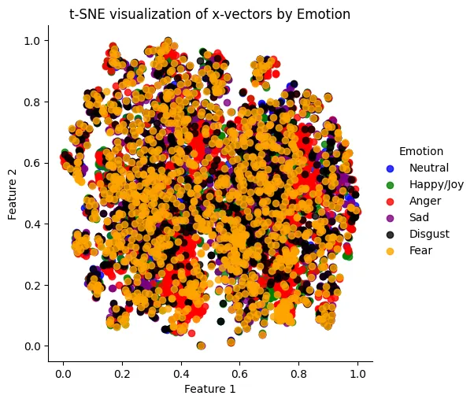
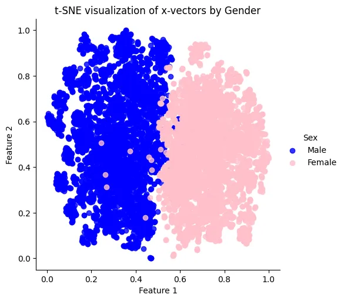
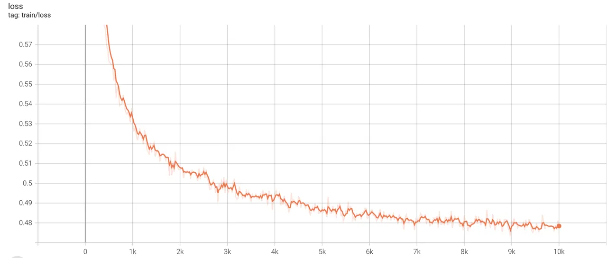
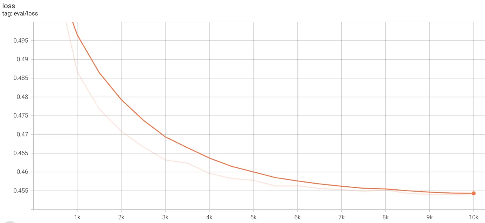
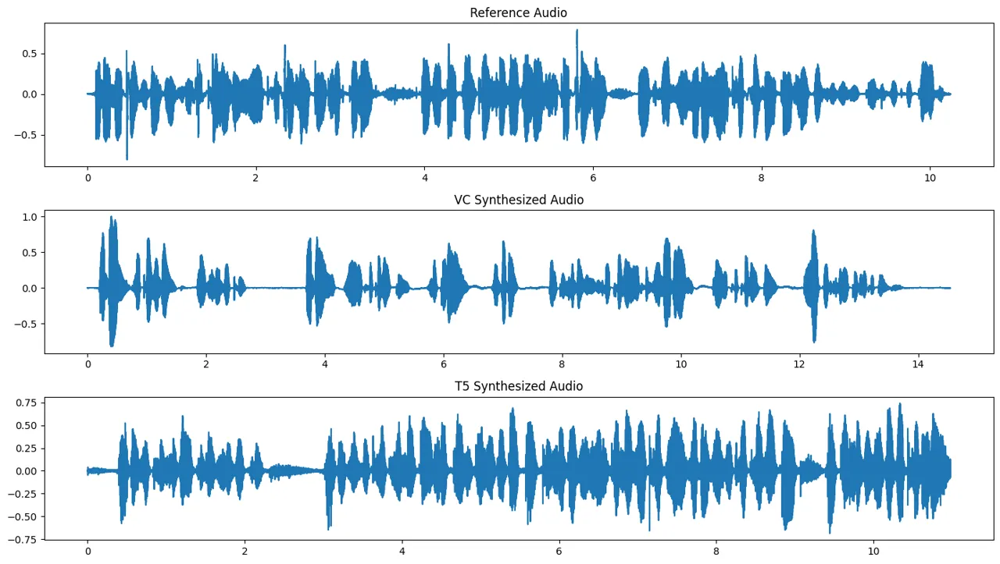
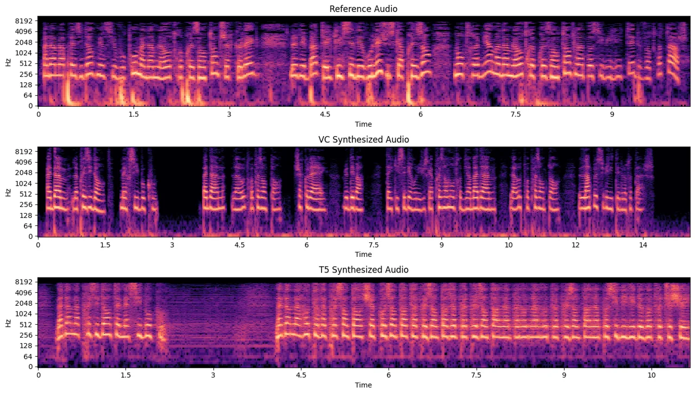

# Multilingual Prosody Transfer: Comparing Supervised & Transfer Learning

Arnav Goel ^(†)^(†)thanks: Equal Contribution    Medha
Hira¹¹footnotemark: 1    & Anubha Gupta Affiliation: Indraprastha
Institute of Information Technology Affiliation: New Delhi - 110020,
India Email: [{arnav21519,medha21265,anubha}@iiitd.ac.in](mailto:)

###### Abstract

The field of prosody transfer in speech synthesis systems is rapidly
advancing. This research is focused on evaluating learning methods for
adapting pre-trained monolingual text-to-speech (TTS) models to
multilingual conditions, i.e., Supervised Fine-Tuning (SFT) and Transfer
Learning (TL). This comparison utilizes three distinct metrics: Mean
Opinion Score (MOS), Recognition Accuracy (RA), and Mel Cepstral
Distortion (MCD). Results demonstrate that, in comparison to SFT, TL
leads to significantly enhanced performance, with an average MOS higher
by 1.53 points, a 37.5% increase in RA, and approximately, a 7.8-point
improvement in MCD. These findings are instrumental in helping build TTS
models for low-resource languages.

|     |
| --- |
|     |

## 1 Introduction

Recent advancements in deep learning, as seen in systems such as
fairseq-S2T (Wang et al., 2022), SpeechT5 (Ao et al., 2022), and VITS
(Kim et al., 2021) have significantly enhanced speech synthesis, paving
the way for our research on controllable Text-to-Speech (TTS) systems
that transfer both text and prosody to target audio. Our study focuses
on multilingual prosody transfer in TTS, particularly exploring models
initially trained in English and then adapted to other languages.
Adapting TTS for multilingual use involves various representation
learning methods, including semi-supervised and self-supervised learning
(Saeki et al., 2023a). We assess two key approaches—supervised
fine-tuning (SFT) on text-audio pairs and transfer learning (TL)—to
evaluate their effectiveness in generating high-quality audio and
transferring prosody in multilingual contexts.

## 2 Related Work

Prosody transfer and voice conversion in TTS systems have evolved from
traditional HMMs, RNNs, and CNNs to Transformer-based architectures like
VTN (Vaswani et al., 2023; Huang et al., 2019). Recent techniques
include using 1) ASR for linguistic representation (Tian et al., 2019;
Popov et al., 2022), 2) speaker-dependent prosody capture (Zhang et al.,
2020), 3) global cues like pitch and loudness (Gururani et al., 2020),
and 4) combining local and global prosodic features (Huang et al.,
2023). While Saeki et al. (2023b) explore semi-supervised learning for
TTS in multilingual settings and Shah et al. (2023) introduce a
pre-trained TTS model for low-resource languages, the use of speaker
embeddings for prosody transfer and adapting pre-trained English TTS
systems to multilingual contexts remains less explored. Our study aims
to fill this gap by investigating these methods.

## 3 Dataset

To conduct experiments in German, French, Spanish, and Dutch, we
utilized segments from the VoxPopuli dataset (Wang et al., 2021),
comprising 282, 211, 166, and 53 hours of transcribed audio,
respectively. For Hindi and Tamil, we selected subsets from the Common
Voice corpus (Ardila et al., 2020), amounting to 20 and 200 hours of
audio of each language. To address class imbalance, we uniformly sampled
data from each language to equalize dataset duration to approximately 20
hours.

## 4 Methodology

We aim to adapt pre-trained models for multilingual prosody preservation
using Supervised Fine-Tuning (SFT) and Transfer Learning (TL). Our
experimental setups and methodologies are as below:

SFT: We selected SpeechT5 for SFT due to its encoder-decoder structure
that generates mel-spectrograms from text input. Its audio post-net can
incorporate speaker embeddings for prosody transfer (Ao et al., 2022).
We utilized x-vector embedding (Snyder et al., 2018), known for
capturing emotional and gender characteristics in speech embedding. The
choice of x-vectors is based on experiments detailed in A.2. These
embedding are integrated with the output of SpeechT5’s decoder to
preserve prosody. SpeechT5 is fine-tuned using supervised learning on
(text, spectrogram) data pairs aiming to minimise cross-entropy loss.
The implementation details and plots are shown in A.3. This technique
adapts a pre-trained monolingual model to multilingual settings.

TL: To evaluate TL, we implemented the voice cloning method from Jia
et al. (2019). This involved a pre-trained speaker encoder designed for
speaker identification, merged with a voice conversion model. For speech
synthesis from text, we used MMS TTS (Pratap et al., 2023) which is a
pre-trained multilingual model which does not preserve prosody.
Concurrently, x-vector embedding were derived using a pre-trained
encoder (Ravanelli et al., 2021) from input audio. The synthesized audio
from MMS and the embedding from the encoder were fed into FreeVC’s
pre-trained voice conversion module (li et al., 2022) to produce
prosody-preserving audio.

Our experiment involved regenerating input audio clips using the two
described models. We assessed the quality of these generated clips using
MOS, RA, and MCD. MOS evaluates the naturalness, quality, and prosody
transfer of the generated speech, while RA assesses the respondents’
ability to recognize the speaker in both the original and generated
audio. MOS and RA are computed based on feedback from 35 respondents¹¹ 1
Detailed calculation methodology and protocol are provided in Appendix
A. Although MCD is not an ideal metric for speech quality, it is useful
in this context for measuring the distortion between the generated audio
clip and the original, thereby aiding in evaluating our experiment’s
outcomes.

|                        |                                    |                      |                        |                                    |                      |       |
| ---------------------- | ---------------------------------- | -------------------- | ---------------------- | ---------------------------------- | -------------------- | ----- |
| Language               | Supervised Fine-Tuning (SpeechT5)  |                      |                        | Transfer Learning (FreeVC)         |                      |       |
| MOS ($`\uparrow`$)^(⋆) | Recognition Accuracy($`\uparrow`$) | MCD ($`\downarrow`$) | MOS ($`\uparrow`$)^(⋆) | Recognition Accuracy($`\uparrow`$) | MCD ($`\downarrow`$) |       |
| Spanish                | 2.73 $`\pm`$ 0.03                  | 0.43                 | 23.23                  | 4.11 $`\pm`$ 0.12                  | 0.81                 | 15.83 |
| French                 | 2.85 $`\pm`$ 0.09                  | 0.48                 | 21.36                  | 4.26 $`\pm`$ 0.09                  | 0.83                 | 12.54 |
| German                 | 3.01 $`\pm`$ 0.13                  | 0.52                 | 20.08                  | 4.35 $`\pm`$ 0.01                  | 0.88                 | 13.41 |
| Dutch                  | 2.44 $`\pm`$ 0.05                  | 0.45                 | 24.74                  | 4.15 $`\pm`$ 0.04                  | 0.79                 | 17.21 |
| Hindi                  | 2.32 $`\pm`$ 0.06                  | 0.40                 | 25.23                  | 4.01 $`\pm`$ 0.17                  | 0.82                 | 16.28 |
| Tamil                  | 2.12 $`\pm`$ 0.24                  | 0.37                 | 26.21                  | 3.85 $`\pm`$ 0.13                  | 0.77                 | 18.54 |

^(⋆)mean$`\pm`$std

Table 1: Comparative performance of SFT and TL on the synthesised speech
quality

## 5 Results

Table 1 shows the results of our experiments. Audio clips generated by
SpeechT5-finetuned using SFT are generally found to be noisy and have
poor audio quality. This is further validated by the MOS scores which
are reported at a _95% confidence level_. TL surpasses SFT by an average
of 1.53 points over the six languages. Additionally, the recognition
accuracy of the TL generated audio exceeds that of SFT by more than 35%
on average. These scores substantiate that Transfer Learning is superior
in retaining the unique characteristics of a voice. While adapting the
model to another language, SFT reduces the model’s ability to generate
good quality speech, let alone preserve prosody. MCD compares the
mel-frequency cepstral coefficients (MFCC) of ground truth and generated
speech. We used dynamic time-warping to calculate MCD in order to
account for clips with varying lengths. TL yields lower MCD compared to
SFT (indicating closer resemblance). The distortion is lesser by an
average of 35% on all the six languages.

## 6 Conclusion and Future Work

Our findings highlight the superiority of transfer learning over
supervised fine-tuning in adapting pre-trained models for TTS
applications. This insight is particularly crucial for developing TTS
models in low-resource environments, where supervised fine-tuning’s
data-intensive nature can be a significant challenge. Future research
will aim to establish a framework for comparing different learning
methods in adapting pre-trained models to low-resource and multilingual
contexts.

#### URM Statement

The authors acknowledge that at all the authors of this work meet the
URM criteria of ICLR 2024 Tiny Papers Track.

## References

- Ao et al. (2022) Junyi Ao, Rui Wang, Long Zhou, Chengyi Wang, Shuo
  Ren, Yu Wu, Shujie Liu, Tom Ko, Qing Li, Yu Zhang, Zhihua Wei, Yao
  Qian, Jinyu Li, and Furu Wei. Speecht5: Unified-modal encoder-decoder
  pre-training for spoken language processing, 2022.
- Ardila et al. (2020) Rosana Ardila, Megan Branson, Kelly Davis,
  Michael Henretty, Michael Kohler, Josh Meyer, Reuben Morais, Lindsay
  Saunders, Francis M. Tyers, and Gregor Weber. Common voice: A
  massively-multilingual speech corpus, 2020.
- Cao et al. (2014) Houwei Cao, David G Cooper, Michael K Keutmann,
  Ruben C Gur, Ani Nenkova, and Ragini Verma. CREMA-D: Crowd-sourced
  emotional multimodal actors dataset. _IEEE transactions on affective
  computing_, 5(4):377–390, 2014.
- Gururani et al. (2020) Siddharth Gururani, Kilol Gupta, Dhaval Shah,
  Zahra Shakeri, and Jervis Pinto. Prosody transfer in neural text to
  speech using global pitch and loudness features, 2020.
- Huang et al. (2019) Wen-Chin Huang, Tomoki Hayashi, Yi-Chiao Wu,
  Hirokazu Kameoka, and Tomoki Toda. Voice transformer network:
  Sequence-to-sequence voice conversion using transformer with
  text-to-speech pretraining, 2019.
- Huang et al. (2023) Wen-Chin Huang, Benjamin Peloquin, Justine Kao,
  Changhan Wang, Hongyu Gong, Elizabeth Salesky, Yossi Adi, Ann Lee, and
  Peng-Jen Chen. A holistic cascade system, benchmark, and human
  evaluation protocol for expressive speech-to-speech translation, 2023.
- Jia et al. (2019) Ye Jia, Yu Zhang, Ron J. Weiss, Quan Wang, Jonathan
  Shen, Fei Ren, Zhifeng Chen, Patrick Nguyen, Ruoming Pang,
  Ignacio Lopez Moreno, and Yonghui Wu. Transfer learning from speaker
  verification to multispeaker text-to-speech synthesis, 2019.
- Kim et al. (2021) Jaehyeon Kim, Jungil Kong, and Juhee Son.
  Conditional variational autoencoder with adversarial learning for
  end-to-end text-to-speech, 2021.
- li et al. (2022) Jingyi li, Weiping tu, and Li xiao. Freevc: Towards
  high-quality text-free one-shot voice conversion, 2022.
- Popov et al. (2022) Vadim Popov, Ivan Vovk, Vladimir Gogoryan, Tasnima
  Sadekova, Mikhail Kudinov, and Jiansheng Wei. Diffusion-based voice
  conversion with fast maximum likelihood sampling scheme, 2022.
- Pratap et al. (2023) Vineel Pratap, Andros Tjandra, Bowen Shi, Paden
  Tomasello, Arun Babu, Sayani Kundu, Ali Elkahky, Zhaoheng Ni, Apoorv
  Vyas, Maryam Fazel-Zarandi, Alexei Baevski, Yossi Adi, Xiaohui Zhang,
  Wei-Ning Hsu, Alexis Conneau, and Michael Auli. Scaling speech
  technology to 1,000+ languages, 2023.
- Ravanelli et al. (2021) Mirco Ravanelli, Titouan Parcollet, Peter
  Plantinga, Aku Rouhe, Samuele Cornell, Loren Lugosch, Cem Subakan,
  Nauman Dawalatabad, Abdelwahab Heba, Jianyuan Zhong, Ju-Chieh Chou,
  Sung-Lin Yeh, Szu-Wei Fu, Chien-Feng Liao, Elena Rastorgueva, François
  Grondin, William Aris, Hwidong Na, Yan Gao, Renato De Mori, and Yoshua
  Bengio. Speechbrain: A general-purpose speech toolkit, 2021.
- Saeki et al. (2023a) Takaaki Saeki, Heiga Zen, Zhehuai Chen, Nobuyuki
  Morioka, Gary Wang, Yu Zhang, Ankur Bapna, Andrew Rosenberg, and
  Bhuvana Ramabhadran. Virtuoso: Massive multilingual speech-text joint
  semi-supervised learning for text-to-speech. In _ICASSP 2023 - 2023
  IEEE International Conference on Acoustics, Speech and Signal
  Processing (ICASSP)_, pp. 1–5, 2023a. doi:
  10.1109/ICASSP49357.2023.10095702.
- Saeki et al. (2023b) Takaaki Saeki, Heiga Zen, Zhehuai Chen, Nobuyuki
  Morioka, Gary Wang, Yu Zhang, Ankur Bapna, Andrew Rosenberg, and
  Bhuvana Ramabhadran. Virtuoso: Massive multilingual speech-text joint
  semi-supervised learning for text-to-speech, 2023b.
- Shah et al. (2023) Neil Shah, Vishal Tambrahalli, Saiteja Kosgi,
  Niranjan Pedanekar, and Vineet Gandhi. Mparrottts: Multilingual
  multi-speaker text to speech synthesis in low resource setting, 2023.
- Snyder et al. (2018) David Snyder, Daniel Garcia-Romero, Gregory Sell,
  Daniel Povey, and Sanjeev Khudanpur. X-vectors: Robust dnn embeddings
  for speaker recognition. In _2018 IEEE International Conference on
  Acoustics, Speech and Signal Processing (ICASSP)_, pp.
  5329–5333, 2018. doi: 10.1109/ICASSP.2018.8461375.
- Tian et al. (2019) Xiaohai Tian, Eng Siong Chng, and Haizhou Li. A
  vocoder-free wavenet voice conversion with non-parallel data, 2019.
- Vaswani et al. (2023) Ashish Vaswani, Noam Shazeer, Niki Parmar, Jakob
  Uszkoreit, Llion Jones, Aidan N. Gomez, Lukasz Kaiser, and Illia
  Polosukhin. Attention is all you need, 2023.
- Wang et al. (2021) Changhan Wang, Morgane Rivière, Ann Lee, Anne Wu,
  Chaitanya Talnikar, Daniel Haziza, Mary Williamson, Juan Pino, and
  Emmanuel Dupoux. Voxpopuli: A large-scale multilingual speech corpus
  for representation learning, semi-supervised learning and
  interpretation, 2021.
- Wang et al. (2022) Changhan Wang, Yun Tang, Xutai Ma, Anne Wu, Sravya
  Popuri, Dmytro Okhonko, and Juan Pino. fairseq s2t: Fast
  speech-to-text modeling with fairseq, 2022.
- Zhang et al. (2020) Jing-Xuan Zhang, Li-Juan Liu, Yan-Nian Chen,
  Ya-Jun Hu, Yuan Jiang, Zhen-Hua Ling, and Li-Rong Dai. Voice
  conversion by cascading automatic speech recognition and
  text-to-speech synthesis with prosody transfer, 2020.

## Appendix A Appendix

### A.1 Acronyms Used

- •
  TL : Transfer Learning
- •
  SFT : Supervised-Fine Tuning
- •
  MCD : Mel Cepstral Distortion
- •
  MFCC : Mel-Frequency Cepstral Coefficients
- •
  MOS : Mean Opinion Score
- •
  ASR : Automated Speech Recognition
- •
  TTS : Text to Speech
- •
  HMM : Hidden Markov Models
- •
  RNN : Recurrent Neural Networks
- •
  CNN : Convolutional Neural Networks
- •
  MMS : Massively Multilingual Speech (Pratap et al., 2023)

### A.2 Speaker Embeddings

X-vector embeddings (Snyder et al., 2018), derived from deep neural
networks, excel in capturing intricate speaker characteristics such as
emotion and gender. This makes them ideal for prosody transfer tasks,
allowing for the addition or alteration of emotional and gender nuances
in synthesized or altered speech, thereby improving its naturalness and
expressiveness. Our study examines x-vector’s efficacy in emotion and
gender recognition using the CREMA-D dataset (Cao et al., 2014). In
gender identification, the pink and blue graphs (indicating female and
male speakers, respectively) show clear distinction.

After incorporating the x-vector embeddings, we utilized them to train a
multi-layer perceptron classifier. This classifier, has two hidden
layers of size 128 and 64 respectively, and was trained on 80% of the
data using the cross entropy loss. The ReLU activation function was used
for each layer. Testing was conducted for the gender and emotion
classification task where X-vectors displayed the highest accuracy.

|                       |                    |                   |
| --------------------- | ------------------ | ----------------- |
| Pre-Trained Embedding | Accuracy (Emotion) | Accuracy (Gender) |
| MFCC (13)             | 38.04%             | 78.96%            |
| Wav2Vec2              | 46.87%             | 76.29%            |
| X-vector              | 61.72%             | 99.19%            |
| ECAPA-TDNN            | 47.74%             | 97.65%            |
| WavLM                 | 53.27%             | 71.32%            |

Table 2: Results of pre-trained embeddings on emotion and gender
recognition

Figure 1: Emotion

Figure 2: Gender

Figure 3: t-SNE visualisation of x-vector embeddings

### A.3 Fine-Tuning Implementation Details and Plots

Figure 4: Training Loss vs Epochs for French

Figure 5: Validation Loss vs Epochs for French

The preprocessing details for the data is given as follows:

1.  1.  Firstly, the dataset is downloaded using an API and the audio files
        are extracted. Standard audio pre-processing is applied to remove
        noise and silence before generating speaker embeddings (x-vectors)
2.  2.  Since speakers are annotated for the dataset, the audio clips
        belonging to speakers with clips in the range of $`\in(100,400)`$
        are only selected for fine-tuning.
3.  3.  For generating the text transcripts, transliteration is performed by
        phenome transformation on symbols not existing in English. This is
        particularly important in Hindi and Tamil where the lexical scripts
        are entirely different from English and need to be transliterated
        for fine-tuning to happen.

This preprocessing prepares our dataset for fine-tuning on any English
pre-trained TTS after which we train the SpeechT5 model on
text-spectrogram pairs. The following hyperparameters are set for
fine-tuning SpeechT5:

- •
  Learning rate: $`1e-5`$
- •
  Epochs: 10000
- •
  Warmup steps: 500
- •
  Train Batch Size: 4
- •
  Val Batch Size: 4
- •
  Gradient accumulation steps: 8
- •
  fp16: True
- •
  Evaluation Strategy: ”steps”

Figure 6: Comparing Waveforms of the three audio clips

Figure 7: Comparing Spectrograms of the three audio clips

Figures 5 and 5 display the loss curves for training and validating
SpeechT5 on VoxPopuli-French, converging around 10000 epochs, showing
effective model fine-tuning. Figures 7 and 7 present a waveform and
spectrogram generated by FreeVC and SpeechT5, respectively, using a
random test set audio clip, termed _Reference Audio_. This clip,
processed for x-vector embeddings, is fed into the fine-tuned SpeechT5,
resulting in _T5 Synthesised Audio_, while FreeVC produces _VC
Synthesised Audio_. The spectrogram reveals that VC Synthesised Audio
more accurately matches the original, with a stable waveform, in
contrast to the stretched, high-energy T5 Synthesised Audio, which
deviates significantly from the reference.

### A.4 MOS and Recognition Accuracy Calculation Protocol

We conducted a survey where 35 candidates heard 10 sets of voice clip.
One set included the ground truth (original audio) and the corresponding
generated audio.

MOS Score: Once they heard a pair, the candidates filled out a
questionnaire with 5 questions on a 1-5 rating scale.

- •
  Rate the naturalness of the clip (assessment of non-robotic voice)
- •
  Rate the emphasis and intonation of spoken words
- •
  Does the speaker of the two clips sound the same
- •
  Evaluate rhythm and speech consistency
- •
  Fluency of speech of the generated clip versus the input clip

Recognition Accuracy: This evaluates if the clips can be identified as
the same user. Yes or no response.
