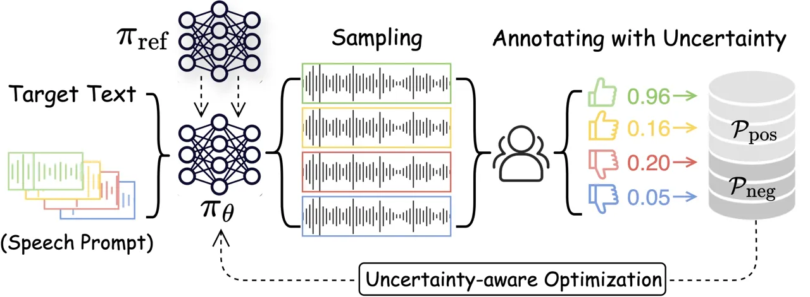
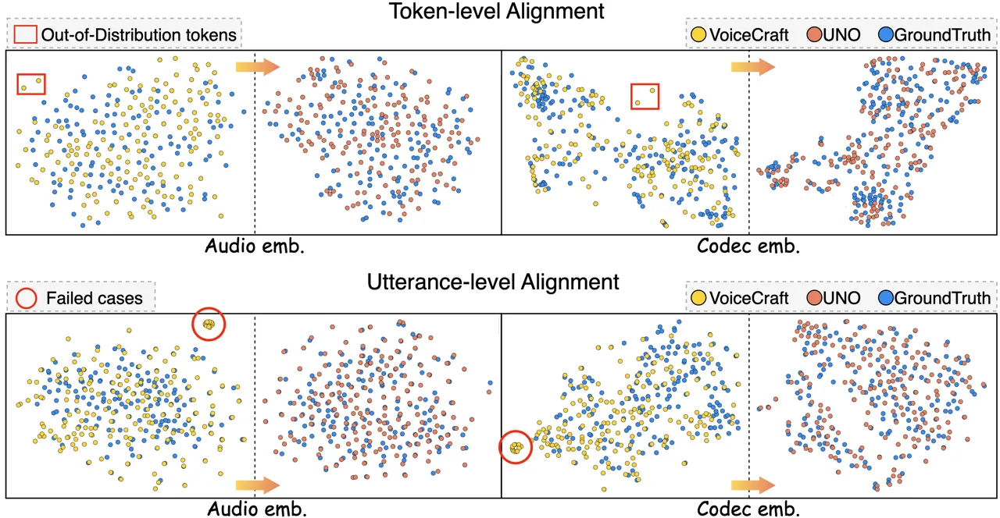
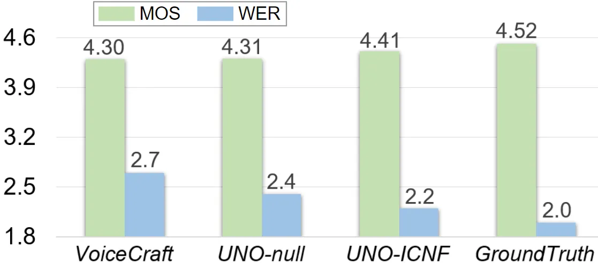
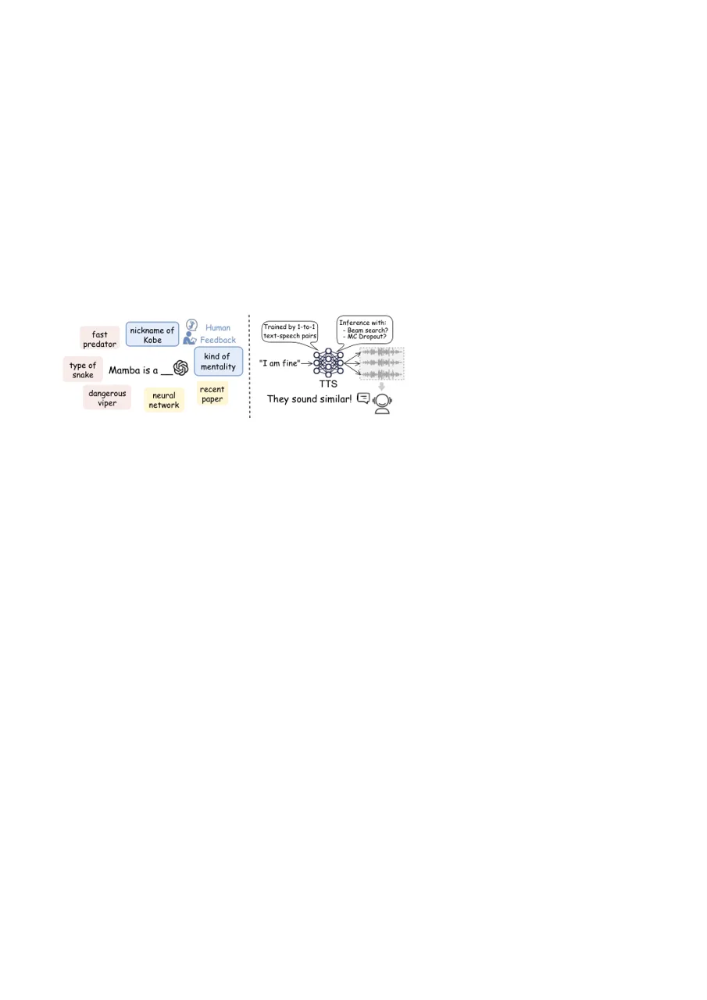
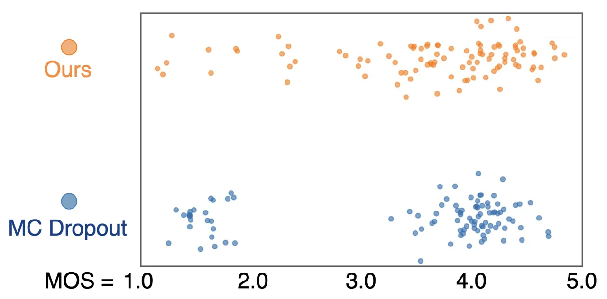
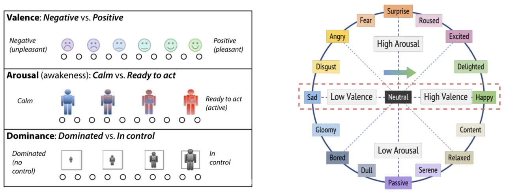

# Enhancing Zero-shot Text-to-Speech Synthesis with Human Feedback

Chen Chen Affiliation: Nanyang Technological University
Email: [chen1436@e.ntu.edu.sg](mailto:)    Yuchen Hu
Affiliation: Nanyang Technological University
Email: [yuchen005@e.ntu.edu.sg](mailto:)    Wen Wu
Affiliation: University of Cambridge    Helin Wang Affiliation: Johns
Hopkins University    Eng Siong Chng Affiliation: Nanyang Technological
University    Chao Zhang Affiliation: Tsinghua University

###### Abstract

In recent years, text-to-speech (TTS) technology has witnessed
impressive advancements, particularly with large-scale training
datasets, showcasing human-level speech quality and impressive zero-shot
capabilities on unseen speakers. However, despite human subjective
evaluations, such as the mean opinion score (MOS), remaining the gold
standard for assessing the quality of synthetic speech, even
state-of-the-art TTS approaches have kept human feedback isolated from
training that resulted in mismatched training objectives and evaluation
metrics. In this work, we investigate a novel topic of integrating
subjective human evaluation into the TTS training loop. Inspired by the
recent success of reinforcement learning from human feedback, we propose
a comprehensive sampling-annotating-learning framework tailored to TTS
optimization, namely uncertainty-aware optimization (UNO). Specifically,
UNO eliminates the need for a reward model or preference data by
directly maximizing the utility of speech generations while considering
the uncertainty that lies in the inherent variability in subjective
human speech perception and evaluations. Experimental results of both
subjective and objective evaluations demonstrate that UNO considerably
improves the zero-shot performance of TTS models in terms of MOS, word
error rate, and speaker similarity. Additionally, we present a
remarkable ability of UNO that it can adapt to the desired speaking
style in emotional TTS seamlessly and flexibly.

## 1 Introduction

Artificial intelligence-generated content (AIGC) has attracted a surge
of interest in both academia and industry, revolutionizing the way we
acquire and generate information \[11\]. In this context, learning from
human feedback plays a pivotal role in calibration—it aims to align the
generative models with human preferences. For instance, the
reinforcement learning from human feedback (RLHF) technique can
effectively help large language models (LLMs) to avoid generating
harmful and toxic content  \[1, 5\], which is crucial to the success of
helpful systems like ChatGPT. Similar methods have recently been
employed in text-to-image generation \[37, 62\].

As an important task of AIGC, text-to-speech (TTS) synthesis technology
is undergoing rapid development driven by deep learning models \[6,
49\]. Recent TTS works \[35, 30, 47, 56\] with extensive text-speech
training pairs exhibit remarkable zero-shot capacity which generates
high-quality speech for speakers unseen during training. However, unlike
the widespread application of RLHF in LLMs’ calibration, aligning
synthetic speech generation with human preferences remains challenging
and has not yet been adopted in practice \[71\]. This contradicts the
use of human subjective evaluation, such as the mean opinion score
(MOS), as the gold standard for assessing TTS performance, and results
in a clear mismatch between TTS training and evaluation. Motivated by
this, we raise our basic research question: Can we integrate human
feedback into the TTS learning loop?

The technical barrier of this topic stems from both sides of “TTS” and
“human”. (1) First, existing TTS models typically learn a mapping
function from input word/phoneme sequences to either mel-spectrograms or
discrete audio tokens followed by high-resolution waveform generation
based on supervised training \[56\]. However, this learned mapping
hardly provides diverse yet plausible generations based on the same text
and speech prompt, which hinders the formulation of pairwise preference
data required by widely used LLMs alignment methods such as direct
preference optimization (DPO) \[48\] (more discussion in Appendix B).
(2) Second, human evaluations of speech quality are subjective and
inherently personalised. Each individual’s acoustic perception is unique
and influenced by their physical state and cognitive biases, thereby
resulting in uncertainty in the human feedback of each sample.

To address the above challenges, we propose a pioneering method named
uncertainty-aware optimization (UNO), which aims to enhance zero-shot
TTS performance with human feedback. Inspired by the recent success of
RLHF, UNO encompasses a sampling-annotating-learning pipeline, but its
original design tailored to TTS lies in these three sub-steps:

- •
  Sampling with diversity. To obtain representative training examples,
  UNO performs zero-shot TTS sampling with different speech prompts. It
  significantly contributes to the diversity in self-generated speech
  samples, thereby reducing the potential bias that arises from
  unrepresentative or skewed data collection.
- •
  Annotating with uncertainty. UNO eliminates the dependency on
  preference data based on the same input. Instead, it allows a more
  flexible and tolerant data annotation: only a binary signal is
  required for whether the generated speech is desirable or not.
  Furthermore, since speech evaluation is subjective and personalised,
  this step encompasses the uncertainty caused by the individual
  differences among human annotators.
- •
  UNO treats human feedback as a form of supervision with inconsistent
  labels to mitigate the mismatch between the TTS training objectives
  and MOS-like subjective evaluation metrics. This learning approach
  directly maximizes the utility of generations from TTS sampling,
  instead of relying on a reward model or maximizing the log-likelihood
  of preferences.

Experimental results show that UNO comprehensively enhances the
performance of zero-shot TTS models, including speaker similarity (SIM),
word error rate (WER), and pseudo-MOS estimated by three pre-trained
models. For validation, we conduct subjective human listening tests in
the form of naturalness MOS scoring and side-by-side A/B testing. The
results of human evaluation confirm that the TTS model optimized through
our method significantly outperforms the baseline
($`3.38\rightarrow 4.06`$) and sounds equally good compared to the
ground truth speech. Through both token-level and utterance-level
visualization, it is observed that UNO provides effective supervised
signals, resulting in the distribution of generated content being closer
to the ground truth distribution. Furthermore, UNO exhibits flexible
scalability through adjusting optimization objectives. By changing the
selection criteria in sampling selection, the method can be seamlessly
extended to emotional TTS.

Our contributions are summarised as follows: (1) We present a
comprehensive framework tailored to zero-shot TTS optimization, where
human feedback is taken into account in the training objectives to
alleviate the mismatch between training and evaluation. (2) By delving
into the characteristics of speech synthesis, UNO eliminates the
dependence on preference data and accommodates the uncertainty in human
subjective evaluations. This provides a new perspective for
high-dimensional modality generation and alignment. (3) Intensive
experiments demonstrate that UNO brings remarkable performance gain to
zero-shot TTS models, especially in avoiding most failed cases.
Additionally, UNO can be seamlessly extended to emotion TTS,
demonstrating its scalability and practical value.

## 2 Related Work

Text-to-speech as language modelling. Inspired by the success of
LLMs \[9\], formatting TTS task as next token prediction has gained
remarkable popularity in recent years \[8, 50, 70\]. Under this setup,
the prior step is to convert speech waveform into a sequence of
learnable and discrete units based on vector quantization \[21, 67\].
SpeechTokenizer \[72\] and RepCodec \[27\] enhance the semantic
tokenization by adding self-supervised embedding prediction-based
losses \[44\]. With discrete acoustic tokens, TortoiseTTS \[6\] pioneers
to combine a speech-code language model with a diffusion decoder to
achieve few-shot TTS. VALL-E \[56\] and Spear-TTS \[32\] scales to use
60k training data using a pre-trained neural codec model \[21\], which
exhibits remarkable zero-shot capacity to synthesize speech for unseen
speakers with speech prompt. VALL-E X \[73\] and VioLa \[57\] extent
this framework to cross-lingual TTS, and later works \[41, 29, 39, 64\]
control the style of speech synthesis based on the neural codec. More
recent work \[47\] extends the TTS framework to address speech editing
tasks, BaseTTS  \[35\] built the first a billion-parameter TTS model
based on a decoder-only structure. RALL-E \[61\] presents a robust
language modeling approach for zero-shot TTS.

Learning from Human Feedback. Human feedback has been widely used in
language models for NLP tasks, such as text translation \[34\],
instruction-following \[45\], and summarization \[52\]. The advancements
in the RLHF framework have contributed to training helpful and harmless
AI agents aligning with human preference in the past years \[16, 5, 1,
19\]. Moreover, recent works like DPO \[48\] shift in favour of
closed-form losses that directly operate on preference data. Different
from typical preference-based RL \[28, 10\], DPO-style works remove the
explicit reward model learning and provide the same alignment
effect \[75, 3, 69, 40\] with typical RLHF. Moreover,  \[14, 66\]
propose to calibrate LLMs in a “self-rewarding” manner, and KTO \[23\]
relieves the dependence on preference data and optimises LLMs using
prospect theory \[31\].

Summary. To align TTS systems with human preference, we propose to
consider the uncertainty of human subjective
evaluations \[42\]—assessing speech has more perspectives and
subjectivity than text \[54, 58\]. Moreover, UNO eliminates the
dependence on pairwise preference data and does not require any
corresponding ground truth speech (different from SpeechAlign \[71\]).
Combining these factors, we regard UNO as a step towards incorporating
human evaluation signals in TTS training and contributing to developing
more powerful and versatile speech synthesis.

## 3 Background

Neural Codec Language Modeling for TTS. Speech synthesis aims to convert
a sequence of transcript $`t`$ into a corresponding speech waveform
$`s`$. This mapping can be formally expressed using a function $`\pi`$
parameterized by $`\theta`$ as $`s=\pi_{\theta}(t)`$. In this work, we
regard the TTS problem as a conditional speech-codec-based language
modelling task as proposed in \[56\]. $`s\in\mathbb{R}^{L\times n}`$ is
tokenized into sequences of discrete acoustic units with a neural codec
encoder, where $`L`$ is the downsampled utterance length and $`n`$ is
the number of residual vector quantization (RVQ) codebooks. After
quantization, the neural codec decoder is able to reconstruct the
waveform.

Zero-shot TTS extends conventional TTS by enabling speech synthesis
using voices unseen during model training. Given the target transcript
$`t`$ and a short speech prompt $`p`$ as reference, zero-shot TTS is
framed as a transcript-conditioned speech continuation task that uses
well-trained model $`\theta=\theta_{1}\cup\theta_{2}`$ to predict the
first layer of codebook $`s_{L}^{(1)}`$ with corresponding content and
speaker’s voice using parameter $`\theta_{1}`$ in an autoregressive
manner, and then predict other codebooks $`s_{L}^{(2:n)}`$ using
parameter $`\theta_{2}`$ in a non-autoregressive manner. This
hierarchical structure is denoted as:

```math
\displaystyle s_{l}^{(1)} \displaystyle=\pi_{\theta_{1}}(p^{(1)},s^{(1)}_{<l},t),\ l\in\{1,2,\ldots,L\} \tag{1}
```

```math
\displaystyle s_{L}^{(n)} \displaystyle=\pi_{\theta_{2}}(p^{(1:n)},s_{L}^{(1:n-1)},t) \tag{2}
```

where $`p`$ can be viewed as a prefix sequence during decoding, and
$`s_{<t}`$ is the history predicted by the model. Typically, the
$`s_{L}^{(1)}`$ represents the acoustic properties like speech content,
while $`s_{L}^{(2:n)}`$ recovers fine acoustic details.

RLHF with Preference Data. Given a dataset $`\mathcal{D}`$ with
preference data point $`(x,y_{w},y_{l})`$, where $`y_{w}`$ and $`y_{l}`$
are the win-loss generations based on the same input $`x`$, it is
assumed that the probability of $`y_{w}`$ is preferred to $`y_{l}`$ can
be captured by a “true” reward function $`R^{*}`$. Since obtaining
$`R^{*}`$ from humans would be intractably expensive, prior RLHF work
employs a reward model $`R_{\phi}`$ as a proxy trained by minimizing the
negative log-likelihood of the human-annotated data:

```math
\mathcal{L}_{R_{\phi}}=\mathbb{E}_{x,y_{w},y_{l}\sim\mathcal{D}}\ [-\log\sigma(R_{\phi}(x,y_{w})-R_{\phi}(x,y_{l}))], \tag{3}
```

where $`\sigma`$ is the logistic function. Furthermore, a reference
model $`\pi_{\text{ref}}`$ with KL divergence penalty is introduced to
prevent the model $`\pi_{\theta}`$ from making radical update, the
maximizing objective is:

```math
\mathbb{E}_{x\in\mathcal{D},y\in\pi_{\theta}}[R_{\phi}(x,y)]-\beta D_{\text{KL}}(\pi_{\theta}(y|x)\|\pi_{\text{ref}}(y|x)), \tag{4}
```

where $`\beta`$ is a balancing weight. Since the first item is
non-differentiable for backpropagation, an RL algorithm like PPO is
required to pursue maximum rewards and optimize the policy network
$`\pi_{\theta}`$.

RLHF typically requires high computational costs for sampling
generations and, additionally, exhibits instability in practice. Recent
advances like DPO \[48\] focus on closed-form losses that present an
implicit reward function under the RLHF objective in Eqn. (4), where the
optimal reward for an input-output pair is denoted as:

```math
R^{*}(x,y)=\beta\log\frac{\pi_{\theta}(y|x)}{\pi_{\text{ref}}(y|x)}+\beta\log Z(x), \tag{5}
```

where $`Z(x)`$ is a partition function. Then Eqn. (5) is utilized to
maximize the margin between preferred and dispreferred samples, which
has been demonstrated mathematical equivalence with typical
KL-constrained RLHF in Eqn (4).

Variability in Human Evaluations. Variability is a unique aspect of
real-world human evaluation. Individual variations in physical states,
cognitive biases, and personal experiences can lead to subjectivity in
perceptual quality assessment (e.g. TTS quality assessment). Instead of
solely relying on mean opinions, we propose incorporating the
variability present in human evaluation, which helps mitigate potential
biases and promotes fairness and inclusivity. Prior approaches for
modelling variability in human annotations can be broadly grouped into
two types. The first approach explicitly models the behaviours of
different annotators using different individual models \[24, 15, 20\],
which is not scalable when the number of annotators increases. The
second approach approximates subjective probability distributions using
Markov chain Monte Carlo with people \[51, 26\], which requires human
annotators to be dynamically involved in the process. In this work, a
meta-learning framework is adopted for zero-shot human annotation
distribution estimation. Given a synthesized utterance $`s_{i}`$ and a
set of $`M_{i}`$ human annotations
$`\mathcal{D}_{i}=\{y_{i}^{(m)}\}_{m=1}^{M_{i}}`$ associated with
$`s_{i}`$. The simulator aims to model the conditional annotation
distribution $`\mathrm{p}(y_{i}|s_{i})`$. For an unseen test utterance
$`s_{*}`$, the simulator can then predict $`\mathrm{p}(y_{*}|s_{*})`$ to
simulate human-like annotations
$`\mathcal{D}_{*}=\{y_{*}^{(m)}\}_{m=1}^{M_{*}}`$ in a way that reflects
how it would be labeled by human annotators. The framework involves
meta-learning a deep neural network model to estimate
$`\mathrm{p}(y_{i}|s_{i})`$ across all training data
$`\mathcal{D}=\{(s_{i},\mathcal{D}_{i})\}_{i=1}^{N}`$ where $`N`$ is the
number of training samples. The deep neural network model then serves as
a distribution estimator to allow efficient generation of human-like
annotations.

## 4 Methodology



Figure 1: This sampling-annotating-learning framework of UNO. In
annotating, the “like” and “dislike” symbols denote the binary signal
for whether this synthetic speech is desirable or not, and the digits
represents the uncertainty caused by the variability of annotators.

### 4.1 Data Sampling and Annotating

In order to acquire representative data, we introduce a simple sampling
strategy that can encourage more diversified zero-shot TTS generation.
Specifically, for each target transcript $`x`$, we sample a batch of
speech prompts $`\{p_{1},p2,\ldots,p_{b}\}`$ with the size of $`b`$ from
an unseen speaker pool. Then $`x`$ is alternately combined with $`k`$-th
reference $`p_{k}`$ from the batch to form a different input to the TTS
model by $`s_{k}=\pi_{\theta}(t,p_{k})`$, $`k\in\{1,2,\ldots,b\}`$. Note
that $`p_{k}`$ acts as a prefix sequence in autoregressive decoding and
significantly contributes to the diversity of target speech $`s_{k}`$.

After completing $`b`$ inferences for a batch, the desirable and
undesirable samples are distinguished by human and respectively stored
in $`\mathcal{P}_{\text{pos}}`$ and $`\mathcal{P}_{\text{neg}}`$ pools.
Moreover, since human evaluations of generated speech are less intuitive
than text, we record the uncertainty $`u`$ associated with each data
point. When multiple annotators provide distinct decisions, $`u`$ can be
the variance of evaluations for this assessment. We finally obtain two
pools with $`I`$ desirable and $`J`$ undesirable samples after sampling
$`K`$ times, respectively:

```math
\displaystyle\mathcal{P}_{\text{pos}} \displaystyle=\{(t_{i},p_{i},s_{i};u_{i})\ |\ s_{i}\sim\pi_{\text{ref}}(t_{i},p_{i}),u_{i}\in[0,1),i=1,2,\ldots,I\} \tag{6}
```

```math
\displaystyle\mathcal{P}_{\text{neg}} \displaystyle=\{(t_{j},p_{j},s_{j};u_{i})\ |\ s_{i}\sim\pi_{\text{ref}}(t_{j},p_{j}),u_{i}\in[0,1),j=1,2,\ldots,J\} \tag{7}
```

where $`I`$ and $`J`$ may not be equal. This indicates that the samples
in $`\mathcal{P}_{\text{pos}}`$ and $`\mathcal{P}_{\text{neg}}`$ are not
pairwise preference data since they are based on diversified speech
prompts. This significantly helps to increase the diversity of generated
speech (see more analysis in Appendix C), thus potentially reducing the
bias of data collection for the subsequent optimization process.

Considering the substantial human resource consumption required in
annotations, this paper utilizes anthropomorphic annotation simulators
trained with real human-labeled SOMOS dataset \[42\] for efficient
generation of evaluation labels while simulating variability in human
opinions. Both a discriminative simulator, EDL \[60\], and a generative
simulator, I-CNF \[59\], are used to simulate the human decision with
uncertainty. EDL makes a Gaussian assumption on the conditional
annotation distribution $`\mathrm{p}(y|s)`$ and places a normal
inverse-gamma (NIG) over the Gaussian likelihood to learn a higher-order
prior distribution, also called the evidential distribution \[4\]:

```math
\{y^{(m)}\}_{m=1}^{M}\sim\mathcal{N}(\mu,\sigma^{2}),\quad\mu\sim\mathcal{N}(\gamma,\sigma^{2}\upsilon^{-1}),\quad\sigma^{2}\sim\Gamma^{-1}(\alpha,\beta). \tag{8}
```

A deep neural network model is trained to predict the hyperparameters
$`\Omega=\{\gamma,\upsilon,\alpha,\beta\}`$ of the NIG prior by
maximizing the marginal likelihood of sampling from all possible
Gaussians:

```math
\mathrm{p}(y|{\Omega})=\int\mathrm{p}(y|{\Psi})\mathrm{p}({\Psi}|{\Omega})\mathrm{d}{\Psi}=\text{St}_{2\alpha}\left(y|\gamma,\frac{\beta(1+\upsilon)}{\upsilon\,\alpha}\right), \tag{9}
```

where $`\Psi=\{\mu,\sigma\}`$ is the hyperparameters of the Gaussian
likelihood and $`\text{St}_{\nu}\left(t|r,s\right)`$ is the Student’s
t-distribution evaluated at $`t`$ with location parameter $`r`$, scale
parameter $`s`$, and $`\nu`$ degrees of freedom. The predicted mean and
variance can be computed analytically as $`\mathbb{E}[y]=\gamma`$ and
$`\operatorname{Var}[y]={\beta(1+\upsilon)}/{\upsilon(\alpha-1)}`$. The
predicted variance is then used as uncertainty. I-CNF removes the
Gaussian assumption of EDL by meta-learning a conditional normalizing
flow
$`\mathrm{p}(y|s)=\int\mathrm{p}_{\phi}(y|z)\mathrm{p}_{\Lambda}(z|s)\mathrm{d}z`$
where $`z`$ is a latent variable sampled from a Gaussian distribution
conditioned on input $`s`$. The mean and variance of the conditional
Gaussian prior are parameterized by a neural network model with
parameters $`\Lambda`$ as
$`\mathrm{p}_{\Lambda}(z|s)=\mathcal{N}(z|\mu_{\Lambda}(s),\operatorname{diag}(\sigma_{\Lambda}^{2}(s)))`$.
The simulated evaluation $`y`$ is obtained by a deterministic invertible
transformation $`\mathrm{p}_{\phi}(y|z)=\delta(y-f_{\phi}(z))`$, where
$`f_{\phi}(z)`$ is parameterized by an invertible neural network model
$`\phi`$, and $`\delta(\cdot)`$ is the multivariate Dirac delta
function. That is,

```math
\mathrm{p}(y|s)=\int\delta(y-f_{\phi}(z))\mathrm{p}_{\Lambda}(z|s)\mathrm{d}z=\mathrm{p}_{\Lambda}\left.\left(f^{-1}_{\phi}(y)\right|s\right)\left|\operatorname{det}\left(\frac{\partial f^{-1}_{\phi}(y)}{\partial y}\right)\right|, \tag{10}
```

where $`\operatorname{det}(\cdot)`$ denotes the determinant operator,
$`{\partial f^{-1}_{\phi}(y)}/{\partial y}`$ denotes the Jacobian matrix
of $`f^{-1}_{\phi}(y)`$. This modelling choice has the advantage of
having tractable marginal likelihood as in Eqn. (10) while not
restricting the intermediate variable $`y`$ to a specific type of
distribution. At test time, the I-CNF can simulate human-like
annotations for an unseen, unlabeled descriptor $`s_{*}`$ by first
drawing
$`\{z_{*}^{(m)}\}_{m=1}^{M_{*}}\sim\mathrm{p}_{\Lambda}(z|s_{*})`$ from
the conditional prior, then applying transformation
$`y_{*}^{(m)}=f_{\phi}(z_{*}^{(m)})`$. The uncertainty can be computed
as the variance of $`\{y_{*}^{(m)}\}_{m=1}^{M_{*}}`$. Since the sampling
process can be batch processed, I-CNF thus allows efficient simulation
of human evaluations.

### 4.2 Uncertainty-aware Learning for TTS

Why is DPO Eliminated? To optimize the KL-constrained RLHF objective
given in Eqn. (4), DPO \[48\] presents an approach with mathematical
equivalence by maximizing the margin between the preferred and
unpreferred generations based on the same input. Especially, the
training criterion can be written as follows under the TTS formulation:

```math
\mathcal{L}_{\text{DPO-TTS}}(\pi_{\theta},\pi_{\text{ref}})=\mathbb{E}\left[-\log\sigma\left(\beta\log\frac{\pi_{\theta}(s_{w}|t,v)}{\pi_{\text{ref}}(s_{w}|t,v)}-\beta\log\frac{\pi_{\theta}(s_{{l}}|t,v)}{\pi_{\text{ref}}(s_{l}|t,v)}\right)\right], \tag{11}
```

where $`s_{w}`$ and $`s_{l}`$ are supposed to be preferred and
unpreferred speech obtained using the same transcript and speech prompt
$`(t,v)`$. The sampling strategy introduced in Sec. 4.1 fails to provide
pairwise $`s_{w}`$ and $`s_{l}`$ required by Eqn. (11), as the data
point in both $`\mathcal{P}_{\text{pos}}`$ and
$`\mathcal{P}_{\text{neg}}`$ are generated using different speech
prompts. In fact, due to the lack of diversity, existing TTS models
struggle to generate paired $`s_{w}`$ and $`s_{l}`$ using fixed target
transcripts and speech prompts. A solution recently proposed in \[71\]
recalls ground truth speech as $`s_{w}`$ while treating the generated
speech by the model as $`s_{l}`$. A difficulty of this approach lies in
the fact that the TTS model’s outputs are not necessarily unpreferred,
and the ground truth may not always be accessible in practice.

Uncertainty-aware Optimization. To remove the dependence on preference
data, a promising solution is to anchor a “reference point” that is
added or subtracted to get the relative gain or loss respectively. To
this end, we utilize the KL term $`Z_{\text{ref}}`$ introduced in
KTO \[23\] that is defined as:

```math
\displaystyle Z_{\text{ref}}=\mathbb{E}_{(t^{\prime},v^{\prime},s^{\prime})\sim\mathcal{P}_{\text{pos}}\cup\mathcal{P}_{\text{neg}}}[\text{KL}(\pi_{\theta}(s^{\prime}|t^{\prime},p^{\prime})\|\pi_{\text{ref}}(s^{\prime}|t^{\prime},p^{\prime}))] \tag{12}
```

where $`(t^{\prime},v^{\prime},s^{\prime})`$ samples from each batch
during training. $`Z_{\text{ref}}`$ is not involved in the
backpropagation process, while it makes the training more stable like
the role of the _baseline_ in REINFORCE \[53\]. With the existence of
$`Z_{\text{ref}}`$, we can directly maximizes the utility of generations
from $`\mathcal{P}_{\text{pos}}`$ and $`\mathcal{P}_{\text{neg}}`$ as
follows using a value function $`V_{\text{TTS}}`$ with logistic function
$`\sigma`$:

```math
\displaystyle V_{\text{TTS}}(t,p,s;u) \displaystyle=\begin{cases}\sigma(u^{-1}\cdot R(t,p,s)-Z_{\text{ref}}),&\text{if }(t,p,s;u)\sim\mathcal{P}_{\text{pos}}\\
\sigma(Z_{\text{ref}}-u^{-1}\cdot R(t,p,s)),&\text{if }(t,p,s;u)\sim\mathcal{P}_{\text{neg}}\end{cases} \tag{13}
```

```math
\displaystyle R(t,p,s) \displaystyle=\log\frac{\pi_{\theta}(s|t,p)}{\pi_{\text{ref}}(s|t,p)} \tag{14}
```

where $`R(t,p,s)`$ is the implicit reward modeling under RLHF objective
in Eqn. (4) and normalized inverse uncertainty $`u^{-1}`$ controls the
magnitude of model $`\pi_{\theta}`$ updates from $`\pi_{\text{ref}}`$,
replacing the original hyper-parameter $`\beta`$ in DPO. The motivation
behind this design is that reward allocation should consider the
uncertainty in human feedback associated with the sample. Intuitively,
the model is allowed to update more aggressively given a desirable
generation with low uncertainty, and conversely, the updates are more
conservative when there is high uncertainty. Based on this, the
optimization loss is written as:

```math
\displaystyle\mathcal{L}_{\text{TTS}}(\pi_{\theta},\pi_{\text{ref}}) \displaystyle=\mathbb{E}_{t,p,s\sim\mathcal{P}_{\text{pos}}\cup\mathcal{P}_{\text{neg}}}(1-V_{\text{TTS}}(t,p,s;u)). \tag{15}
```

If $`s`$ is a desirable data point sampled from
$`\mathcal{P}_{\text{pos}}`$, then the probability of $`\pi_{\theta}`$
is boosted to minimize the loss, but the $`Z_{\text{ref}}`$ also
increases. This forces the model to learn exactly what makes an output
desirable without dispensable update based on $`\pi_{\text{ref}}`$.

## 5 Experiments Setup

TTS Data. The data used in our experiments includes three parts:
supervised pre-training for the TTS model, optimization with UNO, and
evaluation. There are no overlapping speakers between them. (1) The
GigaSpeech dataset \[12\] is used as training data to train the
supervised TTS model from scratch, which contains 9k hours of
audiobooks, podcasts, and YouTube videos at a 16kHz audio sampling rate.
(2) The LibriTTS \[68\] dataset which has no overlapping with Gigaspeech
is used for UNO. More specifically, we sample a pool of speech prompts
consisting of audio files around 3 seconds (commonly used in zero-shot
TTS studies), and then perform zero-shot TTS generation based on other
target transcripts of more than 6 words. Notably, this process does not
require the ground-truth speech of the target transcript. (3) For
evaluation, we use a subset from LibriSpeech test-clean \[46\] with the
audio lengths between 4 and 10 seconds (keeping consistency
with \[12\]), and select the 3-second audio files as speech prompt
according to their speaker identities.

Models. We employ VoiceCraft \[47\] as the baseline model due to its
demonstrated superior zero-shot TTS capability, where both base (330M)
and large (830M) pre-trained models are considered as the starting
points in subsequent experiments. Speech Tokenizer is the pre-trained
Encodec with 4 RVQ codebooks and a vocabulary of size 2048. More details
are introduced in the Appendix D.

Objective Evaluation. Following prior studies, the metrics of WER and
SIM are used in this work, which are calculated using pre-trained
Whisper-medium.en and WavLM-TDCNN speech and speaker recognition models
respectively. Furthermore, we use the MOSNet to estimate an objective
MOS for reference, which is reported to have good generalization
capability to out-of-domain data.

Human Evaluation. We randomly sample 40 listening examples from 4-6
seconds, 6-8 seconds, and 8-10 seconds, respectively, in order to cover
different length of generations. Then, these 120 synthetic speech
samples are assessed by ten listeners for naturalness MOS evaluation.
Listeners were tasked with rating the naturalness of each audio sample
on a 5-point Likert scale, ranging from 1 (very unnatural) to 5
(completely natural). Furthermore, these 120 speech samples are randomly
assigned to ten listeners for side-by-side A/B testing (12 samples per
person). After listening to two samples with the same speech content,
listeners were asked to decide which one sounded more natural, or if
they were too close to call, indicating a tie.

Baselines. In addition to the well-trained VoiceCraft model by typical
supervised learning, we reproduce the following optimization approaches
based on VoiceCraft system for comparison:

- •
  SpeechAlign-DPO: Proposed by \[48\], it adapts the DPO algorithm to
  the TTS task and achieves better performance than other alignment
  methods.
- •
  SpeechAlign-ODPO:  \[3\] presents a enhanced version of DPO with
  considering offset. We use the difference between the estimated MOS of
  ground truth and the MOS of generated speech as “offset" to achieve
  ODPO optimization.
- •
  PPO-SDP: We apply PPO optimization by directly employing MOSNet as the
  reward model and the mean of MOS as the reward signal. Furthermore, as
  standard deviation is available, we implement the Standard
  Deviation-Based Penalty method proposed in \[63\].
- •
  GroundTruth: Since ground truth waveforms of the evaluation set are
  available, we calculate their corresponding metrics for TTS reference.

Notably, SpeechAlign-DPO and SpeechAlign-ODPO require ground truth to
serve as positive samples ($`y_{w}`$), thus resulting in an unfair
comparison with our approach.

## 6 Result and Analysis

|                           |       |                   |                   |                                                   |                                                   |                                                   |
| ------------------------- | ----- | ----------------- | ----------------- | ------------------------------------------------- | ------------------------------------------------- | ------------------------------------------------- |
| Model                     | Label | WER$`\downarrow`$ | SIM$`\uparrow`$   | MOS $`\uparrow`$ by                               |                                                   |                                                   |
|                           |       | (%)               | (0,1)             | I-CNF                                             | EDL                                               | MOSNet                                            |
| VoiceCraft (baseline)     | \-    | $`8.4`$           | $`0.84`$          | $`3.51`$                                          | $`3.55`$                                          | $`3.65`$                                          |
| SpeechAlign-DPO           | ✓     | $`7.2`$           | $`0.91`$          | $`3.70_{{\color[rgb]{0,0.5,0.5}+0.19}}`$          | $`3.72_{{\color[rgb]{0,0.5,0.5}+0.17}}`$          | $`3.86_{{\color[rgb]{0,0.5,0.5}+0.21}}`$          |
| SpeechAlign-ODPO          | ✓     | $`6.9`$           | $`0.90`$          | $`3.73_{{\color[rgb]{0,0.5,0.5}+0.21}}`$          | $`3.76_{{\color[rgb]{0,0.5,0.5}+0.24}}`$          | $`3.90_{{\color[rgb]{0,0.5,0.5}+0.25}}`$          |
| PPO-SDP                   | ✗     | $`7.7`$           | $`0.88`$          | $`3.65_{{\color[rgb]{0,0.5,0.5}+0.14}}`$          | $`3.69_{{\color[rgb]{0,0.5,0.5}+0.14}}`$          | $`3.85_{{\color[rgb]{0,0.5,0.5}+0.20}}`$          |
| UNO-ICNF                  | ✗     | $`2.6`$           | $`0.91`$          | $`\mathbf{3.93_{{\color[rgb]{0,0.5,0.5}+0.42}}}`$ | $`3.90_{{\color[rgb]{0,0.5,0.5}+0.35}}`$          | $`\mathbf{4.31_{{\color[rgb]{0,0.5,0.5}+0.66}}}`$ |
| UNO-EDL                   | ✗     | $`\mathbf{2.4}`$  | $`\mathbf{0.92}`$ | $`3.88_{{\color[rgb]{0,0.5,0.5}+0.37}}`$          | $`\mathbf{3.91_{{\color[rgb]{0,0.5,0.5}+0.36}}}`$ | $`4.28_{{\color[rgb]{0,0.5,0.5}+0.63}}`$          |
| GroundTruth (upper-bound) | \-    | $`2.0`$           | \-                | $`4.15`$                                          | $`4.19`$                                          | $`4.52`$                                          |

Table 1: Objective results on WER (%), SIM, and MOS. “Label" denotes
whether the approach requires labeled text-speech pairs (“✗" stands for
label-free). For MOS evaluation, the “ICNF" and “EDL" are the models to
estimate uncertainty during annotating, while “MOSNet" provide detached
MOS estimation as it is not involved in the optimization process. The
best results are in bold.

### 6.1 Objective Results.

We report the objective results in Table 1. I-CNF and EDL models are
recalled for MOS estimation as a reference, and MOSNet is a detached
evaluator since it is not involved in optimization. From Table 1, we
observe that (1) Both UNO-ICNF and UNO-EDL significantly enhance the TTS
performance of VoiceCraft in terms of WER, SIM, and all estimated MOS,
even approaching the corresponding results of GroundTruth. I-CNF and EDL
tend to predict lower scores than MOSNet due to the data imbalance in
their training SOMOS dataset. (2) SpeechAlign with preference data also
enhances the baseline, and it avoids the human annotation process while
relying on the ground truth speech during optimization. Compared with
UNO, it views all synthetic speech as negative samples, possibly
suppressing those outstanding generations. (3) The standard penalty
benefits the stability of PPO. Using I-CNF and EDL as reward models, it
surpasses the baseline without ground truth speech.



Figure 2: Visualization of UNO. The yellow-to-red arrow indicates the
change before and after UNO. The token-level visualization (upper part)
is projected by the generated tokens, while in utterance-level
visualization (lower part), each point is projected by the embedding of
an utterance. A cluster of data points shown in red circles are failed
zero-shot TTS cases.

Visualization of Optimization. We show the effect of UNO through both
token-level and utterance-level visualization in Figure 2. Specifically,
both “Audio embedding” and “Codec embedding” of generated speech are
projected into the same space by t-SNE. The former is extracted by the
embedding layer of the TTS model that focuses on semantic information,
and the latter merges all RVQ embeddings from the codec encoder that
contains both speech content and acoustic details. Figure 2 shows that
the red data points fit closer to blue data points than yellows, which
indicates the UNO aligns the distribution of generative speech to ground
truth speech. Furthermore, a cluster of yellow data points appears in
utterance-level VoiceCraft (shown in red circles), representing failed
cases of zero-shot TTS. However, UNO removes this cluster of failure,
indirectly reflecting UNO’s ability to improve the robustness of
zero-shot TTS systems.

| Model       | MOS _by_ |          |
| ----------- | -------- | -------- |
|             | Human    | MOSNet   |
| VoiceCraft  | $`3.38`$ | $`3.57`$ |
| UNO-ICNF    | $`4.06`$ | $`4.20`$ |
| UNO-Human   | $`3.98`$ | $`4.13`$ |
| GroundTruth | $`4.55`$ | $`4.46`$ |

Table 2: Results on human evaluation.

Figure 3: Result of A/B test. “VC" and “GT" denote the “VoiceCraft" and
“GroundTruth".

### 6.2 Human Evaluation.

We conduct both naturalness MOS scoring and A/B testing by the human
listener to verify the performance improvements and report the MOS
results in Table 2. Human evaluations overall are close to those of
MOSNet, showing the efficacy of UNO. More importantly, we observe that
UNO can considerably improve TTS robustness by avoiding most failed
cases. Furthermore, we added a control group “UNO-Human” where humans
perform both annotation (originally by ICNF and EDL) and evaluation,
more details are in Appendix E. The MOS results show that UNO
effectively aligns TTS with these annotator’s preferences.

### 6.3 Analysis on Uncertainty.

To examine the efficacy of uncertainty, we conduct an ablation study by
establishing a baseline without uncertainty estimation, namely UNO-null.
The variable $`1/u`$ in Eqn. (13) is replaced with a constant value of
average uncertainty. The uncertainty and MOS results are reported in
Table 3. It is observed that UNO achieves comparable MOS with UNO-null,
but significantly reduces the variance on evaluation set compared with
both VoiceCraft and UNO-null, even lower than GroundTruth. This
indicates that UNO optimizes the generative speech towards consistency
by different annotators.

We further test UNO on the 830M version of VoiceCraft, which is the
largest open-source zero-shot TTS model up to now. As shown in Figure 4,
UNO can also enhance the performance in terms of WER
($`2.7\rightarrow 2.2`$) and MOS ($`4.30\rightarrow 4.41`$).
Additionally, UNO demonstrates its advantage when the zero-shot TTS is
competent, as uncertainty provides distinctiveness for samples to
optimize.

### 6.4 Extension on Emotional TTS.

In addition to MOS, we extend UNO to align with other human preferences,
allowing for the customization of TTS synthesis in different emotions.
In practice, we establish the objective of optimization for emotional
TTS by manipulating samples in the $`\mathcal{P}_{\text{pos}}`$ and
$`\mathcal{P}_{\text{neg}}`$ based on emotional state model \[43\].

Valence. We first utilize valence $`v\in(0,1)`$ as a metric to prompt
the TTS model to generate speech with pleasant emotion, which is
equivalent to maximizing the valence in generations while keeping high
MOS $`m`$ to ensure the quality. Specifically, our corresponding
experimental adjustment consists of two parts. (1) We sample speech
prompts from “happy (high $`v`$)” and “sad (low $`v`$)” categories from
an emotional ESD dataset \[74\] to encourage the diversity of $`v`$ in
sampling generations. (2) We feed the samples with high valence and high
MOS $`(v+,m+)`$ into $`\mathcal{P}_{\text{pos}}`$, and samples with low
valence and high MOS $`(v-,m+)`$ into $`\mathcal{P}_{\text{neg}}`$. More
details are illustrated in the Appendix F. The corresponding statistics
for $`v`$ and $`m`$ are reported in the left part of Table 4, and the
evaluation result based on “happy" prompts shows that UNO effectively
achieves an absolute improvement of 0.12 (0.55 $`\rightarrow`$ 0.67).
Surprisingly, 0.67 is even higher than the average $`\bar{v}`$ in
$`\mathcal{P}_{\text{pos}}`$ (0.65), which shows UNO captures the
desirable speech style to align with human preference.

Arousal. We also utilize arousal $`\bar{a}`$ to guide model generate
speech with _surprise_ emotion where speech prompts are samples from the
“surprise” and “neural” categories of ESD dataset. Since they are not in
opposite emotions, the average $`\bar{a}`$ in
$`\mathcal{P}_{\text{neg}}`$ is only 0.48. However, UNO effectively
improves the $`a`$ from 0.62 to 0.71 for evaluation, as shown in the
right part of Table 4.

| Model       | Unc. ($`u^{2}`$)                         | MOS                                      |
| ----------- | ---------------------------------------- | ---------------------------------------- |
| VoiceCraft  | $`1.85`$                                 | $`3.65`$                                 |
| UNO-null    | $`1.59_{{\color[rgb]{0,0.5,0.5}-0.26}}`$ | $`4.24_{{\color[rgb]{0,0.5,0.5}+0.59}}`$ |
| UNO-ICNF    | $`1.34_{{\color[rgb]{0,0.5,0.5}-0.51}}`$ | $`4.31_{{\color[rgb]{0,0.5,0.5}+0.66}}`$ |
| GroundTruth | $`1.56`$                                 | $`4.52`$                                 |

Table 3: Comparison results of uncertainty and MOS. $`u^{2}`$ is
estimated by I-CNF models.



Figure 4: WER and MOS Results on 830M models.

| EmotionTTS-Valence           |             |                              |             |                      |          | EmotionTTS-Arousal           |             |                              |             |                      |          |
| ---------------------------- | ----------- | ---------------------------- | ----------- | -------------------- | -------- | ---------------------------- | ----------- | ---------------------------- | ----------- | -------------------- | -------- |
| $`\mathcal{P_{\text{pos}}}`$ |             | $`\mathcal{P_{\text{neg}}}`$ |             | Valence $`\uparrow`$ |          | $`\mathcal{P_{\text{pos}}}`$ |             | $`\mathcal{P_{\text{neg}}}`$ |             | Arousal $`\uparrow`$ |          |
| $`\bar{v}`$                  | $`\bar{m}`$ | $`\bar{v}`$                  | $`\bar{m}`$ | before               | after    | $`\bar{a}`$                  | $`\bar{m}`$ | $`\bar{a}`$                  | $`\bar{m}`$ | before               | after    |
| $`0.65`$                     | $`4.08`$    | $`0.36`$                     | $`4.04`$    | $`0.55`$             | $`0.67`$ | $`0.69`$                     | $`4.05`$    | $`0.48`$                     | $`4.20`$    | $`0.62`$             | $`0.71`$ |

Table 4: Result on emotional TTS in terms of Valence and Arousal
attributes. “$`\bar{v}`$”, “$`\bar{a}`$”, and “$`\bar{m}`$” stand for
the mean values of valence, arousal and MOS in each pool, respectively.

## 7 Conclusion

This paper presents a novel optimization method UNO tailored to
zero-shot TTS models. UNO effectively integrates human feedback into the
TTS learning objective using hundreds of self-generated samples, which
are annotated by deep neural network models with desirable/undesirable
pseudo labels and their corresponding label uncertainty. The subsequent
optimization directly maximizes the utilization of these samples in an
uncertainty-aware manner. Experimental results demonstrate the
remarkable efficacy of UNO in terms of both objective metrics and
subjective metrics scored by human evaluation. We believe this work can
provide unique insights and inspiration for leveraging human feedback to
enhance the high-dimensional data generation performance of AIGC,
especially when human perception and evaluation contain inherent
variability.

## References

- \[1\] Josh Achiam, Steven Adler, Sandhini Agarwal, Lama Ahmad, Ilge
  Akkaya, Florencia Leoni Aleman, Diogo Almeida, Janko Altenschmidt, Sam
  Altman, Shyamal Anadkat, et al. Gpt-4 technical report. arXiv preprint
  arXiv:2303.08774, 2023.
- \[2\] Andrea Agostinelli, Timo I Denk, Zalán Borsos, Jesse Engel,
  Mauro Verzetti, Antoine Caillon, Qingqing Huang, Aren Jansen, Adam
  Roberts, Marco Tagliasacchi, et al. Musiclm: Generating music from
  text. arXiv preprint arXiv:2301.11325, 2023.
- \[3\] Afra Amini, Tim Vieira, and Ryan Cotterell. Direct preference
  optimization with an offset. arXiv preprint arXiv:2402.10571, 2024.
- \[4\] Alexander Amini, Wilko Schwarting, Ava Soleimany, and Daniela
  Rus. Deep evidential regression. Advances in neural information
  processing systems, 33:14927–14937, 2020.
- \[5\] Yuntao Bai, Andy Jones, Kamal Ndousse, Amanda Askell, Anna Chen,
  Nova DasSarma, Dawn Drain, Stanislav Fort, Deep Ganguli, Tom Henighan,
  et al. Training a helpful and harmless assistant with reinforcement
  learning from human feedback. arXiv preprint arXiv:2204.05862, 2022.
- \[6\] James Betker. Better speech synthesis through scaling. arXiv
  preprint arXiv:2305.07243, 2023.
- \[7\] Charles Blundell, Julien Cornebise, Koray Kavukcuoglu, and Daan
  Wierstra. Weight uncertainty in neural network. In International
  conference on machine learning, pages 1613–1622. PMLR, 2015.
- \[8\] Zalán Borsos, Raphaël Marinier, Damien Vincent, Eugene
  Kharitonov, Olivier Pietquin, Matt Sharifi, Dominik Roblek, Olivier
  Teboul, David Grangier, Marco Tagliasacchi, et al. Audiolm: a language
  modeling approach to audio generation. IEEE/ACM Transactions on Audio,
  Speech, and Language Processing, 2023.
- \[9\] Tom Brown, Benjamin Mann, Nick Ryder, Melanie Subbiah, Jared D
  Kaplan, Prafulla Dhariwal, Arvind Neelakantan, Pranav Shyam, Girish
  Sastry, Amanda Askell, et al. Language models are few-shot learners.
  Advances in neural information processing systems, 33:1877–1901, 2020.
- \[10\] Róbert Busa-Fekete, Balázs Szörényi, Paul Weng, Weiwei Cheng,
  and Eyke Hüllermeier. Preference-based reinforcement learning:
  evolutionary direct policy search using a preference-based racing
  algorithm. Machine learning, 97:327–351, 2014.
- \[11\] Yihan Cao, Siyu Li, Yixin Liu, Zhiling Yan, Yutong Dai,
  Philip S Yu, and Lichao Sun. A comprehensive survey of ai-generated
  content (aigc): A history of generative ai from gan to chatgpt. arXiv
  preprint arXiv:2303.04226, 2023.
- \[12\] Guoguo Chen, Shuzhou Chai, Guanbo Wang, Jiayu Du, Wei-Qiang
  Zhang, Chao Weng, Dan Su, Daniel Povey, Jan Trmal, Junbo Zhang, et al.
  Gigaspeech: An evolving, multi-domain asr corpus with 10,000 hours of
  transcribed audio. arXiv preprint arXiv:2106.06909, 2021.
- \[13\] Jingyi Chen, Ju-Seung Byun, Micha Elsner, and Andrew Perrault.
  Reinforcement learning for fine-tuning text-to-speech diffusion
  models. arXiv preprint arXiv:2405.14632, 2024.
- \[14\] Zixiang Chen, Yihe Deng, Huizhuo Yuan, Kaixuan Ji, and Quanquan
  Gu. Self-play fine-tuning converts weak language models to strong
  language models. arXiv preprint arXiv:2401.01335, 2024.
- \[15\] Huang-Cheng Chou and Chi-Chun Lee. Every rating matters: Joint
  learning of subjective labels and individual annotators for speech
  emotion classification. In ICASSP 2019-2019 IEEE International
  Conference on Acoustics, Speech and Signal Processing (ICASSP), pages
  5886–5890. IEEE, 2019.
- \[16\] Paul F Christiano, Jan Leike, Tom Brown, Miljan Martic, Shane
  Legg, and Dario Amodei. Deep reinforcement learning from human
  preferences. Advances in neural information processing systems,
  30, 2017.
- \[17\] Geoffrey Cideron, Sertan Girgin, Mauro Verzetti, Damien
  Vincent, Matej Kastelic, Zalán Borsos, Brian McWilliams, Victor
  Ungureanu, Olivier Bachem, Olivier Pietquin, et al. Musicrl: Aligning
  music generation to human preferences. arXiv preprint
  arXiv:2402.04229, 2024.
- \[18\] Erica Cooper, Wen-Chin Huang, Tomoki Toda, and Junichi
  Yamagishi. Generalization ability of mos prediction networks. In
  ICASSP 2022-2022 IEEE International Conference on Acoustics, Speech
  and Signal Processing (ICASSP), pages 8442–8446. IEEE, 2022.
- \[19\] Josef Dai, Xuehai Pan, Ruiyang Sun, Jiaming Ji, Xinbo Xu,
  Mickel Liu, Yizhou Wang, and Yaodong Yang. Safe rlhf: Safe
  reinforcement learning from human feedback. arXiv preprint
  arXiv:2310.12773, 2023.
- \[20\] Aida Mostafazadeh Davani, Mark Díaz, and Vinodkumar
  Prabhakaran. Dealing with disagreements: Looking beyond the majority
  vote in subjective annotations. Transactions of the Association for
  Computational Linguistics, 10:92–110, 2022.
- \[21\] Alexandre Défossez, Jade Copet, Gabriel Synnaeve, and Yossi
  Adi. High fidelity neural audio compression. arXiv preprint
  arXiv:2210.13438, 2022.
- \[22\] Didan Deng and Bertram E Shi. Estimating multiple emotion
  descriptors by separating description and inference. In Proceedings of
  the IEEE/CVF Conference on Computer Vision and Pattern Recognition,
  pages 2392–2400, 2022.
- \[23\] Kawin Ethayarajh, Winnie Xu, Niklas Muennighoff, Dan Jurafsky,
  and Douwe Kiela. Kto: Model alignment as prospect theoretic
  optimization. arXiv preprint arXiv:2402.01306, 2024.
- \[24\] Haytham M Fayek, Margaret Lech, and Lawrence Cavedon. Modeling
  subjectiveness in emotion recognition with deep neural networks:
  Ensembles vs soft labels. In 2016 international joint conference on
  neural networks (IJCNN), pages 566–570. IEEE, 2016.
- \[25\] Yarin Gal and Zoubin Ghahramani. Dropout as a bayesian
  approximation: Representing model uncertainty in deep learning. In
  international conference on machine learning, pages 1050–1059.
  PMLR, 2016.
- \[26\] Peter Harrison, Raja Marjieh, Federico Adolfi, Pol van Rijn,
  Manuel Anglada-Tort, Ofer Tchernichovski, Pauline Larrouy-Maestri, and
  Nori Jacoby. Gibbs sampling with people. Advances in neural
  information processing systems, 33:10659–10671, 2020.
- \[27\] Zhichao Huang, Chutong Meng, and Tom Ko. Repcodec: A speech
  representation codec for speech tokenization. arXiv preprint
  arXiv:2309.00169, 2023.
- \[28\] Ashesh Jain, Brian Wojcik, Thorsten Joachims, and Ashutosh
  Saxena. Learning trajectory preferences for manipulators via iterative
  improvement. Advances in neural information processing systems,
  26, 2013.
- \[29\] Shengpeng Ji, Jialong Zuo, Minghui Fang, Ziyue Jiang, Feiyang
  Chen, Xinyu Duan, Baoxing Huai, and Zhou Zhao. Textrolspeech: A text
  style control speech corpus with codec language text-to-speech models.
  In ICASSP 2024-2024 IEEE International Conference on Acoustics, Speech
  and Signal Processing (ICASSP), pages 10301–10305. IEEE, 2024.
- \[30\] Zeqian Ju, Yuancheng Wang, Kai Shen, Xu Tan, Detai Xin,
  Dongchao Yang, Yanqing Liu, Yichong Leng, Kaitao Song, Siliang Tang,
  et al. Naturalspeech 3: Zero-shot speech synthesis with factorized
  codec and diffusion models. arXiv preprint arXiv:2403.03100, 2024.
- \[31\] Daniel Kahneman and Amos Tversky. Prospect theory: An analysis
  of decision under risk. In Handbook of the fundamentals of financial
  decision making: Part I, pages 99–127. World Scientific, 2013.
- \[32\] Eugene Kharitonov, Damien Vincent, Zalán Borsos, Raphaël
  Marinier, Sertan Girgin, Olivier Pietquin, Matt Sharifi, Marco
  Tagliasacchi, and Neil Zeghidour. Speak, read and prompt:
  High-fidelity text-to-speech with minimal supervision. Transactions of
  the Association for Computational Linguistics, 11:1703–1718, 2023.
- \[33\] Diederik P Kingma and Max Welling. Auto-encoding variational
  bayes. arXiv preprint arXiv:1312.6114, 2013.
- \[34\] Julia Kreutzer, Joshua Uyheng, and Stefan Riezler. Reliability
  and learnability of human bandit feedback for sequence-to-sequence
  reinforcement learning. arXiv preprint arXiv:1805.10627, 2018.
- \[35\] Mateusz Łajszczak, Guillermo Cámbara, Yang Li, Fatih Beyhan,
  Arent van Korlaar, Fan Yang, Arnaud Joly, Álvaro Martín-Cortinas,
  Ammar Abbas, Adam Michalski, et al. Base tts: Lessons from building a
  billion-parameter text-to-speech model on 100k hours of data. arXiv
  preprint arXiv:2402.08093, 2024.
- \[36\] Balaji Lakshminarayanan, Alexander Pritzel, and Charles
  Blundell. Simple and scalable predictive uncertainty estimation using
  deep ensembles. Advances in neural information processing systems,
  30, 2017.
- \[37\] Kimin Lee, Hao Liu, Moonkyung Ryu, Olivia Watkins, Yuqing Du,
  Craig Boutilier, Pieter Abbeel, Mohammad Ghavamzadeh, and
  Shixiang Shane Gu. Aligning text-to-image models using human feedback.
  arXiv preprint arXiv:2302.12192, 2023.
- \[38\] Huan Liao, Haonan Han, Kai Yang, Tianjiao Du, Rui Yang, Zunnan
  Xu, Qinmei Xu, Jingquan Liu, Jiasheng Lu, and Xiu Li. Baton: Aligning
  text-to-audio model with human preference feedback. arXiv preprint
  arXiv:2402.00744, 2024.
- \[39\] Guanghou Liu, Yongmao Zhang, Yi Lei, Yunlin Chen, Rui Wang,
  Zhifei Li, and Lei Xie. Promptstyle: Controllable style transfer for
  text-to-speech with natural language descriptions. arXiv preprint
  arXiv:2305.19522, 2023.
- \[40\] Zixuan Liu, Xiaolin Sun, and Zizhan Zheng. Enhancing llm safety
  via constrained direct preference optimization. arXiv preprint
  arXiv:2403.02475, 2024.
- \[41\] Dan Lyth and Simon King. Natural language guidance of
  high-fidelity text-to-speech with synthetic annotations. arXiv
  preprint arXiv:2402.01912, 2024.
- \[42\] Georgia Maniati, Alexandra Vioni, Nikolaos Ellinas, Karolos
  Nikitaras, Konstantinos Klapsas, June Sig Sung, Gunu Jho, Aimilios
  Chalamandaris, and Pirros Tsiakoulis. Somos: The samsung open mos
  dataset for the evaluation of neural text-to-speech synthesis. arXiv
  preprint arXiv:2204.03040, 2022.
- \[43\] Albert Mehrabian. Framework for a comprehensive description and
  measurement of emotional states. Genetic, social, and general
  psychology monographs, 121(3):339–361, 1995.
- \[44\] Abdelrahman Mohamed, Hung-yi Lee, Lasse Borgholt, Jakob D
  Havtorn, Joakim Edin, Christian Igel, Katrin Kirchhoff, Shang-Wen Li,
  Karen Livescu, Lars Maaløe, et al. Self-supervised speech
  representation learning: A review. IEEE Journal of Selected Topics in
  Signal Processing, 16(6):1179–1210, 2022.
- \[45\] Long Ouyang, Jeffrey Wu, Xu Jiang, Diogo Almeida, Carroll
  Wainwright, Pamela Mishkin, Chong Zhang, Sandhini Agarwal, Katarina
  Slama, Alex Ray, et al. Training language models to follow
  instructions with human feedback. Advances in neural information
  processing systems, 35:27730–27744, 2022.
- \[46\] Vassil Panayotov, Guoguo Chen, Daniel Povey, and Sanjeev
  Khudanpur. Librispeech: an asr corpus based on public domain audio
  books. In 2015 IEEE international conference on acoustics, speech and
  signal processing (ICASSP), pages 5206–5210. IEEE, 2015.
- \[47\] Puyuan Peng, Po-Yao Huang, Daniel Li, Abdelrahman Mohamed, and
  David Harwath. Voicecraft: Zero-shot speech editing and text-to-speech
  in the wild. arXiv preprint arXiv:2403.16973, 2024.
- \[48\] Rafael Rafailov, Archit Sharma, Eric Mitchell, Christopher D
  Manning, Stefano Ermon, and Chelsea Finn. Direct preference
  optimization: Your language model is secretly a reward model. Advances
  in Neural Information Processing Systems, 36, 2024.
- \[49\] Yi Ren, Chenxu Hu, Xu Tan, Tao Qin, Sheng Zhao, Zhou Zhao, and
  Tie-Yan Liu. Fastspeech 2: Fast and high-quality end-to-end text to
  speech. arXiv preprint arXiv:2006.04558, 2020.
- \[50\] Paul K Rubenstein, Chulayuth Asawaroengchai, Duc Dung Nguyen,
  Ankur Bapna, Zalán Borsos, Félix de Chaumont Quitry, Peter Chen,
  Dalia El Badawy, Wei Han, Eugene Kharitonov, et al. Audiopalm: A large
  language model that can speak and listen. arXiv preprint
  arXiv:2306.12925, 2023.
- \[51\] Adam Sanborn and Thomas Griffiths. Markov chain monte carlo
  with people. Advances in neural information processing systems,
  20, 2007.
- \[52\] Nisan Stiennon, Long Ouyang, Jeffrey Wu, Daniel Ziegler, Ryan
  Lowe, Chelsea Voss, Alec Radford, Dario Amodei, and Paul F Christiano.
  Learning to summarize with human feedback. Advances in Neural
  Information Processing Systems, 33:3008–3021, 2020.
- \[53\] Richard S Sutton and Andrew G Barto. Reinforcement learning: An
  introduction. MIT press, 2018.
- \[54\] Vincent J van Heuven and Renie van Bezooijen. Quality
  evaluation of synthesized speech. In Speech coding and synthesis,
  page 707738. Elsevier Amsterdam, 1995.
- \[55\] Bram Wallace, Meihua Dang, Rafael Rafailov, Linqi Zhou, Aaron
  Lou, Senthil Purushwalkam, Stefano Ermon, Caiming Xiong, Shafiq Joty,
  and Nikhil Naik. Diffusion model alignment using direct preference
  optimization. arXiv preprint arXiv:2311.12908, 2023.
- \[56\] Chengyi Wang, Sanyuan Chen, Yu Wu, Ziqiang Zhang, Long Zhou,
  Shujie Liu, Zhuo Chen, Yanqing Liu, Huaming Wang, Jinyu Li, et al.
  Neural codec language models are zero-shot text to speech
  synthesizers. arXiv preprint arXiv:2301.02111, 2023.
- \[57\] Tianrui Wang, Long Zhou, Ziqiang Zhang, Yu Wu, Shujie Liu,
  Yashesh Gaur, Zhuo Chen, Jinyu Li, and Furu Wei. Viola: Unified codec
  language models for speech recognition, synthesis, and translation.
  arXiv preprint arXiv:2305.16107, 2023.
- \[58\] Janyce Wiebe, Theresa Wilson, Rebecca Bruce, Matthew Bell, and
  Melanie Martin. Learning subjective language. Computational
  linguistics, 30(3):277–308, 2004.
- \[59\] Wen Wu, Wenlin Chen, Chao Zhang, and Philip C Woodland. It HAS
  to be subjective: Human annotator simulation via zero-shot density
  estimation. arXiv preprint arXiv:2310.00486, 2023.
- \[60\] Wen Wu, Chao Zhang, and Philip Woodland. Estimating the
  uncertainty in emotion attributes using deep evidential regression. In
  Proceedings of the 61st Annual Meeting of the Association for
  Computational Linguistics (Volume 1: Long Papers), pages
  15681–15695, 2023.
- \[61\] Detai Xin, Xu Tan, Kai Shen, Zeqian Ju, Dongchao Yang,
  Yuancheng Wang, Shinnosuke Takamichi, Hiroshi Saruwatari, Shujie Liu,
  Jinyu Li, et al. Rall-e: Robust codec language modeling with
  chain-of-thought prompting for text-to-speech synthesis. arXiv
  preprint arXiv:2404.03204, 2024.
- \[62\] Jiazheng Xu, Xiao Liu, Yuchen Wu, Yuxuan Tong, Qinkai Li, Ming
  Ding, Jie Tang, and Yuxiao Dong. Imagereward: Learning and evaluating
  human preferences for text-to-image generation. Advances in Neural
  Information Processing Systems, 36, 2024.
- \[63\] Adam X Yang, Maxime Robeyns, Thomas Coste, Jun Wang, Haitham
  Bou-Ammar, and Laurence Aitchison. Bayesian reward models for llm
  alignment. arXiv preprint arXiv:2402.13210, 2024.
- \[64\] Dongchao Yang, Songxiang Liu, Rongjie Huang, Chao Weng, and
  Helen Meng. Instructtts: Modelling expressive tts in discrete latent
  space with natural language style prompt. arXiv preprint
  arXiv:2301.13662, 2023.
- \[65\] Kai Yang, Jian Tao, Jiafei Lyu, Chunjiang Ge, Jiaxin Chen,
  Qimai Li, Weihan Shen, Xiaolong Zhu, and Xiu Li. Using human feedback
  to fine-tune diffusion models without any reward model. arXiv preprint
  arXiv:2311.13231, 2023.
- \[66\] Weizhe Yuan, Richard Yuanzhe Pang, Kyunghyun Cho, Sainbayar
  Sukhbaatar, Jing Xu, and Jason Weston. Self-rewarding language models.
  arXiv preprint arXiv:2401.10020, 2024.
- \[67\] Neil Zeghidour, Alejandro Luebs, Ahmed Omran, Jan Skoglund, and
  Marco Tagliasacchi. Soundstream: An end-to-end neural audio codec.
  IEEE/ACM Transactions on Audio, Speech, and Language Processing,
  30:495–507, 2021.
- \[68\] Heiga Zen, Viet Dang, Rob Clark, Yu Zhang, Ron J Weiss, Ye Jia,
  Zhifeng Chen, and Yonghui Wu. Libritts: A corpus derived from
  librispeech for text-to-speech. arXiv preprint arXiv:1904.02882, 2019.
- \[69\] Yongcheng Zeng, Guoqing Liu, Weiyu Ma, Ning Yang, Haifeng
  Zhang, and Jun Wang. Token-level direct preference optimization. arXiv
  preprint arXiv:2404.11999, 2024.
- \[70\] Dong Zhang, Shimin Li, Xin Zhang, Jun Zhan, Pengyu Wang, Yaqian
  Zhou, and Xipeng Qiu. Speechgpt: Empowering large language models with
  intrinsic cross-modal conversational abilities. arXiv preprint
  arXiv:2305.11000, 2023.
- \[71\] Dong Zhang, Zhaowei Li, Shimin Li, Xin Zhang, Pengyu Wang,
  Yaqian Zhou, and Xipeng Qiu. Speechalign: Aligning speech generation
  to human preferences. arXiv preprint arXiv:2404.05600, 2024.
- \[72\] Xin Zhang, Dong Zhang, Shimin Li, Yaqian Zhou, and Xipeng Qiu.
  Speechtokenizer: Unified speech tokenizer for speech large language
  models. arXiv preprint arXiv:2308.16692, 2023.
- \[73\] Ziqiang Zhang, Long Zhou, Chengyi Wang, Sanyuan Chen, Yu Wu,
  Shujie Liu, Zhuo Chen, Yanqing Liu, Huaming Wang, Jinyu Li, et al.
  Speak foreign languages with your own voice: Cross-lingual neural
  codec language modeling. arXiv preprint arXiv:2303.03926, 2023.
- \[74\] Kun Zhou, Berrak Sisman, Rui Liu, and Haizhou Li. Seen and
  unseen emotional style transfer for voice conversion with a new
  emotional speech dataset. In ICASSP 2021-2021 IEEE International
  Conference on Acoustics, Speech and Signal Processing (ICASSP), pages
  920–924. IEEE, 2021.
- \[75\] Zhanhui Zhou, Jie Liu, Chao Yang, Jing Shao, Yu Liu, Xiangyu
  Yue, Wanli Ouyang, and Yu Qiao. Beyond one-preference-for-all:
  Multi-objective direct preference optimization. arXiv preprint
  arXiv:2310.03708, 2023.

## Appendix A Frequently Asked Questions

Question1: What is the limitation of this work?

Though UNO demonstrates promising efficacy of the neural codec TTS
model, it is important to note that TTS is a highly prevalent task
encompassing a wide range of different architectures. For instance,
models with zero-shot TTS capability, such as those based on the
probabilistic diffusion model, have also demonstrated remarkable
performance of speech synthesis \[30\]. Therefore, we may not have fully
captured the potential versatility and broader applicability of human
feedback in TTS optimization. However, in the realm of image generation,
recent studies have shown that conditional diffusion models can also be
aligned with human preferences using direct preference
optimization \[55, 65\], where the Eqn (11) can be applied in diffusion
model training. Thus, it is theoretically feasible for UNO to optimize
diffusion-based TTS models as well, and the first relevant work is
proposed in \[13\].

Question2: Why UNO can avoid the failed cases of original VoiceCraft?

The failed cases in VoiceCraft mostly stem from the autoregressive
generation property in TTS inference, where the TTS model does not learn
a strict alignment between speech and text during its training. However,
such failed cases are not stubborn and can be avoided by multiple
sampling or CoT-like technique introduced in \[61\]. In UNO, the
$`\mathcal{P_{\text{neg}}}`$ covers different kinds of failed cases, and
their corresponding implicit reward is suppressed during optimization.
In human evaluation, listeners found that UNO can avoid all failed cases
of repetition and interruption that happened in baseline, only remaining
with some small errors such as mispronunciation or omission.

Question3: Can UNO be applied to other audio generation tasks like music
generation?

Yes, human preference is an important topic in music generation based on
text description \[2\] or text-to-audio generation \[38\]. However,
since it does not need strict token-level alignment like TTS, it is
easier to collect pairwise data from humans, e.g., MusicRL \[17\]
propose a human-annotated dataset including 300,000 pairwise
preferences. Instead of direct preference optimization, they use this
dataset to train a reward model for music model optimization.
Considering the consistent optimization objective, UNO can be used in
music generation that directly maximizes the utility of music
generation, more importantly, the subjective evaluation of generative
music also exhibits variability caused by the listener’s taste and
perception. Therefore, the utilization of uncertainty in UNO potentially
provides a solution to address evaluation variability in music
generation.

Question4: How about other training strategies for UNO, such as tuning
auto-regressive only?

We conduct comparative experiments on different training approaches,
including training autoregressive only, and non-autoregressive only, as
well as LoRA tuning on 830M models. However, there is negligible impact
on the final results. The underlying cause stems from the constraints of
the reference model, which prevent over-fitting problems. Additionally,
all training samples are generated by the model itself, which does not
force the model to adapt to new data distributions.

Question4: Can UNO handle the data imbalance in
$`\mathcal{P_{\text{pos}}}`$ and $`\mathcal{P_{\text{neg}}}`$?

Yes, UNO can handle the case when $`I`$ ($`\mathcal{P_{\text{pos}}}`$)
and $`J`$ ($`\mathcal{P_{\text{neg}}}`$) are imbalance. Specifically,
when the ratio of positive to negative samples is set to 1:4 ($`I=50`$,
$`J=200`$), the MOS performance only decreased by 0.11
($`4.31\rightarrow 4.20`$), while when the ratio is set to 4:1
($`I=200`$, $`J=50`$), the MOS decreased by 0.30
($`4.31\rightarrow 4.01`$), but still significantly surpasses baseline
($`3.65`$). This is because, for a 330m model, a sufficient number of
samples are required to cover failed cases. Furthermore, UNO does not
rely on large amount of training data, we increase the $`K`$ to 10k
($`I`$ and $`J`$ are both 5k) but the performance gain is less than 0.1
($`4.31\rightarrow 4.40`$ by MOSNet) without hyper-parameter tuning.
Since each sample should have been annotated by human, we set the $`K`$
to a few hundred to ensure that it is easy to implement in practice.

## Appendix B More Discussion on LLM and TTS Calibration



Figure 5: Comparison between LLM and TTS alignment.

LLMs have exhibited outperforming capacity in language generation. We
first briefly introduce their calibration process as shown in the left
part of Figure 5. A well-trained LLM is able to generate various
responses based on the same prompt “Mamba is". These responses are
diverse from different perspectives, but they are all reasonable and
consistent with prompt input. In this case, human annotators can label
the responses of blue boxes as their preference if they plan to deploy
this LLM into the basketball domain, and others (in yellow and pink
boxes) are viewed as dispreferred samples to be filtered out.
Thereafter, this preference data can be utilized to train a reward model
for PPO, or directly optimize the LLM by DPO, thus aligning the
generative content of LLMs with human preference by a “wide-to-narrow"
calibration.

Recent TTS research mostly concentrates on enhancing the model’s
zero-shot capacity: given a short reference recording of the unseen
voice (a.k.a, speech prompt), zero-shot TTS is framed as a
transcript-conditioned speech continuation task, where the synthetic
speech is expected to keep consistent with speech prompt. However,
unlike humans who can speak a transcript with various styles, existing
TTS models struggle to generate diverse speech (e.g., speed, prosody,
emotion, etc) based on the same transcript and speech prompt. Beam
search and Monte-Carlo dropout can introduce randomness into neural
codec modelling TTS system, however, humans can not easily distinguish
preference for speech generations like text, as shown in the right part
of Figure 5. Therefore, considering the significant impact of the speech
prompt on generated speech, this work directly varies the speech prompt
during zero-shot TTS sampling. Though this approach hinders the
formulation of pairwise preference data based on the same input, it
highly encourages diversity in generated speech, thereby reducing the
bias in data collection and benefiting the subsequent optimization
process.

In general, we summarize the difference between designing a TTS
optimization method and typical LLMs-based RLHF: (i) RLHF mostly serves
as a role of calibrator in LLMs generation. However, TTS optimization
requires learning from human evaluation to mitigate the absence of such
supervised information during training. (ii) Compared with LLMs, TTS
systems fail to produce diverse and representative samples based on the
same input, thus TTS optimization requires eliminating the dependence of
pairwise preference data. (iii) Subjective evaluation of synthetic
speech is not as straightforward as text. For instance, it is hard to
judge if one synthetic speech misses some words but another is at an
unnatural pace, but it frequently happens in zero-shot TTS.

## Appendix C Discussion on Data Sampling

We first visualize the MOS distribution by different zero-shot sampling
strategies, as shown in Figure 6, where the sampling times are both 100
($`K=100`$). The orange dots stand for our strategy with various speech
prompts, where 10 target transcripts and 10 speech prompts are matched
sequentially as zero-shot inputs. The blue dots denote the MOS by
Monte-Carlo (MC) Dropout \[25\], where 10 transcript-prompts pairs are
respectively sampled 10 times with activated Dropout.



Figure 6: Visualization of sampling strategies.

From Figure 6, we observe that various speech prompts significantly
boost the diversity in generations, thus providing representative
training examples with different MOS levels for subsequent optimization.
Compared with MC dropout, it can cover more conditions using the same
sampling times $`K`$, thereby potentially reducing the bias in training
data collection.

We also explore what kind of samples are suitable for UNO, i.e., how to
compose $`\mathcal{P_{\text{pos}}}`$ and $`\mathcal{P_{\text{neg}}}`$?
To this end, we increase the sampling times $`K`$ to 10k and then
compose $`\mathcal{P_{\text{pos}}}`$ and $`\mathcal{P_{\text{neg}}}`$
with different criteria. The experimental evidence shows that the
criteria poses considerable impact on UNO result, especially the
composition of $`\mathcal{P_{\text{pos}}}`$. Though large $`K`$ results
in low data efficiency and frequency annotations, it is meaningful to
explore how these self-generated samples influence the optimization, and
we leave this topic as future work.

## Appendix D Experimental Details for Training and Evaluation

MOS Data. To simulate the human annotation, we utilize the SOMOS
dataset \[42\] to train I-CNF and EDL models for uncertainty estimation.
SOMOS (full) comprises over 20,000 synthetic speech samples generated by
200 distinct TTS systems. Each audio segment has been assessed by a
minimum of 17 different annotators from a pool of 987 participants, with
an average of 17.9 annotations per segment.

I-CNF and EDL. For both two models, we utilize a frozen WavLM¹¹ 1
[https://huggingface.co/microsoft/wavlm-base-plus](https://huggingface.co/microsoft/wavlm-base-plus)
as an upstream backbone and the weighted sum of the outputs of all
intermediate Transformer encoder blocks are used as the speech
embeddings feeding into the downstream model. The weights are jointly
trained with the downstream model which contains two Transformer encoder
blocks followed by two fully connected layers. For I-CNF, three real NVP
blocks are used for the invertible flow model and 50 samples are drawn
for each input speech segment. Theses two model are utilized to label
samples with in terms of predicted mean of MOS, as well as providing
variance as uncertainty during annotating process.

uncertainty during data annotating process.

MOSNet ²² 2
[https://github.com/nii-yamagishilab/mos-finetune-ssl](https://github.com/nii-yamagishilab/mos-finetune-ssl)
is a pre-trained model based on wav2vec2 for MOS prediction \[18\].
Trained from the dataset for VoiceMOS challenge ³³ 3
[https://zenodo.org/records/6572573#.Yphw5y8RprQ](https://zenodo.org/records/6572573#.Yphw5y8RprQ),
it has good generalization ability on out-of-domain speech assessment.
This is the reason we employ it for MOS estimation in UNO experiments.
As an evaluator, MOSNet is not involved in data selection and
annotation.

UNO training. We finetune all parameters of pre-trained VoiceCraft
models, which are downloaded from Huggingface ⁴⁴ 4
[https://huggingface.co/pyp1/VoiceCraft/tree/main](https://huggingface.co/pyp1/VoiceCraft/tree/main).
Due to the constraint of the reference model, it will not result in
over-fitting. The learning rate is set as 1e-5, and the batch size is 2.
We employ AdamW as an optimizer and only train for 1 epoch, the training
iteration depends on the number of samples. We set sampling times $`K`$
as 400, and use the I-CNF and EDL to classify them to 200 of
$`\mathcal{P}_{\text{pos}}`$ and 200 of $`\mathcal{P}_{\text{neg}}`$.
For 400 samples, it takes around 10 minutes on a single NVIDIA-A100 GPU.

Human Evaluation. Our evaluation includes two parts: naturalness MOS and
A/B testing. The templates we use to collect feedback from human
listeners are presented as follows: 1) Naturalness MOS: _“Please listen
to the speech samples and rate how natural each sample sounds in a scale
from 1 (very unnatural) to 5 (completely natural), and the scale options
are: ‘1: very unnatural’, ‘2: somewhat unnatural’, ‘3: neither natural
nor unnatural’, ‘4: somewhat natural’, ‘5: completely natural’.”_ 2) A/B
testing: _“Please listen to the pairs of speech samples and select the
better one for each pair, and the options are: ‘1: A is better’, ‘2:
hard to tell’, ‘3: B is better’.”_

## Appendix E Experimental Details for Human Annotation

In this experiment, three listeners participate in the annotation and
evaluation process. For each batch of 4 zero-shot TTS generations, they
are instructed to select 2 desirable and 2 undesirable synthetic speech
as much as possible to balance the positive and negative sample pools.
For each sample, we simply record the uncertainty as following rules:
(1) If all three listeners consider it desirable, it is placed in the
$`\mathcal{P}_{\text{pos}}`$ with uncertainty set to 0.1. (2) If two
individuals consider it desirable, it is also placed in the
$`\mathcal{P}_{\text{pos}}`$ with uncertainty set to 0.5. (3) If only
one individual thinks it desirable, then we feed it into
$`\mathcal{P}_{\text{neg}}`$ with an uncertainty of 0.5. (4) If all
three listeners consider it undesirable, we feed it into
$`\mathcal{P}_{\text{neg}}`$ with uncertainty of 0.1. With these rules,
we finally obtain 216 samples in $`\mathcal{P}_{\text{pos}}`$ and 184
samples in $`\mathcal{P}_{\text{neg}}`$. After UNO, these three
listeners also evaluate the naturalness of MOS for synthetic speech.
Below is the template we use to collect feedback from human listeners:
_“Please listen to the batches of speech samples (each batch contains
four samples), and select two desirable and two undesirable speech
samples.”_

## Appendix F Experimental Details for Emotional TTS

Emotional-State Model \[43\] describe human emotions using 3 numerical
dimensions: Valence (V), which measures how positive or pleasant emotion
ranges from negative to positive; Arousal (A), which measures the
agitation level of the person, ranging from non-active / in calm to
agitated/ready to act; and Dominance (D) that measures the level of
control a person feels of the situation, ranging from submissive /
non-control to dominant / in-control. The visualization is shown in
Figure 7 sourced from \[22\].



Figure 7: The relationship between Valence-Arousal-Dominance and human
emotion

In our experiment 6.4, we aim to increase the valence in synthetic
speech as the “blue-to-green" arrow shown in Figure 7. The valence is
estimated by a pre-trained neural model ⁵⁵ 5
[https://github.com/audeering/w2v2-how-to](https://github.com/audeering/w2v2-how-to).
The original TTS model is trained on neutral text-speech pairs, however,
the exhibited ability of the zero-shot TTS model shows that the
generated speech can mimic the acoustic characteristic of speech prompt.
Therefore, we utilize emotional speech as a prompt for zero-shot TTS,
thereby encouraging the diversity of valence in synthetic speech.
Specifically, we use the same sampling strategy with UNO but replace the
speech prompt with “happy" and “sad" categories from emotional ESD
dataset \[74\]. The sampling times $`K`$ contains 1k for happy and 1k
for sad, and we first feed top-500 and bottom-500 in terms of valence
into $`\mathcal{P}_{\text{pos}}`$ and $`\mathcal{P}_{\text{neg}}`$, and
then only keep 200 high-quality speech in terms of their MOS.
Thereafter, $`I`$ and $`J`$ are both 200 and the average valence of
$`\mathcal{P}_{\text{pos}}`$ and $`\mathcal{P}_{\text{neg}}`$ are
respectively 0.65 and 0.36, as shown in Table 4. A similar approach is
also applied in arousal experiments to generate speech with surprise
emotion. However, since there are no “passive" or “calm" categories in
the ESD dataset, we employ “neutral" and contrastive speech prompts for
sampling, and the generations with low $`a`$ and high MOS $`m`$ are
selected to compose $`\mathcal{P}_{\text{neg}}`$ with $`a`$ of 0.48.

During the evaluation, our baseline employs Librispeech transcript and
pleasant speech prompts with unseen speaker during optimization, this is
the reason that zero-shot valence is neutral but slightly pleasant
(0.55). With the same speech prompt, the model after UNO shows that the
valence is significantly improved, where 0.67 is even higher than the
average valence in $`\mathcal{P}_{\text{pos}}`$.

## Appendix G Visualization for evaluations simulated by I-CNF

To better understand the human annotation simulation, evaluations
simulated by I-CNF are visualised against a set of baseline methods
including Monte Carlo Dropout (MCDP) \[25\], Bayes-by-backprop
(BBB) \[7\], deep ensemble (ENS) \[36\], and conditional variational
autoencoder (CVAE) \[33\]. Visualisation is shown in Figure 8. The
evaluations that have the same score are spread along the $`y`$ axis
according to density to avoid overlapping for visualisation purposes. It
can be seen that I-CNF can better match the distribution of scores
provided by humans. In contrast, all the other methods tend to either
produce annotations centered around the mean score or collapse to one
score (typically 3 or 4).

Figure 8: Visualisation of simulated evaluations. For visualisation
purposes, the points that have the same scores are spread along the
$`y`$ axis according to density to avoid overlapping.

## Appendix H Broader Impacts

On the positive side, by incorporating human feedback into the training
process, the TTS model is improved to provide a better user experience
in various applications, such as virtual assistants, accessibility tools
for the visually impaired, and language learning platforms. Moreover,
this approach can enhance the adaptability of TTS systems to diverse
linguistic and cultural contexts, fostering greater inclusivity and
accessibility in technology. Overall, the integration of human feedback
in TTS optimization can contribute to the development of more
sophisticated, user-friendly, and versatile speech synthesis
technologies.

Despite the potential benefits, considering that our model demonstrates
a high degree of speaker similarity in synthesized speech, it poses
potential risks related to misuse, such as spoofing voice identification
or impersonating specific individuals. Our experiments were conducted
under the premise that the user consents to be the target speaker in
speech synthesis. To mitigate these risks, it is imperative to develop a
robust synthesized speech detection model and establish a comprehensive
system for individuals to report any suspected instances of misuse.
