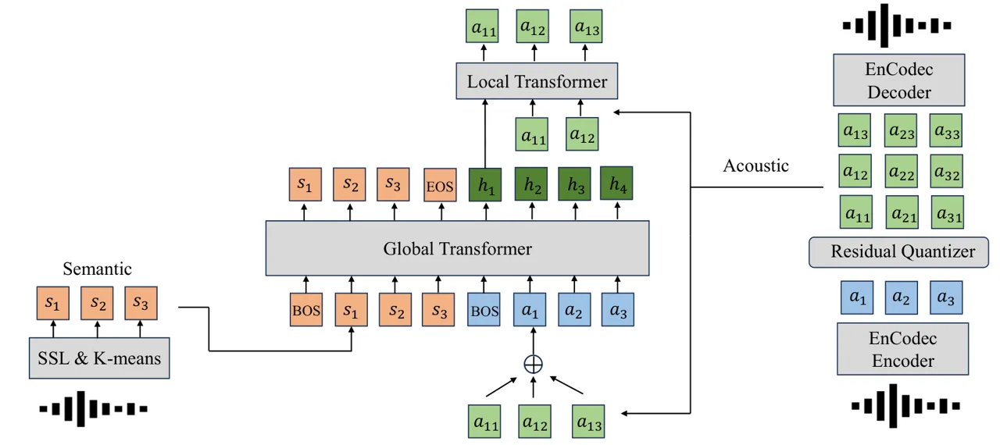
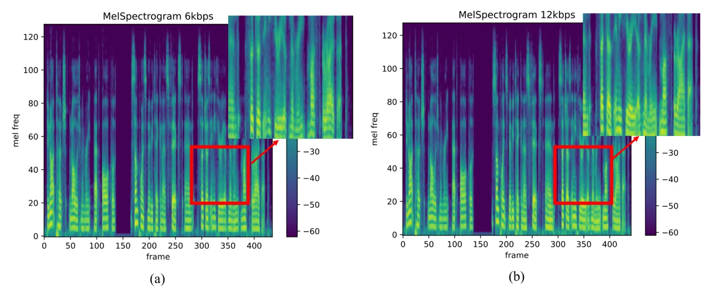

# Generative Pre-trained Speech Language Model with Efficient Hierarchical Transformer

Yongxin Zhu ^(†)^(†)thanks: Work done during an internship at Tencent AI
Lab. Affiliation: School of Data Science, University of Science and
Technology of China Affiliation: State Key Laboratory of Cognitive
Intelligence Affiliation: Tencent AI Lab
Email: <zyx2016@mail.ustc.edu.cn>    Dan Su Affiliation: Tencent AI Lab
Email: <linlixu@ustc.edu.cn>    Liqiang He Affiliation: Tencent AI Lab
Email: [dansu@tencent.com](mailto:)    Linli Xu ^(†)^(†)thanks:
Corresponding author. Affiliation: School of Computer Science and
Technology, University of Science and Technology of China
Affiliation: State Key Laboratory of Cognitive Intelligence
Email: [andylqhe@tencent.com](mailto:)    Dong Yu Affiliation: Tencent
AI Lab Email: [dyu@tencent.com](mailto:)

###### Abstract

While recent advancements in speech language models have achieved
significant progress, they face remarkable challenges in modeling the
long acoustic sequences of neural audio codecs. In this paper, we
introduce Generative Pre-trained Speech Transformer (GPST), a
hierarchical transformer designed for efficient speech language
modeling. GPST quantizes audio waveforms into two distinct types of
discrete speech representations and integrates them within a
hierarchical transformer architecture, allowing for a unified one-stage
generation process and enhancing Hi-Res audio generation capabilities.
By training on large corpora of speeches in an end-to-end unsupervised
manner, GPST can generate syntactically consistent speech with diverse
speaker identities. Given a brief 3-second prompt, GPST can produce
natural and coherent personalized speech, demonstrating in-context
learning abilities. Moreover, our approach can be easily extended to
spoken cross-lingual speech generation by incorporating multi-lingual
semantic tokens and universal acoustic tokens. Experimental results
indicate that GPST significantly outperforms the existing speech
language models in terms of word error rate, speech quality, and speaker
similarity. The code is available at
[https://github.com/youngsheen/GPST](https://github.com/youngsheen/GPST).

## 1 Introduction

Speech quantization has emerged as a crucial technique for speech
language models to generate controllable, high-quality speech waveforms
(Borsos et al., 2023b; Lakhotia et al., 2021; Wang et al., 2023a; Kreuk
et al., 2023; Kharitonov et al., 2023; Borsos et al., 2023a).
Specifically, a speech waveform can be quantized into two distinct types
of discrete representations: semantic tokens (Lakhotia et al., 2021) and
acoustic tokens Défossez et al. (2022); Zeghidour et al. (2022).
Semantic tokens are typically obtained by applying the K-means
clustering algorithm to the continuous activation space of
self-supervised speech models (Hsu et al., 2021; Baevski et al., 2020).
Notably, GSLM (Lakhotia et al., 2021) finds that auto-regressive models
trained on semantic tokens can capture high-level linguistic content,
supporting language modeling and resynthesis (Polyak et al., 2021).
However, semantic tokens fail to retain acoustic details such as speaker
identity, resulting in suboptimal reconstruction. In contrast, acoustic
tokens generated by neural codec models (Zeghidour et al., 2022;
Défossez et al., 2022) effectively compress speech at low bitrates while
capturing the nuances of speech waveforms. Consequently, a speech
language model can maintain long-term consistency with semantic tokens
and produce high-quality synthesis with acoustic tokens.

However, neural codec models require an excessive number of codes for
high-quality speech synthesis. For example, EnCodec (Défossez et al., 2022) generates codec embeddings at $`75`$ Hz for audio waveforms at
$`24`$ kHz. Subsequently, these codec embeddings are modeled using
residual vector quantization (RVQ), wherein high-quality synthesis
typically requires eight or more hierarchical quantizers with $`1024`$
entries. Therefore, a mere $`10`$-second waveform results in at least
$`75\times 8\times 10=6000`$ codes, which constitutes an excessively
long sequence for language models due to the quadratic complexity with
respect to the sequence length for calculating self-attention (Vaswani
et al., 2017). Consequently, addressing the trade-off between the
perceptual quality and computational complexity remains a core challenge
for speech language models.

Recently, some methods have been proposed to address the issue of
lengthy acoustic sequences. Acoustic tokens inherently possess a
hierarchical structure because of residual vector quantization: tokens
from the preceding quantizers restore acoustic properties such as
speaker identity, while the subsequent quantizers capture finer acoustic
details. Each quantizer is trained to model the residuals from the
previous quantizers. Recent approaches (Borsos et al., 2023b; Wang
et al., 2023a; Kharitonov et al., 2023) treat the acoustic token
generation process as a multi-stage framework to avoid learning
excessively long sequences simultaneously.

In this work, we present Generative Pre-trained Speech Transformer
(GPST), a model that facilitates controllable, high-quality speech
generation in single stage. Our approach combines speech quantization
with the architecture of a hierarchical transformer (Lee et al., 2022b;
Yu et al., 2023). GPST initially models the semantic sequence with a
next token prediction task, followed by modeling the acoustic sequence
with the task of predicting the next $`D`$ stack codes. The semantic
sequence serves as a prompt for the acoustic token as a condition. We
design a specialized hierarchical architecture to model the underlying
hierarchical structure of the acoustic sequence, which comprises of a
large global transformer and a small local transformer. The global
transformer learns the high-level relationships between the semantic
tokens and the stacked acoustic tokens, while the local transformer
models the hierarchical details in the stacked acoustic codes. By
incorporating semantic and acoustic tokens within one hierarchical
transformer, GPST can significantly reduce computational costs and
effortlessly learn the long-term interactions of semantic tokens and
local dependencies among residual codes. Furthermore, we propose a
training technique called “local-drop” to further improve the training
efficiency of Hi-Res speech generation, which is typically impractical
in current speech language models because of a large number of residual
quantizers. Consequently, our model can generate high-quality and
semantically coherent speeches in one stage efficiently.

Our main contributions are summarized as follows.

- •
  We propose a novel generative pre-trained speech language model GPST
  that enables controllable, high-quality speech generation in a single
  stage. By integrating semantic tokens and acoustic tokens within a
  hierarchical transformer, GPST significantly reduces computational
  costs while efficiently learning the long-term interactions of
  semantic tokens and local dependencies among residual codes
  simultaneously.
- •
  We demonstrate GPST’s capacity not only to generate coherent speech
  unconditionally but also to generate speech while preserving the
  speaker’s identity with only a 3-second short prompt. Experimental
  results reveal its superiority over existing speech language models
  with only $`33\%`$ parameters.
- •
  To the best of our knowledge, GPST is the first work that supports
  spoken multilingual speech generation and Hi-Res speech synthesis.

## 2 Related Work

### 2.1 Discrete Speech Representation

Speech quantization has become a fundamental technique in speech
language modeling (Borsos et al., 2023b; Kreuk et al., 2023; Wang
et al., 2023a; Kharitonov et al., 2023). Typically, a speech waveform
can be quantized into two distinct types of discrete representations:
semantic tokens and acoustic tokens. Benefiting from the development of
self-supervised learning in the field of speech understanding, Textless
NLP (Lakhotia et al., 2021; Polyak et al., 2021) proposes to model
speech based on HuBERT codes (Hsu et al., 2021) or semantic tokens,
which are obtained by applying a K-means clustering algorithm on the
activation hidden space of HuBERT. Auto-regressive modeling of these
tokens (Lakhotia et al., 2021) can facilitate generating syntactically
and semantically plausible speech continuations. SeamlessM4T
(Communication et al., 2023) learns a spoken multi-lingual SSL model
XLSR (Babu et al., 2022) to build a multi-lingual semantic vocabulary
for speech translation. However, semantic tokens fail to synthesize the
acoustic details in speech such as the speaker’s identity. Neural audio
codecs (Zeghidour et al., 2022; Défossez et al., 2022) are proposed to
quantize speech into stacked codes with residual vector quantization
(RVQ) at low bitrates while preserving high-quality reconstruction.
These acoustic tokens can capture the details of audio waveforms as
diverse as multi-speaker speech (Borsos et al., 2023b),
music (Agostinelli et al., 2023) and audio effects (Kreuk et al., 2023).
In comparison, the proposed GPST integrates semantic tokens and acoustic
tokens within one model in a single stage, effectively unifying their
strengths.

### 2.2 Speech Language Models

Recently, speech language models have achieved remarkable progress in
generating controllable, high-quality speech waveforms. Among them,
AudioLM (Borsos et al., 2023b) introduces acoustic tokens into semantic
token modeling and proposes a multi-stage generative framework to model
semantic tokens, coarse acoustic tokens, and fine acoustic tokens
sequentially. SPEAR-TTS (Kharitonov et al., 2023) extends AudioLM to the
TTS task by training an additional text-to-semantic model. SoundStorm
(Borsos et al., 2023a) speeds up the generation process of AudioLM by
introducing confidence-based parallel decoding on acoustic tokens.
VALL-E (Wang et al., 2023a) proposes a multi-stage language model for
TTS with phonemes as input and acoustic tokens as output. VALL-E X
(Zhang et al., 2023b) extends VALL-E to cross-lingual TTS tasks based on
a text-based translation system. SpeechGPT (Zhang et al., 2023a)
conducts further pre-training and instruction tuning on a speech dataset
of semantic tokens, empowering text-based LLMs such as LLaMA (Touvron
et al., 2023) to handle cross-modal instruction recognition and speech
dialogues. PolyVoice Dong et al. (2024) proposes a speech language model
trained with text instructions for speech-to-speech translation. Viola
(Wang et al., 2023b) proposes a multi-task framework built upon VALL-E
to support multiple speech tasks. However, they are compelled to model
acoustic tokens in a multi-stage framework due to the high complexity of
learning long acoustic sequences. The proposed GPST circumvents this
limitation by proposing a hierarchical transformer architecture that
unifies semantic tokens and stacked hierarchical acoustic tokens within
one stage. Concurrently, a parallel work Yang et al. (2023) also
explores similar methods in their study.

## 3 Generative Pre-trained Speech Language Model (GPST)

In this section, we start with the formulation of speech language
modeling, along with the modeling challenges in speech generation. Next,
we elaborate on our proposed model GPST in detail, followed by an
efficient training technique for GPST to train Hi-Res speech model.
Additionally, we discuss various inference modes with in-context
learning.

### 3.1 Generative Speech Pre-training

Figure 1: The comparison of frameworks for generative speech
pre-training. (a) AudioLM is a three-stage model. (b) VALL-E is a
two-stage model. (c) GPST is a one-stage model.

Given an audio waveform sequence $`x\in R^{T}`$, we quantize it into the
sequence of semantic tokens
$`S=(s_{1},\dots,s_{T_{1}})\in\{1,\dots,N_{s}\}^{T_{1}}`$ and acoustic
tokens
$`A=(a^{1}_{1},\dots,a^{D}_{1},\dots,a^{D}_{T_{2}})\in\{1,\dots,N_{a}\}^{T_{2}\times D}`$,
with $`T_{1},T_{2}\ll T`$. The acoustic sequence is a two-dimensional
matrix and has a hierarchical structure such that $`a^{q}_{t}`$ is
derived from the residual of the previous token $`a^{q-1}_{t}`$. The
learning objective of the speech language model can be auto-regressively
factorized as

```math
\begin{split}&p(S,A)=p(S)p(A|S)\\
&=\prod^{T_{1}}_{t=1}p(s_{t}|s_{<t})\prod^{D,T_{2}}_{q,t=1}p(a^{q}_{t}|a^{\leq D}_{<t},a^{<q}_{t},S)\end{split} \tag{1}
```

A naive approach can unfold the acoustic sequence $`A`$ into a
one-dimensional sequence of length $`T_{2}\times D`$ in raster-scan
order and feed it to a transformer model. However, $`T_{2}\times D`$ is
typically a large number, and the transformer would suffer from the
quadratic cost of its self-attention mechanism.

AudioLM (Borsos et al., 2023b) adopts a three-stage approach for
modeling speech, as depicted in Figure 1(a). The first stage involves
auto-regressive pre-training on semantic tokens to capture the long-term
temporal structure. Next, the acoustic sequence, which is of size
$`T_{2}\times D`$, is divided into a coarse part of size
$`T_{2}\times D^{\prime}`$ and a fine part of size
$`T_{3}\times(D-D^{\prime})`$, where $`D^{\prime}`$ is typically much
smaller than $`D-D^{\prime}`$. The fine part is a small subset of the
coarse sequence to reduce the sequence length since
$`T_{2}\times(D-D^{\prime})`$ is still too large. AudioLM designs two
individual transformers to model the coarse and fine acoustic sequences
separately. The learning objective is approximately factorized as

```math
\begin{split}&p(S,A)=p(S)p(A|S)\\
&\approx\prod^{T_{1}}_{t=1}p(s_{t}|s_{<t};\theta_{S})\prod^{D^{\prime},T_{2}}_{q_{1},t=1}p(a^{q_{1}}_{t}|a^{\leq D^{\prime}}_{<t},a^{<q_{1}}_{t},S;\theta_{C})\\
&\prod^{D,T_{3}}_{q_{2}=D^{\prime}+1,t=1}p(a^{q_{2}}_{t}|a^{>D^{\prime}}_{<t},a^{<q_{2}}_{t},a^{\leq D^{\prime}}_{\leq T_{3}};\theta_{F})\end{split} \tag{2}
```

where $`q_{1}\leq D^{\prime}<q_{2}\leq D`$ and $`T_{3}<T_{2}`$. The fine
acoustic transformer only models a small subset of the coarse acoustic
tokens to reduce the sequence length. The learnable parameters
$`\theta_{S},\theta_{C},\theta_{F}`$ correspond to three independent
transformers respectively.

As shown in Figure 1(b), VALL-E (Wang et al., 2023a) uses phoneme
sequences derived from text with a G2P tool as the condition, rather
than semantic tokens. We slightly abuse the notation here since phonemes
serve a similar purpose with semantic tokens. VALL-E also divides the
acoustic token generation process into two stages, where the acoustic
tokens from the first quantizer layer are generated in an
auto-regressive manner while the subsequent acoustic tokens are
generated non-auto-regressively. Note that VALL-E can not generate
semantically coherent sequences unconditionally since it does not model
$`p(S)`$. The learning objective is approximately factorized as

```math
\begin{split}&p(A|S)=\prod^{D,T_{2}}_{q,t=1}p(a^{q}_{t}|a^{\leq D}_{<t},a^{<q}_{t},S)\approx\\
&\prod^{T_{2}}_{t=1}p(a^{1}_{t}|a^{1}_{<t},S;\theta_{AR})\prod^{D,T_{2}}_{q=2,t=1}p(a^{q}_{t}|a^{<q}_{\leq T_{2}},S;\theta_{NAR})\end{split} \tag{3}
```

where $`\theta_{AR},\theta_{NAR}`$ refer to different models
respectively.

The speech language models above are necessitated to split the acoustic
generation into a multi-stage process due to the considerable length of
acoustic sequences.

### 3.2 Efficient Hierarchical Transformer



Figure 2: An overview of the framework. The framework is composed of
three components: (1) The semantic token extractor with a speech SSL
model and K-means for speech discretization. (2) The acoustic token
extractor with the neural codec model for speech discretization. (3) The
proposed GPST model, which is composed of a global transformer and a
local transformer.

Considering the hierarchical structure underlying acoustic sequence, we
propose GPST, a hierarchical transformer architecture to effectively and
efficiently learn the codes extracted by EnCodec. As shown in Figure 2,
GPST is composed of (1) a semantic token extractor that integrates a
speech SSL encoder and a K-means clustering model (Communication et al.,
2023), as well as a neural codec model EnCodec (Défossez et al., 2022),
(2) a large global transformer that contextualizes representations by
applying causal attention over previous semantic tokens and stacked
acoustic tokens, and (3) a smaller local transformer that takes a
contextualized hidden state from the global model, and auto-regressively
predicts subsequent acoustic codes. We adopt the setting of a large
global module with a small local module to simulate potential
applications that use LLMs as the global module, which we leave for
future work. The learning objective is exactly factorized as

```math
\begin{split}&p(S,A)=p(S)p(A|S)=\prod^{T_{1}}_{t=1}p(s_{t}|s_{<t};\theta_{global})\\
&\prod^{D,T_{2}}_{q,t=1}p(a^{q}_{t}|a^{\leq D}_{<t},a^{<q}_{t},S;\theta_{global},\theta_{local})\end{split} \tag{4}
```

The end-to-end learning process is within one model in one stage, which
mitigates the error propagation issues that can arise in a multi-stage
formulation.

Global Transformer. The global transformer is an $`N_{g}`$ layer
decoder-only transformer with a causal mask. It has two types of tokens
concatenated into a single sequence as input. The first type comprises
semantic tokens, which can capture long-term consistency. The second
type is the sum of the acoustic tokens obtained by RVQ

```math
\begin{split}&E(s_{t})=E_{s}(s_{t})+\text{PE}_{g}(t),\text{for }1\leq t\leq T_{1}\\
&E(a_{t})=\sum^{D}_{q=1}E_{a}(a^{q}_{t})+\text{PE}_{g}(t+T_{1}),\text{for }1\leq t\leq T_{2}\\
&h_{t}=\text{GlobalTransformer}(s_{1},\dots,s_{T_{1}},a_{1},\dots,a_{T_{2}}),\\
&1\leq t\leq T_{1}+T_{2}\end{split} \tag{5}
```

where $`E_{s}`$ and $`E_{a}`$ are embedding functions for semantic and
acoustic tokens respectively. $`\text{PE}_{g}`$ is a positional
embedding for the global transformer. We add special tokens at the first
position and the segment boundary of the sequence to inform the model to
switch the generation space.

Local Transformer. The local transformer consists of $`N_{l}`$ layers.
Given the contextualized hidden states $`h_{t}`$ from the global
transformer, the local transformer auto-regressively predicts $`D`$
acoustic codes $`a^{1}_{t},\dots,a^{D}_{t}`$ at position $`t`$

```math
\begin{split}&E(a^{q}_{t})=E_{a}(a^{q}_{t})+\text{PE}_{l}(q),1\leq q\leq D\\
&a_{t}=\text{LocalTransformer}(h_{t},a^{1}_{t},\dots,a^{D}_{t})\end{split} \tag{6}
```

where $`\text{PE}_{l}`$ is a positional embedding for the local
transformer, which is shared across position $`t`$. GPST is trained to
minimize the negative log-likelihood:

```math
\begin{split}&\mathcal{L}=\sum^{T_{1}}_{t=1}-\log p(s_{t}|s_{<t};\theta_{global})\\
&-\sum^{T_{2}}_{t=1}\sum^{D}_{q=1}\log p(a^{q}_{t}|a^{<q}_{t},S;\theta_{global},\theta_{local})\end{split} \tag{7}
```

Local-drop. The number of residual quantizers increases when generating
Hi-Res speech, which would cause high computational complexity. We
propose a technique named local-drop to improve the training efficiency
of GPST further. Since the local transformer only models individual
stacks of acoustic tokens, it has an input shape of
$`(\text{Batch}\times T_{2},D)`$. The dimension of acoustic sequence
length $`T_{2}`$ is unfolded to the first batch dimension, which means
the stack of codes is not attended by self-attention. We randomly drop
some tokens $`a^{\leq D}_{t}`$ to decrease the size of the first
dimension.

### 3.3 Inference

Speech language models can generate semantically coherent speech for
unseen speakers with in-context learning, which is an emerging
capability of auto-regressive pre-trained language models like
GPT (Brown et al., 2020) for zero-shot learning. Suppose we have the
semantic tokens $`S_{p}`$ and the acoustic tokens $`A_{p}`$ from the
prompt, the semantic tokens $`S_{t}`$ and the acoustic tokens $`A_{t}`$
from the target. Based on the usage of the prompt, we can categorize the
generation mode into four cases.

Unconditional Generation. In this setting, we unconditionally generate
the semantic tokens, which are subsequently used as the prefix for
acoustic generation. The randomly sampled semantic sequence can generate
diverse, syntactically and semantically consistent linguistic content.
The acoustic tokens vary in speaker identity with the semantic content
serving as a guideline. We provide some transcription cases in Appendix
A.1.

Semantic to Acoustic. In this setting, we use the ground-truth semantic
tokens $`S_{t}`$ as a condition for acoustic generation, which is
similar to the task of TTS. The generated speech preserves the content
of the spoken sentence while varying in speaker identity. We also follow
SPEAR-TTS (Kharitonov et al., 2023) and train a toy decoder-only
transformer named GPST-TTS on the LibriSpeech 960h dataset to generate
semantic tokens with text as a condition, supporting the TTS task.

Speaker Identity Transfer. In this setting, we are interested in the
task of voice conversion that transfers the speaker identity of the
prompt speech into the target speech. The sequence input to the model is
concatenated in the following order $`[S_{p},S_{t},A_{p}]`$. GPST is
encouraged to generate subsequent acoustic tokens that share the speaker
identity with $`A_{p}`$ while remaining consistent with the content of
$`S_{t}`$. We find that directly concatenating linguistically
inconsistent $`S_{p}`$ and $`S_{t}`$ together would cause unstable
generation around the interface boundary. To address this issue, we
propose artificially inserting a very short silence excerpt ($`0.1`$
second) between $`S_{p}`$ and $`S_{t}`$ to explicitly break the
linguistic continuation. In this way, the model would not struggle to
mitigate the discontinuity of $`S_{p}`$ and $`S_{t}`$ and can generate
stable speeches.

Acoustic Continuations. Different from the speaker identity transfer
mode, where the prompt and target are from different utterances, the
prompt of the acoustic continuations mode is the first 3 seconds of the
target. The model is asked to generate the acoustic continuation after 3
seconds.

### 3.4 Spoken Multilingual Learning

We adopt the multi-lingual XLSR encoder from SeamlessM4T (Communication
et al., 2023) as the semantic token extractor. The semantic vocabulary
of SeamlessM4T naturally supports the multi-lingual speech
representation. For acoustic tokens, we adopt the pre-trained neural
audio codec model EnCodec (Défossez et al., 2022) as the acoustic token
extractor. Although EnCodec is trained on the English data, we find that
it can synthesize other languages as well. We take it as the universal
acoustic extractor.

### 3.5 Efficiency Analysis

Transformer (Vaswani et al., 2017) is criticized for the quadratic
complexity with respect to sequence lengths during self-attention
calculations. Considering an acoustic matrix $`A`$ of size
$`T_{2}\times D`$, the naive approach of unfolding it into a
one-dimensional sequence like AudioLM would result in a computational
complexity of $`O(NT_{2}^{2}D^{2})`$, where $`N`$ is the number of
transformer layers. In contrast, GPST has $`N_{g}`$ global layers and
$`N_{l}`$ local layers, with the global transformer dealing with a
sequence length of $`T_{2}`$ and the local transformer with a sequence
length of $`D`$. Suppose $`N=N_{g}+N_{l}`$ for simplicity. The overall
computational complexity for GPST is
$`O(N_{g}T_{2}^{2}+N_{l}T_{2}D^{2})`$, which is smaller than
$`O(NT_{2}^{2}D^{2})`$. Furthermore, self-attention is not the primary
computational cost factor in large transformers. The embedding size and
the dimension of the feedforward network dominate the model’s overall
computational cost (Kaplan et al., 2020). A forward pass with a large
transformer with $`m`$ non-embedding parameters on a sequence of length
$`T_{2}`$ uses roughly $`2mT_{2}`$ FLOPS. Therefore, for GPST with a
global dimension $`m_{g}`$ and a local dimension $`m_{l}`$, the required
FLOPS is $`2T_{2}(m_{g}+m_{l}D)`$. Since $`m_{l}`$ is typically much
smaller than $`m_{g}`$, the FLOPS for GPST is approximately
$`2T_{2}m_{g}`$, which is $`D`$ times faster than the standard
transformer with $`2T_{2}Dm_{g}`$ FLOPS.

## 4 Experiments

### 4.1 Experiment Setup

#### 4.1.1 Datasets

|                                     |                    |                  |          |           |
| ----------------------------------- | ------------------ | ---------------- | -------- | --------- |
| Model                               | WER $`\downarrow`$ | SPK $`\uparrow`$ | \# codec | \# params |
| GroundTruth                         | 2.2                | 0.754            | \-       | \-        |
| Semantic to Acoustic                |                    |                  |          |           |
| GSLM (Lakhotia et al., 2021)        | 12.4               | \-               | \-       | \-        |
| AudioLM^(⋆) (Borsos et al., 2023b)  | 6.0                | \-               | 12       | 300M+300M |
| GPST-TTS (ours)                     | 4.3                | \-               | 8        | 182M+190M |
| GPST (ours)                         | 4.0                | \-               | 8        | 190M      |
| GPST-Hi-Res (ours)                  | 6.4                | \-               | 16       | 207M      |
| Speaker Identity Transfer           |                    |                  |          |           |
| YourTTS (Casanova et al., 2022)     | 7.7                | 0.337            | \-       | \-        |
| AudioLM (Borsos et al., 2023b)      | \-                 | 0.460            | 12       | 300M+300M |
| SPEAR-TTS (Kharitonov et al., 2023) | \-                 | 0.560            | 3        | 97M       |
| VALL-E (Wang et al., 2023a)         | 5.9                | 0.580            | 8        | 165M+172M |
| GPST (ours)                         | 4.2                | 0.605            | 8        | 190M      |
| GPST-Hi-Res (ours)                  | 5.3                | 0.587            | 16       | 207M      |
| Acoustic Continuations              |                    |                  |          |           |
| VALL-E (Wang et al., 2023a)         | 3.8                | 0.508            | 8        | 165M+172M |
| GPST (ours)                         | 2.8                | 0.536            | 8        | 190M      |
| GPST-Hi-Res (ours)                  | 3.5                | 0.529            | 16       | 207M      |

Table 1: Evaluation results of speech generation on LibriSpeech
test-clean dataset. ^(⋆) denotes the WER result of AudioLM obtained by a
Conformer Transducer model, while others are obtained by HuBERT-Large
finetuned on LibriSpeech 960h. AudioLM and SpearTTS use the neural codec
model SoundStream (Zeghidour et al., 2022) while VALL-E and GPST use
Encodec (Défossez et al., 2022).

We follow Borsos et al. (2023b) and use LibriLight (Kahn et al., 2020)
as the training data which contains 60K hours of unlabelled speech in
English. We randomly crop 10 seconds out of each audio clip for
training. We choose LibriSpeech test-clean dataset (Panayotov et al., 2015) for evaluation since there is no speaker overlap with LibriLight.
Following Borsos et al. (2023b); Wang et al. (2023a), we select samples
with lengths between 4 and 10 seconds as the test dataset. For the
multi-lingual task, we test in a bi-lingual setting with the tone
language Chinese and non-tone language English for simplicity. We choose
LibriSpeech 960h as the English training data and Aishell-2 1000h (Du
et al., 2018) as the Chinese training data, both of which share similar
sizes. We also test a larger bitrate setting for GPST-Hi-Res with 16
quantizers, which is not applicable to other baselines. All experiments
are conducted three times and the average scores are reported. We
describe the implementation details in Appendix A.2.

#### 4.1.2 Baselines

We choose speech language models GSLM (Lakhotia et al., 2021), AudioLM
(Borsos et al., 2023b) and VALL-E Wang et al. (2023a) as baselines,
together with YourTTS (Casanova et al., 2022) as the TTS baseline. We
notice that SoundStorm (Borsos et al., 2023a) improves the multi-stage
acoustic generation. However, SoundStorm takes duplicate semantic tokens
as the condition, which is an inappropriate setting for other baselines
since all the other models remove the consecutive repetitions, and
duplicate semantic tokens would reduce the difficulty of acoustic
generation. Also, duplicate semantic tokens would cause failures in the
generation of semantic tokens (Lakhotia et al., 2021) that limits the
application in speech generation Kharitonov et al. (2023) and
resynthesis for speech translation system (Lee et al., 2022a).
Therefore, we do not take SoundStorm for comparison here.

#### 4.1.3 Evaluation Metrics

The synthesized speech should align with the semantic input and match
the voice of the prompt. Therefore, we are interested in the following
metrics for speech language models: (1) word error rate (WER), (2)
speaker similarity (SPK), and (3) speech quality (DNSMOS). We employ the
HuBERT-Large (Hsu et al., 2021) model as the ASR model for English to
calculate WER and Wav2Vec2-XLSR-53 (Baevski et al., 2020) for Chinese to
calculate CER. We take the publicly available speaker verification model
WavLM-TDNN (Chen et al., 2022) to evaluate the speaker similarity
between the prompt and the synthesized speech. We use the MOS estimator
DNSMOS (Reddy et al., 2021) to estimate the perceived audio quality of
the generated samples. We compare DNSMOS with the examples provided on
VALL-E’s demo page for fairness. The subjective evaluation MOS is not
applicable due to other models are not open-sourced. Appendix A.3 lists
all the evaluation tools.

### 4.2 Results and Analysis

| Model       | DNSMOS $`\uparrow`$ |
| ----------- | ------------------- |
| SPEAR-TTS   | 3.68                |
| VALL-E      | 3.87                |
| GPST        | 3.89                |
| GPST-Hi-Res | 4.02                |

Table 2: The DNSMOS scores of speech quality in speaker identity
transfer.



Figure 3: The comparison of mel-spectrograms generated by GPST with (a)
6kbps and (b) 12kbps (Hi-Res). The harmonic energy in the high-frequency
of 12kbps is richer.

|                                  |         |       |
| -------------------------------- | ------- | ----- |
|                                  | WER/CER | SPK   |
| Zh-GroundTruth                   | 26.4    | 0.453 |
| En                               | 4.1     | 0.501 |
| Zh                               | 30.2    | 0.430 |
| Zero-Shot Cross-Lingual Transfer |         |       |
| Zh                               | 33.3    | 0.417 |

Table 3: Evaluation on multi-lingual datasets. We use WER for En and CER
for Zh.

| $`N_{g}+N_{l}`$ | WER$`\downarrow`$ | SPK$`\uparrow`$ | Sentences/s$`\uparrow`$ | \#params |
| --------------- | ----------------- | --------------- | ----------------------- | -------- |
| 11 + 4          | 3.2               | 0.531           | 2.31                    | 190M     |
| 10 + 8          | 3.1               | 0.532           | 1.89                    | 190M     |
| 9 + 12          | 2.8               | 0.536           | 1.57                    | 190M     |

Table 4: Ablation study of the model architecture. The model is tested
in Acoustic Continuations inference mode.

LibriSpeech Evaluation. Table 1 and Table 2 summarize the results of
different inference modes. Compared to the baseline models, GPST
achieves the best results in terms of WER, SPK, and DNSMOS. In the
semantic to acoustic mode, GPST reaches the lowest WER score with only
$`33\%`$ parameters of AudioLM. The quality of semantic tokens is
constrained due to the use of a toy model for text-to-semantic
generation, resulting in a minor performance drop of GPST-TTS. We expect
that more training data would further improve the TTS performance. We
also notice a performance drop in GPST-Hi-Res, which indicates that
Hi-Res speech generation, with more quantizers, is still a tough task.
In the speaker identity transfer mode, GPST achieves the best scores in
all the metrics, validating that GPST can better transfer the speaker
identity while maintaining the spoken content. It is worth noting that
GPST-Hi-Res gets better DNSMOS than GPST, largely because more
quantizers can preserve more acoustic details.

Multilingual Evaluation. Table 3 shows the results of GPST on
multi-lingual datasets. Although trained on a small dataset, GPST
demonstrates its generalization ability in multi-lingual settings. Since
the Aishell-2 Chinese dataset is noisy, the CER score is bad even for
GroundTruth. However, GPST can still achieve a score close to the
GroundTruth, which proves the robustness of the model. We also design a
Zero-Shot Cross-Lingual Transfer for Multi-lingual settings. We adopt
the model trained on English LibriLight only, while inference is
conducted on Chinese Aishell-2 with Acoustic Continuation mode without
any further training. GPST shows the performance close to the model
especially trained on Chinese Aishell-2, which demonstrates GSPT’s
support for spoken multi-lingual tasks.

Effect of Model Architecture Settings. We conduct an ablation study on
the number of layers for the global and local transformer. To match the
parameters of every stage in AudioLM, which consists of a global
transformer with $`12`$ layers, we adjust the total parameters of the
global transformer and local transformer in GSPT to be approximately
equal. Since the parameters of one global transformer layer equals four
local transformer layers, we adopt the setting of
$`(12-x)\times N_{g}+4\times x\times N_{l}`$. Table 4 shows that
increasing the layer number of the local transformer helps GPST learn
acoustic tokens better, further improving the performance of acoustic
generation. However, the generation speed is slowed down a little bit as
we increase local transformer layers.

On the Hi-Res Quality. We plot the mel-spectrograms of the same speech
generated by GPST with 6kbps (8 quantizers) and 12kbps (16 quantizers)
respectively in Figure 3. Generally, richer harmonic energy in the
high-frequency regions indicates higher speech quality. As observed, the
speech generated by GPST with more quantizers exhibits more details in
the mel-spectrogram.

## 5 Conclusion

We introduce GPST, a generative pre-trained speech language model that
integrates semantic tokens and acoustic tokens within a hierarchical
transformer architecture, allowing for a unified one-stage generation
process. GPST demonstrates its capability to generate coherent speech
and speaker identity transfer with in-context learning. Furthermore, we
show that GPST can generate Hi-Res speech and spoken multi-lingual
speech as well.

## 6 Limitations

Our proposed GPST exhibits remarkable capabilities in the speech
generation task, which is challenging for a single model. However, the
GPST model cannot directly synthesize speeches with text input. Some
models Kharitonov et al. (2023) have proposed the techniques to enhance
the text to semantic token generation model.

## 7 Ethics Statement

GPST may present new risks, such as the potential for malicious actors
to impersonate public figures or commit fraud. To mitigate such risks,
it is possible to watermark the generated speech that is invisible to
humans but algorithmically detectable.

## Acknowledgements

This research was supported by the National Key Research and Development
Program of China (Grant No. 2022YFB3103100), the National Natural
Science Foundation of China (Grant No. 62276245).

## References

- Agostinelli et al. (2023) Andrea Agostinelli, Timo I. Denk, Zalán
  Borsos, Jesse H. Engel, Mauro Verzetti, Antoine Caillon, Qingqing
  Huang, Aren Jansen, Adam Roberts, Marco Tagliasacchi, Matthew Sharifi,
  Neil Zeghidour, and Christian Havnø Frank. 2023. [Musiclm: Generating
  music from text](https://doi.org/10.48550/ARXIV.2301.11325). _CoRR_,
  abs/2301.11325.
- Babu et al. (2022) Arun Babu, Changhan Wang, Andros Tjandra, Kushal
  Lakhotia, Qiantong Xu, Naman Goyal, Kritika Singh, Patrick von Platen,
  Yatharth Saraf, Juan Pino, Alexei Baevski, Alexis Conneau, and Michael
  Auli. 2022. [XLS-R: self-supervised cross-lingual speech
  representation learning at
  scale](https://doi.org/10.21437/INTERSPEECH.2022-143). In _Interspeech
  2022, 23rd Annual Conference of the International Speech Communication
  Association, Incheon, Korea, 18-22 September 2022_, pages 2278–2282.
  ISCA.
- Baevski et al. (2020) Alexei Baevski, Yuhao Zhou, Abdelrahman Mohamed,
  and Michael Auli. 2020. [wav2vec 2.0: A framework for self-supervised
  learning of speech
  representations](https://proceedings.neurips.cc/paper/2020/hash/92d1e1eb1cd6f9fba3227870bb6d7f07-Abstract.html).
  In _Advances in Neural Information Processing Systems 33: Annual
  Conference on Neural Information Processing Systems 2020, NeurIPS
  2020, December 6-12, 2020, virtual_.
- Borsos et al. (2023a) Zalán Borsos, Matthew Sharifi, Damien Vincent,
  Eugene Kharitonov, Neil Zeghidour, and Marco Tagliasacchi. 2023a.
  [Soundstorm: Efficient parallel audio
  generation](https://doi.org/10.48550/ARXIV.2305.09636). _CoRR_,
  abs/2305.09636.
- Borsos et al. (2023b) Zalán Borsos, Raphaël Marinier, Damien Vincent,
  Eugene Kharitonov, Olivier Pietquin, Matt Sharifi, Dominik Roblek,
  Olivier Teboul, David Grangier, Marco Tagliasacchi, and Neil
  Zeghidour. 2023b. [Audiolm: A language modeling approach to audio
  generation](https://doi.org/10.1109/TASLP.2023.3288409). _IEEE/ACM
  Transactions on Audio, Speech, and Language Processing_, 31:2523–2533.
- Brown et al. (2020) Tom B. Brown, Benjamin Mann, Nick Ryder, Melanie
  Subbiah, Jared Kaplan, Prafulla Dhariwal, Arvind Neelakantan, Pranav
  Shyam, Girish Sastry, Amanda Askell, Sandhini Agarwal, Ariel
  Herbert-Voss, Gretchen Krueger, Tom Henighan, Rewon Child, Aditya
  Ramesh, Daniel M. Ziegler, Jeffrey Wu, Clemens Winter, Christopher
  Hesse, Mark Chen, Eric Sigler, Mateusz Litwin, Scott Gray, Benjamin
  Chess, Jack Clark, Christopher Berner, Sam McCandlish, Alec Radford,
  Ilya Sutskever, and Dario Amodei. 2020. [Language models are few-shot
  learners](https://proceedings.neurips.cc/paper/2020/hash/1457c0d6bfcb4967418bfb8ac142f64a-Abstract.html).
  In _Advances in Neural Information Processing Systems 33: Annual
  Conference on Neural Information Processing Systems 2020, NeurIPS
  2020, December 6-12, 2020, virtual_.
- Casanova et al. (2022) Edresson Casanova, Julian Weber, Christopher D
  Shulby, Arnaldo Candido Junior, Eren Gölge, and Moacir A Ponti. 2022.
  [YourTTS: Towards zero-shot multi-speaker TTS and zero-shot voice
  conversion for
  everyone](https://proceedings.mlr.press/v162/casanova22a.html). In
  _Proceedings of the 39th International Conference on Machine
  Learning_, volume 162 of _Proceedings of Machine Learning Research_,
  pages 2709–2720. PMLR.
- Chen et al. (2022) Sanyuan Chen, Chengyi Wang, Zhengyang Chen, Yu Wu,
  Shujie Liu, Zhuo Chen, Jinyu Li, Naoyuki Kanda, Takuya Yoshioka, Xiong
  Xiao, Jian Wu, Long Zhou, Shuo Ren, Yanmin Qian, Yao Qian, Jian Wu,
  Michael Zeng, Xiangzhan Yu, and Furu Wei. 2022. [Wavlm: Large-scale
  self-supervised pre-training for full stack speech
  processing](https://doi.org/10.1109/JSTSP.2022.3188113). _IEEE Journal
  of Selected Topics in Signal Processing_, 16(6):1505–1518.
- Communication et al. (2023) Seamless Communication, Loïc Barrault,
  Yu-An Chung, Mariano Coria Meglioli, David Dale, Ning Dong,
  Paul-Ambroise Duquenne, Hady Elsahar, Hongyu Gong, Kevin Heffernan,
  John Hoffman, Christopher Klaiber, Pengwei Li, Daniel Licht, Jean
  Maillard, Alice Rakotoarison, Kaushik Ram Sadagopan, Guillaume Wenzek,
  Ethan Ye, Bapi Akula, Peng-Jen Chen, Naji El Hachem, Brian Ellis,
  Gabriel Mejia Gonzalez, Justin Haaheim, Prangthip Hansanti, Russ
  Howes, Bernie Huang, Min-Jae Hwang, Hirofumi Inaguma, Somya Jain,
  Elahe Kalbassi, Amanda Kallet, Ilia Kulikov, Janice Lam, Daniel Li,
  Xutai Ma, Ruslan Mavlyutov, Benjamin Peloquin, Mohamed Ramadan,
  Abinesh Ramakrishnan, Anna Y. Sun, Kevin Tran, Tuan Tran, Igor
  Tufanov, Vish Vogeti, Carleigh Wood, Yilin Yang, Bokai Yu, Pierre
  Andrews, Can Balioglu, Marta R. Costa-jussà, Onur Celebi, Maha
  Elbayad, Cynthia Gao, Francisco Guzmán, Justine Kao, Ann Lee,
  Alexandre Mourachko, Juan Pino, Sravya Popuri, Christophe Ropers,
  Safiyyah Saleem, Holger Schwenk, Paden Tomasello, Changhan Wang, Jeff
  Wang, and Skyler Wang. 2023. [Seamlessm4t-massively multilingual &
  multimodal machine
  translation](https://doi.org/10.48550/ARXIV.2308.11596). _CoRR_,
  abs/2308.11596.
- Défossez et al. (2022) Alexandre Défossez, Jade Copet, Gabriel
  Synnaeve, and Yossi Adi. 2022. [High fidelity neural audio
  compression](https://doi.org/10.48550/ARXIV.2210.13438). _CoRR_,
  abs/2210.13438.
- Dong et al. (2024) Qianqian Dong, Zhiying Huang, Qiao Tian, Chen Xu,
  Tom Ko, Yunlong zhao, Siyuan Feng, Tang Li, Kexin Wang, Xuxin Cheng,
  Fengpeng Yue, Ye Bai, Xi Chen, Lu Lu, Zejun Ma, Yuping Wang, Mingxuan
  Wang, and Yuxuan Wang. 2024. [Polyvoice: Language models for speech to
  speech translation](https://openreview.net/forum?id=hCrFG9cyuC). In
  _The Twelfth International Conference on Learning Representations_.
- Du et al. (2018) Jiayu Du, Xingyu Na, Xuechen Liu, and Hui Bu. 2018.
  [AISHELL-2: transforming mandarin ASR research into industrial
  scale](http://arxiv.org/abs/1808.10583). _CoRR_, abs/1808.10583.
- Hsu et al. (2021) Wei-Ning Hsu, Benjamin Bolte, Yao-Hung Hubert Tsai,
  Kushal Lakhotia, Ruslan Salakhutdinov, and Abdelrahman Mohamed. 2021.
  [Hubert: Self-supervised speech representation learning by masked
  prediction of hidden
  units](https://doi.org/10.1109/TASLP.2021.3122291). _IEEE ACM Trans.
  Audio Speech Lang. Process._, 29:3451–3460.
- Kahn et al. (2020) Jacob Kahn, Morgane Rivière, Weiyi Zheng, Evgeny
  Kharitonov, Qiantong Xu, Pierre-Emmanuel Mazaré, Julien Karadayi,
  Vitaliy Liptchinsky, Ronan Collobert, Christian Fuegen, Tatiana
  Likhomanenko, Gabriel Synnaeve, Armand Joulin, Abdelrahman Mohamed,
  and Emmanuel Dupoux. 2020. [Libri-light: A benchmark for ASR with
  limited or no
  supervision](https://doi.org/10.1109/ICASSP40776.2020.9052942). In
  _2020 IEEE International Conference on Acoustics, Speech and Signal
  Processing, ICASSP 2020, Barcelona, Spain, May 4-8, 2020_, pages
  7669–7673. IEEE.
- Kaplan et al. (2020) Jared Kaplan, Sam McCandlish, Tom Henighan,
  Tom B. Brown, Benjamin Chess, Rewon Child, Scott Gray, Alec Radford,
  Jeffrey Wu, and Dario Amodei. 2020. [Scaling laws for neural language
  models](http://arxiv.org/abs/2001.08361). _CoRR_, abs/2001.08361.
- Kharitonov et al. (2023) Eugene Kharitonov, Damien Vincent, Zalán
  Borsos, Raphaël Marinier, Sertan Girgin, Olivier Pietquin, Matt
  Sharifi, Marco Tagliasacchi, and Neil Zeghidour. 2023. [Speak, Read
  and Prompt: High-Fidelity Text-to-Speech with Minimal
  Supervision](https://doi.org/10.1162/tacl_a_00618). _Transactions of
  the Association for Computational Linguistics_, 11:1703–1718.
- Kreuk et al. (2023) Felix Kreuk, Gabriel Synnaeve, Adam Polyak, Uriel
  Singer, Alexandre Défossez, Jade Copet, Devi Parikh, Yaniv Taigman,
  and Yossi Adi. 2023. [Audiogen: Textually guided audio
  generation](https://openreview.net/pdf?id=CYK7RfcOzQ4). In _The
  Eleventh International Conference on Learning Representations, ICLR
  2023, Kigali, Rwanda, May 1-5, 2023_. OpenReview.net.
- Lakhotia et al. (2021) Kushal Lakhotia, Eugene Kharitonov, Wei-Ning
  Hsu, Yossi Adi, Adam Polyak, Benjamin Bolte, Tu-Anh Nguyen, Jade
  Copet, Alexei Baevski, Abdelrahman Mohamed, and Emmanuel Dupoux. 2021.
  [On generative spoken language modeling from raw
  audio](https://doi.org/10.1162/tacl_a_00430). _Transactions of the
  Association for Computational Linguistics_, 9:1336–1354.
- Lee et al. (2022a) Ann Lee, Peng-Jen Chen, Changhan Wang, Jiatao Gu,
  Sravya Popuri, Xutai Ma, Adam Polyak, Yossi Adi, Qing He, Yun Tang,
  Juan Pino, and Wei-Ning Hsu. 2022a. [Direct speech-to-speech
  translation with discrete
  units](https://doi.org/10.18653/v1/2022.acl-long.235). In _Proceedings
  of the 60th Annual Meeting of the Association for Computational
  Linguistics (Volume 1: Long Papers)_, pages 3327–3339, Dublin,
  Ireland. Association for Computational Linguistics.
- Lee et al. (2022b) Doyup Lee, Chiheon Kim, Saehoon Kim, Minsu Cho, and
  Wook-Shin Han. 2022b. [Autoregressive image generation using residual
  quantization](https://doi.org/10.1109/CVPR52688.2022.01123). In
  _IEEE/CVF Conference on Computer Vision and Pattern Recognition, CVPR
  2022, New Orleans, LA, USA, June 18-24, 2022_, pages 11513–11522.
  IEEE.
- Ott et al. (2019) Myle Ott, Sergey Edunov, Alexei Baevski, Angela Fan,
  Sam Gross, Nathan Ng, David Grangier, and Michael Auli. 2019.
  [fairseq: A fast, extensible toolkit for sequence
  modeling](https://doi.org/10.18653/v1/N19-4009). In _Proceedings of
  the 2019 Conference of the North American Chapter of the Association
  for Computational Linguistics (Demonstrations)_, pages 48–53,
  Minneapolis, Minnesota. Association for Computational Linguistics.
- Panayotov et al. (2015) Vassil Panayotov, Guoguo Chen, Daniel Povey,
  and Sanjeev Khudanpur. 2015. [Librispeech: An ASR corpus based on
  public domain audio
  books](https://doi.org/10.1109/ICASSP.2015.7178964). In _2015 IEEE
  International Conference on Acoustics, Speech and Signal Processing,
  ICASSP 2015, South Brisbane, Queensland, Australia, April 19-24,
  2015_, pages 5206–5210. IEEE.
- Polyak et al. (2021) Adam Polyak, Yossi Adi, Jade Copet, Eugene
  Kharitonov, Kushal Lakhotia, Wei-Ning Hsu, Abdelrahman Mohamed, and
  Emmanuel Dupoux. 2021. [Speech resynthesis from discrete disentangled
  self-supervised
  representations](https://doi.org/10.21437/INTERSPEECH.2021-475). In
  _Interspeech 2021, 22nd Annual Conference of the International Speech
  Communication Association, Brno, Czechia, 30 August - 3 September
  2021_, pages 3615–3619. ISCA.
- Reddy et al. (2021) Chandan K. A. Reddy, Vishak Gopal, and Ross
  Cutler. 2021. [Dnsmos: A non-intrusive perceptual objective speech
  quality metric to evaluate noise
  suppressors](https://doi.org/10.1109/ICASSP39728.2021.9414878). In
  _IEEE International Conference on Acoustics, Speech and Signal
  Processing, ICASSP 2021, Toronto, ON, Canada, June 6-11, 2021_, pages
  6493–6497. IEEE.
- Touvron et al. (2023) Hugo Touvron, Thibaut Lavril, Gautier Izacard,
  Xavier Martinet, Marie-Anne Lachaux, Timothée Lacroix, Baptiste
  Rozière, Naman Goyal, Eric Hambro, Faisal Azhar, Aurélien Rodriguez,
  Armand Joulin, Edouard Grave, and Guillaume Lample. 2023. [Llama: Open
  and efficient foundation language
  models](https://doi.org/10.48550/ARXIV.2302.13971). _CoRR_,
  abs/2302.13971.
- Vaswani et al. (2017) Ashish Vaswani, Noam Shazeer, Niki Parmar, Jakob
  Uszkoreit, Llion Jones, Aidan N. Gomez, Lukasz Kaiser, and Illia
  Polosukhin. 2017. [Attention is all you
  need](https://proceedings.neurips.cc/paper/2017/hash/3f5ee243547dee91fbd053c1c4a845aa-Abstract.html).
  In _Advances in Neural Information Processing Systems 30: Annual
  Conference on Neural Information Processing Systems 2017, December
  4-9, 2017, Long Beach, CA, USA_, pages 5998–6008.
- Wang et al. (2023a) Chengyi Wang, Sanyuan Chen, Yu Wu, Ziqiang Zhang,
  Long Zhou, Shujie Liu, Zhuo Chen, Yanqing Liu, Huaming Wang, Jinyu Li,
  Lei He, Sheng Zhao, and Furu Wei. 2023a. [Neural codec language models
  are zero-shot text to speech
  synthesizers](https://doi.org/10.48550/ARXIV.2301.02111). _CoRR_,
  abs/2301.02111.
- Wang et al. (2023b) Tianrui Wang, Long Zhou, Ziqiang Zhang, Yu Wu,
  Shujie Liu, Yashesh Gaur, Zhuo Chen, Jinyu Li, and Furu Wei. 2023b.
  [Viola: Unified codec language models for speech recognition,
  synthesis, and
  translation](https://doi.org/10.48550/ARXIV.2305.16107). _CoRR_,
  abs/2305.16107.
- Yang et al. (2023) Dongchao Yang, Jinchuan Tian, Xu Tan, Rongjie
  Huang, Songxiang Liu, Xuankai Chang, Jiatong Shi, Sheng Zhao, Jiang
  Bian, Xixin Wu, Zhou Zhao, Shinji Watanabe, and Helen Meng. 2023.
  [Uniaudio: An audio foundation model toward universal audio
  generation](https://doi.org/10.48550/ARXIV.2310.00704). _CoRR_,
  abs/2310.00704.
- Yu et al. (2023) Lili Yu, Daniel Simig, Colin Flaherty, Armen
  Aghajanyan, Luke Zettlemoyer, and Mike Lewis. 2023. [MEGABYTE:
  predicting million-byte sequences with multiscale
  transformers](http://papers.nips.cc/paper_files/paper/2023/hash/f8f78f8043f35890181a824e53a57134-Abstract-Conference.html).
  In _Advances in Neural Information Processing Systems 36: Annual
  Conference on Neural Information Processing Systems 2023, NeurIPS
  2023, New Orleans, LA, USA, December 10 - 16, 2023_.
- Zeghidour et al. (2022) Neil Zeghidour, Alejandro Luebs, Ahmed Omran,
  Jan Skoglund, and Marco Tagliasacchi. 2022. [Soundstream: An
  end-to-end neural audio
  codec](https://doi.org/10.1109/TASLP.2021.3129994). _IEEE ACM Trans.
  Audio Speech Lang. Process._, 30:495–507.
- Zhang et al. (2023a) Dong Zhang, Shimin Li, Xin Zhang, Jun Zhan,
  Pengyu Wang, Yaqian Zhou, and Xipeng Qiu. 2023a. [SpeechGPT:
  Empowering large language models with intrinsic cross-modal
  conversational
  abilities](https://doi.org/10.18653/v1/2023.findings-emnlp.1055). In
  _Findings of the Association for Computational Linguistics: EMNLP
  2023_, pages 15757–15773, Singapore. Association for Computational
  Linguistics.
- Zhang et al. (2023b) Ziqiang Zhang, Long Zhou, Chengyi Wang, Sanyuan
  Chen, Yu Wu, Shujie Liu, Zhuo Chen, Yanqing Liu, Huaming Wang, Jinyu
  Li, Lei He, Sheng Zhao, and Furu Wei. 2023b. [Speak foreign languages
  with your own voice: Cross-lingual neural codec language
  modeling](https://doi.org/10.48550/ARXIV.2303.03926). _CoRR_,
  abs/2303.03926.

## Appendix A Appendix

### A.1 Unconditional Generation Cases

We provide some transcription cases of unconditional generation in Table 5.

|                                                               |
| ------------------------------------------------------------- |
| SO WE ARRIVED DRIVING ON FURTHER BUT THEN THE WORSE PRESENTS  |
| RECEIVED HIM TO BED END OF CHAPTER SEVENTEEN THE RECORDING    |
| BY GRACE SANDERS                                              |
| SPEECH OF THE PRESIDENT IS WITHOUT DIFFICULTY AND WITHDRAWAL  |
| AND FROM THAT DEATH OF THE OFFICER HIS KING SAYS BEFORE HE    |
| WENT UNTO THE PAPERS AND THE                                  |
| IS FAIR IN THE BACK ROOM AND BETTER WIND TO THE FARTHER SEA   |
| THAN THIS BUT STILL AS TO THE SEA SHE FELT HIM IN CRY AND     |
| THEN SAID THAT MAN COMING                                     |
| TO THE SAME SOULS AS TO STAND ONWARDS WE SAW HER SUNSET FORTH |
| TO OUR HANDS TOGETHER WITH ONE ANOTHER THE TALES OF PRAYER    |
| AND TALENTS INSTINCTIVE                                       |
| THE SIZE OF THE BRANCH OF THE WINTER UNTIL IT WAS TOLD THAT   |
| MOSES CALLED POULTRY CORPORATION TO THE FEMALE SO THAT ALL    |
| THE SAVAGES ENBODIES IN THE BODIES OR IN THE BLISS IF         |

Table 5: Transcriptions of some unconditional generation samples.

### A.2 Implementation Details

We leverage the XLSR v2 (Babu et al., 2022) model released by
SeamlessM4T (Communication et al., 2023) to extract semantic tokens,
resulting in a rate of 50 tokens per second. We remove the consecutive
duplicate semantic tokens since such duplicates would cause generation
failures (Lakhotia et al., 2021). We adopt the neural audio codec model
EnCodec (Défossez et al., 2022) to extract acoustic tokens, which
produce codes at 75 Hz. We choose 8 hierarchical quantizers as the
default setting as VALL-E, leading to $`75\times 8=600`$ tokens per
second. We also test a larger bitrate setting for GPST-Hi-Res with 16
quantizers, which is not applicable to other baselines.

Each layer of the global transformer in GPST has 16 attention heads, an
embedding size of 1024 with a feed-forward layer dimension of 4096. Each
layer of the local transformer is smaller than the global transformer,
with 8 attention heads, an embedding size of 512, and a feed-forward
layer dimension of 2048. We set the probability of a local drop to
$`0.5`$ only for Hi-Res generation. A.2. The models are trained on
LibriLight using 16 NVIDIA TESLA V100 32GB GPUs with a batch size of 64
for 1M steps, which takes about 1 week. The multi-lingual models are
trained for 400K steps. We use the Adam optimizer with a learning rate
of $`0.0005`$ and an inverse square root learning rate decay schedule
with 10K warm-up steps. To prevent over-fitting, we use label smoothing
of $`0.1`$ for training. All experiments are conducted using the Fairseq
toolkit (Ott et al., 2019).

### A.3 Open-Sourced Tools

ASR HuBERT-Large:
[https://github.com/facebookresearch/fairseq/tree/main/examples/hubert](https://github.com/facebookresearch/fairseq/tree/main/examples/hubert)

ASR Wav2Vec2-Large-XLSR-53-Chinese-zh-cn-gpt:
[https://huggingface.co/ydshieh/wav2vec2-large-xlsr-53-chinese-zh-cn-gpt](https://huggingface.co/ydshieh/wav2vec2-large-xlsr-53-chinese-zh-cn-gpt)

Speaker verification WavLM-TDNN:
[https://github.com/microsoft/UniSpeech/tree/main/downstreams/speaker_verification](https://github.com/microsoft/UniSpeech/tree/main/downstreams/speaker_verification)

DNSMOS:
[https://github.com/microsoft/DNS-Challenge/tree/master/DNSMOS](https://github.com/microsoft/DNS-Challenge/tree/master/DNSMOS)

VALL-E demo page more samples:
[https://www.microsoft.com/en-us/research/project/vall-e-x/vall-e](https://www.microsoft.com/en-us/research/project/vall-e-x/vall-e)

SeamlessM4T:
[https://github.com/facebookresearch/seamless_communication](https://github.com/facebookresearch/seamless_communication)

EnCodec:
[https://github.com/facebookresearch/encodec](https://github.com/facebookresearch/encodec)
