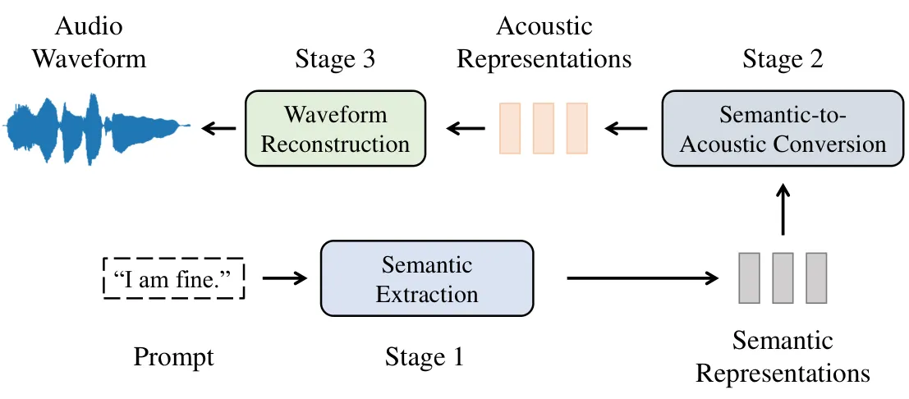
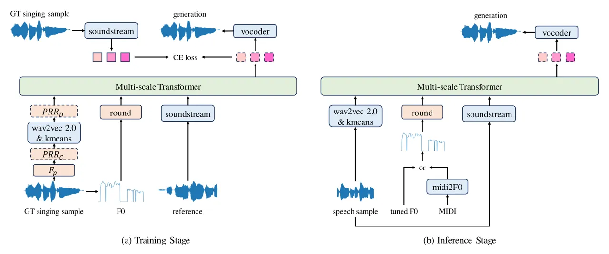

# Self-Supervised Singing Voice Pre-Training towards Speech-to-Singing Conversion

Ruiqi Li    Rongjie Huang    Yongqi Wang    Zhiqing Hong    Zhou Zhao
^(†)^(†)thanks: Corresponding author Affiliation: Zhejiang University
Email: [{ruiqili,rongjiehuang,zhaozhou}@zju.edu.cn](mailto:)

###### Abstract

Speech-to-singing voice conversion (STS) task always suffers from data
scarcity, because it requires paired speech and singing data.
Compounding this issue are the challenges of content-pitch alignment and
the suboptimal quality of generated outputs, presenting significant
hurdles in STS research. This paper presents SVPT, an STS approach
boosted by a self-supervised singing voice pre-training model. We
leverage spoken language model techniques to tackle the rhythm alignment
problem and the in-context learning capability to achieve zero-shot
conversion. We adopt discrete-unit random resampling and pitch
corruption strategies, enabling training with unpaired singing data and
thus mitigating the issue of data scarcity. SVPT also serves as an
effective backbone for singing voice synthesis (SVS), offering insights
into scaling up SVS models. Experimental results indicate that SVPT
delivers notable improvements in both STS and SVS endeavors. Audio
samples are available at
[speech2sing.github.io](https://speech2sing.github.io).

## 1 Introduction

A speech-to-singing voice conversion (STS) system Cen et al. (2012);
Parekh et al. (2020); Li et al. (2023) transforms the semantic content
of a speech signal into a paired singing signal, conditioned on any form
of pitch information, such as fine-grained F0 sequence Saitou et al.
(2007). Beyond being part of the development of music entertainment,
works on STS provide insightful perspectives on bridging the gap between
well-developed speech-language models and rudimentary singing voice
modeling.

Although research in STS has achieved notable success recently, it
continues to encounter several challenges. The major concern is the
scarcity of paired speech-singing voice data. Previous works rely on
pre-made paired datasets Duan et al. (2013); Sharma et al. (2021), which
have a much smaller quantity than singing voice corpora. The scarcity of
data also makes STS models difficult to generalize or scale up. In
addition, the non-autoregressive design in previous works exacerbates
the misalignment issue. Although Li et al. (2023) tries to solve this
problem by utilizing a roughly monotonic cross-attention mechanism, the
attention map has a chance to degrade and corrupt when facing complex,
long sentences.



Figure 1: Speech/Singing synthesis paradigm.

Recent breakthroughs in large-scale generative spoken language models
and audio discretization methods have opened up new frontiers in speech
generation Lee et al. (2022b); Borsos et al. (2023); Wang et al. (2023).
To lighten the burden of directly modeling the target acoustic space,
researchers split the models into two stages and map the prompts into an
intermediate semantic latent space first, as illustrated in Figure 1.
These achievements, however, have not significantly benefited the field
of singing voice synthesis (SVS) Liu et al. (2022a); Zhang et al.
(2022b). Because, unlike speech, the highly dynamic nature of singing
voice and the scarcity of annotated data make it a challenge for
language models (LMs). Either the frequency domain (pitch information)
or temporal domain (rhythm component, or phoneme durations) of singing
voices is highly unstable. Luckily, these problems and the challenges of
STS mentioned before have a chance to solve each other. STS models do
not need textual annotations, while the in-context learning capability
of spoken language models allows for an effective solution to the
misalignment issue. As shown in Figure 1, stage 2, translating
high-level semantic representations into low-level acoustic
representations, requires no annotations or transcriptions. Similarly,
Li et al. (2023) disentangles the input speech signal into corrupted
semantic-related content representations and transforms them into
Mel-spectrograms, conditioned on pitch information. Therefore, stage 2
in a spoken language model is naturally suited to STS tasks. We claim
that with proper regulations and enhancements, spoken language models
are self-supervised singing voice learners, which make use of abundant
unannotated data and bridge the gap between speech and singing voice.

In this paper, we propose SVPT, an STS approach boosted by a
self-supervised Singing Voice Pre-Training model, which further improves
singing voice synthesis. We construct a multi-scale Transformer with a
decoder-only architecture Yang et al. (2023), specializing in
long-sequence modeling like discrete audio tokens. Special regulations
and perturbations, such as discrete-unit random resampling and
expanded-range reference prompting, are introduced to generalize and
stabilize the model. Essentially, the proposed model translates the
corrupted semantic tokens into the target acoustic tokens
autoregressively, conditioned on pitch information and sampled reference
prompt tokens. The benefits are three-fold: (a) the models extracting
the semantic and acoustic tokens are pre-trained and finetuned in a
self-supervised fashion, making this procedure fully annotation-free;
(b) the semantic and acoustic tokens can be derived from singing voice
samples solely, where the former are corrupted and disentangled to have
a closer distribution distance to speech signals; (c) with an external
text-to-semantic translator, the STS model can be upgraded to a
high-quality zero-shot singing voice synthesizer. Our contributions are
summarized as follows:

- •
  We propose SVPT, the first STS approach boosted by a self-supervised
  singing voice pre-training model.
- •
  We introduce special regulations and enhancements to generalize the
  discrete spoken language model to singing voices, which are more
  dynamic in frequency or temporal domains.
- •
  We explore the connection between STS and SVS tasks. SVPT can be
  generalized into a zero-shot SVS model with an external
  text-to-semantic transformer.

## 2 Related Works

### 2.1 Speech-to-Singing Voice Conversion

Three major approaches are developed: a) Model-based approaches rely on
phone-score synchronization information and manual alignment with
multiple artificial control models Saitou et al. (2004); Saitou et al.
(2007). b) Template-based approaches Cen et al. (2012); Vijayan et al.
(2017); Vijayan et al. (2018) require an available high-quality
reference vocal input with dynamic time warping (DTW)-based alignment.
c) Style transfer-based methods Parekh et al. (2020) view STS as a
style-transfer problem and apply deep-learning approaches, not requiring
external synchronization or a high-quality template. Parekh et al.
(2020) designs a CNN-based network and re-aligns the signal by simply
stretching the speech to the target length. By leveraging
boundary-equilibrium GAN (BEGAN) Berthelot et al. (2017), Wu and Yang
(2020) expands their previous work to improve the synthesis quality. Li
et al. (2023) introduces the rhythm component of spoken voices and uses
a cross-attention modality fusion to improve the alignment.

### 2.2 Generative Spoken Language Models

Generative spoken language model (GSLM) Lakhotia et al. (2021) is
originally proposed to tackle the speech generation problem in a
textless setting. AudioLM Borsos et al. (2023) uses semantic tokens from
a pre-trained w2v-BERT model Chung et al. (2021) and acoustic codecs
Zeghidour et al. (2021) to construct a coarse-to-fine decoder-only
architecture to model audios. MusicLM Agostinelli et al. (2023)
continues the work and focus on the field of music generation,
leveraging a text-music joint representation Huang et al. (2022). VALL-E
Wang et al. (2023) uses a similar paradigm to build a zero-shot
text-to-speech (TTS) model, with seven additional non-autoregressive
(NAR) decoders to reconstruct fine-grained acoustic codes. Audio
tokenizers Zeghidour et al. (2021); Défossez et al. (2022) laid a good
foundation for audio codec LMs. SPEAR-TTS Kharitonov et al. (2023)
interprets the first two stages in Figure 1 as reading and speaking
respectively, alleviating the demand for annotated data. Regarding the
generation patterns of audio tokens, MusicGen Copet et al. (2024)
investigates different codebook interleaving patterns and proposes a
one-stage music generation model. UniAudio Yang et al. (2023) and
AudioBox Vyas et al. (2023) further generalize the paradigm to unified
audio generation.

### 2.3 Singing Voice Synthesis

Recently, remarkable progress has emerged in the field of SVS. Chen
et al. (2020) and Zhang et al. (2022c) adopt GAN-based networks for
high-quality synthesis. DiffSinger Liu et al. (2022a) designs a shallow
diffusion mechanism to solve the problem of over-smoothness in the
general TTS field. Inspired by VITS Kim et al. (2021), VISinger Zhang
et al. (2022b) constructs an end-to-end architecture. For singer
generalization, NaturalSpeech 2 Shen et al. (2023) and StyleSinger Zhang
et al. (2023) use a reference voice clip for timbre and style
extraction.

## 3 Method

### 3.1 Overview

As stated, a common audio generation process can be summarized in 3
stages, as shown in Figure 1. In the context of STS, the prompts are
input speech signals. However, the speech input has the same semantic
content as the target singing voice, making the demand for speech data
in the training stage no longer necessary. Inspired by Li et al. (2023),
we use several information perturbation operations as enhancements,
corrupting the singing representations without altering the semantic
content. In stage 2, the pitch information is involved to guide the
rhythm and pitch reconstruction, while a reference voice is appended to
guide timbre reconstruction. Finally, we leverage a unit-based vocoder
to synthesize the high-fidelity waveforms from acoustic codes. The whole
process, including the extraction of semantic and acoustic tokens, is
self-supervised with unannotated singing voice data.

Although our model requires no text transcription, it has the potential
to be an SVS model. We adopt an external text-to-semantic transformer
trained with speech/singing voice data, which is of a relatively smaller
amount, comparing the unannotated data used in stage 2.

### 3.2 Voice Discretization

Inspired by previous works, we adopt a coarse-to-fine hierarchy with
discrete-unit audio modeling. One important benefit of this design in an
STS model is that the intermediate semantic space covers both speech and
singing distributions. In this section, we briefly introduce the voice
discretization strategies.

Semantic tokens The semantic modeling stage generates high-level,
intermediate representations with rich linguistic information. Under
this requirement, we leverage XLSR-53 Conneau et al. (2020), a wav2vec
2.0 Baevski et al. (2020) model pre-trained on 56k hours of speech in 53
languages. We extract the features from the 12th layer, which are the
most relevant to pronunciation features Singla et al. (2022). We also
extract the features from the 18th layer for comparison, which is more
focused on semantic information. Finally, we apply a k-means algorithm
to the features to cluster $`K_{1}`$ centroids, the indices of which are
used as discrete units. Formally, given a singing voice signal
$`\boldsymbol{y}`$, we extract a unit sequence
$`\boldsymbol{s}=\mathcal{F}(\boldsymbol{y})=[s_{1},s_{2},...,s_{T}]`$,
where $`\mathcal{F}`$ is the combination function of the operations
above, and $`s_{t}\in\{0,1,...,K_{1}-1\},\forall t\in[1,T]`$.

Acoustic tokens We use SoundStream, an audio codec model, to produce
tokenized acoustic features. The codec model applies residual vector
quantization with $`N_{q}=8`$ codebooks. Therefore, given a sample
$`\boldsymbol{y}`$, we produce a vector sequence
$`\boldsymbol{A}=\mathcal{G}(\boldsymbol{y})=[\boldsymbol{a}_{1},\boldsymbol{a}_{2},...,\boldsymbol{a}_{T}]`$,
where $`\mathcal{G}`$ is the encodec operation and
$`\boldsymbol{a}_{t}=[a_{t}^{1},a_{t}^{2},...,a_{t}^{N_{q}}]`$, being a
vector contains the codes from all the codebook at timestep
$`t\in[1,T]`$, and
$`a_{t}^{\tau}\in\{0,1,...,K_{2}-1\},\forall\tau\in[1,N_{q}]`$.
$`K_{2}`$ is the codebook length of all the codebooks. To lighten the
burden of autoregressive generation, we use the stacked codes from the
first 3 codebooks as the discrete acoustic features. To recover the
loss, we leverage an additional unit-based vocoder, BigVGAN, to
reconstruct high-fidelity waveforms Lee et al. (2022a).

Pitch and reference tokens The generation of acoustic tokens is
conditioned not only on semantic tokens, but also on pitch information
and reference tokens. We extract the fundamental frequency contour F0 as
pitch information. For discretization, we simply round the frequency
numbers to integers, creating a pitch token sequence
$`\boldsymbol{p}=[p_{1},p_{2},...,p_{T}]`$, where
$`p_{t}\in[f_{\text{min}},f_{\text{max}}],\forall t\in[1,T]`$. The
reference tokens are similar to the acoustic tokens, except that we only
use the codes from the first codebook.

### 3.3 Information Perturbation

Compared with speech corpus, singing voice data is different in two
ways: a) singing voice corpus has a significantly smaller quantity, and
b) either the frequency domain (pitch) or temporal domain (phoneme
durations, or rhythm) of singing voices is highly dynamic. These
features make self-supervised training extremely unstable and vulnerable
to over-fitting. To ensure that the semantic tokens consist of only
semantic-related information, disentanglement is required.

#### 3.3.1 Pitch and Timbre Corruption

Since the pitch component of a singing voice sample is correlated with
the speaker identity, we corrupt the pitch and timbre features at the
same time. Inspired by Choi et al. (2021), we use a chain of three
functions to generate a corrupted waveform
$`\boldsymbol{\overline{y}}=F_{p}(\boldsymbol{y})=fs(pr(peq(\boldsymbol{y})))`$,
where $`fs(\cdot)`$ is formant shifting function, $`pr(\cdot)`$ is pitch
randomization, and $`peq(\cdot)`$ is parametric equalizer. By doing so,
the corrupted sample $`\boldsymbol{y}`$ contains only semantic-related
information to the fullest extent. More details and hyperparameters are
listed in Appendix A.

It is worth mentioning that training the overall model while perturbing
the waveforms and extracting semantic tokens on the fly consumes a great
amount of computing resources, which is unrealistic for an academic
laboratory. Therefore, we randomly pre-perturb the dataset $`N_{r}`$
times, resulting in a $`N_{r}\times`$ larger semantic corpus.
Experiments show that $`N_{r}=20`$ reaches satisfactory performance.

#### 3.3.2 Rhythm Corruption

Unlike speech voices, the rhythm information of singing voices is
crucial and has the potential to be leaked in semantic representations.
More importantly, the rhythm component differs between speech and
singing voices, creating a non-negligible domain shift. Suppose there is
a perturbation operation that isolates the semantic information from
singing voices and makes it compatible with speech voices at the same
time, we can pre-train the model on unannotated singing data and
generalize it to speech inputs.

Inspired by Chan et al. (2022), we adopt temporal random resampling
operation to tackle the challenge. The original random resampling
algorithm retains source length, which is not necessary in STS. To
accelerate the computation without loss of effectiveness, we design a
pseudo random resampling algorithm
$`\boldsymbol{\widetilde{x}}=PRR(\boldsymbol{x})`$, shown in
algorithm 1. The algorithm accepts a hyperparameter, average
segmentation length $`l_{r}`$, to cut the signal into several segments.
Each segment is randomly scaled up or down temporally and finally
concatenated together. Therefore, the original distinguishable rhythm
information is disrupted and removed.

Figure 2: Pseudo random resampling.

Hypothetically, the random resampling operation $`PRR(\cdot)`$ re-aligns
the durations of phonemes, or the rhythm component. Although the phoneme
durations of singing voices change drastically compared to speech, it
has a small probability of re-aligning the signal that is close enough
to the speech signal. In other words, if the model sees enough
re-alignment results of corrupted singing signals, the speech input in
the inference stage will just be treated as another re-alignment, as
illustrated in Figure 2.

The hyperparameter $`l_{r}`$ is an important factor of random resampling
effectiveness. If $`l_{r}`$ is too large, more than one phoneme could be
grouped in one segment, attenuating the actual effect of resampling. If
$`l_{r}`$ is too small, distortion may occur due to round-off error. We
set $`l_{r}`$ to 0.4 seconds, and a little discussion can be found in
Appendix D.

Normally, $`PRR(\cdot)`$ is performed on continuous signals like
waveforms or spectrograms, implemented by linear interpolation. However,
the issue of computational overhead mentioned before also exists.
Therefore, we adopt two strategies:

- •
  Continuous resampling $`PRR_{C}(\cdot)`$. We still adopt random
  resampling on waveforms with linear interpolation, but for $`N_{r}`$
  times in advance, similar to pitch pre-perturbation. Practically, we
  perform both pitch and rhythm perturbations $`N_{r}`$ times in
  advance, resulting in a singing variant corpus $`N_{r}`$ times the
  original size.
- •
  Discrete resampling $`PRR_{D}(\cdot)`$. Instead of the continuous
  operation, we perform discrete random resampling on the clustered
  semantic tokens implemented by nearest neighbor interpolation. The
  disadvantages are obvious: the semantic content is inherently
  continuous, while discrete operations can introduce abrupt transitions
  and artifacts. As a result, the semantic tokens derived from a
  resampled waveform might not match those obtained directly from the
  same signal, even if the resampling path remains unchanged. Despite
  this, we believe that the additional noise introduced by this drawback
  just involves more perturbations, forcing the model to focus on the
  denoised content. Furthermore, this method allows for on-the-fly
  resampling, creating a theoretically infinite variant corpus.

It is worth mentioning that both strategies are considered discrete-unit
random resampling, since the results are discrete tokens.

### 3.4 Expanded-range Reference Prompting

The objective of reference prompting is to modulate the generated vocal
traits via a specific reference prompt sequence Borsos et al. (2023),
enabling language models to produce novel voices in a zero-shot fashion.
Prior approaches choose two distinct speech windows from each training
sample—one as the reference prompt and the other as the intended output,
as described in Kharitonov et al. (2023)—this method’s efficiency is
somewhat diminished with singing voice data due to its scarcity, leading
to potential model overfitting. To mitigate this, we broaden the
selection of reference samples. Initially, our experiments involved
selecting a random sample from the same singer as the reference.
Nevertheless, variations in style and timbre within the same singer’s
different songs prompted us to refine our approach: we now select a
random sample from the same song within a certain range to ensure
consistency in vocal characteristics. Specifically, we only sample
segments within the range from the 5 preceding to the 5 following ones
in the original order of the song as references.

### 3.5 Architecture and Training



Figure 3: Model architecture and the training/inference stage.

#### 3.5.1 Multi-scale Transformer Architecture

To address the challenge of processing long-sequence audio tokens, we
introduce a multi-scale Transformer based on a decoder-only framework,
inspired by Yang et al. (2023). This multi-scale model consists of a
global and a local Transformer, respectively. Initially, the sequence is
segmented into patches of equal length $`P`$, with the embeddings of
tokens within each patch being merged to reduce the sequence’s temporal
resolution. The global layer, denoted as $`\theta_{\text{G}}`$,
processes this compressed sequence to autoregressively produce a
sequence of hidden features $`\boldsymbol{h}`$. Concurrently, the local
layer, $`\theta_{\text{L}}`$, utilizes the aggregated global hidden
feature pertinent to its patch and the original tokens of the patch to
model the local context. Specifically, we arrange acoustic codes side by
side, where every trio of consecutive codes from distinct codebooks
delineates a single patch (equating one patch to one frame). To
accommodate the structure for semantic, pitch, and reference tokens, we
triple each token, ensuring compatibility with the framework’s
requisites. Therefore, the patch size $`P=3`$ and the local Transformer
can be formulated as:

```math
\displaystyle p(\boldsymbol{a}_{t}|\hat{h_{t}},rp_{P}(\widetilde{s}_{t}),rp_{P}(p_{t}),rp_{P}(r_{t});\theta_{\text{L}})= \tag{1}
```

```math
\displaystyle\prod_{\tau=1}^{P}p(a_{t}^{\tau}|\boldsymbol{a}_{t}^{<\tau},\hat{h_{t}},rp_{P}(\widetilde{s}_{t}),rp_{P}(p_{t}),rp_{P}(r_{t});\theta_{\text{L}})
```

where $`rp_{P}(\cdot)`$ repeats the element $`P`$ times and concatenates
them temporally. $`\boldsymbol{a}_{t}`$ indicates the acoustic tokens
from $`P`$ codebooks at timestep $`t`$, while $`\widetilde{s}_{t}`$,
$`p_{t}`$, and $`r_{t}`$ indicate the corrupted semantic token, the
pitch token, and the reference token. $`\hat{h_{t}}`$ is the hidden
output at timestep $`t`$ from the global Transformer:

```math
\displaystyle p(\boldsymbol{\hat{h}}|\boldsymbol{h},\boldsymbol{\widetilde{s}},\boldsymbol{p},\boldsymbol{r}; \displaystyle\theta_{\text{G}})= \tag{2}
```

```math
\displaystyle\prod_{t=1}^{T}p(\hat{h}_{t}|\boldsymbol{\hat{h}}_{<t},\boldsymbol{h}_{<t},\boldsymbol{\widetilde{s}},\boldsymbol{p},\boldsymbol{r};\theta_{\text{G}})
```

where $`\boldsymbol{h}`$ is the downsampled sequence by concatenating
the embeddings channel-wise within one patch:
$`h_{t}=\text{concat}([\text{embed}(a_{t}^{1}),...,\text{embed}(a_{t}^{P})])`$.
By maximizing the probability
$`\prod_{t=1}^{T}p(\boldsymbol{a}_{t}|\boldsymbol{a}_{<t},*)`$, the
model approximates the distribution of acoustic representations and
generates acoustic codes autoregressively.

#### 3.5.2 Training and Inference

As stated before, during the training stage we use unannotated singing
data to train the transformers. The corrupted semantic tokens, the pitch
tokens, and the reference tokens are concatenated temporally with
special separator tokens such as \<semantic_start\>, \<acoustic_end\>,
\<pitch_start\>, etc. The reference inputs are also singing voices,
sampled in the same song. The training object is the cross entropy loss.
As for inference, the model takes unseen speech samples to perform
zero-shot STS. The speech sample is also considered as the reference to
extract style and timbre. The pitch information can be provided by
hand-tuned or auto-tuned F0 contour, or predicted by a pre-trained
midi2F0 model, which takes MIDI notes as input.

### 3.6 A Leap towards Singing Voice Synthesis

In addition to its capabilities for STS, the pre-trained model serves as
an effective foundation for SVS tasks. This model, designed to extract
only semantic information from the input, can be enhanced with an
auxiliary text-to-semantic translator to facilitate text-based
synthesis. We develop this translator using a smaller annotated speech
and singing dataset, focusing solely on semantic extraction. For this
purpose, a 12-layer transformer is employed to generate semantic tokens
from phonemes in an autoregressive manner. This auxiliary component
enables the transformation of the STS model into a high-fidelity SVS
model, expanding its capacity to leverage a larger amount of unannotated
data efficiently.

## 4 Experiments

### 4.1 Data

| Training Datasets              | L   | Hours |
| ------------------------------ | --- | ----- |
| Opencpop Wang et al. (2022)    | ZH  | 5.3   |
| Opensinger Huang et al. (2021) | ZH  | 83.5  |
| M4Singer Zhang et al. (2022a)  | ZH  | 29.8  |
| internal \#1                   | ZH  | 22.1  |
| internal \#2                   | ZH  | 21.0  |
| CSD Choi et al. (2020)         | EN  | 1.9   |
| musdb18hq Rafii et al. (2019)  | EN  | 5.7   |
| VocalSet Wilkins et al. (2018) | EN  | 7.6   |
| internal \#3                   | EN  | 3.0   |

Table 1: Information of training datasets.

We construct a bilingual singing voice training corpus spanning 180
hours, with dataset specifics outlined in Table 1. This includes 161.7
hours of Mandarin and 18.2 hours of English audio. To enrich our dataset
further, we augment it with an additional 10 hours of speech data each
from AISHELL-3 Shi et al. (2020) and LibriSpeech Panayotov et al.
(2015), bringing our total training corpus to 200 hours. For validation
and testing, we randomly allocate two segments of 4 hours each. In terms
of baseline training, we utilize two STS datasets: the NHSS Sharma
et al. (2021) and PopBuTFy Liu et al. (2022b) databases. NHSS provides
7.0 hours of English data, split between 2.3 hours of speech and 4.7
hours of singing, while PopBuTFy offers 18 hours, divided into 8 hours
of speech and 10 hours of singing.

For zero-shot STS inference, we collect a bilingual corpus of paired
speech and singing. This dataset comprises 1.7 hours of Mandarin speech
and 2.9 hours of singing, alongside 3.8 hours of English speech and 5.8
hours of singing. 28 singers are recruited and paid to sing the songs
and read the transcripts separately. To enrich the dataset, fine-grained
F0 contours and MIDI annotations are extracted and created for detailed
pitch information Li et al. (2024). Upon completing the training phase,
we employ zero-shot inference on the speech and pitch inputs for
comprehensive final evaluation.

|                      |                    |                  |                    |                    |                    |
| -------------------- | ------------------ | ---------------- | ------------------ | ------------------ | ------------------ |
| Method               | LSD $`\downarrow`$ | RCA $`\uparrow`$ | MOS-S $`\uparrow`$ | MOS-P $`\uparrow`$ | MOS-Q $`\uparrow`$ |
| GT (vocoder)         | 2.512              | 0.988            | 4.52$`\pm`$0.05    | 4.47$`\pm`$0.11    | 4.13$`\pm`$0.07    |
| Parekh et al. (2020) | 8.045              | 0.842            | 3.02$`\pm`$0.13    | 2.99$`\pm`$0.09    | 3.01$`\pm`$0.12    |
| Wu and Yang (2020)   | 6.913              | 0.896            | 3.12$`\pm`$0.10    | 3.21$`\pm`$0.13    | 3.15$`\pm`$0.10    |
| AlignSTS             | 5.519              | 0.941            | 3.45$`\pm`$0.05    | 3.47$`\pm`$0.06    | 3.41$`\pm`$0.04    |
| SVPT (18-layer feat) | 5.462              | 0.956            | 3.44$`\pm`$0.06    | 3.48$`\pm`$0.09    | 3.39$`\pm`$0.08    |
| SVPT (Mandarin)      | 5.066              | 0.982            | 3.61$`\pm`$0.05    | 3.76$`\pm`$0.06    | 3.69$`\pm`$0.05    |
| SVPT                 | 5.213              | 0.967            | 3.46$`\pm`$0.04    | 3.68$`\pm`$0.08    | 3.61$`\pm`$0.06    |

Table 2: The evaluation results of STS systems using the English test
set, except "SVPT (Mandarin)".

### 4.2 Implementation

We build a 20-layer global Transformer and a 6-layer local Transformer
as the backbone network. A 24-layer XLSR-53 pre-trained model is
utilized, where the 12th layer is used for semantic extraction. For
acoustic extraction, we train a SoundStream model for 16kHz audios with
8 codebooks. Both the semantic and acoustic extraction share a
downsampling rate of 320. A unit-based vocoder, BigVGAN is trained to
upsample and reconstruct 24k audios from acoustic tokens of 3 codebooks.
Continuous random resampling with $`N_{r}`$ set to 20 is adopted. More
details are listed in Appendix B.

### 4.3 Evaluation Metrics

The performance evaluation comprises two main aspects: objective and
subjective assessments. For objective evaluation, we adhere to
established practices Parekh et al. (2020) and employ log-spectral
distance (LSD) to gauge overall reconstruction quality. For pitch
regression assessment, we calculate the F0 raw chroma accuracy (RCA)
using the mir_eval library Raffel et al. (2014), with a maximum pitch
tolerance set at 50 cents.

For subjective evaluation metrics, we utilize the Mean Opinion Score
(MOS) to evaluate synthesis quality. Specifically, MOS-Q assesses
overall quality, while MOS-P focuses on the naturalness and coherence of
prosody. Additionally, we score MOS-S to measure singer similarity in
terms of timbre and prosody. In the ablation study, the Comparative Mean
Opinion Score is used to assess synthesis quality, denoted as CMOS-X.
More details are listed in Appendix C.

### 4.4 Baseline Models

We compare the performance of SVPT with other STS methods: 1) GT
(vocoder), where we compare our model with the audio generated by the
BigVGAN vocoder from GT acoustic codes, which is the upper limit; 2)
Parekh et al. (2020), a CNN-based STS model, reproduced and retrained
using the NHSS database; 3) Wu and Yang (2020), a GAN-based model
designed to further improve synthesis quality, reproduced and retrained; 4) AlignSTS, a diffusion-based model with rhythm and pitch modal fusion,
retrained. Since only English STS datasets are available, the retrained
STS baselines are monolingual, and we only compare the methods using the
English test set. However, to provide a complete comparison, we record
the performance of our model tested on the Mandarin test set, denoted as
"SVPT (Mandarin)". In addition, we compare the model where the semantic
features are from the 18th layer of the wav2vec 2.0 model, denoted as
"SVPT (18-layer feat)".

For the extensional experiments of SVS, we provide the results of two
non-autoregressive SVS models as baselines: 1) FFT-Singer, an SVS model
based on stacked feed-forward transformer blocks; and 2) DiffSinger Liu
et al. (2022a), which is based on denoising diffusion probabilistic
model. Since SVPT is for zero-shot generation, we add a global timbre
encoder module to each baseline by leveraging a speaker identity
encoder¹¹ 1 https://github.com/resemble-ai/Resemblyzer. Furthermore, we
utilize a HiFi-GAN vocoder Kong et al. (2020) for the baselines to
transform the Mel-spectrograms into waveforms.

|               |                    |                  |                    |                    |                    |
| ------------- | ------------------ | ---------------- | ------------------ | ------------------ | ------------------ |
| Method        | LSD $`\downarrow`$ | RCA $`\uparrow`$ | MOS-S $`\uparrow`$ | MOS-P $`\uparrow`$ | MOS-Q $`\uparrow`$ |
| GT (HiFi-GAN) | 2.392              | 0.992            | 4.73$`\pm`$0.07    | 4.54$`\pm`$0.07    | 4.27$`\pm`$0.06    |
| GT (BigVGAN)  | 2.364              | 0.993            | 4.72$`\pm`$0.04    | 4.56$`\pm`$0.06    | 4.30$`\pm`$0.04    |
| FFT-Singer    | 4.859              | 0.942            | 3.24$`\pm`$0.05    | 3.37$`\pm`$0.04    | 3.29$`\pm`$0.06    |
| DiffSinger    | 4.643              | 0.967            | 3.30$`\pm`$0.04    | 3.61$`\pm`$0.06    | 3.60$`\pm`$0.04    |
| SVPT          | 4.750              | 0.971            | 3.48$`\pm`$0.06    | 3.57$`\pm`$0.07    | 3.56$`\pm`$0.06    |

Table 3: The evaluation results of SVS systems using the Mandarin test
set.

### 4.5 Main Results

The main results are shown in Table 2. From the objective and subjective
results, we can see that despite our model being trained primarily on
data in Mandarin, it still outperforms the baselines on the English test
set. The MOS-S scores of the first two baselines are particularly
lacking, possibly because they do not have special designs for the
extraction or reconstruction of timbre information. AlignSTS adopts a
continuous global timbre extractor, while our model utilizes a discrete
reference prompt and leverages the in-context learning capability. The
superior performance of our model also reflects the importance of the
model’s scalability to data, meaning our model can be trained with more
unlabeled data or even cross-lingual data. This also indicates that for
spoken language models, different languages have a mutual promotional
effect on each other. Another important reason is that STS tasks focus
more on pronunciation patterns instead of semantic patterns. That is,
STS models only map the syllables to the target rhythm and pitch frames,
without regard to the semantic meanings. Therefore, as long as the two
languages share partially similar phonemes, mutual promotion exists.
This finding is also corroborated in the results of the baseline SVPT
(18-layer feat), since the features from the 12th layer are more
pronunciation-related and the 18th layer is more semantic-related.

### 4.6 Ablation Study

| PRR                   | CMOS-S | CMOS-P | CMOS-Q |
| --------------------- | ------ | ------ | ------ |
| discrete              | +0.02  | +0.03  | -0.01  |
| $`N_{r}`$ = 1         | -0.15  | -0.42  | -0.31  |
| $`N_{r}`$ = 5         | -0.09  | -0.18  | -0.12  |
| $`N_{r}`$ = 10        | -0.03  | -0.04  | -0.02  |
| $`N_{r}`$ = 20 (ours) | 0.00   | 0.00   | 0.00   |
| $`N_{r}`$ = 50        | 0.00   | +0.01  | +0.02  |

Table 4: Comparisons of different random resampling strategies. The
first row is discrete RPP, and the rest are continuous
pre-perturbations.

We explored the effects of various PRR strategies, and the results are
listed in Table 4. We compare the results of discrete PPR and continuous
PPR with different pre-perturbation numbers. Experimental results
indicate that $`N_{r}=20`$ yields satisfactory performance; any further
enlargement of the semantic variant corpus results in only marginal
improvements. On the contrary, insufficient variants can lead to severe
overfitting. In addition, discrete PRR achieves considerable
performance, corroborating our previous hypothesis that the noise
introduced by the discrete interpolation actually enhances perturbations
and creates a bottleneck. This effect essentially integrates a denoising
challenge into the learning process.

| Setting       | CMOS-S | CMOS-P | CMOS-Q |
| ------------- | ------ | ------ | ------ |
| w/o PRR       | -0.12  | -0.43  | -0.45  |
| w/o $`F_{p}`$ | -0.25  | -0.31  | -0.23  |
| w/o ERRP      | -0.18  | -0.13  | 0.08   |

Table 5: Ablation study results. $`F_{p}`$ indicates the pitch and
timbre corruption operation. ERRP stands for the expanded-range
reference prompting.

We also validate the effectiveness of the designs in information
perturbation and reconstruction, as listed in Table 5. Firstly, we
remove the random resampling step and directly use the raw semantic
tokens. The results suggest that this common method in speech language
models diminishes with singing voice data, due to its scarcity and high
dynamics. Secondly, we omit the pitch and timbre perturbation step,
resulting in a poorly reconstructed prosody. Finally, we follow the
prior works in TTS and select two distinct windows from each singing
sample to be the reference and the target output. The performance is
also inferior because a smaller range of prompt sampling can lead to
overfitting.

### 4.7 Zero-shot Singing Voice Synthesis

In this section, we test the combination of SVPT and the auxiliary
text-to-semantic translator with other non-autoregressive SVS methods,
using the Mandarin test sets only. Initially, the auxiliary translator
undergoes pre-training on the AISHELL-3 dataset. Subsequently, it is
fine-tuned using a selection of annotated datasets: M4Singer, Opencpop,
and internal \#1. From the results listed in Table 3, we can see that
SVPT possesses a considerable capability of text-based singing voice
synthesis. Although SVPT does not match the overall quality of
DiffSinger, it offers insights into scaling up SVS models. Moreover, our
model exhibits higher timbre similarity in zero-shot inference,
suggesting the important advantage of spoken language models.

## 5 Conclusion

This paper proposed SVPT, the first STS approach boosted by a
self-supervised singing voice pre-training model, which further improved
singing voice synthesis. We adopted discrete-unit random resampling and
pitch corruption strategies to stabilize and generalize the training of
the spoken language model. With an external text-to-semantic translator,
SVPT served as an effective backbone for SVS and provided an opportunity
for SVS models to scale up. Experimental results revealed notable
performances in both STS and SVS tasks.

## Limitations and Potential Risks

The proposed method presents two significant limitations. Firstly, the
training and inference procedure only involves fine-grained F0 contours,
which may not be applicable in practice. Secondly, Utilizing language
models incurs significant computational overhead, necessitating further
experiments to ascertain whether such computational demands are
justified by efficiency gains.

Additionally, there exists a potential for copyright infringement
concerns stemming from the improper application of the proposed STS
model. To counteract these issues, we plan to introduce suitable
measures aimed at preventing any unlawful or unauthorized exploitation
of the technology.

## Acknowledgement

This work was supported in part by the National Natural Science
Foundation of China under Grant No.62222211.

## References

- Agostinelli et al. (2023) Andrea Agostinelli, Timo I Denk, Zalán
  Borsos, Jesse Engel, Mauro Verzetti, Antoine Caillon, Qingqing Huang,
  Aren Jansen, Adam Roberts, Marco Tagliasacchi, et al. 2023. Musiclm:
  Generating music from text. _arXiv preprint arXiv:2301.11325_.
- Baevski et al. (2020) Alexei Baevski, Yuhao Zhou, Abdelrahman Mohamed,
  and Michael Auli. 2020. wav2vec 2.0: A framework for self-supervised
  learning of speech representations. _Advances in neural information
  processing systems_, 33:12449–12460.
- Berthelot et al. (2017) David Berthelot, Thomas Schumm, and Luke
  Metz. 2017. Began: Boundary equilibrium generative adversarial
  networks. _arXiv preprint arXiv:1703.10717_.
- Borsos et al. (2023) Zalán Borsos, Raphaël Marinier, Damien Vincent,
  Eugene Kharitonov, Olivier Pietquin, Matt Sharifi, Dominik Roblek,
  Olivier Teboul, David Grangier, Marco Tagliasacchi, and Neil
  Zeghidour. 2023. [Audiolm: a language modeling approach to audio
  generation](http://arxiv.org/abs/2209.03143).
- Cen et al. (2012) Ling Cen, Minghui Dong, and Paul Chan. 2012.
  Template-based personalized singing voice synthesis. In _2012 IEEE
  International Conference on Acoustics, Speech and Signal Processing
  (ICASSP)_, pages 4509–4512. IEEE.
- Chan et al. (2022) Chak Ho Chan, Kaizhi Qian, Yang Zhang, and Mark
  Hasegawa-Johnson. 2022. Speechsplit2. 0: Unsupervised speech
  disentanglement for voice conversion without tuning autoencoder
  bottlenecks. In _ICASSP 2022-2022 IEEE International Conference on
  Acoustics, Speech and Signal Processing (ICASSP)_, pages 6332–6336.
  IEEE.
- Chen et al. (2020) Jiawei Chen, Xu Tan, Jian Luan, Tao Qin, and
  Tie-Yan Liu. 2020. Hifisinger: Towards high-fidelity neural singing
  voice synthesis. _arXiv preprint arXiv:2009.01776_.
- Choi et al. (2021) Hyeong-Seok Choi, Juheon Lee, Wansoo Kim, Jie Lee,
  Hoon Heo, and Kyogu Lee. 2021. Neural analysis and synthesis:
  Reconstructing speech from self-supervised representations. _Advances
  in Neural Information Processing Systems_, 34:16251–16265.
- Choi et al. (2020) Soonbeom Choi, Wonil Kim, Saebyul Park, Sangeon
  Yong, and Juhan Nam. 2020. Children’s song dataset for singing voice
  research. In _International Society for Music Information Retrieval
  Conference (ISMIR)_.
- Chung et al. (2021) Yu-An Chung, Yu Zhang, Wei Han, Chung-Cheng Chiu,
  James Qin, Ruoming Pang, and Yonghui Wu. 2021. W2v-bert: Combining
  contrastive learning and masked language modeling for self-supervised
  speech pre-training. In _2021 IEEE Automatic Speech Recognition and
  Understanding Workshop (ASRU)_, pages 244–250. IEEE.
- Conneau et al. (2020) Alexis Conneau, Alexei Baevski, Ronan Collobert,
  Abdelrahman Mohamed, and Michael Auli. 2020. Unsupervised
  cross-lingual representation learning for speech recognition. _arXiv
  preprint arXiv:2006.13979_.
- Copet et al. (2024) Jade Copet, Felix Kreuk, Itai Gat, Tal Remez,
  David Kant, Gabriel Synnaeve, Yossi Adi, and Alexandre Défossez. 2024.
  Simple and controllable music generation. _Advances in Neural
  Information Processing Systems_, 36.
- Duan et al. (2013) Zhiyan Duan, Haotian Fang, Bo Li, Khe Chai Sim, and
  Ye Wang. 2013. The nus sung and spoken lyrics corpus: A quantitative
  comparison of singing and speech. In _2013 Asia-Pacific Signal and
  Information Processing Association Annual Summit and Conference_,
  pages 1–9. IEEE.
- Défossez et al. (2022) Alexandre Défossez, Jade Copet, Gabriel
  Synnaeve, and Yossi Adi. 2022. [High fidelity neural audio
  compression](http://arxiv.org/abs/2210.13438).
- Huang et al. (2022) Qingqing Huang, Aren Jansen, Joonseok Lee, Ravi
  Ganti, Judith Yue Li, and Daniel PW Ellis. 2022. Mulan: A joint
  embedding of music audio and natural language. _arXiv preprint
  arXiv:2208.12415_.
- Huang et al. (2021) Rongjie Huang, Feiyang Chen, Yi Ren, Jinglin Liu,
  Chenye Cui, and Zhou Zhao. 2021. Multi-singer: Fast multi-singer
  singing voice vocoder with a large-scale corpus. In _Proceedings of
  the 29th ACM International Conference on Multimedia_, pages 3945–3954.
- Kharitonov et al. (2023) Eugene Kharitonov, Damien Vincent, Zalán
  Borsos, Raphaël Marinier, Sertan Girgin, Olivier Pietquin, Matt
  Sharifi, Marco Tagliasacchi, and Neil Zeghidour. 2023. Speak, read and
  prompt: High-fidelity text-to-speech with minimal supervision. _arXiv
  preprint arXiv:2302.03540_.
- Kim et al. (2021) Jaehyeon Kim, Jungil Kong, and Juhee Son. 2021.
  Vits: Conditional variational autoencoder with adversarial learning
  for end-to-end text-tospeech. In _Proc. ICML_, pages 5530–5540.
- Kong et al. (2020) Jungil Kong, Jaehyeon Kim, and Jaekyoung Bae. 2020.
  Hifi-gan: Generative adversarial networks for efficient and high
  fidelity speech synthesis. _Advances in Neural Information Processing
  Systems_, 33:17022–17033.
- Lakhotia et al. (2021) Kushal Lakhotia, Eugene Kharitonov, Wei-Ning
  Hsu, Yossi Adi, Adam Polyak, Benjamin Bolte, Tu-Anh Nguyen, Jade
  Copet, Alexei Baevski, Abdelrahman Mohamed, et al. 2021. On generative
  spoken language modeling from raw audio. _Transactions of the
  Association for Computational Linguistics_, 9:1336–1354.
- Lee et al. (2022a) Sang-gil Lee, Wei Ping, Boris Ginsburg, Bryan
  Catanzaro, and Sungroh Yoon. 2022a. Bigvgan: A universal neural
  vocoder with large-scale training. _arXiv preprint arXiv:2206.04658_.
- Lee et al. (2022b) Sang-Hoon Lee, Seung-Bin Kim, Ji-Hyun Lee, Eunwoo
  Song, Min-Jae Hwang, and Seong-Whan Lee. 2022b. Hierspeech: Bridging
  the gap between text and speech by hierarchical variational inference
  using self-supervised representations for speech synthesis. _Advances
  in Neural Information Processing Systems_, 35:16624–16636.
- Li et al. (2023) Ruiqi Li, Rongjie Huang, Lichao Zhang, Jinglin Liu,
  and Zhou Zhao. 2023. Alignsts: Speech-to-singing conversion via
  cross-modal alignment. _arXiv preprint arXiv:2305.04476_.
- Li et al. (2024) Ruiqi Li, Yu Zhang, Yongqi Wang, Zhiqing Hong,
  Rongjie Huang, and Zhou Zhao. 2024. [Robust singing voice
  transcription serves synthesis](http://arxiv.org/abs/2405.09940).
- Liu et al. (2022a) Jinglin Liu, Chengxi Li, Yi Ren, Feiyang Chen, and
  Zhou Zhao. 2022a. [Diffsinger: Singing voice synthesis via shallow
  diffusion mechanism](https://doi.org/10.1609/aaai.v36i10.21350).
  _Proceedings of the AAAI Conference on Artificial Intelligence_,
  36(10):11020–11028.
- Liu et al. (2022b) Jinglin Liu, Chengxi Li, Yi Ren, Zhiying Zhu, and
  Zhou Zhao. 2022b. Learning the beauty in songs: Neural singing voice
  beautifier. _arXiv preprint arXiv:2202.13277_.
- Min et al. (2021) Dongchan Min, Dong Bok Lee, Eunho Yang, and Sung Ju
  Hwang. 2021. Meta-stylespeech: Multi-speaker adaptive text-to-speech
  generation. In _International Conference on Machine Learning_, pages
  7748–7759. PMLR.
- Panayotov et al. (2015) Vassil Panayotov, Guoguo Chen, Daniel Povey,
  and Sanjeev Khudanpur. 2015. Librispeech: an asr corpus based on
  public domain audio books. In _2015 IEEE international conference on
  acoustics, speech and signal processing (ICASSP)_, pages 5206–5210.
  IEEE.
- Parekh et al. (2020) Jayneel Parekh, Preeti Rao, and Yi-Hsuan
  Yang. 2020. Speech-to-singing conversion in an encoder-decoder
  framework. In _ICASSP 2020-2020 IEEE International Conference on
  Acoustics, Speech and Signal Processing (ICASSP)_, pages 261–265.
  IEEE.
- Qian et al. (2020) Kaizhi Qian, Yang Zhang, Shiyu Chang, Mark
  Hasegawa-Johnson, and David Cox. 2020. Unsupervised speech
  decomposition via triple information bottleneck. In _International
  Conference on Machine Learning_, pages 7836–7846. PMLR.
- Raffel et al. (2014) Colin Raffel, Brian McFee, Eric J Humphrey,
  Justin Salamon, Oriol Nieto, Dawen Liang, Daniel PW Ellis, and C Colin
  Raffel. 2014. mir_eval: A transparent implementation of common mir
  metrics. In _In Proceedings of the 15th International Society for
  Music Information Retrieval Conference, ISMIR_. Citeseer.
- Rafii et al. (2019) Zafar Rafii, Antoine Liutkus, Fabian-Robert
  Stöter, Stylianos Ioannis Mimilakis, and Rachel Bittner. 2019.
  [MUSDB18-HQ - an uncompressed version of
  musdb18](https://doi.org/10.5281/zenodo.3338373).
- Saitou et al. (2007) Takeshi Saitou, Masataka Goto, Masashi Unoki, and
  Masato Akagi. 2007. Speech-to-singing synthesis: Converting speaking
  voices to singing voices by controlling acoustic features unique to
  singing voices. In _2007 IEEE Workshop on Applications of Signal
  Processing to Audio and Acoustics_, pages 215–218. IEEE.
- Saitou et al. (2004) Takeshi Saitou, Naoya Tsuji, Masashi Unoki, and
  Masato Akagi. 2004. Analysis of acoustic features affecting"
  singing-ness" and its application to singing-voice synthesis from
  speaking-voice. In _Eighth International Conference on Spoken Language
  Processing_.
- Sharma et al. (2021) Bidisha Sharma, Xiaoxue Gao, Karthika Vijayan,
  Xiaohai Tian, and Haizhou Li. 2021. Nhss: A speech and singing
  parallel database. _Speech Communication_, 133:9–22.
- Shen et al. (2023) Kai Shen, Zeqian Ju, Xu Tan, Yanqing Liu, Yichong
  Leng, Lei He, Tao Qin, Sheng Zhao, and Jiang Bian. 2023. Naturalspeech
  2: Latent diffusion models are natural and zero-shot speech and
  singing synthesizers. _arXiv preprint arXiv:2304.09116_.
- Shi et al. (2020) Yao Shi, Hui Bu, Xin Xu, Shaoji Zhang, and Ming
  Li. 2020. Aishell-3: A multi-speaker mandarin tts corpus and the
  baselines. _arXiv preprint arXiv:2010.11567_.
- Singla et al. (2022) Yaman Kumar Singla, Jui Shah, Changyou Chen, and
  Rajiv Ratn Shah. 2022. What do audio transformers hear? probing their
  representations for language delivery & structure. In _2022 IEEE
  International Conference on Data Mining Workshops (ICDMW)_, pages
  910–925. IEEE.
- Vijayan et al. (2017) Karthika Vijayan, Minghui Dong, and Haizhou
  Li. 2017. A dual alignment scheme for improved speech-to-singing voice
  conversion. In _2017 Asia-Pacific Signal and Information Processing
  Association Annual Summit and Conference (APSIPA ASC)_, pages
  1547–1555. IEEE.
- Vijayan et al. (2018) Karthika Vijayan, Xiaoxue Gao, and Haizhou
  Li. 2018. Analysis of speech and singing signals for temporal
  alignment. In _2018 Asia-Pacific Signal and Information Processing
  Association Annual Summit and Conference (APSIPA ASC)_, pages
  1893–1898. IEEE.
- Vyas et al. (2023) Apoorv Vyas, Bowen Shi, Matthew Le, Andros Tjandra,
  Yi-Chiao Wu, Baishan Guo, Jiemin Zhang, Xinyue Zhang, Robert Adkins,
  William Ngan, et al. 2023. Audiobox: Unified audio generation with
  natural language prompts. _arXiv preprint arXiv:2312.15821_.
- Wang et al. (2023) Chengyi Wang, Sanyuan Chen, Yu Wu, Ziqiang Zhang,
  Long Zhou, Shujie Liu, Zhuo Chen, Yanqing Liu, Huaming Wang, Jinyu Li,
  Lei He, Sheng Zhao, and Furu Wei. 2023. [Neural codec language models
  are zero-shot text to speech
  synthesizers](http://arxiv.org/abs/2301.02111).
- Wang et al. (2022) Yu Wang, Xinsheng Wang, Pengcheng Zhu, Jie Wu,
  Hanzhao Li, Heyang Xue, Yongmao Zhang, Lei Xie, and Mengxiao Bi. 2022.
  Opencpop: A high-quality open source chinese popular song corpus for
  singing voice synthesis. _arXiv preprint arXiv:2201.07429_.
- Wilkins et al. (2018) Julia Wilkins, Prem Seetharaman, Alison Wahl,
  and Bryan Pardo. 2018. Vocalset: A singing voice dataset. In _ISMIR_,
  pages 468–474.
- Wu and Yang (2020) Da-Yi Wu and Yi-Hsuan Yang. 2020. Speech-to-singing
  conversion based on boundary equilibrium gan. _arXiv preprint
  arXiv:2005.13835_.
- Yang et al. (2023) Dongchao Yang, Jinchuan Tian, Xu Tan, Rongjie
  Huang, Songxiang Liu, Xuankai Chang, Jiatong Shi, Sheng Zhao, Jiang
  Bian, Xixin Wu, Zhou Zhao, Shinji Watanabe, and Helen Meng. 2023.
  [Uniaudio: An audio foundation model toward universal audio
  generation](http://arxiv.org/abs/2310.00704).
- Zeghidour et al. (2021) Neil Zeghidour, Alejandro Luebs, Ahmed Omran,
  Jan Skoglund, and Marco Tagliasacchi. 2021. [Soundstream: An
  end-to-end neural audio codec](http://arxiv.org/abs/2107.03312).
- Zhang et al. (2022a) Lichao Zhang, Ruiqi Li, Shoutong Wang, Liqun
  Deng, Jinglin Liu, Yi Ren, Jinzheng He, Rongjie Huang, Jieming Zhu,
  Xiao Chen, et al. 2022a. M4singer: A multi-style, multi-singer and
  musical score provided mandarin singing corpus. _Advances in Neural
  Information Processing Systems_, 35:6914–6926.
- Zhang et al. (2022b) Yongmao Zhang, Jian Cong, Heyang Xue, Lei Xie,
  Pengcheng Zhu, and Mengxiao Bi. 2022b. [Visinger: Variational
  inference with adversarial learning for end-to-end singing voice
  synthesis](https://doi.org/10.1109/ICASSP43922.2022.9747664). In
  _ICASSP 2022 - 2022 IEEE International Conference on Acoustics, Speech
  and Signal Processing (ICASSP)_, pages 7237–7241.
- Zhang et al. (2023) Yu Zhang, Rongjie Huang, Ruiqi Li, JinZheng He,
  Yan Xia, Feiyang Chen, Xinyu Duan, Baoxing Huai, and Zhou Zhao. 2023.
  Stylesinger: Style transfer for out-of-domain singing voice synthesis.
  _arXiv preprint arXiv:2312.10741_.
- Zhang et al. (2022c) Zewang Zhang, Yibin Zheng, Xinhui Li, and Li Lu.
  2022c. Wesinger: Data-augmented singing voice synthesis with auxiliary
  losses. _arXiv preprint arXiv:2203.10750_.

## Appendix A Information Perturbation

Data:
$`\boldsymbol{x}\in\mathbb{R}^{T},l_{r}>0,r_{\text{max}}>0,r_{\text{min}}>0`$

Result: resampled $`\widetilde{\boldsymbol{x}}`$

1 $`N\leftarrow\lfloor T/l_{r}\rfloor`$;

2 $`N\leftarrow\text{MAX}(1,\text{randint}(N-1,N+2))`$;

3
$`\boldsymbol{r}_{\text{src}}\leftarrow\text{random}(N)\times(r_{\text{max}}-r_{\text{min}})+r_{\text{min}}`$;

4
$`\boldsymbol{r}_{\text{src}}\leftarrow\boldsymbol{r}_{\text{src}}/(\sum\boldsymbol{r}_{\text{src}}/N)`$
; /\* Maintain the length \*/

5
$`\boldsymbol{l}_{\text{src}}\leftarrow l_{r}\times\boldsymbol{r}_{\text{src}}`$
; /\* Lengths of source segments \*/

6
$`\text{Compensate elements in }\boldsymbol{l}_{\text{src}}\text{ so that }\sum\boldsymbol{l}_{\text{src}}=T`$;

7
$`\boldsymbol{r}_{\text{tgt}}\leftarrow\text{random}(N)\times(r_{\text{max}}-r_{\text{min}})+r_{\text{min}}`$;

8
$`\boldsymbol{l}_{\text{tgt}}\leftarrow l_{r}\times\boldsymbol{r}_{\text{tgt}}`$
; /\* Lengths of target segments \*/

9 $`\widetilde{\boldsymbol{x}}=\varnothing`$ ; /\* Empty vector \*/

10 for _$`\text{each }i\in[0,N-1]`$_ do

    11 $`t\leftarrow\sum_{j=1}^{i-1}l_{\text{src}}^{j}`$;

    12
$`\boldsymbol{x}_{i}\leftarrow\text{the segment of }\boldsymbol{x}\text{, from }t\text{ to }t+l_{\text{src}}^{i}`$;

    13
$`\boldsymbol{\widetilde{x}}_{i}\leftarrow\text{interpolate}(\boldsymbol{x}_{i},l_{\text{tgt}}^{i})`$;

    14
$`\widetilde{\boldsymbol{x}}\leftarrow\text{concat}(\widetilde{\boldsymbol{x}},\boldsymbol{\widetilde{x}}_{i})`$;

15 end for

Algorithm 1 Pseudo Random Resampling

The pseudo random resampling algorithm is shown in algorithm 1.
$`l_{r}`$ is a hyperparameter, representing the roughly average
segmentation length. $`r_{\text{max}}`$ and $`r_{\text{min}}`$ represent
the maximum and minimum scaling factor. $`\text{randint}(A,B)`$
generates a random integer in a range $`[A,B)`$, while
$`\text{random}(N)`$ generates a vector with N random float numbers in a
range $`[0,1)`$. $`\text{interpolate}(x,l)`$ means interpolate the
sequence $`x`$ into a new sequence of length $`l`$. In our experiments,
we set $`l_{r}`$ to 0.4 seconds, or 20 frames. $`r_{\text{max}}`$ and
$`r_{\text{min}}`$ are set to 1.5 and 0.5 for a symmetrical
segmentation.

To introduce pitch and timbre perturbations, we employ a sequence of
three functions designed to simultaneously alter the audio information.
For the formant shifting function, $`fs(\cdot)`$, we uniformly sample a
shifting ratio from the range $`(1,1.4)`$. Following the ratio sampling,
we make a random decision on whether to invert the sampled ratio. In the
case of $`pr(\cdot)`$, which addresses pitch perturbations, both a pitch
shift ratio and a pitch range ratio are uniformly sampled from the
intervals $`(1,2)`$ and $`(1,1.5)`$, respectively. Similar to the
formant shifting process, we determine randomly whether to invert these
sampled ratios. The $`peq(\cdot)`$ function denotes a combination of
audio filters: one low-shelving filter (HLS), one high-shelving filter
(HHS), and eight peaking filters (HPeak), structured to modify the
audio’s equalization profile. This approach allows for nuanced
adjustments to both pitch and timbre, enhancing the diversity and
realism of the synthesized audio.

## Appendix B Architecture Details

|                            |                 |        |
| -------------------------- | --------------- | ------ |
| Hyperparameter             |                 | Model  |
| Global Transformer         | Hidden Size     | 192    |
|                            | Layers          | 20     |
|                            | Hidden Dim      | 1152   |
|                            | Attention Heads | 16     |
|                            | FFN Dim         | 4608   |
| Number of Parameters       |                 | 320.1M |
| Local Transformer          | Hidden Size     | 192    |
|                            | Layers          | 6      |
|                            | Hidden Dim      | 1152   |
|                            | Attention Heads | 8      |
|                            | FFN Dim         | 4608   |
| Number of Parameters       |                 | 100.1M |
| Total Number of Parameters |                 | 420.2M |

Table 6: Hyperparameters of the multi-scale Transformer.

The overall configuration of the multi-scale Transformer is listed in
Table 6. We train the multi-scale Transformer on the 200-hour corpus
with 6 NVIDIA V100 GPUs with a batch size of 4000 tokens for each GPU,
for 6 days. We combine the singing voice datasets listed in Table 1 and
the mix of AISHELL-3 and LibriSpeech, a total of about 630 hours, to
train the semantic and acoustic extractors. We finetune the XLSR-53
model with 2 NVIDIA V100 GPUs with a batch size of 1200k tokens for 50k
steps. We train the SoundStream model from scratch with 16 NVIDIA V100
GPUs with a batch size of 1800k tokens for 1000k steps. To integrate
prosody knowledge of singing voices, we finetune XLSR-53 on about 200
hours of singing voice data in 4 languages.

## Appendix C Evaluation Details

For the subjective evaluation of STS and SVS tasks, we randomly chose 20
samples from the test set for subjective analysis. 15 professional
listeners were recruited to evaluate these samples. The Mean Opinion
Score-Quality (MOS-Q) assessment focused on the overall quality of the
synthesized singing, including aspects such as clarity and naturalness.
Meanwhile, for the Mean Opinion Score-Pitch (MOS-P), evaluators listened
to Ground Truth (GT) samples with instructions to focus solely on the
accuracy of pitch reconstruction, overlooking the quality of the audio.
Furthermore, we utilize the Similarity Mean Opinion Score (MOS-S) Min
et al. (2021) to evaluate the reconstruction in timbre and prosody
between the synthesized and reference singing samples. Ratings across
these evaluations are based on a Likert scale from 1 to 5. presented
alongside 95% confidence intervals. During our ablation studies, the
Comparative Mean Opinion Score (CMOS) is applied for a nuanced
assessment of synthesis quality, with specific focuses delineated as
CMOS-S, CMOS-Q, and CMOS-P. For CMOS and its variants, participants
compare pairs of singing samples from different systems to indicate
their preference, utilizing a scale where 0 indicates no perceptible
difference, 1 indicates a minor difference, and 2 signifies a major
difference. It’s essential to acknowledge that all evaluators were
remunerated at an hourly rate of \$8, cumulating an overall expense of
approximately \$400 for their participation. They were duly notified
that their input is instrumental for scientific research purposes.

## Appendix D Additional Discussion

##### Disentangled Semantic Tokens

We believe the speaker identification information is removed after the
perturbation and tokenization. However, we find that this information is
disentangled even before the perturbation. To evaluate the semantic
tokens, we perform a special experiment to train the BigVGAN using only
semantic tokens as input (original extracted representations, no
perturbations), instead of acoustic tokens. After convergence, we find
that the generated voices have undetermined timbre characteristics. That
is, the timbre will change frequently and randomly along the time axis
within one sample, even cross-gender. Therefore, with the additional
perturbations, we believe the timbre information is removed.

##### Choice of $`l_{r}`$

$`l_{r}`$ = 0.4 is a common choice in the previous random resampling
methods. For example, Qian et al. (2020) adopts 0.304s as the minimum
segment length and 0.512s as the maximum (this can be found in their
code). This is also a reasonable choice since, on average there are
about 3.7 phonemes per second, in the annotated portion of our datasets.
That is, the average phoneme duration is about 0.27 seconds, and the
minimum segment length in our setting is
$`l_{r}\times r_{\text{min}}=0.4\times 0.5=0.2`$ seconds. However,
experiments show that this choice does not entail strong exclusivity, we
believe any choice between 0.35-0.5 would work. For a larger $`l_{r}`$,
the effect of rhythm disentanglement will be degraded, resulting in a
higher possibility that the generation inherits the rhythm of the input
speech sample during zero-shot inference. For a smaller $`l_{r}`$,
convergence is much harder, and the generation may contain phonemes that
are not present in the input speech during inference. This may be
because shrinking smaller segments causes severe information loss,
forcing the model to create phonemes during generation.

##### Regarding AlignSTS

For the claim in the Introduction Section: the attention map of AlignSTS
has a chance to degrade when facing long sentences, we provide an
additional discussion. Ideally, the attention weights should look
monotonically. However, when encountering sentences with many syllables
or a rapid pace, the attention weights begin to fragment and gradually
become low-rank.

For comparison, we trained the proposed model with the datasets listed
in Table 1 combined with two speech corpora. The baselines (including
AlignSTS) were retrained with NHSS and PopBuTFy. In the testing stage,
we use the English subset of the dataset in Section 4.1 for a fair
comparison, since the baselines are retrained with only English
datasets. We believe that the performance reduction of AlignSTS has two
reasons: 1) Indeed, the test sets are different, in that the test
samples used by AlignSTS are generally shorter in length, and the
performance tends to drop significantly facing longer signals; 2) the
results of MOS scores are heavily influenced by subjective factors.
