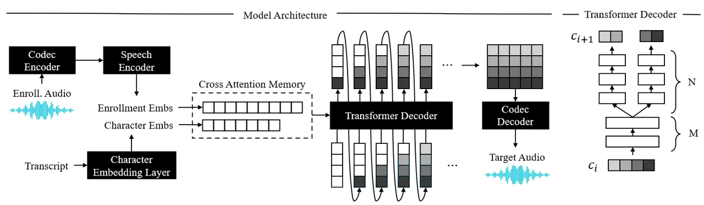
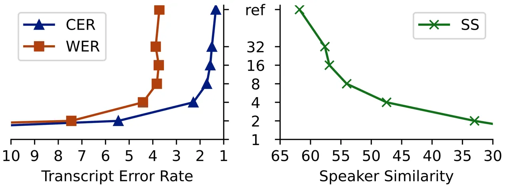
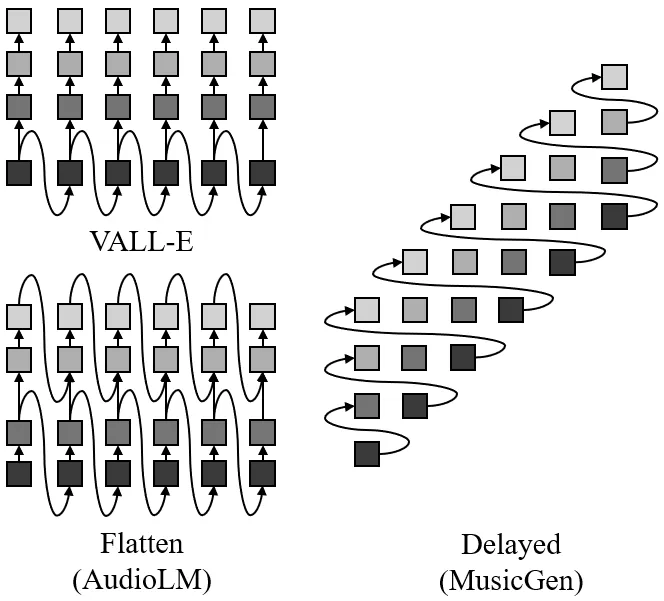

# LiveSpeech: Low-Latency Zero-shot Text-to-Speech via Autoregressive Modeling of Audio Discrete Codes

Trung Dang    David Aponte    Dung Tran    Kazuhito Koishida

###### Abstract

Prior works have demonstrated zero-shot text-to-speech by using a
generative language model on audio tokens obtained via a neural audio
codec. It is still challenging, however, to adapt them to low-latency
scenarios. In this paper, we present LiveSpeech - a fully autoregressive
language model-based approach for zero-shot text-to-speech, enabling
low-latency streaming of the output audio. To allow multiple token
prediction within a single decoding step, we propose (1) using adaptive
codebook loss weights that consider codebook contribution in each frame
and focus on hard instances, and (2) grouping codebooks and processing
groups in parallel. Experiments show our proposed models achieve
competitive results to state-of-the-art baselines in terms of content
accuracy, speaker similarity, audio quality, and inference speed while
being suitable for low-latency streaming applications.

###### keywords

audio generation, text-to-speech, zero-shot, streaming

^(†)^(†)address: Applied Sciences Group, Microsoft Corp,
USA^(†)^(†)email: trungdang@, davidaponte@, dung.tran@,
kazukoi@microsoft.com

## 1 Introduction

Zero-shot text-to-speech (TTS) has gained attention in recent years due
to its ability to synthesize speech that is similar to any voice without
speaker-specific model adaptation \[1, 2, 3, 4\]. Although recent
research in zero-shot TTS has made significant progress in achieving
high audio quality and speaker similarity through the utilization of
language models applied to tokenized audio \[1, 2\] or diffusion models
\[4\], there remains a challenge in adapting them to a real-time or
low-latency setting. This challenge arises due to the non-autoregressive
nature of some models or the high inference time per step associated
with others. The development of a low-latency zero-shot TTS system holds
the potential to unlock a diverse range of applications, particularly in
facilitating live communication scenarios, including speech-to-speech
translation, accent conversion, speech simplification, or disfluency
removal.

In streaming applications, autoregressive models offer a distinct
advantage due to their ability to generate speech incrementally, making
them well-suited for tasks that require immediate responses. Recent
research has demonstrated that zero-shot TTS can be accomplished by
harnessing the capabilities of language models on discrete tokens
obtained from neural audio codecs \[1, 5\]. However, due to the high
bandwidth nature of audio, a single audio frame is usually represented
by multiple codes, which may also be sequentially dependent \[6\] thus
need to be predicted in sequential transformer steps. To speed up the
generation, a delayed generation pattern \[3\] has been proposed to
shift codes in each frame in order to produce codes from different
frames within a single step, while codes from the same frame are
produced in sequential steps. However, the bandwidth of one decoding
step may limit the number of codes that can be predicted in parallel,
since the model must maintain and process the information of all codes
throughout its layers. While this can parallelize 4-codebook generation
in the music generation task with a large model size \[3\], it may not
perform well in the low-latency TTS task for a lower model capacity, and
a higher number of codebooks (e.g., 8 or 16) that are required to
represent a wide range of subtle variations in human speech.

In this work, we propose LiveSpeech - a fully autoregressive transformer
architecture for the zero-shot TTS task and demonstrate its competitive
performance to existing approaches, as well as its ability to perform
low-latency inference in a streaming manner. Our contributions can be
summarized as follows: (1) We introduce a loss weighing mechanism to
redistribute the model capacity across codebooks. We weigh each code
based on its contribution to the constructed frame and whether more
important codes in the same frame are accurately predicted with high
confidence. Our model can efficiently scale the number of codebooks for
each generated frame to 16 without additional inference cost, (2) we
show that how enhancing the step capability by modeling groups of
codebooks in parallel can further improve the performance. While the
computation increases, codes in these groups can be predicted in
parallel without introducing significant inference time.

## 2 Related Works

Traditional works on speech generation adopt a transformer architecture
to generate downsampled speech frames of mel-spectrograms \[7, 8, 9,
10\], which can be decoded to the raw audio by using a vocoder. However,
generating mel-spectrogram is hard - it is susceptible to decoding noise
and performs poorly on zero-shot or noisy condition \[11\]. Recently,
the sequential and continuous nature of speech has provided inspiration
for leveraging successful techniques employed in text generation, such
as language models, and in image generation, such as diffusion models.
Both the language modeling and diffusion approach have demonstrated
their efficiency in generating high-fidelity audio in a wide variety of
audio and speech generation tasks \[5, 12, 13, 1, 3, 14, 15\]. When it
comes to streaming applications, autoregressive language model-based
approaches have an advantage as they can generate audio with low latency
by processing data sequentially, while diffusion models have to rely on
successive non-autoregressive queries to reconstruct audio.

To leverage the language model’s capability in the audio domain, vector
quantization has been used to represent audio signals as discrete codes.
While some works \[16, 15, 17\] leverage tokens obtained via
self-supervised pretraining, which can be fused with speaker information
during generation, other works \[1, 3\] rely on tokens from an audio
codec trained with residual vector quantization (RVQ) \[6, 18, 19\],
which can be solely used to synthesize the raw audio. AudioLM \[5\]
proposes using autoregressive transformers to generate one token per
step, where coarse and fine acoustic tokens are modeled separately.
VALL-E \[1\] models the first token in each audio frame with an
autoregressive transformer, and sequentially predicts the second to the
last codes for all frames using a shared non-autoregressive transformer.
MusicGen \[3\] proposes a delayed generation pattern that can
parallelize 4-code generation in each step. In this work, we adopt the
delayed generation pattern in MusicGen, with proposed techniques to
enable high-fidelity and low-latency speech generation.

## 3 Background

In this section, we go over some key concepts in audio tokenization and
how to use them in audio generation.

##### Audio Compression with Residual Vector Quantization

A pivotal element for applying language models in the audio domain is an
audio tokenization component, which usually comprises an encoder, a
quantizer, and a decoder \[6, 18, 19, 20\]. The encoder transforms the
audio into a latent speech representation of $`T`$ time steps
$`\bm{z}_{1},\bm{z}_{2},...,\bm{z}_{T}`$, which is recursively quantized
by a sequence of quantizers to produce $`Q`$ codes
$`\bm{c}_{i}=[c_{i}^{(1)},c_{i}^{(2)},...,c_{i}^{(Q)}]\in\mathcal{C}^{Q}`$
for each $`\bm{z}_{i}`$, where $`\mathcal{C}`$ is the set of codebook
indices. As a result, the first few codes mainly represent the content
of the audio, while the later codes represent fine-grained details
\[1\].We refer to codes in early codebooks as high-level, and codes in
later codebooks as low-level.

##### Audio Generation via Discrete Tokens

The compression rate and reconstruction quality of RVQ codes inspire a
number of works to formulate audio generation as a language modeling
task; however predicting codes sequentially poses a challenge of high
inference time. MusicGen \[3\] proposes reducing the context size by
predicting $`Q`$ codes together, which is made possible by shifting the
codebooks so that each step predicts $`Q`$ codes, but only one comes
from each frame. Let
$`\bm{C^{\prime}}=\left[\bm{c}^{\prime}_{1},...,\bm{c}^{\prime}_{T^{\prime}}\right]`$
be the shifted codes obtained from $`\bm{C}`$, where
$`T^{\prime}=T+Q-1`$ is the length of the shifted code sequence. We have
$`\bm{c}^{\prime}_{i}=\left[c_{i}^{(1)},\dots,c_{i-(Q-1)}^{(Q)}\right]`$,
assuming padding values for invalid code positions. $`\bm{C^{\prime}}`$
is modeled by the transformer instead of $`\bm{C}`$. As a result, the
$`i`$-th audio frame in $`\bm{C}`$ is fully generated at the
$`(i+Q-1)`$-th step in $`\bm{C^{\prime}}`$. This provides an inexact
autoregressive decomposition to model the distribution of discrete
codes. Although the performance of the delayed pattern is still behind
that of the flatten pattern, it produces reasonable balance between the
audio quality and the inference budget.

##### The Content Accuracy vs Voice Quality Trade-off

With the delayed generation pattern, the model needs to distribute its
capacity across all codebooks to produce one code from each of them.
With limited model capacity, prioritizing some codebooks may lead to the
poor prediction of other codebooks, which results in a content
accuracy - voice quality trade-off. In Table 1, we show that training
two models that shares the architecture, one being assigned equal
weights to all codebook losses and the other being assigned higher
weights for the high-level codebooks, does not yield satisfactory scores
for both aspects in either of these models. In the following section, we
propose several approaches to mitigate this issue.

| Focus on         | CER ($`\downarrow`$) | WER ($`\downarrow`$) | SS ($`\uparrow`$) | O-MOS ($`\uparrow`$) |
| ---------------- | -------------------- | -------------------- | ----------------- | -------------------- |
| None             | 12.4                 | 23.8                 | 58.5              | 3.66                 |
| High-level codes | 2.4                  | 4.7                  | 49.4              | 3.33                 |

Table 1: Content accuracy (represented by CER, WER) - voice quality
(represented by SS, O-MOS) trade-off when adjusting the codebook
priority. Metric details are provided in Section 5.

## 4 Our Proposed Model

In this section, we describe our model and two proposed techniques to
efficiently predict all codebooks in a decoding step. For convenience,
we use $`[c_{1},\dots,c_{T}]`$ instead of
$`[c^{\prime}_{1},\dots,c^{\prime}_{T^{\prime}}]`$ to denote input
tokens for each transformer step during training.



Figure 1: (Left) Our proposed architecture. Our model consists of a
neural audio codec to convert between waveforms and discrete codes, a
speech encoder to infer enrollment embeddings, and a transformer decoder
to generate discrete tokens from conditions. (Right) Transformer decoder
with parallel codebook group heads

### 4.1 Model Architecture

Our model shares the architecture with a GPT-style autoregressive
language model. It consists of a neural audio codec that encodes raw
audio to codes and decodes codes back to raw audio, a speech encoder and
a text embedding layer to provides voice and text condition vectors,
respectively, and a transformer decoder to generate audio tokens. For
the speech encoder, we employ an encoder-decoder transformer, which
takes a variable-length enrollment speech and produces a fixed-length
sequence of features in a non-autoregressive manner. The main
transformer decoder processes $`Q`$ codes from $`Q`$ codebooks in each
time step. The decoder takes a sum of all code embeddings
$`\bm{x}_{t}=\sum_{q=1}^{Q}\text{Emb}_{q}\left(c_{t}^{(q)}\right)`$ and
predicts all codes from a vector output
$`\bm{p}_{t}^{(q)}=\text{Softmax}(\text{Proj}_{q}\left(\bm{o}_{t}\right))`$,
where $`\text{Emb}_{q},\text{Proj}_{q}`$ are the embedding and
projection layer for the $`q`$-th codebook, $`\bm{x}_{t}`$,
$`\bm{o}_{t}`$ are the input and output for the transformer step $`t`$,
$`\bm{p}_{t}^{(q)}`$ is the softmax probability distribution of the
$`q`$-th code at the step $`t`$. The input and target codes are shifted
for delayed generation, similar to MusicGen \[3\]. Figure 1 (left)
illustrates the end-to-end architecture of our model.

### 4.2 Adaptive Codebook Weights

To address the content accuracy - voice quality tradeoff, we propose an
adaptive codebook weighing technique that enables the model to
redistribute its capacity for each codebook during training. Since
high-level codes contribute more to the final constructed frame and
guide the content of the speech, we want to prioritize them at the early
training stage. As the accuracy for high-level codebooks improves, we
can focus more on lower-level codes that are harder to predict
correctly. We propose a mechanism to fine-tune the model’s focus down to
the frame level: we assign a weight for each term in the loss based on
how well higher-level codes in the same frame are predicted. Let
$`\tilde{p}_{t}^{(q)}=\bm{p}_{t}^{(q)}\left[c_{t}^{(q)}\right]`$ be the
softmax probability value for correctly predicting the code
$`c_{t}^{(q)}`$. The weighted loss is defined as

```math
\mathcal{L}=\frac{1}{TQ}\sum_{q=1}^{Q}\sum_{t=1}^{T}\overline{w}_{t}^{(q)}\mathcal{L}_{CE}\left(\bm{p}_{t}^{(q)},c_{t}^{(q)}\right), \tag{1}
```

where $`\overline{w}_{t}^{(1)}=1`$,
$`\overline{w}_{t}^{(q>1)}=\prod_{q^{\prime}<q}\left(\tilde{p}_{t}^{(q^{\prime})}\right)^{\lambda}`$
being the weight associated with the loss of predicting $`c_{t}^{(q)}`$,
$`\lambda\geq 0`$ is a hyperparameter controlling the decay rate as we
get to lower level codebooks. The bar in $`\overline{w}`$ indicates that
it does not allow the gradients to backpropagate through. When
$`\lambda=0`$, all codebook loss terms are given the same weight. When
$`\lambda>0`$, the codebook weights at each time step $`t`$ strictly
decrease; the decreasing rate depends on the probability of predicting
correctly for all previous codes in the same frame. This is applied
recursively throughout all the codes predicted in each audio frame, and
applied differently to each audio frame in the target speech. In
general, this loss encourages the model to focus on high-level codes at
the beginning and shifts the focus to lower-level codes as training
progresses. To mitigate the weight vanishing for low-level codes, we
also introduce a threshold $`p_{\max}`$ and ignore the $`q`$-th code if
the probability of correctly predicting the code
$`\tilde{\bm{p}}_{t}^{(q)}`$ is greater than $`p_{\max}`$. Weights for
the remaining codes in the same frame are scaled such that the largest
weight becomes 1. This allows training to ignore easy predictions.

### 4.3 Parallel Codebook Group Heads

Since the transformer needs to predict codes in all codebooks within a
single step, we propose enhancing the modeling capacity of each step by
grouping $`Q`$ codes into $`G`$ groups and predict codes in each group
together in parallel decoding steps with their own hidden
representations. Besides relaxing the number of codes needed to be
predicted from a query, grouping codes also allows each group to attend
to different parts in the memory, for example, low-level codes may
benefit more from codes generated in recent time steps. Let $`L`$ be the
number of transformer layers, we keep $`M`$ shared layers for all groups
of codebooks and use $`N=L-M`$ layers to process each group
independently. At the transition layer, we split the layer output
$`\bm{o}_{t,M}`$ into $`G`$ next layer inputs by using group-specific
projection layers:
$`\bm{h}^{g}_{t,M+1}=\text{GProj}_{g}(\bm{o}_{t,M})`$, where $`g`$ is
the group index. At the last layer, we obtain the probability for each
code $`c_{t}^{(q)}`$ from the output of the corresponding group
$`\gamma(q)`$ to the $`q`$-th codebook as
$`\bm{p}_{t}^{(q)}=\text{Softmax}\left(\text{Proj}_{q}\left(\bm{o}^{\gamma(q)}_{t,L}\right)\right)`$.
Figure 1 (Right) gives an example of the transformer decoder when
$`M=2`$, $`N=3`$, $`Q=4`$, and $`G=2`$. These group specific layers only
slightly increase the model size, although the inference time and memory
increase similarly to when increasing the batch size by $`G`$ times for
the last $`N`$ layers. On capable hardware, this may have an
insignificant impact on the speed due to parallelization.

## 5 Experiments

### 5.1 Setup

##### Model Architecture

For audio codec, we use Encodec 24kHz \[18\] at 12kbps compression rate
and 75fps where each frame is represented by 16 codes of total 160 bits.
Our transformer decoder consists of 12 layers, each having 16 heads,
with a layer dimension of 1,536 and a feedforward dimension of 6,144.
The speech encoder has a non-autoregressive transformer architecture of
6 layers, 8 heads, and a hidden and output dimension of 1,024, which
takes continuous speech features from the Encodec and outputs a sequence
of 64 vector features. For models with parallel codebook group heads, we
group 16 codes into 8 groups of two each. The decoder has the same
configuration of 12 transformer layers with the first $`M=6`$ layers
processing frame features and the last $`N=6`$ layers processing group
features in parallel. The size of the model without/with group heads is
581M/615M, including 77M parameters for the speech encoder that is not
used during decoding.

##### Dataset

We pretrain our model on LibriLight \[21\], a large unlabelled speech
corpus of 60k hours. Since transcripts are not available, we employ ASR
models to derive the transcript of all audio segments in the dataset.
Specifically, we split recordings by each speaker into segments of 160
to 200 seconds, and use Wav2Vec 2.0 Large (LV-60) + Self Training \[22\]
to extract character-base transcripts. Each audio segment in the batch
has a duration ranging from 0.1 to 10 seconds, which is sampled such
that it start and end with a complete word based on its time-align
grapheme sequence. For better data loading efficiency during training,
audio is only stored and available in the form of codec codes extracted
by Encodec \[18\]. We use the dev-clean set of LibriTTS \[23\] as the
validation set and select checkpoints based on the value of CER on the
validation set. Our test set is derived from the test-clean set of
LibriTTS, where we only keep audio of 1-10s duration and randomly sample
an enrollment speech of 3-5s audio within 50s from the target audio.
This results in a test set of 4.4 hours of 3,624 samples.

|                                   |                      |      |                      |      |                      |      |                   |      |                      |      |                      |                      |                       |
| --------------------------------- | -------------------- | ---- | -------------------- | ---- | -------------------- | ---- | ----------------- | ---- | -------------------- | ---- | -------------------- | -------------------- | --------------------- |
|                                   | CER ($`\downarrow`$) |      | WER ($`\downarrow`$) |      | PER ($`\downarrow`$) |      | SS ($`\uparrow`$) |      | O-MOS ($`\uparrow`$) |      | S-MOS ($`\uparrow`$) | RTF ($`\downarrow`$) | Lat. ($`\downarrow`$) |
|                                   | 3s                   | 5s   | 3s                   | 5s   | 3s                   | 5s   | 3s                | 5s   | 3s                   | 5s   | 5s                   | 5s                   | 5s                    |
| Reference                         | 1.2                  |      | 2.7                  |      | 12.3                 |      | 76.7              |      | 3.80                 |      | -                    | -                    | -                     |
| Reference (16-code, 12 kbps)      | 1.4                  |      | 2.9                  |      | 12.4                 |      | 71.1              |      | 3.72                 |      | 0.00                 | -                    | -                     |
| Reference (8-code, 6 kbps)        | 1.6                  |      | 2.9                  |      | 12.4                 |      | 67.8              |      | 3.63                 |      | -0.03                | -                    | -                     |
| Industrial Baselines              |                      |      |                      |      |                      |      |                   |      |                      |      |                      |                      |                       |
| XTTS-v1                           | 2.2                  | 2.0  | 6.3                  | 5.9  | 12.3                 | 12.2 | 48.2              | 50.5 | 3.93                 | 3.93 | -                    | -                    | -                     |
| XTTS-v2                           | 2.1                  | 2.0  | 7.0                  | 6.5  | 12.7                 | 12.4 | 57.0              | 60.3 | 3.81                 | 3.83 | -                    | 0.43                 | 0.36                  |
| MetaVoice-1B                      | 7.9                  | 6.7  | 14.0                 | 12.7 | 19.4                 | 18.8 | 53.9              | 56.6 | 3.60                 | 3.60 | -                    | 2.33                 | -                     |
| Baselines                         |                      |      |                      |      |                      |      |                   |      |                      |      |                      |                      |                       |
| YourTTS \[24\]                    | 4.8                  | 4.6  | 8.9                  | 8.8  | 15.3                 | 15.4 | 46.4              | 48.5 | 3.71                 | 3.72 | -0.26                | 0.06                 | -                     |
| VALL-E (SpeechX ft) \[1, 14\]     | 4.0                  | 3.9  | 6.4                  | 6.0  | 15.2                 | 14.9 | 53.0              | 58.0 | 3.69                 | 3.70 | -0.12                | 0.87                 | -                     |
| Ours - $`\lambda=0`$              | 12.4                 | 12.4 | 24.0                 | 23.8 | 23.2                 | 23.1 | 55.5              | 58.5 | 3.63                 | 3.66 | -0.19                | 0.87                 | 0.19                  |
| Ours - $`\lambda=0.1`$            | 3.5                  | 3.6  | 6.8                  | 7.0  | 13.9                 | 14.0 | 54.4              | 57.1 | 3.57                 | 3.57 | -0.34                | 0.87                 | 0.19                  |
| + $`p_{\max}=0.5`$                | 3.0                  | 3.0  | 6.1                  | 6.0  | 13.4                 | 13.3 | 55.1              | 57.6 | 3.59                 | 3.59 | -0.14                | 0.87                 | 0.19                  |
| Ours - 8 groups, $`\lambda=0.05`$ | 3.7                  | 3.7  | 7.2                  | 6.9  | 14.4                 | 14.1 | 56.8              | 59.5 | 3.66                 | 3.66 | -0.04                | 0.96                 | 0.20                  |
| + DeepFilterNet \[25\]            | 3.8                  | 3.5  | 7.2                  | 6.8  | 14.2                 | 14.1 | 56.3              | 58.9 | 3.71                 | 3.71 | +0.01                | 0.97                 | 0.21                  |

Table 2: Comparison between our models and baselines when using 3s and
5s of enrollment audio. For reference, we also include results from
industrial baselines with access to more data and may be optimized for
the inference speed.

##### Training & Inference

Our models are trained with a batch size of 64 for 1M steps or batch
size of 16 for around 3M steps for models with codebook group heads on 4
A100 GPUs. We select the checkpoint based on a validation set of 500
samples taken from the dev-clean set of LibriTTS. We do a beam search to
scan for the decoding temperature $`\tau_{sb}\in[1.0,1.1,1.2]`$, the
number of sample-based codes $`n_{sb}=[1,2,3,4,8,16]`$, the top-$`k`$
sampling’s parameter $`k\in[10,15,20]`$ for each codebook, and choose
the best hyperparameters based on the value of
$`(\text{SS}-\text{CER})`$ on a validation set of 40 samples. For
adaptive codebook weights, we report results with $`\lambda=0.1`$, with
and without the probability threshold $`p_{\max}=0.5`$. For models with
parallel codebook group heads, we report results with $`\lambda=0.05`$.
We also include results when using an enhancer \[25\] on the generated
speech.

##### Objective Evaluation

We evaluate output audios in terms of (1) transcript error rates (TER),
(2) speaker similarity scores (SS), and (3) objective perceptual speech
quality score P.808 (O-MOS) \[26\]. For (1), we report character error
rate (CER)¹¹ 1
[hf.co/facebook/wav2vec2-base-960h](https://hf.co/facebook/wav2vec2-base-960h)
\[22\], phoneme error rate (PER)²² 2
[hf.co/facebook/wav2vec2-xlsr-53-espeak-cv-ft](https://hf.co/facebook/wav2vec2-xlsr-53-espeak-cv-ft)
\[27\], and word error rate (WER)³³ 3
[hf.co/hubert-large-ls960-ft](https://hf.co/hubert-large-ls960-ft)
\[28\]. For (2), we report speaker similarity scores by computing the
cosine similarity between speaker embeddings obtained from ECAPA-TDNN
model⁴⁴ 4
[hf.co/speechbrain/spkrec-ecapa-voxceleb](https://hf.co/speechbrain/spkrec-ecapa-voxceleb)
\[29, 30\]. We only compute scores over samples where the reference
audio is longer than 3s, and against the full-length utterance where the
enrollment speech is extracted from. All clips are sampled to 16kHz for
evaluation. We also simulate real-time inference and measure the speed
in terms of the real-time factor (RTF) and the latency (Lat) on 1 NVIDIA
RTX 6000 Ada Generation GPU. Our latency excludes the time for the
computation of the speaker condition, which can be cached for the same
speaker. We do not report the latency for non-streaming models, in which
cases the latency depends on the generated audio duration.

##### Subjective Evaluation

We conduct subjective evaluation and report the relative Mean Opinion
Score (S-MOS) on uniformly sampled 148 utterances (around 11 mins in
total) from the test set. Each subject is asked to rate the quality of
the audio on a scale of 1-5. Each audio is evaluated by 7 subjects.

##### Baselines

We compare our models with YourTTS \[24\] (87M) and VALL-E \[1\] (488M)
using pretrained checkpoints. The VALL-E checkpoint is taken from the
SpeechX \[14\], which is reported with better performance than the
original VALL-E through multitask finetuning. We also include the
results of industrial baselines such as XTTS-v2⁵⁵ 5
[huggingface.co/coqui/XTTS-v2](https://huggingface.co/coqui/XTTS-v2) and
MetaVoice-1B⁶⁶ 6
[huggingface.co/metavoiceio/metavoice-1B-v0.1](https://huggingface.co/metavoiceio/metavoice-1B-v0.1),
whose training details and datasets are not published.

### 5.2 Results

##### Speech Quality

Table 2 compares our models to other baselines. Our TTS adapted MusicGen
model ($`\lambda=0`$) performs well on the SS metric; however
CER/WER/PER (or TER) scores are noticeably high. A large improvement in
TER scores is achieved when using adaptive codebook weights; however, SS
and MOS scores are also affected. Our model with $`p_{\max}=0.5`$ or 8
codebook groups further improves these scores to be better than or
comparable to baselines. In terms of subjective scores, our 8-group
model shows better quality than the baseline systems and comes close to
the 6kbps compressed reference audio, with the special case when using
an enhancer where no drop is observed compared to the 12kbps reference
(upper bound). Samples are available at
[trungd.github.io/livespeech](https://trungd.github.io/livespeech).

##### Speed & Latency

Our RTF is comparable to VALL-E’s, despite being fully auto-regressive.
The model with 8 groups has RTF increased only by 0.09s or 10%, showing
the efficiency of parallelization. Our model operates with a delay of
200ms, making it suitable for low-latency applications.

## 6 Conclusion

We present LiveSpeech, a fully autoregressive zero-shot text-to-speech
model that enables live streaming of output audio. The proposed
techniques, including adaptive codebook loss weights and parallel
processing of codebook groups, show competitive performance and
successfully address the challenges of existing systems in a real-time
or low-latency setting.

## References

- \[1\] C. Wang, S. Chen, Y. Wu, Z. Zhang, L. Zhou, S. Liu, Z. Chen,
  Y. Liu, H. Wang, J. Li _et al._, “Neural codec language models are
  zero-shot text to speech synthesizers,” _arXiv preprint
  arXiv:2301.02111_, 2023.
- \[2\] Z. Zhang, L. Zhou, C. Wang, S. Chen, Y. Wu, S. Liu, Z. Chen,
  Y. Liu, H. Wang, J. Li _et al._, “Speak foreign languages with your
  own voice: Cross-lingual neural codec language modeling,” _arXiv
  preprint arXiv:2303.03926_, 2023.
- \[3\] J. Copet, F. Kreuk, I. Gat, T. Remez, D. Kant, G. Synnaeve,
  Y. Adi, and A. Défossez, “Simple and controllable music generation,”
  _arXiv preprint arXiv:2306.05284_, 2023.
- \[4\] K. Shen, Z. Ju, X. Tan, Y. Liu, Y. Leng, L. He, T. Qin, S. Zhao,
  and J. Bian, “Naturalspeech 2: Latent diffusion models are natural and
  zero-shot speech and singing synthesizers,” _arXiv preprint
  arXiv:2304.09116_, 2023.
- \[5\] Z. Borsos, R. Marinier, D. Vincent, E. Kharitonov, O. Pietquin,
  M. Sharifi, D. Roblek, O. Teboul, D. Grangier, M. Tagliasacchi
  _et al._, “Audiolm: a language modeling approach to audio generation,”
  _IEEE/ACM Transactions on Audio, Speech, and Language
  Processing_, 2023.
- \[6\] N. Zeghidour, A. Luebs, A. Omran, J. Skoglund, and
  M. Tagliasacchi, “Soundstream: An end-to-end neural audio codec,”
  _IEEE/ACM Transactions on Audio, Speech, and Language Processing_,
  vol. 30, pp. 495–507, 2021.
- \[7\] J. Shen, R. Pang, R. J. Weiss, M. Schuster, N. Jaitly, Z. Yang,
  Z. Chen, Y. Zhang, Y. Wang, R. Skerrv-Ryan _et al._, “Natural tts
  synthesis by conditioning wavenet on mel spectrogram predictions,” in
  _2018 IEEE international conference on acoustics, speech and signal
  processing (ICASSP)_. IEEE, 2018, pp. 4779–4783.
- \[8\] W. Ping, K. Peng, A. Gibiansky, S. O. Arik, A. Kannan,
  S. Narang, J. Raiman, and J. Miller, “Deep voice 3: Scaling
  text-to-speech with convolutional sequence learning,” _arXiv preprint
  arXiv:1710.07654_, 2017.
- \[9\] Y. Wu, X. Tan, B. Li, L. He, S. Zhao, R. Song, T. Qin, and T.-Y.
  Liu, “Adaspeech 4: Adaptive text to speech in zero-shot scenarios,”
  _arXiv preprint arXiv:2204.00436_, 2022.
- \[10\] E. Casanova, C. Shulby, E. Gölge, N. M. Müller, F. S.
  De Oliveira, A. C. Junior, A. d. S. Soares, S. M. Aluisio, and M. A.
  Ponti, “Sc-glowtts: An efficient zero-shot multi-speaker
  text-to-speech model,” pp. 3645–3649, 2021.
- \[11\] L.-W. Chen, S. Watanabe, and A. Rudnicky, “A vector quantized
  approach for text to speech synthesis on real-world spontaneous
  speech,” _arXiv preprint arXiv:2302.04215_, 2023.
- \[12\] Y. Bai, T. Dang, D. Tran, K. Koishida, and S. Sojoudi,
  “Accelerating diffusion-based text-to-audio generation with
  consistency distillation,” _arXiv preprint arXiv:2309.10740_, 2023.
- \[13\] D. Yang, J. Yu, H. Wang, W. Wang, C. Weng, Y. Zou, and D. Yu,
  “Diffsound: Discrete diffusion model for text-to-sound generation,”
  _IEEE/ACM Transactions on Audio, Speech, and Language
  Processing_, 2023.
- \[14\] X. Wang, M. Thakker, Z. Chen, N. Kanda, S. E. Eskimez, S. Chen,
  M. Tang, S. Liu, J. Li, and T. Yoshioka, “Speechx: Neural codec
  language model as a versatile speech transformer,” _arXiv preprint
  arXiv:2308.06873_, 2023.
- \[15\] M. Lajszczak, G. C. Ruiz, Y. Li, F. Beyhan, A. van Korlaar,
  F. Yang, A. Joly, Álvaro Martín Cortinas, A. Abbas, A. Michalski,
  A. Moinet, S. Karlapati, E. Muszynska, H. Guo, B. Putrycz, S. L.
  Gambino, K. Yoo, E. Sokolova, and T. Drugman, “Base tts: Lessons from
  building a billion-parameter text-to-speech model on 100k hours of
  data,” _arXiv_, 2024.
- \[16\] T. Dang, D. Tran, P. Chin, and K. Koishida, “Training robust
  zero-shot voice conversion models with self-supervised features,” in
  _ICASSP 2022-2022 IEEE International Conference on Acoustics, Speech
  and Signal Processing (ICASSP)_. IEEE, 2022, pp. 6557–6561.
- \[17\] E. Kharitonov, D. Vincent, Z. Borsos, R. Marinier, S. Girgin,
  O. Pietquin, M. Sharifi, M. Tagliasacchi, and N. Zeghidour, “Speak,
  read and prompt: High-fidelity text-to-speech with minimal
  supervision,” _Transactions of the Association for Computational
  Linguistics_, vol. 11, pp. 1703–1718, 2023.
- \[18\] A. Défossez, J. Copet, G. Synnaeve, and Y. Adi, “High fidelity
  neural audio compression,” _arXiv preprint arXiv:2210.13438_, 2022.
- \[19\] R. Kumar, P. Seetharaman, A. Luebs, I. Kumar, and K. Kumar,
  “High-fidelity audio compression with improved rvqgan,” _arXiv
  preprint arXiv:2306.06546_, 2023.
- \[20\] X. Jiang, X. Peng, Y. Zhang, and Y. Lu, “Disentangled feature
  learning for real-time neural speech coding,” in _ICASSP 2023-2023
  IEEE International Conference on Acoustics, Speech and Signal
  Processing (ICASSP)_. IEEE, 2023, pp. 1–5.
- \[21\] J. Kahn, M. Rivière, W. Zheng, E. Kharitonov, Q. Xu, P.-E.
  Mazaré, J. Karadayi, V. Liptchinsky, R. Collobert, C. Fuegen _et al._,
  “Libri-light: A benchmark for asr with limited or no supervision,” in
  _ICASSP 2020-2020 IEEE International Conference on Acoustics, Speech
  and Signal Processing (ICASSP)_. IEEE, 2020, pp. 7669–7673.
- \[22\] A. Baevski, Y. Zhou, A. Mohamed, and M. Auli, “wav2vec 2.0: A
  framework for self-supervised learning of speech representations,”
  _Advances in neural information processing systems_, vol. 33, pp.
  12 449–12 460, 2020.
- \[23\] H. Zen, V. Dang, R. A. J. Clark, Y. Zhang, R. J. Weiss, Y. Jia,
  Z. Chen, and Y. Wu, “Libritts: A corpus derived from librispeech for
  text-to-speech,” in _Interspeech_, 2019.
- \[24\] E. Casanova, J. Weber, C. D. Shulby, A. C. Junior, E. Gölge,
  and M. A. Ponti, “Yourtts: Towards zero-shot multi-speaker tts and
  zero-shot voice conversion for everyone,” in _International Conference
  on Machine Learning_. PMLR, 2022, pp. 2709–2720.
- \[25\] H. Schröter, A. N. Escalante-B., T. Rosenkranz, and A. Maier,
  “DeepFilterNet: A low complexity speech enhancement framework for
  full-band audio based on deep filtering,” in _ICASSP 2022 IEEE
  International Conference on Acoustics, Speech and Signal Processing
  (ICASSP)_. IEEE, 2022.
- \[26\] C. K. Reddy, V. Gopal, and R. Cutler, “Dnsmos p. 835: A
  non-intrusive perceptual objective speech quality metric to evaluate
  noise suppressors,” in _ICASSP 2022-2022 IEEE International Conference
  on Acoustics, Speech and Signal Processing (ICASSP)_. IEEE, 2022, pp.
  886–890.
- \[27\] Q. Xu, A. Baevski, and M. Auli, “Simple and effective zero-shot
  cross-lingual phoneme recognition,” _arXiv preprint
  arXiv:2109.11680_, 2021.
- \[28\] W.-N. Hsu, B. Bolte, Y.-H. H. Tsai, K. Lakhotia,
  R. Salakhutdinov, and A. Mohamed, “Hubert: Self-supervised speech
  representation learning by masked prediction of hidden units,”
  _IEEE/ACM Transactions on Audio, Speech, and Language Processing_,
  vol. 29, pp. 3451–3460, 2021.
- \[29\] B. Desplanques, J. Thienpondt, and K. Demuynck, “ECAPA-TDNN:
  emphasized channel attention, propagation and aggregation in TDNN
  based speaker verification,” in _Interspeech 2020_. ISCA, 2020, pp.
  3830–3834.
- \[30\] M. Ravanelli, T. Parcollet, P. Plantinga, A. Rouhe, S. Cornell,
  L. Lugosch, C. Subakan, N. Dawalatabad, A. Heba, J. Zhong, J.-C. Chou,
  S.-L. Yeh, S.-W. Fu, C.-F. Liao, E. Rastorgueva, F. Grondin, W. Aris,
  H. Na, Y. Gao, R. D. Mori, and Y. Bengio, “SpeechBrain: A
  general-purpose speech toolkit,” 2021, arXiv:2106.04624.
- \[31\] R. S. Roman, Y. Adi, A. Deleforge, R. Serizel, G. Synnaeve, and
  A. Defossez, “From discrete tokens to high-fidelity audio using
  multi-band diffusion,” _Advances in neural information processing
  systems_, 2023.
- \[32\] C. K. Reddy, V. Gopal, and R. Cutler, “Dnsmos: A non-intrusive
  perceptual objective speech quality metric to evaluate noise
  suppressors,” in _ICASSP 2021 IEEE International Conference on
  Acoustics, Speech and Signal Processing (ICASSP)_. IEEE, 2021, pp.
  6493–6497.

## Appendix A Appendix

### A.1 Background

#### A.1.1 Audio Compression with Residual Vector Quantization

A pivotal element for applying language models in the audio domain is an
audio tokenization component. An encoder (usually a multi-layer
convolutional encoder) encodes the audio into a latent speech
representation of $`T`$ time steps
$`\bm{z}_{1},\bm{z}_{2},...,\bm{z}_{T}\in\mathcal{Z}`$. A residual
vector quantizer is a sequence of $`Q`$ quantizers that recursively
quantize the residual from feature vectors $`\bm{z}_{i}`$ to codes
$`\bm{c}_{i}=[c_{i}^{(1)},c_{i}^{(2)},...,c_{i}^{(Q)}]\in\mathcal{C}^{Q}`$
, where $`\mathcal{C}`$ is the set of codebook indices. For some feature
$`\bm{z}`$, this is processed as follows:
$`\bm{r}_{1}=\bm{z},c^{(q)}=\arg\min_{k}(||\bm{r}^{(q)}-\bm{d}_{k}^{(q)}||),\bm{r}^{(q+1)}=\bm{r}^{(q)}-\bm{d}^{(q)}_{c^{(q)}}`$
for $`q\in[1,Q]`$, where $`\bm{r}^{(q)}`$ is the residual to quantize at
the $`q`$-th quantizer. When applying this to all time steps
$`\bm{z}_{1},\bm{z}_{2},...,\bm{z}_{T}`$, the original signal is encoded
as $`\bm{C}\in\mathcal{C}^{Q\times T}`$.

When the discrete audio representation is learned through a
self-reconstruction task, it becomes a neural audio codec that can be
used to compress an audio to a very low bit-rate \[6, 18\]. The training
is usually aided with neural network discriminators to improve the
reconstruction quality.



Figure 2: Transcript error rates (CER, WER) and speaker similarity
scores (SS\_(e)) of the reference audio decoded by the number of
codebooks used. ‘ref’ represents the original audio. Metrics are given
details in Section 5.1

This provides audio codes that can be generated autoregressively, since
in a single frame, each code only depends on previous codes. As a
result, the first few codes mainly represent the content of the audio,
while the later codes represent fine-grained details. This is shown in
Figure 2, where the audio reconstructed from the first two codes are
already able to achieve around 5% CER, while the speaker similarity
continues to benefit from an increasing number of codebooks. We refer to
codes in early codebooks as high-level codes, and codes in later
codebooks as low-level codes.

#### A.1.2 Audio Generation via Discrete Tokens

| Codec     | BR  | SR  | CER | PER  | WER | SS\_(e) | SS\_(s) |
| --------- | --- | --- | --- | ---- | --- | ------- | ------- |
| Reference | -   | -   | 1.3 | 12.5 | 2.5 | 64.2    | 94.6    |
| Encodec   | 6   | 24  | 1.7 | 12.5 | 2.7 | 56.2    | 93.2    |
| Encodec   | 12  | 24  | 1.6 | 12.4 | 2.6 | 59.1    | 93.8    |
| TF-Codec  | 8   | 16  | 1.5 | 12.4 | 2.6 | 59.4    | 94.1    |
| DAC       | 6   | 16  | 1.5 | 12.5 | 2.7 | 60.5    | 94.4    |
| DAC       | 8   | 24  | 1.4 | 12.4 | 3.1 | 61.5    | 94.4    |
| DAC       | 16  | 24  | 1.4 | 12.4 | 2.5 | 63.2    | 94.5    |

Table 3: Details of audio tokenizers Encodec \[18\], TF-Codec \[20\],
DAC \[19\] with their compression bit rate (BR, kbps) and their scores
on zero-shot TTS metrics. The actual bit rate of TF-Codec is 6.

The sequential dependency of RVQ codes inspires a number of works to
model them hierarchically. Since high-level and low level codes play
different roles in crafting the audio, it is reasonable to separate them
in multiple prediction stages. Prior works on speech generation choose
to draw a hard border between these two groups of codebooks - as in
AudioLM \[5\] where they separate codebooks of coarse (first 4
codebooks) and fine (remaining 8 codebooks) acoustic tokens and model
them with two stacked autoregressive transformers, or in VALL-E \[1\]
where they model the first codebook with an autoregressive transformer,
and the rest of them with a non-autoregressive transformer. In either
case, each code is predicted by a query to the transformer, and codes in
a frame have to be generated sequentially in the streaming mode.

By having only one stage, MusicGen \[3\] reduces the number of queries
to the transformer by $`Q`$ times. This is possible by shifting the
codebooks so that each step predicts $`Q`$ codes, but only one comes
from each frame. Let
$`\bm{C^{\prime}}=\left[\bm{c}^{\prime}_{1},...,\bm{c}^{\prime}_{T^{\prime}}\right]`$
be the shifted codes obtained from $`\bm{C}`$, where
$`T^{\prime}=T+Q-1`$ is the length of the shifted code sequence, then we
have
$`\bm{c}^{\prime}_{i}=\left[c_{i}^{(1)},\dots,c_{i-(Q-1)}^{(Q)}\right]`$,
assuming padding values for invalid code positions. Each decoding step
models
$`p\left(\bm{c}^{\prime}_{i}\middle|\bm{c}^{\prime}_{<i}\right)`$. The
$`i`$-th audio frame in $`\mathcal{C}`$ is fully generated at the
$`(i+Q-1)`$-th step. This provides an inexact autoregressive
decomposition to model the distribution of discrete codes. Although the
performance of the delayed pattern is still behind that of the flatten
pattern, it produces reasonable audio quality under a limited inference
budget.



Figure 3: Different decoding pattern to generate RVQ codes with $`Q=4`$
codebooks: VALL-E \[1\], Flatten \[5\], and Delayed \[3\]. Both VALL-E
and Flatten require autoregressive decoding in both the depth and width
dimension, in which VALL-E uses a non-autoregressive transformer from
the second codebook. The Delayed pattern only needs to perform
autoregressive decoding in one dimension. Moreover, all codes in each
autoregressive step can be predicted in a single transformer query.

|                                     | Encodec |      |       | Encodec + Enhancer |      |       | MBD  |      |       | MBD + Enhancer |      |       |
| ----------------------------------- | ------- | ---- | ----- | ------------------ | ---- | ----- | ---- | ---- | ----- | -------------- | ---- | ----- |
|                                     | CER     | SS   | O-MOS | CER                | SS   | O-MOS | CER  | SS   | O-MOS | CER            | SS   | O-MOS |
| Reference                           | 1.2     | 64.4 | 3.60  | 1.5                | 63.8 | 3.65  | 1.61 | 60.1 | 3.68  | 1.5            | 59.3 | 3.80  |
| MusicGen (Adapted^(∗)) \[3\]        | 11.5    | 57.2 | 3.69  | 11.7               | 56.6 | 3.74  | 12.7 | 50.0 | 3.60  | 12.9           | 48.9 | 3.82  |
| Ours - $`\lambda=0.1`$              | 3.2     | 55.7 | 3.58  | 3.6                | 54.8 | 3.67  | 4.8  | 50.5 | 3.57  | 4.4            | 49.2 | 3.77  |
| Ours - $`\lambda=0.1,p_{\max}=0.5`$ | 3.8     | 56.5 | 3.57  | 3.9                | 55.5 | 3.67  | 4.4  | 50.4 | 3.59  | 4.4            | 49.3 | 3.80  |

Table 4: Decoder and Enhancer ablation results for 5s enrollment audio.
Encodec is the vanilla Encodec decoder \[18\]. Enhancer is
DeepFilterNet3 \[25\]. Multi-Band Diffusion (MBD) \[31\]

### A.2 Token Generation Pattern

Figure 3 compares three decoding patterns. In the delayed pattern that
we use, since each query is used to predict $`Q`$ codes at the same
time, the number of transformer steps is $`Q`$ times lower than other
patterns.

### A.3 Content Accuracy - Voice Quality Trade-off

We train a model that prioritizes high-level codebooks by assigning
higher weights to high-level codebook losses. Particularly, we
initialize weights for the first 4 codebooks as 16, 8, 4, 2, and all
other codebooks as 1. We apply exponential decay to these weights such
that they converge to 1 at the end of training. Compared to the model
without codebook loss weights, this model achieves a significantly
better CER at the expense of the SS score (Table 1).

### A.4 Decoding and Enhancement

We explored utilizing a multi-band diffusion decoder (MBD) \[31\] as a
substitute for the Encodec decoder \[18\] in order to improve audio
quality. Our observations indicated that while MBD alters the speaker
characteristics, resulting in a decrease in the SS score, it
simultaneously improves the O-MOS score \[32\], see Table 4. In
addition, MetaVoice’s findings revealed the presence of background
artifacts in the decoded waveform, which prompted them to examine the
application of an enhancer, such as DeepFilterNet \[25\], to the
generated waveform with the aim of removing artifacts introduced by MBD,
therefore refining audio quality. We report scores when using the
enhancer for both the Encodec and the MBD codec decoder in Table 4. A
uniformly sampled subset of 148 utterances are used to report these
scores.
