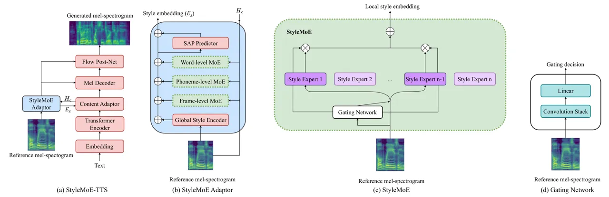
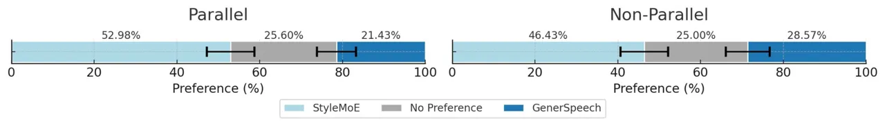
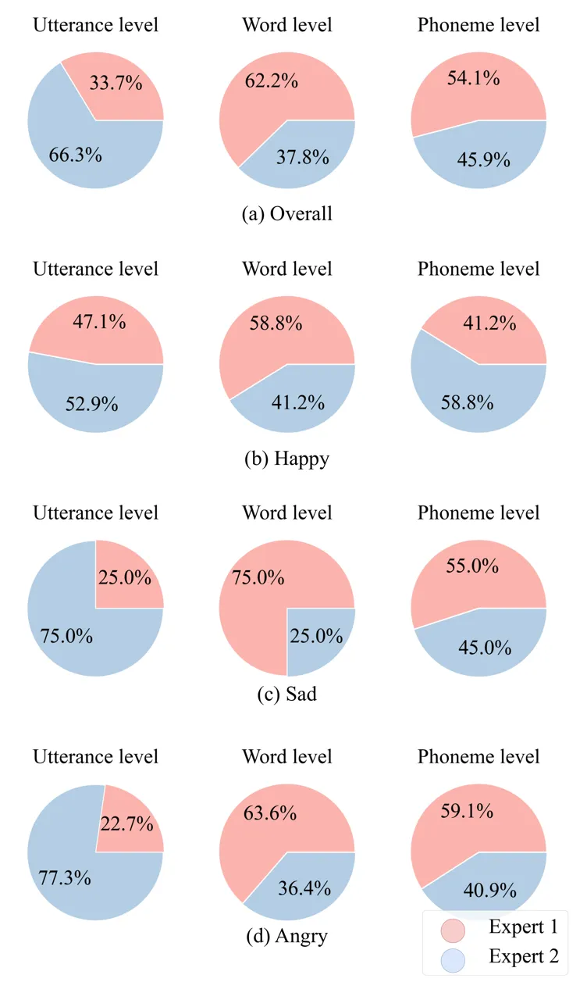

# Style Mixture of Experts for Expressive Text-To-Speech Synthesis

Ahad Jawaid Affiliation: The University of Texas at Dallas, USA   
Shreeram Suresh Chandra Affiliation: The University of Texas at Dallas,
USA    Junchen Lu Affiliation: National University of Singapore,
Singapore    Berrak Sisman Affiliation: ahad.jawaid@utdallas.edu,
shreeramsuresh.chandra@utdallas.edu Affiliation: The University of Texas
at Dallas, USA

###### Abstract

Recent advances in style transfer text-to-speech (TTS) have improved the
expressiveness of synthesized speech. However, encoding stylistic
information (e.g., timbre, emotion, and prosody) from diverse and unseen
reference speech remains a challenge. This paper introduces StyleMoE, an
approach that addresses the issue of learning averaged style
representations in the style encoder by creating style experts that
learn from subsets of data. The proposed method replaces the style
encoder in a TTS framework with a Mixture of Experts (MoE) layer. The
style experts specialize by learning from subsets of reference speech
routed to them by the gating network, enabling them to handle different
aspects of the style space. As a result, StyleMoE improves the style
coverage of the style encoder for style transfer TTS. Our experiments,
both objective and subjective, demonstrate improved style transfer for
diverse and unseen reference speech. The proposed method enhances the
performance of existing state-of-the-art style transfer TTS models and
represents the first study of style MoE in TTS¹¹ 1 Speech Samples:
https://stylemoe.github.io/styleMoE/. ²² 2 This work was funded by NSF
CAREER award IIS-2338979.

## 1 Introduction

Text-to-speech (TTS) frameworks have significantly evolved, aiming to
produce speech that is not only intelligible but also rich in emotional
and prosodic information, mirroring human-like expressiveness \[1\].
Advances in neural TTS models have made significant improvements in
generating high-fidelity speech \[2, 3, 4\]. The one-to-many mapping
issue in TTS presents a significant challenge, where a single text input
can yield multiple speech outputs with a variety of speaking styles,
depending on context, emotion, or speaker intention. Hence, traditional
methods, such as modeling under the L1 loss, often result in
monotonous-sounding speech \[5, 6\]. To address this issue, researchers
have developed various conditioning techniques. Initially, these
techniques involved incorporating emotional and speaker identity labels
\[7, 8\]. Subsequently, advancements led to direct style transfer from
reference speech through neural style encoders to better capture
expressiveness and prosodic information \[9, 10, 11\]. Further
refinements in modeling styles included integrating additional acoustic
features  \[12, 13\] and separating content from style for disentangled
learning, and other strategies such as hierarchical encoding to capture
stylistic details at different resolutions \[14, 15\].

Mixture of Experts (MoE) \[16\] is an ensemble technique that divides a
complex problem space into more manageable subspaces, each handled by
specialized experts. The gating mechanism facilitates the division by
routing input samples to the most suitable expert(s), effectively
implementing a "divide and conquer" strategy \[16, 17\]. The MoE
technique has been shown to enhance model generalization by favoring
combining strategies that lower the variance error \[17\]. Additionally,
it can be used for conditional computation, allowing models to scale
effectively without incurring proportional increases in computational
costs \[18\]. MoE has found significant applications in scaling large
language models \[18\] and vision models \[19\], and in learning
factored representations of datasets \[20\], showcasing its versatility
and efficacy across various domains.

Motivated by the capabilities of MoE, we propose StyleMoE, a novel
approach to enhance style transfer in TTS systems, addressing the
challenges of capturing diverse and unseen speaking styles. The proposed
method replaces the style encoder in a TTS framework with a mixture of
style experts alongside a gating network to select which expert to use
based on the reference speech. To ensure this method maintains a
computational cost similar to the original TTS model, we use a sparse
MoE layer to limit the number of experts utilized during inference
 \[18\]. The proposed method allows for better style transfer from
out-of-distribution reference speech since each style expert optimizes
on a subset of data, which avoid the issue of learning averaged
representations when optimizing a single style encoder. The main
contributions of the paper are summarized as follows: 1) We utilize the
mixture of experts technique to divide the style embedding space into
multiple tractable subsets, improving the ability of the style transfer
TTS model to handle more diverse and unseen speech styles. 2) We develop
a gating network to route reference speech to appropriate style experts.
Here, we also introduce sparsity to ensure that the computation cost at
both training and inference doesn’t scale with the increase in model
capacity. 3) Our method is designed to be easily applied various style
transfer TTS frameworks to improve the performance of style encoders.



Figure 1: The architecture of StyleMoE-TTS. Red modules represent
modules from GenerSpeech \[15\]. Green modules represent the Mixture of
Experts layer. Purple modules represent style experts. The darker purple
modules represent the style experts chosen by the gating network.
Subfigures (a) and (b) illustrate the integration of StyleMoE into
StyleMoE-TTS. Subfigure (c) depicts the StyleMoE layer, wherein each
style expert block is a style reference encoder. Subfigure (d)
illustrates the gating network.

## 2 Related Work

### 2.1 Mixture of Experts

The Mixture of Experts technique, initially introduced by Jacobs et
al. \[16\], has experienced a resurgence in various domains, especially
in large-scale neural networks \[18\]. MoE architectures segment a
problem space into subspaces, each handled by an expert. The gating
mechanism partitions the space by acting as a router, directing input
data to experts, causing them to specialize through the process of
optimization \[16, 17\]. MoE models can be categorized into two types:
one that implicitly partitions the problem space through a gating
network optimized by based on a loss function, and another that
explicitly divides the space, often using clustering techniques to
identify subspaces before training begins \[17\].

In the TTS domain, our research builds upon and diverges from existing
works like Teh et al. \[21\] and Adaspeech 3 \[22\], which incorporated
ensembles or a MoE to enhance the modeling of prosodic features,
including pitch, energy, and duration. Instead of predicting individual
low-level prosodic descriptors, our approach leverages MoE to directly
model style representations instead.

### 2.2 Style Transfer in TTS

Past works have explored various conditioning techniques to overcome the
challenges presented by the one-to-many mapping problem in TTS . Initial
approaches focused on incorporating categorical labels, such as emotion
and speaker identity \[7, 8\], to guide the speech synthesis process.
Further innovations introduced the concept of style transfer from
reference speech, utilizing neural style encoders to capture the
stylistic nuances (e.g., timbre, emotion, and prosody) of a given speech
sample \[9, 10, 11\], allowing for a more direct and effective
incorporation of expressive elements into synthesized speech. For
example, Meta-StyleSpeech \[23\] proposes a style-adaptive normalization
layer that aligns the gain and bias of text input with regard to
extracted latent style representation, achieving high expressiveness
transfer from a single short-duration speech reference. Despite
advancements, capturing a wide range of styles, especially unseen ones,
remains challenging due to models’ limited generalization and the
complexity of modeling speech styles. To address this, we propose
StyleMoE, which "divides and conquers" the style modeling problem by
using specialized style experts to model subsets of data.

## 3 Method

In this work, we introduce StyleMoE, a method to enhance the style
coverage of a TTS model by using a MoE on the style encoder. The
fundamental concept behind StyleMoE is generalizable and can potentially
be incorporated into other style transfer TTS framework. StyleMoE
involves replacing the original style encoder in a TTS framework with a
sparse Mixture of Experts \[18\], wherein each expert in the MoE retains
the original style encoder architecture but maintains separate
parameters. We chose to use a sparse MoE due to its ability to
implicitly partition the style space without the need for additional
task-specific knowledge, which is required for explicit strategies.
Furthermore, introducing sparsity enables our method to be trained
without incurring extra computational costs, making it easier to
integrate with existing TTS frameworks.

We implement StyleMoE on the GenerSpeech \[15\] framework (Figure 1 (a))
by incorporating our sparse MoE layer into each of its local style
encoders. GenerSpeech uses a hierarchical style encoder, which consists
of a global style encoder and local style encoders of varying
resolutions. Since the global style encoder is pre-trained and remains
unchanged during training, our MoE (Mixture of Experts) approach is
applied exclusively to the local style encoders, as illustrated in
Figure 1(b). It is also important to note that the number of experts
that can be utilized is limited by the parameter count of each local
style encoder.

### 3.1 The Mixture of Experts Layer

Our approach utilizes the sparse MoE implementation detailed by Shazeer
et al. \[18\] ³³ 3 Spare MoE Implementation:
https://github.com/davidmrau/mixture-of-experts, which consists of $`n`$
experts and a gating network. Each expert, denoted as $`E_{i}`$, follows
the same style encoder architecture but maintains distinct parameters;
hence, we call them style experts. The gating network, $`G`$, determines
the contribution of each style expert to the final output based on input
$`x`$, enabling a sparse, efficient computation. The local style
embedding $`y`$ is computed as described in Equation 1 and as
illustrated in Figure 1(c).

```math
y=\sum_{i=1}^{n}G(x)_{i}E_{i}(x)
```

(1)    

```math
G(x)=\text{Softmax}(\text{KeepTopK}(H(x),k))
```

(2)

### 3.2 Gating Network

The gating network controls the specialization of style experts by
directing different reference speech samples to certain experts. The
gating network $`G`$ is defined as described in Equation 2.

The noisy top-k gating function, $`H(x)`$, introduces Gaussian noise to
balance the selection of experts and ensure that each expert is
utilized. It is described as follows:

```math
H(x)_{i}=RouterNetwork(x)+\text{StandardNormal}()\cdot\text{Softplus}((x\cdot W_{noise})_{i}) \tag{3}
```

Here, the amount of noise per component $`i`$ is controlled by a second
trainable weight matrix $`W_{noise}`$. The RouterNetwork processes the
reference speech samples and outputs an $`n`$-dimensional vector, as
shown in Figure 1 (d). The network consists of a convolutional stack
followed by a linear layer.

```math
\text{KeepTopK}(v,k)_{i}=\left\{\begin{array}[]{ll}v_{i},&\textit{if }v_{i}\textit{ is in the top }k\textit{ elements of }v\\
-\infty,&\text{otherwise}.\end{array}\right.
```

The KeepTopK function enforces the model’s sparsity by limiting the
active style experts to only the top $`k`$ most relevant ones. It does
this by setting the weights of the less relevant experts to $`-\infty`$,
which effectively gives them a weight of $`0`$ after the Softmax
operation is performed.

### 3.3 Training and Inference

During training, the StyleMoE adaptor and the TTS system are jointly
optimized using the same learning objective as the original TTS system,
which, in this case, is GenerSpeech. Our model was trained using a batch
size of 32 for 300,000 steps. During inference, StyleMoE processes
reference speech starting at the gating network $`G`$, which determines
the weightings of each style expert. These weightings identify the top
$`k`$ experts, where $`k`$ is adaptable at inference. The predictions
from the selected style experts are then combined according to their
weightings, as described in Equation (1). Finally, the resulting style
embeddings are used to condition the speech generation in GenerSpeech.

## 4 Experimental setup

### 4.1 Training and evaluation data

We trained the StyleMoE-TTS framework on the "train-clean-100" subset of
the LibriTTS dataset \[24\], comprising 100 hours of multi-speaker
speech data. We downsampled the dataset from 24 kHz to 16 kHz. For our
evaluations, we conducted objective assessments using randomly chosen
speech and texts from the Emotional Speech dataset (ESD) \[25\]. We
conducted our objective and subjective evaluations from samples of the
ESD dataset to evaluate how well our methods perform on unseen samples
that have diverse styles in speaker and emotion styles.

### 4.2 Baselines

We use the official unmodified implementation of GenerSpeech ⁴⁴ 4
GenerSpeech implementation: https://github.com/Rongjiehuang/GenerSpeech
as one of our baselines since we implemented our method on top of
GenerSpeech. We developed an ensembled version of the style encoder to
demonstrate the specific advantage of using mixtures of experts for
modeling the style space. In the ensembled version, we replaced the
StyleMoE described in Figure 1(c) with the StyleEnsemble encoder. The
StyleEnsemble encoder, similar to StyleMoE, consists of $`n`$ individual
style encoders, each with distinct parameters. However, unlike StyleMoE,
which selects specific encoders, StyleEnsemble averages the outputs of
all style encoders, creating an ensemble. This approach allows for a
direct comparison to a style encoding model with a comparable parameter
count to StyleMoE-TTS, trained under the same conditions. Here, we note
that StyleEnsemble-TTS is a method that we developed for the purpose of
comparison and it does not exist in the literature. We opted for a
smaller number of experts in our experiments for two main reasons: 1)
Each style encoder has around 1 million parameters, so increasing the
number of experts would raise computational costs, and 2) Prior research
on the application of ensemble and MoE methods in TTS has shown that
fewer experts can still produce improved results. For example, AdaSpeech
3 successfully used only three MoE experts in their duration predictor
\[22\], and ensemble methods saw improvements with just two and three
models \[21\], suggesting that a smaller number of experts is sufficient
for the successful application of this method.

## 5 Results and Discussion

We consider three models in our evaluation, as shown in Table 1: 1)
$`GenerSpeech`$, 2) StyleEnsemble-TTS: GenerSpeech with an ensemble of
two style adaptors, and 3) StyleMoE-TTS ($`N=2,k=1`$): GenerSpeech with
two style experts, with only one being used during inference.

### 5.1 Objective evaluations

We evaluate speaker similarity of synthesized speech using both parallel
and non-parallel text inputs by calculating the cosine distance of
d-vector embeddings \[26\] between synthesized and reference speech.
StyleMoE-TTS shows higher speaker similarity than baselines. We also
measure spectral distortion using mel-cepstral distortion (MCD) \[27\],
where lower values indicate better quality and lower distortion.
StyleMoE-TTS achieves consistently lower MCD scores compared to the
baselines. Finally, we report F0 frame error (FFE) \[28\], where
StyleMoE-TTS achieves lower FFE, indicating better capture of low-level
prosodic characteristics. We include a gating analysis in the appendix
sec. 7.1 to visualize the utilization of style experts across
hierarchical levels and emotions.

### 5.2 Subjective evaluations

|                            |                  |                    |                    |                   |                   |
| -------------------------- | ---------------- | ------------------ | ------------------ | ----------------- | ----------------- |
| Methods                    | Cos $`\uparrow`$ | MCD $`\downarrow`$ | FFE $`\downarrow`$ | MOS $`\uparrow`$  | SMOS $`\uparrow`$ |
| Ground Truth               | \-               | \-                 | \-                 | $`4.39\pm{0.11}`$ | \-                |
| GenerSpeech \[15\]         | 0.73             | 6.00               | 0.35               | $`3.66\pm{0.13}`$ | $`3.46\pm{0.12}`$ |
| StyleEnsemble-TTS          | 0.74             | 5.57               | 0.36               | $`3.69\pm{0.13}`$ | $`3.38\pm{0.13}`$ |
| StyleMoE-TTS ($`N=2,k=1`$) | 0.75             | 5.54               | 0.34               | 3.82 $`\pm`$ 0.11 | 3.55 $`\pm`$ 0.11 |

Table 1: Objective and Subjective Evaluations on ESD. Mean Opinion Score
(MOS), Style Mean Opinion Score (SMOS) are reported with 95% confidence
intervals.



Figure 2: Style preference test on ESD reported with 95% confidence
intervals.

We conduct listening experiments with 12 subjects to evaluate the
generated speech’s naturalness the capability of style transfer of the
proposed StyleMoE-TTS, using 144 utterances in total. For the Mean
Opinion Score (MOS) evaluation \[29\], participants rate the naturalness
of 12 speech samples generated by each model on a five-point scale using
text from the ESD dataset. As shown in Table 1, StyleMoE-TTS outperforms
the baselines, achieving the highest MOS score of 3.55. The partitioned
style embedding space helps the style experts learn more naturalistic
styles during training.

We evaluate the models’ style transfer capacity using a Style Mean
Opinion Score (SMOS) test \[30\], where participants rate how closely
the speaking style of synthesized utterances matches a provided
reference speech. Ratings are on a 5-point scale, with five indicating a
close match to the reference style and one indicating no similarity. We
generate 16 speech samples using parallel utterances from the ESD
dataset for each model. As shown in Table 1, listeners consistently rate
StyleMoE-TTS samples as more similar to the reference speech compared to
the baselines. Thus, the sparse StyleMoE technique in StyleMoE-TTS
effectively captures a wider range of speaking styles.

We conduct a style preference test \[31\] in which participants are
presented with a reference speech sample and generated samples from
StyleMoE-TTS ($`N=2,k=1`$) and GenerSpeech. They are asked to choose the
generated sample that more closely matches the speaking style of the
reference. We consider two settings: parallel, where the generated and
reference speeches share the same text, and non-parallel, where they
differ in content. As shown in Figure 2, in the parallel setting,
StyleMoE-TTS is preferred 52.98% of the time, while GenerSpeech is
preferred 21.43%. A similar trend is observed in the non-parallel
setting, with StyleMoE-TTS being chosen 46.43% of the time compared to
GenerSpeech’s 28.57%. These results indicate that listeners prefer the
proposed method over GenerSpeech, demonstrating the performance
improvement of StyleMoE-TTS.

## 6 Conclusion

In this work, we present StyleMoE, a method that enhances the style
coverage of style encoders in style transfer TTS models. Due to the
one-to-many mapping issue in expressive speech, style encoders tend to
learn averaged style representations. To address this, we replaced the
style encoder with a sparse mixture of experts layer consisting of style
experts. Each style expert is trained on a subset of the data, thereby
mitigating the averaging problem by focusing on smaller subsets. Through
our experiments, we demonstrate that our method improves style transfer
performance on unseen and diverse speaking styles. Future work could
explore different gating network architectures, an explicit partitioning
gating strategy, and applying a hierarchical MoE.

## References

- (1) A. Triantafyllopoulos, B. W. Schuller, G. İymen, M. Sezgin, X. He,
  Z. Yang, P. Tzirakis, S. Liu, S. Mertes, E. André _et al._, “An
  overview of affective speech synthesis and conversion in the deep
  learning era,” _Proceedings of the IEEE_, vol. 111, no. 10, pp.
  1355–1381, 2023.
- (2) A. van den Oord, S. Dieleman, H. Zen, K. Simonyan, O. Vinyals,
  A. Graves, N. Kalchbrenner, A. Senior, and K. Kavukcuoglu, “Wavenet: A
  generative model for raw audio,” in _9th ISCA Workshop on Speech
  Synthesis Workshop (SSW 9)_, 2016, p. 125.
- (3) Y. Wang, R. J. Skerry-Ryan, D. Stanton, Y. Wu, R. J. Weiss,
  N. Jaitly, Z. Yang, Y. Xiao, Z. Chen, S. Bengio, Q. V. Le,
  Y. Agiomyrgiannakis, R. A. J. Clark, and R. A. Saurous, “Tacotron:
  Towards end-to-end speech synthesis,” in _Interspeech_, 2017.
  \[Online\]. Available:
  [https://api.semanticscholar.org/CorpusID:4689304](https://api.semanticscholar.org/CorpusID:4689304)
- (4) N. Li, S. Liu, Y. Liu, S. Zhao, and M. Liu, “Neural speech
  synthesis with transformer network,” in _Proceedings of the AAAI
  conference on artificial intelligence_, vol. 33, no. 01, 2019, pp.
  6706–6713.
- (5) X. Tan, T. Qin, F. Soong, and T.-Y. Liu, “A survey on neural
  speech synthesis,” 2021.
- (6) S. Takamichi, T. Toda, A. W. Black, G. Neubig, S. Sakti, and
  S. Nakamura, “Postfilters to modify the modulation spectrum for
  statistical parametric speech synthesis,” _IEEE/ACM Transactions on
  Audio, Speech, and Language Processing_, vol. 24, no. 4, pp.
  755–767, 2016.
- (7) H.-T. Luong, S. Takaki, G. E. Henter, and J. Yamagishi, “Adapting
  and controlling dnn-based speech synthesis using input codes,” in
  _2017 IEEE International Conference on Acoustics, Speech and Signal
  Processing (ICASSP)_, 2017, pp. 4905–4909.
- (8) Y. Lee, S.-Y. Lee, and A. Rabiee, “Emotional end-to-end neural
  speech synthesizer,” in _NIPS2017_. Neural Information Processing
  Systems Foundation, 2017.
- (9) R. Skerry-Ryan, E. Battenberg, Y. Xiao, Y. Wang, D. Stanton,
  J. Shor, R. Weiss, R. Clark, and R. A. Saurous, “Towards end-to-end
  prosody transfer for expressive speech synthesis with tacotron,” in
  _international conference on machine learning_. PMLR, 2018, pp.
  4693–4702.
- (10) Y. Wang, D. Stanton, Y. Zhang, R.-S. Ryan, E. Battenberg,
  J. Shor, Y. Xiao, Y. Jia, F. Ren, and R. A. Saurous, “Style tokens:
  Unsupervised style modeling, control and transfer in end-to-end speech
  synthesis,” in _International conference on machine learning_. PMLR,
  2018, pp. 5180–5189.
- (11) K. Akuzawa, Y. Iwasawa, and Y. Matsuo, “Expressive speech
  synthesis via modeling expressions with variational autoencoder,” in
  _Interspeech 2018_, 2018, pp. 3067–3071.
- (12) Y. Ren, C. Hu, X. Tan, T. Qin, S. Zhao, Z. Zhao, and T.-Y. Liu,
  “Fastspeech 2: Fast and high-quality end-to-end text to speech,” in
  _International Conference on Learning Representations_, 2021.
- (13) A. Łańcucki, “Fastpitch: Parallel text-to-speech with pitch
  prediction,” in _ICASSP 2021-2021 IEEE International Conference on
  Acoustics, Speech and Signal Processing (ICASSP)_. IEEE, 2021, pp.
  6588–6592.
- (14) G. Sun, Y. Zhang, R. J. Weiss, Y. Cao, H. Zen, and Y. Wu,
  “Fully-hierarchical fine-grained prosody modeling for interpretable
  speech synthesis,” in _ICASSP 2020-2020 IEEE international conference
  on acoustics, speech and signal processing (ICASSP)_. IEEE, 2020, pp.
  6264–6268.
- (15) R. Huang, Y. Ren, J. Liu, C. Cui, and Z. Zhao, “Generspeech:
  Towards style transfer for generalizable out-of-domain
  text-to-speech,” _Advances in Neural Information Processing Systems_,
  vol. 35, pp. 10 970–10 983, 2022.
- (16) R. A. Jacobs, M. I. Jordan, S. J. Nowlan, and G. E. Hinton,
  “Adaptive mixtures of local experts,” _Neural computation_, vol. 3,
  no. 1, pp. 79–87, 1991.
- (17) S. Masoudnia and R. Ebrahimpour, “Mixture of experts: a
  literature survey,” _Artificial Intelligence Review_, vol. 42, pp.
  275–293, 2014.
- (18) N. Shazeer, A. Mirhoseini, K. Maziarz, A. Davis, Q. Le,
  G. Hinton, and J. Dean, “Outrageously large neural networks: The
  sparsely-gated mixture-of-experts layer,” in _International Conference
  on Learning Representations_, 2016.
- (19) C. Riquelme, J. Puigcerver, B. Mustafa, M. Neumann, R. Jenatton,
  A. Susano Pinto, D. Keysers, and N. Houlsby, “Scaling vision with
  sparse mixture of experts,” _Advances in Neural Information Processing
  Systems_, vol. 34, pp. 8583–8595, 2021.
- (20) D. Eigen, M. Ranzato, and I. Sutskever, “Learning factored
  representations in a deep mixture of experts,” in _ICLR
  Workshop_, 2014.
- (21) T. H. Teh, V. Hu, D. S. R. Mohan, Z. Hodari, C. G. Wallis, T. G.
  Ibarrondo, A. Torresquintero, J. Leoni, M. Gales, and S. King,
  “Ensemble prosody prediction for expressive speech synthesis,” in
  _ICASSP 2023-2023 IEEE International Conference on Acoustics, Speech
  and Signal Processing (ICASSP)_. IEEE, 2023, pp. 1–5.
- (22) Y. Yan, X. Tan, B. Li, G. Zhang, T. Qin, S. Zhao, Y. Shen, W.-Q.
  Zhang, and T.-Y. Liu, “Adaptive text to speech for spontaneous style,”
  in _Interspeech 2021_, 2021, pp. 4668–4672.
- (23) D. Min, D. B. Lee, E. Yang, and S. J. Hwang, “Meta-stylespeech:
  Multi-speaker adaptive text-to-speech generation,” in _International
  Conference on Machine Learning_. PMLR, 2021, pp. 7748–7759.
- (24) H. Zen, R. Clark, R. J. Weiss, V. Dang, Y. Jia, Y. Wu, Y. Zhang,
  and Z. Chen, “Libritts: A corpus derived from librispeech for
  text-to-speech,” in _Interspeech_, 2019.
- (25) K. Zhou, B. Sisman, R. Liu, and H. Li, “Seen and unseen emotional
  style transfer for voice conversion with a new emotional speech
  dataset,” in _ICASSP 2021-2021 IEEE International Conference on
  Acoustics, Speech and Signal Processing (ICASSP)_. IEEE, 2021, pp.
  920–924.
- (26) L. Wan, Q. Wang, A. Papir, and I. L. Moreno, “Generalized
  end-to-end loss for speaker verification,” in _2018 IEEE International
  Conference on Acoustics, Speech and Signal Processing (ICASSP)_. IEEE,
  2018, pp. 4879–4883.
- (27) R. Kubichek, “Mel-cepstral distance measure for objective speech
  quality assessment,” in _Proceedings of IEEE pacific rim conference on
  communications computers and signal processing_, vol. 1. IEEE, 1993,
  pp. 125–128.
- (28) W. Chu and A. Alwan, “Reducing f0 frame error of f0 tracking
  algorithms under noisy conditions with an unvoiced/voiced
  classification frontend,” in _2009 IEEE International Conference on
  Acoustics, Speech and Signal Processing_. IEEE, 2009, pp. 3969–3972.
- (29) R. C. Streijl, S. Winkler, and D. S. Hands, “Mean opinion score
  (mos) revisited: methods and applications, limitations and
  alternatives,” _Multimedia Systems_, vol. 22, no. 2, pp.
  213–227, 2016.
- (30) X. Chen, X. Wang, S. Zhang, L. He, Z. Wu, X. Wu, and H. Meng,
  “Stylespeech: Self-supervised style enhancing with vq-vae-based
  pre-training for expressive audiobook speech synthesis,” in _ICASSP
  2024-2024 IEEE International Conference on Acoustics, Speech and
  Signal Processing (ICASSP)_. IEEE, 2024, pp. 12 316–12 320.
- (31) H. Li, X. Zhu, L. Xue, Y. Song, Y. Chen, and L. Xie, “Spontts:
  modeling and transferring spontaneous style for tts,” in _ICASSP
  2024-2024 IEEE International Conference on Acoustics, Speech and
  Signal Processing (ICASSP)_. IEEE, 2024, pp. 12 171–12 175.

## 7 Appendix / supplemental material

### 7.1 Gating Analysis



Figure 3: Illustration of style expert utilization in StyleMoE layers
($`N=2,k=1`$). Each pie chart in a row represents a separate StyleMoE
Layer across different hierarchical levels. Percentages are indicative
of the style expert usage. The analysis is performed over all samples in
(a) and on emotion subsets in (b), (c) and (d).

In Figure 3, we examine how the StyleMoE’s gating network routes samples
across different experts, highlighting the division of the style
embedding space. It is important to note that our gating network, which
partitions data samples implicitly rather than using a clustering
algorithm, encourages a distributed combining strategy.

The style adapter consists of three local style encoders which differ in
the resolution of style encoding - utterance level, word level and
phoneme level. Each of the local style encoders is modeled as a mixture
of $`N`$ experts. For this experiment, we use a two-expert ($`N=2`$)
framework, where a single expert ($`k=1`$) is selected based on the
input reference speech. We analyze 100 utterances that are uniformly
chosen across the emotion categories from the ESD dataset. We observe
the following:

1.  1.  Both style expert one and style expert two are utilized, indicating
        that the task of style modeling is shared among all the style
        experts in the style adapter.
2.  2.  In the row-wise comparison of the pie-charts in Figure 3(a),
        (b), (c) and (d), we observe the experts are utilized differently
        across hierarchical levels. From Figure 3(a), we see that style
        expert one is utilized more at word level, while style expert two is
        utilized more at utterance level. This suggests that the experts are
        learning different information at varying resolutions, indicating
        that the proposed "divide and conquer" strategy may have been
        effectively applied.
3.  3.  Figures 3 (b), (c), and (d) depict variations in expert utilization
        based on emotion. Here, we observe the experts are being utilized
        differently with different emotions, which indicates that the gating
        network learns a routing strategy that is based on the distribution
        of speaking styles.
