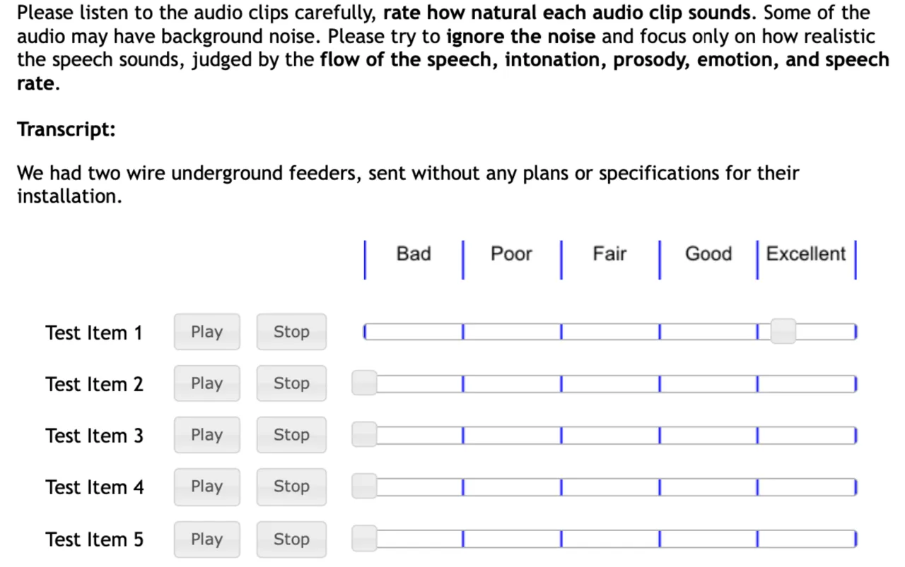
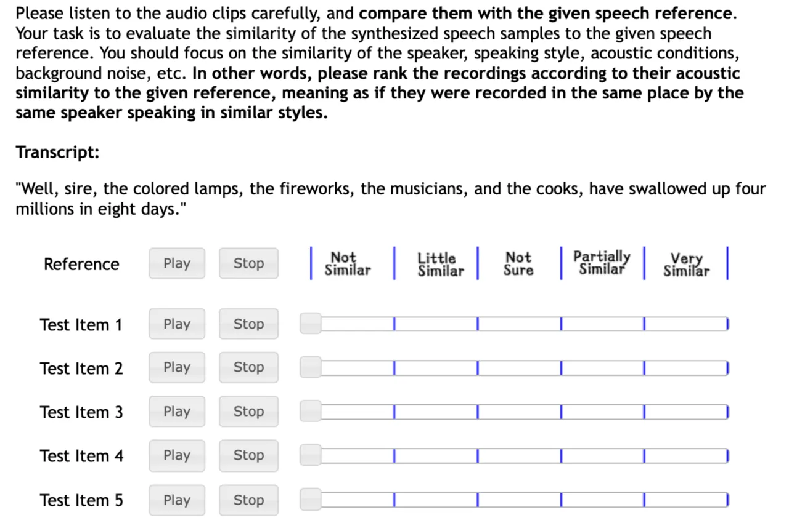
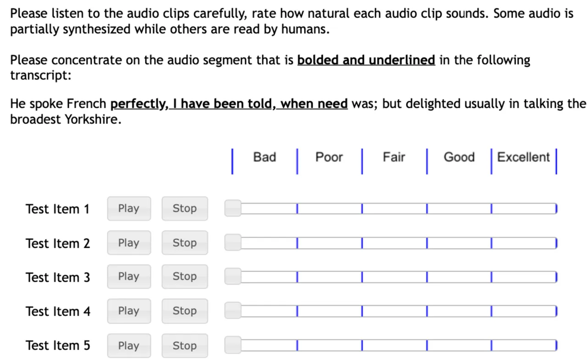

# Autoregressive Diffusion Transformer for Text-to-Speech Synthesis

Zhijun Liu Affiliation: School of Data Science    Shuai Wang
Affiliation: School of Data Science Affiliation: Shenzhen Research
Institute of Big DataThe Chinese University of Hong Kong, Shenzhen,
Guangdong, P.R. China    Sho Inoue Affiliation: School of Data Science
   Qibing Bai Affiliation: School of Data Science    Haizhou Li
Affiliation: School of Data Science Affiliation: Shenzhen Research
Institute of Big DataThe Chinese University of Hong Kong, Shenzhen,
Guangdong, P.R. China

###### Abstract

Audio language models have recently emerged as a promising approach for
various audio generation tasks, relying on audio tokenizers to encode
waveforms into sequences of discrete symbols. Audio tokenization often
poses a necessary compromise between code bitrate and reconstruction
accuracy. When dealing with low-bitrate audio codes, language models are
constrained to process only a subset of the information embedded in the
audio, which in turn restricts their generative capabilities. To
circumvent these issues, we propose encoding audio as vector sequences
in continuous space $`\mathbb{R}^{d}`$ and autoregressively generating
these sequences using a decoder-only diffusion transformer (ARDiT). Our
findings indicate that ARDiT excels in zero-shot text-to-speech and
exhibits performance that compares to or even surpasses that of
state-of-the-art models. High-bitrate continuous speech representation
enables almost flawless reconstruction, allowing our model to achieve
nearly perfect speech editing. Our experiments reveal that employing
Integral Kullback-Leibler (IKL) divergence for distillation at each
autoregressive step significantly boosts the perceived quality of the
samples. Simultaneously, it condenses the iterative sampling process of
the diffusion model into a single step. Furthermore, ARDiT can be
trained to predict several continuous vectors in one step, significantly
reducing latency during sampling. Impressively, one of our models can
generate $`170`$ ms of $`24`$ kHz speech per evaluation step with
minimal degradation in performance. Audio samples are available at
[ardit-tts.github.io](https://ardit-tts.github.io/).

^(†)^(†)footnotetext: Email:
[zhijunliu1@link.cuhk.edu.cn](mailto:zhijunliu1@link.cuhk.edu.cn)^(†)^(†)footnotetext:
Corresponding to: Shuai Wang
([wangshuai@cuhk.edu.cn](mailto:wangshuai@cuhk.edu.cn))

## 1 Introduction

Autoregressive modeling of discrete audio tokens has recently achieved
significant success across various audio generation tasks \[1, 2, 3, 4,
5, 6, 7, 8, 9, 10, 11, 12, 13, 14, 15\]. These models, often referred to
as audio language models, compress audio waveforms into discrete tokens,
predict them autoregressively, and then decode them back into waveforms.
By discretizing audio signals into discrete tokens \[16, 17, 18, 19, 20,
21, 22\], a unified representation of audio and text is achieved,
enabling seamless joint processing with language models.

Despite its success, discrete audio tokenization faces challenges. The
theory of lossy compression \[23, 24\] suggests a trade-off between the
bitrate and reconstruction quality. Current state-of-the-art neural
audio codecs typically require a minimum of $`1.5`$ kbps for
high-fidelity reconstruction of $`16`$ kHz audio \[1\]. Using a codebook
of size $`1024`$, one second of audio would necessitate
$`1500/\log_{2}(1024)=150`$ tokens, leading to long sequences that
complicate audio language modeling. Different strategies have been
proposed to mitigate this, each with its own limitations: (i) A
prevalent approach assumes conditional independence among tokens \[4, 5,
7\], concurrently generating multiple tokens to reduce autoregressive
sampling steps. However, the effectiveness of this assumption depends on
the quantization method employed. For example, Delayed Pattern \[7, 25\]
works well with residual vector quantization (RVQ) \[17\], but it might
not work well with other techniques such as finite scalar quantization
(FSQ) \[26\]. An inappropriate independence assumption can negatively
impact generation performance \[7\]. (ii) Another approach involves
limiting the bitrate and shortening the token sequence length by
encoding only a fraction of the total information in audios \[2, 3, 8,
12, 27, 13, 14, 15\]. This requires sophisticated disentangled
representation learning to achieve a compressed, task-specific
representation for the audio language model. And it limits the model to
generating only partial audio information, hindering its performance on
tasks that require high output bitrate. The information gap must be
filled by a cascade of generative models, complicating the audio
generation system.

Besides the trade-off between bitrate and reconstruction quality, audio
tokenization also faces challenges with gradient-based optimization in
discrete distributions. While VAEs \[28\] and VAE-GANs \[29\] with
continuous latent variables can be trained using standard gradient
optimizers via the reparameterization trick \[28\], this is not the case
for VQ-GAN models \[30\], which form the basis of modern neural audio
codecs. Effectively training VQ-GANs necessitates techniques like
auxiliary losses and codebook re-initialization \[31, 32, 33, 34, 35\].

The complexities of audio tokenization can be avoided by representing
speech as sequences of vectors in $`\mathbb{R}^{d}`$, termed as
continuous tokens \[36\]. For a continuous token sequence
$`[x_{1},\cdots,x_{N}]`$, several methods have been explored to model
its conditional density $`p(x_{n}|x_{<n})`$: (i) One approach is to
apply flows based on finite compositions \[37, 38, 39, 40, 41\] for
$`p_{\theta}(x_{n}|x_{<n})`$. This model constrains the network
architecture to ensure efficient computation of the Jacobian determinant
and thereby guarantee invertibility. (ii) An alternative is to represent
$`p_{\theta}(x_{n}|x_{<n})`$ using a Mixture Density Network
(MDN) \[42\] that predicts parameters for continuous mixture
distributions \[43, 44, 45, 46, 47, 48, 49\], such as a mixture of
Gaussians (MoG). However, due to the limited expressive power of mixture
densities, $`p(x_{n}|x_{<n})`$ needs to be simple enough to be
accurately approximated. (iii) Efforts to model
$`p_{\theta}(x_{n}|x_{<n})`$ with generative adversarial networks
(GANs) \[50\] have been made \[51\], but they often suffer from training
instability and mode dropping issues. (iv) Diffusion probabilistic
models (DPMs) \[52, 53, 54\] are proficient at modeling continuous
densities. Their integration with autoregressive models could yield
impressive results \[55, 56, 57, 58, 59, 60, 61, 62, 63\]. However, DPMs
require iterative processes for generating high-quality samples.
Combining diffusion sampling with autoregressive sequence sampling can
result in a slow, high-latency sampling process.

Recent discoveries in the distillation of diffusion models \[64, 65, 66,
67, 68\] have changed the situation. A family of diffusion distillation
methods demonstrates that we can effectively transform diffusion models
into single-step implicit generative models while preserving or even
improving their generative modeling performance. SSD-LM \[55, 56\]
developed a method of integrating autoregressive sequence modeling with
diffusion models utilizing a decoder-only transformer. Compared to
SSD-LM \[55\], SSD-2 \[56\] carefully designed the attention mask that
enhances the training efficiency of autoregressive diffusion
transformers (ARDiTs). However, it still suffers from slow speed and
high computational cost during inference. In our study, we propose to
apply Distribution Matching Distillation (DMD) \[64, 67\] to distill an
autoregressive diffusion transformer for audio generation. To verify the
performance of this integrated approach, we apply it to zero-shot
text-to-speech synthesis and speech editing tasks.

Our contributions can be summarized as follows:

- •
  We introduce ARDiT for audio generation, a decoder-only diffusion
  transformer model that eliminates the need for discrete tokenization
  of audio signals.
- •
  Leveraging fill-in-the-middle (FIM) \[69\] training, ARDiT excels in
  zero-shot text-to-speech synthesis and speech editing, showcasing
  near-perfect speech editing capabilities on the LibriTTS dataset.
- •
  We distill ARDiT text-to-speech (TTS) models with DMD. After
  distillation, the student models demonstrate enhanced perceptual
  naturalness compared to the teacher models, while requiring only one
  network evaluation to generate one or more continuous tokens. One of
  our distilled models achieves speech generation speeds of 170ms per
  network evaluation, significantly reducing the inference latency.
- •
  Furthermore, we present a novel method for controlling the total
  duration of generated speech in ARDiT TTS by manipulating the rotation
  angles of Rotary Position Embeddings (RoPE) \[70\].

## 2 Related Works

Autoregressive Diffusion Models: Autoregressive diffusion models
decompose high-dimensional data into lower-dimensional segments. These
segments are then sequentially generated using diffusion models. These
models have been successfully applied across various domains, including
image \[57\], video \[71, 72, 60\], music \[58, 59\], speech \[61\], and
text \[55, 56\]. For instance, in the music sector, the studies by
\[58\] and \[59\] focus on long-term generation and efficiency
enhancement, respectively. In the speech domain, \[61\] develops a model
for generating a speech waveform from phonemes, durations, and pitch
contours.

Zero-shot TTS: Unlike traditional speech synthesis techniques that
require hours of high-quality transcribed data from the target speaker,
zero-shot TTS aims to customize a new speaker’s voice with just a few
seconds of a voice prompt. Previously, zero-shot TTS was typically
achieved using a pretrained speaker encoder \[73\], which could only
retain partial information about the speaker’s timbre and failed to
capture other aspects such as style. Currently, thanks to new model
frameworks and scaled datasets, zero-shot TTS has made significant
progress. Solutions can be divided into two main categories: the first
is based on autoregressive codec language models, such as Vall-E \[4\],
Vall-E X \[74\], and SpearTTS \[15\]. The other type relies on
non-autoregressive generative models, such as VQ-GAN based
MegaTTS \[75\] and MegaTTS 2 \[76\] , diffusion-based UniCATS \[77\],
NaturalSpeech2 \[78\], NaturalSpeech3 \[79\], and VoiceBox \[80\].

Text-Based Speech Editing: Text-based speech editing adjusts segments of
an utterance to fit a target transcript while preserving the unaltered
parts. Early methods, such as those by \[81\], employed a TTS and voice
conversion model for text-guided speech changes, but often resulted in
unnatural speech due to prosody and boundary discrepancies. More recent
models \[82, 83, 84, 85, 86, 77, 87, 88, 89, 90, 25, 80\] have sought to
enhance naturalness by conditioning the generation on the surrounding
speech context.

Diffusion Distillation Methods: In the context of diffusion models,
distillation is typically employed to reduce the number of sampling
steps during inference \[91\]. One family of distillation methods \[92,
93, 94, 95, 96, 97, 98\] seeks to preserve the bijection from noise to
data defined by probability flow ODEs \[99, 54\] in diffusion models.
Another family of distillation methods \[68, 64, 67, 65, 66\] distills
diffusion models into one-step generators by minimizing the divergence
between the distributions of generated samples and data. These diffusion
distillation techniques have been investigated in diffusion-based TTS
systems, resulting in several efficient TTS models \[100, 101, 102,
103\].

## 3 Method

### 3.1 Background: Flow Matching and Distribution Matching Distillation

Suppose $`X,Z`$ are independent $`\mathbb{R}^{d}`$-valued random
variables with data density $`p(x)`$ and Gaussian density
$`p(z)=\mathcal{N}(0,I_{d})`$. Let $`\alpha_{t}=(1-t)`$ and
$`\sigma_{t}=t`$ for $`t\in[0,1]`$. Let
$`X_{t}=\alpha_{t}X+\sigma_{t}Z`$. Define the velocity field
$`v(x_{t},t):\mathbb{R}^{d}\times[0,1]\to\mathbb{R}^{d}`$ as:

```math
v(x_{t},t):=\argmin_{v}E\left\|{v(X_{t},t)-(Z-X)}\right\|_{2}^{2}=E[Z-X\mid X_{t}=x_{t}]. \tag{1}
```

According to \[104, 105, 106\], we can sample $`p(x)`$ by solving the
following ODE in reverse:

```math
\mathrm{d}Y_{t}=v(Y_{t},t)\mathrm{d}t,\quad Y_{1}\sim\mathcal{N}(0,I_{d}),\quad t\in[0,1]. \tag{2}
```

Therefore we can obtain a deep generative model with sample density
$`p_{\theta}(x)\approx p(x)`$ by estimating $`v(x_{t},t)`$ with
$`v_{\theta}(x_{t},t)`$ through minimizing
$`E_{t\sim\mathcal{U}[0,1]}\left\|{v_{\theta}(X_{t},t)-(Z-X)}\right\|_{2}^{2}`$.
This generative model is referred to by various names in the literature
\[104, 105, 106, 107\]. In the following discussion, we will refer to it
as "Flow Matching" \[105\].

Suppose $`X_{t}\sim p_{t}(x_{t})`$. We can show that the score function
$`s(x_{t},t)=\nabla_{x_{t}}\log p_{t}(x_{t})`$ can be extracted from the
velocity field $`v(x_{t},t)`$ (See Appendix A).

```math
v(x_{t},t)=-\sigma_{t}s(x_{t},t)-\frac{x_{t}+\sigma_{t}^{2}s(x_{t},t)}{\alpha_{t}}=\frac{-1}{1-t}x_{t}+\frac{-t}{1-t}s(x_{t},t). \tag{3}
```

This indicates that, akin to Diffusion Probabilistic Models (DPMs) \[53,
54\], Flow Matching models also estimate the score function.

Given a Flow Matching model $`v_{\theta}(x_{t},t)`$ trained on $`p(x)`$.
With the ODE in equation 2, it establishes a mapping
$`f_{\theta}(w):\mathbb{R}^{d}\to\mathbb{R}^{d}`$ that transforms
Gaussian noises to data samples. Evaluating $`f_{\theta}`$ is slow as it
involves solving an ODE. DMD can distill $`v_{\theta}`$ into single step
generator $`g_{\xi}:\mathbb{R}^{d}\to\mathbb{R}^{d}`$, that maps random
noise $`W\sim\mathcal{N}(0,I_{d})`$ to $`\widehat{X}=g_{\xi}(W)`$ with
density $`p_{\xi}(x)`$. Define
$`\widehat{X}_{t}:=\alpha_{t}\widehat{X}+\sigma_{t}\widehat{Z}`$ where
$`\widehat{Z}`$ is an independent Gaussian random variable. Suppose
$`p(x_{t},t)`$ is the density of $`X_{t}`$ and $`p_{\xi}(x_{t},t)`$ is
the density of $`\widehat{X}_{t}`$. Their Integral Kullback–Leibler
(IKL) divergence \[64\] is defined as:

```math
D_{\xi}:=D_{\text{IKL}}\left(p_{\xi}(x_{t},t)\middle\|p(x_{t},t)\right):=E_{t\sim\mathcal{U}[0,1]}\left[{w_{t}D_{\text{KL}}\left(p_{\xi}(x_{t},t)\middle\|p(x_{t},t)\right)}\right], \tag{4}
```

where $`w_{t}\geq 0`$ is the weighting factor for time $`t`$. Suppose
$`s(x_{t},t)=\nabla_{x_{t}}\log p(x_{t},t)`$ and
$`s_{\xi}(x_{t},t):=\nabla_{x_{t}}\log p_{\xi}(x_{t},t)`$. Then
according to \[64, 67\]:

```math
\nabla_{\xi}D_{\xi}=E_{t\sim\mathcal{U}[0,1]}\left[{w_{t}\alpha_{t}\left({s_{\xi}(\widehat{X}_{t},t)-s(\widehat{X}_{t},t)}\right)\frac{\partial g_{\xi}(W)}{\partial\xi}}\right]. \tag{5}
```

$`s_{\xi}(x_{t},t)`$ and $`s(x_{t},t)`$ are unknown, but we can
approximate $`s_{\xi}(x_{,}t)-s(x_{t},t)`$ with Flow Matching models
$`v_{\eta}(x_{t},t)`$ and $`v_{\theta}(x_{t},t)`$. Where $`v_{\eta}`$ is
trained on samples of $`g_{\xi}`$ by minimizing:

```math
\mathcal{L}_{\eta}:=E_{t\sim\mathcal{U}[0,1]}\left\|{v_{\eta}(\widehat{X}_{t},t)-(\widehat{Z}-\widehat{X})}\right\|_{2}^{2}. \tag{6}
```

According to equation 3, assuming $`v_{\eta}`$ and $`v_{\theta}`$ are
well-trained, we have:

```math
v_{\eta}(x_{t},t)-v_{\theta}(x_{t},t)\approx\frac{-t}{1-t}\cdot\left({s_{\xi}(x_{t},t)-s(x_{t},t)}\right). \tag{7}
```

DMD training freezes $`v_{\theta}`$ and alternatively updates
$`g_{\xi}`$ and $`v_{\eta}`$ with $`\mathcal{L}_{\xi}`$ and
$`\mathcal{L}_{\eta}`$. The generator $`g_{\xi}`$ is trained on
minimizing the following loss function:

```math
\mathcal{L}_{\xi}:=\underbrace{E_{t\sim\mathcal{U}[0,1]}\left\|{\widehat{X}+\operatorname{sg}\left({v_{\theta}(\widehat{X}_{t},t)-v_{\eta}(\widehat{X}_{t},t)-\widehat{X}}\right)}\right\|_{2}^{2}}_{\mathcal{L}_{\text{IKL}}}+\beta_{\text{reg}}\cdot\underbrace{E\left\|{g_{\xi}(W)-f_{\theta}(W)}\right\|_{2}^{2}}_{\mathcal{L}_{\text{reg}}}. \tag{8}
```

Here $`\beta_{\text{reg}}>0`$ is the weight of the L2 regression loss.
And $`\operatorname{sg}`$ is the stop gradient operator. For simplicity,
we set $`w_{t}\alpha_{t}=2t/(1-t)`$. In this case
$`\nabla_{\xi}\mathcal{L}_{\text{IKL}}\approx\nabla_{\xi}D_{\xi}`$.
Impact of the weighting factor $`w_{t}`$ is left for future study.

### 3.2 Contextual Mel Spectrogram Autoencoder

Figure 1: The structure of the Mel spectrogram autoencoder. The
left-hand side illustrates the encoder, which outputs the mean and
variance of the encoder distribution $`q_{\phi}(z|Y)`$. The right-hand
side illustrates the Flow Matching decoder. The encoder and decoder are
jointly trained to minimize the reconstruction error and the bitrate.

We compress log Mel spectrograms into a sequence of continuous tokens
with an autoencoder to reduce the sequence length. Given random Mel
spectrogram $`Y`$ on
$`\mathbb{R}^{N_{\text{frame}}\times D_{\text{mel}}}`$ where
$`N_{\text{frame}}`$ is the number of frames, and $`D_{\text{mel}}`$ is
the number of Mel filters, we encode $`Y`$ into a sequence of continuous
tokens $`Z`$ on
$`\mathbb{R}^{N_{\text{latent}}\times D_{\text{latent}}}`$ where
$`N_{\text{latent}}=\left\lfloor{N_{\text{frame}}/4}\right\rfloor`$ and
$`D_{\text{latent}}=16`$. The encoder is a transformer \[108\] taking
input $`Y`$ and outputs
$`\mu,\log\sigma\in\mathbb{R}^{N_{\text{latent}}\times D_{\text{latent}}}`$.
The encoder defines the conditional density of $`Z`$ given $`Y`$ as
$`q_{\phi}(z|y)=\prod_{n,d}\mathcal{N}(z_{n,d};\mu_{n,d},\sigma_{n,d}^{2})`$.
The decoder is a conditional Flow Matching model $`v_{\psi}(y_{t};t,z)`$
based on DiT \[109\] that recovers $`Y`$ given $`Z`$. Define the latent
prior density $`p(z):=\prod_{n,d}\mathcal{N}(z_{n,d};0,1)`$ on
$`\mathbb{R}^{N_{\text{latent}}\times D_{\text{latent}}}`$. The encoder
and decoder are jointly optimized by minimizing:

```math
\mathcal{L}(\phi,\psi):=\beta_{\text{MI}}\cdot E\left[{D_{\text{KL}}\left(q_{\phi}(z|Y)\middle\|p(z)\right)}\right]+E_{W\sim\mathcal{N}(0,I)}\left\|{v_{\psi}\left({\left({1-t}\right)Y+tW;t,Z}\right)-\left({W-Y}\right)}\right\|_{2}^{2}. \tag{9}
```

Note that the first term
$`E\left[{D_{\text{KL}}\left(q_{\phi}(z|Y)\middle\|p(z)\right)}\right]`$
is a variational upper bound \[110\] of mutual information $`I(Y;Z)`$.
So the weight $`\beta_{\text{MI}}>0`$ is controlling the trade-off
between the coding rate and reconstruction accuracy. In our experiments,
the Mel spectrogram encoder emits 23.5 tokens per second, and its
theoretical bitrate is 1.7 kbps. For more details, please refer to
Appendix C.

To enable conditional decoding when the Mel spectrogram target is
partially known, the decoder is fine-tuned on Mel spectrogram masked
reconstruction. For more details, please refer to Appendix D. During the
inference stage of speech editing and zero-shot TTS, we provide the
decoder with the known Mel spectrogram frames.

### 3.3 Autoregressive Diffusion Transformers for Text-to-Speech Synthesis

In this part, we describe Autoregressive Diffusion Transformers
(ARDiTs), and explain how they can be utilized for text-to-speech
synthesis. Suppose random Mel spectrogram $`Y`$ is encoded into
continuous token sequence $`Z=[Z_{0};\cdots;Z_{N_{\text{latent}}-1}]`$
on $`\mathbb{R}^{N_{\text{latent}}\times D_{\text{latent}}}`$. Suppose
$`C=[C_{0},\cdots,C_{N_{\text{phone}}-1}]`$ on
$`\Sigma^{N_{\text{phone}}}`$ is the phonetic transcript of $`Y`$. Where
$`\Sigma`$ is the set of all phonemes.

An ARDiT is semi-autoregressive, it samples from conditional density
$`p_{\theta}(z^{i:i+B}|c,z^{<i})`$ with Flow Matching through estimating
the conditional velocity field
$`v_{\theta}\left({z_{t}^{i:i+B};t,c,z^{<i}}\right)`$. Here
$`B\in\mathbb{N}_{+}`$ is the block size, and $`i\in\mathbb{N}_{+}`$ is
the index of the first token in block
$`z^{i:i+B}=\left[{z^{i};\cdots;z^{i+B-1}}\right]`$. Suppose $`W`$ is an
independent
$`\mathbb{R}^{N_{\text{latent}}\times D_{\text{latent}}}`$-valued random
variable with density $`p(w)=\prod_{n,d}\mathcal{N}(w_{n,d};0,1)`$. Let
$`Z_{t}=(1-t)Z+tW`$. The training loss of ARDiT would be:

```math
\mathcal{L}(\theta):=E_{i,t\sim\mathcal{U}[0,1]}\left\|{v_{\theta}\left({Z_{t}^{i:i+B};t,C,Z^{<i}}\right)-\left({W^{i:i+B}-Z^{i:i+B}}\right)}\right\|_{2}^{2}. \tag{10}
```

A naive implementation of ARDiT would be to feed
$`(C,Z^{<i},Z_{t}^{i:i+B})`$ into a transformer with no attention mask,
and then combine the last $`B`$ vector in the output to obtain
$`v_{\theta}(Z_{t}^{i:i+B};t,C,Z^{<i})`$. This implementation is
inefficient compared to language models (LMs) on discrete tokens in both
training and sampling. During training, it does not support
teacher-forcing. $`\nabla_{\theta}\mathcal{L}(\theta)`$ from each batch
only depends on a small segment of length $`B`$ in the model’s output.
During inference, it does not support KV-cache, causing unnecessary
recomputation.

As proposed in SSD-2 \[56\], a special design of the input sequence and
attention mask of the transformer can resolve these performance issues.
First, let’s split $`Z`$ into blocks of size $`B`$. Define block index
of $`i`$th token as
$`\#_{i}:=\left\lfloor{\left({i+S}\right)/{B}}\right\rfloor`$ where
$`S\in\left\{{0,\cdots,B-1}\right\}`$ is an integer constant denoting
the block shift. Suppose we have $`M`$ blocks. For each block $`m`$,
$`Z^{b_{m}:e_{m}}`$ represents the tokens within that block, where
$`b_{m}`$ and $`e_{m}`$ denote the beginning and the end indices of the
block, respectively. For each block $`m`$, pick time $`t_{m}\in[0,1]`$.
Let $`\mathbf{t}:=[t_{0},\cdots,t_{M-1}]`$. Define $`Z_{\mathbf{t}}`$,
where
$`Z_{\mathbf{t}}^{b_{m}:e_{m}}:=(1-t_{m})Z^{b_{m}:e_{m}}+t_{m}W^{b_{m}:e_{m}}`$
in each block $`m`$.

Figure 2: Illustration of the ARDiT training scheme with $`B=2`$ and
$`S=1`$. The attention mask is depicted on the left, while the right
displays the input and output of the ARDiT model during training. The
input sequence is divided into three blocks, where noisy speech tokens
in each block attend to text tokens, prior clean tokens, and noisy
tokens within the same block.

The ARDiT training scheme, including the sequence layout and attention
mask during training, is illustrated in figure 2. We concat and feed
$`(C,Z,Z_{\mathbf{t}})`$ into the transformer. The attention mask is
defined by the following rules: Tokens in $`C`$ can attend tokens in
$`C`$; tokens in $`Z`$ can attend $`C`$ and tokens in $`Z`$ with lower
or equal block indices; tokens in $`Z_{\mathbf{t}}`$ can attend tokens
in $`Z_{\mathbf{t}}`$ of the same block index and tokens in $`Z`$ with
lower block indices. This training scheme \[56\] is essential for
training efficiency. It allows us to evaluate the velocity field
$`v_{\theta}(Z_{\mathbf{t}}^{b_{m}:e_{m}};t_{m},C,Z^{<b_{m}})`$ on all
the blocks in $`Z_{\mathbf{t}}`$ with a single neural network
evaluation.

Figure 3: Depiction of the ARDiT inference scheme with $`B=2`$. The
attention mask is shown on the left, while the right presents the input
and output of the ARDiT model during inference. The blocks are generated
autoregressively, with the model shown in the process of generating the
4th block of tokens, after already producing 3 blocks of speech tokens.
The last block is iteratively sampled by solving an ODE with the
predicted velocity.

The ARDiT inference scheme, including the sequence layout and attention
mask during inference, is illustrated in figure 3. Suppose we are
generating block $`m`$. The input to ARDiT is
$`(C,Z^{<e_{m-1}},Z_{t}^{b_{m}:e_{m}})`$. The attention mask is defined
by the following rules: Tokens in $`C`$ can attend tokens in $`C`$;
tokens in $`(Z^{<e_{m-1}},Z_{t}^{b_{m}:e_{m}})`$ can attend $`C`$ and
other tokens with lower or equal block indices.

Let us compare the computational complexity of ARDiTs and decoder-only
transformers (LMs) of the same model size. For LMs, we replace the
continuous tokens with the same number of discrete tokens. During
training, an ARDiT processes
$`N_{\text{phone}}+2\cdot N_{\text{latent}}`$ tokens per utterance,
while an LM handles $`N_{\text{phone}}+N_{\text{latent}}`$ tokens.
During inference, an ARDiT with a KV cache requires approximately
$`N_{\text{FE}}+1`$ times as many computations as an LM and
$`N_{\text{FE}}/B`$ times as many network evaluations, where
$`N_{\text{FE}}`$ is the average number of function evaluations of the
ODE solver.

Given that both the inference computation and the number of network
evaluations in ARDiT grow linearly as $`N_{\text{FE}}`$ increases, it is
crucial to reduce $`N_{\text{FE}}`$ for practical application. We apply
Distribution Matching Distillation (DMD) \[67\] as described in section
3.1 to reduce $`N_{\text{FE}}`$ to $`1`$. Detailed explanations of DMD
training for ARDiT can be found in Appendix E.

In addition, we can apply fill-in-the-middle (FIM) training to support
speech editing with ARDiT. This requires a slightly different attention
mask and sequence layout during training. The details of FIM training of
ARDiTs can be found in Appendix F.

### 3.4 Position Embeddings and Total Duration Control in ARDiT TTS

Rather than allowing ARDiT to generate speech of arbitrary length, we
use position embeddings to inform ARDiT about the total speech duration
$`N_{\text{latent}}`$. Our ARDiT models are built upon Rotary Position
Embedding (RoPE) \[70\]. RoPE encodes relative positional information by
rotating the key and value vectors in self-attention. Specifically, a
rotation matrix $`R_{n}`$ for any position index $`n\in\mathbb{R}`$ is
defined as follows:

```math
U_{\theta}:=\begin{bmatrix}\cos\theta&-\sin\theta\\
\sin\theta&\cos\theta\end{bmatrix},\quad R_{n}:=\begin{bmatrix}U_{n\theta_{0}}&0&\cdots&0\\
0&U_{n\theta_{1}}&\cdots&0\\
\vdots&\vdots&\ddots&\vdots\\
0&0&\cdots&U_{n\theta_{d-1}}\\
\end{bmatrix}\in\mathbb{R}^{2d\times 2d}. \tag{11}
```

Similar to VALL-E \[4\], we employ separate position embeddings for
phoneme tokens and speech tokens. For phoneme tokens in
$`C=[C_{0},\cdots,C_{N_{\text{phone}}-1}]`$, each token $`C_{i}`$ is
given the position index $`i`$. For speech tokens in
$`(Z,Z_{t},Z_{\mathbf{t}})`$, the tokens
$`Z^{i},Z_{t}^{i},Z_{\mathbf{t}}^{i}`$ are assigned a fractional
position index of $`i\cdot\eta`$, where
$`\eta=N_{\text{phone}}/N_{\text{latent}}`$ is the speech rate. For
instance, if we have $`(N_{\text{phone}},N_{\text{latent}})=(10,20)`$,
then the speech rate is $`\eta=0.5`$, and the fractional position index
of the $`i`$-th speech token is $`0.5i`$.

This design, similar to the one proposed in ParaNet \[111\] for
non-autoregressive TTS, was found to accelerate training of ARDiT models
in our preliminary experiments. It effectively mitigated the issue of
generating overly long sequences, a common problem in autoregressive TTS
models. During inference, ARDiT requires an estimate of the speech
duration $`N_{\text{latent}}`$, which can be derived from a reference
speech as outlined in Appendix H.

## 4 Experiments

### 4.1 Setup

Datasets: We trained ARDiTs on LibriTTS, a multi-speaker, transcribed
English speech dataset, which contains approximately 580 hours of
recordings from 2,306 speakers in its training set. We utilized Test Set
B from UniCATS \[77\] to evaluate the zero-shot TTS performance. This
set contains 500 utterances from 37 speakers in the "test-clean" subset.
Each speaker in Test Set B is associated with a speech prompt of
approximately 3 seconds. For the speech editing evaluation, we utilized
Test Set C from UniCATS \[77\], which is also the test set used in
\[89\]. Test Set C contains 25 sentences. Following \[77\], we evaluated
text-based speech inpainting performance in two settings with different
mask durations. In the short setting, the average mask duration is 0.63
seconds. In the long setting, the average mask duration is 2.18 seconds.

Baselines: We compare with three non-autoregressive models:
HierSpeech++¹¹ 1 HierSpeech++:
[https://github.com/sh-lee-prml/HierSpeechpp](https://github.com/sh-lee-prml/HierSpeechpp) \[112\],
StyleTTS 2²² 2 StyleTTS 2:
[https://github.com/yl4579/StyleTTS2](https://github.com/yl4579/StyleTTS2) \[113\],
and UniCATS³³ 3 UniCATS:
[https://github.com/X-LANCE/UniCATS-CTX-vec2wav](https://github.com/X-LANCE/UniCATS-CTX-vec2wav) \[77\];
and one autoregressive model, VoiceCraft⁴⁴ 4 VoiceCraft:
[https://github.com/jasonppy/VoiceCraft](https://github.com/jasonppy/VoiceCraft) \[25\].
We obtained audio samples of StyleTTS 2, VoiceCraft, and HierSpeech++
using their officially released codes and checkpoints. Since the authors
of UniCATS did not provide checkpoints, we directly obtained audio
samples from them. For HierSpeech++, we used the lt960 checkpoint. For
VoiceCraft, we used 830M_TTSEnhanced model for zero-shot TTS, and
giga830M model for speech editing. For all models, we conducted
inference at their native sampling rates, then downsampled the generated
audios to 16 kHz for evaluation.

Model: All transformer models utilized in our study are derived from
DiT \[109\], including the encoder and decoder of the Mel spectrogram
autoencoder, the autoregressive discrete transformers, and the distilled
ARDiTs. For the spectrogram encoder, the input time in DiT is set to
zero. These models share identical architectures, each comprising 12
layers, 16 heads for multi-head attention, an embedding dimension of
1024, a feed-forward layer dimension of 4096, and a dropout rate of 0.1.
We used RoPE \[70\] as the positional embedding for all the models. More
details about the neural network architectures can be found in
Appendix G. We trained and distilled multiple ARDiTs with various block
sizes. All the evaluated ARDiT models were trained with the
fill-in-the-middle strategy. Detailed training procedures are available
in Appendix I. We utilized the pre-trained BigVGAN ⁵⁵ 5 BigVGAN:
[https://github.com/NVIDIA/BigVGAN](https://github.com/NVIDIA/BigVGAN)
vocoder \[114\] with 112M parameters, trained on 24kHz speech, for Mel
spectrogram to waveform reconstruction.

Subjective Evaluation: We conducted a MUSHRA (Multiple Stimuli with
Hidden Reference and Anchor) test to evaluate speech naturalness (NAT)
and speaker similarity (SIM). We did not use hidden anchors in the test.
20 participants rated audio quality on a scale of 0 to 100. Please refer
to Appendix J for more details of our listening tests. We report the
average MUSHRA scores with 95% confidence intervals. Additionally, we
performed a t-test to evaluate the significance of improvements in the
proposed systems.

Objective Evaluation: We assessed the intelligibility of samples using
the Word Error Rate (WER) from the Whisper (medium) ASR model⁶⁶ 6
Whisper:
[https://github.com/openai/whisper](https://github.com/openai/whisper) \[115\].
We also measured speaker similarity of generated samples with their
prompts using the Speaker Encoding Cosine Similarity (SECS), which
ranges from -1 to 1, with higher values indicating greater similarity.
This evaluation utilized three state-of-the-art speaker verification
models: WavLM Base with X-vector (WavLM)⁷⁷ 7 WavLM Base with X-vector:
[https://huggingface.co/microsoft/wavlm-base-plus-sv](https://huggingface.co/microsoft/wavlm-base-plus-sv) \[116\],
WeSpeaker (WS)⁸⁸ 8 WeSpeaker:
[https://github.com/wenet-e2e/wespeaker](https://github.com/wenet-e2e/wespeaker) \[117\],
and Resemblyzer (Resem)⁹⁹ 9 Resemblyzer:
[https://github.com/resemble-ai/Resemblyzer](https://github.com/resemble-ai/Resemblyzer) \[118\].

### 4.2 Zero-Shot Text-to-Speech

In the zero-shot TTS evaluation, we generated speech samples with ARDiTs
using the fill-in-the-middle strategy. For each sentence, the prompt
speech was given to ARDiTs as both the prefix and suffix, resulting in
it being repeated twice. The target total duration was estimated using
the prompt speech and prompt text. We applied the Euler sampler with a
fixed step size and 16 sampling steps for ODE sampling.

Results in Table 1 indicate that, in subjective evaluations, student
models (DMD) outperform both baselines and teacher models in both
metrics. Objectively, the proposed models surpassed baseline models in
speaker similarity and achieved comparable WER scores.

|                                                              |                       |                      |                      |                     |       |       |
| ------------------------------------------------------------ | --------------------- | -------------------- | -------------------- | ------------------- | ----- | ----- |
|                                                              | MUSHRA ($`\uparrow`$) |                      | WER ($`\downarrow`$) | SECS ($`\uparrow`$) |       |       |
| Model Name                                                   | NAT                   | SIM                  | Whisper              | WavLM               | WS    | Resem |
| Ground Truth                                                 | 81.1$`\pm`$2.7        | 52.7$`\pm`$4.9       | 2.02                 | 0.942               | 0.723 | 0.834 |
| Reconstruct                                                  | —                     | —                    | 2.39                 | 0.942               | 0.718 | 0.844 |
| HierSpeech++ \[112\]                                         | 56.1$`\pm`$2.7        | 59.1$`\pm`$3.7       | 5.61                 | 0.919               | 0.602 | 0.881 |
| StyleTTS2 \[113\]                                            | 77.2$`\pm`$2.8        | 52.4$`\pm`$4.1       | 1.76                 | 0.914               | 0.498 | 0.845 |
| UniCATS \[77\]                                               | 53.2$`\pm`$2.8        | 41.9$`\pm`$3.8       | 6.33                 | 0.912               | 0.537 | 0.832 |
| VoiceCraft \[25\]                                            | 62.1$`\pm`$3.4        | 44.9$`\pm`$4.1       | 4.02                 | 0.933               | 0.561 | 0.859 |
| ARDiT(B=1)                                                   | 72.7$`\pm`$2.7        | ^(∗)64.0$`\pm`$4.1   | 1.83                 | 0.945               | 0.712 | 0.886 |
| ARDiT(B=4)                                                   | 71.4$`\pm`$2.9        | 61.4$`\pm`$4.1       | 2.35                 | 0.940               | 0.691 | 0.881 |
| ARDiT(DMD, B=1)                                              | 76.5$`\pm`$3.0        | ^(∗∗∗)69.4$`\pm`$3.9 | 1.88                 | 0.938               | 0.702 | 0.874 |
| ARDiT(DMD, B=4)                                              | 79.3$`\pm`$2.8        | ^(∗∗∗)68.4$`\pm`$4.1 | 1.81                 | 0.933               | 0.656 | 0.867 |
| Note: $`{}^{***}p<0.01`$, $`{}^{**}p<0.05`$, $`{}^{*}p<0.1`$ |                       |                      |                      |                     |       |       |

Table 1: Results of zeroshot TTS. For the MUSHRA scores, we performed a
t-test comparing ARDiTs with the best baseline model (underlined).

### 4.3 Speech Editing

Our speech editing experiment utilized two baseline models, UniCATS and
VoiceCraft. We conducted speech editing with ARDiTs using the
fill-in-the-middle strategy. For each test utterance, we provided the
ARDiT models with the full text and the remaining audio after masking.
We estimated the target duration using the sections of the audio and
text that were not subjected to masking. We applied the Euler sampler
with fixed step size and 16 sampling steps for ODE sampling. In order to
minimize the incoherence in the inpainting results, we produced
$`N_{\text{batch}}=8`$ samples in parallel for each utterance.
Subsequently, we employed the post-filtering technique detailed in
Appendix Z. This post-filtering process is fully automated and requires
no human intervention. To evaluate the samples, we adopted the MUSHRA
test for naturalness and the Word Error Rate (WER) for measuring
intelligibility.

The results, detailed in Table 2, show that ARDiTs, when distilled with
DMD, generally outperform other examined models. Furthermore, all ARDiT
models significantly surpassed the baseline models in terms of perceived
speech naturalness.

|                                                              |                                           |                      |                      |                              |      |      |
| ------------------------------------------------------------ | ----------------------------------------- | -------------------- | -------------------- | ---------------------------- | ---- | ---- |
|                                                              | MUSHRA (Speech Naturalness, $`\uparrow`$) |                      |                      | Whisper WER ($`\downarrow`$) |      |      |
| Model Name                                                   | short                                     | long                 | all                  | short                        | long | all  |
| Ground Truth                                                 | 77.8$`\pm`$3.3                            | 78.5$`\pm`$3.4       | 78.1$`\pm`$2.3       | 1.33                         | 1.33 | 1.33 |
| UniCATS \[77\]                                               | 67.0$`\pm`$3.4                            | 65.5$`\pm`$3.4       | 66.2$`\pm`$2.4       | 3.05                         | 3.18 | 3.11 |
| VoiceCraft \[25\]                                            | 66.9$`\pm`$3.7                            | 62.2$`\pm`$4.6       | 64.6$`\pm`$2.9       | 1.59                         | 1.99 | 1.79 |
| ARDiT(R=1)                                                   | ^(∗∗∗)75.5$`\pm`$3.5                      | ^(∗∗∗)72.3$`\pm`$3.7 | ^(∗∗∗)73.9$`\pm`$2.5 | 1.59                         | 1.85 | 1.72 |
| ARDiT(R=4)                                                   | ^(∗∗∗)73.7$`\pm`$3.4                      | ^(∗∗)71.3$`\pm`$3.6  | ^(∗∗∗)72.6$`\pm`$2.4 | 1.46                         | 1.99 | 1.72 |
| ARDiT(DMD, R=1)                                              | ^(∗∗∗)78.1$`\pm`$3.3                      | ^(∗∗∗)77.5$`\pm`$3.5 | ^(∗∗∗)77.8$`\pm`$2.4 | 1.85                         | 1.06 | 1.46 |
| ARDiT(DMD, R=4)                                              | ^(∗∗∗)75.8$`\pm`$3.4                      | ^(∗∗∗)75.2$`\pm`$3.6 | ^(∗∗∗)75.5$`\pm`$2.5 | 1.46                         | 3.31 | 2.38 |
| Note: $`{}^{***}p<0.01`$, $`{}^{**}p<0.05`$, $`{}^{*}p<0.1`$ |                                           |                      |                      |                              |      |      |

Table 2: Results on the speech editing task. For the MUSHRA scores, we
performed a t-test comparing ARDiTs with the best baseline model
(underlined).

### 4.4 Effect of the Block Size

Figure 4: Effects of different block sizes $`B`$ on ARDiT training.
Training efficiency decreases as block size $`B`$ increases.
$`B=\text{INF}`$ means the block size is infinite, i.e., the model
becomes a non-autoregressive (NAR) diffusion model, generating all
speech tokens in parallel.

Recent works \[90, 119, 120\] in TTS demonstrates that
non-autoregressive diffusion models can perform text-to-speech synthesis
without force-alignment or explicit phoneme duration modeling. This
calls into question the necessity of autoregressive diffusion modeling
in TTS.

To answer this question, we trained several ARDiT TTS models under the
same settings, only altering the block size $`B`$ and observed its
impact on performance. We examined 5 different settings
$`B\in\left\{{1,4,8,16,\text{INF}}\right\}`$, where $`B=\text{INF}`$
represents generating all frames at once, thus serving as a
non-autoregressive model. We generated 500 samples from each model as in
the zero-shot TTS evaluation win section 4.2. For all models we apply
Euler sampler with 16 sampling steps, in order to fix the amount of
total computation in inference. We evaluated the intelligibility and
speaker similarity of the outputs using Word Error Rate (WER) and
Speaker Encoding Cosine Similarity (SECS), respectively. Our model’s
sampling rate is 24kHz, and the tokenization hop size is 1024, resulting
in block lengths of approximately 171ms for $`B=4`$ and 680ms for
$`B=16`$, for example. The average length of our test samples is 5.76
secs, meaning that, in $`B=16`$, the model generates 8.47 blocks on
average to complete the utterance.

Figure 4 illustrates WER and SECS scores under various conditions. Our
findings indicate a decrease in WER with increasing training steps and
lower $`B`$ values. Notably, the autoregressive models achieved much
better speech intelligibility compared to the non-autoregressive model
($`B=\text{INF}`$). SECS scores followed the same pattern as WER,
showing enhanced speaker similarity with more training and lower block
size $`B`$.

## 5 Discussion and Conclusion

The goal of this research is to eliminate the need for discrete
tokenization of audio in language modeling. We proposed the use of
continuous tokens in place of discrete ones and applied autoregressive
diffusion Transformers (ARDiTs) to generate these continuous audio
tokens. Our results demonstrated that ARDiTs perform well in zero-shot
text-to-speech and text-based speech editing. Through distillation, an
ARDiT TTS model can generate one or more continuous speech tokens in a
single network evaluation while maintaining high sample quality.

Limitations Due to resource constraints, we trained and evaluated ARDiTs
solely on LibriTTS, which contains only reading-style speech from
English audiobooks. We plan to further investigate the applicability of
ARDiTs to more diverse data, such as large-scale in-the-wild datasets,
in future work.

We only tuned ARDiTs using a limited set of hyperparameters due to
resource constraints. Thus, we cannot guarantee the general
applicability of our findings in different settings.

We only tested ARDiTs on zero-shot text-to-speech and text-based speech
editing; we do not guarantee high performance for more extensive audio
generation tasks. We plan to apply ARDiTs to other audio generative
tasks in future work.

We trained ARDiTs exclusively for audio generation. It remains uncertain
whether the model can be trained to generate both discrete and
continuous tokens, similar to existing Multimodal Large Language Models.

It’s well acknowledged that the sample quality of language models can be
enhanced with annealed sampling techniques like beam search. Such
techniques are not currently available for ARDiTs. We intend to research
ARDiT sampling techniques in our future work.

## References

- \[1\] H. Wu, X. Chen, Y.-C. Lin, K.-W. Chang, H.-L. Chung, A. H. Liu,
  and H. yi Lee, “Towards audio language modeling - an overview,” _arXiv
  preprint arXiv:2402.13236_, 2024.
- \[2\] Z. Borsos, R. Marinier, D. Vincent, E. Kharitonov, O. Pietquin,
  M. Sharifi, D. Roblek, O. Teboul, D. Grangier, M. Tagliasacchi
  _et al._, “AudioLM: a language modeling approach to audio generation,”
  _TASLP_, 2023.
- \[3\] A. Agostinelli, T. I. Denk, Z. Borsos, J. Engel, M. Verzetti,
  A. Caillon, Q. Huang, A. Jansen, A. Roberts, M. Tagliasacchi _et al._,
  “MusicLM: Generating music from text,” _arXiv preprint
  arXiv:2301.11325_, 2023.
- \[4\] C. Wang, S. Chen, Y. Wu, Z. Zhang, L. Zhou, S. Liu, Z. Chen,
  Y. Liu, H. Wang, J. Li _et al._, “Neural codec language models are
  zero-shot text to speech synthesizers,” _arXiv preprint
  arXiv:2301.02111_, 2023.
- \[5\] F. Kreuk, G. Synnaeve, A. Polyak, U. Singer, A. Défossez,
  J. Copet, D. Parikh, Y. Taigman, and Y. Adi, “AudioGen: Textually
  guided audio generation,” _arXiv preprint arXiv:2209.15352_, 2022.
- \[6\] T. Wang, L. Zhou, Z. Zhang, Y. Wu, S. Liu, Y. Gaur, Z. Chen,
  J. Li, and F. Wei, “VioLA: Unified codec language models for speech
  recognition, synthesis, and translation,” _arXiv preprint
  arXiv:2305.16107_, 2023.
- \[7\] J. Copet, F. Kreuk, I. Gat, T. Remez, D. Kant, G. Synnaeve,
  Y. Adi, and A. Defossez, “Simple and controllable music generation,”
  in _NeurIPS_, 2023.
- \[8\] P. K. Rubenstein, C. Asawaroengchai, D. D. Nguyen, A. Bapna,
  Z. Borsos, F. d. C. Quitry, P. Chen, D. E. Badawy, W. Han,
  E. Kharitonov _et al._, “AudioPaLM: A large language model that can
  speak and listen,” _arXiv preprint arXiv:2306.12925_, 2023.
- \[9\] X. Wang, M. Thakker, Z. Chen, N. Kanda, S. E. Eskimez, S. Chen,
  M. Tang, S. Liu, J. Li, and T. Yoshioka, “SpeechX: Neural codec
  language model as a versatile speech transformer,” _arXiv preprint
  arXiv:2308.06873_, 2023.
- \[10\] Q. Chen, Y. Chu, Z. Gao, Z. Li, K. Hu, X. Zhou, J. Xu, Z. Ma,
  W. Wang, S. Zheng _et al._, “LauraGPT: Listen, attend, understand, and
  regenerate audio with gpt,” _arXiv preprint arXiv:2310.04673_, 2023.
- \[11\] D. Yang, J. Tian, X. Tan, R. Huang, S. Liu, X. Chang, J. Shi,
  S. Zhao, J. Bian, X. Wu _et al._, “UniAudio: An audio foundation model
  toward universal audio generation,” _arXiv preprint
  arXiv:2310.00704_, 2023.
- \[12\] K. Lakhotia, E. Kharitonov, W.-N. Hsu, Y. Adi, A. Polyak,
  B. Bolte, T.-A. Nguyen, J. Copet, A. Baevski, A. Mohamed _et al._, “On
  generative spoken language modeling from raw audio,” _TACL_, 2021.
- \[13\] M. Hassid, T. Remez, T. A. Nguyen, I. Gat, A. Conneau,
  F. Kreuk, J. Copet, A. Defossez, G. Synnaeve, E. Dupoux _et al._,
  “Textually pretrained speech language models,” _NeurIPS_, 2024.
- \[14\] H. Inaguma, S. Popuri, I. Kulikov, P.-J. Chen, C. Wang, Y.-A.
  Chung, Y. Tang, A. Lee, S. Watanabe, and J. Pino, “Unity: Two-pass
  direct speech-to-speech translation with discrete units,” _arXiv
  preprint arXiv:2212.08055_, 2022.
- \[15\] E. Kharitonov, D. Vincent, Z. Borsos, R. Marinier, S. Girgin,
  O. Pietquin, M. Sharifi, M. Tagliasacchi, and N. Zeghidour, “Speak,
  read and prompt: High-fidelity text-to-speech with minimal
  supervision,” _TACL_, 2023.
- \[16\] N. Zeghidour, A. Luebs, A. Omran, J. Skoglund, and
  M. Tagliasacchi, “SoundStream: An end-to-end neural audio codec,”
  _TASLP_, 2021.
- \[17\] A. Défossez, J. Copet, G. Synnaeve, and Y. Adi, “High fidelity
  neural audio compression,” _TMLR_, 2023.
- \[18\] Y.-C. Wu, I. D. Gebru, D. Marković, and A. Richard, “AudioDec:
  An open-source streaming high-fidelity neural audio codec,” in
  _ICASSP_, 2023.
- \[19\] D. Yang, S. Liu, R. Huang, J. Tian, C. Weng, and Y. Zou,
  “HiFi-Codec: Group-residual vector quantization for high fidelity
  audio codec,” _arXiv preprint arXiv:2305.02765_, 2023.
- \[20\] R. Kumar, P. Seetharaman, A. Luebs, I. Kumar, and K. Kumar,
  “High-fidelity audio compression with improved rvqgan,”
  _NeurIPS_, 2024.
- \[21\] X. Zhang, D. Zhang, S. Li, Y. Zhou, and X. Qiu,
  “SpeechTokenizer: Unified speech tokenizer for speech large language
  models,” _arXiv preprint arXiv:2308.16692_, 2023.
- \[22\] Z. Du, S. Zhang, K. Hu, and S. Zheng, “FunCodec: A fundamental,
  reproducible and integrable open-source toolkit for neural speech
  codec,” in _ICASSP_, 2024.
- \[23\] Y. Blau and T. Michaeli, “Rethinking lossy compression: The
  rate-distortion-perception tradeoff,” in _ICML_, 2019.
- \[24\] ——, “The perception-distortion tradeoff,” in _CVPR_, 2018.
- \[25\] P. Peng, P.-Y. Huang, A. Mohamed, and D. Harwath, “VoiceCraft:
  Zero-shot speech editing and text-to-speech in the wild,” _arXiv
  preprint arXiv:2403.16973_, 2024.
- \[26\] F. Mentzer, D. Minnen, E. Agustsson, and M. Tschannen, “Finite
  scalar quantization: VQ-VAE made simple,” _arXiv preprint
  arXiv:2309.15505_, 2023.
- \[27\] A. Polyak, Y. Adi, J. Copet, E. Kharitonov, K. Lakhotia, W.-N.
  Hsu, A. Mohamed, and E. Dupoux, “Speech resynthesis from discrete
  disentangled self-supervised representations,” _arXiv preprint
  arXiv:2104.00355_, 2021.
- \[28\] D. P. Kingma and M. Welling, “Auto-encoding variational bayes,”
  _arXiv preprint arXiv:1312.6114_, 2013.
- \[29\] A. B. L. Larsen, S. K. Sønderby, H. Larochelle, and O. Winther,
  “Autoencoding beyond pixels using a learned similarity metric,” in
  _ICML_, 2016.
- \[30\] P. Esser, R. Rombach, and B. Ommer, “Taming transformers for
  high-resolution image synthesis,” in _CVPR_, 2021.
- \[31\] A. Van Den Oord, O. Vinyals _et al._, “Neural discrete
  representation learning,” _NeurIPS_, 2017.
- \[32\] A. Baevski, Y. Zhou, A. Mohamed, and M. Auli, “wav2vec 2.0: A
  framework for self-supervised learning of speech representations,”
  _NeurIPS_, 2020.
- \[33\] M. Huh, B. Cheung, P. Agrawal, and P. Isola, “Straightening out
  the straight-through estimator: Overcoming optimization challenges in
  vector quantized networks,” in _ICML_, 2023.
- \[34\] E. Jang, S. Gu, and B. Poole, “Categorical reparameterization
  with gumbel-softmax,” _arXiv preprint arXiv:1611.01144_, 2016.
- \[35\] A. Baevski, S. Schneider, and M. Auli, “vq-wav2vec:
  Self-supervised learning of discrete speech representations,” in
  _ICLR_, 2019.
- \[36\] R. Algayres, Y. Adi, T. A. Nguyen, J. Copet, G. Synnaeve,
  B. Sagot, and E. Dupoux, “Generative spoken language model based on
  continuous word-sized audio tokens,” _arXiv preprint
  arXiv:2310.05224_, 2023.
- \[37\] G. Papamakarios, E. Nalisnick, D. J. Rezende, S. Mohamed, and
  B. Lakshminarayanan, “Normalizing flows for probabilistic modeling and
  inference,” _JMLR_, 2021.
- \[38\] D. P. Kingma and P. Dhariwal, “Glow: Generative flow with
  invertible 1x1 convolutions,” _NeurIPS_, 2018.
- \[39\] R. J. Weiss, R. Skerry-Ryan, E. Battenberg, S. Mariooryad, and
  D. P. Kingma, “Wave-Tacotron: Spectrogram-free end-to-end
  text-to-speech synthesis,” in _ICASSP_, 2021.
- \[40\] R. Valle, K. Shih, R. Prenger, and B. Catanzaro, “Flowtron: An
  autoregressive flow-based generative network for text-to-speech
  synthesis,” _arXiv preprint arXiv:2005.05957_, 2020.
- \[41\] W. Ping, K. Peng, K. Zhao, and Z. Song, “WaveFlow: A compact
  flow-based model for raw audio,” in _ICML_, 2020.
- \[42\] C. M. Bishop, “Mixture density networks,” 1994.
- \[43\] C. Du and K. Yu, “Phone-level prosody modelling with gmm-based
  mdn for diverse and controllable speech synthesis,” _TASLP_, 2021.
- \[44\] X. Wang, S. Takaki, and J. Yamagishi, “An autoregressive
  recurrent mixture density network for parametric speech synthesis,”
  _ICASSP_, 2017.
- \[45\] J. Kim, K. Lee, S. Chung, and J. Cho, “CLaM-TTS: Improving
  neural codec language model for zero-shot text-to-speech,” _arXiv
  preprint arXiv:2404.02781_, 2024.
- \[46\] T. Salimans, A. Karpathy, X. Chen, and D. P. Kingma,
  “PixelCNN++: Improving the pixelcnn with discretized logistic mixture
  likelihood and other modifications,” _arXiv preprint
  arXiv:1701.05517_, 2017.
- \[47\] A. Oord, Y. Li, I. Babuschkin, K. Simonyan, O. Vinyals,
  K. Kavukcuoglu, G. Driessche, E. Lockhart, L. Cobo, F. Stimberg
  _et al._, “Parallel Wavenet: Fast high-fidelity speech synthesis,” in
  _ICML_, 2018.
- \[48\] M. Tschannen, C. Eastwood, and F. Mentzer, “GIVT: Generative
  infinite-vocabulary transformers,” _arXiv preprint
  arXiv:2312.02116_, 2023.
- \[49\] Y. Wang, R. Skerry-Ryan, D. Stanton, Y. Wu, R. J. Weiss,
  N. Jaitly, Z. Yang, Y. Xiao, Z. Chen, S. Bengio _et al._, “Tacotron:
  Towards end-to-end speech synthesis,” _arXiv preprint
  arXiv:1703.10135_, 2017.
- \[50\] I. Goodfellow, J. Pouget-Abadie, M. Mirza, B. Xu,
  D. Warde-Farley, S. Ozair, A. Courville, and Y. Bengio, “Generative
  adversarial networks,” _Communications of the ACM_, 2020.
- \[51\] M. Morrison, R. Kumar, K. Kumar, P. Seetharaman, A. Courville,
  and Y. Bengio, “Chunked autoregressive gan for conditional waveform
  synthesis,” _arXiv preprint arXiv:2110.10139_, 2021.
- \[52\] J. Sohl-Dickstein, E. Weiss, N. Maheswaranathan, and
  S. Ganguli, “Deep unsupervised learning using nonequilibrium
  thermodynamics,” in _ICML_, 2015.
- \[53\] J. Ho, A. Jain, and P. Abbeel, “Denoising diffusion
  probabilistic models,” _NeurIPS_, 2020.
- \[54\] Y. Song, J. Sohl-Dickstein, D. P. Kingma, A. Kumar, S. Ermon,
  and B. Poole, “Score-based generative modeling through stochastic
  differential equations,” _arXiv preprint arXiv:2011.13456_, 2020.
- \[55\] X. Han, S. Kumar, and Y. Tsvetkov, “SSD-LM: Semi-autoregressive
  simplex-based diffusion language model for text generation and modular
  control,” in _ACL_, 2023.
- \[56\] X. Han, S. Kumar, Y. Tsvetkov, and M. Ghazvininejad, “SSD-2:
  Scaling and inference-time fusion of diffusion language models,”
  _arXiv preprint arXiv:2305.14771_, 2023.
- \[57\] S. Lee, G. Lee, H. Kim, J. Kim, and Y. Uh, “Sequential data
  generation with groupwise diffusion process,” _arXiv preprint
  arXiv:2310.01400_, 2023.
- \[58\] Z. Wang, L. Min, and G. Xia, “Whole-song hierarchical
  generation of symbolic music using cascaded diffusion models,” _arXiv
  preprint arXiv:2405.09901_, 2024.
- \[59\] P. Li, B. Chen, Y. Yao, Y. Wang, A. Wang, and A. Wang, “Jen-1:
  Text-guided universal music generation with omnidirectional diffusion
  models,” _arXiv preprint arXiv:2308.04729_, 2023.
- \[60\] S. Xu, G. Chen, Y.-X. Guo, J. Yang, C. Li, Z. Zang, Y. Zhang,
  X. Tong, and B. Guo, “VASA-1: Lifelike audio-driven talking faces
  generated in real time,” _arXiv preprint arXiv:2404.10667_, 2024.
- \[61\] R. Benita, M. Elad, and J. Keshet, “DiffAR: Denoising diffusion
  autoregressive model for raw speech waveform generation,” _arXiv
  preprint arXiv:2310.01381_, 2023.
- \[62\] Y. Wang, X. Chen, X. Ma, S. Zhou, Z. Huang, Y. Wang, C. Yang,
  Y. He, J. Yu, P. Yang _et al._, “LAVIE: High-quality video generation
  with cascaded latent diffusion models,” _arXiv preprint
  arXiv:2309.15103_, 2023.
- \[63\] H. Lu, G. Yang, N. Fei, Y. Huo, Z. Lu, P. Luo, and M. Ding,
  “VDT: General-purpose video diffusion transformers via mask modeling,”
  in _ICLR_, 2023.
- \[64\] W. Luo, T. Hu, S. Zhang, J. Sun, Z. Li, and Z. Zhang,
  “Diff-Instruct: A universal approach for transferring knowledge from
  pre-trained diffusion models,” _NeurIPS_, 2024.
- \[65\] J.-Y. Franceschi, M. Gartrell, L. Dos Santos, T. Issenhuth,
  E. de Bézenac, M. Chen, and A. Rakotomamonjy, “Unifying GANs and
  score-based diffusion as generative particle models,” _NeurIPS_, 2024.
- \[66\] Z. Wang, C. Lu, Y. Wang, F. Bao, C. Li, H. Su, and J. Zhu,
  “ProlificDreamer: High-fidelity and diverse text-to-3d generation with
  variational score distillation,” _NeurIPS_, 2024.
- \[67\] T. Yin, M. Gharbi, R. Zhang, E. Shechtman, F. Durand, W. T.
  Freeman, and T. Park, “One-step diffusion with distribution matching
  distillation,” _arXiv preprint arXiv:2311.18828_, 2023.
- \[68\] M. Zhou, H. Zheng, Z. Wang, M. Yin, and H. Huang, “Score
  identity distillation: Exponentially fast distillation of pretrained
  diffusion models for one-step generation,” _arXiv preprint
  arXiv:2404.04057_, 2024.
- \[69\] M. Bavarian, H. Jun, N. Tezak, J. Schulman, C. McLeavey,
  J. Tworek, and M. Chen, “Efficient training of language models to fill
  in the middle,” _arXiv preprint arXiv:2207.14255_, 2022.
- \[70\] J. Su, M. Ahmed, Y. Lu, S. Pan, W. Bo, and Y. Liu, “Roformer:
  Enhanced transformer with rotary position embedding,”
  _Neurocomputing_, 2024.
- \[71\] J. Ho, T. Salimans, A. Gritsenko, W. Chan, M. Norouzi, and
  D. J. Fleet, “Video diffusion models,” in _NeurIPS_, 2022.
- \[72\] D. Ruhe, J. Heek, T. Salimans, and E. Hoogeboom, “Rolling
  diffusion models,” _arXiv preprint arXiv:2402.09470_, 2024.
- \[73\] Y. Jia, Y. Zhang, R. Weiss, Q. Wang, J. Shen, F. Ren,
  P. Nguyen, R. Pang, I. Lopez Moreno, Y. Wu _et al._, “Transfer
  learning from speaker verification to multispeaker text-to-speech
  synthesis,” _NeurIPS_, 2018.
- \[74\] Z. Zhang, L. Zhou, C. Wang, S. Chen, Y. Wu, S. Liu, Z. Chen,
  Y. Liu, H. Wang, J. Li _et al._, “Speak foreign languages with your
  own voice: Cross-lingual neural codec language modeling,” _arXiv
  preprint arXiv:2303.03926_, 2023.
- \[75\] Z. Jiang, Y. Ren, Z. Ye, J. Liu, C. Zhang, Q. Yang, S. Ji,
  R. Huang, C. Wang, X. Yin _et al._, “Mega-TTS: Zero-shot
  text-to-speech at scale with intrinsic inductive bias,” _arXiv
  preprint arXiv:2306.03509_, 2023.
- \[76\] Z. Jiang, J. Liu, Y. Ren, J. He, C. Zhang, Z. Ye, P. Wei,
  C. Wang, X. Yin, Z. Ma _et al._, “Mega-TTS 2: Zero-shot text-to-speech
  with arbitrary length speech prompts,” _arXiv preprint
  arXiv:2307.07218_, 2023.
- \[77\] C. Du, Y. Guo, F. Shen, Z. Liu, Z. Liang, X. Chen, S. Wang,
  H. Zhang, and K. Yu, “UniCATS: A unified context-aware text-to-speech
  framework with contextual vq-diffusion and vocoding,” in _AAAI_, 2024.
- \[78\] K. Shen, Z. Ju, X. Tan, E. Liu, Y. Leng, L. He, T. Qin, J. Bian
  _et al._, “NaturalSpeech 2: Latent diffusion models are natural and
  zero-shot speech and singing synthesizers,” in _ICLR_, 2023.
- \[79\] Z. Ju, Y. Wang, K. Shen, X. Tan, D. Xin, D. Yang, Y. Liu,
  Y. Leng, K. Song, S. Tang _et al._, “NaturalSpeech 3: Zero-shot speech
  synthesis with factorized codec and diffusion models,” _arXiv preprint
  arXiv:2403.03100_, 2024.
- \[80\] M. Le, A. Vyas, B. Shi, B. Karrer, L. Sari, R. Moritz,
  M. Williamson, V. Manohar, Y. Adi, J. Mahadeokar _et al._, “VoiceBox:
  Text-guided multilingual universal speech generation at scale,”
  _NeurIPS_, 2024.
- \[81\] Z. Jin, G. J. Mysore, S. Diverdi, J. Lu, and A. Finkelstein,
  “Voco: Text-based insertion and replacement in audio narration,”
  _TOG_, 2017.
- \[82\] D. Tan, L. Deng, Y. T. Yeung, X. Jiang, X. Chen, and T. Lee,
  “EditSpeech: A text based speech editing system using partial
  inference and bidirectional fusion,” in _ASRU_, 2021.
- \[83\] T. Wang, J. Yi, L. Deng, R. Fu, J. Tao, and Z. Wen,
  “Context-aware mask prediction network for end-to-end text-based
  speech editing,” in _ICASSP_, 2022.
- \[84\] H. Bai, R. Zheng, J. Chen, M. Ma, X. Li, and L. Huang, “A³T:
  Alignment-aware acoustic and text pretraining for speech synthesis and
  editing,” in _ICML_, 2022.
- \[85\] Z. Borsos, M. Sharifi, and M. Tagliasacchi, “SpeechPainter:
  Text-conditioned speech inpainting,” in _Interspeech_, 2022.
- \[86\] Z. Jiang, Q. Yang, J. Zuo, Z. Ye, R. Huang, Y. Ren, and
  Z. Zhao, “FluentSpeech: Stutter-oriented automatic speech editing with
  context-aware diffusion models,” in _ACL_, 2023.
- \[87\] Z. Liu, Y. Guo, and K. Yu, “DiffVoice: Text-to-speech with
  latent diffusion,” in _ICASSP_, 2023.
- \[88\] J. Tae, H. Kim, and T. Kim, “EdiTTS: Score-based editing for
  controllable text-to-speech,” _arXiv preprint arXiv:2110.02584_, 2021.
- \[89\] D. Yin, C. Tang, Y. Liu, X. Wang, Z. Zhao, Y. Zhao, Z. Xiong,
  S. Zhao, and C. Luo, “RetrieverTTS: Modeling decomposed factors for
  text-based speech insertion,” _arXiv preprint arXiv:2206.13865_, 2022.
- \[90\] Y. Gao, N. Morioka, Y. Zhang, and N. Chen, “E3 TTS: Easy
  end-to-end diffusion-based text to speech,” _arXiv preprint
  arXiv:2311.00945_, 2023.
- \[91\] S. Dieleman, “The paradox of diffusion distillation,” 2024.
  \[Online\]. Available:
  [https://sander.ai/2024/02/28/paradox.html](https://sander.ai/2024/02/28/paradox.html)
- \[92\] E. Luhman and T. Luhman, “Knowledge distillation in iterative
  generative models for improved sampling speed,” _arXiv preprint
  arXiv:2101.02388_, 2021.
- \[93\] T. Salimans and J. Ho, “Progressive distillation for fast
  sampling of diffusion models,” in _ICLR_, 2021.
- \[94\] Y. Song, P. Dhariwal, M. Chen, and I. Sutskever, “Consistency
  models,” in _ICML_, 2023.
- \[95\] D. Berthelot, A. Autef, J. Lin, D. A. Yap, S. Zhai, S. Hu,
  D. Zheng, W. Talbott, and E. Gu, “TRACT: Denoising diffusion models
  with transitive closure time-distillation,” _arXiv preprint
  arXiv:2303.04248_, 2023.
- \[96\] J. Gu, S. Zhai, Y. Zhang, L. Liu, and J. Susskind, “BOOT:
  Data-free distillation of denoising diffusion models with
  bootstrapping,” _arXiv preprint arXiv:2306.05544_, 2023.
- \[97\] H. Zheng, W. Nie, A. Vahdat, K. Azizzadenesheli, and
  A. Anandkumar, “Fast sampling of diffusion models via operator
  learning,” _arXiv preprint arXiv:2211.13449_, 2022.
- \[98\] J. Zheng, M. Hu, Z. Fan, C. Wang, C. Ding, D. Tao, and T.-J.
  Cham, “Trajectory consistency distillation,” _arXiv preprint
  arXiv:2402.19159_, 2024.
- \[99\] J. Song, C. Meng, and S. Ermon, “Denoising diffusion implicit
  models,” _arXiv preprint arXiv:2010.02502_, 2020.
- \[100\] R. Huang, Z. Zhao, H. Liu, J. Liu, C. Cui, and Y. Ren,
  “ProDiff: Progressive fast diffusion model for high-quality
  text-to-speech,” in _ACM Multimedia_, 2022.
- \[101\] W. Guan, Q. Su, H. Zhou, S. Miao, X. Xie, L. Li, and Q. Hong,
  “Reflow-TTS: A rectified flow model for high-fidelity text-to-speech,”
  in _ICASSP_, 2024.
- \[102\] Z. Ye, W. Xue, X. Tan, J. Chen, Q. Liu, and Y. Guo,
  “CoMoSpeech: One-step speech and singing voice synthesis via
  consistency model,” in _ACM Multimedia_, 2023.
- \[103\] S. Liu, D. Su, and D. Yu, “DiffGAN-TTS: High-fidelity and
  efficient text-to-speech with denoising diffusion gans,” _arXiv
  preprint arXiv:2201.11972_, 2022.
- \[104\] X. Liu, C. Gong _et al._, “Flow straight and fast: Learning to
  generate and transfer data with rectified flow,” in _NeurIPS Workshop
  on Score-Based Methods_, 2022.
- \[105\] Y. Lipman, R. T. Chen, H. Ben-Hamu, M. Nickel, and M. Le,
  “Flow matching for generative modeling,” _arXiv preprint
  arXiv:2210.02747_, 2022.
- \[106\] M. S. Albergo, N. M. Boffi, and E. Vanden-Eijnden, “Stochastic
  interpolants: A unifying framework for flows and diffusions,” _arXiv
  preprint arXiv:2303.08797_, 2023.
- \[107\] N. Ma, M. Goldstein, M. S. Albergo, N. M. Boffi,
  E. Vanden-Eijnden, and S. Xie, “SiT: Exploring flow and
  diffusion-based generative models with scalable interpolant
  transformers,” _arXiv preprint arXiv:2401.08740_, 2024.
- \[108\] A. Vaswani, N. Shazeer, N. Parmar, J. Uszkoreit, L. Jones,
  A. N. Gomez, Ł. Kaiser, and I. Polosukhin, “Attention is all you
  need,” _NeurIPS_, 2017.
- \[109\] W. Peebles and S. Xie, “Scalable diffusion models with
  transformers,” in _ICCV_, 2023.
- \[110\] B. Poole, S. Ozair, A. Van Den Oord, A. Alemi, and G. Tucker,
  “On variational bounds of mutual information,” in _ICML_, 2019.
- \[111\] K. Peng, W. Ping, Z. Song, and K. Zhao, “Non-autoregressive
  neural text-to-speech,” in _ICML_, 2020.
- \[112\] S.-H. Lee, H.-Y. Choi, S.-B. Kim, and S.-W. Lee,
  “HierSpeech++: Bridging the gap between semantic and acoustic
  representation of speech by hierarchical variational inference for
  zero-shot speech synthesis,” _arXiv preprint arXiv:2311.12454_, 2023.
- \[113\] Y. A. Li, C. Han, V. Raghavan, G. Mischler, and N. Mesgarani,
  “StyleTTS 2: Towards human-level text-to-speech through style
  diffusion and adversarial training with large speech language models,”
  _NeurIPS_, 2024.
- \[114\] S.-g. Lee, W. Ping, B. Ginsburg, B. Catanzaro, and S. Yoon,
  “BigVGAN: A universal neural vocoder with large-scale training,”
  _arXiv preprint arXiv:2206.04658_, 2022.
- \[115\] A. Radford, J. W. Kim, T. Xu, G. Brockman, C. McLeavey, and
  I. Sutskever, “Robust speech recognition via large-scale weak
  supervision,” _arXiv preprint arXiv:2212.04356_, 2022.
- \[116\] S. Chen, C. Wang, Z. Chen, Y. Wu, S. Liu, Z. Chen, J. Li,
  N. Kanda, T. Yoshioka, X. Xiao, J. Wu, L. Zhou, S. Ren, Y. Qian,
  Y. Qian, J. Wu, M. Zeng, and F. Wei, “WavLM: Large-scale
  self-supervised pre-training for full stack speech processing,” _arXiv
  preprint arXiv:2110.13900_, 2021.
- \[117\] H. Wang, C. Liang, S. Wang, Z. Chen, B. Zhang, X. Xiang,
  Y. Deng, and Y. Qian, “WeSpeaker: A research and production oriented
  speaker embedding learning toolkit,” in _ICASSP_, 2023.
- \[118\] L. Wan, Q. Wang, A. Papir, and I. L. Moreno, “Generalized
  end-to-end loss for speaker verification,” 2020.
- \[119\] J. Lovelace, S. Ray, K. Kim, K. Q. Weinberger, and F. Wu,
  “Simple-TTS: End-to-end text-to-speech synthesis with latent
  diffusion,” 2023. \[Online\]. Available:
  [https://openreview.net/forum?id=m4mwbPjOwb](https://openreview.net/forum?id=m4mwbPjOwb)
- \[120\] G. Cámbara, P. L. Tobing, M. Babianski, R. Vipperla, D. W. R.
  Shmelkin, G. Coccia, O. Angelini, A. Joly, M. Lajszczak, and
  V. Pollet, “Mapache: Masked parallel transformer for advanced speech
  editing and synthesis,” in _ICASSP_, 2024.
- \[121\] P. Vincent, “A connection between score matching and denoising
  autoencoders,” _Neural Computation_, 2011.
- \[122\] J. Thienpondt, B. Desplanques, and K. Demuynck, “The IDLAB
  VoxSRC-20 submission: Large margin fine-tuning and quality-aware score
  calibration in dnn based speaker verification,” _arXiv preprint
  arXiv:2010.11255_, 2020.
- \[123\] X. Chen, D. P. Kingma, T. Salimans, Y. Duan, P. Dhariwal,
  J. Schulman, I. Sutskever, and P. Abbeel, “Variational lossy
  autoencoder,” _arXiv preprint arXiv:1611.02731_, 2016.
- \[124\] G. E. Hinton and D. van Camp, “Keeping the neural networks
  simple by minimizing the description length of the weights,” in
  _Annual Conference Computational Learning Theory_, 1993.
- \[125\] I. Loshchilov and F. Hutter, “Decoupled weight decay
  regularization,” in _ICLR_, 2017.
- \[126\] S. Kraft and U. Zölzer, “BeaqleJS: HTML5 and JavaScript based
  framework for the subjective evaluation of audio quality,” in _Linux
  Audio Conference_, 2014. \[Online\]. Available:
  [https://github.com/HSU-ANT/beaqlejs](https://github.com/HSU-ANT/beaqlejs)

## Appendix A Recover Score Functions from Velocity Fields in Flow Matching Models

Suppose $`X,Z`$ are independent $`\mathbb{R}^{d}`$-valued random
variables with data density $`p(x)`$ and Gaussian density
$`p(z)=\mathcal{N}(0,I_{d})`$. Let $`\alpha_{t}=(1-t)`$ and
$`\sigma_{t}=t`$ for $`t\in[0,1]`$. Let
$`X_{t}=\alpha_{t}X+\sigma_{t}Z`$. Suppose $`X_{t}\sim p_{t}(x)`$. We
can show that in a Rectified Flow \[104\] model trained on mapping
Gaussian noise to $`p(x)`$, the velocity field $`v(x_{t},t)`$ is a
linear combination of $`x_{t}`$ and score function
$`s(x_{t},t)=\nabla_{x_{t}}\log p_{t}(x_{t})`$ for each $`t\in[0,1]`$.

Define the following functions:

```math
\displaystyle\epsilon(x_{t},t) \displaystyle:=\argmin_{\epsilon}E{\left\|{\epsilon(X_{t},t)-Z}\right\|_{2}^{2}}=E[Z|X_{t}=x_{t}]; \tag{12}
```

```math
\displaystyle\mu(x_{t},t) \displaystyle:=\argmin_{\mu}E\left\|{\mu(X_{t},t)-X}\right\|_{2}^{2}=E[X|X_{t}=x_{t}]; \tag{13}
```

```math
\displaystyle s(x_{t},t) \displaystyle:=\argmin_{s}E\left\|{s(X_{t},t)+{Z}/{\sigma_{t}}}\right\|_{2}^{2}=E[-Z/\sigma_{t}|X_{t}=x_{t}]; \tag{14}
```

From denoising score matching \[121\], we have
$`s(x_{t},t)=\nabla_{x_{t}}\log p_{t}(x_{t})`$. Also by definition of
$`X_{t}`$:

```math
\mu(x_{t},t)=\frac{1}{\alpha_{t}}\left\{{E\left[{\alpha_{t}X+\sigma_{t}Z|X_{t}=x_{t}}\right]-\sigma_{t}E\left[{Z|X_{t}=x_{t}}\right]}\right\}=\frac{x_{t}-\sigma_{t}\epsilon(x_{t},t)}{\alpha_{t}}. \tag{15}
```

Therefore $`v(x_{t},t)`$ is a linear combination of $`x_{t}`$ and
$`s(x_{t},t)`$ and $`s(x_{t},t)`$ is a linear combination of $`x_{t}`$
and $`v(x_{t},t)`$.

```math
v(x_{t},t)=\epsilon(x_{t},t)-\mu(x_{t},t)=-\sigma_{t}s(x_{t},t)-\frac{x_{t}+\sigma_{t}^{2}s(x_{t},t)}{\alpha_{t}}=\frac{-1}{1-t}x_{t}+\frac{-t}{1-t}s(x_{t},t). \tag{16}
```

## Appendix B Discussion of Speech Recognition and Speaker Verification Models for Objective Evaluation

In addition to the objective evaluation results presented in Table 1, we
utilized additional speech recognition and speaker verification models
to assess Speaker Encoding Cosine Similarity (SECS) and Word Error Rate
(WER), respectively. The comprehensive results for zero-shot TTS are
detailed in Table 3. For WER, we expanded our evaluation to include
various sizes of the Whisper model; besides the medium-size model with
769M parameters, we incorporated the base model (74M) and the small
model (244M). For SECS, we introduced the WeSpeaker with large-margin
finetuning (WS-LM) \[122\], which enhances robustness.

As a result, WER decreases for larger models, affirming the reliability
of whisper’s WER. Regarding SECS, the best model (ARDiT($`B=1`$))
exhibits consistency across speaker verification models. WavLM, WS, and
WS-LM demonstrate a comparable pattern, with higher values observed in
ground truth and ARDiT, and lower values in baseline models. However,
the score of ground truth in Resemblyzer notably diminishes, casting
doubt on its robustness and reliability in assessing speaker similarity.

|                      |                              |       |        |                     |       |       |       |
| -------------------- | ---------------------------- | ----- | ------ | ------------------- | ----- | ----- | ----- |
|                      | Whisper WER ($`\downarrow`$) |       |        | SECS ($`\uparrow`$) |       |       |       |
| Model Name           | base                         | small | medium | WavLM               | WS    | WS-LM | Resem |
| Ground Truth         | 3.12                         | 2.19  | 2.02   | 0.942               | 0.723 | 0.708 | 0.834 |
| Reconstruct          | 3.88                         | 2.52  | 2.39   | 0.942               | 0.718 | 0.694 | 0.844 |
| HierSpeech++ \[112\] | 9.42                         | 6.67  | 5.61   | 0.919               | 0.602 | 0.570 | 0.881 |
| StyleTTS2 \[113\]    | 2.30                         | 1.88  | 1.76   | 0.914               | 0.498 | 0.462 | 0.845 |
| UniCATS \[77\]       | 9.33                         | 7.18  | 6.33   | 0.912               | 0.537 | 0.505 | 0.832 |
| VoiceCraft \[25\]    | 6.28                         | 4.55  | 4.02   | 0.933               | 0.561 | 0.526 | 0.859 |
| ARDiT(B=1)           | 3.57                         | 2.38  | 1.83   | 0.945               | 0.712 | 0.681 | 0.886 |
| ARDiT(B=4)           | 4.00                         | 2.72  | 2.35   | 0.940               | 0.691 | 0.659 | 0.881 |
| ARDiT(DMD, B=1)      | 3.03                         | 2.06  | 1.88   | 0.938               | 0.702 | 0.672 | 0.874 |
| BRDiT(DMD, B=4)      | 3.01                         | 1.99  | 1.81   | 0.933               | 0.656 | 0.624 | 0.867 |

Table 3: Complete Objective Evaluation Result for Zeroshot TTS

## Appendix C Bitrate of Mel Spectrogram Autoencoder

We adopted the pre-trained BigVGAN \[114\] to reconstruct waveforms from
Mel spectrograms. In our experiments, $`D_{\text{mel}}=100`$ and
$`N_{\text{sample}}/N_{\text{frame}}=256`$. Therefore, the uncompressed
log-Mel spectrograms, stored as 32-bit floats, have a bitrate of 300
kbps. Meanwhile, the uncompressed audios sampled at 24 kHz with a 16-bit
depth have a bitrate of 384 kbps.

We report
$`R_{\text{bit}}=E\left[{D_{\text{KL}}\left(q_{\phi}(z|Y)\middle\|p(z)\right)/T_{\text{audio}}}\right]`$
as the theoretical bitrate of our Mel spectrogram autoencoder, where
$`T_{\text{audio}}`$ is the total duration of the audio in seconds and
$`D_{\text{KL}}`$ is in bits. In our experiments, we set
$`\beta_{\text{MI}}=0.035`$ and obtained
$`R_{\text{bit}}=1.7\text{ kpbs}`$. When the mean and variance of
$`q(z|Y)`$ are stored as 32-bit floating point numbers, the resulting
bitrate is 24 kbps.

$`E\left[{D_{\text{KL}}\left(q_{\phi}(z|Y)\middle\|p(z)\right)}\right]`$
can be considered the expected number of bits required to encode
distribution $`q_{\phi}(z|Y)`$ \[53, 123, 124\]. Notably,
$`R_{\text{bit}}`$ is also the bitrate of VQ-based audio codecs \[17\]
where the encoder $`q_{\phi}(z|y)`$ is deterministic and $`p(z)`$ is the
uniform distribution on the codebook.

## Appendix D Fine-tuning the Mel Spectrogram Decoder on Masked Reconstruction

In section 3.2, we mentioned that the Mel spectrogram decoder is
fine-tuned on the masked reconstruction of Mel spectrograms. In this
section, we describe more details of the fine-tuning process.

For clarity, let us first define the masked column selection operator.
We start with a binary mask $`m\in\{0,1\}^{K}`$ and define
$`|m|:=\sum_{k}m_{k}`$. For a given matrix
$`A=\{A_{0};\cdots;A_{K-1}\}\in\mathbb{R}^{K\times D}`$, we designate
$`A_{m}\in\mathbb{R}^{|m|\times D}`$ as the matrix that includes the
$`k`$th row from $`A`$ if, and only if, $`m_{k}=1`$. The complement of
the mask $`m`$ is denoted as $`\bar{m}=1-m`$.

Instead of training with equation 9, the autoencoder is fine-tuned with
loss:

```math
\mathcal{L}_{\text{mask}}(\phi,\psi)=\beta_{\text{MI}}\cdot E_{Y}\left[{D_{\text{KL}}\left(p_{\phi}(z|Y)\middle\|p(z)\right)}\right]\\
+E_{t\sim\mathcal{U}[0,1],W\sim\mathcal{N}(0,I)}\left[{\left\|{v_{\psi}((1-t)Y_{M}+tW_{M};t,Z,Y_{\bar{M}})-\left({W_{M}-Y_{M}}\right)}\right\|_{2}^{2}}\right]. \tag{17}
```

$`M=\left[{M_{0},\cdots,M_{N_{\text{frame}}-1}}\right]`$ is a stochastic
binary mask, it is constructed in the following way. Let
$`{A\sim\mathcal{U}\left\{{0,\cdots,N_{\text{frame}-1}}\right\}}`$ be a
random drawn index. Then define:

```math
M_{n}:=1((A+n)\bmod N_{\text{frame}}<N_{\text{frame}}/2).
```

This mask randomly masks 50% of all tokens.

## Appendix E Distribution Matching Distillation for ARDiTs

In this section, we describe how to apply distribution matching
distillation (DMD) to ARDiTs in more detail. Let us continue the
discussion in section 3.3. Suppose we have already trained an ARDiT
$`v_{\theta}(z_{t}^{i:i+B};t,c,z^{<i})`$ on text-to-speech synthesis. As
a conditional Flow Matching model, ARDiT establishes a mapping
$`f_{\theta}(w^{i:i+B};c,z^{<i})`$ that maps Gaussian noise to data.
Evaluating $`f_{\theta}`$ is slow, as it requires simulating the ODE in
equation 2 with $`N_{\text{FE}}`$ network evaluations.

DMD training involves the interaction of three models: the generator
$`g_{\xi}(w^{i:i+B};t,c,z^{<i})`$, the true velocity field estimator
$`v_{\theta}`$, and the fake velocity estimator $`v_{\eta}`$. All three
models share the same network architecture and initial parameters, so
$`\eta=\xi=\theta`$ at intiailization. Suppose $`v_{\xi}`$ is a copy of
$`v_{\theta}`$, $`g_{\xi}`$ is defined as:

```math
g_{\xi}(w^{i:i+B};c,z^{<i}):=w^{i:i+B}-v_{\xi}(w^{i:i+B};1,c,z^{<i}). \tag{18}
```

After initialization, we optimize $`\xi`$ and $`\eta`$ through repeating
Algorithm 1, 2, and 3. In Algorithm 1, we can save training time by
evaluating $`f_{\theta}`$ on many samples in advance \[67\]. The for
loops over block index $`m`$ in Algorithm 1, 2, and 3 can be evaluated
in parallel with the ARDiT training scheme described in Section 3.3.

Requires: Training set $`\mathcal{D}`$, model parameters $`\theta`$ and
$`\xi`$, block size $`B`$, coefficient $`\beta_{\text{reg}}`$

procedure MinimizeRegressionLoss

  Sample a pair $`(c,z)`$ from the training set $`\mathcal{D}`$

  Sample Gaussian noise $`w`$ with the same shape as $`z`$

  Sample block shift $`S`$ from $`\{0,\cdots,B-1\}`$

  Partition $`z`$ into $`M`$ blocks:
$`z=[z^{b_{0}:e_{0}};\cdots;z^{b_{M-1}:e_{M-1}}]`$

  for each block $`0\leq m<M`$ do

   Compute
$`\hat{z}^{b_{m}:e_{m}}:=f_{\theta}(w^{b_{m}:e_{m}};c,z^{<b_{m}})`$ by
sampling from the ODE in equation (2)

   Compute
$`\tilde{z}^{b_{m}:e_{m}}:=g_{\xi}(w^{b_{m}:e_{m}};c,z^{<b_{m}})`$

  end for

  Compute the L2 regression loss:

```math
\ell_{\text{reg}}:=\beta_{\text{reg}}\cdot\|\hat{z}-\tilde{z}\|_{2}^{2} \tag{19}
```

  Compute the gradient of $`\xi`$ with respect to $`\ell_{\text{reg}}`$,
and take an optimizer step to update $`\xi`$

end procedure

Algorithm 1 Optimize the Regression Loss

Requires: Training set $`\mathcal{D}`$, model parameters $`\xi`$,
$`\eta`$, and $`\theta`$, block size $`B`$

procedure MinimizeIKLDivergence

  Sample a pair $`(c,z)`$ from the training set $`\mathcal{D}`$

  Sample Gaussian noises $`w,\tilde{w}`$ with the same shape as $`z`$

  Sample block shift $`S`$ from $`\{0,\cdots,B-1\}`$

  Partition $`z`$ into $`M`$ blocks:
$`z=[z^{b_{0}:e_{0}};\cdots;z^{b_{M-1}:e_{M-1}}]`$

  for each block $`0\leq m<M`$ do

   Compute
$`\tilde{z}^{b_{m}:e_{m}}:=g_{\xi}(w^{b_{m}:e_{m}};c,z^{<b_{m}})`$

   Sample random time $`t_{m}`$ uniformly from $`(0,1]`$

   Compute
$`\tilde{z}_{\mathbf{t}}^{b_{m}:e_{m}}:=(1-t_{m})\tilde{z}^{b_{m}:e_{m}}+t_{m}\tilde{w}^{b_{m}:e_{m}}`$

   Compute
$`\Delta^{b_{m}:e_{m}}:=v_{\theta}(\tilde{z}_{\mathbf{t}}^{b_{m}:e_{m}};t_{m},c,z^{<b_{m}})-v_{\eta}(\tilde{z}_{\mathbf{t}}^{b_{m}:e_{m}};t_{m},c,z^{<b_{m}})`$

  end for

  Compute the IKL loss:

```math
\ell_{\text{IKL}}:=\|\tilde{z}+\text{sg}(\Delta-\tilde{z})\|_{2}^{2} \tag{20}
```

  Compute gradient of $`\xi`$ with respect to $`\ell_{\text{IKL}}`$, and
take an optimizer step to update $`\xi`$

end procedure

Algorithm 2 Optimize the Integral KL Divergence

Requires: Training set $`\mathcal{D}`$, model parameters $`\xi`$ and
$`\eta`$, block size $`B`$

procedure MinimizeFlowMatchingLoss

  Sample a pair $`(c,z)`$ from the training set $`\mathcal{D}`$

  Sample Gaussian noise $`w`$ with the same shape as $`z`$

  Partition $`z`$ into $`M`$ blocks:
$`z=[z^{b_{0}:e_{0}};\cdots;z^{b_{M-1}:e_{M-1}}]`$

  for each block $`0\leq m<M`$ do

   Compute
$`\tilde{z}^{b_{m}:e_{m}}:=g_{\xi}(w^{b_{m}:e_{m}};c,z^{<b_{m}})`$

   Sample random time $`t_{m}`$ uniformly from $`[0,1]`$

   Compute
$`\tilde{z}_{\mathbf{t}}^{b_{m}:e_{m}}:=(1-t_{m})\tilde{z}^{b_{m}:e_{m}}+t_{m}w^{b_{m}:e_{m}}`$

  end for

  Compute the Flow Matching loss:

```math
\ell_{\text{FM}}=\sum_{m=0}^{M-1}\|v_{\eta}(\tilde{z}_{\mathbf{t}}^{b_{m}:e_{m}},t_{m},c,z^{<b_{m}})-(w^{b_{m}:e_{m}}-\tilde{z}^{b_{m}:e_{m}})\|_{2}^{2} \tag{21}
```

  Compute gradient of $`\eta`$ with respect to $`\ell_{\text{FM}}`$, and
take an optimizer step to update $`\eta`$

end procedure

Algorithm 3 Optimize the Flow Matching Objective

## Appendix F Fill-in-the-Middle Training of ARDiT for Text-to-Speech

### F.1 FIM Training and Inference with ARDiT

In this section, we give further details of fill-in-the-middle (FIM)
training of ARDiTs. FIM training allows ARDiTs to conduct speech editing
when the text is given. Let us continue the discussion in section 3.3.
During FIM training, we randomly split $`Z`$ into three chunks: the left
context $`Z^{<N_{\text{L}}}`$ the missing middle part
$`Z^{N_{\text{L}}:N_{\text{R}}}`$, and the right context
$`Z^{\geq N_{\text{R}}}`$, where we define $`A:B`$ as $`[A,B)`$. We
first sample $`N_{\text{R}}-N_{\text{L}}`$ uniformly from
$`\mathcal{U}\left\{{1,\cdots,N_{\text{frame}}}\right\}`$, then sample
$`N_{\text{L}}`$ uniformly from all possible values. Notice that it is
possible that the left context and right context can be empty. The
training loss of ARDiTs with FIM is:

```math
\mathcal{L}_{\text{FIM}}(\theta)=E_{i,t\sim\mathcal{U}[0,1]}\left\|{v_{\theta}\left({Z_{t}^{i:i+B};t,C,Z^{<i},Z^{\geq N_{\text{R}}}}\right)-\left({W^{i:i+B}-Z^{i:i+B}}\right)}\right\|_{2}^{2}. \tag{22}
```

where $`i`$ is an index sampled uniformly from
$`[N_{\text{L}},N_{\text{R}}-B)`$.

The ARDiT training scheme introduced in section 3.3 is still applicable
with some modifications. The input sequence in FIM training is now
$`(C,Z,Z_{\mathbf{t}}^{N_{\text{L}}:N_{\text{R}}})`$. Tokens in
$`Z^{N_{\text{L}}:N_{\text{R}}}`$ are chunked into blocks of size $`B`$
(possibly less than $`B`$ in the first and last blocks)
$`Z^{N_{\text{L}}:N_{\text{R}}}=\left[{Z^{b_{0}:e_{0}};\cdots;Z^{b_{M-1}:e_{M-1}}}\right]`$.
For each block $`m`$ there is a random time $`t_{m}\in[0,1]`$. Let
$`\mathbf{t}=\left[{t_{0},\cdots,t_{M-1}}\right]`$. We define
$`Z_{\mathbf{t}}^{b_{m}:e_{m}}:=(1-t_{m})Z^{b_{m}:e_{m}}+t_{m}W^{b_{m}:e_{m}}`$.
In FIM training, tokens in $`Z^{<N_{\text{L}}}`$ and
$`Z^{\geq N_{\text{R}}}`$ can be attended by all tokens, and they can
attend tokens in $`C,Z^{<N_{\text{L}}}`$ and $`Z^{\geq N_{\text{R}}}`$.
Figure 5 gives an illustration of the ARDiT FIM training scheme. The
position indices of all tokens in $`C,Z,Z_{\textbf{t}}`$ are the same as
that described in Section 3.4. Note that we do not need to reorder the
sequence $`Z,Z_{\mathbf{t}}`$ during training or add sentinel tokens as
done in \[69\], as the relative position information of the speech
tokens is already encoded in their position embeddings.

Figure 5: Illustration of the Fill-in-the-middle (FIM) training scheme
of ARDiT for text-to-speech. The attention mask is displayed on the
left, and the ARDiT model’s input and output during FIM training are
shown on the right. The prefix, middle, and suffix parts each contain
two speech tokens, with a block size of $`B=1`$. All tokens are allowed
to attend to both prefix and suffix speech tokens.

During FIM inference, suppose we are generating block $`m`$. The input
sequence to an ARDiT is
$`(C,Z^{<N_{\text{L}}},Z^{\geq N_{\text{R}}},Z^{N_{\text{L}}:e_{m-1}},Z_{t}^{b_{m}:e_{m}})`$.
Here we reordered the sequence to enable autoregressive generation with
KV cache. Figure 6 gives an illustration of the ARDiT FIM inference
scheme.

Figure 6: Depiction of the Fill-in-the-middle (FIM) inference scheme of
ARDiT for text-to-speech. The attention mask is presented on the left,
while the input and output of the ARDiT model during FIM inference are
shown on the right. The model has already generated one block of speech
tokens and is in the process of generating the second block, with a
block size of $`B=2`$. The suffix tokens are arranged after prefix
tokens to facilitate KV caching during inference.

### F.2 Post-Filtering for Speech Editing

In speech editing with ARDiTs, we have noticed occasional failure of the
model to smoothly connect generated speech to the suffix. Specifically,
we’ve assessed the probability of detectable failure of model ARDiT
(DMD, B=1) on utterances from test set B, where the model was tasked
with filling in the middle third of an utterance given the text
transcript. The model has an failure rate of approximately 7%.

In order to mitigate this issue, we suggest a simple heuristic to
evaluate the fluency of the speech generated. Suppose the generated
section is $`Z^{N_{\text{L}}:N_{\text{R}}}`$. We then sample the block
$`Z^{N_{\text{R}}:N_{\text{R}}+B}`$ with the model, and then calculate
the L2 distance of generated
$`\widehat{Z}^{N_{\text{R}}:N_{\text{R}}+B}`$ to the ground truth.
During inference, we generate a batch of $`N_{\text{batch}}`$ samples
from the model and choose the sample with the smallest L2 distance. With
this method, we can reduce the failure rate to 2.2% when
$`N_{\text{batch}}=8`$. We applied this strategy with
$`N_{\text{batch}}=8`$ for our speech editing evaluation. We did not
apply this strategy for zero-shot TTS evaluations.

## Appendix G Network Architecture Details

Figure 7: Modified DiT Block, with RoPE and individual timing for each
token.

We have modified the DiT Block¹⁰¹⁰ 10 DiT:
[https://github.com/facebookresearch/DiT](https://github.com/facebookresearch/DiT)
proposed in \[109\] for 1D sequence processing, as illustrated in
Figure 7. We replaced the original position embedding with RoPE, and
added attention masks. The adaLN-Zero in the original DiT Blocks assumes
a globally shared time. However, in our implementation, different times
can be assigned to input tokens.

For the Mel spectrogram encoder, the Mel spectrogram is linearly
projected to $`\mathbb{R}^{N_{\text{frame}}\times D}`$ before it is fed
into the Transformer. To obtain the mean and log variance, the
Transformer output is downsampled 4 times and linearly projected to
$`\mathbb{R}^{N_{\text{frame}}/4\times D_{\text{latent}}}`$.

In the ARDiT model, the phoneme sequence is one-hot encoded and then
linearly projected to $`\mathbb{R}^{N_{\text{phone}}\times D}`$.
Similarly, the speech tokens are linearly projected to
$`\mathbb{R}^{N_{\text{latent}}\times D}`$. These are then concatenated
before being fed into the Transformer. To obtain the output velocity
field, the Transformer output is segmented and linearly projected to
blocks of shape $`\mathbb{R}^{B\times D_{\text{latent}}}`$. We assign a
fixed time $`t=-1`$ to phoneme tokens, $`t=0`$ to clean tokens, and
$`t\in(0,1]`$ to noisy tokens.

Figure 8: Mel spectrogram decoder architecture.

We have specifically designed the Mel spectrogram decoder to enhance the
generation of 2D Mel spectrograms. The structure of the decoder is
depicted in Figure 8. The output of the Transformer is projected and
reshaped, then concatenated with the input noisy Mel spectrogram. This
is further processed by a stack of 2D convolutions to obtain the
velocity field. The stack of 2D convolutions consists of 6 Conv2D
layers, with $`D_{b}+1=5`$ input channels, $`D_{c}=128`$ intermediate
channels, and a single output channel. It features residual connections
from the output of the 1st layer to the 3rd, and from the 3rd to the
5th. The kernel size for all layers is 3. All convolutions, except the
last one, are followed by a leaky ReLU activation.

## Appendix H Total Duration Estimation

The ARDiT TTS model depends on a given total duration of target speech
during inference. There are many possible methods for modeling total
duration. In our experiments, we used the following simple heuristic to
estimate the total duration of the target speech.

First, obtain the average duration $`\rho`$ of non-silence phonemes. In
our implementation, we force-aligned the reference speech and reference
phoneme sequence using the ARDiT TTS model’s attention matrix.
Alternatively, $`\rho`$ can also be estimated using voice activity
detection (VAD) on the reference speech. The estimated total duration is
then $`t^{\prime}=\rho\cdot n^{\prime}`$, where $`n^{\prime}`$ is the
number of phonemes, excluding silences, in the target text. We also
added additional time to $`t^{\prime}`$ for punctuations in the target
text, according to their average duration in spoken English.

We found that this rudimentary model performed reasonably well on the
LibriTTS test set. A more principled method would involve training a
conditional duration predictor \[80\]. However, this would require
forced alignment to obtain the phoneme durations. We leave the
exploration of improved total duration prediction for future work.

## Appendix I Training Details

The training of ARDiT TTS on LibriTTS involves several steps and can be
completed within a week with 4 GPUs (NVIDIA RTX 4090). The steps are as
follows:

1.  Step 1:
    Train the Mel spectrogram Autoencoder. This process takes
    approximately 3 days using 4 GPUs.
    - •
      The average batch size was 8.0 minutes per step.
    - •
      The model was trained for 590k training steps on 4 GPUs.
    - •
      The training speed was approximately 8.0k steps per hour.

2.  Step 2:
    Cache the latent code of all audios on the dataset for efficiency.
    This process takes approximately 1 hour using 1 GPU.
3.  Step 3:
    Train the autoregressive diffusion transformer on TTS. This process
    takes approximately 2 days using 4 GPUs.
    - •
      The average batch size was 8.0 minutes per step.
    - •
      The training comprised 450k steps for ARDiT (B=1) and 640k steps
      for ARDiT (B=4).
    - •
      The training speed was approximately 11.3k steps per hour.

4.  Step 4:
    Cache noise and data pairs for efficiency. This process takes
    approximately 2 hours using 4 GPUs. For each utterance in the
    dataset, we cached one ODE trajectory for each block in the
    utterance (see Algorithm 1). The ODE sampling was done in parallel
    in all the blocks. We applied a 16 steps Euler sampler with fixed
    step size for sampling ODE trajectories.
5.  Step 5:
    Distill ARDiT TTS models with DMD. This process takes approximately
    2 days using 1 GPU.
    - •
      The average batch size was 1.2 minutes per step.
    - •
      ARDiT (DMD, B=1) was first trained with $`\beta_{\text{reg}}=2.0`$
      for 190k steps, then with $`\beta_{\text{reg}}=0.1`$ for 10k
      steps.
    - •
      ARDiT (DMD, B=4) was first trained with $`\beta_{\text{reg}}=1.0`$
      for 200k steps, then with $`\beta_{\text{reg}}=0.2`$ for 100k
      steps.

All models were optimized using the AdamW optimizer with
$`\beta=[0.9,0.95]`$ \[125\], a fixed learning rate of $`0.0001`$, and
an Exponential Moving Average (EMA) with a decay rate of $`0.9999`$. The
impact of $`\beta_{\text{reg}}`$ trajectories on performance in DMD
training is left for future research.

## Appendix J Listening Test with MUSHRA

Each group of samples was initially evaluated by at least 25
participants. After applying quality filters and consistency checks,
responses from 20 participants were considered for the final analysis.

Each participant received a compensation of \$15 for their
participation.

For each participant in the listening test, we mandated that the survey
be completed in a quiet environment using headphones. Detailed
instructions with test examples are provided in Figure 9,  10 and  11,
which are the screenshots of the webpages shown to the listeners during
the test \[126\].



Figure 9: Screenshot of speech naturalness test for zero-shot TTS.



Figure 10: Screenshot of speaker similarity test for zero-shot TTS.



Figure 11: Screenshot of speech naturalness test for speech editing.

## Appendix K Broader Impact

Given that our model enables high-quality zero-shot speech synthesis and
nearly perfect speech editing, it can benefit many related applications
such as voice assistants, content creation, voiceovers, and more.
However, it is important to note that this technology might present
risks of misuse for deepfake audios or infringe on others’ privacy due
to high-quality voice cloning. From a technical perspective, it could be
useful to incorporate watermarking or other technical safeguards to
avoid this kind of misuse.
