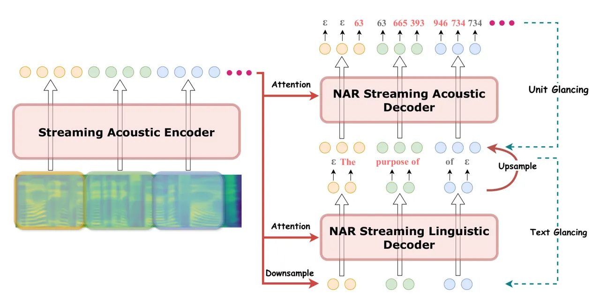

# A Non-autoregressive Generation Framework for End-to-End Simultaneous Speech-to-Speech Translation

Zhengrui Ma Affiliation: Key Laboratory of Intelligent Information
ProcessingInstitute of Computing Technology, Chinese Academy of Sciences
Affiliation: University of Chinese Academy of Sciences    Qingkai Fang
Affiliation: Key Laboratory of Intelligent Information
ProcessingInstitute of Computing Technology, Chinese Academy of Sciences
Affiliation: University of Chinese Academy of Sciences    Shaolei Zhang
Affiliation: Key Laboratory of Intelligent Information
ProcessingInstitute of Computing Technology, Chinese Academy of Sciences
Affiliation: University of Chinese Academy of Sciences    Shoutao Guo
Affiliation: Key Laboratory of Intelligent Information
ProcessingInstitute of Computing Technology, Chinese Academy of Sciences
Affiliation: University of Chinese Academy of Sciences    Yang Feng, Min
Zhang ^(†)^(†)thanks: \$  \$Corresponding author: Yang Feng
Affiliation: Key Laboratory of Intelligent Information
ProcessingInstitute of Computing Technology, Chinese Academy of Sciences
Affiliation: Key Laboratory of AI Safety, Chinese Academy of Sciences
Affiliation: University of Chinese Academy of Sciences
Affiliation: School of Future Science and Engineering, Soochow
University  {[mazhengrui21b](mailto:mazhengrui21b@ict.ac.cn),[fengyang](mailto:fengyang@ict.ac.cn)}@ict.ac.cn
  [zhangminmt](mailto:zhangminmt@hotmail.com)@hotmail.com

###### Abstract

Simultaneous translation models play a crucial role in facilitating
communication. However, existing research primarily focuses on
text-to-text or speech-to-text models, necessitating additional cascade
components to achieve speech-to-speech translation. These pipeline
methods suffer from error propagation and accumulate delays in each
cascade component, resulting in reduced synchronization between the
speaker and listener. To overcome these challenges, we propose a novel
non-autoregressive generation framework for simultaneous speech
translation (NAST-S2$`x`$¹¹ 1
 $`x\in\{\mathrm{text},\mathrm{speech}\}`$), which integrates
speech-to-text and speech-to-speech tasks into a unified end-to-end
framework. We develop a non-autoregressive decoder capable of
concurrently generating multiple text or acoustic unit tokens upon
receiving fixed-length speech chunks. The decoder can generate blank or
repeated tokens and employ CTC decoding to dynamically adjust its
latency. Experimental results show that NAST-S2$`x`$ outperforms
state-of-the-art models in both speech-to-text and speech-to-speech
tasks. It achieves high-quality simultaneous interpretation within a
delay of less than 3 seconds and provides a 28× decoding speedup in
offline generation.²² 2  Project:
[https://github.com/ictnlp/NAST-S2x](https://github.com/ictnlp/NAST-S2x)

## 1 Introduction

Simultaneous machine translation (Cho and Esipova, 2016; Gu et al.,
2017; Raffel et al., 2017; Ma et al., 2019; Arivazhagan et al., 2019)
models are widely applied in communication scenarios, eliminating
barriers between individuals with different linguistic backgrounds. In
practice, simultaneous translation systems can be broadly categorized
into speech-to-text (Ma et al., 2020c, Simul-S2T;) and speech-to-speech
(Zheng et al., 2020, Simul-S2S;) variants. Regardless of the modality of
output, simultaneous translation models initiate generation before
receiving the complete input to maintain synchrony between the listener
and speaker. This necessitates models to delicately balance between
translation quality and latency.

Figure 1: NAST-S2$`x`$ can perform both Simul-S2T and Simul-S2S tasks
within a unified end-to-end framework. The model generates speech output
directly without the need to produce intermediate target text tokens

Most research on simultaneous machine translation primarily focuses on
either text-to-text (Ma et al., 2020d; Miao et al., 2021) or
speech-to-text models (Tang et al., 2023; Zhang and Feng, 2023b),
necessitating additional cascaded components such as streaming automatic
speech recognition (Chiu and Raffel, 2018; Zhang et al., 2020) and
incremental text-to-speech synthesis (Ma et al., 2020a) for achieving
speech-to-speech interpretation (Zheng et al., 2020). However, pipeline
methods often suffer from error propagation and delay accumulation. The
intermediate texts serve as information bottlenecks, hindering
subsequent cascade components from accessing the original information
and correcting errors. Moreover, each component operates with
independent streaming strategies, resulting in cumulative delays thus
diminishing synchronization between the speaker and listener. Given
these challenges, the emergence of end-to-end Simul-S2S models has
garnered increasing attention in the research community.

Recent success of end-to-end offline speech-to-speech translation
(Offline-S2S) has paved the way for the development of end-to-end
Simul-S2S models. Particularly, Lee et al. (2022) construct a direct
speech-to-unit model (S2UT), which predicts self-supervised discrete
representations of target speech. Waveforms are subsequently generated
using a separate unit-based vocoder (Polyak et al., 2021). On this
basis, Ma et al. (2022) builds the first end-to-end Simul-S2S model by
introducing a variational version of monotonic multihead attention (Ma
et al., 2020d). However, previous works are mainly limited to predicting
units in an autoregressive manner, which is suboptimal for end-to-end
Simul-S2S models. Considering that the acoustic unit sequence is 25
times longer than the corresponding text sequence on average,
autoregressive unit prediction often leads to issues such as
hallucination or truncation (Seamless Communication et al., 2023b).
Moreover, the sequential prediction of long unit sequences imposes a
significant computational time overhead, making it impractical for
delay-sensitive Simul-S2S systems. To tackle these challenges, our focus
is on developing a non-autoregressive end-to-end Simul-S2S model, aiming
for enjoying the merits of an end-to-end system without the necessity of
intermediate text decoding, while benefiting from the efficiency
inherent in non-autoregressive generation.

In this work, we propose a non-autoregressive generation framework for
end-to-end simultaneous speech-to-any translation (NAST-S2$`x`$).
Inspired by recent advances in non-autoregressive generation (Shao and
Feng, 2022; Ma et al., 2023), we develop a non-autoregressive decoder
capable of concurrently generating multiple text or acoustic unit tokens
upon receiving each fixed-length speech chunk. The entire generation
adopts a chunk-to-chunk approach, while avoiding the unstable expected
training method (Zhang and Feng, 2023b). The model can produce blank or
repeated tokens and perform CTC decoding (Graves et al., 2006) to adjust
its latency dynamically. Considering the difficulty of the speech
translation task and aiming to leverage intermediate text data to assist
training, we further introduce a two-step glancing and a multi-task
non-monotonic training strategy, which largely enhances the translation
performance while maintaining the end-to-end nature of our model.

Extensive experiments highlight the superiority of our NAST-S2$`x`$. In
Simul-S2T, its performance is on par with state-of-the-art models. In
Simul-S2S, it significantly surpasses cascade Simul-S2T + TTS baselines,
achieving high-quality simultaneous interpretation within a delay of
less than 3 seconds. In Offline-S2S, it matches the performance of the
strong autoregressive baseline while providing a 28× inference speedup.

## 2 Preliminaries

### 2.1 Simultaneous Speech Translation

Simultaneous speech translation models often process a streaming
sequence of acoustic features $`\bm{x}=\{x_{1},...,x_{m}\}`$ as input,
extracted from speech samples every $`T_{w}`$ ms. Simultaneous
translation models can be further categorized into speech-to-text
(Simul-S2T) and speech-to-speech (Simul-S2S) variants based on the
output modality.

#### 2.1.1 Simul-S2T

A Simul-S2T model generates a translated text sequence
$`\bm{y}=\{y_{1},...,y_{n}\}`$ in a streaming fashion. To quantify the
extent of source information taken into account during the generation, a
monotonic non-decreasing function $`g(t)`$ is introduced to represent
the number of observed frames when generating $`y_{t}`$.

To assess the latency of Simul-S2T models, Ma et al. (2020c) introduce a
modified version of average lagging (Ma et al., 2019, AL;) for
speech-to-text task. They measure the lagging based on time instead of
steps, and the metric is defined as:

```math
AL=\frac{1}{\tau(|\bm{x}|)}\sum^{\tau(|\bm{x}|)}_{t=1}{d(t)-\frac{|\bm{x}|}{|\bm{y}^{*}|}\cdot T_{w}\cdot(t-1)}, \tag{1}
```

where $`|\bm{x}|`$ and $`|\bm{y}^{*}|`$ represent the lengths of source
frames and reference text. $`\tau(|\bm{x}|)`$ is the index of the first
generated token when the source is complete, and $`d(t)`$ is the delay
of generating $`y_{t}`$. Ma et al. (2020c) further defines
computation-aware and non-computation-aware versions of $`d(t)`$. The
former, $`d_{CA}(t)`$, is defined as the elapsed time from the beginning
of the whole process, while the latter is simply calculated as
$`d_{NCA}(t)=g(t)\cdot T_{w}`$. As the non-computation-aware metric is
independent of implementation, most previous studies adopt this metric
for comparisons, focusing on the algorithm.

#### 2.1.2 Simul-S2S

A Simul-S2S model further synthesizes translated text into speech. To
assess the translation quality of Simul-S2S models, a separate offline
automatic speech recognition system is employed to transcribe the
generated speech $`\mathcal{Y}(t)`$ into text $`\bm{y}`$ for computing
ASR-BLEU against the reference (Jia et al., 2019). To evaluate latency,
a forced aligner is usually introduced to align the transcription
$`\bm{y}`$ with $`\mathcal{Y}(t)`$ to acquire the delay of each token in
$`\bm{y}`$. Subsequently, the AL metric, as defined in Simul-S2T, can be
calculated for $`\bm{y}`$ (Ma et al., 2022).³³ 3 A detailed description
of the latency metric used in our Simul-S2S experiments is provided in
Section 4.2.

### 2.2 Speech-to-Unit Translation

Recent success of self-supervised representation learning in speech has
opened up a new avenue for building speech-to-speech translation
systems. The discretized units derived from clustering speech
representations allow models to predict speech in a manner analogous to
text. Lee et al. (2022) build the first speech-to-unit (S2UT)
translation model with autoregressive Transformer (Vaswani et al.,
2017). They utilize a HuBERT (Hsu et al., 2021) pre-trained on an
unlabelled speech corpus and perform $`k`$-means algorithm to the
learned representations of each 20ms chunk to produce $`K`$ cluster
centroids. Each chunk is then assigned the index of its nearest centroid
serving as the label. Consequently, a target utterance can be encoded as
a sequence of cluster indices $`\bm{z}=\{z_{1},z_{2},...,z_{T}\}`$,
$`z_{i}\in\{0,1,...,K-1\}`$, $`\forall 1\leq i\leq T`$, where $`T`$ is
the number of chunks. S2UT model can be trained using cross-entropy. A
separate unit-based vocoder (Polyak et al., 2021) is employed to convert
the predicted acoustic unit sequence into waveform.

## 3 Approach

We provide a detailed introduction to our non-autoregressive generation
framework for end-to-end simultaneous speech-to-any translation in this
section.



Figure 2: Overview of the proposed non-autoregressive generation
framework for end-to-end simultaneous speech-to-any translation
(NAST-S2$`x`$, $`x\in\{\mathrm{text},\mathrm{speech}\}`$). Different
colors indicate different chunks.

### 3.1 Architecture

As illustrated in Figure 2, NAST-S2$`x`$ consists of a chunk-based
acoustic streaming encoder and a chunk-based non-autoregressive (NAR)
streaming decoder. This non-autoregressive decoder comprises stacked
linguistic and acoustic components, with the two parts connected by
upsampling the hidden states from linguistic part’s top layer and
feeding them into the acoustic component. In contrast to previous
two-pass speech-to-speech models (Jia et al., 2022a; Inaguma et al.,
2023), NAST-S2$`x`$ leverages its fully non-autoregressive nature. It no
longer relies on intermediate text decoding to determine the information
passed to the acoustic component. This characteristic allows it to be
trained and tested directly from speech to acoustic units, thereby
circumventing issues related to error propagation.

#### 3.1.1 Streaming Acoustic Encoder

The acoustic encoder operates by setting a chunk size $`T_{s}`$. We
extract FBank features from the streaming speech every $`T_{s}`$ ms,
which are then fed into the encoder. The acoustic encoder consists of
two layers of causal convolution for downsampling and followed by
multiple standard Transformer layers. In a Transformer layer, features
within each chunk are encoded bidirectionally, and the information from
all previous chunks can also be attended to. Given the strong local
dependencies in speech, we additionally employ Lookahead encoding (Liu
et al., 2021a), which enables states in each chunk to attend to its
subsequent $`r`$ frames.

#### 3.1.2 Streaming Non-autoregressive Decoder

Once the latest chunk is encoded, we use the features as input to the
linguistic decoder. Given the significant discrepancy in length between
the sequences of FBank and text, we downsample the encoded features
before feeding them into the decoder:

```math
\mathrm{DownSample}(\mathbf{\tilde{s}}^{e}_{i},r_{\mathrm{down}}), \tag{2}
```

where $`\mathbf{\tilde{s}}^{e}_{i}`$ represents the encoded features in
the $`i`$-th chunk and $`r_{\mathrm{down}}`$ is the downsampling ratio.
We use $`\mathrm{MeanPooling}`$ applied to every $`r_{\mathrm{down}}`$
encoded features in our experiments.

The linguistic decoder also works in a chunk-by-chunk manner. The
decoding of current chunk relies solely on hidden states in the previous
chunks rather than any generated token:

```math
\displaystyle\mathrm{SelfAttn}(\mathbf{s}^{ld}_{i},\mathbf{s}^{ld}_{\leq i}), \tag{3}
```

```math
\displaystyle\mathrm{CrossAttn}(\mathbf{s}^{ld}_{i},\mathbf{\tilde{s}}^{e}_{\leq i}),
```

where $`\mathbf{s}^{ld}_{i}`$ denotes the hidden states in the $`i`$-th
chunk in the linguistic decoder. Optionally, the linguistic decoder can
generate text translation from the chunks. The text logits are derived
by projecting the last layer states.

Meanwhile, hidden states in the last layer of linguistic decoder serve
as input to the acoustic decoder after upsampling. This upsampling is
designed to bridge the length gap between the sequences of text and
acoustic unit:

```math
\mathrm{UpSample}(\mathbf{\tilde{s}}^{ld}_{i},r_{\mathrm{up}}), \tag{4}
```

where $`\mathbf{\tilde{s}}^{ld}_{i}`$ denotes the last layer states of
the linguistic decoder in the $`i`$-th chunk and $`r_{\mathrm{up}}`$ is
the upsampling ratio. We simply copy each state in the chunk
$`r_{\mathrm{up}}`$ times.

The acoustic decoder operates similarly to the linguistic decoder.
Compared with previous two-pass models, our non-autoregressive acoustic
decoder can directly attend to the acoustic encoder. This capability
enables it to incorporate a broader range of acoustic information (e.g.,
rhythm, pitch, and energy) and helps in recovering from potential
mistakes made by the linguistic decoder:

```math
\displaystyle\mathrm{SelfAttn}(\mathbf{s}^{ad}_{i},\mathbf{s}^{ad}_{\leq i}), \tag{5}
```

```math
\displaystyle\mathrm{CrossAttn}(\mathbf{s}^{ad}_{i},\mathbf{\tilde{s}}^{e}_{\leq i}),
```

where $`\mathbf{s}^{ad}_{i}`$ denotes the hidden states in the $`i`$-th
chunk in the acoustic decoder. We use the states in the top layer to
predict acoustic units.

When predicting text and unit sequences, an additional blank token is
included in the vocabulary. The model dynamically adjusts the output
length of each chunk by generating repeated or blank tokens.
Subsequently, the collapse function in CTC (Graves et al., 2006) is
employed for online deduplication and removal of blanks to generate the
final output. The generated chunk of units is sent directly to a
separate unit-based HiFi-GAN vocoder (Polyak et al., 2021) for
synthesizing the waveform, which is then played immediately to the
listener.

### 3.2 Latency Control

In this subsection, we explore various techniques for controlling the
latency of NAST-S2$`x`$.

Chunk Size Given that NAST-S2$`x`$ operates at a chunk level, a
straightforward approach to controlling latency is to adjust the chunk
size. Specifically, when the chunk size exceeds the utterance length,
our model transitions into an offline model, conducting bidirectional
encoding and bidirectional non-autoregressive decoding.

Lookahead Chunk lookahead decoding resembles Lookahead encoding. When a
feature chunk is sent to the decoder, it is allowed to wait for its
subsequent $`k`$ chunks before starting decoding:

```math
\displaystyle\mathrm{CrossAttn}(\mathbf{s}^{ld}_{i},\mathbf{\tilde{s}}^{e}_{\leq i+k}), \tag{6}
```

```math
\displaystyle\mathrm{CrossAttn}(\mathbf{s}^{ad}_{i},\mathbf{\tilde{s}}^{e}_{\leq i+k}).
```

This allows the model to obtain more source-side information through an
additional delay of $`(k\cdot T_{s})`$ ms, without changing the chunk
size.

### 3.3 Training

While NAST-S2$`x`$ benefits from various advantages of
non-autoregressive generation, training it is challenging. Previous
studies (Huang et al., 2022a; Shao et al., 2023) have highlighted that
NAR generation struggles to capture multi-modal distributions.
Regrettably, speech-to-speech translation encounters this multimodality
problem. This challenge stems from two aspects: First, the mapping from
speech input to text translation can be one-to-many, as different word
choices and grammar structures may convey the same semantics. Secondly,
the distribution of speech when the text is given can be multi-modal,
with variations in pitch, rhythm, and energy. To mitigate these
challenges, we propose the following strategies to train NAST-S2$`x`$.

#### 3.3.1 Multi-task Non-monotonic Training

Due to the performance decline observed in NAR models when trained with
maximum likelihood estimation, we train NAST-S2$`x`$ using CTC-based
non-monotonic latent alignment loss (Shao and Feng, 2022)

```math
\mathcal{L}_{o}(\theta)=-\frac{2\cdot\sum_{g\in G_{2}}\min\{C_{g}(\bm{o}),C_{g}(\theta)\}}{\sum_{g\in G_{2}}(C_{g}(\bm{o})+C_{g}(\theta))}, \tag{7}
```

where $`\bm{o}\in\{\bm{y},\bm{z}\}`$ is the target for either S2T or S2U
task. $`C_{g}(y)`$ denotes the occurrence count of bigram $`g`$ in
target, $`C_{g}(\theta)`$ represents the expected count of $`g`$ for
model, and $`G_{2}`$ denotes the set of all bigrams in target. This
training objective maximizes the F1 score of expected bigram matching
between target and the uncollapsed output, and guides NAST-S2$`x`$
towards convergence to a concentrated distribution, thereby alleviating
the multimodality problem in speech-to-speech translation. We utilize
multi-task learning to integrate the losses from both text and acoustic
unit prediction tasks into our training process:

```math
\mathcal{L}=\mathcal{L}_{\bm{y}}(\theta)+\mathcal{L}_{\bm{z}}(\theta). \tag{8}
```

#### 3.3.2 Two-Step Glancing

To further simplify the learning complexity for both linguistic and
acoustic decoders, we further introduce the concept of glancing (Qian
et al., 2021) to our NAST-S2$`x`$ training. As depicted in Figure 2, we
find the most probable sequence that can be collapsed to the target
within the current distribution of text and acoustic unit in the model:

```math
\displaystyle\bm{a}_{\mathrm{unit}}^{*}=\mathop{\arg\max}\limits_{\bm{a}_{\mathrm{unit}}\in\beta^{-1}(\bm{z})}{p_{\theta}(\bm{a}_{\mathrm{unit}}|\bm{x})}, \tag{9}
```

```math
\displaystyle\bm{a}_{\mathrm{text}}^{*}=\mathop{\arg\max}\limits_{\bm{a}_{\mathrm{text}}\in\beta^{-1}(\bm{y})}{p_{\theta}(\bm{a}_{\mathrm{text}}|\bm{x})},
```

where $`\bm{a}_{\mathrm{unit}}`$ and $`\bm{a}_{\mathrm{text}}`$
represent the predicted uncollapsed sequence of text and acoustic unit,
and $`\beta^{-1}`$ is the inverse of collapse function. We then randomly
substitute the features fed to both the linguistic and acoustic decoders
with token embeddings corresponding to positions in the most probable
text or unit sequences.

This strategy simplifies the complexity of S2S mapping by providing cues
during both decoding stages. This induces the NAR model to learn a
deterministic conditional distribution, mitigating the issue of
insufficient capacity for tasks with multi-modal distributions.

## 4 Experiments

### 4.1 Speech-to-Text

Datasets We conduct experiments on two MuST-C⁴⁴ 4
[https://ict.fbk.eu/must-c](https://ict.fbk.eu/must-c) language pairs:
English to German (En$`\rightarrow`$De) and English to Spanish
(En$`\rightarrow`$Es) (Di Gangi et al., 2019). We use the dev set for
validation and report performance on the tst-COMMON set.

Pre-processing The input speech is represented as 80-dimensional log
mel-filterbank coefficients computed every 10ms with a 25ms window.
Global channel mean and variance normalization is applied to the input
speech. In training, SpecAugment (Park et al., 2019) data augmentation
with the LB policy is additionally employed. We use SentencePiece (Kudo
and Richardson, 2018) to generate a unigram vocabulary of size 10000 for
the source and target text jointly.

Model Configurations In the Simul-S2T experiments, we exclusively
utilize the linguistic component of the decoder. We set the downsampling
ratio⁵⁵ 5 For details on the analysis of the downsampling ratio, see
Appendix D. to 2 and explore chunk sizes within the set
$`\{160,320,640,1280\}`$ ms. The offline results are obtained by setting
the chunk size to be longer than any utterance in the corpus. The number
of additional frames the encoder can attend to is set equal to the size
of a chunk. When employing lookahead decoding, we vary the lookahead
number $`k`$ within the range $`\{0,2,6\}`$ while maintaining a fixed
chunk size of 320ms. More implementation details can be found in
Appendix A.

Baselines We compare our NAST-S2$`T`$ with several strong Simul-S2T
baselines. Further details regarding baselines are available in Appendix
B.1.

Evaluation We use SimulEval⁶⁶ 6
[https://github.com/facebookresearch/SimulEval](https://github.com/facebookresearch/SimulEval)
toolkit (Ma et al., 2020b) for evaluation. Translation quality is
assessed using case-sensitive detokenized BLEU (Papineni et al., 2002;
Post, 2018), while latency is measured by word-level Average Lagging (Ma
et al., 2020c, AL;). Numerical results with more latency metrics are
provided in Appendix C.1.

#### 4.1.1 Preliminary Experiment

We first conduct a preliminary experiment to compare latency control
strategies. Employing NAST-S2$`T`$ with a baseline chunk size of 320ms,
we examine the trade-off between latency and quality by adjusting the
chunk size and implementing lookahead decoding. As depicted in Table 1,
both stratigies enhance quality at the sacrifice of latency.
Nevertheless, increasing the chunk size yields superior quality with
reduced latency over lookahead decoding. Notably, there appears to be a
quality plateau when utilizing lookahead decoding. Waiting for an extra
6 source chunks versus 2 extra ones results in nearly identical quality,
despite an additional delay of almost 1000ms. This implies that the
amount of source information alone does not solely dictate translation
quality. By adopting the strategy of increasing chunk size, we not only
enable the model to attend to more source information but also
facilitate bidirectional non-autoregressive decoding of longer sequences
within a chunk. This enhancement significantly improves the translation
quality. Therefore, we only vary the chunk size in the main experiment.

|             |        |                  |                  |                   |
| ----------- | ------ | ---------------- | ---------------- | ----------------- |
| Chunk       | $`ms`$ | $`\mathbf{320}`$ | $`\mathbf{640}`$ | $`\mathbf{1280}`$ |
|             | BLEU   | 26.48            | 27.02            | 28.05             |
| ($`\#=0`$)  | AL     | 1114             | 1396             | 2180              |
| Lookahead   | $`\#`$ | $`\mathbf{0}`$   | $`\mathbf{2}`$   | $`\mathbf{6}`$    |
|             | BLEU   | 26.48            | 27.02            | 26.99             |
| ($`320ms`$) | AL     | 1114             | 1762             | 2781              |

Table 1: Results of the quality-latency trade-off with increasing the
chunk size or implementing lookahead decoding. Experiments are conducted
on En$`\rightarrow`$Es Simul-S2T task.

(a) En$`\rightarrow`$De

(b) En$`\rightarrow`$Es

Figure 3: Results of translation quality (BLEU) against latency (Average
Lagging, AL) on MuST-C En$`\rightarrow`$De and En$`\rightarrow`$Es
datasets. The red solid line and dashed line illustrate the performance
of NAST-S2$`T`$ under different chunk sizes $`T_{s}`$ or in an offline
condition. The numerical results are presented in Table 5 and Table 6.

#### 4.1.2 Main Results and Analysis

Figure 3 illustrates the main results of Simul-S2T task. Detailed
numerical results are available in Table 5 and 6. It can be observed
that NAST-S2$`T`$ achieves competitive or superior translation quality
compared to strong baselines across various latency constraints. At
lower latency, its performance is only inferior to CAAT (Liu et al.,
2021a). Meanwhile, it performs better or comparably as the
autoregressive models under higher latency or offline conditions. Both
datasets demonstrate that as the chunk size $`T_{s}`$ increases from
160ms to 320ms, there is a significant improvement in translation
quality with only a minor increase in latency. We attribute this
phenomenon to the average duration of each word, estimated to be
approximately 280ms (Ma et al., 2020c). The model’s performance tends to
degrade when the chunk size falls below it. Furthermore, we find that
NAST-S2$`T`$ achieves a better balance when the chunk size $`T_{s}`$ is
640ms (AL $`\approx`$ 1200ms), after which the quality gain from further
increasing the chunk size diminishes.

### 4.2 Speech-to-Speech

Datasets We conduct experiments on CVSS-C⁷⁷ 7
[https://github.com/google-research-datasets/cvss](https://github.com/google-research-datasets/cvss)
French to English (Fr$`\rightarrow`$En) dataset (Jia et al., 2022b).

Pre-processing For the source speech, we resample the audio to 16kHz and
apply identical preprocessing steps as those used in the Simul-S2T
experiments. For the target speech, we also downsample the audio and
extract discrete units utilizing the publicly available pre-trained
mHuBERT model and K-means quantizer.⁸⁸ 8
[https://github.com/facebookresearch/fairseq/blob/main/examples/speech_to_speech/docs/textless_s2st_real_data.md](https://github.com/facebookresearch/fairseq/blob/main/examples/speech_to_speech/docs/textless_s2st_real_data.md)

Model Configurations The downsampling and upsampling ratio are set to 2
and 6. We explore different settings for chunk sizes within the set
$`\{320,640,1280,1920,2560\}`$ ms. The offline results are obtained by
setting the chunk size to be longer than any utterance. The number of
additional frames the encoder can attend to is set equal to the size of
a chunk. We also experimented with fixing the duration of additional
frames to 1280ms when the chunk size is larger. More details can be
found in Appendix A.

Baselines

Wait-$`k`$-Stride-$`n`$: We employ Wait-$`k`$ strategy (Ma et al., 2019)
for S2UT model (Lee et al., 2022) to build an end-to-end Simul-S2S
baseline. Since the input is speech audio, a pre-decision module is
needed to segment the utterance into multiple chunks to execute
Wait-$`k`$ (Ma et al., 2020c). Furthermore, the translation of a speech
chunk can consist of multiple acoustic units to form the pronunciation
of a word. It is reasonable to generate multiple unit tokens upon
receiving a speech chunk. Therefore, we adopt Wait-$`k`$-Stride-$`n`$
strategy (Zeng et al., 2021) to construct an end-to-end Simul-S2S
baseline, varying the speech chunk size and the hyperparameters $`k`$
and $`n`$. The numerical results can be found in Table 13.

EDAtt + Tacotron2: We further provide the results of cascade systems
(Simul-S2T + TTS) for comparison. We choose EDAtt (Papi et al., 2023b)
as the Simul-S2T model. According to the recommendation in Papi et al.
(2023b), we train a Conformer + CTC compression model (Gaido et al., 2021) with a total of $`\sim`$120M parameters using speech-text parallel
pairs of CVSS-C Fr-En dataset as the offline model to implement EDAtt
algorithm. For TTS part, we use a Tacotron2 model trained on LJSpeech⁹⁹
9
[https://huggingface.co/speechbrain/tts-tacotron2-ljspeech](https://huggingface.co/speechbrain/tts-tacotron2-ljspeech).
Whenever the Simul-S2T model generates a complete word, we send it to
the TTS model and generate a speech chunk as output. The numerical
results can be found in Table 14.

We also compare NAST-S2$`S`$ with several strong Offline-S2S models to
assess its performance in offline scenarios. Further details regarding
baselines are available in Appendix B.2.

Evaluation We also use SimulEval toolkit for evaluation. Following Ma
et al. (2022), we keep discontinuities between generated speech chunks
to simulate real-world scenarios. Translation quality is assessed using
ASR-BLEU. We also employ BLASER 2.0¹⁰¹⁰ 10
[https://huggingface.co/facebook/blaser-2.0-ref](https://huggingface.co/facebook/blaser-2.0-ref)
(Seamless Communication et al., 2023a) to assess the quality. The
results for BLASER 2.0 are presented in Table 12. Regarding latency, we
report AL and AL_EOW (Ma et al., 2022). AL measures time delay of
waveform chunks, while AL_EOW assesses the delay of text transcribed
from generated speech. The generated time of each word is considered as
the end time of its corresponding segment. Numerical results with more
latency metrics are provided in Appendix C.2.

[TABLE]

Table 2: Comparison of strong Offline-S2S baselines and our NAST-S2$`S`$
in offline conditions. The speedup is measured using a GeForce RTX 3090
GPU with a batch size of 1.

#### 4.2.1 Main Results

Figure 4 illustrates the main results of Simul-S2S task. Detailed
numerical results are presented in Table 9. We observe a trend where the
translation quality of NAST-S2$`S`$ generally improves as latency
increases, with a notable improvement from 3000ms to 4000ms. Even under
extremely low latency conditions (AL $`\approx`$ 1000ms), NAST-S2$`S`$
still achieves acceptable translation quality (ASR-BLEU \> 19). This
result even surpasses the performance of wait-$`k`$-stride-$`n`$ and
cascade baselines at 4000ms latency. Furthermore, we discover that in
offline scenarios, the quality achieved by NAST-S2$`S`$ exceeds that of
the current leading NAR Offline-S2S model DASpeech (Fang et al., 2023)
by nearly 1 ASR-BLEU, with translation quality only slightly inferior to
two-pass autoregressive model UnitY¹¹¹¹ 11 Two-pass models are not
strictly end-to-end, as they must generate target text before producing
the speech output. (Inaguma et al., 2023).

Figure 4: Results of translation quality in offline conditions and
simultaneous scenarios (ASR-BLEU or ASR-BLEU (Silence Removed) against
AL or AL_EOW). The numerical results of NAST-S2$`S`$ are presented in
Table 9 and Table 11.

#### 4.2.2 Analysis on Inference Efficiency

|                    |          |                          |      |            |                       |      |            |                     |      |            |              |
| ------------------ | -------- | ------------------------ | ---- | ---------- | --------------------- | ---- | ---------- | ------------------- | ---- | ---------- | ------------ |
| $`T_{s}`$ ($`ms`$) | ASR-BLEU | Average Lagging ($`ms`$) |      |            | Start Offset ($`ms`$) |      |            | End Offset ($`ms`$) |      |            | ACT ($`ms`$) |
|                    |          | NCA                      | CA   | $`\Delta`$ | NCA                   | CA   | $`\Delta`$ | NCA                 | CA   | $`\Delta`$ |              |
| $`\mathbf{320}`$   | 19.67    | -392                     | 347  | 739        | 655                   | 712  | 57         | 562                 | 1550 | 988        | 555          |
| $`\mathbf{640}`$   | 19.15    | 1532                     | 1824 | 292        | 1294                  | 1350 | 56         | 863                 | 1344 | 481        | 297          |
| $`\mathbf{1280}`$  | 20.20    | 3330                     | 3500 | 170        | 2566                  | 2642 | 76         | 1648                | 1901 | 253        | 192          |
| $`\mathbf{2560}`$  | 24.88    | 4975                     | 5097 | 122        | 4691                  | 4781 | 90         | 2753                | 2879 | 126        | 120          |

Table 3: Results of translation quality (ASR-BLEU), latency (Average
Lagging, Start Offset & End Offset) and average computation time per
chunk generation (ACT) during NAST-S2$`S`$ simultaneous inference. All
latency metrics report both the computation-aware (CA) version and the
non-computation-aware (NCA) version, as well as their differences
($`\Delta`$).

Speech-to-speech translation imposes strong demands on inference
efficiency. In Offline-S2S, efficiently generating long sequences of
acoustic unit is crucial to minimize waiting time. In Simul-S2S,
reducing computational time overhead is essential to avoid extra
latency. Benefiting from end-to-end non-autoregressive generation,
NAST-S2$`S`$ offers appealing advantages in both scenarios. Table 2
presents the comparison in Offline-S2S. NAST-S2$`S`$ achieves a 28×
speedup compared to S2UT and a 17× speedup compared to UnitY at
decoding. In Simul-S2S, the advantage in inference speed becomes more
critical. Table 3 presents the comparison of non-computation-aware and
computation-aware latency. The gap between AL and AL_CA and the average
computation time per chunk generation are both less than 300ms when the
chunk size is larger than 640ms, indicating that NAST-S2$`S`$’s latency
in practical use is similar to the theoretical latency of its
simultaneous translation policy.

#### 4.2.3 Analysis on Discontinuity

We observed notable differences in the performance of NAST-S2$`x`$
between Simul-S2S and Simul-S2T tasks. NAST-S2$`T`$ achieves
satisfactory quality when the chunk size $`T_{s}`$ is set to 640ms (AL
\< 2000ms). However, to attain translation quality comparable to offline
condition, NAST-S2$`S`$ requires an increase in the chunk size $`T_{s}`$
to 2560ms. This discrepancy may stem from the differing nature of text
and speech streaming generation. In text generation, appending newly
generated chunk directly after the historical sequence is
straightforward. However, in speech generation, there may be silence
intervals between each speech chunk, particularly when the chunk size
$`T_{s}`$ exceeds the duration of the last generated speech chunk.
Therefore, we speculate that as the chunk size decreases, increased
silence between generated speech chunks may lead to discontinuity in
speech, thereby decreasing the overall quality.

To validate this hypothesis, we further analyze the trends of the
following metrics as the chunk size varies: ASR-BLEU (Silence Removed),
representing ASR-BLEU score after removing the added silence between
generated chunk; Unit-BLEU, representing BLEU score of the generated
unit sequences against the reference; S2T-BLEU, where we conduct
additional decoding of the linguistic decoder to evaluate quality in
Simul-S2T. We also provide statistics on the number of discontinuities
(DCNum), the average silence duration per discontinuity (DCAve), and the
total silence duration (DCSum) in the generated streaming speech.

|                    |                  |                  |                   |                   |
| ------------------ | ---------------- | ---------------- | ----------------- | ----------------- |
| $`T_{s}`$ $`(ms)`$ | $`\mathbf{320}`$ | $`\mathbf{640}`$ | $`\mathbf{1280}`$ | $`\mathbf{2560}`$ |
| S2T-BLEU           | 28.04            | 28.28            | 28.23             | 28.78             |
| Unit-BLEU          | 33.41            | 33.97            | 34.04             | 34.40             |
| ASR-BLEU           | 19.67            | 19.15            | 20.20             | 24.88             |
| ASR-BLEU           | 24.90            | 25.67            | 25.71             | 26.14             |
| (Silence Removed)  |                  |                  |                   |                   |
| DCNum              | 7.3              | 4.7              | 2.1               | 0.4               |
| DCAve $`(ms)`$     | 355              | 450              | 685               | 360               |
| DCSum $`(ms)`$     | 2220             | 1952             | 1420              | 395               |

Table 4: Statistics of NAST-S2$`S`$ generation across varying chunk
sizes $`T_{s}`$.

Table 4 presents the statistics. We observed minor degradation in the
values of Unit-BLEU and S2T-BLEU even at a chunk size of 320ms, showing
NAST-S2$`S`$’s capability in streaming text and unit generation.
However, there exists a significant increase in the number of
discontinuities as the chunk size decreases. Although the duration of
silence per discontinuity is relatively short when the chunk size is
small, the increase in their number results in a longer total silence
duration, thus intensifying the degree of discontinuity and impacting
its overall quality (ASR-BLEU).

Moreover, if the added silence were removed, the measured ASR-BLEU
(Silence Removed) significantly increased and the gap between streaming
and offline scenarios becomes small. This suggests that ASR-BLEU may
underestimate speech quality here. The decline in ASR-BLEU scores is
primarily due to the _playback timing_. For example, consider the word
"_Richardson_", which consists of multiple syllables. If the "_Richard_"
part of the waveform is generated in the previous chunk and played
immediately, and the "_son_" syllable is generated in the subsequent
chunk, the potential silence period (which equals to the chunk size
minus the length of the waveform generated in the previous chunk) could
cause the listener to perceive a _stuttering_ effect, leading to a
decrease in ASR-BLEU scores.

## 5 Related Work

Researches in simultaneous speech translation can be roughly categorized
into Simul-S2T (Ma et al., 2020c) and Simul-S2S (Zheng et al., 2020)
variants.

Simul-S2T With the rise of neural networks, Simul-S2T models no longer
rely on the transcription as a bridge (Ma et al., 2020c; Iranzo-Sánchez
et al., 2020). Given the difference between speech and text input, some
researchers focus on how to divide speech chunks and then execute
strategies. Ma et al. (2020c) employed fixed-length segmentation and
implemented Wait-$`k`$ (Ma et al., 2019) and MMA (Ma et al., 2020d)
based on that; Ren et al. (2020); Zeng et al. (2021); Chen et al. (2021)
utilized ASR results to partition and execute Wait-$`k`$ or its
variants. Zhang et al. (2022) trained a segmentation model to detect
semantic units. Zhang and Feng (2023a) trained a model to dynamically
segment with differentiable approach, then extending it to a
segment-to-segment framework (Zhang and Feng, 2023b). Additionally, some
researchers have also attempted to use Transducer (Graves, 2012) and
incorporate attention mechanisms to enhance its performance (Liu et al.,
2021a; Tang et al., 2023). Besides, some researchers are leveraging
offline models for simultaneous inference. Liu et al. (2020) considered
the agreeing prefixes of two consecutive chunks as stable hypotheses.
Papi et al. (2023b); Papi et al. (2023c) used attention as guidance,
allowing the model to generate output for the current step if its
attention is not focused on the most recently received frames.

Simul-S2S There have been limited prior studies exploring Simul-S2S.
Zheng et al. (2020) and Sudoh et al. (2020) both developed cascade
models by integrating streaming ASR, Simul-T2T, and incremental TTS
components. Additionally, Liu et al. (2021b) proposed latency reduction
strategies for incremental TTS in Simul-S2S. Moreover, Ma et al. (2022)
introduced a variational version of MMA to S2UT (Lee et al., 2022) and
constructed the first end-to-end Simul-S2S model.

## 6 Conclusion

In this paper, we present a non-autoregressive streaming generation
framework for simultaneous speech-to-any translation, which integrates
both Simul-S2T and Simul-S2S tasks into a unified framework.
Experimental results on various benchmarks showcase the superiority of
our model.

## Limitation

Our NAST-S2$`x`$ exhibits greater latency in Simul-S2S compared to
Simul-S2T tasks. This discrepancy arises due to NAST-S2$`S`$’s reliance
on an external vocoder, typically trained on offline tasks and not
adapted for streaming scenarios, thereby constraining NAST-S2$`S`$’s
performance. Additionally, our method requires a parallel
speech-to-speech translation corpus for end-to-end training, which can
be challenging to obtain. Existing datasets are typically based on
synthesized target speech. The lack of such corpora may hinder the
development of simultaneous speech-to-speech translation models.

## Acknowledgement

We thank the anonymous reviewers for their insightful comments. This
work is supported by National Natural Science Foundation of China (Grant
No. 62376260).

## References

- Arivazhagan et al. (2019) Naveen Arivazhagan, Colin Cherry, Wolfgang
  Macherey, Chung-Cheng Chiu, Semih Yavuz, Ruoming Pang, Wei Li, and
  Colin Raffel. 2019. [Monotonic infinite lookback attention for
  simultaneous machine
  translation](https://doi.org/10.18653/v1/P19-1126). In _Proceedings of
  the 57th Annual Meeting of the Association for Computational
  Linguistics_, pages 1313–1323, Florence, Italy. Association for
  Computational Linguistics.
- Chen et al. (2021) Junkun Chen, Mingbo Ma, Renjie Zheng, and Liang
  Huang. 2021. [Direct simultaneous speech-to-text translation assisted
  by synchronized streaming
  ASR](https://doi.org/10.18653/v1/2021.findings-acl.406). In _Findings
  of the Association for Computational Linguistics: ACL-IJCNLP 2021_,
  pages 4618–4624, Online. Association for Computational Linguistics.
- Chiu and Raffel (2018) Chung-Cheng Chiu and Colin Raffel. 2018.
  [Monotonic chunkwise
  attention](https://openreview.net/forum?id=Hko85plCW). In
  _International Conference on Learning Representations_.
- Cho and Esipova (2016) Kyunghyun Cho and Masha Esipova. 2016. [Can
  neural machine translation do simultaneous
  translation?](http://arxiv.org/abs/1606.02012) _CoRR_, abs/1606.02012.
- Di Gangi et al. (2019) Mattia A. Di Gangi, Roldano Cattoni, Luisa
  Bentivogli, Matteo Negri, and Marco Turchi. 2019. [MuST-C: a
  Multilingual Speech Translation
  Corpus](https://doi.org/10.18653/v1/N19-1202). In _Proceedings of the
  2019 Conference of the North American Chapter of the Association for
  Computational Linguistics: Human Language Technologies, Volume 1 (Long
  and Short Papers)_, pages 2012–2017, Minneapolis, Minnesota.
  Association for Computational Linguistics.
- Fang et al. (2023) Qingkai Fang, Yan Zhou, and Yang Feng. 2023.
  [Daspeech: Directed acyclic transformer for fast and high-quality
  speech-to-speech
  translation](https://proceedings.neurips.cc/paper_files/paper/2023/file/e5b1c0d4866f72393c522c8a00eed4eb-Paper-Conference.pdf).
  In _Advances in Neural Information Processing Systems_, volume 36,
  pages 72604–72623. Curran Associates, Inc.
- Gaido et al. (2021) Marco Gaido, Mauro Cettolo, Matteo Negri, and
  Marco Turchi. 2021. [CTC-based compression for direct speech
  translation](https://doi.org/10.18653/v1/2021.eacl-main.57). In
  _Proceedings of the 16th Conference of the European Chapter of the
  Association for Computational Linguistics: Main Volume_, pages
  690–696, Online. Association for Computational Linguistics.
- Graves (2012) Alex Graves. 2012. [Sequence transduction with recurrent
  neural networks](http://arxiv.org/abs/1211.3711). _CoRR_,
  abs/1211.3711.
- Graves et al. (2006) Alex Graves, Santiago Fernández, Faustino Gomez,
  and Jürgen Schmidhuber. 2006. [Connectionist temporal classification:
  Labelling unsegmented sequence data with recurrent neural
  networks](https://doi.org/10.1145/1143844.1143891). In _Proceedings of
  the 23rd International Conference on Machine Learning_, ICML ’06, page
  369–376, New York, NY, USA. Association for Computing Machinery.
- Gu et al. (2017) Jiatao Gu, Graham Neubig, Kyunghyun Cho, and
  Victor O.K. Li. 2017. [Learning to translate in real-time with neural
  machine translation](https://aclanthology.org/E17-1099). In
  _Proceedings of the 15th Conference of the European Chapter of the
  Association for Computational Linguistics: Volume 1, Long Papers_,
  pages 1053–1062, Valencia, Spain. Association for Computational
  Linguistics.
- Gulati et al. (2020) Anmol Gulati, James Qin, Chung-Cheng Chiu, Niki
  Parmar, Yu Zhang, Jiahui Yu, Wei Han, Shibo Wang, Zhengdong Zhang,
  Yonghui Wu, and Ruoming Pang. 2020. [Conformer: Convolution-augmented
  Transformer for Speech
  Recognition](https://doi.org/10.21437/Interspeech.2020-3015). In
  _Proc. Interspeech 2020_, pages 5036–5040.
- Hsu et al. (2021) Wei-Ning Hsu, Benjamin Bolte, Yao-Hung Hubert Tsai,
  Kushal Lakhotia, Ruslan Salakhutdinov, and Abdelrahman Mohamed. 2021.
  [Hubert: Self-supervised speech representation learning by masked
  prediction of hidden
  units](https://doi.org/10.1109/TASLP.2021.3122291). _IEEE/ACM
  Transactions on Audio, Speech, and Language Processing_, 29:3451–3460.
- Huang et al. (2022a) Fei Huang, Tianhua Tao, Hao Zhou, Lei Li, and
  Minlie Huang. 2022a. [On the learning of non-autoregressive
  transformers](https://proceedings.mlr.press/v162/huang22k.html). In
  _Proceedings of the 39th International Conference on Machine
  Learning_, volume 162 of _Proceedings of Machine Learning Research_,
  pages 9356–9376. PMLR.
- Huang et al. (2022b) Fei Huang, Hao Zhou, Yang Liu, Hang Li, and
  Minlie Huang. 2022b. [Directed acyclic transformer for
  non-autoregressive machine
  translation](https://proceedings.mlr.press/v162/huang22m.html). In
  _Proceedings of the 39th International Conference on Machine Learning,
  ICML 2022_, volume 162 of _Proceedings of Machine Learning Research_,
  pages 9410–9428. PMLR.
- Inaguma et al. (2023) Hirofumi Inaguma, Sravya Popuri, Ilia Kulikov,
  Peng-Jen Chen, Changhan Wang, Yu-An Chung, Yun Tang, Ann Lee, Shinji
  Watanabe, and Juan Pino. 2023. [UnitY: Two-pass direct
  speech-to-speech translation with discrete
  units](https://doi.org/10.18653/v1/2023.acl-long.872). In _Proceedings
  of the 61st Annual Meeting of the Association for Computational
  Linguistics (Volume 1: Long Papers)_, pages 15655–15680, Toronto,
  Canada. Association for Computational Linguistics.
- Iranzo-Sánchez et al. (2020) Javier Iranzo-Sánchez, Adrià
  Giménez Pastor, Joan Albert Silvestre-Cerdà, Pau Baquero-Arnal, Jorge
  Civera Saiz, and Alfons Juan. 2020. [Direct segmentation models for
  streaming speech
  translation](https://doi.org/10.18653/v1/2020.emnlp-main.206). In
  _Proceedings of the 2020 Conference on Empirical Methods in Natural
  Language Processing (EMNLP)_, pages 2599–2611, Online. Association for
  Computational Linguistics.
- Jia et al. (2022a) Ye Jia, Michelle Tadmor Ramanovich, Tal Remez, and
  Roi Pomerantz. 2022a. [Translatotron 2: High-quality direct
  speech-to-speech translation with voice
  preservation](https://proceedings.mlr.press/v162/jia22b.html). In
  _Proceedings of the 39th International Conference on Machine
  Learning_, volume 162 of _Proceedings of Machine Learning Research_,
  pages 10120–10134. PMLR.
- Jia et al. (2022b) Ye Jia, Michelle Tadmor Ramanovich, Quan Wang, and
  Heiga Zen. 2022b. CVSS corpus and massively multilingual
  speech-to-speech translation. In _Proceedings of Language Resources
  and Evaluation Conference (LREC)_, pages 6691–6703.
- Jia et al. (2019) Ye Jia, Ron J. Weiss, Fadi Biadsy, Wolfgang
  Macherey, Melvin Johnson, Zhifeng Chen, and Yonghui Wu. 2019. [Direct
  speech-to-speech translation with a sequence-to-sequence
  model](https://doi.org/10.21437/INTERSPEECH.2019-1951). In
  _Interspeech 2019, 20th Annual Conference of the International Speech
  Communication Association, Graz, Austria, 15-19 September 2019_, pages
  1123–1127. ISCA.
- Kim and Rush (2016) Yoon Kim and Alexander M. Rush. 2016.
  [Sequence-level knowledge
  distillation](https://doi.org/10.18653/v1/D16-1139). In _Proceedings
  of the 2016 Conference on Empirical Methods in Natural Language
  Processing_, pages 1317–1327, Austin, Texas. Association for
  Computational Linguistics.
- Kingma and Ba (2015) Diederik P. Kingma and Jimmy Ba. 2015. [Adam: A
  method for stochastic optimization](http://arxiv.org/abs/1412.6980).
  In _3rd International Conference on Learning Representations, ICLR
  2015, San Diego, CA, USA, May 7-9, 2015, Conference Track
  Proceedings_.
- Kudo and Richardson (2018) Taku Kudo and John Richardson. 2018.
  [SentencePiece: A simple and language independent subword tokenizer
  and detokenizer for neural text
  processing](https://doi.org/10.18653/v1/D18-2012). In _Proceedings of
  the 2018 Conference on Empirical Methods in Natural Language
  Processing: System Demonstrations_, pages 66–71, Brussels, Belgium.
  Association for Computational Linguistics.
- Lee et al. (2022) Ann Lee, Peng-Jen Chen, Changhan Wang, Jiatao Gu,
  Sravya Popuri, Xutai Ma, Adam Polyak, Yossi Adi, Qing He, Yun Tang,
  Juan Pino, and Wei-Ning Hsu. 2022. [Direct speech-to-speech
  translation with discrete
  units](https://doi.org/10.18653/v1/2022.acl-long.235). In _Proceedings
  of the 60th Annual Meeting of the Association for Computational
  Linguistics (Volume 1: Long Papers)_, pages 3327–3339, Dublin,
  Ireland. Association for Computational Linguistics.
- Liu et al. (2021a) Dan Liu, Mengge Du, Xiaoxi Li, Ya Li, and Enhong
  Chen. 2021a. [Cross attention augmented transducer networks for
  simultaneous
  translation](https://doi.org/10.18653/v1/2021.emnlp-main.4). In
  _Proceedings of the 2021 Conference on Empirical Methods in Natural
  Language Processing_, pages 39–55, Online and Punta Cana, Dominican
  Republic. Association for Computational Linguistics.
- Liu et al. (2020) Danni Liu, Gerasimos Spanakis, and Jan
  Niehues. 2020. [Low-Latency Sequence-to-Sequence Speech Recognition
  and Translation by Partial Hypothesis
  Selection](https://doi.org/10.21437/Interspeech.2020-2897). In _Proc.
  Interspeech 2020_, pages 3620–3624.
- Liu et al. (2021b) Danni Liu, Changhan Wang, Hongyu Gong, Xutai Ma,
  Yun Tang, and Juan Miguel Pino. 2021b. [From start to finish: Latency
  reduction strategies for incremental speech synthesis in simultaneous
  speech-to-speech
  translation](https://api.semanticscholar.org/CorpusID:247778863). In
  _Interspeech_.
- Ma et al. (2019) Mingbo Ma, Liang Huang, Hao Xiong, Renjie Zheng,
  Kaibo Liu, Baigong Zheng, Chuanqiang Zhang, Zhongjun He, Hairong Liu,
  Xing Li, Hua Wu, and Haifeng Wang. 2019. [STACL: Simultaneous
  translation with implicit anticipation and controllable latency using
  prefix-to-prefix framework](https://doi.org/10.18653/v1/P19-1289). In
  _Proceedings of the 57th Annual Meeting of the Association for
  Computational Linguistics_, pages 3025–3036, Florence, Italy.
  Association for Computational Linguistics.
- Ma et al. (2020a) Mingbo Ma, Baigong Zheng, Kaibo Liu, Renjie Zheng,
  Hairong Liu, Kainan Peng, Kenneth Church, and Liang Huang. 2020a.
  [Incremental text-to-speech synthesis with prefix-to-prefix
  framework](https://doi.org/10.18653/v1/2020.findings-emnlp.346). In
  _Findings of the Association for Computational Linguistics: EMNLP
  2020_, pages 3886–3896, Online. Association for Computational
  Linguistics.
- Ma et al. (2020b) Xutai Ma, Mohammad Javad Dousti, Changhan Wang,
  Jiatao Gu, and Juan Pino. 2020b. [SIMULEVAL: An evaluation toolkit for
  simultaneous
  translation](https://doi.org/10.18653/v1/2020.emnlp-demos.19). In
  _Proceedings of the 2020 Conference on Empirical Methods in Natural
  Language Processing: System Demonstrations_, pages 144–150, Online.
  Association for Computational Linguistics.
- Ma et al. (2022) Xutai Ma, Hongyu Gong, Danni Liu, Ann Lee, Yun Tang,
  Peng-Jen Chen, Wei-Ning Hsu, Phillip Koehn, and Juan Pino. 2022.
  [Direct simultaneous speech-to-speech translation with variational
  monotonic multihead attention](http://arxiv.org/abs/2110.08250).
- Ma et al. (2020c) Xutai Ma, Juan Pino, and Philipp Koehn. 2020c.
  [SimulMT to SimulST: Adapting simultaneous text translation to
  end-to-end simultaneous speech
  translation](https://aclanthology.org/2020.aacl-main.58). In
  _Proceedings of the 1st Conference of the Asia-Pacific Chapter of the
  Association for Computational Linguistics and the 10th International
  Joint Conference on Natural Language Processing_, pages 582–587,
  Suzhou, China. Association for Computational Linguistics.
- Ma et al. (2020d) Xutai Ma, Juan Miguel Pino, James Cross, Liezl
  Puzon, and Jiatao Gu. 2020d. [Monotonic multihead
  attention](https://openreview.net/forum?id=Hyg96gBKPS). In
  _International Conference on Learning Representations_.
- Ma et al. (2023) Zhengrui Ma, Shaolei Zhang, Shoutao Guo, Chenze Shao,
  Min Zhang, and Yang Feng. 2023. [Non-autoregressive streaming
  transformer for simultaneous
  translation](https://doi.org/10.18653/v1/2023.emnlp-main.314). In
  _Proceedings of the 2023 Conference on Empirical Methods in Natural
  Language Processing_, pages 5177–5190, Singapore. Association for
  Computational Linguistics.
- Miao et al. (2021) Yishu Miao, Phil Blunsom, and Lucia Specia. 2021.
  [A generative framework for simultaneous machine
  translation](https://doi.org/10.18653/v1/2021.emnlp-main.536). In
  _Proceedings of the 2021 Conference on Empirical Methods in Natural
  Language Processing_, pages 6697–6706, Online and Punta Cana,
  Dominican Republic. Association for Computational Linguistics.
- Papi et al. (2022) Sara Papi, Marco Gaido, Matteo Negri, and Marco
  Turchi. 2022. [Over-generation cannot be rewarded: Length-adaptive
  average lagging for simultaneous speech
  translation](https://doi.org/10.18653/v1/2022.autosimtrans-1.2). In
  _Proceedings of the Third Workshop on Automatic Simultaneous
  Translation_, pages 12–17, Online. Association for Computational
  Linguistics.
- Papi et al. (2023a) Sara Papi, Marco Gaido, Andrea Pilzer, and Matteo
  Negri. 2023a. [When good and reproducible results are a giant with
  feet of clay: The importance of software quality in
  nlp](http://arxiv.org/abs/2303.16166).
- Papi et al. (2023b) Sara Papi, Matteo Negri, and Marco Turchi. 2023b.
  [Attention as a guide for simultaneous speech
  translation](https://doi.org/10.18653/v1/2023.acl-long.745). In
  _Proceedings of the 61st Annual Meeting of the Association for
  Computational Linguistics (Volume 1: Long Papers)_, pages 13340–13356,
  Toronto, Canada. Association for Computational Linguistics.
- Papi et al. (2023c) Sara Papi, Marco Turchi, and Matteo Negri. 2023c.
  [AlignAtt: Using Attention-based Audio-Translation Alignments as a
  Guide for Simultaneous Speech
  Translation](https://doi.org/10.21437/Interspeech.2023-170). In _Proc.
  INTERSPEECH 2023_, pages 3974–3978.
- Papineni et al. (2002) Kishore Papineni, Salim Roukos, Todd Ward, and
  Wei-Jing Zhu. 2002. [Bleu: a method for automatic evaluation of
  machine translation](https://doi.org/10.3115/1073083.1073135). In
  _Proceedings of the 40th Annual Meeting of the Association for
  Computational Linguistics_, pages 311–318, Philadelphia, Pennsylvania,
  USA. Association for Computational Linguistics.
- Park et al. (2019) Daniel S Park, William Chan, Yu Zhang, Chung-Cheng
  Chiu, Barret Zoph, Ekin D Cubuk, and Quoc V Le. 2019. Specaugment: A
  simple data augmentation method for automatic speech recognition.
  _Interspeech 2019_.
- Polyak et al. (2021) Adam Polyak, Yossi Adi, Jade Copet, Eugene
  Kharitonov, Kushal Lakhotia, Wei-Ning Hsu, Abdelrahman Mohamed, and
  Emmanuel Dupoux. 2021. Speech Resynthesis from Discrete Disentangled
  Self-Supervised Representations. In _Proc. Interspeech 2021_.
- Post (2018) Matt Post. 2018. [A call for clarity in reporting BLEU
  scores](https://www.aclweb.org/anthology/W18-6319). In _Proceedings of
  the Third Conference on Machine Translation: Research Papers_, pages
  186–191, Belgium, Brussels. Association for Computational Linguistics.
- Qian et al. (2021) Lihua Qian, Hao Zhou, Yu Bao, Mingxuan Wang, Lin
  Qiu, Weinan Zhang, Yong Yu, and Lei Li. 2021. [Glancing transformer
  for non-autoregressive neural machine
  translation](https://doi.org/10.18653/v1/2021.acl-long.155). In
  _Proceedings of the 59th Annual Meeting of the Association for
  Computational Linguistics and the 11th International Joint Conference
  on Natural Language Processing (Volume 1: Long Papers)_, pages
  1993–2003, Online. Association for Computational Linguistics.
- Raffel et al. (2017) Colin Raffel, Minh-Thang Luong, Peter J. Liu,
  Ron J. Weiss, and Douglas Eck. 2017. [Online and linear-time attention
  by enforcing monotonic
  alignments](https://proceedings.mlr.press/v70/raffel17a.html). In
  _Proceedings of the 34th International Conference on Machine
  Learning_, volume 70 of _Proceedings of Machine Learning Research_,
  pages 2837–2846. PMLR.
- Ren et al. (2021) Yi Ren, Chenxu Hu, Xu Tan, Tao Qin, Sheng Zhao, Zhou
  Zhao, and Tie-Yan Liu. 2021. [Fastspeech 2: Fast and high-quality
  end-to-end text to
  speech](https://openreview.net/forum?id=piLPYqxtWuA). In
  _International Conference on Learning Representations_.
- Ren et al. (2020) Yi Ren, Jinglin Liu, Xu Tan, Chen Zhang, Tao Qin,
  Zhou Zhao, and Tie-Yan Liu. 2020. [SimulSpeech: End-to-end
  simultaneous speech to text
  translation](https://doi.org/10.18653/v1/2020.acl-main.350). In
  _Proceedings of the 58th Annual Meeting of the Association for
  Computational Linguistics_, pages 3787–3796, Online. Association for
  Computational Linguistics.
- Seamless Communication et al. (2023a) Seamless Communication, Loïc
  Barrault, Yu-An Chung, Mariano Cora Meglioli, David Dale, Ning Dong,
  Paul-Ambroise Duquenne, Hady Elsahar, Hongyu Gong, Kevin Heffernan,
  John Hoffman, Christopher Klaiber, Pengwei Li, Daniel Licht, Jean
  Maillard, Alice Rakotoarison, Kaushik Ram Sadagopan, Guillaume Wenzek,
  Ethan Ye, Bapi Akula, Peng-Jen Chen, Naji El Hachem, Brian Ellis,
  Gabriel Mejia Gonzalez, Justin Haaheim, Prangthip Hansanti, Russ
  Howes, Bernie Huang, Min-Jae Hwang, Hirofumi Inaguma, Somya Jain,
  Elahe Kalbassi, Amanda Kallet, Ilia Kulikov, Janice Lam, Daniel Li,
  Xutai Ma, Ruslan Mavlyutov, Benjamin Peloquin, Mohamed Ramadan,
  Abinesh Ramakrishnan, Anna Sun, Kevin Tran, Tuan Tran, Igor Tufanov,
  Vish Vogeti, Carleigh Wood, Yilin Yang, Bokai Yu, Pierre Andrews, Can
  Balioglu, Marta R. Costa-jussà, Onur Celebi, Maha Elbayad, Cynthia
  Gao, Francisco Guzmán, Justine Kao, Ann Lee, Alexandre Mourachko, Juan
  Pino, Sravya Popuri, Christophe Ropers, Safiyyah Saleem, Holger
  Schwenk, Paden Tomasello, Changhan Wang, Jeff Wang, and Skyler Wang.
  2023a. [Seamlessm4t: Massively multilingual & multimodal machine
  translation](http://arxiv.org/abs/2308.11596).
- Seamless Communication et al. (2023b) Seamless Communication, Loïc
  Barrault, Yu-An Chung, Mariano Coria Meglioli, David Dale, Ning Dong,
  Mark Duppenthaler, Paul-Ambroise Duquenne, Brian Ellis, Hady Elsahar,
  Justin Haaheim, John Hoffman, Min-Jae Hwang, Hirofumi Inaguma,
  Christopher Klaiber, Ilia Kulikov, Pengwei Li, Daniel Licht, Jean
  Maillard, Ruslan Mavlyutov, Alice Rakotoarison, Kaushik Ram Sadagopan,
  Abinesh Ramakrishnan, Tuan Tran, Guillaume Wenzek, Yilin Yang, Ethan
  Ye, Ivan Evtimov, Pierre Fernandez, Cynthia Gao, Prangthip Hansanti,
  Elahe Kalbassi, Amanda Kallet, Artyom Kozhevnikov, Gabriel Mejia
  Gonzalez, Robin San Roman, Christophe Touret, Corinne Wong, Carleigh
  Wood, Bokai Yu, Pierre Andrews, Can Balioglu, Peng-Jen Chen, Marta R.
  Costa-jussà, Maha Elbayad, Hongyu Gong, Francisco Guzmán, Kevin
  Heffernan, Somya Jain, Justine Kao, Ann Lee, Xutai Ma, Alex Mourachko,
  Benjamin Peloquin, Juan Pino, Sravya Popuri, Christophe Ropers,
  Safiyyah Saleem, Holger Schwenk, Anna Sun, Paden Tomasello, Changhan
  Wang, Jeff Wang, Skyler Wang, and Mary Williamson. 2023b. [Seamless:
  Multilingual expressive and streaming speech
  translation](http://arxiv.org/abs/2312.05187).
- Shao and Feng (2022) Chenze Shao and Yang Feng. 2022. [Non-monotonic
  latent alignments for ctc-based non-autoregressive machine
  translation](https://proceedings.neurips.cc/paper_files/paper/2022/file/35f805e65c77652efa731edc10c8e3a6-Paper-Conference.pdf).
  In _Advances in Neural Information Processing Systems_, volume 35,
  pages 8159–8173. Curran Associates, Inc.
- Shao et al. (2023) Chenze Shao, Zhengrui Ma, Min Zhang, and Yang
  Feng. 2023. [Beyond mle: Convex learning for text
  generation](https://proceedings.neurips.cc/paper_files/paper/2023/file/1c3d419b754cb4de0a67a453cb28d959-Paper-Conference.pdf).
  In _Advances in Neural Information Processing Systems_, volume 36,
  pages 8913–8936. Curran Associates, Inc.
- Shaw et al. (2018) Peter Shaw, Jakob Uszkoreit, and Ashish
  Vaswani. 2018. [Self-attention with relative position
  representations](https://doi.org/10.18653/v1/N18-2074). In
  _Proceedings of the 2018 Conference of the North American Chapter of
  the Association for Computational Linguistics: Human Language
  Technologies, Volume 2 (Short Papers)_, pages 464–468, New Orleans,
  Louisiana. Association for Computational Linguistics.
- Sudoh et al. (2020) Katsuhito Sudoh, Takatomo Kano, Sashi Novitasari,
  Tomoya Yanagita, Sakriani Sakti, and Satoshi Nakamura. 2020.
  [Simultaneous speech-to-speech translation system with neural
  incremental asr, mt, and tts](http://arxiv.org/abs/2011.04845).
- Tang et al. (2023) Yun Tang, Anna Sun, Hirofumi Inaguma, Xinyue Chen,
  Ning Dong, Xutai Ma, Paden Tomasello, and Juan Pino. 2023. [Hybrid
  transducer and attention based encoder-decoder modeling for
  speech-to-text tasks](https://doi.org/10.18653/v1/2023.acl-long.695).
  In _Proceedings of the 61st Annual Meeting of the Association for
  Computational Linguistics (Volume 1: Long Papers)_, pages 12441–12455,
  Toronto, Canada. Association for Computational Linguistics.
- Vaswani et al. (2017) Ashish Vaswani, Noam Shazeer, Niki Parmar, Jakob
  Uszkoreit, Llion Jones, Aidan N Gomez, Ł ukasz Kaiser, and Illia
  Polosukhin. 2017. [Attention is all you
  need](https://proceedings.neurips.cc/paper_files/paper/2017/file/3f5ee243547dee91fbd053c1c4a845aa-Paper.pdf).
  In _Advances in Neural Information Processing Systems_, volume 30.
  Curran Associates, Inc.
- Zeng et al. (2021) Xingshan Zeng, Liangyou Li, and Qun Liu. 2021.
  [RealTranS: End-to-end simultaneous speech translation with
  convolutional weighted-shrinking
  transformer](https://doi.org/10.18653/v1/2021.findings-acl.218). In
  _Findings of the Association for Computational Linguistics: ACL-IJCNLP
  2021_, pages 2461–2474, Online. Association for Computational
  Linguistics.
- Zhang et al. (2020) Qian Zhang, Han Lu, Hasim Sak, Anshuman Tripathi,
  Erik McDermott, Stephen Koo, and Shankar Kumar. 2020. [Transformer
  transducer: A streamable speech recognition model with transformer
  encoders and rnn-t
  loss](https://doi.org/10.1109/ICASSP40776.2020.9053896). In _ICASSP
  2020 - 2020 IEEE International Conference on Acoustics, Speech and
  Signal Processing (ICASSP)_, pages 7829–7833.
- Zhang et al. (2022) Ruiqing Zhang, Zhongjun He, Hua Wu, and Haifeng
  Wang. 2022. [Learning adaptive segmentation policy for end-to-end
  simultaneous
  translation](https://doi.org/10.18653/v1/2022.acl-long.542). In
  _Proceedings of the 60th Annual Meeting of the Association for
  Computational Linguistics (Volume 1: Long Papers)_, pages 7862–7874,
  Dublin, Ireland. Association for Computational Linguistics.
- Zhang and Feng (2023a) Shaolei Zhang and Yang Feng. 2023a. [End-to-end
  simultaneous speech translation with differentiable
  segmentation](https://doi.org/10.18653/v1/2023.findings-acl.485). In
  _Findings of the Association for Computational Linguistics: ACL 2023_,
  pages 7659–7680, Toronto, Canada. Association for Computational
  Linguistics.
- Zhang and Feng (2023b) Shaolei Zhang and Yang Feng. 2023b. [Unified
  segment-to-segment framework for simultaneous sequence
  generation](https://proceedings.neurips.cc/paper_files/paper/2023/file/8df705957a5262de3cb37ba9f1fb96f3-Paper-Conference.pdf).
  In _Advances in Neural Information Processing Systems_, volume 36,
  pages 45235–45258. Curran Associates, Inc.
- Zheng et al. (2020) Renjie Zheng, Mingbo Ma, Baigong Zheng, Kaibo Liu,
  Jiahong Yuan, Kenneth Church, and Liang Huang. 2020. [Fluent and
  low-latency simultaneous speech-to-speech translation with
  self-adaptive
  training](https://doi.org/10.18653/v1/2020.findings-emnlp.349). In
  _Findings of the Association for Computational Linguistics: EMNLP
  2020_, pages 3928–3937, Online. Association for Computational
  Linguistics.

## Appendix A Implementation Details

### A.1 Configuration

We incorporate both cosine positional encoding (Vaswani et al., 2017)
and relative positional attention (Shaw et al., 2018) into the acoustic
encoder, and utilize learned positional encoding for non-autoregressive
decoder. A separate learned positional encoding is applied to the
acoustic decoder. The acoustic encoder comprises two layers of causal
convolution followed by six standard Transformer layers. Both the
non-autoregressive linguistic and acoustic decoders consist of six
Transformer layers each. All Transformer layers are configured with a
512 embedding dimension, 8 attention heads, and a 2048 FFN dimension.
The total number of parameters for NAST-S2$`T`$ and NAST-S2$`S`$ are 52M
and 79M.

### A.2 Training

NAST-S2$`T`$ Considering the inherent complexity of speech-to-text
translation, we leverage the concept of curriculum learning. We
initialize the encoder of NAST-S2$`T`$ with an ASR-trained model and
conduct pretraining using CTC loss (Graves et al., 2006). Subsequently,
we employ non-monotonic training to further refine NAST-S2$`T`$. During
the CTC loss pretraining, we set the dropout rate to $`0.3`$, weight
decay to $`0.01`$, and incorporate label smoothing with a value of
$`0.01`$. The dropout rates for activation and attention are both set to
$`0.1`$. The pretraining process spans $`100k`$ updates with a batch
size of $`320k`$ tokens. The learning rate gradually warms up to
$`1\cdot 10^{-3}`$ within $`10k`$ steps, while the text glancing ratio
linearly anneals from $`0.5`$ to $`0.3`$ over $`50k`$ steps. In
non-monotonic training, we adjust the dropout rate to $`0.1`$ while
keeping other hyperparameters unchanged. This stage involves training
NAST-S2$`T`$ for $`20k`$ updates. The learning rate warms up to
$`3\cdot 10^{-4}`$ within $`4k`$ steps, and the text glancing ratio is
maintained at $`0.3`$. Throughout the training, we optimize models using
the Adam optimizer (Kingma and Ba, 2015) with parameters
$`\beta=(0.9,0.98)`$ and $`\epsilon=10^{-8}`$. We utilize sequence-level
knowledge distillation (Kim and Rush, 2016) solely during the CTC
pretraining stage to facilitate model warmup, while NAST-S2$`T`$ is
trained directly on raw data during non-monotonic training.

NAST-S2$`S`$ Similar to the training of NAST-S2$`T`$, a curriculum
learning approach is also devised for NAST-S2$`S`$. We initialize the
encoder of NAST-S2$`S`$ with an ASR-trained model and conduct multi-task
pretraining using the CTC loss. Subsequently, we employ multi-task
non-monotonic training to further refine NAST-S2$`S`$. During the
pretraining, the hyperparameters are consistent with those used in
NAST-S2$`T`$, with the exception of incorporating label smoothing for
both text and unit targets, set at a value of $`0.01`$. The multi-task
pretraining process spans $`50k`$ updates with a batch size of $`320k`$
tokens. The text glancing ratio linearly anneals from $`0.5`$ to $`0.3`$
over $`50k`$ steps, while the unit glancing ratio linearly decreases
from $`0.3`$ to $`0.1`$ over the same number of steps. In multi-task
non-monotonic training, we adjust the dropout rate to $`0.1`$ while
keeping other hyperparameters unchanged. This stage involves training
NAST-S2$`S`$ for $`30k`$ updates. The learning rate warms up to
$`3\cdot 10^{-4}`$ within $`4k`$ steps. We maintain a text glancing
ratio of $`0.3`$ and a unit glancing ratio of $`0.1`$ in this stage.
Knowledge distillation is not utilized during the entire training of
NAST-S2$`S`$.

## Appendix B Baselines

### B.1 Speech-to-Text

We compare our NAST-S2$`T`$ with the following strong Simul-S2T
baselines.

Wait-$`k`$ (Ma et al., 2020c): It executes Wait-$`k`$ policy (Ma et al., 2019) by setting the pre-decision window size to 280 ms.

RealTrans (Zeng et al., 2021): It detects word number in the streaming
speech by counting blanks in CTC transcription and applies
Wait-$`k`$-Stride-$`n`$ strategy accordingly.

MU-ST (Zhang et al., 2022): It trains an external segmentation model,
which is then utilized to detect meaningful units for guiding
generation.

Seg2Seg (Zhang and Feng, 2023b): It alternates between waiting for a
source segment and generating a target segment in an autoregressive
manner.

CAAT (Liu et al., 2021a): It utilizes the Transformer Transducer Graves
(2012); Zhang et al. (2020) as its foundational architecture for
streaming generation and incorporates a cross-attention mechanism within
the joiner module to alleviate the strong monotonic constraint.

EDAtt (Papi et al., 2023b): It computes the attention scores towards the
latest received speech frames, serving as guidance for an
offline-trained speech translation model during simultaneous inference.
The experimental results reported in their paper were obtained using a
112M parameter Conformer (Gulati et al., 2020; Papi et al., 2023a). To
ensure a fair comparison with our method, we retrained a Conformer¹²¹²
12
[https://github.com/hlt-mt/FBK-fairseq/blob/master/fbk_works/BUGFREE_CONFORMER.md](https://github.com/hlt-mt/FBK-fairseq/blob/master/fbk_works/BUGFREE_CONFORMER.md)
of similar size to NAST-S2$`T`$ on the same dataset to perform EDAtt
decoding (52M parameters, achieved by reducing the encoder embedding
dimension from 512 to 256 and keeping the number of encoder layers at
12). The numerical results of our re-implemented EDAtt can be found in
Tables 7 and 8.

### B.2 Speech-to-Speech

We compare our NAST-S2$`S`$ with several strong Offline-S2S and
Simul-S2S baselines.  
Offline-S2S

S2UT (Lee et al., 2022): A direct speech-to-unit model, which predicts
acoustic units in a standard autoregressive manner.

UnitY (Inaguma et al., 2023): A two-pass speech-to-unit model, which
first generates a subword sequence in an autoregressive manner and then
feeds the last hidden states into another autoregressive model to
generate unit sequence.

DASpeech (Fang et al., 2023): A two-pass non-autoregressive
speech-to-spectrogram model. It initially employs a directed acyclic
graph layer (Huang et al., 2022b) to generate a phoneme sequence,
followed by utilizing FastSpeech2 (Ren et al., 2021) to synthesis the
phonemes into mel-spectrograms.  
Simul-S2S

Wait-$`k`$-Stride-$`n`$: We employ Wait-$`k`$ strategy (Ma et al., 2019)
for S2UT model (Lee et al., 2022) to build an end-to-end Simul-S2S
baseline. Since the input is speech audio, a pre-decision module is
needed to segment the utterance into multiple chunks to execute
Wait-$`k`$ (Ma et al., 2020c). Furthermore, the translation of a speech
chunk can consist of multiple acoustic units to form the pronunciation
of a word. It is reasonable to generate multiple unit tokens upon
receiving a speech chunk. Therefore, we adopt Wait-$`k`$-Stride-$`n`$
strategy (Zeng et al., 2021) to construct an end-to-end Simul-S2S
baseline, varying the speech chunk size and the hyperparameters $`k`$
and $`n`$. The numerical results can be found in Table 13.

EDAtt + Tacotron2: We further provide the results of cascade systems
(Simul-S2T + TTS) for comparison. We choose EDAtt (Papi et al., 2023b)
as the Simul-S2T model. According to the recommendation in Papi et al.
(2023b), we train a Conformer + CTC compression model (Gaido et al., 2021) with a total of $`\sim`$120M parameters using speech-text parallel
pairs of CVSS-C Fr-En dataset as the offline model to implement EDAtt
algorithm. For TTS part, we use a Tacotron2 model trained on LJSpeech.
Whenever the Simul-S2T model generates a complete word, we send it to
the TTS model and generate a speech chunk as output. The numerical
results can be found in Table 14.

## Appendix C Numerical Results

### C.1 Speech-to-Text

In addition to Average Lagging (Ma et al., 2020c, AL;), we also
incorporate Average Proportion (Cho and Esipova, 2016, AP;),
Differentiable Average Lagging (Arivazhagan et al., 2019, DAL;) and
Length Adaptive Average Lagging (Papi et al., 2022, LAAL;) as metrics to
evaluate the latency of NAST-S2$`T`$. AL, DAL and LAAL are reported with
milliseconds. The trade-off between latency and quality is attained by
adjusting the chunk size $`T_{s}`$. The offline results are obtained by
setting the chunk size to be longer than any utterance in the dataset
($`T_{s}=\infty`$). We use SimulEval v1.1.4 for evaluation in all the
experiments. The numerical results of NAST-S2$`T`$ are presented in
Table 5 and 6.

|                                 |      |      |      |      |       |
| ------------------------------- | ---- | ---- | ---- | ---- | ----- |
| NAST-S2T on En$`\rightarrow`$De |      |      |      |      |       |
| $`T_{s}(ms)`$                   | AP   | AL   | DAL  | LAAL | BLEU  |
| 160                             | 0.58 | 1082 | 1359 | 1191 | 19.51 |
| 320                             | 0.65 | 1234 | 1546 | 1346 | 21.56 |
| 640                             | 0.73 | 1582 | 1969 | 1692 | 22.85 |
| 1280                            | 0.81 | 2338 | 2812 | 2423 | 23.30 |
| $`\infty`$                      | \-   | \-   | \-   | \-   | 24.54 |

Table 5: Numerical results of NAST-S2$`T`$ on MuST-C English to German
speech-to-text translation dataset.

|                                 |      |      |      |      |       |
| ------------------------------- | ---- | ---- | ---- | ---- | ----- |
| NAST-S2T on En$`\rightarrow`$Es |      |      |      |      |       |
| $`T_{s}(ms)`$                   | AP   | AL   | DAL  | LAAL | BLEU  |
| 160                             | 0.62 | 1023 | 1541 | 1242 | 23.81 |
| 320                             | 0.71 | 1114 | 1692 | 1377 | 26.48 |
| 640                             | 0.79 | 1396 | 2030 | 1648 | 27.02 |
| 1280                            | 0.86 | 2180 | 2843 | 2364 | 28.05 |
| $`\infty`$                      | \-   | \-   | \-   | \-   | 28.21 |

Table 6: Numerical results of NAST-S2$`T`$ on MuST-C English to Spanish
speech-to-text translation dataset.

|                              |      |      |      |      |       |
| ---------------------------- | ---- | ---- | ---- | ---- | ----- |
| EDAtt on En$`\rightarrow`$De |      |      |      |      |       |
| $`\alpha`$                   | AP   | AL   | DAL  | LAAL | BLEU  |
| 0.8                          | 0.80 | 705  | 1973 | 1289 | 14.43 |
| 0.7                          | 0.82 | 1287 | 2430 | 1765 | 15.93 |
| 0.6                          | 0.86 | 1996 | 3009 | 2362 | 17.57 |
| 0.5                          | 0.89 | 2897 | 3736 | 3152 | 19.87 |
| 0.4                          | 0.93 | 4045 | 4562 | 4149 | 22.53 |
| 0.3                          | 0.97 | 4947 | 5198 | 4971 | 23.97 |
| 0.2                          | 0.99 | 5460 | 5540 | 5463 | 24.54 |
| 0.1                          | 0.99 | 5636 | 5643 | 5636 | 24.77 |
| 0                            | \-   | \-   | \-   | \-   | 25.39 |

Table 7: Numerical results of EDAtt on MuST-C English to German
speech-to-text translation dataset.

|                              |      |      |      |      |       |
| ---------------------------- | ---- | ---- | ---- | ---- | ----- |
| EDAtt on En$`\rightarrow`$Es |      |      |      |      |       |
| $`\alpha`$                   | AP   | AL   | DAL  | LAAL | BLEU  |
| 0.8                          | 0.81 | 715  | 1939 | 1184 | 22.93 |
| 0.7                          | 0.82 | 900  | 2119 | 1319 | 24.19 |
| 0.6                          | 0.84 | 1104 | 2314 | 1491 | 25.15 |
| 0.5                          | 0.85 | 1321 | 2489 | 1661 | 26.31 |
| 0.4                          | 0.87 | 1547 | 2688 | 1855 | 27.02 |
| 0.3                          | 0.89 | 1822 | 2939 | 2089 | 27.81 |
| 0.2                          | 0.92 | 2328 | 3454 | 2554 | 28.42 |
| 0.1                          | 1.00 | 3853 | 4770 | 3984 | 29.11 |
| 0                            | \-   | \-   | \-   | \-   | 31.20 |

Table 8: Numerical results of EDAtt on MuST-C English to Spanish
speech-to-text translation dataset.

### C.2 Speech-to-Speech

|                                        |      |        |        |             |           |          |
| -------------------------------------- | ---- | ------ | ------ | ----------- | --------- | -------- |
| NAST-S2S on CVSS-C Fr$`\rightarrow`$En |      |        |        |             |           |          |
| $`T_{s}+T_{a}(ms)`$                    | AL   | AL_EOW | AL_BOW | StartOffset | EndOffset | ASR-BLEU |
| 320 + 320                              | -393 | 1405   | 1085   | 655         | 562       | 19.67    |
| 640 + 640                              | 1533 | 1802   | 1455   | 1295        | 863       | 19.15    |
| 1280 + 1280                            | 3330 | 2961   | 2601   | 2566        | 1648      | 20.20    |
| 1920 + 1280                            | 3975 | 3390   | 3046   | 3179        | 1920      | 21.77    |
| 1920 + 1920                            | 4335 | 4021   | 3689   | 3753        | 2292      | 22.70    |
| 2560 + 1280                            | 4408 | 3785   | 3448   | 3753        | 2175      | 23.58    |
| 2560 + 2560                            | 4976 | 4886   | 4573   | 4697        | 2753      | 24.88    |
| $`\infty`$                             | \-   | \-     | \-     | \-          | \-        | 25.82    |

Table 9: Numerical results of NAST-S2$`S`$ on CVSS-C French to English
speech-to-speech translation dataset.

| NAST-S2S on CVSS-C Fr$`\rightarrow`$En |      |       |             |                |           |              |
| -------------------------------------- | ---- | ----- | ----------- | -------------- | --------- | ------------ |
| $`T_{s}+T_{a}(ms)`$                    | AL   | AL_CA | StartOffset | StartOffset_CA | EndOffset | EndOffset_CA |
| 320 + 320                              | -393 | 347   | 655         | 713            | 562       | 1550         |
| 640 + 640                              | 1533 | 1824  | 1295        | 1351           | 863       | 1344         |
| 1280 + 1280                            | 3330 | 3501  | 2566        | 2642           | 1648      | 1901         |
| 1920 + 1280                            | 3975 | 4103  | 3179        | 3245           | 1920      | 2088         |
| 1920 + 1920                            | 4335 | 4482  | 3753        | 3844           | 2291      | 2465         |
| 2560 + 1280                            | 4408 | 4527  | 3753        | 3823           | 2175      | 2312         |
| 2560 + 2560                            | 4976 | 5098  | 4697        | 4781           | 2753      | 2879         |

Table 10: Comparison of non-computation-aware and computation-aware
metrics results for NAST-S2$`S`$ on CVSS-C French to English
speech-to-speech translation dataset.

|                                        |          |                            |      |
| -------------------------------------- | -------- | -------------------------- | ---- |
| NAST-S2S on CVSS-C Fr$`\rightarrow`$En |          |                            |      |
| $`T_{s}+T_{a}(ms)`$                    | ASR-BLEU | ASR-BLEU (Silence Removed) | AL   |
| 320+320                                | 19.67    | 24.90                      | -393 |
| 640+640                                | 19.15    | 25.67                      | 1533 |
| 1280+1280                              | 20.20    | 25.71                      | 3330 |
| 2560+2560                              | 24.88    | 26.14                      | 4976 |

Table 11: Comparison between ASR-BLEU and ASR-BLEU (Silence Removed) of
NAST-S2$`S`$ on CVSS-C French to English speech-to-speech translation
dataset.

|                                        |          |            |      |
| -------------------------------------- | -------- | ---------- | ---- |
| NAST-S2S on CVSS-C Fr$`\rightarrow`$En |          |            |      |
| $`T_{s}+T_{a}(ms)`$                    | ASR-BLEU | BLASER 2.0 | AL   |
| 320+320                                | 19.67    | 3.022      | -393 |
| 640+640                                | 19.15    | 3.017      | 1533 |
| 1280+1280                              | 20.20    | 3.066      | 3330 |
| 1920+1280                              | 21.77    | 3.103      | 3975 |
| 1920+1920                              | 22.70    | 3.113      | 4335 |
| 2560+1280                              | 23.58    | 3.123      | 4408 |
| 2560+2560                              | 24.88    | 3.136      | 4976 |
| $`\infty`$                             | 25.82    | 3.144      | \-   |
| Offline Models                         |          |            |      |
| S2UT                                   | 23.39    | 3.062      | \-   |
| UnitY                                  | 27.80    | 3.178      | \-   |

Table 12: BLASER 2.0 scores of NAST-S2$`S`$ on CVSS-C French to English
speech-to-speech translation dataset.

In addition to AL and AL*EOW, we also present results for AL_BOW,
StartOffset, and EndOffset, as measured by the SimulEval toolkit. AL_BOW
is analogous to AL_EOW but considers the generation time of each word as
the beginning time of the corresponding speech. StartOffset and
EndOffset measure the offset of the beginning and ending of the
generated speech compared with the input speech. We also employ BLASER
2.0 to assess the quality of translated speech. The trade-off between
latency and quality is attained by adjusting the chunk size $`T*{s}`$
and the additional frames $`T*{a}`$. The offline results are obtained by
setting the chunk size to be longer than any utterance in the dataset
($`T*{s}=\infty`$). We use SimulEval v1.1.4 for evaluation. The
numerical results of NAST-S2$`S`$ are presented in Table 9, 10, 11 and 12.

|                                               |       |       |      |             |           |       |       |          |
| --------------------------------------------- | ----- | ----- | ---- | ----------- | --------- | ----- | ----- | -------- |
| Wait-k-Stride-n on CVSS-C Fr$`\rightarrow`$En |       |       |      |             |           |       |       |          |
| $`T_{s}(ms)`$                                 | $`n`$ | $`5`$ | AL   | StartOffset | EndOffset | DCNum | DCAve | ASR-BLEU |
| 320                                           | 5     | 5     | -164 | 1934        | 1503      | 11.7  | 161   |  8.41    |
| 320                                           | 5     | 10    | 2154 | 3472        | 2172      | 6.9   | 136   | 13.30    |
| 320                                           | 5     | 15    | 4023 | 4697        | 2766      | 3.1   | 83    | 17.06    |
| 640                                           | 10    | 1     | 1188 | 1295        | 1242      | 6.9   | 318   |  7.34    |
| 640                                           | 10    | 3     | 2449 | 2566        | 1731      | 4.9   | 294   | 11.61    |
| 640                                           | 10    | 5     | 3627 | 3753        | 2312      | 3.0   | 235   | 14.55    |
| 1280                                          | 20    | 1     | 3302 | 2566        | 1693      | 2.5   | 541   | 14.06    |
| 1280                                          | 20    | 2     | 4159 | 3753        | 2248      | 1.5   | 404   | 16.18    |
| 1280                                          | 20    | 3     | 4859 | 4697        | 2732      | 0.8   | 233   | 17.91    |

Table 13: Numerical results of Wait-$`k`$-Stride-$`n`$ on CVSS-C French
to English speech-to-speech translation dataset.

|                                                 |      |             |           |       |       |          |
| ----------------------------------------------- | ---- | ----------- | --------- | ----- | ----- | -------- |
| EDAtt + Tacotron2 on CVSS-C Fr$`\rightarrow`$En |      |             |           |       |       |          |
| $`\alpha`$                                      | AL   | StartOffset | EndOffset | DCNum | DCAve | ASR-BLEU |
| 0.8                                             | 2850 | 2131        | 5846      | 0.8   | 360   | 11.90    |
| 0.6                                             | 3136 | 2383        | 5451      | 0.8   | 442   | 13.69    |
| 0.4                                             | 3585 | 2859        | 4848      | 0.7   | 472   | 15.93    |
| 0.2                                             | 4431 | 3922        | 3887      | 0.4   | 358   | 19.76    |

Table 14: Numerical results of EDAtt + Tacotron2 on CVSS-C French to
English speech-to-speech translation dataset.

## Appendix D Analysis on Length Ratio

We present the ablation study of model hyperparameter
$`r_{\mathrm{down}}`$ and $`r_{\mathrm{up}}`$ in Table 15 and 16.

| $`r_{\mathrm{down}}`$      | $`\mathbf{1}`$ | $`\mathbf{2}`$ | $`\mathbf{4}`$ |
| -------------------------- | -------------- | -------------- | -------------- |
| $`L_{decoder}/L_{target}`$ | 9.3            | 4.6            | 2.3            |
| BLEU                       | 24.52          | 24.54          | 22.05          |

Table 15: Performance of offline NAST-S2$`T`$ with varying
hyperparameter $`r_{\mathrm{down}}`$ on MuST-C English to German
speech-to-text translation dataset. $`L_{decoder}`$ and $`L_{target}`$
represent the length of linguistic decoder and text target,
respectively. The average ratio of these lengths is calculated using the
training dataset.

| $`r_{\mathrm{up}}`$        | $`\mathbf{4}`$ | $`\mathbf{6}`$ | $`\mathbf{8}`$ |
| -------------------------- | -------------- | -------------- | -------------- |
| $`L_{decoder}/L_{target}`$ | 2.4            | 3.6            | 4.8            |
| ASR-BLEU                   | 25.06          | 25.82          | 26.16          |

Table 16: Performance of offline NAST-S2$`S`$ with varying
hyperparameter $`r_{\mathrm{up}}`$ when $`r_{\mathrm{down}}`$ is fixed
to $`2`$ on CVSS-C French to English speech-to-speech translation
dataset. $`L_{decoder}`$ and $`L_{target}`$ represent the length of
acoustic decoder and unit target, respectively. The average ratio of
these lengths is calculated using the training dataset.
