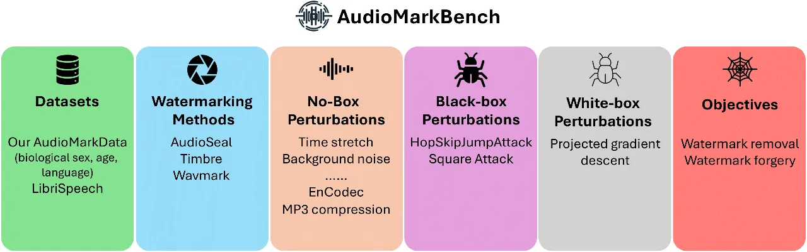

# AudioMarkBench: Benchmarking Robustness of Audio Watermarking

Hongbin Liu  , Moyang Guo¹¹footnotemark: 1   , Zhengyuan Jiang, Lun
Wang, Neil Zhenqiang Gong ^(†)^(†)thanks: Equal contributions.
Affiliation: Duke University Affiliation: Google
Affiliation: {hongbin.liu, moyang.guo, zhengyuan.jiang,
neil.gong}@duke.edu Affiliation: lunwang@google.com

###### Abstract

The increasing realism of synthetic speech, driven by advancements in
text-to-speech models, raises ethical concerns regarding impersonation
and disinformation. Audio watermarking offers a promising solution via
embedding human-imperceptible watermarks into AI-generated audios.
However, the robustness of audio watermarking against common/adversarial
perturbations remains understudied. We present AudioMarkBench, the first
systematic benchmark for evaluating the robustness of audio watermarking
against _watermark removal_ and _watermark forgery_. AudioMarkBench
includes a new dataset created from Common-Voice across languages,
biological sexes, and ages, 3 state-of-the-art watermarking methods, and
15 types of perturbations. We benchmark the robustness of these methods
against the perturbations in no-box, black-box, and white-box settings.
Our findings highlight the vulnerabilities of current watermarking
techniques and emphasize the need for more robust and fair audio
watermarking solutions. Our dataset and code are publicly available at
[https://github.com/moyangkuo/AudioMarkBench](https://github.com/moyangkuo/AudioMarkBench).

   

|     |
| --- |
|     |

## 1 Introduction

Recent advancements in text-to-speech (TTS) generative models enable
generating highly realistic synthetic audios that are indistinguishable
from real human voices. However, this capability raises significant
concerns, such as malicious impersonation, dissemination of false
information, or copyright infringement. For example, a scammer used
synthetic audios to impersonate President Biden in illegal robocalls
during a New Hampshire primary election, and thus faces a \$6 million
fine and felony charges Coldewey (2024).

Audio watermarking Roman et al. (2024); Chen et al. (2023); Liu et al.
(2024) offers a promising approach to mitigate concerns about synthetic
audio authenticity. It embeds an imperceptible watermark into a
synthetic audio using a watermark encoder, outputting a watermarked
audio. During detection, a watermark decoder extracts a watermark from a
given audio input. By comparing the extracted watermark with the
ground-truth watermark, one can determine the authenticity of the given
audio.

Existing audio watermarking methods perform well when there are no
perturbations added to watermarked audios Roman et al. (2024); Chen
et al. (2023); Liu et al. (2024). However, real-world audios often
undergo various perturbations. Common perturbations include compression
using standards like MP3 or Opus Valin et al. (2012) to reduce internet
transmission costs. Additionally, attackers may craft adversarial
perturbations designed to deceive watermarking methods. However, the
robustness of audio watermarking against these perturbations remains
under-explored and lacks systematic benchmarking.

Our work:  In this work, we aim to bridge the gap by introducing
AudioMarkBench (Audio Watermarking Benchmark), the _first_ systematic
and comprehensive benchmark for assessing the robustness of audio
watermarking. We focus on evaluating robustness against two types of
perturbations: _watermark-removal_ perturbations, designed to make
watermarked audio undetectable, and _watermark-forgery_ perturbations,
which aim to falsely mark unwatermarked audio.



Figure 1: Summary of our AudioMarkBench.

- Datasets: Other than the standard LibriSpeech dataset Panayotov et al.
(2015), we construct a new dataset AudioMarkData that meticulously
sub-samples 20,000 audio samples from the Common Voice dataset Ardila
et al. (2020), striving to ensure balanced representation of biological
sexes, languages, and age groups. Moreover, our datasets provide not
only watermarked/unwatermarked audios but also perturbed audios under
various perturbations, making it easier for future research to assess
the the effectiveness of new watermark-removal/forgery perturbations.

- Systematic benchmarking: We present the _first_ systematic benchmark
evaluating the robustness of three state-of-the-art audio watermarking
methods against 15 different watermark-removal/forgery perturbations
across two datasets. Twelve of these perturbations, termed “no-box”
perturbations, require no access to the watermarking method. These
perturbations include common audio edits like codec Défossez et al.
(2022); Zeghidour et al. (2021); Valin et al. (2012) and audio filter,
and noise addition such as white noise or background noise.
Additionally, We adapt two adversarial example methods Chen et al.
(2020); Andriushchenko et al. (2020) in the _black-box_ setting (_i.e._,
access to watermark detector API only) and one adversarial example
method Jiang et al. (2023) in the _white-box_ setting (_i.e._, full
access to watermarking model parameters) from image classifiers to audio
watermarking.

- Findings: We make intriguing findings in our benchmark study. First,
we confirm that all studied audio watermarking methods can distinguish
watermarked/AI-generated audios from unwatermarked/non-AI-generated
audios precisely when no perturbations are added. Second, existing audio
watermarking methods can be vulnerable to watermark removal including
certain no-box perturbations (e.g., EnCodeC Défossez et al. (2022)),
black-box perturbations with sufficient quota for API queries, and
white-box perturbations. Third, current audio watermarking techniques
are effective at resisting no-box and black-box watermark forgery, but
vulnerable to white-box forgery. Fourth, existing audio watermarking
methods have robustness gaps among biological sex groups (female vs
male) and language groups under certain perturbations, flagging
potential fairness issues. However, we do not observe consistently
significant robustness gaps across age groups.

## 2 Audio Watermarking Methods

An audio watermarking method consists of four key components: a
watermark $`w`$, encoder Enc, decoder Dec, and detector Det. The
watermark $`w\in\{0,1\}^{n}`$ is typically an $`n`$-bit bitstring, such
as an 16-bit bitstring $`1110110110010110`$. Given any audio waveform
$`s\in\mathbb{R}^{T}`$ and a watermark $`w`$, the encoder Enc outputs a
watermarked audio waveform $`s_{w}=\texttt{Enc}(w,s)\in\mathbb{R}^{T}`$,
where $`T`$ denotes the number of time samples in the waveform. For any
audio waveform $`s`$, whether watermarked or unwatermarked, the decoder
Dec can extract a bitstring watermark $`\texttt{Dec}(s)`$. When the
audio waveform $`s`$ is watermarked with $`w`$, the extracted watermark
$`\texttt{Dec}(s)`$ should be similar to $`w`$. The detector Det then
uses the decoded watermark $`\texttt{Dec}(s)`$, together with some
additional information, to determine if the given audio waveform $`s`$
contains a watermark. In particular, $`\texttt{Det}(s)=1`$
($`\texttt{Det}(s)=0`$) means that $`s`$ is detected as watermarked
(unwatermarked), respectively. In this study, we examine three
state-of-the-art, open-source audio watermarking techniques:
AudioSeal/AudioSeal-B Roman et al. (2024), Timbre Liu et al. (2024), and
WavMark Chen et al. (2023). We utilize the publicly available code and
models of these methods for our experimental analysis.

AudioSeal/AudioSeal-B:  During watermark generation, AudioSeal uses a
sequence-to-sequence encoder Enc to generate the watermarked waveform
$`s_{w}`$ given any input audio waveform $`s`$ and a watermark $`w`$.
During watermark detection, the decoder Dec gives two outputs given a
suspect waveform $`s`$: a global detection probability $`P_{s}`$
indicating the likelihood that $`s`$ is watermarked, and the decoded
watermark $`\texttt{Dec}(s)`$. With a detection threshold $`\tau`$,
AudioSeal predicts $`\texttt{Det}(s)=1`$ if the detection probability
$`P_{s}`$ exceeds $`\tau`$, and 0 otherwise. AudioSeal-B, a variant of
AudioSeal, uses _bitwise accuracy_ (_i.e._ the proportion of matching
bits between two bitstrings) for detection instead. Specifically, it
predicts $`\texttt{Det}(s)=1`$ if the bitwise accuracy between the
decoded watermark and the original watermark is at least $`\tau`$:
$`\texttt{BA}(\texttt{Dec}(s),w)\geq\tau`$, and 0 otherwise.

Timbre:  Given any input audio $`s`$, Timbre first transforms it into a
spectrogram $`C_{s}=(a_{s},p_{s})`$ using Short-Time Fourier
Transformation (STFT), where $`a_{s}`$ is the amplitude and $`p_{s}`$ is
the phase. It then embeds the watermark $`w`$ into $`a_{s}`$ while
keeping $`p_{s}`$ unchanged, producing the watermarked audio
$`s_{w}=\texttt{ISTFT}(\texttt{Enc}(a_{s},w),p_{s})`$, where ISTFT is
the inverse STFT. For detection, given an audio waveform $`s`$, STFT is
first applied to obtain its spectrogram $`C_{s}=(a_{s},p_{s})`$, and
then the decoder Dec extracts a watermark $`\texttt{Dec}(a_{s})`$ from
the amplitude $`a_{s}`$. The detector outputs $`\texttt{Det}(s)=1`$ if
the bitwise accuracy $`\texttt{BA}(\texttt{Dec}(a_{s}),w)\geq\tau`$,
otherwise $`\texttt{Det}(s)=0`$.

WavMark:  Similar to Timbre, WavMark operates in the spectrogram domain
by first transforming an input waveform $`s`$ to its spectrogram
$`C_{s}=(a_{s},p_{s})`$ via STFT. It then embeds a preset
synchronization bitstring $`s_{\text{sync}}`$ together with the
watermark $`w`$ into the whole spectrogram, i.e., producing the
watermarked audio
$`s_{w}=\texttt{ISTFT}(\texttt{Enc}(C_{s},s_{\text{sync}}\cup w))`$
where $`\cup`$ denotes bitstring concatenation. For detection, given an
audio waveform $`s`$, the decoder extracts a bitstring containing both a
decoded synchronization bitstring
$`\texttt{Dec}(\texttt{STFT}(s))_{\text{sync}}`$ and watermark
$`\texttt{Dec}(\texttt{STFT}(s))_{w}`$ from its spectrogram. If the
decoded synchronization bitstring
$`\texttt{Dec}(\texttt{STFT}(s))_{\text{sync}}=s_{\text{sync}}`$ and the
bitwise accuracy
$`\texttt{BA}(\texttt{Dec}(\texttt{STFT}(s)),w)\geq\tau`$, then
$`\texttt{Det}(s)=1`$, otherwise $`\texttt{Det}(s)=0`$.

Importance of determining a detection threshold $`\tau`$:  In real-world
deployments, the detector determines whether an audio waveform $`s`$
contains a watermark or not by comparing metrics, such bitwise accuracy,
with the detection threshold $`\tau`$. Thus, $`\tau`$ controls a
trade-off between _False Positive Rate (FPR)_ and _False Negative Rate
(FNR)_, where FPR (or FNR) is the likelihood of incorrectly predicting
an unwatermarked (or watermarked) audio as watermarked (or
unwatermarked). A higher $`\tau`$ reduces FPR but increases FNR.
$`\tau`$ can vary depending on the specific watermarking method and we
will further discuss selecting $`\tau`$ in our experiments in Section 5.

## 3 Watermark-removal and Watermark-forgery Perturbations

Definitions:  Audio watermarking faces two primary threats:
_watermark-removal perturbations_, which aim to strip watermarks from
watermarked audios, and _watermark-forgery perturbations_, which aim to
forge watermarks for unwatermarked audios. Watermark removal allows
AI-generated audio to be falsely presented as genuine, potentially
fueling disinformation campaigns. Conversely, watermark forgery can
mislabel authentic audio as AI-generated, undermining human creators’
ability to claim ownership and potentially stifling human creativity.

- Watermark removal: Watermark removal aims to add a human-imperceptible
perturbation vector $`\delta`$ to a watermarked audio $`s_{w}`$ such
that the detector Det outputs 0 for $`s_{w}+\delta`$. Formally, finding
$`\delta`$ can be formulated as the following optimization problem:

```math
\displaystyle\delta_{\text{removal}}=\arg\min_{\delta}\quad\texttt{Det}(s_{w}+\delta)=0\quad\text{s.t.}\quad Q(s_{w}+\delta)\approx Q(s_{w}), \tag{1}
```

where $`Q`$ is an audio quality metric. The quality constraint ensures
the audio quality to remain high after adding the perturbation. The
audio quality metric $`Q`$ can be ViSQOL Hines et al. (2015) or SNR.

- Watermark forgery: In contrast, watermark forgery attempts to add
perturbation $`\delta`$ to an unwatermarked audio $`s_{u}`$ such that
the detector Det detects it as watermarked. Formally, finding $`\delta`$
in watermark forgery can be formulated as the following optimization
problem:

```math
\displaystyle\delta_{\text{forgery}}=\arg\min_{\delta}\quad\texttt{Det}(s_{u}+\delta)=1\quad\text{s.t.}\quad Q(s_{u}+\delta)\approx Q(s_{u}). \tag{2}
```

Both watermark removal and watermark forgery perturbations can be
classified into three groups based on the adversary’s knowledge of the
watermarking method.

No-box perturbations:  In no-box setting, the perturbations are crafted
without any knowledge of the audio watermarking method, including the
architecture, parameters, or even the output of the detector. These
no-box perturbations are created blindly or even unintentionally to
spoof the watermarking detector for watermark removal/forgery. In
our AudioMarkBench, we consider twelve common audio editing operations
as no-box perturbations, including Gaussian/background noises and audio
codecs like MP3, EnCodeC, SoundStream, Opus, _etc._ More details on
these perturbations can be found in Appendix A.2.

Black-box perturbations:  In black-box setting, perturbations are
created by interacting with the watermarking detector Det as an oracle.
Specifically, the attacker can choose audios to submit to the detector
and observe the detection result without any knowledge of how the
detector operates internally. We extend existing methods for finding
black-box adversarial examples Chen et al. (2020); Andriushchenko et al.
(2020) against image classifiers to audio watermarking detectors. In
particular, we apply them in waveform and/or spectrogram domains. Next,
we briefly describe how we extend them, and Appendix A.3 shows more
technical details.

- HopSkipJumpAttack (HSJA) Chen et al. (2020): Given an audio $`s`$ and
access to a watermarking detector Det’s output, HopSkipJumpAttack
iteratively approximates Det’s decision boundary to find a minimal
watermark-removal/watermark-forgery perturbation $`\delta`$. We
implement this attack in both waveform and spectrogram domains. In the
waveform domain, perturbations are optimized in a 1-D vector space,
while in the spectrogram domain, both phase and amplitude (2-D vectors)
are optimized. We conduct 10,000 iterations in each domain, initializing
perturbations with Gaussian noise.

- Square attack Andriushchenko et al. (2020): Given an audio $`s`$ and
access to a watermarking decoder Dec’s output, Square attack iteratively
finds the watermark-removal/watermark-forgery perturbation $`\delta`$ by
strategically decreasing either the bitwise accuracy of Dec’s output or
the global detection probability (for AudioSeal). We extend Square
attack from image domain to the spectrogram domain by treating a
spectrogram as an image. Note that Square attack is only applicable to
the spectrogram domain (not the waveform domain) since its input is a
2-D image/spectrogram. We perform Square attack under a
$`\ell_{\infty}`$-norm perturbation constraint for 10,000 iterations.

White-box perturbations:  In white-box setting, the perturbations are
crafted with full knowledge of the watermark decoder Dec’s parameters
and the ground-truth watermark $`w`$. In particular, the perturbations
are found via solving the optimization problems in Equation 1 and 2. The
goal of watermark forgery/removal perturbation is to increase/decrease
the bitwise accuracy between the decoded watermark $`\texttt{Dec}(s)`$
and ground-truth watermark $`w`$ (for Timbre, WavMark, and AudioSeal-B)
or the global detection probability (for AudioSeal). Therefore, for
Timbre, WavMark, and AudioSeal-B, we use the cross-entropy loss to
minimize/maximize the distance between the decoded watermark
$`\texttt{Dec}(s+\delta)`$ and ground-truth watermark $`w`$:

```math
L_{ce}=-\sum_{i=1}^{n}w_{i}\log(\texttt{Dec}(s+\delta)_{i})+(1-w_{i})\log(1-\texttt{Dec}(s+\delta)_{i})
```

, where $`w_{i}`$ (or $`\texttt{Dec}(s+\delta)_{i}`$) is the $`i^{th}`$
bit of $`w`$ (or $`\texttt{Dec}(s+\delta)`$). For AudioSeal, we adopt
the ReLU activation applied between the global detection probability
$`P_{s}`$ and $`\tau`$: $`L_{Re}=\max(0,P_{s}-\tau)`$. We use these loss
functions to approximate the objective functions in Equation 1 and 2.
Appendix A.4 shows more details on how we solve the optimization
problems to find white-box perturbations.

## 4 Datasets

Unwatermarked audio samples:  Our AudioMarkBench includes two datasets
of unwatermarked audio samples, i.e., AudioMarkData and
LibriSpeech Panayotov et al. (2015). AudioMarkData is a dataset we build
from the Common Voice dataset Ardila et al. (2020). Each audio sample in
AudioMarkData is associated with three attributes, which are: _language_
(25 languages), _biological sex_ (male, female) and _age_ (teens,
twenties, thirties, fourties). We use these attributes to benchmark
whether watermarking methods have different performance/robustness for
audio samples with different attributes. For every attribute group
(language, biological sex, age), AudioMarkData samples 100 audio samples
in 5 seconds with sampling rate at 16kHz from Common Voice, resulting in
20,000 audio samples in total. Table 1 summarizes the attributes of
AudioMarkData. The LibriSpeech dataset contains over 1,000 hours of read
English speech derived from audiobooks in the public domain. We sampled
20,000 audio samples with a maximum length of 5 seconds at the default
16kHz sampling rate. Note that audio samples in LibriSpeech do not have
attributes.

Watermarked audio samples:  We apply each watermarking method
(AudioSeal/AudioSeal-B, Timbre, and WavMark) to embed a watermark into
each audio sample. Note that AudioSeal/AudioSeal-B use the same encoder
and decoder, but different detectors. Specifically, we randomly sample a
16-bit watermark for each watermarking method and embed it into each
audio sample. In total, we create 20,000 watermarked audio samples for
each watermarking method and each dataset.

Perturbed audio samples:  We add watermark-removal (or
watermark-forgery) perturbations to watermarked (or unwatermarked) audio
samples to create perturbed audio samples. These perturbed audio samples
will be used to measure the robustness of audio watermarking against
watermark removal/forgery. Specifically, we consider 12 categories of
common no-box perturbations. For each category of no-box perturbation,
we utilize it to perturb the 20,000 unwatermarked audio samples in each
dataset and the 20,000 watermarked audio samples in each dataset and
watermarking method. Note that each category of no-box perturbations has
certain parameter to control the level of perturbation, and we use
multiple parameter values (see Appendix A.2). For the black-box and
white-box perturbations, due to limits of computation resources, we
sample 200 unwatermarked audio samples and 200 watermarked audio samples
for each watermarking method in the LibriSpeech dataset; and in
AudioMarkData, we sample one unwatermarked audio sample and one
watermarked audio sample from each attribute group (language, biological
sex, age), leading to 200 unwatermarked audio samples and 200
watermarked audio samples for each watermarking method.

|                |          |                                                                                                               |                     |
| -------------- | -------- | ------------------------------------------------------------------------------------------------------------- | ------------------- |
| Attribute      | \#Values | Values                                                                                                        | \#Samples per Value |
| Language       | 25       | EU, BE, BN, YUE, CA, ZH-CN, ZH-HK, ZH-TW, EN, EO, FR, KA, DE, HU, IT, JA, LV, MHR, FA, RU, SW, ES, TA, TH, UK | 800                 |
| Biological Sex | 2        | Male, Female                                                                                                  | 10,000              |
| Age            | 4        | Teens, Twenties, Thirties, Forties                                                                            | 5,000               |

Table 1: Attributes of AudioMarkData. Details of languages are shown in
Appendix A.1.

## 5 Benchmark Results

In the following section, we present our primary benchmark results and
findings. We conduct our experiments on 18 NVIDIA-RTX-6000 GPUs, each
with 24 GB memory. The complete set of experiments requires about 430
GPU-hours to execute.

### 5.1 Evaluation Metrics

We use FNR and FPR to evaluate the robustness of audio watermarking.
Specifically, FNR/FPR is the fraction of watermarked/unwatermarked
audios that are incorrectly detected as unwatermarked/watermarked. Lower
FNR/FPR indicate better audio watermarking methods. When watermarked
audios (or unwatermarked audios) are modified by watermark-removal (or
watermark-forgery) perturbations, lower FNR (or FPR) indicates that the
watermarking method is more robust against watermark removal (or
watermark forgery).

We evaluate the quality of perturbed audios using standard metrics
including SNR and ViSQOL Hines et al. (2015). Signal-to-Noise Ratio
(SNR) evaluates quality of a perturbed audio by comparing its level of
noise with the corresponding clean audio (called _reference audio_),
where the reference audio is watermarked (or unwatermarked) in watermark
removal (or forgery). Higher SNRs indicate clearer and higher-quality
perturbed audios. ViSQOL, ranging from 1 to 5, evaluates audio quality
by simulating human perception of audios, where a higher score indicates
the perturbed audio better preserves quality of the reference audio. A
ViSQOL score no smaller than 3 generally reflects good audio quality. We
mainly rely on ViSQOL for measuring audio quality because it is more
reliable than SNR Hines et al. (2015).

### 5.2 Results under No Perturbations

Figure 2 and Figure 9 (in Appendix) show the FPR and FNR of each
watermarking method as the detection threshold $`\tau`$ varies on
AudioMarkData and LibriSpeech datasets, respectively. No perturbations
are added to watermarked/unwatermarked audios. We have three key
observations. First, FNRs of each watermarking method on both datasets
are close to 0 for a wide range of detection threshold $`\tau`$,
indicating that watermarked audios can be accurately detected as
watermarked. Second, FPRs of each watermarking method on both datasets
decrease as detection threshold $`\tau`$ increases. This is because
unwatermarked audios are less likely to be falsely detected as
watermarked when $`\tau`$ increases. Third, audio watermarking methods
are very accurate at distinguishing watermarked and unwatermarked audios
when the detection threshold $`\tau`$ is properly selected. For
instance, when $`\tau=0.15`$, both FPR and FNR of AudioSeal are almost 0
on AudioMarkData. For each watermarking method, we choose the smallest
detection threshold $`\tau`$ that achieves both FNR and FPR lower than
0.01. The selected $`\tau`$ for each watermarking method and each
dataset is shown in the captions of Figure 2 and Figure 9. In the rest
of this paper, we will use these detection threshold $`\tau`$ unless
otherwise mentioned.

(a) AudioSeal

(b) AudioSeal-B

(c) WavMark

(d) Timbre

Figure 2: Detection results under no perturbations on AudioMarkData. We
set the detection threshold $`\tau`$ for each watermarking method as
follows: AudioSeal $`\tau=0.15`$, AudioSeal-B $`\tau=0.875`$, WavMark
$`\tau=0.0`$, and Timbre $`\tau=0.8125`$, to achieve $`\text{FPR}<0.01`$
and $`\text{FNR}<0.01`$. Results for LibriSpeech are in Figure 9 in
Appendix.

### 5.3 Robustness against No-box Perturbations

Figure 3 shows the FNR, FPR, SNR, and ViSQOL results of the watermarking
methods against EnCodeC perturbations on AudioMarkData and LibriSpeech
datasets. Results of the other eleven no-box perturbations can be found
in Appendix A.6.

|     |
| --- |
|     |

|     |
| --- |
|     |

Figure 3: Detection results under EnCodeC perturbations on both datasets
(first row: AudioMarkData and second row: LibriSpeech). Results of the
other eleven no-box perturbations are in Appendix A.6.

Overall results: We have several key observations. First,
state-of-the-art audio watermarks are robust against several common
no-box watermark-removal perturbations such as time stretch, low-pass,
high-pass, and echo. Specifically, while preserving the quality of
watermarked audio samples well (i.e., ViSQOL no smaller than 3), those
perturbations have small impact on FNRs. This is because these audio
watermarking methods use *adversarial training* Goodfellow et al.
(2014), which considers various common no-box perturbations, to train
the encoders and decoders. Second, current audio watermarking methods
are not robust against no-box removal perturbations that are unseen
during adversarial training. For instance, when ViSQOL is no smaller
than 3, EnCodeC, SoundStream, and Opus achieve very high FNRs,
indicating that those perturbations can remove watermarks from
watermarked audios while preserving the audio quality. Third, current
audio watermarking methods have good robustness against
watermark-forgery perturbations. In particular, FPRs of all these
watermarking methods are almost always close to 0, except for
quantization. Specifically, when bit levels are smaller than 32,
quantization perturbation achieves a FPR larger than 0.2, but the audio
quality is also compromised. This is because forging a watermark is
harder and may require knowledge of the watermarking model. No-box
perturbations do not have such information and therefore cannot forge a
watermark. As we will show in the next subsection, forging a watermark
remains difficult even in the black-box setting.

Comparing watermarking methods:  Considering performance against all
no-box perturbations, AudioSeal is the most robust against watermark
removal and forgery among the evaluated watermarking methods. In
contrast, WavMark is the least robust. For instance, watermarks embedded
by WavMark can even be removed by Gaussian noise and MP3 compression
without compromising the watermarked audios’ quality. This stems from
two reasons: 1) AudioSeal uses advanced sequence-to-sequence models as
encoder and decoder, which can output fine-grained localization of
watermarks; and 2) AudioSeal considers more diverse perturbations in
adversarial training.

Comparing biological sex, language, and age groups in AudioMarkData: 
Figure 4 and more results in Appendix A.7 show detection differences in
biological sexes in terms of FNRs/FPRs. First, watermarked audios with
attribute “female” are less robust to watermark-removal Gaussian noise
perturbations (i.e., have higher FNRs) than those with attribute “male”
for all the evaluated watermarking methods especially AudioSeal-B. These
results indicate a fairness gap of robustness against watermark removal
among “female” and “male” groups under Gaussian noise perturbations. To
rigorously test this gap, we conducte a two-tailed t-test with a null
hypothesis positing no difference in FNRs between "female" and "male"
groups, at a significance level of $`\alpha=0.05`$. For Figure 4a, the
calculated $`p`$-value$`\approx 2.4\times 10^{-6}<\alpha=0.05`$. Thus,
the robustness gap between "female" and "male" groups is statistically
significant. Note that we did not observe such gaps for other
watermark-removal no-box perturbations except EnCodeC (Figure 18), Opus
(Figure 19), Quantization (Figure 20).

Second, unwatermarked audios with attribute “female” are less robust
(i.e., have larger FPRs) to watermark-forgery EnCodec perturbations than
those with attribute “male” when AudioSeal is used. We did not observe
such gaps for other watermarking methods under EnCodec perturbations nor
other watermark-forgery no-box perturbations for all watermarking
methods since FPRs are generally close to 0 in those scenarios.

(a)

(b)

(c)

(d)

Figure 4: FNRs in biological sexes against watermark-removal (a)
Gaussian noise perturbations, (b) Square attack perturbations, and (c)
white-box perturbations. (d) FPRs in biological sexes against
watermark-forgery EnCodeC perturbations. The watermarking method is
AudioSeal. The gaps between “female” and “male” are statistically
significant in two-tailed t-test with $`p`$-value \< $`\alpha=0.05`$.

Figure 5: Language difference against watermark-removal Gaussian noise
perturbations with SNR 20. The watermarking method is AudioSeal.

Figure 5 and results in Appendix A.9 show detection differences in
languages in terms of FNRs/FPRs. We observe noticeable differences
across languages. In particular, watermarked audios in Georgian have
relatively smaller FNRs against Gaussian noise, Background noise, and
Quantization perturbations. We also observe that such differences may
vary across different watermarking methods. For instance, watermarked
audios in Esperanto have smaller FNRs on AudioSeal but larger FNRs on
WavMark. We hypothesize that Esperanto, as an artificial language, may
have specific characteristics (e.g., phonetic patterns, speech dynamics)
that interact differently with the watermarking detectors.

Results in Appendix A.8 show detection differences in age groups in
terms of FNRs/FPRs. We observe no consistently significant differences
across age groups.

(a) Waveform

(b) Spectrogram

(c) Waveform

(d) Spectrogram

Figure 6: HSJA’s audio quality when optimizing watermark-removal
perturbations in waveform or spectrogram domain on AudioMarkData. The
results on LibriSpeech are in Figure 10 in Appendix.

### 5.4 Robustness against Black-box Perturbations

We find that audio watermarking methods have good robustness against
_existing_ black-box watermark-forgery perturbations. In particular,
existing black-box watermark-forgery perturbations substantially
sacrifice audio quality in order to forge watermarks. However, audio
watermarking methods are not robust to _existing_ black-box
watermark-removal perturbations when an attacker can query the detector
API for many times. In particular, they can remove watermarks from
watermarked audios while preserving their audio quality given sufficient
number of queries to the detector API. When the number of queries to the
detector API is limited, audio watermarking methods have good robustness
against _existing_ black-box watermark-removal perturbations. Next, we
discuss results for watermark-removal perturbations found by HSJA, and
the results for Square attack are in Appendix A.5.

(a) FNR AudioMarkData

(b) FNR LibriSpeech

(c) FPR AudioMarkData

(d) FPR LibriSpeech

Figure 7: Detection results under white-box watermark-removal and
watermark-forgery perturbations.

Recall that HSJA guarantees that the found watermark-removal
perturbations are successful while iteratively optimizing them.
Therefore, we evaluate the quality of the perturbed watermarked audios
when increasing the number of iterations/queries to the watermarking
detector. We consider adding perturbations to both waveform and
spectrogram domains, and the results are shown in Figure 6. First, in
the waveform domain, quality of the perturbed audio does not improve
with more iterations, indicating that HSJA struggles to optimize
perturbations in the waveform domain. This may be attributed to HSJA’s
design, which is tailored to attack image classifiers, potentially
making it less effective on 1-D audio waveform. Second, in the
spectrogram domain, although initial audio quality is inferior to those
in the waveform domain, the audio quality improves significantly with
more iterations. Specifically, for AudioSeal-B, Timbre, and WavMark,
while the SNR/ViSQOL scores are slightly inferior to those in waveform
domain under 100 iterations, after 10,000 iterations, the audio quality
is considerably better, with WavMark achieving SNR/ViSQOL of 40/4.5, and
AudioSeal-B and Timbre reaching approximately 30/4. AudioSeal has better
robustness in both waveform and spectrogram domains, maintaining
SNR/ViSQOL scores below 10/3. Third, like no-box perturbations, we
observe that WavMark is least robust while AudioSeal is the most robust.

We also observe that watermarked audios with attribute “female” are less
robust to watermark-removal Square attack perturbations (i.e., have
higher FNRs) than those with attribute “male” (see Figure 4b and more
results in Appendix A.7). Like no-box setting, we did not observe
robustness gaps among age groups in both black-box and white-box
settings (discussed in the next subsection). Moreover, due to
computation resource limit, we sampled 200 audio samples in black-box
and white-box settings, leading to only 4 samples per language.
Therefore, we did not study robustness across languages due to the
small-sample issue.

### 5.5 Robustness against White-box Perturbations

Figure 8: ViSQOL vs. SNR of white-box perturbations.

Figure 7 shows the detection results under white-box perturbations,
where the perturbations are constrained by SNR. We evaluate SNRs from 20
to 60, which correspond to ViSQOL scores from above 3 to 5 (see
Figure 8). In other words, our white-box perturbations preserve the
audio quality. Our key observation is that existing audio watermarking
methods are not robust to white-box watermark-removal and
watermark-forgery perturbations. For instance, FNRs reach 1 for all
watermarking methods when the SNR of the perturbations is 20 (i.e.,
ViSQOL of 3.2 and 3.9 on the two datasets). Moreover, all watermarking
methods have high FPRs under white-box perturbations that preserve audio
quality. We also evaluate iterative Fast Gradient Sign Method (I-FGSM)
 Kurakin et al. (2017) in Appendix A.11 and get similar conclusion.

We also observe that watermarked audios with attribute “female” are less
robust to watermark-removal white-box perturbations (i.e., have higher
FNRs) than those with attribute “male” (see Figure 22 and more results
in Appendix A.7).

## 6 Discussions

Limitations:  The major limitation of this work is that AudioMarkData
contains 25 languages and 4 age groups due to the fact it’s sub-sampled
from Common-Voice. We deem the collection of audios with more diverse
languages and age groups an important future direction.

Social impacts:  Our AudioMarkBench evaluates the vulnerability of audio
watermarks to removal or forgery and has significant implications for
the safe usage of audio generation/watermarking techniques. First,
watermark removal enables AI-generated audio to be disguised as
authentic, potentially fueling misinformation campaigns. Second,
watermark forgery allows for false attribution of AI-generated audio,
undermining the ability of human creators to protect their work. By
assessing the robustness of audio watermarking techniques, our
AudioMarkBench contributes to the development of more secure
watermarking systems, helping to mitigate the potential negative impacts
of AI-generated audio on society.

## 7 Conclusion

In this work, we introduce AudioMarkBench, the first systematic
benchmark for evaluating the robustness of audio watermarking against
watermark removal/forgery. Our study, involving 3 state-of-the-art
methods and 15 perturbation types across 2 datasets (including our new
AudioMarkData), reveals that existing watermarking methods lack
robustness under various no-box/black-box and white-box perturbations.
Additionally, we identify fairness issues, with robustness varying
across biological sex and language groups under certain perturbations.
Our benchmark promotes further research to enhance robustness and
fairness in audio watermarking.

## Acknowledgments

We thank the anonymous reviewers for their constructive comments. This
work was supported by NSF under Grant No. 2414406.

## References

- Coldewey \[2024\] Devin Coldewey. Six million fine for robocaller who
  used ai to clone biden’s voice.
  https://techcrunch.com/2024/05/23/6m-fine-for-robocaller-who-used-ai-to-clone-bidens-voice, 2024.
  Online; accessed 29 May 2024.
- Roman et al. \[2024\] Robin San Roman, Pierre Fernandez, Alexandre
  Défossez, Teddy Furon, Tuan Tran, and Hady Elsahar. Proactive
  detection of voice cloning with localized watermarking. _arXiv_, 2024.
- Chen et al. \[2023\] Guangyu Chen, Yu Wu, Shujie Liu, Tao Liu,
  Xiaoyong Du, and Furu Wei. Wavmark: Watermarking for audio generation.
  _arXiv_, 2023.
- Liu et al. \[2024\] Chang Liu, Jie Zhang, Tianwei Zhang, Xi Yang,
  Weiming Zhang, and Nenghai Yu. Detecting voice cloning attacks via
  timbre watermarking. In _Network and Distributed System Security
  Symposium_, 2024.
- Valin et al. \[2012\] Jean-Marc Valin, Koen Vos, and Timothy B.
  Terriberry. Definition of the Opus Audio Codec. RFC 6716,
  September 2012. URL
  [https://www.rfc-editor.org/info/rfc6716](https://www.rfc-editor.org/info/rfc6716).
- Panayotov et al. \[2015\] Vassil Panayotov, Guoguo Chen, Daniel Povey,
  and Sanjeev Khudanpur. Librispeech: an asr corpus based on public
  domain audio books. In _IEEE international conference on acoustics,
  speech and signal processing (ICASSP)_, 2015.
- Ardila et al. \[2020\] Rosana Ardila, Megan Branson, Kelly Davis,
  Michael Henretty, Michael Kohler, Josh Meyer, Reuben Morais, Lindsay
  Saunders, Francis M Tyers, and Gregor Weber. Common voice: A
  massively-multilingual speech corpus. In _LREC_, 2020.
- Défossez et al. \[2022\] Alexandre Défossez, Jade Copet, Gabriel
  Synnaeve, and Yossi Adi. High fidelity neural audio compression.
  _arXiv preprint arXiv:2210.13438_, 2022.
- Zeghidour et al. \[2021\] Neil Zeghidour, Alejandro Luebs, Ahmed
  Omran, Jan Skoglund, and Marco Tagliasacchi. Soundstream: An
  end-to-end neural audio codec. _IEEE/ACM Transactions on Audio,
  Speech, and Language Processing_, 30:495–507, 2021.
- Chen et al. \[2020\] Jianbo Chen, Michael I Jordan, and Martin J
  Wainwright. Hopskipjumpattack: A query-efficient decision-based
  attack. In _IEEE symposium on security and privacy_, pages
  1277–1294, 2020.
- Andriushchenko et al. \[2020\] Maksym Andriushchenko, Francesco Croce,
  Nicolas Flammarion, and Matthias Hein. Square attack: a
  query-efficient black-box adversarial attack via random search. In
  _European conference on computer vision_, pages 484–501, 2020.
- Jiang et al. \[2023\] Zhengyuan Jiang, Jinghuai Zhang, and
  Neil Zhenqiang Gong. Evading watermark based detection of ai-generated
  content. In _Proceedings of the 2023 ACM SIGSAC Conference on Computer
  and Communications Security_, 2023.
- Hines et al. \[2015\] Andrew Hines, Jan Skoglund, Anil C Kokaram, and
  Naomi Harte. Visqol: an objective speech quality model. _EURASIP
  Journal on Audio, Speech, and Music Processing_, 2015:1–18, 2015.
- Goodfellow et al. \[2014\] Ian J Goodfellow, Jonathon Shlens, and
  Christian Szegedy. Explaining and harnessing adversarial examples.
  _arXiv preprint arXiv:1412.6572_, 2014.
- Kurakin et al. \[2017\] Alexey Kurakin, Ian J. Goodfellow, and Samy
  Bengio. Adversarial examples in the physical world. In _5th
  International Conference on Learning Representations, ICLR 2017,
  Toulon, France, April 24-26, 2017, Workshop Track Proceedings_, 2017.
- Defferrard et al. \[2016\] Michaël Defferrard, Kirell Benzi, Pierre
  Vandergheynst, and Xavier Bresson. Fma: A dataset for music analysis.
  In _International Society for Music Information Retrieval
  Conference_, 2016.

## Appendix A Appendix

(a) AudioSeal

(b) AudioSeal-B

(c) WavMark

(d) Timbre

Figure 9: Detection results under no perturbations on LibriSpeech. We
set the detection threshold $`\tau`$ for each watermarking method as
follows: AudioSeal $`\tau=0.1`$, AudioSeal-B $`\tau=0.875`$, WavMark
$`\tau=0.0`$, and Timbre $`\tau=0.8125`$, to achieve $`\text{FPR}<0.01`$
and $`\text{FNR}<0.01`$.

(a) Waveform

(b) Spectrogram

(c) Waveform

(d) Spectrogram

Figure 10: HSJA’s audio qualities when optimizing watermark-removal
perturbations in waveform or spectrogram domains on LibriSpeech.

### A.1 Details of 25 Languages in Our AudioMarkData

EU: Basque, BE: Belarusian, BN: Bengali, YUE: Cantonese, CA: Catalan,
ZH-CN: Chinese-China, ZH-HK: Chinese-Hong-Kong, ZH-TW: Chinese-Taiwan,
EN: English, EO: Esperanto, FR: French, KA: Georgian, DE: German, HU:
Hungarian, IT: Italian, JA: Japanese, LV: Latvian, MHR: Meadow Mari, FA:
Persian, RU: Russian, ES: Spanish, SW: Swahili, TA: Tamil, TH: Thai, UK:
Ukrainian.

### A.2 Details of No-box Perturbations

We summarize the key parameter, its range, and a brief description for
each of the 12 no-box perturbations in Table 2.

|                  |                              |                         |                                                          |
| ---------------- | ---------------------------- | ----------------------- | -------------------------------------------------------- |
| Perturbation     | Key Parameter $`\mathbb{K}`$ | Range of $`\mathbb{K}`$ | Brief Description                                        |
| Time Stretch     | Speed Factor                 | \[0.7, 1.5\]            | Controls the playback speed of the audio                 |
| Gaussian Noise   | SNR (dB)                     | \[5, 40\]               | Adds random noise constrained by SNR                     |
| Background Noise | SNR (dB)                     | \[5, 40\]               | Adds background noise constrained by SNR                 |
| SoundStream      | \# Quantizers                | \[4, 16\]               | Neural network-based audio codec                         |
| Opus             | Bitrate (kbps)               | \[16, 256\]             | Widely used audio codec                                  |
| EnCodec          | Bandwidth (kHz)              | \[1.5, 24.0\]           | Neural network-based audio codec                         |
| Quantization     | Bit levels                   | \[4, 64\]               | Converts audio signal to $`n`$ bit level discrete values |
| Highpass Filter  | Cutoff Ratio                 | \[0.1, 0.5\]            | Filters out low frequency banks                          |
| Lowpass Filter   | Cutoff Ratio                 | \[0.1, 0.5\]            | Filters out high frequency banks                         |
| Smooth           | Window Size                  | \[6, 22\]               | Applies a Gaussian smooth effect using 1-D convolution   |
| Echo             | Delay (sec)                  | \[0.1, 0.9\]            | Adds a decayed and delayed replay                        |
| MP3 Compression  | Bitrate (kbps)               | \[8, 40\]               | Widely used audio codec                                  |

Table 2: Details of no-box perturbations.

### A.3 Details of Black-box Perturbations

HSJA:  Given an audio waveform $`s`$, to perform the Hop Skip Jump
Attack (HSJA), an initial adversarial example $`s+\delta`$ must be
provided, where $`\delta`$ is sampled using Gaussian noise in our
experiment. We employ a greedy algorithm to determine the Gaussian noise
that achieves the maximum SNR while still successfully evading
detection, ensuring that $`\delta`$ is of minimal size.

For attacks directly targeting the audio waveform, $`s+\delta`$ is used
as the input, and $`\delta`$ is optimized using the HSJA strategy. For
attacks on the spectrogram, $`s+\delta`$ is first transformed into a
spectrogram $`C_{s+\delta}=(a_{s+\delta},p_{s+\delta})`$, where $`a`$
and $`p`$ represent the amplitude and phase, respectively. The attacker
then uses this spectrogram as the input for the attack.

Regarding gradient estimation within the HSJA algorithm, we initialize
the number of estimations at 100 and set a maximum limit of 1,000
estimations. The attack proceeds through 10,000 iterations, maintaining
other parameters at their default settings as specified by the HSJA
method.

Square attack:  The Square attack is specifically designed to perform
adversarial attacks on image classifiers. Given a perturbation size, it
leverages this boundary to try to evade the detector by lowering the
detection confidence. (In our setting, it is the global detection
probability $`P_{S}`$ or the bitwise accuracy between the decoded and
ground truth watermark.) The attack designs two individual algorithms
for optimizing based on $`\ell_{2}`$ and $`\ell_{\infty}`$
perturbations. We conducted experiments on both algorithms but only
found the attack based on $`\ell_{\infty}`$ is effective. For optimizing
$`\ell_{\infty}`$ perturbations, the attack first crafts several
vertical stripes as perturbations, then adds square-shaped perturbations
to perform the random search. Given its nature of attacking images, we
extend it to attack the spectrogram. To maintain uniformity, we also run
10,000 iterations and keep the parameters the same as the default
settings.

### A.4 Sovling Optimization Problems in White-box Perturbations

Given a watermarked/unwatermarked audio waveform $`s_{w}`$/$`s_{u}`$,
white-box performs watermark removal/forgery by optimizing a
perturbation $`\delta`$ added to the audio waveform. Specifically, let
$`s\in\mathbb{R}^{T}`$ be the waveform in length $`T`$, in white-box
setting, we optimize the perturbation $`\delta\in\mathbb{R}^{T}`$ to
achieve watermark removal/forgery. Detailed algorithms are shown in
Algorithm 3 and Algorithm 4.

1: audio $`s\in\mathbb{R}^{T}`$, ground truth watermark
$`w\in\{0,1\}^{n}`$, decoder Dec, detection threshold $`\tau`$

2: Loss $`\ell(s,w)`$

3: if use AudioSeal then

4:   $`P_{s}\leftarrow\texttt{Dec}(s)`$ $`\triangleright`$ global
detection probability

5:   return $`\ell=\max(0,P_{s}-\tau)`$

6: else$`\triangleright`$ use AudioSeal-B, Timbre, or Wavmark

7:   decoded watermark $`\texttt{Dec}(s)`$

8:   return
$`\ell=-\sum_{i=1}^{n}w_{i}\log(\texttt{Dec}(s)_{i})+(1-w_{i})\log(1-\texttt{Dec}(s)_{i})`$

9: end if

Algorithm 1 White-box loss: $`\ell(s,w)`$

1: Signal $`s\in\mathbb{R}^{T}`$, perturbation
$`\delta\in\mathbb{R}^{T}`$, preset SNR $`R`$

2: Scaling factor $`r`$

3: $`P_{s}\leftarrow{\sum_{i=1}^{T}s_{i}^{2}}/{T}`$ $`\triangleright`$
signal power

4: $`P_{\delta}\leftarrow{\sum_{i=1}^{T}\delta_{i}^{2}}/{T}`$
$`\triangleright`$ noise power

5: $`snr\leftarrow 10\cdot\log_{10}({P_{s}}/{P_{\delta}})`$

6: if $`snr<R`$ then $`\triangleright`$ Need rescaling

7:   $`r\leftarrow 10^{{(R-snr)}/{10}}`$

8: else

9:   $`r\leftarrow 1`$

10: end if

11: return $`r`$

Algorithm 2 Compute Scaling Factor $`{f_{R}}(s,\delta,R)`$

1: Watermarked audio $`s_{w}\in\mathbb{R}^{T}`$, ground truth watermark
$`w\in\{0,1\}^{n}`$, watermarking decoder Dec, detection threshold
$`\tau`$, SNR restriction $`R`$, iteration iter, learning rate
$`\alpha`$

2: Optimal perturbation $`{\hat{\delta}}`$

3: $`\delta\leftarrow\textbf{0}\in\mathbb{R}^{T}`$ $`\triangleright`$
Initialize perturbation

4: $`\hat{\delta}\leftarrow\delta`$

5: if use AudioSeal then $`\triangleright`$ Initial optimization
function

6:   $`\mathcal{Q}(\cdot)\leftarrow`$ $`P_{s}(\cdot)`$

7: else$`\triangleright`$ use AudioSeal-B, Timbre, or Wavmark

8:   $`\mathcal{Q}(\cdot)\leftarrow\texttt{BA}(\texttt{Dec}(\cdot),w)`$

9: end if

10: $`\hat{\mathcal{Q}}\leftarrow\mathcal{Q}(s_{w})`$

11: for $`i\leftarrow 1`$ to iter do

12:
  $`\delta\leftarrow\delta-\alpha\cdot\nabla_{\delta}\ell(s_{w},\neg w)`$
$`\triangleright`$ loss returned by Algorithm 1

13:   $`r\leftarrow{f_{R}}(s_{w},\delta,R)`$ $`\triangleright`$ scaling
factor returned by Algorithm 2

14:   if $`r>1`$ then

15:    $`\delta\leftarrow\delta/r`$

16:   end if

17:   if $`\hat{\mathcal{Q}}>\mathcal{Q}(s_{w}+\delta)`$ then

18:    $`\hat{\delta}\leftarrow\delta`$

19:    $`\hat{\mathcal{Q}}\leftarrow\mathcal{Q}(s_{w}+\delta)`$

20:   end if

21:   if $`\hat{\mathcal{Q}}\leq\tau`$ then $`\triangleright`$ early
stopping

22:    return $`\hat{\delta}`$

23:   end if

24: end for

25: return FAIL

Algorithm 3 Optimizing White-box Watermark-removal Perturbations

1: Unwatermarked audio $`s_{u}\in\mathbb{R}^{T}`$, forgery watermark
$`w_{f}\in\{0,1\}^{n}`$, decoder Dec, detection threshold $`\tau`$, SNR
restriction $`R`$, iteration iter, learning rate $`\alpha`$

2: Optimal perturbation $`{\hat{\delta}}`$

3: $`\delta\leftarrow\textbf{0}\in\mathbb{R}^{T}`$ $`\triangleright`$
Initialize perturbation

4: $`\hat{\delta}\leftarrow\delta`$

5: if use AudioSeal then $`\triangleright`$ Initial optimization
function

6:   $`\mathcal{Q}(\cdot)\leftarrow`$ $`P_{s}(\cdot)`$

7: else$`\triangleright`$ use AudioSeal-B, Timbre, or Wavmark

8:
  $`\mathcal{Q}(\cdot)\leftarrow\texttt{BA}(\texttt{Dec}(\cdot),w_{f})`$

9: end if

10: $`\hat{\mathcal{Q}}\leftarrow\mathcal{Q}(s_{u})`$

11: for $`i\leftarrow 1`$ to iter do

12:
  $`\delta\leftarrow\delta-\alpha\cdot\nabla_{\delta}\ell(s_{u},w_{f})`$
$`\triangleright`$ loss returned by Algorithm 1

13:   $`r\leftarrow{f_{R}}(s_{u},\delta,R)`$ $`\triangleright`$ scaling
factor returned by Algorithm 2

14:   if $`r>1`$ then

15:    $`\delta\leftarrow\delta/r`$

16:   end if

17:   if $`\hat{\mathcal{Q}}<\mathcal{Q}(s_{u}+\delta)`$ then

18:    $`\hat{\delta}\leftarrow\delta`$

19:    $`\hat{\mathcal{Q}}\leftarrow\mathcal{Q}(s_{u}+\delta)`$

20:   end if

21:   if $`\hat{\mathcal{Q}}>\tau`$ then $`\triangleright`$ early
stopping

22:    return $`\hat{\delta}`$

23:   end if

24: end for

25: return FAIL

Algorithm 4 Optimizing White-box Watermark-forgery Perturbations

### A.5 Results for Square Attack

Figure 11 and Figure 12 shows the FNR results of three watermarking
methods under Square attack perturbations on our AudioMarkData and
LibriSpeech, respectively. We observe that

(a) FNR

(b) SNR

(c) ViSQOL

Figure 11: Square attack results of watermark-removal perturbations on
AudioMarkData.

(a) Accuracy

(b) SNR

(c) ViSQOL

Figure 12: Square attack results of watermark-removal perturbations on
LibriSpeech.

### A.6 Results for No-box Perturbations

Figure 13, Figure 15, Figure 14, Figure 14 show FPR/FNR, SNR, and ViSQOL
results on AudioMarkData and LibriSpeech under 11 no-box perturbations.
We observe that SoundStream and Opus are also effective
watermark-removal no-box perturbations that can preserve good quality
for original watermarked audios via achieving high FNRs as well as
ViSQOL scores higher than 3. Quantization is an effective
watermark-forgery no-box perturbation that achieves high FPRs while
preserving ViSQOL scores closed to 3.

|     |
| --- |
|     |

(a) Time stretch

|     |
| --- |
|     |

(b) Gaussian noise

|     |
| --- |
|     |

(c) Background noise

|     |
| --- |
|     |

(d) Lowpass Filter

|     |
| --- |
|     |

(e) Highpass Filter

|     |
| --- |
|     |

(f) Echo

|     |
| --- |
|     |

(g) Smoothing

|     |
| --- |
|     |

(h) MP3

Figure 13: Detection results under eight watermark-removal no-box
perturbations on AudioMarkData.

|     |
| --- |
|     |

(a) Time stretch

|     |
| --- |
|     |

(b) Gaussian noise

|     |
| --- |
|     |

(c) Background noise

|     |
| --- |
|     |

(d) Lowpass Filter

|     |
| --- |
|     |

(e) Highpass Filter

|     |
| --- |
|     |

(f) Echo

|     |
| --- |
|     |

(g) Smoothing

|     |
| --- |
|     |

(h) MP3

Figure 14: Detection results under eight watermark-removal no-box
perturbations on LibriSpeech.

|     |
| --- |
|     |

(a) SoundStream

|     |
| --- |
|     |

(b) Opus

|     |
| --- |
|     |

(c) Quantization

Figure 15: Detection results under another three watermark-removal
no-box perturbations on AudioMarkData.

|     |
| --- |
|     |

(a) SoundStream

|     |
| --- |
|     |

(b) Opus

|     |
| --- |
|     |

(c) Quantization

Figure 16: Detection results under another three watermark-removal
no-box perturbations on LibriSpeech.

### A.7 Detection Differences across Biological Sexes

Figure 17, Figure 18, Figure 19, Figure 20, Figure 21 and Figure 22 show
the FNRs across biological sex groups among different models and various
perturbations. We observe significant differences of robustness gaps
between “female” and “male” biological sex groups. In our experiments,
we find that there is no evidence for significant differences across
biological sexes under HSJA perturbations.

(a) AudioSeal

(b) AudioSeal-B

(c) Timbre

(d) WavMark

Figure 17: FNRs in biological sexes against watermark-removal Gaussian
noise perturbations.

(a) AudioSeal

(b) AudioSeal-B

(c) Timbre

(d) WavMark

Figure 18: FNRs in biological sexes against watermark-removal EnCodeC
perturbations.

(a) AudioSeal

(b) AudioSeal-B

(c) Timbre

(d) WavMark

Figure 19: FNRs in biological sexes against watermark-removal Opus
perturbations.

(a) AudioSeal

(b) AudioSeal-B

(c) Timbre

(d) WavMark

Figure 20: FPRs in biological sexes against watermark-removal
Quantization perturbations.

(a) AudioSeal

(b) AudioSeal-B

(c) Timbre

(d) WavMark

Figure 21: FNRs in biological sexes against watermark-removal Square
attack perturbations.

(a) AudioSeal

(b) AudioSeal-B

(c) Timbre

(d) WavMark

Figure 22: FNRs in biological sexes against watermark-removal white-box
perturbations.

### A.8 Detection Differences across Age

Figure 23, Figure 24, Figure 25 show the FNRs on some effective no-box
watermark-removal perturbations. Figure 26 and Figure 27 show the FPRs
on some effective no-box watermark-forgery perturbations. We do not
observe significant differences of robustness gaps among age groups
persist across all watermarking methods. For those settings having
statistically significant differences in terms of robustness gaps for
age groups, we report their $`p`$-values in Table 3 and Table 4.

|                |                              |                              |                             |         |
| -------------- | ---------------------------- | ---------------------------- | --------------------------- | ------- |
|                | AudioSeal                    | AudioSeal-B                  | Timbre                      | WavMark |
| Gaussian noice | 8.52e-12 (twenties, forties) | 1.74e-3 (thirties, fourties) | 2.08e-3 (twenties, forties) | /       |
| EnCodeC        | 1.36e-6 (twenties, forties)  | /                            | /                           | /       |
| Opus           | /                            | /                            | /                           | /       |

Table 3: Two-tail test results for FNRs in different age groups against
watermark-removal perturbations. We consider significance level
$`\alpha=0.05`$.

|              |                              |                           |        |         |
| ------------ | ---------------------------- | ------------------------- | ------ | ------- |
|              | AudioSeal                    | AudioSeal-B               | Timbre | WavMark |
| EnCodeC      | 1.74e-4 (twenties, fourties) | /                         | /      | /       |
| Quantization | /                            | 3.83e-2 (teens, thirties) | /      | /       |

Table 4: Two-tail test results for FPRs in different age groups against
watermark-forgery perturbations. We consider significance level
$`\alpha=0.05`$.

(a) AudioSeal

(b) AudioSeal-B

(c) Timbre

(d) WavMark

Figure 23: FNRs in different age groups against watermark-removal
Gaussian noise perturbations.

(a) AudioSeal

(b) AudioSeal-B

(c) Timbre

(d) WavMark

Figure 24: FNRs in different age groups against watermark-removal
EnCodeC perturbations.

(a) AudioSeal

(b) AudioSeal-B

(c) Timbre

(d) WavMark

Figure 25: FNRs in different age groups against watermark-removal Opus
perturbations.

(a) AudioSeal

(b) AudioSeal-B

(c) Timbre

(d) WavMark

Figure 26: FPRs in different age groups against watermark-forgery
EnCodeC perturbations.

(a) AudioSeal

(b) AudioSeal-B

(c) Timbre

(d) WavMark

Figure 27: FPRs in different age groups against watermark-forgery
Quantization perturbations.

### A.9 Languages Differences against Watermark-removal Perturbations

Figure 28, Figure 29, Figure 30 and Figure 31 show results of languages
differences against watermark-removal perturbations when using three
audio watermarking methods. We observe significant difference on
robustness gaps against some watermark-removal differences among
different languages.

(a)

(b)

(c)

Figure 28: Language difference against watermark-removal perturbations.
The watermarking method is AudioSeal. Upper: Gaussian noise, Middle:
Background noise, Lower: Quantization.

(a)

(b)

(c)

Figure 29: Language difference against watermark-removal perturbations.
The watermarking method is AudioSeal-B. Upper: Gaussian noise, Middle:
Background noise, Lower: Quantization.

(a)

(b)

(c)

Figure 30: Language difference against watermark-removal perturbations.
The watermarking method is Timbre. Upper: Gaussian noise, Middle:
Background noise, Lower: Quantization.

(a)

(b)

(c)

Figure 31: Language difference against watermark-removal perturbations.
The watermarking method is WavMark. Upper: Gaussian noise, Middle:
Background noise, Lower: Quantization.

### A.10 Results on FMA Music Dataset

We conducted additional experiments using the FMA music
dataset Defferrard et al. \[2016\]. Table 5 shows the results without
any perturbation; Table 6 shows the results under several no-box
perturbations; Table 7 shows the results under black-box attacks; and
Table 8 and Table 9 show the results under white-box removal and forgery
attacks.

[TABLE]

Table 5: Detection results under no perturbations on FMA.

[TABLE]

Table 6: Detection results (FNR/FPR) under background noise and time
stretch on FMA.

[TABLE]

Table 7: Results under black-box Square attack on FMA.

[TABLE]

Table 8: Detection results under white-box removal attack on FMA.

[TABLE]

Table 9: Detection results under white-box forgery attack on FMA.

### A.11 More Results on AudioMarkData

We applied I-FGSM as an additional white-box attack in Table 10. In
Table 11, we show the results for composed no-box perturbations
including EnCodeC with 24kHz, MP3 with 16kbps, and Gaussian noise with
SNR of 20dB.

[TABLE]

Table 10: Results for I-FGSM on AudioMarkData.

[TABLE]

Table 11: Results for composed no-box perturbations.
