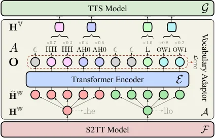
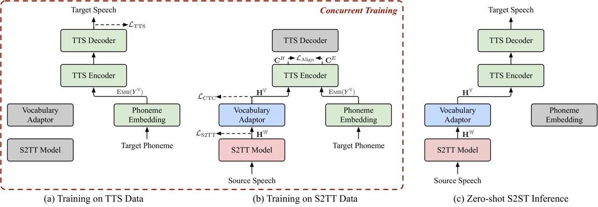

# Can We Achieve High-quality Direct Speech-to-Speech Translation without Parallel Speech Data?

Qingkai Fang Affiliation: Key Laboratory of Intelligent Information
ProcessingInstitute of Computing Technology, Chinese Academy of Sciences
(ICT/CAS) Affiliation: University of Chinese Academy of Sciences,
Beijing, China    Shaolei Zhang Affiliation: Key Laboratory of
Intelligent Information ProcessingInstitute of Computing Technology,
Chinese Academy of Sciences (ICT/CAS) Affiliation: University of Chinese
Academy of Sciences, Beijing, China    Zhengrui Ma Affiliation: Key
Laboratory of Intelligent Information ProcessingInstitute of Computing
Technology, Chinese Academy of Sciences (ICT/CAS)
Affiliation: University of Chinese Academy of Sciences, Beijing, China
   Min Zhang Affiliation: School of Future Science and Engineering,
Soochow
University  {[fangqingkai21b](mailto:fangqingkai21b@ict.ac.cn),[fengyang](mailto:fengyang@ict.ac.cn)}@ict.ac.cn
  [zhangminmt](mailto:zhangminmt@hotmail.com)@hotmail.com    Yang Feng
^(†)^(†)thanks: Corresponding author: Yang Feng. Affiliation: Key
Laboratory of Intelligent Information ProcessingInstitute of Computing
Technology, Chinese Academy of Sciences (ICT/CAS) Affiliation: Key
Laboratory of AI Safety, Chinese Academy of Sciences
Affiliation: University of Chinese Academy of Sciences, Beijing, China

###### Abstract

Recently proposed two-pass direct speech-to-speech translation (S2ST)
models decompose the task into speech-to-text translation (S2TT) and
text-to-speech (TTS) within an end-to-end model, yielding promising
results. However, the training of these models still relies on parallel
speech data, which is extremely challenging to collect. In contrast,
S2TT and TTS have accumulated a large amount of data and pretrained
models, which have not been fully utilized in the development of S2ST
models. Inspired by this, in this paper, we first introduce a composite
S2ST model named ComSpeech, which can seamlessly integrate any
pretrained S2TT and TTS models into a direct S2ST model. Furthermore, to
eliminate the reliance on parallel speech data, we propose a novel
training method ComSpeech-ZS that solely utilizes S2TT and TTS data. It
aligns representations in the latent space through contrastive learning,
enabling the speech synthesis capability learned from the TTS data to
generalize to S2ST in a zero-shot manner. Experimental results on the
CVSS dataset show that when the parallel speech data is available,
ComSpeech surpasses previous two-pass models like UnitY and
Translatotron 2 in both translation quality and decoding speed. When
there is no parallel speech data, ComSpeech-ZS lags behind ComSpeech by
only 0.7 ASR-BLEU and outperforms the cascaded models.¹¹ 1 Project Page:
[https://ictnlp.github.io/ComSpeech-Site/](https://ictnlp.github.io/ComSpeech-Site/)

## 1 Introduction

Direct speech-to-speech translation (S2ST) refers to the process of
translating source language speech directly into target language speech
using an end-to-end model (Jia et al., 2019). In contrast to traditional
cascaded S2ST (Wahlster, 2000; Nakamura et al., 2006), which comprises a
pipeline of automatic speech recognition (ASR), machine translation
(MT), and text-to-speech (TTS), direct S2ST has the advantage of
reducing errors accumulation between modules and being easier to
deploy (Lee et al., 2022a). Therefore, it has attracted considerable
interest from researchers in recent years (Chen et al., 2022; Huang
et al., 2023; Fang et al., 2023).

S2ST needs to learn the mapping between speech in different languages.
However, due to the complex distribution of speech data, learning such
mapping presents significant challenges. To address this, Jia et al.
(2022b) introduces the two-pass direct S2ST model, which decomposes S2ST
into the subtasks of speech-to-text translation (S2TT) and TTS within an
end-to-end model. It begins by generating the target text using one
decoder, followed by generating the target speech using another decoder.
This modeling approach reduces learning complexity while retaining the
benefits of end-to-end modeling, surpassing the performance of cascaded
S2ST (Inaguma et al., 2023).

Despite the success of two-pass S2ST models, they still face a
significant challenge: the training of these models still relies on
parallel speech data, which is extremely difficult to collect. In fact,
current S2ST datasets are mostly derived from existing S2TT datasets by
converting the target text into speech using TTS models, which is very
time-consuming and becomes impractical when dealing with large-scale
S2TT datasets. In contrast, S2TT and TTS have accumulated numerous
datasets and pretrained models through past developments. A natural
question is how to utilize those pretrained models when constructing an
S2ST model, thereby maximizing the utilization of existing resources.
Intuitively, we can feed the representations output by the S2TT model
into the TTS encoder, thereby combining the pretrained S2TT and TTS
models into a two-pass S2ST model. However, one major challenge is that
S2TT and TTS models typically use different vocabularies for the target
language. For example, S2TT models often use subword vocabularies, while
TTS models often use phoneme or character vocabularies. Inconsistent
vocabularies lead to different segmentations of the same target text.
Consequently, directly combining them into an S2ST model results in the
TTS model being unable to process the representations output by the S2TT
model. Even if we can utilize S2TT and TTS models with the same
vocabulary, it is still necessary to finetune the overall model with
parallel speech data to adapt it to the S2ST task.

To address the aforementioned challenges, in this paper, we first
propose a composite speech-to-speech translation model, named ComSpeech.
By introducing a vocabulary adaptor based on connectionist temporal
classification (Graves et al., 2006, CTC;), it facilitates the
conversion of representation sequences between any vocabularies, thus
enabling the integration of any pretrained S2TT and TTS models into an
S2ST model. Furthermore, to eliminate the dependence on parallel speech
data during training, we propose a novel training strategy ComSpeech-ZS
that uses only S2TT and TTS data. It employs contrastive learning to
align representations in the latent space, allowing the speech synthesis
capabilities acquired from the TTS data to generalize to S2ST.
Experimental results on the CVSS dataset demonstrate that ComSpeech
surpasses previous two-pass models in both translation quality and
decoding speed. In the zero-shot learning scenario, the translation
quality of ComSpeech-ZS is only 0.7 ASR-BLEU lower than ComSpeech and
surpasses cascaded systems.

## 2 Background: Two-pass S2ST

The S2ST dataset usually contains three-way parallel data
$`\mathcal{D}_{\text{S2ST}}=\{(S,Y,T)\}`$, where $`S`$ denotes the
source speech, $`Y`$ is the target text, and $`T`$ is the target speech.
Due to the challenges of directly generating target speech, recent
developments have introduced two-pass S2ST models, which enhance
translation quality by incorporating the target text into the generation
process (Jia et al., 2022b; Inaguma et al., 2023). Formally, a two-pass
model typically consists of four sub-modules: the source speech encoder
$`\mathcal{F}_{\text{enc}}`$, the target text decoder
$`\mathcal{F}_{\text{dec}}`$, the text-to-speech encoder
$`\mathcal{G}_{\text{enc}}`$, and the target speech decoder
$`\mathcal{G}_{\text{dec}}`$. Firstly, $`\mathcal{F}_{\text{enc}}`$ and
$`\mathcal{F}_{\text{dec}}`$ perform the S2TT task, trained with the
cross-entropy loss:

```math
\mathcal{L}_{\text{S2TT}}=-\sum_{i=1}^{|Y|}\log P(y_{i}|\mathcal{F}_{\text{dec}}(\mathcal{F}_{\text{enc}}(S),Y_{<i})). \tag{1}
```

Subsequently, $`\mathcal{G}_{\text{enc}}`$ takes the representation from
the last layer of $`\mathcal{F}_{\text{dec}}`$ as its input, and then
$`\mathcal{G}_{\text{dec}}`$ predicts the target speech. The training
objective is to minimize the distance between the predicted speech and
the ground truth speech:

```math
\mathcal{L}_{\text{S2ST}}=d(T,\mathcal{G}_{\text{dec}}\circ\mathcal{G}_{\text{enc}}\circ\mathcal{F}_{\text{dec}}(\mathcal{F}_{\text{enc}}(S),Y_{<i})), \tag{2}
```

where $`d(\cdot,\cdot)`$ denotes the distance function, with its
specific form determined by the representation type of the target speech
(e.g., discrete units or mel-spectrograms). In summary, the two-pass
S2ST model is trained on the parallel speech dataset
$`\mathcal{D}_{\text{S2ST}}`$ with the following objective:

```math
\mathcal{L}_{\text{Two-Pass}}=\mathcal{L}_{\text{S2TT}}+\gamma\cdot\mathcal{L}_{\text{S2ST}}, \tag{3}
```

where $`\gamma`$ denotes the weight of the second term. However, current
two-pass S2ST models still have two main issues: (1) First, they
implicitly assumes that $`\mathcal{F}_{\text{dec}}`$ and
$`\mathcal{G}_{\text{enc}}`$ share the same target text vocabulary,
making it challenging to simultaneously employ an existing S2TT model
$`\mathcal{F}`$ as $`\mathcal{F}_{\text{enc}}`$ and
$`\mathcal{F}_{\text{dec}}`$, while utilizing an existing TTS model
$`\mathcal{G}`$ as $`\mathcal{G}_{\text{enc}}`$ and
$`\mathcal{G}_{\text{dec}}`$. (2) Second, their training requires
parallel speech data, which is extremely difficult to collect. To
address these issues, we first propose a composite S2ST model built upon
existing S2TT and TTS models (Section 3). Next, to eliminate the
reliance on parallel speech data, we introduce a novel training method
that uses only S2TT and TTS data to achieve zero-shot S2ST (Section 4).

## 3 Proposed Model: ComSpeech

In this section, we introduce a more general two-pass S2ST model
architecture: Composite Speech-to-Speech Translation (ComSpeech) model.
ComSpeech comprises three modules: $`\mathcal{F}`$, $`\mathcal{A}`$, and
$`\mathcal{G}`$, where $`\mathcal{F}`$ denotes arbitrary S2TT model,
$`\mathcal{G}`$ denotes arbitrary TTS model for the target language, and
$`\mathcal{A}`$ represents the vocabulary adaptor inserted between
$`\mathcal{F}`$ and $`\mathcal{G}`$. The inclusion of the vocabulary
adaptor $`\mathcal{A}`$ is necessitated by the fact that S2TT and TTS
models typically employ different vocabularies for the target language.
It can facilitate the conversion of target text representation sequences
between different vocabularies. Figure 1 illustrates the model
architecture of ComSpeech.

Specifically, we use $`\mathbb{W}`$ and $`\mathbb{V}`$ to denote the
vocabularies of the S2TT model and the TTS model, respectively. The
tokenized sequences of the target text $`Y`$ under these two
vocabularies are represented as
$`Y^{\mathbb{W}}=(y^{\mathbb{W}}_{1},...,y^{\mathbb{W}}_{N})`$ and
$`Y^{\mathbb{V}}=(y^{\mathbb{V}}_{1},...,y^{\mathbb{V}}_{M})`$,
respectively. Next, we will introduce the detailed implementations of
each module in ComSpeech.

#### S2TT Model

We use the s2t*conformer model in fairseq S2T²² 2
[https://github.com/facebookresearch/fairseq/tree/main/examples/speech_to_text](https://github.com/facebookresearch/fairseq/tree/main/examples/speech_to_text) (Wang
et al., 2020) as the S2TT model $`\mathcal{F}`$. Specifically, it
comprises a Conformer-based speech encoder (Gulati et al., 2020) and a
Transformer-based text decoder (Vaswani et al., 2017). The decoder
adopts a subword vocabulary $`\mathbb{W}`$ for the target language.
Formally, the decoder output hidden states of the S2TT model can be
represented as
$`\mathbf{H}^{\mathbb{W}}=(\mathbf{h}^{\mathbb{W}}*{1},...,\mathbf{h}^{\mathbb{W}}_{N})`$,
where
$`\mathbf{h}^{\mathbb{W}}_{i}=\mathcal{F}(S,Y^{\mathbb{W}}\_{<i})`$. The
S2TT model is trained by minimizing the cross-entropy loss:

```math
\mathcal{L}_{\text{S2TT}}=-\sum_{i=1}^{N}\log P(y^{\mathbb{W}}_{i}|\mathcal{F}(S,Y^{\mathbb{W}}_{<i})). \tag{4}
```



Figure 1: Model architecture of our proposed ComSpeech. It includes an
S2TT model $`\mathcal{F}`$, a TTS model $`\mathcal{G}`$, and a
vocabulary adaptor $`\mathcal{A}`$ to connect $`F`$ and $`G`$.

#### TTS Model

We use FastSpeech 2 (Ren et al., 2021) as the TTS model $`\mathcal{G}`$.
Specifically, it consists of an encoder, a variance adapter, and a
decoder. FastSpeech 2 adopts a phoneme vocabulary $`\mathbb{V}`$ for the
target language. For the independent TTS model, the encoder takes the
target text embedding $`\textsc{Emb}(Y^{\mathbb{V}})`$ as input, where
$`\textsc{Emb}(\cdot)`$ denotes the phoneme embedding layer. The
variance adaptor and decoder predict variance information and target
mel-spectrogram, respectively. The training objective of FastSpeech 2
can be written as follows:

```math
\mathcal{L}_{\text{TTS}}=\mathcal{L}_{\text{L1}}+\mathcal{L}_{\text{dur}}+\mathcal{L}_{\text{pitch}}+\mathcal{L}_{\text{energy}}, \tag{5}
```

where $`\mathcal{L}_{\text{L1}}`$ calculates the L1 distance between the
predicted and ground truth mel-spectrograms,
$`\mathcal{L}_{\text{dur}}`$, $`\mathcal{L}_{\text{pitch}}`$, and
$`\mathcal{L}_{\text{energy}}`$ denote the mean square error (MSE) loss
between ground truth and predictions for duration, pitch, and energy,
respectively.

When we combine $`\mathcal{F}`$ and $`\mathcal{G}`$ into a two-pass S2ST
model, the TTS encoder $`\mathcal{G}_{\text{enc}}`$ no longer takes
$`\textsc{Emb}(Y^{\mathbb{V}})`$ as input but instead accepts the
representations $`\mathbf{H}^{\mathbb{W}}`$ from the S2TT model.
However, $`\mathbf{H}^{\mathbb{W}}`$ corresponds to $`Y^{\mathbb{W}}`$
and cannot be directly understood by the TTS encoder due to the
vocabulary mismatch. Therefore, we introduce a vocabulary adaptor to
convert the representation sequence corresponding to $`Y^{\mathbb{W}}`$
into that corresponding to $`Y^{\mathbb{V}}`$.



Figure 2: Illustration of training and inference process in the
zero-shot learning scenario. Solid lines represent data flow, while
dashed lines represent loss calculation. The gray modules do not
participate in the computation.

#### Vocabulary Adaptor

To facilitate variable-length sequence conversion between different
vocabularies ($`\mathbb{W}\rightarrow\mathbb{V}`$), we introduce a
vocabulary adaptor $`\mathcal{A}`$ based on connectionist temporal
classification  (Graves et al., 2006, CTC;). Specifically, we first
upsample each hidden state in $`\mathbf{H}^{\mathbb{W}}`$ by a factor of
$`\lambda`$, resulting in an upsampled hidden state sequence
$`\widehat{\mathbf{H}}^{\mathbb{W}}=(\widehat{\mathbf{h}}^{\mathbb{W}}_{1},...,\widehat{\mathbf{h}}^{\mathbb{W}}_{\lambda\cdot N})`$,
where
$`\widehat{\mathbf{h}}^{\mathbb{W}}_{i}=\mathbf{h}^{\mathbb{W}}_{\lfloor i/\lambda\rfloor}`$.
Next, we add positional encoding to
$`\widehat{\mathbf{H}}^{\mathbb{W}}`$ and then use an $`L`$-layer
Transformer encoder $`\mathcal{E}`$ for encoding, obtaining the output
hidden state sequence
$`\mathbf{O}=(\mathbf{o}_{1},\ldots,\mathbf{o}_{\lambda\cdot N})`$:

```math
\mathbf{O}=\mathcal{E}(\widehat{\mathbf{H}}^{\mathbb{W}}+\textsc{Pos}(\widehat{\mathbf{H}}^{\mathbb{W}})), \tag{6}
```

where $`\textsc{Pos}(\cdot)`$ denotes the sinusoid positional
encoding (Vaswani et al., 2017). To achieve cross-vocabulary conversion,
we aim to align $`\mathbf{O}`$ with the target text $`Y^{\mathbb{V}}`$
tokenized by the TTS vocabulary $`\mathbb{V}`$. Thus, we use CTC to
model the alignment between the two sequences. Specifically, CTC extends
the output space $`\mathbb{V}`$ with a special blank token $`\epsilon`$,
and maps each element in $`\mathbf{O}`$ into the output space:

```math
P(a_{i}|\mathbf{O})=\text{softmax}(\mathbf{W}\mathbf{o}_{i}+\mathbf{b})[a_{i}]\ \forall a_{i}\in\mathbb{V}\cup\{\epsilon\}, \tag{7}
```

where $`\mathbf{W}\in\mathbb{R}^{(|\mathbb{V}|+1)\times d}`$ and
$`\mathbf{b}\in\mathbb{R}^{|\mathbb{V}|+1}`$ are the weights and biases
of the linear layer, and $`A=(a_{1},...,a_{\lambda\cdot N})`$ is
referred to as the alignment. CTC introduces a collapsing function
$`\beta(A)`$ that initially merges all consecutively repeated tokens in
$`A`$ and then removes all blank tokens $`\epsilon`$. For example:
$`\beta(\texttt{aab}\epsilon\epsilon\texttt{bbc})=\texttt{abbc}`$.
During training, CTC marginalizes out all possible alignments as
follows:

```math
\displaystyle\mathcal{L}_{\text{CTC}} \displaystyle=-\log P(Y^{\mathbb{V}}|\mathbf{O}) \tag{8}
```

```math
\displaystyle=-\log\sum_{A\in\beta^{-1}(Y^{\mathbb{V}})}P(A|\mathbf{O})
```

```math
\displaystyle=-\log\sum_{A\in\beta^{-1}(Y^{\mathbb{V}})}\prod_{i=1}^{\lambda\cdot N}P(a_{i}|\mathbf{O}),
```

where $`\beta^{-1}(Y^{\mathbb{V}})`$ denotes all possible alignments of
length $`\lambda\cdot N`$ that can be collapsed to $`Y^{\mathbb{V}}`$.

Through CTC, we can learn the alignment between the output
representation sequence $`\mathbf{O}`$ and the target text sequence
$`Y^{\mathbb{V}}`$. However, the length of $`\mathbf{O}`$ is greater
than or equal to $`Y^{\mathbb{V}}`$ ($`\lambda\cdot N\geq M`$) due to
the presence of repeated and blank tokens in the alignment $`A`$. During
training, it is essential to obtain the representation sequence exactly
corresponding to the ground truth target $`Y^{\mathbb{V}}`$, which
enables joint training with the subsequent TTS model. Therefore, we
compress $`\mathbf{O}`$ to length $`M`$ following these steps: (1)
Firstly, we find the most probable alignment
$`A^{*}=\mathop{\arg\max}_{A}P(A|\mathbf{O},Y^{\mathbb{V}})`$ via
Viterbi algorithm (Viterbi, 1967), which is often referred to as forced
alignment. (2) Secondly, each continuous repetition of non-blank tokens
in $`A^{*}`$ is divided into a segment. In this way, each token
$`y^{\mathbb{V}}_{i}`$ in $`Y^{\mathbb{V}}`$ corresponds to a segment
$`[a^{*}_{l_{i}},...,a^{*}_{r_{i}}]`$, where
$`a^{*}_{j}=y^{\mathbb{V}}_{i},\forall l_{i}\leq j\leq r_{i}`$. (3)
Finally, the representations within each segment are merged into a
vector according to the prediction confidence (Liu et al., 2020; Gaido
et al., 2021):

```math
\mathbf{h}^{\mathbb{V}}_{i}=\sum_{j=l_{i}}^{r_{i}}p_{j}\cdot\mathbf{o}_{j}, \tag{9}
```

```math
p_{j}=\frac{\exp(P(a^{*}_{j}|\mathbf{O}))}{\sum_{k=l_{i}}^{r_{i}}\exp(P(a^{*}_{k}|\mathbf{O}))}. \tag{10}
```

The representations corresponding to blank tokens are discarded.
Finally, we obtain the representation sequence
$`\mathbf{H}^{\mathbb{V}}=(\mathbf{h}^{\mathbb{V}}_{1},...,\mathbf{h}^{\mathbb{V}}_{M})`$
corresponding to $`Y^{\mathbb{V}}`$, which is fed into the TTS encoder
for subsequent speech synthesis. During inference, we select the most
probable path $`A^{*}=(a^{*}_{1},...,a^{*}_{\lambda\cdot N})`$ with
argmax decoding:
$`a^{*}_{i}=\mathop{\arg\max}_{a_{i}}P(a_{i}|\mathbf{O})`$, and then
merge representations in the same manner as during training.

#### Training

ComSpeech can be trained using S2TT, TTS, and S2ST data. Specifically,
we can utilize S2TT data to pretrain the S2TT model $`\mathcal{F}`$ and
TTS data to pretrain the TTS model $`\mathcal{G}`$. Subsequently, the
entire model is finetuned using S2ST data. The training objective during
finetuning is as follows:

```math
\mathcal{L}_{\text{ComSpeech }}=\mathcal{L}_{\text{S2TT}}+\mathcal{L}_{\text{CTC}}+\mathcal{L}_{\text{TTS}}. \tag{11}
```

Moreover, as the vocabulary adaptor can establish connections between
arbitrary S2TT and TTS models, theoretically, we can leverage any
pretrained S2TT and TTS models for S2ST finetuning.

## 4 ComSpeech-ZS: Training ComSpeech without Parallel Speech Data

As mentioned earlier, collecting S2ST data is extremely challenging. In
this section, we explore the possibility of training ComSpeech
exclusively on S2TT and TTS data, achieving zero-shot S2ST without the
need for parallel speech data. The idea is to train distinct modules
using S2TT and TTS data concurrently, while achieving representation
alignment in the output space of the TTS encoder. This enables the
speech synthesis capabilities learned from the TTS data to generalize to
S2ST during inference. Figure 2 illustrates the process of training and
inference.

Specifically, we use $`\mathcal{D}_{\text{S2TT}}=\{(S,Y)\}`$ and
$`\mathcal{D}_{\text{TTS}}=\{(Y,T)\}`$ to denote the S2TT and TTS
datasets, respectively, and train the model concurrently using both
datasets. For TTS data batches, we train the TTS model $`\mathcal{G}`$
with $`\mathcal{L}_{\text{TTS}}`$, as illustrated in Figure 2(a). For
S2TT data batches, firstly, we train the S2TT model $`\mathcal{F}`$ and
vocabulary adaptor $`\mathcal{A}`$ with $`\mathcal{L}_{\text{S2TT}}`$
and $`\mathcal{L}_{\text{CTC}}`$. Secondly, since the TTS encoder
receives the target text embedding $`\textsc{Emb}(Y^{\mathbb{V}})`$
during TTS training but vocabulary adaptor’s output
$`\mathbf{H}^{\mathbb{V}}`$ during inference, we aim for the output
representations of the TTS encoder with these two inputs to be
identical, thereby achieving zero-shot generalization. Therefore, we
introduce a representation alignment loss after the TTS encoder during
S2TT training, as illustrated in Figure 2(b).

#### Representation Alignment

Formally, we use
$`\mathbf{C}^{H}=(\mathbf{c}^{H}_{1},...,\mathbf{c}^{H}_{M})`$ and
$`\mathbf{C}^{E}=(\mathbf{c}^{E}_{1},...,\mathbf{c}^{E}_{M})`$ to denote
the output representations of TTS encoder with these two types of input:

```math
\mathbf{C}^{H}=\mathcal{G}_{\text{enc}}(\mathbf{H}^{\mathbb{V}}),\ \ \mathbf{C}^{E}=\mathcal{G}_{\text{enc}}(\textsc{Emb}(Y^{\mathbb{V}})). \tag{12}
```

Firstly, we align representations with the MSE loss:

```math
\mathcal{L}_{\text{MSE}}=\sum_{i=1}^{M}\|\mathbf{c}^{H}_{i}-\mathbf{c}^{E}_{i}\|^{2}_{2}. \tag{13}
```

Additionally, we incorporate a contrastive learning objective to align
representations. This objective maximizes the similarity between
representations from the same input pairs and minimizes the similarity
between representations from different input pairs. The contrastive loss
is formulated as:

```math
\displaystyle\mathcal{L}_{\text{CTR}}= \displaystyle-\frac{1}{2}\sum_{i=1}^{M}\log\frac{\exp(s(\mathbf{c}^{H}_{i},\mathbf{c}^{E}_{i})/\tau)}{\sum_{j=1}^{M}\exp(s(\mathbf{c}^{H}_{i},\mathbf{c}^{E}_{j})/\tau)} \tag{14}
```

```math
\displaystyle-\frac{1}{2}\sum_{i=1}^{M}\log\frac{\exp(s(\mathbf{c}^{H}_{i},\mathbf{c}^{E}_{i})/\tau)}{\sum_{j=1}^{M}\exp(s(\mathbf{c}^{H}_{j},\mathbf{c}^{E}_{i})/\tau)},
```

where we use a similarity function based on L1 distance:
$`s(\mathbf{x},\mathbf{y})=-\|\mathbf{x}-\mathbf{y}\|_{1}`$, and
$`\tau`$ denotes the temperature hyperparameter. The final training
objective for representation alignment is as follows:

```math
\mathcal{L}_{\text{Align}}=\mathcal{L}_{\text{MSE}}+\mathcal{L}_{\text{CTR}}. \tag{15}
```

#### Two-stage Finetuning

In the zero-shot learning scenario, we adopt a two-stage finetuning
strategy to facilitate the learning process. In the first stage, we only
utilize the S2TT dataset $`\mathcal{D}_{\text{S2TT}}`$ to train the S2TT
Model $`\mathcal{F}`$ and vocabulary adaptor $`\mathcal{A}`$ through the
objectives $`\mathcal{L}_{\text{S2TT}}`$ and
$`\mathcal{L}_{\text{CTC}}`$. In the second stage, we conduct training
using both the S2TT and TTS datasets, with the following training
objectives:

```math
\displaystyle\mathcal{L}_{\text{ComSpeech-ZS}}=\mathbb{E}_{\mathcal{D}_{\text{TTS}}}\left[\mathcal{L}_{\text{TTS}}\right] \tag{16}
```

```math
\displaystyle+\mathbb{E}_{\mathcal{D}_{\text{S2TT}}}\left[\mathcal{L}_{\text{S2TT}}+\mathcal{L}_{\text{CTC}}+\mathcal{L}_{\text{Align}}\right].
```

Throughout the entire training process, the S2ST data is not used.
During inference, we can achieve zero-shot S2ST as illustrated in Figure
2(c).

## 5 Experiments

### 5.1 Datasets

|                     |                  |            |           |
| ------------------- | ---------------- | ---------- | --------- |
| Direction           | S2ST (src / tgt) | S2TT (src) | TTS (tgt) |
| Fr$`\rightarrow`$En | 264h / 174h      | 264h       | 191h      |
| De$`\rightarrow`$En | 184h / 112h      | 184h       |           |
| Es$`\rightarrow`$En | 113h / 70h       | 113h       |           |

Table 1: The speech hour statistics of all datasets. src: source speech;
tgt: target speech.

|                     |                                     |                |                |                          |                     |                     |                     |       |                 |
| ------------------- | ----------------------------------- | -------------- | -------------- | ------------------------ | ------------------- | ------------------- | ------------------- | ----- | --------------- |
| ID                  | Model                               | Training Data  |                |                          | ASR-BLEU            |                     |                     |       | Speedup         |
|                     |                                     | S2ST           | S2TT           | TTS                      | Fr$`\rightarrow`$En | De$`\rightarrow`$En | Es$`\rightarrow`$En | Avg.  |                 |
| -                   | Ground Truth                        | /              | /              | /                        | 84.52               | 75.53               | 88.54               | 82.86 | /               |
| Supervised Learning |                                     |                |                |                          |                     |                     |                     |       |                 |
| A1                  | Translatotron 2 (Jia et al., 2022b) | $`\checkmark`$ | $`\times`$     | $`\times`$               | 26.12               | 16.92               | 22.98               | 22.01 | 1.00$`\times`$  |
| A2                  | UnitY (Inaguma et al., 2023)        | $`\checkmark`$ | $`\times`$     | $`\times`$               | 26.90               | 16.36               | 24.06               | 22.44 | 0.98$`\times`$  |
| A3                  | S2UT (Lee et al., 2022a)            | $`\checkmark`$ | $`\times`$     | $`\times`$               | 22.23               | 2.99                | 18.53               | 14.58 | 0.62$`\times`$  |
| A4                  | DASpeech (Fang et al., 2023)        | $`\checkmark`$ | $`\checkmark`$ | $`\checkmark^{\dagger}`$ | 25.03               | /                   | /                   | /     | 10.05$`\times`$ |
| A5                  | ComSpeech w/o pretrain              | $`\checkmark`$ | $`\times`$     | $`\times`$               | 27.58\*\*           | 17.35\*\*           | 24.29\*\*           | 23.07 | 3.40$`\times`$  |
| A6                  | ComSpeech w/ pretrain               | $`\checkmark`$ | $`\checkmark`$ | $`\checkmark^{\dagger}`$ | 28.15\*\*           | 18.16\*\*           | 24.80\*\*           | 23.70 | 3.40$`\times`$  |
| Zero-shot Learning  |                                     |                |                |                          |                     |                     |                     |       |                 |
| B1                  | S2TT + G2P + TTS                    | $`\times`$     | $`\checkmark`$ | $`\checkmark`$           | 27.04               | 16.97               | 23.26               | 22.42 | 3.49$`\times`$  |
| B2                  | ComSpeech-ZS                        | $`\times`$     | $`\checkmark`$ | $`\checkmark`$           | 27.55\*\*           | 17.67\*\*           | 23.80\*\*           | 23.01 | 3.40$`\times`$  |

Table 2: ASR-BLEU scores on CVSS Fr/De/Es$`\rightarrow`$En test set.
$`\dagger`$: The TTS data used in the supervised learning scenario is
different from that used in the zero-shot learning scenario as described
in footnote 3. \*\* means the improvements over the baseline system (A1
in the supervised learning scenario and B1 in the zero-shot learning
scenario) are statistically significant ($`p<0.01`$).

The S2ST, S2TT, and TTS datasets utilized in our experiments are all
sourced from the CVSS dataset (Jia et al., 2022c). CVSS is a large-scale
S2ST dataset containing \<source speech, target text, target speech\>
triples across 21 source languages to English. We conduct experiments on
three language pairs: French$`\rightarrow`$English
(Fr$`\rightarrow`$En), German$`\rightarrow`$English
(De$`\rightarrow`$En), and Spanish$`\rightarrow`$English
(Es$`\rightarrow`$En). Our experiments consist of two scenarios:
supervised learning and zero-shot learning scenarios. The former
involves training using S2ST data, while the latter involves training
using only S2TT and TTS data.

#### S2ST Dataset

In the supervised learning scenario, we utilize triplet data from the
CVSS Fr/De/Es$`\rightarrow`$En datasets to train the model.

#### S2TT Dataset

In the zero-shot learning scenario, we employ \<source speech, target
text\> pairs from the CVSS Fr/De/Es$`\rightarrow`$En datasets as the
S2TT data, with the target speech being discarded.

#### TTS Dataset

In the zero-shot learning scenario, we combine all \<target text, target
speech\> pairs from CVSS X$`\rightarrow`$En (X$`\notin`${Fr, De, Es})
datasets as the TTS data. We exclude the target speech-text pairs from
CVSS Fr/De/Es$`\rightarrow`$En datasets, ensuring that there is no
overlap in the target text between S2TT and TTS datasets. This
guarantees that in the zero-shot learning scenario, the model has not
implicitly utilized parallel \<source speech, target speech\> pairs for
training. The statistical information for all datasets are presented in
Table 1.

### 5.2 Experimental Setup

#### Data Processing

For the source speech, we convert it to 16000Hz and compute
80-dimensional mel-filterbank features. For the target speech, we
convert it to 22050Hz and transform the waveform into mel-spectrograms.
Utterance-level and global-level cepstral mean-variance normalization
are applied to the source speech and target speech, respectively. For
the target text, the S2TT model employs a subword vocabulary of size 6k
which is learned on the target text of CVSS. The TTS model employs a
phoneme vocabulary of size 70. We follow Ren et al. (2021) to extract
the duration, pitch, and energy information of the target speech.

#### Model Configuration

The S2TT model comprises 12 Conformer encoder layers and 4 Transformer
decoder layers. The TTS model follows the standard configuration of
FastSpeech 2. The vocabulary adaptor contains 4 Transformer encoder
layers and the upsample factor $`\lambda`$ is set to 5. The detailed
hyperparameters can be found in Appendix B. The dropout is set to 0.3.
The label smoothing of the S2TT model is set to 0.1. The HiFi-GAN (Kong
et al., 2020) vocoder pretrained on the VCTK dataset (Veaux et al., 2017) is used to generate waveform from the mel-spectrogram.

#### Training

During the training process, the batch size for S2TT and S2ST data is
set to 320k source audio frames, while the batch size for TTS data is
set to 512. In the supervised learning scenario, the model is first
pretrained on S2TT and TTS data³³ 3 It should be noted that in the
supervised learning scenario, the TTS pretraining data are ¡target text,
target speech¿ pairs sourced from S2ST data, distinct from the TTS data
utilized in the zero-shot learning scenario., followed by finetuning
using S2ST data. In the zero-shot learning scenario, a two-stage
finetuning approach is employed as stated in Section 4. During each
training stage, the learning rate warms up to 1e-3 within 4k steps, and
the training is halted if the validation loss does not decrease for 10
consecutive validations. We use Adam optimizer (Kingma and Ba, 2015) in
all training stages. The temperature $`\tau`$ in contrastive learning is
set to 0.1. All models are trained on 4 RTX 3090 GPUs.

|                                     |                     |       |            |                     |       |            |                     |       |            |
| ----------------------------------- | ------------------- | ----- | ---------- | ------------------- | ----- | ---------- | ------------------- | ----- | ---------- |
| Model                               | Fr$`\rightarrow`$En |       |            | De$`\rightarrow`$En |       |            | Es$`\rightarrow`$En |       |            |
|                                     | S2TT                | S2ST  | $`\Delta`$ | S2TT                | S2ST  | $`\Delta`$ | S2TT                | S2ST  | $`\Delta`$ |
| S2TT                                | 30.49               | /     | /          | 18.54               | /     | /          | 25.39               | /     | /          |
| Translatotron 2 (Jia et al., 2022b) | 28.82               | 26.12 | 2.70       | 18.66               | 16.92 | 1.74       | 25.82               | 22.98 | 2.84       |
| UnitY (Inaguma et al., 2023)        | 30.37               | 26.90 | 3.47       | 17.95               | 16.36 | 1.59       | 26.59               | 24.06 | 2.53       |
| ComSpeech w/o pretrain              | 29.98               | 27.58 | 2.40       | 18.44               | 17.35 | 1.09       | 25.73               | 24.29 | 1.44       |
| ComSpeech w/ pretrain               | 30.72               | 28.15 | 2.57       | 19.41               | 18.16 | 1.25       | 26.51               | 24.80 | 1.71       |

Table 3: BLEU scores of the S2TT results and ASR-BLEU scores of the S2ST
results. The S2TT results come from the first pass of decoding. The best
and second-best results are indicated by bold and underline,
respectively.

#### Evaluation

We average the best 5 checkpoints based on validation loss for
evaluation, and employ two evaluation metrics: ASR-BLEU and BLASER
2.0 (Communication et al., 2023). For ASR-BLEU, we first transcribes the
translated speech into text using a pretrained ASR model⁴⁴ 4
[https://dl.fbaipublicfiles.com/fairseq/wav2vec/wav2vec_vox_960h_pl.pt](https://dl.fbaipublicfiles.com/fairseq/wav2vec/wav2vec_vox_960h_pl.pt),
and then calculates the BLEU score (Papineni et al., 2002) and the
statistical significance of translation results using the SacreBLEU
toolkit⁵⁵ 5
[https://github.com/mjpost/sacrebleu](https://github.com/mjpost/sacrebleu) (Post,
2018). For BLASER 2.0, we use the blaser-2.0-ref model⁶⁶ 6
[https://huggingface.co/facebook/blaser-2.0-ref](https://huggingface.co/facebook/blaser-2.0-ref)
to evaluate the cross-lingual semantic similarity. The decoding speed is
measured on the CVSS-C Fr$`\rightarrow`$En test set with a batch size of

1.

|                                     |                     |                     |                     |
| ----------------------------------- | ------------------- | ------------------- | ------------------- |
| Model                               | BLASER 2.0          |                     |                     |
|                                     | Fr$`\rightarrow`$En | De$`\rightarrow`$En | Es$`\rightarrow`$En |
| Supervised Learning                 |                     |                     |                     |
| Translatotron 2 (Jia et al., 2022b) | 3.1801              | 2.9034              | 3.2592              |
| UnitY (Inaguma et al., 2023)        | 3.1749              | 2.8278              | 3.2310              |
| ComSpeech w/ pretrain               | 3.1890              | 2.9281              | 3.2785              |
| Zero-shot Learning                  |                     |                     |                     |
| S2TT + G2P + TTS                    | 3.1716              | 2.8680              | 3.2172              |
| ComSpeech-ZS                        | 3.1681              | 2.9242              | 3.2555              |

Table 4: BLASER 2.0 scores on CVSS Fr/De/Es$`\rightarrow`$En test set.

#### Baseline Systems

We primarily compare ComSpeech with two state-of-the-art two-pass S2ST
models: Translatotron 2 (Jia et al., 2022b) and UnitY (Inaguma et al.,
2023). Their S2TT component is identical to the S2TT part of ComSpeech.
Upon the S2TT model, a 2-layer Transformer encoder is employed to encode
the S2TT decoder hidden states. Finally, UnitY utilizes a 2-layer
decoder to generate the target units, while Translatotron 2 employs a
6-layer decoder to generate the target mel-spectrograms. Besides, we
include the results of the single-pass model S2UT (Lee et al., 2022a)
and the non-autoregressive two-pass model DASpeech (Fang et al., 2023)
for comparison. We implement all above models with the open-source
fairseq⁷⁷ 7
[https://github.com/facebookresearch/fairseq](https://github.com/facebookresearch/fairseq) (Ott
et al., 2019) library.

In the zero-shot learning scenario, we compare our proposed ComSpeech-ZS
with a cascaded system: S2TT + G2P + TTS. Here, the S2TT and TTS models
correspond to those used for initializing the ComSpeech-ZS model. The
G2P is a model that converts English graphemes to phonemes. We achieve
this conversion using the g2p_en⁸⁸ 8
[https://github.com/Kyubyong/g2p](https://github.com/Kyubyong/g2p)
library.

### 5.3 Main Results

#### Results in the Supervised Learning Scenario

Table 2 presents the ASR-BLEU scores on the CVSS test set. In the
supervised learning scenario, it can be observed that: (1) ComSpeech
outperforms Translatotron 2 and UnitY in translation quality across all
three language pairs (A1-A2 vs. A5-A6). Since the S2TT parts of these
three models are the same, the performance improvement in S2ST is mainly
attributed to the adoption of a more powerful TTS model for speech
synthesis in ComSpeech. We also report the performance of S2TT and S2ST,
along with their gap in Table 3. We observe that ComSpeech narrows the
performance gap between S2TT and S2ST compared to previous models,
further demonstrating the importance of incorporating a more powerful
TTS for speech synthesis. (2) Benefiting from the parallel decoding
capability of FastSpeech 2, ComSpeech achieves a 3.40$`\times`$ decoding
speedup compared with Translatotron 2. (3) Compared to S2UT, ComSpeech
shows significant improvements in translation quality (A3 vs. A5),
demonstrating the effectiveness of two-pass modeling in S2ST. (4)
Compared to DASpeech, which also employs FastSpeech 2 as the TTS module,
ComSpeech shows a 3.1 ASR-BLEU improvement in translation quality (A4
vs. A6). We believe the main reason is that DASpeech uses a phoneme
vocabulary for the S2TT model to be compatible with FastSpeech 2’s
vocabulary, which may lead to a decrease in translation quality. Despite
ComSpeech’s slower decoding speed compared to DASpeech, we consider this
is not the focus of our work. Theoretically, our proposed vocabulary
adaptor can be also used to connect a more powerful non-autoregressive
S2TT model with a TTS model. We leave this for future research.

#### Results in the Zero-shot Learning Scenario

In the zero-shot learning scenario, we find that: (1) Despite not using
any S2ST data, the translation quality of ComSpeech-ZS is comparable to
that of ComSpeech in the supervised learning scenario, with only a 0.7
ASR-BLEU difference (A6 vs. B2). (2) ComSpeech-ZS also surpasses the
performance of Translatotron 2, UnitY, S2UT, and DASpeech (A1-A4 vs.
B2), further demonstrating the effectiveness of our proposed model
architecture and training approach. (3) The translation quality of
ComSpeech-ZS surpasses that of the cascaded system, possibly due to
avoiding error accumulation. Meanwhile, ComSpeech-ZS is easier to deploy
compared to the cascaded system, requiring only the deployment of a
single model without the need to store intermediate results.

#### Results of BLASER 2.0 Scores

Table 4 shows the BLASER 2.0 scores on the CVSS test set. We observe
that our ComSpeech and ComSpeech-ZS consistently outperform other
baseline systems in most cases. Since BLASER 2.0 evaluates directly
based on speech rather than the transcribed text, this further validates
that the speech generated by our model not only exhibits accurate
translation but also reliable speech quality.

|                |                                        |                      |                         |                          |
| -------------- | -------------------------------------- | -------------------- | ----------------------- | ------------------------ |
| MSE            | CTR ($`s(\mathbf{x},\mathbf{y})`$)     | ASR-BLEU$`\uparrow`$ | Alignment$`\downarrow`$ | Uniformity$`\downarrow`$ |
| $`\times`$     | $`\times`$                             | 0.01                 | 101.55                  | -56.75                   |
| $`\checkmark`$ | $`\times`$                             | 13.33                | 1.05                    | -2.01                    |
| $`\times`$     | $`-\|\mathbf{x}-\mathbf{y}\|_{1}`$     | 25.14                | 4.29                    | -14.19                   |
| $`\times`$     | $`-\|\mathbf{x}-\mathbf{y}\|_{2}^{2}`$ | 25.40                | 10.14                   | -23.38                   |
| $`\times`$     | $`\mathbf{x}\cdot\mathbf{y}`$          | 24.35                | 18.56                   | -32.87                   |
| $`\checkmark`$ | $`-\|\mathbf{x}-\mathbf{y}\|_{1}`$     | 27.55                | 0.85                    | -3.97                    |
| $`\checkmark`$ | $`-\|\mathbf{x}-\mathbf{y}\|_{2}^{2}`$ | 27.11                | 0.98                    | -8.22                    |
| $`\checkmark`$ | $`\mathbf{x}\cdot\mathbf{y}`$          | 27.13                | 0.92                    | -9.30                    |

Table 5: Results on CVSS Fr$`\rightarrow`$En test set with different
alignment training objectives.

### 5.4 Ablation Studies

#### Training Objectives

In the zero-shot learning scenario, achieving representation alignment
is crucial for the final translation quality. In Table 5, we explore
different alignment training objectives. In addition to ASR-BLEU, we
follow Wang and Isola (2020) to measure the alignment and uniformity of
the representation space, defined as follows:

```math
\displaystyle=\mathbb{E}_{(\mathbf{c}^{H}_{i},\mathbf{c}^{E}_{i})}\left[\|\mathbf{c}^{H}_{i}-\mathbf{c}^{E}_{i}\|_{1}\right] \tag{17}
```

```math
\displaystyle=\log\mathbb{E}_{(\mathbf{c}^{H}_{i},\mathbf{c}^{E}_{j})}\left[e^{-\|\mathbf{c}^{H}_{i}-\mathbf{c}^{E}_{j}\|_{1}}\right] \tag{18}
```

From the results in Table 5, it can be observed that using only MSE loss
results in a relatively low ASR-BLEU. Using only contrastive learning
also leads to a performance drop of around 2 ASR-BLEU, as the alignment
score is high in this case. Hence, both contrastive learning and MSE
loss are indispensable. Specifically, our experiments reveal that using
L1 distance as the similarity function yields better results than L2
distance and dot product. In this case, even though the uniformity score
is higher, the alignment score is the lowest. We speculate that the
alignment of representation space plays a more crucial role in the
ultimate zero-shot transfer performance.

#### Pretraining and Finetuning Strategies

|                |                |                    |           |              |
| -------------- | -------------- | ------------------ | --------- | ------------ |
| Pretrain       |                | Two-stage Finetune | ASR-BLEU  |              |
| S2TT           | TTS            |                    | ComSpeech | ComSpeech-ZS |
| $`\times`$     | $`\times`$     | $`\times`$         | 27.58     | 23.43        |
| $`\times`$     | $`\checkmark`$ | $`\times`$         | 27.43     | 0.19         |
| $`\checkmark`$ | $`\times`$     | $`\times`$         | 28.03     | 25.67        |
| $`\checkmark`$ | $`\checkmark`$ | $`\times`$         | 28.15     | 27.10        |
| $`\checkmark`$ | $`\checkmark`$ | $`\checkmark`$     | /         | 27.55        |

Table 6: ASR-BLEU scores on CVSS Fr$`\rightarrow`$En test set with
different pretraining and finetuning strategies.

ComSpeech supports S2TT and TTS pretraining. We explore the impact of
pretraining in both supervised and zero-shot learning scenarios. As
shown in Table 6, using only TTS pretraining often has a negative
effect, especially in the zero-shot learning scenario. On the other
hand, S2TT pretraining brings a significant performance improvement, and
combining both S2TT and TTS pretraining results in additional
performance gains. Overall, pretraining has a greater impact on
performance in the zero-shot learning scenario. Additionally, our
proposed two-stage fine-tuning strategy leads to a performance
improvement of 0.45 ASR-BLEU in the zero-shot learning scenario.

### 5.5 Effects of the Size of S2TT and TTS Data

In this section, we explore the effects of the size of S2TT and TTS data
on ComSpeech-ZS and the cascaded system (S2TT + G2P + TTS).

#### S2TT Data Size

As shown in Figure 3, the size of S2TT data significantly impacts the
performance of both the cascaded system and ComSpeech-ZS. With only 10
hours of S2TT data, both systems have poor translation quality. However,
as the amount of S2TT data increases, ComSpeech-ZS consistently achieves
higher translation quality than the cascaded system, demonstrating the
advantages of end-to-end modeling.

#### TTS Data Size

As shown in Figure 4, the performance of the cascaded system remains
relatively stable with the expansion of TTS data size, while
ComSpeech-ZS gradually improves with the increase in TTS data. When TTS
data is limited, ComSpeech-ZS performs worse than the cascaded system,
and we speculate this may be due to the imbalance in the S2TT and TTS
data scales during finetuning. As the TTS data exceeds 50 hours,
ComSpeech-ZS outperforms the cascaded system, and the gap between them
grows as the TTS data size increases. This indicates that ComSpeech-ZS
has a higher upper limit than the cascaded system.

Figure 3: ASR-BLEU scores on CVSS Fr$`\rightarrow`$En test set with
different amounts of S2TT data.

## 6 Related Work

#### Speech-to-Speech Translation

S2ST extends S2TT (Fang et al., 2022; Fang and Feng, 2023a; Fang and
Feng, 2023b; Zhou et al., 2023) which further generates the target
speech. Jia et al. (2019) first proposes direct S2ST with a
sequence-to-sequence model. Zhang et al. (2021); Lee et al. (2022a); Lee
et al. (2022b) propose using the discrete representation of speech as
the prediction target and achieve better performance. Huang et al.
(2023); Zhu et al. (2023); Wu (2023); Fang et al. (2023); Fang et al.
(2024) adopt non-autoregressive models or diffusion models to generate
the target speech for faster decoding speed. To make training easier,
Jia et al. (2022b); Inaguma et al. (2023) introduce two-pass S2ST models
that generate target text and target speech successively. To further
enhance S2ST, researchers introduce techniques like pretraining (Wei
et al., 2023; Zhang et al., 2023; Dong et al., 2024) and data
augmentation (Popuri et al., 2022; Jia et al., 2022a; Dong et al., 2022;
Nguyen et al., 2022; Communication et al., 2023) to alleviate the data
scarcity. Zhang et al. (2024); Ma et al. (2024) achieve simultaneous
speech-to-speech translation with multi-task learning and
non-autoregressive streaming Transformer, respectively. Our work extends
the research on two-pass S2ST, introducing a more general model
architecture and a novel training method that achieves zero-shot S2ST
without parallel speech data.

#### Zero-shot Speech Translation

Dinh (2021); Wang et al. (2022); Duquenne et al. (2022); Duquenne et al.
(2023) explore cross-modal alignment between speech and text, achieving
zero-shot S2TT using only ASR and MT data. For S2ST, Diwan et al.
(2023); Nachmani et al. (2024) focus on achieving zero-shot S2ST using
only monolingual speech data in both source and target languages. To the
best of our knowledge, we are the first to study achieving zero-shot
S2ST using only S2TT and TTS data.

Figure 4: ASR-BLEU scores on CVSS Fr$`\rightarrow`$En test set with
different amounts of TTS data.

## 7 Conclusion

In this paper, we first introduce a novel S2ST model architecture, named
ComSpeech, which incorporates a CTC-based vocabulary adaptor capable of
connecting arbitrary S2TT and TTS models to obtain an S2ST model.
Furthermore, we propose a training method using only S2TT and TTS data.
By aligning in the TTS encoder’s representation space using contrastive
learning, we achieve zero-shot S2ST without relying on parallel speech
data. Experimental results on the CVSS dataset demonstrate that
ComSpeech surpasses previous S2ST models in both translation quality and
decoding efficiency. Moreover, in the zero-shot learning scenario, our
model achieves performance close to the supervised learning scenario and
surpasses the cascaded system. In summary, we hope that our method can
inspire future work in direct S2ST in terms of model architecture and
training approach, making more comprehensive use of existing S2TT and
TTS pretrained models and training data to improve S2ST. In the future,
we will explore building direct S2ST models based on more powerful S2TT
and TTS models.

## Limitations

Although our model achieves satisfactory performance in both supervised
learning and zero-shot learning scenarios, there are still some
limitations: (1) In cases where TTS data is limited, the performance of
ComSpeech-ZS still lags behind the cascaded system. In the future, we
will explore how to improve performance by balancing the S2TT and TTS
training data. (2) Currently, our method cannot preserve the speaker
characteristics of the source speech. We will explore this in the
future.

## Acknowledgement

We thank all the anonymous reviewers for their insightful and valuable
comments. This paper is supported by National Natural Science Foundation
of China (Grant No.62376260).

## References

- Chen et al. (2022) Peng-Jen Chen, Kevin Tran, Yilin Yang, Jingfei Du,
  Justine Kao, Yu-An Chung, Paden Tomasello, Paul-Ambroise Duquenne,
  Holger Schwenk, Hongyu Gong, Hirofumi Inaguma, Sravya Popuri, Changhan
  Wang, Juan Miguel Pino, Wei-Ning Hsu, and Ann Lee. 2022.
  [Speech-to-speech translation for A real-world unwritten
  language](https://doi.org/10.48550/arXiv.2211.06474). _CoRR_,
  abs/2211.06474.
- Communication et al. (2023) Seamless Communication, Loïc Barrault,
  Yu-An Chung, Mariano Cora Meglioli, David Dale, Ning Dong,
  Paul-Ambroise Duquenne, Hady Elsahar, Hongyu Gong, Kevin Heffernan,
  John Hoffman, Christopher Klaiber, Pengwei Li, Daniel Licht, Jean
  Maillard, Alice Rakotoarison, Kaushik Ram Sadagopan, Guillaume Wenzek,
  Ethan Ye, Bapi Akula, Peng-Jen Chen, Naji El Hachem, Brian Ellis,
  Gabriel Mejia Gonzalez, Justin Haaheim, Prangthip Hansanti, Russ
  Howes, Bernie Huang, Min-Jae Hwang, Hirofumi Inaguma, Somya Jain,
  Elahe Kalbassi, Amanda Kallet, Ilia Kulikov, Janice Lam, Daniel Li,
  Xutai Ma, Ruslan Mavlyutov, Benjamin Peloquin, Mohamed Ramadan,
  Abinesh Ramakrishnan, Anna Sun, Kevin Tran, Tuan Tran, Igor Tufanov,
  Vish Vogeti, Carleigh Wood, Yilin Yang, Bokai Yu, Pierre Andrews, Can
  Balioglu, Marta R. Costa-jussà, Onur Celebi, Maha Elbayad, Cynthia
  Gao, Francisco Guzmán, Justine Kao, Ann Lee, Alexandre Mourachko, Juan
  Pino, Sravya Popuri, Christophe Ropers, Safiyyah Saleem, Holger
  Schwenk, Paden Tomasello, Changhan Wang, Jeff Wang, and Skyler
  Wang. 2023. [Seamlessm4t: Massively multilingual & multimodal machine
  translation](http://arxiv.org/abs/2308.11596).
- Dinh (2021) Tu Anh Dinh. 2021. [Zero-shot speech
  translation](http://arxiv.org/abs/2107.06010). _CoRR_, abs/2107.06010.
- Diwan et al. (2023) Anuj Diwan, Anirudh Srinivasan, David Harwath, and
  Eunsol Choi. 2023. [Unit-based speech-to-speech translation without
  parallel data](http://arxiv.org/abs/2305.15405).
- Dong et al. (2024) Qianqian Dong, Zhiying Huang, Qiao Tian, Chen Xu,
  Tom Ko, Yunlong Zhao, Siyuan Feng, Tang Li, Kexin Wang, Xuxin Cheng,
  Fengpeng Yue, Ye Bai, Xi Chen, Lu Lu, Zejun Ma, Yuping Wang, Mingxuan
  Wang, and Yuxuan Wang. 2024. [Polyvoice: Language models for speech to
  speech translation](https://openreview.net/forum?id=hCrFG9cyuC). In
  _The Twelfth International Conference on Learning Representations_.
- Dong et al. (2022) Qianqian Dong, Fengpeng Yue, Tom Ko, Mingxuan Wang,
  Qibing Bai, and Yu Zhang. 2022. [Leveraging pseudo-labeled data to
  improve direct speech-to-speech
  translation](https://doi.org/10.21437/Interspeech.2022-10011). In
  _Interspeech 2022, 23rd Annual Conference of the International Speech
  Communication Association, Incheon, Korea, 18-22 September 2022_,
  pages 1781–1785. ISCA.
- Duquenne et al. (2022) Paul-Ambroise Duquenne, Hongyu Gong, Benoît
  Sagot, and Holger Schwenk. 2022. [T-modules: Translation modules for
  zero-shot cross-modal machine
  translation](https://doi.org/10.18653/v1/2022.emnlp-main.391). In
  _Proceedings of the 2022 Conference on Empirical Methods in Natural
  Language Processing_, pages 5794–5806, Abu Dhabi, United Arab
  Emirates. Association for Computational Linguistics.
- Duquenne et al. (2023) Paul-Ambroise Duquenne, Holger Schwenk, and
  Benoît Sagot. 2023. [Modular speech-to-text translation for zero-shot
  cross-modal transfer](https://doi.org/10.48550/ARXIV.2310.03724).
  _CoRR_, abs/2310.03724.
- Fang and Feng (2023a) Qingkai Fang and Yang Feng. 2023a. Back
  translation for speech-to-text translation without transcripts. In
  _Proceedings of the 61st Annual Meeting of the Association for
  Computational Linguistics_.
- Fang and Feng (2023b) Qingkai Fang and Yang Feng. 2023b. Understanding
  and bridging the modality gap for speech translation. In _Proceedings
  of the 61st Annual Meeting of the Association for Computational
  Linguistics_.
- Fang et al. (2024) Qingkai Fang, Zhengrui Ma, Yan Zhou, Min Zhang, and
  Yang Feng. 2024. CTC-based non-autoregressive textless
  speech-to-speech translation. In _Findings of the Association for
  Computational Linguistics: ACL 2024_.
- Fang et al. (2022) Qingkai Fang, Rong Ye, Lei Li, Yang Feng, and
  Mingxuan Wang. 2022. Stemm: Self-learning with speech-text manifold
  mixup for speech translation. In _Proceedings of the 60th Annual
  Meeting of the Association for Computational Linguistics_.
- Fang et al. (2023) Qingkai Fang, Yan Zhou, and Yang Feng. 2023.
  DASpeech: Directed acyclic transformer for fast and high-quality
  speech-to-speech translation. In _Advances in Neural Information
  Processing Systems_.
- Gaido et al. (2021) Marco Gaido, Mauro Cettolo, Matteo Negri, and
  Marco Turchi. 2021. [CTC-based compression for direct speech
  translation](https://doi.org/10.18653/v1/2021.eacl-main.57). In
  _Proceedings of the 16th Conference of the European Chapter of the
  Association for Computational Linguistics: Main Volume_, pages
  690–696, Online. Association for Computational Linguistics.
- Graves et al. (2006) Alex Graves, Santiago Fernández, Faustino Gomez,
  and Jürgen Schmidhuber. 2006. [Connectionist temporal classification:
  Labelling unsegmented sequence data with recurrent neural
  networks](https://doi.org/10.1145/1143844.1143891). In _Proceedings of
  the 23rd International Conference on Machine Learning_, ICML ’06, page
  369–376, New York, NY, USA. Association for Computing Machinery.
- Gulati et al. (2020) Anmol Gulati, James Qin, Chung-Cheng Chiu, Niki
  Parmar, Yu Zhang, Jiahui Yu, Wei Han, Shibo Wang, Zhengdong Zhang,
  Yonghui Wu, and Ruoming Pang. 2020. [Conformer: Convolution-augmented
  Transformer for Speech
  Recognition](https://doi.org/10.21437/Interspeech.2020-3015). In
  _Proc. Interspeech 2020_, pages 5036–5040.
- Huang et al. (2023) Rongjie Huang, Jinglin Liu, Huadai Liu, Yi Ren,
  Lichao Zhang, Jinzheng He, and Zhou Zhao. 2023. [Transpeech:
  Speech-to-speech translation with bilateral
  perturbation](https://openreview.net/forum?id=UVAmFAtC5ye). In _The
  Eleventh International Conference on Learning Representations_.
- Inaguma et al. (2023) Hirofumi Inaguma, Sravya Popuri, Ilia Kulikov,
  Peng-Jen Chen, Changhan Wang, Yu-An Chung, Yun Tang, Ann Lee, Shinji
  Watanabe, and Juan Pino. 2023. [UnitY: Two-pass direct
  speech-to-speech translation with discrete
  units](https://doi.org/10.18653/v1/2023.acl-long.872). In _Proceedings
  of the 61st Annual Meeting of the Association for Computational
  Linguistics (Volume 1: Long Papers)_, pages 15655–15680, Toronto,
  Canada. Association for Computational Linguistics.
- Jia et al. (2022a) Ye Jia, Yifan Ding, Ankur Bapna, Colin Cherry,
  Yu Zhang, Alexis Conneau, and Nobu Morioka. 2022a. [Leveraging
  unsupervised and weakly-supervised data to improve direct
  speech-to-speech
  translation](https://doi.org/10.21437/Interspeech.2022-10938). In
  _Interspeech 2022, 23rd Annual Conference of the International Speech
  Communication Association, Incheon, Korea, 18-22 September 2022_,
  pages 1721–1725. ISCA.
- Jia et al. (2022b) Ye Jia, Michelle Tadmor Ramanovich, Tal Remez, and
  Roi Pomerantz. 2022b. [Translatotron 2: High-quality direct
  speech-to-speech translation with voice
  preservation](https://proceedings.mlr.press/v162/jia22b.html). In
  _Proceedings of the 39th International Conference on Machine
  Learning_, volume 162 of _Proceedings of Machine Learning Research_,
  pages 10120–10134. PMLR.
- Jia et al. (2022c) Ye Jia, Michelle Tadmor Ramanovich, Quan Wang, and
  Heiga Zen. 2022c. CVSS corpus and massively multilingual
  speech-to-speech translation. In _Proceedings of Language Resources
  and Evaluation Conference (LREC)_, pages 6691–6703.
- Jia et al. (2019) Ye Jia, Ron J. Weiss, Fadi Biadsy, Wolfgang
  Macherey, Melvin Johnson, Zhifeng Chen, and Yonghui Wu. 2019. [Direct
  speech-to-speech translation with a sequence-to-sequence
  model](https://doi.org/10.21437/Interspeech.2019-1951). In
  _Interspeech 2019, 20th Annual Conference of the International Speech
  Communication Association, Graz, Austria, 15-19 September 2019_, pages
  1123–1127. ISCA.
- Kingma and Ba (2015) Diederik P. Kingma and Jimmy Ba. 2015. [Adam: A
  method for stochastic optimization](http://arxiv.org/abs/1412.6980).
  In _3rd International Conference on Learning Representations, ICLR
  2015, San Diego, CA, USA, May 7-9, 2015, Conference Track
  Proceedings_.
- Kong et al. (2020) Jungil Kong, Jaehyeon Kim, and Jaekyoung Bae. 2020.
  Hifi-gan: Generative adversarial networks for efficient and high
  fidelity speech synthesis. In _Proceedings of the 34th International
  Conference on Neural Information Processing Systems_, NIPS’20, Red
  Hook, NY, USA. Curran Associates Inc.
- Lee et al. (2022a) Ann Lee, Peng-Jen Chen, Changhan Wang, Jiatao Gu,
  Sravya Popuri, Xutai Ma, Adam Polyak, Yossi Adi, Qing He, Yun Tang,
  Juan Pino, and Wei-Ning Hsu. 2022a. [Direct speech-to-speech
  translation with discrete
  units](https://doi.org/10.18653/v1/2022.acl-long.235). In _Proceedings
  of the 60th Annual Meeting of the Association for Computational
  Linguistics (Volume 1: Long Papers)_, pages 3327–3339, Dublin,
  Ireland. Association for Computational Linguistics.
- Lee et al. (2022b) Ann Lee, Hongyu Gong, Paul-Ambroise Duquenne,
  Holger Schwenk, Peng-Jen Chen, Changhan Wang, Sravya Popuri, Yossi
  Adi, Juan Pino, Jiatao Gu, and Wei-Ning Hsu. 2022b. [Textless
  speech-to-speech translation on real
  data](https://doi.org/10.18653/v1/2022.naacl-main.63). In _Proceedings
  of the 2022 Conference of the North American Chapter of the
  Association for Computational Linguistics: Human Language
  Technologies_, pages 860–872, Seattle, United States. Association for
  Computational Linguistics.
- Liu et al. (2020) Yuchen Liu, Junnan Zhu, Jiajun Zhang, and Chengqing
  Zong. 2020. [Bridging the modality gap for speech-to-text
  translation](http://arxiv.org/abs/2010.14920). _CoRR_, abs/2010.14920.
- Ma et al. (2024) Zhengrui Ma, Qingkai Fang, Shaolei Zhang, Shoutao
  Guo, Yang Feng, and Min Zhang. 2024. A non-autoregressive generation
  framework for end-to-end simultaneous speech-to-any translation. In
  _Proceedings of the 62nd Annual Meeting of the Association for
  Computational Linguistics_.
- Nachmani et al. (2024) Eliya Nachmani, Alon Levkovitch, Yifan Ding,
  Chulayuth Asawaroengchai, Heiga Zen, and Michelle Tadmor
  Ramanovich. 2024. [Translatotron 3: Speech to speech translation with
  monolingual data](http://arxiv.org/abs/2305.17547).
- Nakamura et al. (2006) S. Nakamura, K. Markov, H. Nakaiwa, G. Kikui,
  H. Kawai, T. Jitsuhiro, J.-S. Zhang, H. Yamamoto, E. Sumita, and
  S. Yamamoto. 2006. [The atr multilingual speech-to-speech translation
  system](https://doi.org/10.1109/TSA.2005.860774). _IEEE Transactions
  on Audio, Speech, and Language Processing_, 14(2):365–376.
- Nguyen et al. (2022) Xuan-Phi Nguyen, Sravya Popuri, Changhan Wang,
  Yun Tang, Ilia Kulikov, and Hongyu Gong. 2022. Improving
  speech-to-speech translation through unlabeled text. _arXiv preprint
  arXiv:2210.14514_.
- Ott et al. (2019) Myle Ott, Sergey Edunov, Alexei Baevski, Angela Fan,
  Sam Gross, Nathan Ng, David Grangier, and Michael Auli. 2019. fairseq:
  A fast, extensible toolkit for sequence modeling. In _Proceedings of
  NAACL-HLT 2019: Demonstrations_.
- Papineni et al. (2002) Kishore Papineni, Salim Roukos, Todd Ward, and
  Wei-Jing Zhu. 2002. [Bleu: a method for automatic evaluation of
  machine translation](https://doi.org/10.3115/1073083.1073135). In
  _Proceedings of the 40th Annual Meeting of the Association for
  Computational Linguistics_, pages 311–318, Philadelphia, Pennsylvania,
  USA. Association for Computational Linguistics.
- Popuri et al. (2022) Sravya Popuri, Peng-Jen Chen, Changhan Wang, Juan
  Pino, Yossi Adi, Jiatao Gu, Wei-Ning Hsu, and Ann Lee. 2022. [Enhanced
  direct speech-to-speech translation using self-supervised pre-training
  and data
  augmentation](https://doi.org/10.21437/Interspeech.2022-11032). In
  _Interspeech 2022, 23rd Annual Conference of the International Speech
  Communication Association, Incheon, Korea, 18-22 September 2022_,
  pages 5195–5199. ISCA.
- Post (2018) Matt Post. 2018. [A call for clarity in reporting BLEU
  scores](https://doi.org/10.18653/v1/W18-6319). In _Proceedings of the
  Third Conference on Machine Translation: Research Papers_, pages
  186–191, Brussels, Belgium. Association for Computational Linguistics.
- Ren et al. (2021) Yi Ren, Chenxu Hu, Xu Tan, Tao Qin, Sheng Zhao, Zhou
  Zhao, and Tie-Yan Liu. 2021. [Fastspeech 2: Fast and high-quality
  end-to-end text to
  speech](https://openreview.net/forum?id=piLPYqxtWuA). In
  _International Conference on Learning Representations_.
- Vaswani et al. (2017) Ashish Vaswani, Noam Shazeer, Niki Parmar, Jakob
  Uszkoreit, Llion Jones, Aidan N Gomez, Ł ukasz Kaiser, and Illia
  Polosukhin. 2017. [Attention is all you
  need](https://proceedings.neurips.cc/paper_files/paper/2017/file/3f5ee243547dee91fbd053c1c4a845aa-Paper.pdf).
  In _Advances in Neural Information Processing Systems_, volume 30.
  Curran Associates, Inc.
- Veaux et al. (2017) Christophe Veaux, Junichi Yamagishi, and Kirsten
  MacDonald. 2017. Cstr vctk corpus: English multi-speaker corpus for
  cstr voice cloning toolkit.
- Viterbi (1967) A. Viterbi. 1967. [Error bounds for convolutional codes
  and an asymptotically optimum decoding
  algorithm](https://doi.org/10.1109/TIT.1967.1054010). _IEEE
  Transactions on Information Theory_, 13(2):260–269.
- Wahlster (2000) Wolfgang Wahlster, editor. 2000. [_Verbmobil:
  Foundations of Speech-to-Speech
  Translation_](https://doi.org/10.1007/978-3-662-04230-4). Springer,
  Berlin.
- Wang et al. (2020) Changhan Wang, Yun Tang, Xutai Ma, Anne Wu, Dmytro
  Okhonko, and Juan Pino. 2020. fairseq s2t: Fast speech-to-text
  modeling with fairseq. In _Proceedings of the 2020 Conference of the
  Asian Chapter of the Association for Computational Linguistics (AACL):
  System Demonstrations_.
- Wang et al. (2022) Chen Wang, Yuchen Liu, Boxing Chen, Jiajun Zhang,
  Wei Luo, Zhongqiang Huang, and Chengqing Zong. 2022. [Discrete
  cross-modal alignment enables zero-shot speech
  translation](https://doi.org/10.18653/v1/2022.emnlp-main.354). In
  _Proceedings of the 2022 Conference on Empirical Methods in Natural
  Language Processing_, pages 5291–5302, Abu Dhabi, United Arab
  Emirates. Association for Computational Linguistics.
- Wang and Isola (2020) Tongzhou Wang and Phillip Isola. 2020.
  [Understanding contrastive representation learning through alignment
  and uniformity on the
  hypersphere](https://proceedings.mlr.press/v119/wang20k.html). In
  _Proceedings of the 37th International Conference on Machine
  Learning_, volume 119 of _Proceedings of Machine Learning Research_,
  pages 9929–9939. PMLR.
- Wei et al. (2023) Kun Wei, Long Zhou, Ziqiang Zhang, Liping Chen,
  Shujie Liu, Lei He, Jinyu Li, and Furu Wei. 2023. [Joint pre-training
  with speech and bilingual text for direct speech to speech
  translation](https://doi.org/10.1109/ICASSP49357.2023.10095616). In
  _ICASSP 2023 - 2023 IEEE International Conference on Acoustics, Speech
  and Signal Processing (ICASSP)_, pages 1–5.
- Wu (2023) Xianchao Wu. 2023. [Duplex diffusion models improve
  speech-to-speech
  translation](https://doi.org/10.18653/v1/2023.findings-acl.509). In
  _Findings of the Association for Computational Linguistics: ACL 2023_,
  pages 8035–8047, Toronto, Canada. Association for Computational
  Linguistics.
- Zhang et al. (2021) Chen Zhang, Xu Tan, Yi Ren, Tao Qin, Kejun Zhang,
  and Tie-Yan Liu. 2021. [Uwspeech: Speech to speech translation for
  unwritten languages](https://doi.org/10.1609/aaai.v35i16.17684).
  _Proceedings of the AAAI Conference on Artificial Intelligence_,
  35(16):14319–14327.
- Zhang et al. (2024) Shaolei Zhang, Qingkai Fang, Shoutao Guo, Zhengrui
  Ma, Min Zhang, and Yang Feng. 2024. StreamSpeech: Simultaneous
  speech-to-speech translation with multi-task learning. In _Proceedings
  of the 62nd Annual Meeting of the Association for Computational
  Linguistics_.
- Zhang et al. (2023) Ziqiang Zhang, Long Zhou, Chengyi Wang, Sanyuan
  Chen, Yu Wu, Shujie Liu, Zhuo Chen, Yanqing Liu, Huaming Wang, Jinyu
  Li, Lei He, Sheng Zhao, and Furu Wei. 2023. [Speak foreign languages
  with your own voice: Cross-lingual neural codec language
  modeling](https://doi.org/10.48550/arXiv.2303.03926). _CoRR_,
  abs/2303.03926.
- Zhou et al. (2023) Yan Zhou, Qingkai Fang, and Yang Feng. 2023. [CMOT:
  Cross-modal mixup via optimal transport for speech
  translation](https://doi.org/10.18653/v1/2023.acl-long.436). In
  _Proceedings of the 61st Annual Meeting of the Association for
  Computational Linguistics (Volume 1: Long Papers)_, pages 7873–7887,
  Toronto, Canada. Association for Computational Linguistics.
- Zhu et al. (2023) Yongxin Zhu, Zhujin Gao, Xinyuan Zhou, Ye Zhongyi,
  and Linli Xu. 2023. [DiffS2UT: A semantic preserving diffusion model
  for textless direct speech-to-speech
  translation](https://doi.org/10.18653/v1/2023.emnlp-main.709). In
  _Proceedings of the 2023 Conference on Empirical Methods in Natural
  Language Processing_, pages 11573–11583, Singapore. Association for
  Computational Linguistics.

## Appendix A Effects of the Hyperparameters of Vocabulary Adaptor

The vocabulary adaptor has two important hyperparameters: the number of
Transformer encoder layers $`L`$ and the upsampling factor $`\lambda`$
for the input sequence. We investigate the influence of these
hyperparameters in the supervised learning scenario without S2TT and TTS
pretraining. According to the performance on the CVSS
Fr$`\rightarrow`$En dev set as shown in Table 7, we choose $`L=4`$ and
$`\lambda=5`$ in our expriments.

|       |          |             |          |
| ----- | -------- | ----------- | -------- |
| $`L`$ | ASR-BLEU | $`\lambda`$ | ASR-BLEU |
| 2     | 27.58    | 2           | 11.94    |
| 4     | 28.04    | 5           | 28.04    |
| 6     | 28.02    | 8           | 27.75    |

Table 7: Results on CVSS Fr$`\rightarrow`$En dev set with different
hyperparameters of the vocabulary adaptor.

## Appendix B Hyperparameters

We list the hyperparameters of ComSpeech and other baseline models in
Table 8.

|                    |                            |           |           |                 |           |           |
| ------------------ | -------------------------- | --------- | --------- | --------------- | --------- | --------- |
| Hyperparameters    |                            | S2UT      | UnitY     | Translatotron 2 | DASpeech  | ComSpeech |
| S2TT Encoder       | conv_kernel_sizes          | (5, 5)    | (5, 5)    | (5, 5)          | (5, 5)    | (5, 5)    |
|                    | encoder_type               | conformer | conformer | conformer       | conformer | conformer |
|                    | encoder_layers             | 12        | 12        | 12              | 12        | 12        |
|                    | encoder_embed_dim          | 256       | 256       | 256             | 256       | 256       |
|                    | encoder_ffn_embed_dim      | 2048      | 2048      | 2048            | 2048      | 2048      |
|                    | encoder_attention_heads    | 4         | 4         | 4               | 4         | 4         |
|                    | encoder_pos_enc_type       | relative  | relative  | relative        | relative  | relative  |
|                    | depthwise_conv_kernel_size | 31        | 31        | 31              | 31        | 31        |
| S2TT Decoder       | decoder_layers             | 4         | 4         | 4               | 4         | 4         |
|                    | decoder_embed_dim          | 512       | 512       | 512             | 512       | 512       |
|                    | decoder_ffn_embed_dim      | 2048      | 2048      | 2048            | 2048      | 2048      |
|                    | decoder_attention_heads    | 8         | 8         | 8               | 8         | 8         |
|                    | label_smoothing            | 0.1       | 0.1       | 0.1             | 0.0       | 0.1       |
|                    | s2t_loss_weight            | 8.0       | 8.0       | 0.1             | 1.0       | 1.0       |
| Vocabulary Adaptor | encoder_layers             | \-        | \-        | \-              | \-        | 4         |
|                    | encoder_embed_dim          | \-        | \-        | \-              | \-        | 512       |
|                    | encoder_ffn_embed_dim      | \-        | \-        | \-              | \-        | 2048      |
|                    | encoder_attention_heads    | \-        | \-        | \-              | \-        | 8         |
| TTS Encoder        | encoder_layers             | \-        | 2         | 2               | 4         | 4         |
|                    | encoder_embed_dim          | \-        | 512       | 512             | 256       | 256       |
|                    | encoder_ffn_embed_dim      | \-        | 2048      | 2048            | 1024      | 1024      |
|                    | encoder_attention_heads    | \-        | 8         | 8               | 4         | 4         |
| TTS Decoder        | decoder_layers             | 6         | 2         | 6               | 4         | 4         |
|                    | decoder_embed_dim          | 512       | 512       | 512             | 256       | 256       |
|                    | decoder_ffn_embed_dim      | 2048      | 2048      | 2048            | 1024      | 1024      |
|                    | decoder_attention_heads    | 8         | 8         | 8               | 4         | 4         |
|                    | label_smoothing            | 0.1       | 0.1       | \-              | \-        | \-        |
|                    | n_frames_per_step          | 1         | 1         | 5               | 1         | 1         |
|                    | unit_dictionary_size       | 1000      | 1000      | \-              | \-        | \-        |
|                    | var_pred_hidden_dim        | \-        | \-        | \-              | 256       | 256       |
|                    | var_pred_kernel_size       | \-        | \-        | \-              | 3         | 3         |
|                    | var_pred_dropout           | \-        | \-        | \-              | 0.5       | 0.5       |
|                    | s2s_loss_weight            | 1.0       | 1.0       | 1.0             | 5.0       | 1.0       |

Table 8: Hyperparameters of ComSpeech and baseline models.
