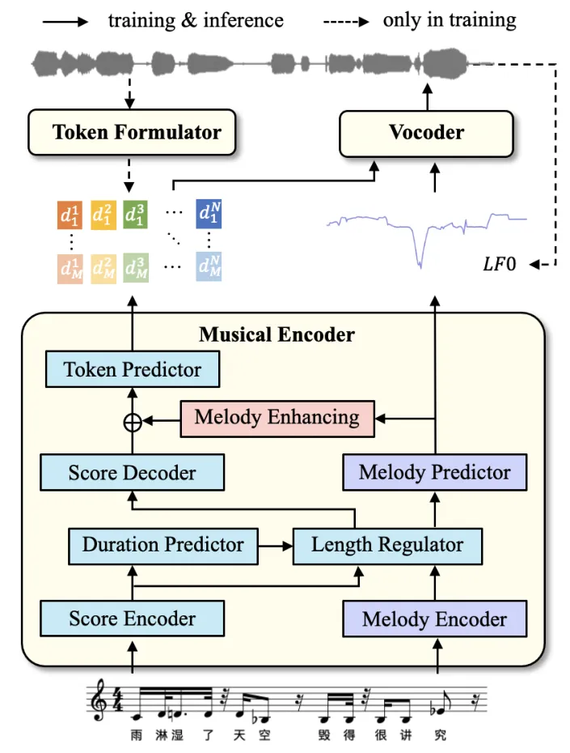
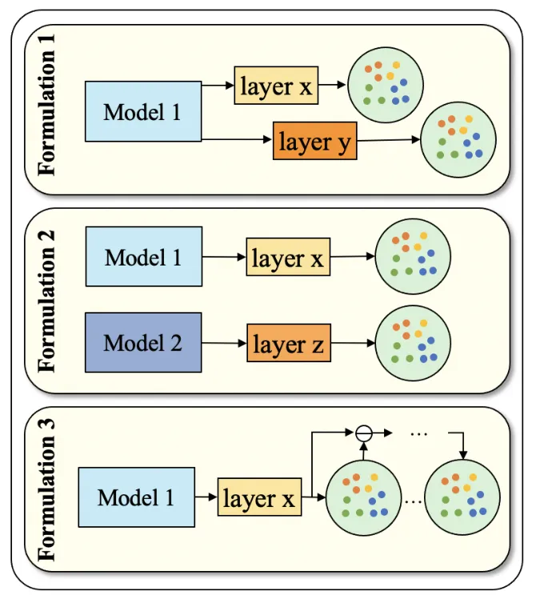
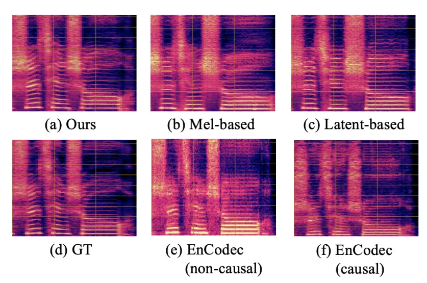
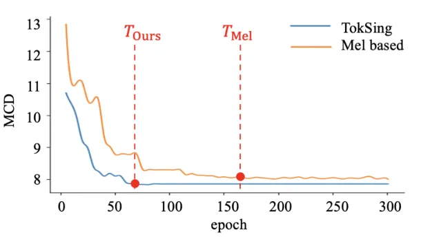

# TokSing: Singing Voice Synthesis based on Discrete Tokens

Yuning Wu    Chunlei Zhang    Jiatong Shi    Yuxun Tang    Shan Yang   
Qin Jin\*

###### Abstract

Recent advancements in speech synthesis witness significant benefits by
leveraging discrete tokens extracted from self-supervised learning (SSL)
models. Discrete tokens offer higher storage efficiency and greater
operability in intermediate representations compared to traditional
continuous Mel spectrograms. However, when it comes to singing voice
synthesis (SVS), achieving higher levels of melody expression poses a
great challenge for utilizing discrete tokens. In this paper, we
introduce TokSing, a discrete-based SVS system equipped with a token
formulator that offers flexible token blendings. We observe a melody
degradation during discretization, prompting us to integrate a melody
signal with the discrete token and incorporate a specially-designed
melody enhancement strategy in the musical encoder. Extensive
experiments demonstrate that our TokSing achieves better performance
against the Mel spectrogram baselines while offering advantages in
intermediate representation space cost and convergence speed.

###### keywords

singing voice synthesis, discrete representation, self-supervised
learning

^(†)^(†)address: ¹ Renmin University of China, ² Tencent AI Lab, ³
Carnegie Mellon University, ^(†)^(†)email: {yuningwu, qjin}@ruc.edu.cn,
cleizhang@global.tencent.com, jiatongs@cs.cmu.edu

## 1 Introduction

Singing Voice Synthesis (SVS) aims to generate vocal sounds given music
scores with melody and lyrics. Traditional SVS systems \[1, 2, 3, 4, 5,
6\] primarily focus on enhancing acoustic models to generate Mel
spectrograms from scores, which are then converted into waveforms by
vocoders \[7, 8\]. Recently, there has been a growing trend towards
using discrete tokens, a representation with superior storage efficiency
and controllability, for speech understanding and generation tasks \[9,
10, 11, 12\]. Discrete tokens can be obtained from raw audio through
vector quantization \[13, 14, 15\]or generated by clustering \[16\] on
hidden embeddings of SSL models \[17, 18, 19, 20\] pretrained on
large-scale audios.

Different from speech processing, singing adds the complexity of melodic
expression on top of speech, requiring vocal sound that meets the
musical score requirements and delivers high-quality listening
experiences. Therefore, applying discrete tokens in SVS faces some
unique challenges. Firstly, limited by copyright restrictions and strict
recording environments, there is currently no dedicated singing SSL
model, and existing SSL models contain scarce singing data \[4, 21,
22\]. Therefore, setting suitable tokens for singing synthesis remains
challenging. Secondly, although lyrics are inherently discrete among the
information encompassed within singing, the melody requires more refined
expression, for example, the fundamental frequency of the same note can
vary delicately between the frames it covers, especially in cases
involving sustained notes, high pitches, vibratos, and other techniques
requiring advanced vocal skills \[23\]. Therefore, there is a risk of
losing the acoustic details of the melody during the process of
discretization. Consequently, constructing a discrete token-based SVS
system that meets the demands of melody expression poses a challenge.

In this study, we focus on addressing the above two challenges: finding
suitable token formulations for singing and constructing a discrete
token-based SVS system that meets the demands of melody expression.
Firstly, we introduce a method for formulating tokens tailored to
singing tasks and provide various flexible formulation strategies. Due
to the diversity in pre-training tasks and datasets, different SSL
models can offer valuable insights into singing semantics and acoustics,
potentially providing complementary benefits to each other.
Additionally, drawing from past research \[24, 19, 25\], it is evident
that the influence of various intermediate layers in an SSL model
differs across downstream tasks. This suggests a distribution of diverse
knowledge across the layers. Based on the above reasons, we propose a
token formulator that allows token blending across different models and
layers. Secondly, for the discrete SVS system, we incorporate melody
control signals to enhance the generated melody expression. Finally,
combining the above methods, we propose a new SVS framework, namely
TokSing, using discrete token sequences and melody-oriented signals as
system intermediates. Our main contributions include: (1) We introduce a
token formulator for training and provide multiple token formulations,
offering flexibility in token sourcing and blending. (2) We propose a
discrete token based SVS framework, TokSing, which achieves melody
expression enhancement by integrating melody control signals to offset
the loss of melodic intricacies in tokens. (3) Extensive experiments in
both single-singer and multi-singer scenarios demonstrate that our
proposed TokSing framework achieves better performance with lower
storage cost and higher convergence speed.

## 2 Method

Figure 1: Discrete-based SVS system architecture. The system contains
three parts: a token formulator, a musical encoder and a vocoder.
$`LF0`$, the logarithm of the fundamental frequency melody signal,
serves as the melody signal. The ablations of melody prediction modules
(purple blocks) and melody enhancing module (pink block) are discussed
in Section 3.4. $`d_{i}^{j}`$ represents discrete token.

Figure 1 illustrates the overall framework of our discrete-based SVS
system, containing: 1) A token formulator extracts the hidden embeddings
of the SSL model and quantizes them into tokens through clustering, with
enhancements applied for better predictions. 2) A musical encoder inputs
the music score and predicts target tokens and melody signals, where
enhancement is applied for better predictions; 3) A vocoder converts
tokens and melody signals into singing waveforms. Details of the three
components are presented in the following subsections.

### 2.1 Token Formulation

There are typically two ways to formulate discrete tokens. One way is to
use a Variational Quantized Variational Autoencoder (VQ-VAE) \[26\] to
derive discrete representations from raw audio. \[13\] introduces a
residual vector quantizer (RVQ) and can reconstruct audios from
multi-layer Codec tokens with Codec decoder. The other way involves
quantizing tokens through clustering the hidden embeddings of SSL
models. The pre-training task and the corpus of these models directly
influence token generation. Previous research on speech understanding
tasks \[19, 27, 28\] suggests that different hidden layers contain
diverse information suitable for various downstream tasks, with shallow
layers focusing more on identity and deeper layers on content-related
features. We leverage and compare these tokens for SVS task.

These tokens can serve as intermediate representations, however, the
information conveyed by a single token is limited. Inspired by \[28\],
we propose a more flexible token formulation that involves blending
tokens, which can be categorized into three basic types as in Figure 2:
Type 1 involves selecting tokens from different layers of the same SSL
model. Type 2 contains tokens from different SSL models that may relate
to different pre-training corpora and tasks, taking advantages from
different SSL models without additional training overhead. Lastly, by
using RVQ, multiple-layer tokens can be obtained from the hidden
embeddings of SSL models in a residual manner. Alternatively, we can
utilize codec tokens directly obtained from audio encoders pre-trained
on large-scale corpora \[13, 14\]. These three basic types can be
utilized individually or combined strategically to offer greater
flexibility and interpretability.

Figure 2: Token Formulation 1/2/3 refer to forming from different layers
of the same model, blending from different models, and generating from
residual quantization, respectively.

### 2.2 Musical Encoder

The music encoder conducts acoustic modeling of the transition from
musical scores to intermediate representations. It takes lyrics and
corresponding note sequences containing pitch and duration information
as input and outputs intermediate representations at the frame level.
SVS requires adherence to the timing variations specified by the given
musical scores, which demands higher accuracy in duration prediction.
Hence, we employ a non-autoregressive (NAR) model with an explicit
duration prediction module for modeling following \[29, 2, 30\].

| Representation  | Objective Evaluations |      |      | Subjective Evaluations |          |        |       | Bitrate/bps |
| --------------- | --------------------- | ---- | ---- | ---------------------- | -------- | ------ | ----- | ----------- |
|                 | MCD ↓                 | F0 ↓ | SA ↑ | Pron ↑                 | Melody ↑ | Tech ↑ | MOS ↑ |             |
| Mel Spectrogram | 8.00                  | 0.19 | 59%  | 2.59                   | 2.23     | 2.20   | 3.42  | 204800      |
| Latent Variance | 7.76                  | 0.18 | 62%  | 2.74                   | 2.34     | 2.37   | 3.68  | 491520      |
| Discrete Token  | 7.56                  | 0.17 | 61%  | 2.73                   | 2.38     | 2.37   | 3.70  | 1950        |
| GT              | \-                    | \-   | \-   | 2.93                   | 2.83     | 2.82   | 4.59  | \-          |

Table 1: Comparison of the proposed discrete-based system TokSing with a
Mel-spectrogram based system \[29, 1\], and a latent variance based
system \[31\]. The generated audios are evaluated in terms of their
performance on objective metrics (MCD, F0, SA) and subjective metrics
(Pron, Melody, Tech, MOS) described in Section 3.1.

In addition to the precise timing constraints, singing places a premium
on pitch accuracy. As mentioned earlier, the discretization process may
entail the degradation of pitch variations in singing, which is
validated by our experiments in Section  3.3. To compensate for the loss
of melody changes, we include a melody signal in addition to tokens by
using the logarithm of the fundamental frequency. To further enhance the
accuracy of melody prediction, we introduce a melody encoder to encode
the input pitch and utilize a melody predictor for pitch prediction (see
purple blocks in Figure  1).

We compute melody loss function $`\mathcal{L}_{m}`$ using Euclidean
distance between the extracted $`m_{i}`$ from the raw audio and the
predicted $`\widehat{m}_{i}`$ as:
$`\mathcal{L}_{m}=\frac{1}{N}\sum_{i=1}^{N}|m_{i}-\widehat{m}_{i}|`$,
where $`N`$ represents the number of frames.

The tokens generated by the musical encoder might still encapsulate
certain pitch-related details. Therefore, the output of the score
decoder is enhanced with the predicted $`\widehat{m}_{i}`$, jointly
passed to the token predictor for better prediction. We compute the
token prediction loss $`\mathcal{L}_{\text{tok}}`$ using the
cross-entropy loss as:
$`\mathcal{L}_{\text{tok}}=-\frac{1}{N}\sum_{i=1}^{N}\sum_{j=1}^{M}(d_{i}^{j})\log(\hat{d}_{i}^{j})`$,
where $`d_{ij}`$ represents the ground truth token, $`\hat{d}_{i}^{j}`$
represents the predicted token and $`M`$ is the number of tokens layers.

Figure 3: Visualization of generated audio segments by different
systems. (e) and (f) are resynthesized by codec decoder.

### 2.3 Vocoder

The backbone of the vocoder adopts the adversarial network from HiFiGAN
\[7\], comprising a generator and two discriminators: the Multi-Period
Discriminator (MPD) and the Multi-Scale Discriminator (MSD). Following
previous works \[32, 33\], we replace Mel spectrograms with discrete
tokens. The tokens are encoded by extra embedding layers and then
concatenated with melody signal, passed to the upsampling layers.
Different choices of vocoders are compared in Section  3.3.

## 3 Experiment

### 3.1 Experimental Settings

We conduct experiments in single-singer and multi-singer scenarios. All
singing audios have score notations of pitch, duration, and lyrics.
During training, audios are preprocessed according to the SSL model’s
sampling rate and hop size.

Datasets: We carry out experiments on two public datasets: 1) 
Opencpop \[34\] comprises 5.2 hours of 100 songs featuring a Mandarin
female vocalist. We follow the official split in training and testing
sets, with provided sentence-level segmentation. 2) ACE-Opencpop \[22\]
is a dataset derived from Opencpop’s music scores, containing
multi-singers synthesized using the ACE Studio¹¹ 1
[https://ace-studio.timedomain.cn](https://ace-studio.timedomain.cn)
with detailed manual tuning. The dataset encompasses 30 singers with
diverse genders and vocal styles, accumulating approximately 150 hours
of total duration.

Token Formulation: To acquire suitable token sources, we conduct
resynthesis experiments across different hidden layers of various SSL
models, aggregating them with a weighted sum approach. We select layers
with higher weights as token sources for the following experiments.
Eventually, the 6th and 23rd layers of the WavLM-large²² 2
[https://huggingface.co/microsoft/wavlm-large](https://huggingface.co/microsoft/wavlm-large)
model, as well as the 6th layer of the HuBERT-large model³³ 3
[https://huggingface.co/facebook/hubert-large-ll60k](https://huggingface.co/facebook/hubert-large-ll60k)
are chosen, which also exhibit strong performance in speech
understanding tasks \[24, 25\]. Additionally, setting the optimal number
of clustering centers can be influenced by the phoneme inventory of the
language and the number of singers involved. We compare the performance
across exponential powers of 2 ranging from 32 to 1024. Ultimately, we
set the number of clustering centers to 128 for the single-singer
dataset and 1024 for the multi-singer dataset.

Model configurations: The musical encoder adopts a NAR architecture in
\[29\] with an explicit duration predictor. The encoding and decoding of
score utilize a transformer based structure following \[1\], employing a
384-dim embedding layer to encode lyrics, pitches, and durations from
music scores. The prediction of melody aligns with \[31\] and the
groundtruth melody signals are extracted from raw audios using pyworld
⁴⁴ 4
[https://github.com/JeremyCCHsu/Python-Wrapper-for-World-Vocoder](https://github.com/JeremyCCHsu/Python-Wrapper-for-World-Vocoder)
and computed by natural logarithm. The predicted ones are passed through
a simple fully connected network (pink block in Figure 1) to the token
predictor. In vocoder, a 768-dim and a 256-dim embedding layer are used
to encode the token and melody signal, respectively. The parameters of
the generator and discriminator are consistent with \[7\]. For the
multi-singer dataset, a singer embedding layer is integrated for musical
encoder but is not used in vocoder.

Figure 4: Convergence speed comparison of TokSing and the Mel
spectrogram-based system.

Training and Inference: The model employs the Adam optimizer with a
learning rate of 0.001. The batch size is set to 16 for training. The
inference is performed by averaging the best five models with the lowest
loss on the validation set.

Evaluation Metric: We use common objective metrics, including Mel
Cepstral Distortion (MCD), Root Mean Square Error of Fundamental
Frequency (F0), Semitone Accuracy (SA). Additionally, we conduct four
subjective evaluations, including the clarity in lyric pronunciation
(Pron), fluency in melody expression (Melody), proficiency in singing
technique (Tech), rated on an integer scale from 1 to 3, followed by an
overall listening experience (MOS) rating on a scale from 1 to 5. We
randomly select 30 identical samples from each system and invite 20
native-speaker annotators to rate them. All annotators undergo
pre-annotation tests to ensure they are musically competent. We report
the MOS score at a confidence interval of $`95\%`$.

### 3.2 Comparison Experiments

We compare our discrete-based SVS system, TokSing, with a
fastspeech-like Mel spectrograms-based system \[2\] and a VAE-structured
latent variance-based system \[31\]. As mentioned in Section  2.2,
singing is more sensitive to the duration variations of notes.
Therefore, all systems employ acoustic models with explicit length
regulation in a NAR manner. TokSing achieves better performance in both
subjective and objective metrics, especially in the perception of
melody. Cases of the generated segments (see Figure  3) also demonstrate
that TokSing can exhibit more nuanced performance in melody variations.

As shown in Figure 4, TokSing also shows its advantages in both space
cost and convergence speed as it only requires one token and one melody
signal to represent a frame, resulting in much lower dimensions than Mel
spectrogram-based and latent variance-based systems. Additionally,
TokSing converges faster and more stably than the system based on Mel
spectrograms. We calculate the MCD scores on the test set every five
epochs. TokSing converges ($`T_{\text{Ours}}`$) significantly earlier
than the Mel spectrogram-based system ($`T_{\text{Mel}}`$).

### 3.3 Ablation of the Reconstruction in Vocoder

|                       |         |      |            |      |
| --------------------- | ------- | ---- | ---------- | ---- |
| Representation        | Vocoder |      | + Acoustic |      |
|                       | MCD ↓   | F0 ↓ | MCD ↓      | F0 ↓ |
| SSL Feat.             | 3.18    | 0.14 | \-         | \-   |
| Token-only            | 9.10    | 0.27 | 9.60       | 0.26 |
| Token + $`LF0`$       | 6.59    | 0.17 | 7.56       | 0.17 |
| Codec Token + $`LF0`$ | 7.56    | 0.17 | \-         | \-   |
| Codec Decoder         | 6.35    | 0.24 | \-         | \-   |
| Mel Spectrogram       | 3.32    | 0.15 | 8.00       | 0.19 |

Table 2: Ablation of the resynthesis performance of vocoder with
different input representation.

We note in Section 2.2 that discretization may entail melody
degradation. We conduct reconstruction experiments from the hidden layer
of SSL models and from tokens extracted using the same layer. Results in
Table 2 indicate a significant decrease in melody quality when using
only tokens. To mitigate the melody loss during discretization, we
introduce a melody signal described in Section 2.2 as an additional
auxiliary representation. The results validate the effectiveness of this
strategy both in the vocoder and when connected to the musical encoder.
Although discrete tokens may not outperform Mel spectrogram-based
vocoders in reconstruction experiments, they contribute to better
overall performance in the SVS system. This suggests that discrete
representations alleviate the modeling difficulty in the acoustic model.
Compared to vocoders trained directly on the intermediate layers of
self-supervised models, discrete-based vocoders still have room for
further improvement.

Additionally, we test the reconstruction quality by training a new
vocoder using codec tokens and those reconstructed by the codec decoder.
For the former, we select the first layer of codec tokens from Encodec
(non-causal) \[14\] (referred to as Codec Token + $`LF0`$ in Table2).
For the latter, we follow the encoder-decoder codec architecture of the
same model to reconstruct singing audios (referred to as Codec Decoder
in Table 2). Examples of more codec decoder reconstructions can be found
in Figure 3 (e) and (f). The experiments indicate that the performance
of codec tokens is inferior to tokens obtained from the SSL model.
Furthermore, the codec decoder performs poorly in pitch accuracy.

### 3.4 Ablation of Musical Encoder.

| Melody     | Melody   | Objective |      |      | Subjective |       |
| ---------- | -------- | --------- | ---- | ---- | ---------- | ----- |
| Prediction | Enhanced | MCD ↓     | F0 ↓ | SA ↑ | Melody ↑   | MOS ↑ |
| ✗          | ✗        | 8.07      | 0.19 | 44%  | 2.07       | 3.18  |
| ✗          | ✓        | 7.61      | 0.21 | 59%  | 2.32       | 3.65  |
| ✓          | ✓        | 7.56      | 0.17 | 61%  | 2.38       | 3.70  |

Table 3: Ablation of the melody predictor and melody enhancement
described in Section 2.2 in musical encoder.

Section 2.2 mentions that tokens may also carry some melody information.
Therefore, in addition to introducing a melody predictor, we employ a
melody enhancement strategy to assist in token prediction
(implementation details in Section 3.1). The ablation experiments
presented in Table 3 demonstrate that both the melody predictor and the
melody enhancement strategy enhance the performance of SVS system,
particularly in terms of melody expression.

### 3.5 Ablation of Token Formulations

| Representaion | Vocoder |      | + Acoustic |      |       |
| ------------- | ------- | ---- | ---------- | ---- | ----- |
|               | MCD ↓   | F0 ↓ | MCD ↓      | F0 ↓ | MOS ↑ |
| Single        | 6.59    | 0.17 | 7.56       | 0.17 | 3.70  |
| Formulation 1 | 6.51    | 0.17 | 7.59       | 0.18 | 3.74  |
| Formulation 2 | 6.39    | 0.16 | 7.50       | 0.17 | 3.61  |
| Formulation 3 | 5.96    | 0.15 | 7.65       | 0.18 | 3.40  |

Table 4: Ablation of the SVS performance under different token
formulations described in Section 2.1.

We compare the performance of single-layer tokens with the three
formulations of multi-layer token formulations mentioned in Section 2.1.
The single-layer tokens originate from the 6th layer of WavLM-large. For
multi-layer token formulations, Formulation 1 incorporates tokens from
the 23rd layer of the same model; Formulation 2 adds the 6th layer from
a different model, HuBERT-large; and Formulation 3 applies a four-layer
residual clustering. Both subjective and objective evaluations indicate
that all multi-layer formulations enhance performance to varying
degrees. It is noteworthy that although residual clustering in
Formulation 3 improves the performance of the vocoder by encoding more
details, it also increases the prediction difficulty in the musical
encoder. We observe a noticeable decrease in prediction accuracy in the
later layers of residual clustering.

### 3.6 Transfer Learning

Experiments in Section 3.3 suggest potential for improving the
token-based vocoder, compared to the vocoder trained on SSL model hidden
layers. In Table 5, we explore transfer learning to enhance vocoder,
which is first pretrained on ACE-Opencpop, and then finetuned on
Opencpop. The results indicate that transfer learning can further
improve vocoder.

| Representation    | Vocoder |      | + Acoustic |      |
| ----------------- | ------- | ---- | ---------- | ---- |
|                   | MCD ↓   | F0 ↓ | MCD ↓      | F0 ↓ |
| ACE-Opencpop      | 5.60    | 0.14 | \-         | \-   |
| Opencpop-origin   | 6.51    | 0.16 | 8.15       | 0.19 |
| Opencpop-transfer | 6.11    | 0.16 | 7.43       | 0.17 |

Table 5: Transfer learning from multi singer dataset ACE-Opencpop to
single singer dataset Opencpop.

## 4 Conclusion

This paper proposes a SVS framework TokSing based on discrete
representations. A melody enhancement strategy is introduced to
compensate for the loss of melody information during the discretization
process. Experiments demonstrate that the discrete tokens are more
efficient for singing representation and achieves superior singing
synthesis quality with lower spatial overhead compared to traditional
continuous representations.

## 5 Acknowledgements

This work was partially supported by the National Natural Science
Foundation of China (No. 62072462) and the Beijing Natural Science
Foundation (No. L233008).

## 6 References

## References

- \[1\] Peiling Lu, Jie Wu and Jian Luan “XiaoiceSing: A High-Quality
  and Integrated Singing Voice Synthesis System” In _Proc. Interspeech_,
  2020
- \[2\] Chunhui Wang, Chang Zeng and Xing He “Xiaoicesing 2: A
  high-fidelity singing voice synthesizer based on generative
  adversarial network” In _arXiv preprint arXiv:2210.14666_, 2022
- \[3\] Jinglin Liu, Chengxi Li and Yi Ren “DiffSinger: Singing Voice
  Synthesis via Shallow Diffusion Mechanism” In _Proc. AAAI_, 2021
- \[4\] Jiatong Shi, Shuai Guo and Nan Huo “Sequence-To-Sequence Singing
  Voice Synthesis With Perceptual Entropy Loss” In _Proc. ICASSP_, 2020,
  pp. 76–80
- \[5\] Tao Wang, Ruibo Fu and Jiangyan Yi “Singing-Tacotron: Global
  Duration Control Attention and Dynamic Filter for End-to-end Singing
  Voice Synthesis” In _Proceedings of the 1st International Workshop on
  Deepfake Detection for Audio Multimedia_, 2022
- \[6\] Yu Gu, Xiang Yin and Yonghui Rao “Bytesing: A Chinese singing
  voice synthesis system using duration allocated encoder-decoder
  acoustic models and WaveRNN vocoders” In _Proc. ISCSLP_, 2021
- \[7\] Jungil Kong, Jaehyeon Kim and Jaekyoung Bae “HiFi-GAN:
  Generative adversarial networks for efficient and high fidelity speech
  synthesis” In _Proc. NeurIPS_, 2020
- \[8\] Sang-gil Lee, Wei Ping and Boris Ginsburg “BigVGAN: A Universal
  Neural Vocoder with Large-Scale Training” In _ArXiv_ abs/2206.04658,
  2022
- \[9\] Xuankai Chang, Brian Yan, Yuya Fujita, Takashi Maekaku and
  Shinji Watanabe “Exploration of Efficient End-to-End ASR using
  Discretized Input from Self-Supervised Learning” In _Proc.
  Interspeech_, 2023, pp. 1399–1403 DOI:
  [10.21437/Interspeech.2023-2051](https://dx.doi.org/10.21437/Interspeech.2023-2051)
- \[10\] Yifan Yang, Feiyu Shen and Chenpeng Du “Towards Universal
  Speech Discrete Tokens: A Case Study for ASR and TTS” In _ArXiv_
  abs/2309.07377, 2023
- \[11\] Dong Zhang, Shimin Li and Xin Zhang “SpeechGPT: Empowering
  Large Language Models with Intrinsic Cross-Modal Conversational
  Abilities” In _Proc. EMNLP_, 2023
- \[12\] Eugene Kharitonov, Damien Vincent and Zalán Borsos “Speak, Read
  and Prompt: High-Fidelity Text-to-Speech with Minimal Supervision” In
  _TACL_ 11, 2023, pp. 1703–1718
- \[13\] Neil Zeghidour, Alejandro Luebs and Ahmed Omran “SoundStream:
  An End-to-End Neural Audio Codec” In _TASLP_ 30, 2021, pp. 495–507
- \[14\] Alexandre D’efossez, Jade Copet and Gabriel Synnaeve “High
  Fidelity Neural Audio Compression” In _ArXiv_ abs/2210.13438, 2022
- \[15\] Rithesh Kumar, Prem Seetharaman, Alejandro Luebs and othersr
  “High-Fidelity Audio Compression with Improved RVQGAN” In _ArXiv_
  abs/2306.06546, 2023
- \[16\] J. MacQueen “Some methods for classification and analysis of
  multivariate observations”, 1967
- \[17\] Wei-Ning Hsu, Benjamin Bolte and Yao-Hung Tsai “HuBERT:
  Self-Supervised Speech Representation Learning by Masked Prediction of
  Hidden Units” In _TASLP_ 29, 2021, pp. 3451–3460
- \[18\] Alexei Baevski, Yuhao Zhou and Abdelrahman Mohamed “wav2vec
  2.0: A framework for self-supervised learning of speech
  representations” In _NeurIPS_ 33, 2020, pp. 12449–12460
- \[19\] Sanyuan Chen, Chengyi Wang and Zhengyang Chen “WavLM:
  Large-Scale Self-Supervised Pre-Training for Full Stack Speech
  Processing” In _IJSTSP_ 16, 2021, pp. 1505–1518
- \[20\] Alexei Baevski, Steffen Schneider and Michael Auli “vq-wav2vec:
  Self-Supervised Learning of Discrete Speech Representations” In _Proc.
  ICLR_, 2019
- \[21\] Shuai Guo, Jiatong Shi and Tao Qian “SingAug: Data Augmentation
  for Singing Voice Synthesis with Cycle-consistent Training Strategy”
  In _Proc. Interspeech_, 2022
- \[22\] Jiatong Shi, Yueqian Lin and Xinyi Bai “Singing Voice Data
  Scaling-up: An Introduction to ACE-Opencpop and ACE-KiSing” In _ArXiv_
  abs/2401.17619, 2024
- \[23\] Yuan-Hao Yi, Yang Ai and Zhen-Hua Ling “Singing Voice Synthesis
  Using Deep Autoregressive Neural Networks for Acoustic Modeling” In
  _Proc. Interspeech_, 2019
- \[24\] Shu-wen Yang, Po-Han Chi and Yung-Sung Chuang “SUPERB: Speech
  processing Universal PERformance Benchmark” In _Proc. Interspeech_,
  2021
- \[25\] Jiatong Shi, Hirofumi Inaguma and Xutai Ma “Multi-resolution
  HuBERT: Multi-resolution Speech Self-Supervised Learning with Masked
  Unit Prediction” In _Proc. ICLR_, 2023
- \[26\] Aäron van Oord, Oriol Vinyals and Koray Kavukcuoglu “Neural
  Discrete Representation Learning” In _ArXiv_ abs/1711.00937, 2017
- \[27\] Jiatong Shi, Hirofumi Inaguma, Xutai Ma, Ilia Kulikov and Anna
  Sun “Multi-resolution HuBERT: Multi-resolution Speech Self-Supervised
  Learning with Masked Unit Prediction” In _Proc. ICLR_, 2024
- \[28\] Jiatong Shi, Xutai Ma, Hirofumi Inaguma, Anna Sun and Shinji
  Watanabe “MMM: Multi-Layer Multi-Residual Multi-Stream Discrete Speech
  Representation from Self-supervised Learning Model” In _Proc.
  Interspeech_, 2024
- \[29\] Yi Ren, Yangjun Ruan and Xu Tan “FastSpeech: Fast, Robust and
  Controllable Text to Speech” In _Proc. NeurIPS_, 2019
- \[30\] Yuning Wu, Jiatong Shi, Tao Qian, Dongji Gao and Qin Jin
  “Phoneix: Acoustic Feature Processing Strategy for Enhanced Singing
  Pronunciation With Phoneme Distribution Predictor” In _Proc. ICASSP_,
  2023, pp. 1–5
- \[31\] Yongmao Zhang, Heyang Xue and Hanzhao Li “VISinger 2:
  High-Fidelity End-to-End Singing Voice Synthesis Enhanced by Digital
  Signal Processing Synthesizer” In _ArXiv_ abs/2211.02903, 2022
- \[32\] Ann Lee, Peng-Jen Chen and Changhan Wang “Direct
  Speech-to-Speech Translation With Discrete Units” In _Proc. ACL_,
  2022, pp. 3327–3339
- \[33\] Brian Yan, Jiatong Shi and Yun Tang “ESPnet-ST-v2: Multipurpose
  Spoken Language Translation Toolkit” In _Proc. ACL_, 2023, pp. 400–411
- \[34\] Yu Wang, Xinsheng Wang and Pengcheng Zhu “Opencpop: A
  High-Quality Open Source Chinese Popular Song Corpus for Singing Voice
  Synthesis” In _Proc. Interspeech_, 2022
