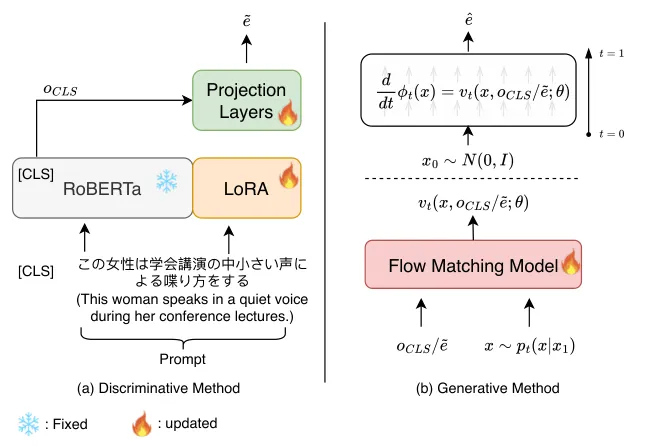
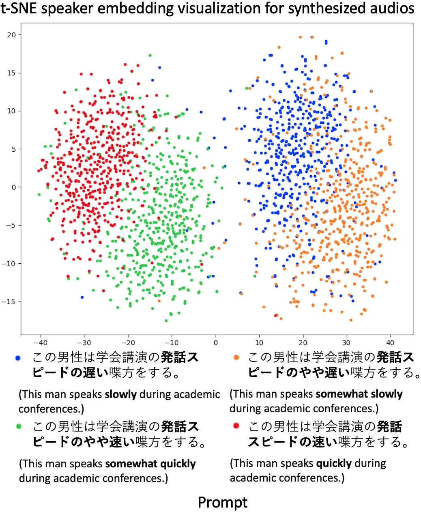
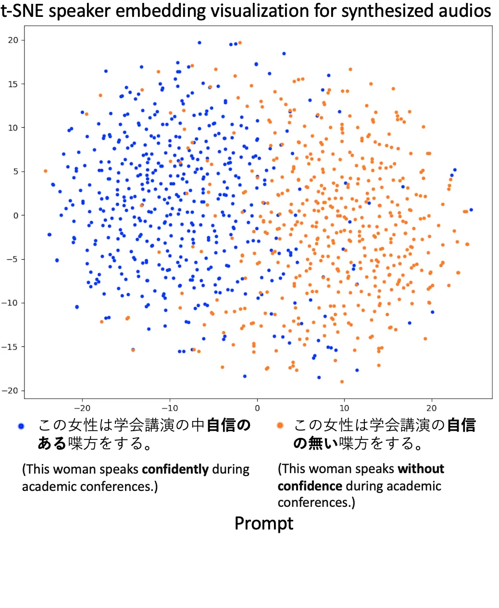
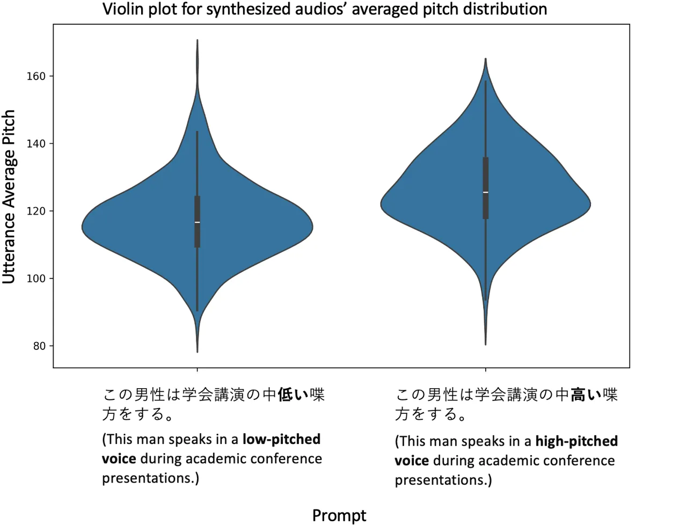
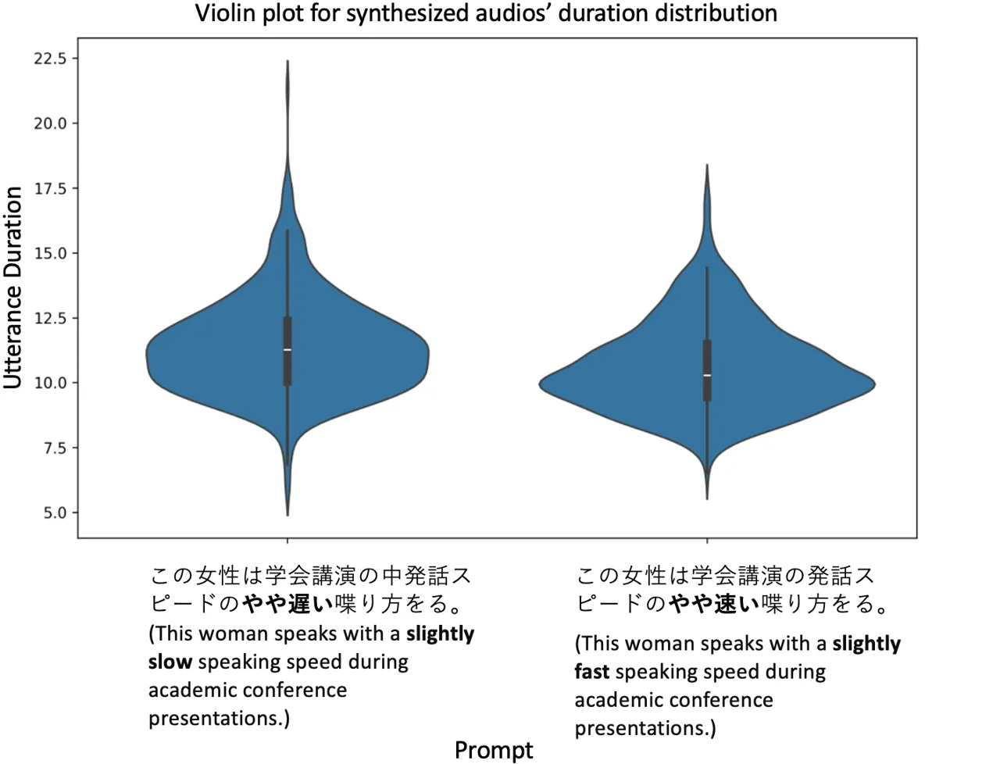
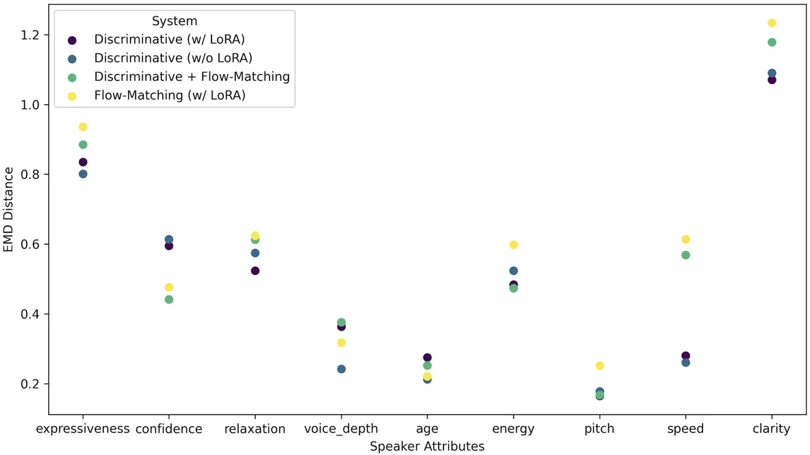
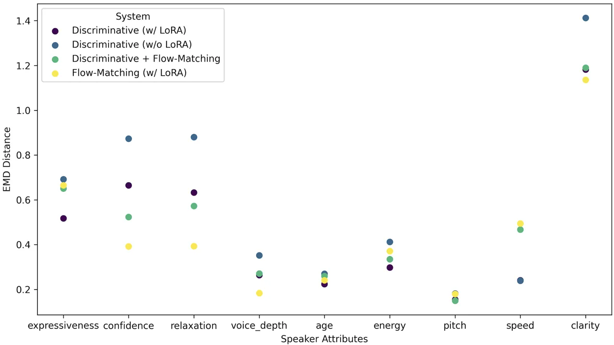

# Generating Speakers by Prompting Listener Impressions for Pre-trained Multi-Speaker Text-to-Speech Systems

Zhengyang Chen    Xuechen Liu    Erica Cooper    Junichi Yamagishi   
Yanmin Qian

###### Abstract

This paper proposes a speech synthesis system that allows users to
specify and control the acoustic characteristics of a speaker by means
of prompts describing the speaker’s traits of synthesized speech. Unlike
previous approaches, our method utilizes listener impressions to
construct prompts, which are easier to collect and align more naturally
with everyday descriptions of speaker traits. We adopt the Low-rank
Adaptation (LoRA) technique to swiftly tailor a pre-trained language
model to our needs, facilitating the extraction of speaker-related
traits from the prompt text. Besides, different from other prompt-driven
text-to-speech (TTS) systems, we separate the prompt-to-speaker module
from the multi-speaker TTS system, enhancing system flexibility and
compatibility with various pre-trained multi-speaker TTS systems.
Moreover, for the prompt-to-speaker characteristic module, we also
compared the discriminative method and flow-matching based generative
method and we found that combining both methods can help the system
simultaneously capture speaker-related information from prompts better
and generate speech with higher fidelity.

###### keywords

multi-speaker text-to-speech, prompt, listener impression

^(†)^(†)address: ¹AudioCC Lab, CS Dept, Shanghai Jiao Tong University,
Shanghai, China  
²National Institute of Informatics, Tokyo, Japan  
³National Institute Of Information And Communications Technology, Kyoto,
Japan ^(†)^(†)email: zhengyang.chen@sjtu.edu.cn, jyamagis@nii.ac.jp

## 1 Introduction

Multi-speaker text-to-speech systems \[1, 2, 3\] aim to synthesize
natural speech conditioned on the specific content text and target
speaker information. The speaker information can be provided by speaker
ID, reference speech, or encoded speaker embedding. However, the
available speaker ID must be used in the training process and the
reference speech could be hard to find in a short period if we want to
create some unseen voices. Besides, providing reference speech may not
be user-friendly for some ordinary users.

Natural language serves as the most intuitive and comprehensive medium
for humans to communicate information. Recent research endeavors have
aimed at harnessing this capability within text-to-speech (TTS) systems
by controlling speaker-related attributes through textual descriptions,
commonly referred to as prompts. Studies such as those by Guo et al.
\[4\], Leng et al. \[5\], Liu et al. \[6\], and Yang et al. \[7\] mainly
explore the manipulation of style-related attributes via text prompts.
Conversely, Zhang et al. \[8\] investigated the modulation of speaker
identity information. Extending this domain, Shimizu et al. \[9\] used
prompts to concurrently modulate both style and speaker identity
attributes.

Despite notable advancements in prompt-driven text-to-speech (TTS)
technology, several persistent challenges merit further investigation.
The authors in \[4, 5\] have trained their systems using datasets with
paired speech and prompt descriptions. However, acquiring TTS training
data is much easier than procuring prompt-specific data \[7, 8\]. This
discrepancy suggests that decoupling the TTS model from the
prompt-modulation model may be advantageous. Typically, the pre-trained
language models (LM) used for encoding prompt information are developed
using general-purpose datasets. As such, it may not suffice to merely
integrate basic modules \[7, 8\] atop these LMs to tailor them for TTS
applications. Meanwhile, the methods for collecting prompt data can be
categorized into two main approaches: deriving statistical signal
processing measures \[4, 5\], such as pitch and speed, from larger
datasets automatically; or directly collecting small-scale prompts
manually \[7, 8\], which involves a more curated and thus potentially
less scalable process. Identifying more effective strategies for
gathering prompt data remains a crucial area for exploration.

We propose generating the prompts from listener impression scores, which
can be more easily collected than the complete prompt descriptions and
align more closely with natural descriptions of voice in daily
conversations compared with the signal processing statistics-based
prompts. Furthermore, we address the challenge of pre-trained LMs, which
are typically trained on general datasets that may not effectively
capture nuances related to speaker identity and speaking styles. To this
end, we use a low-rank adaptation strategy (LoRA) \[10\], adapting the
pre-trained LM to better suit our specific requirements. Our
experimental results underscore the significance of the LoRA module in
enhancing overall performance. Additionally, different from the previous
works \[4, 5\], we propose a modular design for the prompt-based TTS
system, decoupling the prompt-to-speaker module from the TTS system.
This separation increases the system’s flexibility, allowing for
seamless integration with various multi-speaker TTS frameworks. When
mapping the prompt to another modality, researchers have used either a
discriminative method \[6, 7, 11, 12, 13\] or generative method \[8\].
Our findings indicate that each method offers distinct benefits, and a
hybrid approach that combines both methods yields further enhancements.

## 2 Prompt-driven Speaker Generation

### 2.1 System Overview

As shown in Figure 1, our methodology extends the text-to-speech (TTS)
task by utilizing both content text and the prompt from listener
impressions as inputs. The content text controls the linguistic aspects
of the generated speech, while the prompt from listener impressions
modulates the speaker’s characteristics. We detail the process of prompt
construction in section 3.1. Our approach begins with pre-training a
Variational Inference with adversarial learning for end-to-end
Text-to-Speech (VITS) system \[14\], which is modified in our experiment
to condition on speaker embeddings $`e`$ derived from an external
speaker encoder. Furthermore, we replaced the original speaker encoder
with a prompt encoder. This modification necessitates that the prompt
encoder is capable of accurately mapping prompts to their respective
speaker embeddings, thereby enabling the precise control of speaker
characteristics through textual prompts.

In the following sections, we introduce two methods to map the prompt
text to speaker embedding, the discriminative method and the generative
method. In the discriminative method, the speaker embedding is
deterministically determined by the prompt, which is widely used in
previous multi-modal linking models \[11, 12, 13\]. Besides, we also
propose to use the generative flow-matching \[15\] model to learn the
distribution of the speaker embeddings conditioned on the prompt.

Figure 1: Overview of our system. $`\tilde{e}`$ and $`\hat{e}`$ are two
types of outputs of the prompt encoder. Refer to Figure 2 for more
details.

### 2.2 Discriminative Method

In this section, we introduce a discriminative model to map the text
prompt to speaker embedding. Unlike other multi-modal linking models,
e.g. CLIP \[11\] and CLAP \[12\], we update only the text prompt encoder
here, which enables our model to be easily adapted to any pre-trained
multi-speaker text-to-speech system. As depicted in Figure 2(a), each
text prompt is initially appended with a $`[\textit{CLS}]`$ token. This
modified prompt is then processed by RoBERTa \[16\]¹¹ 1
[https://huggingface.co/nlp-waseda/roberta-base-japanese-with-auto-jumanpp](https://huggingface.co/nlp-waseda/roberta-base-japanese-with-auto-jumanpp),
for which the output at the $`[\textit{CLS}]`$ token, denoted as
$`o_{CLS}`$, encapsulates the comprehensive information of the text
prompt. Finally, $`o_{CLS}\in\mathbb{R}^{d^{\prime}}`$ is fed into
another projection module to obtain the predicted speaker embedding
$`\tilde{e}\in\mathbb{R}^{d}`$. Considering that many speaker
recognition systems optimize the speaker embedding in the hyper-sphere
space \[17, 18\], we update the discriminative model by simultaneously
minimizing the L2 distance and maximizing the cosine similarity between
$`\tilde{e}`$ and the ground truth embedding $`e`$. The loss function is
formulated as follows:

```math
\mathcal{L}=\|\tilde{e}-e\|^{2}+(1-\textit{cosine\_similarity}(\tilde{e},e)) \tag{1}
```

We also explore using the LoRA \[10\] in Figure 2(a) module to enhance
the RoBERTa for our task and we consider the RoBERTa without LoRA as our
baseline in our experiment.



Figure 2: The Prompt Encoder Design.

### 2.3 Generative Method based on Flow Matching

Although discriminative multi-modal linking methods have shown
commendable performance in downstream tasks, e.g. prompt-driven speech
generation \[7\], image generation \[19\] and audio generation \[20\],
the relationship between text prompts and speaker embeddings is not
strictly one-to-one. A single prompt can often describe different
speakers, highlighting a complex one-to-many mapping challenge. To
address this inherent complexity, we propose the adoption of a Flow
Matching (FM) based generative model \[15\] for generating speaker
embeddings from text prompts.

#### 2.3.1 Flow Matching Algorithm

Modeling the distribution of data points $`x_{1}\in\mathbb{R}^{d}`$
sampled from an unknown distribution $`q(x_{1})`$ using deep learning
techniques presents significant challenges. The generative model is
always designed to learn the transformation from a simple prior
distribution $`p_{0}`$ (e.g., a Gaussian distribution) to a target
distribution $`p_{1}\approx q`$. The flow matching algorithm \[15\] is
proposed to construct a continuous flow
$`\phi_{t}:\mathbb{R}^{d}\rightarrow\mathbb{R}^{d},t\in[0,1]`$ for
transforming the prior distribution into the target distribution by
regressing the vector field $`u_{t}\in\mathbb{R}^{d}`$. The relationship
between the flow and vector field is formulated using an ordinary
differential equation (ODE):

```math
\frac{d}{dt}\phi_{t}(x)=u_{t}\left(\phi_{t}(x)\right) \tag{2}
```

Thus, if we can approximate $`u_{t}`$ using a neural network, we can
construct the flow path. However, given the absence of a closed-form
expression for $`u_{t}`$, we cannot approximate it directly. Lipman et
al. \[15\] propose utilizing a conditional vector field
$`u_{t}(x|x_{1})`$ to replace the original vector field $`u_{t}`$,
leading to the Conditional Flow Matching (CFM) objective:

```math
\mathcal{L}_{\mathrm{CFM}}(\theta)=\mathbb{E}_{t,q(x_{1}),p_{t}(x|x_{1})}\|v_{t}(x,\theta)-u_{t}(x|x_{1})\|^{2} \tag{3}
```

where $`p_{t}(x|x_{1})`$ denotes the probability density function
conditioned on $`x_{1}`$ at time $`t`$, and $`v_{t}(x,\theta)`$ is the
neural network we used to approximate $`u_{t}(x|x_{1})`$. The authors in
\[15\] also prove that approximating $`u_{t}(x|x_{1})`$ is equivalent to
approximating $`u_{t}`$.

To define the path of the flow, we utilize the optimal transport (OT)
path as described in \[15\], where
$`p_{t}(x|x_{1})=\mathcal{N}(x|tx_{1},(1-(1-\sigma_{\min})t)^{2}I)`$ and
$`u_{t}(x|x_{1})=(x_{1}-(1-\sigma_{\min})x)/(1-(1-\sigma_{\min})t)`$.
Here, $`\sigma_{\min}`$ is a scalar marginally above zero.

#### 2.3.2 Generate Speaker Representation based on Flow Matching

In this study, our objective is to generate speaker embeddings that are
conditioned on the prompt from listener impressions. Illustrated in
Figure 2 and following the approach described in Section 2.2, we
initially process the prompt through the RoBERTa model with a LoRA
module, yielding the output $`o_{CLS}`$. To condition the CFM model on
the prompt, we reformulate the approximated vector field in equation 3
to $`v_{t}(x,o_{CLS};\theta)`$. We can also condition the FM model on
the output of the discriminative model to build a two-stage system, and
the vector field is formulated as $`v_{t}(x,\tilde{e};\theta)`$. During
the inference phase, speaker embeddings $`\hat{e}`$ are generated by
integrating the ODE function from $`t=0`$ to $`t=1`$:

```math
\frac{d}{dt}\phi_{t}(x)=v_{t}(x,o_{CLS}/\tilde{e};\theta);\phi_{0}(x)=x_{0}\sim N(0,I) \tag{4}
```

To balance the generative fidelity and time consumption, we set the ODE
step to 32 in our experiment.

## 3 Experiment Setup

### 3.1 Dataset and Prompt Construction

Figure 3: Prompt construction pipeline from listener impressions. The
prompt is created using slot-filling techniques, with impression phrases
filling the two slots indicated by brackets.

In our work, we leverage the Corpus of Spontaneous Japanese (CSJ) \[21\]
dataset and follow the dataset partition in \[22\], resulting in 2,672
and 30 speakers for training and evaluation, respectively. Meanwhile, we
isolated 200 utterances from 20 speakers in the trainset to form the
held-out validation dataset, which is not used for model training. Even
though the CSJ dataset has its own transcripts, there is no punctuation,
which is important for the TTS system. To generate transcripts with
punctuation for the CSJ dataset, we pre-process the CSJ dataset by
leveraging the small-version pre-trained Whisper \[23\] model.

The CSJ dataset also provides listener impression test scores for
speaker characteristics. According to the description available at the
website²² 2
[https://clrd.ninjal.ac.jp/csj/manu-f/impression.pdf](https://clrd.ninjal.ac.jp/csj/manu-f/impression.pdf),
it comprises both binary inquiries (e.g., high/low pitch, old/young) and
rank-order queries on a five-point scale (e.g., speaking speed,
demeanor), resulting in 26 questions in total. Each of the scores for
each question can be reformulated as a phrase describing speaker
impression. The process of building descriptions from the listener
impression test scores are illustrated in Figure 3.

### 3.2 Model Configuration

In our experiment, we use the pre-trained r-vector (ResNet34) from the
wespeaker³³ 3
[https://github.com/wenet-e2e/wespeaker/blob/master/docs/pretrained.md](https://github.com/wenet-e2e/wespeaker/blob/master/docs/pretrained.md)
\[24\] as the speaker encoder for the multi-speaker text-to-speech
system. We follow the VITS implementation in this repository⁴⁴ 4
[https://github.com/jaywalnut310/vits](https://github.com/jaywalnut310/vits)
to leverage the external speaker embedding. For the prompt encoder in
our experiment, we implement the LoRA module following the AdapterHub⁵⁵
5
[https://github.com/adapter-hub/adapters](https://github.com/adapter-hub/adapters) \[25\]
toolkit and set the LoRA rank to 8. We implement the Projection module
introduced in section 2.2 as 4-layer linear layers. We also design the
Flow Matching model introduced in Section 2.3 in the same way as the
Projection module. When combining the discriminative method with the
flow-matching based generative method introduced in section 2.3.2, we
simply stack the Flow Matching model in Figure 2(b) on the Projection
model in 2(a).

In our experiment, we first pre-train the multi-speaker TTS system on
the CSJ training set, during which the speaker encoder is fixed. Then,
we train the prompt encoder based on the speaker embeddings and prompts
introduced in Sections 3.1 and 3.2. During inference, we simply replace
the speaker encoder in the multi-speaker TTS system with the prompt
encoder to enable prompt-driven text-to-speech.

### 3.3 Evaluation Metric

#### 3.3.1 Objective Evaluation

Due to the one-to-many mapping nature of the prompt-to-speaker
generation task introduced in Section 2.3, we do not have an exact
ground-truth reference for each generated speaker embedding and
generated audio sample. Here, we borrow the reference-free evaluation
metric, Fréchet Audio Distance (FAD) \[26\], for our experiment. In the
FAD evaluation, we randomly select 5,000 audio samples from training set
as the background speech set. Utilizing the Encodec \[27\] model from
the fadtk toolkit⁶⁶ 6
[https://github.com/microsoft/fadtk](https://github.com/microsoft/fadtk)
\[28\], we extract embeddings from both this background set and the
synthesized speech generated from prompts in the CSJ evaluation set.
Then, FAD scores are calculated based on the extracted embeddings. A
lower FAD score means that the synthesized speech has a similar
distribution to the background speech set, indicating better audio
fidelity.

Scenario System Speaker Attribute expressiveness confidence relaxation
voice_depth age energy pitch speed clarity Avg Seen Discriminative (w/o
LoRA) 0.72 0.53 0.48 0.75 0.86 0.71 0.89 0.89 0.23 0.67 Discriminative
(w/ LoRA) 0.71 0.69 0.65 0.83 0.90 0.76 0.94 0.85 0.37 0.74
Flow-Matching (w/ LoRA) 0.68 0.53 0.66 0.76 0.79 0.50 0.86 0.38 0.22
0.60 Discriminative + Flow-Matching 0.74 0.71 0.75 0.87 0.96 0.72 0.90
0.68 0.35 0.74 Unseen Discriminative (w/o LoRA) -0.04 0.05 0.46 0.38
0.67 0.29 0.73 0.57 -0.37 0.31 Discriminative (w/ LoRA) -0.54 0.38 0.49
0.48 0.77 0.25 0.81 0.36 0.41 0.50 Flow-Matching (w/ LoRA) -0.10 0.12
0.32 0.42 0.82 0.39 0.74 0.14 0.21 0.34 Discriminative + Flow-Matching
-0.36 0.08 0.49 0.35 0.74 0.34 0.75 0.37 0.20 0.41 • underline: The
statistical significance (p-value) is less than 0.001, indicating the
MOS scores of synthetic speech are significantly correlated with the MOS
scores of reference speech.

Table 1: Spearman Rank Correlation Coefficient (SRCC) between MOS scores
from reference and synthesized speech.

#### 3.3.2 Subjective Evaluation

We conducted a listening test and recruited 100 native Japanese
listeners to evaluate both the synthesis quality and the ability of the
synthesis systems to produce speech that correctly reflects the speaker
attributes described in the prompt. We first select 100 utterances (10
male and 10 female each, 5 utterances for each speaker) from the CSJ
evaluation (unseen speaker) and held-out validation set (seen speaker),
respectively, as the natural speech reference set. Then, we use the
prompts and content text according to these 200 utterances to generate
200 utterances using each of the four systems. We first asked listeners
to rate the samples on a scale of 1-5 for overall naturalness. We also
asked listeners to give their impressions about nine different speaker
attributes on a 5-point rating scale. For each speaker attribute, each
sample from the reference set and the synthesized audio is rated 8 times
by different raters. Since each speaker corresponds to 5 utterances,
there are 40 MOS scores per speaker from the same attribute. Then we
average the 40 MOS scores for each speaker to remove the randomness.

## 4 Results

### 4.1 Audio Fidelity and Naturalness Evaluation

We employ FAD score and naturalness MOS, detailed in Section 3.3, to
assess the fidelity and naturalness of synthesized speech from both
objective and subjective perspectives. Results in Table 2 reveal the
indispensable role of the LoRA module in enhancing speech synthesis,
corroborating our hypothesis that merely augmenting the language model
with additional layers is insufficient for this task. Furthermore, we
demonstrate that our novel approach of generating speaker embeddings
through the generative flow-matching model surpasses discriminative
methods in terms of speech fidelity and naturalness. Notably, the
combination of discriminative and generative techniques yields further
improvement in the fidelity of synthesized speech.

System FAD Score Naturalness MOS ground-truth - 4.06 $`\pm`$ 0.25
Discriminative (w/o LoRA) 11.217 3.15 $`\pm`$ 0.25 Discriminative (w/
LoRA) 05.244 3.45 $`\pm`$ 0.19 Flow-Matching (w/ LoRA) 03.559 3.52
$`\pm`$ 0.26 Discriminative + Flow-Matching 03.126 3.50 $`\pm`$ 0.24

Table 2: FAD score and Naturalness MOS results on the CSJ evaluation
set.

### 4.2 Speaker information relevance between synthesized speech and prompt

In Section 3.3.2, we evaluate our systems in both seen and unseen
speaker scenarios by collecting 20 Mean Opinion Score (MOS) ratings
(corresponds to 20 speakers) for each system regarding a specific
speaker attribute. We calculate the Spearman Rank Correlation
Coefficient (SRCC) \[29\] between the MOS scores from synthesized speech
and reference speech and list the results in Table 1.

(a) Pitch MOS score.

(b) Age MOS score.

(c) Speed MOS score.

(d) Voice depth MOS score.

Figure 4: MOS score linear correlation visualization between synthesized
speech and reference speech. The Discriminative (w/ LoRA) system is used
to generate speech for seen speaker scenario.

Results from the seen scenario indicate that, aside from the clarity
attribute, our systems effectively capture the speaker’s
characteristics, with discriminative methods outperforming generative
ones in terms of SRCC values. Despite this, as section 4.1 discusses,
generative systems excel in creating high-fidelity audio. A synergistic
approach, integrating both discriminative and generative techniques,
achieves an optimal balance in preserving speaker characteristics and
improving synthesized audio fidelity and naturalness. It should be noted
that, apart from the pitch and speech attributes, which can be
manipulated by signal processing strategy, our systems also capture the
voice depth and age information from prompts very well. Manipulating
these abstract concepts in speech is precisely the greatest strength of
prompt-driven TTS systems. Besides, we also plot the MOS scores from
synthesized and reference speech and visualize the linear correlation
between them in Figure 4. The visualization further demonstrates that
our system can capture the specific speaker characteristics from
prompts.

Results from the bottom part of Table 1 show that, for the unseen
speaker scenario, the system’s ability to capture speaker
characteristics in the prompt has weakened. This is because the prompt
data amount in CSJ is still limited. In the future, we plan to train MOS
predictors for speaker traits and use estimated MOS values for
generating speaker impression prompts automatically for large amounts of
speech data.

## 5 Conclusion

In this paper, we proposed to use prompts to specify and control the
acoustic characteristics of the synthesized speech from a multi-speaker
text-to-speech system. Different from previous works, listener
impression scores are used to construct the prompts, thereby saving
human resources and make the prompts closer to everyday expressions.
Furthermore, we integrated a lightweight adapter module, LoRA, to
efficiently fine-tune pre-trained language models for our specific
requirements, yielding significant enhancements. Besides, we also
decoupled the prompt-to-speaker module and the TTS system, which makes
the whole system more flexible. To generate speaker embeddings from the
prompt, we explored the discriminative method and flow-matching based
generative method. Interestingly, We found that these two methods each
have their own advantages, and combining them can further enhance the
model.

## 6 Acknowledgements

This work was conducted during the first author’s internship at NII,
Japan. This study was partially supported by Google AI for Japan
program. This work was partially supported in part by China NSFC
projects under Grants 62122050 and 62071288, in part by Shanghai
Municipal Science and Technology Commission Project under Grant
2021SHZDZX0102.

## References

- \[1\] A. Gibiansky, S. Arik, G. Diamos, J. Miller, K. Peng, W. Ping,
  J. Raiman, and Y. Zhou, “Deep voice 2: Multi-speaker neural
  text-to-speech,” _Advances in neural information processing systems_,
  vol. 30, 2017.
- \[2\] E. Cooper, C.-I. Lai, Y. Yasuda, F. Fang, X. Wang, N. Chen, and
  J. Yamagishi, “Zero-shot multi-speaker text-to-speech with
  state-of-the-art neural speaker embeddings,” in _ICASSP 2020-2020 IEEE
  International Conference on Acoustics, Speech and Signal Processing
  (ICASSP)_. IEEE, 2020, pp. 6184–6188.
- \[3\] E. Casanova, J. Weber, C. D. Shulby, A. C. Junior, E. Gölge, and
  M. A. Ponti, “Yourtts: Towards zero-shot multi-speaker tts and
  zero-shot voice conversion for everyone,” in _International Conference
  on Machine Learning_. PMLR, 2022, pp. 2709–2720.
- \[4\] Z. Guo, Y. Leng, Y. Wu, S. Zhao, and X. Tan, “Prompttts:
  Controllable text-to-speech with text descriptions,” in _ICASSP
  2023-2023 IEEE International Conference on Acoustics, Speech and
  Signal Processing (ICASSP)_. IEEE, 2023, pp. 1–5.
- \[5\] Y. Leng, Z. Guo, K. Shen, X. Tan, Z. Ju, Y. Liu, Y. Liu,
  D. Yang, L. Zhang, K. Song _et al._, “Prompttts 2: Describing and
  generating voices with text prompt,” _arXiv preprint
  arXiv:2309.02285_, 2023.
- \[6\] G. Liu, Y. Zhang, Y. Lei, Y. Chen, R. Wang, L. Xie, and Z. Li,
  “PromptStyle: Controllable Style Transfer for Text-to-Speech with
  Natural Language Descriptions,” in _Proc. INTERSPEECH 2023_, 2023, pp.
  4888–4892.
- \[7\] D. Yang, S. Liu, R. Huang, G. Lei, C. Weng, H. Meng, and D. Yu,
  “Instructtts: Modelling expressive tts in discrete latent space with
  natural language style prompt,” _arXiv preprint
  arXiv:2301.13662_, 2023.
- \[8\] Y. Zhang, G. Liu, Y. Lei, Y. Chen, H. Yin, L. Xie, and Z. Li,
  “Promptspeaker: Speaker generation based on text descriptions,” in
  _2023 IEEE Automatic Speech Recognition and Understanding Workshop
  (ASRU)_. IEEE, 2023, pp. 1–7.
- \[9\] R. Shimizu, R. Yamamoto, M. Kawamura, Y. Shirahata, T. Komatsu,
  K. Tachibana _et al._, “Prompttts++: Controlling speaker identity in
  prompt-based text-to-speech using natural language descriptions,”
  _arXiv preprint arXiv:2309.08140_, 2023.
- \[10\] E. J. Hu, Y. Shen, P. Wallis, Z. Allen-Zhu, Y. Li, S. Wang,
  L. Wang, and W. Chen, “Lora: Low-rank adaptation of large language
  models,” in _The Tenth International Conference on Learning
  Representations, ICLR 2022, Virtual Event, April 25-29,
  2022_. OpenReview.net, 2022. \[Online\]. Available:
  [https://openreview.net/forum?id=nZeVKeeFYf9](https://openreview.net/forum?id=nZeVKeeFYf9)
- \[11\] A. Radford, J. W. Kim, C. Hallacy, A. Ramesh, G. Goh,
  S. Agarwal, G. Sastry, A. Askell, P. Mishkin, J. Clark _et al._,
  “Learning transferable visual models from natural language
  supervision,” in _International conference on machine learning_. PMLR,
  2021, pp. 8748–8763.
- \[12\] B. Elizalde, S. Deshmukh, M. Al Ismail, and H. Wang, “Clap
  learning audio concepts from natural language supervision,” in _ICASSP
  2023-2023 IEEE International Conference on Acoustics, Speech and
  Signal Processing (ICASSP)_. IEEE, 2023, pp. 1–5.
- \[13\] Q. Huang, A. Jansen, J. Lee, R. Ganti, J. Y. Li, and D. P. W.
  Ellis, “Mulan: A joint embedding of music audio and natural language,”
  in _Proceedings of the 23rd International Society for Music
  Information Retrieval Conference, ISMIR 2022, Bengaluru, India,
  December 4-8, 2022_, 2022, pp. 559–566.
- \[14\] J. Kim, J. Kong, and J. Son, “Conditional variational
  autoencoder with adversarial learning for end-to-end text-to-speech,”
  in _International Conference on Machine Learning_. PMLR, 2021, pp.
  5530–5540.
- \[15\] Y. Lipman, R. T. Q. Chen, H. Ben-Hamu, M. Nickel, and M. Le,
  “Flow matching for generative modeling,” in _The Eleventh
  International Conference on Learning Representations, ICLR 2023,
  Kigali, Rwanda, May 1-5, 2023_, 2023.
- \[16\] Y. Liu, M. Ott, N. Goyal, J. Du, M. Joshi, D. Chen, O. Levy,
  M. Lewis, L. Zettlemoyer, and V. Stoyanov, “Roberta: A robustly
  optimized bert pretraining approach,” _arXiv preprint
  arXiv:1907.11692_, 2019.
- \[17\] Z. Huang, S. Wang, and K. Yu, “Angular softmax for
  short-duration text-independent speaker verification.” in
  _Interspeech_, 2018, pp. 3623–3627.
- \[18\] Y. Liu, L. He, and J. Liu, “Large margin softmax loss for
  speaker verification,” in _Interspeech 2019, 20th Annual Conference of
  the International Speech Communication Association, Graz, Austria,
  15-19 September 2019_, G. Kubin and Z. Kacic, Eds. ISCA, 2019, pp.
  2873–2877.
- \[19\] A. Ramesh, P. Dhariwal, A. Nichol, C. Chu, and M. Chen,
  “Hierarchical text-conditional image generation with clip latents,”
  _arXiv preprint arXiv:2204.06125_, vol. 1, no. 2, p. 3, 2022.
- \[20\] H. Liu, Z. Chen, Y. Yuan, X. Mei, X. Liu, D. P. Mandic,
  W. Wang, and M. D. Plumbley, “Audioldm: Text-to-audio generation with
  latent diffusion models,” in _International Conference on Machine
  Learning, ICML 2023, 23-29 July 2023, Honolulu, Hawaii, USA_, ser.
  Proceedings of Machine Learning Research, vol. 202. PMLR, 2023, pp.
  21 450–21 474.
- \[21\] K. Maekawa, “Corpus of spontaneous japanese: Its design and
  evaluation,” in _ISCA & IEEE Workshop on Spontaneous Speech Processing
  and Recognition_, 2003.
- \[22\] T. Moriya, T. Tanaka, T. Shinozaki, S. Watanabe, and K. Duh,
  “Automation of system building for state-of-the-art large vocabulary
  speech recognition using evolution strategy,” in _2015 IEEE Workshop
  on Automatic Speech Recognition and Understanding (ASRU)_, 2015, pp.
  610–616.
- \[23\] A. Radford, J. W. Kim, T. Xu, G. Brockman, C. McLeavey, and
  I. Sutskever, “Robust speech recognition via large-scale weak
  supervision,” in _International Conference on Machine Learning_. PMLR,
  2023, pp. 28 492–28 518.
- \[24\] H. Wang, C. Liang, S. Wang, Z. Chen, B. Zhang, X. Xiang,
  Y. Deng, and Y. Qian, “Wespeaker: A research and production oriented
  speaker embedding learning toolkit,” in _ICASSP 2023-2023 IEEE
  International Conference on Acoustics, Speech and Signal Processing
  (ICASSP)_. IEEE, 2023, pp. 1–5.
- \[25\] J. Pfeiffer, A. Rücklé, C. Poth, A. Kamath, I. Vulić, S. Ruder,
  K. Cho, and I. Gurevych, “Adapterhub: A framework for adapting
  transformers,” in _Proceedings of the 2020 Conference on Empirical
  Methods in Natural Language Processing: System Demonstrations_, 2020,
  pp. 46–54.
- \[26\] K. Kilgour, M. Zuluaga, D. Roblek, and M. Sharifi,
  “Fr$`\backslash`$’echet audio distance: A metric for evaluating music
  enhancement algorithms,” _arXiv preprint arXiv:1812.08466_, 2018.
- \[27\] A. Défossez, J. Copet, G. Synnaeve, and Y. Adi, “High fidelity
  neural audio compression,” _arXiv preprint arXiv:2210.13438_, 2022.
- \[28\] A. Gui, H. Gamper, S. Braun, and D. Emmanouilidou, “Adapting
  frechet audio distance for generative music evaluation,” _arXiv
  preprint arXiv:2311.01616_, 2023.
- \[29\] P. Sedgwick, “Spearman’s rank correlation coefficient,” _Bmj_,
  vol. 349, 2014.

## Appendix A Appendix

Here, we evaluate our system from some other different perspectives.

### A.1 Speaker information relevance between synthesized speech and prompt according to speaker similarity

Although we cannot consider the original speech in the evaluation set to
be the ground truth of the speech generated by the corresponding prompt,
the two should have a certain connection. For example, both should
possess the speaker characteristics described in the prompt. Here, we
generate speech by randomly selecting part of the original prompt in
different proportions. We then assess the speaker similarity between the
synthesized speech and its corresponding original speech. The findings,
detailed in Table 3, reveal a positive correlation between speaker
similarity and the completeness of the prompt used for embedding
generation, suggesting that our system effectively captures
speaker-specific information. It is important to note that all systems
demonstrated a cosine speaker similarity score below 0.5. This
phenomenon stems from the fact that prompts do not encompass all
characteristics of the target speakers and prompt-to-speaker task should
be formulated as a one-to-many problem.

System Portion of Prompt 1/3 2/3 3/3 Discriminative (w/o LoRA) 0.37 0.37
0.42 Discriminative (w/ LoRA) 0.36 0.38 0.41 Flow-Matching (w/ LoRA)
0.32 0.34 0.36 Discriminative + Flow-Matching 0.33 0.35 0.37

Table 3: Speaker similarity variation when using different portions of
the prompt on CJS evaluation set.

### A.2 Speaker Embedding Visualization for Synthesized Audio from Different Prompts

To further investigate whether some speaker-related attributes in the
prompt truly have a controlling effect on the generated speech, we
visualized the speaker embeddings extracted from the generated speech
and plotted the visualization in Figure 5. Figure 5(a) illustrates that
the speaker embeddings of synthetic voices from different prompts are
clearly clustered into four classes, and the categories of prompts with
similar concepts are even closer (e.g. the ”slowly” cluster is close to
”somewhat slowly” cluster). Additionally, the experiment underscores
human language’s unique capability to convey abstract concepts, such as
the speaker’s confidence level. The visualization in Figure 5(b) shows
that the TTS system driven by prompts can effectively distinguish
between concepts of different levels of speaking confidence.



(a) Prompt related to speaking speed.



(b) Prompt related to speaking confidence.

Figure 5: t-SNE speaker embedding visualization for synthesized speech.
Discriminative+Flow-Matching system is used in this figure. For each
prompt, 500 audios are synthesized with the same context text.

#### A.2.1 Synthesized Speeches’ Attributes Distribution Visualization

In this section, we present an analysis of the distribution of selected
attributes for synthesized speeches generated from identical prompts.
Because many descriptions in the prompt cannot be measured by objective
indicators, we have selected the two attributes, pitch and speaking
speed, to simply explore whether our system follows the description in
the prompt. From Figure 6(a), we can see that the speeches generated
from the “high-pitched” prompt do have an overall higher pitch
distribution than the ”low-pitched” one. Similarly, the distribution
from Figure 6(b) shows that the speeches generated from the “slightly
fast” prompt have an overall short duration. Different from the pitch
and speaking speed information obtained from the signal processing
measure in other work \[4, 5\], the CSJ dataset collects specific
information based on the listener’s subjective feeling. The results in
this section further confirm that we can construct prompts from listener
impression scores to control the speaker’s characteristics in the speech
synthesis task.



(a) Synthesized audios’ averaged pitch distribution.



(b) Synthesized audios’ duration distribution.

Figure 6: Violin plot visualization for different attributes of
synthesized speech. Discriminative+Flow-Matching system is used in this
figure. For each prompt, 500 speeches is synthesized with the same
context text.

In section 3.3.2, we average the MOS scores from the same speaker and
attribute to one value. Here, we just leverage the original MOS scores
and compute the Earth Mover’s Distance (EMD) between MOS scores from
synthesized speech and reference speech for each attribute. The results
are shown in Figure 7. Unlike the SRCC results presented in Table 1,
which quantify the alignment in variation trends of MOS scores between
synthesized and reference speech, the EMD provides a measure of
similarity in the numerical distribution of MOS scores between
synthesized and reference speech. Essentially, the EMD assesses whether
synthesized and reference speech share a comparable range in MOS scores.
The analysis revealed in Figure 7 demonstrates that synthesized and
reference speech exhibit closely matched MOS score scales across several
attributes, including voice depth, age, energy, pitch, and speed.



(a) Seen speaker scenario.



(b) Unseen speaker scenario.

Figure 7: Earth Mover’s Distance between MOS scores from synthesized
speech and reference speech.
