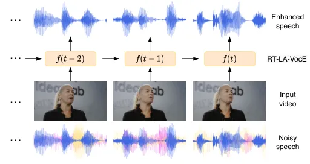
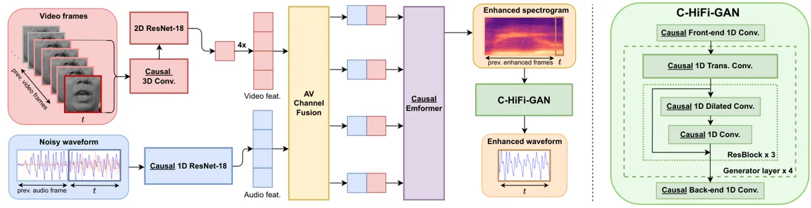

iliation=1\]HonglieChen^(∗) iliation=2\]RodrigoMira^(∗)
iliation=1,2\]StavrosPetridis iliation=1,2\]MajaPantic

# RT-LA-VocE: Real-Time Low-SNR Audio-Visual Speech Enhancement

###### Abstract

In this paper, we aim to generate clean speech frame by frame from a
live video stream and a noisy audio stream without relying on future
inputs. To this end, we propose RT-LA-VocE, which completely re-designs
every component of LA-VocE, a state-of-the-art non-causal audio-visual
speech enhancement model, to perform causal real-time inference with a
40 ms input frame. We do so by devising new visual and audio encoders
that rely solely on past frames, replacing the Transformer encoder with
the Emformer, and designing a new causal neural vocoder _C-HiFi-GAN_. On
the popular AVSpeech dataset, we show that our algorithm achieves
state-of-the-art results in all real-time scenarios. More importantly,
each component is carefully tuned to minimize the algorithm latency to
the theoretical minimum (40 ms) while maintaining a low end-to-end
processing latency of 28.15 ms per frame, enabling real-time
frame-by-frame enhancement with minimal delay.

###### keywords

Audio-visual, speech enhancement, real-time, emformer, neural vocoder

^(†)^(†)address: ¹Meta AI, UK  ²Imperial College London, UK
^(†)^(†)email: hongliechen@meta.com, {rs2517, stavros.petridis04,
m.pantic}@imperial.ac.uk^(†)^(†) ^(∗)Equal contribution.

## 1 Introduction

When conversing in the real world, our speech is often mixed with other
undesirable signals, such as noise from cars on the road, or another
conversation happening nearby. For this reason, the concept of noise
reduction in real time has long been considered an attractive prospect
for modern speech transmission frameworks \[1\]. With this in mind,
several deep learning-based methods have recently been proposed to
tackle this challenge by adapting existing non-causal models \[2\] or
designing new architectures tailored specifically for real-time
enhancement \[3, 4\]. These models achieve impressive noise reduction
performance in high-SNR (signal-to-noise ratio) environments but do not
experiment with substantially noisier scenarios, where the performance
of audio-only models often sharply deteriorates \[5, 6, 7\].
Furthermore, these single-channel audio-only models are unable to remove
interfering speech in a multi-talker environment, limiting their
potential applications.



Figure 1: RT-LA-VocE’s real-time audio-visual speech enhancement
approach. The model processes 40 ms frames in real time.

In recent years, the increased bandwidth of modern devices has paved the
way for video streaming as a ubiquitous form of communication,
particularly in professional environments \[8\]. Compared to audio-only
pipelines, video streaming adds a visual stream of the speaker’s face,
which can contain valuable verbal information, as demonstrated by
various studies in audio-visual learning \[9, 10\]. In light of this,
emerging approaches have borrowed from speech enhancement and lipreading
literature to develop real-time audio-visual speech enhancement (AVSE)
frameworks that effectively outperform their audio-only
counterparts \[11, 12, 13, 14\]. Most works focus on real-time inference
on edge devices equipped with low-end CPUs, such as \[15, 16, 17\],
which present a real-time AVSE model trained on studio-recorded datasets
(GRID \[18\] and TCD-TIMIT \[19\]), and \[20\], which extends an
existing real-time speech enhancement model \[4\] by adding a
lightweight video encoder and a multi-stage fusion module.
Alternatively, \[21\] proposes a transformed-based model running on a
high-end GPU, leveraging the target speaker’s facial landmarks. These
real-time audio-visual approaches succeed in outperforming their
audio-only counterparts, but fail to experiment with low-SNR scenarios
featuring multiple interfering speakers and do not directly attempt to
compete with non-causal AVSE models \[11, 12, 13, 14, 22\]. More
importantly, existing AVSE models are limited in terms of deployment as
they benchmark inference speed on long sequences, _e.g._, 10s in \[21\]
and 3s in \[20\], and do not report the model’s processing latency per
frame. In fact, frame-by-frame enhancement, which is necessary for
online enhancement in real-world scenarios, is almost entirely neglected
by existing real-time AVSE works in both their methodology and
experimental procedure.

To bridge the aforementioned gaps, we aim to explore real-time low-SNR
audio-visual speech enhancement with minimal frame-by-frame latency
(shown in Figure 1), enabling live noise reduction in real-word video
streaming systems. To this end, we develop a causal AVSE model based on
the state-of-the-art non-causal model LA-VocE \[22\], which consists of
a large Transformer-based spectrogram enhancer and a neural vocoder
(HiFi-GAN V1 \[23\]). We do so by building new, fully causal video and
audio encoders, replacing the transformer with the recently proposed
Emformer \[24\] and proposing a new vocoder – _C-HiFi-GAN_ – which can
synthesize raw waveforms from spectrograms without depending on future
information.

Concretely, we make the following contributions: (i) We introduce a
novel causal AVSE architecture designed for low-SNR conditions -
RT(Real-Time)-LA-VocE; (ii) we outperform all other causal approaches
and perform competitively with the state-of-the-art non-causal models;
more importantly (iii), we reduce the algorithm latency to the minimum
for real-time AVSE models, _i.e._, 1 video frame (40 ms), so a
negligible delay is introduced during real-time inference; and finally
(iv), we achieve a total processing latency of 28.15 ms per frame,
considerably less than the time needed to obtain the next frame (40 ms)
on a server-side GPU, demonstrating the model’s capability for
real-world streaming applications.

## 2 Methodology



Figure 2: Detailed overview of RT-LA-VocE’s inference pipeline for each
time-step $`t`$ (40 ms). RT-LA-VocE receives five video frames, which
are passed through our ResNet-based visual encoder, and two raw audio
frames, which are encoded via our causal 1D ResNet-18. The resulting
features are concatenated channel-wise and fed into the Emformer, which
models the temporal dynamics with previous time-steps. This is followed
by a linear layer that predicts the four enhanced spectrogram frames.
Finally, these frames are combined with past predictions and fed into
_C-HiFi-GAN_, which generates the corresponding waveform.

### 2.1 LA-VocE

We start by describing the multi-stage approach introduced in LA-VocE
which consists of an audio-visual spectrogram enhancer and an adapted
version of HiFi-GAN V1 \[23\]. In the first stage, given a video clip
and a spectrogram, the visual and auditory representations are computed
using a 2D ResNet-18 preceded by a 3D front-end layer (as in \[9\]) and
a linear encoder, respectively. To jointly model both modalities, the
two sets of features are concatenated channel-wise and passed through a
12-block Transformer encoder \[25\]. The output from the Transformer is
then fed to a linear projection layer to generate the enhanced
spectrogram. This model is trained by minimising the L1 loss between the
enhanced and clean spectrograms. In the second stage, a neural vocoder
is leveraged to translate the enhanced spectrogram into a waveform -
HiFi-GAN V1 \[23\]. In short, HiFi-GAN’s generator is a fully
convolutional neural network consisting of 4 blocks of transposed
convolutional layers and multi-receptive field fusion modules (MRF). It
is trained using a combination of comparative and adversarial losses,
which leverage an essemble of multi-period and multi-scale
discriminators.

Limitations. The goal of this paper is to enable real-time speech
enhancement with minimal latency, _i.e._, to produce a causal model that
can sequentially generate enhanced audio frame by frame from a live
audio-visual stream without relying on future inputs. To achieve this,
the most straightforward solution is to naïvely send frame-by-frame
inputs to the original LA-VocE. However, this model is designed to rely
heavily on future information along several modules, namely: the 3D
convolution in the visual encoder, which leverages 2 future video
frames; the STFT (short-time Fourier transform) used to compute the
mel-spectrogram, whose window extends 15 ms into the future; the
multi-head attention layers in the spectrogram enhancer, where the
output for time-step $`t`$ depends on all past and future time-steps;
and the HiFi-GAN, whose convolutions gradually bleed future information
into their outputs. Therefore, this naïve approach leads to severly
deteriorated performance, as we will demonstrate in Table 3.

### 2.2 Real-time LA-VocE

To resolve these challenges, the model should be constrained to depend
exclusively on past information. In this section, we describe our key
changes to each module of the original LA-VocE and show our proposed
RT-LA-VocE is completely causal with minimal algorithm latency. In
Figure 2, we illustrate our end-to-end real-time inference pipeline in
detail.

Video encoder. As proposed in \[26\], a convolutional layer can be made
causal by adding $`p_{conv}`$ padding frames to the left of the input
and removing an equivalent amount of frames from the right of the output
(to maintain the same output dimension):

```math
\displaystyle p_{conv}=\lfloor\frac{k}{2}\rfloor\cdot d, \tag{1}
```

where $`k`$ and $`d`$ denote the kernel size and dilation of the
convolution, respectively. As shown in Figure 2, we conduct this change
on the $`3`$D convolution in the video encoder, which creates a causal
model that depends only on past video frames. This change reduces the
algorithm latency of the video encoder from 120 ms (3 frames) to 40 ms
(1 frame).

Audio encoder. LA-VocE encodes audio by converting the raw waveform into
a mel-spectrogram, and applying a linear layer on the resulting
magnitudes. The STFT operation used to obtain the mel-spectrogram
introduces extra algorithm latency since the input raw waveform is
padded on both sides by $`p_{stft}`$:

```math
\displaystyle p_{stft}=\frac{w-h}{2}, \tag{2}
```

where $`w`$ specifcies the window size (40 ms) and $`h`$ specifies the
hop size (10 ms), meaning that the STFT window depends on 15 ms of
future information. There are two potential solutions to remove this
extra latency : i) pad the left side of the waveform by $`2p`$
(analogous to the convolution trick mentioned above); or ii) apply a
causal encoder on the raw waveform instead. We adapt the 1D ResNet-18
from \[10\] using the causal padding trick on all convolutions to form
an entirely causal raw audio encoder. We also increase the temporal
resolution from 25 Hz (one audio feature per video frame) to 100 Hz
(four audio features per video frame) by adjusting the kernel size and
stride in the final pooling layer. We compare these causal encoder
variants in Table 2.

Emformer. In addition to the convolutional layers mentioned above, the
Transformer encoder also explicitly takes into account future
information via the multi-head attention operation. In order to achieve
a causal temporal encoder, we replace the Transformer encoder with the
recently proposed Emformer \[24\]. It adapts the original Transformer
architecture for causal inference by computing attention over the
current frame and a sequence of previous frames known as the left
context, removing the attention layers’ reliance on future time-steps.

C-HiFi-GAN. Similar to the 3D layer in the video encoder, the
convolutions and transposed convolutions in HiFi-GAN also leak future
information into the temporal representations, making the model
non-causal. We design _C-HiFi-GAN_ (Causal HiFi-GAN) by employing the
causal padding trick for all convolutions in each MRF module of the
original HiFi-GAN V1, as well as the four transposed convolutions by
padding with:

```math
\displaystyle p_{conv_{trans}}=\lfloor\frac{s}{2}\rfloor+s\bmod 2, \tag{3}
```

where $`s`$ denotes the stride of the transposed convolution.

## 3 Experimental Setup

### 3.1 Datasets and evaluation metrics

Following the original LA-VocE \[22\], we sample clean and interfering
speech from AVSpeech \[27\] and noise from the DNS challenge noise
dataset \[28\]. For consistency, we use the same train/test split as the
original LA-VocE. The level of speech interference (_i.e._, audio from
other speakers in the background) and background noise are controlled by
the signal-to-interference ratio (SIR) and signal-to-noise ratio (SNR),
respectively:

```math
\displaystyle\text{SIR}=\frac{P_{signal}}{P_{interference}}, \displaystyle\qquad\qquad\quad\text{SNR}=\frac{P_{signal}}{P_{noise}}, \tag{4}
```

where $`P_{x}`$ refers to the power of the raw signal $`x`$. We follow
the approach in \[22\] to crop the 96$`\times`$96-sized mouth region
from each video¹¹ 1 Only non-Meta authors conducted any of the dataset
preprocessing (no dataset pre-processing took place on Meta’s servers or
facilities).. Additionally, a low-latency causal mouth cropping pipeline
is created using MediaPipe \[29\]. We compare these two methods for
real-time inference in Table 4. We measure speech quality using
MCD \[30\], PESQ-WB \[31\], and ViSQOL \[32\], and speech
intelligibility using STOI \[33\] and its extended version ESTOI \[34\].
Unlike \[22\], we present the raw metrics computed on the enhanced
samples rather than the improvement over the noisy baseline to clearly
illustrate their similarity with the clean speech in absolute terms. We
evaluate all models under the same three noise conditions 1, 2, and 3
proposed in \[22\], featuring 1, 3, and 5 background noises at 0, -5,
and -10 dB, and 1, 2, and 3 interfering speakers at 0, -5, and -10 dB
SIR, respectively.

### 3.2 Comparison models

We compare our work with three non-causal AVSE models: LA-VocE \[22\],
MuSE \[11\], and VisualVoice \[12\]. In addition, we adapt two speech
enhancement models – GCRN \[35\] and Demucs \[36\] – for real-time
audio-visual enhancement by adding a causal ResNet-based encoder to
each, as in our model, and concatenating the resulting visual features
with the audio features in the bottleneck, as in \[22\]. We use the
causal version of Demucs presented in \[2\]. We also compare with two
real-time audio-only models: GCRN and an audio-only version of
RT-LA-VocE, where we remove the visual stream entirely. All models are
trained on the dataset presented in Section 3.1 with optimization
parameters based on the ones used for our spectrogram enhancer
(described in Section 4). As in \[22\], MuSE is trained using the loss
ensemble proposed in \[36\].

### 3.3 Implementation details

| Model        | Input | Online |     (ms)Proc. latency     | Noise condition 1 |                  |                    |                  |                   | Noise condition 2 |                  |                    |                  |                   | Noise condition 3 |                  |                    |                  |                   |
| ------------ | ----- | ------ | ------------------------- | ----------------- | ---------------- | ------------------ | ---------------- | ----------------- | ----------------- | ---------------- | ------------------ | ---------------- | ----------------- | ----------------- | ---------------- | ------------------ | ---------------- | ----------------- |
|              |       |        |                           | MCD$`\downarrow`$ | PESQ$`\uparrow`$ | ViSQOL$`\uparrow`$ | STOI$`\uparrow`$ | ESTOI$`\uparrow`$ | MCD$`\downarrow`$ | PESQ$`\uparrow`$ | ViSQOL$`\uparrow`$ | STOI$`\uparrow`$ | ESTOI$`\uparrow`$ | MCD$`\downarrow`$ | PESQ$`\uparrow`$ | ViSQOL$`\uparrow`$ | STOI$`\uparrow`$ | ESTOI$`\uparrow`$ |
| Baseline     | \-    | \-     | \-                        | 10.81             | 1.088            | 1.168              | 0.545            | 0.367             | 12.05             | 1.105            | 1.053              | 0.386            | 0.195             | 12.47             | 1.160            | 1.035              | 0.281            | 0.093             |
| AV-GCRN      | AV    | ✗      | \-                        | 9.297             | 1.514            | 1.710              | 0.773            | 0.614             | 10.457            | 1.215            | 1.483              | 0.630            | 0.424             | 10.989            | 1.112            | 1.271              | 0.462            | 0.245             |
| AV-Demucs    | AV    | ✗      | \-                        | 5.260             | 1.818            | 1.852              | 0.813            | 0.661             | 6.522             | 1.383            | 1.484              | 0.692            | 0.495             | 7.608             | 1.172            | 1.334              | 0.543            | 0.323             |
| MuSE         | AV    | ✗      | \-                        | 5.282             | 1.875            | 1.847              | 0.821            | 0.666             | 6.736             | 1.402            | 1.462              | 0.694            | 0.484             | 8.285             | 1.171            | 1.277              | 0.512            | 0.275             |
| VisualVoice  | AV    | ✗      | \-                        | 6.869             | 1.689            | 1.815              | 0.794            | 0.637             | 8.515             | 1.272            | 1.419              | 0.637            | 0.431             | 9.806             | 1.114            | 1.283              | 0.460            | 0.252             |
| LA-VocE      | AV    | ✗      | \-                        | 4.177             | 2.017            | 2.265              | 0.839            | 0.700             | 5.217             | 1.621            | 1.743              | 0.765            | 0.592             | 6.320             | 1.317            | 1.480              | 0.651            | 0.451             |
| RT-GCRN      | A     | ✓      | 4.12$`\pm`$0.10           | 11.275            | 1.129            | 1.260              | 0.495            | 0.327             | 11.682            | 1.102            | 1.212              | 0.362            | 0.176             | 12.066            | 1.151            | 1.238              | 0.257            | 0.086             |
| RT-LA-VocE   | A     | ✓      | 17.80$`\pm`$0.03          | 8.761             | 1.148            | 1.205              | 0.490            | 0.315             | 9.934             | 1.112            | 1.115              | 0.376            | 0.172             | 10.585            | 1.166            | 1.119              | 0.293            | 0.086             |
| RT-AV-GCRN   | AV    | ✓      | 6.56$`\pm`$0.15           | 9.713             | 1.496            | 1.691              | 0.769            | 0.607             | 10.675            | 1.209            | 1.472              | 0.622            | 0.416             | 11.087            | 1.117            | 1.262              | 0.452            | 0.237             |
| RT-AV-Demucs | AV    | ✓      | 4.87$`\pm`$0.13           | 6.228             | 1.408            | 1.464              | 0.729            | 0.550             | 7.363             | 1.202            | 1.281              | 0.591            | 0.375             | 8.361             | 1.108            | 1.239              | 0.443            | 0.222             |
| RT-LA-VocE   | AV    | ✓      | 20.88$`\pm`$0.04          | 4.653             | 1.741            | 2.050              | 0.800            | 0.649             | 5.737             | 1.402            | 1.615              | 0.701            | 0.516             | 6.799             | 1.199            | 1.402              | 0.568            | 0.365             |

Table 1: Comparison between RT-LA-VocE and other speech enhancement
methods for different noise conditions. The best results for offline
inference (among the non-causal models) are underlined, and the best
online results (among the causal models) are highlighted in bold. “Proc.
latency” denotes the processing latency per frame (40 ms) during
inference.

| Audio encoder                | Temporal model          | Spec. inv. method | MCD $`\downarrow`$ | PESQ $`\uparrow`$ | ViSQOL $`\uparrow`$ | STOI $`\uparrow`$ | ESTOI $`\uparrow`$ | Alg. latency (ms) | Proc. latency (ms) | \# Params (M) |
| ---------------------------- | ----------------------- | ----------------- | ------------------ | ----------------- | ------------------- | ----------------- | ------------------ | ----------------- | ------------------ | ------------- |
| Spec. + lin. layer           | Emformer ($`l_{c}=32`$) | Noisy phase       | 6.342              | 1.278             | 1.457               | 0.589             | 0.39               | 55 (40 + 15)      | 13.65$`\pm`$0.13   | 96.6          |
| Mel-spec. + lin. layer       | Emformer ($`l_{c}=32`$) | Noisy phase       | 5.962              | 1.33              | 1.54                | 0.651             | 0.448              | 55 (40 + 15)      | 19.07$`\pm`$0.25   | 96.3          |
| Mel-spec. + lin. layer       | Emformer ($`l_{c}=32`$) | Griffin-Lim       | 6.468              | 1.236             | 1.39                | 0.636             | 0.446              | 55 (40 + 15)      | 30.86$`\pm`$0.31   | 96.3          |
| Mel-spec. + lin. layer       | Emformer ($`l_{c}=32`$) | C-HiFi-GAN        | 5.906              | 1.391             | 1.567               | 0.694             | 0.504              | 55 (40 + 15)      | 18.81$`\pm`$0.04   | 110           |
| Causal mel-spec.+ lin. layer | Emformer ($`l_{c}=32`$) | C-HiFi-GAN        | 6.145              | 1.302             | 1.463               | 0.645             | 0.456              | 40                | 19.44$`\pm`$0.04   | 110           |
| Causal 1D ResNet (25 Hz)     | Emformer ($`l_{c}=32`$) | C-HiFi-GAN        | 5.988              | 1.261             | 1.421               | 0.614             | 0.436              | 40                | 19.86$`\pm`$0.04   | 114           |
| Causal 1D ResNet (100 Hz)    | Emformer ($`l_{c}=32`$) | C-HiFi-GAN        | 5.752              | 1.397             | 1.592               | 0.696             | 0.510              | 40                | 20.01$`\pm`$0.04   | 114           |
| Causal 1D ResNet (100 Hz)    | Emformer ($`l_{c}=64`$) | C-HiFi-GAN        | 5.737              | 1.402             | 1.615               | 0.701             | 0.516              | 40                | 20.88$`\pm`$0.04   | 114           |

Table 2: Ablation on the main architectural components of RT-LA-VocE
(noise condition 2). $`l_{c}`$ denotes left context length.

| Backbone    |            | Online         | MCD $`\downarrow`$ | PESQ $`\uparrow`$ | ViSQOL $`\uparrow`$ | STOI $`\uparrow`$ | ESTOI $`\uparrow`$ |
| ----------- | ---------- | -------------- | ------------------ | ----------------- | ------------------- | ----------------- | ------------------ |
| Temp.       | Spec. inv. |                |                    |                   |                     |                   |                    |
| Transformer | HiFi-GAN   | ✗              | 5.248              | 1.64              | 1.826               | 0.77              | 0.606              |
| Transformer | C-HiFi-GAN | ✗              | 5.285              | 1.633             | 1.815               | 0.773             | 0.602              |
| Emformer    | HiFi-GAN   | ✗              | 5.696              | 1.422             | 1.628               | 0.710             | 0.527              |
| Emformer    | C-HiFi-GAN | ✗              | 5.737              | 1.402             | 1.615               | 0.701             | 0.516              |
| Transformer | HiFi-GAN   | $`\checkmark`$ | 12.394             | 1.073             | 1.052               | 0.125             | 0.036              |
| Transformer | C-HiFi-GAN | $`\checkmark`$ | 12.502             | 1.09              | 1.035               | 0.12              | 0.034              |
| Emformer    | HiFi-GAN   | $`\checkmark`$ | 6.027              | 1.299             | 1.445               | 0.687             | 0.502              |
| Emformer    | C-HiFi-GAN | $`\checkmark`$ | 5.737              | 1.402             | 1.615               | 0.701             | 0.516              |

Table 3: Online and offline inference results with causal and non-causal
models (noise condition 2).

| Mouth crop. method | Latency (ms)     | MCD$`\downarrow`$ | PESQ $`\uparrow`$ | ViSQOL$`\downarrow`$ | STOI $`\uparrow`$ | ESTOI$`\downarrow`$ |
| ------------------ | ---------------- | ----------------- | ----------------- | -------------------- | ----------------- | ------------------- |
| LA-VocE \[22\]     | 92.65$`\pm`$2.56 | 5.737             | 1.402             | 1.615                | 0.701             | 0.516               |
| MediaPipe \[29\]   | 7.27$`\pm`$0.07  | 5.910             | 1.380             | 1.577                | 0.689             | 0.503               |

Table 4: Quantitative results on different mouth crops (noise condition
2). LA-VocE’s crops are smoothed using future frames, while MediaPipe’s
crops are completely causal.

Architectural Details. We use window size 640, hop size 160, frequency
bin size 640, and 80 mel bands to compute the mel-spectrograms. Our
Emformer consists of 12 blocks featuring 12 attention heads, a hidden
unit dimension of 768, a segment length of 4, a left context length of
64 and a memory bank length of 0. Note, in our experiments, no
noticeable improvement was observed with memory bank lengths $`>`$ 0. We
use 4 blocks of transposed convolutional layers in _C-HiFi-GAN_ with
upsampling factors of $`8\times`$, $`5\times`$, $`2\times`$, and
$`2\times`$. MRF is made of 3 residual blocks featuring dilated and
non-dilated convolutional layers with kernel sizes $`3`$, $`7`$, and
$`11`$. During testing, each input audio frame’s duration is 40 ms,
_i.e._, a single video frame.

Training curriculum. To train the spectrogram enhancer, we use AdamW
with learning rate $`7\times 10^{-4}`$, $`\beta_{1}=0.9`$,
$`\beta_{2}=0.98`$, and weight decay $`3\times 10^{-2}`$. We train for
150 epochs using linear learning rate warmup for the first 10 % of
training, and applying a cosine decay schedule for the remaining epochs.
Separately, we train _C-HiFi-GAN_ using AdamW with learning rate
$`2\times 10^{-4}`$, $`\beta_{1}=0.8`$, and $`\beta_{2}=0.99`$. We train
for a total of $`1`$M steps while decaying the learning rate by a factor
of $`0.999`$ after each epoch. During training, we apply standard data
augmentations such as random cropping, horizontal flipping, erasing, and
time masking, as in \[22\]. The latencies in the following section are
measured on an NVIDIA RTX 2080 Ti GPU with an Intel Core i7-9700K CPU,
and averaged over 1000 inference steps.

## 4 Results

### 4.1 Comparison with the state-of-the-art

We compare our results with recent causal and non-causal speech
enhancement models across three challenging noise conditions in Table 1.
Overall, it is clear that RT-LA-VocE yields substantial improvements
compared to the noisy baseline, halving the MCD and achieving relative
improvements greater than 50 % for STOI and ESTOI throughout all 3 noise
conditions. Conversely, RT-AV-GCRN and RT-AV-Demucs are only able to
achieve considerable improvements for noise condition 1 and feature a
sharp decline in noise conditions 2 and 3. While RT-LA-VocE does not
exactly match LA-VocE’s performance, it is remarkably competitive with
this state-of-the-art model on both quality and intelligibility without
leveraging any future information. Furthermore, RT-LA-VocE outperforms
two recent non-causal models (AV-GCRN and VisualVoice) across all noise
conditions, and is competitive with AV-Demucs and MuSE, achieving better
performance on noise conditions 2 and 3. Finally, we highlight that both
audio-only speech enhancement models fail to achieve noticeable
improvements in quality or intelligibility. Indeed, as mentioned in
Section 1, with only a single stream of audio these models are unable to
distinguish the target signal from the interfering speech.

### 4.2 Ablation study

Architecture. To validate our architectural design, we first compare
spectrogram variants and inversion methods in the top half of Table 2.
We experiment with two different types of spectrogram as input for our
linear encoder: mel-spectrogram (as in \[22\]) and linear spectrogram.
We find that the mel-spectrogram input yields better results across all
metrics. In addition, we compare _C-HiFi-GAN_ with two common
spectrogram inversion methods – Griffin-Lim \[37\], and noisy phase
reconstruction (as in \[38\]). We find that both methods are slower than
_C-HiFi-GAN_ and are unable to match its quality and intelligibility. In
the bottom half of Table 2, in an attempt to eliminate the algorithm
latency introduced by the mel-spectrogram input (15 ms), we further
propose three causal audio encoders - a causal mel-spectrogram that
leverages the causal padding trick, and two causal 1D ResNets that
operate on the raw audio instead (see Section 2.2). We conclude that the
100 Hz ResNet achieves the best results and even outperforms the
original mel-spectrogram encoder, while reducing the algorithm latency
by 15 ms. Finally, we show that increasing the left context length of
the Emformer from 32 to 64 yields considerable improvements in
performance while having negligible impact on the latency.

Causal vs. non-causal components. We compare the causal and non-causal
versions of the temporal encoder (Emformer and Transformer) and neural
vocoder (_C-HiFi-GAN_ and HiFi-GAN) using two inference modes in
Table 3. In offline inference, the enhanced speech is computed using the
entire audio-visual input, as in \[22\]. In online inference, which is
the focus of our work, the enhanced audio is generated frame by frame
and can only leverage past inputs, as in Figure 1. As expected, we
observe that the Transformer and HiFi-GAN surpass their causal
counterparts in offline inference, but underperform when generating
audio online, since they can no longer leverage future information. In
contrast, the Emformer and _C-HiFi-GAN_ achieve the same performance in
both inference modes since they leverage only past frames, and achieve
the best online inference results by a wide margin. This highlights the
need to design causal modules, rather than naïvely leveraging the
non-causal components presented in \[22\] for real-time enhancement.

### 4.3 End-to-end real-time enhancement

Low-latency mouth cropping. In the experiments presented above, we
obtain the mouth crops following the pipeline presented in
LA-VocE \[22\], which has an average latency of 92.65 ms. In Table 4, we
explore whether our trained models can produce high-quality speech using
mouth crops generated by a causal low-latency (7.3 ms per frame) mouth
cropping pipeline based on MediaPipe \[29\]. We find that the
performance difference between these two methods is marginal (roughly
2 %), which shows that RT-LA-VocE can effectively adapt to the videos
produced by MediaPipe without a significant loss in performance.

Total processing latency. Given RT-LA-VocE’s and MediaPipe’s latencies
per frame (20.88 ms and 7.27 ms, respectively), our end-to-end pipeline
has a total processing latency of 28.15 ms per frame. This is
considerably lower than the time it takes to obtain the next frame
(_i.e._, 40 ms), meaning that we can perform real-time enhancement
without accumulating delays at each time-step.

## 5 Conclusion

In this paper, we present RT-LA-VocE, a real-time audio-visual speech
enhancement model that adapts the original LA-VocE \[22\] for causal
inference. Our proposed architecture sets a new state-of-the-art for
real-time AVSE, and is competitive with the original LA-VocE during
offline inference, despite not relying on future information.
Furthermore, our findings show that RT-LA-VocE can be leveraged via a
server-side GPU to enhance noisy speech in live video streams with
minimal processing latency ($`<`$ 30 ms).

## 6 References

\AtNextBibliography

## References

- \[1\] Jacob Benesty et al. “Speech enhancement” Springer Science &
  Business Media, 2006
- \[2\] Alexandre D“’efossez et al. “Real Time Speech Enhancement in the
  Waveform Domain” In _Interspeech_ ISCA, 2020, pp. 3291–3295 DOI:
  [10.21437/Interspeech.2020-2409](https://dx.doi.org/10.21437/Interspeech.2020-2409)
- \[3\] Ashutosh Pandey and DeLiang Wang “TCNN: Temporal Convolutional
  Neural Network for Real-time Speech Enhancement in the Time Domain” In
  _ICASSP_ IEEE, 2019, pp. 6875–6879 DOI:
  [10.1109/ICASSP.2019.8683634](https://dx.doi.org/10.1109/ICASSP.2019.8683634)
- \[4\] Manthan Thakker et al. “Fast Real-time Personalized Speech
  Enhancement: End-to-End Enhancement Network (E3Net) and Knowledge
  Distillation” In _Interspeech_ ISCA, 2022, pp. 991–995 DOI:
  [10.21437/Interspeech.2022-10962](https://dx.doi.org/10.21437/Interspeech.2022-10962)
- \[5\] Tian Gao et al. “Improving Deep Neural Network Based Speech
  Enhancement in Low SNR Environments” In _LVA/ICA_ 9237, Lecture Notes
  in Computer Science Springer, 2015, pp. 75–82 DOI:
  [10.1007/978-3-319-22482-4˙9](https://dx.doi.org/10.1007/978-3-319-22482-4_9)
- \[6\] Lachlan Birnie et al. “Noise RETF Estimation and Removal for Low
  SNR Speech Enhancement” In _MLSP_ IEEE, 2021, pp. 1–6 DOI:
  [10.1109/MLSP52302.2021.9596209](https://dx.doi.org/10.1109/MLSP52302.2021.9596209)
- \[7\] Xiang Hao et al. “UNetGAN: A Robust Speech Enhancement Approach
  in Time Domain for Extremely Low Signal-to-Noise Ratio Condition” In
  _Interspeech_ ISCA, 2019, pp. 1786–1790 DOI:
  [10.21437/Interspeech.2019-1567](https://dx.doi.org/10.21437/Interspeech.2019-1567)
- \[8\] Katherine. Karl et al. “Virtual Work Meetings During the
  COVID-19 Pandemic: The Good, Bad, and Ugly” In _Small Group Research_
  53.3, 2022, pp. 343–365 DOI:
  [10.1177/10464964211015286](https://dx.doi.org/10.1177/10464964211015286)
- \[9\] Stavros Petridis et al. “End-to-End Audiovisual Speech
  Recognition” In _ICASSP_ IEEE, 2018, pp. 6548–6552 DOI:
  [10.1109/ICASSP.2018.8461326](https://dx.doi.org/10.1109/ICASSP.2018.8461326)
- \[10\] Alexandros Haliassos et al. “Jointly Learning Visual and
  Auditory Speech Representations from Raw Data” In _The Eleventh
  International Conference on Learning Representations, ICLR 2023,
  Kigali, Rwanda, May 1-5, 2023_ OpenReview.net, 2023 URL:
  [https://openreview.net/pdf?id=BPwIgvf5iQ](https://openreview.net/pdf?id=BPwIgvf5iQ)
- \[11\] Zexu Pan et al. “Muse: Multi-Modal Target Speaker Extraction
  with Visual Cues” In _ICASSP_ IEEE, 2021, pp. 6678–6682 DOI:
  [10.1109/ICASSP39728.2021.9414023](https://dx.doi.org/10.1109/ICASSP39728.2021.9414023)
- \[12\] Ruohan Gao and Kristen Grauman “VisualVoice: Audio-Visual
  Speech Separation With Cross-Modal Consistency” In _CVPR_ IEEE, 2021,
  pp. 15495–15505 DOI:
  [10.1109/CVPR46437.2021.01524](https://dx.doi.org/10.1109/CVPR46437.2021.01524)
- \[13\] Karren Yang et al. “Audio-Visual Speech Codecs: Rethinking
  Audio-Visual Speech Enhancement by Re-Synthesis” In _CVPR_ IEEE, 2022,
  pp. 8217–8227 DOI:
  [10.1109/CVPR52688.2022.00805](https://dx.doi.org/10.1109/CVPR52688.2022.00805)
- \[14\] Wei-Ning Hsu et al. “ReVISE: Self-Supervised Speech Resynthesis
  With Visual Input for Universal and Generalized Speech Regeneration”
  In _CVPR_ IEEE, 2023, pp. 18795–18805
- \[15\] Mandar Gogate et al. “CochleaNet: A robust language-independent
  audio-visual model for real-time speech enhancement” In _Inf. Fusion_
  63, 2020, pp. 273–285 DOI:
  [10.1016/j.inffus.2020.04.001](https://dx.doi.org/10.1016/j.inffus.2020.04.001)
- \[16\] Mandar Gogate et al. “Towards Robust Real-time Audio-Visual
  Speech Enhancement” In _arXiv_ abs/2112.09060, 2021 arXiv:
  [https://arxiv.org/abs/2112.09060](https://arxiv.org/abs/2112.09060)
- \[17\] Mandar Gogate et al. “Towards real-time privacy-preserving
  audio-visual speech enhancement” In _SPSC_ ISCA, 2022, pp. 7–10 DOI:
  [10.21437/SPSC.2022-2](https://dx.doi.org/10.21437/SPSC.2022-2)
- \[18\] Martin Cooke et al. “An audio-visual corpus for speech
  perception and automatic speech recognition (L)” In _The Journal of
  the Acoustical Society of America_ 120, 2006, pp. 2421–4
- \[19\] N. Harte and E. Gillen “TCD-TIMIT: An Audio-Visual Corpus of
  Continuous Speech” In _IEEE Transactions on Multimedia_ 17.5, 2015,
  pp. 603–615
- \[20\] Zirun Zhu et al. “Real-Time Audio-Visual End-To-End Speech
  Enhancement” In _ICASSP_, 2023, pp. 1–5 DOI:
  [10.1109/ICASSP49357.2023.10094724](https://dx.doi.org/10.1109/ICASSP49357.2023.10094724)
- \[21\] Juan. Montesinos et al. “VoViT: Low Latency Graph-Based
  Audio-Visual Voice Separation Transformer” In _ECCV_ 13697 Springer,
  2022, pp. 310–326 DOI:
  [10.1007/978-3-031-19836-6˙18](https://dx.doi.org/10.1007/978-3-031-19836-6_18)
- \[22\] Rodrigo Mira et al. “LA-VocE: Low-SNR Audio-Visual Speech
  Enhancement Using Neural Vocoders” In _ICASSP_, 2023, pp. 1–5 DOI:
  [10.1109/ICASSP49357.2023.10096390](https://dx.doi.org/10.1109/ICASSP49357.2023.10096390)
- \[23\] Jungil Kong et al. “HiFi-GAN: Generative Adversarial Networks
  for Efficient and High Fidelity Speech Synthesis” In _NeurIPS_, 2020
  URL:
  [https://proceedings.neurips.cc/paper/2020/hash/c5d736809766d46260d816verbd8dbc9eb44-Abstract.html](https://proceedings.neurips.cc/paper/2020/hash/c5d736809766d46260d816verbd8dbc9eb44-Abstract.html)
- \[24\] Yangyang Shi et al. “Emformer: Efficient Memory Transformer
  Based Acoustic Model for Low Latency Streaming Speech Recognition” In
  _ICASSP_ IEEE, 2021, pp. 6783–6787 DOI:
  [10.1109/ICASSP39728.2021.9414560](https://dx.doi.org/10.1109/ICASSP39728.2021.9414560)
- \[25\] Ashish Vaswani et al. “Attention is All you Need” In _NeurIPS_
  30 Curran Associates, Inc., 2017 URL:
  [https://proceedings.neurips.cc/paper_files/paper/2017/file/3f5ee24354verb7dee91fbd053c1c4a845aa-Paper.pdf](https://proceedings.neurips.cc/paper_files/paper/2017/file/3f5ee24354verb7dee91fbd053c1c4a845aa-Paper.pdf)
- \[26\] A“”aron van Oord et al. “WaveNet: A Generative Model for Raw
  Audio” In _Speech Synthesis Workshop_ ISCA, 2016, pp. 125 URL:
  [http://www.isca-speech.org/archive/SSW_2016/abstracts/ssw9_DS-4_vaverbn_den_Oord.html](http://www.isca-speech.org/archive/SSW_2016/abstracts/ssw9_DS-4_vaverbn_den_Oord.html)
- \[27\] Ariel Ephrat et al. “Looking to listen at the cocktail party”
  In _ACM Transactions on Graphics (TOG)_ 37, 2018, pp. 1 –11 URL:
  [https://api.semanticscholar.org/CorpusID:215808493](https://api.semanticscholar.org/CorpusID:215808493)
- \[28\] Chandan Reddy et al. “The INTERSPEECH 2020 deep noise
  suppression challenge: Datasets, subjective testing framework, and
  challenge results” In _INTERSPEECH_, 2020
- \[29\] Camillo Lugaresi et al. “MediaPipe: A Framework for Building
  Perception Pipelines” In _CoRR_ abs/1906.08172, 2019 arXiv:
  [http://arxiv.org/abs/1906.08172](http://arxiv.org/abs/1906.08172)
- \[30\] R. Kubichek “Mel-cepstral distance measure for objective speech
  quality assessment” In _Pacific Rim Conf. on Commun. Comput. and
  Signal Process._ 1, 1993, pp. 125–128 vol.1 DOI:
  [10.1109/PACRIM.1993.407206](https://dx.doi.org/10.1109/PACRIM.1993.407206)
- \[31\] Antony. Rix et al. “Perceptual evaluation of speech quality
  (PESQ)-a new method for speech quality assessment of telephone
  networks and codecs” In _ICASSP_, 2001 DOI:
  [10.1109/ICASSP.2001.941023](https://dx.doi.org/10.1109/ICASSP.2001.941023)
- \[32\] Michael Chinen et al. “ViSQOL v3: An Open Source Production
  Ready Objective Speech and Audio Metric” In _QoMEX_ IEEE, 2020, pp.
  1–6 DOI:
  [10.1109/QoMEX48832.2020.9123150](https://dx.doi.org/10.1109/QoMEX48832.2020.9123150)
- \[33\] Cees. Taal et al. “An Algorithm for Intelligibility Prediction
  of Time-Frequency Weighted Noisy Speech” In _IEEE Trans. Speech Audio
  Process._ 19.7, 2011, pp. 2125–2136 DOI:
  [10.1109/TASL.2011.2114881](https://dx.doi.org/10.1109/TASL.2011.2114881)
- \[34\] Jesper Jensen and Cees. Taal “An Algorithm for Predicting the
  Intelligibility of Speech Masked by Modulated Noise Maskers” In _ACM
  Trans. Audio Speech Lang. Process._ 24.11, 2016, pp. 2009–2022 DOI:
  [10.1109/TASLP.2016.2585878](https://dx.doi.org/10.1109/TASLP.2016.2585878)
- \[35\] Ke Tan and DeLiang Wang “Learning Complex Spectral Mapping With
  Gated Convolutional Recurrent Networks for Monaural Speech
  Enhancement” In _IEEE ACM Trans. Audio Speech Lang. Process._ 28,
  2020, pp. 380–390 DOI:
  [10.1109/TASLP.2019.2955276](https://dx.doi.org/10.1109/TASLP.2019.2955276)
- \[36\] Alexandre D“’efossez et al. “Music Source Separation in the
  Waveform Domain” In _arXiv_ abs/1911.13254, 2019 arXiv:
  [http://arxiv.org/abs/1911.13254](http://arxiv.org/abs/1911.13254)
- \[37\] Daniel. Griffin and Jae. Lim “Signal estimation from modified
  short-time Fourier transform” In _ICASSP_ IEEE, 1983, pp. 804–807 DOI:
  [10.1109/ICASSP.1983.1172092](https://dx.doi.org/10.1109/ICASSP.1983.1172092)
- \[38\] Aviv Gabbay et al. “Visual Speech Enhancement” In _Interspeech_
  ISCA, 2018, pp. 1170–1174 DOI:
  [10.21437/Interspeech.2018-1955](https://dx.doi.org/10.21437/Interspeech.2018-1955)
