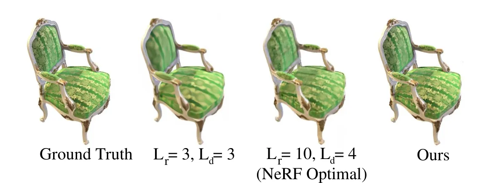
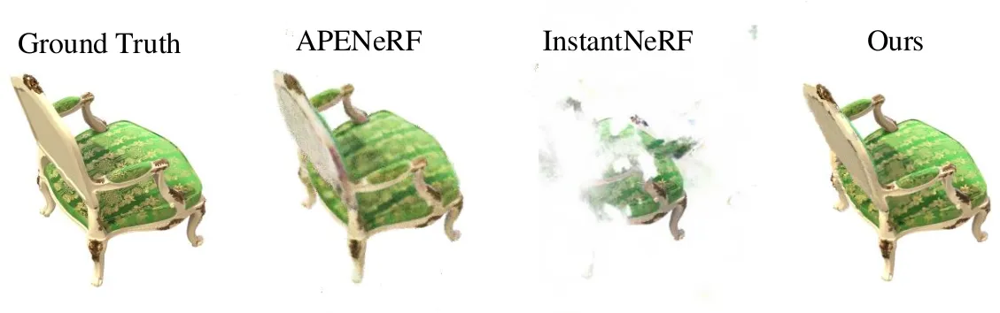
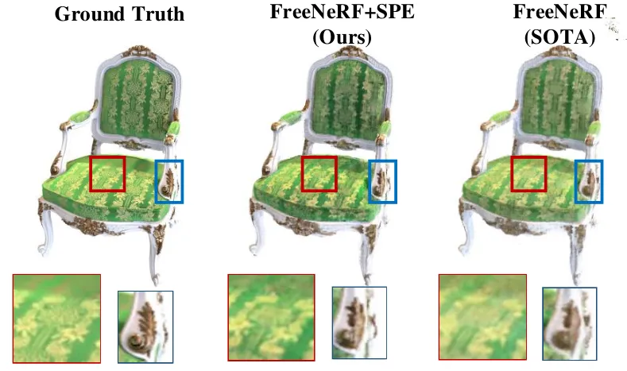
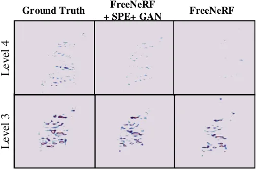
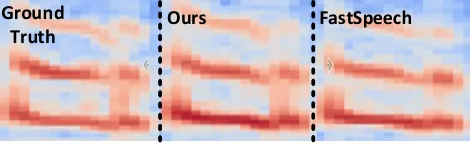
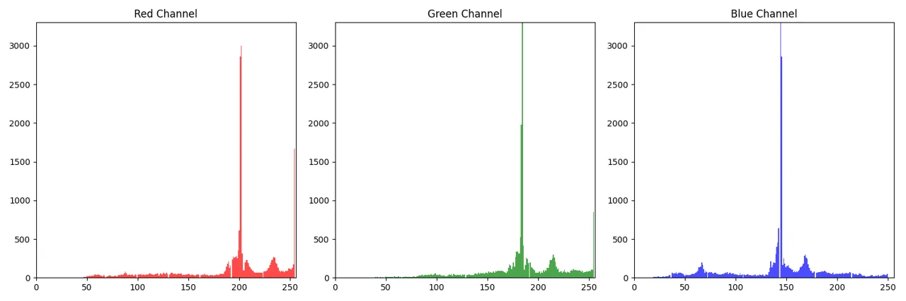
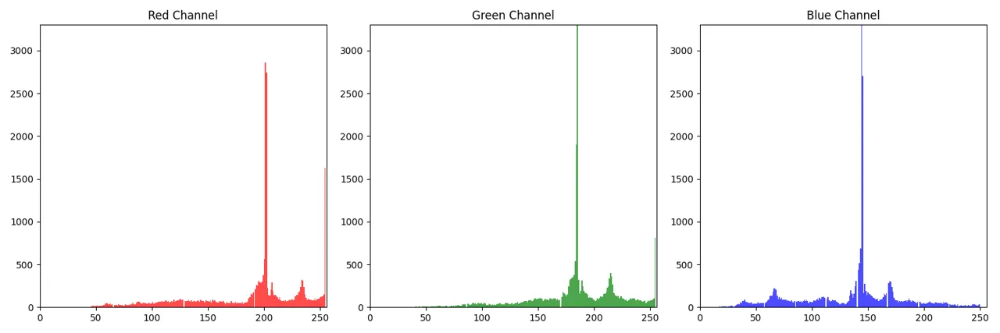
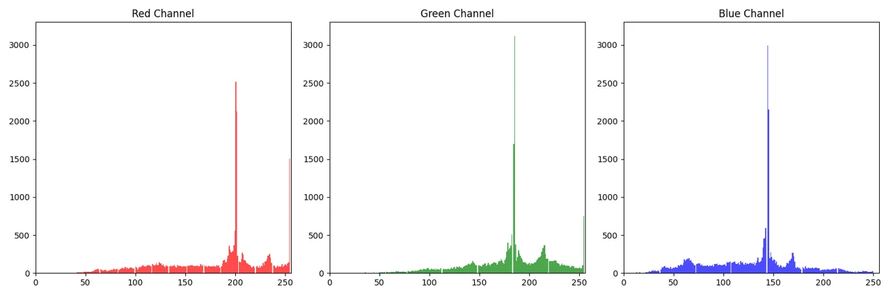
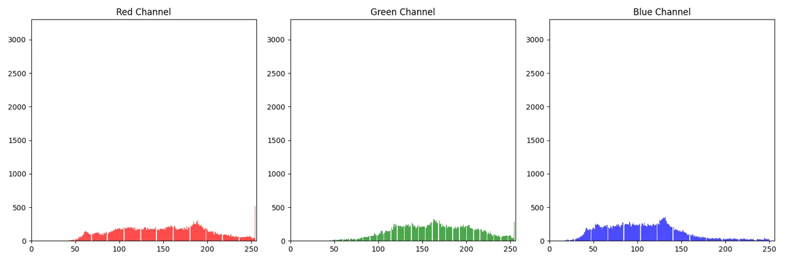

# Learning High-Frequency Functions Made Easy with Sinusoidal Positional Encoding

Chuanhao Sun Affiliation: The University of Edinburgh, Edinburgh, UK
Correspondence to: <chuanhao.sun@ed.ac.uk>    Zhihang Yuan Affiliation:
The University of Edinburgh, Edinburgh, UK    Kai Xu Affiliation:
MIT-IBM Watson AI Lab, Cambridge, MA, US    Luo Mai Affiliation: The
University of Edinburgh, Edinburgh, UK    N. Siddharth Affiliation: The
University of Edinburgh, Edinburgh, UK Affiliation: The Alan Turing
Institute, UK    Shuo Chen Affiliation: The University of Edinburgh,
Edinburgh, UK    Mahesh K. Marina Affiliation: The University of
Edinburgh, Edinburgh, UK Correspondence to: <mahesh@ed.ac.uk>

###### Abstract

Fourier features based positional encoding (PE) is commonly used in
machine learning tasks that involve learning high-frequency features
from low-dimensional inputs, such as 3D view synthesis and time series
regression with neural tangent kernels. Despite their effectiveness,
existing PEs require manual, empirical adjustment of crucial
hyperparameters, specifically the Fourier features, tailored to each
unique task. Further, PEs face challenges in efficiently learning
high-frequency functions, particularly in tasks with limited data. In
this paper, we introduce sinusoidal PE (SPE), designed to efficiently
learn adaptive frequency features closely aligned with the true
underlying function. Our experiments demonstrate that SPE, without
hyperparameter tuning, consistently achieves enhanced fidelity and
faster training across various tasks, including 3D view synthesis,
Text-to-Speech generation, and 1D regression. SPE is implemented as a
direct replacement for existing PEs. Its plug-and-play nature lets
numerous tasks easily adopt and benefit from SPE.

Code: [github.com/zhyuan11/SPE](https://github.com/zhyuan11/SPE)

###### Keywords:

Machine Learning, ICML

## 1 Introduction

Fully connected neural networks, a.k.a multilayer perceptrons or MLPs,
are trained to generate representations of high-dimensional data such as
shapes, images, and signed distances, by processing low-dimensional
coordinates. Recent works have shown that the Fourier series regression
using MLP (Tancik et al., 2020) can enable neural networks to learn
high-frequency functions in low-dimensional spaces. In neural radiance
fields (NeRFs) and its follow-up studies (Tancik et al., 2020;
Mildenhall et al., 2021), Fourier features, induced by positional
encoding (PE), are applied to learn 3D representations of objects or
scenes by taking in 1D sequences that represent samples of light.

Despite its effectiveness, a successful application of PE is
non-trivial. A series of studies emerge to resolve the practical issues
of PE on its sensitivity to hyper-parameters (Gao et al., 2023),
difficulty to capture high-frequency components during training (Yang et
al., 2023), etc. Those practical issues also block a wider application
of PE in emerging generative AI tasks, especially those involving
complex high-frequency details. For example, our experiment shows that a
direct application of PE in speech synthesis does not offer any benefit
in capturing high-frequency details (Ren et al., 2019b; Ren et al.,
2020), though “by design” it should do.

In this study, we delve into the challenges of training neural networks
for machine learning tasks that demand the retention of high-frequency
components in their outputs. Our exploration into the quantity and
training dynamics of frequency components within PE has led us to
identify two primary factors that can undermine the effectiveness of PE:
(1) the difficulty in configuring stationary frequency features without
adequate prior knowledge, which can result in PE failing to learn if
configurations are incorrect, and (2) the detrimental impact on
performance caused by compelling the model to perfectly align with the
specific frequency components of the training set (e.g., the case of
overfitting PE for an original NeRF).

To overcome the challenges identified, we seek to develop a new PE that
can effectively learn the appropriate number of components and their
frequencies _conditionally on the inputs_. Our development has led to
sinusoidal positional encoding (SPE) which augments PE (Tancik et al., 2020) with periodic activation functions (Sitzmann et al., 2020), thus
making the number and frequencies of Fourier series trainable and
adaptive to inputs. Although we initially propose SPE for challenging
few-view NeRF tasks, we find it is a generic method that can benefit a
diverse set of tasks which need modelling complex high-frequency
features. With SPE, we have a simple yet effective form of PE for the
first time that can effectively work in a wide range of tasks without
manually tuning the numbers as well as the values of the Fourier
features.

We have evaluated SPE against a wide range of baseline methods in
various generation tasks. In the task of few-view NeRF, we achieve a
significant gain in synthesizing high-frequency details with limited
views by replacing PE with SPE. In the task of text-to-speech
generation, we achieve a significant performance gain on a
state-of-the-art (SOTA) model: FastSpeech (Ren et al., 2019b) with _a
single-line change_ of codes. In the task of 1D regression with neural
tangent kernel (NTK) (Jacot et al., 2018), we significantly enhance both
the fidelity and convergence speed by simply replacing the PE with SPE,
which also avoids the need for expensive hyperparameter tuning.

## 2 Background and Motivation

PE is designed for learning high-frequency functions in machine learning
tasks such as NeRF (Tancik et al., 2020; Mildenhall et al., 2021), 1D or
2D regression (Tancik et al., 2020; Nguyen et al., 2015), 3D shape
regression (Mescheder et al., 2019) and audio generation (Ren et al.,
2019b; Ren et al., 2020). It refers to the expansion of input
$`\mathbf{x}`$ with sinusoidal function pairs
$`(\sin(\alpha_{i}\mathbf{x}),\cos(\alpha_{i}\mathbf{x}))`$,
$`i\in\{0,\dots,L-1\}`$ where $`L`$ is a hyper-parameter determining the
number of frequency components, also known as a special case Fourier
features in (Rahimi & Recht, 2007). In PE, the Fourier features
$`\alpha_{i}`$ are predefined per scenario empirically. A typical
default setup in NeRF-related tasks (Mildenhall et al., 2021; Yang et
al., 2023; Tancik et al., 2023) with $`\alpha_{i}=2^{i-1}\pi`$ is
illustrated in Equation 1:

```math
\displaystyle\mathrm{PE}_{L}(\mathbf{x})=[\sin(\pi\mathbf{x}), \displaystyle\cos(\pi\mathbf{x}),\cdots, \tag{1}
```

```math
\displaystyle\sin(2^{L-1}\pi\mathbf{x}),\cos(2^{L-1}\pi\mathbf{x})]^{\top}
```

However, such a formulation has obvious limitations. The optimal setting
of $`L`$ should be conditional on two factors: (i) the task setup and
(ii) the number of parameters in an MLP. While the second factor is a
natural concern, the task-specific setup makes an optimal $`L`$
difficult to set. We illustrate how the optimal setting of $`L`$ will
affect the effectiveness of a learnt high-frequency function in the
context of a NeRF task in Figure 1.



Figure 1: New view generation in NeRF with 8 input views on Blender
dataset (Mildenhall et al., 2021). $`L_{r}`$ is the number of components
taken when processing coordinates in PE and $`L_{d}`$ for the direction
processing in PE.

We find that when setting $`L`$ to 10 and 4 for RGB and density threads
respectively, it achieves significantly better performance than using
$`L=3`$ for both threads. Nevertheless, our method, SPE, can improve
upon it, as shown in the last column of the same figure.

In (Rahimi & Recht, 2007; Tancik et al., 2020), another variation of PE
is discussed as well (called Gaussian Random Fourier Features or GRFF),
where the Fourier features $`\alpha_{i}`$ is defined as a pseudo random
sequence sampled from a Gaussian distribution
$`\mathcal{N}(0,\sigma^{2})`$, with a form

```math
\begin{aligned} \mathrm{GRFF}_{L}(\mathbf{x})=[\sin(\mathbf{B}\mathbf{x}),\cos(\mathbf{B}\mathbf{x})]^{\top}\end{aligned}, \tag{2}
```

where $`\mathbf{B}\in\mathbb{R}^{L\times d}`$, $`d`$ is the input
sequence length. Although sample from a Gaussian distribution, the GRFF
still uses a stationary encoding methodology. In practice, GRFF only
brings negligible gain on tasks such as NeRF, and so far PE is the
common option. For the clarity and convenience of analysis, we focus the
discussion with PE in this paper, and the same conclusion can be applied
to GRFF as well. More detailed evaluation and discussion about GRFF can
be found in §B.2.

To optimize the hyper-parameters of PE, existing approaches follow two
ways: (i) empirically tune the parameters of stationary Fourier features
for PE, or (ii) make the parameters associated with Fourier features
trainable.

### 2.1 Empirically optimized stationary Fourier features

NeRF, our major use case, is a technology to generate new views based on
existing views of the same object or scene. Few 2D images representing
available views along with the 3D coordinates of image pixels and
direction of viewpoint make up the input to the network. The network is
then trained to generate the density (how much light is blocked or
absorbed at that point) and RGB colors from new input viewpoints.
Basically, a MLP is used in NeRF with two different input threads: 3D
coordinates and direction of viewpoint, where the two threads are
processed with different feature length $`L`$ of PE for better
representing high frequency details. The choice of $`L`$ significantly
influences the performance of NeRF.

Practitioners often empirically choose stationary $`L`$ based on the
specific task setup. We show this empirical approach is problematic
using concrete examples. Specifically, we first assess a few-view NeRF
model (Mildenhall et al., 2021) with varied $`L`$ for different objects
on the Blender dataset (used in (Sitzmann et al., 2019; Mildenhall et
al., 2021)). Additionally, we repeat the same experiments for a SOTA
speech synthesis model, named FastSpeech (Ren et al., 2019b).

For the few-view NeRF , we summarize the results in Table 1. For
different objects to generate, different settings for $`L`$ bring about
$`2\text{dB}`$ variation on Peak Signal-to-Noise Ratio (PSNR).

|                  |       |       |       |        |       |           |       |       |         |
| ---------------- | ----- | ----- | ----- | ------ | ----- | --------- | ----- | ----- | ------- |
| PSNR$`\uparrow`$ | Chair | Drums | Ficus | Hotdog | Lego  | Materials | Mic   | Ship  | Average |
| L=5              | 32.19 | 25.29 | 30.73 | 36.06  | 30.77 | 29.77     | 31.66 | 28.26 | 30.59   |
| L=10             | 33.00 | 25.01 | 30.13 | 36.18  | 32.54 | 29.62     | 32.91 | 28.65 | 31.00   |
| L=15             | 32.87 | 24.65 | 29.92 | 35.78  | 32.50 | 29.54     | 32.86 | 28.34 | 30.80   |
| Best             | 33.0  | 25.29 | 30.73 | 36.18  | 32.54 | 29.77     | 32.91 | 28.65 | 31.13   |

Table 1: NeRF with different settings for $`L`$ in PE.

However, none of the settings for $`L`$ can achieve the best performance
on all objects. Overall, we find that $`L=10`$ yields the best average
performance on this task.

We apply the best setting of $`L=10`$ from above to another task:
Fastspeech. We apply PE to the MLP layer at the end of the
text-to-speech transformer. Here we would expect this modification with
PE can bring more details since, if we use MLP without PE, the output
audio loses many details with a blurring spectrum. According to Figure
2, with all $`L\in\{5,10,15\}`$, adding PE in form as Equation 1 does
not change the result, supporting our claim that the stationary $`L`$
which shows best performance in a task cannot be applied to other tasks.


Figure 2: The Optimal PE for NeRF on Blender dataset only has negligible
influence on speech generation with FastSpeech, while our method
achieves better alignment of the red regions with the ground truth.

It is worth noting that for both NeRF and speech synthesis tasks, SPE
achieves the best performance, even better than all methods that rely on
extensive manual tuning.

### 2.2 Adaptive Fourier features & probabilistic encoding

To address the issues with stationary Fourier features, adaptive
positional encoding (Gao et al., 2023) has been proposed to make the
Fourier features trainable. More formally, a trainable Fourier feature
$`\mathrm{APE}(\cdot)`$ is defined as

```math
\displaystyle\mathrm{APE}_{\bm{\mathbf{W}_{\text{SPE}}}}(\mathbf{x})=[\sin(\omega_{0}\mathbf{x}), \displaystyle\cos(\omega_{0}\mathbf{x}),\cdots, \tag{3}
```

```math
\displaystyle\sin(\omega_{K}\mathbf{x}),\cos(\omega_{K}\mathbf{x})\ ]^{\top}
```

where $`\mathbf{W}_{\text{SPE}}=[\omega_{1},\dots,\omega_{K}]`$ is the
trainable frequency features and $`K`$ is the number of possible
features. However, training $`\omega`$ from data is still challenging.
For an MLP, the input $`\mathbf{x}`$ is a 1D sequence, whereas the
output matrix $`[\omega_{i}]`$ of $`\omega`$ is a $`N\times K`$ matrix,
$`N`$ is the length of $`\mathbf{x}`$. The learning task for training
$`[\omega_{i}]`$ is a non-trivial 1D-to-2D problem that requires
learning high dimensional functions in unbounded space (§3.4),
complicating the training of $`[\omega_{i}]`$. From Figure 3, we can
observe that while APENeRF can produce a reasonable outline of the
chair, the detailed patterns on the chair appear blurred. In contrast,
our method (i.e., SPE) mitigates this blurriness, generating more
accurate flower patterns.

Apart from APE, probabilistic encoding methods, such as hash encoding
(Müller et al., 2019; Müller et al., 2022; Tancik et al., 2023) are also
proposed to learn Fourier features based on inputs. These methods,
though adaptive, exhibit a high dependency on the amount of available
training data. Without sufficient data, an effective encoding is often
difficult to find (which is detailed in §3.1 and experimentally shown in
§4.1). Essentially, the encoding part of these works performs a Monte
Carlo search and the rest of the network need to take care of learning
the composition of those encodings and handle Hash collision, which
requires many more samples to capture sufficient statistics. If we train
a NeRF with hash encoding with a limited number of views (denoted as
InstantNeRF—the SOTA NeRF which adopts hash encoding), the fidelity is
poor, as Figure 3 shows. In contrast, SPE generates a high-quality
object close to the ground truth, achieving noticeably enhanced
performance over InstantNeRF.



Figure 3: Objects generated by APENeRF, InstantNeRF and our method.
APENeRF uses hash encoding and it is hard to train with 8 views on the
Blender synthetic dataset whereas ours (i.e., SPE), even with limited
data, can already achieve high-quality generation close to the ground
truth.

## 3 Sinusoidal Positional Encoding

We want to make the adoption of PE in generative AI tasks simple and
effective. To achieve this, we design _Sinusoidal Positional Encoding_
or SPE, defined as follows

```math
\displaystyle\mathrm{SPE}(\mathbf{x}) \displaystyle=\sin(\bm{\omega}\mathrm{PE}(\mathbf{x})) \tag{4}
```

where the $`\bm{\omega}`$ is a trainable vector that represents the
learned features, $`L\in\mathbb{N}^{+}`$; the value of
$`\mathrm{PE}(\mathbf{x})`$ is between $`[-1,1]`$. With MLP, SPE has
trainable matrix $`\mathbf{W}_{\text{SPE}}`$ in the form as:

```math
\displaystyle\sin(\mathbf{W}_{\text{SPE}}\mathrm{PE}(\mathbf{x}))=
```

```math
\displaystyle[\sin(\bm{\omega}_{1}\sin(\pi\mathbf{x})),\sin(\bm{\omega}_{2}\cos(\pi\mathbf{x})),\dots,
```

```math
\displaystyle\sin(\bm{\omega}_{2L-1}\sin(2^{L-1}\pi\mathbf{x})),\sin(\bm{\omega}_{2L}\cos(2^{L-1}\pi\mathbf{x}))]^{\top}
```

where
$`\mathbf{W}_{\text{SPE}}=[\bm{\omega}_{1},\dots,\bm{\omega}_{2L}]`$ is
the weight of the first fully connected layer, $`L`$ is the number of
components after PE, the function $`\sin(\cdot)`$ is performed by a
sinusoidal activation. Note that we omit the bias term to simplify the
discussion.

Intuitively, we observe that the behavior of representation in (4) is
close to a normal sinusoidal wave with trainable features. A comparison
between SPE learned features and the hard-coded features in PE is
illustrated in Figure 4, where we use larger $`L=12`$ to search the
features. We find that, with SPE, even with large $`L`$ the actual
learned frequency is within the band where $`L=10`$, which explains why
PE takes $`L=10`$ as the optimal setup. From Figure 4, we also notice
that the difference between objects on features is mainly high-frequency
components. Therefore, learning high-frequency details are critical to
ensure a high fidelity synthesis.

We also find that the proposed form in Equation (4) is significantly
more efficient to train than learning Fourier features which directly
operate on $`\mathbf{x}`$, i.e. learning $`\sin(\omega\mathbf{x})`$ as
in Equation (3) (Gao et al., 2023). We analyze this enhanced learning
efficiency with detail in §3.4.

Figure 4: Learned features by SPE in different objects in the Blender
dataset. A learned feature rarely goes beyond $`L=9`$, and therefore set
$`L=10`$ is the optimal configuration for PE. $`\omega^{*}`$ is the
feature: $`\omega^{*}=\omega\cdot 2^{l-1},l\in\{1,2,\dots,L\}`$.

### 3.1 Design Choices

We discuss different possible designs for Equation (4). We could
consider (1) other periodic activation functions instead of the
sinusoidal function and (2) other encoding methods instead of
sinusoidal-based encoding.

##### Choice of periodic activation functions

We first discuss which periodic activation functions are effective for
SPE. According to the Fourier theorem, any continuous series can be
expanded as a combination of sinusoidal waves. Therefore representing
sinusoidal waves is critical to guarantee that all target outputs can be
potentially represented. Basically, to make sure the network can
represent the sinusoidal wave, Equation 8 in Theorem 3.2 must be met,
otherwise the rest of the network after SPE has to learn a weight that
is conditional on the Fourier features, which makes the learning more
difficult. For instance, if there is significant linear mapping in the
activation, then $`\mathbf{I}(\cdot)`$ or $`\mathbf{S}(\cdot)`$ will
have a form (proof in §A.1.1) where each feature has to be learned in
coupling with specific input $`\mathbf{x}`$ as:

```math
\mathbf{S}(t)=\frac{\sin(\bm{\omega}\cdot t)}{\sqrt{\bm{\omega}^{2}-(2n\pi)^{2}}\bmod 2\pi} \tag{5}
```

where $`\bm{\omega}`$ is a trainable vector and
$`t=2^{l}\pi\mathbf{x},l\in\{0,\dots,L-1\}`$. The function in Equation 5
is much harder to learn than Equation 9 and 10, potentially representing
wrong frequency features for $`\mathbf{x}`$ that is not in the training
set. Therefore we propose using sinusoidal activation as a
simple-yet-effective periodic activation. As for the other common
periodic activation functions, we empirically test their performance in
NeRF and find that they perform significantly worse than the sinusoidal
function. More detailed discussion about other activation functions in
§B.3.

##### Choice of encoding methods

We now discuss different candidate encoding methods: one blob encoding
and hash encoding (Müller et al., 2022). While claiming faster training,
we find that the hash encoding based method shows much worse performance
than the PE or SPE-based method in few-view NeRF. Instead of using
sinusoidal functions, in hash encoding the input $`\mathbf{x}`$ is
encoded by hashing (Müller et al., 2022)

```math
h(\mathbf{x})=\left(\bigoplus^{d}_{i=1}x_{i}\pi_{i}\right)\mod T \tag{6}
```

where $`\oplus`$ denotes the bit-wise XOR operation and $`\pi_{i}`$ are
unique, large prime numbers. Looking from the PE viewpoint, hash
encoding uses a pseudo random function (Müller et al., 2019) to replace
the sinusoidal function of PE. Essentially, since there are multiple
hash tables, hash encoding essentially performs a Monte Carlo search for
proper encoding. Then the model needs to learn from the encoding to
match actual features.

When using hash encoding, there will be a hash collision, where
different $`x_{i}`$ might be mapped into the same value in a
pseudo-random manner. In the implementation with MLP, such as
InstantNeRF (Müller et al., 2022) and NeRFfacto (Tancik et al., 2023),
they do not explicitly handle collisions of the hash functions by
typical means like probing, bucketing, or chaining. Instead, we rely on
the neural network to learn to disambiguate hash collisions themselves,
avoiding control flow divergence, reducing implementation complexity and
improving performance. Through the illustration from Figure 3 and an
experiment in §4.1, we find that NeRF with hash encoding on a small
number of training views performs much worse than SPE in terms of
fidelity. Both searching for appropriate encoding and learning to fix
hash collision requires lots of effective inputs (_i.e._, distinct views
in NeRF), and hence it is hard to train NeRF with Hash encoding on
limited views.

Generally speaking, although hash encoding has a significant advantage
in terms of computation (training time), its learning efficiency, i.e.
the ability to extract appropriate features, is worse than SPE.

### 3.2 Practical implementation

Figure 5: Example of implementing SPE in NeRF: Using periodic activation
function for Frequency Encoded series. (x,y,z) is the coordinates of the
object. Dir indicates direction of the view.

Here we provide a practical guide to implement SPE. For a given network,
one can replace the first activation function of the MLP after PE with a
sinusoidal activation. We illustrate this using an SPE-enabled NeRF in
Figure 5. Incorporating SPE into existing neural networks requires no
additional hyperparameter tuning and maintains a similar network
structure, thereby preserving the original training process for seamless
integration.

The only hyper-parameter of SPE is the $`L`$. Since Fourier feature
$`\omega`$ is trainable, larger the value of $`L`$ in SPE the better and
should match the network size, i.e., $`L\propto N_{\text{para}}`$ where
$`N_{\text{para}}`$ is the number of parameters in the network, which we
establish in Theorem 3.1.

###### Theorem 3.1.

$`L`$ determines the approximation accuracy of SPE to a trainable PE
(proof in §A.1.2).

```math
\sin(\bm{\omega}\mathrm{PE}(\mathbf{x}))=\mathrm{PE}(\bm{\omega}(\mathbf{x}+\frac{1}{2^{L}})) \tag{7}
```

Using larger $`L`$ should not cause unexpected artefacts because the
features in the PE part will be tuned by $`\bm{\omega}`$. In our
experiments, we can optimize $`L`$ by increasing the number until the
result does not improve.

### 3.3 Analysis of representation power

In the following, we analyze the representation power of SPE by showing
that SPE after learning can effectively represent PE with optimal
parameters.

###### Theorem 3.2.

For arbitrary input $`\mathbf{x}`$, the network can learn $`\omega`$
agnostic functions $`\mathbf{I(\cdot)}`$ and $`\mathbf{S(\cdot)}`$ to
make SPE have the same effect as PE with Fourier features tuned by
$`\omega`$.

###### Proof.

Let $`t=2^{l}\pi\mathbf{x},l\in\{0,\dots,L-1\}`$

```math
\displaystyle\exists\mathbf{I}(t),\mathbf{S}(t)\to
```

```math
\displaystyle\sin(\mathrm{\bm{\omega}}\sin(t))\cdot\mathbf{I}(t)+\sin(\bm{\omega}\cos(t))\cdot\mathbf{S}(t)=\sin(\bm{\omega}\cdot t) \tag{8}
```

As we prove in §A.1.2, $`\mathbf{I(\cdot)}`$ and $`\mathbf{S(\cdot)}`$
have a simple form

```math
\text{If:}\penalty\ t\rightarrow(n+\frac{1}{2})\pi,\penalty\ \text{Then:}\penalty\ \mathbf{I}(t)=1,\mathbf{S}(t)=0 \tag{9}
```

```math
\text{If:}\penalty\ t\rightarrow n\pi,\penalty\ \text{Then:}\penalty\ \mathbf{I}(t)=0,\mathbf{S}(t)=1 \tag{10}
```

Combining 8, 9, and 10, the sinusoidal wave is approximated with both
the $`\sin`$ and $`\cos`$ parts. ∎

###### Remark 3.3.

Intuitively, Equation 9 and 10 approach sinusoidal wave for different
values of $`\mathbf{x}`$ by using different frequency parts of SPE to
make the approximation. The $`\mathbf{I(\cdot)}`$ and
$`\mathbf{S(\cdot)}`$ is $`\omega`$ agnostic and a simple linear binary
classification of input value $`\mathbf{x}`$, therefore there is no
extra overhead to learn such functions.

###### Theorem 3.4.

Equation 4 is an effective approximation to PE when the absolute value
of learned feature $`\omega`$ is small

```math
\lim_{|\omega|\rightarrow 0}\sin(\omega\mathrm{PE}(\mathbf{x}))=\mathrm{PE}(\mathbf{x}) \tag{11}
```

Details proof in §A.1.3. In the case original PE has captured the
appropriate features, SPE can easily approach PE by using small weights.
The smaller weights can be scaled up by subsequent fully connected
layers without impacting the corresponding frequency band’s power.
Therefore, we prove that PE is an easy-to-learn sub-case of SPE.

### 3.4 Discussion of training efficiency

We discuss the choice of optimization methods together with SPE. One
option is to learn $`\sin(\omega\mathbf{x})`$ directly as in Equation
(3). Compared with learning in the form of $`\sin(\omega\mathbf{x})`$,
incorporating PE with SPE simplifies training by limiting the search to
a bounded space, unlike other methods that operate in a larger,
unbounded space. This constraint leads to more stable training and
faster convergence. Suppose we have $`L`$ components in SPE, then the
hardcoded features are $`\mathbf{f}_{h}=[\pi,2\pi,\dots,2^{L-1}\pi]`$,
and the learned features (suppose the actual features is distinct to the
hardcoded features)
$`\mathbf{f}_{l}=[\omega_{0}\cdot\pi,\omega_{1}\cdot 2\pi,\dots,\omega_{L}\cdot 2^{L-1}\pi]`$.
Assume that the actual feature is $`\omega_{a}`$, the difference between
the nearest hardcoded feature and actual feature $`\Delta_{\text{PE}}`$
would be

```math
\displaystyle\Delta_{\text{PE}}=\begin{cases}\min(2^{\beta_{0}}\pi-\omega_{a},\omega_{a}-2^{\beta_{1}}\pi)&\omega_{a}<2^{L-1}\pi\\
\omega_{a}-2^{L-1}\pi&\omega_{a}\geq 2^{L-1}\pi\end{cases} \tag{12}
```

where $`\beta_{0}=\lceil\log_{2}\frac{\omega_{a}}{\pi}\rceil`$ and
$`\beta_{1}=\lfloor\log_{2}\frac{\omega_{a}}{\pi}\rfloor`$. Therefore if
we have PE, then tuning the frequency always can be converted to a
bounded range that is significantly smaller than $`\omega_{a}`$ when
$`L`$ is large enough. Without embedding PE in SPE, the searching space
to train $`\omega`$ is not bounded and will be sensitive to
initialization, which is hard to carry out when the actual feature is
unknown.

### 3.5 Quantifying Learned Fourier Features

As prior works, we use standard metrics for NeRF including PSNR and
SSIM. However, we find that PSNR and SSIM cannot show the fidelity of
learnt Fourier features explicitly. Therefore, we further design metrics
that can quantify the effects of high-frequency and low-frequency
details. These new metrics include:

1.  1.  _Wavelet Decomposition Power Ratio_ (WDPR) measures the
        high-frequency band that contributes to gain in different methods.
        We first conduct wavelet decomposition with $`\lambda`$ levels on
        the image to separate the high-frequency details. Level-$`\lambda`$
        wavelet power radio is defined as the power of signal at the
        $`\lambda th`$ level decomposition compared to the ground truth
        decomposition. The WDPR is then can be calculated as follow

    ```math
    \hskip-17.50002pt\mathrm{WDPR}(\mathbf{y}_{\text{true}},\mathbf{y}_{\text{syn}},\lambda)=\frac{|\mathbf{P}(W(\mathbf{y}_{\text{true}},\lambda))-\mathbf{P}(W(\mathbf{y}_{\text{syn}},\lambda))|}{\mathbf{P}(W(\mathbf{y}_{\text{true}},\lambda))} \tag{13}
    ```

    where $`\mathbf{P}(\mathbf{y})=\sum y_{i}^{2},y_{i}\in\mathbf{y}`$,
    $`\mathbf{y}_{\text{syn}}`$ denotes synthesis view, and
    $`\mathbf{y}_{\text{true}}`$ denotes the ground truth synthesis
    view.

2.  2.  _Relative Wasserstein Distance Error_ (RWDE) which assesses how
        accurately the model learns the distribution change. Let
        $`y_{\text{train}}`$ denote the training view, $`y_{\text{syn}}`$
        denote a synthesis view, and $`y_{\text{true}}`$ denote the
        ground-truth synthesis view, the RWDE is defined as:

    ```math
    \mathrm{RWDE}(\mathbf{y}_{\text{train}},\mathbf{y}_{\text{syn}},\mathbf{y}_{\text{true}})=\frac{\mathrm{WD}(\mathbf{y}_{\text{train}},\mathbf{y}_{\text{syn}})}{\mathrm{WD}(\mathbf{y}_{\text{true}},\mathbf{y}_{\text{syn}})} \tag{14}
    ```

    where $`\mathrm{WD}(\mathbf{a},\mathbf{b})`$ compute the Wasserstein
    distance between two images $`\mathbf{a},\mathbf{b}`$, and take the
    average of different RGB channels if needed. Intuitively, RWDE gives
    a sense of whether the model tends to overfit the distribution of
    existing views. If $`\text{RWDE}<1`$ then it tends to overfit to
    existing views, and vice versa.

## 4 Experiments

We evaluate SPE against different baseline methods using various
generation tasks: few-view NeRF, Text-to-Speech synthesis, and 1D
regression with NTK. For NeRF, we focus on the case with few views and
compare the fidelity of the new view synthesis (§4.1). For the speech
synthesis task, we focus on improving the FastSpeech (Ren et al., 2019b)
method, where the insufficient accuracy of MLP comes as a main obstacle
for high-quality generation. We show the use of SPE significantly
improves their performance with a single-line of change in their
open-source code base (§4.2). Finally, we compare SPE against PE in 1D
regression with NTK, following its original paper (Tancik et al., 2020),
for which we observe that SPE shows a significant gain in convergence
speed and fidelity by simply changing one activation function (§4.3).

### 4.1 Few-View NeRF

We implement SPE in NeRF following the way depicted in Figure 5. By
default, we build our SPE method on top of the SOTA model: FreeNeRF
(Yang et al., 2023). Specifically, for the training with SPE on
FreeNeRF, we find that it is effective to train FreeNeRF and SPE with
adversarial loss to minimize the Wasserstein distance to the target
view. Details of the experimental setup can be found in §B.1, and more
analysis results can be found in §A.2.

For baselines, we consider PE-based methods, including DietNeRF (Jain et
al., 2021), MipNeRF (Barron et al., 2021), and FreeNeRF (Yang et al.,
2023), as well as those with hash encoding, such as InstantNeRF (Müller
et al., 2022) and NeRFfacto (Tancik et al., 2023). APENeRF (Gao et al., 2023) is as far as we know the only method that learns the Fourier
features explicitly, so we also include this work as a baseline. All the
baselines are open-source and we implement SPE on top of their official
implementation.

|                   |                 |          |         |          |               |           |         |              |               |                   |
| ----------------- | --------------- | -------- | ------- | -------- | ------------- | --------- | ------- | ------------ | ------------- | ----------------- |
|                   | Non-Adaptive PE |          |         |          | Hash Encoding |           | APE     | SPE          |               |                   |
| Metric            | NeRF            | DietNeRF | MipNeRF | FreeNeRF | InstantNeRF   | NeRFfacto | APENeRF | MipNeRF +SPE | FreeNeRF +SPE | FreeNeRF +SPE+GAN |
| PSNR $`\uparrow`$ | 14.983          | 23.142   | 23.344  | 24.259   | 14.681        | 14.934    | 23.067  | 23.563       | 24.951        | 25.202            |
| SSIM $`\uparrow`$ | 0.689           | 0.865    | 0.879   | 0.883    | 0.676         | 0.682     | 0.863   | 0.885        | 0.898         | 0.910             |

Table 2: Performance comparison of NeRF models and encoding methods.

|                   |          |        |        |              |
| ----------------- | -------- | ------ | ------ | ------------ |
| Metric            | FreeNeRF | w/ SPE | w/ GAN | w/ SPE + GAN |
| PSNR $`\uparrow`$ | 24.259   | 24.951 | 24.531 | 25.202       |
| SSIM $`\uparrow`$ | 0.883    | 0.898  | 0.889  | 0.910        |

Table 3: Ablation Study on FreeNeRF.

|             |          |           |         |          |                |                |                      |
| ----------- | -------- | --------- | ------- | -------- | -------------- | -------------- | -------------------- |
| $`\lambda`$ | DietNeRF | NeRFfacto | APENeRF | FreeNeRF | FreeNeRF + SPE | FreeNeRF + GAN | FreeNeRF + SPE + GAN |
| $`1`$       | 0.968    | 0.986     | 0.982   | 0.981    | 0.988          | 0.982          | 0.990                |
| $`2`$       | 0.930    | 0.972     | 0.971   | 0.974    | 0.975          | 0.981          | 0.978                |
| $`3`$       | 0.833    | 0.858     | 0.861   | 0.877    | 0.903          | 0.882          | 0.927                |
| $`4`$       | 0.590    | 0.682     | 0.694   | 0.779    | 0.796          | 0.760          | 0.894                |

Table 4: WPDR with different levels $`\lambda`$.



Figure 6: Visual enhancement of Blender Chair with SPE. Our method
yields clearer patterns compared to FreeNeRF.

Figure 7: RWDE with different training views.



Figure 8: Wavelet decomposition results.

We present a performance comparison of various NeRF models and encoding
techniques in Table 2. The table includes seven existing NeRF models
categorized by four positional encoding techniques: (non-adaptive) PE
(Equation 1), hash encoding (Equation 6), APE (Equation 3), and SPE
(Equation 4). It is evident that our method, SPE, surpasses all other
positional encoding techniques in the NeRF task for both PSNR and SSIM
metrics. Notably, SPE achieves approximately a 3% improvement in PSNR
and a 1.7% increase in SSIM compared to the state-of-the-art FreeNeRF
(Yang et al., 2023) method. This leads to a significant visual
enhancement, as illustrated in Figures 6. Furthermore, we discovered
that GANs (Goodfellow et al., 2020; Gulrajani et al., 2017) can further
enhance the performance of PE-based NeRF models.

An ablation study on FreeNeRF, incorporating both SPE and GAN
enhancements, is presented in Table 3. In this study, we use the SOTA
NeRF, FreeNeRF (Yang et al., 2023), as the main baseline. We observe
that GANs contribute to performance improvements for both the PE-based
(vanilla) FreeNeRF and our SPE-enhanced FreeNeRF, with notably higher
accuracy in terms of PSNR and SSIM when combined with SPE. A primary
reason is that SPE can provide a richer frequency band (shown in Figure
4), where GANs can be exploited with greater flexibility. This can be
further reflected in Figure 7 where GANs can effectively reduce the RWDE
which reflects the extent of pixel distortion.

Table 4 presents the WDPR across levels 1-4. The table illustrates that
SPE surpasses all other NeRF models across various positional encoding
techniques, particularly at higher levels of wavelet decomposition,
which correspond to higher frequency features. Notably, at
$`\lambda=3`$, SPE achieves a 3% improvement over the state-of-the-art
FreeNeRF. Moreover, while integrating GAN with FreeNeRF and PE reduces
the power ratio from 0.779 to 0.760, employing GAN with SPE elevates the
performance from 0.796 to 0.894, marking a 12.3% enhancement. This
reinforces our assertion that the broader frequency bands facilitated by
SPE enhance the efficacy of GANs in training. Such improvements lead to
noticeable visual distinctions, as depicted in Figure 8.

### 4.2 Text-to-Speech


High Frequency Details  
  
Low Frequency Details

Figure 9: Speech spectrum details with red regions indicating signal
power. Our method achieves better alignment of these red regions with
the ground truth compared to vanilla FastSpeech.

|        |        |        |        |        |        |
| ------ | ------ | ------ | ------ | ------ | ------ |
| Method | Case 1 | Case 2 | Case 3 | Case 4 | Case 5 |
| SPE    | 104.4  | 97.7   | 103.2  | 103.9  | 97.6   |
| PE     | 103.4  | 96.3   | 101.6  | 102.2  | 96.4   |
| FS     | 100.7  | 94.4   | 100.2  | 99.3   | 94.7   |
| SPE    | 0.223  | 0.223  | 0.239  | 0.240  | 0.262  |
| PE     | 0.210  | 0.209  | 0.228  | 0.229  | 0.236  |
| FS     | 0.191  | 0.191  | 0.205  | 0.204  | 0.225  |

Table 5: Performance comparison of position encoding methods in speech
sytnehsis for different cases. Top half is PSNR and bottom half is SSIM,
both the larger the better.

We then evaluate SPE in speech synthesis tasks. FastSpeech (Ren et al.,
2019b) is selected as the base method for speech use case because the
linear layers tend to be a bottleneck in FastSpeech (see “Figure 1 (a),
Feed-Forward Transformer” in (Ren et al., 2019b)). For this model there
is no official code available, we therefore use the implementation in
(Liu, 2020), which shows negligible difference on performance compared
with the official audio samples (Ren et al., 2019a).

In Table 5, a comparative analysis of three audio synthesis methods is
conducted, with PSNR and SSIM as metrics. In the table, “SPE” refers to
a model integrating SPE with the original FastSpeech. “PE” denotes the
incorporation of PE (Equation 1) into FastSpeech, and “FS” represents
the original FastSpeech model. To make a fair comparison, we set $`L=5`$
for PE in all methods. The computation of PSNR and SSIM involves
contrasting the synthesized audio from three methods against the ground
truth (target audio spectrum graph). These metrics are crucial for
assessing the fidelity and perceptual quality of synthesized audio,
quantitatively measuring each method’s approximation to the ground
truth.

The table assesses metrics across five cases with high-frequency
features, similar to high-frequency details from Figure 9. The results
lead to two main observations. First, SPE consistently has the best
performance in both PSNR and SSIM across all cases. Second, PE
demonstrates superior performance over FS in all scenarios. These
findings affirm that PE can enhance fidelity for high-frequency feature
generation, and the new SPE further amplifies this benefit by adaptively
selecting the most relevant features.

Notably, Case 4 exhibits a remarkable improvement of 4.6% compared to
vanilla FastSpeech, highlighting the efficacy of SPE in enhancing signal
quality. Similarly, for SSIM values, which measure the structural
similarity to the ground truth, a parallel trend is observed. The
SPE-augmented FastSpeech achieves SSIM scores ranging from 0.223 to
0.262, outperforming the original FastSpeech model, which scores between
0.191 and 0.225. This enhancement indicates that SPE not only improves
the fidelity of the audio signal but also more effectively preserves its
structural integrity compared to the baseline model. These findings
underscore the capability of SPE to significantly boost performance in
speech generation use cases.

### 4.3 1D Regression with Neural Tangent Kernel

(a) PE

(b) SPE

Figure 10: Training and test performance of NTK with PE and SPE. Each
figure shows the trajectories with different $`p`$. Dashed lines
indicate the trend in theory and solid lines are from experiments. The
red vertical line marks the iteration at which PE and SPE achieve
equivalent levels of convergence.

We finally evaluate SPE on 1D regression with NTK. We adhered to the
official implementation of PE-based NTK (Tancik et al., 2020) and
conducted the experiments accordingly. We modify only by replacing the
PE component with SPE. To ensure a fair comparison, we following the
same implementaition in (Tancik et al., 2020), using Jax (Bradbury et
al., 2018) and the same Python library (Novak et al., 2019) to calculate
NTK functions automatically.

Figures 10 show the NTK regression performance. Here, mappings with
smaller $`p`$ values are associated with NTKs better equipped to capture
high-frequency features. We make several observations from this figure.
First of all, the training loss plots indicate that, within 50,000
iterations, SPE achieves 2 $`\times`$ faster convergence across all
$`p`$ values compared to PE. Furthermore, the training loss with SPE is
notably reduced, being two orders of magnitude smaller compared to PE
when $`p`$ equals $`0.5`$. This significant reduction highlights SPE’s
enhanced capability in effectively capturing high-frequency features
within the training dataset.

Additionally, in terms of testing loss, while the PE-based NTK
regression model requires up to 40,000 iterations to converge, the
SPE-based model demonstrates convergence within approximately 20,000
iterations for all evaluated $`p`$ values with a smaller test loss.

Finally, the test loss plots for SPE reveal a nuanced trend. While
employing NTK regression with PE yields best performance at a $`p`$
value of 1, as smaller $`p`$ values tend to cause overfitting, which is
discussed in Tancik et al. (2020); SPE demonstrates a marked improvement
in this aspect. Specifically, as illustrated in Figure 10, SPE maintains
comparable performance levels even when $`p`$ is reduced to 0.5. This
capacity to effectively handle smaller $`p`$ values which is intended to
capture more high-frequency features substantiates our argument that SPE
can adaptively select and converge upon the most pertinent frequency
features without the typical drawbacks associated with smaller $`p`$
values in PE, which is aligned with Theorem 3.1 in §3.2 .

## 5 Related Work

Our study is motivated by the successful application of Fourier features
based PE in various tasks for processing visual signals, including
images (Stanley, 2007) and 3D scenes (Mildenhall et al., 2021; Yang et
al., 2023). Even earlier, there are similar positional encoding methods
in natural language processing and time series analysis (Kazemi et al.,
2019; Vaswani et al., 2017). Among these works, Xu et al. (2019) use
random Fourier features to approximate stationary kernels with a
sinusoidal input mapping and propose techniques to tune the mapping
parameters. Then in Tancik et al. (2020), the authors extend Fourier
features based PE by comprehending such mapping as a modification of the
resulting network’s NTK.

At the same time as Tancik et al. (2020), another work on utilizing
sinusoidal activation via SIREN layers to learn from the derivative
information (Sitzmann et al., 2020) shows another potential of using
Fourier representations to help the training process, which is then
proved as a structural similar representation as the PE with a trainable
parameter (Benbarka et al., 2022). This provokes us to think about how
to use this connection to enable a trainable and adaptive PE.
Simultaneously, there are other attempts to learn the Fourier features
directly (Gao et al., 2023) or learn a pseudo random encoding of the
inputs (Müller et al., 2022; Tancik et al., 2023). However, those works
cannot fully address practical concerns, such as why the empirical
setting of NeRF should be like in Mildenhall et al. (2021), for which we
see a gap between theory and empirical operation.

Building on the existing analysis of PE, we introduce SPE to adaptively
learn optimal Fourier features, thereby bridging theoretical
understanding and practical implementation. This approach not only
enhances the effectiveness of PE in capturing high-frequency functions
but also broadens the scope of its application across domains.

## 6 Conclusions

This paper presents SPE, a new positional encoding method designed to
learn adaptive frequency features closely aligned with the true
underlying function. Through extensive evaluation across three distinct
scenarios – 1D regression, 2D speech synthesis, and 3D NeRF – we have
demonstrated SPE’s superiority over traditional Fourier feature based
PE. Our findings indicate that SPE is effective and efficient at
learning high-frequency functions, underscoring its potential as a
versatile tool for a broad set of applications.

## Impact Statement

This paper presents work whose goal is to advance the field of Deep
Learning. There are many potential societal consequences of our work,
none which we feel must be specifically highlighted here.

## References

- Arora et al. (2019) Arora, S., Du, S., Hu, W., Li, Z., and Wang, R.
  Fine-grained analysis of optimization and generalization for
  overparameterized two-layer neural networks. In _International
  Conference on Machine Learning_, pp. 322–332. PMLR, 2019.
- Barron et al. (2021) Barron, J. T., Mildenhall, B., Tancik, M.,
  Hedman, P., Martin-Brualla, R., and Srinivasan, P. P. Mip-nerf: A
  multiscale representation for anti-aliasing neural radiance fields. In
  _Proceedings of the IEEE/CVF International Conference on Computer
  Vision_, pp. 5855–5864, 2021.
- Benbarka et al. (2022) Benbarka, N., Höfer, T., Zell, A., et al.
  Seeing implicit neural representations as fourier series. In
  _Proceedings of the IEEE/CVF Winter Conference on Applications of
  Computer Vision_, pp. 2041–2050, 2022.
- Bradbury et al. (2018) Bradbury, J., Frostig, R., Hawkins, P.,
  Johnson, M. J., Leary, C., Maclaurin, D., Necula, G., Paszke, A.,
  VanderPlas, J., Wanderman-Milne, S., et al. Jax: composable
  transformations of python+ numpy programs. 2018.
- Gao et al. (2023) Gao, Z., Dai, W., and Zhang, Y. Adaptive positional
  encoding for bundle-adjusting neural radiance fields. In _Proceedings
  of the IEEE/CVF International Conference on Computer Vision_, pp.
  3284–3294, 2023.
- Goodfellow et al. (2020) Goodfellow, I., Pouget-Abadie, J., Mirza, M.,
  Xu, B., Warde-Farley, D., Ozair, S., Courville, A., and Bengio, Y.
  Generative adversarial networks. _Communications of the ACM_,
  63(11):139–144, 2020.
- Gulrajani et al. (2017) Gulrajani, I., Ahmed, F., Arjovsky, M.,
  Dumoulin, V., and Courville, A. C. Improved training of wasserstein
  gans. _Advances in neural information processing systems_, 30, 2017.
- Jacot et al. (2018) Jacot, A., Gabriel, F., and Hongler, C. Neural
  tangent kernel: Convergence and generalization in neural networks.
  _Advances in neural information processing systems_, 31, 2018.
- Jain et al. (2021) Jain, A., Tancik, M., and Abbeel, P. Putting nerf
  on a diet: Semantically consistent few-shot view synthesis. In
  _Proceedings of the IEEE/CVF International Conference on Computer
  Vision_, pp. 5885–5894, 2021.
- Kazemi et al. (2019) Kazemi, S. M., Goel, R., Eghbali, S., Ramanan,
  J., Sahota, J., Thakur, S., Wu, S., Smyth, C., Poupart, P., and
  Brubaker, M. Time2vec: Learning a vector representation of time.
  _arXiv preprint arXiv:1907.05321_, 2019.
- Lee et al. (2019) Lee, J., Xiao, L., Schoenholz, S., Bahri, Y., Novak,
  R., Sohl-Dickstein, J., and Pennington, J. Wide neural networks of any
  depth evolve as linear models under gradient descent. _Advances in
  neural information processing systems_, 32, 2019.
- Liu (2020) Liu, Z. Fastspeech-pytorch.
  [https://github.com/xcmyz/FastSpeech](https://github.com/xcmyz/FastSpeech), 2020.
- Mescheder et al. (2019) Mescheder, L., Oechsle, M., Niemeyer, M.,
  Nowozin, S., and Geiger, A. Occupancy networks: Learning 3d
  reconstruction in function space. In _Proceedings of the IEEE/CVF
  conference on computer vision and pattern recognition_, pp.
  4460–4470, 2019.
- Mildenhall et al. (2021) Mildenhall, B., Srinivasan, P. P., Tancik,
  M., Barron, J. T., Ramamoorthi, R., and Ng, R. Nerf: Representing
  scenes as neural radiance fields for view synthesis. _Communications
  of the ACM_, 65(1):99–106, 2021.
- Müller et al. (2019) Müller, T., McWilliams, B., Rousselle, F., Gross,
  M., and Novák, J. Neural importance sampling. _ACM Transactions on
  Graphics (ToG)_, 38(5):1–19, 2019.
- Müller et al. (2022) Müller, T., Evans, A., Schied, C., and Keller, A.
  Instant neural graphics primitives with a multiresolution hash
  encoding. _ACM Transactions on Graphics (ToG)_, 41(4):1–15, 2022.
- Nguyen et al. (2015) Nguyen, A., Yosinski, J., and Clune, J. Deep
  neural networks are easily fooled: High confidence predictions for
  unrecognizable images. In _Proceedings of the IEEE conference on
  computer vision and pattern recognition_, pp. 427–436, 2015.
- Novak et al. (2019) Novak, R., Xiao, L., Hron, J., Lee, J., Alemi, A.
  A., Sohl-Dickstein, J., and Schoenholz, S. S. Neural tangents: Fast
  and easy infinite neural networks in python. _arXiv preprint
  arXiv:1912.02803_, 2019.
- Rahimi & Recht (2007) Rahimi, A. and Recht, B. Random features for
  large-scale kernel machines. _Advances in neural information
  processing systems_, 20, 2007.
- Ren et al. (2019a) Ren, Y., Ruan, Y., Tan, X., Qin, T., Zhao, S.,
  Zhao, Z., and Liu, T.-Y. Fastspeech: Fast, robust and controllable
  text to speech (audio samples).
  [https://github.com/xcmyz/FastSpeech](https://github.com/xcmyz/FastSpeech),
  2019a.
- Ren et al. (2019b) Ren, Y., Ruan, Y., Tan, X., Qin, T., Zhao, S.,
  Zhao, Z., and Liu, T.-Y. Fastspeech: Fast, robust and controllable
  text to speech. _Advances in neural information processing systems_,
  32, 2019b.
- Ren et al. (2020) Ren, Y., Hu, C., Tan, X., Qin, T., Zhao, S., Zhao,
  Z., and Liu, T.-Y. Fastspeech 2: Fast and high-quality end-to-end text
  to speech. In _International Conference on Learning
  Representations_, 2020.
- Sitzmann et al. (2019) Sitzmann, V., Thies, J., Heide, F., Nießner,
  M., Wetzstein, G., and Zollhofer, M. Deepvoxels: Learning persistent
  3d feature embeddings. In _Proceedings of the IEEE/CVF Conference on
  Computer Vision and Pattern Recognition_, pp. 2437–2446, 2019.
- Sitzmann et al. (2020) Sitzmann, V., Martel, J., Bergman, A., Lindell,
  D., and Wetzstein, G. Implicit neural representations with periodic
  activation functions. _Advances in neural information processing
  systems_, 33:7462–7473, 2020.
- Stanley (2007) Stanley, K. O. Compositional pattern producing
  networks: A novel abstraction of development. _Genetic programming and
  evolvable machines_, 8:131–162, 2007.
- Tancik et al. (2020) Tancik, M., Srinivasan, P., Mildenhall, B.,
  Fridovich-Keil, S., Raghavan, N., Singhal, U., Ramamoorthi, R.,
  Barron, J., and Ng, R. Fourier features let networks learn high
  frequency functions in low dimensional domains. _Advances in Neural
  Information Processing Systems_, 33:7537–7547, 2020.
- Tancik et al. (2023) Tancik, M., Weber, E., Ng, E., Li, R., Yi, B.,
  Wang, T., Kristoffersen, A., Austin, J., Salahi, K., Ahuja, A., et al.
  Nerfstudio: A modular framework for neural radiance field development.
  In _ACM SIGGRAPH 2023 Conference Proceedings_, pp. 1–12, 2023.
- Vaswani et al. (2017) Vaswani, A., Shazeer, N., Parmar, N., Uszkoreit,
  J., Jones, L., Gomez, A. N., Kaiser, Ł., and Polosukhin, I. Attention
  is all you need. _Advances in neural information processing systems_,
  30, 2017.
- Xu et al. (2019) Xu, D., Ruan, C., Korpeoglu, E., Kumar, S., and
  Achan, K. Self-attention with functional time representation learning.
  _Advances in neural information processing systems_, 32, 2019.
- Yang et al. (2023) Yang, J., Pavone, M., and Wang, Y. Freenerf:
  Improving few-shot neural rendering with free frequency
  regularization. In _Proceedings of the IEEE/CVF Conference on Computer
  Vision and Pattern Recognition_, pp. 8254–8263, 2023.

## Appendix A Appendix

### A.1 Further Analysis of SPE

#### A.1.1 Reasons for using sinusoidal activation

We provide an extended discussion of why Sinusoidal activation turns out
to be a highly effective option for SPE. If we denote the activation
function in SPE with $`\mathbf{A}(\cdot)`$, to effectively approximate a
sinusoidal wave, the condition can be formulated as:

```math
\exists\mathbf{I}(t),\mathbf{S}(t)\to\mathbf{A}(\bm{\omega}\sin(t))\cdot\mathbf{I}(t)+\mathbf{A}(\bm{\omega}\cos(t))\cdot\mathbf{S}(t)=\sin(\bm{\omega}\cdot t)=\sin(\bm{\omega}\cdot 2^{l}\pi\mathbf{x}), \tag{15}
```

the $`\bm{\omega}`$ can be any element in
$`\mathbf{W}_{\text{SPE}}=[\bm{\omega}_{1},\dots,\bm{\omega}_{2L}]`$,
and $`l\in\{0,\dots,L-1\}`$. Suppose $`\mathbf{A}(\cdot)`$ is a
continuous, differentiable, and periodic function,
$`\mathbf{A}(\mathbf{x})=\mathbf{A}(\mathbf{x}+2\pi)`$, we have

```math
\lim_{t\rightarrow n\pi}\mathbf{A}(\bm{\omega}\sin(t))\cdot\mathbf{I}(t)+\mathbf{A}(\bm{\omega}\cos(t))\cdot\mathbf{S}(t)=\mathbf{A}(\bm{\omega}\cdot|t-n\pi|)\cdot\mathbf{I}(t)+\mathbf{A}(\bm{\omega}\cos(t))\cdot\mathbf{S}(t) \tag{16}
```

Considering $`\cos{n\pi}\in\{-1,1\}`$ in periodic, to make it works, we
now investigate other common periodic activation.

Suppose $`\mathbf{A}(\cdot)`$ is periodic linear, we need to have

```math
\mathbf{f}(t,\bm{\omega})=\alpha_{0}\cdot(\bm{\omega}\sin(t)\bmod 2\pi)\cdot\mathbf{I}(t)+\alpha_{1}\cdot(\bm{\omega}\cos(t)\bmod 2\pi)\cdot\mathbf{S}(t), \tag{17}
```

where $`\mathbf{A}(\cdot)`$ is a local linear function such as periodic
linear. $`\alpha_{0}`$ and $`\alpha_{1}`$ are constant value varies
between different activation and the range of input. To make Equation 15
work, $`\mathbf{I}(\cdot)`$ and $`\mathbf{S}(\cdot)`$ cannot be
$`\bm{\omega}`$ agnostic, for instance, we need

```math
\lim_{\bm{\omega}\sin(t)\rightarrow 2n\pi}\mathbf{f}(t,\bm{\omega})=\alpha_{1}\cdot(\bm{\omega}\cos(t)\bmod 2\pi)\cdot\mathbf{S}(t)=\sin(\bm{\omega}\cdot t), \tag{18}
```

we also have, when $`\bm{\omega}\sin(t)=2n\pi`$, because
$`\bm{\omega}^{2}\sin(t)^{2}+\bm{\omega}^{2}\cos(t)^{2}=\bm{\omega}^{2}`$

```math
\bm{\omega}\cos(t)=\sqrt{\bm{\omega}^{2}-(2n\pi)^{2}} \tag{19}
```

Then we get a $`\bm{\omega}`$ related form of $`\mathbf{S}(t)`$

```math
\mathbf{S}(t)=\frac{\sin(\bm{\omega}\cdot t)}{\sqrt{\bm{\omega}^{2}-(2n\pi)^{2}}\bmod 2\pi} \tag{20}
```

Therefore, we prove that if the periodic activation follows the form in
Figure 11, to represent a mono-frequency feature, it requires the
following layers to perform the high-frequency behaviour as well.
Because of the analysis in (Tancik et al., 2020) and §A.2.2, the
following layer can hardly learn this function. As a result, this form
of activation cannot efficiently represent a single frequency feature
and tend to introduce artifacts on the final output.

Figure 11: Saw-tooth Activation is periodic linear and cannot represent
sinusoidal wave appropriately.

We can further extend the discussion to any periodic activation function
with significant linear behaviour in part of their periodicity, simply
by taking out the corresponding period and then we will get
$`\bm{\omega}`$ related representation of the following layers. _Hence
not all periodic activation has the same effectiveness on representing
frequency features, if a function has significant linear mapping, then
it cannot be a perfect approximation of frequency features as in PE_.

Another advantage of Sinusoidal activation is the theoretical
effectiveness of approximating arbitrary waveform, including the
Saw-tooth activation, if desired. According to Fourier transformation,
we know that any continuous periodic series can be represented by a
linear combination of Sinusoidal waves. Suppose the $`L`$ is large
enough, the other continuous periodic activation is a special case of
SPE.

Nevertheless, the Sinusoidal activation used in this paper is not the
only solution to make Equation 15 work. Theoretically, for example, it
can have low dimension input $`\mathbf{x}`$ related distortion to the
Sinusoidal activation, and then the following layer would have a chance
to fix such distortion according to the low dimension input. We choose
to use the Sinusoidal activation because it makes the function need to
be learned by the following layers to represent a frequency feature
simple enough as Equation 24 and Equation 25.

#### A.1.2 Approximation ability

We provide an extended proof which shows SPE can learn an approximation
of arbitrary frequency features effectively, _i.e._, besides SPE, the
rest part of MLP is frequency feature agnostic. Considering Equation 1,
we want to prove (let $`t=2^{l}\pi\mathbf{x},l\in\{0,\dots,L-1\}`$)

```math
\exists\mathbf{I}(t),\mathbf{S}(t)\to\sin(\bm{\omega}\sin(t))\cdot\mathbf{I}(t)+\sin(\bm{\omega}\cos(t))\cdot\mathbf{S}(t)=\sin(\bm{\omega}\cdot t)=\sin(\bm{\omega}\cdot 2^{l}\pi\mathbf{x}), \tag{21}
```

the $`\bm{\omega}`$ can be any element in
$`\mathbf{W}_{\text{SPE}}=[\bm{\omega}_{1},\dots,\bm{\omega}_{2L}]`$, so
that it can represent the frequency features without requiring the rest
layers to take in the new features but only condition on the input
$`t`$. Assume frequency feature $`\bm{\omega}\in\mathbb{N}^{+}`$, when
$`t\rightarrow n\pi`$, if we have $`\mathbf{I}(t)=1`$ and
$`\mathbf{S}(t)=0`$, then the Equation 21 can be simplified as following

```math
\lim_{t\rightarrow n\pi}\sin(\bm{\omega}\sin(t))=\sin(\bm{\omega}\cdot t)=\sin(\bm{\omega}\cdot 2^{l}\pi\mathbf{x}) \tag{22}
```

Therefore, whenever $`t\rightarrow n\pi`$, $`\bm{\omega}`$ is a good
approximation of the actual frequency feature.

Similarly, when $`t\rightarrow(n+\frac{1}{2})\pi`$, if we have
$`\mathbf{I}(t)=0`$ and $`\mathbf{S}(t)=1`$, Equation 21 can be
simplified as following

```math
\lim_{t\rightarrow n\pi}\sin(\bm{\omega}\cos(t))=\sin(\bm{\omega}\cdot t)=\sin(\bm{\omega}\cdot 2^{l}\pi\mathbf{x}) \tag{23}
```

Suppose we follow the conventional PE as the initial part of SPE, the
requirement of approximation on $`t`$ can be transmitted into the
following form:

```math
\text{If:}\penalty\ 2^{l}\pi\mathbf{x}\rightarrow(n+\frac{1}{2})\pi,\penalty\ \text{Then:}\penalty\ \mathbf{I}(t)=1,\mathbf{S}(t)=0, \tag{24}
```

```math
\text{If:}\penalty\ 2^{l}\pi\mathbf{x}\rightarrow n\pi,\penalty\ \text{Then:}\penalty\ \mathbf{I}(t)=0,\mathbf{S}(t)=1 \tag{25}
```

Therefore, as long as
$`\exists L\in\mathbb{N}^{+}\rightarrow 2^{l}\pi\mathbf{x}\simeq\frac{n\pi}{2}`$,
the corresponding input value of $`\mathbf{x}`$ will be approximately
represented by frequency $`\bm{\omega}`$. To evaluate the effectiveness,
we take the highest frequency $`l=2^{L-1}`$, then we can compute the
possible non-zero value $`x_{i}`$ in $`\mathbf{x}`$ can always be
represented in the following form

```math
x_{i}=\frac{n}{2^{L}}+\epsilon,n\in\mathbb{N}^{+},L\in\mathbb{N}^{+},\epsilon\rightarrow 0 \tag{26}
```

We now prove any real $`x_{i}`$ can be written in the form of Equation
26 with a marginal difference. Given arbitrary value of
$`x_{i}\in\mathbb{R}`$, let $`n`$ is the nearest integer to
$`2^{L}x_{i}`$, which has $`|n-2^{L}x_{i}|\leq\frac{1}{2}`$, then

```math
\epsilon=x_{i}-\frac{n}{2^{L}}<x_{i}-\frac{2^{L}x_{i}-1}{2^{L}}=\frac{1}{2^{L}} \tag{27}
```

Therefore the length of PE $`L`$ determines the resolution of frequency
approximation. For the common configuration $`L>10`$, the error
$`\epsilon`$ is an ignorable small value. Therefore, if write in the
vector form of $`\mathbf{x}`$, we have

```math
\sin(\bm{\omega}\mathrm{PE}(\mathbf{x}))=\mathrm{PE}(\bm{\omega}(\mathbf{x}+\frac{1}{2^{L}})) \tag{28}
```

The value $`L`$ is larger the better, and it should match network size.
$`L\propto N_{para}`$.

We notice that $`\mathbf{I}(\cdot)`$ and $`\mathbf{s}(\cdot)`$ is easy
to learn because it is just a linear classification to the value of
$`\mathbf{x}`$ itself and totally $`\bm{\omega}`$ agnostic. Hence, the
representation of SPE on the following layers is almost the same as PE
with frequency feature $`\bm{\omega}`$, where the error bound of
approximation is controlled by $`L`$. We also prove that with SPE, using
larger $`L`$ is encouraged as it comes with more possible frequency
features and lower errors.

Keeping those low-frequency features in SPE is fine because MLP does not
suffer from learning low-frequency features, and those parts will be
anyway trained well.

#### A.1.3 Relation between PE and SPE

We provide extended proof to show PE is a special case of SPE. We
discuss a function $`\mathbf{F}(\cdot)`$ that maps the SPE components
into corresponding high-frequency functions, where we have

```math
\mathbf{F}(\mathbf{x})=\mathcal{F}(\mathbf{SPE}(\mathbf{x})), \tag{29}
```

where $`\mathcal{F}(\cdot)`$ is the network after SPE, and by default
they are FC layers. With SIREN activation, the SPE can be formulated as
follows, for $`l\in\{0,\dots,L-1\}`$

```math
\mathbf{SPE}(\mathbf{x})=\sin(\bm{\omega}_{\text{SPE}}\cdot\sin(2^{l}\mathbf{x})) \tag{30}
```

The original PE plus the first FC layer can be formulated as

```math
\mathbf{PE}(\mathbf{x})=\bm{\omega}_{\text{PE}}\cdot\sin(2^{l}\mathbf{x}) \tag{31}
```

When $`\mathbf{x}=0`$,
$`\mathbf{PE}(\mathbf{x})=\mathbf{SPE}(\mathbf{x})=0`$. Otherwise, the
ratio between $`\mathbf{SPE}`$ and $`\mathbf{PE}`$ is

```math
\frac{\mathbf{SPE}(\mathbf{x})}{\mathbf{PE}(\mathbf{x})}=\frac{\sin(\bm{\omega}_{\text{SPE}}\cdot\sin(2^{l}\mathbf{x}))}{\bm{\omega}_{\text{PE}}\cdot\sin(2^{l}\mathbf{x})}(\mathbf{x}\neq 0) \tag{32}
```

Essentially, when $`\bm{\omega}_{\text{SPE}}\rightarrow 0`$, because
$`|\sin(2^{l}\mathbf{x})|\leq 1`$, we have

```math
\frac{\sin(\bm{\omega}_{\text{SPE}}\cdot\sin(2^{l}\mathbf{x}))}{\bm{\omega}_{\text{SPE}}\cdot\sin(2^{l}\mathbf{x})}=1 \tag{33}
```

Therefore, SPE learn an approximation of input PE by learning small
weight $`\bm{\omega}_{\text{SPE}}`$

```math
\lim_{\bm{\omega}_{\text{SPE}}\rightarrow\epsilon}\frac{\mathbf{SPE}(\mathbf{x})}{\mathbf{PE}(\mathbf{x})}\simeq\frac{\bm{\omega}_{\text{SPE}}\cdot\sin(2^{l}\mathbf{x})}{\bm{\omega}_{\text{PE}}\cdot\sin(2^{l}\mathbf{x})}=\frac{\bm{\omega}_{\text{SPE}}}{\bm{\omega}_{\text{PE}}} \tag{34}
```

By using small weights in SPE ¹¹ 1 A simpler example is,
$`\lim_{x\rightarrow 0}\frac{\sin{5x}}{x}=5`$, it achieve same
performance a PE. Considering there are following layers that can easily
scale up the value, we conclude that SPE has a similar behaviour as the
original PE with one FC layer.

### A.2 Further results of NeRF experiments

For the training of SPE in FreeNeRF, we include adversarial training,
_a.k.a._, GAN to minimize the Wasserstein distance between the output
and target view. We find that when turning to a new view, the change in
the distribution of pixels can represent how different the new view to
the previous one.

We follow a trajectory to observe a chair in the Bender dataset. The
closer the number is, the closer the viewpoint is. We can see the
process of distribution shifting. From Figure 12 to Figure 15, we see
the Wasserstein distance is a good metric to describe how the pattern in
the view is different to the others. Good fidelity means the Wasserstein
distance between the training set to the test set should be equal to the
distance between the training set and the synthetic views. If the
synthetic data has a smaller distance, then it indicates the
corresponding method cannot make the output conditional on the input by
overfitting the existing distribution.



Figure 12: Histogram of Pixels at view 0.



Figure 13: Histogram of Pixels at view 4.



Figure 14: Histogram of Pixels at view 8.



Figure 15: Histogram of Pixels at view 24.

This phenomenon is aligned with the fact that pixels will be removed,
added, and distorted smoothly when shifting to a new view gradually.
However, we find some SOTA methods does not have any gain on learning
the right distribution of pixels, even when they have gain on the other
metrics such as PSNR and SSIM. Therefore, we make sure the model
converges on Wasserstein distance as well to enhance the fidelity.

#### A.2.1 Hash encoding and few-view NeRF

Besides Frequency Features, another encoding method — Hash Encoding or
one-blob encoding, is used in NeRF (Müller et al., 2022; Tancik et al.,
2020), and can achieve more accurate results than frequency encodings in
bounded domains at the cost of being single-scale. The one-blob encoding
discretizing the input into the bins, effectively shuts down certain
parts of the linear path of the network, allowing it to specialize the
model on various sub-domains of the input. One-blob encoding still uses
a stationary kernel without adapting to the actual scene. Also during
the discretizing, there is no guarantee it will be done in a way that
reflects the high-frequency features.

Because one-blob encoding uses stationary discretizing and does not
learn the frequency feature, the network cannot process the case when
the input distribution is far from the training set, where the
discretizing leads to a representation that the network cannot
generalize. This explains why the one-blob encoding-based method
performs much worse on few-view NeRF.

#### A.2.2 Training efficiency of SPE

Indeed the matrix of $`\mathbf{W}_{\text{SPE}}`$ is a higher dimension
representation than the input sequence. The training of SPE leverages
the same mechanism as the original PE, where $`\mathbf{W}_{\text{SPE}}`$
perform as the first layer of weights as the original PE, therefore the
PE part will help the training of $`\mathbf{W}_{\text{SPE}}`$ as well.

We conduct the same analysis as (Tancik et al., 2020; Lee et al., 2019;
Arora et al., 2019) with neural tangent kernel (NTK) based neural
network approximation. Basically there is not difference when replacing
one activation with sinusoidal function, and therefore MLPs with SPE can
be trained in the same way just as general MLPs.

#### A.2.3 Stationary Kernels

The significance of stationary kernels, highlighted in (Tancik et al.,
2020), emphasizes their utility for achieving rotation-invariance and
translation-invariance in the Neural Tangent Kernel (NTK). This property
is crucial for efficiently training models on diverse data types,
including both image (2D/3D) and regression tasks (1D). As demonstrated
in Appendix A.1, our SPE method seamlessly aligns with the conventional
Positional Encoding (PE) from (Tancik et al., 2020), inheriting the
advantageous features of stationary kernels, thus offering a robust
inductive bias for model training across varied domains.

## Appendix B Supplementary evaluation results

### B.1 Configuration details

To ensure a fair comparison, we use $`L=10`$ for the space position
input (_i.e._, the $`(x,y,z)`$ in Figure 5), and use $`L=4`$ for the
space position input (_i.e._, the dir in Figure 5), which is the
empirical configuration on the Blender dataset. By default, we use the
8-views setup that is aligned with FreeNeRF (Yang et al., 2023) and
DietNeRF (Jain et al., 2021). We select such a few views setup because
if there are too many training views, even the original setup of NeRF
can achieve a high fidelity as the new view is similar to the available
view. Also when implementing FreeNeRF, we use DietNeRF as the base
method of FreeNeRF, which is aligned with the official implementation
choice in (Yang et al., 2023).

### B.2 Evaluation of Gaussian Random Fourier Features

There is another encoding method called Gaussian random Fourier features
(GRFF). In GRFF, a pseudo random sequence (still Non-adaptive) is used
((Tancik et al., 2020) §6.1) as Fourier Features. In the SOTA methods,
GRFF is not used for two reasons.

1.  1.  Gain is not promising. GRFF assumes Fourier features follow a
        Gaussian distribution. However, the actual distribution may differ
        (e.g., Figure 4), making a Gaussian assumption not universally
        effective. GRFF’s best-case scenario achieves only average
        performance across known cases, not optimal for specific instances.
        The FreeNeRF (see Table 6) and 1D regression results (see link
        below) demonstrate that GRFF doesn’t significantly outperform PE.
2.  2.  Significant computation overhead. To align with the actual
        distribution of Fourier features in GRFF, an exhaustive search of
        distribution parameters is required. For instance, the std
        $`\sigma`$ for each task and dataset. Given the computational
        demands, conducting such extensive sweeps for every NeRF task is
        impractical.

|                   |          |                           |        |        |              |
| ----------------- | -------- | ------------------------- | ------ | ------ | ------------ |
| Metric            | FreeNeRF | w/ GRFF ($`\sigma=1995`$) | w/ SPE | w/ GAN | w/ SPE + GAN |
| PSNR $`\uparrow`$ | 24.259   | 24.382                    | 24.951 | 24.531 | 25.202       |
| SSIM $`\uparrow`$ | 0.883    | 0.886                     | 0.898  | 0.889  | 0.910        |

Table 6: Evaluation of Gaussian random Fourier features.

### B.3 Evaluation of Other Activation Functions with PE

The ablation of the choice of a periodic function (based on FreeNeRF) is
shown in Table 7:

|                   |        |               |             |          |
| ----------------- | ------ | ------------- | ----------- | -------- |
| Metric            | w/ReLU | w/ Sinusoidal | w/ Sawtooth | w/ PReLU |
| PSNR $`\uparrow`$ | 24.259 | 24.951        | 23.975      | 24.812   |
| SSIM $`\uparrow`$ | 0.833  | 0.898         | 0.821       | 0.889    |

Table 7: Evaluation of Different Activation Functions.

In this Table 7, we consider four cases:

1.  1.  ReLU. Basically the original setting of PE.
2.  2.  Sinusoidal. The setting of SPE.
3.  3.  Saw-tooth functions $`f(x)=x-\lfloor{x}\rfloor`$ has a bit worse
        performance to ReLU, perhaps due to the training issue of sawtooth
        activation.
4.  4.  Periodic ReLU (PReLU), $`f(x)=\max(0,x)+\sin(x)`$. shows a minimal
        decrease in average performance compared to SPE. The reduction might
        be caused by the ReLU part as it encourages overfitting to incorrect
        high-frequency components.

We also tried the case without PE inside, where SPE has a form
$`\sin(\omega x)`$. The result is very blurring with much worse
high-frequency features. PSNR is 15.183, and SSIM drops to 0.691.

We will also attend to the format and writing issues in the update
version.
