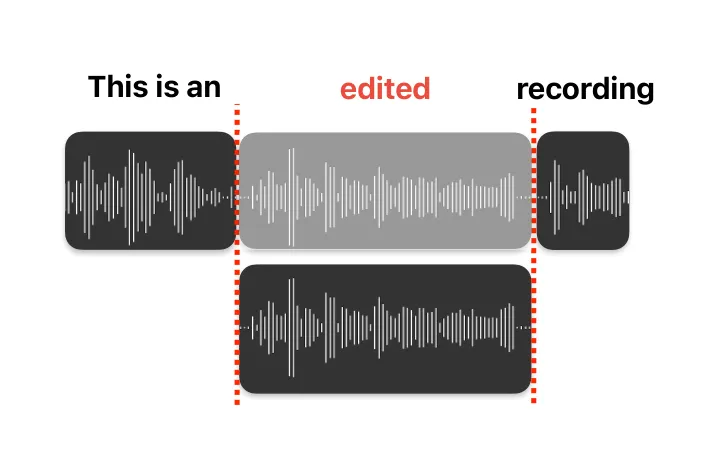

# Speech Editing – a Summary

Tobias Kässmann Email: [tobias.kaessmann@kit.edu](mailto:)    Yining Liu
Email: [yining.liu9@kit.edu](mailto:)    Danni Liu
Email: <danni.liu@kit.edu>

###### Abstract

With the rise of video production and social media, speech editing has
become crucial for creators to address issues like mispronunciations,
missing words, or stuttering in audio recordings. This paper explores
text-based speech editing methods that modify audio via text transcripts
without manual waveform editing. These approaches ensure edited audio is
indistinguishable from the original by altering the mel-spectrogram.
Recent advancements, such as context-aware prosody correction and
advanced attention mechanisms, have improved speech editing quality.
This paper reviews state-of-the-art methods, compares key metrics, and
examines widely used datasets. The aim is to highlight ongoing issues
and inspire further research and innovation in speech editing.

## 1 Introduction

As audio data becomes increasingly prevalent in our daily lives,
especially due to the rise of video production and audio sharing on
social media platforms like Instagram, speech editing has become a
crucial tool for improving creators’ efficiency. Issues such as
mispronunciations, missing words, or stuttering can disrupt recordings,
making speech editing essential to avoid the need for redoing entire
recordings Wang et al. (2023b); Tan et al. (2021). A text-based speech
editing approach is particularly beneficial for post-editing audio data
using a text transcript Morrison et al. (2021).

Speech editing involves altering words and phrases based on a text
transcript of an audio utterance. This can be achieved by textually
deleting or cutting unwanted words and phrases, copying and pasting them
to different locations within the text, or even inserting new unseen
text, which has to be generated for this purpose into the
text-transcript, as illustrated in Figure 1. These changes are then
propagated to the audio recording, by altering the mel-spectrogram Davis
and Mermelstein (1980) of the original audio, without the need for
manual waveform editing Morrison et al. (2021); Wang et al. (2023b); Yin
et al. (2022). The goal is to produce edited audio that is
indistinguishable from the original, while ensuring that the original
audio fragments remain unchanged Alexos and Baldi (2024); Peng et al.
(2024).

Figure 1: Speech Editing by inpainting (Example Illustration of an
additional word getting added that was not present before)

One major challenge in speech editing is ensuring that the boundaries of
the edited regions are seamlessly integrated in terms of prosody¹¹ 1 the
patterns of stress and intonation in a language. This can be difficult
when inserted words or phrases do not match the surrounding context in
terms of intonation, stress, rhythm, voice quality, similarity, temporal
smoothness, style, or naturalness Morrison et al. (2021); Wang et al.
(2023b); Cámbara et al. (2024); Tan et al. (2021); Tae et al. (2021).
Additionally, external factors such as environmental noise or packet
loss can affect the quality of the edited audio Borsos et al. (2022).

Neglected at first, recent methods have also emphasized the importance
of stutter removal in speech editing Jiang et al. (2023). Existing
methods often struggle with robustness when dealing with stuttered
speech, leading to over-smoothed outputs that fail to meet quality
criteria and do not generalize well to unseen speakers Borsos et al.
(2022); Cámbara et al. (2024); Jiang et al. (2023). Addressing these
challenges is essential for developing effective speech editing tools
that enhance the quality and naturalness of edited audio.

In order to help with this task, our goal with this paper is to provide
a summary of the topic, a comparison of some noteworthy papers, and
further insights into the current state of the art. We aim to draw more
attention to this research area, encourage more researchers to engage
with this topic, and highlight current issues.

## 2 Metrics

Currently, there are many methods used to determine the performance of a
speech edit system. The most noteworthy ones include the Mean Opinion
Score (MOS), Mel-Cepstral distance measure (MCD), Word Error Rate (WER),
Speaker Similarity (SIM) because they are the most commonly used metrics
as can be seen in Table 3, that presents a comparison of objective
measures, and Table 4 which provides a comparison of subjective measures
used in various papers and their results.

### 2.1 MOS

MOS is the most common measure within the speech editing community, as
almost every research paper uses it or a variant thereof. MOS is a score
that subjectively measures audio quality based on ratings by human
listeners Alexos and Baldi (2024). The MOS score is calculated by asking
human evaluators to rate the audio based on quality criteria on a $`1`$
to $`5`$ Likert scale, where $`1`$ means very unrealistic and $`5`$
means very realistic speech Le et al. (2023); Tan et al. (2021); Yin
et al. (2022); Borsos et al. (2022). According to our own definition, we
hereby declare that "realistic" in this context means that the speech is
coherent with the context, has the correct textual content, and sounds
natural, including pronunciation, intonation, naturalness, and clarity.
The arithmetic mean of these ratings is then calculated, with a higher
MOS value indicating better quality. It is important to note that MOS is
also a recomme ndation by the International Telecommunication Union
(ITU) ²² 2 https://www.itu.int/rec/T-REC-P.85/en – ITU-T Recommendation
P.85, 1994. Telephone transmission quality subjective opinion tests. A
method for subjective performance assessment of the quality of speech
voice output devices.

To gather sufficient data, some research papers use Amazon Mechanical
Turk Turk (2012) like Bai et al. (2022); Morrison et al. (2021); Jiang
et al. (2023). In the case of Morrison et al. (2021), even a listening
test was conducted to assess the hearing capabilities of the testers and
to prevent wrong test results.

An issue with the MOS score is that it is not comparable across
different papers Viswanathan and Viswanathan (2005); Le et al. (2023),
leading to the development of various MOS variants, such as similarity
MOS (sMOS) Le et al. (2023); Yin et al. (2022), quality MOS (qMOS) Le
et al. (2023), comparative mean opinion score (cMOS) Jiang et al.
(2023), Dynamic Time Warping (DNSMos) Reddy et al. (2021); Wang et al.
(2023b) or one with a modified scale based on psychometric properties
Viswanathan and Viswanathan (2005). For instance, Jiang et al. (2023)
employs cMOS, a comparative mean opinion score. Wang et al. (2023b) uses
DNSMos to evaluate noise suppression and target speaker performance,
utilizing the overall score from the DNSMos ³³ 3 DNSMOS P.835 model and
a personalized DNSMos model tailored for target speaker performance
evaluation.

The similarity MOS (sMOS) used by Le et al. (2023); Yin et al. (2022)
measures subjective audio similarity given pairs of audio, while the
qMOS employed by Le et al. (2023) measures subjective quality.

The sheer number of MOS variants and the subjective nature of MOS call
for an automatic measure like MosNet Lo et al. (2019). However, apart
from Wang et al. (2023b) with the use of DNSMos Reddy et al. (2021);
Reddy et al. (2022), automatic measures are not widely used in the
speech community, likely due to the complexity of evaluating human voice
and the challenges models like MosNet Lo et al. (2019) still face in
evaluation.

### 2.2 MCD

Another rather popular measure is the MCD Kubichek (1993a) measure, a
common objective metric used by several studies Alexos and Baldi (2024);
Bai et al. (2022); Tan et al. (2021); Jiang et al. (2023); Wang et al.
(2023b); Jin et al. (2017). It computes the spectral dissimilarity
between two mel-spectrograms Alexos and Baldi (2024); Davis and
Mermelstein (1980), where a lower MCD value indicates better speech
quality Tan et al. (2021).

The MCD analysis can be performed on three segments: the modified
region, the unmodified region, and the entire utterance. However, aside
from Tan et al. (2021), no other study we found has investigated these
segments in detail. Most studies compare the synthesized utterance
directly to the reference (altered) audio.

Although the MCD is widely used in the voice conversion (VC) community
to automatically measure the quality of converted speech, it has its
limitations. One significant drawback is the lack of correlation with
human perception, as the function only measures the distortion of
acoustic features and does not capture subjective human judgments Lo
et al. (2019). Another limitation is that it assumes a deterministic
output given the input, which is often unrealistic. Therefore, Le et al.
(2023) advocates for other reproducible model-based perceptual metrics.

### 2.3 SIM and WER

In addition to the objective MCD measure, other objective measures such
as the WER and SIM are often used within the community to provide
additional means of comparing their works.

SIM measures the coherence of audio utterances. This is done by
calculating the cosine similarity difference between the generated
embeddings and the ground truth embeddings of the audio utterances
Cámbara et al. (2024); Le et al. (2023); Wang et al. (2023a); Wang
et al. (2023b); Peng et al. (2024); Kharitonov et al. (2021). There are
several ways to generate these embeddings, such as the WavLM-TDCNN
embeddings Chen et al. (2022) used by Peng et al. (2024); Cámbara et al.
(2024), NeMo’s TitaNet-Large Wang et al. (2023b), or the Google Cloud
speech-to-text API Tae et al. (2021).

The Google Cloud speech-to-text API⁴⁴ 4
[https://cloud.google.com/speech-to-text/?hl=en](https://cloud.google.com/speech-to-text/?hl=en)
was also used by Tae et al. (2021) to examine the WER, which measures
the fidelity of the generated audio with respect to its provided
transcription Wang et al. (2023b). Other papers measured WER using the
open-sourced Whisper-Medium ASR Cámbara et al. (2024); Radford et al.
(2022), HuBERT Hsu et al. (2021) for English settings. For multilingual
settings also Whisper Radford et al. (2023) can be used as in the works
of Le et al. (2023), or for example the NeMo’s STT En Conformer
Transducer Large model, a variant of the model proposed by Gulati et al.
(2020), as used by Wang et al. (2023b).

### 2.4 Datasets

|                                         |          |       |          |            |
| --------------------------------------- | -------- | ----- | -------- | ---------- |
| Paper                                   | LJSpeech | VCTK  | LibriTTS | Additional |
| AttentionStitch Alexos and Baldi (2024) | $`X`$    | $`X`$ |          |            |
| A3T Bai et al. (2022)                   | $`X`$    | $`X`$ |          |            |
| Speechpainter Borsos et al. (2022)      |          | $`X`$ | $`X`$    |            |
| Editts Tae et al. (2021)                | $`X`$    |       |          |            |
| EditSpeech Tan et al. (2021)            | $`X`$    | $`X`$ |          | $`X^{1}`$  |
| FluentSpeech Jiang et al. (2023)        |          | $`X`$ | $`X`$    | $`X^{2}`$  |
| RetrieverTTS Yin et al. (2022)          |          |       | $`X`$    |            |
| Morrison2021 Morrison et al. (2021)     | $`X`$    |       |          | $`X^{3}`$  |

Table 1: Comparison of datasets used by the Speech edit community  
1: MST Aishell-3 (Chinese), 2: SASE, 3: The Everyday Life of Abraham
Lincoln read by Bill Boerst

Most Researchers within the speech edit community focus on the three
main datasets, as depicted in Table 1, namely VCTK Veaux et al. (2017),
a roughly $`44h`$ newspaper speech dataset, with recordings from $`110`$
English speakers with various accents. LJSpeech Ito and Johnson (2017),
a dataset consisting out of 24h short audio clips from a single English
speaker as well as LibriTTS Zen et al. (2019), a roughly $`585`$ hour
dataset without significant background noise. The issues with those
recordings is, that they only consist out of audiobooks, so Peng et al.
(2024) created REALEDIT, a dataset with diverse content, accents,
speaking styles, recording conditions, and background sounds from
audiobooks Zen et al. (2019) YouTube videos Chen et al. (2021) and
Spotify podcasts Clifton et al. (2020).

## 3 Recent Works

Recent advancements in speech editing technologies have enabled more
precise and natural modifications of audio recordings. These innovations
address various challenges such as prosody mismatches and unnatural
boundary artifacts, which are common issues in speech editing.

### 3.1 VoCo

The VoCo approach, introduced by Jin et al. (2017), represents an early
method in speech editing that generates a generic voice audio using Text
to speech (TTS) technology. This audio is then morphed to match the
target voice to be then integrated into the original audio recording.

However, this method often results in unnatural-sounding audio because
the generated audio does not match its context. Consequently, this leads
to non-smooth boundary artefacts Morrison et al. (2021); Alexos and
Baldi (2024); Peng et al. (2024); Bai et al. (2022); Tan et al. (2021).

### 3.2 Context-Aware Prosody Correction for Text-Based Speech Editing

To address those unnatural boundaries within the edit regions due to the
prosody mismatches. Morrison et al. (2021) propose using a context-aware
method to produce more natural-sounding audio. Their approach utilizes a
model based on prior work in neural prosody generation, speech
generation, speech manipulation (pitch and time shifting), and speech
editing.

First they generate Context-Aware prosody through a series of Neural
Network (NN) from the input phonemes. The networks hereby predict
phoneme durations and their pitch. then they adjust the prosody features
by pitch shifting and time stretching, using the TD-PSOLA Moulines and
Charpentier (1989) algorithm. Lastly they remove the artefacts resulting
from signal manipulation using a denoising hifi-Generative Adversarial
Network (GAN) ensuring high-fidelity results.

This comprehensive approach enhances the naturalness of edited speech by
addressing prosody mismatches and eliminating artifacts, leading to more
seamless audio integration.

### 3.3 SpeechPainter

SpeechPainter, developed by Borsos et al. (2022), leverages advanced
attention mechanisms within its transformer model to seamlessly infill
gaps in audio recordings up to one second, maintaining speaker identity,
prosody, and recording environment conditions. Additionally, it can
generalise to unseen speakers through in-context learning Peng et al.
(2024); Alexos and Baldi (2024).

The model employs a non-Autoregressive (AR) (non-AR) architecture based
on PerceiverIO Jaegle et al. (2022) to avoid robotic training artefacts
in the second training step. It processes data in the form of a (in
training randomly) masked, non-overlapping batched log-mel spectrogram,
transformed into a $`1D`$ array and concatenated using $`2D`$ Fourier
positional embeddings. Textual data is padded and transformed into
batched $`UTF-8`$ embeddings with added Fourier positional embeddings
and two learned modality embeddings appended to both. These inputs are
processed as the key/value in the cross-attention encoder, with the
query provided by a learned fixed-size latent.

These values are then fed into $`k`$ transformer blocks with
self-attention. The output of the last self-attention layer is passed to
a decoder as key/value, analogous to the encoder, using an output
latent. The model then returns a log-mel spectrogram after projecting it
to the target spectrogram dimension.

Training was conducted in two phases, both utilising the Adam optimizer.
The first phase trains using $`L1`$ loss on mel-spectrograms to learn
correct identification/inpainting of the content of the gap based on the
target transcript, maintaining speaker identity, prosody, and the target
environment. However, this creates robotic artefacts, which are removed
using adversarial training, thus improving perceptual quality. This is
achieved by training a discriminator based on Convolutional Neural
Network (CNN) s to learn the representation of original and created
mel-spectrograms. The discriminator is trained with a hinge loss, and
the model is compared against it to ensure it is not detected as
incorrect by the discriminator.

Experiments were conducted using a neural vocoder⁵⁵ 5 ”Voice Coder” - A
synthesizer that produces sounds from an analysis of speech input.
(MelGAN Kumar et al. (2019) architecture) trained on a multi-scale
reconstruction and adversarial loss of the wave and stat-based
discriminators to synthesize the audio from the log-mel spectrograms. No
pre-training or transfer learning was used for the reconstruction of the
whole sentence from three-second audio samples. The model utilized two
feed-forward neural networks (FFNNs) in the attention blocks.

### 3.4 EditSpeech

Models such as the one proposed by EditSpeech Tan et al. (2021)
condition text generation on the surrounding context to maintain
naturalness and quality Bai et al. (2022); Jiang et al. (2023). The
method proposed by EditSpeech Tan et al. (2021) divides the audio into
edit and non-edit regions. The non-edit regions are directly copied to
the output, while the edit regions are processed using an AR Neural
Text-to-Speech (NTTS) model to generate frames in both forward and
backward directions to incorporate context. These generated frames are
then merged to create fused mel-spectrograms by selecting the best
frames based on context information. This bidirectional fusion ensures
smooth boundaries on both sides Tan et al. (2021); Alexos and Baldi
(2024); Peng et al. (2024).

This approach improves upon methods like VoCo Jin et al. (2017), which
rely on unit selection speech synthesis, by enabling the generation of
arbitrary text based on context without needing additional audio
recordings Tan et al. (2021). However, a drawback of this method is its
compatibility only with AR decoding models and its heavy reliance on
speaker embeddings, which limits its transferability to new speakers Bai
et al. (2022).

The EditSpeech architecture consists of an acoustic model, a duration
predictor, and a vocoder.

The duration predictor forecasts the length of the to-be-inserted
sequence based on the edited text. It is trained by minimizing the
duration loss between the logs of the ground-truth and the predicted
duration. This involves assessing the prediction error and multiplying
it by the predicted duration.

The acoustic model employs a text encoder, a speech encoder, a length
regulator, a "prenet", and forward and backward decoders. The
phone-level text embeddings sequence (obtained by a Grapheme-to-Phoneme
(G2P) module) is encoded by the encoder. The length regulator expands
text embeddings into frame-level embeddings according to the length
prediction, aligning the time frames’ position. The prenet preprocesses
preceding spectrograms and changes their representation to concatenate
with the frame-level hidden representation, which is then fed into the
decoders. The decoders consist of one forward and one backward decoder,
each comprising two unidirectional Long short-term memory (LSTM) s to
synthesize mel-spectrograms. These mel-spectrograms are then stitched
together at the point where their frame-level $`L2`$ norms differ the
least.

The vocoder used by EditSpeech is a HiFi-GAN Kong et al. (2020) ⁶⁶ 6
UNIVERSAL 1
[https://github.com/jik876/hifi-gan](https://github.com/jik876/hifi-gan),
which creates speech from a mel-spectrogram.

Training involved several steps for all components in batches using the
Adam optimizer. Initially, the data was prepared by pairing speech
utterances with text transcriptions and speaker identities.
Mel-spectrograms were computed from speech utterances using Tacotron2
Shen et al. (2018) signal processing configurations, and ground-truth
phone durations were obtained using an Hidden Markov Model (HMM)-based
forced aligner.

Training steps began by concatenating the text embeddings, speaker
embeddings, and positional embeddings to get the frame-level hidden
representation. The mel-spectrograms were synthesized by forward and
backward decoders by processing preceding frame representations through
a prenet and then through unidirectional LSTM s, where the decoders
minimized both forward and backward mel-spectrogram loss. The duration
predictor was trained by minimizing the duration loss between the logs
of the ground-truth and predicted durations. Finally, fusion occurred at
the point where the frame-level $`L2`$ norms of the forward and backward
predicted mel-spectrograms differed the least, marking the transition
from forward to backward generation.

Deletion, insertion, and replacement operations were tested with
different presets. For deletion, forced alignment located the start and
end times of the phones to remove the speech frames in the input
mel-spectrogram. For insertion and replacement, users specified the word
position for insertion or text replacement. The G2P module processed the
original text and replacement text into phone sequences. Forced
alignment with the original text determined the duration sequence. The
edited phone sequence, duration, and speaker embedding, along with
positional embeddings, were then used as input to generate frame-level
hidden representations. Forward and backward decoders then synthesized
mel-spectrograms, ensuring smooth transitions between edited and
non-edited regions.

In general, the system generates mel-spectrograms in partial inference
for both forward and backward directions. For unmodified regions, the
predicted frame is discarded, and the original frame is fed to the
prenet and recurrent decoder for the next frame prediction. For modified
regions, the predicted frame is used for subsequent predictions.

### 3.5 A3T

Recently, masked prediction models such as A3T Bai et al. (2022) have
demonstrated improved contextual learning from input mel-spectrograms,
significantly enhancing quality and prosody modeling Jiang et al.
(2023).

A3T achieves this by utilizing forced alignment and G2P conversion,
similar to EditSpeech Tan et al. (2021), using the HTK Young et al.
(2006) method and an external English duration predictor based on
FastSpeech2 Ren et al. (2022). The duration predictor, analogous to the
one in EditSpeech, predicts the length of the masked segments, taking
into account the ratio of original to edited segments. This ensures the
alignment and timing of the generated spectrogram are coherent with the
original input. These steps in combination ensure accurate phoneme
alignment and duration prediction.

The model uses cross-modal alignment embeddings in its BERT-style
architecture. By combining position and alignment embeddings on top of
the text and speech embeddings, which are then concatenated, the model
aligns text and audio more effectively. This approach is an enhancement
over EditSpeech’s method of simply concatenating text and speaker
embeddings with positional embeddings, as it enables the prediction of
contextually coherent speech using masked reconstruction with the
Conformer Gulati et al. (2005) architecture Peng et al. (2024); Alexos
and Baldi (2024).

A3T operates by using these embeddings in combination with a non-AR
encoder to predict high-quality spectrograms, which are then refined
using a five-layer CNN post-net. This refinement step helps generate
more accurate and high-quality spectrograms, a step not present in the
EditSpeech model. Additionally, it allows for faster inference and
avoids some of the pitfalls of AR models, such as error accumulation.

The encoder and decoder are realized using the Conformer architecture,
which integrates a CNN module and a feed-forward module. In experiments,
A3T performed better than the traditional transformer in acoustic text
processing, indicating an improvement over Tan et al. (2021)’s
LSTM-based forward and backward decoders.

Finally, the spectrogram is converted into an audio wave using a
Parallel WaveGAN Yamamoto et al. (2020) vocoder, different from Tan
et al. (2021)’s use of HiFi-GAN.

A3T is trained by masking random utterances and phones in the middle of
sentences during training. Similar to the insertion and replacement
process by Tan et al. (2021), the embeddings are passed through eight
Conformer layers. The output of these layers is combined with the
post-net output to generate the final mel-spectrogram. The model is
evaluated on its ability to reconstruct masked speech segments
(repainting) conditioned on ground truth. The repainted speech is
compared to human re-recordings to assess quality and naturalness.

A downside of this approach is that it assumes a deterministic mapping
from text and context to the target, which is only realistic for very
short segments Le et al. (2023).

### 3.6 VoiceBox

Le et al. (2023) proposed VoiceBox, a generative model that uses non-AR
flow matching to infill speech given audio context and text. It can
perform several tasks such as noise removal (through infilling), content
editing, and style conversion Cámbara et al. (2024); Peng et al. (2024);
Le et al. (2023); Tae et al. (2021). Unlike models such as A3T from Bai
et al. (2022) and SpeechPainter Borsos et al. (2022), which are only
feasible for short segments and assume a deterministic mapping from text
and context to the target, Le et al. (2023)’s approach can infill data
of any length and does not assume such a deterministic mapping.
Additionally, VoiceBox can be trained on "in-the-wild" datasets with
significant variation.

The infilling approach of VoiceBox involves generating speech segments
based on surrounding audio context and corresponding text transcripts.
Unlike previous models, VoiceBox does not rely on explicit audio style
labels (e.g., speaker identity or emotion), making it more scalable and
adaptable to diverse generative tasks. Le et al. (2023)

VoiceBox is built on a non-AR continuous normalizing flow (CNF)
architecture. It trains the CNF model to map a simple prior distribution
to the target speech distribution and uses in-context learning by
utilizing both preceding and succeeding context during generation,
making it suitable for editing tasks where only a segment of speech
needs to be generated. This contrasts with AR models, which generate
speech sequentially from start to end.

Lastly, VoiceBox decouples audio and duration modeling, allowing for
more precise control over alignment and the integration of continuous
features. Although A3T and EditSpeech incorporate duration predictors,
VoiceBox’s approach offers more flexibility in handling different
generative tasks.

### 3.7 SpeechX

The model proposed in Wang et al. (2023b) combines neural codec language
modeling with a non-AR transformer to generate codec or acoustic tokens
based on input, employing multi-task learning with task-dependent
prompting Cámbara et al. (2024). Unlike Bai et al. (2022), which is
restricted to clean signals and lacks the ability to modify spoken
content while preserving background sounds, this approach addresses
these limitations for "noisy speech editing". Additionally, unlike
VoiceBox, which expects noisy signals to be surrounded by clean
segments, this method does not have such constraints due to its design
that allows task prompt tasks. This model preserves background noise
during speech editing Wang et al. (2023b). However, its performance is
constrained by the accuracy of the neural codec model for acoustic
tokenization Wang et al. (2023b).

SpeechX integrates several advanced components to achieve its goals,
distinguishing itself from previous models such as SpeechPainter,
EditSpeech, A3T, and VoiceBox. SpeechX employs EnCodec Défossez et al.
(2022), a neural codec modeling architecture (encoder-decoder),
producing a sequence of neural codecs that are converted to waveforms
using a codec decoder. It receives a G2P, like A3T and EditSpeech, for
text input for semantic tokens, and audio tokens are obtained by a
neural codec model encoder. Both are embedded using sinusoidal style
embedding projection.

The model uses both non-AR and AR transformer models. The AR model
outputs neural codes, while the non-AR model generates neural codes for
all layers, balancing generation flexibility and inference speed. During
training, SpeechX was trained by swapping randomly between tasks like
noise suppression and speech removal to prevent overfitting.

### 3.8 FluentSpeech

FluentSpeech Jiang et al. (2023) is a context-aware, diffusion-based
speech editing model designed for stutter removal without the
over-smoothing seen in previous approaches Peng et al. (2024). It
iteratively refines modified mel-spectrograms with guidance from context
features and a stutter predictor injected into its hidden sequence.

Building upon the works of Tan, Jin, Wang, and Bai Tan et al. (2021);
Jin et al. (2017); Wang et al. (2022); Bai et al. (2022), FluentSpeech
aims to learn better contextual information from input mel-spectrograms.
FluentSpeech outperforms these methods in terms of quality and prosody
modeling. Previous methods only addressed reading-style speeches,
leaving stutter removal a significant challenge Jiang et al. (2023).
Traditional stutter removal techniques often result in blurry
mel-spectrograms lacking detail, creating unnatural sounds in the edited
regions and requiring manual determination of the utter regions.
FluentSpeech addresses these issues automatically using its stutter
predictor Jiang et al. (2023), which localizes stutter regions and
injects stutter embeddings into the text’s hidden sequence to reduce
discrepancies between the text and the stuttering speech recording Jiang
et al. (2023).

However, it is important to note that FluentSpeech was only tested on
English speech data, which may limit its generalizability to other
languages and dialects Jiang et al. (2023).

FluentSpeech’s architecture integrates a linguistic encoder, which is
transformer-based, transforming the phoneme sequence of the
transcription into a hidden text sequence. This approach aligns with the
transformer architecture used in A3T but focuses specifically on stutter
removal. A context-aware spectrogram denoiser in the form of a WaveNet
van den Oord et al. (2016) aggregates various features, including
phoneme embeddings, acoustic embeddings, pitch embeddings, and stutter
embeddings, similar to the context conditioning module in EditSpeech.
This enhances the quality of the reconstructed mel-spectrograms, in
conjunction with the stutter predictor.

Due to the modality gap between text and speech, FluentSpeech emphasizes
alignment modeling Jiang et al. (2023). It employs a masked duration
predictor to achieve fluent duration transitions in edited regions.

### 3.9 VoiceCraft

VoiceCraft Peng et al. (2024) introduces a regressive transformer
decoder architecture for neural codec token infilling, similar to
SpeechX, but with a distinct emphasis on AR prediction and bidirectional
context. Their model refines AR sequence prediction and uses masked
delayed stacking to enable generation within an existing sequence.
VoiceCraft rearranges output tokens through causal masking with AR
continuation or infilling within the bidirectional context and employs
two delayed stacking mechanisms (multi-code block modeling).

The causal masking procedure moves the masked spans to the end of the
sequence, allowing the model to use both past and future unmasked tokens
during infilling. This bidirectional context is a significant
advancement over the unidirectional approaches in models like
EditSpeech. The delayed stacking mechanism ensures efficient
multi-codebook modeling by delaying the integration of different
codebook tokens until a later stage in the process.

The utilization of delayed stacking and causal masking contrasts with
the cross-modal alignment embeddings in A3T and the forward-backward
decoding in EditSpeech. This allows VoiceCraft to achieve more accurate
and contextually coherent infilling and continuation compared to the
unidirectional approaches in A3T and EditSpeech.

The model employs a transformer decoder architecture, trained on AR
sequence prediction. During training, spans of tokens are randomly
masked, and the model predicts these masked tokens based on the unmasked
tokens, similar to the masked reconstruction approach in A3T but with
different masking and stacking techniques. VoiceCraft addresses
limitations seen in VoiceBox, which expects noisy signals to be
surrounded by clean segments. VoiceCraft’s flexible approach to sequence
generation makes it more adaptable to various audio conditions without
such constraints. However, it still faces some limitations, such as
occasional long silences or scratching sounds. Peng et al. (2024)

### 3.10 Attention Stitch

AttentionStitch Alexos and Baldi (2024) separates the TTS generation
from the actual editing process, morphing the TTS-generated data into
the edited portion. This is achieved by using a pre-trained TTS model
and incorporating a double attention block network on top of it to
automatically merge the synthesized mel-spectrogram with that of the
edited text. According to their measurements, this approach enhances the
naturalness of the stitched audio by creating a smoother audio segment.

Unlike SpeechPainter, EditSpeech, A3T, and FluentSpeech, which integrate
the generation and editing processes, AttentionStitch separates TTS
generation from the editing process. This separation allows for more
precise control over the editing process and the use of pre-trained
high-quality TTS models, leading to a unique model architecture.

The model uses a pre-trained FastSpeech2 Ren et al. (2022) TTS model
similar to Bai et al. (2022), taking phonemes of the edited text as
input to generate an initial mel-spectrogram. This contrasts with the
models in EditSpeech, VoiceBox, and SpeechX, which do not explicitly
utilize pre-trained TTS models for this purpose. This synthesized
mel-spectrogram is then concatenated with a masked reference
mel-spectrogram (with $`10\%`$ of its content near the center masked).
On top of this, a double attention block network is used to merge the
synthesized mel-spectrogram with the edited text’s mel-spectrogram,
ensuring a smooth transition between the synthesized and reference
segments.

This approach is distinct from the cross-modal alignment embeddings used
in A3T, the forward-backward decoding in EditSpeech, and the
diffusion-based approach in FluentSpeech. To refine the output,
AttentionStitch uses a post-net module and a HiFi-GAN vocoder similar to
the approach of Morrison et al. (2021) to transform the mel-spectrogram
into a waveform. Skip connections are employed between the output of the
double attention block and the post-net, as they have proven beneficial
in speech synthesis Alexos and Baldi (2024); Tu and Zhang (2017); Shi
et al. (2018).

During training, masking is performed by replacing corresponding parts
of the mel-spectrogram with zeros, and the reference text is modified by
replacing words with target words. To ensure the reference
mel-spectrogram has the same length, they use the duration predictor of
FastSpeech2 to resize the mask accordingly, similar to the approach used
in A3T. The speech editing operation takes place within the double
attention block, where a mean average error loss is used for both the
double attention block and the post-net.

AttentionStitch deliberately avoids comparing with fully resynthesized
edited text because the final audio sample, though indistinguishable in
the edited part, differs from the reference audio. For the VCTK dataset,
AttentionStitch is compared to competitive methods like A3T and
EditSpeech. Models like SpeechPainter were excluded from the comparison
due to their specific limitations and evaluation contexts, as
SpeechPainter is limited to filling small gaps with the same text.

### 3.11 Mapache

AR modeling, which limits speech synthesis to left-to-right generation,
is unsuitable for producing speech edits free from audio discontinuities
Cámbara et al. (2024). Mapache addresses this limitation by utilizing a
non-AR architecture with parallel sequence-to-sequence transformers to
model discrete text and speech representations, allowing for both speech
editing and synthesis Cámbara et al. (2024). Unlike SpeechX, EditSpeech,
and Voicecraft that employ AR models, this approach enables more
flexible and natural speech editing even if there are discontinuities in
the audio, which cause difficulties to other AR models.

The architecture of Mapache consists of four main components. First, a
speech tokenizer uses a VQ-VAE (Vector Quantized Variational
Autoencoder) van den Oord et al. (2018) with an RNN prosody encoder post
VQ codebook to convert the waveform into tokenized log-mel spectrograms.
These spectrograms are then tokenized using the VQ encoder, with
optimization based on mean squared error and commitment loss between the
predicted and actual spectrogram.

The core component of Mapache is the parallel language modeling
transformer, speechMPT, which takes the tokenized speech and text inputs
to create embeddings and speech tokens. The transformer is composed of
$`30`$ blocks, each consisting of two $`16`$-head attention layers
followed by a feed-forward layer (using GeGLU Shazeer (2020)) with skip
connections Cámbara et al. (2024). The first attention layer performs
self-attention over the masked and token embeddings, while the second
layer performs cross-attention between text and speech embeddings,
similar to the mechanisms used by Borsos et al. (2022).

Next, a diffusion decoder (DiT-DDPM⁷⁷ 7 based on DDPM
[https://github.com/openai/improved-diffusion](https://github.com/openai/improved-diffusion)
and Peebles and Xie (2023)) upscales the speech tokens or embeddings
into log-mel spectrograms. This component uses denoising diffusion
probabilistic models (DDPMs) and incorporates self-attention layers to
refine the embeddings, enhancing speaker identity and speech
articulation in the output. This is similar to the approaches used by
Jiang et al. (2023) and Le et al. (2023), which also incorporate
denoising and refinement techniques to enhance the quality of the
generated speech.

Finally, a vocoder (UnivNet Jang et al. (2021)) synthesizes the log-mel
spectrograms into waveforms, completing the process.

## 4 Discussion

The comparison between the models is not straightforward due to several
factors: some models are not openly accessible like Wang et al. (2023b);
Borsos et al. (2022), are trained on partially inaccessible files like
Cámbara et al. (2024), or are trained on a mixture of datasets that
differ in quality and focus like Cámbara et al. (2024); Jiang et al.
(2023); Wang et al. (2023b); Peng et al. (2024). Moreover, even if they
were trained on the same dataset, their method of how they edited the
data, prepossessed it as well as tested it on which task with which
method differs so greatly, that it is almost impossible to compare two
publications directly.

Additionally, the term "speech editing" is loosely defined, encompassing
even smaller sub-parts of the process, and papers often use qualitative
or different incomparable measures, making direct comparisons difficult.
However, we attempt to address these issues in this section.

As stated previously, even though the datasets are different and have
varying focuses, as discussed in Section 1 and highlighted in Figure 1,
most models are tested on the VCTK Veaux et al. (2017) and LJSpeech Ito
and Johnson (2017) datasets. This commonality allows us to group them
together and examine their results. We have grouped the objective
measures in Table 3 and the subjective measures in Table 4, organized by
their dataset and sorted by their measure.

As shown in Table 3, most models use the MOS to evaluate their
performance. However, the MOS measurements themselves vary across
research papers. Some studies measure the overall quality of speech Le
et al. (2023); Jiang et al. (2023), while others break it down into
subcategories like naturalness, intelligibility, and speaker similarity
Peng et al. (2024); Jiang et al. (2023), or do not evaluate it
distinctively against other baselines Bai et al. (2022). Moreover, an
intrinsic problem with MOS is that different raters might weigh its
components differently, making it difficult to compare across papers as
described in Section 2.1.

While it is feasible to compare different models within a single paper
using the MOS measure, comparisons between papers are not possible due
to its subjective nature. Therefore, we also created a table showing
which papers have been compared using which measure, as seen in Table 5.

Another subjective measure used by Cámbara et al. (2024) is the Multiple
Stimuli with Hidden Reference and Anchor (MUSHRA). MUSHRA is a measure
approved by the ITU ⁸⁸ 8
https://www.itu.int/rec/R-REC-BS.1534-3-201510-I/en as a standard method
for the subjective assessment of intermediate quality levels of audio
systems. However, apart from Cámbara et al. (2024), no other featured
paper here used it to measure subjective performance. The scores for the
subjective measures can be found in Table 3.

The research papers reviewed also include objective measures, as
illustrated in Table 4. Most research teams used WER and similarity
measures, which are common for TTS tasks. This is because TTS is a
significant component of speech editing, as newer papers often first
generate text using TTS and then morph it into the context speaker’s
voice Morrison et al. (2021); Alexos and Baldi (2024); Peng et al.
(2024); Bai et al. (2022); Tan et al. (2021). Nevertheless, there are
noticeable differences, such as the use of objective similarity measures
"sim-o" and "sim-r," which differ from other similarity measures. Apart
from WER and similarity measures, other measures such as Perceptual
evaluation of speech quality (PESQ) Rix et al. (2001), short-time
objective intelligibility measure (STOI) Taal et al. (2010), and MCD
Kubichek (1993b) are used. PESQ and STOI indicate speech quality and
intelligibility, respectively Jiang et al. (2023), and were employed by
EditSpeech Tan et al. (2021) to compare models. However, the biggest
challenge is that due to varying task descriptions—like inpainting of a
word, phrase, or syllable, and noisy versus clean speech editing—papers
are difficult to compare directly.

| Paper                                  | Language | Multi speaker | Unique Attribute                     |
| -------------------------------------- | -------- | ------------- | ------------------------------------ |
| VOCO Jin et al. (2017)                 | English  | Yes           |                                      |
| AttentionStich Alexos and Baldi (2024) | English  | Yes           |                                      |
| VoiceCraft Peng et al. (2024)          | English  | Yes           | Realistic, Noisy data                |
| Mapache Cámbara et al. (2024)          | English  | Yes           | Amazon inhouse, Can not be evaluated |
| Voicebox Le et al. (2023)              | English¹ | Yes           | Realistic, Noisy data                |
| A3T Bai et al. (2022)                  | English  | Yes           |                                      |
| Speechpainter Borsos et al. (2022)     | English  | Yes           |                                      |
| Editts Tae et al. (2021)               | English  | No            |                                      |
| Editspeech Tan et al. (2021)           | English² | Yes           |                                      |
| Fluentspeech Jiang et al. (2023)       | English  | Yes           |                                      |
| SpeechX Wang et al. (2023b)            | English  | Yes           | Noisy data                           |
| RetrieverTTS Yin et al. (2022)         | English  | Yes           |                                      |
| Morrison Morrison et al. (2021)        | English  | No            |                                      |

Table 2: Depiction of the languages the models were trained and tested
with  
$`1`$: it was additionaly also evaluated on French, German, Spanish,
Polish, and Portuguese; $`2`$: Chinese

Some models, such as Borsos et al. (2022), were not tested on any
objective measures, or were incomparable due to different focuses and
single-versus-multi-speaker scenarios, as highlighted in Table 2. While
some research teams emphasized the use of many languages and tested
their models accordingly, such as Tan et al. (2021) with Chinese and Le
et al. (2023), which tested without multiple languages, others
emphasized multi-speaker datasets with multiple English accents for
robustness. Only the works of Tae et al. (2021) and Morrison et al.
(2021) focused on single-speaker text editing using the LJSpeech Ito and
Johnson (2017) dataset.

An interesting finding for zero-shot performance is that newer models
place more emphasis on the use of realistic, in-the-wild data to enhance
their models with data that has worse acoustic quality, noise, or
stuttering Peng et al. (2024); Cámbara et al. (2024); Le et al. (2023).
In some cases, data was deliberately mixed with noisy samples to degrade
the quality of the training and test datasets Wang et al. (2023b).

## 5 Conclusion

Speech editing is an established discipline that has recently been
significantly advanced by the rise of Transformers Vaswani et al. (2017)
and their corresponding attention layers. This technological leap has
brought new capabilities and precision to the field. Moreover, the
growing interest from major tech companies in speech editing is likely
to accelerate the development of advanced speech editing systems.

Transformers, such as ChatGPT and other models, have already integrated
into everyday life, and the next major development is likely to be
enhanced TTS systems, which play a crucial role in speech editing. Our
contribution with this paper aims to leverage current knowledge and
inspire more researchers and students to delve into the topic of speech
editing. By providing a comprehensive comparison of the latest methods,
their similarities, challenges, and drawbacks, we hope to offer valuable
insights and foster increased interest and innovation in this field.

## References

- Alexos and Baldi (2024) Antonios Alexos and Pierre Baldi. 2024.
  [Attentionstitch: How attention solves the speech editing
  problem](https://doi.org/10.48550/ARXIV.2403.04804).
- Bai et al. (2022) He Bai, Renjie Zheng, Junkun Chen, Mingbo Ma,
  Xintong Li, and Liang Huang. 2022. [A³T: Alignment-aware acoustic and
  text pretraining for speech synthesis and
  editing](https://proceedings.mlr.press/v162/bai22d.html). In
  _Proceedings of the 39th International Conference on Machine
  Learning_, volume 162 of _Proceedings of Machine Learning Research_,
  pages 1399–1411. PMLR.
- Borsos et al. (2022) Zalán Borsos, Matt Sharifi, and Marco
  Tagliasacchi. 2022. [Speechpainter: Text-conditioned speech
  inpainting](https://arxiv.org/abs/2202.07273).
- Chen et al. (2021) Guoguo Chen, Shuzhou Chai, Guanbo Wang, Jiayu Du,
  Wei-Qiang Zhang, Chao Weng, Dan Su, Daniel Povey, Jan Trmal, Junbo
  Zhang, Mingjie Jin, Sanjeev Khudanpur, Shinji Watanabe, Shuaijiang
  Zhao, Wei Zou, Xiangang Li, Xuchen Yao, Yongqing Wang, Yujun Wang,
  Zhao You, and Zhiyong Yan. 2021. [Gigaspeech: An evolving,
  multi-domain asr corpus with 10,000 hours of transcribed
  audio](https://doi.org/10.48550/ARXIV.2106.06909).
- Chen et al. (2022) Sanyuan Chen, Chengyi Wang, Zhengyang Chen, Yu Wu,
  Shujie Liu, Zhuo Chen, Jinyu Li, Naoyuki Kanda, Takuya Yoshioka, Xiong
  Xiao, et al. 2022. Wavlm: Large-scale self-supervised pre-training for
  full stack speech processing. _IEEE Journal of Selected Topics in
  Signal Processing_, 16(6):1505–1518.
- Clifton et al. (2020) Ann Clifton, Sravana Reddy, Yongze Yu, Aasish
  Pappu, Rezvaneh Rezapour, Hamed Bonab, Maria Eskevich, Gareth Jones,
  Jussi Karlgren, Ben Carterette, and Rosie Jones. 2020. [100,000
  podcasts: A spoken English document
  corpus](https://doi.org/10.18653/v1/2020.coling-main.519). In
  _Proceedings of the 28th International Conference on Computational
  Linguistics_, pages 5903–5917, Barcelona, Spain (Online).
  International Committee on Computational Linguistics.
- Cámbara et al. (2024) Guillermo Cámbara, Patrick Lumban Tobing,
  Mikolaj Babianski, Ravichander Vipperla, Duo Wang Ron Shmelkin,
  Giuseppe Coccia, Orazio Angelini, Arnaud Joly, Mateusz Lajszczak, and
  Vincent Pollet. 2024. [Mapache: Masked parallel transformer for
  advanced speech editing and
  synthesis](https://doi.org/10.1109/ICASSP48485.2024.10448121). In
  _ICASSP 2024 - 2024 IEEE International Conference on Acoustics, Speech
  and Signal Processing (ICASSP)_, pages 10691–10695.
- Davis and Mermelstein (1980) S. Davis and P. Mermelstein. 1980.
  [Comparison of parametric representations for monosyllabic word
  recognition in continuously spoken
  sentences](https://doi.org/10.1109/TASSP.1980.1163420). _IEEE
  Transactions on Acoustics, Speech, and Signal Processing_,
  28(4):357–366.
- Défossez et al. (2022) Alexandre Défossez, Jade Copet, Gabriel
  Synnaeve, and Yossi Adi. 2022. [High fidelity neural audio
  compression](https://arxiv.org/abs/2210.13438). _Preprint_,
  arXiv:2210.13438.
- Gulati et al. (2005) Anmol Gulati, James Qin, Chung-Cheng Chiu, Niki
  Parmar, Yu Zhang, Jiahui Yu, Wei Han, Shibo, Wang, Zhengdong Zhang,
  Yonghui Wu, and Ruoming Pang. 2005. [Conformer: Convolution-augmented
  transformer for speech
  recognition](https://doi.org/10.48550/ARXIV.2005.08100).
- Gulati et al. (2020) Anmol Gulati, James Qin, Chung-Cheng Chiu, Niki
  Parmar, Yu Zhang, Jiahui Yu, Wei Han, Shibo Wang, Zhengdong Zhang,
  Yonghui Wu, and Ruoming Pang. 2020. [Conformer: Convolution-augmented
  transformer for speech
  recognition](https://doi.org/10.48550/ARXIV.2005.08100).
- Hsu et al. (2021) Wei-Ning Hsu, Benjamin Bolte, Yao-Hung Hubert Tsai,
  Kushal Lakhotia, Ruslan Salakhutdinov, and Abdelrahman Mohamed. 2021.
  Hubert: Self-supervised speech representation learning by masked
  prediction of hidden units. _IEEE/ACM Transactions on Audio, Speech,
  and Language Processing_, 29:3451–3460.
- Ito and Johnson (2017) Keith Ito and Linda Johnson. 2017. The lj
  speech dataset.
- Jaegle et al. (2022) Andrew Jaegle, Sebastian Borgeaud, Jean-Baptiste
  Alayrac, Carl Doersch, Catalin Ionescu, David Ding, Skanda Koppula,
  Daniel Zoran, Andrew Brock, Evan Shelhamer, Olivier Hénaff, Matthew M.
  Botvinick, Andrew Zisserman, Oriol Vinyals, and Joāo Carreira. 2022.
  [Perceiver io: A general architecture for structured inputs &
  outputs](https://arxiv.org/abs/2107.14795). _Preprint_,
  arXiv:2107.14795.
- Jang et al. (2021) Won Jang, Dan Lim, Jaesam Yoon, Bongwan Kim, and
  Juntae Kim. 2021. [Univnet: A neural vocoder with multi-resolution
  spectrogram discriminators for high-fidelity waveform
  generation](https://arxiv.org/abs/2106.07889). _Preprint_,
  arXiv:2106.07889.
- Jiang et al. (2023) Ziyue Jiang, Qian Yang, Jialong Zuo, Zhenhui Ye,
  Rongjie Huang, Yi Ren, and Zhou Zhao. 2023. [Fluentspeech:
  Stutter-oriented automatic speech editing with context-aware diffusion
  models](https://doi.org/10.48550/ARXIV.2305.13612).
- Jin et al. (2017) Zeyu Jin, Gautham J. Mysore, Stephen Diverdi,
  Jingwan Lu, and Adam Finkelstein. 2017. [Voco: text-based insertion
  and replacement in audio
  narration](https://doi.org/10.1145/3072959.3073702). _ACM Transactions
  on Graphics_, 36(4):1–13.
- Kharitonov et al. (2021) Eugene Kharitonov, Ann Lee, Adam Polyak,
  Yossi Adi, Jade Copet, Kushal Lakhotia, Tu-Anh Nguyen, Morgane
  Rivière, Abdelrahman Mohamed, Emmanuel Dupoux, et al. 2021. Text-free
  prosody-aware generative spoken language modeling. _arXiv preprint
  arXiv:2109.03264_.
- Kong et al. (2020) Jungil Kong, Jaehyeon Kim, and Jaekyoung Bae. 2020.
  [Hifi-gan: Generative adversarial networks for efficient and high
  fidelity speech synthesis](https://arxiv.org/abs/2010.05646).
  _Preprint_, arXiv:2010.05646.
- Kubichek (1993a) R. Kubichek. 1993a. [Mel-cepstral distance measure
  for objective speech quality
  assessment](https://doi.org/10.1109/PACRIM.1993.407206). In
  _Proceedings of IEEE Pacific Rim Conference on Communications
  Computers and Signal Processing_, volume 1, pages 125–128 vol.1.
- Kubichek (1993b) Robert Kubichek. 1993b. Mel-cepstral distance measure
  for objective speech quality assessment. In _Proceedings of IEEE
  pacific rim conference on communications computers and signal
  processing_, volume 1, pages 125–128. IEEE.
- Kumar et al. (2019) Kundan Kumar, Rithesh Kumar, Thibault
  de Boissiere, Lucas Gestin, Wei Zhen Teoh, Jose Sotelo, Alexandre
  de Brebisson, Yoshua Bengio, and Aaron Courville. 2019. [Melgan:
  Generative adversarial networks for conditional waveform
  synthesis](https://arxiv.org/abs/1910.06711). _Preprint_,
  arXiv:1910.06711.
- Le et al. (2023) Matthew Le, Apoorv Vyas, Bowen Shi, Brian Karrer,
  Leda Sari, Rashel Moritz, Mary Williamson, Vimal Manohar, Yossi Adi,
  Jay Mahadeokar, and Wei-Ning Hsu. 2023. [Voicebox: Text-guided
  multilingual universal speech generation at
  scale](https://proceedings.neurips.cc/paper_files/paper/2023/file/2d8911db9ecedf866015091b28946e15-Paper-Conference.pdf).
  In _Advances in Neural Information Processing Systems_, volume 36,
  pages 14005–14034. Curran Associates, Inc.
- Lo et al. (2019) Chen-Chou Lo, Szu-Wei Fu, Wen-Chin Huang, Xin Wang,
  Junichi Yamagishi, Yu Tsao, and Hsin-Min Wang. 2019. [Mosnet: Deep
  learning based objective assessment for voice
  conversion](https://doi.org/10.21437/interspeech.2019-2003).
- Morrison et al. (2021) Max Morrison, Lucas Rencker, Zeyu Jin,
  Nicholas J. Bryan, Juan-Pablo Caceres, and Bryan Pardo. 2021.
  [Context-aware prosody correction for text-based speech
  editing](https://doi.org/10.1109/ICASSP39728.2021.9414633). In _ICASSP
  2021 - 2021 IEEE International Conference on Acoustics, Speech and
  Signal Processing (ICASSP)_, pages 7038–7042.
- Moulines and Charpentier (1989) Éric Moulines and Francis
  Charpentier. 1989. [Pitch-synchronous waveform processing techniques
  for text-to-speech synthesis using
  diphones](https://api.semanticscholar.org/CorpusID:15384823). _Speech
  Commun._, 9:453–467.
- Peebles and Xie (2023) William Peebles and Saining Xie. 2023.
  [Scalable diffusion models with
  transformers](https://arxiv.org/abs/2212.09748). _Preprint_,
  arXiv:2212.09748.
- Peng et al. (2024) Puyuan Peng, Po-Yao Huang, Abdelrahman Mohamed, and
  David Harwath. 2024. [Voicecraft: Zero-shot speech editing and
  text-to-speech in the
  wild](https://doi.org/10.48550/ARXIV.2403.16973).
- Radford et al. (2022) Alec Radford, Jong Wook Kim, Tao Xu, Greg
  Brockman, Christine McLeavey, and Ilya Sutskever. 2022. [Robust speech
  recognition via large-scale weak
  supervision](https://doi.org/10.48550/ARXIV.2212.04356).
- Radford et al. (2023) Alec Radford, Jong Wook Kim, Tao Xu, Greg
  Brockman, Christine McLeavey, and Ilya Sutskever. 2023. Robust speech
  recognition via large-scale weak supervision. In _International
  Conference on Machine Learning_, pages 28492–28518. PMLR.
- Reddy et al. (2021) Chandan KA Reddy, Vishak Gopal, and Ross
  Cutler. 2021. Dnsmos: A non-intrusive perceptual objective speech
  quality metric to evaluate noise suppressors. In _ICASSP 2021 IEEE
  International Conference on Acoustics, Speech and Signal Processing
  (ICASSP)_, pages 6493–6497. IEEE.
- Reddy et al. (2022) Chandan KA Reddy, Vishak Gopal, and Ross
  Cutler. 2022. Dnsmos p.835: A non-intrusive perceptual objective
  speech quality metric to evaluate noise suppressors. In _ICASSP 2022
  IEEE International Conference on Acoustics, Speech and Signal
  Processing (ICASSP)_. IEEE.
- Ren et al. (2022) Yi Ren, Chenxu Hu, Xu Tan, Tao Qin, Sheng Zhao, Zhou
  Zhao, and Tie-Yan Liu. 2022. [Fastspeech 2: Fast and high-quality
  end-to-end text to speech](https://arxiv.org/abs/2006.04558).
  _Preprint_, arXiv:2006.04558.
- Rix et al. (2001) Antony W Rix, John G Beerends, Michael P Hollier,
  and Andries P Hekstra. 2001. Perceptual evaluation of speech quality
  (pesq)-a new method for speech quality assessment of telephone
  networks and codecs. In _2001 IEEE international conference on
  acoustics, speech, and signal processing. Proceedings (Cat. No.
  01CH37221)_, volume 2, pages 749–752. IEEE.
- Shazeer (2020) Noam Shazeer. 2020. [Glu variants improve
  transformer](https://arxiv.org/abs/2002.05202). _Preprint_,
  arXiv:2002.05202.
- Shen et al. (2018) Jonathan Shen, Ruoming Pang, Ron J. Weiss, Mike
  Schuster, Navdeep Jaitly, Zongheng Yang, Zhifeng Chen, Yu Zhang,
  Yuxuan Wang, RJ Skerry-Ryan, Rif A. Saurous, Yannis Agiomyrgiannakis,
  and Yonghui Wu. 2018. [Natural tts synthesis by conditioning wavenet
  on mel spectrogram predictions](https://arxiv.org/abs/1712.05884).
  _Preprint_, arXiv:1712.05884.
- Shi et al. (2018) Yupeng Shi, Weicong Rong, and Nengheng Zheng. 2018.
  [Speech enhancement using convolutional neural network with skip
  connections](https://doi.org/10.1109/ISCSLP.2018.8706591). In _2018
  11th International Symposium on Chinese Spoken Language Processing
  (ISCSLP)_, pages 6–10.
- Taal et al. (2010) Cees H Taal, Richard C Hendriks, Richard Heusdens,
  and Jesper Jensen. 2010. A short-time objective intelligibility
  measure for time-frequency weighted noisy speech. In _2010 IEEE
  international conference on acoustics, speech and signal processing_,
  pages 4214–4217. IEEE.
- Tae et al. (2021) Jaesung Tae, Hyeongju Kim, and Taesu Kim. 2021.
  [Editts: Score-based editing for controllable
  text-to-speech](https://doi.org/10.48550/ARXIV.2110.02584).
- Tan et al. (2021) Daxin Tan, Liqun Deng, Yu Ting Yeung, Xin Jiang,
  Xiao Chen, and Tan Lee. 2021. [Editspeech: A text based speech editing
  system using partial inference and bidirectional
  fusion](https://doi.org/10.1109/ASRU51503.2021.9688051). In _2021 IEEE
  Automatic Speech Recognition and Understanding Workshop (ASRU)_, pages
  626–633.
- Tu and Zhang (2017) Ming Tu and Xianxian Zhang. 2017. [Speech
  enhancement based on deep neural networks with skip
  connections](https://doi.org/10.1109/ICASSP.2017.7953221). In _2017
  IEEE International Conference on Acoustics, Speech and Signal
  Processing (ICASSP)_, pages 5565–5569.
- Turk (2012) Amazon Mechanical Turk. 2012. Amazon mechanical turk.
  _Retrieved August_, 17:2012.
- van den Oord et al. (2016) Aaron van den Oord, Sander Dieleman, Heiga
  Zen, Karen Simonyan, Oriol Vinyals, Alex Graves, Nal Kalchbrenner,
  Andrew Senior, and Koray Kavukcuoglu. 2016. [Wavenet: A generative
  model for raw audio](https://arxiv.org/abs/1609.03499). _Preprint_,
  arXiv:1609.03499.
- van den Oord et al. (2018) Aaron van den Oord, Oriol Vinyals, and
  Koray Kavukcuoglu. 2018. [Neural discrete representation
  learning](https://arxiv.org/abs/1711.00937). _Preprint_,
  arXiv:1711.00937.
- Vaswani et al. (2017) Ashish Vaswani, Noam Shazeer, Niki Parmar, Jakob
  Uszkoreit, Llion Jones, Aidan N Gomez, Łukasz Kaiser, and Illia
  Polosukhin. 2017. Attention is all you need. _Advances in neural
  information processing systems_, 30.
- Veaux et al. (2017) Christophe Veaux, Junichi Yamagishi, Kirsten
  MacDonald, et al. 2017. Cstr vctk corpus: English multi-speaker corpus
  for cstr voice cloning toolkit. _University of Edinburgh. The Centre
  for Speech Technology Research (CSTR)_, 6:15.
- Viswanathan and Viswanathan (2005) Mahesh Viswanathan and Madhubalan
  Viswanathan. 2005. [Measuring speech quality for text-to-speech
  systems: development and assessment of a modified mean opinion score
  (mos) scale](https://doi.org/10.1016/j.csl.2003.12.001). _Computer
  Speech & Language_, 19(1):55–83.
- Wang et al. (2023a) Chengyi Wang, Sanyuan Chen, Yu Wu, Ziqiang Zhang,
  Long Zhou, Shujie Liu, Zhuo Chen, Yanqing Liu, Huaming Wang, Jinyu Li,
  et al. 2023a. Neural codec language models are zero-shot text to
  speech synthesizers. _arXiv preprint arXiv:2301.02111_.
- Wang et al. (2022) Tao Wang, Jiangyan Yi, Liqun Deng, Ruibo Fu,
  Jianhua Tao, and Zhengqi Wen. 2022. [Context-aware mask prediction
  network for end-to-end text-based speech
  editing](https://doi.org/10.1109/ICASSP43922.2022.9746765). In _ICASSP
  2022 - 2022 IEEE International Conference on Acoustics, Speech and
  Signal Processing (ICASSP)_, pages 6082–6086.
- Wang et al. (2023b) Xiaofei Wang, Manthan Thakker, Zhuo Chen, Naoyuki
  Kanda, Sefik Emre Eskimez, Sanyuan Chen, Min Tang, Shujie Liu, Jinyu
  Li, and Takuya Yoshioka. 2023b. [Speechx: Neural codec language model
  as a versatile speech
  transformer](https://doi.org/10.48550/ARXIV.2308.06873).
- Yamamoto et al. (2020) Ryuichi Yamamoto, Eunwoo Song, and Jae-Min
  Kim. 2020. [Parallel wavegan: A fast waveform generation model based
  on generative adversarial networks with multi-resolution
  spectrogram](https://arxiv.org/abs/1910.11480). _Preprint_,
  arXiv:1910.11480.
- Yin et al. (2022) Dacheng Yin, Chuanxin Tang, Yanqing Liu, Xiaoqiang
  Wang, Zhiyuan Zhao, Yucheng Zhao, Zhiwei Xiong, Sheng Zhao, and Chong
  Luo. 2022. [Retrievertts: Modeling decomposed factors for text-based
  speech insertion](https://doi.org/10.48550/ARXIV.2206.13865). In
  _Interspeech_. arXiv.
- Young et al. (2006) Steve J. Young, Gunnar Evermann, Mark John Francis
  Gales, Thomas Hain, Dan J. Kershaw, Gareth L. Moore, J. J. Odell,
  David Ollason, Daniel Povey, Valtchev, and Philip C. Woodland. 2006.
  [The htk book version
  3.4](https://api.semanticscholar.org/CorpusID:60164858).
- Zen et al. (2019) Heiga Zen, Viet Dang, Rob Clark, Yu Zhang, Ron J
  Weiss, Ye Jia, Zhifeng Chen, and Yonghui Wu. 2019. Libritts: A corpus
  derived from librispeech for text-to-speech. _arXiv preprint
  arXiv:1904.02882_.

## Appendix A Appendix

|                              |         |         |       |                 |             |              |            |                  |          |               |
| ---------------------------- | ------- | ------- | ----- | --------------- | ----------- | ------------ | ---------- | ---------------- | -------- | ------------- |
| Task                         | Measure | Mapache | A3t   | Attention Stich | Edit speech | FluentSpeech | VoiceCraft | SpeechX (Vall-E) | VoiceBox | Speechpainter |
| Testset: Custom VoiceBox     |         |         |       |                 |             |              |            |                  |          |               |
| Noise Removal                | SIM ↑-o |         | 0.148 |                 |             |              |            |                  | 0.612    |               |
| Zero shot TTS cross sentence | SIM ↑-o |         | 0.046 |                 |             |              |            |                  | 0.662    |               |
| Zero shot TTS cross sentence | SIM ↑-r |         | 0.146 |                 |             |              |            |                  | 0.681    |               |
| Noise Removal                | WER ↓   |         | 11.5  |                 |             |              |            |                  | 2        |               |
| Zero shot TTS cross sentence | WER ↓   |         | 63.3  |                 |             |              |            |                  | 1.9      |               |
| Testset: LibriLight          |         |         |       |                 |             |              |            |                  |          |               |
| Clean Speech editing         | SIM ↑   |         | 0.29  |                 |             |              |            | 0.76             |          |               |
| Noisy Speech editing         | SIM ↑   |         | 0.18  |                 |             |              |            | 0.65             |          |               |
| Clean Speech editin          | WER ↓   |         | 17.17 |                 |             |              |            | 5.63             |          |               |
| Noisy Speech editing         | WER ↓   |         | 32.17 |                 |             |              |            | 13.95            |          |               |
| Testset: LibriTTS            |         |         |       |                 |             |              |            |                  |          |               |
| Speech Editing               | MCD ↓   |         | 6.25  |                 | 6.92        | 5.86         |            |                  |          |               |
| Speech Editing               | PRESQ ↑ |         | 1.18  |                 | 1.43        | 1.91         |            |                  |          |               |
| Zero shot tts                | SIM ↑   |         |       |                 |             | 0.47         | 0.55       |                  |          |               |
| Speech Editing               | STOI ↑  |         | 0.41  |                 | 0.69        | 0.81         |            |                  |          |               |
| Zero shot tts                | WER ↓   |         |       |                 |             | 3.5          | 4.5        |                  |          |               |
| Testset: Mapache Superset    |         |         |       |                 |             |              |            |                  |          |               |
| Inpainting (phrase)          | SIM ↑   | 0.93    | 0.74  |                 |             |              |            |                  |          |               |
| Inpainting (Syllable)        | SIM ↑   | 0.95    | 0.9   |                 |             |              |            |                  |          |               |
| Inpainting (word)            | SIM ↑   | 0.94    | 0.85  |                 |             |              |            |                  |          |               |
| Inpainting (phrase)          | WER ↓   | 4       | 21    |                 |             |              |            |                  |          |               |
| Inpainting (Syllable)        | WER ↓   | 5.5     | 9.8   |                 |             |              |            |                  |          |               |
| Inpainting (word)            | WER ↓   | 4.1     | 12.3  |                 |             |              |            |                  |          |               |
| Testset: RealEddit           |         |         |       |                 |             |              |            |                  |          |               |
| Speech Editing               | WER ↓   |         |       |                 |             | 4.5          | 6.1        |                  |          |               |
| Testset: VCTK                |         |         |       |                 |             |              |            |                  |          |               |
| Speech Editing               | MCD ↓   |         | 5.69  |                 | 5.33        | 4.74         |            |                  |          |               |
| Text edit                    | MCD ↓   |         | 7.97  | 6.5             | 7.54        |              |            |                  |          |               |
| Speech Editing               | PRESQ ↑ |         | 1.39  |                 | 1.35        | 1.82         |            |                  |          |               |
| Speech Editing               | STOI ↑  |         | 0.7   |                 | 0.68        | 0.78         |            |                  |          |               |

Table 3: Comparison of the objective measures and results from the
presented papers for their respective tasks on various test sets and
metrics.  
The ↑,↓ arrows mark, that higher and lower values are preferred
respectively.

|                                 |                                 |         |           |                 |             |              |            |                  |           |               |
| ------------------------------- | ------------------------------- | ------- | --------- | --------------- | ----------- | ------------ | ---------- | ---------------- | --------- | ------------- |
| Task                            | Measure                         | Mapache | A3t       | Attention Stich | Edit speech | FluentSpeech | VoiceCraft | SpeechX (Vall-E) | VoiceBox  | Speechpainter |
| Testset: Custom VoiceBox        |                                 |         |           |                 |             |              |            |                  |           |               |
| Noise Removal                   | MOS ↑(Speech Quality)           |         | 3.10±0.15 |                 |             |              |            |                  | 3.87±0.17 |               |
| Testset: LibriTTS               |                                 |         |           |                 |             |              |            |                  |           |               |
| SpeechEditing                   | MOS ↑(Intelligibility)          |         |           |                 |             | 3.89±0.09    | 4.05±0.08  |                  |           |               |
| SpeechEditing                   | MOS ↑(naturalness)              |         |           |                 |             | 3.81±0.06    | 4.03±0.05  |                  |           |               |
| Zero shot tts                   | MOS ↑Intelligibility            |         |           |                 |             | 3.7±0.11     | 4.38±0.08  |                  |           |               |
| Zero shot tts                   | MOS ↑Naturalness                |         |           |                 |             | 3.34±0.11    | 4.16±0.08  |                  |           |               |
| Zero shot tts                   | MOS ↑Speaker Similarity         |         |           |                 |             | 4.10±0.09    | 4.35±0.08  |                  |           |               |
| Testset: LibriTTS Clean         |                                 |         |           |                 |             |              |            |                  |           |               |
| Inpainting (\<1s)               | MOS ↑(Naturalness)              |         |           |                 |             |              |            |                  |           | 3.60 ± 0.09   |
| Testset: LibriTTS Other         |                                 |         |           |                 |             |              |            |                  |           |               |
| Inpainting (\<1s)               | MOS ↑(Naturalness)              |         |           |                 |             |              |            |                  |           | 3.12 ± 0.10   |
| Testset: Mapache Superset       |                                 |         |           |                 |             |              |            |                  |           |               |
| Inpainting (phrase)             | MUSHRA ↑                        | 76.1    | 45.7      |                 |             |              |            |                  |           |               |
| Inpainting (Syllable)           | MUSHRA ↑                        | 76.3    | 62.1      |                 |             |              |            |                  |           |               |
| Inpainting (word)               | MUSHRA ↑                        | 77.3    | 55.9      |                 |             |              |            |                  |           |               |
| Testset: RealEddit              |                                 |         |           |                 |             |              |            |                  |           |               |
| Speech Editing                  | MOS ↑(Intelligibility)          |         |           |                 |             | 3.97±0.05    | 4.11±0.05  |                  |           |               |
| Speech Editing                  | MOS ↑(naturalness)              |         |           |                 |             | 3.81±0.06    | 4.03±0.05  |                  |           |               |
| Testset: VCTK                   |                                 |         |           |                 |             |              |            |                  |           |               |
| Speech editing (Insert)         | MOS ↑                           |         | 3.53±0.17 |                 | 3.50±0.16   |              |            |                  |           |               |
| Speech editing (Replace)        | MOS ↑                           |         | 3.65±0.15 |                 | 3.58±0.16   |              |            |                  |           |               |
| Text edit                       | MOS ↑                           |         | 3.3±0.35  | 3.51±0.23       | 3.28±0.33   |              |            |                  |           |               |
| Inpainting (\<1s)               | MOS ↑(Naturalness)              |         |           |                 |             |              |            |                  |           | 3.70 ± 0.09   |
| Speech Editing                  | MOS ↑(Speaker Similarity Seen   |         | 4.27±0.09 |                 | 4.26±0.10   | 4.42±0.06    |            |                  |           |               |
| Speech Editing                  | MOS ↑(Speaker Similarity Unseen |         | 3.53±0.14 |                 | 3.90±0.13   | 4.21±0.11    |            |                  |           |               |
| Speech Editing (Seen speaker)   | MOS ↑(Speech Quality)           |         | 4.09±0.10 |                 | 4.00±0.10   | 4.27±0.11    |            |                  |           |               |
| Speech Editing (unseen speaker) | MOS ↑(Speech Quality)           |         | 3.90±0.10 |                 | 3.89±0.09   | 4.18±0.09    |            |                  |           |               |

Table 4: Comparison of the subjective measures and results from the
presented papers for their respective tasks on various test sets and
metrics.  
The ↑,↓ arrows mark, that higher and lower values are preferred
respectively.

[TABLE]

Table 5: The paper on the Y axis (sorted from the oldest to newest) were
compared with the paper on the X axis  
^(\*): based on the nature of the works, Alexos and Baldi (2024) didn’t
want to be compared with them

|                                        |            |
| -------------------------------------- | ---------- |
| Paper                                  | Model Type |
| VOCO Jin et al. (2017)                 | non-AR     |
| Morrison Morrison et al. (2021)        | non-AR     |
| Speechpainter Borsos et al. (2022)     | non-AR     |
| Editspeech Tan et al. (2021)           | AR         |
| A3T Bai et al. (2022)                  | AR         |
| Voicebox Le et al. (2023)              | non-AR     |
| SpeechX Wang et al. (2023b)            | non-AR     |
| Fluentspeech Jiang et al. (2023)       | non-AR     |
| VoiceCraft Peng et al. (2024)          | AR         |
| AttentionStich Alexos and Baldi (2024) | non-AR     |
| Mapache Cámbara et al. (2024)          | non-AR     |

Table 6: Depiction of the languages the models were trained and tested
with  
$`1`$: it was additionally also evaluated on French, German, Spanish,
Polish, and Portuguese; $`2`$: Chinese
