# SpikeVoice: High-Quality Text-to-Speech Via Efficient Spiking Neural Network

Kexin Wang Affiliation: wangkexin2021@ia.ac.cn Affiliation: Institute of
Automation, Chinese Academy of Sciences, Beijing, China
Affiliation: School of Artificial Intelligence, University of Chinese
Academy of Sciences, Beijing, China    Jiahong Zhang
Affiliation: wangkexin2021@ia.ac.cn Affiliation: Institute of
Automation, Chinese Academy of Sciences, Beijing, China
Affiliation: School of Artificial Intelligence, University of Chinese
Academy of Sciences, Beijing, China    Yong Ren
Affiliation: wangkexin2021@ia.ac.cn Affiliation: Institute of
Automation, Chinese Academy of Sciences, Beijing, China
Affiliation: School of Artificial Intelligence, University of Chinese
Academy of Sciences, Beijing, China    Man Yao
Affiliation: wangkexin2021@ia.ac.cn Affiliation: Institute of
Automation, Chinese Academy of Sciences, Beijing, China    Di Shang
Affiliation: wangkexin2021@ia.ac.cn Affiliation: Institute of
Automation, Chinese Academy of Sciences, Beijing, China
Affiliation: School of Artificial Intelligence, University of Chinese
Academy of Sciences, Beijing, China    Bo Xu
Affiliation: wangkexin2021@ia.ac.cn Affiliation: Institute of
Automation, Chinese Academy of Sciences, Beijing, China
Affiliation: School of Artificial Intelligence, University of Chinese
Academy of Sciences, Beijing, China    Guoqi Li
Affiliation: wangkexin2021@ia.ac.cn Affiliation: Institute of
Automation, Chinese Academy of Sciences, Beijing, China
Affiliation: School of Artificial Intelligence, University of Chinese
Academy of Sciences, Beijing, China Affiliation: Key Laboratory of Brain
Cognition and Brain-inspired Intelligence Technology, Beijing, China
Affiliation: guoqi.li@ia.ac.cn (corresponding author)

###### Abstract

Brain-inspired Spiking Neural Network (SNN) has demonstrated its
effectiveness and efficiency in vision, natural language, and speech
understanding tasks, indicating their capacity to "see", "listen", and
"read". In this paper, we design SpikeVoice, which performs high-quality
Text-To-Speech (TTS) via SNN, to explore the potential of SNN to
“speak”. A major obstacle to using SNN for such generative tasks lies in
the demand for models to grasp long-term dependencies. The serial nature
of spiking neurons, however, leads to the invisibility of information at
future spiking time steps, limiting SNN models to capture sequence
dependencies solely within the same time step. We term this phenomenon
"partial-time dependency". To address this issue, we introduce Spiking
Temporal-Sequential Attention (STSA) in the SpikeVoice. To the best of
our knowledge, SpikeVoice is the first TTS work in the SNN field. We
perform experiments using four well-established datasets that cover both
Chinese and English languages, encompassing scenarios with both
single-speaker and multi-speaker configurations. The results demonstrate
that SpikeVoice can achieve results comparable to Artificial Neural
Networks (ANN) with only $`\bm{10.5\%}`$ energy consumption of ANN. Both
our demo and code are available as supplementary material.

## 1 Introduction

Since the advent of Artificial Neural Networks (ANN), remarkable
achievements have been made in the field of image Radford et al. (2021);
Carion et al. (2020); Liu et al. (2021); Yao et al. (2024b), natural
language Vaswani et al. (2017); Devlin et al. (2019); Brown et al.
(2020), and speech Baevski et al. (2020); Hsu et al. (2021). In recent
years, with the success of large language models OpenAI (2023); Anil
et al. (2023); Touvron et al. (2023); Li et al. (2023a); Sun et al.
(2023); Radford et al. (2023), there has been a notable upward trend in
energy consumption. At the same time, Spiking Neural Network (SNN),
inspired by the biological nervous system and recognized as the third
generation of neural networks Maass (1997), employs spiking
neurons Hodgkin and Huxley (1952); Abbott (1999); Fang et al. (2023b)
with charge-fire-reset temporal dynamic. The temporal dynamic makes SNN
to exhibit the event-driven feature of sparse firing and the binary
spike communication feature between neurons using 0s and 1s, providing a
distinct advantage in energy efficiency Cao et al. (2015).

Recently, SNN has achieved remarkable progress on several tasks, such as
object detection and image classification Zhao et al. (2021); Rajagopal
et al. (2023); Yao et al. (2023a); Yao et al. (2023b); Yao et al.
(2024a), speech recognition Wu et al. (2020); Wang et al. (2023), and
text classification tasks Lv et al. (2023); Lv et al. (2022). It is the
success of these tasks that have led us to believe that SNN has
preliminarily acquired the abilities of "seeing", "listening", and
"reading". However, applying SNN to generative tasks encounters some
obstacles, particularly in addressing the challenge of SNN capturing
long-term dependencies. As mentioned above, spiking neurons have a
temporal dynamic of charge-fire-reset. Such a serial process hinders the
capture of information from future time steps in the spiking temporal
dimension. Existing SNN models performing attention operations in the
spiking sequential dimension can only establish sequence dependencies
within the same time step or, in other words, among partial binary
embedding Lv et al. (2023); Li et al. (2023b), hindering the
establishment of long-term dependencies. We term this phenomenon as
"partial-time dependency".

In this paper, we introduce SpikeVoice, a high-quality Text-To-Speech
(TTS) model with a Transformer-based SNN framework Vaswani et al. (2017)
solving the "partial-time dependency" problem, and successfully explore
the potential of SNN to "speak". To address the issue of "partial-time
dependency", we propose Spiking Temporal-Sequential Attention (STSA) in
SpikeVoice. STSA performs temporal-mixing in the spiking temporal
dimension to capture information from future time steps, enabling access
to the global information of binary embedding at each spiking time step.
After time-mixing, STSA performs sequential-mixing in the spiking
sequential dimension to integrate contextual information. Furthermore,
we implement SpikeVoice in a spike-driven manner with the Leaky
Integrate-and-Fire (LIF) Maass (1997) neurons, fully harnessing the
energy efficiency of SNN. Spike-driven denotes the concurrent existence
of both the binary spike communication feature and the event-driven
feature. To the best of our knowledge, SpikeVoice is the first TTS model
within the SNN framework, which not only promotes the development of SNN
in generative tasks but also expands the scope of the SNN model in
practical applications.

The main contributions are summarized as follows:

- •
  To the best of our knowledge, SpikeVoice is the first TTS model within
  the SNN framework that endows SNN with the "speaking" capability,
  enabling high-quality speech synthesis and filling the blank of speech
  synthesis in the SNN field.
- •
  In SpikeVoice, we introduce STSA, where the temporal-mixing in the
  spiking temporal dimension enables the access to the global
  information of binary embedding at each spiking time step, resolving
  the issue of "partial-time dependency" caused by the serial spiking
  neurons.
- •
  The results reveal that SpikeVoice achieves synthesis performance
  close to ANN in both English and Chinese scenarios with both
  single-speaker and multi-speaker configurations. Remarkably, the
  energy consumption of SpikeVoice is merely $`10.5\%`$ of ANN,
  alleviating the high energy consumption issue associated with ANN.

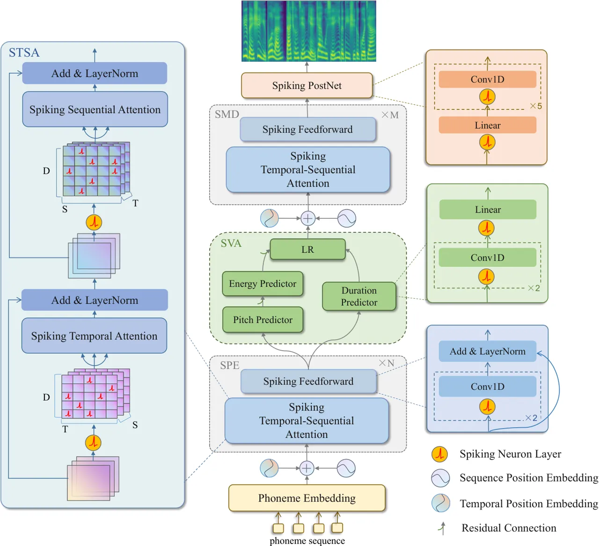

Figure 1: The overview model structure of SpikeVoice. In the figure, the
left part represents the Spiking Temporal-Sequential Attention (STSA).
In the middle part, from bottom to top, are the Spiking Phoneme Encoder
(SPE), Spiking Variance Adapter (SVA), and Spiking Mel Decoder (SMD)
with the topmost part represents the output Mel-Spectrogram. On the
right part, the green module represents the predictor within the Spiking
Variance Adapter, the blue module represents Spiking FeedForward, and
the orange module indicating Spiking PostNet.

## 2 Related work

Transformers in SNN: Training in SNN is primarily categorized into two
methods: ANN-to-SNN conversion (ANN2SNN) Bu et al. (2021); Deng and Gu
(2020); Han et al. (2020) and surrogate training Wu et al. (2018a);
Shrestha and Orchard (2018); Wu et al. (2018b); Duan et al. (2022).
Leveraging ANN2SNN, Mueller et al. (2021) integrates the Transformer
architecture into SNN. Nevertheless, this approach demands dozens or
even hundreds of time steps to attain satisfactory performance.
Spikeformer Zhou et al. (2022) conducts direct training of the
Transformer within the SNN framework and achieves state-of-the-art
performance on ImageNet with just four time steps. However, it doesn’t
fully harness the energy-efficient advantages of SNN due to the presence
of Multiply-and-Accumulate (MAC) operations. Spike-driven
Transformer Yao et al. (2023a) incorporates the spike-driven paradigm
into Transformer architecture and introduces the Spike-Driven
Self-Attenton (SDSA) Yao et al. (2023a). SDSA utilizes sparse additive
operations as a replacement for multiplication operations in attention
mechanisms, effectively addressing the issues present in Spikeformer
related to MAC operations. SpikeGPT Zhu et al. (2023) is the first to
introduce text generation tasks into the SNN framework. However, it
still does not make full of the energy-efficient capabilities of SNN.

Transformers in TTS: Tactron2 Shen et al. (2018) employs RNN Hochreiter
and Schmidhuber (1997) for speech synthesis which results in low
training efficiency and struggles to establish long-term dependencies.
To address these issues, Transformer-TTS Li et al. (2019) introduces an
autoregressive TTS model that combines Tactron2 with the Transformer,
enhancing training efficiency while capturing long-term dependencies.
However, autoregressive TTS models often suffer from slow synthesis
speed and less robust speech synthesis. FastSpeech Ren et al. (2019), on
the other hand, utilizes knowledge distillation during training to build
a non-autoregressive TTS model, yet the training process can be
complicated. FastSpeech2 Ren et al. (2020) simplifies the training
process by removing knowledge distillation from the FastSpeech training
pipeline and adopting the end-to-end training approach, effectively
addressing the issue of the extended training duration associated with
FastSpeech.

|                     |                       |                                                |                               |
| ------------------- | --------------------- | ---------------------------------------------- | ----------------------------- |
|                     |                       | SpikeVoice                                     | FastSpeech2                   |
| STSA/Attention      | $`Q,K,V`$             | $`T\bar{R}_{t/s}*E_{add}*3ND^{2}`$             | $`E_{mac}*3ND^{2}`$           |
|                     | $`F(Q,K,V)`$          | $`T\hat{R}_{t/s}*E_{add}*ND`$                  | $`E_{mac}*ND^{2}`$            |
|                     | $`Linear_{0}`$        | $`TR_{mlp_{1}}*E_{add}*FLP_{mlp_{0}}`$         | $`E_{mac}*FLP_{mlp_{0}}`$     |
|                     | $`Scale`$             | \-                                             | $`E_{m}*N^{2}`$               |
|                     | $`Softmax`$           | \-                                             | $`E_{mac}*2N^{2}`$            |
| Spiking Feedforward | $`Conv\_Layer_{0/1}`$ | $`TR_{c_{0}/c_{1}}*E_{add}*FLP_{c_{0}/c_{1}}`$ | $`E_{mac}*FLP_{c_{0}/c_{1}}`$ |
| Predictors          | $`Conv\_Layer_{2/3}`$ | $`TR_{c_{2}/c_{3}}*E_{add}*FLP_{c_{2}/c_{3}}`$ | $`E_{mac}*FLP_{c_{2}/c_{3}}`$ |
|                     | $`Linear_{1}`$        | $`TR_{mlp_{1}}*E_{add}*FLP_{mlp_{1}}`$         | $`E_{mac}*FLP_{mlp_{1}}`$     |
| Spiking PostNet     | $`Linear_{2}`$        | $`TR_{mlp_{2}}*E_{add}*FLP_{mlp_{2}}`$         | $`E_{mac}*FLP_{mlp_{2}}`$     |
|                     | $`Conv\_Layer_{4-9}`$ | $`TR_{c_{4}-c_{9}}*E_{add}*FLP_{c_{4}-c_{9}}`$ | $`E_{mac}*FLP_{c_{4}-c_{9}}`$ |

Table 1: The energy consumption estimation of the main components. $`T`$
is the total time steps, and $`R`$ denotes the firing rates of spike
tensors. $`E_{add}=0.9pJ`$ and $`E_{mac}=4.6pJ`$ are the energy
consumption of add and MAC operations at 45nm process nodes for full
precision (FP32) SynOps. $`N`$ is the length of sequences, and $`D`$
represents the number of channels. $`FLP_{c}`$ and $`FLP_{mlp}`$ are
FLOPs of Conv layers and MLP layers.

## 3 Method

In this study, we propose SpikeVoice, the first spike-driven TTS model.
The overall model architecture is illustrated in Fig.1. The Spiking
Phoneme Encoder (SPE) performs binary embedding on the input phoneme
embedding sequence and generates high-level spiking phoneme
representations. The Spiking Variance Adaptor (SVA) enhances the spiking
phoneme representations by incorporating variance information related to
duration, pitch, and energy. Finally, the Spiking Mel Decoder (SMD) and
Spiking PostNet generate Mel-Spectrograms in a non-autoregressive
manner. In the following sections, we will first introduce the LIF
neurons, and then introduce the components of SpikeVoice.

### 3.1 Leaky Integrate-and-Fire Neuron

The LIF neuron is a biologically inspired spiking neuron having the
charge-fire-reset biological neuronal dynamics as shown in Fig.2. The
working process of LIF neuron can be described as:

```math
\displaystyle H_{t}=V_{t-1}+\frac{1}{\tau}(X_{t}-(V_{t-1}-V^{re})) \tag{1}
```

```math
\displaystyle S_{t}=\Theta(H_{t}-V^{th}) \tag{2}
```

```math
\displaystyle V_{t}=V^{re}S_{t}+H_{t}(1-S_{t}) \tag{3}
```

Eq.(1) to (3) respectively represent the charging, firing, and membrane
potential resetting of LIF. $`X_{t}`$ denotes the input current at time
$`t`$, $`H_{t}`$ signifies the membrane potential after charging,
$`S_{t}`$ represents the spike tensor at time $`t`$, $`\Theta`$
represents the step function, $`V^{th}`$ denotes the firing threshold,
$`V^{re}`$ is the reset membrane potential, and $`V_{t}`$ signifies the
membrane potential after resetting.

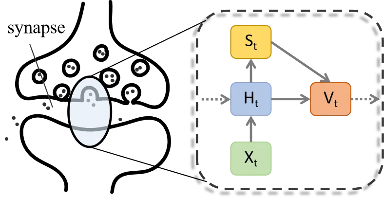

Figure 2: The LIF neuron layer.

### 3.2 SpikeVoice

Temporal-Sequential Embedding: At spiking temporal wise, we first expand
the phoneme embedding sequence $`z`$ to $`T`$ time steps. In order to
incorporate the position information with STSA, we then apply position
embedding in both the spiking temporal dimension and the phoneme
sequential dimension.

```math
\displaystyle x^{0}_{(t,l)}=z_{(t,l)}+e^{tem}_{(t,)}+e^{seq}_{(,l)} \tag{4}
```

where $`x^{0}\in\mathcal{R}^{T\times L\times D}`$ will be taken as the
input to Spiking Phoneme Encoder. $`L`$ represents the length of the
phoneme sequence, $`D`$ denotes the size of embedding dimension,
$`t\in\{1,\ldots,T\}`$ and $`l\in\{1,\ldots,L\}`$. $`e^{tem}_{(t,)}`$
and $`e^{seq}_{(,l)}`$ are the position embedding of time step $`t`$ at
temporal wise and position $`l`$ at sequence wise.

Spiking Phoneme Encoder: Spiking Phoneme Encoders are composed of a
stack of $`N`$ identical layers, each of which consists of an STSA
module and a Spiking FeedForward module. As shown on the right side of
Fig.1, each Spiking FeedForward module consists of two stacked
1D-Convolution layers. To ensure the energy efficiency of SpikeVoice, we
introduce a LIF neuron layer before each 1D-Convolution layer, to
convert continuous inputs into sparse spiking tensors. Then the
high-level spiking phoneme representations $`x^{n}`$ of layer $`n`$ can
be obtained as:

```math
\displaystyle u^{n} \displaystyle=STSA(x^{n-1}) \tag{5}
```

```math
\displaystyle x^{n} \displaystyle=LN(u^{n}+f(u^{n})) \tag{6}
```

```math
\displaystyle f(\cdot) \displaystyle=[Conv(\mathcal{SN(\cdot)})]_{2} \tag{7}
```

where $`\mathcal{LN}`$ is layer nomalization, $`\mathcal{SN}`$ refers to
the LIF neuron layer depicted in Eq.(1)-(3). $`f(\cdot)`$ represents the
stacked 1D-Convolution and LIF neuron layers, $`u^{n}`$ is the membrane
potential output of STSA.

Spiking Temporal-Sequential Attention: As illustrated in the left block
of Fig.1, STSA is composed of a Spiking Temporal Attention and a Spiking
Sequential Attention. Due to the serial nature of LIF neurons, it
results in the inability to capture information from future time steps
along the spiking temporal dimension and leads to the issue of
"partial-time dependency". Therefore, we propose the Spiking Temporal
Attention to perform temporal-mixing over the spiking temporal dimension
obtaining the global information of binary embedding.

Taking STSA in layer $`n`$ of Spiking Phoneme Encoder as an example,
initially, we perform binary embedding on the output of layer $`n-1`$ to
obtain the sparse spiking hidden representation
$`s^{n}=\mathcal{SN}(x^{n-1})`$,
$`s^{n}\in\mathcal{R}^{T\times L\times D}`$. Along the spiking temporal
dimension $`T`$ the binary embedding of each token can be obtained. The
Spiking Temporal Attention can be depicted as:

```math
\displaystyle\mu^{n} \displaystyle=\mathcal{SN}({BN}(W^{n,tem}_{\mu}{s}^{n})) \tag{8}
```

```math
\displaystyle s^{n}_{(t,:)} \displaystyle=\mathcal{SN}(\Sigma_{c}(q^{n}_{(t,:)}\odot k^{n}_{(t,:)}))\odot v^{n}_{(t,:)} \tag{9}
```

```math
\displaystyle\sigma^{n} \displaystyle={LN}(x^{n-1}+Linear({s}^{n})) \tag{10}
```

where $`\mu\in\{q,k,v\}`$, $`\mathcal{BN}`$ represents Batch
Normalization, and $`W^{n,tem}_{\mu}`$ is a learnable matrix for Spiking
Temporal Attention. For vanilla attention can introduce MAC operations
to the SpikeVoice, we utilize the SDSA Yao et al. (2023a) in Eq.(9) as a
substitute for vanilla attention. $`\odot`$ is the Hadamard product and
$`\Sigma_{c}`$ means sum up in column-wise. $`s^{n}_{(t,:)}`$ denotes
the spiking tensor at time step $`t`$, which is the output of attention
computing on spiking temporal wise. $`\sigma^{n}`$ represents the
membrane potential output of Spiking Temporal Attention.

Then $`s^{n}=\mathcal{SN}(\sigma^{n})`$ will serve as the sparse input
to Spiking Sequential Attention:

```math
\displaystyle\mu^{n} \displaystyle=\mathcal{SN}({BN}(W^{n,seq}_{\mu}s^{n})) \tag{11}
```

```math
\displaystyle s^{n}_{(:,l)} \displaystyle=\mathcal{SN}(\Sigma_{c}(q^{n}_{(:,l)}\odot k^{n}_{(:,l)}))\odot v^{n}_{(:,l)} \tag{12}
```

```math
\displaystyle u^{n} \displaystyle={LN}(u^{n}+Linear(s^{n})) \tag{13}
```

where $`s^{n}_{(:,l)}`$ is the spiking tensor at position $`l`$ in the
sequence wise. The computation process above can be easily extended to
Spiking Mel Decoder.

Spiking Variance Adaptor: The Spiking Variance Adaptor takes the
high-level spiking phoneme representations $`x^{N}`$ as its input. And
then the Duration Predictor $`P_{d}`$, Energy Predictor $`P_{e}`$, and
Pitch Predictor $`P_{p}`$ impart variance information to $`x^{N}`$. The
predictors in Spiking Variance Adaptor all take an identical structure,
shown in the green block on the right side of Fig.1. Besides, We employ
a residual connection around the Energy Predictor and Pitch Predictor.
Finally, the Length Regulator $`LR`$ aligns the hidden sequence to the
length of the Mel-Spectrogram:

```math
\displaystyle d \displaystyle=P_{d}(x^{N}) \tag{14}
```

```math
\displaystyle u \displaystyle=P_{e}(P_{p}(x^{N})) \tag{15}
```

```math
\displaystyle{\{y^{0}_{(t,l^{\prime})}\}}_{l^{\prime}=1,\ldots,L^{\prime}} \displaystyle=LR\left(u_{(t,l)},d_{(l,)}\right)_{l=1,\ldots,L} \tag{16}
```

where $`d\in R^{L}`$ comprises the length of mel frames corresponding to
each phoneme. $`u`$ represents the membrane potential incorporated the
pitch and energy variance information. $`\{y^{0}_{(t,l^{\prime})}\}`$
signifies the mel representations corresponding to $`{u_{(t,l)}}`$ after
being extended by $`d_{(l,)}`$ times. $`L^{\prime}`$ represents the
total length of the target Mel-Spectrogram.

Spiking Mel Decoder and PostNet: Spiking Phoneme Encoders are composed
of a stack of $`M`$ identical layers, each of which also comprises an
STSA and a Spiking FeedForward. The Spiking PostNet is designed to
enhance the fine details of Mel-Spectrograms. LIF neuron layers are also
added before each linear layer and 1D-convolution layer in the Spiking
PostNet to ensure sparse inputs. Then the Mel-Spectrogram can be
obtained as:

```math
\displaystyle y^{m} \displaystyle=SFF(STSA(y^{m-1})) \tag{17}
```

```math
\displaystyle O \displaystyle=PostNet(y^{M}) \tag{18}
```

```math
\displaystyle O^{c}_{(l^{\prime},)} \displaystyle=\bar{y}^{M}_{(:,l^{\prime})},\quad O^{f}_{(l^{\prime},)}=\bar{O}_{(:,l^{\prime})} \tag{19}
```

where $`y^{m}`$ is the output of the $`m`$th layer of Spiking Mel
Decoder. To calculate the supervised loss with ground truth, we average
the output at spiking temporal dimension as the predicted
Mel-Spectrograms, and $`\bar{\cdot}`$ represents the average operation.
We denote the Mel-Spectrograms obtained before the Spiking PostNet as
$`O^{c}`$ and the output obtained from the Spiking PostNet as $`O^{f}`$.

The loss function encompasses supervised losses using Mean Squared Error
(MSE) for pitch, energy, and duration, as well as Mean Absolute Error
(MAE) losses for both the coarse Mel-Spectrograms $`O^{c}`$ and the fine
Mel-Spectrograms $`O^{f}`$.

|                                    |                   |                      |                 |                   |                      |                 |
| ---------------------------------- | ----------------- | -------------------- | --------------- | ----------------- | -------------------- | --------------- |
| Single-Speaker                     |                   |                      |                 |                   |                      |                 |
|                                    | LJSpeech          |                      |                 | Baker             |                      |                 |
| Methods                            | WER$`\downarrow`$ | NISQA-V2$`\uparrow`$ | MOS$`\uparrow`$ | CER$`\downarrow`$ | NISQA-V2$`\uparrow`$ | MOS$`\uparrow`$ |
| GT                                 | $`6.39`$          | $`4.42`$             | $`4.75\pm.037`$ | $`12.25`$         | $`4.06`$             | $`4.30\pm.052`$ |
| FastSpeech2 Ren et al. (2020)      | $`7.98`$          | 4.13                 | $`4.10\pm.057`$ | $`13.18`$         | $`3.80`$             | $`3.82\pm.089`$ |
| SpikeVoice-ATTN Zhou et al. (2022) | $`8.39`$          | $`4.08`$             | $`3.69\pm.053`$ | $`13.16`$         | $`3.78`$             | $`3.52\pm.093`$ |
| SpikeVoice-SDSA Yao et al. (2023a) | $`8.70`$          | $`4.10`$             | $`3.63\pm.059`$ | $`12.96`$         | $`3.79`$             | $`3.46\pm.088`$ |
| SpikeVoice-STSA (ours)             | $`7.93`$          | $`4.11`$             | $`4.06\pm.052`$ | $`12.89`$         | $`3.80`$             | $`3.86\pm.076`$ |

Table 2: Results on LJSpeech and Baker for experiments for
single-speaker. GT stands for ground truth, FastSpeech2 is the work of
Ren et al. (2020). WER/CER and NISQA-V2 are the objective metric and MOS
is the subjective metric. The best results of the SNN-based models are
highlighted with bold font, and the underlined font indicates that the
performance of the ANN-based model is superior to the optimal
performance of the SNN-based model.

## 4 Experiments

We conducted experiments with SpikeVoice on single-speaker and
multi-speaker datasets, encompassing both English and Chinese. The
single-speaker datasets include LJSpeech Ito and Johnson (2017) and
Baker¹¹ 1 https://www.data-baker.com/data/index/TNtts/, while the
multi-speaker datasets comprise LibriTTS Zen et al. (2019) and
AISHELL3 Yao et al. (2015). In the following subsections, we present
results on subjective and objective metrics for ground truth denoted as
’GT’, ANN baseline denoted as ’FastSpeech2’, SpikeVoice signified as
’SpikeVoice-STSA’, and SNN baselines: SpikeVoice with attention in
Spikeformer replacing the STSA, which is denoted as ’SpikeVoice-ATTN’
and SpikeVoice with only Spiking Sequential Attention, which denoted as
’SpikeVoice-SDSA’. Additionally, In Section 4.5, we perform visual
analysis, and in Section 4.6, we discuss the balance between
SpikeVoice’s energy consumption and the quality of synthesized speech.

### 4.1 Datasets

For each of the datasets, we have randomly split the dataset into three
sets: the training set, the validation, and the testing sets, both
comprising 256 samples.

LJSpeech is a female single-speaker English monolingual dataset. It
comprises a collection of 13100 utterances, each lasting between 1 to 10
seconds, amounting to roughly 24 hours of speech material.

Baker is a female single-speaker Chinese dataset. It encompasses a wide
range of content domains, including news, novels, technology, and so on.
In total, Baker comprises 10000 speech recordings, with approximately a
total of 12 hours of speech material.

LibriTTS comprises approximately 191 hours of speech with 1,160
speakers. We utilized the train-clean-360 set from LibriTTS. Within this
subset, there are 430 female speakers and 474 male speakers.

AISHELL3 is a multi-speaker Chinese dataset, containing a total of
approximately 85 hours of speech, recorded by 218 speakers.

### 4.2 Experiments settings

Training Settings SpikeVoice is stacked by $`N=4`$ Spiking Phoneme
Encoders, a Spiking Variance Adaptor, and $`M=6`$ Spiking Mel Decoders.
We transformed the raw speech in all the datasets into mel-spectrograms
with a frame length of 1024 and a hop length of 256. The synthesized
mel-spectrograms were uniformly converted into speech using the vocoder
HiFiGAN Kong et al. (2020). We performed the training on four Tesla
V100-SXM2-32G GPUs with batch size 48. The optimization settings were in
line with those defined in Ren et al. (2020). The implementation of the
SNN framework in SpikeVoice is based on SpikingJelly Fang et al.
(2023a).

Evaluation Settings We employed Word Error Rate (WER) for English and
Character Error Rate (CER) for Chinese, along with NISQA-V2 Mittag
et al. (2021), as objective metrics to evaluate the quality of
single-speaker speech synthesis. For multi-speaker synthesis, we
additionally utilized Speaker Embedding Cosine Similarity (SECS) to
gauge the similarity between the synthesized speech and the target
speech in terms of the speaker’s voice. Specifically, for WER, we
utilized Hubert Hsu et al. (2021) for English ASR transcription and
Wav2Vec2 Baevski et al. (2020) for Chinese ASR transcription. As for
SECS, we employed the speaker encoder from the Resemblyzer²² 2
https://github.com/resemble-ai/Resemblyzer toolkit to extract speaker
embeddings and calculate cosine similarity. In assessing both single and
multi-speaker synthesis, we relied on 5-scale Mean Opinion Scores (MOS)
with $`95\%`$ confidence intervals as our subjective metric. To obtain
these scores, we randomly selected 80 samples from each test set, and a
total of 12 participants were asked to provide ratings for the
synthesized speech.

|                 |                   |                        |                  |                 |                      |                        |                       |                      |
| --------------- | ----------------- | ---------------------- | ---------------- | --------------- | -------------------- | ---------------------- | --------------------- | -------------------- |
| Multi-Speaker   |                   |                        |                  |                 |                      |                        |                       |                      |
|                 | AISHELL3          |                        |                  |                 | LibriTTS             |                        |                       |                      |
| Methods         | WER$`\downarrow`$ | NISQA -V2 $`\uparrow`$ | SECS$`\uparrow`$ | MOS$`\uparrow`$ | CER$`\downarrow`$    | NISQA -V2 $`\uparrow`$ | SECS$`\uparrow`$      | MOS$`\uparrow`$      |
| GT              | $`5.36`$          | $`3.37`$               | \-               | $`4.48\pm.057`$ | $`5.07`$             | $`4.14`$               | \-                    | $`4.46\pm.047`$      |
| FastSpeech2     | $`6.36`$          | $`3.09`$               | $`0.849`$        | $`3.92\pm.059`$ | $`\underline{5.72}`$ | $`\underline{3.47}`$   | $`\underline{0.822}`$ | $`3.43\pm.074`$      |
| SpikeVoice-ATTN | $`7.13`$          | $`3.12`$               | $`0.841`$        | $`3.55\pm.061`$ | $`6.63`$             | $`3.42`$               | $`0.794`$             | $`2.72\pm.089`$      |
| SpikeVoice-SDSA | $`7.42`$          | $`3.12`$               | $`0.849`$        | $`3.63\pm.058`$ | $`6.45`$             | $`3.40`$               | $`0.794`$             | $`2.88\pm.066`$      |
| SpikeVoice-STSA | $`6.32`$          | $`3.13`$               | $`0.850`$        | $`3.79\pm.056`$ | $`6.06`$             | $`3.43`$               | $`0.795`$             | $`\bm{3.32\pm.052}`$ |

Table 3: Results on AISHELL3 and LibriTTS for experiments of
multi-speaker. CER, NISQA-V2, and SCER are the objective metric and MOS
is the subjective metric. The best results of the SNN-based models are
highlighted with bold font, and the underlined font indicates that the
performance of the ANN-based model is superior to the optimal
performance of the SNN-based model.

### 4.3 Performance on Single-Speaker

As shown in Tab.2, we conducted experiments on the LJSpeech and Baker
datasets, reflecting the synthesis quality of English and Chinese
single-speaker respectively.

For the objective metrics, SpikeVoice surpasses all the SNN and ANN
baselines on the WER/CER metric and is the best-performing SNN-based
model on NISQA. These results demonstrate that the global information of
temporal spike sequence in STSA contributes to the synthesis of
higher-quality and clearer speech.

For the subjective evaluation, SpikeVoice outperforms both
SpikeVoice-ATTN and SpikeVoice-SDSA. The difference in MOS scores
between SpikeVoice and ANN is merely $`0.04`$ on LJSpeech and SpikeVoice
even surpasses the ANN-based model on the Baker dataset, indicating that
SpikeVoice’s synthesis quality closely approaches that of ANN in terms
of human perception. The results compared to SpikeVoice-SDSA also
confirm the effectiveness of temporal-mixing.

### 4.4 Model Performance on Multi-Speaker

In Tab.3, we respectively present the performance on the AISHELL3 and
LibriTTS. In the multi-speaker experiments, we have additionally
incorporated the SCER metric to assess the speaker similarity between
synthesized speech and target speech.

Compared to single-speaker, multi-speaker datasets present more
challenges for SNN-based models. SpikeVoice with STSA remains the
best-performing SNN-based model, however, the sparse nature of the spike
tensor contributes to energy efficiency at the expense of information
loss, leading to a performance gap of MOS scores between the SNN-based
models and ANN-based models in multi-speaker datasets, which encompass
richer information. Investigating strategies to minimize information
loss in the context of spike tensors with low firing rates is worthwhile
for future research.

|                 |              |                |          |           |         |                 |
| --------------- | ------------ | -------------- | -------- | --------- | ------- | --------------- |
| Methods         | Spike-Driven | Complexity     | Param    | Time Step | E(pJ)   | MOS             |
| FastSpeech2     | ✗            | $`O(N^{2}D)`$  | $`35.4`$ | 1         | 2.14e11 | $`4.10\pm.057`$ |
| SpikeVoice-ATTN | ✓            | $`O(TN^{2}D)`$ | $`35.4`$ | 4         | 2.55e10 | $`3.69\pm.053`$ |
| SpikeVoice-SDSA | ✓            | $`O(TND)`$     | $`35.4`$ | 4         | 2.06e10 | $`3.63\pm.059`$ |
| SpikeVoice-STSA | ✓            | $`O(2TND)`$    | $`37.8`$ | 1         | 8.84e09 | $`3.61\pm.053`$ |
| SpikeVoice-STSA | ✓            | $`O(2TND)`$    | $`37.8`$ | 4         | 2.26e10 | $`4.06\pm.052`$ |

Table 4: Balance between consumption and synthesized quality of models.
Spike-Driven denotes the existence of solely AC operations. Param
represents the amount of parameters of models, Time Step is total spike
sequence time steps, and E(pJ) represents the energy consumption
calculated according to Table 1. MOS represents the results of the
LJSpeech.

### 4.5 Visualized Analysis

Visualization of Mel-Spectrograms: Speech synthesized by SpikeVoice
exhibits less noise and is clearer compared to the SNN-based baselines,
which is evident in Fig.3. As shown in Fig. 3(b) and 3(c),
Mel-Spectrograms synthesized by the SNN baselines become blurry towards
the end, losing fine details. In contrast, the Mel-Spectrograms in
Fig.3(d) synthesized by SpikeVoice with STSA exhibit minimal sacrifice
of details as to ANN in 3(a) and remain notably clearer than those
produced by SNN baselines.

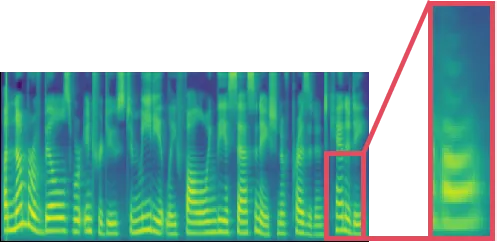

(a) FastSpeech2

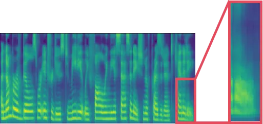

(b) SpikeVoice-ATTN

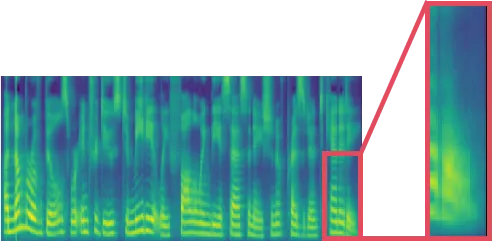

(c) SpikeVoice-SDSA

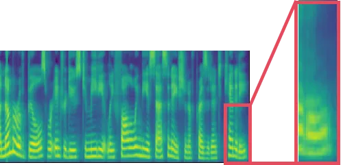

(d) SpikeVoice-STSA

Figure 3: Mel-Spectrograms visualization analysis on English
single-speaker dataset LJSpeech.

Visualization of Spike Patterns: By visualizing spike tensors, more
details of SpikeVoice can be observed. As the spike patterns of STSA
depicted in Fig.4(a) and Fig.4(b), each dot represents an event, the
spike events in the lower layers are sparser, and as the network
deepens, more information is incorporated, leading to denser spike
events. Spike tensors that convey similar information exhibit similar
spike patterns, while others reveal markedly different spike patterns.
Spike patterns of the energy and pitch predictors are displayed in
Fig.4(c) and Fig.4(d), different from the distribution of spike pattern
in 4(a) and 4(b), noticeable channel clustering phenomena can be
observed in 4(c) and 4(d).

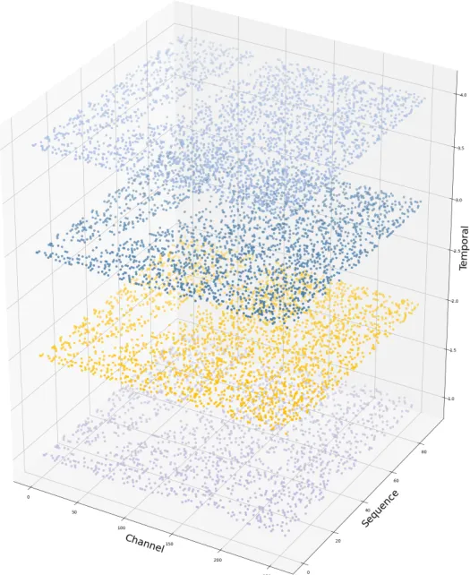

(a) STSA-layer1

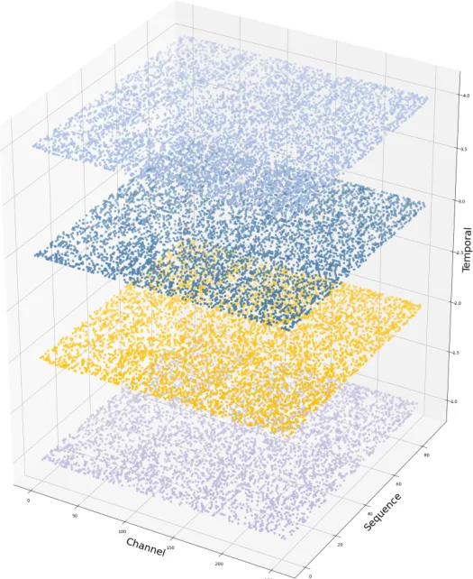

(b) STSA-layer4

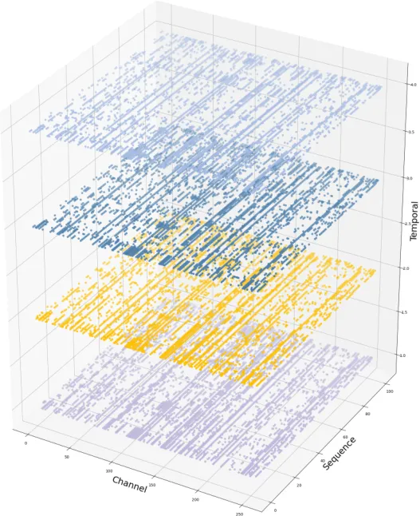

(c) Pitch Predictor

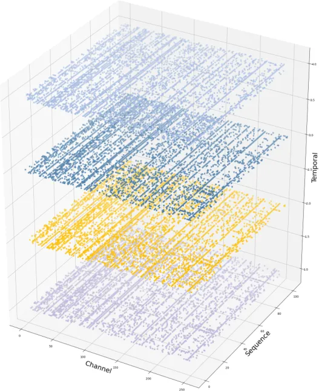

(d) Energy Predictor

Figure 4: Visualization of spike tensor. Fig.4(a) and Fig.4(b) are the
spike patterns of STSA in the first layer and the fourth layer. 4(c) and
4(d) denote spike pattern for speech energy and speech pitch. Each dot
depicts a fired event.

### 4.6 Analysis of Balance between Consumption and Synthesized Speech Quality

Apart from its notable biological interpretability, one of the most
prominent advantages of SNN lies in its energy efficiency. However,
SNN’s binary embedding within a finite time step results in some degree
of performance decay. In Tab.4, we present the number of model
parameters, time steps of binary embedding, and energy consumption. The
term "Spike-Driven" refers to the existence of solely AC operations, and
"MOS" here refers to the results on LJSpeech.

While SpikeVoice-STSA comes with a slight increase in the parameter, it
takes only 10.5% energy consuming of ANN with $`4`$ time steps and
achieves a better performance than SNN baselines. In contrast,
SpikeVoice-SDSA exhibits noticeable performance degradation, while the
energy consumption is 9.6% of ANN with an equivalent amount of
parameters. Similarly, SpikeVoice-ATTN also results in an 88.1%
reduction in energy consumption. It is worth to noting that when set
time step to 1, the energy consumption of SpikeVoice-STSA can be merely
4.11% of ANN. Hence, when considering both the quality of speech
synthesis and energy consumption, SpikeVoice is a superior choice,
offering significant energy savings with minimal performance sacrifice.

## 5 Conclusion

In this paper, we introduce SpikeVoice. To the best of our knowledge, it
is the first TTS model that achieves high-quality speech synthesis
within the SNN framework and for the first time endows SNN with the
ability to "speak". Additionally, SpikeVoice is a spike-driven model
with highly energy-efficient. In SpikeVoice, we propose STSA, which
performs temporal-mixing in the spiking temporal dimension to address
the issue of information invisibility at future time steps on the
spiking temporal dimension caused by the serial nature of spiking
neurons and thereby address the issue of "partial-time dependency".

We conducted experiments on both single-speaker and multi-speaker
datasets in both Chinese and English. The results demonstrate that
SpikeVoice achieves performance comparable to ANN models while consuming
only $`10.5\%`$ of the energy required by ANN. Our successful practice
proves the feasibility of TTS tasks within the SNN framework and offers
an energy-saving solution for TTS tasks.

## 6 Limitation

The SpikeVoice within the SNN framework still has several limitations.
Primarily, the binary embedding results in inevitably information lost
from the input data, leading to a decline in performance. Secondly, due
to the inherent sequential mechanism of LIF neurons, the training speed
of SpikeVoice is slower than ANN. Finally, as analyzed in section 4.5
with the layers deepen, the firing rate becomes progressively higher,
which implies the potential for further reductions in energy
consumption. In light of this, we present several prospective
exploration directions that reduce information loss during the binary
embedding process in SNN, lowering the firing rate in deep neural
networks, and parallelization of spike neurons.

## 7 Acknowledge

This work was partially supported by National Distinguished Young
Scholars (62325603), and National Natural Science Foundation of China
(62236009,U22A20103,62441606), and Beijing Natural Science Foundation
for Distinguished Young Scholars (JQ21015), and CAAI-MindSpore Open
Fund, developed on OpenI Community.

## References

- Abbott (1999) Larry F Abbott. 1999. Lapicque’s introduction of the
  integrate-and-fire model neuron (1907). _Brain research bulletin_,
  50(5-6):303–304.
- Anil et al. (2023) Rohan Anil, Andrew M Dai, Orhan Firat, Melvin
  Johnson, Dmitry Lepikhin, Alexandre Passos, Siamak Shakeri, Emanuel
  Taropa, Paige Bailey, Zhifeng Chen, et al. 2023. Palm 2 technical
  report. _arXiv preprint arXiv:2305.10403_.
- Baevski et al. (2020) Alexei Baevski, Yuhao Zhou, Abdelrahman Mohamed,
  and Michael Auli. 2020. wav2vec 2.0: A framework for self-supervised
  learning of speech representations. _Advances in neural information
  processing systems_, 33:12449–12460.
- Brown et al. (2020) Tom Brown, Benjamin Mann, Nick Ryder, Melanie
  Subbiah, Jared D Kaplan, Prafulla Dhariwal, Arvind Neelakantan, Pranav
  Shyam, Girish Sastry, Amanda Askell, et al. 2020. Language models are
  few-shot learners. _Advances in neural information processing
  systems_, 33:1877–1901.
- Bu et al. (2021) Tong Bu, Wei Fang, Jianhao Ding, PENGLIN DAI, Zhaofei
  Yu, and Tiejun Huang. 2021. Optimal ann-snn conversion for
  high-accuracy and ultra-low-latency spiking neural networks. In
  _International Conference on Learning Representations_.
- Cao et al. (2015) Yongqiang Cao, Yang Chen, and Deepak Khosla. 2015.
  Spiking deep convolutional neural networks for energy-efficient object
  recognition. _International Journal of Computer Vision_, 113:54–66.
- Carion et al. (2020) Nicolas Carion, Francisco Massa, Gabriel
  Synnaeve, Nicolas Usunier, Alexander Kirillov, and Sergey
  Zagoruyko. 2020. End-to-end object detection with transformers. In
  _European conference on computer vision_, pages 213–229.
- Deng and Gu (2020) Shikuang Deng and Shi Gu. 2020. Optimal conversion
  of conventional artificial neural networks to spiking neural networks.
  In _International Conference on Learning Representations_.
- Devlin et al. (2019) Jacob Devlin, Ming-Wei Chang, Kenton Lee, and
  Kristina Toutanova. 2019. Bert: Pre-training of deep bidirectional
  transformers for language understanding. In _Proceedings of
  NAACL-HLT_.
- Duan et al. (2022) Chaoteng Duan, Jianhao Ding, Shiyan Chen, Zhaofei
  Yu, and Tiejun Huang. 2022. Temporal effective batch normalization in
  spiking neural networks. _Advances in Neural Information Processing
  Systems_, 35:34377–34390.
- Fang et al. (2023a) Wei Fang, Yanqi Chen, Jianhao Ding, Zhaofei Yu,
  Timothée Masquelier, Ding Chen, Liwei Huang, Huihui Zhou, Guoqi Li,
  and Yonghong Tian. 2023a. Spikingjelly: An open-source machine
  learning infrastructure platform for spike-based intelligence.
  _Science Advances_, 9(40):eadi1480.
- Fang et al. (2023b) Wei Fang, Zhaofei Yu, Zhaokun Zhou, Ding Chen,
  Yanqi Chen, Zhengyu Ma, Timothée Masquelier, and Yonghong Tian. 2023b.
  Parallel spiking neurons with high efficiency and ability to learn
  long-term dependencies. In _Thirty-seventh Conference on Neural
  Information Processing Systems_.
- Han et al. (2020) Bing Han, Gopalakrishnan Srinivasan, and Kaushik
  Roy. 2020. Rmp-snn: Residual membrane potential neuron for enabling
  deeper high-accuracy and low-latency spiking neural network. In
  _Proceedings of the IEEE/CVF conference on computer vision and pattern
  recognition_, pages 13558–13567.
- Hochreiter and Schmidhuber (1997) Sepp Hochreiter and Jürgen
  Schmidhuber. 1997. Long short-term memory. _Neural computation_,
  9(8):1735–1780.
- Hodgkin and Huxley (1952) Alan L Hodgkin and Andrew F Huxley. 1952. A
  quantitative description of membrane current and its application to
  conduction and excitation in nerve. _The Journal of physiology_,
  117(4):500.
- Hsu et al. (2021) Wei-Ning Hsu, Benjamin Bolte, Yao-Hung Hubert Tsai,
  Kushal Lakhotia, Ruslan Salakhutdinov, and Abdelrahman Mohamed. 2021.
  Hubert: Self-supervised speech representation learning by masked
  prediction of hidden units. _IEEE/ACM Transactions on Audio, Speech,
  and Language Processing_, 29:3451–3460.
- Ito and Johnson (2017) Keith Ito and Linda Johnson. 2017. The lj
  speech dataset.
  [https://keithito.com/LJ-Speech-Dataset/](https://keithito.com/LJ-Speech-Dataset/).
- Kong et al. (2020) Jungil Kong, Jaehyeon Kim, and Jaekyoung Bae. 2020.
  Hifi-gan: Generative adversarial networks for efficient and high
  fidelity speech synthesis. _Advances in Neural Information Processing
  Systems_, 33:17022–17033.
- Li et al. (2023a) Junnan Li, Dongxu Li, Silvio Savarese, and Steven
  Hoi. 2023a. Blip-2: Bootstrapping language-image pre-training with
  frozen image encoders and large language models. In _International
  conference on machine learning_.
- Li et al. (2019) Naihan Li, Shujie Liu, Yanqing Liu, Sheng Zhao, and
  Ming Liu. 2019. Neural speech synthesis with transformer network. In
  _Proceedings of the AAAI conference on artificial intelligence_,
  volume 33, pages 6706–6713.
- Li et al. (2023b) Tianlong Li, Wenhao Liu, Changze Lv, Jianhan Xu,
  Cenyuan Zhang, Muling Wu, Xiaoqing Zheng, and Xuanjing Huang. 2023b.
  Spikeclip: A contrastive language-image pretrained spiking neural
  network. _arXiv preprint arXiv:2310.06488_.
- Liu et al. (2021) Ze Liu, Yutong Lin, Yue Cao, Han Hu, Yixuan Wei,
  Zheng Zhang, Stephen Lin, and Baining Guo. 2021. Swin transformer:
  Hierarchical vision transformer using shifted windows. In _Proceedings
  of the IEEE/CVF international conference on computer vision_, pages
  10012–10022.
- Lv et al. (2023) Changze Lv, Tianlong Li, Jianhan Xu, Chenxi Gu,
  Zixuan Ling, Cenyuan Zhang, Xiaoqing Zheng, and Xuanjing Huang. 2023.
  Spikebert: A language spikformer trained with two-stage knowledge
  distillation from bert. _arXiv preprint arXiv:2308.15122_.
- Lv et al. (2022) Changze Lv, Jianhan Xu, and Xiaoqing Zheng. 2022.
  Spiking convolutional neural networks for text classification. In _The
  Eleventh International Conference on Learning Representations_.
- Maass (1997) Wolfgang Maass. 1997. Networks of spiking neurons: the
  third generation of neural network models. _Neural networks_,
  10(9):1659–1671.
- Mittag et al. (2021) Gabriel Mittag, Babak Naderi, Assmaa Chehadi, and
  Sebastian Möller. 2021. Nisqa: A deep cnn-self-attention model for
  multidimensional speech quality prediction with crowdsourced datasets.
  _arXiv preprint arXiv:2104.09494_.
- Mueller et al. (2021) Etienne Mueller, Viktor Studenyak, Daniel Auge,
  and Alois Knoll. 2021. Spiking transformer networks: A rate coded
  approach for processing sequential data. In _2021 7th International
  Conference on Systems and Informatics (ICSAI)_, pages 1–5.
- OpenAI (2023) OpenAI. 2023. [Gpt-4 technical
  report](https://api.semanticscholar.org/CorpusID:257532815). _ArXiv_,
  abs/2303.08774.
- Radford et al. (2021) Alec Radford, Jong Wook Kim, Chris Hallacy,
  Aditya Ramesh, Gabriel Goh, Sandhini Agarwal, Girish Sastry, Amanda
  Askell, Pamela Mishkin, Jack Clark, et al. 2021. Learning transferable
  visual models from natural language supervision. In _International
  conference on machine learning_, pages 8748–8763.
- Radford et al. (2023) Alec Radford, Jong Wook Kim, Tao Xu, Greg
  Brockman, Christine McLeavey, and Ilya Sutskever. 2023. Robust speech
  recognition via large-scale weak supervision. In _International
  Conference on Machine Learning_, pages 28492–28518.
- Rajagopal et al. (2023) RKPMTKR Rajagopal, R Karthick, P Meenalochini,
  and T Kalaichelvi. 2023. Deep convolutional spiking neural network
  optimized with arithmetic optimization algorithm for lung disease
  detection using chest x-ray images. _Biomedical Signal Processing and
  Control_, 79:104197.
- Ren et al. (2020) Yi Ren, Chenxu Hu, Xu Tan, Tao Qin, Sheng Zhao, Zhou
  Zhao, and Tie-Yan Liu. 2020. Fastspeech 2: Fast and high-quality
  end-to-end text to speech. In _International Conference on Learning
  Representations_.
- Ren et al. (2019) Yi Ren, Yangjun Ruan, Xu Tan, Tao Qin, Sheng Zhao,
  Zhou Zhao, and Tie-Yan Liu. 2019. Fastspeech: Fast, robust and
  controllable text to speech. _Advances in neural information
  processing systems_, 32.
- Shen et al. (2018) Jonathan Shen, Ruoming Pang, Ron J Weiss, Mike
  Schuster, Navdeep Jaitly, Zongheng Yang, Zhifeng Chen, Yu Zhang,
  Yuxuan Wang, Rj Skerrv-Ryan, et al. 2018. Natural tts synthesis by
  conditioning wavenet on mel spectrogram predictions. In _2018 IEEE
  international conference on acoustics, speech and signal processing
  (ICASSP)_, pages 4779–4783.
- Shrestha and Orchard (2018) Sumit B Shrestha and Garrick
  Orchard. 2018. Slayer: Spike layer error reassignment in time.
  _Advances in neural information processing systems_, 31.
- Sun et al. (2023) Quan Sun, Qiying Yu, Yufeng Cui, Fan Zhang, Xiaosong
  Zhang, Yueze Wang, Hongcheng Gao, Jingjing Liu, Tiejun Huang, and
  Xinlong Wang. 2023. Generative pretraining in multimodality. _arXiv
  preprint arXiv:2307.05222_.
- Touvron et al. (2023) Hugo Touvron, Louis Martin, Kevin Stone, Peter
  Albert, Amjad Almahairi, Yasmine Babaei, Nikolay Bashlykov, Soumya
  Batra, Prajjwal Bhargava, Shruti Bhosale, et al. 2023. Llama 2: Open
  foundation and fine-tuned chat models. _arXiv preprint
  arXiv:2307.09288_.
- Vaswani et al. (2017) Ashish Vaswani, Noam Shazeer, Niki Parmar, Jakob
  Uszkoreit, Llion Jones, Aidan N Gomez, Łukasz Kaiser, and Illia
  Polosukhin. 2017. Attention is all you need. _Advances in neural
  information processing systems_, 30.
- Wang et al. (2023) Qingyu Wang, Tielin Zhang, Minglun Han, Yi Wang,
  Duzhen Zhang, and Bo Xu. 2023. Complex dynamic neurons improved
  spiking transformer network for efficient automatic speech
  recognition. In _Proceedings of the AAAI Conference on Artificial
  Intelligence_, volume 37, pages 102–109.
- Wu et al. (2020) Jibin Wu, Emre Yılmaz, Malu Zhang, Haizhou Li, and
  Kay Chen Tan. 2020. Deep spiking neural networks for large vocabulary
  automatic speech recognition. _Frontiers in neuroscience_, 14:199.
- Wu et al. (2018a) Yujie Wu, Lei Deng, Guoqi Li, Jun Zhu, and Luping
  Shi. 2018a. Spatio-temporal backpropagation for training
  high-performance spiking neural networks. _Frontiers in neuroscience_,
  12:331.
- Wu et al. (2018b) Yujie Wu, Lei Deng, Guoqi Li, Jun Zhu, and Luping
  Shi. 2018b. Spatio-temporal backpropagation for training
  high-performance spiking neural networks. _Frontiers in neuroscience_,
  12:331.
- Yao et al. (2024a) Man Yao, JiaKui Hu, Tianxiang Hu, Yifan Xu, Zhaokun
  Zhou, Yonghong Tian, Bo XU, and Guoqi Li. 2024a. Spike-driven
  transformer v2: Meta spiking neural network architecture inspiring the
  design of next-generation neuromorphic chips. In _The Twelfth
  International Conference on Learning Representations_.
- Yao et al. (2023a) Man Yao, JiaKui Hu, Zhaokun Zhou, Li Yuan, Yonghong
  Tian, XU Bo, and Guoqi Li. 2023a. Spike-driven transformer. In
  _Thirty-seventh Conference on Neural Information Processing Systems_.
- Yao et al. (2024b) Man Yao, Ole Richter, Guangshe Zhao, Ning Qiao,
  Yannan Xing, Dingheng Wang, Tianxiang Hu, Wei Fang, Tugba Demirci,
  Michele De Marchi, Lei Deng, Tianyi Yan, Carsten Nielsen, Sadique
  Sheik, Chenxi Wu, Yonghong Tian, Bo Xu, and Guoqi Li. 2024b.
  Spike-based dynamic computing with asynchronous sensing-computing
  neuromorphic chip. _Nature Communications_, 15(1):4464.
- Yao et al. (2023b) Man Yao, Guangshe Zhao, Hengyu Zhang, Yifan Hu, Lei
  Deng, Yonghong Tian, Bo Xu, and Guoqi Li. 2023b. Attention spiking
  neural networks. _IEEE Transactions on Pattern Analysis and Machine
  Intelligence_.
- Yao et al. (2015) Shi Yao, Bu Hui, Xu Xin, Zhang Shaoji, and
  Li Ming. 2015. [Aishell-3: A multi-speaker mandarin tts corpus and the
  baselines](https://arxiv.org/abs/2010.11567).
- Zen et al. (2019) Heiga Zen, Viet Dang, Rob Clark, Yu Zhang, Ron J
  Weiss, Ye Jia, Zhifeng Chen, and Yonghui Wu. 2019. Libritts: A corpus
  derived from librispeech for text-to-speech. _arXiv preprint
  arXiv:1904.02882_.
- Zhao et al. (2021) Jianqing Zhao, Xiaohu Zhang, Jiawei Yan, Xiaolei
  Qiu, Xia Yao, Yongchao Tian, Yan Zhu, and Weixing Cao. 2021. A wheat
  spike detection method in uav images based on improved yolov5. _Remote
  Sensing_, 13(16):3095.
- Zhou et al. (2022) Zhaokun Zhou, Yuesheng Zhu, Chao He, Yaowei Wang,
  YAN Shuicheng, Yonghong Tian, and Li Yuan. 2022. Spikformer: When
  spiking neural network meets transformer. In _The Eleventh
  International Conference on Learning Representations_.
- Zhu et al. (2023) Rui-Jie Zhu, Qihang Zhao, Guoqi Li, and Jason K
  Eshraghian. 2023. Spikegpt: Generative pre-trained language model with
  spiking neural networks. _arXiv preprint arXiv:2302.13939_.

## Appendix A Firing Rate of SpikeVoice

In Tab.5, Tab.6, and Tab.7, we respectively present the spike firing
rates of Spiking Phoneme Encoder, Spiking Variance Adapter, and Spiking
Mel Decoder.

|                              |        |        |        |        |        |      |
| ---------------------------- | ------ | ------ | ------ | ------ | ------ | ---- |
| Spiking Phoneme Encoder      |        |        |        |        |        |      |
|                              |        | Layer1 | Layer2 | Layer3 | Layer4 | AVG  |
| Spiking Sequential Attention | Q      | 0.19   | 0.18   | 0.19   | 0.2    | 0.19 |
|                              | K      | 0.04   | 0.04   | 0.05   | 0.07   | 0.05 |
|                              | V      | 0.04   | 0.04   | 0.05   | 0.07   | 0.05 |
|                              | Linear | 0.05   | 0.05   | 0.06   | 0.09   | 0.06 |
| Spiking Temporal Attention   | Q      | 0.04   | 0.02   | 0.02   | 0.03   | 0.03 |
|                              | K      | 0.05   | 0.02   | 0.03   | 0.04   | 0.04 |
|                              | V      | 0.05   | 0.03   | 0.03   | 0.04   | 0.04 |
|                              | Linear | 0.01   | 0.01   | 0.01   | 0.02   | 0.01 |
| Spiking FeedForward          | Conv1  | 0.07   | 0.10   | 0.13   | 0.15   | 0.11 |
|                              | Conv2  | 0.12   | 0.10   | 0.12   | 0.17   | 0.13 |

Table 5: Spike Firing Rates in Spiking Phoneme Encoder of SpikeVoice on
LJSpeech dataset. The spike firing rate refers to the proportion of
elements in the spike tensor that have an activation value of 1, with
the value of other elements being 0.

|                          |          |          |          |      |
| ------------------------ | -------- | -------- | -------- | ---- |
| Spiking Variance Adapter |          |          |          |      |
|                          | FR_Conv1 | FR_Conv2 | FR_Conv3 | AVG  |
| Duration Predictor       | 0.23     | 0.29     | 0.24     | 0.25 |
| Energy Predictor         | 0.27     | 0.31     | 0.32     | 0.30 |
| Pitch Predictor          | 0.23     | 0.38     | 0.30     | 0.30 |

Table 6: Spike Firing Rates in Spiking Variance Adapter of SpikeVoice on
LJSpeech dataset. "FR_Conv1", "FR_Conv2" and "FR_Conv3" in the
SpikeVoice refer to the firing rate in Conv1, Conv2, and Conv3 of the
Predictors respectively.

|                              |        |        |        |        |        |        |        |      |
| ---------------------------- | ------ | ------ | ------ | ------ | ------ | ------ | ------ | ---- |
| Spiking Mel Decoder          |        |        |        |        |        |        |        |      |
|                              |        | Layer1 | Layer2 | Layer3 | Layer4 | Layer5 | Layer6 | AVG  |
| Spiking Sequential Attention | Q      | 0.16   | 0.17   | 0.18   | 0.21   | 0.24   | 0.31   | 0.21 |
|                              | K      | 0.03   | 0.04   | 0.04   | 0.05   | 0.05   | 0.04   | 0.04 |
|                              | V      | 0.03   | 0.04   | 0.04   | 0.04   | 0.05   | 0.05   | 0.04 |
|                              | Linear | 0.03   | 0.05   | 0.06   | 0.07   | 0.8    | 0.11   | 0.07 |
| Spiking Temporal Attention   | Q      | 0.14   | 0.13   | 0.14   | 0.13   | 0.13   | 0.13   | 0.13 |
|                              | K      | 0.24   | 0.20   | 0.18   | 0.18   | 0.19   | 0.22   | 0.20 |
|                              | V      | 0.24   | 0.20   | 0.18   | 0.18   | 0.19   | 0.21   | 0.20 |
|                              | Linear | 0.02   | 0.02   | 0.03   | 0.03   | 0.03   | 0.04   | 0.03 |
| Spiking FeedForward          | Conv1  | 0.12   | 0.13   | 0.13   | 0.13   | 0.12   | 0.19   | 0.14 |
|                              | Conv2  | 0.10   | 0.13   | 0.14   | 0.15   | 0.16   | 0.22   | 0.15 |

Table 7: Spike Firing Rates in Spiking Mel Decoder of SpikeVoice on
LJSpeech dataset. The spike firing rate refers to the proportion of
elements in the spike tensor that have an activation value of 1, with
the value of other elements being 0.

## Appendix B Examples of Spike Patterns

In Fig.5 we present the spike patterns of STSA and also the spike
patterns of Pitch Predictor and Energy Predictor.


(a) STSA-encoder1

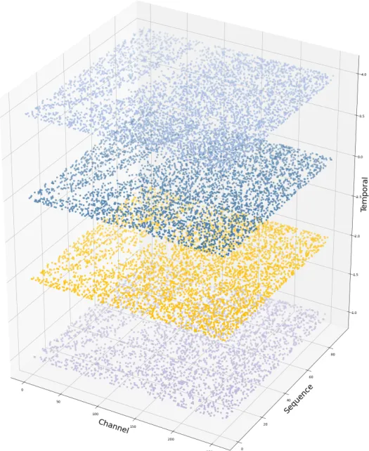

(b) STSA-encoder2

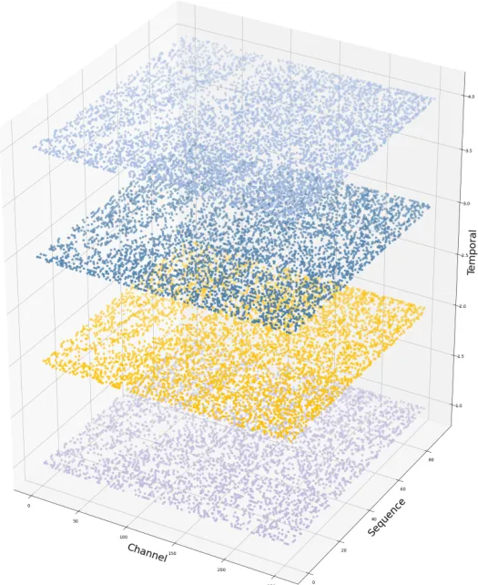

(c) STSA-encoder3


(d) STSA-encoder4


(e) Energy Predictor


(f) Pitch Predictor

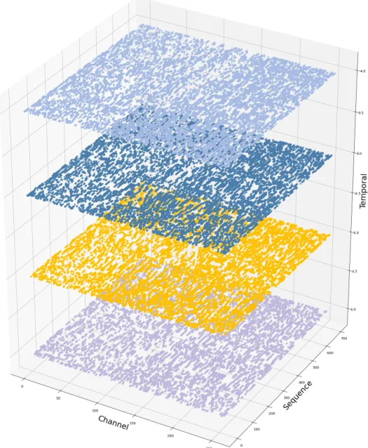

(g) STSA-decoder1

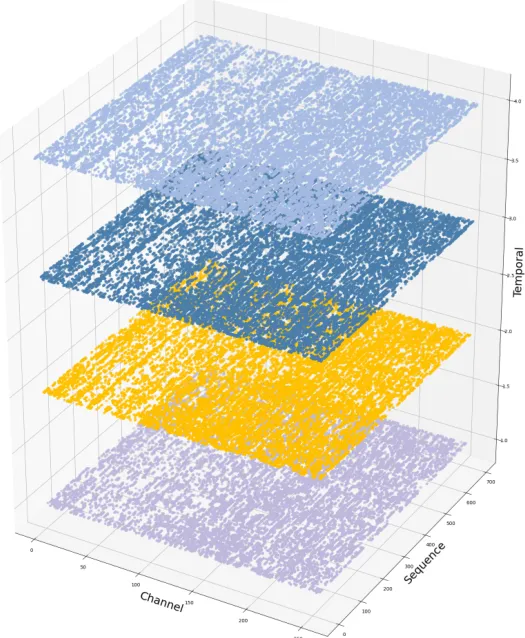

(h) STSA-decoder2

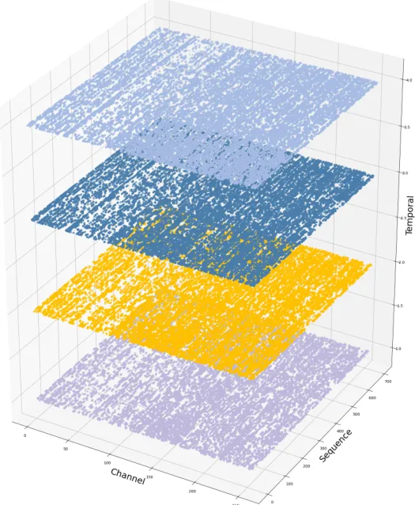

(i) STSA-decoder3

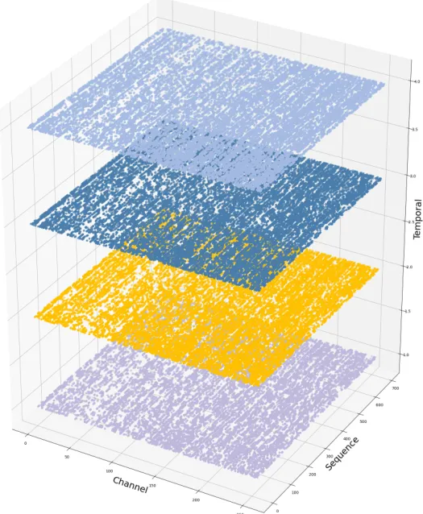

(j) STSA-decoder4

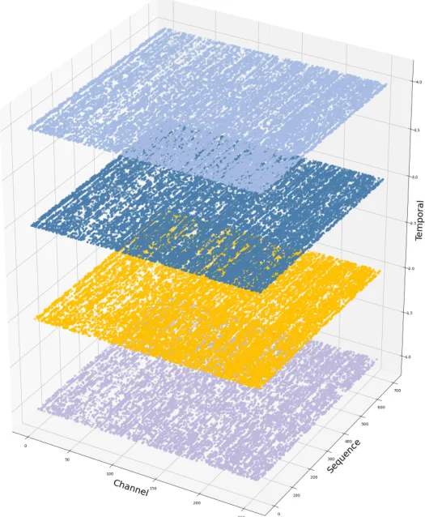

(k) STSA-decoder5

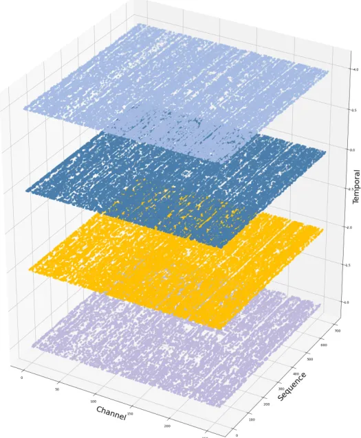

(l) STSA-decoder6

Figure 5: Visualization of spike tensor in the SpikeVoice. Figures in
5(a),5(b),5(c),5(d) are the spike pattern of STSA in Spiking Phoneme
Encoder. 5(e) and 5(f) denote spike pattern for speech energy and speech
pitch. Fig.5(g) to 5(l) are the spike pattern of STSA in Spiking Mel
Decoder.

## Appendix C Examples of Mel-Spectrograms

In Fig.6 we present Mel-Spectrograms of LJSpeech, Baker, LibriTTS, and
AISHELL3, and we have magnified the tail of the Mel-Spectrogram for a
clearer observation.


(a) Mel-Spectrograms of LJSpeech

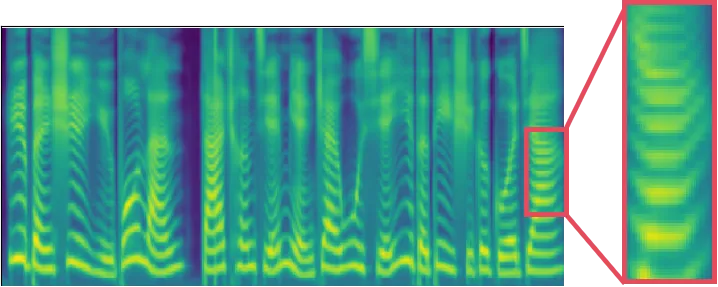

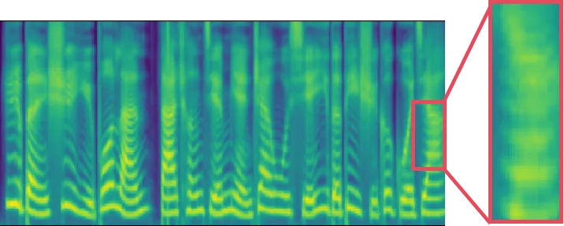


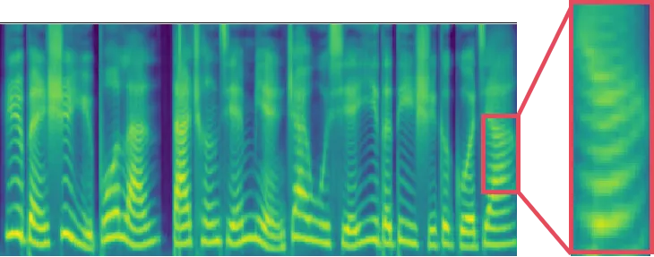

(b) Mel-Spectrograms of Baker

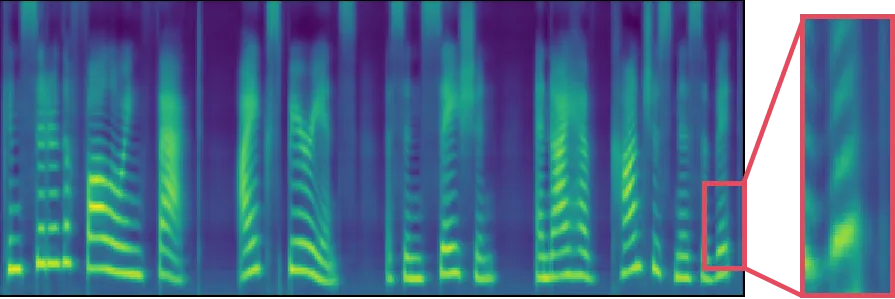

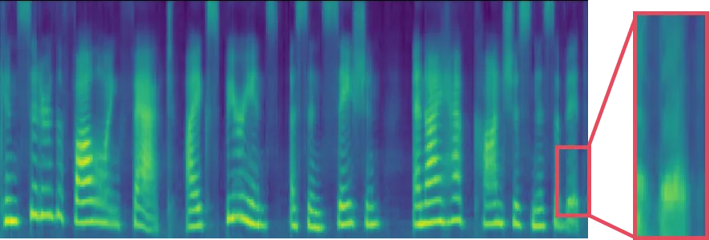

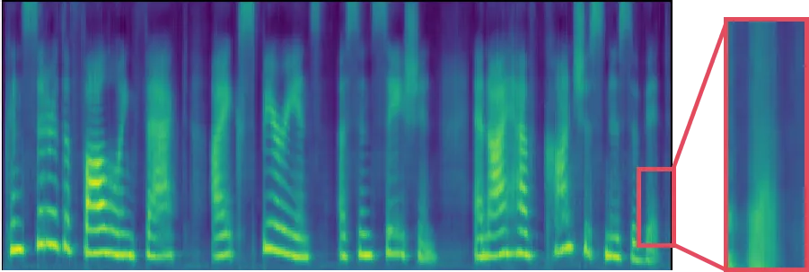

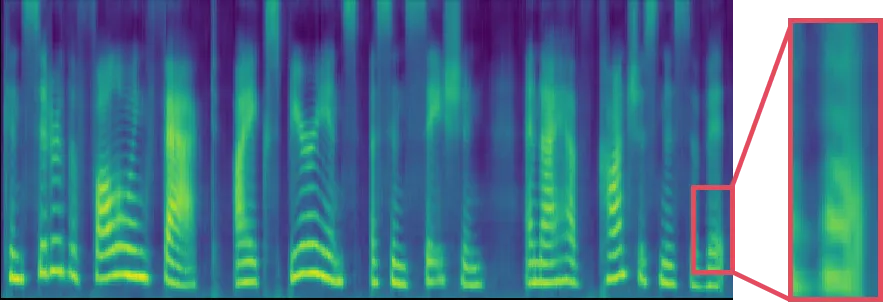

(c) Mel-Spectrograms of LibriTTS

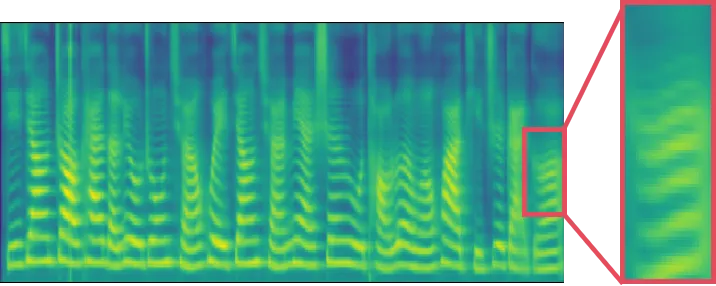

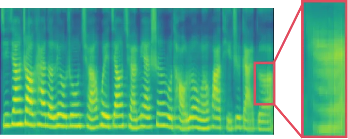

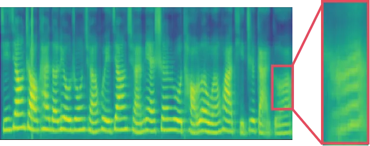

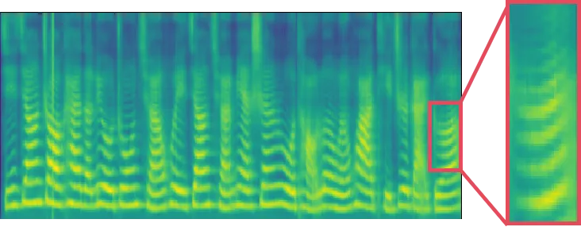

(d) Mel-Spectrograms of AIshell3

Figure 6: Mel Spectrograms on LJSpeech, Baker, LibriTTS and Aishell3.
Each row from left to right is the Mel spectrograms of the model ANN,
SpikeVoice-ATTN, SpikeVoice-SDSA and SpikeVoice-STSA.
