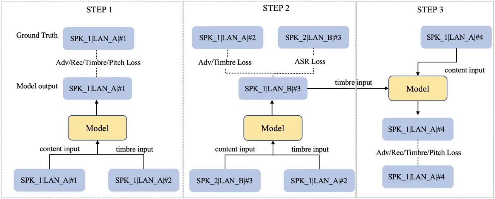
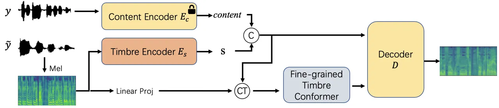
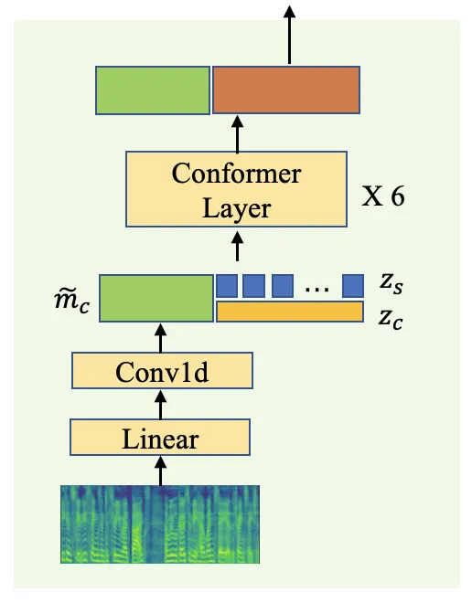
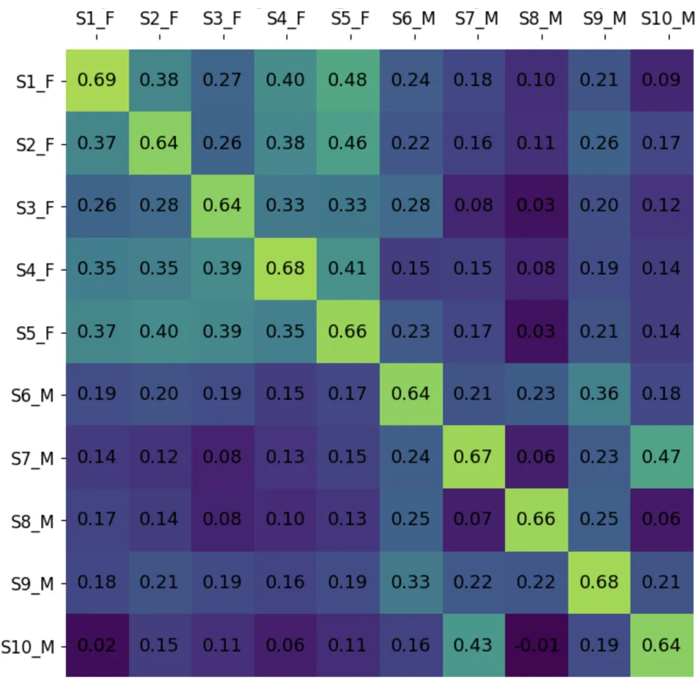
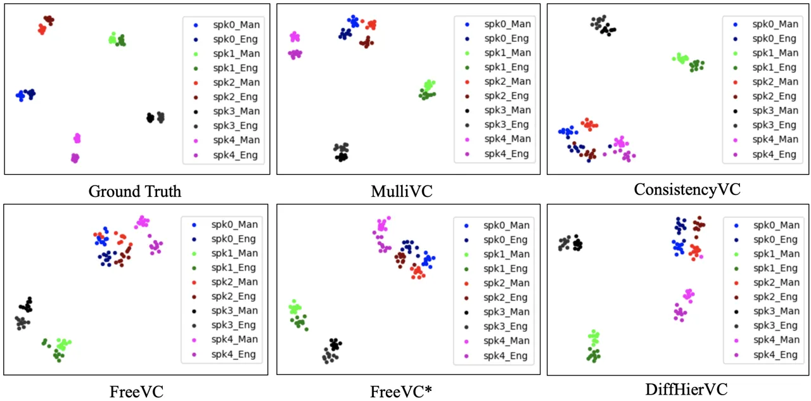
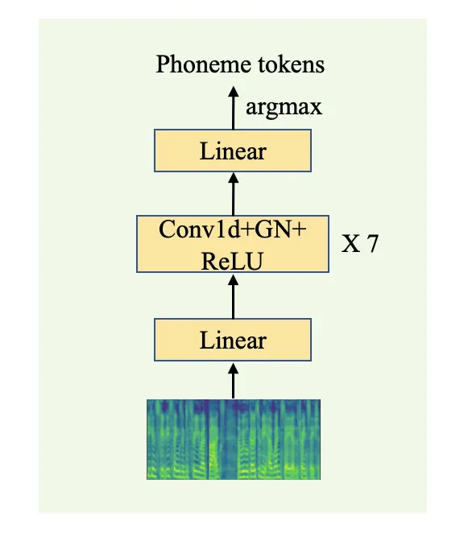

# MulliVC: Multi-lingual Voice Conversion With Cycle Consistency

DOI: [XXXXXXX.XXXXXXX](https://doi.org/XXXXXXX.XXXXXXX)Conference: Make
sure to enter the correct conference title from your rights confirmation
emai; June 03–05, 2018; Woodstock, NYWoodstock ’18: ACM Symposium on
Neural Gaze Detection, June 03–05, 2018, Woodstock,
NYISBN: 978-1-4503-XXXX-X/18/06CCS: Computing methodologies Natural
language processingCCS: Computing methodologies Neural
networksCCS: Applied computing Sound and music computing

Jiawei Huang Note: Both authors contributed equally to this research.
Note: Interns at ByteDance. email: <huangjw@zju.edu.cn>
Affiliation: China , Chen Zhang email: <zhangchen.0620@bytedance.com>
Affiliation: China , Yi Ren email: <ren.yi@bytedance.com>
Affiliation: China , Ziyue Jiang email: <ziyuejiang@zju.edu.cn>
Affiliation: China , Zhenhui Ye email: <ziyuejiang@zju.edu.cn>
Affiliation: China , Jinglin Liu email: <liu.jinglin@bytedance.com>
Affiliation: China , Jinzheng He email: <jinzhenghe@zju.edu.cn>
Affiliation: China , Xiang Yin email: <yinxiang.stephen@bytedance.com>
Affiliation: China and Zhou Zhao email: <zhaozhou@zju.edu.cn>
Note: Corresponding author. Affiliation: China

Received  5 June 2009

###### Abstract.

Voice conversion aims to modify the source speaker’s voice to resemble
the target speaker while preserving the original speech content. Despite
notable advancements in voice conversion these days, multi-lingual voice
conversion (including both monolingual and cross-lingual scenarios) has
yet to be extensively studied. It faces two main challenges: 1) the
considerable variability in prosody and articulation habits across
languages; and 2) the rarity of paired multi-lingual datasets from the
same speaker. In this paper, we propose MulliVC, a novel voice
conversion system that only converts timbre and keeps original content
and source language prosody without multi-lingual paired data.
Specifically, each training step of MulliVC contains three substeps: In
step one the model is trained with monolingual speech data; then, steps
two and three take inspiration from back translation, construct a
cyclical process to disentangle the timbre and other information
(content, prosody, and other language-related information) in the
absence of multi-lingual data from the same speaker. Both objective and
subjective results indicate that MulliVC significantly surpasses other
methods in both monolingual and cross-lingual contexts, demonstrating
the system’s efficacy and the viability of the three-step approach with
cycle consistency. Audio samples can be found on our demo page
([mullivc.github.io](https://mullivc.github.io)).

###### Keywords: 

voice conversion, multi-lingual voice conversion, speech
disentanglement, cycle consistency

## 1. introduction

These days, voice conversion (VC) has seen significant advancements
owing to the emergence of various pretrained speech representations and
major progress in speech synthesis models. VC can be broadly classified
into parallel and non-parallel systems (Godoy et al., 2011) according to
the type of training data. Considering the difficulty of getting
parallel speech data (Abe et al., 1990) (source speaker and target
speaker record the same speech content), non-parallel techniques are
mainstream for voice conversion. Non-parallel techniques mainly focus on
disentangling the content and speaker information from the source speech
data and then reconstructing the speech (Choi et al., 2023; Guo et al.,
2023; van Niekerk et al., 2022; Li et al., 2023; Zhou et al., 2021)
using target speaker information. Some earlier work (Zhou et al., 2021;
Sun et al., 2016; Zhou et al., 2019a) typically used pre-trained
automatic speech recognition (ASR) models to extract Phoneme
posterior-gram (PPG) as content features. Due to the emergence of
large-scale pre-trained self-supervised learning (SSL) models such as
Hubert (Hsu et al., 2021), WavLM (Chen et al., 2022b) and
Wav2Vec (Baevski et al., 2020), recent voice conversion models (van
Niekerk et al., 2022; Li et al., 2023; Choi et al., 2023) tend to use
SSL to extract content features and use speaker ID or speaker encoder to
encode speaker information. However, the content features extracted by
SSL models still contain the prosody and timbre information, leading to
inadequate voice conversion(Li et al., 2023; Choi et al., 2021; Qian
et al., 2022).

To bridge the gap between different languages, multi/cross-lingual voice
conversion (Zhou et al., 2019b; Zhou et al., 2019a) has been developed,
which is a special case in nonparallel systems and is more challenging.
Given the high costs associated with gathering bilingual speaker
datasets, current methods collect monolingual speaker datasets of
different languages to train the models. The content and speaker
information are sourced from the same language throughout the training
phase; however, during inference, the disparity emerges as content and
speaker information come from different languages. The inherent prosodic
and pronunciation differences among various languages place traditional
multi/cross-lingual VC methods into an out-of-domain context, resulting
in generated speech with compromised intelligibility and speaker
similarity.

In order to bolster the lingual generalization and the disentangle
performance of the VC models, we propose MulliVC, a novel multi-lingual
VC system that leverages cycle training strategy. Specifically, we
divide each training iteration into three substeps. step 1 is the same
as a traditional VC training step, we synthesize the speech by using the
content and timbre information from the same speaker. In step 2, we use
the speech of two speakers who speak different languages as content and
timbre inputs, constraining the outputs using timbre loss and asr loss.
During step 3, we reconstruct the speech, preserving the timbre
identified in step 2, by combining it with content from a different
sentence by the same speaker, thus constituting a cross-lingual voice
conversion cycle. Though we have no multi-lingual paired data, by
strategically designing the information flow within the cycle comprising
step 2 and step 3, we compel the model to exclusively learn timbre
information from the timbre input while disregarding any extraneous
information present in that input, which encourages the disentanglement
of timbre and other information. Furthermore, to improve the model’s
effectiveness in extracting timbre information, we introduce the
fine-grained timbre conformer, designed to aid the model in capturing
subtle aspects of timbre. The experimental results denote that MulliVC
outperforms baseline models in terms of both objective and subjective
metrics and achieves substantial gains across monolingual and
cross-lingual voice conversion scenarios.

## 2. Related Works

### 2.1. Cross-lingual Voice Conversion

Cross-lingual voice conversion aims to modify a source monolingual
speaker’s identity towards a target speaker who speaks another language
while preserving the source linguistic content. It is more challenging
than conventional monolingual voice conversion.  (Zhou et al., 2019b)
proposes to use a bilingual Phonetic PosteriorGram for the content
representation of speech, together with an averaging model (Tian et al., 2018) designed to synthesize the average speech that embodies the
speakers present in the dataset. The averaging model serves as a
generative model which is paired with an i-vector (Tian et al., 2018)
seating adaptation step computed using a speaker verification
formula (Das et al., 2014), to synthesize the target speaker’s speech to
achieve Cross-Language Voice Conversion (XVC).  (Zhou et al., 2019a)
proposes to use a jointly trained speaker encoder instead of i-vector
for better XVC results. FastSpeech-VC (Zhao et al., 2021) pointed out
that there are significant mismatches between phonetic sets and speech
prosody of different languages, and PPG alone does not preserve rhythms
well, for which they introduced normalized logarithm-scale fundamental
frequency (Log-F0) to compensate for the prosodic mismatches.
CyclePPG-XVC (Zhou et al., 2021) points out that the loss of spectral
reconstruction optimized to match the identity of the target speaker
causes the transformation model to capture the articulation of the
target speech from a different language and the native pronunciation or
articulation of the source speech cannot be preserved, making the
intelligibility of the converted speech worse. For this reason, they
introduced a cyclic loss on the PPG features to force the converted
speech to carry the same linguistic content as the natural input speech.
ConsistencyVC (Guo et al., 2023) argues that some previous VC work used
pre-trained speaker encoders in speaker classification tasks to obtain
speaker embeddings, which are then used to guide speech synthesis. The
main goal of the pre-trained speaker encoders is not speech synthesis,
but speaker recognition. Therefore, this approach may miss emotional
information in the reference speech. They use a jointly trained speaker
encoder and after certain steps, this jointly trained speaker encoder is
used to compute speaker consistency loss for improving speaker
similarity and emotion similarity.

### 2.2. Multi-lingual TTS

Multi-lingual Text-To-Speech(TTS) is to synthesize speech in multiple
languages, where the speaker’s language can be the same or different
from the target language.  (Liu and Mak, 2020) uses a Tacotron (Wang
et al., 2017) synthesizer with shared phonemes for inputs and a speaker
encoder module to achieve multilingual TTS. They introduce tone/stress
embeddings to represent tone and stress information for speech
generation with native accents. To improve the speaker similarity
between the synthesized speech and the recordings of the native speaker,
 (He, 2022) introduces multi-task learning and speaker classifier joint
training, they additionally add the speaker classification Cross Entropy
loss and cross-lingual loss to the original loss.  (Lee et al., 2022)
argues that the L2 (second-language) accents problem often occurs in
cross-linguistic TTS and uses vowel space analysis, to study the L2
accents problem. They point out that the L2 accents of the parallel
architecture (Glow-TTS) (Kim et al., 2020) are less than the L2 accents
of the autoregressive architecture (Tacotron).  (Cai et al., 2023)
explores cross-lingual TTS in data-sufficient and low-resource
scenarios. They propose that models that work well in data-sufficient
scenarios do not perform well in low-resource scenarios for
cross-language TTS. For this reason, they synthesize a pipeline that
consists of a bilingual TTS system, a bottleneck feature extractor, a
speaker embedding extractor, a multi-speaker voice conversion system,
and a vocoder to achieve cross-language TTS. VALL-E X (Zhang et al., 2023) uses a rule-based converter to convert the transcriptions to
phoneme sequences and uses a neural codec encoder (Défossez et al., 2022) to convert the speech into acoustic tokens. Then they concatenate
the paired phoneme and acoustic token sequences of each language and
train a multi-lingual conditional language model with a language ID
module to alleviate accent problems. The generated acoustic tokens will
be sent to the codec decoder to generate speech.

### 2.3. Cycle/Back-Translation

Back-translation (He et al., 2016; Sennrich et al., 2015) technique was
first introduced in machine translation. It brings about the bridge
between source and target languages by using a backward model that
translates data from target to source. The (source and target)
monolingual data is translated back and forth iteratively to progress
the machine translation model in both directions. It is particularly
effective in the case of missing data for parallel bilingual data. After
that, some researchers introduced back-translation into the field of
speech. In a low-resource scenario lacking text-to-speech alignment
data, they use ASR models to generate pseudo-labels for speech. Then
they use TTS models to regenerate speech with the transformed
pseudo-labels, and the two models were jointly trained to achieve the
training of an unsupervised TTS model (Liu et al., 2022; Ni et al.,
2022; Ren et al., 2022). In the field of voice conversion, there is also
some research with ideas similar to back-translation.
CycleGAN-VC (Kaneko and Kameoka, 2018) achieves one-to-one voice
conversion without parallel data by jointly training two GAN models, one
responsible for converting the speech of A to the speech of B timbre and
the other vice versa. However, our approach is different to CycleGAN-VC,
we use one single model to perform voice conversion between the two
languages. In addition, our "back-translation" process maintains the
timbre input as the same speaker, rather than keeping the speech content
unchanged. We will discuss the detials in section 3.1.

## 3. methods

In this section, we will first describe the training pipeline overview
of MulliVC. Next, we provide the cycle training strategy of MulliVC,
which aims to improve the cross-lingual performance and timbre
disentanglement of the model. Finally, we present the model architecture
of MulliVC.

### 3.1. Pipeline Overview



Figure 1. Training of MilliVC. SPK_1\|LAN_A\|#2 denotes speech#2 said by
speaker 1 who speaks language A.

Obtaining data for the same speaker speaking multiple languages is a
expensive and difficult task. Consequently, existing XVC methods often
rely on combining monolingual speaker data to create a multilingual
dataset. These methods aim to disentangle content and timbre information
from speech and reconstruct speech using these two components. However,
since the timbre and content information used during training belong to
the same speaker’s speech, existing models struggle to generate speech
where the content information is from language A and the timbre
information is from language B. As a result, suboptimal results are
obtained. To address this limitation and fully leverage the potential of
multilingual data, we propose a cycle training strategy.

Suppose we possess a large multilingual corpus consisting of two
languages, namely language A and language B, with numerous speakers
fluent in both languages. We randomly select two speakers for this
illustration: Speaker 1, who speaks language A, and Speaker 2, who
speaks language B. We represent the speech spoken by Speaker 1 in
language A as SPK_1\|LAN_A\|#1, where speech#1 and speech#2 refer to two
distinct utterances.

As depicted in Figure 1, each training step of our proposed MulliVC
model consists of three substeps, and the losses from all three steps
are summed up to perform a single model update. The training process of
step 1 is similar to the previous works (Choi et al., 2023; Guo et al.,
2023; Li et al., 2023) in voice conversion, where the model takes the
speech of the same person (take speaker 1 as an example in the figure)
as both content input and timbre input to reconstruct the voice used as
the content input, preserving the ability to transfer the timbre
information when both inputs are in the same language. The loss of step
1 can be expressed as:

```math
\mathcal{L}=\lambda_{1}\mathcal{L}_{Adv}+\lambda_{2}\mathcal{L}_{Rec}+\lambda_{3}\mathcal{L}_{Timbre}+\lambda_{4}\mathcal{L}_{Picth} \tag{1}
```

```math
\mathcal{L}_{Timbre}=1-\frac{f_{T}(m_{t})\cdot f_{T}(\hat{m_{t}})}{\lVert f_{T}(m_{t})\rVert\cdot\lVert f_{T}(\hat{m_{t}})\rVert} \tag{2}
```

Where $`\lambda_{...}`$ are weighting parameters, we set
$`\lambda_{1}=0.05,\lambda_{2}=1,\lambda_{3}=0.1,\lambda_{4}=1`$ in our
experiment. $`\mathcal{L}_{Rec}=\lVert m_{t}-\hat{m_{t}}\rVert_{2}`$ is
the reconstruction loss, $`\lVert\cdot\rVert_{2}`$ is the L2 norm
distance. $`\mathcal{L}_{Adv}`$ is the LSGAN-styled adversarial
loss (Mao et al., 2017) whose objective is to minimize the distribution
distance between the generated mel-spectrograms $`\hat{m_{t}}`$ and the
ground truth mel-spectrograms $`m_{t}`$ to avoid excessive smoothing
problem. We adopt patch-based discriminator(Isola et al., 2017) as our
discriminator.
$`\mathcal{L}_{Picth}=\lVert f_{P1}(m_{t})-f_{P1}(\hat{m_{t}})\rVert_{2}`$
is the pitch perceptual loss, $`f_{P}`$ is a pre-trained pitch
predictor, we use the first layer embedding to calculate the perceptual
loss. $`\mathcal{L}_{Timbre}`$ is the timbre loss, where $`f_{T}`$ is a
pre-trained speaker verification(SV) model.

The content input and timbre input of step 2 and step 3 come from
different languages, simulating a cross-language voice conversion
scenario. The output of step 2 is used as the timbre input of step 3,
and the two together form a cycle consistency loop, which will be
detailed in the next section.



Figure 2. Model architecture of MulliVC. Note that modules printed with
a lock are frozen when training. We use \tiny{C}⃝,\tiny{CT}⃝ to denote
concatenate along the channel axis and concatenate along the time axis
respectively



Figure 3. The Fine-grained Timbre Conformer architecture.

### 3.2. Cycle Consistency

Due to the unavailability of speech data from the same speaker speaking
two different languages, we addressed this limitation by simulating this
scenario in step 3 through a cyclical approach encompassing steps 2 and 3.

In step 2, we employ speech#3 of speaker 2 who speaks language B as
content input and take speech#2 of speaker 1 from language A as timbre
input, and assume the model can generate a speech SPK_1\|LAN_B\|#3 which
means the content is the same as speech#3 but with the timbre of
speaker 1. The loss of step 2 is

```math
\mathcal{L}=\lambda_{1}\mathcal{L}_{Adv}+\lambda_{3}\mathcal{L}_{Timbre}+\lambda_{5}\mathcal{L}_{ASR} \tag{3}
```

Where
$`\mathcal{L}_{ASR}=\lVert f_{A}(m_{t})-f_{A}(\hat{m_{t}})\rVert_{2}`$
is the ASR perceptual loss. $`\lambda_{5}=0.5`$, $`f_{A}`$ is a
pre-trained automatic speech recognition model, we use the last layer
embedding of $`f_{A}`$ to calculate the perceptual loss. Considering
there is no ground truth data of SPK_1\|LAN_B\|#3, ASR perceptual loss
is necessary to align the content information. Furthermore, the timbre
loss ensures that the generated speech matches the timbre of speaker 1.

In step 3, we utilize the output SPK_1\|LAN_B\|#3 obtained in step 2 as
the timbre input. As for the content input, we use speech#4 of speaker 1
speaking language A. Since both speeches possess the timbre of speaker
1, we simulated the same speaker speaking two different languages.
Consequently, another cross-lingual voice conversion can be performed.
Moreover, we have the ground-truth data SPK_1\|LAN_B\|#4 available
during this step, which enables us to calculate the pitch perceptual
loss and reconstruction loss. These losses ensure the model’s output
aligns with the ground-truth data distribution. The loss calculation in
step 3 follows the same methodology as step 1.

By incorporating step 1 and the cross-lingual voice conversion cycle of
step 2 and step 3, we guarantee the model’s ability to convert voices
within the same language while also enhancing the performance of
cross-lingual voice conversion.

Additionally, the previous voice conversion scheme solely consisted of
step 1, where the content features generated by SSL still contained
certain timbre information. During audio reconstruction, the model
unavoidably reads timbre information from the content features,
resulting in insufficient disentanglement of timbre and content and
sub-optimal generalization capabilities. Conversely, in our training
strategy, step 2 ensures that the content and timbre inputs originate
from different speakers, compelling the model to exclusively extract
timbre information from the timbre inputs. This approach enhances the
model’s ability to disentangle timbre and content, thereby improving its
generalization capabilities in terms of timbre.

### 3.3. Model Architecture

As illustrated in Figure 2. Denote $`Y=\{y_{1},...,y_{n}\}`$ as the
speech corpus for a certain speaker. In training, $`Y`$ is partitioned
as target audio $`y_{t}`$ and reference audio $`\tilde{y}`$. $`y_{t}`$
is fed into the pre-trained content encoder $`E_{c}`$ to get the content
feature $`z_{c}\in R^{T\times C}`$, where $`T`$ is the length of
time-axis and $`C`$ is channels. We adopt ContentVec(Qian et al., 2022)
which aims to disentangle speaker information from audio and only encode
content information as our content encoder.$`\tilde{y}`$ is fed into the
global timbre encoder $`E_{s}`$ to encode the global timbre feature
$`S\in R^{1\times C}`$. Inspired by MegaTTS2(Jiang et al., 2023) and
CDFSE(Zhou et al., 2022) that fine-grained timbre information can
represent the speakers’ speaking habits and better help the model
imitate the timbre of the reference audio, we design a Fine-grained
Timbre Conformer(Gulati et al., 2020) to capture fine-grained timbre
information. As illustrated in Figure  3, the global timbre feature
$`S`$ is first repeated along the time axis to
$`z_{s}\in R^{T\times C}`$ and concatenated with $`z_{c}`$ in the
channel axis to get feature $`z_{u}\in R^{T\times 2C}`$. The reference
mel-spectrogram $`\tilde{m}\in R^{T^{\prime}\times D}`$ where $`D`$
denotes the number of mel bins is firstly compressed into acoustic
hidden states by a factor of $`d`$ in length then projected by a linear
layer to $`\tilde{m_{c}}\in R^{\frac{T^{\prime}}{d}\times 2C}`$ and
concatenate with $`z_{u}`$ along time axis sending to Conformer. In
conformer, fine-grained timbre information will be merged with $`z_{u}`$
by Convolution and Self-Attention(Vaswani et al., 2017) mechanism.

## 4. experiments

|               | VCTK            |                 |      |       | VCTK-AIS1       |                 |      |       | AIS1-VCTK       |                 |       |       |
| ------------- | --------------- | --------------- | ---- | ----- | --------------- | --------------- | ---- | ----- | --------------- | --------------- | ----- | ----- |
| Model         | nMOS↑           | sMOS↑           | WER↓ | SIM↑  | nMOS↑           | sMOS↑           | WER↓ | SIM↑  | nMOS↑           | sMOS↑           | CER↓  | SIM↑  |
| GT            | -               | -               | 1.27 | -     | -               | -               | 1.02 | -     | -               | -               | 5.98  | -     |
| Diff-HierVC   | 3.44$`\pm`$0.11 | 3.41$`\pm`$0.09 | 6.46 | 0.276 | 3.34$`\pm`$0.13 | 3.47$`\pm`$0.07 | 5.96 | 0.184 | 3.17$`\pm`$0.12 | 3.27$`\pm`$0.12 | 26.99 | 0.180 |
| FreeVC        | 3.72$`\pm`$0.09 | 3.63$`\pm`$0.08 | 3.10 | 0.376 | 3.79$`\pm`$0.08 | 3.71$`\pm`$0.09 | 2.88 | 0.143 | 3.51$`\pm`$0.10 | 3.43$`\pm`$0.08 | 22.62 | 0.299 |
| FreeVC\*      | 3.48$`\pm`$0.09 | 3.51$`\pm`$0.08 | 5.57 | 0.220 | 3.62$`\pm`$0.10 | 3.66$`\pm`$0.07 | 6.37 | 0.177 | 3.34$`\pm`$0.11 | 3.37$`\pm`$0.09 | 15.56 | 0.145 |
| ConsistencyVC | 3.78$`\pm`$0.10 | 3.59$`\pm`$0.09 | 4.86 | 0.174 | 3.92$`\pm`$0.08 | 3.88$`\pm`$0.08 | 5.48 | 0.256 | 3.66$`\pm`$0.11 | 3.52$`\pm`$0.10 | 9.58  | 0.094 |
| Ours          | 3.92$`\pm`$0.11 | 3.88$`\pm`$0.11 | 2.24 | 0.395 | 4.00$`\pm`$0.08 | 3.98$`\pm`$0.09 | 2.37 | 0.376 | 3.69$`\pm`$0.11 | 3.73$`\pm`$0.09 | 9.91  | 0.311 |

Table 1. The zero-shot voice conversion performance comparison of our
model and baselines. "-" means the result is not available.

|               | EMIME Eng-Man   |                 |      |       | EMIME Man-Eng   |                 |      |       |
| ------------- | --------------- | --------------- | ---- | ----- | --------------- | --------------- | ---- | ----- |
| Model         | nMOS↑           | sMOS↑           | WER↓ | SIM↑  | nMOS↑           | sMOS↑           | CER↓ | SIM↑  |
| GT            | -               | -               | 4.29 | -     | -               | -               | 2.97 | -     |
| Diff-HierVC   | 3.39$`\pm`$0.08 | 3.41$`\pm`$0.08 | 8.45 | 0.426 | 3.42$`\pm`$0.08 | 3.46$`\pm`$0.06 | 6.84 | 0.395 |
| FreeVC        | 3.64$`\pm`$0.06 | 3.54$`\pm`$0.07 | 7.72 | 0.331 | 3.56$`\pm`$0.05 | 3.50$`\pm`$0.08 | 6.70 | 0.309 |
| FreeVC\*      | 3.59$`\pm`$0.06 | 3.61$`\pm`$0.07 | 7.99 | 0.363 | 3.52$`\pm`$0.07 | 3.57$`\pm`$0.07 | 7.57 | 0.380 |
| ConsistencyVC | 3.83$`\pm`$0.08 | 3.72$`\pm`$0.07 | 5.28 | 0.322 | 3.80$`\pm`$0.06 | 3.71$`\pm`$0.06 | 8.14 | 0.310 |
| Ours          | 4.02$`\pm`$0.08 | 4.00$`\pm`$0.07 | 5.21 | 0.534 | 3.96$`\pm`$0.10 | 4.03$`\pm`$0.08 | 4.49 | 0.549 |

Table 2. Zero-shot voice conversion performance comparison of our model
and baselines on EMIME bilingual dataset. EMIME Eng-Man means the source
speech records come from English speech corpus and the targets are from
Chinese Mandarin speech corpus. EMIME Man-Eng is vice versa.

### 4.1. Experimental Setup

#### 4.1.1. Dataset

We use several datasets to train our model. We use Libritts (Zen et al., 2019) for the English speech corpus. And we use aidatatang_200zh¹¹ 1
[https://openslr.org/62/](https://openslr.org/62/), MAGICDATA²² 2
[https://openslr.org/68/](https://openslr.org/68/) and ST-CMDS³³ 3
[https://openslr.org/38/](https://openslr.org/38/) Chinese Mandarin
speech corpus. We use VCTK(Yamagishi et al., 2019), Aishell-1(Bu et al., 2017) and EMIME(Wester, 2010) datasets to evaluate our models’ zero-shot
voice conversion performance. EMIME(Wester, 2010) contains bilingual
audio recordings by the same speakers. The sample rate is 16KHz for all
speech data.

#### 4.1.2. Model Configuration

MulliVC consists of a content encoder, a timbre encoder, a fine-grained
timbre conformer, a mel decoder, and a Patch-GAN discriminator. The
timbre encoder consists of 5 convolution layers with 512 hidden size and
5 kernel size. The Fine-grained timbre conformer consists of 6 conformer
layers. The mel decoder consists of 5 convolutional blocks with 512
hidden size and 5 kernel size. In the training stage, we involve three
pre-trained models to calculate auxiliary loss: a speaker verification
model, an automatic speech recognition model, and a pitch predictor.
These models are trained on the same dataset of MulliVC, please refer to
Appendix A for the details of these models.

#### 4.1.3. Training Details

MulliVC is trained on 1 A100 GPU with a batch size of 8 speeches.
Considering 1 training step is split into 3 substeps, the model takes 24
speeches as input for 1 step in total. We use the Adam optimizer with
learning rate of
$`10^{-4},\beta{{}_{1}}=0.9,\beta{{}_{2}}=0.999,\epsilon=10^{-9}`$. We
train MulliVC for 240K training steps. In training, language A and
language B will be randomly switched. The predicted mel-spectrograms are
transformed into audio samples using pre-trained HiFi-GAN V1 (Kong
et al., 2020).

#### 4.1.4. Evaluation Metrics

Following (Choi et al., 2023), we conduct the naturalness and similarity
mean opinion score (nMOS and sMOS, respectively) for subjective
evaluation, 16 subjects are employed to provide the subjective measures.
we evaluate the word error rate (WER) of the English corpus, the
character error rate (CER) of the Chinese corpus, and speaker similarity
(SIM) for objective evaluation. We use whisper-large-v3(Radford et al., 2023) to transcribe the generated speech into text. Then, the WER/CER
between the transcribed text and the original target text is measured.
In terms of the cosine speaker similarity, we use the WavLM-TDCNN
model⁴⁴ 4
[https://github.com/microsoft/UniSpeech/tree/main/downstreams/speaker_verification](https://github.com/microsoft/UniSpeech/tree/main/downstreams/speaker_verification)(Chen
et al., 2022a) to compute the cosine speaker similarity score between
the target speech and the converted speech. The similarity score is in
the range of $`[-1,1]`$, where a larger value indicates a higher
similarity of input samples.

### 4.2. Main Results

#### 4.2.1. Baseline Models

We use pre-trained FreeVC⁵⁵ 5
[https://github.com/OlaWod/FreeVC](https://github.com/OlaWod/FreeVC),
ConsistencyVC⁶⁶ 6
[https://github.com/ConsistencyVC/ConsistencyVC-voive-conversion](https://github.com/ConsistencyVC/ConsistencyVC-voive-conversion)
and DiffHier-VC⁷⁷ 7
[https://github.com/hayeong0/Diff-HierVC](https://github.com/hayeong0/Diff-HierVC)
as our baseline models. The pre-trained FreeVC was trained on the VCTK
dataset, which is not the zero-shot scenario. To train with the same
settings as our model, we retrain FreeVC with our training dataset and
denote the retrained model as FreeVC\*. DiffHier-VC is trained on the
LibriTTS dataset. ConsistencyVC is trained on a combination of English,
Chinese, and Japanese datasets.

#### 4.2.2. Zero-shot Voice Conversion Comparison

We conducted subjective and objective evaluations for three zero-shot
voice conversion (VC) scenarios. The first scenario involved voice
conversion in English, using source and target speeches from the VCTK
dataset. Additionally, we conducted two cross-lingual voice conversion
experiments: VCTK-AIS1 and AIS1-VCTK. This implies using source speeches
from VCTK and target speeches from Aishell-1 for the former experiment,
and source speeches from Aishell-1 and target speeches from VCTK for the
latter. For objective evaluation of each experiment, we randomly created
400 speaker pairs, and each pair was randomized to use 5 speeches, for a
total of 2000 speech pairs to calculate WER and SIM. For human
evaluation of each experiment, we randomly select 30 synthesized speech
records to conduct nMOS and sMOS evaluation. The results are listed in
Table  1.

For speech intelligibility, our method achieves lower WER compared with
baseline models in VCTK and VCTK-AIS1. The CER metric of our method on
the AIS1-VCTK dataset is comparable to ConsistencyVC. Also, we achieved
the highest nMOS score on all datasets. For speaker similarity, the SIM
score and sMOS score of our method are significantly improved compared
to the baselines. It is worth noting that FreeVC is trained on the VCTK
dataset, while our method surpasses FreeVC on the VCTK dataset,
indicating that the zero-shot performance of our method outperforms the
performance of FreeVC’s seen speaker. In addition we observed that
ConsistencyVC had lower SIM scores than FreeVC\* and DiffHierVC under
VCTK and AIS1-VCTK tests, but obtained higher sMOS scores. It suggests
that WavLM-TDCNN pays attention to some details that are weaker in human
perception compared to human rators. In addition, the clarity and
naturalness of the audio also affect the sMOS scores compared to
WavLM-TDCNN. Speeches with low intelligibility may also receive high SIM
scores, as further confirmed by our research in the ablation study
section.

We further compare our model’s zero-shot voice conversion performance
with baselines on the EMIME bilingual dataset, the results are displayed
in Table  2. On the EMIME dataset, the results of our model have a
significant advantage over the baselines. In addition, we find that the
SIM scores of the models are generally higher than those of AIS1-VCTK
and VCTK-AIS1 because the bilingual speakers of EMIME are native
speakers of Chinese, so they have similar accents when speaking the two
languages. Higher SIM scores are obtained when the generated speech is
similar in accent to the target speech.

To test the voice conversion capability on unseen languages, we test on
the French (FR) and German (DE) subsets of M-AILABS (Munich Artificial
Intelligence Laboratories GmbH, 2017). The results are listed in Table
 3. Our model is substantially ahead of the baseline model in unseen
languages, meaning that training with cycle consistency enables the
model to disentangle timbre for unseen languages and enhance the
generalization capability.

|               | FR-DE           |                 |       |       | DE-FR           |                 |       |       |
| ------------- | --------------- | --------------- | ----- | ----- | --------------- | --------------- | ----- | ----- |
| Model         | nMOS↑           | sMOS↑           | WER↓  | SIM↑  | nMOS↑           | sMOS↑           | CER↓  | SIM↑  |
| GT            | -               | -               | 5.80  | -     | -               | -               | 5.50  | -     |
| Diff-HierVC   | 3.44$`\pm`$0.09 | 3.52$`\pm`$0.11 | 14.78 | 0.260 | 3.55$`\pm`$0.11 | 3.55$`\pm`$0.08 | 12.09 | 0.212 |
| FreeVC        | 3.76$`\pm`$0.11 | 3.61$`\pm`$0.09 | 13.00 | 0.179 | 3.73$`\pm`$0.09 | 3.59$`\pm`$0.08 | 10.18 | 0.106 |
| FreeVC\*      | 3.51$`\pm`$0.13 | 3.46$`\pm`$0.09 | 20.64 | 0.191 | 3.59$`\pm`$0.11 | 3.48$`\pm`$0.12 | 19.18 | 0.153 |
| ConsistencyVC | 3.62$`\pm`$0.09 | 3.59$`\pm`$0.08 | 19.48 | 0.149 | 3.69$`\pm`$0.08 | 3.61$`\pm`$0.11 | 13.06 | 0.111 |
| Ours          | 3.86$`\pm`$0.10 | 3.82$`\pm`$0.09 | 7.34  | 0.410 | 3.85$`\pm`$0.08 | 3.78$`\pm`$0.10 | 6.63  | 0.332 |

Table 3. Zero-shot voice conversion performance comparison for unseen
languages on the French (FR) and German (DE) subsets of M-AILABS (Munich
Artificial Intelligence Laboratories GmbH, 2017) dataset. FR-DE means
the source speech records come from French speech corpus and the targets
are from German. DE-FR is vice versa.

### 4.3. Method Analyses

#### 4.3.1. Validating The Effectiveness Of SV Model for Cross-linguistic Scenario



Figure 4. Si_F, Sj_M denotes female speaker i and male speaker j
respectively. Speeches of Chinese Mandarin spoken -by the corresponding
speaker are displayed on the horizontal axis. Speeches of English are
displayed on the vertical axis. The number in each grid is the average
SIM between the speeches.

The SV model WavLM-TCDNN is trained using a multilingual dataset
composed of monolingual speakers. Consider that we need to test SIM
scores with the it to evaluate the VC model’s ability to convert voice
across languages. It is essential to determine whether the SV model can
correctly identify that two speeches in different languages come from
one speaker. We experiment on the EMIME(Wester, 2010) dataset which
contains bilingual audio recordings by the same speakers. We sample 5
female speakers and 5 male speakers from the EMIME dataset, for each
speaker, we sample 20 English speeches and 20 Chinese Mandarin speeches.
And we calculate the average SIM with WavLM-TDCNN between speeches. The
result is shown in Figure 4. The consequent findings reveal that the
similarity between speeches of different languages delivered by the same
speaker is significantly higher than that between speeches of different
languages delivered by different speakers. This pertinent evidence leads
us to conclude that WavLM-TCDNN proves effective in measuring timbre
similarity within cross-linguistic scenarios.

#### 4.3.2. Speaker Clustering Comparison



Figure 5. Visualization of the speaker embedding space based on t-SNE
and four randomly selected speakers in the EMIME dataset. spk$`i`$\_MAN
denotes the Chinese Mandarin speech of speaker $`i`$. And spk$`i`$\_ENG
denotes the English speech of speaker $`i`$.

To further investigate the speaker embedding space of the WavLM-TDCNN
models and explore the cross-lingual voice conversion performance of
each model, we conducted an experiment on the EMIME dataset. We
reconstructed language A/B by utilizing speech from language A/B as the
content input and the same speaker’s speech from language B/A as the
timbre input. Utilizing WavLM-TDCNN, we obtained the reconstructed voice
speaker embedding, which was then subjected to clustering using
t-SNE (Van der Maaten and Hinton, 2008). The clustering results,
visualized in Figure  5, indicate that there is a minor difference
between the distributions of speaker embeddings derived from speech in
different languages spoken by the same individual. However, this
difference is significantly smaller compared to the disparity observed
between speaker embeddings from different speakers. This finding further
validates Section 4.2’s assertion regarding the applicability of
WavLM-TDCNN in evaluating voice conversion within cross-language
scenarios. Moreover, when comparing the distributions of speaker
embeddings among different speakers, MulliVC exhibits more distinct and
tightly grouped clusters, suggesting superior performance in timbre
disentangling and voice conversion than the other baselines.

| Setting | Model                      | VCTK  |       | VCTK-AIS1 |       | AIS1-VCTK |       |
| ------- | -------------------------- | ----- | ----- | --------- | ----- | --------- | ----- |
|         |                            | WER↓  | SIM↑  | WER↓      | SIM↑  | CER↓      | SIM↑  |
| \#1     | Ours                       | 2.24  | 0.395 | 2.37      | 0.376 | 9.91      | 0.311 |
| \#2     | w/o step 3                 | 8.42  | 0.393 | 4.76      | 0.422 | 10.65     | 0.333 |
| \#3     | w/o step 2,3               | 2.24  | 0.310 | 2.09      | 0.259 | 9.37      | 0.191 |
| \#4     | w/o ASR loss               | 10.40 | 0.384 | 19.03     | 0.461 | 26.47     | 0.319 |
| \#5     | w/o Fine-Grained Confromer | 6.96  | 0.337 | 5.45      | 0.363 | 30.47     | 0.265 |

Table 4. The ablation study of MulliVC. The design of our MulliVC
achieves a favorable balance between intelligibility (WER) and speaker
similarity (SIM).

### 4.4. Ablation Study

#### 4.4.1. Cross-lingual Steps

To verify the effectiveness of the cross-lingual steps (step 2 and step
3), we evaluate the performance of the voice conversion models without
them and list the results in Setting \#2 and Setting \#3 of Table 4.
Compare Setting \#2 with Setting \#3 of Table 4, speaker similarity
decreases significantly after removing step 2. It is worth noting that
after adding the cross-lingual voice conversion step 2, the speaker
similarity of the VCTK dataset with timbre migration within the same
language is also highly improved. This is because the embedding encoded
by the content encoder holds part of the timbre information(Qian et al.,
2022; Choi et al., 2021) when there is only intra-language timbre
migration, the model tends to partly use the timbre information from the
content encoder, resulting in insufficient timbre disentanglement. The
cross-language timbre migration scenario of step 2 forces the model to
encode timbre only from the timbre input, which improves the timbre
disentanglement ability of the model. On the other hand, adding step 2
leads to a rise in WER and CER, further addition of step 3 makes WER and
CER similar to that of only step 1, which shows that ASR loss is not
enough to align the content, the reconstruction loss in step 3 is
important.

#### 4.4.2. ASR Perceptual Loss

We evaluated the performance of the model when removing asr perceptual
loss from step 2, and removing asr perceptual loss leads to an increase
in WER and CER for all three scenarios. However, adding asr perceptual
loss at the same time leads to a decrease in the speaker similarity,
because although the asr model’s training target is CTC loss, even
though the last layer of the output embedding still inevitably encodes
some of the timbre information. When we optimize the pairing of
SPK_1\|LAN_B\|#3 and SPK_2\|LAN_B\|#3 in step 2 will negatively affect
the timbre disentanglement.

#### 4.4.3. Fine-grained Timbre Conformer

Removing the Fine-grained timbre conformer leads to a double decrease in
the intelligibility of the generated speech and speaker similarity.
fine-grained timbre conformer facilitates the interaction between
fine-grained timbre and content information, with positive effects on
both WER and SIM.

## 5. Conclusion

This research paper presents MulliVC, a multi-lingual VC system designed
for high-fidelity timbre migration and mel-spectrogram generation. The
proposed three-step training architecture enhances the model’s
performance in speaker adaptation, both within and across languages. And
the Fine-grained timbre conformer component improves the speaker
similarity and intelligibility of the generated speech. The experimental
results demonstrate that our model surpasses the state-of-the-art in
both intra-language and cross-lingual zero-shot voice conversion
scenarios.

However, despite the considerable improvement in speaker adaptation
achieved by our method, several aspects still require further
enhancement, particularly in zero-shot scenarios. Firstly, the current
training dataset utilized in our experiments remains relatively small.
Consequently, it may not be adequate for tasks such as movie dubbing,
where expressive voices and highly diverse timbre characteristics are
prevalent. Additionally, the employed content encoder retains some
prosody and timbre information, which hinders the effective separation
of timbre from content. Moreover, the computation of timbre loss relies
on a pre-trained speaker verification (SV) model, which could benefit
from larger datasets encompassing more languages to enhance its
accuracy. This, in turn, would contribute to better speaker adaptation.

## References

- Abe et al. (1990) Masanobu Abe, Kiyohiro Shikano, and Hisao
  Kuwabara. 1990. Cross-language voice conversion. In _International
  Conference on Acoustics, Speech, and Signal Processing_. IEEE,
  345–348.
- Baevski et al. (2020) Alexei Baevski, Yuhao Zhou, Abdelrahman Mohamed,
  and Michael Auli. 2020. wav2vec 2.0: A framework for self-supervised
  learning of speech representations. _Advances in neural information
  processing systems_ 33 (2020), 12449–12460.
- Bu et al. (2017) Hui Bu, Jiayu Du, Xingyu Na, Bengu Wu, and Hao
  Zheng. 2017. Aishell-1: An open-source mandarin speech corpus and a
  speech recognition baseline. In _2017 20th conference of the oriental
  chapter of the international coordinating committee on speech
  databases and speech I/O systems and assessment (O-COCOSDA)_. IEEE,
  1–5.
- Cai et al. (2023) Zexin Cai, Yaogen Yang, and Ming Li. 2023.
  Cross-lingual multi-speaker speech synthesis with limited bilingual
  training data. _Computer Speech & Language_ 77 (2023), 101427.
- Chen et al. (2022b) Sanyuan Chen, Chengyi Wang, Zhengyang Chen, Yu Wu,
  Shujie Liu, Zhuo Chen, Jinyu Li, Naoyuki Kanda, Takuya Yoshioka, Xiong
  Xiao, et al. 2022b. Wavlm: Large-scale self-supervised pre-training
  for full stack speech processing. _IEEE Journal of Selected Topics in
  Signal Processing_ 16, 6 (2022), 1505–1518.
- Chen et al. (2022a) Zhengyang Chen, Sanyuan Chen, Yu Wu, Yao Qian,
  Chengyi Wang, Shujie Liu, Yanmin Qian, and Michael Zeng. 2022a.
  Large-scale self-supervised speech representation learning for
  automatic speaker verification. In _ICASSP 2022-2022 IEEE
  International Conference on Acoustics, Speech and Signal Processing
  (ICASSP)_. IEEE, 6147–6151.
- Choi et al. (2021) Hyeong-Seok Choi, Juheon Lee, Wansoo Kim, Jie Lee,
  Hoon Heo, and Kyogu Lee. 2021. Neural analysis and synthesis:
  Reconstructing speech from self-supervised representations. _Advances
  in Neural Information Processing Systems_ 34 (2021), 16251–16265.
- Choi et al. (2023) Ha-Yeong Choi, Sang-Hoon Lee, and Seong-Whan
  Lee. 2023. Diff-HierVC: Diffusion-based Hierarchical Voice Conversion
  with Robust Pitch Generation and Masked Prior for Zero-shot Speaker
  Adaptation. _International Speech Communication Association_ (2023),
  2283–2287.
- Das et al. (2014) Rohan Kumar Das, S Abhiram, SR Mahadeva Prasanna,
  and AG Ramakrishnan. 2014. Combining source and system information for
  limited data speaker verification.. In _Interspeech_. 1836–1840.
- Défossez et al. (2022) Alexandre Défossez, Jade Copet, Gabriel
  Synnaeve, and Yossi Adi. 2022. High fidelity neural audio compression.
  _arXiv preprint arXiv:2210.13438_ (2022).
- Godoy et al. (2011) Elizabeth Godoy, Olivier Rosec, and Thierry
  Chonavel. 2011. Voice conversion using dynamic frequency warping with
  amplitude scaling, for parallel or nonparallel corpora. _IEEE
  Transactions on Audio, Speech, and Language Processing_ 20, 4 (2011),
  1313–1323.
- Gulati et al. (2020) Anmol Gulati, James Qin, Chung-Cheng Chiu, Niki
  Parmar, Yu Zhang, Jiahui Yu, Wei Han, Shibo Wang, Zhengdong Zhang,
  Yonghui Wu, et al. 2020. Conformer: Convolution-augmented Transformer
  for Speech Recognition. _Interspeech 2020_ (2020).
- Guo et al. (2023) Houjian Guo, Chaoran Liu, Carlos Toshinori Ishi, and
  Hiroshi Ishiguro. 2023. Using joint training speaker encoder with
  consistency loss to achieve cross-lingual voice conversion and
  expressive voice conversion. In _2023 IEEE Automatic Speech
  Recognition and Understanding Workshop (ASRU)_. IEEE, 1–8.
- He et al. (2016) Di He, Yingce Xia, Tao Qin, Liwei Wang, Nenghai Yu,
  Tie-Yan Liu, and Wei-Ying Ma. 2016. Dual learning for machine
  translation. _Advances in neural information processing systems_ 29
  (2016).
- He (2022) Lei He. 2022. Cross-lingual text-to-speech using multi-task
  learning and speaker classifier joint training. _arXiv preprint
  arXiv:2201.08124_ (2022).
- Hsu et al. (2021) Wei-Ning Hsu, Benjamin Bolte, Yao-Hung Hubert Tsai,
  Kushal Lakhotia, Ruslan Salakhutdinov, and Abdelrahman Mohamed. 2021.
  Hubert: Self-supervised speech representation learning by masked
  prediction of hidden units. _IEEE/ACM Transactions on Audio, Speech,
  and Language Processing_ 29 (2021), 3451–3460.
- Isola et al. (2017) Phillip Isola, Jun-Yan Zhu, Tinghui Zhou, and
  Alexei A Efros. 2017. Image-to-image translation with conditional
  adversarial networks. In _Proceedings of the IEEE conference on
  computer vision and pattern recognition_. 1125–1134.
- Jiang et al. (2023) Ziyue Jiang, Jinglin Liu, Yi Ren, Jinzheng He,
  Chen Zhang, Zhenhui Ye, Pengfei Wei, Chunfeng Wang, Xiang Yin, Zejun
  Ma, and Zhou Zhao. 2023. Mega-TTS 2: Zero-Shot Text-to-Speech with
  Arbitrary Length Speech Prompts. arXiv:2307.07218 \[eess.AS\]
- Kaneko and Kameoka (2018) Takuhiro Kaneko and Hirokazu Kameoka. 2018.
  Cyclegan-vc: Non-parallel voice conversion using cycle-consistent
  adversarial networks. In _2018 26th European Signal Processing
  Conference (EUSIPCO)_. IEEE, 2100–2104.
- Kim et al. (2020) Jaehyeon Kim, Sungwon Kim, Jungil Kong, and Sungroh
  Yoon. 2020. Glow-tts: A generative flow for text-to-speech via
  monotonic alignment search. _Advances in Neural Information Processing
  Systems_ 33 (2020), 8067–8077.
- Kong et al. (2020) Jungil Kong, Jaehyeon Kim, and Jaekyoung Bae. 2020.
  Hifi-gan: Generative adversarial networks for efficient and high
  fidelity speech synthesis. _Advances in Neural Information Processing
  Systems_ 33 (2020), 17022–17033.
- Lee et al. (2022) Jihwan Lee, Jae-Sung Bae, Seongkyu Mun, Heejin Choi,
  Joun Yeop Lee, Hoon-Young Cho, and Chanwoo Kim. 2022. An Empirical
  Study on L2 Accents of Cross-lingual Text-to-Speech Systems via Vowel
  Space. _arXiv preprint arXiv:2211.03078_ (2022).
- Li et al. (2023) Jingyi Li, Weiping Tu, and Li Xiao. 2023. Freevc:
  Towards high-quality text-free one-shot voice conversion. In _ICASSP
  2023-2023 IEEE International Conference on Acoustics, Speech and
  Signal Processing (ICASSP)_. IEEE, 1–5.
- Liu et al. (2022) Alexander H Liu, Cheng-I Jeff Lai, Wei-Ning Hsu,
  Michael Auli, Alexei Baevski, and James Glass. 2022. Simple and
  effective unsupervised speech synthesis. _arXiv preprint
  arXiv:2204.02524_ (2022).
- Liu and Mak (2020) Zhaoyu Liu and Brian Mak. 2020. Multi-Lingual
  Multi-Speaker Text-to-Speech Synthesis for Voice Cloning with Online
  Speaker Enrollment.. In _Interspeech_. 2932–2936.
- Mao et al. (2017) Xudong Mao, Qing Li, Haoran Xie, Raymond YK Lau,
  Zhen Wang, and Stephen Paul Smolley. 2017. Least squares generative
  adversarial networks. In _Proceedings of the IEEE international
  conference on computer vision_. 2794–2802.
- McAuliffe et al. (2017) Michael McAuliffe, Michaela Socolof, Sarah
  Mihuc, Michael Wagner, and Morgan Sonderegger. 2017. Montreal forced
  aligner: Trainable text-speech alignment using kaldi.. In
  _Interspeech_, Vol. 2017. 498–502.
- Munich Artificial Intelligence Laboratories GmbH (2017) Munich
  Artificial Intelligence Laboratories GmbH. 2017. The M-AILABS Speech
  Dataset – caito.
  [https://www.caito.de/2019/01/the-m-ailabs-speech-dataset/](https://www.caito.de/2019/01/the-m-ailabs-speech-dataset/)
- Ni et al. (2022) Junrui Ni, Liming Wang, Heting Gao, Kaizhi Qian, Yang
  Zhang, Shiyu Chang, and Mark Hasegawa-Johnson. 2022. Unsupervised
  Text-to-Speech Synthesis by Unsupervised Automatic Speech Recognition.
  _Proc. Interspeech 2022_ (2022).
- Qian et al. (2022) Kaizhi Qian, Yang Zhang, Heting Gao, Junrui Ni,
  Cheng-I Lai, David Cox, Mark Hasegawa-Johnson, and Shiyu Chang. 2022.
  Contentvec: An improved self-supervised speech representation by
  disentangling speakers. In _International Conference on Machine
  Learning_. PMLR, 18003–18017.
- Radford et al. (2023) Alec Radford, Jong Wook Kim, Tao Xu, Greg
  Brockman, Christine McLeavey, and Ilya Sutskever. 2023. Robust speech
  recognition via large-scale weak supervision. In _International
  Conference on Machine Learning_. PMLR, 28492–28518.
- Ren et al. (2020) Yi Ren, Chenxu Hu, Xu Tan, Tao Qin, Sheng Zhao, Zhou
  Zhao, and Tie-Yan Liu. 2020. Fastspeech 2: Fast and high-quality
  end-to-end text to speech. _arXiv preprint arXiv:2006.04558_ (2020).
- Ren et al. (2022) Yi Ren, Chen Zhang, and YAN Shuicheng. 2022. Bag of
  tricks for unsupervised text-to-speech. In _The Eleventh International
  Conference on Learning Representations_.
- Sennrich et al. (2015) Rico Sennrich, Barry Haddow, and Alexandra
  Birch. 2015. Improving neural machine translation models with
  monolingual data. _arXiv preprint arXiv:1511.06709_ (2015).
- Sun et al. (2016) Lifa Sun, Kun Li, Hao Wang, Shiyin Kang, and Helen
  Meng. 2016. Phonetic posteriorgrams for many-to-one voice conversion
  without parallel data training. In _2016 IEEE International Conference
  on Multimedia and Expo (ICME)_. IEEE, 1–6.
- Talkin (2015) D. Talkin. 2015. REAPER: Robust epoch and pitch
  estimator,.
  [https://github.com/google/REAPER](https://github.com/google/REAPER).
- Tian et al. (2018) Xiaohai Tian, Junchao Wang, Haihua Xu, Eng Siong
  Chng, and Haizhou Li. 2018. Average Modeling Approach to Voice
  Conversion with Non-Parallel Data.. In _Odyssey_, Vol. 2018. 227–232.
- Van der Maaten and Hinton (2008) Laurens Van der Maaten and Geoffrey
  Hinton. 2008. Visualizing data using t-SNE. _Journal of machine
  learning research_ 9, 11 (2008).
- van Niekerk et al. (2022) Benjamin van Niekerk, Marc-André Carbonneau,
  Julian Zaïdi, Matthew Baas, Hugo Seuté, and Herman Kamper. 2022. A
  comparison of discrete and soft speech units for improved voice
  conversion. In _ICASSP 2022-2022 IEEE International Conference on
  Acoustics, Speech and Signal Processing (ICASSP)_. IEEE, 6562–6566.
- Vaswani et al. (2017) Ashish Vaswani, Noam Shazeer, Niki Parmar, Jakob
  Uszkoreit, Llion Jones, Aidan N Gomez, Łukasz Kaiser, and Illia
  Polosukhin. 2017. Attention is all you need. _Advances in neural
  information processing systems_ 30 (2017).
- Wang et al. (2017) Yuxuan Wang, RJ Skerry-Ryan, Daisy Stanton, Yonghui
  Wu, Ron J Weiss, Navdeep Jaitly, Zongheng Yang, Ying Xiao, Zhifeng
  Chen, Samy Bengio, et al. 2017. Tacotron: Towards End-to-End Speech
  Synthesis. _Interspeech 2017_ (2017).
- Wester (2010) Mirjam Wester. 2010. _The EMIME bilingual database_.
  Technical Report. The University of Edinburgh.
- Yamagishi et al. (2019) Junichi Yamagishi, Christophe Veaux, Kirsten
  MacDonald, et al. 2019. CSTR VCTK Corpus: English multi-speaker corpus
  for CSTR voice cloning toolkit (version 0.92). _University of
  Edinburgh. The Centre for Speech Technology Research (CSTR)_ (2019).
- Zen et al. (2019) Heiga Zen, Viet Dang, Rob Clark, Yu Zhang, Ron J
  Weiss, Ye Jia, Zhifeng Chen, and Yonghui Wu. 2019. LibriTTS: A Corpus
  Derived from LibriSpeech for Text-to-Speech. _Interspeech 2019_
  (2019).
- Zhang et al. (2023) Ziqiang Zhang, Long Zhou, Chengyi Wang, Sanyuan
  Chen, Yu Wu, Shujie Liu, Zhuo Chen, Yanqing Liu, Huaming Wang, Jinyu
  Li, et al. 2023. Speak foreign languages with your own voice:
  Cross-lingual neural codec language modeling. _arXiv preprint
  arXiv:2303.03926_ (2023).
- Zhao et al. (2021) Shengkui Zhao, Hao Wang, Trung Hieu Nguyen, and Bin
  Ma. 2021. Towards natural and controllable cross-lingual voice
  conversion based on neural tts model and phonetic posteriorgram. In
  _ICASSP 2021-2021 IEEE International Conference on Acoustics, Speech
  and Signal Processing (ICASSP)_. IEEE, 5969–5973.
- Zhou et al. (2022) Yixuan Zhou, Changhe Song, Xiang Li, Luwen Zhang,
  Zhiyong Wu, Yanyao Bian, Dan Su, and Helen Meng. 2022.
  Content-Dependent Fine-Grained Speaker Embedding for Zero-Shot Speaker
  Adaptation in Text-to-Speech Synthesis. arXiv:2204.00990 \[cs.SD\]
- Zhou et al. (2019a) Yi Zhou, Xiaohai Tian, Rohan Kumar Das, and
  Haizhou Li. 2019a. Many-to-many cross-lingual voice conversion with a
  jointly trained speaker embedding network. In _2019 Asia-Pacific
  Signal and Information Processing Association Annual Summit and
  Conference (APSIPA ASC)_. IEEE, 1282–1287.
- Zhou et al. (2021) Yi Zhou, Xiaohai Tian, Zhizheng Wu, and Haizhou
  Li. 2021. Cross-Lingual Voice Conversion with a Cycle Consistency Loss
  on Linguistic Representation.. In _Interspeech_. 1374–1378.
- Zhou et al. (2019b) Yi Zhou, Xiaohai Tian, Haihua Xu, Rohan Kumar Das,
  and Haizhou Li. 2019b. Cross-lingual voice conversion with bilingual
  phonetic posteriorgram and average modeling. In _ICASSP 2019-2019 IEEE
  International Conference on Acoustics, Speech and Signal Processing
  (ICASSP)_. IEEE, 6790–6794.



Figure 6. The ASR model architecture.

## Appendix A Detailed Experimental Settings

### A.1. Speaker Verification Model

In this section, we introduce our pre-trained speaker verification model
which takes mel-spectrogram as input to calculate timbre loss. The
model’s architecture is the same as the speaker encoder described in
section 4.1, with a linear layer in the last to project the embedding
from 512 to 256. The model is trained by distillation, with WavLM-TDCNN
as the teacher model and the MSE loss between WavLM-TDCNN’s output and
our model’s output. The model is trained by 240K timesteps on our train
set, with batchsize=48.

### A.2. ASR model

Here we introduce our pretrained ASR model to calculate ASR loss. Our
asr model takes the mel-spectrogram as input and predicts the phoneme
corresponding to each of the 4 melbins. The phoneme is obtained and
aligned with speech by external alignment tools MFA (McAuliffe et al.,
2017). The model was trained using CTC loss with 160K time steps on the
training set and batch size=48. The architecture of ASR model is
displayed in Figure 6

### A.3. Pitch Predictor

We use REAPER (Talkin, 2015) to extract F0(pitch) from raw audio, and
interpolate the F0’s length with mel-spectrogram. We train the pitch
predictor to predict F0 from mel-spectrogram and calculate MSE loss with
the extracted F0. We adopt the pitch predictor architecture from
FastSpeech2 (Ren et al., 2020) as the architecture of our pitch
predictor.
