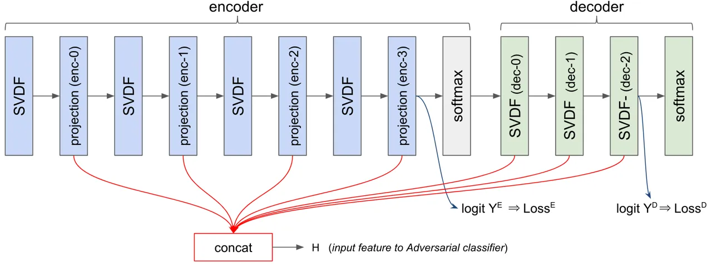
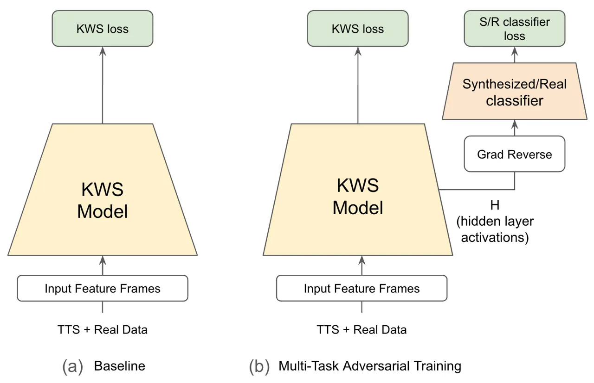
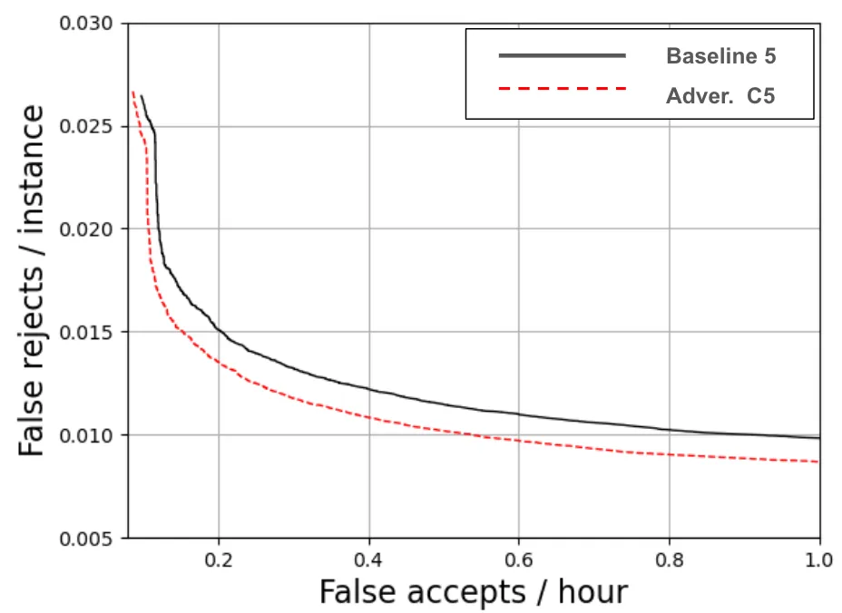

# Adversarial training of Keyword Spotting to Minimize TTS Data Overfitting

Hyun Jin Park    Dhruuv Agarwal    Neng Chen    Rentao Sun    Kurt
Partridge    Justin Chen    Harry Zhang    Pai Zhu    Jacob Bartel   
Kyle Kastner    Gary Wang    Andrew Rosenberg    Quan Wang

###### Abstract

The keyword spotting (KWS) problem requires large amounts of real speech
training data to achieve high accuracy across diverse populations.
Utilizing large amounts of text-to-speech (TTS) synthesized data can
reduce the cost and time associated with KWS development. However, TTS
data may contain artifacts not present in real speech, which the KWS
model can exploit (overfit), leading to degraded accuracy on real
speech. To address this issue, we propose applying an adversarial
training method to prevent the KWS model from learning TTS-specific
features when trained on large amounts of TTS data. Experimental results
demonstrate that KWS model accuracy on real speech data can be improved
by up to 12% when adversarial loss is used in addition to the original
KWS loss. Surprisingly, we also observed that the adversarial setup
improves accuracy by up to 8%, even when trained solely on TTS and real
negative speech data, without any real positive examples.

###### keywords

adversarial training, keyword spotting, TTS synthesized training data,
domain adaptation

^(†)^(†)address: ¹Google LLC, Mountain View, CA, U.S.A.^(†)^(†)email:
{hjpark, dhruuv, nengchen, sunrentao, kep, jstchen, harryz, paizhu,
bartel, kkastner, wgary, rosenberg, quanw}@google.com

## 1 Introduction

Keyword Spotting (KWS) is a task to detect spoken keywords while
ignoring background speech and noise. KWS is an important mechanism for
virtual assistants to initiate interaction with users via spoken
language \[1, 2, 3\].

A production KWS system needs to detect keywords accurately across
diverse populations, acoustic environments, and overlapping noise
conditions. Additionally, KWS systems usually need a small footprint to
meet the requirements of always-on streaming applications \[4\].

To meet these constraints, neural networks have been extensively studied
for KWS. Prior work has demonstrated significant improvements in quality
and reductions in latency in low-resource inference settings \[4, 3, 5,
6, 7, 8, 9\].

Despite numerous technical improvements, production KWS models still
require large amounts of data to cover diverse pronunciations and
environments. Gathering keyword-specific audio data often involves
significant effort and cost, frequently requiring human contributors to
generate recordings.

Recent advancements in TTS systems \[10, 11, 12\] allow for the
generation of realistic speech data at scale, which can be used for KWS
training. For the same volume of training data, TTS is significantly
cheaper and faster than collecting real audio.

However, despite recent advancements in TTS technology, the distribution
of generated TTS data may not match that of real data \[13, 14\]. In
particular, TTS-generated data might lack the diversity present in real
human speech and may contain TTS artifacts or other hidden features that
can lead to overfitting in machine learning (ML) models.

Such overfitting can make a KWS model less responsive to real positive
target speech. This risk is especially high when the amount of real
positive data is very small, while a large amount of synthetic data is
used. In such cases, a compensatory mechanism can help prevent models
from overfitting to the synthetic data.

Adversarial techniques have been previously applied to reduce
overfitting to specific domain data and improve generalization to novel
domains \[15, 16, 17, 18, 19, 20\]. In these approaches, an adversarial
classifier is trained to predict or discriminate the domain of the input
data based on features and representations from the main task model. The
main task model’s features and representations are then adapted
adversarially to become less sensitive to the input data domain. This
approach has been shown to successfully improve the generalization of
main task models, making them less dependent on the specific data
domain.

In this paper, we explore the use of adversarial training (domain
adaptation) techniques for a KWS model trained with large amounts of TTS
data. In our setup, we propose adding an adversarial classifier that
learns to predict whether an input example is synthetic or real speech
based on the KWS model’s hidden layer features. The loss from this
synthetic/real (S/R) classifier is adversarially applied to the KWS
model weights to reduce any information that differentiates TTS from
real data. In our experiments, we first show that an adversarial
classifier can achieve reasonably high prediction accuracy,
demonstrating that the KWS model features do contain TTS-specific
features. We then show that accuracy on a real speech evaluation set can
be improved by applying adversarial loss to the KWS model under certain
data mixture conditions. Surprisingly, adversarial training can also
improve model accuracy even when trained solely on real negative data,
without any real positive data.

## 2 Related work

With the advancement of TTS technology, there have been works to explore
using TTS data on KWS model development \[21, 22, 23, 24\]. These works
showed some success in low resource scenarios.

Prior work in automatic speech recognition (ASR) and image processing
has noted the potential mismatch between synthetic and real audio data
and sought to reduce this discrepancy. Hu et al. \[13\] discussed the
gap between real audio data and TTS synthesized data distributions,
categorizing TTS-generated samples as over-sampled, under-sampled,
missing, or artifact-containing, depending on the relative likelihood in
the real speech data distribution. Artifact regions denote cases where
TTS-generated data has novel features not seen in real audio
distributions, while missing regions denote the opposite. Both "missing"
and "artifact" TTS-generated data can lead to overfitting in machine
learning models, hindering generalization to real speech data. Hu et
al. \[13\] attempted to address this issue through controlled sampling
and separate normalization of synthetic and real data.

In the image classification domain, Chen et al. \[25, 14\] addressed the
generalization problem when synthetic data is used to train a recognizer
for new classes of objects. The authors used a real-data trained
ImageNet model as a teacher and applied transfer learning techniques to
improve generalization to real images.

The adversarial training technique was first introduced in a generative
modeling context \[26\], but it has also been applied to domain mismatch
and adaptation problems \[15, 16, 17, 18, 19, 20\]. In this context,
adversarial training encourages a neural network to learn features (or
representations) that are invariant across different conditions such as
environment, noise levels, and speakers.

Motivated by prior works, we apply adversarial training to reduce the
representation mismatch between synthetic TTS and real speech domains,
in the context of utilizing TTS-generated data for KWS. Specifically, we
use adversarial loss to align the hidden representations of the KWS
model so that it can generalize better to real speech data. To our
knowledge, our approach is the first to use adversarial training to
prevent overfitting to synthetic data in KWS and the speech processing
domain.

## 3 Baseline keyword spotting model

### 3.1 Input features

For the input features, we adopted the same configuration used in prior
publications \[1, 6\]. A 40-dimensional vector representing spectral
filter-bank energies over a 25-millisecond window is computed every 10
milliseconds. We stacked three temporally adjacent frames, striding by
two, to produce a 120-dimensional input feature vector $`X_{t}`$ every
20ms. To improve model robustness and generalization, we applied data
augmentation \[27\], as in prior work.

### 3.2 Architecture

Following prior publications \[1, 6\] , we adopted the two-stage model
architecture (Fig. 1) for both the baseline and proposed approaches. The
KWS model consists of seven factored convolution layers (called SVDF
\[1\]) and three bottleneck projection layers, organized into
sequentially connected encoder and decoder sub-modules. The model
contains approximately 320,000 parameters in total. The encoder module
takes as input the feature vector $`X_{t}`$, which is a stack of
spectral filter-bank energies. It generates a $`K`$-dimensional output
$`Y^{\textrm{E}}`$, trained to encode $`K`$ phoneme-like sounds using
ASR-aligned phoneme targets. The decoder module processes the encoder
output and generates a 2-dimensional output $`Y^{\textrm{D}}`$ trained
to predict the existence of a keyword in the input audio stream. The
combined prediction logit is defined as
$`Y=[Y^{\textrm{E}},Y^{\textrm{D}}]`$.



Figure 1: Baseline KWS model architecture and input feature for
adversarial classifier

### 3.3 Training objective

The baseline KWS model is trained by two types of supervised losses. The
first loss computes cross-entropy between model logits and labels \[1\].
The second loss term computes the cross-entropy between max-pooled
logits and labels \[6\]. Both loss terms have separate components for
the encoder and decoder, and a weighted combination of all terms is used
in the final loss (Eq. 1).

```math
\begin{split}\mathcal{L}_{\textrm{sup}}=\sum_{t=1..n}[&(1-\alpha)L_{\textrm{CE}}\left(Y(X_{t},\theta),c_{t}\right)\\
&+\alpha L_{\textrm{MP}}\left(Y(X_{t},\theta),\omega_{\textrm{end}}\right)]\end{split} \tag{1}
```

$`Y(X_{t},\theta)`$ represents the combined encoder and decoder model
output given input $`X_{t}`$ and parameter set $`\theta`$.
$`L_{\textrm{CE}}`$ represents the end-to-end cross-entropy loss
proposed by Alvarez et al. \[1\] and $`\alpha`$ is an weighting term.
The implementation from Eq. 2 in Park et al. \[6\] was used, where
$`c_{t}`$ is the per-frame target label for cross-entropy loss.
$`L_{\textrm{MP}}`$ represents the max-pool loss from Eq. 12 in Park et
al. \[6\]. $`\omega_{\textrm{end}}`$ represents the end-of-keyword
position label for the max-pool loss (refer to Fig.2 in \[6\]).
$`\alpha`$ is an empirically-determined loss-weighting hyper-parameter.

## 4 Proposed approach

In our proposed approach, the baseline KWS model is augmented with an
adversarial classifier that takes hidden layer activations from the
baseline model and predicts whether the input data is from a synthetic
source (TTS) or real human speech recordings.

We insert a gradient reversal layer \[15\] between the adversarial
classifier and the KWS model. This allows the adversarial classifier to
adapt and minimize the synthetic/real (S/R) classification loss while
simultaneously adapting the KWS model weights to increase the S/R
classifier loss. This adversarial gradient update modifies the KWS model
weights, making it more difficult for the S/R classifier to discriminate
between synthetic and real input data. Concurrently, we minimize the
conventional KWS loss to adapt the KWS weights for better keyword
detection accuracy.



Figure 2: Baseline vs Proposed adversarial training method.

The loss function for the proposed approach is shown in Eqs. 2, 3, and 4. We combine the KWS loss $`\mathcal{L}_{\textrm{sup}}`$ with the
adversarial loss $`\mathcal{L}_{\textrm{adv}}`$ in a multi-task learning
framework.

```math
\mathcal{L}_{\textrm{total}}=(1-\beta)\cdot\mathcal{L}_{\textrm{sup}}+\beta\cdot\mathcal{L}_{\textrm{adv}} \tag{2}
```

```math
\mathcal{L}_{\textrm{adv}}=GR(L_{\textrm{CE}}\left(Y_{adv}(H;\theta_{adv}),C_{adv}\right)) \tag{3}
```

```math
Y_{adv}(H;\theta_{adv})=Maxpool(W_{adv}*H_{t}) \tag{4}
```

$`Y_{adv}`$ is the output of the adversarial classifier, shown as the
Synthetic/Real classifier in Fig. 2. The classifier takes as input
$`H=[H_{t}]_{t=0...n}`$ (the full sequence of hidden layer activations
from the KWS model), and generates a binary classification output
predicting whether the input is from a synthetic TTS source or real
human speech. $`H_{t}`$ is the hidden layer feature vector at frame
$`t`$ as shown in Fig. 1. $`C_{adv}`$ is the label for the
synthetic/real classifier. The gradient reversal layer \[15\] is
inserted between input $`H`$ and the synthetic/real classifier to train
the KWS model weights. We also use a gradient scaling factor
($`\lambda`$), which scales the gradient back-propagated from the
adversarial classifier into the KWS model.

Various neural network models, such as transformers or LSTMs, can be
used to compute $`Y_{adv}`$. In our implementation, we applied linear
projection at each frame, followed by a max-pooling operation over time,
to produce a binary logit (Eq. 4). We found this method achieves high
classification accuracy (up to 98%), indicating that there are
relatively simple features in the audio that can differentiate real from
synthetic audio.

## 5 Experimental setup

### 5.1 TTS system

We generated TTS data using two systems: Virtuoso \[10, 11\] and a
variant of the AudioLM \[12\]. Both are capable of generating data for
hundreds of synthetic voices across dozens of locales. Virtuoso is a
multilingual speech-text joint training model that can learn from
untranscribed speech, unspoken text, and paired speech-text data
sources. AudioLM is a language-model-based audio generation model that
features long-term coherence and high quality. We used a variant of the
AudioLM model that can be conditioned on both text and sample audio.

### 5.2 Dataset

We compared the baseline and proposed approaches on the "Hey/OK Google"
target keyword detection task. For real speech data, we used anonymized
utterances collected in accordance with Google’s Privacy and AI
Principles \[28, 29\]. TTS data were generated using Virtuoso and a
variant of the AudioLM TTS model (equally sampled). Multi-style data
augmentation \[30\] was applied during training. Table 1 summarizes the
number of utterances used.

| Data Types                | Utterance counts |
| ------------------------- | ---------------- |
| Real Positive Utts        | 3.8 M            |
| Real Negative Utts        | 14.1 M           |
| Synthesized Positive Utts | 7.5 M            |
| Synthesized Negative Utts | 5.1 M            |

Table 1: Data types and sizes

We tried to use a relatively small amount of real positive utterances,
while maximizing the use of real negative audio. This is because we can
utilize negative audio with any content, as long as it does not contain
the target keywords. Conversely, real positive data is generally not
very common in typical data sources and requires costly acquisition
processes.

We also used relatively large amounts of TTS synthesized data for both
positive and negative conditions, as TTS data is cheaper to produce.

TTS positive data was generated from transcripts sampled from ASR
transcripts of real positive utterances. We inserted the target keyword
into the sample transcripts to mimic natural positive utterances. TTS
voice types were randomly sampled. We also randomly added prosody
control symbols to the transcripts. For example, Virtuoso TTS supports
controls such as "pause" and "speak slowly" by inserting special
characters into the transcript.

### 5.3 Feature selection for adversarial classifier

To determine which features to feed into the Synthetic/Real classifier,
we conducted a sweep with various options to select different hidden
layers from the KWS model. We used a concatenation operation to combine
multiple hidden layer activations. We then trained model (b) from Fig 2
with the gradient reversal operation replaced by a gradient stop
operation, so that the KWS model would not be affected by the
adversarial classifier. We then evaluated the prediction accuracy of the
adversarial classifier for each input option (Table 2).

| Adversarial accuracy | Input features                                                                     |
| -------------------- | ---------------------------------------------------------------------------------- |
| 98.1 %               | $`en_{0}`$, $`en_{1}`$, $`en_{2}`$, $`en_{3}`$, $`de_{0}`$, $`de_{1}`$, $`de_{2}`$ |
| 97.8 %               | $`en_{0}`$, $`en_{1}`$, $`en_{2}`$, $`en_{3}`$                                     |
| 97.1 %               | $`en_{0}`$, $`en_{1}`$, $`en_{2}`$                                                 |
| 96.1 %               | $`en_{0}`$, $`en_{1}`$                                                             |
| 96.0 %               | $`en_{2}`$                                                                         |
| 95.5 %               | $`en_{3}`$                                                                         |
| 95.3 %               | $`en_{1}`$                                                                         |
| 92.9 %               | $`de_{0}`$, $`de_{1}`$, $`de_{2}`$                                                 |
| 91.2 %               | $`de_{0}`$                                                                         |
| 89.7 %               | $`en_{0}`$                                                                         |
| 89.7 %               | $`de_{1}`$                                                                         |
| 87.1 %               | $`de_{2}`$                                                                         |

Table 2: Adversarial classifier accuracy vs Input features

Table 2 shows a list of input feature combinations ordered by prediction
accuracy. It reveals that concatenating all hidden layer activations
yields the best prediction accuracy for the Synthetic/Real classifier.
Based on this result, we chose to use all hidden layer activations as
input for the subsequent adversarial training experiments. We also
observed that the prediction accuracy is generally high, indicating that
the KWS model’s hidden layer activations and input audio contain
significant information that differentiates real from synthetic audio.

### 5.4 Adversarial Training setup

We trained the baseline and proposed adversarial training methods, as
shown in Fig. 2, while varying hyperparameters such as data weighting
and the gradient reversal scaling factor ($`\lambda`$).

We varied the sampling probability of the real positive data between 0%
and 100% to simulate various conditions with different amounts of
available real positive data. For example, a 0% sampling probability
corresponds to the case where no real positive data is available, while
100% corresponds to the case where the full 3.8 million utterances from
real positive data can be used.

In preliminary experiments, we found that the model’s performance and
convergence depended on the choice of gradient scaling factor
$`\lambda`$ applied at the gradient reversal layer, so we swept over
multiple $`\lambda`$ values.

## 6 Results

Table 3 summarizes the results of training the baseline and proposed
approaches under various sweep conditions.

The FRR (False Rejection Rate) numbers in Table 3 are taken at
thresholds that yield a fixed FA/h (false accept per hour) level on the
negative evaluation set. We targeted 0.133 FA/h as the fixed level for
all FRR calculations. Figure 3 shows the ROC (Receiver Operating
Characteristic) plot for the best-performing model (Adversarial C5)
compared to the baseline, and it indicates that the relative
improvements are consistent across a wide range of FA/h values. This
supports the use of FRR at a fixed FA/h level as a representative
metric.

$`\lambda`$ is the gradient scaling factor at the gradient reversal
layer, determining how strongly the adversarial gradient affects the KWS
model weights. We tested a range of values and report the range that
worked reasonably well ($`\lambda`$= 0.30$`\sim`$0.50).

Real Positive data Weights (R.Pos.W.) determine the proportion of real
positive data examples sampled during training. We swept between 0% and
100% as mentioned in section 5.4.

The first five rows in the Table 3 correspond to the baseline model
trained with different real positive data weights. The next 20 rows
correspond to the proposed adversarial model with different $`\lambda`$
and real positive data weights. The last five rows are averaged across
$`\lambda`$ values.

|            |             |          |         |        |
| ---------- | ----------- | -------- | ------- | ------ |
| Model      | $`\lambda`$ | R.Pos.W. | Kws FRR | R.Imp. |
| Baseline 1 | \-          | 0%       | 18.11%  | \-     |
| Baseline 2 | \-          | 1%       | 6.83%   | \-     |
| Baseline 3 | \-          | 5%       | 3.51%   | \-     |
| Baseline 4 | \-          | 20%      | 2.38%   | \-     |
| Baseline 5 | \-          | 100%     | 1.81%   | \-     |
| Adv. A1    | 0.30        | 0%       | 16.60%  | 8.3%   |
| Adv. A2    | 0.30        | 1%       | 6.87%   | -0.6%  |
| Adv. A3    | 0.30        | 5%       | 3.58%   | -2.0%  |
| Adv. A4    | 0.30        | 20%      | 2.12%   | 10.9%  |
| Adv. A5    | 0.30        | 100%     | 1.61%   | 11.0%  |
| Adv. B1    | 0.35        | 0%       | 16.89%  | 6.7%   |
| Adv. B2    | 0.35        | 1%       | 6.52%   | 4.5%   |
| Adv. B3    | 0.35        | 5%       | 3.87%   | -10.3% |
| Adv. B4    | 0.35        | 20%      | 2.28%   | 4.2%   |
| Adv. B5    | 0.35        | 100%     | 1.65%   | 8.8%   |
| Adv. C1    | 0.40        | 0%       | 16.84%  | 7.0%   |
| Adv. C2    | 0.40        | 1%       | 6.67%   | 2.3%   |
| Adv. C3    | 0.40        | 5%       | 4.04%   | -15.1% |
| Adv. C4    | 0.40        | 20%      | 2.40%   | 0.8%   |
| Adv. C5    | 0.40        | 100%     | 1.59%   | 12.2%  |
| Adv. D1    | 0.50        | 0%       | 17.62%  | 2.7%   |
| Adv. D2    | 0.50        | 1%       | 6.45%   | 5.6%   |
| Adv. D3    | 0.50        | 5%       | 3.58%   | -2.0%  |
| Adv. D4    | 0.50        | 20%      | 2.25%   | 5.5%   |
| Adv. D5    | 0.50        | 100%     | 1.62%   | 10.5%  |
| Averaged 1 | 0.3-0.5     | 0%       | 16.99%  | 6.2%   |
| Averaged 2 | 0.3-0.5     | 1%       | 6.63%   | 3.6%   |
| Averaged 3 | 0.3-0.5     | 5%       | 3.77%   | -7.3%  |
| Averaged 4 | 0.3-0.5     | 20%      | 2.26%   | 4.9%   |
| Averaged 5 | 0.3-0.5     | 100%     | 1.62%   | 10.6%  |

Table 3: KWS model accuracy over hyper parameter options. Table columns
include sweep conditions ($`\lambda`$, and Real Positive data Weights),
the FRR (false rejection rate) on the keyword spotting eval set, and
relative improvement (R. Imp.) of FRR numbers compared to the baseline
models.



Figure 3: ROC plot of Baseline 5 vs Adversarial Sweep C5

The results in Table 3 show that adversarial training can improve KWS
model accuracy when either real positive data weights are very low (near
0%) or very high (near 100%). Relative improvements are strongest when
using the full amount of real positive data (average 10.6%).
Surprisingly, adversarial training can also improve KWS model accuracy
(average 6%), even without any real positive data. Note that we still
include real negative data, which can serve as contrasting examples
against synthetic data to train the adversarial classifier. We observe
no improvement or degradation when there is an intermediate amount of
real positive data.

## 7 Conclusions

We proposed using adversarial training for keyword spotting (KWS) when
large amounts of TTS synthesized data are used. The proposed method
builds an adversarial classifier that predicts whether the input source
is synthetic or real speech. Its gradients are then adversarially
applied to the KWS model, preventing the KWS model from learning
features specific to synthesized data.

Results show that when the KWS model is trained with both KWS loss and
adversarial loss, its accuracy on real speech data improves by up to 12%
when the full amount of real and TTS data is used. Surprisingly, we also
observed that accuracy on real data can be improved (up to 8%), even
when the model is trained solely on TTS and real negative speech data,
without any real positive examples. This can be explained by the fact
that real negative data can still serve as contrasting examples against
synthetic data for the adversarial classifier.

As a further study, it would be interesting to use a more powerful
model, such as Conformer or LSTM, for the adversarial classifier.

## 8 Acknowledgements

The authors would like to acknowledge the support from Charles Yoon,
Pedro Meningbar, Bhuvana Ramabhadran, and Françoise Beaufays.

## References

- \[1\] R. Alvarez and H. J. Park, “End-to-end Streaming Keyword
  Spotting,” _ICASSP 2019 - 2019 IEEE International Conference on
  Acoustics, Speech and Signal Processing (ICASSP)_, pp.
  6336–6340, 2019.
- \[2\] S. Panchapagesan, M. Sun, A. Khare, S. Matsoukas, A. Mandal,
  B. Hoffmeister, and S. Vitaladevuni, “Multi-task learning and weighted
  cross-entropy for DNN-based keyword spotting,” in _Interspeech_, 2016.
- \[3\] S. Team, “Hey Siri: An On-device DNN-powered Voice Trigger for
  Apple’s Personal Assistant,”
  [https://machinelearning.apple.com/2017/10/01/hey-siri.html](https://machinelearning.apple.com/2017/10/01/hey-siri.html),
  Apple Inc., 2017, accessed: 2018-10-06. \[Online\]. Available:
  [https://machinelearning.apple.com/2017/10/01/hey-siri.html](https://machinelearning.apple.com/2017/10/01/hey-siri.html)
- \[4\] G. Chen, C. Parada, and G. Heigold, “Small-footprint keyword
  spotting using deep neural networks,” in _ICASSP_, 2014.
- \[5\] M. Sun, D. Snyder, Y. Gao, V. K. Nagaraja, M. Rodehorst,
  S. Panchapagesan, N. Strom, S. Matsoukas, and S. Vitaladevuni,
  “Compressed time delay neural network for small-footprint keyword
  spotting,” in _INTERSPEECH_, 2017.
- \[6\] H. J. Park, P. Violette, and N. Subrahmanya, “Learning to detect
  keyword parts and whole by smoothed max pooling,” _ICASSP 2020 - 2020
  IEEE International Conference on Acoustics, Speech and Signal
  Processing (ICASSP)_, pp. 7899 – 7903, 2020.
- \[7\] A. Gruenstein, R. Álvarez, C. Thornton, and M. Ghodrat, “A
  cascade architecture for keyword spotting on mobile devices,” _ArXiv_,
  vol. abs/1712.03603, 2017.
- \[8\] R. Alvarez and H.-J. Park, “End-to-end streaming keyword
  spotting,” in _ICASSP 2019-2019 IEEE International Conference on
  Acoustics, Speech and Signal Processing (ICASSP)_. IEEE, 2019, pp.
  6336–6340.
- \[9\] H.-J. Park, P. Violette, and N. Subrahmanya, “Learning to detect
  keyword parts and whole by smoothed max pooling,” in _ICASSP 2020-2020
  IEEE International Conference on Acoustics, Speech and Signal
  Processing (ICASSP)_. IEEE, 2020, pp. 7899–7903.
- \[10\] T. Saeki, H. Zen, Z. Chen, N. Morioka, G. Wang, Y. Zhang,
  A. Bapna, A. Rosenberg, and B. Ramabhadran, “Virtuoso: Massive
  multilingual speech-text joint semi-supervised learning for
  text-to-speech,” _ICASSP 2023 - 2023 IEEE International Conference on
  Acoustics, Speech and Signal Processing (ICASSP)_, pp. 1–5, 2022.
  \[Online\]. Available:
  [https://api.semanticscholar.org/CorpusID:253157880](https://api.semanticscholar.org/CorpusID:253157880)
- \[11\] T. Saeki, G. Wang, N. Morioka, I. Elias, K. Kastner,
  A. Rosenberg, B. Ramabhadran, H. Zen, F. Beaufays, and H. Shemtov,
  “Extending multilingual speech synthesis to 100+ languages without
  transcribed data,” _ArXiv_, vol. abs/2402.18932, 2024. \[Online\].
  Available:
  [https://api.semanticscholar.org/CorpusID:268063592](https://api.semanticscholar.org/CorpusID:268063592)
- \[12\] Z. Borsos, R. Marinier, D. Vincent, E. Kharitonov, O. Pietquin,
  M. Sharifi, D. Roblek, O. Teboul, D. Grangier, M. Tagliasacchi, and
  N. Zeghidour, “Audiolm: A language modeling approach to audio
  generation,” _IEEE/ACM Transactions on Audio, Speech, and Language
  Processing_, vol. 31, pp. 2523–2533, 2022. \[Online\]. Available:
  [https://api.semanticscholar.org/CorpusID:252111134](https://api.semanticscholar.org/CorpusID:252111134)
- \[13\] T. yao Hu, M. Armandpour, A. Shrivastava, J.-H. R. Chang, H. S.
  Koppula, and O. Tuzel, “Synt++: Utilizing imperfect synthetic data to
  improve speech recognition,” _ICASSP 2022 - 2022 IEEE International
  Conference on Acoustics, Speech and Signal Processing (ICASSP)_, pp.
  7682–7686, 2021. \[Online\]. Available:
  [https://api.semanticscholar.org/CorpusID:239615990](https://api.semanticscholar.org/CorpusID:239615990)
- \[14\] W. Chen, Z. Yu, S. D. Mello, S. Liu, J. M. Álvarez, Z. Wang,
  and A. Anandkumar, “Contrastive syn-to-real generalization,” _ArXiv_,
  vol. abs/2104.02290, 2021. \[Online\]. Available:
  [https://api.semanticscholar.org/CorpusID:233033761](https://api.semanticscholar.org/CorpusID:233033761)
- \[15\] Y. Ganin and V. S. Lempitsky, “Unsupervised domain adaptation
  by backpropagation,” in _International Conference on Machine
  Learning_, 2014. \[Online\]. Available:
  [https://api.semanticscholar.org/CorpusID:6755881](https://api.semanticscholar.org/CorpusID:6755881)
- \[16\] S. Sun, B. Zhang, L. Xie, and Y. Zhang, “An unsupervised deep
  domain adaptation approach for robust speech recognition,”
  _Neurocomputing_, vol. 257, pp. 79–87, 2017. \[Online\]. Available:
  [https://api.semanticscholar.org/CorpusID:8811996](https://api.semanticscholar.org/CorpusID:8811996)
- \[17\] C. Donahue, B. Li, and R. Prabhavalkar, “Exploring speech
  enhancement with generative adversarial networks for robust speech
  recognition,” _2018 IEEE International Conference on Acoustics, Speech
  and Signal Processing (ICASSP)_, pp. 5024–5028, 2017. \[Online\].
  Available:
  [https://api.semanticscholar.org/CorpusID:19096428](https://api.semanticscholar.org/CorpusID:19096428)
- \[18\] Z. Meng, J. Li, Z. Chen, Y. Zhao, V. Mazalov, Y. Gong, and
  B.-H. Juang, “Speaker-invariant training via adversarial learning,”
  _2018 IEEE International Conference on Acoustics, Speech and Signal
  Processing (ICASSP)_, pp. 5969–5973, 2018. \[Online\]. Available:
  [https://api.semanticscholar.org/CorpusID:4561931](https://api.semanticscholar.org/CorpusID:4561931)
- \[19\] Q. Wang, W. Rao, S. Sun, L. Xie, C. E. Siong, and H. Li,
  “Unsupervised domain adaptation via domain adversarial training for
  speaker recognition,” _2018 IEEE International Conference on
  Acoustics, Speech and Signal Processing (ICASSP)_, pp.
  4889–4893, 2018. \[Online\]. Available:
  [https://api.semanticscholar.org/CorpusID:52289144](https://api.semanticscholar.org/CorpusID:52289144)
- \[20\] Z. Meng, J. Li, and Y. Gong, “Adversarial speaker adaptation,”
  _ICASSP 2019 - 2019 IEEE International Conference on Acoustics, Speech
  and Signal Processing (ICASSP)_, pp. 5721–5725, 2019. \[Online\].
  Available:
  [https://api.semanticscholar.org/CorpusID:139106202](https://api.semanticscholar.org/CorpusID:139106202)
- \[21\] A. Werchniak, R. Barra-Chicote, Y. Mishchenko, J. Droppo,
  J. Condal, P. Liu, and A. Shah, “Exploring the application of
  synthetic audio in training keyword spotters,” _ICASSP 2021 - 2021
  IEEE International Conference on Acoustics, Speech and Signal
  Processing (ICASSP)_, pp. 7993–7996, 2021. \[Online\]. Available:
  [https://api.semanticscholar.org/CorpusID:233272947](https://api.semanticscholar.org/CorpusID:233272947)
- \[22\] J. Lin, K. Kilgour, D. Roblek, and M. Sharifi, “Training
  keyword spotters with limited and synthesized speech data,” _ICASSP
  2020 - 2020 IEEE International Conference on Acoustics, Speech and
  Signal Processing (ICASSP)_, pp. 7474–7478, 2020. \[Online\].
  Available:
  [https://api.semanticscholar.org/CorpusID:211021054](https://api.semanticscholar.org/CorpusID:211021054)
- \[23\] Y.-T. Lee and S. Baek, “Keyword spotting with synthetic data
  using heterogeneous knowledge distillation,” in _Interspeech_, 2022.
  \[Online\]. Available:
  [https://api.semanticscholar.org/CorpusID:252349652](https://api.semanticscholar.org/CorpusID:252349652)
- \[24\] V. Kesavaraj and A. K. Vuppala, “Open vocabulary keyword
  spotting through transfer learning from speech synthesis,” _ArXiv_,
  vol. abs/2404.03914, 2024. \[Online\]. Available:
  [https://api.semanticscholar.org/CorpusID:268987842](https://api.semanticscholar.org/CorpusID:268987842)
- \[25\] W. Chen, Z. Yu, Z. Wang, and A. Anandkumar, “Automated
  synthetic-to-real generalization,” in _International Conference on
  Machine Learning_, 2020. \[Online\]. Available:
  [https://api.semanticscholar.org/CorpusID:220514280](https://api.semanticscholar.org/CorpusID:220514280)
- \[26\] I. J. Goodfellow, J. Pouget-Abadie, M. Mirza, B. Xu,
  D. Warde-Farley, S. Ozair, A. C. Courville, and Y. Bengio, “Generative
  adversarial networks,” _Communications of the ACM_, vol. 63, pp. 139 –
  144, 2014. \[Online\]. Available:
  [https://api.semanticscholar.org/CorpusID:1033682](https://api.semanticscholar.org/CorpusID:1033682)
- \[27\] C. Kim, A. Misra, K. Chin, T. Hughes, A. Narayanan, T. Sainath,
  and M. Bacchiani, “Generation of large-scale simulated utterances in
  virtual rooms to train deep-neural networks for far-field speech
  recognition in google home,” _INTERSPEECH 2017_, pp. 379–383, 2017.
- \[28\] “Google’s privacy principles,”
  [https://googleblog.blogspot.com/2010/01/googles-privacy-principles.html](https://googleblog.blogspot.com/2010/01/googles-privacy-principles.html),
  accessed: 2022-10-17.
- \[29\] “Artificial intelligence at Google: Our principles,”
  [https://ai.google/principles](https://ai.google/principles),
  accessed: 2022-10-17.
- \[30\] C. Kim, E. Variani, A. Narayanan, and M. Bacchiani, “Efficient
  implementation of the room simulator for training deep neural network
  acoustic models,” _CoRR_, vol. abs/1712.03439, 2017. \[Online\].
  Available:
  [http://arxiv.org/abs/1712.03439](http://arxiv.org/abs/1712.03439)
