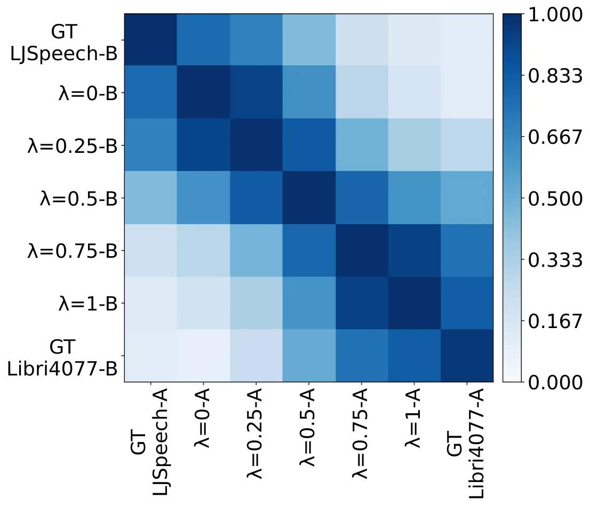

# kNN Retrieval for Simple and Effective Zero-Shot Multi-speaker Text-to-Speech

Karl El Hajal Affiliation: Idiap Research Institute, CH-1920 Martigny,
Switzerland Affiliation: EPFL, École polytechnique fédérale de Lausanne,
CH-1015 Lausanne, Switzerland Email: [karl.elhajal@idiap.ch](mailto:)   
Ajinkya Kulkarni Affiliation: Idiap Research Institute, CH-1920
Martigny, Switzerland Email: [enno.hermann@idiap.ch](mailto:)    Enno
Hermann Affiliation: Idiap Research Institute, CH-1920 Martigny,
Switzerland Email: [ajinkya.kulkarni@idiap.ch](mailto:)    Mathew
Magimai.-Doss Affiliation: Idiap Research Institute, CH-1920 Martigny,
Switzerland Email: [mathew@idiap.ch](mailto:)

###### Abstract

While recent zero-shot multi-speaker text-to-speech (TTS) models achieve
impressive results, they typically rely on extensive transcribed speech
datasets from numerous speakers and intricate training pipelines.
Meanwhile, self-supervised learning (SSL) speech features have emerged
as effective intermediate representations for TTS. Further, SSL features
from different speakers that are linearly close share phonetic
information while maintaining individual speaker identity. In this
study, we introduce kNN-TTS, a simple and effective framework for
zero-shot multi-speaker TTS using retrieval methods which leverage the
linear relationships between SSL features. Objective and subjective
evaluations show that our models, trained on transcribed speech from a
single speaker only, achieve performance comparable to state-of-the-art
models that are trained on significantly larger training datasets. The
low training data requirements mean that kNN-TTS is well suited for the
development of multi-speaker TTS systems for low-resource domains and
languages. We also introduce an interpolation parameter which enables
fine-grained voice morphing. Demo samples are available at
[https://idiap.github.io/knn-tts](https://idiap.github.io/knn-tts/).

## 1 Introduction

Neural text-to-speech (TTS) synthesis has advanced significantly in
recent years, achieving a level of naturalness comparable to human
speech. and allowing for an increasingly expressive range of outputs Tan
et al. (2021). Neural TTS systems can be categorized into two-stage and
single-stage pipelines. Two-stage models convert text or phonemic
features into acoustic features and then use a vocoder to generate
waveforms. These models can suffer from error propagation and
limitations due to their dependence on low-level features like
mel-spectrograms Kim et al. (2020); Shen et al. (2018). Single-stage
models aim to address these issues by streamlining this process into an
end-to-end framework Kim et al. (2021); Casanova et al. (2022), but they
may face oversmoothing, mispronunciations, and reduced flexibility due
to the lack of explicit linguistic information and entangled latent
representations Lee et al. (2022); Choi et al. (2023). Recent research
combines the strengths of both approaches by using self-supervised
learning (SSL) speech representations as intermediate elements in
two-stage models Siuzdak et al. (2022); Shah et al. (2024); Wang et al.
(2023b). These representations help improve word error rates,
pronunciation of out-of-vocabulary words Siuzdak et al. (2022), and
robustness to noise Zhu et al. (2023).

In practice, end-user applications may need to synthesize speech in the
voices of multiple speakers. Collecting high quality speech data and
building a TTS model for each target voice is a challenging problem. As
a result, there has been a growing interest in zero-shot multi-speaker
TTS systems which can synthesize speech in an unseen speaker’s voice
based on short reference samples. State-of-the-art models such as XTTS
Casanova et al. (2024) and HierSpeech++ Lee et al. (2023) demonstrate
impressive quality and similarity to unseen speakers. To produce varied
voices, these models condition the output on style embeddings, which are
extracted from a reference audio sample via a speaker encoder. However,
these models require end-to-end training on thousands of hours of
transcribed audio data from a large number of speakers to generalize
effectively.

Simultaneously, kNN-VC Baas et al. (2023) has emerged as a promising
any-to-any voice conversion method, leveraging SSL features for
zero-shot conversion. It uses a kNN algorithm to match frames from the
source speaker with the target speaker’s representations, adjusting the
speaker identity while preserving speech content. This approach is
similar to retrieval-augmented generation (RAG) techniques used in deep
generative models such as language models Khandelwal et al. (2020);
Khandelwal et al. (2021) and image generators Chen et al. (2023). These
methods have been effectively used in these fields to enhance accuracy
and reliability, as well as to enable style transfer by steering model
outputs to mirror characteristics of a retrieval database Borgeaud
et al. (2022); Chen et al. (2023).

In this work, we investigate whether retrieval-based methods can be
similarly applied to TTS for style-transfer, to achieve effective
zero-shot multi-speaker capabilities. Additionally, we explore whether
these methods can reduce data requirements for the development of a
robust zero-shot multi-speaker TTS system. This paper’s key
contributions can be summarized as follows:

- •
  We propose kNN-TTS, a novel framework for multi-speaker zero-shot TTS
  which leverages retrieval methods to modify target voices, diverging
  from the conventional approach of using speaker embeddings.
- •
  By exploiting linear relationships in SSL features, our framework
  alleviates the need for multi-speaker transcribed data during
  training.
- •
  We introduce a novel linear interpolation parameter allowing for
  fine-grained control over the influence of the target style on the
  output, which offers voice morphing capabilities.
- •
  We validate the method using two different lightweight models trained
  solely on transcribed speech from one speaker and demonstrate
  competitive performance with state-of-the-art models trained on much
  larger datasets.

Code, models, and demo samples are publicly available at
[https://idiap.github.io/knn-tts](https://idiap.github.io/knn-tts).

## 2 Proposed Approach

### 2.1 Framework

The kNN-TTS framework, illustrated in Fig. 1, begins with a Text-to-SSL
model that generates source speaker features from text input. A kNN
retrieval algorithm then matches these generated features to units in a
target speaker’s unit database, which contains features extracted from
the target speaker’s recordings using a pre-trained SSL encoder. The
selected target speaker features are linearly interpolated with the
source speaker features to obtain the converted features. Finally, a
pre-trained vocoder decodes the converted features back into a speech
waveform.

SSL encoder: For this framework, we need an intermediate audio
representation that meets the following criteria: (1) it should
encompass both linguistic and speaker-specific information; (2) features
that are linearly close should exhibit similar phonetic properties while
preserving speaker identity; and (3) it should be possible to decode the
features back to waveform. Recent works show that SSL models encode
speech into representations that meet these criteria Dunbar et al.
(2022). Preliminary experiments indicate that spectral features are
ineffective in this context (Appendix A).

Text-to-SSL: We train a Text-to-SSL model that generates corresponding
SSL features from a given text input. Notably, this is the only
component of our framework that requires audio data paired with text
transcriptions for training. It is possible to train this model on the
speech of a single speaker.

kNN Retrieval: To synthesize speech in a target speaker’s voice, units
(or frames) from the target speaker unit database are selected to
replace corresponding frames from the source speaker features. The
selection is done by comparing source and target frames using a linear
distance metric. This results in selected target speaker features that
maintain the phonetic information while replacing the voice attributes
with those of the target speaker.

Figure 1: kNN-TTS framework overview. Only the Text-to-SSL model is
trained on transcribed audio. The SSL encoder, vocoder are pre-trained
on untranscribed multi-speaker data, and the kNN algorithm is
non-parametric.

The source and target speaker features are then linearly interpolated to
obtain the converted features Khandelwal et al. (2020). A variable
parameter $`\lambda`$ modifies the degree of influence the target
features have on the output, enabling voice morphing by blending the
source and target styles.

```math
{y}_{\mathrm{converted}}=\lambda\ {y}_{\mathrm{selected}}+(1-\lambda)\ {y}_{\mathrm{source}} \tag{1}
```

Vocoder: We employ a vocoder capable of decoding the SSL features back
into a waveform. To ensure robust generalization, the vocoder should be
pre-trained on a large and diverse dataset to maintain high-quality
waveform reconstruction across different speakers and contexts.

### 2.2 Implementation

SSL encoder: We employ a pre-trained WavLM-Large encoder from Chen
et al. (2022). It is specifically selected due to its effective audio
reconstruction capabilities, obtained through training on masked speech
denoising and prediction tasks Wang et al. (2023a). We use the features
from the model’s 6th layer which encapsulate both phonetic and speaker
characteristics Baas et al. (2023); Wang et al. (2023a). These
representations are pre-extracted and cached prior to training or
inference, eliminating the need to load WavLM during either process,
assuming the target speaker is known.

Text-to-SSL: We evaluate two Text-to-SSL implementations: GlowTTS Kim
et al. (2020) and GradTTS Popov et al. (2021). GlowTTS employs a
non-autoregressive architecture with a transformer-based text encoder, a
duration predictor, and a flow-based decoder Kingma and Dhariwal (2018).
GradTTS follows a similar architecture but uses a diffusion-based
decoder Song et al. (2021). We maintain each model’s default
configurations and cost functions for training. We adjust only their
output dimension to 1024 channels to align with WavLM-Large features
instead of mel-spectrograms. For the GradTTS diffusion decoder, we use
100 iterations for synthesis. Both models are trained on the LJSpeech
dataset Ito and Johnson (2017), which comprises 24 hours of
single-speaker English speech. GlowTTS is trained for 650k steps, and
GradTTS for 2M steps.

kNN Retrieval: For each source frame, we compute its cosine distance
with every target speaker frame within the unit database. We then select
the $`k`$ closest units, and average them with uniform weighting.
Similar to Baas et al. (2023), we use $`k=4`$ which was determined to be
suitable across different amounts of target audio.

Vocoder: We use a pre-trained HiFi-GAN V1 Kong et al. (2020) model
trained to reconstruct 16kHz waveforms from WavLM-Large layer 6
features. The model checkpoint, sourced from Baas et al. (2023), was
trained using their pre-matched paradigm on the LibriSpeech
train-clean-100 set, consisting of 100 hours of clean English speech
from 251 speakers Panayotov et al. (2015).

## 3 Experimental Setup

### 3.1 Baselines

We benchmark our models against leading open-source zero-shot
multi-speaker TTS systems. YourTTS Casanova et al. (2022) is trained on
529 hours of multilingual transcribed data from over 1000 speakers. XTTS
Casanova et al. (2024) uses 27,282 hours of transcribed speech data
across 16 languages. HierSpeech++ Lee et al. (2023) is trained on 2796
hours of transcribed English and Korean speech, encompassing 7299
speaker. These models are trained end-to-end, and employ various speaker
encoders to convert a reference utterance into a style embedding for
zero-shot multi-speaker synthesis. We use the default checkpoints and
configurations provided by the authors for each baseline model¹¹ 1
[https://github.com/idiap/coqui-ai-TTS](https://github.com/idiap/coqui-ai-TTS)²²
2
[https://github.com/sh-lee-prml/HierSpeechpp](https://github.com/sh-lee-prml/HierSpeechpp).
Further details about the baselines can be found in Table 1 and
Appendix C.

### 3.2 Evaluation

|              |          |               |        |      |                   |                   |                   |                    |                   |                   |
| ------------ | -------- | ------------- | ------ | ---- | ----------------- | ----------------- | ----------------- | ------------------ | ----------------- | ----------------- |
|              | \#Params | Training Data | Memory | RTF  | WER               | PER               | UTMOS             | SECS               | N-MOS             | S-MOS             |
| Model        | (M)      | (Hours)       | (GB)   |      | $`\downarrow`$    | $`\downarrow`$    | $`\uparrow`$      | $`\uparrow`$       | $`\uparrow`$      | $`\uparrow`$      |
| Ground Truth | n/a      | n/a           | n/a    | n/a  | 2.91 $`\pm`$ 0.31 | 0.92 $`\pm`$ 0.15 | 4.09 $`\pm`$ 0.01 | 0.87 $`\pm`$ 0.003 | 4.21 $`\pm`$ 0.06 | 4.12 $`\pm`$ 0.06 |
| Baselines:   |          |               |        |      |                   |                   |                   |                    |                   |                   |
| YourTTS      | 85.5     | 529           | 0.56   | 0.71 | 6.09 $`\pm`$ 0.32 | 2.24 $`\pm`$ 0.12 | 3.65 $`\pm`$ 0.01 | 0.54 $`\pm`$ 0.003 | 3.87 $`\pm`$ 0.08 | 3.86 $`\pm`$ 0.09 |
| XTTS         | 482      | 27,282        | 2.15   | 1.64 | 2.76 $`\pm`$ 0.21 | 0.84 $`\pm`$ 0.09 | 4.07 $`\pm`$ 0.01 | 0.40 $`\pm`$ 0.003 | 4.11 $`\pm`$ 0.06 | 3.93 $`\pm`$ 0.08 |
| HierSpeech++ | 63       | 2,796         | 1.29   | 0.18 | 3.36 $`\pm`$ 0.23 | 0.78 $`\pm`$ 0.06 | 4.44 $`\pm`$ 0.01 | 0.67 $`\pm`$ 0.003 | 4.15 $`\pm`$ 0.06 | 4.01 $`\pm`$ 0.08 |
| Proposed:    |          |               |        |      |                   |                   |                   |                    |                   |                   |
| GlowkNN-TTS  | 51.5     | 24            | 0.45   | 0.24 | 3.71 $`\pm`$ 0.24 | 0.98 $`\pm`$ 0.07 | 4.02 $`\pm`$ 0.01 | 0.72 $`\pm`$ 0.002 | 4.07 $`\pm`$ 0.07 | 3.93 $`\pm`$ 0.08 |
| GradkNN-TTS  | 31.5     | 24            | 0.91   | 2.41 | 4.32 $`\pm`$ 0.25 | 1.44 $`\pm`$ 0.09 | 4.16 $`\pm`$ 0.01 | 0.71 $`\pm`$ 0.003 | 4.10 $`\pm`$ 0.07 | 3.91 $`\pm`$ 0.08 |

Table 1: Zero-shot multi-speaker TTS results. Training data specifically
refers to transcribed data. Evaluation scores are reported with 95%
confidence intervals, and the best scores for each metric are
highlighted in bold.

For zero-shot multi-speaker synthesis comparisons, we use LibriSpeech
test-clean for target speaker reference utterances. It includes speech
of varied quality from 20 male and 20 female speakers, with 8 mins of
speech per speaker. For each model, we synthesize 100 English sentences
per speaker, selecting the sentences randomly from FLoRes+ Costa-jussà
et al. (2022), as per the XTTS protocol. Tests are performed with
$`\lambda=1`$. For baseline models, we obtain a speaker embedding by
averaging style embeddings across all reference utterances of each
target speaker, ensuring a fair comparison.

Objective analysis: we evaluate each model’s performance in terms of
naturalness using UTMOS Saeki et al. (2022), intelligibility using the
word error rate (WER) and phoneme error rate (PER) computed with the
Whisper-Large v3 model Radford et al. (2023), and speaker similarity
using speaker encoder cosine similarity (SECS) with ECAPA2 Thienpondt
and Demuynck (2023).

Subjective evaluation: we conduct a listening test to assess naturalness
and similarity mean opinion scores (N-MOS and S-MOS). We randomly select
utterances from 10 male and 10 female target speakers from LibriSpeech
test-clean, choosing 3 synthesized sentences per speaker, totaling
60 utterances per model. Each is rated by 10 raters on naturalness and
similarity to a ground-truth recording, with scores ranging from 1 to 5
in 0.5 increments. We use Amazon Mechanical Turk, with raters required
to be native English speakers based in the United States, having a HIT
acceptance rate above 98% and more than 100 approved HITs. Further
details are presented in Appendix D.

Model efficiency: we compare models on parameter count, peak GPU memory
usage during test sample synthesis, and real-time factor (RTF), tested
on an NVIDIA RTX3090 GPU.

Voice Morphing: we perform an experiment using the interpolation
parameter, computing the SECS of the model’s output with the target
speaker’s ground truth data for various values of $`\lambda`$.



Figure 2: Speaker similarity matrix comparing SECS values for ground
truth (GT) LJSpeech samples, LibriSpeech Speaker 4077 (Libri4077)
recordings, and GlowkNN-TTS outputs with kNN retrieval from Libri4077
data for various $`\lambda`$ values. Samples in each case are split in
half into sets $`A`$ and $`B`$ and compared.

## 4 Results and analysis

Results are presented in Table 1. Objective metrics reveal that the
kNN-TTS models demonstrate the best speaker similarity, XTTS excels in
intelligibility, and HierSpeech++ achieves the highest naturalness. In
the listening test, HierSpeech++ was rated highest for naturalness and
similarity, while the kNN-TTS models and XTTS performed similarly. These
models’ results fall within each other’s confidence intervals,
suggesting comparable performance. Regarding model efficiency, kNN-TTS
models have the fewest parameters and lowest memory usage among the top
performers. GlowkNN-TTS uses $`3\times`$ less memory than HierSpeech++
with similar speed. GradkNN-TTS’s memory usage and RTF are higher due to
the 100 iterations used in the diffusion decoder. Further, the kNN-TTS
models are trained on 100$`\times`$ less transcribed data than
HierSpeech++ and 1000$`\times`$ less data than XTTS.

Figure 2 illustrates the results of the voice morphing experiment. We
can observe that the similarity of the outputs to the target speaker
gradually increases as $`\lambda`$ rises, demonstrating the ability to
finely blend source and target styles and suggests the potential to
combine multiple target styles.

## 5 Discussion and conclusions

State-of-the-art zero-shot multi-speaker TTS models rely on large
datasets of transcribed speech from thousands of speakers for training.
In this paper, we demonstrated that by leveraging retrieval methods and
SSL features, we can develop a simple and lightweight TTS system that
achieves a comparable level of naturalness and similarity to leading
approaches while being trained on transcribed data from only a single
speaker. We further showed that fine-grained voice morphing can be
achieved using an interpolation parameter. This indicates that this
technique, which is originally inspired from other domains such as
language modeling Khandelwal et al. (2020) and machine translation
Khandelwal et al. (2021), can be applied in the context of TTS.

The simplicity of the training process is a main advantage of our
approach: only the Text-to-SSL model needs training, and it can be
trained on transcribed data from one speaker. In conjunction with the
kNN approach’s cross-lingual capability Baas and Kamper (2023), this is
particularly appealing for extending the model to new languages with
less resources, a direction open for future work.

We also showed that the framework can be implemented using different
Text-to-SSL architectures, allowing for model swapping to leverage
different benefits. Our implementations notably demonstrated efficiency
in terms of parameters, memory usage, and runtime speed in the case of
GlowkNN-TTS, even without optimizing the retrieval process.

## Limitations

### Reference Data Requirements

While our approach offers simplicity in training and is more
lightweight, it requires more reference audio compared to other methods.
We conduct ablation studies to evaluate the models’ outputs with varying
amounts of reference utterances. Figure 3(a) compares outputs using
retrieval from different amounts of LJSpeech data. We find that
approximately 30 seconds of reference utterances are needed to achieve
suitable intelligibility, while naturalness improves up to 5 minutes,
surpassing the model outputs without retrieval. Figure 3(b) compares the
kNN-TTS models to the baselines for different amounts of reference
utterances from a target speaker. Similarly, about 30 seconds are
required for suitable intelligibility, while similarity plateaus at
around 1 minute. In contrast, the baselines benefit less from increasing
the amount of reference utterances beyond 10 to 30 seconds. There is
therefore a trade-off; our method requires at least 30 seconds of
reference audio, whereas competing approaches can function with smaller
amounts.

### Rhythmic variations

Typically, different speakers exhibit different pronunciation durations.
In our method, the duration aspect is determined by the Text-to-SSL
model, and the target voice is modified through frame-by-frame
selection, meaning that the duration of each utterance remains unchanged
for different speakers. Our future work will explore techniques, such as
Urhythmic van Niekerk et al. (2023), to address this limitation.

### Training Simplicity and Model Capacity

In this study, we trained and evaluated Text-to-SSL models on
transcribed speech from a single speaker to demonstrate that strong
performance can be achieved in a simplified low-resource setting.
However, expanding the training data to include multiple speakers and
larger datasets can increase the model’s output quality and enable it to
generate speech with a wider range of expressiveness. Similarly, while
we prioritized lightweight models for efficiency, more complex models
could improve speech quality at the cost of efficiency. These aspects
can be explored further in future work.

(a)

(b)

Figure 3: (a) Mean UTMOS ($`\uparrow`$) and WER ($`\downarrow`$) for
kNN-TTS outputs using different amounts of LJSpeech reference
utterances. (b) Mean SECS ($`\uparrow`$) and WER ($`\downarrow`$) for
kNN-TTS and baseline outputs using different amounts of LibriSpeech
Speaker 4077 reference utterances.

## Ethics Statement

Zero-shot multi-speaker TTS systems such as the one we describe in this
manuscript can offer benefits in accessibility, entertainment and
education by enabling the generation of varied expressive synthetic
voices from textual input. Our approach’s lowered data requirements can
unlock these benefits for low-resource domains, while its reduced
compute needs ensure sustainability. However, this technology’s
accessibility also poses many risks, including voice cloning without
consent, impersonation, and the creation of deepfake audio for
misinformation and manipulation. We note that compared to other
zero-shot methods, our proposed approach, requires more data from the
target speaker for sufficient quality, reducing impersonation risks. In
our research, we strictly adhere to using only public datasets with
appropriate licenses. To mitigate potential harm, it is important to
advance research in watermarking synthetic outputs for traceability and
developing methods to differentiate synthetic speech from authentic
recordings, thereby reducing risks to individuals and groups.

## Acknowledgement

This work was partially supported by the Swiss National Science
Foundation grant agreement no. 219726 on “Pathological Speech Synthesis
(PaSS)” and the Innosuisse flagship grant agreement no. PFFS-21-47 on
“Inclusive Information and Communication Technologies (IICT)”.

## References

- Baas and Kamper (2023) Matthew Baas and Herman Kamper. 2023. Voice
  conversion for stuttered speech, instruments, unseen languages and
  textually described voices. In _Proc. Artificial Intelligence
  Research_, pages 136–150.
- Baas et al. (2023) Matthew Baas, Benjamin van Niekerk, and Herman
  Kamper. 2023. Voice Conversion With Just Nearest Neighbors. In _Proc.
  Interspeech_.
- Borgeaud et al. (2022) Sebastian Borgeaud, Arthur Mensch, Jordan
  Hoffmann, Trevor Cai, Eliza Rutherford, Katie Millican, George Bm Van
  Den Driessche, Jean-Baptiste Lespiau, Bogdan Damoc, Aidan Clark, Diego
  De Las Casas, Aurelia Guy, Jacob Menick, Roman Ring, Tom Hennigan,
  Saffron Huang, Loren Maggiore, Chris Jones, Albin Cassirer, Andy
  Brock, Michela Paganini, Geoffrey Irving, Oriol Vinyals, Simon
  Osindero, Karen Simonyan, Jack Rae, Erich Elsen, and Laurent
  Sifre. 2022. Improving language models by retrieving from trillions of
  tokens. In _Proc. ICML_.
- Casanova et al. (2024) Edresson Casanova, Kelly Davis, Eren Gölge,
  Görkem Göknar, Iulian Gulea, Logan Hart, Aya Aljafari, Joshua Meyer,
  Reuben Morais, Samuel Olayemi, and Julian Weber. 2024. XTTS: a
  massively multilingual zero-shot text-to-speech model. In _Proc.
  Interspeech_.
- Casanova et al. (2022) Edresson Casanova, Julian Weber, Christopher D
  Shulby, Arnaldo Candido Junior, Eren Gölge, and Moacir A Ponti. 2022.
  YourTTS: Towards zero-shot multi-speaker TTS and zero-shot voice
  conversion for everyone. In _Proc. ICML_.
- Chen et al. (2022) Sanyuan Chen, Chengyi Wang, Zhengyang Chen, Yu Wu,
  Shujie Liu, Zhuo Chen, Jinyu Li, Naoyuki Kanda, Takuya Yoshioka, Xiong
  Xiao, Jian Wu, Long Zhou, Shuo Ren, Yanmin Qian, Yao Qian, Jian Wu,
  Michael Zeng, Xiangzhan Yu, and Furu Wei. 2022. WavLM: Large-scale
  self-supervised pre-training for full stack speech processing. _IEEE
  Journal of Selected Topics in Signal Processing_, pages 1505–1518.
- Chen et al. (2023) Wenhu Chen, Hexiang Hu, Chitwan Saharia, and
  William W. Cohen. 2023. Re-Imagen: Retrieval-augmented text-to-image
  generator. In _Proc. ICLR_.
- Choi et al. (2023) Hyeong-Seok Choi, Jinhyeok Yang, Juheon Lee, and
  Hyeongju Kim. 2023. NANSY++: Unified voice synthesis with neural
  analysis and synthesis. In _Proc. ICLR_.
- Chung et al. (2020) Joon Son Chung, Jaesung Huh, Seongkyu Mun, Minjae
  Lee, Hee-Soo Heo, Soyeon Choe, Chiheon Ham, Sunghwan Jung, Bong-Jin
  Lee, and Icksang Han. 2020. In Defence of Metric Learning for Speaker
  Recognition. In _Proc. Interspeech_.
- Chung et al. (2018) Joon Son Chung, Arsha Nagrani, and Andrew
  Zisserman. 2018. VoxCeleb2: Deep Speaker Recognition. In _Proc.
  Interspeech_.
- Costa-jussà et al. (2022) Marta R Costa-jussà, James Cross, Onur
  Çelebi, Maha Elbayad, Kenneth Heafield, Kevin Heffernan, Elahe
  Kalbassi, Janice Lam, Daniel Licht, Jean Maillard, et al. 2022. No
  language left behind: Scaling human-centered machine translation.
  _arXiv:2207.04672_.
- Dunbar et al. (2022) Ewan Dunbar, Nicolas Hamilakis, and Emmanuel
  Dupoux. 2022. Self-supervised language learning from raw audio:
  Lessons from the zero resource speech challenge. _IEEE Journal of
  Selected Topics in Signal Processing_, pages 1211–1226.
- Ito and Johnson (2017) Keith Ito and Linda Johnson. 2017. The LJ
  speech dataset.
  [https://keithito.com/LJ-Speech-Dataset/](https://keithito.com/LJ-Speech-Dataset/).
- Khandelwal et al. (2021) Urvashi Khandelwal, Angela Fan, Dan Jurafsky,
  Luke Zettlemoyer, and Mike Lewis. 2021. Nearest neighbor machine
  translation. In _Proc. ICLR_.
- Khandelwal et al. (2020) Urvashi Khandelwal, Omer Levy, Dan Jurafsky,
  Luke Zettlemoyer, and Mike Lewis. 2020. Generalization through
  memorization: Nearest neighbor language models. In _Proc. ICLR_.
- Kim et al. (2020) Jaehyeon Kim, Sungwon Kim, Jungil Kong, and Sungroh
  Yoon. 2020. Glow-TTS: a generative flow for text-to-speech via
  monotonic alignment search. In _Proc. NeurIPS_.
- Kim et al. (2021) Jaehyeon Kim, Jungil Kong, and Juhee Son. 2021.
  Conditional variational autoencoder with adversarial learning for
  end-to-end text-to-speech. In _Proc. ICML_.
- Kingma and Dhariwal (2018) Durk P Kingma and Prafulla Dhariwal. 2018.
  Glow: Generative flow with invertible 1x1 convolutions. In _Proc.
  NeurIPS_.
- Kong et al. (2020) Jungil Kong, Jaehyeon Kim, and Jaekyoung Bae. 2020.
  HiFi-GAN: Generative adversarial networks for efficient and high
  fidelity speech synthesis. In _Proc. NeurIPS_.
- Lee et al. (2023) Sang-Hoon Lee, Ha-Yeong Choi, Seung-Bin Kim, and
  Seong-Whan Lee. 2023. HierSpeech++: Bridging the gap between semantic
  and acoustic representation of speech by hierarchical variational
  inference for zero-shot speech synthesis. _arXiv:2311.12454_.
- Lee et al. (2022) Sang-Hoon Lee, Seung-Bin Kim, Ji-Hyun Lee, Eunwoo
  Song, Min-Jae Hwang, and Seong-Whan Lee. 2022. HierSpeech: Bridging
  the gap between text and speech by hierarchical variational inference
  using self-supervised representations for speech synthesis. In _Proc.
  NeurIPS_.
- Panayotov et al. (2015) Vassil Panayotov, Guoguo Chen, Daniel Povey,
  and Sanjeev Khudanpur. 2015. Librispeech: An asr corpus based on
  public domain audio books. In _Proc. ICASSP_, pages 5206–5210.
- Popov et al. (2021) Vadim Popov, Ivan Vovk, Vladimir Gogoryan, Tasnima
  Sadekova, and Mikhail Kudinov. 2021. Grad-TTS: A diffusion
  probabilistic model for text-to-speech. In _Proc. ICML_.
- Pratap et al. (2024) Vineel Pratap, Andros Tjandra, Bowen Shi, Paden
  Tomasello, Arun Babu, Sayani Kundu, Ali Elkahky, Zhaoheng Ni, Apoorv
  Vyas, Maryam Fazel-Zarandi, et al. 2024. Scaling speech technology to
  1,000+ languages. _JMLR_, pages 1–52.
- Radford et al. (2023) Alec Radford, Jong Wook Kim, Tao Xu, Greg
  Brockman, Christine McLeavey, and Ilya Sutskever. 2023. Robust speech
  recognition via large-scale weak supervision. In _Proc. ICML_.
- Saeki et al. (2022) Takaaki Saeki, Detai Xin, Wataru Nakata, Tomoki
  Koriyama, Shinnosuke Takamichi, and Hiroshi Saruwatari. 2022. UTMOS:
  UTokyo-SaruLab System for VoiceMOS Challenge 2022. In _Proc.
  Interspeech_.
- Shah et al. (2024) Neil Shah, Saiteja Kosgi, Vishal Tambrahalli, Neha
  Sahipjohn, Anil Kumar Nelakanti, and Vineet Gandhi. 2024. ParrotTTS:
  Text-to-speech synthesis exploiting disentangled self-supervised
  representations. In _Proc. EACL_.
- Shen et al. (2018) Jonathan Shen, Ruoming Pang, Ron J. Weiss, Mike
  Schuster, Navdeep Jaitly, Zongheng Yang, Zhifeng Chen, Yu Zhang,
  Yuxuan Wang, Rj Skerrv-Ryan, Rif A. Saurous, Yannis Agiomvrgiannakis,
  and Yonghui Wu. 2018. Natural TTS synthesis by conditioning wavenet on
  MEL spectrogram predictions. In _Proc. ICASSP_.
- Siuzdak et al. (2022) Hubert Siuzdak, Piotr Dura, Pol van Rijn, and
  Nori Jacoby. 2022. WavThruVec: Latent speech representation as
  intermediate features for neural speech synthesis. In _Proc.
  Interspeech_.
- Song et al. (2021) Yang Song, Jascha Sohl-Dickstein, Diederik P
  Kingma, Abhishek Kumar, Stefano Ermon, and Ben Poole. 2021.
  Score-based generative modeling through stochastic differential
  equations. In _Proc. ICLR_.
- Tan et al. (2021) Xu Tan, Tao Qin, Frank Soong, and Tie-Yan Liu. 2021.
  A survey on neural speech synthesis. _arXiv:2106.15561_.
- Thienpondt and Demuynck (2023) Jenthe Thienpondt and Kris
  Demuynck. 2023. ECAPA2: A hybrid neural network architecture and
  training strategy for robust speaker embeddings. In _Proc. ASRU_.
- van Niekerk et al. (2023) Benjamin van Niekerk, Marc-André Carbonneau,
  and Herman Kamper. 2023. Rhythm modeling for voice conversion. _IEEE
  Signal Processing Letters_, 30:1297–1301.
- Wang et al. (2023a) Siyang Wang, Gustav Eje Henter, Joakim Gustafson,
  and Eva Szekely. 2023a. On the Use of Self-Supervised Speech
  Representations in Spontaneous Speech Synthesis. In _Proc. 12th ISCA
  Speech Synthesis Workshop (SSW)_.
- Wang et al. (2023b) Siyang Wang, Gustav Eje Henter, Joakim Gustafson,
  and Éva Székely. 2023b. A comparative study of self-supervised speech
  representations in read and spontaneous TTS. In _Proc. ICASSP
  Workshops_.
- Zhu et al. (2023) Qiushi Zhu, Yu Gu, Rilin Chen, Chao Weng, Yuchen Hu,
  Lirong Dai, and Jie Zhang. 2023. Rep2wav: Noise robust text-to-speech
  using self-supervised representations. _arXiv:2308.14553_.

## Appendix

## Appendix A Spectral Features

We conducted preliminary experiments to assess the viability of spectral
features as intermediate representations within our framework. We use a
GlowTTS model and HiFi-GAN vocoder that use mel-spectrograms as feature
representations. Table 2 presents the outcomes of replicating the
experiment described in Section 3.2 using mel-spectrogram features
instead of SSL features, comparing them with ground truth samples and
GlowkNN-TTS outputs. The objective metrics reveal that the resulting
speech is unintelligible and of poor quality, demonstrating that these
spectral features are unsuitable for our framework. Indeed, they do not
meet the requirement of having phonetic similarity while maintaining
individual speaker characteristics when linearly close. This helps
highlight the importance of using SSL features in this context, as they
possess useful properties that align with our defined criteria.

| Model        | WER ($`\downarrow`$) | PER ($`\downarrow`$) | UTMOS ($`\uparrow`$) | SECS ($`\uparrow`$) |
| ------------ | -------------------- | -------------------- | -------------------- | ------------------- |
| Ground Truth | 2.91 $`\pm`$ 0.3     | 0.92 $`\pm`$ 0.2     | 4.09 $`\pm`$ 0.01    | 0.87 $`\pm`$ 0.003  |
| GlowkNN-TTS  | 3.71 $`\pm`$ 0.2     | 0.98 $`\pm`$ 0.07    | 4.02 $`\pm`$ 0.01    | 0.72 $`\pm`$ 0.002  |
| MelSpec      | 109 $`\pm`$ 5        | 79 $`\pm`$ 5         | 1.27 $`\pm`$ 0.001   | 0.15 $`\pm`$ 0.004  |

Table 2: Objective metrics comparing the Ground Truth and GlowkNN-TTS
model to the experiment using mel-spectrogram features as intermediate
representations (MelSpec).

## Appendix B Model and Training Details

Table 3 presents the detailed configurations for each model. We trained
the models using a single NVIDIA RTX 3090 GPU. For both models, we
retained the default parameters from their open-source implementations³³
3
[https://github.com/huawei-noah/Speech-Backbones](https://github.com/huawei-noah/Speech-Backbones)⁴⁴
4 [https://github.com/coqui-ai/TTS](https://github.com/coqui-ai/TTS),
only adjusting their output channels to $`1024`$ to match the dimension
of WavLM-Large features. We pre-processed all audio data by resampling
it to 16 kHz, trimming silences from the beginning and end using a Voice
Activity Detector, and normalizing the loudness to -20 dB.

|                              |                   |             |
| ---------------------------- | ----------------- | ----------- |
| Config                       | GlowkNN-TTS       | GradkNN-TTS |
| Optimiser                    | RAdam             | Adam        |
| Betas                        | \[$`0.9,0.998`$\] | n/a         |
| Learning rate                | $`1e^{-3}`$       | $`1e^{-4}`$ |
| Scheduler                    | Noam              | n/a         |
| Batch Size                   | 32                | 16          |
| Mixed-precision              | 16bit             | 16bit       |
| Steps                        | 650k              | 2M          |
| \#Parameters                 | 51.5M             | 31.5M       |
| Encoder                      |                   |             |
| Hidden Channels              | 192               | 192         |
| Kernel Size                  | 3                 | 3           |
| Dropout                      | 0.1               | 0.1         |
| Layers                       | 6                 | 6           |
| Heads                        | 2                 | 2           |
| FFN Channels                 | 768               | 768         |
| Duration Predictor Channels  | 256               | 256         |
| Decoder                      |                   |             |
| Hidden Channels              | 192               | 64          |
| Output Channels              | 1024              | 1024        |
| Dropout                      | 0.05              | n/a         |
| Flow Blocks                  | 12                | n/a         |
| Kernel Size                  | 5                 | n/a         |
| $`\beta_{0}`$, $`\beta_{1}`$ | n/a               | 0.05, 20    |

Table 3: Detailed configurations for the GlowkNN-TTS and GradkNN-TTS
models presented in this paper.

## Appendix C Baselines Details

YourTTS Casanova et al. (2022) builds on VITS Kim et al. (2021), adding
elements for multilingual training and zero-shot multi-speaker
capabilities. It uses the H/ASP speaker encoder Chung et al. (2020),
pre-trained on the VoxCeleb2 dataset Chung et al. (2018), to extract a
speaker embedding from reference utterances. This embedding conditions
the model’s duration predictor, flow-based decoder, posterior encoder,
and vocoder.

XTTS Casanova et al. (2024) features a Vector Quantised-Variational
AutoEncoder (VQ-VAE) that encodes mel-spectrograms into discrete codes,
a GPT-2 encoder that predicts these audio codes from text tokens, and a
HiFi-GAN-based decoder. The GPT-2 encoder is conditioned on speaker
information using a Perceiver conditioner, which outputs 32
1024-dimensional embeddings from a mel-spectrogram. The decoder is also
conditioned on a speaker embedding extracted using H/ASP.

HierSpeech++ Lee et al. (2023) comprises a text-to-vec module and a
hierarchical speech synthesizer. The text-to-vec module generates
massively multilingual speech (MMS) representations Pratap et al. (2024)
from text inputs and prosody prompts. The hierarchical speech
synthesizer produces a waveform from MMS features and a style prompt.
Prosody and voice style representations are extracted from reference
mel-spectrograms using style encoders comprising 1D convolutional
networks, a multi-head self-attention temporal encoder, and a linear
projection.

## Appendix D Listening Test

To ensure reliable ratings, we implemented the following measures:

- •
  Recruited native English speakers from the United States via
  Mechanical Turk.
- •
  Required participants to have \>100 approved HITs and a \>98% approval
  rate.
- •
  Compensated raters at \$15/hour (\$0.5 per 2-minute task), exceeding
  the U.S. minimum wage.
- •
  Clearly defined task objectives at the start and alongside each
  question.
- •
  Added a sound check and training samples at the beginning of the test
  to help the raters adjust to the tasks.
- •
  Included attention check samples with specific audio instructions
  (e.g., "This is an attention check, please select the number 3 to
  confirm your attention"). Raters were informed about the presence of
  such checks at the beginning of the listening test.
- •
  Filtered out unreliable raters based on attention check performance
  and ground truth sample ratings.

#### Rating Criteria

##### Naturalness:

Participants rated audio clips on a scale from 1 (Bad) to 5 (Excellent)
with 0.5 increments. The prompt was:

> Rate how natural each audio clip sounds on a scale from 1 (Bad) to 5
> (Excellent). Excellent indicates completely natural speech, and Bad
> indicates completely unnatural speech. In this context, Naturalness
> refers to whether the speech sounds like it’s produced by a native
> English-speaking human.

Rating options were:

- $`\square`$
  5 - Excellent - Completely natural speech
- $`\square`$
  4.5
- $`\square`$
  4 - Good - Mostly natural speech
- $`\square`$
  3.5
- $`\square`$
  3 - Fair - Equally natural and unnatural speech
- $`\square`$
  2.5
- $`\square`$
  2 - Poor - Mostly unnatural speech
- $`\square`$
  1.5
- $`\square`$
  1 - Bad - Completely unnatural speech

##### Similarity:

Raters compared each clip to a reference voice, using the same scale.
The prompt was:

> Compare each audio clip with the reference voice. Rate whether you
> feel they are spoken by the same speaker on a scale from 1 (Bad) to 5
> (Excellent). Excellent indicates exactly the same speaker, and Bad
> indicates completely different speakers.

Rating options were:

- $`\square`$
  5 - Excellent - Identical to reference speaker
- $`\square`$
  4.5
- $`\square`$
  4 - Good - Mostly similar to reference speaker
- $`\square`$
  3.5
- $`\square`$
  3 - Fair - Somewhat different from reference speaker
- $`\square`$
  2.5
- $`\square`$
  2 - Poor - Mostly unlike reference speaker
- $`\square`$
  1.5
- $`\square`$
  1 - Bad - Completely different from reference speaker
