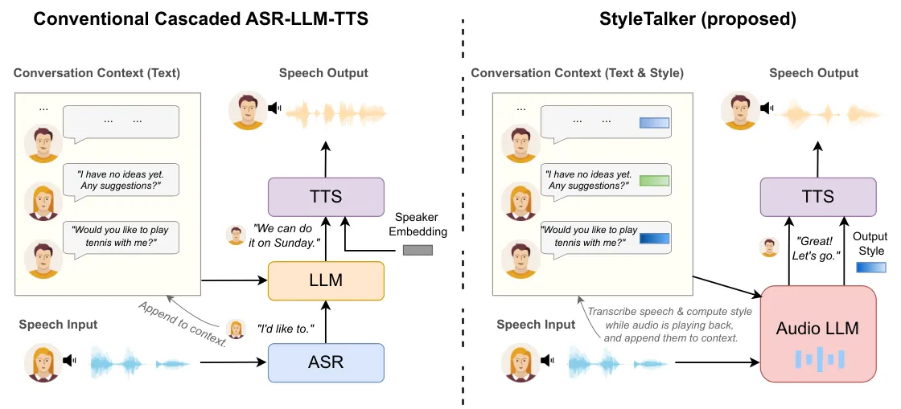
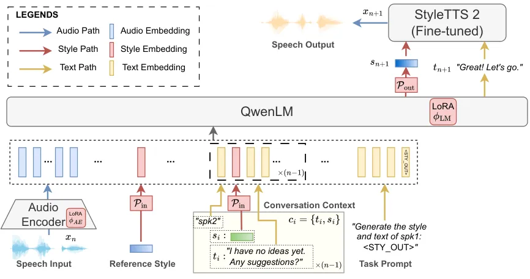

# Style-Talker: Finetuning Audio Language Model and Style-Based Text-to-Speech Model for Fast Spoken Dialogue Generation

Yinghao Aaron Li & Xilin Jiang ^(†)^(†)thanks: These authors contributed
equally. Affiliation: Department of Electrical Engineering
Affiliation: Columbia University Affiliation: New York, NY, USA
Affiliation: {yl4579, xj2289}@columbia.edu    Jordan Darefsky & Ge Zhu
Affiliation: Department of Electrical and Computer Engineering
Affiliation: University of Rochester Affiliation: Rochester, NY, USA
Affiliation: {jdarefsk, ge.zhu}@rochester.edu    Nima Mesgarani
Affiliation: Department of Electrical Engineering Affiliation: Columbia
University Affiliation: New York, NY, USA Email: [nima@ee.columbia.edu
](mailto:)

###### Abstract

The rapid advancement of large language models (LLMs) has significantly
propelled the development of text-based chatbots, demonstrating their
capability to engage in coherent and contextually relevant dialogues.
However, extending these advancements to enable end-to-end
speech-to-speech conversation bots remains a formidable challenge,
primarily due to the extensive dataset and computational resources
required. The conventional approach of cascading automatic speech
recognition (ASR), LLM, and text-to-speech (TTS) models in a pipeline,
while effective, suffers from unnatural prosody because it lacks direct
interactions between the input audio and its transcribed text and the
output audio. These systems are also limited by their inherent latency
from the ASR process for real-time applications. This paper introduces
Style-Talker, an innovative framework that fine-tunes an audio LLM
alongside a style-based TTS model for fast spoken dialog generation.
Style-Talker takes user input audio and uses transcribed chat history
and speech styles to generate both the speaking style and text for the
response. Subsequently, the TTS model synthesizes the speech, which is
then played back to the user. While the response speech is being played,
the input speech undergoes ASR processing to extract the transcription
and speaking style, serving as the context for the ensuing dialogue
turn. This novel pipeline accelerates the traditional cascade
ASR-LLM-TTS systems while integrating rich paralinguistic information
from input speech. Our experimental results show that Style-Talker
significantly outperforms the conventional cascade and speech-to-speech
baselines in terms of both dialogue naturalness and coherence while
being more than 50% faster. The demo and code are available at
[https://styletalker.github.io/](https://styletalker.github.io/).

|     |
| --- |
|     |

## 1 Introduction

Conversing with a machine as if it were talking to a human has always
been a dream for many computer scientists. Traditional spoken dialog
systems (SDS) have relied on a multi-component architecture encompassing
automatic speech recognition (ASR), language comprehension, dialog
managers for turn-taking, response generation, and text-to-speech (TTS)
synthesis. This complex pipeline enables interactions between humans and
machines by converting input speech to text, understanding and managing
the dialog’s context, generating appropriate responses, and ultimately
synthesizing these responses back into speech (Jokinen & McTear, 2022).
Despite its effectiveness, this traditional setup has been challenged by
the recent seismic shifts brought about by deep learning innovations.

Recent advances in deep learning, particularly in the development of
large language models (LLMs), have dramatically simplified the SDS
architecture dramatically (Zhao et al., 2023). By integrating language
comprehension, turn-taking, and response generation into a single LLM,
the dialog system pipeline has been condensed into a more streamlined
ASR-LLM-TTS process (Mitsui et al., 2023; Yi et al., 2024). Furthermore,
cutting-edge approaches now aim to achieve more direct end-to-end (E2E)
speech-to-speech generation by treating speech as language tokens and
modeling it similarly to LLMs, thereby eliminating the need for a
separate ASR and TTS process (Lakhotia et al., 2021; Nguyen et al.,
2023; Nachmani et al., 2023; Kim et al., 2024). This paradigm shift
promises to further streamline dialog systems, making them more
efficient and versatile.

However, both the ASR-LLM-TTS pipeline and speech LLM approaches exhibit
significant limitations. The former struggles with capturing the
emotional nuances of the input audio, failing to integrate this crucial
aspect of human communication into the dialog process. While some
research has attempted to address this by understanding input emotions
(Xue et al., 2023), the synthesized response still remains emotionally
disconnected from the input, as the TTS component operates independently
of the ASR and LLM. Another very recent work (Lin et al., 2024) tries to
incorporate speaking style in the LLM output for subsequent TTS
synthesis. Still, the styles are derived from pre-defined categories,
requiring extensive labeling works from more powerful LLM such as GPT-4,
hindering its applications on in-the-wild datasets. Moreover, the
autoregressive decoding required for ASR slows the entire system,
impeding its applicability in real-time scenarios. On the other hand,
the end-to-end speech LLM approach, despite its theoretical advantages,
faces practical challenges in data acquisition and processing speed
(Nguyen et al., 2023), making it less feasible for real-time
applications due to the extensive computational resources required to
generate speech units.

In this paper, we introduce Style-Talker, a novel SDS framework designed
to overcome these challenges. Style-Talker innovatively integrates input
audio directly with transcribed speech context of previous turns from
the ASR model and its corresponding speaking style from a style-based
TTS model. This approach not only preserves the prosodic (style) and
semantic (text) aspects of speech but also significantly enhances the
system’s efficiency by eliminating the ASR component prior to the LLM in
the response generation process. By training the audio LLM to output
both the response text and its associated speech style, Style-Talker
enables the synthesis of speech that accurately reflects the intended
emotional and stylistic nuances. Concurrently, it processes the current
input audio for transcription and style analysis, using this information
to inform the next dialog turn. This seamless integration and the
elimination of intermediate ASR processing dramatically improve the
real-time factor (RTF) of the system, making Style-Talker nearly twice
faster than the ASR-LLM-TTS cascade baseline with Whisper large-v2 model
(Radford et al., 2023) and more than four times faster than a recent
speech-to-speech baseline, SpeechGPT (Zhang et al., 2023). Moreover, our
system outperforms both the cascade and speech-to-speech baselines in
generating responses that are not only more natural and coherent but
also emotionally congruent with the dialog context. Since our system
does not require manual labeling, it can also be applied directly to
datasets mined in the wild, greatly diversifying its applicability and
efficiency.



Figure 1: An overview of SDS with a comparison between the conventional
cascaded system and Style-Talker. The cascaded system has three steps:
input speech transcription (ASR), response text generation (LLM), and
response speech synthesis (TTS). Style-Talker adopts an audio LLM to
merge the first two steps and generate a response text and corresponding
style directly, preserving the content prosody while achieving
generation efficiency.

## 2 Related Works

Recent advancements in spoken dialog generation have primarily followed
two distinct approaches: the text-based approach and the end-to-end
(E2E) speech-to-speech approach. The text-based approach generates a
text response that is subsequently converted into speech via
text-to-speech (TTS) synthesis. In contrast, the E2E approach aims for
direct speech output, bypassing the intermediate step for text
generation altogether. Each of these methods, while effective, presents
unique challenges and limitations that have spurred ongoing research
efforts to improve the efficiency and naturalness of dialog systems.

### 2.1 Text-Based Approaches and Paralinguistic Decoupling

The text-based approach, despite its widespread adoption, is inherently
limited by the fundamental decoupling from the paralinguistic features
of the input and output speech, such as tones, emotions, and
intonations. Recent efforts in text-based dialog systems have sought to
bridge the gap between speech content and its underlying paralinguistic
information. For example, Xue et al. (2023) employed a speech encoder to
inform LLMs about paralinguistic cues for generating emotionally
congruent responses. Further, Lin et al. (2023) and Lin et al. (2024)
introduced multimodal approaches that combine text and speech inputs, or
text with emotion vectors, to better interpret these cues. Yet, these
methods require speech transcription into text, introducing latency that
impacts processing speed. Contrary to these, Style-Talker directly
processes speech inputs, circumventing transcription delays and
achieving significant speed improvements without sacrificing prosodic or
conversational coherence.

Moreover, efforts have been made to enhance the paralinguistic aspects
of generated responses by incorporating emotion labels into text
responses (Varshney et al., 2021; Liu et al., 2021; Lin et al., 2023;
Lin et al., 2024). These works, however, rely on predefined text labels
for each utterance, complicating application to diverse and unstructured
in-the-wild datasets. Style-Talker, in contrast, adopts a
self-supervised approach with a style-based TTS model, learning speech
styles directly optimized for speech synthesis. This method mitigates
limitations of predefined emotion categories, offering a more flexible
and end-to-end solution.

### 2.2 End-to-End Speech-to-Speech Generation

E2E models represent a paradigm shift in spoken dialog systems by
generating speech output directly from speech input, modeling speech in
an autoregressive fashion, which has been used both for dialog
generation Nguyen et al. (2023); Kim et al. (2024) and translation
Duquenne et al. (2023); Barrault et al. (2023). The discrete dGSLM
framework (Nguyen et al., 2023), for example, treats speech as discrete
units akin to text tokens, achieving emotional and prosodic coherence.
Spectron (Nachmani et al., 2023) extends this E2E framework by directly
generating mel-spectrograms instead of discreet tokens. However, due to
data limitations, these E2E dialog systems trained from scratch on
speech corpora often lack semantic coherence in dialog responses.
SpeechGPT (Zhang et al., 2023; Zhang et al., 2024) and USDM (Kim et al., 2024) attempt to address this by integrating text-based LLMs with speech
datasets, though challenges in achieving human-like speech quality
remain, alongside the complexities of training models across multiple
modalities. Unlike the E2E approach, Style-Talker fine-tunes an audio
language model and a style-based TTS model to generate semantically and
paralinguistically coherent responses. This approach not only enhances
dialog naturalness but also offers substantial improvements in
processing speed, marking a new advancement for dialog generation
technology.



Figure 2: Model components and processing pipelines of Style-Talker for
response generation. Audio $`\bm{x}_{n}`$ from the incoming speaker, a
reference and past speaker styles in conversation, and transcriptions
from previous rounds ($`\bm{c}_{n}`$) are all embedded into the same
space by the audio encoder, the style projection
$`\mathcal{P}_{\text{in}}`$, and the text tokenizer and embedder (not
shown), respectively. They are jointly processed by an LLM QwenLM to
generate the response text $`\bm{t}_{n+1}`$ and style $`\bm{s}_{n+1}`$
for StyleTTS 2 to synthesize a response speech $`\bm{x}_{n+1}`$.

## 3 Methods

### 3.1 Style-Talker

Style-Talker is a spoken dialog system (SDS) designed for seamless,
real-time speech-to-speech interaction by integrating two major
components: a multi-modal audio large language model (LLM) for spoken
language understanding (SLU) and text-style response generation, and a
style-based text-to-speech (TTS) model for synthesizing speech that
mirrors the specific speaking style indicated by the style vector
generated from the language model. This innovative architecture enables
Style-Talker to produce responses that are not only contextually
relevant but also paralinguistically congruent with the previous
speaker’s speaking style, significantly enhancing the naturalness and
coherence of dialogues.

The training of Style-Talker involves a two-stage process. Initially,
the StyleTTS 2 model (Li et al., 2024), a state-of-the-art style-based
TTS model, is fine-tuned on a dialog dataset wherein speakers’
utterances are diarized or segmented into individual speech sentences.
The model learns the nuances of speaking styles in a self-supervised
manner, without the need for explicit style annotations, with which the
speaking styles are extracted by the style encoder into a fixed-length
style vector. Subsequently, an audio LLM, such as Qwen-Audio (Chu
et al., 2023), is fine-tuned to generate both the response text and its
associated speaking style, utilizing the previously transcribed text and
style from each utterance as contextual input. This phase is critical
for aligning the generated responses with the conversational context
through texts and its underlying paralinguistic features via styles,
thus ensuring coherence and style consistency in dialogues.

During inference, we provide a reference style vector of the response
speaker as a target speaker embedding at the beginning of the input
prompt. For simplicity, we do not model turn-taking explicitly. The
system instead infers the end of a speaker’s turn based on a
predetermined time threshold. If the speaker’s silence exceeds this
threshold, the system proceeds to process the input speech. For each
incoming utterance $`\bm{x}_{n}`$, the fine-tuned audio LLM takes both
the speech input $`\bm{x}_{n}`$ and its preceding context
$`\bm{c}_{n-1}`$ as detailed in Section 3.1.3. The model then generates
the response text $`\bm{t}_{n+1}`$ and the corresponding speaking style
$`\bm{s}_{n+1}`$. These outputs are fed into the TTS model, which
synthesizes the speech $`\bm{x}_{n+1}`$ that reflects both the content
and style of the response, playing it back to the user.

Simultaneously, as the response speech is being played back, the system
employs an ASR model to transcribe the input speech $`\bm{x}_{n}`$ into
text $`\bm{t}_{n}`$, and a style encoder from StyleTTS 2 to extract the
speaking style into a vector $`\bm{s}_{n}`$. These elements are then
aggregated into the contextual data
$`\bm{c}_{n}=\{\bm{t}_{i},\bm{s}_{i}\}_{i=1}^{n}`$ for processing the
next speech input $`\bm{x}_{n+2}`$. This methodology effectively reduces
the system’s reliance on ASR during the user’s wait time for a response,
thereby improving the real-time applicability of the system. By
streamlining the dialog process to involve only a single LLM decoder for
response generation, rather than two separate autoregressive decoders
for both ASR and response generation, Style-Talker achieves remarkable
efficiency and speed, signifying a new step toward real-time spoken
dialog systems. In the following section, we detail each component,
context aggregation, and prompt settings. For more implementation
details, please refer to Appendix A.

#### 3.1.1 StyleTTS 2

StyleTTS 2 is a state-of-the-art TTS model with human-level performance
and public pre-trained checkpoints. It differs from other TTS models in
how it captures and represents the speaking style. At the core of
StyleTTS 2’s design is an autoencoder framework that learns a
fixed-length vector capturing the speaking style as its latent
representation, from which the speech is decoded back to waveform
conditioned on the transcribed text. This style representation is
comprehensive, containing a broad range of paralinguistic features that
extend beyond the mere content of speech. It includes, but is not
limited to, the speaker identity, prosody, lexical stress, formant
transitions, and speaking rate (Li et al., 2024). In essence, the
speaking style vector serves as a paralinguistic summary of the speech,
effectively distilling the essence of how something is said, separate
from what is being said.

To leverage the capabilities of StyleTTS 2 for dialog generation, we
begin by fine-tuning the model using the LibriTTS checkpoint ¹¹ 1
Available at
[https://github.com/yl4579/StyleTTS2](https://github.com/yl4579/StyleTTS2).
We prepared our dataset at the utterance level, with each utterance
attributing to a single speaker (see Section 4.1). This is because the
style encoder of StyleTTS 2 is designed to process speech from
individual speakers and cannot encode utterances with multiple speakers.
We then compute the utterance-level style for each utterance in the
dataset for audio LM fine-tuning.

#### 3.1.2 Qwen-Audio

Qwen-Audio is an open-source multi-modal language model, combining the
text and audio modalities to understand and respond to both text and
audio inputs. This model is an adaptation of Qwen-7B (Bai et al., 2023),
fine-tuned with an audio encoder from Whisper large-v2 (Radford et al., 2023) ²² 2 Available at
[https://github.com/QwenLM/Qwen-Audio](https://github.com/QwenLM/Qwen-Audio).
This integration enables Qwen-Audio to comprehend audio inputs and
generate corresponding text responses with the capacity to understand
both the spoken content and its paralinguistic attributes. In
Style-Talker, we have further fine-tuned Qwen-Audio to incorporate
speaking style both as an input and output modality. We modified the
input head to the transformer layers to accept not only text information
of previous conversation turns but also the associated speaking style as
the context (see Section 3.1.3). The details of this modification,
including specific prompts used, can be found in Appendix A.1. In this
setup, the speaking style is transformed into a hidden representation
that aligns with those of the text tokens in dimensionality through a
linear projection layer $`\mathcal{P}_{\text{in}}`$. Similarly, when
generating responses, an additional linear projection head
$`\mathcal{P}_{\text{out}}`$ is applied to a special `<STY_OUT>` token
appended near the end of the model’s input sequence to decode the
speaking style corresponding to the response text (see Figure 2 for
detailed illustrations). Since we only care about the paralinguistic
information of the response speech rather than the pre-determined
response speaker identity, we only predict the prosodic style in
StyleTTS 2 and use a pre-computed acoustic style for the timbre of the
target speaker’s voice. We found that this approach helps retain the
speaker’s identity while maintaining the ability to produce prosodically
coherent speech responses.

#### 3.1.3 Conversation Context

In multi-turn dialog systems, the context of the conversation plays a
pivotal role in generating responses that are both congruent and
coherent. Research has consistently shown that incorporating longer
contexts leads to more meaningful and contextually appropriate dialogues
(Agarwal et al., 2018). Traditional text-based spoken dialog systems,
however, typically limit context to the text content of previous
interactions (Xue et al., 2023; Lin et al., 2024). This approach falls
short in capturing the full spectrum of communicative nuances,
particularly in regards to the speaking style, due to the absence of
speech information within the dialog context. To address this
limitation, Style-Talker enhances context representation by including
both the text of each utterance and its corresponding speaking style.
This enriched context is structured within the prompt in a novel manner:
adjacent to each speaker’s name, and preceding the transcribed speech
content, a special style token is introduced. This token directly
corresponds to the speaking style vector for the utterance, effectively
embedding paralinguistic information within the dialog context (see
Appendix A.1 for more details).

The integration of texts and style vectors into the conversation context
is achieved through the use of ASR, with the Whisper model and the style
encoder from StyleTTS 2. This process occurs while the current response
speech is being played back to the user. This design choice minimizes
potential delays in response time attributed to input transcription,
ensuring the system remains highly responsive. By maintaining a
comprehensive context that encompasses both semantic content and
paralinguistic attributes, Style-Talker significantly advances the
capabilities of spoken dialog systems. Since our model operates on the
text domain, we can have a speech context spanning for up to 2 minutes,
much longer than speech-to-speech models such as SpeechGPT, which often
suffer from limited context windows, as speech is inherently longer than
its transcribed texts.

### 3.2 Training Objectives

For a more natural style and coherent content in the response speech, we
jointly optimize the style error and the next token probability. The
style loss $`\mathcal{L}_{\text{style}}`$ is defined as the L1 distance
between the ground truth prosodic style $`\hat{\bm{s}}_{n+1}`$ and the
style $`\bm{s}_{n+1}`$ decoded from the last layer representation
$`h_{\text{<STY\_OUT>}}`$ of the special token `<STY_OUT>`:

```math
\displaystyle\mathcal{L}_{\text{style}}=|\bm{s}_{n+1}-\hat{\bm{s}}_{n+1}|, \tag{1}
```

```math
\displaystyle\hskip 4.0pt\bm{s}_{n+1}=\mathcal{P}_{\text{out}}(h_{\text{<STY\_OUT>}}). \tag{2}
```

The response text generation maximizes the next text token
($`\bm{t}_{n+1}`$) probability given the incoming speech $`\bm{x}_{n}`$
and preceding context $`\bm{c}_{n-1}`$ containing both styles and
transcriptions:

```math
\displaystyle\max\limits_{\theta_{\text{in}},\phi_{\text{AE}},\phi_{\text{LM}}}P(\bm{t}_{n+1}|\bm{x}_{n},\bm{c}_{n-1}), \tag{3}
```

where $`\theta_{\text{in}}`$, $`\phi_{\text{Audio}}`$,
$`\phi_{\text{LM}}`$ are the trainable parameters in the style input
projection, and the audio encoder and the LLM in Qwen-Audio. We optimize
the above objective through a cross-entropy loss
$`\mathcal{L}_{\text{text}}`$ for $`1<t\leq T`$ given a text sequence of
length $`T`$.

The final loss is a weighted sum of the style and text loss:
$`\mathcal{L}=\mathcal{L}_{\text{text}}+\lambda\mathcal{L}_{\text{style}}`$,
where $`\lambda`$ is a hyperparameter for weighing different loss terms.

## 4 Experiments

Dataset Model MOS-N (CI) MOS-C (CI) DailyTalk Ground Truth 3.83 ($`\pm`$
0.11) 4.33 ($`\pm`$ 0.07) SpeechGPT (Zhang et al., 2023) 2.87 ($`\pm`$
0.08) 3.11 ($`\pm`$ 0.09) Cascade (Whisper + Qwen-7B + StyleTTS 2) 3.24
($`\pm`$ 0.10) 3.63 ($`\pm`$ 0.08) Style-Talker (Proposed) 3.55 ($`\pm`$
0.09) 3.90 ($`\pm`$ 0.09) PodcastFillers Ground Truth 4.22 ($`\pm`$
0.08) 4.18 ($`\pm`$ 0.09) Cascade (Whisper + Qwen-7B + StyleTTS 2) 3.22
($`\pm`$ 0.09) 3.53 ($`\pm`$ 0.10) Style-Talker (Proposed) 3.76 ($`\pm`$
0.09) 4.02 ($`\pm`$ 0.09 )

Table 1: Mean opinion score of naturalness (MOS-N) and coherence (MOS-C)
with 95% confidence intervals (CI) from human subjective evaluations.

### 4.1 Datasets

We evaluated our system and baseline systems on two benchmark datasets:
DailyTalk (Lee et al., 2023) and PodcastFillers (Zhu et al., 2022). The
former is a two-speaker studio-recorded conversation dataset, and the
latter is a spoken dialog dataset mined in the wild.

DailyTalk (Lee et al., 2023) is a multi-turn conversation dataset
comprising 20 hours of spoken dialog data from two speakers, one male
and one female, totaling 2,541 conversations. The dataset was recorded
in a studio with contrived scripts by voice actors of non-native English
speaker origins. We kept 100 and 200 conversations as validation and
test set, respectively, and the remaining 2,241 conversations were used
as the training set.

Although DailyTalk offers transcribed conversational speech, the audio
recordings are contrived rather than captured in natural, real-world
settings. We thus also conducted experiments on the PodcastFillers  (Zhu
et al., 2022), a dataset of conversations from podcast recordings
produced in uncontrolled settings. The PodcastFillers dataset consists
of 145 hours of gender-balanced podcast recordings featuring over 350
speakers, sourced from SoundCloud. It contains 199 podcasts in total.
Since transcriptions provided with the PodcastFillers dataset do not
contain speaker diarizations and filler words, we diarized and
re-transcribed the dataset (see Appendix A.4 for details). We divided
the dataset by podcast, with a 173/6/20 split for training, validation,
and test sets.

### 4.2 Evaluations

We evaluated our SDS against two other systems: the traditional
ASR-LLM-TTS cascade system and the end-to-end (E2E) speech-to-speech
approach. Since there is no publicly available E2E speech-to-speech
baseline with multi-turn support at the point the paper is written,
following Kim et al. (2024), we fine-tuned a single-turn E2E model,
SpeechGPT (Zhang et al., 2023) 7B-cm ³³ 3 Avaiable at
[https://huggingface.co/fnlp/SpeechGPT-7B-cm](https://huggingface.co/fnlp/SpeechGPT-7B-cm),
as the E2E baseline. Due to the limited context window SpeechGPT
presents, we failed to fine-tune it on the more complicated
PodcastFillers dataset to generate meaningful responses. Thus, we only
evaluated SpeechGPT on the simpler DailyTalk dataset as in Kim et al.
(2024). For more details of our baseline systems, including model
choices of cascade baseline, please refer to Appendix A.3.

Dataset Model BLEU $`\uparrow`$ ROUGE-L $`\uparrow`$ METEOR $`\uparrow`$
BERT Score $`\uparrow`$ WER $`\downarrow`$ DailyTalk SpeechGPT 1.21 9.02
14.89 77.13 22.58 Cascade 3.00 11.92 22.48 88.99 16.22 Style-Talker 4.62
16.14 25.72 90.40 12.01 PodcastFillers Cascade 0.43 7.08 10.44 83.98
10.61 Style-Talker 3.31 10.06 17.00 84.26 15.59

Table 2: Semantic evaluations of F-1 score (%) for BLEU, ROUGE-L,
METEOR, BERT Score and word error rate (WER). WER was computed with
filler words and punctuation removed.

#### 4.2.1 Subjective Evaluations

We used two metrics for the mean opinion score (MOS) as subjective
evaluations: MOS-N for naturalness and MOS-C for coherence. Unlike Zhang
et al. (2024) that only evaluates the speaker similarity, we asked the
evaluators to rate the coherence of the generated speech, similar to how
written dialogues are evaluated in text (Zhong et al., 2022). Both
metrics involve the speech and the content of the responses. For MOS-N,
the raters were only instructed to rate the naturalness of the response,
that is, how likely the speech response is produced by a human instead
of a robot based on both the speech quality and the content spoken. In
contrast, MOS-C measures how well the response speech follows the
previous conversation context, given the speech’s content and the
speaker’s prosody and identity (see Appendix C for details). These
evaluations were conducted by native English speakers from the U.S. on
Amazon MTurk . For each test, we included 10 to 20 conversations, each
provided with the previous 3 turns of conversation as the context. Each
speech response set was rated by 5 to 10 evaluators on a 1-5 scale, with
increments of 1. We followed Li et al. (2021) that randomized the model
order and kept their labels hidden, similar to MUSHRA (BS, 2003). We
used the rating of the ground truth response as the attention checker
and excluded raters who did not rank the ground truth as the highest for
both MOS metric.

#### 4.2.2 Objective Evaluations

We followed Lin et al. (2024) to evaluate the response speech at both
acoustic and semantic levels. Since our speaking styles are
self-supervised, unlike Lin et al. (2024) with categorical and
pre-defined styles where the generated styles can be compared against
the ground truth labels for F-1 score, we conducted acoustic evaluations
following Li et al. (2022) by calculating the correlations of several
acoustic metrics for emotion recognition (Busso et al., 2013) between
generated and ground truth speech. These metrics include pitch mean,
pitch standard deviation (STD), energy mean, energy standard deviation
(STD), and harmonics-to-noise (HTN) ratio. We also added speech duration
as an extra metric to evaluate whether the generated speech follows the
same distribution as the ground truth in terms of speech duration.
Moreover, we scored the speaker similarity by employing a pre-trained
WavLM speaker embedding model ⁴⁴ 4 Available at
[https://huggingface.co/microsoft/wavlm-base-plus-sv](https://huggingface.co/microsoft/wavlm-base-plus-sv)
following Ju et al. (2024).

We used the generated text directly for semantic evaluation, as all
models evaluated, including SpeechGPT, generate text as responses. We
followed Lin et al. (2024); Kim et al. (2024) and employed commonly used
text-generation metrics, including BLEU (Papineni et al., 2002), ROUGE
(Lin, 2004), METEOR (Banerjee & Lavie, 2005) and BERT Score (Zhang
et al., 2019) against the ground truth text. Additionally, we calculated
the word error rate (WER) with Whisper large-v2 as a semantic metric to
evaluate the intelligibility of the generated speech. All metrics were
computed with the Huggingface Evaluate package ⁵⁵ 5
[https://huggingface.co/docs/evaluate/](https://huggingface.co/docs/evaluate/).

Lastly, to test the real-time applicability, we computed the real-time
factor (RTF), which is the ratio between the time used to generate a
speech utterance and the duration of the generated speech, and the
system delay by generating a 10-second response to a 10-second input
utterance. The evaluation was conducted on a single Nvidia L40 GPU.

## 5 Results

Dataset Model Pitch mean Pitch STD Energy mean Energy STD HTN ratio
Speech duration Speaker similarity DailyTalk SpeechGPT 0.62 0.07 0.70
0.00 0.39 0.12 0.75 Cascade 0.76 0.13 0.72 0.03 0.53 0.19 0.83
Style-Talker 0.81 0.26 0.73 0.07 0.56 0.25 0.86 PodcastFillers Cascade
0.72 0.24 0.82 0.44 0.45 0.17 0.82 Style-Talker 0.68 0.28 0.82 0.58 0.51
0.20 0.84

Table 3: Comparison of Pearson correlation coefficients of acoustic
features associated with emotions and speech duration between ground
truth and response speech and cosine similarity of speaker embeddings
between ground truth and response speech.

### 5.1 Model Performance

According to the subjective evaluation results presented in Table 1,
Style-Talker achieves a significant improvement in conversation
naturalness and coherence against both the cascade and speech-to-speech
baselines on the DailyTalk dataset. Furthermore, when evaluated on the
PodcastFillers dataset, which comprises recordings in more realistic and
noisy settings, Style-Talker still outperforms the cascade baseline,
showcasing its robustness and adaptability in various settings, whereas
SpeechGPT fails to produce meaningful speech. Importantly, Table 5 shows
that our system is nearly twice as fast as the cascade system and four
times faster than the SpeechGPT baseline. Our system only generates
10-second audio from 10-second input audio in around 1.5 seconds,
significantly faster than other baseline systems, making it feasible for
real-time applications in human-computer interaction.

In terms of semantic similarity to ground truth responses, Style-Talker
showed a strong alignment, as evidenced in Table 2. This is notable even
as both the baseline systems and Style-Talker experience reduced
semantic metrics on the PodcastFillers dataset due to its complexity
from a more natural recording setting. Remarkably, Style-Talker
consistently outperforms the cascade baselines in text dialog
generation, even though semantic evaluation occurs in the text domain
without any involvement of other modalities. This suggests that
Style-Talker’s architecture, which integrates audio input and previous
speaking styles into the context for generating text and style,
contributes positively to the semantic quality of generated text. This
aspect is further explored in the ablation study detailed in Section
5.2, highlighting the semantic significance of incorporating audio and
style context in dialog generation. In Table 3, acoustic features of the
speech responses generated by Style-Talker show a higher correlation
with those of the ground truth responses when compared to other baseline
systems. This evidence strongly supports the efficacy of Style-Talker’s
design in capturing and reproducing the nuanced acoustic properties
associated with prosody and emotion in human speech, proving its ability
to produce emotionally coherent responses.

### 5.2 Ablation Study

To assess the contribution of each component to our system’s
performance, we conducted an ablation study by evaluating the system
under various configurations, involving the addition or omission of
specific features. We focused on three variants of our system: one
excluding style vectors from the dialog context (“– style in context”),
another substituting the audio language model (LM) with a conventional
LM and instead using the text transcription and style of the input
speech (“– audio input”), and lastly our proposed system provided with
the additional text transcription and style vector of input speech (“+
ASR & style”). We summarized the results in Table 5 by averaging all
metrics evaluated and added the averaged metrics on both DailyTalk and
PodcastFillers (see Appendix A.4 for full results).

Table 5 shows that omitting the speaking styles from previous dialog
turns adversely affects the quality of speech responses, impacting both
semantic and acoustic aspects. This underscores the importance of
incorporating speech styles into the context to produce responses that
are semantically rich and prosodically aligned with the previous
conversation. Conversely, substituting audio input with its text
transcription and style vector has a less detrimental effect. This can
be attributed to the style vector serving as a summary of the input’s
paralinguistic features. However, this configuration requires the use of
an ASR model, markedly slowing down the system’s processing speed. It is
notable that including the current input speech’s text and style does
not enhance system performance, suggesting that the audio encoder is
able to extract necessary information from the input audio that is
contained in the text and style vector, making these additional inputs
redundant. This finding highlights the efficiency of the audio encoder
in extracting relevant text and style cues without the need for explicit
provision of such information.

|              |        |         |
| ------------ | ------ | ------- |
| Model        | RTF    | Delay   |
| Style-Talker | 0.3873 | 1.53 s  |
| SpeechGPT    | 1.3246 | 13.82 s |
| Cascade      | 0.5912 | 2.31 s  |

Table 4: The real-time factor (RTF) and system delay when processing a
10s input and producing a 10s output audio between various models.

|                    |                       |                       |                    |
| ------------------ | --------------------- | --------------------- | ------------------ |
| Model              | Semantic $`\uparrow`$ | Acoustic $`\uparrow`$ | RTF $`\downarrow`$ |
| Proposed           | 62.88                 | 1.07                  | 0.3824             |
| – style in context | 61.21                 | 1.01                  | 0.3792             |
| – audio input      | 62.10                 | 1.04                  | 0.6912             |
| + ASR & style      | 62.76                 | 1.07                  | 0.6857             |

Table 5: Ablation study results with aggregated semantic and acoustic
scores (sum of averaged metrics in Table 6 and Table 7 on both DailyTalk
and PodcastFillers datasets) and real-time factor.

## 6 Conclusions and Limitations

In this work, we presented Style-Talker, a novel spoken dialog system
(SDS) that integrates audio input with its transcribed speech context
and speaking style. Our system demonstrates superior performance in
naturalness, coherence, and processing speed on challenging datasets
compared to traditional ASR-LLM-TTS cascades and end-to-end baselines.
Despite these significant advancements and our careful attention to
real-time responsiveness, Style-Talker still faces limitations in
response speed and may not always surpass SDS with real-time ASR
implemented. Moreover, the quality of the generated speech is dependent
on the downstream TTS model’s performance, which may degrade when
handling in-the-wild noisy datasets.

Future work will focus on enhancing real-time processing by encoding
audio input in a causal manner and developing methods to summarize audio
efficiently with minimal impact on input context token length. Improving
the performance of TTS models for noisy, real-world datasets is another
key area for further research. Additionally, our current system does not
include explicit turn-taking mechanisms, so future research will explore
incorporating efficient turn-taking strategies into the proposed
framework.

## 7 Acknowledgements

We thank Cong Han for helping conducting subjective evaluations during
the development of this work. This work is funded by the National
Institutes of Health (NIH- NIDCD) and a grant from Marie-Josee and Henry
R. Kravis.

## References

- Agarwal et al. (2018) Shubham Agarwal, Ondrej Dusek, Ioannis Konstas,
  and Verena Rieser. Improving context modelling in multimodal dialogue
  generation. _arXiv preprint arXiv:1810.11955_, 2018.
- Bai et al. (2023) Jinze Bai, Shuai Bai, Yunfei Chu, Zeyu Cui, Kai
  Dang, Xiaodong Deng, Yang Fan, Wenbin Ge, Yu Han, Fei Huang, et al.
  Qwen technical report. _arXiv preprint arXiv:2309.16609_, 2023.
- Banerjee & Lavie (2005) Satanjeev Banerjee and Alon Lavie. Meteor: An
  automatic metric for mt evaluation with improved correlation with
  human judgments. In _Proceedings of the acl workshop on intrinsic and
  extrinsic evaluation measures for machine translation and/or
  summarization_, pp. 65–72, 2005.
- Barrault et al. (2023) Loïc Barrault, Yu-An Chung, Mariano Coria
  Meglioli, David Dale, Ning Dong, Mark Duppenthaler, Paul-Ambroise
  Duquenne, Brian Ellis, Hady Elsahar, Justin Haaheim, et al. Seamless:
  Multilingual expressive and streaming speech translation. _arXiv
  preprint arXiv:2312.05187_, 2023.
- Bredin et al. (2020) Hervé Bredin, Ruiqing Yin, Juan Manuel Coria,
  Gregory Gelly, Pavel Korshunov, Marvin Lavechin, Diego Fustes, Hadrien
  Titeux, Wassim Bouaziz, and Marie-Philippe Gill. Pyannote. audio:
  neural building blocks for speaker diarization. In _ICASSP 2020-2020
  IEEE International Conference on Acoustics, Speech and Signal
  Processing (ICASSP)_, pp. 7124–7128. IEEE, 2020.
- BS (2003) ITUR BS. 1534-1, method for the subjective assessment of
  intermediate quality level of coding systems. _International
  Telecommunications Union, Geneva, Switzerland_, 14, 2003.
- Busso et al. (2013) Carlos Busso, Murtaza Bulut, Shrikanth Narayanan,
  J Gratch, and S Marsella. Toward effective automatic recognition
  systems of emotion in speech. _Social emotions in nature and artifact:
  emotions in human and human-computer interaction_,
  7(17):110–127, 2013.
- Chu et al. (2023) Yunfei Chu, Jin Xu, Xiaohuan Zhou, Qian Yang,
  Shiliang Zhang, Zhijie Yan, Chang Zhou, and Jingren Zhou. Qwen-audio:
  Advancing universal audio understanding via unified large-scale
  audio-language models. _arXiv preprint arXiv:2311.07919_, 2023.
- Duquenne et al. (2023) Paul-Ambroise Duquenne, Kevin Heffernan,
  Alexandre Mourachko, Benoît Sagot, and Holger Schwenk. Sonar
  expressive: Zero-shot expressive speech-to-speech translation. 2023.
- Hu et al. (2021) Edward J Hu, Yelong Shen, Phillip Wallis, Zeyuan
  Allen-Zhu, Yuanzhi Li, Shean Wang, Lu Wang, and Weizhu Chen. Lora:
  Low-rank adaptation of large language models. _arXiv preprint
  arXiv:2106.09685_, 2021.
- Jokinen & McTear (2022) Kristina Jokinen and Michael McTear. _Spoken
  dialogue systems_. Springer Nature, 2022.
- Ju et al. (2024) Zeqian Ju, Yuancheng Wang, Kai Shen, Xu Tan, Detai
  Xin, Dongchao Yang, Yanqing Liu, Yichong Leng, Kaitao Song, Siliang
  Tang, et al. Naturalspeech 3: Zero-shot speech synthesis with
  factorized codec and diffusion models. _arXiv preprint
  arXiv:2403.03100_, 2024.
- Kim et al. (2024) Heeseung Kim, Soonshin Seo, Kyeongseok Jeong, Ohsung
  Kwon, Jungwhan Kim, Jaehong Lee, Eunwoo Song, Myungwoo Oh, Sungroh
  Yoon, and Kang Min Yoo. Unified speech-text pretraining for spoken
  dialog modeling. _arXiv preprint arXiv:2402.05706_, 2024.
- Lakhotia et al. (2021) Kushal Lakhotia, Eugene Kharitonov, Wei-Ning
  Hsu, Yossi Adi, Adam Polyak, Benjamin Bolte, Tu-Anh Nguyen, Jade
  Copet, Alexei Baevski, Abdelrahman Mohamed, et al. On generative
  spoken language modeling from raw audio. _Transactions of the
  Association for Computational Linguistics_, 9:1336–1354, 2021.
- Lee et al. (2023) Keon Lee, Kyumin Park, and Daeyoung Kim. Dailytalk:
  Spoken dialogue dataset for conversational text-to-speech. In _ICASSP
  2023-2023 IEEE International Conference on Acoustics, Speech and
  Signal Processing (ICASSP)_, pp. 1–5. IEEE, 2023.
- Li et al. (2021) Yinghao Aaron Li, Ali Zare, and Nima Mesgarani.
  Starganv2-vc: A diverse, unsupervised, non-parallel framework for
  natural-sounding voice conversion. _arXiv preprint
  arXiv:2107.10394_, 2021.
- Li et al. (2022) Yinghao Aaron Li, Cong Han, and Nima Mesgarani.
  Styletts: A style-based generative model for natural and diverse
  text-to-speech synthesis. _arXiv preprint arXiv:2205.15439_, 2022.
- Li et al. (2024) Yinghao Aaron Li, Cong Han, Vinay Raghavan, Gavin
  Mischler, and Nima Mesgarani. Styletts 2: Towards human-level
  text-to-speech through style diffusion and adversarial training with
  large speech language models. _Advances in Neural Information
  Processing Systems_, 36, 2024.
- Lin (2004) Chin-Yew Lin. Rouge: A package for automatic evaluation of
  summaries. In _Text summarization branches out_, pp. 74–81, 2004.
- Lin et al. (2023) Guan-Ting Lin, Prashanth Gurunath Shivakumar, Ankur
  Gandhe, Chao-Han Huck Yang, Yile Gu, Shalini Ghosh, Andreas Stolcke,
  Hung-yi Lee, and Ivan Bulyko. Paralinguistics-enhanced large language
  modeling of spoken dialogue. _arXiv preprint arXiv:2312.15316_, 2023.
- Lin et al. (2024) Guan-Ting Lin, Cheng-Han Chiang, and Hung-yi Lee.
  Advancing large language models to capture varied speaking styles and
  respond properly in spoken conversations. _arXiv preprint
  arXiv:2402.12786_, 2024.
- Liu et al. (2021) Ruibo Liu, Jason Wei, Chenyan Jia, and Soroush
  Vosoughi. Modulating language models with emotions. _arXiv preprint
  arXiv:2108.07886_, 2021.
- Mitsui et al. (2023) Kentaro Mitsui, Yukiya Hono, and Kei Sawada.
  Towards human-like spoken dialogue generation between ai agents from
  written dialogue. _arXiv preprint arXiv:2310.01088_, 2023.
- Nachmani et al. (2023) Eliya Nachmani, Alon Levkovitch, Julian
  Salazar, Chulayutsh Asawaroengchai, Soroosh Mariooryad,
  RJ Skerry-Ryan, and Michelle Tadmor Ramanovich. Lms with a voice:
  Spoken language modeling beyond speech tokens. _arXiv preprint
  arXiv:2305.15255_, 2023.
- Nguyen et al. (2023) Tu Anh Nguyen, Eugene Kharitonov, Jade Copet,
  Yossi Adi, Wei-Ning Hsu, Ali Elkahky, Paden Tomasello, Robin Algayres,
  Benoit Sagot, Abdelrahman Mohamed, et al. Generative spoken dialogue
  language modeling. _Transactions of the Association for Computational
  Linguistics_, 11:250–266, 2023.
- Papineni et al. (2002) Kishore Papineni, Salim Roukos, Todd Ward, and
  Wei-Jing Zhu. Bleu: a method for automatic evaluation of machine
  translation. In _Proceedings of the 40th annual meeting of the
  Association for Computational Linguistics_, pp. 311–318, 2002.
- Radford et al. (2023) Alec Radford, Jong Wook Kim, Tao Xu, Greg
  Brockman, Christine McLeavey, and Ilya Sutskever. Robust speech
  recognition via large-scale weak supervision. In _International
  Conference on Machine Learning_, pp. 28492–28518. PMLR, 2023.
- Varshney et al. (2021) Deeksha Varshney, Asif Ekbal, and Pushpak
  Bhattacharyya. Modelling context emotions using multi-task learning
  for emotion controlled dialog generation. In _Proceedings of the 16th
  Conference of the European Chapter of the Association for
  Computational Linguistics: Main Volume_, pp. 2919–2931, 2021.
- Xue et al. (2023) Hongfei Xue, Yuhao Liang, Bingshen Mu, Shiliang
  Zhang, Qian Chen, and Lei Xie. E-chat: Emotion-sensitive spoken
  dialogue system with large language models. _arXiv preprint
  arXiv:2401.00475_, 2023.
- Yi et al. (2024) Zihao Yi, Jiarui Ouyang, Yuwen Liu, Tianhao Liao, Zhe
  Xu, and Ying Shen. A survey on recent advances in llm-based multi-turn
  dialogue systems. _arXiv preprint arXiv:2402.18013_, 2024.
- Zhang et al. (2023) Dong Zhang, Shimin Li, Xin Zhang, Jun Zhan, Pengyu
  Wang, Yaqian Zhou, and Xipeng Qiu. Speechgpt: Empowering large
  language models with intrinsic cross-modal conversational abilities.
  _arXiv preprint arXiv:2305.11000_, 2023.
- Zhang et al. (2024) Dong Zhang, Xin Zhang, Jun Zhan, Shimin Li, Yaqian
  Zhou, and Xipeng Qiu. Speechgpt-gen: Scaling chain-of-information
  speech generation. _arXiv preprint arXiv:2401.13527_, 2024.
- Zhang et al. (2019) Tianyi Zhang, Varsha Kishore, Felix Wu, Kilian Q
  Weinberger, and Yoav Artzi. Bertscore: Evaluating text generation with
  bert. _arXiv preprint arXiv:1904.09675_, 2019.
- Zhao et al. (2023) Wayne Xin Zhao, Kun Zhou, Junyi Li, Tianyi Tang,
  Xiaolei Wang, Yupeng Hou, Yingqian Min, Beichen Zhang, Junjie Zhang,
  Zican Dong, Yifan Du, Chen Yang, Yushuo Chen, Zhipeng Chen, Jinhao
  Jiang, Ruiyang Ren, Yifan Li, Xinyu Tang, Zikang Liu, Peiyu Liu,
  Jian-Yun Nie, and Ji-Rong Wen. A survey of large language models.
  _arXiv preprint arXiv:2303.18223_, 2023. URL
  [http://arxiv.org/abs/2303.18223](http://arxiv.org/abs/2303.18223).
- Zhong et al. (2022) Ming Zhong, Yang Liu, Da Yin, Yuning Mao, Yizhu
  Jiao, Pengfei Liu, Chenguang Zhu, Heng Ji, and Jiawei Han. Towards a
  unified multi-dimensional evaluator for text generation. _arXiv
  preprint arXiv:2210.07197_, 2022.
- Zhu et al. (2022) Ge Zhu, Juan-Pablo Caceres, and Justin Salamon.
  Filler Word Detection and Classification: A Dataset and Benchmark. In
  _Proc. Interspeech 2022_, pp. 3769–3773, 2022. doi:
  10.21437/Interspeech.2022-10992.

## Appendix A Implementation Details

### A.1 Prompt Settings

We adopted the input prompting format from Qwen-Audio and added extra
tokens to accommodate speaker styles. The example below is the prompt
template for two speakers with an ongoing conversation of three rounds.
The last round is the incoming speech (the audio input to Qwen-Audio),
in which the transcription and the style have not yet been calculated
and appended to the context. Texts in `< >` are special tokens for
Qwen-Audio’s tokenizer, and texts in `[ ]` vary for each conversation.

```ltx_verbatim

Audio 1:<audio>[audio path]</audio>

This is the voice of the [spk a] last speaking. There is a conversation
among [spk a]: STYLE: <|extra_123|> [spk b]: STYLE: <|extra_123|>.
Here is some context:

[spk a]: STYLE: <|extra_123|> TEXT: [text]
[spk b]: STYLE: <|extra_123|> TEXT: [text]

Try to recognize what [spk a] just said from the audio,
and generate the style and text of the next speaker [spk b].
Be creative and avoid repeated words and sentences.
STYLE: <|extra_124|> TEXT:
```

We chose Qwen-Audio’s pre-allocated special tokens \<\|extra_123\|\> as
placeholders for input styles and \<\|extra_124\|\> as the location
identifier for the output styles. \<\|extra_123\|\> tokens are not
embedded by the text embedder. Projected input styles replace the
embedding at these locations. The response style is predicted from the
last layer representation of the \<\|extra_124\|\> token.

We have also crafted similar prompt templates for the baseline and
ablation experiments. For example, we removed all styles in the context
or removed the audio input for the – style in context and – audio input
models in Table 5, respectively.

### A.2 Training and Inference Details

For both the baselines and our system, we randomly cropped the dialog,
used every turn before the cropping point as the context, and trained
the model to predict the response of the next turn. We truncated the
context to fit the context window for both the baseline and our systems,
512 for SpeechGPT and 1536 for Qwen-7B and Qwen-Audio. 1536 is the
maximum context window we can hold in the GPU memory. We used fixed
dialog crops that were randomly sampled beforehand for evaluation and
randomly sampled new crops for training.

We fine-tuned Qwen-Audio in Style-Talker and Qwen in the baseline using
LoRA (Hu et al., 2021). We added LoRA to query, key, and value metrics
in self-attention layers and weight metrics in MLPs in both the LLM and
the audio encoder. We chose a rank of 16, a dropout ratio of 0.05, and
no bias term. For fair comparisons, we trained Style-Talker, baseline,
and ablation models with the same training hyperparameters. All models
were trained with an AdamW optimizer, a peak learning rate of $`1e-4`$,
a linear learning rate decay, a maximum gradient norm of 1, a batch size
of 1, and a gradient accumulation step of 8 (for an equivalent batch
size of 8). We used mixed (bfloat16) precision for training on a Nvidia
L40 GPU. We trained all models for 20 epochs on the DailyTalk dataset or
100 epochs on the PodcastFilters dataset.

In evaluation, we set the style diffusion parameter
$`\alpha=0.3,\beta=0`$ for the DailyTalk dataset and $`\alpha=\beta=0`$
for the PodcastFilters dataset for all models. We fixed the reference
style from the context for a consistent evaluation and sampled with a
temperature of 1 and $`\texttt{top}\_\texttt{k}`$ of 0.8.

### A.3 Baseline Systems

For the cascade system, we employed Whisper large-v2 as the ASR model
since the audio encoder in our system is fine-tuned from the encoder of
Whisper large-v2. We fine-tuned a Qwen-7B model as the LLM for the
cascade baseline, as our audio LLM was fine-tuned from Qwen-7B. We kept
the same fine-tuned StyleTTS 2 model in both the cascade baseline and
our proposed system.

For both the cascade baselines and our system, we used the previous 3
turns as the context for the input. For SpeechGPT, we only used the
previous turn as its context window is limited to only one turn of input
audio. Since SpeechGPT generates speech at 16 kHz while StyleTTS 2
produces speech at 24 kHz, we downsampled all audio to 16 kHz for
DailyTalk dataset evaluations for fair comparison.

### A.4 PodcastFiller Dataset

Since we need “verbatim” transcriptions, we re-transcribed the podcast
audio using Whisper (Radford et al., 2023) and use Pyannote (Bredin
et al., 2020) to perform speaker diarization. Specifically, we first
apply speaker diarization to approximately parse the long recordings
into segments according to different speaker identities. Following this,
we use a Whisper large-v2 model to obtain transcriptions for these
segments. In our experience, the pre-trained Whisper models tend to omit
speaker turns, filler words, and other disfluencies; to address this,
one can either prompt the model with diarized verbatim text ⁶⁶ 6
[https://github.com/openai/openai-cookbook/blob/main/examples/Whisper_prompting_guide.ipynb](https://github.com/openai/openai-cookbook/blob/main/examples/Whisper_prompting_guide.ipynb)
or fine-tune the model using verbatim data. To address this, we use a
Whisper large-v2 model that has been fine-tuned on a small dataset
comprised of verbatim captions containing speaker turns, e.g., “…\[S1\]
Um, How are you today? \[S2\] Oh, I’m fine. Than-Thank you!". Lastly,
after obtaining transcriptions, we filter out utterances that were not
properly diarized by discarding segments whose transcripts contain
multiple speaker indicators, e.g. containing both “\[S1\]” and “\[S2\]”.

|                |                    |      |         |        |            |
| -------------- | ------------------ | ---- | ------- | ------ | ---------- |
| Dataset        | Model              | BLEU | ROUGE-L | METEOR | BERT Score |
| DailyTalk      | Proposed           | 4.62 | 16.14   | 25.72  | 90.40      |
|                | – style in context | 3.79 | 15.37   | 23.94  | 89.57      |
|                | – audio input      | 4.43 | 15.99   | 25.79  | 89.53      |
|                | + ASR & style      | 4.61 | 15.29   | 26.13  | 89.27      |
| PodcastFillers | Style-Talker       | 3.31 | 10.06   | 17.00  | 84.26      |
|                | – style in context | 3.02 | 9.44    | 15.49  | 84.19      |
|                | – audio input      | 3.05 | 9.55    | 15.96  | 84.13      |
|                | + ASR & style      | 3.65 | 11.08   | 16.91  | 84.11      |

Table 6: Semantic evaluations of F-1 score (%) for BLEU, ROUGE-L,
METEOR, and BERT Score for ablation study. The results for the proposed
model are copied from Table 2.

## Appendix B Detailed Ablation Study Results

In our ablation study, we conducted objective evaluations at both the
acoustic and semantic levels to scrutinize the impact of various
components within our proposed Style-Talker system. We focused on
understanding how the inclusion or omission of specific features
influences the system’s overall performance, particularly in terms of
acoustic quality and semantic accuracy. Notably, we opted to exclude the
word error rate (WER) from our semantic evaluation metrics. This
decision was informed by the observation that WER did not exhibit
significant variability across the different configurations tested in
our ablation study. Furthermore, its inclusion was found to introduce
noise into the aggregated scores presented in Table 5, potentially
obfuscating the true impact of the system modifications. By focusing on
metrics that more directly reflect the semantic integrity and coherence
of the generated responses, we aimed to achieve a clearer and more
meaningful assessment of each component’s contribution to the system’s
efficacy. The full evaluation results for semantic metrics are shown in
Table 6, and those of acoustic metrics are shown in Table 7

Dataset Model Pitch mean Pitch STD Energy mean Energy STD HTN ratio
Speech duration Speaker similarity DailyTalk Proposed 0.81 0.26 0.73
0.07 0.56 0.25 0.86 – style in context 0.82 0.27 0.72 0.06 0.58 0.13
0.85 – audio input 0.81 0.28 0.70 0.05 0.60 0.17 0.86 + ASR & style
0.84 0.33 0.70 0.06 0.57 0.22 0.85 PodcastFillers Proposed 0.68 0.28
0.82 0.58 0.51 0.20 0.84 – style in context 0.66 0.26 0.82 0.43 0.48
0.19 0.83 – audio input 0.70 0.27 0.83 0.49 0.48 0.22 0.82 + ASR &
style 0.75 0.28 0.82 0.48 0.49 0.28 0.84

Table 7: Acoustic evaluation results for the proposed and ablated models
for ablation study. The results for the proposed model are copied from
Table 3.

## Appendix C Subjective Evaluation Details

To ensure high-quality evaluation from MTurk, we followed Li et al.
(2024) by enabling the following filters:

- •
  HIT Approval Rate (%) for all Requesters’ HITS: `greater than 95`.
- •
  Location: `is UNITED STATES (US)`.
- •
  Number of HITs Approved: `greater than 50`.

We provided the following instructions for rating the naturalness and
coherence:

- •
  Naturalness:

  ```ltx_verbatim
      Rate how natural it is like being produced by human, compared to
      a computer or robot, evaluate based on the content spoken and
      speech quality.
  ```

- •
  Coherence:

  ```ltx_verbatim
      Rate how coherent the response is to the previous conversation,
      e.g., whether the person speaking is in the same emotion or the
      same person, or the response is relevant to previous
      conversation.
  ```

Additionally, for the evaluation of the DailyTalk dataset, we
specifically informed the raters that the speakers are not native
speakers and should be taken into consideration while rating
naturalness.

An example survey used for our subjective evaluation can be found at
[https://survey.alchemer.com/s3/7782786/this-colm2024-b2](https://survey.alchemer.com/s3/7782786/this-colm2024-b2).
Each rating was paid \$5 for completing this 15-minute survey.
