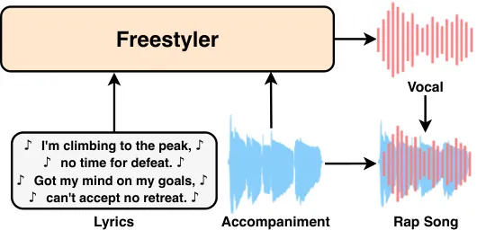
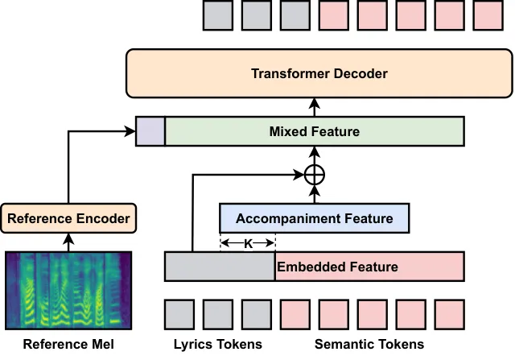
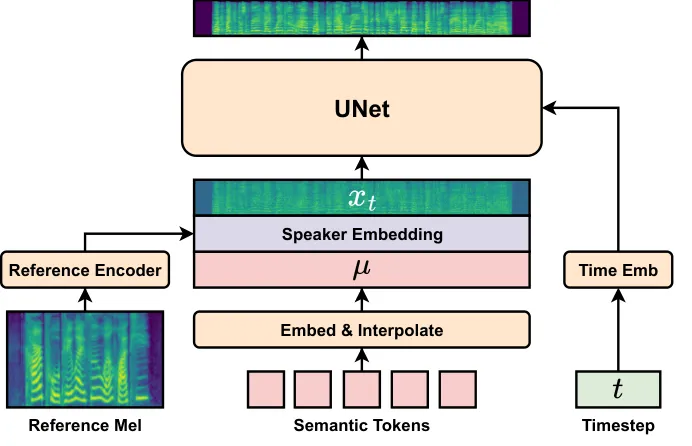
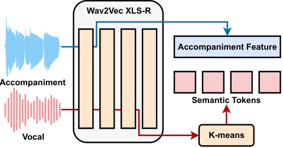
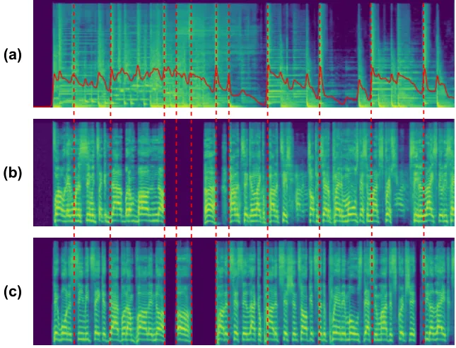
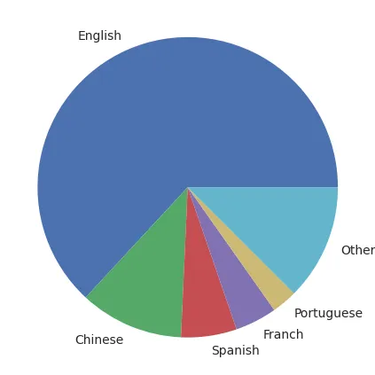
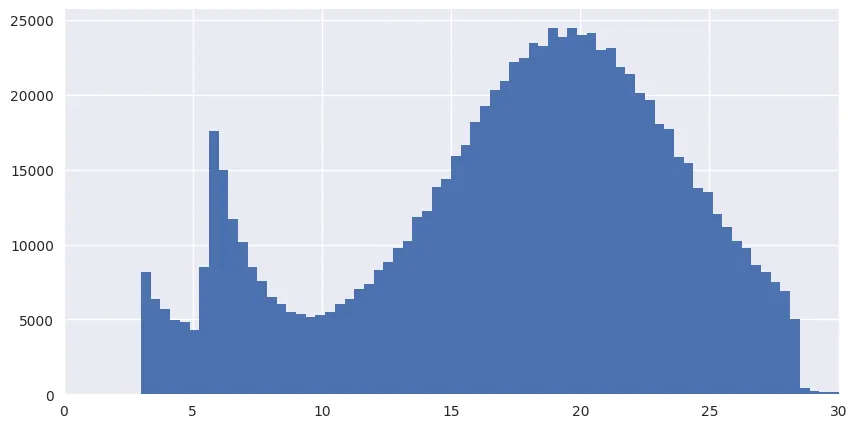
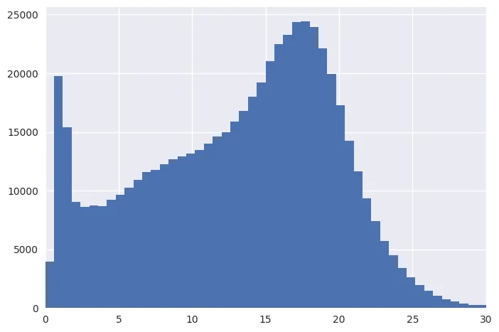
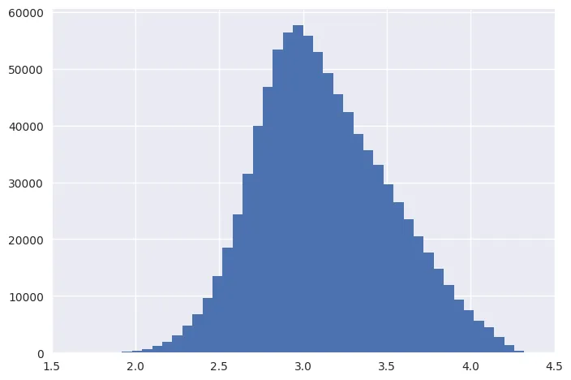
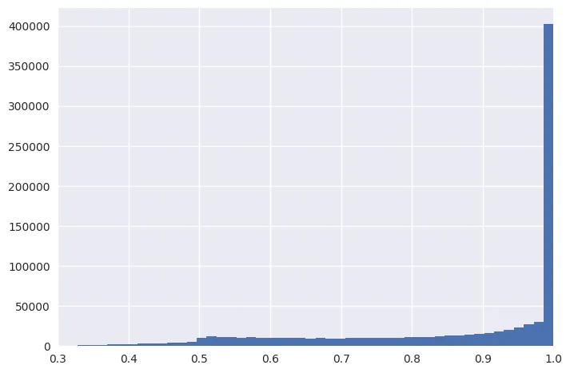

# Drop the beat! Freestyler for Accompaniment Conditioned Rapping Voice Generation

Ziqian Ning    Shuai Wang    Yuepeng Jiang    Jixun Yao    Lei He   
Shifeng Pan    Jie Ding    Lei Xie ^(†)^(†)thanks: Corresponding Author.

###### Abstract

Rap, a prominent genre of vocal performance, remains underexplored in
vocal generation. General vocal synthesis depends on precise note and
duration inputs, requiring users to have related musical knowledge,
which limits flexibility. In contrast, rap typically features simpler
melodies, with a core focus on a strong rhythmic sense that harmonizes
with accompanying beats. In this paper, we propose Freestyler, the first
system that generates rapping vocals directly from lyrics and
accompaniment inputs. Freestyler utilizes language model-based token
generation, followed by a conditional flow matching model to produce
spectrograms and a neural vocoder to restore audio. It allows a 3-second
prompt to enable zero-shot timbre control. Due to the scarcity of
publicly available rap datasets, we also present RapBank, a rap song
dataset collected from the internet, alongside a meticulously designed
processing pipeline. Experimental results show that Freestyler produces
high-quality rapping voice generation with enhanced naturalness and
strong alignment with accompanying beats, both stylistically and
rhythmically.

¹Audio, Speech and Language Processing Group (ASLP@NPU), School of
Computer Science,

Northwestern Polytechnical University, Xi’an, China

² Microsoft, China

³ Shenzhen Research Institute of Big Data,

The Chinese University of Hong Kong, Shenzhen (CUHK-Shenzhen), China

{ningziqian, Jiangyp, yaojx}@mail.nwpu.edu.cn, wangshuai@cuhk.edu.cn,

{helei, peterpan, jie.DING}@microsoft.com, lxie.nwpu.edu.cn

## Introduction

Rap stands out as one of the most distinctive genres of vocal
performance, yet it has received limited attention in the field of vocal
generation. At its core, rap is defined by its emphasis on rhythm and
tempo, distinguishing it markedly from other genres. Rappers typically
deliver rapid, powerful verses that tightly synchronize with the
accompanying beats, creating a dynamic and energetic auditory
experience.



Figure 1: The overall pipeline of Freestyler. With lyrics and
accompaniment as condition, it can generate rapping voice that matches
the style and rhythm of the accompaniment.

Normal singing voice synthesis (SVS) requires lyrics, notes, and
duration as inputs. Given that rap is inherently a freeform performance
style characterized by varied rhythms, predefined rhythms in SVS can
hinder the naturalness of the generation process. In contrast,
Text-to-song (TTSong) offers greater flexibility, generating both vocals
and accompaniment solely from lyrics and style prompts. A typical TTSong
approach involves first creating the vocal track based on the lyrics and
then generating the accompaniment track using natural language prompts
alongside the produced vocals. However, generating rap vocals with only
lyrics condition may compromise the rhythmic integrity. Furthermore, the
limited availability of rap datasets poses an additional challenge in
rapping voice generation. Singing data is much less abundant compared to
large-scale speech datasets, and within this limited pool, rap data is
an even smaller subset. This scarcity of rap data further complicates
the process of generating rapping voices.

In this paper, we present Freestyler, the first rapping voice generation
model capable of generating rap that harmonizes with the style and
rhythm of the accompaniment using only lyrics and accompaniment inputs.
With a 3-second reference audio, it can adapt to any speaker’s voice.
Our approach employs a three-stage framework: lyrics-to-semantic,
semantic-to-spectrogram, and spectrogram-to-audio. To address the
challenge of data scarcity, we use discrete semantic tokens as a proxy
representation so that some parts of the model do not require supervised
data for training. The first stage adopts a language model to predict
discrete semantic tokens conditioned on lyrics and fine-grained
accompaniment features. The second stage applies conditional flow
matching techniques for mel-spectrogram prediction. Finally, a vocoder
restores audio from the spectrogram. Given the lack of publicly
available rap datasets, we collected a large volume of rap songs from
the internet and designed a meticulous pipeline for data cleaning,
processing, and filtering, resulting in a dataset we have named RapBank.

Experiments conducted on our collected rap dataset show that Freestyler
generates high-quality rap that fits the accompaniment. The main
contributions of this work are summarized as follows:

- •
  We propose Freestyler, the first accompanied rapping voice generation
  model that takes lyrics and accompanying music as conditions.
- •
  We present RapBank, a large volume rap dataset with comprehensive
  data-processing pipeline, suitable for model training. Both the data
  and the processing pipeline are publically available on Github¹¹ 1
  https://github.com/NZqian/RapBank.
- •
  We developed a language model that uses accompaniment conditions to
  provide global style control and fine-grained rhythm control of vocal
  production. We also adopt conditional flow matching for high-quality
  mel-spectrogram prediction.
- •
  Experimental results from objective and subjective evaluations
  demonstrate the effectiveness of Freestyler²² 2 Samples:
  https://nzqian.github.io/Freestyler/.

## Related work

### Singing Voice Synthesis

Singing voice synthesis (SVS) aims to generate natural singing voices
based on lyrics, musical scores, and corresponding durations. VISinger
2 (Yu et al. 2024) introduces an end-to-end system utilizing a digital
signal processing (DSP) synthesizer to enhance sound quality.
NaturalSpeech 2 (Shen et al. 2024) and StyleSinger (Zhang et al. 2024a)
employ a reference voice clip for timbre and style extraction, enabling
style transfer and zero-shot synthesis. PromptSinger (Wang et al. 2024)
is the first system to attempt guiding singing voice generation through
text descriptions, placing greater emphasis on speaker identity and
timbre control. DiffSinger (Liu et al. 2022) addresses the issue of
excessive smoothness by implementing a shallow diffusion mechanism. To
bridge the gap between realistic music scores and detailed MIDI
annotations, RMSSinger (He et al. 2023) proposes a word-level modeling
approach combined with diffusion-based pitch prediction.
MIDI-Voice (Byun et al. 2024) incorporates MIDI-based priors for
expressive zero-shot generation. VoiceTuner (Huang et al. 2024)
advocates a self-supervised pre-training and fine-tuning strategy to
mitigate data scarcity, applicable to low-resource SVS tasks. Despite
contributions from open-source singing voice datasets (Wang et al. 2022;
Zhang et al. 2022; Duan et al. 2013), their quantity significantly lags
behind that of speech datasets, and none specifically cater to rap
genres.

### Music Generation

Music generation encompasses various tasks, including symbolic music
generation, lyrics generation, and accompaniment generation.
MuseGAN (Dong et al. 2018) achieves symbolic music generation through a
GAN-based approach. SongMASS (Sheng et al. 2021) designs a method for
songwriting that generates lyrics or melodies conditioned on each other,
while SongComposer (Ding et al. 2024) proposes a large language model
(LLM) for song composition, capable of generating melodies and lyrics
with symbolic song representations. DeepRapper (Xue et al. 2021) focuses
on rap lyrics generation, which also leverages an LLM to generate lyrics
from right to left with rhyme constraints. Inspired by two-stage
modeling in audio generation (Borsos et al. 2023), MusicLM (Agostinelli
et al. 2023) uses a cascade of transformer decoders to sequentially
generate semantic and acoustic tokens, based on joint textual-music
representations from MuLan (Huang et al. 2022). MusicGen (Zhang et al.
2024b) introduces a novel approach with codebook interleaving patterns
to generate music codec tokens in a single transformer decoder, which is
further combined with stack patterns in  Le Lan et al. 2024 to improve
generation quality. Additionally, MeLoDy (Lam et al. 2023) presents an
LM-guided diffusion model that efficiently generates music audio, and
MusicLDM (Chen et al. 2024) incorporates beat-tracking information and
latent mixup data augmentation to address potential plagiarism issues in
music generation. Several works focus specifically on
vocal-to-accompaniment generation, such as SingSong (Li et al. 2024b),
which generates instrumental music to accompany input vocals, and
Melodist (Hong et al. 2024), which utilizes a transformer decoder for
controllable accompaniment generation.

### Text-to-Song

Text-to-song (TTSong), also recognized as Accompanied Singing Voice
Synthesis (ASVS), strives to produce natural singing voices accompanied
by music. TTSong incorporates elements from both singing voice synthesis
and music generation; the former focuses on generating a singing vocal,
while the latter primarily involves music creation. A common methodology
in TTSong employs a two-stage process: initially generating the vocal
track from lyrical input, followed by the prediction of accompanying
music. Melodist (Hong et al. 2024) is the first TTSong model, which
utilizes two autoregressive transformers to sequentially produce vocal
and accompaniment codec tokens, conditioned on lyrics, musical scores,
and natural language prompts. MelodyLM (Li et al. 2024a) eliminates the
need for music scores in Melodist and instead relies solely on textual
descriptions and vocal references.



(a) Lyrics-to-Semantic



(b) Semantic-to-Spectrogram

Figure 2: Overview of Freestyler. The lyrics-to-semantic model in (a)
predicts semantic tokens based on lyrics and accompaniment. The
accompaniment feature is shifted left by $`K`$ frames to provide
additional rhythmic context. The semantic-to-spectrogram model in (b)
generates mel-spectrograms from the semantic tokens, which are
interpolated to align with the spectrogram’s frame rate. Speaker
embedding is provided to both models to control the timbre.

## Freestyler

In this section, we first define the task of accompaniment-conditioned
rapping voice generation. Subsequently, we provide an overview of the
proposed system, Freestyler, followed by a detailed explanation of each
stage within it.

### Task Definition

In this study, we present a novel task: rapping voice generation. This
task entails the creation of rapping voices that are stylistically and
rhythmically synchronized with the accompanying music. It can be
regarded as the inverse of accompaniment generation (Li et al. 2024b),
which generates instrumental music to accompany input vocals

Given the training dataset consisting of rap songs $`R`$ and their
corresponding lyrics $`L`$, we separate $`R`$ into the vocal tracks
$`R_{v}`$ and the accompaniment tracks $`R_{a}`$. A short segment $`C`$
is randomly extracted from $`R_{v}`$ as the reference audio which
presents the rapper’s timbre. The task of rapping voice generation can
be defined as modeling the conditional probability distribution
$`p(R_{v}|R_{a},L,C)`$.

### Overview

To address the challenge of data scarcity, we divide the task of rapping
voice generation into three hierarchical stages: lyrics-to-semantic,
semantic-to-spectrogram, and spectrogram-to-audio. Rather than directly
generating acoustic tokens or mel-spectrograms from lyrics, we employ
semantic tokens derived from K-means clustering on self-supervised
learning (SSL) representations (Kharitonov et al. 2023; Yao et al. 2024)
as a proxy feature to bridge the lyrics-to-semantic and
semantic-to-spectrogram stages. This method offers two primary
advantages. First, semantic tokens are more closely aligned with the
text domain, enabling the first-stage model to be trained using less
annotated data. Second, the subsequent two stages can be trained in an
unsupervised manner by utilizing more unlabeled data. We use a language
model (LM) for the lyrics-to-semantic stage conditioned on lyrics,
accompaniment features, and a 3-second reference audio segment, which
generates discrete semantic tokens. For the semantic-to-spectrogram
stage, we employ a conditional flow matching (CFM) model to transform
the discrete semantic tokens into continuous mel-spectrograms. The
reference audio is also incorporated into the CFM model to complement
the missing timbre information contained in the semantic tokens.
Finally, a pre-trained vocoder is utilized to reconstruct audio from the
spectrogram. The overall model design is illustrated in Figure 2.

### Lyrics-to-Semantic



Figure 3: The extraction process of the accompaniment feature and
semantic tokens. Each block in Wav2Vec XLS-R represents 6 attention
layers, with accompaniment and vocals going through 6 and 18 layers
respectively.

#### Feature Representation and Tokenization

As discussed in Pasad, Chou, and Livescu 2021; Chen et al. 2022,
different layers of SSL models encode different types or extents of
information, with shallower layers capturing more acoustic features and
deeper layers representing more semantic aspects. Therefore, with paired
vocal and accompaniment as inputs, we extract discrete semantic tokens
and continuous accompaniment features using two different layers of an
SSL model. As shown in Figure 3, we utilize a pre-trained Wav2Vec
XLS-R (Conneau et al. 2021) for feature extraction, where the vocal
input is processed through its 18 layers, and the semantic tokens $`S`$
are subsequently obtained using K-means clustering. While the
accompaniment input is passed through 6 layers to derive the
accompaniment features $`A`$. For the lyrics, we employ a
grapheme-to-phoneme (G2P) phonemizer (Bernard and Titeux 2021) to obtain
the lyrics tokens $`L`$.

#### Language Model with Fine-grained Accompaniment Condition

As illustrated in Figure 2a, the generative process of semantic tokens
in Freestyler is formulated as a unidirectional next-token-prediction
task, i.e., in the form of a language model. In the prediction process,
Freestyler relies on lyrics, accompaniment features, and a reference
mel-spectrogram to constrain the generated semantic tokens. More
specifically, initially, the lyrics tokens and semantic tokens are
concatenated and subsequently embedded, which are then summed with the
accompaniment features to produce the mixed feature. However, based on
our experience, if the accompaniment condition is exactly aligned with
the semantic tokens, the generated rap vocal and accompaniment will have
a certain degree of mismatch. We hypothesize this is because the context
information of the accompaniment is quite important, but due to the
current model design which has no access to future information, such
context information cannot be effectively learned. Based on this, we
shift the accompaniment feature left by $`K`$ frames, so that the model
can have the accompaniment information of $`K+t`$ frames when generating
the $`t`$-th frame. Thus we model the following distribution:

```math
p(S)=\prod^{n}_{t=2}p(s_{t}|s_{<t},l,c,a_{<t+K};\theta_{LM}), \tag{1}
```

where $`s`$, $`l`$, $`c`$, and $`a`$ stand for semantic tokens, lyrics
tokens, speaker embedding extracted using a reference encoder, and
acoustic features.

During training, the vocal-accompaniment pairs are of equal length.
However, during inference, the lengths of these two elements may vary.
This mismatch can lead to early termination of the model if the
accompaniment is too short, or result in the generation of hallucinated
content if the accompaniment is excessively long. To address this issue,
we introduce a random mask on the accompaniment condition, thereby
mitigating the strong temporal correlation between these two features.

#### Zero-shot Timbre Control

The predominant zero-shot approaches for TTS or SVS usually involve two
main methods: using voice prompts to leverage the language model’s
in-context learning capabilities, or using a speaker embedding as a
global timbre condition. In Freestyler, the latter approach was adopted.
The rationale behind this choice is that the style of the voice prompt
can significantly influence the final generated speech style. This means
we would need to require the user to provide a rapping segment as the
prompt, which is non-trivial.

On the other hand, the speaker embedding mainly affects the timbre,
while the rapping style is primarily controlled by the accompaniment
features. This ensures we can generate rapping vocals with any target
timbre. In the specific implementation, we propose the use of a
reference encoder to extract a global speaker embedding from a segment
of reference audio. This embedding is then concatenated to the head of
the mixed features for timbre control.

### Semantic-to-Spectrogram

We employ conditional flow matching to map semantic tokens to
mel-spectrograms. Given that semantic tokens lack complete timbre
information due to their discrete nature, we incorporate additional
timbre conditions at this stage. Let $`\boldsymbol{x}`$ denote an
observation in the data space $`\mathbb{R}^{d}`$, sampled from a
complicated, unknown data distribution $`q(\boldsymbol{x})`$. A
probability density path is a time-dependent probability density
function, $`p_{t}:[0,1]\times\mathbb{R}^{d}\rightarrow\mathbb{R}>0`$.
One way to generate samples from the data distribution $`q`$ is to
construct a probability density path $`p_{t}`$, where $`t\in[0,1]`$ and
$`p_{0}(\boldsymbol{x})=\mathcal{N}(\boldsymbol{x};\boldsymbol{0},\boldsymbol{I})`$
is a prior distribution, such that $`p_{1}(\boldsymbol{x})`$
approximates the data distribution $`q(\boldsymbol{x})`$. For example,
CNFs first define a vector field
$`\boldsymbol{v_{t}}:[0,1]\times\mathbb{R}^{d}\rightarrow\mathbb{R}^{d}`$,
which generates the flow
$`\phi_{t}:[0,1]\times\mathbb{R}^{d}\rightarrow\mathbb{R}^{d}`$ through
the ODE

```math
\frac{d}{dt}\phi_{t}(\boldsymbol{x})=\boldsymbol{v}_{t}(\phi_{t}(\boldsymbol{x}));\qquad\phi_{0}(\boldsymbol{x})=\boldsymbol{x}. \tag{2}
```

This generates the path $`p_{t}`$ as the marginal probability
distribution of the data points. We can sample from the approximated
data distribution $`p_{1}`$ by solving the initial value problem in
Eq. 2.

Suppose there exists a known vector field $`\boldsymbol{u_{t}}`$ that
generates a probability path $`p_{t}`$ from $`p_{0}`$ to
$`p_{1}\approx q`$, conditional flow matching considers

```math
\mathcal{L}_{CFM}=\mathbb{E}_{t,q(\boldsymbol{x_{1}}),p_{t}(\boldsymbol{x}|\boldsymbol{x_{1}})}\|\boldsymbol{u_{t}}(\boldsymbol{x}|\boldsymbol{x_{1}})-\boldsymbol{v_{t}}(\boldsymbol{x}|\mu,\hat{c};\theta)\|^{2}. \tag{3}
```

where $`t\sim\mathbb{U}[0,1]`$ and
$`\boldsymbol{v_{t}}(\boldsymbol{x}|\mu,\hat{c};\theta)`$ is a neural
network with parameters $`\theta`$. $`\mu`$ is the embedded and
interpolated semantic tokens and $`\hat{c}`$ is the timbre embedding.
This replaces the intractable marginal probability densities and the
vector field in flow matching loss with conditional probability
densities and conditional vector fields.

As shown in Figure 2b, the conditional flow matching model follows
Matcha-TTS (Mehta et al. 2024) to use U-Net (Rombach et al. 2022)
architecture as the backbone, containing 1D convolutional residual
blocks to downsample and upsample the inputs, with the flow matching
step $`t\in[0,1]`$ embedded as in  Popov et al. 2021. Each residual
block is followed by a Transformer block, whose feedforward nets use
snake beta activations (Lee et al. 2023). Additionally, the speaker
embedding $`\hat{c}`$ is extracted by a reference encoder. Note that the
reference encoder in the LM and CFM do not share parameters.

### Spectrogram-to-audio

We employ the V2 version of BigVGAN (Lee et al. 2023) for audio
restoration. Compared to the V1 version, BigVGAN-V2 is trained using
datasets containing diverse audio types, including speech in multiple
languages, singing, and environmental sounds. Also, the discriminator is
improved with multi-scale sub-band CQT discriminator (Gu et al. 2024)
and multi-scale mel-spectogram loss (Kumar et al. 2023). We found
BigVGAN-V2 exhibits high sound quality and exceptional robustness on
rapping voice.

## RapBank

To the best of our knowledge, there is currently no publicly available
dataset for rapping synthesis. Thus, we created an automatic pipeline to
collect and label a novel dataset, RapBank, for the proposed rapping
synthesis task.

RapBank comprises $`92,371`$ rap songs with a total duration of
$`5,586`$ hours. After segmentation, we produced $`904,548`$ rap clips
with an duration of $`4,353`$ hours, with corresponding lyrics and
various quality-related metrics. The English subset utilized to train
the LM will be presented in the experimental section, while detailed
statistical information about RapBank can be found in the appendix.

#### Data Crawling

Initially, we crawled all available rap-related playlists on YouTube
using the keywords “Rap” and “Hip-hop”. Next, we extracted distinct
video IDs from the playlists and filtered out those with a duration
exceeding ten minutes, as they are unlikely to be songs. Then we
downloaded the videos using their respective IDs and retain only the
audio track. We resampled the audios to 44.1 kHz, and average stereo
mixes to mono.

#### Source Seperation

In the previous step, we collected songs with both vocals and
accompaniments mixed in a single track. As we aim to generate rapping
vocals with accompaniment and lyrics as conditions, the first stage of
data processing involves separating vocals and accompaniment into
different tracks. To accomplish this, we utilized the state-of-the-art
music source separation model, BS-RoFormer (Lu et al. 2024). We first
extract the vocals from the mixed track and subsequently subtract them
from the original track to obtain the pure accompaniment.

#### Segmentation

To ensure the data length is suitable for model training while
eliminating non-speech segments, we employed Voice Activity Detection
(VAD) to segment the separated vocal tracks. We utilized WebRTC Voice
Activity Detector ³³ 3 https://github.com/wiseman/py-webrtcvad to
extract frame-level voice/unvoice labels and subsequently slice the
vocal track into segments containing only vocal sounds. Adjacent
segments are sequentially merged if the unvoice gap between them is less
than three seconds, continuing this process until the total duration
exceeds a specified threshold. This threshold is sampled from a Gaussian
distribution with a mean of 18 seconds to enhance variability in data
lengths. Subsequently, We sliced the accompaniment with the same
timestamp to obtain segments that correspond the vocals.

#### Lyrics Recognition

Another challenge we faced in designing RapBank was that less than
one-tenth of the songs we collected contained lyrics. Additionally,
issues such as unclean textual content and inaccurate timestamps made
these data difficult to be used directly for model training. Thus we
employ the powerful automatic speech recognition (ASR) model
Whisper (Radford et al. 2023) to transcribe the lyrics. As Whisper is
trained with speech data, the word error rate (WER) of resulting lyrics
is significantly higher than speech. The recognition errors can be
categorized into two types. The first type involves misrecognition
resulting from words with similar pronunciations, which has minimal
impact on model training. The second type involves hallucinations, where
the model produces phrases or sentences that do not exist in any form
within the input audio. Hallucinations often lead to an abnormal singing
tempo; therefore, we can filter these results based on the singing
tempo, which will be discussed in the following section.

#### Quality Filtering

Given the prevalence of digital effects and multi-singer scenarios in
songs, we adopt several quality-related metrics apply filtering to
ensure the quality of the final processed rap data. Following Ma et al.
2024, we further devide the dataset into three subsets with increasing
quality—Basic, Standard, and Premium—utilizing these metrics for
multi-stage training. Specifically, we utilize a diarization model ⁴⁴ 4
https://github.com/pyannote/pyannote-audio to calculate the singing
duration for each singer and identify the individual with the longest
singing duration as the primary singer. Subsequently, we exclude all
segments where the primary singer’s duration does not occupy the
majority, i.e., less than 80% (can vary for different subsets) of the
total duration. We extract phonemes from the lyrics and compute the
phoneme-per-second (PPS) rate, which reflects the tempo of the singing
voice. Segments with a PPS rate that are either too low or too high are
discarded, as most lyrics associated with these segments exhibit
hallucinations. To eliminate low-quality speech segments, we use the
DNSMOS P.808 scores (Reddy, Gopal, and Cutler 2021) to evaluate each rap
segment.

## Experimental Setup

[TABLE]

Table 1: Objective and subjective evaluation of vocals generated by
Freestyler, including different configurations of whether accompaniment
conditions are used in the training and inference stage

### Dataset

We utilize the English subset of RapBank to train the LM, which contains
approximately $`58,200`$ songs with a total duration of 3,800 hours.
After processing, we get the Basic, Standard and Premium subsets
containing $`1,321`$, $`295`$ and $`58`$ hours of data respectively. We
employ the entire RapBank to train the CFM model as it does not require
any labels. We randomly reserved 200 samples for evaluation, with no
singer overlapping with the training set. These samples are
human-annotated to get the ground truth lyrics.

### Implementation and Hyperparameters

We build a 6-layer LLaMA (Touvron et al. 2023) for lyrics-to-semantic
modeling, with 116M parameters. As mentioned earlier, to mitigate the
train-inference mismatch of lengths in vocal-accompaniment pairs, a
masking strategy is applied probabilistically—there is a $`50\%`$ chance
that the entire accompaniment condition will be masked, and for the
other $`50\%`$ chance, a mask will be applied to a random length of the
latter half of the accompaniment. We first pre-train the LLaMA model on
the Basic subset, followed by sequential supervised finetuning (SFT) on
both the Standard and Premium subsets. We train the LLaMA model using
$`4`$ NVIDIA V100 GPUs with a batch size of $`16`$ and gradient
accumulation of $`4`$. The conditional flow matching model for
semantic-to-spectrogram generation contains 129M parameters and is also
trained using $`4`$ NVIDIA V100 GPUs. The batch size and gradient
accumulation are $`64`$ and $`4`$, respectively. Each data segment is
fixed at ten seconds in length, with shorter segments being padded and
longer segments truncated. The sample steps is set to $`20`$. For audio
restoration, we employ the pre-trained BigVGAN-V2 $`44.1`$ kHz version⁵⁵
5 https://github.com/NVIDIA/BigVGAN. The number of K-means clusters is
set to $`1024`$, and the accompaniment feature shift $`K`$ is set to
$`150`$ (3 secs).

### Evaluation Metrics

#### Subjective Metrics

We employ mean opinion score (MOS) with $`95\%`$ confidence intervals to
evaluate multiple aspects of the generated rapping voice, including
overall naturalness (MOS-N), singer similarity (MOS-S), vocal
rhythmicity (MOS-R) and the stylistic and rhythmic alignment between
vocals and acompaniment (MOS-M). The MOS scores are obtained by
crowd-sourced listening tests, with 20 listeners involved. Each listener
is instructed to evaluate the samples on a 5-point scale: 1 - bad, 2 -
poor, 3 - fair, 4 - good, and 5 - excellent.

#### Objective Metrics

We employ word error rate (WER) to measure intelligibility and speaker
cosine similarity (SECS) to assess the timbre similarity, respectively.
Specifically, we utilized the large-v3 version of Whisper⁶⁶ 6
https://github.com/openai/whisper to transcribe the generated rapping
voice and calculate WER by comparing it to the human-annotated lyrics.
For SECS measurement, we use WavLM-large fine-tuned on the speaker
verification task⁷⁷ 7 https://github.com/BytedanceSpeech/seed-tts-eval
to obtain speaker embeddings. These embeddings are then used to
calculate the cosine similarity of generated rap against reference
audio. Furthermore, we measure the overall quality of the rap using
Fréchet Audio Distance (FAD) calculated using CLAP (Wu et al. 2023), and
employ Kullback–Leibler Divergence (KLD) and CLAP cosine similarity (Li
et al. 2024a) to evaluate the distribution similairty and semantic
correlation between real and generated rap.

| Model       | MOS-N$`\uparrow`$ | MOS-M$`\uparrow`$ | FAD$`\downarrow`$ | KLD$`\downarrow`$ | CLAP$`\uparrow`$ | WER$`\downarrow`$ |
| ----------- | ----------------- | ----------------- | ----------------- | ----------------- | ---------------- | ----------------- |
| GT          | 4.35$`\pm 0.04`$  | 4.21$`\pm 0.06`$  | 0.07              | 0.01              | 0.90             | 31.7              |
| GT Rand Mix | 3.23$`\pm 0.05`$  | 3.06$`\pm 0.03`$  | 0.16              | 0.33              | 0.45             | 31.7              |
| Freestyler  | 3.88$`\pm 0.07`$  | 3.84$`\pm 0.06`$  | 0.10              | 0.20              | 0.60             | 33.2              |
|    w/o Acco | 3.62$`\pm 0.06`$  | 3.19$`\pm 0.04`$  | 0.16              | 0.23              | 0.57             | 32.6              |
|    w/o SFT  | 3.80$`\pm 0.05`$  | 3.78$`\pm 0.07`$  | 0.12              | 0.20              | 0.58             | 34.4              |
|    w/o Mask | 3.35$`\pm 0.05`$  | 3.42$`\pm 0.05`$  | 0.39              | 0.21              | 0.48             | 56.1              |

Table 2: Objective and Subjective evaluation of rapping vocals mixed
with accompaniments generated by Freestyler and ablation models. ”w/o
Acco” means model trained without accompaniment. ”w/o SFT” means remove
supervised finetuning and ”w/o Mask” means remove random masking on
accompaniment condition.

## Evaluation Results

### Vocal Quality Evaluation

In this section, we assess the vocal generation capabilities of
Freestyler, focusing on naturalness, rhythmicity, and intelligibility.
We compare these metrics between the ground truth (GT) vocals and three
distinct configurations of Freestyler. By employing random masking on
accompaniment conditions during training, Freestyler is capable of
operating with or without accompaniment during the inference stage.
Furthermore, we conduct an ablation study to evaluate Freestyler in the
absence of the accompaniment condition during both training and
inference. The evaluation results are presented in Table 1.

The results demonstrate that Freestyler performs comparably to the GT
across all metrics, highlighting its impressive capabilities in rapping
voice generation. Notably, the naturalness and rhythmicity of the
generated raps were significantly reduced when the accompaniment
condition was excluded from both the training and inference stages,
emphasizing the necessity of incorporating this condition. Furthermore,
when the accompaniment is included during training but omitted during
inference, the performance still exceeds that of scenarios where the
accompaniment is excluded from both stages. This finding suggests that
the model learns the rhythmic correlation between lyrics and the
accompaniment when the latter is utilized in training, thereby enhancing
performance even in lyrics-only inference.

Compared to normal speech, the WER across all models, including GT, is
notably high, primarily due to Whisper’s lack of training on singing
data. The rapid tempo of rap, characterized by numerous conjunctions and
varying intonations, presents significant challenges to Whisper’s
recognition accuracy. However, these models have similar WERs,
suggesting that they achieve a level of intelligibility comparable to
that of the ground truth.

### Accompaniment-mixed Rap Evaluation

In this section, we further investigate rapping vocals accompanied by
music. By utilizing segments from actual rap songs as the topline, we
randomly select and mix unpaired vocals and accompaniment from our test
set to serve as the bottomline. This setup allows us to examine the
impact of stylistic and rhythmic mismatches on various metrics. As shown
in Table 2, the randomly mixed ground truth samples received the lowest
scores, demonstrating the importance of style and rhythm alignment
between vocals and accompaniment for natural rap performance.
Conversely, Freestyler achieved scores comparable to GT, demonstrating
its capability to generate natural-sounding raps. We also conducted
experiments with three ablation systems: 1) removal of the accompaniment
condition (w/o Acco); 2) removal of supervised finetuning (w/o SFT); and 3) removal of random masking (w/o Mask). The exclusion of the
accompaniment condition resulted in a significant reduction in
synchronization between vocals and accompaniment, leading to an overall
decrease in perceived naturalness. The removal of SFT caused a slight
decline in total metrics. Notably, the absence of random masking had the
most pronounced effect, markedly reducing both naturalness and
synchronization while causing a dramatic increase in word error rate
(WER). This phenomenon arises because, in the absence of random masking,
results in substantial mismatches between training and inferencing. If
the lyrics do not conclude by the time the accompaniment ends, the model
terminates prematurely; conversely, if the lyrics finish before the
accompaniment is complete, the model generates nonsensical outputs, thus
leading to the elevated WER metrics observed.

### Zero-shot Evaluation

As previously discussed, the timbre within semantic tokens is
incomplete. Therefore, we introduce reference audio conditions in both
the lyrics-to-semantic and semantic-to-spectrogram stages. To assess the
impact of reference audio conditions on speaker similarity across these
stages, we examine three different combinations. The speaker similarity
metrics presented in Table 3 demonstrate that: 1) Freestyler, which
employs reference audio input in both stages, achieves a MOS-S score of
3.86 and a SECS score of 0.69, indicating a high degree of speaker
similarity in the rapping voice generated by our proposed system; 2) The
implementation of a single-stage timbre condition, whether in the first
or second stage, results in a significant decline in similarity, thereby
supporting our hypothesis that semantic tokens do not convey complete
timbral information.

Additionally, we conducted experiments using speech instead of rap as
the reference audio, enabling non-expert individuals to perform rap. As
shown in the last row of the table, a satisfactory level of subjective
similarity is achieved, illustrating Freestyler’s remarkable
generalization ability of zero-shot timbre control. However, the
objective metric is low, probably due to the model we employed to
compute SECS has never seen such a difference in style from the same
speaker during training, resulting in low SECS score.

[TABLE]

Table 3: Speaker similarity comparison results of different reference
types with various condition methods.

### Vocal-Accompaniment Alignment Visualization

To visualize the rhythmic correlation between the vocals and
accompanying music rap songs, we analyzed both the ground truth and
synthesized rap. As illustrated in Figure 5, the spectrograms of the
ground truth accompaniment and vocals, along with the synthesized
vocals, are presented sequentially. We manually annotated the positions
of the beats in the accompaniment by drawing vertical lines across all
three spectrograms. The results indicate that both the ground truth and
generated vocals exhibit a strong correlation with the rhythm of the
accompaniment, predominantly aligning with the beat positions. As the
model does not have duration conditions and generates vocals freely, the
synthesized vocals do not precisely match the ground truth. However,
they demonstrate a similar pattern of alignment with the accompaniment.
This finding underscores Freestyler’s ability to utilize the
accompaniment as a condition for generating rhythmically aligned rap.



Figure 4: The spectrogram of (a) GT accompaniment, (b) GT vocal and (c)
Freestyler-generated vocal. Vertical lines are human-annotated beat
positions in the accompaniment. The energy of the GT accompaniment is
also drawn in (a).

## Conclusion

In this paper, we propose Freestyler, the first rapping voice generation
model that synthesizes high-quality rap vocals with enhanced naturalness
and strong stylistic and rhythmic alignment with accompanying beats.
Conditioned on fine-grained accompaniment features, Freestyler first
generates semantic tokens through an autoregressive language model.
Next, these tokens are converted to spectrograms using a conditional
flow matching model, and the spectrograms are mapped to audios with a
neural vocoder. Additionally, we have developed an automatic pipeline to
collect a large-scale rap dataset, which will be made publicly available
along with the pipeline. Experimental results demonstrated the
effectiveness of our proposed model structure and the strong rapping
voice generation capability of Freestyler.

## References

- Agostinelli et al. (2023) Agostinelli, A.; Denk, T. I.; Borsos, Z.;
  Engel, J. H.; Verzetti, M.; Caillon, A.; Huang, Q.; Jansen, A.;
  Roberts, A.; Tagliasacchi, M.; Sharifi, M.; Zeghidour, N.; and Frank,
  C. H. 2023. MusicLM: Generating Music From Text. _CoRR_,
  abs/2301.11325.
- Bernard and Titeux (2021) Bernard, M.; and Titeux, H. 2021.
  Phonemizer: Text to Phones Transcription for Multiple Languages in
  Python. _Journal of Open Source Software_, 6: 3958.
- Borsos et al. (2023) Borsos, Z.; Marinier, R.; Vincent, D.;
  Kharitonov, E.; Pietquin, O.; Sharifi, M.; Roblek, D.; Teboul, O.;
  Grangier, D.; Tagliasacchi, M.; and Zeghidour, N. 2023. AudioLM: A
  Language Modeling Approach to Audio Generation. _IEEE ACM Trans. Audio
  Speech Lang. Process._, 31: 2523–2533.
- Byun et al. (2024) Byun, D.-M.; Lee, S.-H.; Hwang, J.-S.; and Lee,
  S.-W. 2024. Midi-Voice: Expressive Zero-Shot Singing Voice Synthesis
  via Midi-Driven Priors. In _Proc. ICASSP_, 12622–12626. IEEE.
- Chen et al. (2024) Chen, K.; Wu, Y.; Liu, H.; Nezhurina, M.;
  Berg-Kirkpatrick, T.; and Dubnov, S. 2024. Musicldm: Enhancing novelty
  in text-to-music generation using beat-synchronous mixup strategies.
  In _Proc. ICASSP_, 1206–1210.
- Chen et al. (2022) Chen, S.; Wang, C.; Chen, Z.; Wu, Y.; Liu, S.;
  Chen, Z.; Li, J.; Kanda, N.; Yoshioka, T.; Xiao, X.; Wu, J.; Zhou, L.;
  Ren, S.; Qian, Y.; Qian, Y.; Wu, J.; Zeng, M.; Yu, X.; and
  Wei, F. 2022. WavLM: Large-Scale Self-Supervised Pre-Training for Full
  Stack Speech Processing. _IEEE J. Sel. Top. Signal Process._, 16(6):
  1505–1518.
- Conneau et al. (2021) Conneau, A.; Baevski, A.; Collobert, R.;
  Mohamed, A.; and Auli, M. 2021. Unsupervised Cross-Lingual
  Representation Learning for Speech Recognition. In Hermansky, H.;
  Cernocký, H.; Burget, L.; Lamel, L.; Scharenborg, O.; and Motlícek,
  P., eds., _Proc. Interspeech_, 2426–2430.
- Ding et al. (2024) Ding, S.; Liu, Z.; Dong, X.; Zhang, P.; Qian, R.;
  He, C.; Lin, D.; and Wang, J. 2024. SongComposer: A Large Language
  Model for Lyric and Melody Composition in Song Generation. _CoRR_,
  abs/2402.17645.
- Dong et al. (2018) Dong, H.; Hsiao, W.; Yang, L.; and Yang, Y. 2018.
  MuseGAN: Multi-track Sequential Generative Adversarial Networks for
  Symbolic Music Generation and Accompaniment. In _Proc. AAAI_, 34–41.
- Duan et al. (2013) Duan, Z.; Fang, H.; Li, B.; Sim, K. C.; and
  Wang, Y. 2013. The NUS sung and spoken lyrics corpus: A quantitative
  comparison of singing and speech. In _Proc. APSIPA_, 1–9.
- Gu et al. (2024) Gu, Y.; Zhang, X.; Xue, L.; and Wu, Z. 2024.
  Multi-Scale Sub-Band Constant-Q Transform Discriminator for
  High-Fidelity Vocoder. In _Proc. ICASSP_, 10616–10620.
- He et al. (2023) He, J.; Liu, J.; Ye, Z.; Huang, R.; Cui, C.; Liu, H.;
  and Zhao, Z. 2023. RMSSinger: Realistic-Music-Score based Singing
  Voice Synthesis. In _Proc. ACL_, 236–248.
- Hong et al. (2024) Hong, Z.; Huang, R.; Cheng, X.; Wang, Y.; Li, R.;
  You, F.; Zhao, Z.; and Zhang, Z. 2024. Text-to-Song: Towards
  Controllable Music Generation Incorporating Vocals and Accompaniment.
  _CoRR_, abs/2404.09313.
- Huang et al. (2022) Huang, Q.; Jansen, A.; Lee, J.; Ganti, R.; Li,
  J. Y.; and Ellis, D. P. W. 2022. MuLan: A Joint Embedding of Music
  Audio and Natural Language. In Rao, P.; Murthy, H. A.;
  Srinivasamurthy, A.; Bittner, R. M.; Repetto, R. C.; Goto, M.; Serra,
  X.; and Miron, M., eds., _Proc. ISMIR_, 559–566.
- Huang et al. (2024) Huang, R.; Wang, Y.; Hu, R.; Xu, X.; Hong, Z.;
  Yang, D.; Cheng, X.; Wang, Z.; Jiang, Z.; Ye, Z.; et al. 2024.
  VoiceTuner: Self-Supervised Pre-training and Efficient Fine-tuning For
  Voice Generation. In _ACM Multimedia 2024_.
- Kharitonov et al. (2023) Kharitonov, E.; Vincent, D.; Borsos, Z.;
  Marinier, R.; Girgin, S.; Pietquin, O.; Sharifi, M.; Tagliasacchi, M.;
  and Zeghidour, N. 2023. Speak, Read and Prompt: High-Fidelity
  Text-to-Speech with Minimal Supervision. _Trans. Assoc. Comput.
  Linguistics_, 11: 1703–1718.
- Kumar et al. (2023) Kumar, R.; Seetharaman, P.; Luebs, A.; Kumar, I.;
  and Kumar, K. 2023. High-Fidelity Audio Compression with Improved
  RVQGAN. In _Proc. NeurIPS_.
- Lam et al. (2023) Lam, M. W. Y.; Tian, Q.; Li, T.; Yin, Z.; Feng, S.;
  Tu, M.; Ji, Y.; Xia, R.; Ma, M.; Song, X.; Chen, J.; Wang, Y.; and
  Wang, Y. 2023. Efficient Neural Music Generation. In Oh, A.; Naumann,
  T.; Globerson, A.; Saenko, K.; Hardt, M.; and Levine, S., eds., _Proc.
  NeurIPS_.
- Le Lan et al. (2024) Le Lan, G.; Nagaraja, V.; Chang, E.; Kant, D.;
  Ni, Z.; Shi, Y.; Iandola, F.; and Chandra, V. 2024. Stack-and-delay: a
  new codebook pattern for music generation. In _Proc. ICASSP_, 796–800.
- Lee et al. (2023) Lee, S.; Ping, W.; Ginsburg, B.; Catanzaro, B.; and
  Yoon, S. 2023. BigVGAN: A Universal Neural Vocoder with Large-Scale
  Training. In _Proc. ICLR_.
- Li et al. (2024a) Li, R.; Hong, Z.; Wang, Y.; Zhang, L.; Huang, R.;
  Zheng, S.; and Zhao, Z. 2024a. Accompanied Singing Voice Synthesis
  with Fully Text-controlled Melody. _CoRR_, abs/2407.02049.
- Li et al. (2024b) Li, S.; Liu, S.; Ma, L.; and Xing, C. 2024b.
  Asymptotic construction of locally repairable codes with multiple
  recovering sets. _CoRR_, abs/2402.09898.
- Liu et al. (2022) Liu, J.; Li, C.; Ren, Y.; Chen, F.; and
  Zhao, Z. 2022. DiffSinger: Singing Voice Synthesis via Shallow
  Diffusion Mechanism. In _Proc. AAAI_, 11020–11028.
- Lu et al. (2024) Lu, W. T.; Wang, J.; Kong, Q.; and Hung, Y. 2024.
  Music Source Separation With Band-Split Rope Transformer. In _Proc.
  ICASSP_, 481–485.
- Ma et al. (2024) Ma, L.; Guo, D.; Song, K.; Jiang, Y.; Wang, S.; Xue,
  L.; Xu, W.; Zhao, H.; Zhang, B.; and Xie, L. 2024. WenetSpeech4TTS: A
  12,800-hour Mandarin TTS Corpus for Large Speech Generation Model
  Benchmark. _CoRR_, abs/2406.05763.
- Mehta et al. (2024) Mehta, S.; Tu, R.; Beskow, J.; Székely, É.; and
  Henter, G. E. 2024. Matcha-TTS: A fast TTS architecture with
  conditional flow matching. In _Proc. ICASSP_, 11341–11345.
- Pasad, Chou, and Livescu (2021) Pasad, A.; Chou, J.; and
  Livescu, K. 2021. Layer-Wise Analysis of a Self-Supervised Speech
  Representation Model. In _Proc. ASRU_, 914–921.
- Popov et al. (2021) Popov, V.; Vovk, I.; Gogoryan, V.; Sadekova, T.;
  and Kudinov, M. A. 2021. Grad-TTS: A Diffusion Probabilistic Model for
  Text-to-Speech. In _Proc. ICML_, volume 139, 8599–8608.
- Radford et al. (2023) Radford, A.; Kim, J. W.; Xu, T.; Brockman, G.;
  McLeavey, C.; and Sutskever, I. 2023. Robust Speech Recognition via
  Large-Scale Weak Supervision. In _Proc. ICML_, volume 202,
  28492–28518.
- Reddy, Gopal, and Cutler (2021) Reddy, C. K. A.; Gopal, V.; and
  Cutler, R. 2021. Dnsmos: A Non-Intrusive Perceptual Objective Speech
  Quality Metric to Evaluate Noise Suppressors. In _Proc. ICASSP_,
  6493–6497.
- Rombach et al. (2022) Rombach, R.; Blattmann, A.; Lorenz, D.; Esser,
  P.; and Ommer, B. 2022. High-Resolution Image Synthesis with Latent
  Diffusion Models. In _Proc. CVPR_, 10674–10685.
- Shen et al. (2024) Shen, K.; Ju, Z.; Tan, X.; Liu, E.; Leng, Y.; He,
  L.; Qin, T.; Zhao, S.; and Bian, J. 2024. NaturalSpeech 2: Latent
  Diffusion Models are Natural and Zero-Shot Speech and Singing
  Synthesizers. In _Proc. ICLR_.
- Sheng et al. (2021) Sheng, Z.; Song, K.; Tan, X.; Ren, Y.; Ye, W.;
  Zhang, S.; and Qin, T. 2021. SongMASS: Automatic Song Writing with
  Pre-training and Alignment Constraint. In _Proc. AAAI_, 13798–13805.
- Touvron et al. (2023) Touvron, H.; Lavril, T.; Izacard, G.; Martinet,
  X.; Lachaux, M.; Lacroix, T.; Rozière, B.; Goyal, N.; Hambro, E.;
  Azhar, F.; Rodriguez, A.; Joulin, A.; Grave, E.; and Lample, G. 2023.
  LLaMA: Open and Efficient Foundation Language Models. _CoRR_,
  abs/2302.13971.
- Wang et al. (2024) Wang, Y.; Hu, R.; Huang, R.; Hong, Z.; Li, R.; Liu,
  W.; You, F.; Jin, T.; and Zhao, Z. 2024. Prompt-Singer: Controllable
  Singing-Voice-Synthesis with Natural Language Prompt. _CoRR_,
  abs/2403.11780.
- Wang et al. (2022) Wang, Y.; Wang, X.; Zhu, P.; Wu, J.; Li, H.; Xue,
  H.; Zhang, Y.; Xie, L.; and Bi, M. 2022. Opencpop: A High-Quality Open
  Source Chinese Popular Song Corpus for Singing Voice Synthesis. In
  _Proc. Interspeech_, 4242–4246.
- Wu et al. (2023) Wu, Y.; Chen, K.; Zhang, T.; Hui, Y.;
  Berg-Kirkpatrick, T.; and Dubnov, S. 2023. Large-Scale Contrastive
  Language-Audio Pretraining with Feature Fusion and Keyword-to-Caption
  Augmentation. In _Proc. ICASSP_, 1–5.
- Xue et al. (2021) Xue, L.; Song, K.; Wu, D.; Tan, X.; Zhang, N. L.;
  Qin, T.; Zhang, W.; and Liu, T. 2021. DeepRapper: Neural Rap
  Generation with Rhyme and Rhythm Modeling. In Zong, C.; Xia, F.; Li,
  W.; and Navigli, R., eds., _Proc. ACL/IJCNLP_, 69–81.
- Yao et al. (2024) Yao, J.; Yang, Y.; Lei, Y.; Ning, Z.; Hu, Y.; Pan,
  Y.; Yin, J.; Zhou, H.; Lu, H.; and Xie, L. 2024. Promptvc: Flexible
  stylistic voice conversion in latent space driven by natural language
  prompts. In _Proc. ICASSP_, 10571–10575.
- Yu et al. (2024) Yu, Y.; Shi, J.; Wu, Y.; and Watanabe, S. 2024.
  VISinger2+: End-to-End Singing Voice Synthesis Augmented by
  Self-Supervised Learning Representation. _CoRR_, abs/2406.08761.
- Zhang et al. (2022) Zhang, L.; Li, R.; Wang, S.; Deng, L.; Liu, J.;
  Ren, Y.; He, J.; Huang, R.; Zhu, J.; Chen, X.; and Zhao, Z. 2022.
  M4Singer: A Multi-Style, Multi-Singer and Musical Score Provided
  Mandarin Singing Corpus. In _Proc. NeurIPS_.
- Zhang et al. (2024a) Zhang, Y.; Huang, R.; Li, R.; He, J.; Xia, Y.;
  Chen, F.; Duan, X.; Huai, B.; and Zhao, Z. 2024a. StyleSinger: Style
  Transfer for Out-of-Domain Singing Voice Synthesis. In _Proc. AAAI_,
  19597–19605.
- Zhang et al. (2024b) Zhang, Y.; Ikemiya, Y.; Choi, W.; Murata, N.;
  Ramírez, M. A. M.; Lin, L.; Xia, G.; Liao, W.; Mitsufuji, Y.; and
  Dixon, S. 2024b. Instruct-MusicGen: Unlocking Text-to-Music Editing
  for Music Language Models via Instruction Tuning. _CoRR_,
  abs/2405.18386.

## Appendix A Dataset

### Statistics

In this section, we present the statistics of RapBank. The RapBank
dataset comprises links to a total of $`94,164`$ songs. However, due to
the unavailability of certain videos, we successfully downloaded
$`92,371`$ songs, amounting to $`5,586`$ hours of content, with an
average duration of $`218`$ seconds per song. These songs span $`84`$
different languages. The Figure 5a illustrates the top five languages
based on the total hours of content. English has the highest duration,
totaling 3,830 hours, which constitutes approximately two-thirds of the
overall duration. We also utilize the English subset for training the
language model in our experiments.



(a) Language



(b) Duration

Figure 5: The distribution of language and duration of RapBank

As detailed in the main text, we merge the adjacent VAD-segmented data
using a threshold sampled from a normal distribution with a mean of
$`18`$ seconds. Segments with a duration of less than 3 seconds are
discarded. As illustrated in Figure 5b, the durations of the resulting
segments correspond with our expectation of a normal distribution with a
mean value of $`17.4`$ seconds. After the separation and segmentation
process, we obtained $`904,548`$ rap segments, totaling $`4,353`$ hours.
Subsequently, we computed several quality-related metrics, including
phone-per-second (PPS), DNSMOS, and the primary singer percentage. As
depicted in Figure 6a, segments with lower PPS values contain an
unusually high amount of data, which typically indicates hallucinations
where the ASR model misrecognizes a long rap segment as a few words. In
other cases, due to the fast tempo of rap, a lower PPS may mean that the
segment is not rap. The DNSMOS scores presented in Figure 6b also
conform to a normal distribution. Although the DNSMOS scores for rap are
generally lower than those for speech, their relative values still
provide a basis for evaluating rap quality. Regarding the multi-singer
scenario, as shown in Figure 6c, most of the data did not feature
multiple singers, and we filtered out segments with an insufficient
primary singer percentage.

|            |                   |                  |        |
| ---------- | ----------------- | ---------------- | ------ |
| Freestyler | Hyperparameter    |                  | Params |
| Stage 1    | Layers            | 6                | 116 M  |
|            | Hidden Dim        | 1024             |        |
|            | Intermediate Dim  | 4096             |        |
|            | Attention Heads   | 16               |        |
|            | Speaker Dim       | 64               |        |
| Stage 2    | Down/Up Blocks    | 2                | 129 M  |
|            | Mid Blocks        | 2                |        |
|            | Input Dim         | 320              |        |
|            | Intermediate Dim  | 768              |        |
|            | Output Dim        | 128              |        |
|            | Speaker Dim       | 64               |        |
| Stage 3    | Sampling Rate     | 44.1 kHz         | 122 M  |
|            | Upsampling Blocks | 6                |        |
|            | Upsampling Rate   | 8, 4, 2, 2, 2, 2 |        |

Table 4: Hyperparameters of Freestyler.

### Subset

We focused exclusively on the English language in RapBank for further
analysis due to the high prevalence of hallucinations in lyrics from
other languages. Processing of other languages will be addressed in
future work. Utilizing the quality-related metrics described above, we
established different thresholds to filter and categorize the data into
three subsets of increasing quality: Basic, Standard, and Premium. As
presented in Table 5, the three subsets have durations of $`1,322`$
hours, $`295`$ hours, and $`58`$ hours, respectively. The average
segment duration across all three subsets is approximately $`18`$
seconds, indicating no significant correlation between duration and
quality.



(a) Phone-per-second



(b) DNSMOS



(c) Primary Singer Percentage

Figure 6: Quality Metrics

[TABLE]

Table 5: Thresholds for segmenting subsets and durations for RapBank and
each subset

## Appendix B Model Archietechtures

In this section, we provide the details of each of three stages of
Freestyler. The architecture and hyperparameters are shown in Table 4.

### lyrics-to-semantic

The backbone of lyrics-to-semantic is a LLaMA language model, featuring
$`6`$ attention blocks. The hidden dimensions and intermediate
dimensions are set to $`1024`$ and $`4096`$, respectively. It uses
$`16`$ attention heads, each with $`64`$ dimensions. The reference
encoder is composed of multiple linear layers with activation functions
and concludes with an attention layer that does not use positional
embeddings. An average pooling layer is applied along the time axis to
obtain a global speaker embedding with 64 dimensions.

### semantic-to-spectrogram

We use a UNet-based conditional flow matching model for
semantic-to-spectrogram modeling. The UNet architecture includes $`6`$
blocks: $`2`$ downsampling blocks, $`2`$ middle blocks, and $`2`$
upsampling blocks. The input dimension is $`320`$, which comprises the
sum of mel channels multiplied by $`2`$ plus a 64-dimensional speaker
embedding. The intermediate dimension is $`768`$, and the output
dimension is $`128`$, corresponding to the mel dimension. The reference
encoder has the same structure as the lyrics-to-semantic model but does
not share parameters.

### spectrogram-to-audio

We employ the $`44.1`$ kHz version of BigVGAN-V2 to restore audio from
mel-spectrogram. The model comprises $`6`$ upsampling blocks, with
upsampling rates multiplied to $`512`$, corresponding to $`86.1`$ frames
per second. It does not require any fine-tuning to perform effectively
on rap music as it is trained using datasets containing diverse audio
types.
