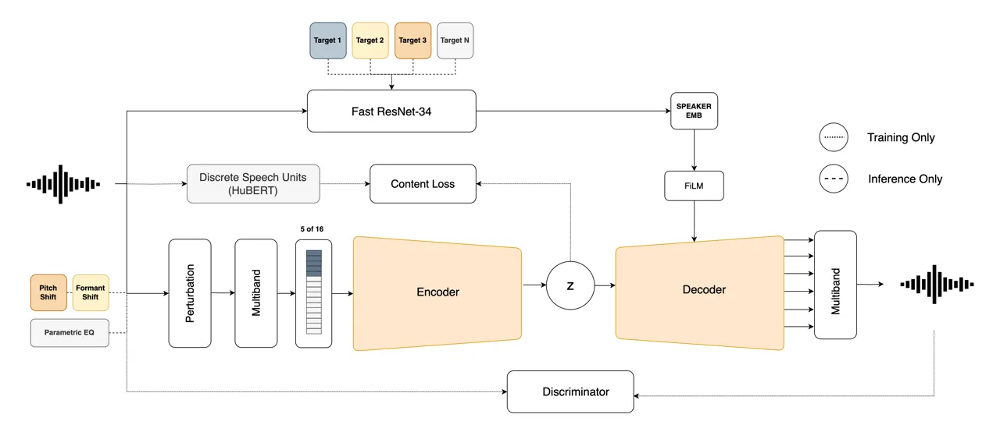
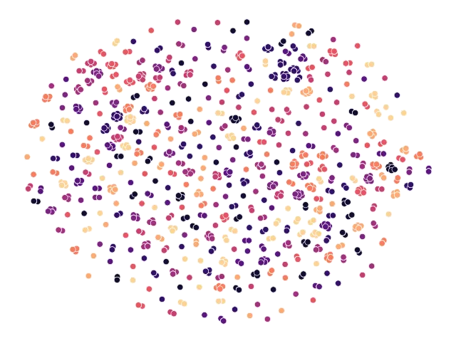
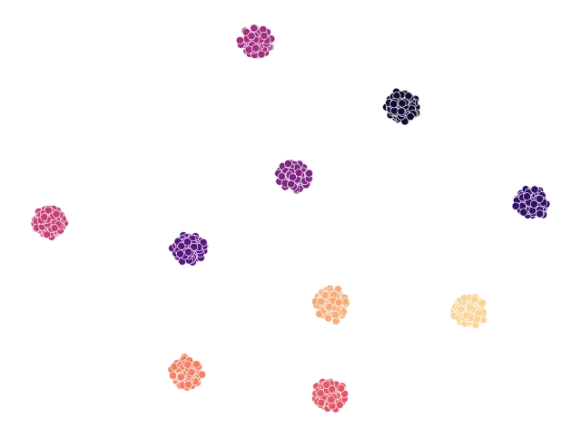
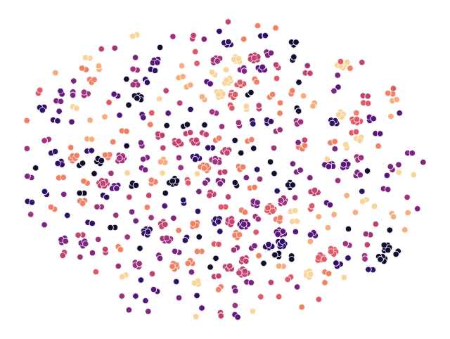
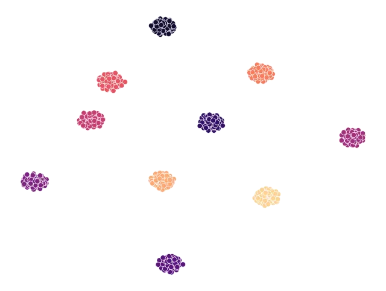

# RAVE for Speech: Efficient Voice Conversion at High Sampling Rates

###### Abstract

Voice conversion has gained increasing popularity within the field of
audio manipulation and speech synthesis. Often, the main objective is to
transfer the input identity to that of a target speaker without changing
its linguistic content. While current work provides high-fidelity
solutions they rarely focus on model simplicity, high-sampling rate
environments or stream-ability. By incorporating speech representation
learning into a generative timbre transfer model, traditionally created
for musical purposes, we investigate the realm of voice conversion
generated directly in the time domain at high sampling rates. More
specifically, we guide the latent space of a baseline model towards
linguistically relevant representations and condition it on external
speaker information. Through objective and subjective assessments, we
demonstrate that the proposed solution can attain levels of naturalness,
quality, and intelligibility comparable to those of a state-of-the-art
solution for seen speakers, while significantly decreasing inference
time. However, despite the presence of target speaker characteristics in
the converted output, the actual similarity to unseen speakers remains a
challenge.

[TABLE]

## 1 Introduction

The investigation of speech synthesis, analysis, and transformation
constitutes a long-standing research topic that has garnered attention
for decades. Within this realm, voice conversion (VC) refers to the
technique of modifying a speech signal such that it inherits specific
attributes of a target speaker while keeping the linguistic content
unchanged. These attributes, also referred to as features, encompass the
identity, emotion, accent, or language of a target. In this study, our
focus lies specifically on the conversion of speaker identity, or
timbre, while maintaining linguistic and para-linguistic information.
With the advent of deep learning, VC has made significant progress
counting superior performance due to neural vocoders suitable for speech
synthesis \[1, 2\], self-supervised speech representation learning \[3,
4, 5\] and high-fidelity feature mapping strategies \[6, 7\]. Although
current models deliver relatively realistic output and exhibit high
speaker adaptation, the frequent complexity of the utilized pipelines
renders most models impractical in real-time scenarios. Together with
the prevalent emphasis on 16kHz outputs \[8\], the models are therefore
limited in their suitability for audio-effect applications and we are
yet to experience end-to-end deep learning pipelines providing the
possibility of real-time voice design for games or singing voice
modifications directly in a digital audio workstation (DAW).

In general, a main goal in VC research is zero-shot VC, also called
any-to-any VC. This pertains to the ability of generalizing to
unfamiliar speakers, generating spoken output that mimics the
characteristics of a specific speaker, even when provided with only a
brief audio sample as the target. Due to the complexity of generalising
to unseen speakers without introducing mismatch problems in the
different stages of the conversion pipeline, many systems are limited to
any-to-many VC, meaning that any input can be converted to the speaker
identities seen during training only.

Few studies approach both zero-shot and any-to-many VC from a real-time
perspective. In \[9\], a zero-shot, high-speed VC system is obtained by
combining a fast neural vocoder with a decoder that maps the speech
features using convolutional, linear and normalization layers only. The
work in \[10\] and \[11\] similarly ensure zero-shot stream-ability by
including architectures trained to operate on low-latency streaming
audio such as causal-convolutions and uni-directional recurrent
structures. Contrary, the work in \[12\] takes a signal processing-based
approach, creating a singing voice conversion plugin through a
source-filter method, combining pitch-shifting with a lightweight neural
filter model. While providing both high output quality, high fidelity
and high performance, the intricacy of these models necessitates either
intensive implementation efforts or dependence on external pitch
shifting and formant preservation mechanisms.

In this work, we take a different approach focusing on a generative
timbre transfer pipeline traditionally designed for musical purposes.
Specifically, we integrate speech representation learning into the
real-time variational autoencoder (RAVE) framework \[13\], enforcing
linguistic content into its latent space. By treating voices as
different styles we learn the ability to convert an input speech to
sound like that of a target speaker at high sampling rates and low
latency, both for seen and unseen targets. Our objectives encompass two
primary aims: Firstly, we strive to extend the original RAVE model
towards speech, preserving its initial advantages. Secondly, we
endeavour to disentangle content and speaker information to explicitly
control the conversions. Our proposal is grounded in the architectural
design initially proposed in \[13\]. We summarize our principal
contributions as follows:

1.  1.  We remove variational inference from the original RAVE model and add
        a feature-wise linear modulation (FiLM) conditioned auto-encoder,
        trained using a multi-resolution STFT loss and 3 different
        discriminators focusing on each their specific aspect of speech.
2.  2.  By leveraging a speaker embedding network we inject speaker
        information allowing the encoder to disentangle speaker and content
        information.
3.  3.  We propose information perturbation and response-based knowledge
        distillation techniques, employing self-supervised targets to assist
        the encoder in capturing content information as linguistically
        related soft speech units.



Figure 1: The proposed pipeline including our speech-related extensions
to the original RAVE model. Dotted lines represent parts included
exclusively while training i.e. losses and input speaker embedding,
while striped lines represent aspects added for inference i.e external
target audio samples.

## 2 Related Work

### 2.1 Real-time Audio Variational autoEncoder (RAVE)

Investigating the viability of RAVE as a foundational approach to VC
presents an intriguing prospect for two primary reasons. Firstly, it has
proven successful in facilitating real-time and streamable instrument
transfer through the integration of multi-band decomposition and
cached-causal convolutional networks. Secondly, the development of
multiple exportation formats tailored to facilitate the hosting of
RAVE-centric models as VST-plugins affords straightforward avenues for
seamless real-time integration \[14\]^(†)^(†)
https://github.com/QosmoInc/neutone_sdk. Nevertheless, the variational
auto-encoder-based structure employed by RAVE creates a latent space
wherein all information is entangled, failing to ensure output
intelligibility and maintain controllable speaker identity. Despite
being trained on speech training data, the model’s output has manifested
as "babbling," rendering the original RAVE format unsuitable for speech
synthesis and intelligible voice transfer.  
Two distinct works have earlier examined the feasibility of extending
the RAVE model by conditioning its generation process \[15, 16\]. Both
of these works serve as inspiration for our approach. In \[16\] they
condition the RAVE model on continuous control signals, allowing for
control akin to a synthesizer knob. More specifically, audio descriptors
are incorporated into the generation process through fader networks
providing both timbre and attribute transfer. Similarly, the work
presented in \[15\] incorporates a stable pitch conditioning mechanism
into the RAVE model to enhance the tonal signal reconstruction for
singing voice synthesis. In conjunction with an ASR-based supervised
phonetic encoder, these augmentations serve to improve the fidelity and
controllability of the generated audio. The audio examples provided in
\[15\] partially demonstrate intelligibility in the output.

### 2.2 Zero-Shot Voice Conversion

Feature disentanglement such as the disentanglement of speaker and
content information is a fundamental principle when changing the
identity of speech in a zero-shot manner i.e. when only a few utterances
of a target are needed to impose its identity on the input. The
incentive is to infer a speaker-independent hidden variable learned
through reconstruction, which is combined with information from a new
speaker when generating the converted output. In \[17\], the features
are disentangled by a carefully designed bottleneck guiding the two
different encoders to embed only the needed knowledge. Nonetheless, it
is much more common to extract information about the incoming
linguistics and speaker identity using sub-networks crafted specifically
for that purpose. As for the disentanglement of linguistics, the works
in \[18, 19, 20\] utilise pre-trained content-encoders and phoneme
classifiers from the field of automatic speech recognition (ASR) to
extract phonetic posteriorgrams (PPGs). However, such models need large
and labelled datasets and rarely generalize to languages with phonemes
different to the dataset they are trained on. It is simultaneously known
that PPGs may encompass speaker-related data, which could induce leakage
and mismatch issues when decoding the analysis features. This will
manifest as pitch fluctuations and inaccuracies when reproducing the
target timbre in the generated output \[21\].  
For this reason, self-supervised speech content representations have
grown popular. The authors in \[7\] create linguistic representations
using a pre-trained Wav2Vec model whose 12th layer has proven to contain
linguistic detail. Similarly, in \[3\] and \[22\] k-means is used to
cluster the output of a self-supervised HuBERT model in order to
retrieve phonetically related discrete speech units. Speaker information
may similarly be extracted using structures or pre-trained models
borrowed from the speech verification community \[17\] or through
self-supervised feature representations \[6\]. In general,
self-supervised speech representations (S3L) are common in the encoding
and feature extraction process, ensuring efficient training and
generalisation to unseen input languages. However, as the
self-supervised models are complex in architecture and contain millions
of parameters they may be resource-heavy and often non-useful in
streaming scenarios. We investigate the possibility of incorporating the
benefits of self-supervised content representation into the RAVE
framework, maintaining its processing speed and simplicity.

## 3 Proposed Method: RAVE for Speech

Our proposed network architecture is outlined in Fig. 1. Compared to the
original work, we map an input $`x`$ to a latent embedding $`z`$ using a
traditional auto-encoder structure. The choice for utilising direct
auto-encoding rather than variational inference is two-fold. Firstly,
conditional VAE’s do not guarantee distribution matching and often
suffer from over-smoothing of the conversion \[17\]. For this reason, we
have seen a tendency in the VC community towards using simpler
conditional AE’s supported by carefully designed bottlenecks \[8\].
Secondly, it is bad practice to mix variational and non-variational
pipelines. As we aim to include a pre-trained non-variational speaker
encoder, we thus opt to remove the variational inference of the original
RAVE pipeline.  
We utilise two main advantages of the original RAVE model. Firstly, we
keep the 16-band Pseudo Quadrature Mirror Filterbank (PQMF)
decomposition, enabling processing at a reduced fraction of the audio
system’s sampling rate. Additionally, we keep the dual
waveform-sub-networks enabling direct generation of natural audio from
the analysis features. We anticipate that generating speech directly in
the time domain will alleviate potential mismatch issues typically
occurring between intermediate acoustic representations and neural
vocoders in traditional VC pipelines. To enforce linguistic content in
the latent embedding we utilise response-based knowledge distillation
based on a self-supervised HuBERT model and further condition the RAVE
decoder on speaker information using FiLM conditioning. Finally, we
apply adversarial training in order to improve the naturalness of the
synthesised output.

### 3.1 Content Extraction

Our content encoder is a smaller version of the architecture proposed in
\[13\], being a convolutional neural network with leaky ReLU activation
and batch normalization. The latent space is 64 dimensional and sampled
at approximately 47Hz. As earlier mentioned, the latent space of the
original framework is fully entangled, implying that it does not
guarantee the separation of linguistic content. Inspired by the work in
\[3\] we therefore utilise response-based knowledge distillation,
guiding the encoder output $`z`$ towards matching targets produced by a
pre-trained HuBERT "teacher" model, which is known to produce
linguistically related representations \[4\]. This approach is similarly
taken in \[23\], however, they do not perturb the input or use a
pre-trained ASR speaker-encoder to inject speaker information. Rather
they train their model end-to-end, at 16kHz exclusively. For the teacher
model we utilise the pre-trained model described in \[3\], which is
pre-configured to produce 100-class phonetically related discrete speech
units via k-means clustering. As the teacher is trained to operate on
audio data with a sampling rate of 16 kHz, we only feed the first 5
bands of the multi-band decomposition into the encoder, representing
audio content up to 7.5kHz when operating at a global sampling rate of
48kHz (each output of the PQMF is down-sampled to 1.5kHz).  
In contrast to the methodology outlined in \[23\], we ensure that
operations on content occur within a phonetically correlated frequency
range. Despite this constraint, our model retains the capability to
function at high-sampling rates, thereby rendering it suitable for
deployment in music production and audio workstations. As in \[23\] we
add a projection layer to the output of the content encoder,
transforming $`z`$ into $`z^{p}`$, which matches the dimensionality of
the targets. We calculate the intermediate loss between the projected
latent space $`z^{p}`$, fed through a softmax function, and the discrete
speech units $`{y_{dsu}}`$ as follows:

```math
\mathcal{L}_{cont}(y_{dsu},z^{p})=CE\left(y_{dsu},\frac{e^{z^{p}_{i}}}{\sum_{j=1}^{K}e^{z^{p}_{j}}}\right), \tag{1}
```

where $`CE`$ denotes the cross-entropy loss function. Through this
procedure, we guide the encoder to produce a content representation
similar to that of the pre-trained and rather complex teacher model. The
external projection layer is used as a predictor that can easily be
omitted during inference.  
To further remove any speaker-related information captured during the
encoding process, we perturb the audio input to the content encoder,
meaning that we audibly manipulate the input speech. Motivated by \[6\]
and \[24\] we randomly modify the characteristics of the input audio by
performing pitch shifting $`ps`$, formant shifting $`fs`$ and frequency
shaping through a parametric equalizer $`peq`$. We follow the same
perturbation chain as proposed in \[6\]:

```math
\hat{x}=fs(ps(peq(x))), \tag{2}
```

where $`\hat{x}`$ is the perturbed source speech. The parameters for
each function is randomly selected for every mini-batch. The rationale
behind performing information perturbation is to alter the identity of
the encoder input to a degree where it becomes unrecognizable while
preserving the linguistic content. Consequently, the management of
speaker information is exclusively reliant on the speaker embedding.

### 3.2 Speaker Injection

We use the pre-trained Fast ResNet-34 speaker encoder from \[25\] to
represent speaker information as speaker embedding $`E_{s}`$. The Fast
ResNet-34 model contains only 1.4M parameters fitting the latency
requirements of our real-time end-goal very well. In accordance with the
general methodology of speech disentanglement, we condition the decoder
on the retrieved speaker embedding ensuring that the audio generation is
explicitly controlled by information pertaining to the specified
speaker, removing the importance of the content encoder to learn any
speaker-related information. Contrary to related work that concatenates
$`E_{s}`$ directly to the latent vector, we condition the decoder
through FiLM. More specifically we add a speaker-specific scale
$`\gamma`$ and an offset $`\beta`$ to the output of each residual unit
$`x_{r}`$ in the decoder:

```math
x_{rFiLM}=\gamma\odot x_{r}+\beta, \tag{3}
```

where $`\gamma`$ and $`\beta`$ are computed by a linear layer that takes
the conditioning as input. FiLM conditioning has proven successful in
related works from both the audio-effect \[26\] and signal/speech
compression \[27\] communities. We hypothesize that the application of
conditioning at various stages within the bottleneck facilitates an
enhanced information flow. This enables the decoder to discern the
requisite quantity and type of information necessary for effective
processing.

|                 |                 |                      |      |      |                 |        |                    |                   |
| --------------- | --------------- | -------------------- | ---- | ---- | --------------- | ------ | ------------------ | ----------------- |
| Test Case       | Model           | Naturalness (DNSMOS) |      |      | Intelligibility |        | Speaker Similarity | Subjective MOS    |
|                 |                 | SIG                  | BAK  | OVRL | WER             | CER    | Resemblyzer Score  | Quality           |
| Unseen 2 Seen   | AGAIN-VC \[28\] | 3.36                 | 3.68 | 2.92 | 40.90%          | 26.42% | 72.55%             | 1.94 $`\pm`$ 0.11 |
|                 | DiffVC \[29\]   | 3.55                 | 4.12 | 3.30 | 21.18%          | 10.89% | 80.12%             | 3.79 $`\pm`$ 0.12 |
|                 | S-RAVE (ours)   | 3.49                 | 4.04 | 3.19 | 20.21%          | 10.91% | 70.59%             | 3.47 $`\pm`$ 0.13 |
| Unseen 2 Unseen | AGAIN-VC \[28\] | 3.18                 | 3.75 | 2.78 | 48.79%          | 32.34% | 69.63%             | 1.83 $`\pm`$ 0.12 |
|                 | DiffVC \[29\]   | 3.59                 | 4.15 | 3.35 | 19.99%          | 9.88%  | 76.51%             | 3.52 $`\pm`$ 0.14 |
|                 | S-RAVE (ours)   | 3.50                 | 4.06 | 3.21 | 18.75 %         | 10.25% | 65.20%             | 2.89 $`\pm`$ 0.13 |
| Ground Truth    | -               | 3.60                 | 4.08 | 3.31 | 2.94%           | 1.29%  | -                  | 4.77 $`\pm`$ 0.08 |

Table 1: Objective and subjective metrics calculated for three models
across seen and unseen conversions. For the MOS score, we report the
mean and the 95% confidence interval. Bold and underlined text
highlights the best and second best performing models respectively.

### 3.3 Discriminators

We utilise the same multi-scale discriminator (MSD) proposed in the
original work for adversarial training \[13\]. However, through
empirical observation, we noted that in order for the generated output
to deceive the multi-scale discriminator, the produced speech exhibited
highly natural characteristics while suffering from a significant lack
of intelligibility. We therefore support the MSD with a multi-resolution
STFT discriminator and a multi-period discriminator (MPD) combining the
ideas of \[1\] and \[30\]. Especially the multi-resolution STFT
discriminator should penalize unintelligible output, as phonetic content
is highly apparent in spectrograms. The additions allow us to balance
the focus of the discriminative process from which we can control both
the quality and the intelligibility of the output. Additionally, we
incorporate a reconstruction loss grounded in the multi-resolution STFT:

```math
\mathcal{L}_{stft}(x,\hat{x})=\frac{1}{N}\|\log|\operatorname{STFT}(\boldsymbol{x})|-\log|\operatorname{STFT}(\hat{\boldsymbol{x}})|\|_{1}, \tag{4}
```

```math
\mathcal{L}_{mstft}(x,\hat{x})=\frac{1}{M}\sum_{m=1}^{M}\mathcal{L}_{stft}(x_{m},\hat{x}_{m}), \tag{5}
```

where $`\|\cdot\|_{F}`$ and $`\|\cdot\|_{1}`$ denote the Frobenius and
L1 norms, $`\mathcal{L}_{stft}(x,\hat{x})`$ denotes the STFT loss for a
single resolution with $`N`$ elements in the magnitude and
$`\mathcal{L}_{mstft}(x,\hat{x})`$ denotes the multi-resolution STFT
loss at $`M`$ resolutions. The final training objective of the proposed
model thus accumulates to:

```math
\mathcal{L}_{G_{adv}}=\lambda\mathcal{L}_{G_{msd}}+\mathcal{L}_{G_{msp}}+\mathcal{L}_{G_{mstft}} \tag{6}
```

```math
\mathcal{L}_{G}=\mathcal{L}_{G_{adv}}+\mathcal{L}_{mstft}+\mathcal{L}_{cont} \tag{7}
```

```math
\mathcal{L}_{D}=\lambda\mathcal{L}_{D_{msd}}+\mathcal{L}_{D_{msp}}+\mathcal{L}_{D_{mstft}}, \tag{8}
```

where $`\mathcal{L}_{G_{adv}}`$ and $`\mathcal{L}_{D_{adv}}`$ in eq. 6
and eq. 8 contribute to the quality of synthesized speech and are
combined by the adversarial losses of the generator and discriminators
respectively. $`\mathcal{L}_{G}`$ in eq. 7 is the complete generator
loss consisting of the adversarial loss $`\mathcal{L}_{G_{adv}}`$ summed
with the $`\mathcal{L}_{mstft}`$ reconstruction loss and CE based
content loss $`\mathcal{L}_{cont}`$.

## 4 Experiments

Our model, denoted S-RAVE, is trained on a subset of the VCTK dataset
\[31\]. We use 50 randomly selected speakers and resample them to 48kHz.
We train the model for 1.8M iterations, approximating to 70 epochs, on a
single NVIDIA A100 GPU. We train using the Adam optimizer initialised
with the same hyper-parameters as the original RAVE model training. The
discriminator balancing term $`\lambda`$ is set to 0.1. Audio examples
used in the evaluation can be found on the following webpage ^(†)^(†)
https://rave-for-speech-audio.github.io/.

### 4.1 Evaluation

The proposed model is evaluated against two baseline models with
different implementation strategies: a diffusion-based model DiffVC
\[29\] achieving state-of-the-art conversion quality, and an
auto-encoder with activation guidance and adaptive instance
normalization AGAIN-VC \[28\]. While the former have shown
state-of-the-art results, the latter is included as it is used for
baseline comparisons in various related work and thus suitable for the
task at hand. All models, including our own, are either trained or
pre-trained on the VCTK dataset, exclusively. Furthermore, each of their
training schemes entails the same reservation of unseen speakers for
testing, mirroring our own training protocol. This allows to test and
compare on unseen data ensuring objectivity and fairness in evaluating
performance against the models.  
We evaluate our model against the baselines in an unseen-to-seen speaker
conversion scenario (any-to-many) and an unseen-to-unseen speaker
conversion scenario (zero-shot, any-to-any) using two female and two
male speakers for each evaluation ^(†)^(†) We reserve p334, p343, p360
and p362 as unseen speakers. We employ a random sampling technique to
select 15 utterances from each of the 4 unseen speakers. Subsequently,
we engage in cross-conversion among the speakers and randomly choose 4
seen targets for the seen-conversions. In the process, each utterance is
converted to one of the 4 targets yielding a total of 240 seen
conversions and 240 unseen conversions.  
We evaluate the conversions using objective metrics along three axes:
naturalness, intelligibility and speaker similarity. The assessment of
naturalness is conducted through the employment of DNSMOS \[32\], which
serves as a proxy for subjective Mean Opinion Score (MOS) evaluations.
DNSMOS comprises three distinct ratings, namely Speech Quality (SIG),
Background Noise (BAK), and Overall Assessment (OVRL), to evaluate the
quality of speech. We measure the speaker similarity between the target
and converted speaker embeddings using Resemblyzer^(†)^(†)
https://github.com/resemble-ai/Resemblyzer and examine intelligibility
through word error rate (WER) and character error rate (CER).

### 4.2 Subjective Evaluation

The objective metrics are furthermore supported by a subjective MOS
asking human subjects to rate the quality of the output produced by the
models. For the subjective MOS, we present 10 convenience sampled
participants and 10 participants sampled through prolific^(†)^(†)
https://www.prolific.com/participant-pool without any reported hearing
loss to different conversions (N=20). For the test, we render one
utterance per unseen speaker for every seen and unseen target provided.
This gives 16 conversions per model for each conversion scenario. We
additionally include the original input signal as a ground truth, giving
104 samples to be rated in total. The quality of each conversion is
rated on a scale from 1-5 ("very poor" to "excellent") following the MOS
standard for VC. We randomly shuffle the conversions and scenarios
between each participant. The test was created using the
web-audio-evaluation-tool \[33\].  
Finally, we report and compare the synthesis speed of the different
models. We additionally perform visual inspection on both speaker and
content embeddings of our proposed encoder to assess the degree of
disentanglement achieved within the pipeline.

## 5 Results & Discussion

### 5.1 Objective Metrics

Table 1 shows the scores for all models across the two conversions.
Overall we see that the AGAIN-VC baseline performs well on the
conversion task (high speaker similarity) but lacks output quality and
intelligibility, whereas our proposed model produces high-quality and
intelligible output, lacking in speaker similarity. The DiffVC model
performs slightly better in all scores (reported with bold text).
Nevertheless, upon comparing the intelligibility and naturalness scores
between our proposed model and the pre-trained DiffVC, it becomes
apparent that the scores are closely aligned, with S-RAVE demonstrating
better performance in WER and second best in all other aspects (reported
with underlined text). It is additionally evident that the
intelligibility of S-RAVE does not differ significantly for seen and
unseen speakers, meaning that content and speaker information to some
extent must be disentangled during the information bottleneck.  
Both the DiffVC and the S-RAVE models match the objectively measured
naturalness of the ground truth source signal when evaluated through
DNSMOS. The results conclusively demonstrate that the techniques
employed to integrate content information into the RAVE latent space
have yielded fruitful outcomes and that the model produces natural
output.  
In terms of speaker similarity, there exists a small deficiency in the
proposed model. Although the converted output exhibits characteristics
akin to the target (70.59% and 65.20%), it falls short of achieving the
target quality as per contemporary standards. This is in particular
heard when the model is presented with speakers not encountered during
the training phase. Upon analyzing the provided examples, it becomes
evident that the conversion of female input to male speaker p334
exhibits deficiencies in capturing the intended characteristics,
occasionally resulting in the spill of input timbre into the rendered
output. The deficiency in speaker similarity may stem from several
factors. Firstly, the model’s training data comprises only 50 speakers,
thus impeding its ability to generalize effectively to new speakers.
Secondly, the utilization of the Fast ResNet-34 speaker encoder, which
possesses a smaller capacity compared to related models like the
ECAPA-TDNN \[34\], could contribute to this shortfall. Thirdly, it is
possible that the latent space still retains speaker-specific
information introduced by the teacher-based targets themselves. As
stated by \[5\], there may be a chance that the HuBERT model is
producing speaker-related speech units. Adding information perturbation
as proposed in our work will thus be less effective, as the content
embeddings still will be guided towards a representation that contains
some speaker information. To address this challenge in future studies,
it is suggested that one could introduce perturbations to the input
provided to the teacher, or incorporate more sophisticated training
methodologies, such as the transfer of all input data to emulate a
consistent speaker’s voice. As advocated in \[5\] these approaches would
further induce disentanglement in the teacher model.



(a) Seen content



(b) Seen speakers



(c) Unseen content



(d) Unseen speakers

Figure 2: t-SNE visualization of the content and speaker embeddings of
utterances from seen and unseen speakers. Each color represents a
distinct speaker, either represented by the spoken content (a) and (c)
or identity/timbre characteristics (b) and (d).

### 5.2 Subjective MOS

The results of the subjective MOS measured on human listening subjects
shows similar results as the objectively measured speech quality
metrics. DiffVC performs best, closely followed by the proposed S-RAVE
model, especially for the seen conversions. In contrast to the objective
metrics, it is apparent that neither of the models attains the level of
quality and naturalness exhibited by the ground truth. Consequently,
there remains scope for enhancing the output quality of both large,
intricate models like DiffVC and latency-optimized models as the
proposed S-RAVE. These results furthermore indicate that the proposed
model exhibits superior performance in any-to-many VC scenarios,
compared with the zero-shot approach.

### 5.3 Synthesis Speed

To inspect the efficiency of the proposed model and its capability in
running real-time we calculate the synthesis speed and real-time factor
(RTF) of all models. We evaluate the metrics on both a CPU and an NVIDIA
TITAN X (Pascal) GPU. The synthesis speed is calculated as the average
number of audio samples generated per second for 100 trials, whereas the
RTF refers to the ratio of the time taken for inference to the duration
of the audio signal being processed. The results, together with the
amount of model parameters, are presented in table 2.

| Model         | Params |     | Speed      | RTF   |
| ------------- | ------ | --- | ---------- | ----- |
| AGAIN-VC      | 7.9M   | CPU | 32.2 kHz   | 0.49  |
|               |        | GPU | 272.55 kHz | 0.05  |
| DiffVC        | 126.2M | CPU | 1.07 kHz   | 20.4  |
|               |        | GPU | 18.97 kHz  | 1.16  |
| S-RAVE (ours) | 16.1M  | CPU | 706 kHz    | 0.067 |
|               |        | GPU | 63.19 MHz  | 0.007 |

Table 2: Synthesis speed and RTF of the different models

As seen, the diffussion-based model runs rather slow both on a CPU and a
GPU, which we attribute to its big generator size, diffusion process and
use of external vocoder (HiFi-GAN). Contrary, AGAIN-VC runs rather fast
due to its small model size. Lastly, we note that our proposed model
runs around 14 times faster than real-time on a CPU and more than 100
times faster on a GPU, making it useful for real-time inference.

### 5.4 Latent Embedding Visualization

To further investigate the extent of disentanglement in the latent
space, we visualize the content and speaker embeddings of 10 utterances
from 10 different seen and 10 different unseen speakers. Figure 2
illustrates these embeddings in 2D using Barnes-Hut t-SNE visualization.
We observed that the pre-trained speaker encoder effectively groups
utterances from the same speaker into distinct clusters while also
separating embeddings from different speakers, regardless of whether the
speakers were seen or unseen during training. Thus, the pre-trained
speaker encoder successfully encapsulates speaker-specific information
as intended. Conversely, we find that utterances from all speakers are
dispersed across the latent space, indicating that the utterance
representations are largely devoid of speaker-related information. In
sub-figure (c), we note that the content embeddings from unseen speakers
are more widely scattered and form larger clusters compared to those
from seen speakers, suggesting that there is room for improvement in the
generalizability of the content encoder. While much of the spoken
content appears to be speaker-independent, certain utterances still tend
to cluster according to their respective speakers. It remains uncertain
whether this clustering results from phonetic similarities or the
entanglement of speaker-specific information within the embedded
utterances.

## 6 Conclusions

We have presented an end-to-end model for high-quality voice conversion
generated directly in the time-domain at high sampling rates. The S-RAVE
model, as we denote it, introduces speech representation learning
techniques into an auto-encoder traditionally designed for musical
timbre transfer purposes (RAVE). S-RAVE utilises information
perturbation and knowledge distillation to impose content information
into its latent space and uses a pre-trained speaker encoder to
condition the generation process on external speaker information.
Compared to the traditional RAVE model, we achieve both intelligibility
and external speaker control demonstrating the effectiveness of the
inserted disentanglement strategies. The model demonstrates
state-of-the-art performance in converting input to seen speakers,
excelling in both intelligibility and naturalness, making it sufficient
for VC in a DAW or related audio-effect domains. Nevertheless, our model
continues to fall short in accurately replicating the distinctive
characteristics of the specified target speaker and lacks fidelity for
conversions to speakers not previously encountered, as evidenced by
comparisons of subjective and objective metrics with the more expansive
and intricate DiffVC baseline. This means that although we incorporate
the option of zero-shot conversion into the RAVE model, our proposal
achieves optimal performance in any-to-many VC scenarios.

## 7 Acknowledgments

This research was partly funded by the Danish Innovation Fund.
Additionally, we thank CLAAUDIA for access to compute hours and data
services.

## References

- \[1\] Jungil Kong, Jaehyeon Kim, and Jaekyoung Bae, “HiFi-GAN:
  Generative adversarial networks for efficient and high fidelity speech
  synthesis,” in Advances in Neural Information Processing Systems,
  2020, vol. 33, pp. 17022–17033.
- \[2\] Kundan Kumar, Rithesh Kumar, Thibault de Boissiere, Lucas
  Gestin, Wei Zhen Teoh, Jose Sotelo, Alexandre de Brébisson, Yoshua
  Bengio, and Aaron C Courville, “Melgan: Generative adversarial
  networks for conditional waveform synthesis,” in Advances in Neural
  Information Processing Systems, 2019, vol. 32.
- \[3\] Benjamin van Niekerk, Marc-André Carbonneau, Julian Zaïdi,
  Matthew Baas, Hugo Seuté, and Herman Kamper, “A comparison of discrete
  and soft speech units for improved voice conversion,” in ICASSP 2022 -
  2022 IEEE International Conference on Acoustics, Speech and Signal
  Processing (ICASSP), 2022, pp. 6562–6566.
- \[4\] Wei-Ning Hsu, Benjamin Bolte, Yao-Hung Hubert Tsai, Kushal
  Lakhotia, Ruslan Salakhutdinov, and Abdelrahman Mohamed, “Hubert:
  Self-supervised speech representation learning by masked prediction of
  hidden units,” IEEE/ACM Trans. Audio, Speech and Lang. Proc., vol. 29,
  pp. 3451–3460, 2021.
- \[5\] Kaizhi Qian, Yang Zhang, Heting Gao, Junrui Ni, Cheng-I Lai,
  David Cox, Mark Hasegawa-Johnson, and Shiyu Chang, “ContentVec: An
  improved self-supervised speech representation by disentangling
  speakers,” in Proceedings of the 39th International Conference on
  Machine Learning, 2022, vol. 162 of Proceedings of Machine Learning
  Research, pp. 18003–18017.
- \[6\] Hyeong-Seok Choi, Juheon Lee, Wansoo Kim, Jie Hwan Lee, Hoon
  Heo, and Kyogu Lee, “Neural Analysis and Synthesis: Reconstructing
  Speech from Self-Supervised Representations,” in Advances in Neural
  Information Processing Systems (NeurIPS), 2021, pp. 16251–16265.
- \[7\] Ha-Yeong Choi, Sang-Hoon Lee, and Seong-Whan Lee, “Diff-HierVC:
  Diffusion-based Hierarchical Voice Conversion with Robust Pitch
  Generation and Masked Prior for Zero-shot Speaker Adaptation,” in
  Proc. INTERSPEECH 2023, 2023, pp. 2283–2287.
- \[8\] Anders R Bargum, Stefania Serafin, and Cumhur Erkut,
  “Reimagining speech: a scoping review of deep learning-based methods
  for non-parallel voice conversion,” Frontiers in signal processing.,
  vol. 4, no. 2024, 2024-8-16.
- \[9\] Matthew Baas and Herman Kamper, “StarGAN-ZSVC: Towards Zero-Shot
  Voice Conversion in Low-Resource Contexts,” in Proc. Southern African
  Conf. AI Research (SACAIR), Muldersdrift, South Africa, 2020, vol.
  1342, pp. 69–84.
- \[10\] Haoquan Yang, Liqun Deng, Yu Ting Yeung, Nianzu Zheng, and Yong
  Xu, “Streamable Speech Representation Disentanglement and Multi-Level
  Prosody Modeling for Live One-Shot Voice Conversion,” in Interspeech
  2022, Sept. 2022, pp. 2578–2582.
- \[11\] Ziqian Ning, Yuepeng Jiang, Pengcheng Zhu, Jixun Yao, Shuai
  Wang, Lei Xie, and Mengxiao Bi, “Dualvc: Dual-mode voice conversion
  using intra-model knowledge distillation and hybrid predictive
  coding,” in Proc. INTERSPEECH, 2023, pp. 2063–2067.
- \[12\] Shahan Nercessian, Russel McClellan, Cory Goldsmith, Alex M.
  Fink, and Nicholas LaPenn, “Real-time singing voice conversion
  plug-in,” in Proc. Intl. Conf. on Digital Audio Effects, 2023.
- \[13\] Antoine Caillon and Philippe Esling, “RAVE: A variational
  autoencoder for fast and high-quality neural audio synthesis,”
  CoRR, 2021.
- \[14\] Antoine Caillon and Philippe Esling, “Streamable neural audio
  synthesis with non-causal convolutions,” arXiv preprint
  arXiv:2204.07064, 2022.
- \[15\] Shahan Nercessian, “P-RAVE: Improving rave through pitch
  conditioning and more with application to singing voice conversion,”
  in Proc. Intl. Conf. on Digital Audio Effects, 2023, pp. 383–386.
- \[16\] Ninon Devis, Nils Demerlé, Sarah Nabi, David Genova, and
  Philippe Esling, “Continuous descriptor-based control for deep audio
  synthesis,” in ICASSP 2023 - 2023 IEEE International Conference on
  Acoustics, Speech and Signal Processing (ICASSP), 2023, pp. 1–5.
- \[17\] Kaizhi Qian, Yang Zhang, Shiyu Chang, Xuesong Yang, and Mark
  Hasegawa-Johnson, “AutoVC: Zero-shot voice style transfer with only
  autoencoder loss,” in Proceedings of the 36th International Conference
  on Machine Learning, 2019, vol. 97 of Proceedings of Machine Learning
  Research, pp. 5210–5219.
- \[18\] Kang-Wook Kim, Seung-Won Park, Junhyeok Lee, and Myun-Chul Joe,
  “Assem-vc: Realistic voice conversion by assembling modern speech
  synthesis techniques,” in ICASSP 2022 - 2022 IEEE International
  Conference on Acoustics, Speech and Signal Processing (ICASSP), 2022,
  pp. 6997–7001.
- \[19\] Shahan Nercessian, “Improved Zero-Shot Voice Conversion Using
  Explicit Conditioning Signals,” in Proc. Interspeech 2020, 2020, pp.
  4711–4715.
- \[20\] Yi Zhou, Xiaohai Tian, Emre Yılmaz, Rohan Kumar Das, and
  Haizhou Li, “A modularized neural network with language-specific
  output layers for cross-lingual voice conversion,” in 2019 IEEE
  Automatic Speech Recognition and Understanding Workshop (ASRU), 2019,
  pp. 160–167.
- \[21\] Yaogen Yang, Haozhe Zhang, Xiaoyi Qin, Shanshan Liang, Huahua
  Cui, Mingyang Xu, and Ming Li, “Building bilingual and code-switched
  voice conversion with limited training data using embedding
  consistency loss,” CoRR, 2021.
- \[22\] Matthew Baas and Herman Kamper, “Gan you hear me? reclaiming
  unconditional speech synthesis from diffusion models,” in IEEE Spoken
  Language Technology Workshop (SLT), 2023, pp. 906–911.
- \[23\] Yang Yang, Yury Kartynnik, Yunpeng Li, Jiuqiang Tang, Xing Li,
  George Sung, and Matthias Grundmann, “Streamvc: Real-time low-latency
  voice conversion,” in ICASSP 2024 - 2024 IEEE International Conference
  on Acoustics, Speech and Signal Processing (ICASSP), 2024, pp.
  11016–11020.
- \[24\] Qicong Xie, Shan Yang, Yi Lei, Lei Xie, and Dan Su, “End-to-End
  Voice Conversion with Information Perturbation,” in Intl. Symp.
  Chinese Spoken Language Processing (ISCSLP). June 2022, pp. 91–95,
  arXiv.
- \[25\] Joon Son Chung, Jaesung Huh, Seongkyu Mun, Minjae Lee, Hee-Soo
  Heo, Soyeon Choe, Chiheon Ham, Sunghwan Jung, Bong-Jin Lee, and
  Icksang Han, “In defence of metric learning for speaker recognition,”
  in Interspeech 2020, Oct. 2020.
- \[26\] Christian J. Steinmetz and Joshua D. Reiss, “Steerable
  discovery of neural audio effects,” in Proc. Workshop on Machine
  Learning for Creativity and Design at NeurIPS, 2021.
- \[27\] Neil Zeghidour, Alejandro Luebs, Ahmed Omran, Jan Skoglund, and
  Marco Tagliasacchi, “Soundstream: An end-to-end neural audio codec,”
  IEEE/ACM Trans. Audio, Speech and Lang. Proc., vol. 30, pp. 495–507,
  nov 2021.
- \[28\] Yen-Hao Chen, Da-Yi Wu, Tsung-Han Wu, and Hung-yi Lee,
  “Again-vc: A one-shot voice conversion using activation guidance and
  adaptive instance normalization,” in ICASSP 2021 - 2021 IEEE
  International Conference on Acoustics, Speech and Signal Processing
  (ICASSP), 2021, pp. 5954–5958.
- \[29\] Vadim Popov, Ivan Vovk, Vladimir Gogoryan, Tasnima Sadekova,
  Mikhail Sergeevich Kudinov, and Jiansheng Wei, “Diffusion-based voice
  conversion with fast maximum likelihood sampling scheme,” in Proc.
  Intl. Conf. Learning Representations (ICLR), 2022.
- \[30\] Won Jang, Dan Lim, and Jaesam Yoon, “Universal MelGAN: A robust
  neural vocoder for high-fidelity waveform generation in multiple
  domains,” CoRR, 2021.
- \[31\] Junichi Yamagishi, Christophe Veaux, and Kirsten MacDonald,
  “CSTR VCTK Corpus: English multi-speaker corpus for CSTR voice cloning
  toolkit (version 0.92),” 2019.
- \[32\] Chandan K A Reddy, Vishak Gopal, and Ross Cutler, “Dnsmos: A
  non-intrusive perceptual objective speech quality metric to evaluate
  noise suppressors,” in ICASSP 2021 - 2021 IEEE International
  Conference on Acoustics, Speech and Signal Processing (ICASSP), 2021,
  pp. 6493–6497.
- \[33\] Nicholas Jillings, David Moffat, Brecht De Man, and Joshua D.
  Reiss, “Web Audio Evaluation Tool: A browser-based listening test
  environment,” in Sound and Music Computing Conf., 2015.
- \[34\] Brecht Desplanques, Jenthe Thienpondt, and Kris Demuynck,
  “ECAPA-TDNN: Emphasized channel attention, propagation and aggregation
  in tdnn based speaker verification,” in Interspeech 2020, Oct. 2020,
  pp. 3830–3834.

\*
